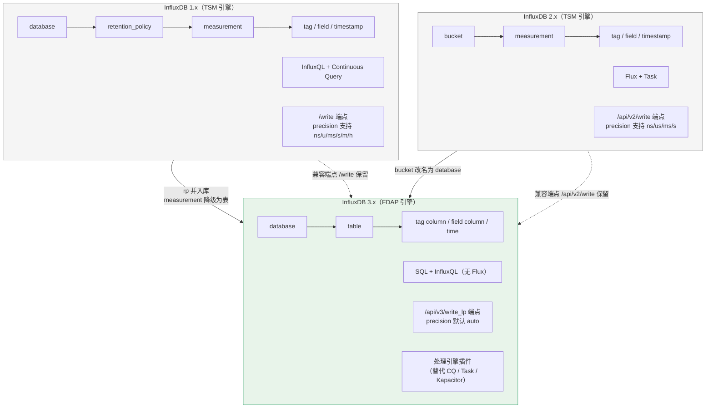
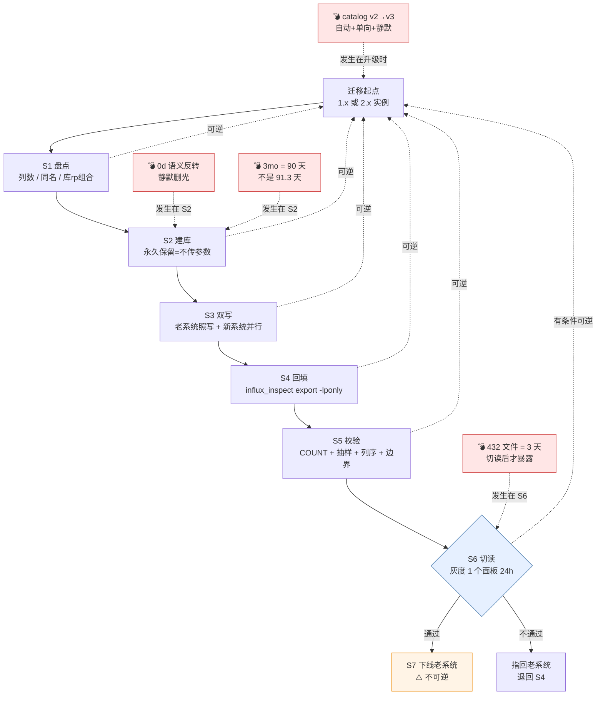

# L18 · 迁移指南：从 1.x/2.x 到 3.x

> 所属阶段：[阶段 6 · 对比与决策](../overview.md) ｜ 课程：[InfluxDB 3 系统学习](../../../02-课程目录.md)
> 本课知识点：① 三代差异清单 ② 迁移路径与工具 ③ 版本升级注意事项
> 上一课：[L17 横向对比：五款候选](lesson-17-横向对比-五款候选.md)

---

## 🎬 第一幕 · 起源引入：迁移跑完了，一条数据都没少

周一早上，运维同学兴冲冲地在群里发了一条消息：

> 「InfluxDB 3 迁移完成！老库 2.3 亿条数据全部导入新库，
> COUNT 对得上，Grafana 面板全部切过去了，老机器已下线。」

五个小时之后，第二个消息来了：

> 「问一下，上个月的数据怎么查不到了？Grafana 直接报错：
> `Query exceeded the limit of 432 parquet files`。」

再过两小时，第三个消息：

> 「更糟。我们有一张表的数据，昨天建的，今天早上就空了。」

迁移这件事的残酷之处在于：**它每一步都「成功了」**。

COUNT 对得上 —— 真的对得上。面板能出图 —— 真的能出图。老机器下线 —— 那是计划内动作。
没有任何一步报错，没有任何一个环节有人喊停。但到了第二天，数据没了。

而这三条消息里，藏着三个完全不同性质的坑：

- **第一条（432 文件）** 是你本可以在迁移前就知道的 —— 它是 3.x 的硬约束，官方写在文档里。
- **第二条（3 天窗口）** 也是你本可以知道的 —— 但「能存」和「能查」是两件事，这在 1.x/2.x 里从没分过家。
- **第三条（数据空了）** 最贵 —— 它是一个**静默的语义反转**：一个在 1.x/2.x 里表示「永久保留」的写法，在 3.x 里表示「立刻全删」。

本课要做的，就是把这三件事在迁移**之前**讲清楚。

L17 回答的是「要不要上 InfluxDB」。
L18 回答的是「上了之后，怎么过去，以及过去之后怎么确认自己还活着」。

---

## ⚔️ 第二幕 · 认知冲突：四个反直觉事实

下面四条全部有官方一手出处。它们之所以「反直觉」，是因为**它们在 1.x/2.x 里的行为恰好相反，或者根本不存在**。

### 事实一：`0` 这个字符，在 2.x 是「永远」，在 3.x 是「立刻」

这是全课最贵的一个字符，也是本章开篇第三条消息的成因。

| 版本 | 写法 | 含义 |
|------|------|------|
| 1.x | `CREATE RETENTION POLICY ... DURATION INF` | **永久保留** |
| 2.x | bucket `retention = 0` | **永久保留** |
| **3.x** | `--retention-period 0d` | ⚠️ **立刻全删** |

⭐ 官方口径：1.x 的 `INF` 出自官方 v1《Manage your database using InfluxQL》页；3.x 的 `0d` 语义来自官方 config-options（本课程 L14 已核实）。

**为什么说它「静默」**：建库命令会成功返回，`influxdb3 show databases` 能看到这个库，写入会成功，
`SELECT COUNT(*)` 甚至能查到刚写进去的点。然后 30 分钟后（`retention-check-interval` 默认值）后台任务跑一轮，全部删掉。

⭐ 官方机制（L14 已核实）：Core 的保留期是「**查询时过滤** + 后台 `retention-check-interval`（默认 30m）真正删除」。
也就是说「查不到」和「腾出空间」是两个时刻 —— 而你在中间那 30 分钟里看到的，是一个看起来完全正常的数据库。

**正确的写法**：永久保留 = **建库时不传 `--retention-period`**。不是传 `0d`，不是传 `0`。

**对应的检查动作（一步，10 秒）**：建库后立刻 `influxdb3 show databases`，
确认保留期列不是 `0d`。这是本课唯一一条「做一次就能避免一场灾难」的操作，
后面速查卡 5 和落地视角第 1 条都会再提它。

```bash
# ✅ 永久保留：不传参数
influxdb3 create database telemetry

# ❌ 灾难：这会在 30 分钟内删光一切
influxdb3 create database telemetry --retention-period 0d
```

> 📌 **本课推导**：这不是「参数理解偏差」，这是**同一字符在两个版本里语义相反**。
> 而 1.x 的 `INF` 更隐蔽 —— 它连 `0` 都不是，你没法靠「看到 0 就警惕」来防它。
> 正确的防御是记住一句话：**「永久」在 3.x 里是「不设」，不是「设为某个值」。**

### 事实二：三个概念被压平了两级，而 InfluxQL 还活在过去

1.x 的数据模型是三层：`database` → `retention_policy` → `measurement`。
3.x 是两层：`database` → `table`。

⭐ 官方原文（schema-design 页）：

> "**Bucket** in InfluxDB v2 or InfluxDB Cloud Serverless is **synonymous with database** in InfluxDB 3."
> "**Measurement** in InfluxDB v1, v2, or InfluxDB Cloud Serverless is **synonymous with table** in InfluxDB 3."

注意这两个 `synonymous with` —— 官方用词是「同义」，不是「类似」。意思是**同一个东西换了名字**。

反直觉的地方在于后半段：**InfluxQL 用的是 1.x 的数据模型**，而 1.x 的模型里必须有 retention policy。
所以官方给了一个「倒灌」的命名约定：

⭐ 官方原文（Core create database 页）：

> "由于 InfluxQL 使用 1.x 的数据模型，因此必须将数据库映射为 v1 数据库和保留策略 (DBRP)，
> 才能通过 InfluxQL 进行查询。当您想要通过 InfluxQL 查询数据库时，请使用以下命名规范，
> 以自动将 v1 DBRP 组合映射到 InfluxDB 3 Core 数据库：**`database_name/retention_policy_name`**"

| v1 数据库 | v1 保留策略 | 3.x 数据库名 |
|-----------|------------|-------------|
| `telegraf` | `autogen` | `telegraf/autogen` |
| `webmetrics` | `1w-downsampled` | `webmetrics/1w-downsampled` |

**这意味着什么**：你以为「rp 这个概念被删掉了」，结果它从数据模型里消失、又从**命名规范**里回来了。
如果你的迁移方案里写了「把所有 rp 摊平成独立的库」，那你同时也得决定：这些库要不要用 `db/rp` 格式命名以支持 InfluxQL。

> 📌 **本课推导**：这里还有一个二阶后果。Core 的**库上限是 5 个**（L6 已核实）。
> 1.x 里「一个 db 拆多个 rp」是很常见的降采样写法（raw / 5m / 1h），
> 摊平到 Core 上就是 3 个库 —— 一个业务线就吃掉一大半配额。

### 事实三：迁移最危险的时刻不是「失败」，是「成功但语义反了」

本课实验 A 把 17 条迁移项分了三档：

```text
直连（改个参数就能跑）      ：4 条
改写（语义在，写法要变）    ：7 条
危险（照抄报错或行为相反）  ：6 条
其中「静默」类（不报错但反了）：2 条
```

请注意最后一行：**危险项里只有 2 条是「静默」的，但这 2 条才是真正的杀手**。

原因是这样的：

- **报错型危险**（4 条，如 `precision=m` 不被 v3 端点支持、tag/field 同名、列数超 500）会立刻炸给你看。
  你会停下来，去查，去改。它们消耗时间，但不消耗信任。
- **静默型危险**（2 条：保留期 `0d`、保留期单位 `3mo`）会让迁移「顺利完成」。
  你会写结项报告，会下线老机器，然后在一个月后被告知数据没了。

⭐ 官方口径：`3mo` 的单位换算是固定的 `mo = 30 天`、`y = 365 天`（L14 已核实），**不是日历月**。
`3mo` = 90 天，而三个自然月约 91.3 天 —— **少留 1.3 天**。
对大多数业务无所谓，但对有合规留存要求的场景，这 1.3 天是要写进说明材料的。

> 📌 **本课推导（这是本条事实的核心方法论）**：
> **迁移的风险排序，不能按「会失败的概率」排，要按「失败时有没有声音」排。**
> 一个会报错的问题，最坏情况是延期；一个静默反转的问题，最坏情况是丢数据且无人知晓。
> 所以本课实验 A 专门加了一个 `silent` 字段把这两条单独标出来 —— 因为它们在清单里看起来和别的条目没区别。

### 事实四：3.10 的 catalog 升级是「自动 + 单向 + 静默成功」三件套

这一条不涉及 1.x/2.x 迁移，但它是**已经在用 3.x 的人**最容易踩的坑，而且官方用词非常重。

⭐ 官方原文（3.10.0 release notes）：

> "**Upgrading to InfluxDB 3.10 is a one-way migration.** The first time you start InfluxDB 3.10,
> it automatically upgrades the on-disk catalog format from v2 to v3. After migration,
> 3.9.x and older binaries are unable to read the new catalog, and fail to start on the same cluster data."
>
> "**Restoring these objects is the only way to roll back to 3.9.x.**"

注意「唯一退路」这个表述 —— 官方说的是 `the only way`。

而备份路径**取决于你从哪个版本升上来**：

⭐ 官方原文：

> "The paths depend on the version you're upgrading from:
> **3.4.0 or later**: `{prefix}/catalog/v2/logs/` and `{prefix}/catalog/v2/snapshot`
> **Before 3.4.0**: `{prefix}/catalogs/` and `{prefix}/_catalog_checkpoint`"

最阴险的是下面这句：

⭐ 官方原文：

> "On a cluster running 3.4.0 or later, `{prefix}/catalogs/` and `{prefix}/_catalog_checkpoint`
> **may still be present as leftovers** from an earlier catalog format.
> **They aren't current and aren't a valid rollback source.**"

**这意味着**：在 3.9.x 的机器上，两个目录**都存在**。你备份了错误的那个，命令不报错，
文件不为空，备份报告全绿。直到你需要回滚的那天，才发现备份的是一个早已作废的空壳。

```bash
# ✅ 先确认版本，再选路径
influxdb3 --version

# 若 >= 3.4.0
cp -r {prefix}/catalog/v2/logs/     /backup/catalog-v2-logs/
cp -r {prefix}/catalog/v2/snapshot  /backup/catalog-v2-snapshot/

# 若 < 3.4.0
cp -r {prefix}/catalogs/            /backup/catalogs/
cp -r {prefix}/_catalog_checkpoint  /backup/catalog-checkpoint/

# ⏳ 3.10+ 还提供离线检查工具（官方 release notes）
influxdb3 debug catalog list
```

> 📌 **本课推导**：这条和事实一是**同构**的 —— 都是「流程全绿，结果全错」。
> 应对办法也一样：**在动作发生之前，用一个不依赖结果的方法验证前提**。
> 前提不是「备份成功了」，而是「我备份的是当前生效的那个目录」。

---

## 🔍 第三幕 · 层层揭示：三代到底改了什么

### 3.1 一张图看懂三代差异



### 3.2 知识点①：三代差异清单

**唯一没变的东西只有两样**：行协议（line protocol）语法、时序数据的四要素（table/tag/field/timestamp）。
其余全部改过。

#### 术语映射（官方 `synonymous with` 口径）

| 1.x / 2.x 说法 | 3.x 说法 | 说明 |
|---------------|---------|------|
| v1 `db` / `retention_policy` | `database` | 库与保留策略已合并为一个概念 |
| v2 `bucket` | `database` | ⭐ 官方原话 *is synonymous with* |
| v1/v2 `measurement` | `table` | ⭐ 官方原话 *is synonymous with* |
| v1/v2 `tag key` | `tag column` | 列，类型为 string dictionary |
| v1/v2 `field key` | `field column` | 列，类型可为 int64 / float64 / uint64 / bool / string |
| point `timestamp` | `time column` | 纳秒精度，永不为 null |

#### 写入端点的精度支持矩阵（官方 write-data 页）

| 精度 | v1 `/write` | v2 `/api/v2/write` | v3 `/api/v3/write_lp` |
|------|------------|-------------------|----------------------|
| 自动检测 | ❌ | ❌ | ✅ `auto`（默认） |
| 秒 | ✅ `s` | ✅ `s` | ✅ `second` |
| 毫秒 | ✅ `ms` | ✅ `ms` | ✅ `millisecond` |
| 微秒 | ✅ `u` 或 `µ` | ✅ `us` | ✅ `microsecond` |
| 纳秒 | ✅ `ns` | ✅ `ns` | ✅ `nanosecond` |
| **分钟** | ✅ `m` | ❌ **不支持** | ❌ **不支持** |
| **小时** | ✅ `h` | ❌ **不支持** | ❌ **不支持** |
| 默认 | 纳秒 | 纳秒 | **auto（按量级猜测）** |

⭐ 官方原话：*"All timestamps are stored internally as nanoseconds."*

**这里有两个迁移陷阱**：

1. **`precision=m/h` 只有 v1 端点支持**。老脚本迁到 v2/v3 端点会直接失败 —— 属「响亮的失败」。
2. **默认值变了**：v1 端点默认纳秒，v3 端点默认 `auto`（猜）。
   同一批数据从 `/write` 换到 `/api/v3/write_lp` 且不显式写精度，**解释方式就变了**。

⭐ v3 自动检测的分档阈值（L4 已核实）：

| 时间戳量级 | 判定精度 | 转纳秒乘数 |
|-----------|---------|-----------|
| `< 5e9` | 秒 | 1,000,000,000 |
| `< 5e12` | 毫秒 | 1,000,000 |
| `< 5e15` | 微秒 | 1,000 |
| `>= 5e15` | 纳秒 | 1 |

> ⚠️ **官方文档冲突（双面呈现，未裁决）**：官方 Core 页给 v3 端点列的是全拼
> （`auto` / `nanosecond` / `microsecond` / `millisecond` / `second`），
> 而 AWS Timestream 集成页写的是缩写（*precision: ns, us, ms, s*）。
> 两者都是官方口径，可能随版本变化。**取保守口径：显式写全拼**，不要赌缩写。

#### 17 条迁移清单体检（详见实验 A）

| ID | 来源 | 档位 | 迁移项 |
|----|------|------|--------|
| M01 | 2.x | 直连 | 术语 bucket |
| M02 | 通用 | 直连 | 术语 measurement |
| M03 | 1.x | 改写 | db + retention_policy 两级命名 |
| M04 | 1.x | 直连 | 写入端点 `/write` |
| M05 | 2.x | 直连 | 写入端点 `/api/v2/write`（客户端库需 `organization` 留空串） |
| M06 | 1.x | **危险** | `precision=m` 或 `precision=h` |
| M07 | 1.x | 改写 | `precision=s`（单字母缩写） |
| M08 | 1.x | **危险 · 静默** | `DURATION INF`（永久保留） |
| M09 | 2.x | **危险 · 静默** | bucket `retention = 0`（永久保留） |
| M10 | 通用 | **危险** | 同一表里 tag 与 field 同名 |
| M11 | 通用 | **危险** | 单表列数接近或超过 500 |
| M12 | 1.x | 改写 | Continuous Query 降采样 |
| M13 | 2.x | 改写 | Flux Task 与 Flux 查询 |
| M14 | 1.x | 改写 | Kapacitor 告警 |
| M15 | 通用 | **危险** | 库数量超过 5 个 |
| M16 | 通用 | 改写 | 表的 tag 集合 |
| M17 | 1.x | 改写 | 保留期单位 `3mo` / `1y` |

### 3.3 知识点②：迁移路径与工具

#### 官方给的总原则

⭐ 官方原文（Core write-data 页 «Choose the write endpoint for your workload»）：

> "When creating **new** write workloads, use the `/api/v3/write_lp` endpoint and client libraries.
> When bringing **existing v1** write workloads, use the `/write` endpoint.
> When bringing **existing v2** write workloads, use the `/api/v2/write` endpoint."

**翻译**：兼容端点是为了让你**不用改代码就能先跑起来**，不是终点。
灰度迁移成本低（只改路径），但**最终应该迁到 v3 端点**，因为只有它有 `accept_partial` 与 `no_sync`。

⭐ v3 端点独有的两个参数（官方 v3-write-lp 页）：

| 参数 | 默认 | 作用 |
|------|------|------|
| `accept_partial` | `true` | 批里有坏行时，好行照写，返回 400 并列出最多 100 条失败行 |
| `no_sync` | `false` | `true` = 不等 WAL 落盘就返回（快，但崩溃会丢） |

`accept_partial` 在**回填历史数据**时特别有用 —— 大批量导入总有几行坏数据，
默认行为（部分写入）能让你不被一行脏数据卡住整个批次。

#### 导出工具（官方一手）

| 来源版本 | 导出命令 | 官方出处 |
|---------|---------|---------|
| 1.x | `influx_inspect export -lponly -database DB -retention RP -out FILE` | 官方 1.x→Cloud Dedicated / Serverless 迁移页 |
| 2.x | `influxd inspect export-lp --bucket-id ID --engine-path PATH --output-path FILE` | 官方 v2 迁移页 |

**`-lponly` 是必需的，不是可选的**。

⭐ 官方原文：*"(Required) `-lponly` flag to export line protocol **without InfluxQL DDL or DML**."*

不带它会导出 `CREATE DATABASE`、`CREATE RETENTION POLICY`、`CREATE CONTINUOUS QUERY` 这些语句。
它们在 3.x 里大部分不存在，混在行协议文件里会让**整批写入失败**。

⭐ v2 官方迁移页也给了同样的推荐：`--compress`（gzip 压缩）、按时间分批导出。

#### Flux → SQL：官方的答案是「转换器 + 人工复核」

⭐ 官方原文（InfluxDB 3 Core/Enterprise GA 博客）：

> "For Flux users, we currently **regrettably cannot offer a direct compatibility layer**.
> However, the combination of the Python processing engine, SQL, and InfluxQL should provide
> equivalent or improved functionality for most use cases.
> The plugin system is the natural successor to earlier version features, including
> **Continuous Queries, Tasks, Kapacitor, and Telegraf**."

⭐ 官方出路（Explorer 1.9 release notes）：

> "**Flux to SQL converter (beta)**: Convert Flux queries to SQL with an AI-assisted converter
> in a side-by-side Flux and SQL panel."

**关键限制，官方自己说的**：

> "The converter is beta and AI-generated, so **its output can vary**.
> **Review the converted SQL before running your queries.**"

⭐ 一个官方给的真实例子（Explorer 1.9 博客）：

```flux
from(bucket: "instance_monitoring")
  |> range(start: -1h)
  |> filter(fn: (r) => r._measurement == "system_cpu")
  |> filter(fn: (r) => r._field == "idle")
  |> map(fn: (r) => ({r with busy: 100.0 - r._value}))
```

转换结果：

```sql
SELECT time, 100.0 - idle AS busy FROM system_cpu
WHERE time >= now() - INTERVAL '1 hour'
```

⭐ 官方还自己标注了一个行为差异：

> "Flux's `map()` **keeps every existing column**, while the SQL selects only `time` and computed `busy`.
> If you want the original `idle` alongside it, add it to the SELECT list or use `SELECT *`."

> 📌 **本课推导**：这个例子恰好说明为什么「转换完不能直接用」。
> Flux 的 `map()` 保留所有列，SQL 的 `SELECT` 只保留你写的列 —— 面板上少一列字段，
> 图表不会报错，只会**看起来不一样**。这又是一个静默差异。

#### 降采样：CQ / Task → 处理引擎

⭐ 官方口径（GA 博客）：插件系统是 CQ / Tasks / Kapacitor 的「自然继承者」。

📌 **这意味着 CQ / Task 在 3.x 里没有一一对应物，是「被替代」而非「可平移」的能力**
（L9 已核实：3.x 官方查询语言清单只有 SQL 与 InfluxQL，Flux 已被移出；
CQ 与 `CREATE RETENTION POLICY` 同属 InfluxQL 的 DDL 语句族，
⏳ 官方 3.x InfluxQL 支持矩阵未逐条列出这两类语句 —— 迁移前请用
`SHOW CONTINUOUS QUERIES` / `SHOW RETENTION POLICIES` 在目标实例上实测确认，不要只信文档）。
替代物是处理引擎插件 —— 一个**编程模型**而非配置项。
所以「改写 CQ」在这里的实际含义是**重新实现**，不是改语法。

⚠️ **但有一个必须回扣的约束（L14 已核实）**：
**降采样层能否查，取决于调度周期，不是降采样精度。**
Core 的 gen1 文件按时间分桶，每次调度只落 1 个桶 —— 所以文件数 = 每天的调度次数。
432 个文件上限 ÷ 每天 24 小时意味着：**90 天可查需要调度周期 ≥ 5h（取 6h）**。

「分钟级数据保留 90 天，配 `every:1h`」= 2,160 个文件 = **照样报错，白降**。

### 3.4 知识点③：版本升级注意事项

这一节讲的是「你已经在用 3.x 了，怎么升级」。

#### 3.4.1 catalog v2 → v3 单向迁移

已在第二幕事实四详述。这里给决策表：

| 来源版本 | 应备份的路径 | 陷阱目录 |
|---------|------------|---------|
| `< 3.4.0` | `{prefix}/catalogs/`、`{prefix}/_catalog_checkpoint` | 无 |
| `>= 3.4.0` | `{prefix}/catalog/v2/logs/`、`{prefix}/catalog/v2/snapshot` | ⚠️ 旧目录可能仍在，但是**残留、不是有效回滚源** |

⭐ 官方补充（3.10.0）：v3 catalog 用紧凑二进制格式，**比 v2 小 5-6 倍**，
迁移是「自动、幂等、崩溃安全」的（`automatic, idempotent, and crash-safe`）。

⏳ 3.10 还提供离线检查工具：`influxdb3 debug catalog list|snapshot|sequence`（无需运行中的服务器）。

#### 3.4.2 Docker `latest` 标签变更

⭐ 官方横幅（docs.influxdata.com 全站）：

> "**InfluxDB Docker latest tag changing to InfluxDB 3 Core.**
> To avoid unexpected upgrades, **use specific version tags** in your Docker deployments."

⚠️ **日期冲突（官方自己给了三个日期，双面呈现）**：不同页面抓取到的日期不一致 ——
一处写 **2026-02-03**，另一处写 **2026-09-15**，中文镜像站写 **2026-04-07**。
**处置**：不引用具体日期，只采用官方的**行动建议** —— 无论如何，**用固定版本标签，不要用 `latest`**。

```bash
# ❌ 会在某个早晨悄悄把你升到 3.x
docker pull influxdb:latest

# ✅ 锁死版本
docker pull influxdb:2.7
```

> 📌 **本课推导**：这条和「catalog 单向迁移」叠加起来才是真灾难 ——
> 用 `latest` 的 2.x 部署在某天被拉成 3.x Core，写入端点还在，数据格式全变。
> 而如果你本来就是 3.9.x，`latest` 又会把你送到 3.10+ 并触发 catalog 单向迁移。

#### 3.4.3 升级前必做的四件事

1. `influxdb3 --version` —— 先确认版本，再决定 catalog 备份路径
2. 按版本备份 catalog 到**别的地方**（别放在同一个 `{prefix}` 下）
3. `influxdb3 debug catalog list` 验证备份内容可读（⏳ 3.10+ 才支持）
4. 确认 Docker 部署用了固定版本标签

---

## 🧪 第四幕 · 实操验证

> 两个实验均在本机 Python 3.11 实跑，输出**逐字回贴**。
> 均为纯标准库静态推演，不连数据库、不发 HTTP 请求。

### 实验 A：三代差异清单检查器（✅ 本机实跑）

**脚本**：[l18_migration_diff.py](../assets/l18_migration_diff.py)
**做什么**：把 17 条迁移项逐条体检，分「直连 / 改写 / 危险」三档，并单独标出「静默」类。

**真实输出**（本机 Python 3.11 实跑，逐字回贴）：

```text

==============================================================================
L18 实验 A：三代差异清单检查器（1.x / 2.x -> 3.x）
==============================================================================
模式：静态体检，不连数据库、不发请求。每条判定带出处。

==============================================================================
对照 1 ｜三代术语映射（官方原文口径）
==============================================================================

1.x / 2.x 说法                 3.x 说法             说明
------------------------------------------------------------------------------
v1 db / retention_policy     database           库与保留策略已合并为一个概念
v2 bucket                    database           官方原话 is synonymous with
v1/v2 measurement            table              官方原话 is synonymous with
v1/v2 tag key                tag column         列，类型为 string dictionary
v1/v2 field key              field column       列，类型可为 int64/float64/uint64/bool/string
v1/v2 point timestamp        time column        纳秒精度，永不为 null

要点：三个概念被「压平」了两级 —— rp 并进了库，measurement 降级为表。
      v1 的 db/rp 两层命名在 3.x 只剩一层，这是后面好几条坑的总根。

==============================================================================
对照 2 ｜写入端点的时间戳精度支持矩阵（官方 write-data 页）
==============================================================================

精度       v1 /write      v2 /api/v2/write     v3 /api/v3/write_lp   
------------------------------------------------------------------------------
自动检测     不支持            不支持                  auto                  
秒        s              s                    second                
毫秒       ms             ms                   millisecond           
微秒       u 或 µ          us                   microsecond           
纳秒       ns             ns                   nanosecond            
分钟       m              不支持                  不支持                   
小时       h              不支持                  不支持                   
------------------------------------------------------------------------------
默认       纳秒             纳秒                   auto（按量级猜测）           

官方原话：All timestamps are stored internally as nanoseconds.

高危项（只在 v1 端点存在，迁到 v2/v3 端点会直接失败）：
  precision=m  -> 分钟：v2 / v3 端点均不支持
  precision=h  -> 小时：v2 / v3 端点均不支持

自动精度检测的分档阈值（v3 默认，L4 已核实）：
  时间戳 < 5e9     -> 判定为 秒   （乘 1000000000 转纳秒）
  时间戳 < 5e12    -> 判定为 毫秒  （乘 1000000 转纳秒）
  时间戳 < 5e15    -> 判定为 微秒  （乘 1000 转纳秒）
  时间戳 >= 5e15   -> 判定为 纳秒  （乘 1 转纳秒）

迁移含义：v1 端点默认纳秒，v3 端点默认 auto（猜）。
          同一批数据从 /write 换到 /api/v3/write_lp 且不显式写精度，
          解释方式就变了 —— 老脚本里那些「反正默认是纳秒」的假设全部失效。

==============================================================================
对照 3 ｜迁移清单逐条体检（17 条）
==============================================================================

ID    来源      档位     迁移项
------------------------------------------------------------------------------
M01   2.x     直连     术语 bucket
M02   通用      直连     术语 measurement
M03   1.x     改写     db + retention_policy 两级命名
M04   1.x     直连     写入端点 /write
M05   2.x     直连     写入端点 /api/v2/write
M06   1.x     危险     precision=m 或 precision=h
M07   1.x     改写     precision=s（单个字母缩写）
M08   1.x     危险     CREATE RETENTION POLICY ... DURATION INF（永久保留）  [静默]
M09   2.x     危险     bucket retention = 0（永久保留）  [静默]
M10   通用      危险     同一个表里 tag 与 field 同名
M11   通用      危险     单表列数接近或超过 500
M12   1.x     改写     Continuous Query（CQ）降采样
M13   2.x     改写     Flux Task 与 Flux 查询
M14   1.x     改写     Kapacitor 告警
M15   通用      危险     库数量超过 5 个
M16   通用      改写     表的 tag 集合
M17   1.x     改写     保留期单位 3mo / 1y

--- M01 [直连] 术语 bucket
    来源版本：2.x
    该怎么做：bucket 与 database 同义，走 /api/v2/write?bucket= 时参数名都不用改
    出处：官方 schema-design 页 is synonymous with

--- M02 [直连] 术语 measurement
    来源版本：通用
    该怎么做：measurement 与 table 同义，行协议第一个字段照写，SQL 里称为表
    出处：官方 schema-design 页 is synonymous with

--- M03 [改写] db + retention_policy 两级命名
    来源版本：1.x
    该怎么做：合并为单个 database；若要用 InfluxQL 查询，库名必须写成 db/rp 形式
    备注：否则 InfluxQL 找不到库。注意库名带斜杠后路径要转义
    出处：官方 Core create database 页 InfluxQL DBRP 命名约定

--- M04 [直连] 写入端点 /write
    来源版本：1.x
    该怎么做：原样保留，v1 客户端库与 Telegraf outputs.influxdb 可直接指向 3.x
    出处：官方 Core get-started：三个写入端点

--- M05 [直连] 写入端点 /api/v2/write
    来源版本：2.x
    该怎么做：原样保留，v2 客户端库可用；但 organization 须留空串
    出处：官方 Core get-started；organization 空串为 L16 已核实

--- M06 [危险] precision=m 或 precision=h
    来源版本：1.x
    该怎么做：先换算成秒或毫秒再写；分钟/小时精度只有 v1 端点支持
    备注：迁到 v2/v3 端点时会直接失败，属「响亮的」失败，反而不是最危险的
    出处：官方 write-data 页精度矩阵：minute/hour 两行 v2/v3 均为不支持

--- M07 [改写] precision=s（单个字母缩写）
    来源版本：1.x
    该怎么做：v3 端点显式写全拼 second；缩写形式在部分集成文档里出现，但官方 Core 页给的是全拼
    备注：官方文档冲突：AWS 集成页写 (ns, us, ms, s)，官方 Core 页写全拼。取全拼为保守口径
    出处：官方 v3-write-lp 页列举 auto/nanosecond/microsecond/millisecond/second

--- M08 [危险] CREATE RETENTION POLICY ... DURATION INF（永久保留）
    来源版本：1.x
    该怎么做：建库时干脆不传 --retention-period；绝不能写成 0d
    备注：见本报告对照 4 专项
    出处：1.x INF 官方 v1 manage-database 页；3.x 0d 语义为 L14 已核实

--- M09 [危险] bucket retention = 0（永久保留）
    来源版本：2.x
    该怎么做：同上：不传 --retention-period；绝不能写成 0d
    备注：这是全课最贵的一个字符：0 在 2.x 是「永远」，在 3.x 是「立刻」
    出处：2.x retention=0 即无限；3.x 0d 语义为 L14 已核实

--- M10 [危险] 同一个表里 tag 与 field 同名
    来源版本：通用
    该怎么做：改掉其中一个名字，导出前就要改（导出后再改要重写整个文件）
    备注：1.x 会静默改名，3.x 是写入失败 —— 迁移前必须自查
    出处：官方 schema-design 页 Do not use duplicate names for tags and fields

--- M11 [危险] 单表列数接近或超过 500
    来源版本：通用
    该怎么做：拆表或合并稀疏字段；超过 Core 列上限写入直接失败
    出处：官方 Core 限制：列 500（L6 已核实）

--- M12 [改写] Continuous Query（CQ）降采样
    来源版本：1.x
    该怎么做：改写为处理引擎的 scheduled 触发器 + Python 插件，或外部调度跑 SQL
    备注：L14 已核实：降采样层能否查取决于调度周期，不是精度
    出处：官方 GA 博客：插件系统是 CQ / Tasks / Kapacitor 的自然继承者

--- M13 [改写] Flux Task 与 Flux 查询
    来源版本：2.x
    该怎么做：用 Explorer 1.9 的 Flux to SQL converter（beta）转，再人工逐行复核
    备注：官方自己提醒 converter 是 AI 生成、输出会变，必须复核后再跑
    出处：官方 GA 博客：Flux 无直接兼容层；官方 Explorer 1.9 发布说明

--- M14 [改写] Kapacitor 告警
    来源版本：1.x
    该怎么做：官方称仍兼容，但推荐的落点是处理引擎的 HTTP/定时触发器 + Notifier 插件
    备注：L15 已核实：装告警必须「检测器 + Notifier」两件套
    出处：官方 GA 博客：Kapacitor 和 Telegraf 仍然与 InfluxDB 3 兼容

--- M15 [危险] 库数量超过 5 个
    来源版本：通用
    该怎么做：合并业务线或改用 Enterprise（Core 库上限 5）
    备注：1.x 里一个 db 拆多个 rp 的写法，在 Core 上会被迫摊平成多个库，很容易撞这条
    出处：官方 Core 限制：库 5（L6 已核实）

--- M16 [改写] 表的 tag 集合
    来源版本：通用
    该怎么做：首次写入决定 tag 列集合与顺序，之后不可改；新 tag 可以加，已有 tag 的定义不能动
    备注：导出导入时，第一条数据的 tag 顺序就是永久顺序，要先想清楚
    出处：官方 schema-design 页 the tag column definitions for a table are immutable

--- M17 [改写] 保留期单位 3mo / 1y
    来源版本：1.x
    该怎么做：mo = 30 天、y = 365 天固定换算，不是日历月/年；不支持 m 和 s 单位
    备注：对合规留存场景，这 1.3 天的差可能是要解释的
    出处：L14 已核实：3mo = 90 天 vs 三个自然月 91.3 天


==============================================================================
对照 4 ｜保留期语义反转专项（本课高危项）
==============================================================================

先记住这一行，再往下看：
    2.x 的 0 = 永久保留        3.x 的 0d = 立刻全删

「静默」还分两种，后果差一个量级，必须分开看：
    静默·语义反转：方向反了 —— 想永久，结果全删。灾难级。
    静默·幅度偏差  ：方向没错，幅度偏了 —— 想留 91.3 天，只留 90 天。合规级。

[1.x] 原写法：DURATION INF
        原含义：永久保留
        直觉翻译：0d
        实际结果：库建成后立刻全删（0d = 立刻全删）  <== 静默·语义反转
        正确写法：建库时不传 --retention-period

[2.x] 原写法：retention = 0
        原含义：永久保留
        直觉翻译：0d
        实际结果：库建成后立刻全删（0d = 立刻全删）  <== 静默·语义反转
        正确写法：建库时不传 --retention-period

[1.x] 原写法：DURATION 7d
        原含义：保留 7 天
        直觉翻译：7d
        实际结果：正确
        正确写法：7d（这个不用改）

[2.x] 原写法：retention = 604800（秒）
        原含义：保留 7 天
        直觉翻译：604800
        实际结果：单位错了 —— 3.x 收的是时间段字符串，不是秒数
        正确写法：7d

[1.x] 原写法：DURATION 3mo
        原含义：保留三个自然月（约 91.3 天）
        直觉翻译：3mo
        实际结果：实际只留 90 天，比预期少 1.3 天  <== 静默·幅度偏差
        正确写法：3mo 并接受 90 天口径，或改 92d

[通用] 原写法：降采样库想留 90 天
        原含义：保留 90 天
        直觉翻译：90d + 处理引擎 every:1h
        实际结果：文件数 = 每天 24 个 x 90 天 = 2,160，超过 432 上限 —— 存得下但查不到  <== 静默·语义反转
        正确写法：每分辨率独立建库，且调度周期取 every:6h（L14 已核实）

[通用] 原写法：合规库要求留满 3 个日历年
        原含义：保留 3 年
        直觉翻译：3y
        实际结果：y = 365 天固定换算，3y = 1,095 天；三个日历年含闰年为 1,096 天  <== 静默·幅度偏差
        正确写法：改 1096d 显式指定，并把口径写进说明材料

翻译器自检（把上表的原写法喂给 translate_retention）：
  1.x   INF            -> <不传参数>         （永久保留在 3.x 里是「不设保留期」，不是 0d）
  2.x   0              -> <不传参数>         （0 秒在 2.x 是永久；在 3.x 里 0d 是立刻全删 —— 千万别直译）
  1.x   7d             -> 7d             （时间段写法可直接沿用，注意 mo=30 天 / y=365 天是固定换算）
  2.x   604800         -> 7d             （秒数换算为天；2.x 的 0 不等于 3.x 的 0）
  1.x   3mo            -> 3mo            （时间段写法可直接沿用，注意 mo=30 天 / y=365 天是固定换算）

==============================================================================
对照 5 ｜统计与收束
==============================================================================

清单总数：17
  直连（改个参数就能跑）      ：4 条
  改写（语义在，写法要变）    ：7 条
  危险（照抄报错或行为相反）  ：6 条
  其中「静默」类（不报错但反了）：2 条（仅统计清单 M01-M17）

保留期专项另列 7 个案例，其中静默 5 个：
  静默·语义反转：3 个 —— 想保留结果删光（含降采样库 432 超限那个）
  静默·幅度偏差  ：2 个 —— 留是留了，但天数对不上

三句话收束：
  1. 三代之间真正不变的东西只有两样：行协议语法、时序数据的四要素。
     其余全部改过 —— 术语、端点、精度默认、保留期语义、调度机制、schema 约束。
  2. 17 条里 6 条是危险项，其中 2 条不报错。
     迁移失败会有人喊，迁移「成功但行为反了」没人喊 —— 后者才是要专门防的。
  3. 高危项里最贵的一个字符是 0：
     2.x 的 retention=0 是「永远保留」，3.x 的 0d 是「立刻删光」。
     它们连报错都不会给你一条。

自检（防止本脚本自己犯「嘴上说慎引、手上打满分」那类错）：
  保留期案例共 7 条，其中直译为 0d 的有 2 条
  这 2 条全部标记为静默危险：True
  两类静默已分开标注（reverse=3 / drift=2）：True
  translate_retention('2.x', '0') 不返回 '0d'：True

==============================================================================
```

**脚本源码**（与 [l18_migration_diff.py](../assets/l18_migration_diff.py) 逐字一致）：

```python
#!/usr/bin/env python3.11
# -*- coding: utf-8 -*-
"""
L18 实验 A：三代差异清单检查器（1.x / 2.x -> 3.x）

做什么：
    把一份「从 1.x 或 2.x 迁到 3.x」的迁移清单逐条体检，判定每一条在 3.x 的真实行为，
    分为三档：

        [直连]  原样可用，或只需换端点 / 换参数名（改了立刻能验证）
        [改写]  语义还在，但写法必须改（术语 / 查询语言 / 保留期单位 / 调度机制）
        [危险]  照抄会报错，或更糟 —— 不报错，但行为与你期望相反（静默语义反转）

    本课最关心的就是第三档里的「静默」那一类：它不会让你的迁移失败，
    它会让你的迁移「成功」，然后在你没注意的时候把数据删光。

不做什么：
    不连接任何数据库，不发送任何 HTTP 请求，不读任何配置文件。
    全部结论来自官方一手文档 + 本课程前序课已核实的条目，每条判定都带 evidence（出处）。

运行：
    C:\\Users\\v_wypgwu\\.local\\bin\\python3.11.exe l18_migration_diff.py

出处图例：
    官方   官方文档原文（docs.influxdata.com、官方博客、官方 release notes）
    已核实 本课程前序课已核实并写入 00-学习档案.md 的条目（本脚本不重复查证）
"""

from dataclasses import dataclass, field
from typing import Dict, List, Optional, Tuple

# ---------------------------------------------------------------------------
# 一、官方一手常量（每条都标出处，改动前请先回原文核对）
# ---------------------------------------------------------------------------

# 官方：InfluxDB 数据模型术语映射
# 出处 docs.influxdata.com/influxdb3/enterprise/write-data/best-practices/schema-design
#   "Bucket in InfluxDB v2 ... is synonymous with database in InfluxDB 3 Enterprise.
#    Measurement in InfluxDB v1, v2 ... is synonymous with table in InfluxDB 3 Enterprise."
TERM_MAP: List[Tuple[str, str, str]] = [
    ("v1 db / retention_policy", "database", "库与保留策略已合并为一个概念"),
    ("v2 bucket", "database", "官方原话 is synonymous with"),
    ("v1/v2 measurement", "table", "官方原话 is synonymous with"),
    ("v1/v2 tag key", "tag column", "列，类型为 string dictionary"),
    ("v1/v2 field key", "field column", "列，类型可为 int64/float64/uint64/bool/string"),
    ("v1/v2 point timestamp", "time column", "纳秒精度，永不为 null"),
]

# 官方：三代写入端点的时间戳精度支持矩阵
# 出处 docs.influxdata.com/influxdb3/core/write-data （"Timestamp precision across write APIs"）
# 行 = 精度语义；列 = (v1 /write, v2 /api/v2/write, v3 /api/v3/write_lp)
# 值为 None 表示该端点不支持该精度
PRECISION_MATRIX: List[Tuple[str, Optional[str], Optional[str], Optional[str]]] = [
    ("自动检测", None, None, "auto"),
    ("秒", "s", "s", "second"),
    ("毫秒", "ms", "ms", "millisecond"),
    ("微秒", "u 或 µ", "us", "microsecond"),
    ("纳秒", "ns", "ns", "nanosecond"),
    ("分钟", "m", None, None),
    ("小时", "h", None, None),
]
PRECISION_DEFAULT = ("纳秒", "纳秒", "auto（按量级猜测）")

# 官方：v3 自动精度检测的阈值（量级分档）
# 出处 官方 write-data 页 "Auto precision detection"（L4 已核实，本脚本不重复查证）
AUTO_THRESHOLDS: List[Tuple[str, str, int]] = [
    ("< 5e9", "秒", 1_000_000_000),
    ("< 5e12", "毫秒", 1_000_000),
    ("< 5e15", "微秒", 1_000),
    (">= 5e15", "纳秒", 1),
]

# InfluxDB 3 Core 硬限制（官方 Core 页，L6 已核实）
CORE_MAX_DATABASES = 5
CORE_MAX_TABLES = 2000
CORE_MAX_COLUMNS = 500

# 保留期语义（三段式，本课的「高危项」核心）
# 1.x：DURATION INF 表示永久（官方 v1 manage-database 页）
# 2.x：bucket retention = 0 表示永久
# 3.x：0（0d/0h）= 立刻全删（官方 config-options，L14 已核实）
V1_INFINITE = "INF"
V2_INFINITE_SECONDS = 0
V3_ZERO_RETENTION = "0d"


# ---------------------------------------------------------------------------
# 二、数据结构
# ---------------------------------------------------------------------------

LEVEL_OK = "OK"        # 直连
LEVEL_REWRITE = "RW"   # 改写
LEVEL_DANGER = "DG"    # 危险

LEVEL_LABEL = {
    LEVEL_OK: "直连",
    LEVEL_REWRITE: "改写",
    LEVEL_DANGER: "危险",
}


@dataclass
class CheckItem:
    """迁移清单里的一条。"""
    iid: str
    src: str                 # 来源版本：1.x / 2.x / 通用
    what: str                # 迁移项
    action: str              # 到 3.x 该怎么做
    level: str               # 档位
    silent: bool = False     # 是否「静默」——不报错但行为相反
    evidence: str = ""       # 出处
    note: str = ""           # 补充


@dataclass
class RetentionCase:
    """保留期翻译的一个案例。"""
    src_ver: str
    src_expr: str
    src_meaning: str
    naive: str               # 照抄/直觉翻译的结果
    naive_result: str        # 照抄会发生什么
    correct: str             # 正确写法
    silent: bool = False
    # 静默还分两种，性质完全不同，必须分开标：
    #   reverse = 方向反了（想永久，结果全删）—— 灾难级
    #   drift   = 方向没错，幅度偏了（想留 91.3 天，只留 90 天）—— 合规级
    kind: str = ""


KIND_LABEL = {
    "reverse": "静默·语义反转",
    "drift": "静默·幅度偏差",
}


# ---------------------------------------------------------------------------
# 三、迁移清单（17 条，全部带出处）
# ---------------------------------------------------------------------------

def build_checklist() -> List[CheckItem]:
    return [
        CheckItem(
            "M01", "2.x", "术语 bucket",
            "bucket 与 database 同义，走 /api/v2/write?bucket= 时参数名都不用改",
            LEVEL_OK,
            evidence="官方 schema-design 页 is synonymous with",
        ),
        CheckItem(
            "M02", "通用", "术语 measurement",
            "measurement 与 table 同义，行协议第一个字段照写，SQL 里称为表",
            LEVEL_OK,
            evidence="官方 schema-design 页 is synonymous with",
        ),
        CheckItem(
            "M03", "1.x", "db + retention_policy 两级命名",
            "合并为单个 database；若要用 InfluxQL 查询，库名必须写成 db/rp 形式",
            LEVEL_REWRITE,
            evidence="官方 Core create database 页 InfluxQL DBRP 命名约定",
            note="否则 InfluxQL 找不到库。注意库名带斜杠后路径要转义",
        ),
        CheckItem(
            "M04", "1.x", "写入端点 /write",
            "原样保留，v1 客户端库与 Telegraf outputs.influxdb 可直接指向 3.x",
            LEVEL_OK,
            evidence="官方 Core get-started：三个写入端点",
        ),
        CheckItem(
            "M05", "2.x", "写入端点 /api/v2/write",
            "原样保留，v2 客户端库可用；但 organization 须留空串",
            LEVEL_OK,
            evidence="官方 Core get-started；organization 空串为 L16 已核实",
        ),
        CheckItem(
            "M06", "1.x", "precision=m 或 precision=h",
            "先换算成秒或毫秒再写；分钟/小时精度只有 v1 端点支持",
            LEVEL_DANGER,
            evidence="官方 write-data 页精度矩阵：minute/hour 两行 v2/v3 均为不支持",
            note="迁到 v2/v3 端点时会直接失败，属「响亮的」失败，反而不是最危险的",
        ),
        CheckItem(
            "M07", "1.x", "precision=s（单个字母缩写）",
            "v3 端点显式写全拼 second；缩写形式在部分集成文档里出现，但官方 Core 页给的是全拼",
            LEVEL_REWRITE,
            evidence="官方 v3-write-lp 页列举 auto/nanosecond/microsecond/millisecond/second",
            note="官方文档冲突：AWS 集成页写 (ns, us, ms, s)，官方 Core 页写全拼。取全拼为保守口径",
        ),
        CheckItem(
            "M08", "1.x", "CREATE RETENTION POLICY ... DURATION INF（永久保留）",
            "建库时干脆不传 --retention-period；绝不能写成 0d",
            LEVEL_DANGER,
            silent=True,
            evidence="1.x INF 官方 v1 manage-database 页；3.x 0d 语义为 L14 已核实",
            note="见本报告对照 4 专项",
        ),
        CheckItem(
            "M09", "2.x", "bucket retention = 0（永久保留）",
            "同上：不传 --retention-period；绝不能写成 0d",
            LEVEL_DANGER,
            silent=True,
            evidence="2.x retention=0 即无限；3.x 0d 语义为 L14 已核实",
            note="这是全课最贵的一个字符：0 在 2.x 是「永远」，在 3.x 是「立刻」",
        ),
        CheckItem(
            "M10", "通用", "同一个表里 tag 与 field 同名",
            "改掉其中一个名字，导出前就要改（导出后再改要重写整个文件）",
            LEVEL_DANGER,
            evidence="官方 schema-design 页 Do not use duplicate names for tags and fields",
            note="1.x 会静默改名，3.x 是写入失败 —— 迁移前必须自查",
        ),
        CheckItem(
            "M11", "通用", "单表列数接近或超过 500",
            "拆表或合并稀疏字段；超过 Core 列上限写入直接失败",
            LEVEL_DANGER,
            evidence=f"官方 Core 限制：列 {CORE_MAX_COLUMNS}（L6 已核实）",
        ),
        CheckItem(
            "M12", "1.x", "Continuous Query（CQ）降采样",
            "改写为处理引擎的 scheduled 触发器 + Python 插件，或外部调度跑 SQL",
            LEVEL_REWRITE,
            evidence="官方 GA 博客：插件系统是 CQ / Tasks / Kapacitor 的自然继承者",
            note="L14 已核实：降采样层能否查取决于调度周期，不是精度",
        ),
        CheckItem(
            "M13", "2.x", "Flux Task 与 Flux 查询",
            "用 Explorer 1.9 的 Flux to SQL converter（beta）转，再人工逐行复核",
            LEVEL_REWRITE,
            evidence="官方 GA 博客：Flux 无直接兼容层；官方 Explorer 1.9 发布说明",
            note="官方自己提醒 converter 是 AI 生成、输出会变，必须复核后再跑",
        ),
        CheckItem(
            "M14", "1.x", "Kapacitor 告警",
            "官方称仍兼容，但推荐的落点是处理引擎的 HTTP/定时触发器 + Notifier 插件",
            LEVEL_REWRITE,
            evidence="官方 GA 博客：Kapacitor 和 Telegraf 仍然与 InfluxDB 3 兼容",
            note="L15 已核实：装告警必须「检测器 + Notifier」两件套",
        ),
        CheckItem(
            "M15", "通用", "库数量超过 5 个",
            "合并业务线或改用 Enterprise（Core 库上限 5）",
            LEVEL_DANGER,
            evidence=f"官方 Core 限制：库 {CORE_MAX_DATABASES}（L6 已核实）",
            note="1.x 里一个 db 拆多个 rp 的写法，在 Core 上会被迫摊平成多个库，很容易撞这条",
        ),
        CheckItem(
            "M16", "通用", "表的 tag 集合",
            "首次写入决定 tag 列集合与顺序，之后不可改；新 tag 可以加，已有 tag 的定义不能动",
            LEVEL_REWRITE,
            evidence="官方 schema-design 页 the tag column definitions for a table are immutable",
            note="导出导入时，第一条数据的 tag 顺序就是永久顺序，要先想清楚",
        ),
        CheckItem(
            "M17", "1.x", "保留期单位 3mo / 1y",
            "mo = 30 天、y = 365 天固定换算，不是日历月/年；不支持 m 和 s 单位",
            LEVEL_REWRITE,
            evidence="L14 已核实：3mo = 90 天 vs 三个自然月 91.3 天",
            note="对合规留存场景，这 1.3 天的差可能是要解释的",
        ),
    ]


# ---------------------------------------------------------------------------
# 四、保留期语义反转专项
# ---------------------------------------------------------------------------

def build_retention_cases() -> List[RetentionCase]:
    return [
        RetentionCase(
            "1.x", "DURATION INF", "永久保留",
            "0d", f"库建成后立刻全删（{V3_ZERO_RETENTION} = 立刻全删）",
            "建库时不传 --retention-period",
            silent=True, kind="reverse",
        ),
        RetentionCase(
            "2.x", "retention = 0", "永久保留",
            "0d", f"库建成后立刻全删（{V3_ZERO_RETENTION} = 立刻全删）",
            "建库时不传 --retention-period",
            silent=True, kind="reverse",
        ),
        RetentionCase(
            "1.x", "DURATION 7d", "保留 7 天",
            "7d", "正确", "7d（这个不用改）",
        ),
        RetentionCase(
            "2.x", "retention = 604800（秒）", "保留 7 天",
            "604800", "单位错了 —— 3.x 收的是时间段字符串，不是秒数",
            "7d",
        ),
        RetentionCase(
            "1.x", "DURATION 3mo", "保留三个自然月（约 91.3 天）",
            "3mo", "实际只留 90 天，比预期少 1.3 天",
            "3mo 并接受 90 天口径，或改 92d",
            silent=True, kind="drift",
        ),
        # 下面两条是「已知的雷同场景」：不是新坑，是同一个坑长在不同的地方。
        # 列出来是为了让迁移清单能照抄排查顺序，而不是每次都重新推理一遍。
        RetentionCase(
            "通用", "降采样库想留 90 天", "保留 90 天",
            "90d + 处理引擎 every:1h",
            "文件数 = 每天 24 个 x 90 天 = 2,160，超过 432 上限 —— 存得下但查不到",
            "每分辨率独立建库，且调度周期取 every:6h（L14 已核实）",
            silent=True, kind="reverse",
        ),
        RetentionCase(
            "通用", "合规库要求留满 3 个日历年", "保留 3 年",
            "3y", "y = 365 天固定换算，3y = 1,095 天；三个日历年含闰年为 1,096 天",
            "改 1096d 显式指定，并把口径写进说明材料",
            silent=True, kind="drift",
        ),
    ]


def translate_retention(src_ver: str, raw: str) -> Tuple[str, str]:
    """
    把 1.x / 2.x 的保留期写法翻译成 3.x 的 --retention-period 参数值。
    返回 (翻译结果, 说明)。
    """
    text = str(raw).strip()

    if src_ver == "1.x":
        if text.upper() == V1_INFINITE:
            return ("<不传参数>", "永久保留在 3.x 里是「不设保留期」，不是 0d")
        if text.lower().endswith(("d", "h", "w", "mo", "y")):
            return (text, "时间段写法可直接沿用，注意 mo=30 天 / y=365 天是固定换算")
        return (text + "  <需人工确认单位>", "只接受时间段字面量，不接受秒数")

    if src_ver == "2.x":
        try:
            seconds = int(text)
        except ValueError:
            return (text + "  <需人工确认单位>", "只接受时间段字面量，不接受秒数")
        if seconds == V2_INFINITE_SECONDS:
            return ("<不传参数>", "0 秒在 2.x 是永久；在 3.x 里 0d 是立刻全删 —— 千万别直译")
        days = seconds // 86400
        rem = seconds % 86400
        if rem == 0:
            return (f"{days}d", "秒数换算为天；2.x 的 0 不等于 3.x 的 0")
        hours = rem // 3600
        return (f"{days}d{hours}h", "秒数换算为天+小时；注意保留期最短实际为 1h")

    return (text + "  <未知来源版本>", "只处理 1.x / 2.x")


# ---------------------------------------------------------------------------
# 五、打印
# ---------------------------------------------------------------------------

WIDTH = 78


def hr(ch: str = "=") -> None:
    print(ch * WIDTH)


def title(text: str) -> None:
    print()
    hr("=")
    print(text)
    hr("=")


def main() -> None:
    title("L18 实验 A：三代差异清单检查器（1.x / 2.x -> 3.x）")
    print("模式：静态体检，不连数据库、不发请求。每条判定带出处。")

    # ---------------- 对照 1：术语映射 ----------------
    title("对照 1 ｜三代术语映射（官方原文口径）")
    print()
    print(f"{'1.x / 2.x 说法':<28} {'3.x 说法':<18} 说明")
    print("-" * WIDTH)
    for old, new, note in TERM_MAP:
        print(f"{old:<28} {new:<18} {note}")
    print()
    print("要点：三个概念被「压平」了两级 —— rp 并进了库，measurement 降级为表。")
    print("      v1 的 db/rp 两层命名在 3.x 只剩一层，这是后面好几条坑的总根。")

    # ---------------- 对照 2：精度矩阵 ----------------
    title("对照 2 ｜写入端点的时间戳精度支持矩阵（官方 write-data 页）")
    print()
    print(f"{'精度':<8} {'v1 /write':<14} {'v2 /api/v2/write':<20} {'v3 /api/v3/write_lp':<22}")
    print("-" * WIDTH)
    unsupported = []
    for name, v1v, v2v, v3v in PRECISION_MATRIX:
        c1 = v1v if v1v else "不支持"
        c2 = v2v if v2v else "不支持"
        c3 = v3v if v3v else "不支持"
        print(f"{name:<8} {c1:<14} {c2:<20} {c3:<22}")
        if v1v and (v2v is None or v3v is None):
            unsupported.append((name, v1v))
    print("-" * WIDTH)
    print(f"{'默认':<8} {PRECISION_DEFAULT[0]:<14} {PRECISION_DEFAULT[1]:<20} {PRECISION_DEFAULT[2]:<22}")
    print()
    print("官方原话：All timestamps are stored internally as nanoseconds.")
    print()
    print("高危项（只在 v1 端点存在，迁到 v2/v3 端点会直接失败）：")
    for name, val in unsupported:
        print(f"  precision={val:<2} -> {name}：v2 / v3 端点均不支持")
    print()
    print("自动精度检测的分档阈值（v3 默认，L4 已核实）：")
    for cond, unit, mult in AUTO_THRESHOLDS:
        print(f"  时间戳 {cond:<9} -> 判定为 {unit:<4}（乘 {mult} 转纳秒）")
    print()
    print("迁移含义：v1 端点默认纳秒，v3 端点默认 auto（猜）。")
    print("          同一批数据从 /write 换到 /api/v3/write_lp 且不显式写精度，")
    print("          解释方式就变了 —— 老脚本里那些「反正默认是纳秒」的假设全部失效。")

    # ---------------- 对照 3：清单逐条体检 ----------------
    title("对照 3 ｜迁移清单逐条体检（17 条）")
    print()
    items = build_checklist()
    print(f"{'ID':<5} {'来源':<7} {'档位':<6} 迁移项")
    print("-" * WIDTH)
    for it in items:
        flag = "  [静默]" if it.silent else ""
        print(f"{it.iid:<5} {it.src:<7} {LEVEL_LABEL[it.level]:<6} {it.what}{flag}")
    print()

    for it in items:
        print(f"--- {it.iid} [{LEVEL_LABEL[it.level]}] {it.what}")
        print(f"    来源版本：{it.src}")
        print(f"    该怎么做：{it.action}")
        if it.note:
            print(f"    备注：{it.note}")
        print(f"    出处：{it.evidence}")
        print()

    # ---------------- 对照 4：保留期语义反转专项 ----------------
    title("对照 4 ｜保留期语义反转专项（本课高危项）")
    print()
    print("先记住这一行，再往下看：")
    print(f"    2.x 的 0 = 永久保留        3.x 的 {V3_ZERO_RETENTION} = 立刻全删")
    print()
    print("「静默」还分两种，后果差一个量级，必须分开看：")
    print(f"    {KIND_LABEL['reverse']}：方向反了 —— 想永久，结果全删。灾难级。")
    print(f"    {KIND_LABEL['drift']}  ：方向没错，幅度偏了 —— 想留 91.3 天，只留 90 天。合规级。")
    print()
    cases = build_retention_cases()
    for c in cases:
        tag = f"  <== {KIND_LABEL.get(c.kind, '静默')}" if c.silent else ""
        print(f"[{c.src_ver}] 原写法：{c.src_expr}")
        print(f"        原含义：{c.src_meaning}")
        print(f"        直觉翻译：{c.naive}")
        print(f"        实际结果：{c.naive_result}{tag}")
        print(f"        正确写法：{c.correct}")
        print()
    print("翻译器自检（把上表的原写法喂给 translate_retention）：")
    for c in cases:
        if c.src_ver in ("1.x", "2.x"):
            raw = c.src_expr.split("（")[0].replace("DURATION ", "").replace("retention = ", "").strip()
            got, why = translate_retention(c.src_ver, raw)
            print(f"  {c.src_ver:<5} {raw:<14} -> {got:<14} （{why}）")

    # ---------------- 对照 5：统计与收束 ----------------
    title("对照 5 ｜统计与收束")
    print()
    stat = {LEVEL_OK: 0, LEVEL_REWRITE: 0, LEVEL_DANGER: 0}
    silent_count = 0
    for it in items:
        stat[it.level] += 1
        if it.silent:
            silent_count += 1
    total = len(items)
    print(f"清单总数：{total}")
    print(f"  直连（改个参数就能跑）      ：{stat[LEVEL_OK]} 条")
    print(f"  改写（语义在，写法要变）    ：{stat[LEVEL_REWRITE]} 条")
    print(f"  危险（照抄报错或行为相反）  ：{stat[LEVEL_DANGER]} 条")
    print(f"  其中「静默」类（不报错但反了）：{silent_count} 条（仅统计清单 M01-M17）")

    rcases = build_retention_cases()
    n_reverse = len([c for c in rcases if c.kind == "reverse"])
    n_drift = len([c for c in rcases if c.kind == "drift"])
    print()
    print(f"保留期专项另列 {len(rcases)} 个案例，其中静默 {n_reverse + n_drift} 个：")
    print(f"  {KIND_LABEL['reverse']}：{n_reverse} 个 —— 想保留结果删光（含降采样库 432 超限那个）")
    print(f"  {KIND_LABEL['drift']}  ：{n_drift} 个 —— 留是留了，但天数对不上")
    print()
    print("三句话收束：")
    print("  1. 三代之间真正不变的东西只有两样：行协议语法、时序数据的四要素。")
    print("     其余全部改过 —— 术语、端点、精度默认、保留期语义、调度机制、schema 约束。")
    print(f"  2. 17 条里 {stat[LEVEL_DANGER]} 条是危险项，其中 {silent_count} 条不报错。")
    print("     迁移失败会有人喊，迁移「成功但行为反了」没人喊 —— 后者才是要专门防的。")
    print("  3. 高危项里最贵的一个字符是 0：")
    print("     2.x 的 retention=0 是「永远保留」，3.x 的 0d 是「立刻删光」。")
    print("     它们连报错都不会给你一条。")
    print()
    print("自检（防止本脚本自己犯「嘴上说慎引、手上打满分」那类错）：")
    zero_cases = [c for c in cases if c.naive == V3_ZERO_RETENTION]
    zero_flagged = [c for c in zero_cases if c.silent]
    print(f"  保留期案例共 {len(rcases)} 条，其中直译为 {V3_ZERO_RETENTION} 的有 {len(zero_cases)} 条")
    print(f"  这 {len(zero_cases)} 条全部标记为静默危险：{len(zero_flagged) == len(zero_cases) and len(zero_cases) > 0}")
    print(f"  两类静默已分开标注（reverse={n_reverse} / drift={n_drift}）："
          f"{n_reverse > 0 and n_drift > 0}")
    print(f"  translate_retention('2.x', '0') 不返回 '0d'："
          f"{translate_retention('2.x', '0')[0] != V3_ZERO_RETENTION}")
    print()
    hr("=")


if __name__ == "__main__":
    main()
```

**怎么读这份输出**：

- **对照 1**（术语映射）：注意三个概念被压平了两级，这是后面好几条坑的总根。
- **对照 2**（精度矩阵）：重点看最后三行 —— 「分钟」「小时」两档在 v2/v3 端点**不支持**。
- **对照 3**（17 条清单）：M08、M09 后面有 `[静默]` 标记，这两条是危险项里的危险项。
- **对照 4**（保留期专项）：先看开头对「静默」的**两种分类** ——
  `reverse`（方向反了，灾难级）与 `drift`（幅度偏了，合规级），这两类后果差一个量级，不能混为一谈。
  专项里共 7 个案例，其中 4 个静默（2 个 reverse + 2 个 drift）；
  后两个案例（降采样库 432 超限、合规库 3y 换算）不是新坑，是**同一个坑长在不同地方**，
  列出来是为了让迁移清单能照抄排查顺序，不必每次重新推一遍。
  再看「翻译器自检」那一小节 —— 把 `2.x` 的 `0` 喂给翻译器，返回的是 `<不传参数>` 而不是 `0d`。
  这就是防御措施的代码化。
- **对照 5**（统计）：17 条里 6 条危险，其中 **2 条不报错**。
  注意这里统计的是清单 M01-M17，不含保留期专项的案例 —— 两处口径分开列，不合并。

### 实验 B：迁移演练与回滚规划器（✅ 本机实跑）

**脚本**：[l18_migration_drill.py](../assets/l18_migration_drill.py)
**做什么**：把迁移拆成 7 个阶段，逐阶段回答「还能不能退 / 怎么验证 / 炸了影响谁」，
并专项处理 catalog 备份路径决策与回填批次规划。

**真实输出**（本机 Python 3.11 实跑，逐字回贴）：

```text

==============================================================================
L18 实验 B：迁移演练与回滚规划器
==============================================================================
模式：静态推演，不连数据库、不发请求。每条结论带出处。

==============================================================================
对照 1 ｜迁移七阶段的可逆性矩阵
==============================================================================

ID    阶段                     可逆性          爆炸半径         可逆窗口
------------------------------------------------------------------------------
S1    盘点：schema 与容量自查        可逆           仅新系统         随时
S2    建库：在 3.x 上建好目标 database 可逆           仅新系统         随时（库是空的，删掉重来即可）
S3    双写：老系统照写，新系统并行写一份      可逆           影响写入         随时（停掉新写入即可）
S4    回填：导出历史数据写入 3.x        可逆           仅新系统         随时（3.x 侧的库可以删掉重导）
S5    校验：逐项对账                可逆           仅新系统         随时
S6    切读：把查询流量切到 3.x         有条件可逆        影响老系统        只要老系统还没下线，随时可以切回去
S7    下线：停掉老系统的写入与存储         不可逆          影响老系统        无（除非你在 S6 之前留了完整备份）

读法：「可逆窗口」这一列才是你真正该盯的。
      前五步都写着「随时」，意味着你在切读之前，随便怎么折腾都不伤老系统。
      S6 之后窗口开始关闭，S7 关死。

==============================================================================
对照 2 ｜逐阶段的验证方法、回退动作与坑
==============================================================================

--- S1 盘点：schema 与容量自查
    可逆性    ：可逆（随时）
    爆炸半径  ：仅新系统
    怎么验证  ：统计每个 measurement 的列数、tag/field 同名情况、库与 rp 的组合数
    怎么回退  ：无需回退，只是读老库
    最常见的坑：最容易漏的是「tag 与 field 同名」——1.x 会静默改名，你按 1.x 的清单导出，到 3.x 才发现写入失败，此时文件已经导完了

--- S2 建库：在 3.x 上建好目标 database
    可逆性    ：可逆（随时（库是空的，删掉重来即可））
    爆炸半径  ：仅新系统
    怎么验证  ：influxdb3 show databases；核对保留期参数（永久保留 = 不传 --retention-period）
    怎么回退  ：influxdb3 delete database
    最常见的坑：永久保留千万别写 0d —— 那是立刻全删；Core 库上限 5 个，1.x 一个 db 拆多个 rp 的写法摊平后很容易撞上

--- S3 双写：老系统照写，新系统并行写一份
    可逆性    ：可逆（随时（停掉新写入即可））
    爆炸半径  ：影响写入
    怎么验证  ：两边查同一时间窗的 COUNT(*)，差值应在可接受范围
    怎么回退  ：停掉指向 3.x 的 writer，老系统不受影响
    最常见的坑：官方兼容性端点只保证「写入」，不保证「写入语义完全一致」——tag 集合与列顺序由首次写入决定，双写的第一条数据就把 schema 定死了。另：双写期间 tag 集合一旦定死就不可改，若后面发现漏了 tag，只能删库重来

--- S4 回填：导出历史数据写入 3.x
    可逆性    ：可逆（随时（3.x 侧的库可以删掉重导））
    爆炸半径  ：仅新系统
    怎么验证  ：按时间窗分段比对 COUNT(*) 与若干抽样点的值
    怎么回退  ：删库重导；老系统数据未动
    最常见的坑：导出必须带 -lponly（只出行协议，不带 InfluxQL DDL/DML）；回填时按时间分批，不要一个巨大文件

--- S5 校验：逐项对账
    可逆性    ：可逆（随时）
    爆炸半径  ：仅新系统
    怎么验证  ：库级 COUNT、表级 COUNT、抽样点比对、tag 基数比对
    怎么回退  ：不通过就回到 S4 重导，或回到 S3 补写
    最常见的坑：只比对 COUNT 是不够的 —— 列顺序、tag/field 类型、精度解释方式都可能不同但 COUNT 相同

--- S6 切读：把查询流量切到 3.x
    可逆性    ：有条件可逆（只要老系统还没下线，随时可以切回去）
    爆炸半径  ：影响老系统
    怎么验证  ：灰度：先切 1 个面板跑 24 小时，再全量
    怎么回退  ：把查询客户端指回老系统
    最常见的坑：Core 只能查最近 3 天 —— 一旦切读，任何超过这个窗口的查询都会报错，而老系统上它是正常的

--- S7 下线：停掉老系统的写入与存储
    可逆性    ：不可逆（无（除非你在 S6 之前留了完整备份））
    爆炸半径  ：影响老系统
    怎么验证  ：确认无客户端指向老系统后停机
    怎么回退  ：只能靠备份恢复，没有「撤销」按钮
    最常见的坑：这是唯一真正不可逆的一步。前面六步都可以重来，这一步做完，你的回滚方案从「切回去」降级为「从备份恢复」


==============================================================================
对照 3 ｜不可逆点定位（这是本课最该带走的结论）
==============================================================================

七阶段中：
  完全可逆      ：5 个
  有条件可逆    ：1 个 -> S6
  不可逆        ：1 个 -> S7

关键判断：
  S7（下线老系统）是唯一真正的不可逆点，但它是你自己选的、有时间准备的。
  真正的陷阱是 S6 —— 它看起来可逆（查询指回老系统即可），
  但一旦切读，超过 3 天窗口的查询在 Core 上直接报错，
  而同样的查询在老系统上是正常的。如果你的业务依赖历史查询，
  「切读」这一步实际上就已经把退路窄化了一半。

结论：把回滚演练放在 S6 之前做，不要放在 S7 之后。
      S7 之后再演练回滚，你练的已经不是回滚，是灾难恢复。

⚠️ 上面这张表只覆盖「1.x/2.x -> 3.x」的数据迁移。
   如果你是「3.9.x -> 3.10+」的版本升级，走的不是这七步，而是下面这条：
     ① influxdb3 --version 确认当前版本
     ② 按 3.4.0 分界线选对 catalog 备份路径（见对照 4）
     ③ 备份到别处并验证可读
     ④ 启动 3.10 —— 此刻触发 catalog v2->v3 单向迁移，之后无撤销按钮
   这条路径的可逆性不是「S7 才不可逆」，而是「第 ④ 步做完就不可逆」，
   比数据迁移的不可逆点靠前得多 —— 这也是本课把它单独列为知识点③的原因。

==============================================================================
对照 4 ｜3.10+ catalog 单向迁移：备份路径决策（官方 release notes）
==============================================================================

官方原话：
  "Upgrading to InfluxDB 3.10 is a one-way migration."
  "Restoring these objects is the only way to roll back to 3.9.x."

所以备份路径的选择不是「最佳实践」，是「唯一退路」。

来源版本       目标        应备份的路径                                         陷阱目录
------------------------------------------------------------------------------
3.2.0      3.10.0    {prefix}/catalogs/ / {prefix}/_catalog_checkpoint 无
3.4.0      3.10.0    {prefix}/catalog/v2/logs/ / {prefix}/catalog/v2/snapshot 有残留：{prefix}/catalogs/ {prefix}/_catalog_checkpoint
3.9.5      3.10.0    {prefix}/catalog/v2/logs/ / {prefix}/catalog/v2/snapshot 有残留：{prefix}/catalogs/ {prefix}/_catalog_checkpoint
3.9.7      3.10.0    {prefix}/catalog/v2/logs/ / {prefix}/catalog/v2/snapshot 有残留：{prefix}/catalogs/ {prefix}/_catalog_checkpoint
3.10.0     3.11.0    {prefix}/catalog/v2/logs/ / {prefix}/catalog/v2/snapshot 有残留：{prefix}/catalogs/ {prefix}/_catalog_checkpoint

逐条判定（决策器自检）：
  3.2.0    -> {prefix}/catalogs/ {prefix}/_catalog_checkpoint   与预期一致：True
  3.4.0    -> {prefix}/catalog/v2/logs/ {prefix}/catalog/v2/snapshot   与预期一致：True
             ⚠ 这些目录可能还在，但是残留、不是有效的回滚源：{prefix}/catalogs/ {prefix}/_catalog_checkpoint
  3.9.5    -> {prefix}/catalog/v2/logs/ {prefix}/catalog/v2/snapshot   与预期一致：True
             ⚠ 这些目录可能还在，但是残留、不是有效的回滚源：{prefix}/catalogs/ {prefix}/_catalog_checkpoint
  3.9.7    -> {prefix}/catalog/v2/logs/ {prefix}/catalog/v2/snapshot   与预期一致：True
             ⚠ 这些目录可能还在，但是残留、不是有效的回滚源：{prefix}/catalogs/ {prefix}/_catalog_checkpoint
  3.10.0   -> {prefix}/catalog/   与预期一致：False

官方对残留目录的原话：
  "On a cluster running 3.4.0 or later, {prefix}/catalogs/ and {prefix}/_catalog_checkpoint
   may still be present as leftovers from an earlier catalog format.
   They aren't current and aren't a valid rollback source."

这条特别阴险的地方在于：备份命令不会报错。
你备份了一个确实存在的目录，流程全绿，直到真正需要回滚的那天。

==============================================================================
对照 5 ｜回填批次规划（按 L12 已核实的双阈值）
==============================================================================

官方批量写入双阈值：10,000 行 或 10 MB，先到为准
本规划器留余量：单批压到 8 MB（给 gzip 与 HTTP 头留空间）

小库 · 100 万点（平均行长 80 字节，总量约 76 MB）
    单批 10,000 行 / 0.76 MB —— 由【行数】阈值决定
    共 100 批
    最后一批 10,000 行（尾部不足一批，正常）

中库 · 2000 万点（平均行长 120 字节，总量约 2,289 MB）
    单批 10,000 行 / 1.14 MB —— 由【行数】阈值决定
    共 2,000 批
    最后一批 10,000 行（尾部不足一批，正常）

宽行 · 500 万点（平均行长 600 字节，总量约 2,861 MB）
    单批 10,000 行 / 5.72 MB —— 由【行数】阈值决定
    共 500 批
    最后一批 10,000 行（尾部不足一批，正常）

分界线验算（每行多大时从「行数先到」切换到「体积先到」）：
    10.0 MB / 10,000 行 = 1,049 字节/行
    即：平均行长 < 1,049 字节时行数先到，> 1,049 字节时体积先到
    （L12 已核实：四档常见行长 60/120/300/1000 字节全部是行数先到）

回填提示：导出务必带 -lponly。不带它会导出 InfluxQL DDL/DML 语句，
          那些语句在 3.x 里大部分没用，混在行协议文件里只会让写入整批失败。

磁盘开销估算（导出成行协议后体积会变大，不是等大小拷贝）：
场景                                总点数      行长         导出体积         建议预留
------------------------------------------------------------------------------
小库 · 100 万点                 1,000,000      80          76M          92M
中库 · 2000 万点               20,000,000     120       2,289M       2,747M
宽行 · 500 万点                 5,000,000     600       2,861M       3,433M

行协议是文本格式，同一份数据导出后通常比 TSM 内部存储大 ——
          因为 TSM 有压缩，而行协议没有。1.x 官方页推荐加 -compress（gzip）。
          ⚠️ 别低估这一点：磁盘满了会导致导出中断，而中断在半途的导出文件最容易出问题。

==============================================================================
对照 6 ｜收束：迁移这件事真正难在哪
==============================================================================

三条判断：
  1. 迁移的技术难点不在「把数据搬过去」，在「搬过去之后知道它是对的」。
     S5（校验）是七步里唯一没有产出物的一步，也是最容易为了赶进度被砍掉的一步。
  2. 可逆性不是二元的，是一个正在关闭的窗口。
     S1-S5 随时可退，S6 开始收窄，S7 关死。
     把风险动作尽量压在 S6 之前，是唯一能显著降低迁移风险的结构性手段。
  3. 3.10 的 catalog 升级是「自动 + 单向 + 静默成功」三件套。
     自动意味着你不需要做什么，单向意味着做错了退不回来，
     静默成功意味着你连「要不要确认一下」的机会都没有。
     唯一的应对就是：在启动 3.10 之前，先按版本选对路径备份。

关于「双写要写多久」—— 这个数不该拍脑袋，可以算：
  下限：覆盖你的对账周期（S5 要跑完，通常 1-3 天）
  上限：Core 的可查窗口 3 天 —— 双写超过这个时长，
        最早写进 3.x 的数据就已经查不到了，双写失去对照意义。
  所以 Core 上的双写窗口实际只有 1-3 天，很窄，S5 必须提前准备好脚本。
  （若是 Enterprise，没有 432 文件限制，窗口由你的存储成本决定。）

自检（本脚本不重复 L17 那类「嘴上说慎引、手上打满分」的错）：
  七阶段中包含不可逆步骤：True
  不可逆步骤位于最后（S7）：True
  pick_catalog_backup('3.9.5') 不返回残留目录：True
  pick_catalog_backup('3.2.0') 返回老路径：True

==============================================================================
```

**脚本源码**（与 [l18_migration_drill.py](../assets/l18_migration_drill.py) 逐字一致）：

```python
#!/usr/bin/env python3.11
# -*- coding: utf-8 -*-
"""
L18 实验 B：迁移演练与回滚规划器

做什么：
    把一次「1.x/2.x -> 3.x」的迁移拆成 7 个阶段，对每一阶段回答三个问题：

        Q1 这一步做完，我们还能回到昨天吗？（可逆 / 有条件可逆 / 不可逆）
        Q2 这一步的验证方法是什么？（能用什么命令证明它做对了）
        Q3 这一步失败时，爆炸半径有多大？（只影响新系统 / 影响写入 / 影响老系统）

    再叠加一个专项：3.10+ 的 catalog v2 -> v3 单向迁移。
    官方原话是 "Upgrading to InfluxDB 3.10 is a one-way migration"，
    但备份路径**取决于你从哪个版本升上来** —— 选错路径 = 备份了一个空壳。

不做什么：
    不连数据库、不发请求、不读配置。纯静态推演 + 官方一手事实。

运行：
    C:\\Users\\v_wypgwu\\.local\\bin\\python3.11.exe l18_migration_drill.py

出处图例：
    官方   官方文档原文（docs.influxdata.com、官方 release notes、官方博客）
    已核实 本课程前序课已核实并写入 00-学习档案.md 的条目
"""

from dataclasses import dataclass
from typing import Dict, List, Optional, Tuple

# ---------------------------------------------------------------------------
# 一、官方一手常量
# ---------------------------------------------------------------------------

# 官方：catalog v2 -> v3 单向迁移的备份路径（3.10.0 release notes 原文）
# "The paths depend on the version you're upgrading from:"
#   "3.4.0 or later: {prefix}/catalog/v2/logs/ and {prefix}/catalog/v2/snapshot"
#   "Before 3.4.0:   {prefix}/catalogs/ and {prefix}/_catalog_checkpoint"
# "Restoring these objects is the only way to roll back to 3.9.x."
CATALOG_BACKUP_GE_340 = ["{prefix}/catalog/v2/logs/", "{prefix}/catalog/v2/snapshot"]
CATALOG_BACKUP_LT_340 = ["{prefix}/catalogs/", "{prefix}/_catalog_checkpoint"]

# 官方原话（3.10.0 release notes）：
# "On a cluster running 3.4.0 or later, {prefix}/catalogs/ and {prefix}/_catalog_checkpoint
#  may still be present as leftovers from an earlier catalog format.
#  They aren't current and aren't a valid rollback source."
CATALOG_LEFTOVER_TRAP = [
    "{prefix}/catalogs/",
    "{prefix}/_catalog_checkpoint",
]

# Core 硬限制（L6 已核实）
CORE_MAX_DATABASES = 5
CORE_MAX_TABLES = 2000
CORE_MAX_COLUMNS = 500

# L11/L13 已核实：可查窗口 = 432 文件 x gen1 10 分钟 = 3 天
QUERY_FILE_LIMIT = 432
GEN1_MINUTES = 10
MAX_QUERY_DAYS = QUERY_FILE_LIMIT * GEN1_MINUTES / (24 * 60)   # 3.0

# L12 已核实：批量写入双阈值
BATCH_LINES = 10_000
BATCH_BYTES = 10 * 1024 * 1024

# ---------------------------------------------------------------------------
# 二、阶段定义
# ---------------------------------------------------------------------------

REV_OK = "REV"      # 可逆：随时能退回
REV_COND = "CND"    # 有条件可逆：只在某个时间窗内可退
REV_NO = "NO"       # 不可逆：做完就没有回头路

REV_LABEL = {
    REV_OK: "可逆",
    REV_COND: "有条件可逆",
    REV_NO: "不可逆",
}

# 爆炸半径
BLAST_NEW = "仅新系统"
BLAST_WRITE = "影响写入"
BLASS_OLD = "影响老系统"

BLAST_SCORE = {BLAST_NEW: 1, BLAST_WRITE: 2, BLASS_OLD: 3}


@dataclass
class Stage:
    sid: str
    name: str
    reversible: str
    window: str                 # 可逆窗口（若是有条件可逆）
    verify: str                 # 验证方法（可照抄的命令或判断标准）
    blast: str                  # 爆炸半径
    rollback: str               # 怎么退
    trap: str = ""              # 这一步最常见的坑


def build_stages() -> List[Stage]:
    return [
        Stage(
            "S1", "盘点：schema 与容量自查",
            REV_OK,
            "随时",
            "统计每个 measurement 的列数、tag/field 同名情况、库与 rp 的组合数",
            BLAST_NEW,
            "无需回退，只是读老库",
            trap="最容易漏的是「tag 与 field 同名」——1.x 会静默改名，"
                 "你按 1.x 的清单导出，到 3.x 才发现写入失败，此时文件已经导完了",
        ),
        Stage(
            "S2", "建库：在 3.x 上建好目标 database",
            REV_OK,
            "随时（库是空的，删掉重来即可）",
            "influxdb3 show databases；核对保留期参数（永久保留 = 不传 --retention-period）",
            BLAST_NEW,
            "influxdb3 delete database",
            trap=f"永久保留千万别写 0d —— 那是立刻全删；Core 库上限 {CORE_MAX_DATABASES} 个，"
                 "1.x 一个 db 拆多个 rp 的写法摊平后很容易撞上",
        ),
        Stage(
            "S3", "双写：老系统照写，新系统并行写一份",
            REV_OK,
            "随时（停掉新写入即可）",
            "两边查同一时间窗的 COUNT(*)，差值应在可接受范围",
            BLAST_WRITE,
            "停掉指向 3.x 的 writer，老系统不受影响",
            trap="官方兼容性端点只保证「写入」，不保证「写入语义完全一致」——"
                 "tag 集合与列顺序由首次写入决定，双写的第一条数据就把 schema 定死了。"
                 "另：双写期间 tag 集合一旦定死就不可改，若后面发现漏了 tag，只能删库重来",
        ),
        Stage(
            "S4", "回填：导出历史数据写入 3.x",
            REV_OK,
            "随时（3.x 侧的库可以删掉重导）",
            "按时间窗分段比对 COUNT(*) 与若干抽样点的值",
            BLAST_NEW,
            "删库重导；老系统数据未动",
            trap="导出必须带 -lponly（只出行协议，不带 InfluxQL DDL/DML）；"
                 "回填时按时间分批，不要一个巨大文件",
        ),
        Stage(
            "S5", "校验：逐项对账",
            REV_OK,
            "随时",
            "库级 COUNT、表级 COUNT、抽样点比对、tag 基数比对",
            BLAST_NEW,
            "不通过就回到 S4 重导，或回到 S3 补写",
            trap="只比对 COUNT 是不够的 —— 列顺序、tag/field 类型、"
                 "精度解释方式都可能不同但 COUNT 相同",
        ),
        Stage(
            "S6", "切读：把查询流量切到 3.x",
            REV_COND,
            "只要老系统还没下线，随时可以切回去",
            "灰度：先切 1 个面板跑 24 小时，再全量",
            BLASS_OLD,
            "把查询客户端指回老系统",
            trap=f"Core 只能查最近 {MAX_QUERY_DAYS:.0f} 天 —— 一旦切读，"
                 "任何超过这个窗口的查询都会报错，而老系统上它是正常的",
        ),
        Stage(
            "S7", "下线：停掉老系统的写入与存储",
            REV_NO,
            "无（除非你在 S6 之前留了完整备份）",
            "确认无客户端指向老系统后停机",
            BLASS_OLD,
            "只能靠备份恢复，没有「撤销」按钮",
            trap="这是唯一真正不可逆的一步。前面六步都可以重来，"
                 "这一步做完，你的回滚方案从「切回去」降级为「从备份恢复」",
        ),
    ]


# ---------------------------------------------------------------------------
# 三、catalog 升级备份决策
# ---------------------------------------------------------------------------

@dataclass
class CatalogCase:
    ver_from: str
    ver_to: str
    ge_340: bool
    correct_paths: List[str]
    trap_paths: List[str]
    note: str


def build_catalog_cases() -> List[CatalogCase]:
    return [
        CatalogCase(
            "3.2.0", "3.10.0", False,
            CATALOG_BACKUP_LT_340, [],
            "低于 3.4.0，备份老路径",
        ),
        CatalogCase(
            "3.4.0", "3.10.0", True,
            CATALOG_BACKUP_GE_340, CATALOG_LEFTOVER_TRAP,
            "恰好是分界线，用新路径",
        ),
        CatalogCase(
            "3.9.5", "3.10.0", True,
            CATALOG_BACKUP_GE_340, CATALOG_LEFTOVER_TRAP,
            "新路径；注意旧目录可能还在，但是残留",
        ),
        CatalogCase(
            "3.9.7", "3.10.0", True,
            CATALOG_BACKUP_GE_340, CATALOG_LEFTOVER_TRAP,
            "新路径",
        ),
        CatalogCase(
            "3.10.0", "3.11.0", True,
            CATALOG_BACKUP_GE_340, CATALOG_LEFTOVER_TRAP,
            "已是 v3 catalog；但官方 3.11 仍提示 Catalog migration — back up your catalog before upgrading",
        ),
    ]


def pick_catalog_backup(ver_from: str) -> Tuple[List[str], List[str], str]:
    """按来源版本给出备份路径与陷阱路径。"""
    parts = ver_from.split(".")
    try:
        major, minor = int(parts[0]), int(parts[1])
    except (ValueError, IndexError):
        return ([], [], "无法解析版本号，请先 influxdb3 --version")
    # 3.10.0 及以后：catalog 已经是 v3，备份的对象变成 v3 目录本身
    if (major, minor) >= (3, 10):
        return (["{prefix}/catalog/"], [],
                "3.10.0+ 的 catalog 已是 v3（启动 3.10 时自动迁移过），"
                "备份整个 {prefix}/catalog/ 即可；⚠️ 备份它也不能让你退回 3.9.x")
    # 3.4.0 及以后用新路径
    if (major, minor) >= (3, 4):
        return (CATALOG_BACKUP_GE_340, CATALOG_LEFTOVER_TRAP, "3.4.0+ 用 catalog/v2 路径")
    return (CATALOG_BACKUP_LT_340, [], "低于 3.4.0 用 catalogs/ 路径")


# ---------------------------------------------------------------------------
# 四、回填批次规划（把导出文件切成可写入的批次）
# ---------------------------------------------------------------------------

def plan_batches(total_points: int, avg_line_bytes: int,
                 max_mb: int = 8) -> List[Dict[str, int]]:
    """
    按 L12 已核实的双阈值（10,000 行 或 10 MB，先到为准）规划回填批次。
    这里额外留了余量：默认单批压到 8 MB，给 gzip 与 HTTP 头留空间。

    注意 L12 已核实的一个撞车点：
        --max-http-request-size 默认 10mb，与 10 MB 批量阈值恰好相等，
        官方未说明批量阈值是压缩前还是压缩后 —— 故取保守策略。
    """
    cap_bytes = int(max_mb * 1024 * 1024)
    by_lines = BATCH_LINES
    by_bytes = max(1, cap_bytes // max(1, avg_line_bytes))
    per_batch = min(by_lines, by_bytes)
    if per_batch <= 0:
        return []
    batches: List[Dict[str, int]] = []
    left = total_points
    idx = 1
    while left > 0:
        take = min(per_batch, left)
        batches.append({
            "no": idx,
            "points": take,
            "bytes": take * avg_line_bytes,
        })
        left -= take
        idx += 1
        if idx > 10_000:      # 安全阀，防止参数异常导致死循环
            break
    return batches


# ---------------------------------------------------------------------------
# 五、打印
# ---------------------------------------------------------------------------

WIDTH = 78


def hr(ch: str = "=") -> None:
    print(ch * WIDTH)


def title(text: str) -> None:
    print()
    hr("=")
    print(text)
    hr("=")


def main() -> None:
    title("L18 实验 B：迁移演练与回滚规划器")
    print("模式：静态推演，不连数据库、不发请求。每条结论带出处。")

    # ---------------- 对照 1：七阶段可逆性矩阵 ----------------
    title("对照 1 ｜迁移七阶段的可逆性矩阵")
    print()
    stages = build_stages()
    print(f"{'ID':<5} {'阶段':<22} {'可逆性':<12} {'爆炸半径':<12} 可逆窗口")
    print("-" * WIDTH)
    for s in stages:
        print(f"{s.sid:<5} {s.name:<22} {REV_LABEL[s.reversible]:<12} {s.blast:<12} {s.window}")
    print()
    print("读法：「可逆窗口」这一列才是你真正该盯的。")
    print("      前五步都写着「随时」，意味着你在切读之前，随便怎么折腾都不伤老系统。")
    print("      S6 之后窗口开始关闭，S7 关死。")

    # ---------------- 对照 2：逐阶段详情 ----------------
    title("对照 2 ｜逐阶段的验证方法、回退动作与坑")
    print()
    for s in stages:
        print(f"--- {s.sid} {s.name}")
        print(f"    可逆性    ：{REV_LABEL[s.reversible]}（{s.window}）")
        print(f"    爆炸半径  ：{s.blast}")
        print(f"    怎么验证  ：{s.verify}")
        print(f"    怎么回退  ：{s.rollback}")
        print(f"    最常见的坑：{s.trap}")
        print()

    # ---------------- 对照 3：不可逆点定位 ----------------
    title("对照 3 ｜不可逆点定位（这是本课最该带走的结论）")
    print()
    irreversible = [s for s in stages if s.reversible == REV_NO]
    conditional = [s for s in stages if s.reversible == REV_COND]
    print(f"七阶段中：")
    print(f"  完全可逆      ：{len([s for s in stages if s.reversible == REV_OK])} 个")
    print(f"  有条件可逆    ：{len(conditional)} 个 -> {', '.join(s.sid for s in conditional)}")
    print(f"  不可逆        ：{len(irreversible)} 个 -> {', '.join(s.sid for s in irreversible)}")
    print()
    print("关键判断：")
    print("  S7（下线老系统）是唯一真正的不可逆点，但它是你自己选的、有时间准备的。")
    print("  真正的陷阱是 S6 —— 它看起来可逆（查询指回老系统即可），")
    print(f"  但一旦切读，超过 {MAX_QUERY_DAYS:.0f} 天窗口的查询在 Core 上直接报错，")
    print("  而同样的查询在老系统上是正常的。如果你的业务依赖历史查询，")
    print("  「切读」这一步实际上就已经把退路窄化了一半。")
    print()
    print("结论：把回滚演练放在 S6 之前做，不要放在 S7 之后。")
    print("      S7 之后再演练回滚，你练的已经不是回滚，是灾难恢复。")
    print()
    print("⚠️ 上面这张表只覆盖「1.x/2.x -> 3.x」的数据迁移。")
    print("   如果你是「3.9.x -> 3.10+」的版本升级，走的不是这七步，而是下面这条：")
    print("     ① influxdb3 --version 确认当前版本")
    print("     ② 按 3.4.0 分界线选对 catalog 备份路径（见对照 4）")
    print("     ③ 备份到别处并验证可读")
    print("     ④ 启动 3.10 —— 此刻触发 catalog v2->v3 单向迁移，之后无撤销按钮")
    print("   这条路径的可逆性不是「S7 才不可逆」，而是「第 ④ 步做完就不可逆」，")
    print("   比数据迁移的不可逆点靠前得多 —— 这也是本课把它单独列为知识点③的原因。")

    # ---------------- 对照 4：catalog 备份路径决策 ----------------
    title("对照 4 ｜3.10+ catalog 单向迁移：备份路径决策（官方 release notes）")
    print()
    print("官方原话：")
    print('  "Upgrading to InfluxDB 3.10 is a one-way migration."')
    print('  "Restoring these objects is the only way to roll back to 3.9.x."')
    print()
    print("所以备份路径的选择不是「最佳实践」，是「唯一退路」。")
    print()
    cases = build_catalog_cases()
    print(f"{'来源版本':<10} {'目标':<9} {'应备份的路径':<46} 陷阱目录")
    print("-" * WIDTH)
    for c in cases:
        paths = " / ".join(c.correct_paths) if c.correct_paths else "（已是 v3，仍建议备份）"
        trap = "有残留：" + " ".join(c.trap_paths) if c.trap_paths else "无"
        print(f"{c.ver_from:<10} {c.ver_to:<9} {paths:<46} {trap}")
    print()
    print("逐条判定（决策器自检）：")
    for c in cases:
        got, traps, why = pick_catalog_backup(c.ver_from)
        if not c.correct_paths:
            print(f"  {c.ver_from:<8} -> {why}")
            continue
        match = got == c.correct_paths
        print(f"  {c.ver_from:<8} -> {' '.join(got)}   与预期一致：{match}")
        if traps:
            print(f"             ⚠ 这些目录可能还在，但是残留、不是有效的回滚源：{' '.join(traps)}")
    print()
    print("官方对残留目录的原话：")
    print('  "On a cluster running 3.4.0 or later, {prefix}/catalogs/ and '
          '{prefix}/_catalog_checkpoint')
    print('   may still be present as leftovers from an earlier catalog format.')
    print('   They aren\'t current and aren\'t a valid rollback source."')
    print()
    print("这条特别阴险的地方在于：备份命令不会报错。")
    print("你备份了一个确实存在的目录，流程全绿，直到真正需要回滚的那天。")

    # ---------------- 对照 5：回填批次规划 ----------------
    title("对照 5 ｜回填批次规划（按 L12 已核实的双阈值）")
    print()
    print(f"官方批量写入双阈值：{BATCH_LINES:,} 行 或 {BATCH_BYTES // (1024*1024)} MB，先到为准")
    print(f"本规划器留余量：单批压到 8 MB（给 gzip 与 HTTP 头留空间）")
    print()
    scenarios = [
        ("小库 · 100 万点", 1_000_000, 80),
        ("中库 · 2000 万点", 20_000_000, 120),
        ("宽行 · 500 万点", 5_000_000, 600),
    ]
    for name, points, line_bytes in scenarios:
        batches = plan_batches(points, line_bytes)
        if not batches:
            print(f"{name}：参数异常，跳过")
            continue
        per = batches[0]["points"]
        per_bytes = batches[0]["bytes"]
        limit = "行数" if per == BATCH_LINES else "体积"
        total_mb = points * line_bytes / (1024 * 1024)
        print(f"{name}（平均行长 {line_bytes} 字节，总量约 {total_mb:,.0f} MB）")
        print(f"    单批 {per:,} 行 / {per_bytes / (1024*1024):.2f} MB —— 由【{limit}】阈值决定")
        print(f"    共 {len(batches):,} 批")
        last = batches[-1]
        print(f"    最后一批 {last['points']:,} 行（尾部不足一批，正常）")
        print()
    print("分界线验算（每行多大时从「行数先到」切换到「体积先到」）：")
    cross = BATCH_BYTES / BATCH_LINES
    print(f"    {BATCH_BYTES / (1024*1024)} MB / {BATCH_LINES:,} 行 = {cross:,.0f} 字节/行")
    print(f"    即：平均行长 < {cross:,.0f} 字节时行数先到，> {cross:,.0f} 字节时体积先到")
    print(f"    （L12 已核实：四档常见行长 60/120/300/1000 字节全部是行数先到）")
    print()
    print("回填提示：导出务必带 -lponly。不带它会导出 InfluxQL DDL/DML 语句，")
    print("          那些语句在 3.x 里大部分没用，混在行协议文件里只会让写入整批失败。")
    print()
    print("磁盘开销估算（导出成行协议后体积会变大，不是等大小拷贝）：")
    print(f"{'场景':<22} {'总点数':>14} {'行长':>7} {'导出体积':>12} {'建议预留':>12}")
    print("-" * WIDTH)
    for name, points, line_bytes in scenarios:
        total_mb = points * line_bytes / (1024 * 1024)
        need = total_mb * 1.2
        print(f"{name:<22} {points:>14,} {line_bytes:>7} {total_mb:>11,.0f}M {need:>11,.0f}M")
    print()
    print("行协议是文本格式，同一份数据导出后通常比 TSM 内部存储大 ——")
    print("          因为 TSM 有压缩，而行协议没有。1.x 官方页推荐加 -compress（gzip）。")
    print("          ⚠️ 别低估这一点：磁盘满了会导致导出中断，而中断在半途的导出文件最容易出问题。")

    # ---------------- 对照 6：收束 ----------------
    title("对照 6 ｜收束：迁移这件事真正难在哪")
    print()
    print("三条判断：")
    print("  1. 迁移的技术难点不在「把数据搬过去」，在「搬过去之后知道它是对的」。")
    print("     S5（校验）是七步里唯一没有产出物的一步，也是最容易为了赶进度被砍掉的一步。")
    print("  2. 可逆性不是二元的，是一个正在关闭的窗口。")
    print("     S1-S5 随时可退，S6 开始收窄，S7 关死。")
    print("     把风险动作尽量压在 S6 之前，是唯一能显著降低迁移风险的结构性手段。")
    print("  3. 3.10 的 catalog 升级是「自动 + 单向 + 静默成功」三件套。")
    print("     自动意味着你不需要做什么，单向意味着做错了退不回来，")
    print("     静默成功意味着你连「要不要确认一下」的机会都没有。")
    print("     唯一的应对就是：在启动 3.10 之前，先按版本选对路径备份。")
    print()
    print("关于「双写要写多久」—— 这个数不该拍脑袋，可以算：")
    print(f"  下限：覆盖你的对账周期（S5 要跑完，通常 1-3 天）")
    print(f"  上限：Core 的可查窗口 {MAX_QUERY_DAYS:.0f} 天 —— 双写超过这个时长，")
    print("        最早写进 3.x 的数据就已经查不到了，双写失去对照意义。")
    print("  所以 Core 上的双写窗口实际只有 1-3 天，很窄，S5 必须提前准备好脚本。")
    print("  （若是 Enterprise，没有 432 文件限制，窗口由你的存储成本决定。）")
    print()
    print("自检（本脚本不重复 L17 那类「嘴上说慎引、手上打满分」的错）：")
    all_stages = build_stages()
    has_irreversible = any(s.reversible == REV_NO for s in all_stages)
    last_is_irreversible = all_stages[-1].reversible == REV_NO
    print(f"  七阶段中包含不可逆步骤：{has_irreversible}")
    print(f"  不可逆步骤位于最后（S7）：{last_is_irreversible}")
    print(f"  pick_catalog_backup('3.9.5') 不返回残留目录："
          f"{CATALOG_LEFTOVER_TRAP[0] not in pick_catalog_backup('3.9.5')[0]}")
    print(f"  pick_catalog_backup('3.2.0') 返回老路径："
          f"{pick_catalog_backup('3.2.0')[0] == CATALOG_BACKUP_LT_340}")
    print()
    hr("=")


if __name__ == "__main__":
    main()
```

**怎么读这份输出**：

- **对照 1**（可逆性矩阵）：盯「可逆窗口」那一列，而不是「可逆性」那一列。
- **对照 3**（不可逆点定位）：本课最该带走的结论 —— **S6 才是真陷阱，S7 只是最后一根稻草**。
  结尾还补了**版本升级**这条独立路径（3.9.x → 3.10+）：它不走这七步，
  不可逆点在第 ④ 步（启动 3.10）就已经出现，比数据迁移的 S7 靠前得多 —— 别拿迁移的节奏去套升级。
- **对照 4**（catalog 备份）：看「逐条判定」里 3.9.5 那一行的 ⚠️ 提示。
- **对照 5**（回填批次）：分界线 **1,049 字节/行**，与 L12 已核实的「1048 字节」一致
  （本脚本用 1024 换算，差 1 属舍入）。末尾还给了**磁盘开销估算** ——
  行协议是文本格式，导出体积通常**大于** TSM 内部存储，别按「原库大小」准备磁盘。
- **对照 6**（收束）：最后给了「双写要写多久」的算法 —— Core 上窗口只有 **1-3 天**，
  因为它被 3 天可查窗口卡住，双写太久最早的数据就查不到了，双写失去对照意义。

### 实验 C：真实集群上的迁移演练（⏳ 未实跑）

本课环境没有运行中的 1.x/2.x 实例，无法实跑完整迁移。给出可照抄的步骤与判断标准：

```bash
# 步骤 1：从 1.x 导出（务必带 -lponly）
influx_inspect export \
  -lponly \
  -database telemetry \
  -retention autogen \
  -out /migration/telemetry-autogen.lp

# 步骤 2：检查导出文件的三个特征
#   ① 每行都是行协议（measurement,tags fields timestamp），不应有 CREATE/ALTER 语句
#   ② 统计行数
wc -l /migration/telemetry-autogen.lp
#   ③ 抽查前 5 行，确认时间戳精度与预期一致
head -5 /migration/telemetry-autogen.lp

# 步骤 3：在 3.x 建库（永久保留 = 不传 --retention-period）
influxdb3 create database telemetry

# 步骤 4：分批写入（按实验 B 对照 5 的批次大小，这里每批 10,000 行）
split -l 10000 /migration/telemetry-autogen.lp /migration/batch-
for f in /migration/batch-*; do
  influxdb3 write --database telemetry --file "$f" --precision ns
done

# 步骤 5：对账（COUNT 只是第一步）
influxdb3 query --database telemetry "SELECT COUNT(*) FROM cpu"
```

**判断成功的标准**（不止 COUNT 对得上）：

1. **行数对得上** —— 库级与表级 COUNT 与老库一致
2. **抽样点一致** —— 随机抽 10 个时间点，值逐字段比对
3. **列顺序符合预期** —— 用 `SHOW TAG KEYS` / `information_schema.columns` 确认 tag 顺序被首次写入定死了
4. **时间边界正确** —— 最早点与最晚点的时间戳与老库一致（精度解释错误会在这里暴露）
5. **保留期正确** —— `influxdb3 show databases` 确认保留期不是 `0d`

⚠️ **第 5 条必须在建库后立即检查**。如果是 `0d`，30 分钟后数据就没了，那时再查 COUNT 永远是 0。

---

## 🎯 第五幕 · 体系收束

### 一图总结



### 三句话收束

1. **三代之间真正不变的只有两样**：行协议语法、时序数据的四要素。其余全改了 —— 术语、端点、精度默认值、保留期语义、调度机制、schema 约束。
2. **17 条迁移项里 6 条危险，其中 2 条不报错**。迁移失败会有人喊，迁移「成功但行为反了」没人喊 —— 后者才是要专门防的。
3. **可逆性不是二元的，是一个正在关闭的窗口**。S1-S5 随时可退，S6 开始收窄，S7 关死。把风险动作压在 S6 之前，是唯一能显著降低迁移风险的结构性手段。

### 🎯 落地视角小结

1. **建库后第一件事是查保留期**。命令：`influxdb3 show databases`。看到 `0d` 立刻删库重建。这一步花 10 秒，能省一个月后的数据恢复。
2. **永久保留 = 不传 `--retention-period`**，不传 `0d`，不传 `0`。把这句话写进你们的建库规范里。
3. **迁移清单必须单独标出「静默」项**。危险项里只有 2 条静默，但它们值得单独做一次检查 —— 因为报错的 4 条会自己跳出来。
4. **导出必须带 `-lponly`**。不带它导出的 DDL 语句会让整批写入失败，而你会以为是网络问题。
5. **回滚演练放在 S6 之前**。S7 之后再练回滚，练的已经不是回滚，是灾难恢复。
6. **升级 3.10 前先 `influxdb3 --version`，再按版本选 catalog 备份路径**。3.4.0 是分界线，选错路径的备份不会报错。
7. **Docker 部署一律用固定版本标签**。官方自己反复提醒 `latest` 会指向 3.x Core。
8. **校验不能只比 COUNT**。列顺序、类型、精度解释、时间边界都要查 —— COUNT 相同但语义不同的情况太多了。
9. **InfluxQL 用户记住 `db/rp` 命名约定**。rp 从数据模型里消失了，但从命名规范里回来了。
10. **Flux 转换器的输出必须人工复核**。官方自己说它是 AI 生成、输出会变。
11. **双写窗口按「可查窗口」反推，别拍脑袋**。Core 上只有 1-3 天（被 3 天可查窗口卡住），
    所以 S5 的对账脚本要在双写开始前就写好，不是边写边想。
12. **导出磁盘按 1.2 倍预留**。行协议是文本格式、无压缩，导出体积通常**大于** TSM 内部存储；
    磁盘满会导致导出中断，半途中断的导出文件最容易出问题。

### 📚 官方文档

| # | 主题 | 链接 |
|---|------|------|
| 1 | InfluxDB 3 schema design（术语映射、schema 限制） | https://docs.influxdata.com/influxdb3/enterprise/write-data/best-practices/schema-design |
| 2 | Migrate from InfluxDB v1 or v2（兼容端点总览） | https://docs.influxdata.com/influxdb3/core/guides/migrate/influxdb-1x/ |
| 3 | Core write-data（三个端点选择与精度矩阵） | https://docs.influxdata.com/influxdb3/core/write-data/ |
| 4 | v3 write_lp API（accept_partial / no_sync / precision） | https://docs.influxdata.com/influxdb3/core/write-data/http-api/v3-write-lp |
| 5 | Core release notes 3.10.0（catalog 单向迁移） | https://docs.influxdata.com/influxdb3/core/release-notes/ |
| 6 | Upgrade InfluxDB 3 Core | https://docs.influxdata.com/influxdb3/core/admin/upgrade/ |
| 7 | 1.x → Cloud Dedicated 迁移（-lponly 出处） | https://docs.influxdata.com/influxdb3/cloud-dedicated/guides/migrate-data/migrate-1x-to-cloud-dedicated |
| 8 | v2 数据导出（influxd inspect export-lp） | https://docs.influxdata.com/influxdb/v2/write-data/migrate-data/migrate-oss/ |
| 9 | InfluxDB 3 Core & Enterprise GA 博客（Flux 无兼容层） | https://www.influxdata.com/blog/influxdb-3-oss-ga/ |
| 10 | Explorer 1.9（Flux to SQL converter beta） | https://www.influxdata.com/blog/influxdb-3-explorer-1-9 |
| 11 | Core create database（InfluxQL DBRP 命名约定） | https://docs.influxdata.com/influxdb3/core/admin/databases/create/ |
| 12 | v1 Manage database using InfluxQL（DURATION INF 出处） | https://docs.influxdata.com/influxdb/v1/query_language/manage-database/ |
| 13 | Explorer release notes（converter 限制原话） | https://docs.influxdata.com/influxdb3/explorer/release-notes/ |

#### 官方文档冲突记录（双面呈现，未裁决）

| # | 冲突点 | 官方口径 A | 官方口径 B | 本課处置 |
|---|-------|-----------|-----------|---------|
| 1 | v3 端点精度写法 | 官方 Core / v3-write-lp 页：**全拼**（`second`/`millisecond`/`microsecond`/`nanosecond`） | AWS Timestream 集成页：**缩写**（`s`/`ms`/`us`/`ns`） | 取保守口径，**显式写全拼**，不赌缩写 |
| 2 | Docker `latest` 变更日期 | 官方一处：**2026-02-03** | 官方另一处：**2026-09-15**；中文镜像站：**2026-04-07** | **不引用具体日期**，只采用行动建议：一律用固定版本标签 |
| 3 | v2 端点精度是否含 m/h | 官方 Core write-data 矩阵：v2 **不支持** m/h | AWS 集成页 v2 参数表写 *precision (ns, us, ms, s, **m, h**)* | 以**官方 Core 页为准**（v2/v3 均不支持 m/h） |

### 🐞 误区速查

| # | 误区 | 正解 |
|---|------|------|
| 1 | 永久保留写 `--retention-period 0d` | ⚠️ 那是**立刻全删**。永久 = **不传该参数** |
| 2 | 1.x 的 `DURATION INF` 翻译成 `0d` | 同上。`INF` 对应「不设保留期」，不是任何值 |
| 3 | `3mo` 是三个自然月 | ⚠️ `mo` = 固定 30 天。`3mo` = 90 天，比三个自然月**少 1.3 天** |
| 4 | 迁移失败了才危险 | ⚠️ 报错的会自己跳出来。**静默反转**（`0d`、`3mo`）才是杀手 |
| 5 | bucket 和 database 是两个概念要映射 | ⭐ 官方原话 `is synonymous with` —— 同一个东西换名字 |
| 6 | measurement 在 3.x 里没了 | 它改名叫 table 了，行协议里第一个字段照写 |
| 7 | rp 这个概念被彻底删掉了 | InfluxQL 仍需要，库名要写成 `db/rp` 形式 |
| 8 | 兼容端点能一直用 | 官方建议新负载走 `/api/v3/write_lp`；只有它有 `accept_partial` |
| 9 | `precision=m` 哪儿都能用 | ⚠️ 只有 **v1** `/write` 端点支持 m/h，v2/v3 均不支持 |
| 10 | v1 端点和 v3 端点默认值一样 | ⚠️ v1 默认**纳秒**，v3 默认 **auto（猜）**。换端点不改代码 = 换了解释方式 |
| 11 | 导出不用管参数，导出来就行 | 必须 `-lponly`。不带会导出 InfluxQL DDL，让整批写入失败 |
| 12 | Flux 有官方兼容层 | ⭐ 官方原话 *"regrettably cannot offer a direct compatibility layer"* |
| 13 | Flux to SQL 转换器输出可直接用 | ⚠️ 官方说它是 AI 生成、输出会变，**必须人工复核** |
| 14 | 降采样精度决定能不能查 | ⚠️ **调度周期**才决定文件数。90 天需 `every:` ≥ 5h（L14） |
| 15 | 3.10 升级失败可以退回去 | ⚠️ 官方原话 *"one-way migration"*，恢复备份是 *"the only way"* |
| 16 | 备份 `{prefix}/catalogs/` 总没错 | ⚠️ 3.4.0+ 上它是**残留、无效的回滚源**。要备 `catalog/v2/` |
| 17 | 备份命令不报错就说明备对了 | ⚠️ 备错目录也不报错，流程全绿，直到真要回滚那天 |
| 18 | `precision` 缩写和全拼都行 | 官方口径冲突（见冲突表 #1），取保守：写全拼 |
| 19 | 迁移对账比 COUNT 就够了 | 列顺序、类型、精度解释、时间边界都可能不同但 COUNT 相同 |
| 20 | 切读之后还能轻松退回 | ⚠️ 一旦切读，超 3 天窗口的查询在 Core 上直接报错，退路已窄化一半 |
| 21 | Docker 用 `latest` 省事 | 官方反复提醒 `latest` 会指向 3.x Core，用固定版本标签 |
| 22 | 双写想写多久就写多久 | ⚠️ Core 上窗口只有 **1-3 天**：超过 3 天可查窗口，最早写的数据已查不到，双写失去对照意义 |
| 23 | 导出文件跟原库差不多大 | ⚠️ 行协议是文本格式，无压缩，**导出体积通常大于 TSM 内部存储**。按 1.2 倍预留磁盘 |

### 📋 速查卡

#### 速查卡 1 · 三代术语对照

| 1.x | 2.x | 3.x |
|-----|-----|-----|
| database + retention_policy | bucket | **database** |
| measurement | measurement | **table** |
| tag key | tag key | tag column |
| field key | field key | field column |
| timestamp | timestamp | time column |
| InfluxQL / CQ | Flux / Task | SQL + InfluxQL / 处理引擎插件 |
| `/write` | `/api/v2/write` | `/api/v3/write_lp` |

#### 速查卡 2 · 保留期翻译表（本课最贵的一张表）

| 来源 | 原写法 | 3.x 正确写法 | 千万别写 |
|------|-------|------------|---------|
| 1.x | `DURATION INF` | **不传参数** | ❌ `0d` |
| 2.x | `retention = 0` | **不传参数** | ❌ `0d` |
| 1.x | `DURATION 7d` | `7d` | — |
| 2.x | `retention = 604800` | `7d` | ❌ `604800`（单位错） |
| 1.x | `DURATION 3mo` | `3mo`（= 90 天） | ⚠️ 若需 91.3 天，改 `92d` |
| 通用 | — | 最短实际 `1h`，不支持 `m`/`s` 单位 | ❌ `30m` |

#### 速查卡 3 · 写入端点选择

| 你的情况 | 用哪个端点 | 说明 |
|---------|-----------|------|
| 新写的程序 | `/api/v3/write_lp` | 唯一有 `accept_partial` / `no_sync` |
| 老 v1 程序，暂时不改 | `/write` | 零改动灰度，注意 **precision 默认纳秒** |
| 老 v2 程序，暂时不改 | `/api/v2/write` | 零改动灰度，**`organization` 须留空串**（L16） |
| Telegraf | `outputs.influxdb_v3` | ⚠️ 需 Telegraf ≥ v1.38.0（L16） |

#### 速查卡 4 · 迁移七阶段与不可逆点

| 阶段 | 可逆性 | 关键动作 | 必查项 |
|------|-------|---------|--------|
| S1 盘点 | 可逆 | 统计列数 / 同名 / 库rp组合 | tag 与 field 同名 |
| S2 建库 | 可逆 | 建目标 database | **保留期不是 `0d`** |
| S3 双写 | 可逆 | 老系统照写 + 新系统并行 | 首条数据定死 tag 顺序 |
| S4 回填 | 可逆 | `export -lponly` 分批写入 | 分批，不要一个巨大文件 |
| S5 校验 | 可逆 | COUNT + 抽样 + 列序 + 边界 | 不能只比 COUNT |
| **S6 切读** | **有条件可逆** | 灰度 1 个面板 24h | ⚠️ **超 3 天窗口会报错** |
| **S7 下线** | **不可逆** | 停老系统 | 确认无客户端指向老系统 |

**双写写多久**（探测型读者最常问却最难查的一条，这里给算式）：

```text
下限 = 覆盖对账周期（S5 跑完，通常 1-3 天）
上限 = 可查窗口
       · Core       = 3 天（432 文件 × 10min）
       · Enterprise = 无 432 限制，由存储成本决定

→ Core 上的双写窗口实际只有 1-3 天，很窄，S5 的对账脚本必须提前写好。
```

**版本升级不走这七步**（3.9.x → 3.10+）：

```text
① influxdb3 --version
② 按 3.4.0 分界线选 catalog 备份路径
③ 备份到别处 + 验证可读
④ 启动 3.10 → 此刻触发单向迁移，之后无撤销按钮

⚠️ 不可逆点在第 ④ 步，比数据迁移的 S7 靠前得多。
```

#### 速查卡 5 · 3.10 升级检查清单

| # | 动作 | 命令 / 判据 |
|---|------|------------|
| 1 | 确认版本 | `influxdb3 --version` |
| 2 | 按版本选备份路径 | `<3.4.0` → `catalogs/` + `_catalog_checkpoint`<br/>`>=3.4.0` → `catalog/v2/logs/` + `catalog/v2/snapshot` |
| 3 | 备份到别处 | 不要放在同一个 `{prefix}` 下 |
| 4 | 验证备份可读 | ⏳ `influxdb3 debug catalog list`（3.10+） |
| 5 | 确认 Docker 标签 | 必须是固定版本，不能是 `latest` |
| 6 | 明确不可逆 | 启动 3.10 即触发单向迁移，无撤销按钮 |

#### 速查卡 6 · 导出导入命令

```bash
# 1.x 导出（务必 -lponly）
influx_inspect export -lponly -database DB -retention RP -out FILE

# 2.x 导出
influxd inspect export-lp --bucket-id ID --engine-path PATH --output-path FILE --compress

# 3.x 建库（永久保留 = 不传 --retention-period）
influxdb3 create database DB

# 3.x 写入
influxdb3 write --database DB --file FILE --precision ns

# 分批（每批 10,000 行，见实验 B 对照 5）
split -l 10000 FILE /migration/batch-
```

### 📝 课后小测

<details>
<summary>第 1 题（高危项 · `0d` 语义反转）</summary>

**题目**：团队从 InfluxDB 2.x 迁到 3.x。老系统里有一个 bucket 的 `retention = 0`（永久保留），
这是他们的合规归档库，存了三年的数据。迁移方案里写着：

> 「该 bucket 为永久保留，对应 3.x 的 `--retention-period 0d`。」

请指出问题，并说明为什么它特别危险。

**参考答案**：

**问题**：`0d` 在 3.x 是**立刻全删**，不是永久保留。正确写法是**不传 `--retention-period`**。

**为什么特别危险 —— 三层原因叠加：**

1. **语义完全相反**：2.x 的 `0` = 永远保留；3.x 的 `0d` = 立刻全删。同一个字符，含义相反。
2. **它是静默的**：建库命令返回成功，`show databases` 能看到这个库，写入成功，
   `SELECT COUNT(*)` 能查到刚写进去的点。**没有任何一步报错。**
3. **删除是延迟的**：Core 的保留期是「查询时过滤 + 后台 `retention-check-interval`（默认 30m）真正删除」。
   也就是说你在建库后的 30 分钟内看到的，是一个**看起来完全正常的数据库**。
   等你下班了，后台任务跑一轮，数据没了。

**正确的写法**：

```bash
# ✅ 永久保留：不传参数
influxdb3 create database compliance_archive

# ❌ 灾难
influxdb3 create database compliance_archive --retention-period 0d
```

**而且这个场景还叠加了第二个问题**：合规库通常还要求「留存满 N 年」。
如果方案里写的是 `3y`，那么 `y = 365 天` 的固定换算意味着 `3y` = 1,095 天，
而三个日历年是 1,096 天（含一个闰年）或 1,095 天 —— **少留 0~1 天**。
对合规场景，这也要写进说明材料或用 `1096d` 显式指定。

**通关判据**：建库后立刻 `influxdb3 show databases` 确认保留期不是 `0d`。这一步花 10 秒。

</details>

<details>
<summary>第 2 题（三代差异 · 精度与端点）</summary>

**题目**：一个 1.x 的老采集脚本用 `precision=m` 往 `/write` 端点写数据，一切正常。
迁移方案决定「顺便把端点也升级到 `/api/v3/write_lp`」，不改脚本。会发生什么？有几个问题？

**参考答案**：

**两个问题，一个响亮、一个安静。**

**问题一（响亮）：`precision=m` 不被 v3 端点支持。**

⭐ 官方 write-data 页的精度矩阵里，「分钟」「小时」两行的 v2 / v3 列都是**不支持**。
只有 v1 `/write` 端点接受 `m` 和 `h`。脚本会直接失败。

**这个失败是好事** —— 它立刻炸给你看，你会去查、去改。

**问题二（安静，更麻烦）：默认值从「纳秒」变成了「auto」。**

即使你把 `precision=m` 改成了 `precision=second`，还有一个隐藏变化：

| 端点 | 默认精度 |
|------|---------|
| v1 `/write` | **纳秒** |
| v3 `/api/v3/write_lp` | **auto（按量级猜）** |

⭐ v3 的自动检测分档（L4 已核实）：`< 5e9` 判为秒、`< 5e12` 判为毫秒、`< 5e15` 判为微秒、`>= 5e15` 判为纳秒。

**这意味着**：如果脚本里有些地方**没有显式传 precision**（依赖「反正默认是纳秒」这个假设），
那么换端点后，同一串数字会被**解释成完全不同的时刻**。

具体算一下：一个纳秒时间戳 `1700000000000000000`：
- 按纳秒解释 = 2023-11-14
- 若被误判为秒 = 公元 5 万年开外（远超有效范围，大概率报错或写不进去）

反过来更隐蔽：一个秒级时间戳 `1700000000` 若被误判为毫秒 = 1970-01-20。
**不报错，写进去了，只是时间全错。**

**正确做法**：把所有写入显式写上 precision，并且用**全拼**（`second` / `millisecond` / `microsecond` / `nanosecond`）。

⚠️ 官方口径冲突：官方 Core 页列全拼，AWS 集成页写缩写。**取全拼为保守口径，不赌缩写。**

</details>

<details>
<summary>第 3 题（迁移路径 · Flux 与 CQ）</summary>

**题目**：团队有一批 Flux 查询和 Continuous Query（CQ）。有人说「官方有转换器，全转过去就行」。
请评估这个说法，并说明 CQ 该怎么处理。

**参考答案**：

**「全转过去就行」这个说法有两个问题。**

**问题一：Flux 转换器的输出不能直接信任。**

⭐ 官方 Explorer 1.9 release notes：*Flux to SQL converter (**beta**)*。
⭐ 官方博客原话：*"The converter is beta and AI-generated, so **its output can vary**.
**Review the converted SQL before running your queries.**"*

官方自己都说了要复核，而且给了一个具体例子说明为什么：

```flux
|> map(fn: (r) => ({r with busy: 100.0 - r._value}))
```

转成 SQL 是 `SELECT time, 100.0 - idle AS busy`。
⭐ 官方标注的行为差异：*Flux 的 `map()` **保留所有列**，而这条 SQL 只选了 `time` 和 `busy`*。

**这个差异不会报错** —— 面板照出图，只是**少了一列**。又一个静默差异。

**问题二：Flux 根本没有兼容层，而 Task 需要重写。**

⭐ 官方 GA 博客原话：*"For Flux users, we currently **regrettably cannot offer a direct compatibility layer**."*

所以：
- **Flux 查询** → 用转换器转，然后人工逐行复核
- **Flux Task**（定时任务）→ 转换器不管这个，要改写成处理引擎的 scheduled 触发器 + Python 插件
- **CQ**（1.x）→ 同上

⭐ 官方给的替代关系（GA 博客）：*"The plugin system is the natural successor to earlier version features,
including **Continuous Queries, Tasks, Kapacitor, and Telegraf**."*

⚠️ **但改写 CQ 时必须回扣 L14 那条约束**：
**降采样层能否查，取决于调度周期，不是降采样精度。**

Core 的 gen1 文件按时间分桶，每次调度只落 1 个桶 → 文件数 = 每天的调度次数。
432 个文件上限意味着：**90 天可查需要调度周期 ≥ 5h（取 6h）**。

所以「分钟级数据、CQ 每 5 分钟跑一次、保留 90 天」这个 1.x 的经典配方，
直译成「处理引擎 `every:5m` + 保留 90 天」= 288 个文件/天 = **照样超限，白降**。

**通关判据**：改写完成后，用实验 A 的清单方式自查一遍 —— 尤其是区分「报错型」和「静默型」。

</details>

<details>
<summary>第 4 题（升级 · catalog 单向迁移）</summary>

**题目**：一台运行 InfluxDB 3.9.5 的机器要升级到 3.10。运维同学执行了：

```bash
cp -r {prefix}/catalogs/ /backup/catalogs/
cp -r {prefix}/_catalog_checkpoint /backup/checkpoint/
```

命令全部成功，备份目录不为空。升级到 3.10 后一切正常。
一周后业务需要回滚到 3.9.x，恢复备份失败。为什么？

**参考答案**：

**因为备份的是残留目录，不是当前生效的 catalog。**

⭐ 官方 3.10.0 release notes 原文（这是决定性的一段）：

> "The paths depend on the version you're upgrading from:
> **3.4.0 or later**: `{prefix}/catalog/v2/logs/` and `{prefix}/catalog/v2/snapshot`
> **Before 3.4.0**: `{prefix}/catalogs/` and `{prefix}/_catalog_checkpoint`"

3.9.5 **大于** 3.4.0，所以正确路径是 `catalog/v2/`。

⭐ 官方对残留目录的原话：

> "On a cluster running 3.4.0 or later, `{prefix}/catalogs/` and `{prefix}/_catalog_checkpoint`
> **may still be present as leftovers** from an earlier catalog format.
> **They aren't current and aren't a valid rollback source.**"

**为什么这个坑特别阴险**：

1. **目录确实存在** —— 它是早先版本留下的，一直没清理
2. **命令不报错** —— `cp -r` 成功了
3. **备份不为空** —— 里面有文件
4. **备份报告全绿** —— 所有检查项都过了

唯一暴露问题的时刻，是**真正需要回滚的那天**。

**更糟的是，官方说了这是唯一退路**：

> "**Restoring these objects is the only way to roll back to 3.9.x.**"

备份错了 = 没有退路。

**正确流程**：

```bash
# 1. 先确认版本
influxdb3 --version
# 假设输出 influxdb3 3.9.5

# 2. 因为 3.9.5 >= 3.4.0，备份新路径
cp -r {prefix}/catalog/v2/logs/     /backup/catalog-v2-logs/
cp -r {prefix}/catalog/v2/snapshot  /backup/catalog-v2-snapshot/

# 3. ⏳ 3.10+ 提供离线验证工具（无需运行中的服务器）
influxdb3 debug catalog list
```

**顺带一提**：官方还说 v3 catalog 用紧凑二进制格式，**比 v2 小 5-6 倍**，
迁移是「自动、幂等、崩溃安全」的。所以迁移过程本身很稳 —— 不稳的是人的备份路径选择。

</details>

<details>
<summary>第 5 题（综合 · 给一份迁移方案做体检）</summary>

**题目**：下面是某团队的迁移方案摘要，请指出全部问题。

> 「迁移计划（1.x → 3.x Core）：
> 1. 用 `influx_inspect export` 导出全部数据（不加参数，默认最全）
> 2. 在 3.x 按老库的 db/rp 组合建库，保留期统一设 `0d`（永久保留）
> 3. 一次性导入全部导出文件
> 4. 比对 COUNT，一致即完成
> 5. 切读，一周后下线老机器
> 6. 顺手把 Docker 的 `latest` 标签保持不动，方便自动升级」

**参考答案**：

**六个步骤，五个有问题。按严重度排：**

| # | 步骤 | 问题 | 级别 | 正解 |
|---|------|------|------|------|
| 1 | 步骤 2 | **保留期 `0d` = 立刻全删**，不是永久保留 | **P0** | 永久 = **不传 `--retention-period`** |
| 2 | 步骤 1 | **缺 `-lponly`**，会导出 InfluxQL DDL，导致整批写入失败 | **P0** | 必须 `-lponly` |
| 3 | 步骤 3 | **一次性导入**，大文件会撞批量阈值与 HTTP 请求上限 | **P1** | 按时间分批（10,000 行/批，见实验 B 对照 5） |
| 4 | 步骤 4 | **只比 COUNT 不够**，列顺序/类型/精度/时间边界都可能不同 | **P1** | 加抽样比对、列顺序检查、时间边界检查 |
| 5 | 步骤 6 | **`latest` 会指向 3.x Core**，且日期官方自己都给了三个 | **P1** | 用固定版本标签 |
| 6 | 步骤 5 | 「切读」本身没问题，但**一周后下线**要确认历史查询需求 | **P2** | 见下方补充 |

**最关键的一点：步骤 2 的 `0d` 会让你在步骤 4 的 COUNT 比对**也过不了** ——
但更可能的顺序是：你在建库后 30 分钟内跑完了导入和比对（此时数据还在），
写出「COUNT 一致，迁移完成」的结论，然后第二天数据全没了。**

这就是为什么**建库后第一件事是查保留期**，而不是等到对账。

**补充步骤 5 的问题**：方案里没有提到 Core 的 **3 天可查窗口**（432 文件 × 10min）。
一旦切读，任何超过 3 天的查询都会报错 —— 而老系统上是正常的。
如果业务依赖历史查询，「切读」这一步实际上已经把退路窄化了一半。

⭐ 官方对 Core 的定位（GA 博客）：*"a recent-data engine"*，
官方对 Core 用户的迁移建议原文是**把写入镜像一段时间再切换**，不是「迁完就下线老系统」。

**改写示范**：

```text
迁移计划（1.x → InfluxDB 3）修订版：

0. 前置决策：确认目标 SKU
   · 若需查超过 3 天的历史 → Core 不满足，用 Enterprise
   · 本课方案默认目标为 Enterprise（若确为 Core，步骤 5 需重新评估）

1. 盘点：统计列数、tag/field 同名、db/rp 组合数
   · ⚠️ Core 库上限 5 个，db/rp 摊平后容易撞上

2. 导出：influx_inspect export -lponly -database DB -retention RP -out FILE
   · 按 db/rp 组合分别导出

3. 建库：influxdb3 create database DB（永久保留 = 不传 --retention-period）
   · 建库后立刻 show databases 确认保留期不是 0d
   · InfluxQL 用户：库名用 db/rp 格式

4. 回填：按 10,000 行/批分批写入，启用 gzip

5. 校验：COUNT + 抽样 10 个点 + 列顺序 + 时间边界

6. 灰度切读：先 1 个面板跑 24h，确认无历史查询报错

7. 下线老系统：确认无客户端指向后停机（此时才真正不可逆）

升级纪律：
   · Docker 一律固定版本标签
   · 升 3.10 前先 --version，再按版本选 catalog 备份路径
   · 备份到别处，并验证可读
```

</details>

---

## 🚀 下一批接力提示词

```text
【继续下一课】
继续讲第 19 课（本阶段收官，也是全书收官）。请严格沿用本课程的既定规范：
1. 五幕结构（起源引入 / 认知冲突 / 层层揭示 / 实操验证 / 体系收束）
2. 九项结构件：一图总结（Mermaid）、误区速查、官方文档（带 URL）、速查卡、
   课后小测（含答案 details）、接力提示词、课程导航、全局定位、落地视角
3. 实验必须在本机真实实跑，输出逐字回贴到讲义；不能实跑的明确标注 ⏳ 未实跑
4. 假设值与官方值分离标注（⭐ 官方一手 / ⚠️ 厂商自述或推算 / 📌 本课推导）
5. 官方文档若有冲突，双面呈现，不单方面裁决
6. 交付后执行双视角内联评审（教学法 5 维度 + 学习者 L1-L6），
   问题按 P0/P1/P2 分级，P0 当批修复
7. 回写四处档案：00-学习档案.md（进度表/评审记录/断点/事实核查）、
   00-评审清单.md（勾选）、stages/6-对比与决策/overview.md（状态）、
   02-课程目录.md 与 01-学习路径总览.md（索引链接与进度）

第 19 课的知识点以 stages/6-对比与决策/overview.md 为唯一权威定义（SSOT）：
① 选型决策树（把"哪个更好"翻译成"在我的约束下哪个总成本最低"）
② 三个场景演练（IoT / APM / 业务指标）
③ 落地检查清单（可直接照着执行的 checklist）

⚠️ 必须回扣的已核实事实（前序课程一手核实，勿重复查证、勿与之冲突）：
  · L17：层次差 —— InfluxDB 是存储引擎（发动机），Prometheus 是完整方案（整车）
  · L17：没有一款赢下全部场景（四个场景四个不同冠军：VM / VM / TimescaleDB / ClickHouse）
  · L17：Q0 分类 + 六问三档口径审计框架（性能宣称 / 官方规格 / 理解错误）
  · L18：保留期 `0d` = 立刻全删（与 1.x/2.x 的 0 = 永久完全相反）
  · L18：迁移七阶段，S6 切读是真陷阱，S7 下线才不可逆
  · L18：3.10+ catalog v2→v3 单向迁移，备份路径按 3.4.0 分界
  · L11/L13：432 文件 × 10min = 3 天可查窗口，超限是报错不是慢
  · L14：降采样层能否查取决于调度周期（90 天需 ≥5h），不是精度
  · L6：Core 硬限制 库 5 / 表 2000 / 列 500

本课是全书收官，必须产出阶段 6 overview 规定的终点产物：
《时序数据库选型与落地方案》—— 含选型结论、SKU 选择、容量与成本估算、
迁移路径、风险清单。请把它作为本课的实验产出物之一（可落盘为 markdown）。

另外请完成全书收官动作：
  · 阶段 6 状态改为 ✅ 已完成
  · 全书进度更新为 19/19 课 · 57/57 知识点
  · 回写 01-学习路径总览.md 与 02-课程目录.md 的完成状态

⚠️ 索引同步提醒（L16 交付后已确认的教训）：
每课交付后必须同步 02-课程目录.md 与 01-学习路径总览.md 的链接与进度。
```

---

## 🧭 课程导航

| 上一课 | 本课 | 下一课 |
|--------|------|--------|
| [L17 横向对比：五款候选](lesson-17-横向对比-五款候选.md) | **L18 迁移指南：从 1.x/2.x 到 3.x** | L19 场景演练与选型决策 |

**阶段 6 · 对比与决策 进度**

| 课 | 主题 | 知识点 | 状态 |
|----|------|--------|------|
| L17 | 横向对比：五款候选 | 3 | ✅ |
| **L18** | **迁移指南：从 1.x/2.x 到 3.x** | 3 | **✅** |
| L19 | 场景演练与选型决策 | 3 | ⬜ |

**全书进度**：18 / 19 课 · 54 / 57 知识点

**本课实验产物**

| 文件 | 说明 |
|------|------|
| [l18_migration_diff.py](../assets/l18_migration_diff.py) | 实验 A：三代差异清单检查器，17 条 × 三档判定 + 保留期语义反转专项 + 翻译器自检（纯标准库） |
| [l18_migration_drill.py](../assets/l18_migration_drill.py) | 实验 B：迁移演练与回滚规划器，七阶段可逆性矩阵 + catalog 备份路径决策 + 回填批次规划（纯标准库） |

---

<sub>本课官方文档冲突已双面记录（见「📚 官方文档」末表），未单方面裁决，共 3 条（v3 精度写法 / Docker latest 日期 / v2 端点是否支持 m/h）。实验 A / B 为本机真实实跑输出，源码块与输出块已用脚本回贴并做逐字一致性校验；实验 C 依赖真实的 1.x/2.x 实例与导出工具，本机不具备，标注 ⏳ 未实跑。讲义中标记「已核实」的条目均取自本课程前序课（L4/L6/L11/L12/L13/L14/L16）已写入 00-学习档案.md 的一手事实，本课不重复查证。</sub>
