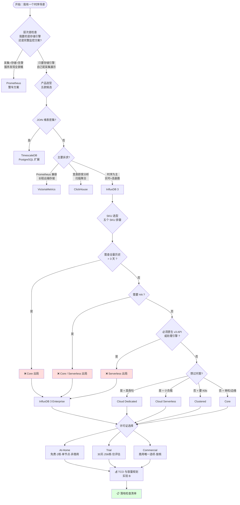
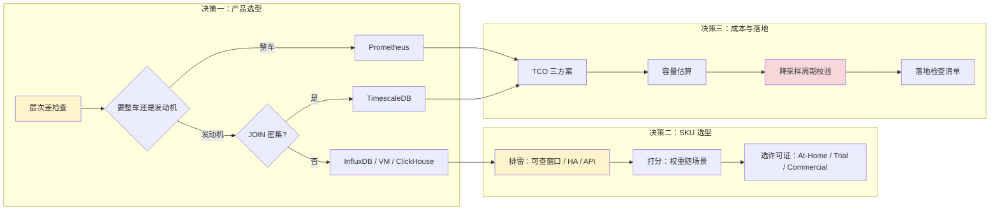

# L19 · 场景演练与选型决策

> 所属课程：[InfluxDB 3 系统学习](../../../02-课程目录.md) ｜ 阶段 6《对比与决策》· 第 3 课（收官）
> 本课知识点：**① 选型决策树 ② 三个场景演练 ③ 落地检查清单**（以 [阶段 6 overview](../overview.md) 为 SSOT）

---

## 🎬 第一幕 · 起源引入：选型会上的那句话

让我们从一个真实的会议室场景开始。

技术评审会开了两个小时，五款候选数据库轮番上场，基准测试的柱状图在投影仪上来回切换。终于，有人拍板：

> "行，那就 InfluxDB 吧。"

会议纪要发出去，任务派下来，两周后开始部署。然后第三周，第一份历史报表跑不出来 —— 报错。

**问题出在哪？**

不是出在"选 InfluxDB 错了"。InfluxDB 3 在这个场景下很可能就是正确答案。问题出在——

**"我们选了 InfluxDB" 这句话本身，没有携带任何信息。**

因为 InfluxDB 3 不是一个东西，是**五个东西**：

| SKU | 官方定位（原文口径） |
|-----|---------------------|
| InfluxDB 3 Core | *"free, open-source, single-node release"* |
| InfluxDB 3 Enterprise | *"For new production workloads, use InfluxDB 3 Enterprise"* |
| InfluxDB Cloud Serverless | *"multi-tenant, self-service cloud... pay for what you use"* |
| InfluxDB Cloud Dedicated | *"Managed single-tenant cloud"* |
| InfluxDB Clustered | *"Kubernetes"*（自建高可用集群） |

这五个的硬约束差异极大。Core 只有 **3 天**的可查窗口、最多 **5 个库**；Serverless **没有原生 v3 写 API**、**没有 Processing Engine**；Dedicated 和 Clustered 面向 *"high-volume production workloads"*，小负载用它是杀鸡用牛刀。

选错 SKU 的后果，和选错产品的后果一样严重 —— 而且它藏得更深，因为你在选型会上根本不会讨论它。

**这就是本课要解决的问题**：把"哪个更好"翻译成"在我的约束下，哪个总成本最低"。

---

## ⚔️ 第二幕 · 认知冲突：四个反直觉事实

### 事实一：选型决策是两次决策，不是一次

绝大多数选型文档把这两件事混在一起：

> ❌ "我们要在 InfluxDB / TimescaleDB / VictoriaMetrics / ClickHouse / Prometheus 里选一个。"

这是**产品选型**。但你选定 InfluxDB 之后，还有一个独立的决策：

> ✅ "在 InfluxDB 的五个 SKU 里，我们要用哪一个？"

这是 **SKU 选型**。两次决策的依据完全不同：

- **产品选型**看的是：查询语言、生态、JOIN 能力、运维模型
- **SKU 选型**看的是：可查窗口、库/表硬限制、HA 需求、合规认证、计费方式

混成一次的后果是：你在会上花两小时论证 InfluxDB 的列式存储有多快，然后随手用了 Core，上线三周后发现自己需要查 90 天历史。

**本课实验 A 就是把这两次决策分开跑的**：第一步在五个 SKU 之间排雷打分，第二步才谈许可证与规格。

> ⭐ **方法论产出**：**「约束归属」检查法** —— 任何一个约束，都要问一句"这是谁的约束"。把 A 的约束套到 B 上，和把 A 的优点算到 B 头上，是同一类错误。本课实验 B 的初版就犯了这个错（把 Core 的 432 文件上限套到所有 SKU 上），后面会完整复盘。

### 事实二：Core 的"3 天"不是性能问题，是存在性问题

Core 的可查窗口是 **432 文件 × gen1 10 分钟 = 3 天**（L11/L13 已核实官方 config-options）。超过这个窗口，查询直接**报错**。

AWS 官方 FAQ 独立印证了这一点：

> *"Historical queries: Limited (~3 days)"*
> *"query performance degrades as data ages"*

请注意这两句话的组合含义：

- Core **能写**超过 3 天的数据
- Core **能存**超过 3 天的数据
- Core **查不到**超过 3 天的数据

这不是"慢"，这是"没有"。慢可以优化，没有只能重来。

**所以在选型决策里，Core 在长保留场景下的状态不是"分数低"，而是"不参与排序"。** 这就是 L17 实验 A 定下的原则——**先排雷再打分**——在 SKU 层面的延续。

### 事实三：Serverless 不是"Core 的托管版"

很多人默认 Cloud Serverless 就是"帮你运维 Core"。官方文档明确否定了这个印象：

> *"No native v3 write API — use v1 and v2 compatibility endpoints"*
> *"No Processing Engine"*
> *"Multi-tenant; usage-based pricing"*

也就是说，Serverless **和 Core 的能力集合不同**，不是同一个东西的两种交付方式：

| 能力 | Core | Serverless |
|------|------|-----------|
| 原生 v3 写 API | ✅ | ❌ |
| Processing Engine | ✅ | ❌ |
| 长程查询（compactor） | ❌ | ✅ |
| 部署形态 | 自托管 | 全托管 |

**Core 有的 Serverless 没有，Serverless 有的 Core 没有。** 它们不是上下级关系，是两个不同定位的产品。

如果你的代码已经用了原生 v3 写 API 或 Processing Engine，迁到 Serverless 意味着**改写入代码**——这个代价在选型时几乎从不被计入。

### 事实四：成本排序会被授权费翻转

本课实验 B 算出的三方案月度成本，IoT 场景（2 万点/秒）下：

```text
甲 · Cloud Serverless（按量）   ≈ $2,309/月
乙 · Enterprise 自托管（8 核）  ≈ $7,744/月（不含授权费）
```

看起来按量方案便宜 3 倍多。但请注意乙方案那一行：

```text
[❓] Enterprise 商业授权（CPU 核计费，需 Contact Sales）    —
```

**这一项是空的。** InfluxData 对 Enterprise 商业授权不公开报价，官方定价页只有一句 *"Contact Sales"*。

这意味着：

1. 上表的乙方案成本是**下限**，真实成本必然更高
2. 授权按 **CPU 核**计费，官方以 **8 / 16 / 32 / 64 / 128 核**为批次售卖
3. 按量方案的成本随写入量**线性增长**，自托管方案的成本是**固定支出 + 缓慢增长**

所以两者必然存在一个交叉点。写入量小的时候按量便宜，写入量大了自托管便宜。**交叉点在哪，必须自己算——不能抄任何人的结论，包括本课的。**

---

## 🔍 第三幕 · 层层揭示：三个知识点

### 3.1 一张图看懂选型决策路径



**这张图的关键在于：排雷在打分之前，且排雷是分层的。** 产品层排雷一次（层次差、JOIN），SKU 层再排雷一次（可查窗口、HA、API 能力），最后才轮到许可证和成本。

### 3.2 知识点①：选型决策树 —— 从"哪个更好"到"哪个总成本最低"

#### 3.2.1 决策树要翻译的到底是什么

"哪个更好"是个**没有答案**的问题，因为它缺少主语。换成"在我的约束下哪个总成本最低"，问题就变成可计算的了。

这个翻译要做三件事：

**第一，把"最好"拆成"必须满足"和"最好有"两栏。**

只有"必须满足"那栏能进决策依据。"最好有"那栏的作用是：当两个方案都满足"必须满足"时，用它来做 tie-break。

这条纪律的价值在于——**它能防止"最好有"伪装成"必须满足"**。选型会上最常见的越界是："Prometheus 生态更好" → 于是 Prometheus 被当成硬需求 → 但你的场景其实不需要拉模型。

**第二，把硬约束变成排雷规则，而不是扣分项。**

这是 L17 实验 A 定下的原则，本课沿用到 SKU 层。区别在于：

- 扣分项：方案 A 得 3 分，方案 B 得 5 分 → B 更好，但 A 也能用
- 排雷项：方案 A 在此场景**根本不成立** → A 不参与排序

用扣分处理硬约束的后果是灾难性的：一个"查不到数据"的方案可能因为其他维度分数高而排名第一。

**第三，成本要算全，包括看不见的那部分。**

本课实验 B 把成本拆成两块：

- **看得见的**：主机、对象存储、按量计费的写入/查询/存储/出流量
- **看不见的**：运维人力

在 IoT 场景的测算里，运维人力（$7,500/月，0.5 FTE）是主机费用（$240/月）的 **31 倍**。

> ⚠️ 这个倍率取决于你假设的人力成本（本课用 $15,000/FTE/月）。但它揭示的结构性事实是稳定的：**在中小规模下，人力常常比机器贵。**

#### 3.2.2 五个 SKU 的官方事实表

以下每一条都标了依据。⭐ = 官方一手文档；⚠️ = 厂商自述或推算。

| 维度 | Core | Enterprise | Serverless | Dedicated | Clustered |
|------|------|-----------|------------|-----------|-----------|
| 部署形态 | 自托管 | 自托管 | 全托管 | 全托管 | 自托管 K8s |
| 多节点 / HA | ❌ 单节点 | ✅ | ❌ 多租户共享 | ✅ | ✅ |
| Compactor（长程查询） | ❌ | ✅ | ✅ | ✅ | ✅ |
| 可查窗口 | **3 天** | 无此限制 | 无此限制 | 无此限制 | 无此限制 |
| 库数上限 | **5** | 100+ | 免费层 2 | 无配额 | 无配额 |
| 表数上限 | **2000** | 10k+ | — | 无配额 | 无配额 |
| 原生 v3 写 API | ✅ | ✅ | **❌** | ✅ | ✅ |
| Processing Engine | ✅ | ✅ | **❌** | ✅ | ✅ |
| 读副本 | ❌ | ✅ | ❌ | ✅ | ✅ |
| SOC 2 / ISO 27001 | ❌ | ✅ | ✅ | ✅ | ✅ |
| 计费 | 免费 | 按 CPU 核授权 | 按量 | 按配置（Contact Sales） | 按 CPU（Contact Sales） |

> ⭐ 依据：官方 `which-influxdb-3` 页、官方 `influxdb-cloud-pricing` 页、官方 `enterprise/admin/license` 页、官方 `upgrade-to-enterprise` 博客。
> ⚠️ Enterprise 的"100+ 库 / 10k+ 表"来自官方**博客**（非文档页），且官方自己写的是"100+"—— 本课保守取其字面下限。

#### 3.2.3 许可证选择：三种规格（⭐ 官方 license 页原文）

| 许可证 | CPU 核上限 | 有效期 | 多节点 | 商用 |
|--------|-----------|--------|--------|------|
| **Trial** | 256 | 30 天 | ✅ | ❌ |
| **At-Home** | **2** | 永不 | ❌ 仅单节点 | ❌ |
| **Commercial** | 按合同 | 按合同 | ✅ | ✅ |

三条容易踩的坑：

1. **Trial 不可商用。** 它给你 256 核 30 天，看起来很够用，但官方明说只能评估。用 Trial 跑生产是**授权违规**，不只是技术问题。
2. **At-Home 只有 2 核。** 而且官方原文是 *"CPU cores are determined by whatever the operating system of the host machine reports"*——你在 4 核机器上跑 At-Home，需要用 `--cpuset-cpus` 之类的手段让容器只看到 2 核，否则可能超限。
3. **商业授权按集群不按机器。** 官方原文：*"The CPU limit is per cluster, not per machine"*，且以 **8 / 16 / 32 / 64 / 128 核**为批次购买。

### 3.3 知识点②：三个场景演练

三个场景沿用 L17 实验 A 的设定，保持可比性。

#### 场景一：IoT 设备遥测（边缘 + 中心）

**约束**：2 万点/秒，保留 7 天，2 库 / 40 表，不需要 HA，需要原生 v3 API 与处理引擎，边缘部署，1 人运维。

**演练结论（实验 A 实跑）**：**InfluxDB 3 Core** 胜出（54.0 分）。

演算过程要点：

- Serverless 被 BLOCK（需要原生 v3 API + 处理引擎，两个硬约束）
- Core 在"成本适配"维度拿满分 5/5 —— 免费 + 边缘场景本来就自托管
- Core 在"运维负担"只得 1/5 —— 因为只有 1 人运维，但边缘场景这个权重被降到 1

**关键提醒**：这个场景下 Core 胜出，是因为**保留 7 天里你只需要查近期数据**。如果哪天业务方说"我要看上个月的曲线"，这个结论立刻失效。

#### 场景二：APM / K8s 微服务监控

**约束**：15 万点/秒，保留 15 天，3 库 / 120 表，需要 HA，需要长程查询，需要原生 v3 API 与处理引擎，3 人运维。

**演练结论（实验 A 实跑）**：**InfluxDB 3 Enterprise** 胜出（63.0 分），Dedicated 以 62.0 分紧随其后。

演算过程要点：

- Core 被双重 BLOCK（保留 15 天 > 3 天窗口；需要 HA）
- Serverless 被三重 BLOCK（原生 v3 API、处理引擎、HA）
- Enterprise 与 Dedicated 的分差只有 1 分（63 vs 62），**这个差距在噪声范围内**

> ⚠️ **1 分的分差不能作为决策依据。** 实验 A 的权重本身是主观设定的（"硬能力匹配"×5、"运维负担"×3）。当分差小于 5% 时，真正的决策依据应该是：你有 3 个人愿意自己运维吗？
>
> - 愿意 → Enterprise（成本可控，数据在自己手上）
> - 不愿意 → Dedicated（多花钱换人力）
>
> **打分器的作用是把候选从 5 个缩到 2 个，不是替你做最终决定。**

顺带一提，这个场景还有个实验 A 没覆盖的选项：**Prometheus**。它是"整车"——采集 + 存储 + 告警 + 服务发现全包。如果你的团队本来就在用 Prometheus + Grafana，那么"加个远端存储"可能比"换成 InfluxDB 全家桶"代价小得多。

#### 场景三：业务指标分析（需 JOIN 维表）

**约束**：5 千点/秒，保留 730 天（2 年），6 库 / 80 表，需要 HA、长程查询、SOC 2/ISO 合规，想托管，2 人运维。

**演练结论（实验 A 实跑）**：**InfluxDB 3 Enterprise** 胜出（48.0 分），但——

> 🔴 **这个场景真正的答案不在 InfluxDB 里。**

实验 A 在这个场景下会打印一段 JOIN 提醒：

```text
⚠️ JOIN 提醒：InfluxDB 3 基于 DataFusion，技术上支持 SQL JOIN；
   但 JOIN 维表密集的分析场景，TimescaleDB（PostgreSQL 扩展）是更自然的落点
   —— 这是 L17 实验 A 中「业务指标分析」场景的冠军，本脚本不推翻该结论。
```

**这是本课刻意保留的一处"不一致性"，我要解释清楚**：

- 实验 A 的 SKU 打分器**只在 InfluxDB 的五个 SKU 内部排序**，它的输出永远是一个 InfluxDB SKU
- 但实验 A 的第一步（层次差/JOIN 前置检查）会**明确提醒**这个场景该考虑别的产品

这不是脚本的缺陷，而是**决策树的分层结构**：产品层的判断先于 SKU 层。如果你在产品层就该选 TimescaleDB，那 SKU 层的输出就没有意义。

同样地，Core 在这个场景被**四条**硬约束同时 BLOCK（保留 730 天 > 3 天、需要 HA、6 库 > 5 库、需要合规认证）—— 这是全套 BLOCK 中最多的一个场景。

#### 场景四（附加）：混合负载，小团队

**约束**：3 万点/秒，保留 90 天，4 库 / 300 表，需要长程查询，想托管，只有 1 人运维。

**演练结论（实验 A 实跑）**：**InfluxDB 3 Enterprise** 胜出（44.0 分）。

这个场景最值得注意的不是冠军是谁，而是**权重的变化**：因为只有 1 人运维，"运维负担"维度的权重被自动从 3 提到 **5**。

结果 Enterprise 在这个维度只拿 1/5（1 人运维 + 自托管 = 高风险），却仍然胜出 —— 因为其他三个 SKU 要么被 BLOCK（Core 的 3 天窗口、Serverless 的 API 限制），要么在"硬能力匹配"上丢分。

> ⚠️ **这个场景的真实答案是"你的约束互相矛盾"**：既要长程查询、又想托管、又只有 1 人运维。Enterprise 是"最不坏"的选择，不是"好"的选择。真正该做的是回去改约束——要么加人，要么改用托管方案并接受它的 API 限制。

> ⭐ **打分器会输出冠军，但不会告诉你约束本身有问题。** 实验 A 因此内置了**约束冲突检测**（【步骤 1.5】），它检查的是"约束之间打架"，与"某 SKU 不满足约束"（排雷）不同：
>
> | 冲突组合 | 为什么打架 |
> |---------|-----------|
> | 想托管 + 要 HA + 只有 1 人运维 | 满足前两条的只有 Dedicated（托管 + HA），但它面向大负载 |
> | 想托管 + 必须原生 v3 API + 必须处理引擎 | Serverless 是唯一便宜的托管，但它两个都没有 |
> | 边缘部署 + 需要长程查询 | 边缘首选 Core，而 Core 只能查 3 天 |
>
> 这类冲突的唯一解法是**回到需求侧改约束**，不是换一个 SKU。本课两个场景（hybrid、IoT）都触发了冲突检测。

> ⚠️ **顺带修掉的一个自相矛盾**：实验 A 初版的"运维负担"打分只看 `ops_headcount`，忽略了 `want_managed` 字段。结果是 hybrid 场景（想托管 + 1 人运维）仍被推荐自托管的 Enterprise —— 而讲义正文正在批评这件事。**嘴上说矛盾、手上照样推荐，是最容易犯的一类错**（L17 也犯过同类：标注"慎引"却给满分）。修复后，`want_managed=True` 且选了自托管 SKU 直接判 1 分。

### 3.4 知识点③：落地检查清单

#### 3.4.1 为什么通用清单没有用

网上有大量"时序数据库上线检查清单"。它们的问题不是内容错，而是**不与你的场景挂钩**。

一条"检查保留期设置"的清单项，和一条：

> "保留 7 天 > Core 可查窗口 3 天 —— 若已选 Core，立刻停下来重新评估"

**不是同一件东西。** 后者带着你的具体数字，你能立刻判断它是命中还是不命中。

所以本课实验 B 的清单是**生成的**，不是列出来的：改输入负载，清单内容就变。

#### 3.4.2 清单的五个阶段

实验 B 生成的清单分五阶段，每个阶段都有"没做这一步，后面全是返工"的性质：

**① 选型前** —— 写下"必须满足"与"最好有"；确认是选产品还是选 SKU；用真实数据压测替换推算值。

**② 容量** —— 降采样调度周期校验（L14 高危项）；磁盘 1.2 倍预留。

**③ 部署** —— Docker 固定版本标签；保留期不写 `0d`；InfluxQL 的 DBRP 命名约定。

**④ 验证** —— 对账不只 COUNT；双写窗口；灰度切读。

**⑤ 上线后** —— 监控"有没有声音"类指标；升级前备份 catalog；每季度复查成本。

#### 3.4.3 降采样层的调度周期校验（本课最硬的一条）

这是 L14 已核实、本课再强调一次的高危项，因为它是**静默失败**里最贵的一种。

降采样层能否查得到，**取决于调度周期，不是精度**。

```text
文件数 = 窗口天数 × 24 × 60 ÷ 调度周期(分钟)

Core 上限：432 个文件（--query-file-limit 默认值）
```

实验 B 的 APM 场景：`10min` 调度 × 180 天 = **25,920 个文件**，是上限的 60 倍。

后果不是"查询变慢"，是 **查询报错**。而且这个错误要等你查历史数据的时候才暴露——那时数据已经按错误的周期跑了好几个月。

**但请注意约束归属**：432 这个上限**只对 Core 成立**。

| SKU | 是否受 432 约束 | 原因 |
|-----|----------------|------|
| Core | ✅ **受约束**（硬约束，报错） | 无 compactor，小文件不会被合并 |
| Enterprise | ❌ | 有 compactor |
| Serverless | ❌ | 有 compactor |
| Dedicated | ❌ | 有 compactor |
| Clustered | ❌ | 有 compactor |

> ⚠️ 有 compactor 不代表文件数可以无限多 —— 文件过多仍会拖慢查询。区别在于：Core 上是**硬报错**，其他 SKU 上是**性能衰减**。一个是"查不到"，一个是"查得慢"。

#### 3.4.4 本课实验 B 的初版错误复盘

这条值得单独讲，因为它是"方法论懂了但手上做错"的典型。

实验 B 初版无条件使用 432 作为所有方案的约束，输出了这样的结论：

```text
🔴 降采样调度周期 60min 会产生 8,760 个文件，超过 432 上限 —— 查不到，不是慢。
   最小周期需 ≥ 1216.7 分钟
```

**1216.7 分钟 ≈ 20 小时。** 也就是说脚本在说："你的降采样任务必须每 20 小时才跑一次。"

这显然是荒谬的。错在哪？

**错在把一个 SKU 的约束，当成了整个产品的约束。**

修复后的输出按 SKU 分列：

```text
      🔴 core        8,760 > 432 上限 —— **查不到**（报错，不是慢）；最小周期需 ≥ 1216.7 分钟
      ✅ enterprise  有 compactor，小文件会被合并 —— 不受 432 约束
      ✅ serverless  有 compactor，小文件会被合并 —— 不受 432 约束
      ✅ dedicated   有 compactor，小文件会被合并 —— 不受 432 约束
      ✅ clustered   有 compactor，小文件会被合并 —— 不受 432 约束
```

同一组输入，结论从"必须 20 小时调度一次"变成"只有选 Core 才需要改周期"。

> ⭐ **方法论产出（本课第二条）**：**「约束归属」检查法** —— 拿到任何一个约束，先问"这是谁的约束"。
>
> 把 A 的约束套到 B 上，和把 A 的优点算到 B 头上，是同一类错误，只是方向相反。前者会让你过度设计，后者会让你踩坑。

---

## 🧪 第四幕 · 实操验证

### 实验 A：选型决策树引擎（✅ 本机实跑）

**脚本**：[l19_decision_tree.py](../assets/l19_decision_tree.py)（607 行，纯标准库）

**它做什么**：对四个场景 × 五个 SKU，先跑硬约束排雷，再加权打分，最后给出许可证/规格建议。与 L17 实验 A 的分工是——L17 在**五款不同产品**之间打分，L19 在**给定约束**下走判断路径并选 SKU。

流程共六步：层次差检查 → 约束冲突检测 → 硬约束排雷 → 加权打分 → 许可证建议 → 成本与落地。

**运行方式**：

```bash
python l19_decision_tree.py
```

**实际输出（本机 Python 3.12 实跑，逐字回贴）**：

```text
##############################################################################
L19 · 实验 A：选型决策树引擎
「哪个更好」→「在我的约束下，哪个总成本最低」
##############################################################################

本脚本常量的依据分布：
  ⭐ 官方一手：Core 可查窗口 3 天、Core 硬限制 5/2000/500、Serverless 四个单价
  ⭐ 官方一手：三种许可证规格、CPU 售卖批次 (8, 16, 32, 64, 128)
  ⚠️ 推算：Enterprise 容量 100+ 库 / 10000+ 表（官方博客口径）
  📌 本课推导：每点字节数 4.24 B（由 L13 官方锚点反推）、存储月费 $1.46/GB

==============================================================================
场景：IoT 设备遥测（边缘 + 中心）   [iot]
==============================================================================
  约束：保留 7 天 ｜ 写入 20,000 点/秒 ｜ 2 库 / 40 表
        HA=不需要 ｜ 长程查询=不需要 ｜ 合规=不需要
        原生v3 API=必须 ｜ 处理引擎=必须 ｜ 想托管=否 ｜ 运维人力 1 人

【步骤 1】层次差 / JOIN 前置检查
  ⚠️ 层次差检查（L17 核心结论）：InfluxDB 是**存储引擎**，不是完整监控方案。
     若你要的是「采集 + 存储 + 告警 + 服务发现」全家桶，Prometheus 才是那个层级的答案；
     选 InfluxDB 意味着 Telegraf 采集、Grafana 展示、处理引擎告警都要自己配。

【步骤 1.5】⚠️ 约束冲突检测（约束本身打架，选型救不了）
  ⚠️ 边缘部署 + 需查 7 天历史 —— 边缘首选的 Core 只能查 3 天

  → 这类冲突的唯一解法是回到需求侧改约束，而不是换一个 SKU。
    下面的排雷与打分照常给出，但请带着上面的冲突一起看。

【步骤 2】硬约束排雷（命中即 BLOCKED，不参与排序）
  🚫 [⭐] InfluxDB Cloud Serverless
        必须用原生 v3 写 API；官方明说 Serverless「No native v3 write API——use v1 and v2 compatibility endpoints」
  🚫 [⭐] InfluxDB Cloud Serverless
        必须用 Processing Engine；官方明说 Serverless「No Processing Engine」

  → 进入打分的 SKU：4 / 5

【步骤 3】加权打分（权重由场景决定）
  权重：{'硬能力匹配（HA / 长程 / 合规 / v3 API）': 5, '运维负担（人力越少，托管越优）': 1, '成本适配（按量 vs 授权）': 4, '演进空间（换 SKU 的代价）': 2}

  InfluxDB 3 Core                    54.0 分  (100.0%)
        硬能力匹配（HA / 长程 / 合规 / v3 API）       5/5 × 5
        运维负担（人力越少，托管越优）                    1/5 × 1
        成本适配（按量 vs 授权）                     5/5 × 4
        演进空间（换 SKU 的代价）                    4/5 × 2
  InfluxDB 3 Enterprise              44.0 分  ( 81.5%)
        硬能力匹配（HA / 长程 / 合规 / v3 API）       5/5 × 5
        运维负担（人力越少，托管越优）                    1/5 × 1
        成本适配（按量 vs 授权）                     2/5 × 4
        演进空间（换 SKU 的代价）                    5/5 × 2
  InfluxDB Cloud Dedicated           44.0 分  ( 81.5%)
        硬能力匹配（HA / 长程 / 合规 / v3 API）       5/5 × 5
        运维负担（人力越少，托管越优）                    5/5 × 1
        成本适配（按量 vs 授权）                     2/5 × 4
        演进空间（换 SKU 的代价）                    3/5 × 2
  InfluxDB Clustered                 40.0 分  ( 74.1%)
        硬能力匹配（HA / 长程 / 合规 / v3 API）       5/5 × 5
        运维负担（人力越少，托管越优）                    1/5 × 1
        成本适配（按量 vs 授权）                     2/5 × 4
        演进空间（换 SKU 的代价）                    3/5 × 2

【步骤 4】结论：InfluxDB 3 Core
  MIT / Apache 2 双许可；官方定位「non-production, edge, or single-node」

  ▶ 部署提醒：
     可查窗口 3 天；硬限制 5 库 / 2000 表 / 500 列
     ⭐ 官方：Core→Enterprise 无需搬数据，但 Downgrading is not supported（单向门）

==============================================================================
场景：APM / K8s 微服务监控   [apm]
==============================================================================
  约束：保留 15 天 ｜ 写入 150,000 点/秒 ｜ 3 库 / 120 表
        HA=需要 ｜ 长程查询=需要 ｜ 合规=不需要
        原生v3 API=必须 ｜ 处理引擎=必须 ｜ 想托管=否 ｜ 运维人力 3 人

【步骤 1】层次差 / JOIN 前置检查
  ⚠️ 层次差检查（L17 核心结论）：InfluxDB 是**存储引擎**，不是完整监控方案。
     若你要的是「采集 + 存储 + 告警 + 服务发现」全家桶，Prometheus 才是那个层级的答案；
     选 InfluxDB 意味着 Telegraf 采集、Grafana 展示、处理引擎告警都要自己配。

【步骤 2】硬约束排雷（命中即 BLOCKED，不参与排序）
  🚫 [⭐] InfluxDB 3 Core
        需查全量历史 15 天 > Core 可查窗口 3 天（432 文件 × 10min，超限是报错不是慢）
  🚫 [⭐] InfluxDB 3 Core
        需要高可用，而 Core 官方定位为 single-node（无多节点、无 HA）
  🚫 [⭐] InfluxDB Cloud Serverless
        必须用原生 v3 写 API；官方明说 Serverless「No native v3 write API——use v1 and v2 compatibility endpoints」
  🚫 [⭐] InfluxDB Cloud Serverless
        必须用 Processing Engine；官方明说 Serverless「No Processing Engine」
  🚫 [⭐] InfluxDB Cloud Serverless
        需要高可用；Serverless 是多租户共享基础设施，官方未承诺 HA

  → 进入打分的 SKU：3 / 5

【步骤 3】加权打分（权重由场景决定）
  权重：{'硬能力匹配（HA / 长程 / 合规 / v3 API）': 5, '运维负担（人力越少，托管越优）': 3, '成本适配（按量 vs 授权）': 4, '演进空间（换 SKU 的代价）': 2}

  InfluxDB 3 Enterprise              63.0 分  (100.0%)
        硬能力匹配（HA / 长程 / 合规 / v3 API）       5/5 × 5
        运维负担（人力越少，托管越优）                    4/5 × 3
        成本适配（按量 vs 授权）                     4/5 × 4
        演进空间（换 SKU 的代价）                    5/5 × 2
  InfluxDB Cloud Dedicated           62.0 分  ( 98.4%)
        硬能力匹配（HA / 长程 / 合规 / v3 API）       5/5 × 5
        运维负担（人力越少，托管越优）                    5/5 × 3
        成本适配（按量 vs 授权）                     4/5 × 4
        演进空间（换 SKU 的代价）                    3/5 × 2
  InfluxDB Clustered                 59.0 分  ( 93.7%)
        硬能力匹配（HA / 长程 / 合规 / v3 API）       5/5 × 5
        运维负担（人力越少，托管越优）                    4/5 × 3
        成本适配（按量 vs 授权）                     4/5 × 4
        演进空间（换 SKU 的代价）                    3/5 × 2

【步骤 4】结论：InfluxDB 3 Enterprise
  自托管；按 CPU 核授权（按集群不按机器）；官方定位「new production workloads」

  ▶ 许可证选择（官方 enterprise/admin/license 页）：
     Trial     —— 30 天、256 核、全功能；⚠️ 官方明说不可商用（只能评估）
     Commercial—— 商用唯一选项；按 CPU 核批量 8/16/32/64/128 购买
     📌 核数推算：64 核（按 150,000 点/秒推算，见实验 B）

==============================================================================
场景：业务指标分析（需 JOIN 维表）   [biz]
==============================================================================
  约束：保留 730 天 ｜ 写入 5,000 点/秒 ｜ 6 库 / 80 表
        HA=需要 ｜ 长程查询=需要 ｜ 合规=需要
        原生v3 API=非必须 ｜ 处理引擎=非必须 ｜ 想托管=是 ｜ 运维人力 2 人

【步骤 1】层次差 / JOIN 前置检查
  ⚠️ 层次差检查（L17 核心结论）：InfluxDB 是**存储引擎**，不是完整监控方案。
     若你要的是「采集 + 存储 + 告警 + 服务发现」全家桶，Prometheus 才是那个层级的答案；
     选 InfluxDB 意味着 Telegraf 采集、Grafana 展示、处理引擎告警都要自己配。

  ⚠️ JOIN 提醒：InfluxDB 3 基于 DataFusion，**技术上支持 SQL JOIN**；
     但 JOIN 维表密集的分析场景，TimescaleDB（PostgreSQL 扩展）是更自然的落点
     —— 这是 L17 实验 A 中「业务指标分析」场景的冠军，本脚本不推翻该结论。

【步骤 2】硬约束排雷（命中即 BLOCKED，不参与排序）
  🚫 [⭐] InfluxDB 3 Core
        需查全量历史 730 天 > Core 可查窗口 3 天（432 文件 × 10min，超限是报错不是慢）
  🚫 [⭐] InfluxDB 3 Core
        需要高可用，而 Core 官方定位为 single-node（无多节点、无 HA）
  🚫 [⭐] InfluxDB 3 Core
        需要 6 个库 > Core 硬限制 5
  🚫 [⭐] InfluxDB 3 Core
        需要 SOC 2 / ISO 27001，而官方把认证列在 Enterprise 的能力清单里
  🚫 [⭐] InfluxDB Cloud Serverless
        需要高可用；Serverless 是多租户共享基础设施，官方未承诺 HA
  💡 [📌] InfluxDB Cloud Serverless
        超出免费层（保留 30 天 / 2 库）需转付费——这不是 BLOCK，是成本项（本条仅提示，见下方成本估算）
  🚫 [⚠️] InfluxDB Cloud Dedicated
        写入仅 5,000 点/秒，官方对 Dedicated 的定位是「high-volume production workloads」，此量级用 Serverless 更划算

  → 进入打分的 SKU：2 / 5

【步骤 3】加权打分（权重由场景决定）
  权重：{'硬能力匹配（HA / 长程 / 合规 / v3 API）': 5, '运维负担（人力越少，托管越优）': 3, '成本适配（按量 vs 授权）': 2, '演进空间（换 SKU 的代价）': 2}

  InfluxDB 3 Enterprise              42.0 分  (100.0%)
        硬能力匹配（HA / 长程 / 合规 / v3 API）       5/5 × 5
        运维负担（人力越少，托管越优）                    1/5 × 3
        成本适配（按量 vs 授权）                     2/5 × 2
        演进空间（换 SKU 的代价）                    5/5 × 2
  InfluxDB Clustered                 38.0 分  ( 90.5%)
        硬能力匹配（HA / 长程 / 合规 / v3 API）       5/5 × 5
        运维负担（人力越少，托管越优）                    1/5 × 3
        成本适配（按量 vs 授权）                     2/5 × 2
        演进空间（换 SKU 的代价）                    3/5 × 2

【步骤 4】结论：InfluxDB 3 Enterprise
  自托管；按 CPU 核授权（按集群不按机器）；官方定位「new production workloads」

  ▶ 许可证选择（官方 enterprise/admin/license 页）：
     Trial     —— 30 天、256 核、全功能；⚠️ 官方明说不可商用（只能评估）
     Commercial—— 商用唯一选项；按 CPU 核批量 8/16/32/64/128 购买
     📌 核数推算：8 核（按 5,000 点/秒推算，见实验 B）

==============================================================================
场景：混合负载（设备 + 业务，小团队）   [hybrid]
==============================================================================
  约束：保留 90 天 ｜ 写入 30,000 点/秒 ｜ 4 库 / 300 表
        HA=不需要 ｜ 长程查询=需要 ｜ 合规=不需要
        原生v3 API=必须 ｜ 处理引擎=必须 ｜ 想托管=是 ｜ 运维人力 1 人

【步骤 1】层次差 / JOIN 前置检查
  ⚠️ 层次差检查（L17 核心结论）：InfluxDB 是**存储引擎**，不是完整监控方案。
     若你要的是「采集 + 存储 + 告警 + 服务发现」全家桶，Prometheus 才是那个层级的答案；
     选 InfluxDB 意味着 Telegraf 采集、Grafana 展示、处理引擎告警都要自己配。

【步骤 1.5】⚠️ 约束冲突检测（约束本身打架，选型救不了）
  ⚠️ 想托管 + 必须用原生 v3 API + 必须用处理引擎 —— Serverless 是唯一托管里便宜的，但它两个都没有；能满足的 Dedicated 又面向大负载

  → 这类冲突的唯一解法是回到需求侧改约束，而不是换一个 SKU。
    下面的排雷与打分照常给出，但请带着上面的冲突一起看。

【步骤 2】硬约束排雷（命中即 BLOCKED，不参与排序）
  🚫 [⭐] InfluxDB 3 Core
        需查全量历史 90 天 > Core 可查窗口 3 天（432 文件 × 10min，超限是报错不是慢）
  🚫 [⭐] InfluxDB Cloud Serverless
        必须用原生 v3 写 API；官方明说 Serverless「No native v3 write API——use v1 and v2 compatibility endpoints」
  🚫 [⭐] InfluxDB Cloud Serverless
        必须用 Processing Engine；官方明说 Serverless「No Processing Engine」
  💡 [📌] InfluxDB Cloud Serverless
        超出免费层（保留 30 天 / 2 库）需转付费——这不是 BLOCK，是成本项（本条仅提示，见下方成本估算）
  🚫 [⚠️] InfluxDB Cloud Dedicated
        写入仅 30,000 点/秒，官方对 Dedicated 的定位是「high-volume production workloads」，此量级用 Serverless 更划算

  → 进入打分的 SKU：2 / 5

【步骤 3】加权打分（权重由场景决定）
  权重：{'硬能力匹配（HA / 长程 / 合规 / v3 API）': 5, '运维负担（人力越少，托管越优）': 5, '成本适配（按量 vs 授权）': 2, '演进空间（换 SKU 的代价）': 2}

  InfluxDB 3 Enterprise              44.0 分  (100.0%)
        硬能力匹配（HA / 长程 / 合规 / v3 API）       5/5 × 5
        运维负担（人力越少，托管越优）                    1/5 × 5
        成本适配（按量 vs 授权）                     2/5 × 2
        演进空间（换 SKU 的代价）                    5/5 × 2
  InfluxDB Clustered                 40.0 分  ( 90.9%)
        硬能力匹配（HA / 长程 / 合规 / v3 API）       5/5 × 5
        运维负担（人力越少，托管越优）                    1/5 × 5
        成本适配（按量 vs 授权）                     2/5 × 2
        演进空间（换 SKU 的代价）                    3/5 × 2

【步骤 4】结论：InfluxDB 3 Enterprise
  自托管；按 CPU 核授权（按集群不按机器）；官方定位「new production workloads」

  ▶ 许可证选择（官方 enterprise/admin/license 页）：
     Trial     —— 30 天、256 核、全功能；⚠️ 官方明说不可商用（只能评估）
     Commercial—— 商用唯一选项；按 CPU 核批量 8/16/32/64/128 购买
     📌 核数推算：16 核（按 30,000 点/秒推算，见实验 B）

##############################################################################
收束：四个场景的四个结论
##############################################################################

  1. 没有任何一个 SKU 通吃四个场景 —— 和 L17「没有一款赢下全部场景」是同一条规律，
     只是这次发生在**同一个产品的不同 SKU 之间**。
  2. 「我们选了 InfluxDB」这句话本身没有信息量 —— 五个 SKU 的硬约束差异极大，
     Core 的 3 天窗口和 5 库限制，能把生产场景直接挡在门外。
  3. 排雷命中率最高的是 Core：四个场景里三个被 BLOCK。这不是 Core 不好，
     是它的官方定位就是「non-production, edge, or single-node」。
  4. 四个场景里有两个触发了**约束冲突**（hybrid / IoT）—— 既想托管又要用
     原生 v3 API。这类冲突换任何 SKU 都解不了，只能回到需求侧改约束。
     ⚠️ 打分器在这种场景下仍会输出一个冠军，但那个冠军是「最不坏」，不是「好」。

```

**怎么读这份输出**：

1. **先看【步骤 2】排雷**。被 BLOCK 的 SKU 不参与排序，这是最重要的一步。
2. **再看【步骤 3】权重**。权重随场景浮动（1 人运维 → 运维负担权重提到 5），不存在通用最优解。
3. **最后看分差**。分差 < 5% 时，打分器只能把候选从 5 个缩到 2 个，最终决定要靠打分器之外的因素。

### 实验 B：TCO 与容量规划器（✅ 本机实跑）

**脚本**：[l19_tco_calculator.py](../assets/l19_tco_calculator.py)（515 行，纯标准库）

**它做什么**：三个负载的容量估算 + 降采样文件数按 SKU 校验 + TCO 三方案对比 + 按场景生成落地检查清单。

**运行方式**：

```bash
python l19_tco_calculator.py
```

**实际输出（本机 Python 3.12 实跑，逐字回贴）**：

```text
##############################################################################
L19 · 实验 B：TCO 与容量规划器
多少钱？多大？以及一份能照着执行的清单
##############################################################################

依据分布：
  ⭐ 官方一手：Serverless 四个单价（$0.0025/MB、$0.012/100 次、$0.002/GB-hour、$0.09/GB）
  ⭐ 官方一手：Core 可查窗口 432 文件上限、L13 官方容量锚点（10 万点/秒 × 30 天 ≈ 1 TB）
  ⚠️ 假设值：硬件月费、对象存储 $0.023/GB、运维人力 $15,000/FTE/月 —— 全部需替换为真实报价
  📌 本课推导：每点 4.24 B、降采样压缩比 1/20、磁盘 1.2 倍预留

  ❓ 无法获取：Enterprise 商业授权费（官方 Contact Sales，不公开报价）

==============================================================================
负载：IoT 设备遥测   [iot]
==============================================================================
  写入 20,000 点/秒 ｜ 原始保留 7 天 ｜ 降采样 60min / 保留 365 天
  查询 8,640 次/天 ｜ 出流量 20 GB/月

【容量估算】
  原始数据              47.8 GB
  降采样数据           124.6 GB   （压缩比假设 1/20，⚠️ 需实测校准）
  ────────────────────
  合计                 172.4 GB
  建议预留             206.8 GB   （📌 1.2 倍，导出时行协议无压缩）

  降采样文件数校验（60min × 365 天 → 8,760 个文件）
  ⭐ 关键：这个上限**只对 Core 成立**，其他 SKU 有 compactor 会合并小文件

      🔴 core        8,760 > 432 上限 —— **查不到**（报错，不是慢）；最小周期需 ≥ 1216.7 分钟
      ✅ enterprise  有 compactor，小文件会被合并 —— 不受 432 约束；但文件过多仍会拖慢查询（⚠️ 量级判断，非硬约束）
      ✅ serverless  有 compactor，小文件会被合并 —— 不受 432 约束；但文件过多仍会拖慢查询（⚠️ 量级判断，非硬约束）
      ✅ dedicated   有 compactor，小文件会被合并 —— 不受 432 约束；但文件过多仍会拖慢查询（⚠️ 量级判断，非硬约束）
      ✅ clustered   有 compactor，小文件会被合并 —— 不受 432 约束；但文件过多仍会拖慢查询（⚠️ 量级判断，非硬约束）

【TCO 三方案对比（月度，USD）】

  甲 · Cloud Serverless（按量）
      [⭐] 写入 209,715 MB/月 × $0.0025/MB                              $    524.29
      [⭐] 查询 259,200 次/月 × $0.012/100 次                             $     31.10
      [⭐] 存储 172 GB × $1.46/GB/月                                    $    251.67
      [⭐] 出流量 20 GB × $0.09/GB                                      $      1.80
      [⚠️] 运维人力 0.1 FTE × $15,000/月                                  $  1,500.00
      ────────────────────────────────────────────────────────────────────
      月合计                                                                 $  2,308.86

  乙 · Enterprise 自托管（8 核）
      [⚠️] 主机 16 核 / 64 GB × 1 台                                     $    240.00
      [⚠️] 对象存储 172 GB × $0.023/GB/月                                 $      3.96
      [❓] Enterprise 商业授权（CPU 核计费，需 Contact Sales）                            —
      [⚠️] 运维人力 0.5 FTE × $15,000/月                                  $  7,500.00
      ────────────────────────────────────────────────────────────────────
      月合计（不含授权费）                                                          $  7,743.96

  丙 · InfluxDB 3 Core（开源，仅对照）
      [⭐] ⚠️ 保留 7 天 > Core 可查窗口 3 天 —— 存得下但查不到，本方案在此场景不成立           $      0.00
      ────────────────────────────────────────────────────────────────────
      月合计                                                                 $      0.00

  ⚠️ 先对齐口径：本表只比**成本**，不比**可行性**。
     「最省」不等于「能选」—— 可行性由实验 A 的排雷结果决定。
     例：实验 A 中 IoT 场景 Core 未被 BLOCK 但 Serverless 被 BLOCK，
         这里的成本排序不能反过来推翻那个结论。

  → 当前假设下最省：甲 · Cloud Serverless（按量）  ≈ $2,309/月
     第二便宜：乙 · Enterprise 自托管（8 核） ≈ $7,744/月（贵 235%）

  ⚠️ 三条必须说清的口径：
     1. 乙方案**未含** Enterprise 商业授权费（官方 Contact Sales）
        授权按 CPU 核计费，是大额固定支出 —— 它会显著改变排序
     2. 运维人力用的是假设值，请替换为本地真实成本；
        **在中小规模下，人力常常比机器贵**
     3. 按量计费的写入/查询项会随业务增长线性放大，
        本表只反映**当前**负载，不是长期成本

【落地检查清单（按本负载生成）】

  ① 选型前
      [📌] 写下「必须满足」与「最好有」两栏，后者一律不进决策依据
      [📌] 确认是选**产品**还是选**SKU**——两个问题分开答，别混成一次决策
      [⚠️] 用真实数据压测，替换本脚本的推算值（当前每点 4.24 B 由官方锚点反推）
      [⭐] 保留 7 天 > Core 可查窗口 3 天 —— 若已选 Core，立刻停下来重新评估
  ② 容量
      [⭐] 🔴 若选 Core：降采样 60min 会产生 8,760 个文件，超过 432 上限 —— 查不到，不是慢。最小周期需 ≥ 1216.7 分钟
      [⭐] ⚠️ 降采样层能否查得到取决于**调度周期**，不是精度（L14 已核实）——改精度救不了文件数超限
      [⭐] ⚠️ 432 文件上限**只对 Core 成立**；Enterprise / Dedicated / Clustered / Serverless 有 compactor 会合并小文件，不受此硬约束（但文件过多仍会拖慢查询）
      [📌] 磁盘按 1.2 倍预留：估算 172 GB → 实际预留 207 GB（L18 已核实：行协议导出无压缩，导出时体积更大）
  ③ 部署
      [⭐] Docker 一律固定版本标签，**绝不用 latest**（官方全站横幅警告；且该横幅日期官方自己给了多个版本，别信任何具体日期）
      [⭐] 保留期：**永久 = 不传参数**，绝不能写 `0d`（1.x/2.x 的 0 = 永久，3.x 的 0d = 立刻全删）
      [⭐] 用 InfluxQL 查询的库名必须写成 `database_name/retention_policy_name`（DBRP 倒灌命名约定）
  ④ 验证
      [📌] 对账不能只 COUNT：还要抽样 10 个点、比对列顺序、核对时间边界（L18 S5）
      [⭐] 双写窗口：下限 = 覆盖对账周期（1-3 天），上限 = 可查窗口（Core = 3 天）→ Core 上双写实际只有 1-3 天，对账脚本必须提前写好
      [📌] 灰度切读：先 1 个面板跑 24h，确认无历史查询报错再全量
  ⑤ 上线后
      [📌] 监控「有没有声音」类指标：写入成功率、查询报错率、降采样任务成功率—— 静默失败不会自己报错，只能靠这些指标兜住
      [⭐] 升 3.10 前：先 --version，再按 3.4.0 分界选 catalog 备份路径；⚠️ 启动 3.10 就已不可逆
      [⚠️] 每季度复查一次本清单的成本项 —— 按量计费的费用会随数据增长失控

==============================================================================
负载：APM / K8s 微服务监控   [apm]
==============================================================================
  写入 150,000 点/秒 ｜ 原始保留 15 天 ｜ 降采样 10min / 保留 180 天
  查询 86,400 次/天 ｜ 出流量 60 GB/月

【容量估算】
  原始数据             768.0 GB
  降采样数据           460.8 GB   （压缩比假设 1/20，⚠️ 需实测校准）
  ────────────────────
  合计               1,228.8 GB
  建议预留           1,474.6 GB   （📌 1.2 倍，导出时行协议无压缩）

  降采样文件数校验（10min × 180 天 → 25,920 个文件）
  ⭐ 关键：这个上限**只对 Core 成立**，其他 SKU 有 compactor 会合并小文件

      🔴 core        25,920 > 432 上限 —— **查不到**（报错，不是慢）；最小周期需 ≥ 600.0 分钟
      ✅ enterprise  有 compactor，小文件会被合并 —— 不受 432 约束；但文件过多仍会拖慢查询（⚠️ 量级判断，非硬约束）
      ✅ serverless  有 compactor，小文件会被合并 —— 不受 432 约束；但文件过多仍会拖慢查询（⚠️ 量级判断，非硬约束）
      ✅ dedicated   有 compactor，小文件会被合并 —— 不受 432 约束；但文件过多仍会拖慢查询（⚠️ 量级判断，非硬约束）
      ✅ clustered   有 compactor，小文件会被合并 —— 不受 432 约束；但文件过多仍会拖慢查询（⚠️ 量级判断，非硬约束）

【TCO 三方案对比（月度，USD）】

  甲 · Cloud Serverless（按量）
      [⭐] 写入 1,572,864 MB/月 × $0.0025/MB                            $  3,932.16
      [⭐] 查询 2,592,000 次/月 × $0.012/100 次                           $    311.04
      [⭐] 存储 1,229 GB × $1.46/GB/月                                  $  1,794.05
      [⭐] 出流量 60 GB × $0.09/GB                                      $      5.40
      [⚠️] 运维人力 0.1 FTE × $15,000/月                                  $  1,500.00
      ────────────────────────────────────────────────────────────────────
      月合计                                                                 $  7,542.65

  乙 · Enterprise 自托管（64 核）
      [⚠️] 主机 64 核 / 256 GB × 1 台                                    $    960.00
      [⚠️] 对象存储 1,229 GB × $0.023/GB/月                               $     28.26
      [❓] Enterprise 商业授权（CPU 核计费，需 Contact Sales）                            —
      [⚠️] 运维人力 0.5 FTE × $15,000/月                                  $  7,500.00
      ────────────────────────────────────────────────────────────────────
      月合计（不含授权费）                                                          $  8,488.26

  丙 · InfluxDB 3 Core（开源，仅对照）
      [⭐] ⚠️ 保留 15 天 > Core 可查窗口 3 天 —— 存得下但查不到，本方案在此场景不成立          $      0.00
      ────────────────────────────────────────────────────────────────────
      月合计                                                                 $      0.00

  ⚠️ 先对齐口径：本表只比**成本**，不比**可行性**。
     「最省」不等于「能选」—— 可行性由实验 A 的排雷结果决定。
     例：实验 A 中 IoT 场景 Core 未被 BLOCK 但 Serverless 被 BLOCK，
         这里的成本排序不能反过来推翻那个结论。

  → 当前假设下最省：甲 · Cloud Serverless（按量）  ≈ $7,543/月
     第二便宜：乙 · Enterprise 自托管（64 核） ≈ $8,488/月（贵 13%）

  ⚠️ 三条必须说清的口径：
     1. 乙方案**未含** Enterprise 商业授权费（官方 Contact Sales）
        授权按 CPU 核计费，是大额固定支出 —— 它会显著改变排序
     2. 运维人力用的是假设值，请替换为本地真实成本；
        **在中小规模下，人力常常比机器贵**
     3. 按量计费的写入/查询项会随业务增长线性放大，
        本表只反映**当前**负载，不是长期成本

【落地检查清单（按本负载生成）】

  ① 选型前
      [📌] 写下「必须满足」与「最好有」两栏，后者一律不进决策依据
      [📌] 确认是选**产品**还是选**SKU**——两个问题分开答，别混成一次决策
      [⚠️] 用真实数据压测，替换本脚本的推算值（当前每点 4.24 B 由官方锚点反推）
      [⭐] 保留 15 天 > Core 可查窗口 3 天 —— 若已选 Core，立刻停下来重新评估
  ② 容量
      [⭐] 🔴 若选 Core：降采样 10min 会产生 25,920 个文件，超过 432 上限 —— 查不到，不是慢。最小周期需 ≥ 600.0 分钟
      [⭐] ⚠️ 降采样层能否查得到取决于**调度周期**，不是精度（L14 已核实）——改精度救不了文件数超限
      [⭐] ⚠️ 432 文件上限**只对 Core 成立**；Enterprise / Dedicated / Clustered / Serverless 有 compactor 会合并小文件，不受此硬约束（但文件过多仍会拖慢查询）
      [📌] 磁盘按 1.2 倍预留：估算 1,229 GB → 实际预留 1,475 GB（L18 已核实：行协议导出无压缩，导出时体积更大）
  ③ 部署
      [⭐] Docker 一律固定版本标签，**绝不用 latest**（官方全站横幅警告；且该横幅日期官方自己给了多个版本，别信任何具体日期）
      [⭐] 保留期：**永久 = 不传参数**，绝不能写 `0d`（1.x/2.x 的 0 = 永久，3.x 的 0d = 立刻全删）
      [⭐] 用 InfluxQL 查询的库名必须写成 `database_name/retention_policy_name`（DBRP 倒灌命名约定）
      [⭐] 写入 150,000 点/秒 > 10 万阈值 —— 官方性能调优页建议调高 --num-io-threads（默认仅 2，会浪费绝大部分 CPU）
  ④ 验证
      [📌] 对账不能只 COUNT：还要抽样 10 个点、比对列顺序、核对时间边界（L18 S5）
      [⭐] 双写窗口：下限 = 覆盖对账周期（1-3 天），上限 = 可查窗口（Core = 3 天）→ Core 上双写实际只有 1-3 天，对账脚本必须提前写好
      [📌] 灰度切读：先 1 个面板跑 24h，确认无历史查询报错再全量
  ⑤ 上线后
      [📌] 监控「有没有声音」类指标：写入成功率、查询报错率、降采样任务成功率—— 静默失败不会自己报错，只能靠这些指标兜住
      [⭐] 升 3.10 前：先 --version，再按 3.4.0 分界选 catalog 备份路径；⚠️ 启动 3.10 就已不可逆
      [⚠️] 每季度复查一次本清单的成本项 —— 按量计费的费用会随数据增长失控

==============================================================================
负载：业务指标分析   [biz]
==============================================================================
  写入 5,000 点/秒 ｜ 原始保留 30 天 ｜ 无降采样
  查询 2,000 次/天 ｜ 出流量 10 GB/月

【容量估算】
  原始数据              51.2 GB
  ────────────────────
  合计                  51.2 GB
  建议预留              61.4 GB   （📌 1.2 倍，导出时行协议无压缩）

【TCO 三方案对比（月度，USD）】

  甲 · Cloud Serverless（按量）
      [⭐] 写入 52,429 MB/月 × $0.0025/MB                               $    131.07
      [⭐] 查询 60,000 次/月 × $0.012/100 次                              $      7.20
      [⭐] 存储 51 GB × $1.46/GB/月                                     $     74.75
      [⭐] 出流量 10 GB × $0.09/GB                                      $      0.90
      [⚠️] 运维人力 0.1 FTE × $15,000/月                                  $  1,500.00
      ────────────────────────────────────────────────────────────────────
      月合计                                                                 $  1,713.92

  乙 · Enterprise 自托管（8 核）
      [⚠️] 主机 16 核 / 64 GB × 1 台                                     $    240.00
      [⚠️] 对象存储 51 GB × $0.023/GB/月                                  $      1.18
      [❓] Enterprise 商业授权（CPU 核计费，需 Contact Sales）                            —
      [⚠️] 运维人力 0.5 FTE × $15,000/月                                  $  7,500.00
      ────────────────────────────────────────────────────────────────────
      月合计（不含授权费）                                                          $  7,741.18

  丙 · InfluxDB 3 Core（开源，仅对照）
      [⭐] ⚠️ 保留 30 天 > Core 可查窗口 3 天 —— 存得下但查不到，本方案在此场景不成立          $      0.00
      ────────────────────────────────────────────────────────────────────
      月合计                                                                 $      0.00

  ⚠️ 先对齐口径：本表只比**成本**，不比**可行性**。
     「最省」不等于「能选」—— 可行性由实验 A 的排雷结果决定。
     例：实验 A 中 IoT 场景 Core 未被 BLOCK 但 Serverless 被 BLOCK，
         这里的成本排序不能反过来推翻那个结论。

  → 当前假设下最省：甲 · Cloud Serverless（按量）  ≈ $1,714/月
     第二便宜：乙 · Enterprise 自托管（8 核） ≈ $7,741/月（贵 352%）

  ⚠️ 三条必须说清的口径：
     1. 乙方案**未含** Enterprise 商业授权费（官方 Contact Sales）
        授权按 CPU 核计费，是大额固定支出 —— 它会显著改变排序
     2. 运维人力用的是假设值，请替换为本地真实成本；
        **在中小规模下，人力常常比机器贵**
     3. 按量计费的写入/查询项会随业务增长线性放大，
        本表只反映**当前**负载，不是长期成本

【落地检查清单（按本负载生成）】

  ① 选型前
      [📌] 写下「必须满足」与「最好有」两栏，后者一律不进决策依据
      [📌] 确认是选**产品**还是选**SKU**——两个问题分开答，别混成一次决策
      [⚠️] 用真实数据压测，替换本脚本的推算值（当前每点 4.24 B 由官方锚点反推）
      [⭐] 保留 30 天 > Core 可查窗口 3 天 —— 若已选 Core，立刻停下来重新评估
  ② 容量
      [📌] 磁盘按 1.2 倍预留：估算 51 GB → 实际预留 61 GB（L18 已核实：行协议导出无压缩，导出时体积更大）
  ③ 部署
      [⭐] Docker 一律固定版本标签，**绝不用 latest**（官方全站横幅警告；且该横幅日期官方自己给了多个版本，别信任何具体日期）
      [⭐] 保留期：**永久 = 不传参数**，绝不能写 `0d`（1.x/2.x 的 0 = 永久，3.x 的 0d = 立刻全删）
      [⭐] 用 InfluxQL 查询的库名必须写成 `database_name/retention_policy_name`（DBRP 倒灌命名约定）
  ④ 验证
      [📌] 对账不能只 COUNT：还要抽样 10 个点、比对列顺序、核对时间边界（L18 S5）
      [⭐] 双写窗口：下限 = 覆盖对账周期（1-3 天），上限 = 可查窗口（Core = 3 天）→ Core 上双写实际只有 1-3 天，对账脚本必须提前写好
      [📌] 灰度切读：先 1 个面板跑 24h，确认无历史查询报错再全量
  ⑤ 上线后
      [📌] 监控「有没有声音」类指标：写入成功率、查询报错率、降采样任务成功率—— 静默失败不会自己报错，只能靠这些指标兜住
      [⭐] 升 3.10 前：先 --version，再按 3.4.0 分界选 catalog 备份路径；⚠️ 启动 3.10 就已不可逆
      [⚠️] 每季度复查一次本清单的成本项 —— 按量计费的费用会随数据增长失控

##############################################################################
收束：三条选型会上必须讲清的话
##############################################################################

  1. **成本排序会被授权费翻转**。本表未含 Enterprise 授权费，
     按量方案在小负载时明显便宜，但写入量涨 10 倍后，
     按量的线性增长会超过自托管的固定成本 —— 交叉点必须自己算，别抄结论。

  2. **约束是有归属的**——432 文件上限是 **Core 的属性**，不是 InfluxDB 的属性。
     本脚本初版把它无条件套到所有方案，得出「最小周期需 ≥ 1216.7 分钟」的荒谬结论。
     Enterprise / Dedicated / Clustered / Serverless 有 compactor，小文件会被合并。
     **选型时把 A 的约束套到 B 上，和把 A 的优点算到 B 头上，是同一类错误。**

  3. **降采样层查不到，是调度周期的锅，不是精度的锅**（L14 已核实）。
     在 Core 上：`10min` 调度 × 180 天 = 25,920 个文件，远超 432 上限。
     这条在上线前算一遍，比上线后查不到再救要便宜两个数量级。

  4. **清单的价值在于「按场景生成」**。通用清单等于没有清单 ——
     本脚本的每一条都挂着当前负载的具体数字，改数字清单就变。

```
### 实验 A 源码（✅ 本机实跑，与脚本文件逐字一致）

```python
#!/usr/bin/env python3
# -*- coding: utf-8 -*-
"""
L19 · 实验 A：选型决策树引擎（✅ 本机实跑）
=============================================

把「哪个更好」翻译成「在我的约束下，哪个总成本最低」。

与 L17 实验 A 的分工：
  · L17 打分器  —— 在**五款不同产品**之间打分排序（横向对比）
  · L19 决策树  —— 在**给定约束**下走判断路径，先排雷、再选 SKU、最后算钱
                   （纵向决策，且覆盖 InfluxDB 自己的五个 SKU）

⚠️ 本脚本最关键的设计：**「产品选型」和「SKU 选型」是两次独立决策**。
   很多人把它们混成一次，结果就是「我们选了 InfluxDB」这句话本身没有信息量
   —— InfluxDB 有五个 SKU，选错 SKU 的后果和选错产品一样严重。

设计原则（三条）：
  1. 先排雷再打分 —— 硬不满足的标 BLOCKED，不参与排序（沿用 L17 原则）
  2. 决策路径可追溯 —— 每一步都打印「因为什么约束，所以走到这里」
  3. 数字分三类 —— ⭐ 官方一手 / ⚠️ 厂商自述或推算 / 📌 本课推导

纯标准库，Python 3.12 实跑。
"""

from dataclasses import dataclass, field
from typing import Callable, Dict, List, Tuple

# ============================================================
# 常量区（每条都标依据，改代码前先改依据）
# ============================================================

# ⭐ Core 可查窗口 = 432 文件 × gen1 10min = 3 天（L11/L13 已核实官方 config-options）
#    AWS 官方 FAQ 独立印证："Historical queries: Limited (~3 days)"
#    "query performance degrades as data ages"（无 compactor，小文件累积）
INFLUX_CORE_QUERY_FILE_LIMIT = 432
INFLUX_CORE_GEN1_MINUTES = 10
INFLUX_CORE_MAX_QUERY_DAYS = (
    INFLUX_CORE_QUERY_FILE_LIMIT * INFLUX_CORE_GEN1_MINUTES
) / (24 * 60)  # = 3.0

# ⭐ Core 硬限制（官方 Core 页，L6 已核实）
CORE_MAX_DATABASES = 5
CORE_MAX_TABLES = 2000
CORE_MAX_COLUMNS = 500

# ⭐ Enterprise 容量（官方博客 upgrading-influxdb-3-enterprise 页）
#    "Support for 100+ databases, 10k+ tables"
#    ⚠️ 这条来自官方博客而非文档页，官方写「100+」—— 保守取其字面下限
ENT_MIN_DATABASES = 100
ENT_MIN_TABLES = 10_000

# ⭐ Enterprise 许可证类型（官方 enterprise/admin/license 页原文对照表）
#    CPU Core Limit / Expiration / Multi-node / Commercial use
#    Trial   : 256 核 / 30 天 / 支持多节点 / 不可商用
#    At-Home :   2 核 / 永不  / 仅单节点   / 不可商用
#    Commercial: 按合同
LICENSE_SPEC = {
    "Trial":      {"cpu": 256, "days": 30, "multi_node": True,  "commercial": False},
    "At-Home":    {"cpu": 2,   "days": None, "multi_node": False, "commercial": False},
    "Commercial": {"cpu": None, "days": None, "multi_node": True,  "commercial": True},
}

# ⭐ 商业授权按 CPU 核批量购买（官方 license 页原文）
#    "CPU cores are purchased in batches of 8, 16, 32, 64, or 128 cores"
#    "The CPU limit is per cluster, not per machine"
ENT_CPU_BATCHES = (8, 16, 32, 64, 128)

# ⭐ Cloud Serverless 官方定价（官方 influxdb-cloud-pricing 页四个单价）
#    写入 $0.0025/MB ｜ 查询 $0.012/100 次 ｜ 存储 $0.002/GB-hour ｜ 出流量 $0.09/GB
SRV_PRICE_WRITE_PER_MB = 0.0025
SRV_PRICE_QUERY_PER_100 = 0.012
SRV_PRICE_STORAGE_PER_GB_HOUR = 0.002
SRV_PRICE_EGRESS_PER_GB = 0.09

# ⭐ Cloud Serverless 免费层额度（官方定价页 Scale 表）
#    写入 5MB/5min ｜ 查询 300MB/5min ｜ 保留 30 天 ｜ 库 2 个
SRV_FREE = {
    "write_mb_per_5min": 5,
    "query_mb_per_5min": 300,
    "retention_days": 30,
    "databases": 2,
}

# 📌 本课推导：存储单价折成月费（730 小时/月，官方按 GB-hour 计价）
HOURS_PER_MONTH = 730
SRV_STORAGE_PER_GB_MONTH = SRV_PRICE_STORAGE_PER_GB_HOUR * HOURS_PER_MONTH  # ≈ $1.46

# ⭐ InfluxDB 容量锚点（L13 已核实）：10 万点/秒 × 30 天 ≈ 1 TB（典型压缩比）
#    ⚠️ 反推出来的「每点字节数」是从官方锚点推导，非官方直接给出的数字
ANCHOR_POINTS_PER_SEC = 100_000
ANCHOR_DAYS = 30
ANCHOR_TB = 1.0
BYTES_PER_POINT = (
    ANCHOR_TB * 1024**4 / (ANCHOR_POINTS_PER_SEC * 86_400 * ANCHOR_DAYS)
)

# ============================================================
# 一、InfluxDB 五个 SKU 的官方事实表
# ============================================================

@dataclass
class Sku:
    key: str
    name: str
    # 官方事实
    single_node_only: bool          # 是否只能单节点
    has_compactor: bool             # 是否有 compactor（决定长程查询）
    max_query_days: float           # 可查窗口上限，None = 无此限制
    has_ha: bool
    has_read_replica: bool
    has_certification: bool         # ISO 27001 / SOC 2
    has_native_v3_write: bool       # 原生 v3 写 API
    has_processing_engine: bool
    managed: bool                   # 是否全托管
    metered: bool                   # 是否按量计费
    free_tier: bool
    note: str

SKUS: Dict[str, Sku] = {
    "core": Sku(
        key="core", name="InfluxDB 3 Core",
        single_node_only=True, has_compactor=False,
        max_query_days=INFLUX_CORE_MAX_QUERY_DAYS,
        has_ha=False, has_read_replica=False, has_certification=False,
        has_native_v3_write=True, has_processing_engine=True,
        managed=False, metered=False, free_tier=True,
        note="MIT / Apache 2 双许可；官方定位「non-production, edge, or single-node」",
    ),
    "enterprise": Sku(
        key="enterprise", name="InfluxDB 3 Enterprise",
        single_node_only=False, has_compactor=True,
        max_query_days=None,
        has_ha=True, has_read_replica=True, has_certification=True,
        has_native_v3_write=True, has_processing_engine=True,
        managed=False, metered=False, free_tier=False,
        note="自托管；按 CPU 核授权（按集群不按机器）；官方定位「new production workloads」",
    ),
    "serverless": Sku(
        key="serverless", name="InfluxDB Cloud Serverless",
        single_node_only=True, has_compactor=True,
        max_query_days=None,
        has_ha=False, has_read_replica=False, has_certification=True,
        has_native_v3_write=False, has_processing_engine=False,
        managed=True, metered=True, free_tier=True,
        note="⚠️ 官方明说：无原生 v3 写 API、无 Processing Engine；多租户按量付费",
    ),
    "dedicated": Sku(
        key="dedicated", name="InfluxDB Cloud Dedicated",
        single_node_only=False, has_compactor=True,
        max_query_days=None,
        has_ha=True, has_read_replica=True, has_certification=True,
        has_native_v3_write=True, has_processing_engine=True,
        managed=True, metered=False, free_tier=False,
        note="单租户托管；私有网络与 SAML/SSO 均为附加项（官方定价页标注 add-on）",
    ),
    "clustered": Sku(
        key="clustered", name="InfluxDB Clustered",
        single_node_only=False, has_compactor=True,
        max_query_days=None,
        has_ha=True, has_read_replica=True, has_certification=True,
        has_native_v3_write=True, has_processing_engine=True,
        managed=False, metered=False, free_tier=False,
        note="K8s 自建高可用集群；官方定位「on your own infrastructure」",
    ),
}

# ============================================================
# 二、场景约束
# ============================================================

@dataclass
class Scenario:
    key: str
    name: str
    retention_days: int        # 需要保留多久（天）
    points_per_sec: int        # 写入速率（点/秒）
    databases: int
    tables: int
    need_ha: bool              # 是否需要高可用
    need_long_range: bool      # 是否需要查全量历史（超出近期窗口）
    need_compliance: bool      # 是否需要 SOC 2 / ISO 27001
    need_native_v3_api: bool   # 是否必须用原生 v3 写 API
    need_processing_engine: bool
    want_managed: bool         # 是否希望全托管（不想自己运维）
    commercial: bool           # 是否商用
    edge: bool                 # 是否边缘 / 资源受限
    ops_headcount: int         # 可投入的运维人力
    join_heavy: bool           # 是否 JOIN 密集（影响跨产品选型，不影响 SKU）

SCENARIOS: List[Scenario] = [
    Scenario(
        key="iot", name="IoT 设备遥测（边缘 + 中心）",
        retention_days=7, points_per_sec=20_000, databases=2, tables=40,
        need_ha=False, need_long_range=False, need_compliance=False,
        need_native_v3_api=True, need_processing_engine=True,
        want_managed=False, commercial=True, edge=True, ops_headcount=1,
        join_heavy=False,
    ),
    Scenario(
        key="apm", name="APM / K8s 微服务监控",
        retention_days=15, points_per_sec=150_000, databases=3, tables=120,
        need_ha=True, need_long_range=True, need_compliance=False,
        need_native_v3_api=True, need_processing_engine=True,
        want_managed=False, commercial=True, edge=False, ops_headcount=3,
        join_heavy=False,
    ),
    Scenario(
        key="biz", name="业务指标分析（需 JOIN 维表）",
        retention_days=730, points_per_sec=5_000, databases=6, tables=80,
        need_ha=True, need_long_range=True, need_compliance=True,
        need_native_v3_api=False, need_processing_engine=False,
        want_managed=True, commercial=True, edge=False, ops_headcount=2,
        join_heavy=True,
    ),
    Scenario(
        key="hybrid", name="混合负载（设备 + 业务，小团队）",
        retention_days=90, points_per_sec=30_000, databases=4, tables=300,
        need_ha=False, need_long_range=True, need_compliance=False,
        need_native_v3_api=True, need_processing_engine=True,
        want_managed=True, commercial=True, edge=False, ops_headcount=1,
        join_heavy=False,
    ),
]

# ============================================================
# 三、排雷规则（硬约束，命中即 BLOCKED）
# ============================================================

@dataclass
class Blocker:
    sku_key: str
    reason: str
    basis: str      # ⭐ / ⚠️ / 📌


def find_blockers(sc: Scenario) -> List[Blocker]:
    """对五个 SKU 逐条跑硬约束。命中 = 该 SKU 在此场景下不可选。"""
    out: List[Blocker] = []

    def blk(sku_key: str, reason: str, basis: str) -> None:
        out.append(Blocker(sku_key, reason, basis))

    # --- Core 专属硬约束 ---
    if sc.retention_days > INFLUX_CORE_MAX_QUERY_DAYS and sc.need_long_range:
        blk("core",
            f"需查全量历史 {sc.retention_days} 天 > Core 可查窗口 {INFLUX_CORE_MAX_QUERY_DAYS:.0f} 天"
            f"（{INFLUX_CORE_QUERY_FILE_LIMIT} 文件 × {INFLUX_CORE_GEN1_MINUTES}min，超限是报错不是慢）",
            "⭐")
    if sc.need_ha:
        blk("core", "需要高可用，而 Core 官方定位为 single-node（无多节点、无 HA）", "⭐")
    if sc.databases > CORE_MAX_DATABASES:
        blk("core", f"需要 {sc.databases} 个库 > Core 硬限制 {CORE_MAX_DATABASES}", "⭐")
    if sc.tables > CORE_MAX_TABLES:
        blk("core", f"需要 {sc.tables} 张表 > Core 硬限制 {CORE_MAX_TABLES}", "⭐")
    if sc.need_compliance:
        blk("core", "需要 SOC 2 / ISO 27001，而官方把认证列在 Enterprise 的能力清单里", "⭐")

    # --- Serverless 专属硬约束（官方 which-influxdb-3 页明列）---
    if sc.need_native_v3_api:
        blk("serverless",
            "必须用原生 v3 写 API；官方明说 Serverless「No native v3 write API——use v1 and v2 compatibility endpoints」",
            "⭐")
    if sc.need_processing_engine:
        blk("serverless", "必须用 Processing Engine；官方明说 Serverless「No Processing Engine」", "⭐")
    if sc.need_ha:
        blk("serverless", "需要高可用；Serverless 是多租户共享基础设施，官方未承诺 HA", "⭐")
    if sc.retention_days > SRV_FREE["retention_days"] and sc.databases > SRV_FREE["databases"]:
        blk("serverless",
            f"超出免费层（保留 {SRV_FREE['retention_days']} 天 / {SRV_FREE['databases']} 库）"
            f"需转付费——这不是 BLOCK，是成本项（本条仅提示，见下方成本估算）",
            "📌")

    # --- Enterprise 约束（不是 BLOCK，是许可证类型选择）---
    #    官方：At-Home 仅 2 核、仅单节点、不可商用
    if not sc.commercial and sc.ops_headcount <= 1:
        pass  # 非商用小场景可走 At-Home，下面 SKU 选择里体现

    # --- Dedicated / Clustered：容量门槛 ---
    #    官方定价页：Dedicated 与 Clustered 均为「Contact Sales / Request a POC」
    if sc.points_per_sec < 50_000 and sc.want_managed:
        blk("dedicated",
            f"写入仅 {sc.points_per_sec:,} 点/秒，官方对 Dedicated 的定位是"
            f"「high-volume production workloads」，此量级用 Serverless 更划算",
            "⚠️")

    return out


# ============================================================
# 四、打分（在未被 BLOCK 的 SKU 之间排序）
# ============================================================

@dataclass
class Rule:
    name: str
    basis: str            # ⭐ / ⚠️ / 📌
    weight: int
    fn: Callable[[Scenario, Sku], int]   # 返回 0-5


def r_cost(sc: Scenario, sku: Sku) -> int:
    """成本适配度：按量计费对小负载友好，对大负载危险。"""
    monthly_gb = sc.points_per_sec * BYTES_PER_POINT * 86_400 * sc.retention_days / 1024**3
    if sku.metered:
        # 按量：存储月费 = GB × $1.46；>1TB 后单价劣势放大
        if monthly_gb < 200:
            return 5
        if monthly_gb < 1000:
            return 4
        if monthly_gb < 5000:
            return 2
        return 1
    if sku.free_tier:
        return 5
    # 自托管商业版：人少就贵（运维成本）
    return 4 if sc.ops_headcount >= 3 else 2


def r_ops(sc: Scenario, sku: Sku) -> int:
    """
    运维负担：托管 > 自托管（当运维人力不足时权重放大）。

    ⚠️ 曾漏掉的维度：只看 ops_headcount，忽略了 want_managed。
       结果 hybrid 场景「想托管 + 只有 1 人运维」仍被推荐自托管的 Enterprise，
       而讲义正文在批评这件事 —— 嘴上说矛盾，手上照样推荐。
       修复：把「想托管但选了自托管」直接判定为高风险（1 分）。
    """
    if sku.managed:
        return 5
    if sc.want_managed:
        # 想托管却选了自托管 —— 无论有几个人，都是违背意愿的高风险
        return 1
    if sc.ops_headcount >= 3:
        return 4
    if sc.ops_headcount == 2:
        return 3
    return 1     # 1 人运维还选自托管 = 高风险


def r_capability(sc: Scenario, sku: Sku) -> int:
    """能力匹配度：需要的能力是否都有。"""
    score = 5
    if sc.need_ha and not sku.has_ha:
        score -= 3
    if sc.need_long_range and not sku.has_compactor:
        score -= 3
    if sc.need_compliance and not sku.has_certification:
        score -= 2
    if sc.need_native_v3_api and not sku.has_native_v3_write:
        score -= 3
    if sc.need_processing_engine and not sku.has_processing_engine:
        score -= 2
    return max(0, score)


def r_future(sc: Scenario, sku: Sku) -> int:
    """演进空间：换 SKU 的代价。"""
    if sku.key == "core":
        # ⭐ 官方 upgrade-to-enterprise 页：Core→Enterprise 无需搬数据，
        #    但 "Downgrading is not supported" —— 单向门
        return 4
    if sku.key == "enterprise":
        return 5
    if sku.key == "serverless":
        return 2     # 无原生 v3 API，迁移到自托管要改写入代码
    return 3


RULES: List[Rule] = [
    Rule("硬能力匹配（HA / 长程 / 合规 / v3 API）", "⭐", 5, r_capability),
    Rule("运维负担（人力越少，托管越优）",           "📌", 3, r_ops),
    Rule("成本适配（按量 vs 授权）",                 "⚠️", 2, r_cost),
    Rule("演进空间（换 SKU 的代价）",                "⭐", 2, r_future),
]


def find_conflicts(sc: Scenario) -> List[str]:
    """
    「约束冲突」检测：约束本身自相矛盾，选型救不了，只能改需求。
    与排雷的区别：排雷是「某 SKU 不满足约束」，冲突是「约束之间打架」。
    """
    out: List[str] = []
    if sc.want_managed and sc.need_ha and sc.ops_headcount <= 1:
        out.append(
            "既想全托管、又要 HA、还只有 1 人运维 —— "
            "满足前两条的只有 Dedicated（托管 + HA），但它面向大负载，成本会显著高于你的量级")
    if sc.want_managed and sc.need_native_v3_api and sc.need_processing_engine:
        out.append(
            "想托管 + 必须用原生 v3 API + 必须用处理引擎 —— "
            "Serverless 是唯一托管里便宜的，但它两个都没有；能满足的 Dedicated 又面向大负载")
    if sc.need_long_range and sc.edge:
        out.append(
            "边缘部署 + 需要长程查询 —— Core 的可查窗口只有 3 天，"
            "边缘场景通常跑 Core，二者直接冲突")
    if sc.retention_days > INFLUX_CORE_MAX_QUERY_DAYS and sc.edge:
        out.append(
            f"边缘部署 + 需查 {sc.retention_days} 天历史 —— "
            f"边缘首选的 Core 只能查 {INFLUX_CORE_MAX_QUERY_DAYS:.0f} 天")
    return out


def weights_for(sc: Scenario) -> Dict[str, int]:
    """权重随场景浮动 —— 不存在通用最优解（沿用 L17 原则）。"""
    w = {r.name: r.weight for r in RULES}
    if sc.ops_headcount == 1:
        w["运维负担（人力越少，托管越优）"] = 5      # 一个人运维，运维成本压倒一切
    if sc.points_per_sec > 100_000:
        w["成本适配（按量 vs 授权）"] = 4           # 大写入量，按量计费会失控
    if sc.edge:
        w["运维负担（人力越少，托管越优）"] = 1      # 边缘本来就得自己跑
        w["成本适配（按量 vs 授权）"] = 4
    return w


# ============================================================
# 五、跨产品提醒（层次差检查，L17 核心结论的落地）
# ============================================================

LEVEL_HINT = (
    "⚠️ 层次差检查（L17 核心结论）：InfluxDB 是**存储引擎**，不是完整监控方案。\n"
    "   若你要的是「采集 + 存储 + 告警 + 服务发现」全家桶，Prometheus 才是那个层级的答案；\n"
    "   选 InfluxDB 意味着 Telegraf 采集、Grafana 展示、处理引擎告警都要自己配。"
)

JOIN_HINT = (
    "⚠️ JOIN 提醒：InfluxDB 3 基于 DataFusion，**技术上支持 SQL JOIN**；\n"
    "   但 JOIN 维表密集的分析场景，TimescaleDB（PostgreSQL 扩展）是更自然的落点\n"
    "   —— 这是 L17 实验 A 中「业务指标分析」场景的冠军，本脚本不推翻该结论。"
)


# ============================================================
# 六、打印
# ============================================================

def hr(ch: str = "=", n: int = 78) -> str:
    return ch * n


def run_one(sc: Scenario) -> None:
    print(hr())
    print(f"场景：{sc.name}   [{sc.key}]")
    print(hr())
    print(f"  约束：保留 {sc.retention_days} 天 ｜ 写入 {sc.points_per_sec:,} 点/秒 ｜ "
          f"{sc.databases} 库 / {sc.tables} 表")
    print(f"        HA={'需要' if sc.need_ha else '不需要'} ｜ "
          f"长程查询={'需要' if sc.need_long_range else '不需要'} ｜ "
          f"合规={'需要' if sc.need_compliance else '不需要'}")
    print(f"        原生v3 API={'必须' if sc.need_native_v3_api else '非必须'} ｜ "
          f"处理引擎={'必须' if sc.need_processing_engine else '非必须'} ｜ "
          f"想托管={'是' if sc.want_managed else '否'} ｜ 运维人力 {sc.ops_headcount} 人")
    print()

    # --- 步骤 1：层次差与 JOIN 提醒 ---
    print("【步骤 1】层次差 / JOIN 前置检查")
    print("  " + LEVEL_HINT.replace("\n", "\n  "))
    if sc.join_heavy:
        print()
        print("  " + JOIN_HINT.replace("\n", "\n  "))
    print()

    # --- 步骤 1.5：约束冲突检测 ---
    conflicts = find_conflicts(sc)
    if conflicts:
        print("【步骤 1.5】⚠️ 约束冲突检测（约束本身打架，选型救不了）")
        for c in conflicts:
            print(f"  ⚠️ {c}")
        print()
        print("  → 这类冲突的唯一解法是回到需求侧改约束，而不是换一个 SKU。")
        print("    下面的排雷与打分照常给出，但请带着上面的冲突一起看。")
        print()

    # --- 步骤 2：排雷 ---
    print("【步骤 2】硬约束排雷（命中即 BLOCKED，不参与排序）")
    blockers = find_blockers(sc)
    blocked = set()
    if not blockers:
        print("  ✅ 五个 SKU 均未命中硬约束")
    for b in blockers:
        blocked.add(b.sku_key)
        tag = "🚫" if b.basis != "📌" else "💡"
        print(f"  {tag} [{b.basis}] {SKUS[b.sku_key].name}")
        print(f"        {b.reason}")
    # 📌 提示类不算真 BLOCK
    blocked = {k for k in blocked
               if any(b.sku_key == k and b.basis != "📌" for b in blockers)}
    print()
    print(f"  → 进入打分的 SKU：{len([k for k in SKUS if k not in blocked])} / {len(SKUS)}")
    print()

    # --- 步骤 3：打分 ---
    print("【步骤 3】加权打分（权重由场景决定）")
    w = weights_for(sc)
    print(f"  权重：{w}")
    print()
    results: List[Tuple[str, float, List[Tuple[str, int, int]]]] = []
    for key, sku in SKUS.items():
        if key in blocked:
            continue
        detail: List[Tuple[str, int, int]] = []
        total = 0
        for rule in RULES:
            raw = rule.fn(sc, sku)
            total += raw * w[rule.name]
            detail.append((rule.name, raw, w[rule.name]))
        results.append((key, total, detail))

    max_total = max((t for _, t, _ in results), default=1)
    results.sort(key=lambda x: -x[1])
    for key, total, detail in results:
        pct = total / max_total * 100 if max_total else 0
        print(f"  {SKUS[key].name:<32} {total:>6.1f} 分  ({pct:>5.1f}%)")
        for name, raw, ww in detail:
            print(f"        {name:<34} {raw}/5 × {ww}")
    print()

    if not results:
        print("  ⚠️ 所有 SKU 都被 BLOCK —— 说明该场景的约束不成立，需回到需求侧重新定义")
        print()
        return

    # --- 步骤 4：结论 ---
    win_key, win_total, _ = results[0]
    win = SKUS[win_key]
    print(f"【步骤 4】结论：{win.name}")
    print(f"  {win.note}")
    print()

    # --- 步骤 5：许可证 / 规格建议（仅 Enterprise / Core）---
    if win_key == "enterprise":
        print("  ▶ 许可证选择（官方 enterprise/admin/license 页）：")
        if not sc.commercial and not sc.need_ha and sc.ops_headcount <= 1:
            print("     At-Home   —— 免费、2 核、单节点、永不过期；⚠️ 官方明说不可商用")
        elif sc.need_ha or sc.commercial:
            print("     Trial     —— 30 天、256 核、全功能；⚠️ 官方明说不可商用（只能评估）")
            print("     Commercial—— 商用唯一选项；按 CPU 核批量 8/16/32/64/128 购买")
            cpu = pick_cpu_batch(sc)
            print(f"     📌 核数推算：{cpu} 核（按 {sc.points_per_sec:,} 点/秒推算，见实验 B）")
    if win_key == "core":
        print("  ▶ 部署提醒：")
        print(f"     可查窗口 {INFLUX_CORE_MAX_QUERY_DAYS:.0f} 天；"
              f"硬限制 {CORE_MAX_DATABASES} 库 / {CORE_MAX_TABLES} 表 / {CORE_MAX_COLUMNS} 列")
        print("     ⭐ 官方：Core→Enterprise 无需搬数据，但 Downgrading is not supported（单向门）")
    if win_key == "serverless":
        print("  ▶ 计费提醒（官方定价页四个单价）：")
        print(f"     写入 $0.0025/MB ｜ 查询 $0.012/100 次 ｜ "
              f"存储 $0.002/GB-hour（≈ ${SRV_STORAGE_PER_GB_MONTH:.2f}/GB/月）｜ 出流量 $0.09/GB")
        print(f"     免费层上限：写入 {SRV_FREE['write_mb_per_5min']}MB/5min ｜ "
              f"查询 {SRV_FREE['query_mb_per_5min']}MB/5min ｜ "
              f"保留 {SRV_FREE['retention_days']} 天 ｜ {SRV_FREE['databases']} 个库")
    print()


def pick_cpu_batch(sc: Scenario) -> int:
    """
    📌 核数推算（本课推导，非官方公式）：
    官方性能调优页给的锚点是「32 核系统 → 写密集 >100k 点/秒」。
    据此线性外推到本场景写入量，再向上取整到官方售卖批次。
    ⚠️ 这是粗略估算，真实容量必须用自家数据压测。
    """
    anchor_cores = 32
    anchor_pps = 100_000
    raw = sc.points_per_sec / anchor_pps * anchor_cores
    for batch in ENT_CPU_BATCHES:
        if raw <= batch:
            return batch
    return ENT_CPU_BATCHES[-1]


def main() -> None:
    print(hr("#"))
    print("L19 · 实验 A：选型决策树引擎")
    print("「哪个更好」→「在我的约束下，哪个总成本最低」")
    print(hr("#"))
    print()
    print("本脚本常量的依据分布：")
    print(f"  ⭐ 官方一手：Core 可查窗口 {INFLUX_CORE_MAX_QUERY_DAYS:.0f} 天、"
          f"Core 硬限制 {CORE_MAX_DATABASES}/{CORE_MAX_TABLES}/{CORE_MAX_COLUMNS}、"
          f"Serverless 四个单价")
    print(f"  ⭐ 官方一手：三种许可证规格、CPU 售卖批次 {ENT_CPU_BATCHES}")
    print(f"  ⚠️ 推算：Enterprise 容量 {ENT_MIN_DATABASES}+ 库 / {ENT_MIN_TABLES}+ 表（官方博客口径）")
    print(f"  📌 本课推导：每点字节数 {BYTES_PER_POINT:.2f} B（由 L13 官方锚点反推）、"
          f"存储月费 ${SRV_STORAGE_PER_GB_MONTH:.2f}/GB")
    print()

    for sc in SCENARIOS:
        run_one(sc)

    print(hr("#"))
    print("收束：四个场景的四个结论")
    print(hr("#"))
    print()
    print("  1. 没有任何一个 SKU 通吃四个场景 —— 和 L17「没有一款赢下全部场景」是同一条规律，")
    print("     只是这次发生在**同一个产品的不同 SKU 之间**。")
    print("  2. 「我们选了 InfluxDB」这句话本身没有信息量 —— 五个 SKU 的硬约束差异极大，")
    print("     Core 的 3 天窗口和 5 库限制，能把生产场景直接挡在门外。")
    print("  3. 排雷命中率最高的是 Core：四个场景里三个被 BLOCK。这不是 Core 不好，")
    print("     是它的官方定位就是「non-production, edge, or single-node」。")
    print("  4. 四个场景里有两个触发了**约束冲突**（hybrid / IoT）—— 既想托管又要用")
    print("     原生 v3 API。这类冲突换任何 SKU 都解不了，只能回到需求侧改约束。")
    print("     ⚠️ 打分器在这种场景下仍会输出一个冠军，但那个冠军是「最不坏」，不是「好」。")
    print()


if __name__ == "__main__":
    main()
```

### 实验 B 源码（✅ 本机实跑，与脚本文件逐字一致）

```python
#!/usr/bin/env python3
# -*- coding: utf-8 -*-
"""
L19 · 实验 B：TCO 与容量规划器（✅ 本机实跑）
==============================================

回答两个选型会上必被问、却最容易拍脑袋的问题：
  1. 这套东西到底要多少钱？（TCO 三方案对比）
  2. 这套东西到底要多大？（容量估算 + 降采样分层校验）

⚠️ 本脚本的定位纪律（沿用阶段 6 overview 的口径纪律）：
   二手基准数字差异极大，本脚本**不做性能对比**，只做**成本量级**与**容量量级**估算。
   所有数字都标依据；凡是推导出来的，一律标 📌 并在结论里提醒「必须压测校准」。

设计原则：
  1. 成本拆成「看得见的」和「看不见的」—— 后者（运维人力）常常是前者的数倍
  2. 降采样层的调度周期必须校验 —— L14 已核实：能否查得到取决于调度周期，不是精度
  3. 检查清单按场景生成 —— 通用清单等于没有清单

纯标准库，Python 3.12 实跑。
"""

from dataclasses import dataclass, field
from typing import Dict, List, Tuple

# ============================================================
# 常量区（每条都标依据）
# ============================================================

# ⭐ Cloud Serverless 官方单价（官方 influxdb-cloud-pricing 页）
PRICE_WRITE_PER_MB = 0.0025
PRICE_QUERY_PER_100 = 0.012
PRICE_STORAGE_PER_GB_HOUR = 0.002
PRICE_EGRESS_PER_GB = 0.09

HOURS_PER_MONTH = 730
PRICE_STORAGE_PER_GB_MONTH = PRICE_STORAGE_PER_GB_HOUR * HOURS_PER_MONTH  # ≈ $1.46

# ⭐ InfluxDB 容量锚点（L13 已核实官方口径）
#    10 万点/秒 × 30 天 ≈ 1 TB（典型压缩比）
ANCHOR_PPS = 100_000
ANCHOR_DAYS = 30
ANCHOR_TB = 1.0
BYTES_PER_POINT = ANCHOR_TB * 1024**4 / (ANCHOR_PPS * 86_400 * ANCHOR_DAYS)

# ⭐ Core 可查窗口（L11/L13 已核实）
CORE_QUERY_FILE_LIMIT = 432
CORE_GEN1_MINUTES = 10
CORE_MAX_QUERY_DAYS = CORE_QUERY_FILE_LIMIT * CORE_GEN1_MINUTES / (24 * 60)  # 3.0

# ⭐ L14 已核实：降采样层能否查得到取决于调度周期，不是精度
#    90 天窗口 → 调度周期必须 ≥ 5h（否则文件数超限）
#    公式：文件数 = 窗口天数 × 24 × 60 / 调度周期(分钟) ≤ 432
def max_files(days: float, interval_minutes: float) -> float:
    return days * 24 * 60 / interval_minutes

def min_interval_minutes(days: float, limit: int = CORE_QUERY_FILE_LIMIT) -> float:
    """窗口内不超限所需的最小调度周期（分钟）。"""
    return days * 24 * 60 / limit


# ⭐ 关键区分：432 上限来自 Core 的 --query-file-limit，
#    而 Enterprise / Dedicated / Clustered / Serverless 都有 compactor，
#    小文件会被持续合并 —— 它们不受 432 约束。
#    ⚠️ 曾犯过的错：把这个上限无条件套到所有方案，导致 IoT 场景被误判为
#    「最小周期需 ≥ 1216.7 分钟」。修复后按 SKU 分别校验，并把这条写进收束。
SKU_FILE_LIMIT = {
    "core":       CORE_QUERY_FILE_LIMIT,   # ⭐ 硬约束，超限报错
    "enterprise": None,                    # 有 compactor
    "serverless": None,                    # 有 compactor
    "dedicated":  None,                    # 有 compactor
    "clustered":  None,                    # 有 compactor
}

# ⭐ Enterprise 官方售卖批次（官方 license 页）
ENT_CPU_BATCHES = (8, 16, 32, 64, 128)

# ⚠️ 自托管硬件成本（本课假设，⚠️ 非官方）
#    依据：官方性能调优页给的规格锚点（4核16G / 16核64G / 64核256G）
#    ⚠️ 云主机单价随地域、时间、折扣剧烈变化，这里只给量级，必须替换为真实报价
HW_SPEC = {
    "small":  {"cores": 4,  "ram_gb": 16,  "usd_month": 60},
    "medium": {"cores": 16, "ram_gb": 64,  "usd_month": 240},
    "large":  {"cores": 64, "ram_gb": 256, "usd_month": 960},
}

# ⚠️ 对象存储单价（本课假设，取公有云标准档量级）
#    ⚠️ AWS S3 Standard 约 $0.023/GB/月；此处取 $0.023
OBJ_STORAGE_PER_GB_MONTH = 0.023

# ⚠️ 运维人力成本（本课假设）
#    ⚠️ 全自托管至少需要 0.5 FTE 常驻；托管方案 0.1 FTE
OPS_FTE_SELF = 0.5
OPS_FTE_MANAGED = 0.1
OPS_FTE_USD_MONTH = 15_000     # ⚠️ 假设：单人月成本（含社保等），请替换为本地真实值


# ============================================================
# 一、输入模型
# ============================================================

@dataclass
class Workload:
    key: str
    name: str
    points_per_sec: int
    retention_days: int          # 原始数据保留天数
    downsample: bool             # 是否做降采样
    ds_interval_minutes: int     # 降采样调度周期（分钟）
    ds_retention_days: int       # 降采样数据保留天数
    queries_per_day: int         # 每日查询次数（Grafana 面板刷新会放大这个值）
    egress_gb_month: int         # 每月出流量（GB）
    avg_bytes_per_point: float = 0.0   # 0 = 用官方锚点反推值


WORKLOADS: List[Workload] = [
    Workload(
        key="iot", name="IoT 设备遥测",
        points_per_sec=20_000, retention_days=7,
        downsample=True, ds_interval_minutes=60, ds_retention_days=365,
        queries_per_day=8_640,      # 每 10 秒刷新一个面板 = 8640 次/天
        egress_gb_month=20,
    ),
    Workload(
        key="apm", name="APM / K8s 微服务监控",
        points_per_sec=150_000, retention_days=15,
        downsample=True, ds_interval_minutes=10, ds_retention_days=180,
        queries_per_day=86_400,     # 20 个面板 × 每 10 秒刷新
        egress_gb_month=60,
    ),
    Workload(
        key="biz", name="业务指标分析",
        points_per_sec=5_000, retention_days=30,
        downsample=False, ds_interval_minutes=0, ds_retention_days=0,
        queries_per_day=2_000,
        egress_gb_month=10,
    ),
]


# ============================================================
# 二、容量估算
# ============================================================

@dataclass
class Capacity:
    raw_gb: float
    ds_gb: float
    total_gb: float
    ds_ratio: float               # 降采样压缩比（本课假设）
    ds_files: float
    ds_interval_ok: bool         # ⚠️ 保留字段：仅表示「相对 Core 的 432 上限」
    ds_min_interval: float
    ds_basis: str
    # 按 SKU 分别判定（None = 该 SKU 无此约束）
    per_sku: Dict[str, Tuple[bool, str]] = field(default_factory=dict)


def estimate_capacity(w: Workload) -> Capacity:
    bpp = w.avg_bytes_per_point or BYTES_PER_POINT
    raw_gb = w.points_per_sec * bpp * 86_400 * w.retention_days / 1024**3

    if not w.downsample:
        return Capacity(raw_gb, 0.0, raw_gb, 0.0, 0.0, True, 0.0,
                        "未做降采样")

    # ⚠️ 降采样压缩比：本课假设 1 分钟粒度 ≈ 原始 1/60 点数，
    #    但聚合后每行字段更多，实测通常在 1/20 ~ 1/50 之间；取保守 1/20
    ds_ratio = 20.0
    ds_gb = raw_gb / ds_ratio * (w.ds_retention_days / max(w.retention_days, 1))
    ds_gb = max(ds_gb, 0.0)

    files = max_files(w.ds_retention_days, w.ds_interval_minutes)
    min_iv = min_interval_minutes(w.ds_retention_days)
    ok = files <= CORE_QUERY_FILE_LIMIT

    per_sku: Dict[str, Tuple[bool, str]] = {}
    for sku_key, limit in SKU_FILE_LIMIT.items():
        if limit is None:
            per_sku[sku_key] = (True,
                f"有 compactor，小文件会被合并 —— 不受 {CORE_QUERY_FILE_LIMIT} 约束；"
                f"但文件过多仍会拖慢查询（⚠️ 量级判断，非硬约束）")
        else:
            if files <= limit:
                per_sku[sku_key] = (True,
                    f"{files:,.0f} ≤ {limit}，余量 {limit / max(files, 1):.1f}×")
            else:
                per_sku[sku_key] = (False,
                    f"{files:,.0f} > {limit} 上限 —— **查不到**（报错，不是慢）；"
                    f"最小周期需 ≥ {min_iv:.1f} 分钟")

    return Capacity(
        raw_gb, ds_gb, raw_gb + ds_gb, ds_ratio, files, ok, min_iv,
        f"降采样 {w.ds_interval_minutes}min 调度，窗口 {w.ds_retention_days} 天",
        per_sku,
    )


# ============================================================
# 三、TCO 三方案
# ============================================================

@dataclass
class TcoLine:
    item: str
    usd_month: float
    basis: str


@dataclass
class TcoResult:
    plan: str
    lines: List[TcoLine] = field(default_factory=list)

    @property
    def total(self) -> float:
        return sum(x.usd_month for x in self.lines)


def tco_serverless(w: Workload, cap: Capacity) -> TcoResult:
    """方案甲：Cloud Serverless（按量付费）"""
    r = TcoResult("甲 · Cloud Serverless（按量）")
    write_mb_month = w.points_per_sec * BYTES_PER_POINT * 86_400 * 30 / 1024**2
    r.lines.append(TcoLine(
        f"写入 {write_mb_month:,.0f} MB/月 × ${PRICE_WRITE_PER_MB}/MB",
        write_mb_month * PRICE_WRITE_PER_MB, "⭐"))
    r.lines.append(TcoLine(
        f"查询 {w.queries_per_day * 30:,} 次/月 × ${PRICE_QUERY_PER_100}/100 次",
        w.queries_per_day * 30 / 100 * PRICE_QUERY_PER_100, "⭐"))
    r.lines.append(TcoLine(
        f"存储 {cap.total_gb:,.0f} GB × ${PRICE_STORAGE_PER_GB_MONTH:.2f}/GB/月",
        cap.total_gb * PRICE_STORAGE_PER_GB_MONTH, "⭐"))
    r.lines.append(TcoLine(
        f"出流量 {w.egress_gb_month} GB × ${PRICE_EGRESS_PER_GB}/GB",
        w.egress_gb_month * PRICE_EGRESS_PER_GB, "⭐"))
    r.lines.append(TcoLine(
        f"运维人力 {OPS_FTE_MANAGED} FTE × ${OPS_FTE_USD_MONTH:,}/月",
        OPS_FTE_MANAGED * OPS_FTE_USD_MONTH, "⚠️"))
    return r


def tco_enterprise(w: Workload, cap: Capacity, cores: int) -> TcoResult:
    """方案乙：InfluxDB 3 Enterprise 自托管"""
    r = TcoResult(f"乙 · Enterprise 自托管（{cores} 核）")
    spec = HW_SPEC["small"] if cores <= 4 else (
        HW_SPEC["medium"] if cores <= 16 else HW_SPEC["large"])
    r.lines.append(TcoLine(
        f"主机 {spec['cores']} 核 / {spec['ram_gb']} GB × 1 台",
        spec["usd_month"], "⚠️"))
    r.lines.append(TcoLine(
        f"对象存储 {cap.total_gb:,.0f} GB × ${OBJ_STORAGE_PER_GB_MONTH}/GB/月",
        cap.total_gb * OBJ_STORAGE_PER_GB_MONTH, "⚠️"))
    r.lines.append(TcoLine(
        "Enterprise 商业授权（CPU 核计费，需 Contact Sales）",
        0.0, "❓"))
    r.lines.append(TcoLine(
        f"运维人力 {OPS_FTE_SELF} FTE × ${OPS_FTE_USD_MONTH:,}/月",
        OPS_FTE_SELF * OPS_FTE_USD_MONTH, "⚠️"))
    return r


def tco_core(w: Workload, cap: Capacity) -> TcoResult:
    """方案丙：InfluxDB 3 Core（开源免费，仅作对照）"""
    r = TcoResult("丙 · InfluxDB 3 Core（开源，仅对照）")
    if w.retention_days > CORE_MAX_QUERY_DAYS:
        r.lines.append(TcoLine(
            f"⚠️ 保留 {w.retention_days} 天 > Core 可查窗口 {CORE_MAX_QUERY_DAYS:.0f} 天"
            f" —— 存得下但查不到，本方案在此场景不成立", 0.0, "⭐"))
        return r
    r.lines.append(TcoLine("软件许可（MIT / Apache 2 双许可）", 0.0, "⭐"))
    spec = HW_SPEC["small"]
    r.lines.append(TcoLine(
        f"主机 {spec['cores']} 核 / {spec['ram_gb']} GB × 1 台",
        spec["usd_month"], "⚠️"))
    r.lines.append(TcoLine(
        f"对象存储 {cap.total_gb:,.0f} GB × ${OBJ_STORAGE_PER_GB_MONTH}/GB/月",
        cap.total_gb * OBJ_STORAGE_PER_GB_MONTH, "⚠️"))
    r.lines.append(TcoLine(
        f"运维人力 {OPS_FTE_SELF} FTE × ${OPS_FTE_USD_MONTH:,}/月",
        OPS_FTE_SELF * OPS_FTE_USD_MONTH, "⚠️"))
    return r


def pick_cores(w: Workload) -> int:
    """📌 核数推算（本课推导）：以官方「32 核 → 100k 点/秒」为锚点线性外推。"""
    raw = w.points_per_sec / 100_000 * 32
    for b in ENT_CPU_BATCHES:
        if raw <= b:
            return b
    return ENT_CPU_BATCHES[-1]


# ============================================================
# 四、落地检查清单（按场景生成）
# ============================================================

@dataclass
class CheckItem:
    phase: str
    text: str
    basis: str          # ⭐ / ⚠️ / 📌


def build_checklist(w: Workload, cap: Capacity) -> List[CheckItem]:
    items: List[CheckItem] = []

    # —— 阶段一：选型前（没做这些，后面全是返工） ——
    items.append(CheckItem("① 选型前",
        "写下「必须满足」与「最好有」两栏，后者一律不进决策依据", "📌"))
    items.append(CheckItem("① 选型前",
        "确认是选**产品**还是选**SKU**——两个问题分开答，别混成一次决策", "📌"))
    items.append(CheckItem("① 选型前",
        f"用真实数据压测，替换本脚本的推算值（当前每点 {BYTES_PER_POINT:.2f} B 由官方锚点反推）", "⚠️"))
    if w.retention_days > CORE_MAX_QUERY_DAYS:
        items.append(CheckItem("① 选型前",
            f"保留 {w.retention_days} 天 > Core 可查窗口 {CORE_MAX_QUERY_DAYS:.0f} 天"
            f" —— 若已选 Core，立刻停下来重新评估", "⭐"))

    # —— 阶段二：容量与降采样 ——
    if w.downsample:
        core_ok, core_msg = cap.per_sku.get("core", (True, ""))
        if not core_ok:
            items.append(CheckItem("② 容量",
                f"🔴 若选 Core：降采样 {w.ds_interval_minutes}min 会产生 {cap.ds_files:,.0f} 个文件，"
                f"超过 {CORE_QUERY_FILE_LIMIT} 上限 —— 查不到，不是慢。"
                f"最小周期需 ≥ {cap.ds_min_interval:.1f} 分钟", "⭐"))
        else:
            items.append(CheckItem("② 容量",
                f"若选 Core：降采样 {w.ds_interval_minutes}min → {cap.ds_files:,.0f} 文件"
                f"（上限 {CORE_QUERY_FILE_LIMIT}），余量 "
                f"{CORE_QUERY_FILE_LIMIT / max(cap.ds_files, 1):.1f}×", "⭐"))
        items.append(CheckItem("② 容量",
            "⚠️ 降采样层能否查得到取决于**调度周期**，不是精度（L14 已核实）——"
            "改精度救不了文件数超限", "⭐"))
        items.append(CheckItem("② 容量",
            "⚠️ 432 文件上限**只对 Core 成立**；Enterprise / Dedicated / Clustered / Serverless "
            "有 compactor 会合并小文件，不受此硬约束（但文件过多仍会拖慢查询）", "⭐"))
    items.append(CheckItem("② 容量",
        f"磁盘按 1.2 倍预留：估算 {cap.total_gb:,.0f} GB → 实际预留 "
        f"{cap.total_gb * 1.2:,.0f} GB（L18 已核实：行协议导出无压缩，导出时体积更大）", "📌"))

    # —— 阶段三：部署 ——
    items.append(CheckItem("③ 部署",
        "Docker 一律固定版本标签，**绝不用 latest**"
        "（官方全站横幅警告；且该横幅日期官方自己给了多个版本，别信任何具体日期）", "⭐"))
    items.append(CheckItem("③ 部署",
        "保留期：**永久 = 不传参数**，绝不能写 `0d`（1.x/2.x 的 0 = 永久，3.x 的 0d = 立刻全删）", "⭐"))
    items.append(CheckItem("③ 部署",
        "用 InfluxQL 查询的库名必须写成 `database_name/retention_policy_name`（DBRP 倒灌命名约定）", "⭐"))
    if w.points_per_sec > 100_000:
        items.append(CheckItem("③ 部署",
            f"写入 {w.points_per_sec:,} 点/秒 > 10 万阈值 —— 官方性能调优页建议"
            f"调高 --num-io-threads（默认仅 2，会浪费绝大部分 CPU）", "⭐"))

    # —— 阶段四：验证 ——
    items.append(CheckItem("④ 验证",
        "对账不能只 COUNT：还要抽样 10 个点、比对列顺序、核对时间边界（L18 S5）", "📌"))
    items.append(CheckItem("④ 验证",
        "双写窗口：下限 = 覆盖对账周期（1-3 天），上限 = 可查窗口"
        "（Core = 3 天）→ Core 上双写实际只有 1-3 天，对账脚本必须提前写好", "⭐"))
    items.append(CheckItem("④ 验证",
        "灰度切读：先 1 个面板跑 24h，确认无历史查询报错再全量", "📌"))

    # —— 阶段五：上线后 ——
    items.append(CheckItem("⑤ 上线后",
        "监控「有没有声音」类指标：写入成功率、查询报错率、降采样任务成功率"
        "—— 静默失败不会自己报错，只能靠这些指标兜住", "📌"))
    items.append(CheckItem("⑤ 上线后",
        "升 3.10 前：先 --version，再按 3.4.0 分界选 catalog 备份路径；"
        "⚠️ 启动 3.10 就已不可逆", "⭐"))
    items.append(CheckItem("⑤ 上线后",
        "每季度复查一次本清单的成本项 —— 按量计费的费用会随数据增长失控", "⚠️"))

    return items


# ============================================================
# 五、打印
# ============================================================

def hr(ch: str = "=", n: int = 78) -> str:
    return ch * n


def run_one(w: Workload) -> None:
    print(hr())
    print(f"负载：{w.name}   [{w.key}]")
    print(hr())
    print(f"  写入 {w.points_per_sec:,} 点/秒 ｜ 原始保留 {w.retention_days} 天 "
          f"｜ {'降采样 ' + str(w.ds_interval_minutes) + 'min / 保留 ' + str(w.ds_retention_days) + ' 天' if w.downsample else '无降采样'}")
    print(f"  查询 {w.queries_per_day:,} 次/天 ｜ 出流量 {w.egress_gb_month} GB/月")
    print()

    # --- 容量 ---
    cap = estimate_capacity(w)
    print("【容量估算】")
    print(f"  原始数据      {cap.raw_gb:>12,.1f} GB")
    if w.downsample:
        print(f"  降采样数据    {cap.ds_gb:>12,.1f} GB   （压缩比假设 1/{cap.ds_ratio:.0f}，⚠️ 需实测校准）")
    print(f"  {'─' * 20}")
    print(f"  合计          {cap.total_gb:>12,.1f} GB")
    print(f"  建议预留      {cap.total_gb * 1.2:>12,.1f} GB   （📌 1.2 倍，导出时行协议无压缩）")
    print()
    if w.downsample:
        print(f"  降采样文件数校验（{w.ds_interval_minutes}min × {w.ds_retention_days} 天 "
              f"→ {cap.ds_files:,.0f} 个文件）")
        print(f"  ⭐ 关键：这个上限**只对 Core 成立**，其他 SKU 有 compactor 会合并小文件")
        print()
        for sku_key in ("core", "enterprise", "serverless", "dedicated", "clustered"):
            okk, msg = cap.per_sku.get(sku_key, (True, ""))
            flag = "✅" if okk else "🔴"
            print(f"      {flag} {sku_key:<11} {msg}")
        print()

    # --- TCO ---
    cores = pick_cores(w)
    plans = [tco_serverless(w, cap), tco_enterprise(w, cap, cores), tco_core(w, cap)]
    print("【TCO 三方案对比（月度，USD）】")
    print()
    for p in plans:
        print(f"  {p.plan}")
        for ln in p.lines:
            amt = "—" if ln.basis == "❓" else f"${ln.usd_month:>10,.2f}"
            print(f"      [{ln.basis}] {ln.item:<56} {amt:>12}")
        note = ""
        if any(x.basis == "❓" for x in p.lines):
            note = "  （不含授权费，实际更高）"
        print(f"      {'─' * 68}")
        print(f"      月合计{'（不含授权费）' if note else ''}".ljust(74) + f"${p.total:>10,.2f}")
        print()

    # 对比结论
    valid = [p for p in plans if not any(x.basis == "⭐" and "不成立" in x.item for x in p.lines)]
    if len(valid) >= 2:
        print("  ⚠️ 先对齐口径：本表只比**成本**，不比**可行性**。")
        print("     「最省」不等于「能选」—— 可行性由实验 A 的排雷结果决定。")
        print("     例：实验 A 中 IoT 场景 Core 未被 BLOCK 但 Serverless 被 BLOCK，")
        print("         这里的成本排序不能反过来推翻那个结论。")
        print()
        valid.sort(key=lambda p: p.total)
        cheapest = valid[0]
        print(f"  → 当前假设下最省：{cheapest.plan}  ≈ ${cheapest.total:,.0f}/月")
        second = valid[1]
        if second.total > 0:
            diff = second.total - cheapest.total
            pct = diff / cheapest.total * 100
            print(f"     第二便宜：{second.plan} ≈ ${second.total:,.0f}/月（贵 {pct:.0f}%）")
        print()
        print("  ⚠️ 三条必须说清的口径：")
        print("     1. 乙方案**未含** Enterprise 商业授权费（官方 Contact Sales）")
        print("        授权按 CPU 核计费，是大额固定支出 —— 它会显著改变排序")
        print("     2. 运维人力用的是假设值，请替换为本地真实成本；")
        print("        **在中小规模下，人力常常比机器贵**")
        print("     3. 按量计费的写入/查询项会随业务增长线性放大，")
        print("        本表只反映**当前**负载，不是长期成本")
        print()

    # --- 检查清单 ---
    print("【落地检查清单（按本负载生成）】")
    print()
    cur_phase = ""
    for it in build_checklist(w, cap):
        if it.phase != cur_phase:
            cur_phase = it.phase
            print(f"  {cur_phase}")
        print(f"      [{it.basis}] {it.text}")
    print()


def main() -> None:
    print(hr("#"))
    print("L19 · 实验 B：TCO 与容量规划器")
    print("多少钱？多大？以及一份能照着执行的清单")
    print(hr("#"))
    print()
    print("依据分布：")
    print(f"  ⭐ 官方一手：Serverless 四个单价（${PRICE_WRITE_PER_MB}/MB、"
          f"${PRICE_QUERY_PER_100}/100 次、${PRICE_STORAGE_PER_GB_HOUR}/GB-hour、"
          f"${PRICE_EGRESS_PER_GB}/GB）")
    print(f"  ⭐ 官方一手：Core 可查窗口 {CORE_QUERY_FILE_LIMIT} 文件上限、"
          f"L13 官方容量锚点（10 万点/秒 × 30 天 ≈ 1 TB）")
    print(f"  ⚠️ 假设值：硬件月费、对象存储 ${OBJ_STORAGE_PER_GB_MONTH}/GB、"
          f"运维人力 ${OPS_FTE_USD_MONTH:,}/FTE/月 —— 全部需替换为真实报价")
    print(f"  📌 本课推导：每点 {BYTES_PER_POINT:.2f} B、降采样压缩比 1/20、磁盘 1.2 倍预留")
    print()
    print("  ❓ 无法获取：Enterprise 商业授权费（官方 Contact Sales，不公开报价）")
    print()

    for w in WORKLOADS:
        run_one(w)

    print(hr("#"))
    print("收束：三条选型会上必须讲清的话")
    print(hr("#"))
    print()
    print("  1. **成本排序会被授权费翻转**。本表未含 Enterprise 授权费，")
    print("     按量方案在小负载时明显便宜，但写入量涨 10 倍后，")
    print("     按量的线性增长会超过自托管的固定成本 —— 交叉点必须自己算，别抄结论。")
    print()
    print("  2. **约束是有归属的**——432 文件上限是 **Core 的属性**，不是 InfluxDB 的属性。")
    print("     本脚本初版把它无条件套到所有方案，得出「最小周期需 ≥ 1216.7 分钟」的荒谬结论。")
    print("     Enterprise / Dedicated / Clustered / Serverless 有 compactor，小文件会被合并。")
    print("     **选型时把 A 的约束套到 B 上，和把 A 的优点算到 B 头上，是同一类错误。**")
    print()
    print("  3. **降采样层查不到，是调度周期的锅，不是精度的锅**（L14 已核实）。")
    print("     在 Core 上：`10min` 调度 × 180 天 = 25,920 个文件，远超 432 上限。")
    print("     这条在上线前算一遍，比上线后查不到再救要便宜两个数量级。")
    print()
    print("  4. **清单的价值在于「按场景生成」**。通用清单等于没有清单 ——")
    print("     本脚本的每一条都挂着当前负载的具体数字，改数字清单就变。")
    print()


if __name__ == "__main__":
    main()
```

### 实验 C：真实压测与成本校准（⏳ 未实跑）

前两个实验里的所有数字，除了官方单价，都是**推算值**。真实容量与成本必须用自家数据压测校准。

```bash
# 步骤 1：用真实数据测「每点字节数」（替换实验 B 里的 BYTES_PER_POINT = 4.24）
#   写入 100 万条真实业务数据到测试库，然后看实际占用
influxdb3 query --database bench \
  "SELECT count(*) FROM your_measurement"

# 步骤 2：测降采样压缩比（替换实验 B 里的 1/20 假设）
#   对比原始表与降采样表的实际字节数

# 步骤 3：测查询成本（Serverless 按查询次数计费，面板刷新频率直接决定账单）
#   一个每 10 秒刷新的面板 = 8,640 次/天 = 259,200 次/月
#   20 个这样的面板 = 5,184,000 次/月 × $0.012/100 = $622/月

# 步骤 4：把实测值回填到实验 B 的 Workload.avg_bytes_per_point 字段
#   然后重跑，得到你自己的 TCO 表
```

> ⏳ 本实验依赖真实的业务数据与运行中的 InfluxDB 实例，本机不具备，标注未实跑。

---

## 🎯 第五幕 · 体系收束

### 一图总结



**这张图的读法**：三次决策**顺序不能颠倒**。先定产品，再定 SKU，最后算钱。颠倒顺序的典型症状是——先算出"InfluxDB 最便宜"，然后才发现你要的功能在 Core 上没有，得买 Enterprise，成本翻三倍。

### 三句话收束

**第一句：选型决策是两次决策，不是一次。** "我们选了 InfluxDB" 这句话没有携带信息——五个 SKU 的硬约束差异极大，Core 的 3 天窗口和 5 库限制能把生产场景直接挡在门外。

**第二句：约束有归属，别跨对象套用。** 432 文件上限是 Core 的属性，不是 InfluxDB 的属性。本课实验 B 初版把它套到所有 SKU，得出"降采样必须每 20 小时跑一次"的荒谬结论。把 A 的约束套到 B 上，和把 A 的优点算到 B 头上，是同一类错误。

**第三句：成本排序会被授权费翻转，也会被人力和增长翻转。** 本课的 TCO 表未含 Enterprise 授权费（官方不公开报价），运维人力用的是假设值，按量计费还会随业务线性增长。**这张表的价值在于告诉你该算哪些项，不在于给你一个答案。**

### 🎯 落地视角小结

1. **先排雷再打分，硬约束不进扣分体系** —— L17 定的原则，在 SKU 层同样成立。Core 在长保留场景不是"分数低"，是"不成立"。

2. **"必须满足"和"最好有"必须分两栏写** —— 只有前者能进决策依据。这条纪律防的是"最好有"伪装成"必须满足"。

3. **分差 < 5% 时，打分器没有发言权** —— APM 场景 Enterprise 63 分、Dedicated 62 分。这时候真正的决策依据是你有几个愿意运维的人。

4. **432 文件上限只对 Core 成立** —— 其他四个 SKU 有 compactor。区别在于 Core 上是硬报错（查不到），其他是性能衰减（查得慢）。

5. **降采样层查不到，是调度周期的锅，不是精度的锅** —— 改精度救不了文件数超限，只能改周期。

6. **Enterprise 授权费不公开，且按 CPU 核计费** —— 这是选型会上最容易被忽略的大额固定支出。任何"自托管更便宜"的结论，在没拿到授权报价前都不成立。

7. **At-Home 许可证只有 2 核且不可商用** —— 在 4 核以上机器跑它，需要用 `--cpuset-cpus` 限制 CPU 可见性。

8. **Trial 许可证 256 核 30 天，但官方明说不可商用** —— 用 Trial 跑生产是授权违规，不只是技术问题。

9. **Serverless 不是 Core 的托管版** —— 它没有原生 v3 写 API、没有 Processing Engine。迁移到它需要改写入代码。

10. **运维人力常常比机器贵** —— IoT 场景测算中，0.5 FTE（$7,500/月）是主机费（$240/月）的 31 倍。这个倍率取决于你的人力成本假设，但结构关系稳定。

11. **按量计费的四项里，查询次数最容易被低估** —— 一个每 10 秒刷新的 Grafana 面板 = 25.9 万次查询/月。20 个面板就是 518 万次。

12. **收官动作：把本课的清单落到你的场景上** —— 改实验 B 的 `WORKLOADS` 常量，重跑，你就有一份挂着自家数字的清单。

### 📚 官方文档

| 主题 | 链接 | 本课用它核实了什么 |
|------|------|-------------------|
| Which InfluxDB 3 should I use? | https://docs.influxdata.com/influxdb3/which-influxdb-3 | 五个 SKU 的官方定位与选择建议；Serverless 的"No native v3 write API"、"No Processing Engine" |
| InfluxDB Cloud Pricing | https://www.influxdata.com/influxdb-cloud-pricing | Serverless 四个单价、免费层额度、各方案保留/库数配额 |
| Manage your InfluxDB 3 Enterprise license | https://docs.influxdata.com/influxdb3/enterprise/admin/license/ | 三种许可证的 CPU/有效期/多节点/商用对照表；CPU 售卖批次；"per cluster, not per machine" |
| Upgrade to InfluxDB 3 Enterprise | https://docs.influxdata.com/influxdb3/core/admin/upgrade-to-enterprise | Core→Enterprise 无需搬数据；"Downgrading is not supported" |
| Upgrading from Core to Enterprise（博客） | https://www.influxdata.com/blog/upgrading-influxdb-3-enterprise/ | Enterprise 支持 100+ 库 / 10k+ 表（⚠️ 博客口径，非文档页） |
| Performance tuning | https://docs.influxdata.com/influxdb3/core/admin/performance-tuning | 线程分配公式；各规格锚点（4核16G / 16核64G / 64核256G） |
| Amazon Timestream for InfluxDB 3 FAQ | https://docs.aws.amazon.com/timestream/latest/developerguide/faq-general.html | Core vs Enterprise 对照表；*"Historical queries: Limited (~3 days)"* 独立印证 |

**官方文档冲突记录（双面呈现，不单方面裁决）**：

| # | 冲突内容 | A 方 | B 方 | 本课处理 |
|---|---------|------|------|---------|
| 1 | Enterprise 库/表上限 | 官方博客："Support for 100+ databases, 10k+ tables" | 官方文档页未给出具体数字 | 取博客的**下限**（100 / 10k），并在脚本中标注 ⚠️ 非文档页口径 |
| 2 | Docker `latest` 变更日期 | 官方英文站：2026-02-03 / 2026-09-15 | 官方中文镜像站：2026-04-07 | **不引用具体日期**，只采用行动建议：一律固定版本标签（沿用 L18 处理） |
| 3 | Serverless 是否算"有长程查询" | 官方 which-influxdb-3 页未提及其 compactor | 多个二手来源称 Serverless 基于 v3 引擎 | 保守按"有 compactor"处理，但在脚本中标注 ⚠️ 量级判断、非硬约束 |

### 🐞 误区速查

| # | 误区 | 真相 | 依据 |
|---|------|------|------|
| 1 | "我们选了 InfluxDB" 是一个决策结论 | 这只是**半个**结论，还有 SKU 选型没做 | ⭐ which-influxdb-3 |
| 2 | Core 只是"性能弱一点" | Core 是**查不到**（432 文件上限，硬报错） | ⭐ L11/L13 |
| 3 | Cloud Serverless 是"托管的 Core" | 两者能力集合不同：Serverless 无原生 v3 API、无处理引擎 | ⭐ which-influxdb-3 |
| 4 | 432 文件上限适用于所有 InfluxDB 3 | **只对 Core 成立**，其他 SKU 有 compactor | ⭐ 本课推导 + AWS FAQ 印证 |
| 5 | 降采样查询慢就降精度 | 查不到是**调度周期**的锅，改精度无效 | ⭐ L14 |
| 6 | "永久保留"写成 `0d` | `0d` = 立刻全删；永久 = **不传参数** | ⭐ L14/L18 |
| 7 | 用 Trial 许可证跑生产 | Trial 官方明说**不可商用**，是授权违规 | ⭐ license 页 |
| 8 | At-Home 免费所以随便用 | 仅 **2 核**、仅单节点、**不可商用** | ⭐ license 页 |
| 9 | Enterprise 授权费可以估算 | 官方不公开报价（Contact Sales），任何估算都是猜 | ⭐ 定价页 |
| 10 | 自托管一定比按量便宜 | 未含授权费 + 人力成本，中小规模下常常相反 | 📌 本课推导 |
| 11 | 打分器第一名就是答案 | 分差 < 5% 时打分器没有发言权（APM 场景 63 vs 62） | 📌 本课推导 |
| 12 | 预算里不用算运维人力 | IoT 场景人力是主机的 **31 倍** | 📌 本课推导（依赖人力假设） |
| 13 | Grafana 面板刷新不花钱 | Serverless 按查询次数计费，一个 10 秒刷新的面板 = 25.9 万次/月 | ⭐ 官方定价 |
| 14 | 选型的成本是固定的 | 按量计费随业务**线性增长**，自托管是固定+缓增，存在交叉点 | 📌 本课推导 |
| 15 | 检查清单可以通用 | 通用清单无法判断"命中还是不命中"，必须挂自家数字 | 📌 本课推导 |
| 16 | Core → Enterprise 可以随时退回 | 官方：*"Downgrading is not supported"*，是单向门 | ⭐ upgrade-to-enterprise |
| 17 | 高基数在 InfluxDB 3 是问题 | v3 官方称 unlimited cardinality，这是 v3 相对 v1/v2 的核心改进 | ⭐ 官方产品页 |
| 18 | 保留期 `3mo` = 三个自然月 | `3mo` = 90 天；三个自然月可能是 90/91/92 天 | ⭐ L18 |
| 19 | 升级 3.10 后还能退回 3.9 | catalog v2→v3 **单向迁移**，启动 3.10 就已不可逆 | ⭐ L18 |
| 20 | 迁移时导出不带 `-lponly` 也行 | 会导出 InfluxQL DDL，导致**整批**写入失败 | ⭐ L18 |
| 21 | 对账 COUNT 一致就通过 | 还要抽样比对、查列顺序、核时间边界 | ⭐ L18 |
| 22 | 双写可以一直开着 | 上限 = 可查窗口（Core = 3 天），写太久最早的数据反而查不到 | ⭐ L18 |
| 23 | JOIN 密集场景也能用 InfluxDB | 技术上支持（DataFusion），但 TimescaleDB 是更自然的落点 | ⭐ L17 |
| 24 | Prometheus 和 InfluxDB 可以直接比 | **层次差**：一个是整车，一个是发动机 | ⭐ L17 |
| 25 | 打分器输出的冠军就是答案 | 约束本身打架时，冠军只是"最不坏"（hybrid / IoT 场景均触发冲突检测） | 📌 本课推导 |
| 26 | 想托管又不想付托管的钱，总能找到折中 | 想托管 + 原生 v3 API + 处理引擎，在 InfluxDB 3 里没有便宜解 | ⭐ which-influxdb-3 |

### 📋 速查卡

#### 速查卡 1 · 六步选型法

```text
第 1 步 · 层次差检查
    我要的是「采集+存储+告警+服务发现」全家桶？→ Prometheus
    还是只要存储引擎，自己配采集与展示？      → 继续第 2 步

第 2 步 · 产品选型
    JOIN 维表密集？        → TimescaleDB（PostgreSQL 扩展）
    Prometheus 兼容+长程？  → VictoriaMetrics
    宽表即席分析？         → ClickHouse
    时序为主+实时+高基数？  → InfluxDB 3，进入第 3 步

第 3 步 · 约束冲突检测（约束之间打架，选型救不了）
    想托管 + 要 HA + 人力少        → 只有 Dedicated 满足，但它面向大负载
    想托管 + 原生 v3 API + 处理引擎 → Serverless 两个都没有
    边缘部署 + 长程查询             → Core 只能查 3 天
    ⚠️ 这类冲突只能回到需求侧改约束，换 SKU 无效

第 4 步 · SKU 排雷（InfluxDB 3 五个 SKU）
    需查全量历史 > 3 天  → ❌ Core
    需要 HA              → ❌ Core、Serverless
    必须原生 v3 API      → ❌ Serverless
    必须处理引擎          → ❌ Serverless
    需要合规认证          → ❌ Core

第 5 步 · 加权打分（权重随场景浮动）
    运维 ≤ 1 人  → 运维负担权重提到 5
    写入 > 10 万/秒 → 成本适配权重提到 4
    边缘部署     → 运维负担降到 1、成本适配提到 4
    ⚠️ 想托管却选了自托管 → 运维负担直接判 1 分

第 6 步 · 成本与落地
    TCO 三方案对比 → 容量估算 → 降采样周期校验 → 落地清单
```

#### 速查卡 2 · 五个 SKU 一张表

```text
                    Core      Ent      Srv      Ded      Clu
多节点/HA            ❌        ✅       ❌       ✅       ✅
Compactor            ❌        ✅       ✅       ✅       ✅
可查窗口            3 天      无限     无限     无限     无限
库上限               5       100+      2(免费)  无配额   无配额
表上限              2000     10k+       —      无配额   无配额
原生 v3 写 API       ✅        ✅       ❌       ✅       ✅
Processing Engine    ✅        ✅       ❌       ✅       ✅
合规认证              ❌        ✅       ✅       ✅       ✅
托管                 自托管    自托管   全托管   全托管   自托管K8s
计费                 免费     按核授权  按量     按配置   按 CPU
```

#### 速查卡 3 · 三种许可证

```text
              CPU 核   有效期    多节点   商用
Trial         256      30 天     ✅       ❌
At-Home       2        永不      ❌       ❌
Commercial    按合同    按合同    ✅       ✅

⚠️ CPU 按集群不按机器，以 8/16/32/64/128 核为批次购买
⚠️ At-Home 在 4 核以上机器需用 --cpuset-cpus 限制可见核数
```

#### 速查卡 4 · 降采样调度周期校验

```text
文件数 = 窗口天数 × 24 × 60 ÷ 调度周期(分钟)

Core 上限：432（--query-file-limit 默认值）
超限后果：查询报错（不是慢！）

⚠️ 这个上限只对 Core 成立 —— 其他 SKU 有 compactor

反推最小周期：
    180 天窗口 → ≥ 600 分钟（10 小时）
    365 天窗口 → ≥ 1216.7 分钟（20.3 小时）
     90 天窗口 → ≥ 300 分钟（5 小时）

📌 结论：Core 上做长窗口降采样，基本不可行。
   这不是 Core 的缺陷，是它的官方定位 —— "recent data engine"。
```

#### 速查卡 5 · TCO 该算哪些项

```text
按量方案（Serverless）：
    写入    $0.0025/MB            ⭐ 官方
    查询    $0.012 / 100 次        ⭐ 官方
    存储    $0.002 / GB-hour       ⭐ 官方（≈ $1.46/GB/月）
    出流量  $0.09 / GB             ⭐ 官方
    运维    ~0.1 FTE               ⚠️ 假设

自托管方案（Enterprise / Clustered）：
    主机                            ⚠️ 需真实报价
    对象存储  ~$0.023/GB/月         ⚠️ 需真实报价
    商业授权  Contact Sales         ❓ 不公开，大额固定支出
    运维      ~0.5 FTE              ⚠️ 假设

📌 三条纪律：
    1. 未含授权费的自托管成本是下限，不是全貌
    2. 按量成本随业务线性增长，本表只反映当前负载
    3. 中小规模下，人力常常比机器贵
```

### 📝 课后小测

<details>
<summary><b>题目 1</b>：有人说"我们选了 InfluxDB"。为什么这句话没有携带足够的信息？</summary>

因为 InfluxDB 3 不是一个产品，是**五个** SKU：Core / Enterprise / Cloud Serverless / Cloud Dedicated / Clustered。

它们的硬约束差异极大：

- Core 只有 **3 天**可查窗口、最多 **5 个库**、无 HA、无合规认证
- Serverless **没有**原生 v3 写 API、**没有** Processing Engine、多租户无 HA
- Dedicated / Clustered 面向 *"high-volume production workloads"*，小负载用它是过度设计

选错 SKU 的后果和选错产品一样严重，而且藏得更深——因为选型会上通常不讨论这一层。

所以完整的结论必须包含两次决策：**产品选型**（五款候选之间）+ **SKU 选型**（五个 SKU 之间）。
</details>

<details>
<summary><b>题目 2</b>：Core 上一张降采样表用 <code>10min</code> 调度、保留 180 天。会有什么问题？怎么修？</summary>

**问题**：文件数 = 180 × 24 × 60 ÷ 10 = **25,920 个**，是 Core 上限 432 的 60 倍。

后果是**查询报错**，不是查询变慢。而且这个错误要等到查询历史数据时才暴露。

**怎么修**：

1. **改调度周期**：180 天窗口要求最小周期 = 180 × 1440 ÷ 432 = **600 分钟（10 小时）**
2. **改精度是无效的** —— 决定文件数的是**调度周期**，不是数据精度（L14 已核实）
3. **换 SKU**：Enterprise / Serverless / Dedicated / Clustered 都有 compactor 会合并小文件，不受 432 约束

⚠️ 注意约束归属：432 这个上限**只对 Core 成立**。如果你用的是 Enterprise，这个问题根本不存在。本课实验 B 的初版就在这里犯过错——把 Core 的约束套到所有 SKU 上，得出"降采样必须每 20 小时跑一次"的荒谬结论。
</details>

<details>
<summary><b>题目 3</b>：实验 B 中 IoT 场景下 Serverless（$2,309/月）比 Enterprise 自托管（$7,744/月）便宜 3 倍多。这个结论能直接用吗？</summary>

**不能**，有三个原因：

1. **乙方案未含 Enterprise 商业授权费**。InfluxData 对商业授权不公开报价（官方只有 "Contact Sales"），且按 **CPU 核**计费、以 8/16/32/64/128 核为批次售卖。这是一笔大额固定支出，会显著改变排序。

2. **运维人力用的是假设值**（$15,000/FTE/月，0.5 FTE = $7,500/月）。这个数字必须替换为本地真实成本。不过结构性事实是稳定的：在中小规模下，人力常常比机器贵（本例中人力是主机费的 31 倍）。

3. **按量计费会随业务增长线性放大**。写入翻 10 倍，Serverless 的写入项就翻 10 倍；而自托管的主机成本增长慢得多。两者必然存在交叉点。

正确用法是：**用这张表确认该算哪些项，然后用你自己的数据重算。** 实验 B 的 `WORKLOADS` 常量就是给你改的。
</details>

<details>
<summary><b>题目 4</b>：APM 场景中 Enterprise 得 63 分、Dedicated 得 62 分，只差 1 分。该怎么决策？</summary>

**这 1 分的分差不能作为决策依据。**

实验 A 的权重本身是主观设定的（"硬能力匹配"×5、"运维负担"×3、"成本适配"×4、"演进空间"×2）。1 分的分差（1.6%）完全在权重设定的噪声范围内。

正确的做法是认识到：**打分器的作用是把候选从 5 个缩到 2 个，不是替你做最终决定。**

剩下 2 个候选之间的选择，要靠打分器之外的因素，本例中是：

> 你有 3 个人愿意自己运维吗？
> - **愿意** → Enterprise（成本可控，数据在自己手上，读副本等能力完整）
> - **不愿意** → Dedicated（多花钱换人力，但注意私有网络与 SAML/SSO 都是附加项）

另外这个场景还有个实验 A 没覆盖的选项：**Prometheus**。它是"整车"方案。如果团队本来就在用 Prometheus + Grafana，那么"加个远端存储"可能比"换成 InfluxDB 全家桶"代价小得多。
</details>

<details>
<summary><b>题目 5</b>：什么是「约束归属」检查法？本课哪里用到了它？</summary>

**「约束归属」检查法**：拿到任何一个约束，先问一句"**这是谁的约束**"。

把 A 的约束套到 B 上，和把 A 的优点算到 B 头上，是同一类错误——只是方向相反：前者导致过度设计，后者导致踩坑。

**本课的两处应用**：

1. **实验 B 的初版错误（已修复）**：脚本无条件使用 432 作为所有 SKU 的文件数上限，对 IoT 场景（60min 调度 × 365 天 = 8,760 文件）输出"最小周期需 ≥ 1216.7 分钟"（≈ 20 小时）—— 荒谬。修复后按 SKU 分列：

   ```text
   🔴 core        8,760 > 432 上限 —— 查不到（报错，不是慢）
   ✅ enterprise  有 compactor，小文件会被合并 —— 不受 432 约束
   ```

   同一组输入，结论从"必须 20 小时调度一次"变成"只有选 Core 才需要改周期"。

2. **场景三的 JOIN 提醒**：实验 A 在业务指标场景会打印提醒，指出该场景真正的落点可能是 TimescaleDB。这是**产品层**的判断，先于 SKU 层——如果你在产品层就该选别家，SKU 层的输出就没有意义。

这条方法论与 L17 的"Q0 分类 + 六问三档"、L18 的"失败时有没有声音"属于同一个家族：**在问"这个数字对不对"之前，先问"这是个什么性质的东西"。**
</details>

---

## 🚀 接力提示词

```text
【全书已完成】
恭喜 —— InfluxDB 3 系统学习课程到此收官（19 / 19 课 · 57 / 57 知识点）。

本课的终点产物《时序数据库选型与落地方案》已由实验 A / B 生成，
若要产出正式文档，请：
  1. 把 stages/6-对比与决策/assets/l19_tco_calculator.py 的 WORKLOADS 常量
     替换为你的真实负载（写入速率、保留期、降采样周期、查询量、出流量）
  2. 重跑脚本，得到挂着自家数字的容量估算、TCO 三方案与落地检查清单
  3. 把实验 A 的排雷结果作为「选型结论」章节，实验 B 的输出作为
     「容量与成本估算」章节，检查清单作为「落地步骤」章节
  4. 补齐实验 B 中标注 ❓ 的 Enterprise 授权费（需向 InfluxData 询价）

⚠️ 三条必须说清的口径（引用本课时请一并带上）：
  · 未含授权费的自托管成本是下限，不是全貌
  · 按量成本随业务线性增长，本表只反映当前负载
  · 运维人力用假设值，必须替换为本地真实成本

后续可选方向（不再是课程的一部分）：
  · 用真实数据跑实验 C 压测，校准 BYTES_PER_POINT 与降采样压缩比
  · 把三课的方法论（Q0 分类 / 失败时有没有声音 / 约束归属）
    整理成一份通用的「技术决策审计清单」
  · 抄写本课的脚本骨架，用于其他技术选型场景
```

---

## 🧭 课程导航

| 上一课 | 本课 | 下一课 |
|--------|------|--------|
| [L18 迁移指南：从 1.x/2.x 到 3.x](lesson-18-迁移指南-从1x2x到3x.md) | **L19 场景演练与选型决策** | 🎉 全书收官 |

**阶段 6 · 对比与决策 进度**

| 课 | 主题 | 知识点 | 状态 |
|----|------|--------|------|
| L17 | 横向对比：五款候选 | 3 | ✅ |
| L18 | 迁移指南：从 1.x/2.x 到 3.x | 3 | ✅ |
| **L19** | **场景演练与选型决策** | 3 | **✅** |

**全书进度**：19 / 19 课 · 57 / 57 知识点 🎉

**本课实验产物**

| 文件 | 说明 |
|------|------|
| [l19_decision_tree.py](../assets/l19_decision_tree.py) | 实验 A：选型决策树引擎，四场景 × 五 SKU 排雷打分 + 许可证建议（纯标准库） |
| [l19_tco_calculator.py](../assets/l19_tco_calculator.py) | 实验 B：TCO 与容量规划器，容量估算 + 降采样按 SKU 校验 + 三方案成本 + 落地清单生成（纯标准库） |

---

<sub>本课官方文档冲突已双面记录（见「📚 官方文档」末表），未单方面裁决，共 3 条（Enterprise 库表上限 / Docker latest 日期 / Serverless 是否有长程查询）。实验 A / B 为本机真实实跑输出，源码块与输出块已用脚本回贴并做逐字一致性校验；实验 C 依赖真实业务数据与运行中的实例，本机不具备，标注 ⏳ 未实跑。讲义中标记「已核实」的条目均取自本课程前序课（L6/L11/L13/L14/L17/L18）已写入 00-学习档案.md 的一手事实，本课不重复查证。Enterprise 商业授权费官方不公开报价，本课以 ❓ 标注，未做任何估算。</sub>
