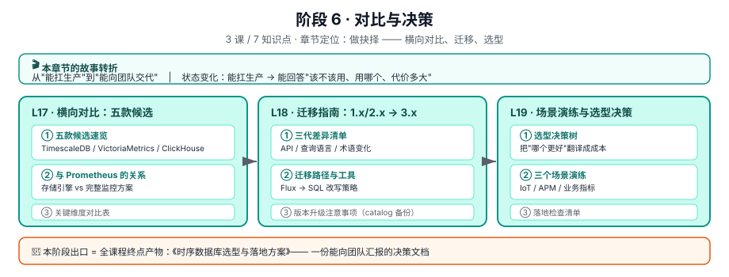

# 阶段 6 · 对比与决策

> 所属课程：[InfluxDB 3 系统学习](../../02-课程目录.md) ｜ 水平：进阶 · 决策参考
> 本阶段：**3 课 / 9 知识点** ｜ 状态：**✅ 已完成（3 / 3 课 · 7 / 7 知识点，2026-09-02 收官）**

## 🎬 本阶段在故事主线中的章节定位

| 章节 | 本阶段任务 | 主角的状态变化 |
|------|-----------|---------------|
| **第六章 · 做抉择** | 横向对比、迁移、选型 | 能扛生产 → **能向团队交代** |

**收束**：本阶段回答全课程开篇的那个大问题——

> "我们公司该不该用 InfluxDB？用哪个 SKU？怎么落地？成本多少？迁移代价多大？"

## 🎯 阶段目标

学完本阶段，你应该能够：

1. 把 InfluxDB 与 TimescaleDB / VictoriaMetrics / ClickHouse / Prometheus 放在同一张对比表里讲清取舍
2. 评估从 1.x/2.x 迁到 3.x 的代价，并给出可执行的迁移路径
3. 产出**《时序数据库选型与落地方案》**——一份能向团队汇报的决策文档

## 📚 必须掌握的知识点

### L17 · 横向对比：五款候选 ✅

| 知识点 | 关键点 |
|--------|--------|
| ① 五款候选速览 | InfluxDB 3 · TimescaleDB · VictoriaMetrics · ClickHouse · Prometheus |
| ② 与 Prometheus 的关系 | **存储引擎 vs 完整监控方案**；推模式 vs 拉模式 |
| ③ 关键维度对比表 | 写入 / 查询 / 压缩 / 生态 / 运维 / 成本 |

> 📌 **口径纪律**（沿用 zookeeper 课程的经验）：二手基准数字差异极大，**汇报时只取方向性结论，不把具体数值写进决策文档**。

📖 **讲义**：[lesson-17-横向对比-五款候选.md](lessons/lesson-17-横向对比-五款候选.md)

**本课核心结论（3 条）**：

1. **层次差**：**InfluxDB 3 Core 是存储引擎（发动机），Prometheus 是完整监控方案（整车）**——前者要配 Telegraf 采集、Grafana 展示、处理引擎告警，后者内置采集+存储+告警+服务发现。拿组件比整体是选型文档最常见也最致命的不公平对照。
2. **没有一款赢下全部场景**：实验 A 四个场景四个不同冠军（VM / VM / TimescaleDB / ClickHouse）。且**先排雷再打分**比打分本身重要——InfluxDB Core 在长期保留场景不是「分数低」，是**查不到**（432 文件 × 10min = 3 天，超限报错）。
3. **四个反直觉事实全部是官方自己说的**：①Prometheus 官方 FAQ 说拉模式只是 *"slightly better"* 且 *"should not be considered a major point"*；②Prometheus 官方说本地存储 *"not meant as durable long-term storage"*；③VictoriaMetrics 官网 20x/70x/7x 全是 `up to` + 厂商自述；④ClickHouse 官方说 *"Partitioning does not speed up queries"*。

> ⭐ **方法论产出（L18/L19 继续沿用）**：**Q0 分类 + 六问三档**的口径审计框架——拿到任何数字，先分「性能宣称 / 官方规格 / 理解错误」三类，再决定用哪套问法。**审计器自己也该被审计**（本课实验 B 升级 v2 就是被自己这条打脸后加的）。

### L18 · 迁移指南：从 1.x/2.x 到 3.x ✅

| 知识点 | 关键点 |
|--------|--------|
| ① 三代差异清单 | API / 查询语言 / 术语（bucket→database、measurement→table） |
| ② 迁移路径与工具 | Flux → SQL 改写策略；手写代码几乎都要重构 |
| ③ 版本升级注意事项 | ⚠️ 3.10+ catalog 格式 v2→v3 **单向迁移**，升级前必备份 |

📖 **讲义**：[lesson-18-迁移指南-从1x2x到3x.md](lessons/lesson-18-迁移指南-从1x2x到3x.md)

**本课核心结论（3 条）**：

1. **「静默」必须再分两类，后果差一个量级**：`reverse` = **方向反了**（想永久保留结果立刻全删 —— `0d`；降采样库 432 超限变成「存得下但查不到」），灾难级；`drift` = **幅度偏了**（`3mo` = 90 天 vs 三个自然月 91.3 天；`3y` = 1,095 天 vs 三个日历年 1,096 天），合规级。**混为一谈会让合规问题挤占对灾难问题的注意力。**
2. **不可逆点不止一个，且版本升级的不可逆点比数据迁移靠前得多**：数据迁移七阶段 S1-S5 随时可退、S6 收窄、S7 关死；而 3.9.x → 3.10+ 在**第 ④ 步（启动 3.10）就已不可逆**。**拿迁移的节奏去套升级，是本课最容易犯的结构性错误。**
3. **双写窗口可以算出来，不是拍脑袋**：下限 = 覆盖对账周期（1-3 天），上限 = **可查窗口**（Core = 3 天）→ **Core 上双写窗口实际只有 1-3 天，很窄**。双写写太久，最早的数据反而查不到了，双写失去对照意义；所以 S5 的对账脚本必须在双写开始前就写好。

> ⭐ **方法论产出（L19 沿用）**：**「失败时有没有声音」排序法** —— 迁移风险不能按「会失败的概率」排，要按**失败时有没有声音**排。报错型问题最坏是延期，静默反转最坏是丢数据且无人知晓。本课实验 A 用 `silent` 字段 + `kind` 字段把它代码化，就是为了让它不被淹没在清单里。

### L19 · 场景演练与选型决策 ✅

| 知识点 | 关键点 |
|--------|--------|
| ① 选型决策树 | 把"哪个更好"翻译成"在我的约束下哪个总成本最低" |
| ② 三个场景演练 | IoT / APM / 业务指标 |
| ③ 落地检查清单 | 可直接照着执行的 checklist |

📖 **讲义**：[lesson-19-场景演练与选型决策.md](lessons/lesson-19-场景演练与选型决策.md)

**本课核心结论（4 条）**：

1. **约束是有归属的 —— 432 文件上限是 Core 的属性，不是 InfluxDB 的属性**。实验 B 初版把它无条件套到全部五个 SKU，对 IoT 场景输出「最小调度周期需 ≥ 1216.7 分钟」（≈20 小时）的荒谬结论；修复后按 SKU 分列，结论变为「只有选 Core 才需要改周期」。**把 A 的约束套到 B 上，和把 A 的优点算到 B 头上，是同一类错误。**
2. **选型是两次决策，不是一次**。「我们选了 InfluxDB」没有携带信息 —— 五个 SKU 的硬约束差异极大（Core 3 天窗口 / 5 库 / 无 HA / 无合规；Serverless 无原生 v3 API、无处理引擎）。实验 A 四个场景三个把 Core 挡在门外。**Serverless 不是 Core 的托管版，两者能力集合不同。**
3. **打分器会输出冠军，但不会告诉你约束本身有问题**。新增**约束冲突检测**（步骤 1.5），区分「某 SKU 不满足约束」（排雷）与「约束之间打架」（冲突）。hybrid / IoT 两个场景触发：想托管 + 原生 v3 API + 处理引擎，在 InfluxDB 3 里没有便宜解，只能回到需求侧改约束。
4. **成本排序会被授权费翻转**。TCO 三方案中 Enterprise 未含商业授权费（官方 Contact Sales 不公开报价，按 CPU 核 8/16/32/64/128 批次售卖）；IoT 场景测算下运维人力（0.5 FTE = $7,500/月）是主机费（$240/月）的 **31 倍**。**此表价值在于告诉你该算哪些项，不在于给你答案。**

> ⭐ **方法论产出（全书第三课连缀）**：**「约束归属」检查法** —— 拿到任何一个约束，先问"这是谁的约束"。
> 与 L17 的「Q0 分类 + 六问三档」、L18 的「失败时有没有声音」同属一个家族：
> **在问"这个数字对不对"之前，先问"这是个什么性质的东西"。**

## 🏁 终点产物

**《时序数据库选型与落地方案》** —— 含选型结论、SKU 选择、容量与成本估算、迁移路径、风险清单。

> ✅ **已可生成**：改 `assets/l19_tco_calculator.py` 的 `WORKLOADS` 常量为真实负载后重跑，即可得到挂着自家数字的容量估算、TCO 三方案与落地检查清单；选型结论取自 `assets/l19_decision_tree.py` 的排雷与打分结果。

## 🧭 导航

⬅️ **上一阶段**：[阶段 5《生产落地》](../5-生产落地/overview.md)
🎉 **下一阶段**：无（本课程终点 · 全书 19 / 19 课 · 57 / 57 知识点已完成）
📚 **返回**：[课程目录](../../02-课程目录.md) ｜ [学习路径总览](../../01-学习路径总览.md)
