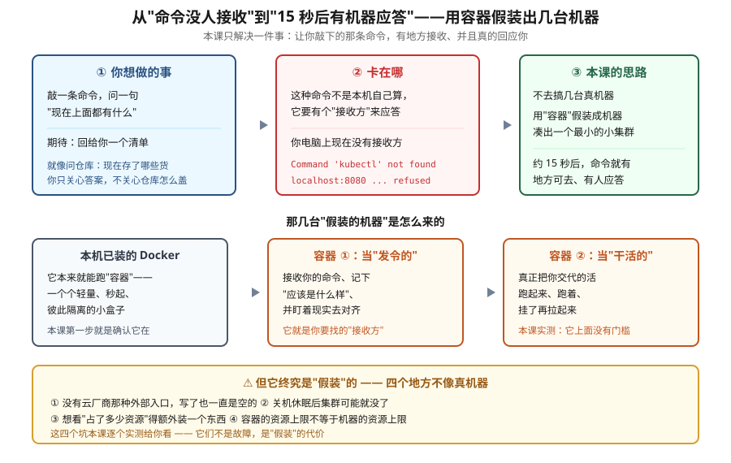

# 课前准备：搭建 k8s 学习环境

> 定位：本课程的**第 0 课**。先有能跑命令的环境，才有后面 20 课。
> 适用：WSL Ubuntu 24.04 + Docker + kind 本机学习环境
> 实测环境：Ubuntu 24.04.4 LTS · Docker 29.4.1 · kind v0.30.0 · kubectl v1.34.0 · helm v3.22.0 · 20 核 / 32 GB
> 核查日期：2026-09-15 · **所有命令与输出均在本机新建集群 `k8s-envtest` 上逐条实测**
> 📖 **结论已按官方文档核对**（核对于 2026-09 · 来源：Kubernetes 官方文档 · kind 官方文档 · metrics-server 仓库 releases）
> ⚠️ 核对中发现**两处与老教程冲突、以实测为准**：① metrics-server 的 `master`/`main` 分支 manifest 均 404，仅 release 路径可用；② kind 无 LoadBalancer，`EXTERNAL-IP` 恒 `<pending>` 属预期行为（详见知识点 5、6）

---

## 🎯 本课目标

- 从零搭起一个可用的 k8s 学习环境，每条命令照抄能跑通
- 知道本机环境里**哪些坑必踩**、为什么踩、怎么绕（inotify / WSL 休眠 / 无 LoadBalancer / metrics-server）
- 分清「学习环境」与「生产集群」的边界 —— 本课只解决前者
- 能自查环境是否健康，出问题时知道先看哪里

---

## 第一幕：起源与场景引入

🎬 **场景**：你想学 k8s，翻开教程第一课，它让你执行：

```bash
kubectl get pods
```

你照抄，终端回：

```
Command 'kubectl' not found
```

或者更糟 —— 你装了 kubectl，它回：

```
The connection to the server localhost:8080 was refused
```

**k8s 是分布式的，你没法像学 Python 那样 `pip install` 完就开始 `print`。** 它需要一个集群。而"搞一个集群"这件事，在 2014 年意味着三台机器、一堆证书、一个下午；今天它被压缩成了几分钟，但压缩掉的是步骤，不是概念。

**这不是"准备工作"，这是第一课。** 因为你在搭环境时遇到的每一个坑，都是后面 20 课里某个概念的提前登场：

| 搭环境时踩的坑 | 后面哪一课会正式讲 |
|---|---|
| `kubectl` 连不上 8080 | 课 2 · kubeconfig 与 API 访问 |
| Pod 一直 `Pending` | 课 13 · 调度与资源 |
| `kubectl top` 说 Metrics API 不可用 | 课 13 / 课 14 · 可观测性与 HPA |
| `LoadBalancer` 永远 `<pending>` | 课 7 / 课 8 · Service 与外部流量入口 |

> 💡 **一句话本质**：本课把你从「敲了命令没人应答」，变成「15 秒后有一个集群在应答」——做法是**不去弄几台真机器，而用容器假装出几台**。
>
> ⚖️ **处境对照**（数字均为本机实测，环境见文首）：
>
> | | 不搭环境（直接看后面 20 课） | 搭好本课的环境 |
> |---|---|---|
> | 学到第 3 课 | 概念全靠想象，`kubectl` 一条没跑过 | 每条命令都能自己跑出结果 |
> | 遇到报错 | 只能读文档里的示例输出 | 能改参数、复现、看到真实原文 |
> | 单次起集群 | —— | **15 秒**（`k8s-envtest` 实测：Ready 用时 15s） |
> | 一次性投入 | 0 | 约 20~30 分钟（含镜像拉取；本机 `kindest/node:v1.34.0` 已在缓存，Docker 剩余 754G） |
>
> ⏳ 说明：「20~30 分钟」为本机环境下的估计区间，其中镜像拉取占大头；若镜像已缓存或网络更快，可显著缩短。反过来，**跳过本课的真实代价是后面 20 课全部变成纸上谈兵**——这是本课不可跳过的理由。

---

## 第二幕：认知冲突

> ❓ **问题一**：k8s 不是"一套软件"吗？为什么装它要分那么多种方式？

因为它**不是**一个软件，是一个**控制平面的契约**。你装什么取决于你要哪一层：

| 方案 | 它是什么 | 适合谁 | 本机可跑 |
|---|---|---|---|
| **kind** | 用 Docker 容器假装成节点 | 学习 / CI | ✅ 本课用它 |
| **minikube** | 起一个 VM 或容器跑单节点集群 | 学习，想体验更多插件 | ✅ |
| **kubeadm** | 在真实机器上引导集群的工具 | 生产 / 想懂集群怎么来的 | ❌ 需多机（课 19 讲原理） |
| **云托管**（EKS/GKE/TKE） | 云厂商交付控制面 | 生产 | 需要云账号 |
| **Docker Desktop 内置** | 单机一键 | 快速尝鲜 | ✅ |

**k8s 本体是开源的，但"怎么装"从来不只有一种答案** —— 这也是为什么官方文档把「安装」单独开了一个大章节（见文末外部文档索引）。

> ❓ **问题二**：那我直接 `kubeadm init` 装个"真"的集群学，不是更接近生产吗？

**恰恰相反，对初学者是负收益。**

`kubeadm` 要求你先解决：容器运行时、cgroup 驱动、内核模块、网络插件、证书分发、多机互通。你会在**还没搞懂 Pod 是什么**的时候，先被 CNI 的 CIDR 配置卡两天。

而 kind 把这些全部藏起来：它的节点就是 Docker 容器，15 秒后你就有了一个**行为与生产一致**的集群 —— API 是同一个 API，`kubectl` 是同一个 `kubectl`，YAML 是同一份 YAML。

> 💡 **记住这个判断**：**学习环境的目标是"快速拿到一个行为正确的集群"，不是"复现生产的搭建过程"。** 后者是课 19 的内容，那时候你已经知道自己在装什么了。

> ❓ **问题三**：既然这么简单，为什么还有坑？

因为 **kind 的节点是容器，而容器不是真机器**。这个差异会在四个地方咬你：

1. **WSL 的 inotify 上限太低** → 集群根本起不来
2. **WSL 休眠会杀掉集群** → 第二天回来发现环境没了
3. **没有云厂商的 LoadBalancer** → `type: LoadBalancer` 永远 `<pending>`
4. **kubelet 用自签证书** → metrics-server 必须加一个生产不该加的参数

这四个坑，本课逐个实测给你看。

---

## 第三幕：层层揭示



**看图**：左边是你想做的事（敲命令问"上面有什么"），中间是你现在卡的地方（本机没有接收方，所以报 `not found` / `refused`），右边是本课的思路——**不搞真机器，用容器假装出几台**。下面一排是它怎么来的：你本机的 Docker 负责跑容器，一个容器当"发令的"（接收命令并盯着现实对齐），另一个当"干活的"（把活真正跑起来）。最下面的黄框是代价：**它是假装的，有四个地方不像真机器**，本课逐个实测。

**本课地图**（本质拆成 7 步，对应 7 个知识点）：

| 步 | 这一步要解决什么 | 对应 |
|---|---|---|
| 第 1 步 | 先搞清楚"我现在站在哪"，别在错误的基础上动工 | 知识点 1：环境自查 |
| 第 2 步 | 把缺的工具装上：发命令的、造集群的、打包的 | 知识点 2：装工具链 |
| 第 3 步 | 清掉一个会让集群根本起不来的系统限制 | 知识点 3：inotify 上限 |
| 第 4 步 | 真的把那几台"假装的机器"跑起来 | 知识点 4：建集群 |
| 第 5 步 | 认清它是假装的——哪四个地方会咬人 | 知识点 5：kind 四个边界 |
| 第 6 步 | 补上一个缺了就看不见资源占用的部件 | 知识点 6：装 metrics-server |
| 第 7 步 | 用完收干净，并学会自查环境是否健康 | 知识点 7：环境善后 |

### 知识点 1：环境自查 —— 先确认你站在哪里

🧭 **第 1/7 步｜承接**：第二幕留下的问题是"kind 看起来只要一条命令，为什么还有坑"——但在回答之前得先确认一件事：你脚下这块地是什么系统、有没有能跑容器的东西、工具齐全吗。本步先把"我现在站在哪"搞清楚。

**一句话定义**：搭环境之前，用一组只读命令确认 OS、容器运行时、工具链版本，避免在错误的基础上动工。

**直觉建立**：这跟做菜前先看冰箱里有什么一样。跳过这步，你会在第 5 步才发现版本不对，然后从头再来。

**核心原理**：kind 对底层有三个硬性要求 —— 能跑容器的 Docker、足够的 inotify 资源、以及能与之通信的 kubectl。三者缺一，失败信息都很难懂。

**示例演示：**

```bash
# ① 看操作系统
cat /etc/os-release | head -3

# ② 看 Docker 与它的 cgroup 驱动
docker --version
docker info --format '{{.CgroupDriver}} / {{.CgroupVersion}} / {{.Driver}}'

# ③ 看工具链版本
kubectl version --client
kind --version
helm version --short

# ④ 看硬件资源
nproc
free -h | head -2
```

**实测输出（本机）：**

```
PRETTY_NAME="Ubuntu 24.04.4 LTS"
NAME="Ubuntu"
VERSION_ID="24.04"

Docker version 29.4.1, build 055a478
systemd / 2 / overlayfs

Client Version: v1.34.0
Kustomize Version: v5.7.1
kind version 0.30.0
v3.22.0+g144ca65

20
               total        used        free      shared  buff/cache   available
Mem:            31Gi        21Gi       3.7Gi        79Mi       6.5Gi       9.8Gi
```

**读输出的两个关键点：**

- `systemd / 2 / overlayfs` —— **cgroup 驱动是 systemd、cgroup 版本是 v2**。这是现代发行版的标配；如果你看到 `cgroupfs` 或 `v1`，kind 仍能跑但会告警，且部分新特性不可用。
- `Client Version: v1.34.0` 里的 `Kustomize Version` —— **`kubectl` 内置了 kustomize**，所以你不需要单独装它（课 14 会用到）。

**常见误区：**

- ❌ 「`kubectl version` 只显示 Client 就是没连上集群」→ 恰恰相反，**`kubectl version` 本来就分 Client 和 Server 两段**。只显示 Client 说明**当前 context 里没有可达集群**，这是正常的（你还没建）。加 `--short` 或看 `Server Version` 才是集群版本。
- ❌ 「内存要 32G 才能学」→ 单节点 kind 集群空载约占用 1~2 GB。8 GB 内存的机器完全够跑完本课程全部实验，只是不能同时开很多东西。

**一句话记住**：**先只读自查再动手；`cgroup v2 + systemd` 是健康信号，缺少 `Server Version` 只说明还没建集群。**

---

### 知识点 2：装工具链 —— kubectl、kind、helm 三件套

🧭 **第 2/7 步｜承接**：上一步查清了"站在哪"，通常也暴露出缺件（本机当初就缺 `kind`）。本步把三个工具补齐——发命令的、造集群的、打包的。

**一句话定义**：`kubectl` 是遥控器，`kind` 是造集群的，`helm` 是包管理器；三者都是单个静态二进制，装法一致。

**直觉建立**：这三个东西**不依赖彼此**，也不依赖 Python/Node 运行时。它们就是三个下载下来就能跑的可执行文件。

**核心原理**：Go 语言编译出的静态二进制，把所有依赖打进一个文件。所以"安装"的本质就是：**下载 → 加执行权限 → 放到 PATH 里**。

**示例演示（Linux）：**

```bash
# ① kubectl（官方推荐按版本下载）
curl -LO "https://dl.k8s.io/release/$(curl -L -s https://dl.k8s.io/release/stable.txt)/bin/linux/amd64/kubectl"
chmod +x kubectl
sudo mv kubectl /usr/local/bin/kubectl

# ② kind
curl -Lo ./kind https://kind.sigs.k8s.io/dl/v0.30.0/kind-linux-amd64
chmod +x ./kind
sudo mv ./kind /usr/local/bin/kind

# ③ helm（官方脚本）
curl https://raw.githubusercontent.com/helm/helm/main/scripts/get-helm-3 | bash

# ④ 验证
kubectl version --client
kind --version
helm version --short
```

> ⚠️ **版本选择**：上面 kubectl 用的是 `stable.txt`（最新版）。**若你要考 CKA 或对齐特定版本**，把 `$(curl -s .../stable.txt)` 换成具体版本，如 `v1.34.0`。

**实测（本机已装，确认位置）：**

```bash
which kubectl kind helm
```

```
/usr/local/bin/kubectl
/usr/local/bin/kind
/usr/local/bin/helm
```

> 📌 **本机安装记录**：kubectl v1.34.0、kind v0.30.0、helm v3.22.0（2026-09-10 装，helm 走官方脚本装至 `/usr/local/bin/helm`）。

**常见误区：**

- ❌ 「用系统包管理器 `apt install kubectl` 更省事」→ **不推荐**。发行版源里的版本通常严重滞后（Ubuntu 24.04 源里可能还是 v1.2x），会出现客户端与服务端版本差太多的怪问题。官方要求是 **客户端与集群版本相差不超过一个小版本**。
- ❌ 「kubectl 必须装在集群里」→ kubectl **永远装在你的操作机上**，它只是个 HTTP 客户端，通过 kubeconfig 找到 API Server。

**一句话记住**：**三个静态二进制放进 PATH 就完事；别用系统源装 kubectl，版本会坑你。**

---

### 知识点 3：WSL 必踩的坑 —— inotify 上限

🧭 **第 3/7 步｜承接**：工具齐了，但别急着建集群——WSL 上有一道系统限制会让它**根本起不来**，而且报错信息完全不提 inotify。本步先把它清掉。
**一句话定义**：WSL 默认的 `fs.inotify.max_user_instances` 是 128，太小，会导致 kind 建集群**直接失败**。

**直觉建立**：inotify 是 Linux 内核的"文件变化监听"机制。k8s 里到处都要它（kubelet 监听配置、容器监听文件）。**每个实例能开的监听数有限**，而 k8s 组件一个就开一堆。

**核心原理**：WSL 为节省资源把这个上限设得很低。当 kind 节点容器内的组件试图注册 inotify 实例时，内核返回 `Too many open files`，于是 **kubelet 起不来 → 控制面起不来 → 集群创建失败**。

**示例演示：**

```bash
# ① 先看当前值
sysctl -n fs.inotify.max_user_instances
```

**本机当前值（已修复）：**

```
512
```

如果这里显示 `128`，**先修再建集群**：

```bash
# ② 临时生效
sudo sysctl -w fs.inotify.max_user_instances=512

# ③ 永久生效（写入配置文件）
echo "fs.inotify.max_user_instances=512" | sudo tee -a /etc/sysctl.conf
sudo sysctl -p
```

> 📌 **本机修复记录**（2026-09-10）：失败原文为 `Failed to create control group inotify object: Too many open files`。修复已写入 `/etc/sysctl.conf` 永久生效（备份 `/etc/sysctl.conf.bak.20260910-*`）。实测容器内生效值同步为 `512` —— 说明 WSL 的 sysctl 会透传给 Docker 容器。

**实测确认透传：**

```bash
docker exec k8s-envtest-control-plane sysctl -n fs.inotify.max_user_instances
```

```
512
```

**常见误区：**

- ❌ 「报错说 Too many open files，那是文件描述符 ulimit 的问题」→ **不是**。这里的 `open files` 是 inotify 实例耗尽，改 `ulimit -n` 无效，必须改 `fs.inotify.max_user_instances`。
- ❌ 「改成 512 就够了，越大越好」→ 512 对单节点学习集群绰绰有余。盲目调到几十万会白占内核内存。

**一句话记住**：**kind 起不来先查 inotify；WSL 默认 128 必踩，改 512 并写进 `sysctl.conf`。**

---

### 知识点 4：建集群 —— 15 秒拿到一个 k8s

🧭 **第 4/7 步｜承接**：限制清完了，终于可以动手——把那几台"假装的机器"真的跑起来，并验证它确实在应答。
**一句话定义**：`kind create cluster` 会拉起一个容器当作"节点"，在容器内启动 kubelet 与控制面，并把访问凭证写进你的 kubeconfig。

**直觉建立**：**kind = Kubernetes IN Docker**。它骗过了 k8s —— k8s 以为自己跑在一台真机器上，其实那台"机器"是个容器。

**核心原理**：kind 用 `kindest/node` 镜像启动容器，容器内预装了 kubelet、containerd 和 kubeadm。kind 在容器里调 kubeadm 完成引导，再把 API Server 的端口映射到宿主机，最后把连接信息写进 `~/.kube/config`。

**示例演示：**

```bash
# 建集群（--wait 表示等控制面 Ready 再返回）
kind create cluster --name k8s-c1 --wait 120s
```

**实测输出（新建 `k8s-envtest`，完整原文）：**

```
 ✓ Ensuring node image (kindest/node:v1.34.0) 🖼
 • Preparing nodes 📦   ...
 ✓ Preparing nodes 📦
 • Writing configuration 📜  ...
 ✓ Writing configuration 📜
 • Starting control-plane 🕹️  ...
 ✓ Starting control-plane 🕹️
 • Installing CNI 🔌  ...
 ✓ Installing CNI 🔌
 • Installing StorageClass 💾  ...
 ✓ Installing StorageClass 💾
 • Waiting ≤ 2m0s for control-plane = Ready ⏳  ...
 ✓ Waiting ≤ 2m0s for control-plane = Ready ⏳
 • Ready after 15s 💚
Set kubectl context to "kind-k8s-envtest"
```

> ⏱️ **实测耗时**：控制面 **Ready after 15s**。首次执行需要拉取 `kindest/node` 镜像（约 1.45 GB），耗时会长很多；镜像已缓存后就是十几秒。

**验证集群活着：**

```bash
kubectl cluster-info --context kind-k8s-c1
kubectl get nodes
```

**实测输出：**

```
NAME                        STATUS   ROLES           AGE   VERSION   INTERNAL-IP   EXTERNAL-IP   OS-IMAGE                         KERNEL-VERSION                     CONTAINER-RUNTIME
k8s-envtest-control-plane   Ready    control-plane   41s   v1.34.0   172.27.0.4    <none>        Debian GNU/Linux 12 (bookworm)   6.6.87.2-microsoft-standard-WSL2   containerd://2.1.3
```

**裸集群里默认有什么（实测）：**

```bash
kubectl get pods -A
```

| 命名空间 | Pod | 作用 |
|---|---|---|
| kube-system | `etcd-<节点名>` | 集群数据库 |
| kube-system | `kube-apiserver-<节点名>` | API 入口 |
| kube-system | `kube-controller-manager-<节点名>` | 控制器 |
| kube-system | `kube-scheduler-<节点名>` | 调度器 |
| kube-system | `coredns-*` ×2 | 集群 DNS（课 7） |
| kube-system | `kindnet-*` | CNI 网络插件 |
| kube-system | `kube-proxy-*` | Service 转发（课 7） |
| local-path-storage | `local-path-provisioner-*` | 动态存储供给（课 12） |

> 💡 **这四个带 `<节点名>` 后缀的 Pod 就是"控制面"**，它们在课 1 的架构图里出现过，现在你能亲眼看到它们了。它们是**静态 Pod**（课 18 会讲）。

**默认 StorageClass（实测）：**

```bash
kubectl get sc
```

```
NAME                 PROVISIONER             RECLAIMPOLICY   VOLUMEBINDINGMODE      ALLOWVOLUMEEXPANSION   AGE
standard (default)   rancher.io/local-path   Delete          WaitForFirstConsumer   false                  36s
```

**常见误区：**

- ❌ 「单节点集群的控制面有污点，跑不了业务 Pod」→ **kind 默认没有污点**。实测 `Taints: <none>`，业务 Pod 直接能跑在控制面上。这是 kind 为方便学习做的取舍，**真实生产集群的控制面通常有 `NoSchedule` 污点**。
- ❌ 「`--wait 120s` 是超时时间」→ 它是**最长等待时间**，实际 15s 就绪就返回了。
- ❌ 「删了容器就等于删了集群」→ 应该始终用 `kind delete cluster --name <名字>`，它会清理容器、网络和 kubeconfig 条目。

**一句话记住**：**`kind create cluster` 用容器假装成节点，15 秒给你一个行为与生产一致的真集群；kind 节点默认无污点。**

---

### 知识点 5：kind 不是真机器 —— 四个边界

🧭 **第 5/7 步｜承接**：集群起来了、也能应答，但它终究是容器装出来的。第二幕承诺过要讲清"假装"的代价——本步把会咬人的四个地方逐个实测。
**一句话定义**：kind 节点是容器，这带来四个与真实集群的差异，知道它们才不会误判。

**直觉建立**：容器共享宿主机内核、没有独立 IP、没有云厂商控制器。这些"不像机器"的地方，就是你踩坑的地方。

#### 边界 ①：没有 LoadBalancer（最常踩）

**实测：**

```bash
kubectl create deployment web --image=nginx:alpine --replicas=2
kubectl expose deployment web --port=80 --type=LoadBalancer
kubectl get svc web
```

```
NAME   TYPE           CLUSTER-IP   EXTERNAL-IP   PORT(S)        AGE
web    LoadBalancer   10.96.4.86   <pending>     80:32634/TCP   3s
```

**`EXTERNAL-IP` 永远停在 `<pending>`**，且：

```bash
kubectl get svc web -o jsonpath='{.status.loadBalancer}'
```

```
{}
```

> 🔑 **为什么**：`LoadBalancer` 类型需要**云厂商的控制器**来分配外部 IP 并配置负载均衡器。kind 没有这个控制器，所以没人认领这个 Service，**它会一直 pending 下去，这不是故障**。
>
> **学习时怎么办**：看 `PORT(S)` 列的 `32634` —— 这是自动分配的 **NodePort**，用它访问（课 7 会讲 NodePort）。或者装 MetalLB 之类的裸机方案（超出本课范围）。
>
> **课 9 关联**：Gateway API 的 Gateway 在 kind 上 `Programmed` 可能长时间为 `False`，**同一个原因** —— 没有 LB 分配地址。

#### 边界 ②：端口映射只有 6443

**实测：**

```bash
docker ps --filter name=k8s-envtest --format '{{.Ports}}'
```

```
127.0.0.1:43613->6443/tcp
```

> 只有 API Server 的 6443 被映射到宿主机（且只绑 `127.0.0.1`）。**想从宿主机访问集群内的 Service，需要自己加 `extraPortMappings`**（建集群时在配置文件里声明）。

#### 边界 ③：WSL 休眠会杀掉集群

> ⚠️ **WSL 休眠或 `wsl --shutdown` 会导致 kind 集群不可用。** 长时间中断后需重建集群（重建约 1 分钟，镜像已缓存的话无需重新拉取）。
>
> **判断方法**：`kubectl get nodes` 报连接错误，先 `docker ps` 看节点容器是否还在。容器没了就重建。

#### 边界 ④：kubelet 用自签证书 → metrics-server 要特殊参数

见下一个知识点，这是唯一需要你**主动改配置**的边界。

**一句话记住**：**kind 没有云厂商：`LoadBalancer` 永远 pending、只映射 6443、WSL 休眠即失联、证书自签要加参数。**

---

### 知识点 6：装 metrics-server —— 让 `kubectl top` 与 HPA 能用

🧭 **第 6/7 步｜承接**：四个边界里最常被当成"故障"的，是 `kubectl top` 说 Metrics API 不可用——它不是坏了，是少装了一个部件。本步补上它，顺带踩两个老教程的坑。
**一句话定义**：metrics-server 是集群的资源指标采集器；没有它，`kubectl top` 和 HPA 都不可用。

**直觉建立**：k8s 核心组件**不采集** CPU/内存用量数据。这是个独立的聚合层扩展（课 20 讲聚合层）。你想看"这个 Pod 吃了多少内存"，必须额外装它。

#### 先看没装时的报错（实测原文）

```bash
kubectl top nodes
```

```
error: Metrics API not available
```

```bash
kubectl get apiservice v1beta1.metrics.k8s.io
```

```
Error from server (NotFound): apiservices.apiregistration.k8s.io "v1beta1.metrics.k8s.io" not found
```

> 📌 记住 `error: Metrics API not available` 这句 —— **它是"你没装 metrics-server"的招牌报错**。

#### 安装（⚠️ 关键：网上大量教程的 URL 已失效）

```bash
kubectl apply -f https://github.com/kubernetes-sigs/metrics-server/releases/latest/download/components.yaml
```

> ❗ **实测踩坑**：很多教程写的是
> `https://raw.githubusercontent.com/kubernetes-sigs/metrics-server/master/manifests/components.yaml`
> **该路径现已 404**（`main` 分支同理，同样 404）。实测三个 URL 的 HTTP 状态码：
>
> | URL | 状态 |
> |---|---|
> | `.../releases/latest/download/components.yaml` | **200 ✅** |
> | `.../main/manifests/components.yaml` | 404 ❌ |
> | `.../master/manifests/components.yaml` | 404 ❌ |
>
> **只有 release 下载路径可用。** 照抄老教程会得到 `unable to read URL ... 404 Not Found`。

**实测安装输出：**

```
serviceaccount/metrics-server created
clusterrole.rbac.authorization.k8s.io/system:aggregated-metrics-reader created
clusterrole.rbac.authorization.k8s.io/system:metrics-server created
rolebinding.rbac.authorization.k8s.io/metrics-server-auth-reader created
clusterrolebinding.rbac.authorization.k8s.io/metrics-server:system:auth-delegator created
clusterrolebinding.rbac.authorization.k8s.io/system:metrics-server created
service/metrics-server created
deployment.apps/metrics-server created
apiservice.apiregistration.k8s.io/v1beta1.metrics.k8s.io created
```

#### kind 必需的一步：加 `--kubelet-insecure-tls`
```bash
kubectl patch -n kube-system deployment metrics-server --type=json \
  -p '[{"op":"add","path":"/spec/template/spec/containers/0/args/-","value":"--kubelet-insecure-tls"}]'
```

**为什么**：metrics-server 通过 HTTPS 抓 kubelet 的指标，而 **kind 节点的 kubelet 证书是自签的、且不包含节点 IP 的 SAN**，证书校验必然失败，metrics-server 会一直 `CrashLoopBackOff` 或报 `x509: cannot validate certificate`。

**验证：**

```bash
kubectl rollout status -n kube-system deployment/metrics-server --timeout=300s
sleep 25   # 等首次采集完成（metrics-server 默认 15s 一次）
kubectl top nodes
```

> ⏱️ **首次安装请耐心**：实测镜像 `metrics-server/metrics-server:v0.9.0` **拉取耗时 2m41s**（约 23 MB）。若 `--timeout` 设得太短（如 150s），`rollout status` 会在镜像尚未拉完时就超时退出 —— **这不代表失败**，Pod 仍在后台继续拉取并启动。
>
> **判断方法**：看 `kubectl get apiservice v1beta1.metrics.k8s.io` 的 `AVAILABLE` 列。拉取期间显示 `False (FailedDiscoveryCheck)`，就绪后变 `True`。镜像已缓存后重装只需十几秒。

**实测输出：**

```
NAME                        CPU(cores)   CPU(%)   MEMORY(bytes)   MEMORY(%)   
k8s-envtest-control-plane   98m          0%       782Mi           2%          
```

```bash
kubectl get apiservice v1beta1.metrics.k8s.io
```

```
NAME                     SERVICE                      AVAILABLE   AGE
v1beta1.metrics.k8s.io   kube-system/metrics-server   True        54s
```

> ⏱️ **刚装完就 `top` 可能仍报 Metrics API not available** —— 需要等首次采集（约 15~30 秒）。**这不是没装成功，是还没采到。**

**常见误区：**

- ❌ 「生产环境也这么装」→ **`--kubelet-insecure-tls` 关闭了证书校验，生产绝不能加**。它只为绕过 kind 的自签证书。生产应由集群 CA 正确签发 kubelet 证书。
- ❌ 「装完就能立刻 `kubectl top`」→ 要等一个采集周期。
- ❌ 「HPA 不需要它」→ **HPA 完全依赖 metrics API**。没装时 HPA 的 TARGETS 会一直是 `<unknown>`：
  ```
  NAME   REFERENCE        TARGETS              MINPODS   MAXPODS   REPLICAS   AGE
  web    Deployment/web   cpu: <unknown>/50%   2         5         2          21s
  ```
  装好后才会显示实际百分比。

**一句话记住**：**没装 metrics-server = `Metrics API not available`；kind 上必须补 `--kubelet-insecure-tls`（生产禁用）；装完要等 15~30 秒才有数。**

---

### 知识点 7：环境善后 —— 清理与健康自查

🧭 **第 7/7 步｜承接**：环境能用了，但用完要收干净（本课建的测试集群已销毁，不是留在机器上的垃圾）。本步给出清理动作与一套健康自查清单。
**一句话定义**：学会正确地销毁集群、切换上下文，以及在环境出问题时按固定顺序自查。

**直觉建立**：多个集群共存时，**你执行的每条 `kubectl` 都作用在当前 context 上**。打错地方比没执行更糟。

#### 上下文管理（实测）

```bash
kubectl config get-contexts -o name | grep kind
```

```
kind-k8s-c1
kind-k8s-envtest
kind-otel-l11
```

```bash
# 切换集群（每条命令都要确认自己在哪）
kubectl config use-context kind-k8s-c1

# 或临时指定（更安全，不影响后续命令）
kubectl --context kind-k8s-c1 get pods
```

> ⚠️ **本课程用独立集群名 `k8s-c1`，与 `otel-l11`（OpenTelemetry 课程遗留）隔离，避免互相干扰。**

#### 销毁集群

```bash
kind delete cluster --name k8s-c1
```

> 会清理容器、Docker 网络与 kubeconfig 条目。**别用 `docker rm -f` 直接删节点容器** —— 那样会在 kubeconfig 里留下指向已死集群的僵尸条目。

#### 健康自查清单（出问题按顺序查）

| 顺序 | 检查 | 命令 | 健康信号 |
|---|---|---|---|
| 1 | Docker 活着吗 | `docker ps` | 能列出容器，无 `Cannot connect` |
| 2 | 节点容器在吗 | `docker ps --filter name=<集群名>` | 有 `<集群名>-control-plane` 且状态 Up |
| 3 | 上下文对吗 | `kubectl config current-context` | 是你要操作的集群 |
| 4 | 节点 Ready 吗 | `kubectl get nodes` | `Ready`（不是 `NotReady` / 连接报错） |
| 5 | 控制面活着吗 | `kubectl get pods -n kube-system` | 4 个带节点名的 Pod 全 Running |
| 6 | 指标能用吗 | `kubectl top nodes` | 有数值，不是 `Metrics API not available` |

> 🔑 **第 2 步最能省时间**：如果节点容器都没了，后面 3~6 步全是报错。**WSL 休眠后大概率就是这一步挂了** —— 直接重建，别浪费时间排障。

**一句话记住**：**先确认 context 再敲命令；环境挂了先看节点容器在不在，不在就重建。**

---

## 第四幕：实操验证

> 以下为**完整可照抄流程**。每条命令均在新建集群 `k8s-envtest` 上实测通过。

### 验证 1：环境自查（只读）

```bash
cat /etc/os-release | head -3
docker --version
docker info --format '{{.CgroupDriver}} / {{.CgroupVersion}} / {{.Driver}}'
kubectl version --client
kind --version
sysctl -n fs.inotify.max_user_instances
```

**实测输出：**

```
PRETTY_NAME="Ubuntu 24.04.4 LTS"
Docker version 29.4.1, build 055a478
systemd / 2 / overlayfs
Client Version: v1.34.0
Kustomize Version: v5.7.1
kind version 0.30.0
512
```

✅ **判定**：`cgroup v2 + systemd` 且 inotify = 512，环境健康，可以建集群。

### 验证 2：建集群并确认控制面

```bash
kind create cluster --name k8s-c1 --wait 120s
kubectl get nodes
kubectl get pods -A
```

**实测输出（节选）：**

```
 • Ready after 15s 💚
Set kubectl context to "kind-k8s-c1"

NAME                   STATUS   ROLES           AGE   VERSION
k8s-c1-control-plane   Ready    control-plane   41s   v1.34.0
```

```bash
kubectl get pods -A
```

```
NAMESPACE            NAME                                                READY   STATUS    RESTARTS   AGE
kube-system          coredns-66bc5c9577-877gj                            1/1     Running   0          32s
kube-system          coredns-66bc5c9577-tlcfc                            1/1     Running   0          32s
kube-system          etcd-k8s-envtest-control-plane                      1/1     Running   0          39s
kube-system          kindnet-ddsrt                                       1/1     Running   0          33s
kube-system          kube-apiserver-k8s-envtest-control-plane            1/1     Running   0          38s
kube-system          kube-controller-manager-k8s-envtest-control-plane   1/1     Running   0          38s
kube-system          kube-proxy-hp8rk                                    1/1     Running   0          33s
kube-system          kube-scheduler-k8s-envtest-control-plane            1/1     Running   0          38s
local-path-storage   local-path-provisioner-7b8c8ddbd6-5ndk4             1/1     Running   0          32s
```

✅ **判定**：4 个控制面 Pod + coredns + kindnet + kube-proxy + local-path 全部 Running。

### 验证 3：确认 kind 节点无污点（业务 Pod 能调度）

```bash
kubectl describe node k8s-c1-control-plane | grep -A1 'Taints:'
```

**实测输出：**

```
Taints:             <none>
Unschedulable:      false
```

✅ **判定**：无污点，业务 Pod 可调度到控制面（生产集群通常相反）。

### 验证 4：跑一个应用，确认调度与网络

```bash
kubectl create deployment web --image=nginx:alpine --replicas=2
sleep 15
kubectl get pods -o wide
```

**实测输出：**

```
NAME                   READY   STATUS    RESTARTS   AGE   IP           NODE                        NOMINATED NODE   READINESS GATES
web-6d689fbfdf-6dfzc   1/1     Running   0          14s   10.244.0.6   k8s-envtest-control-plane   <none>           <none>
web-6d689fbfdf-hcv6q   1/1     Running   0          14s   10.244.0.5   k8s-envtest-control-plane   <none>           <none>
```

✅ **判定**：两个副本 Running 且**拿到了 Pod IP**（10.244.x.x，这是 kindnet 的网段）。

### 验证 5：确认 kind 没有 LoadBalancer

```bash
kubectl expose deployment web --port=80 --type=LoadBalancer
kubectl get svc web
kubectl get svc web -o jsonpath='{.status.loadBalancer}'
```

**实测输出：**

```
NAME   TYPE           CLUSTER-IP   EXTERNAL-IP   PORT(S)        AGE
web    LoadBalancer   10.96.4.86   <pending>     80:32634/TCP   3s

{}
```

✅ **判定**：`EXTERNAL-IP` 停在 `<pending>`、`status.loadBalancer` 为空 —— **这是 kind 的预期行为，不是故障**。改用 `PORT(S)` 里的 NodePort `32634` 访问。

### 验证 6：装 metrics-server 并让 `kubectl top` 出数

```bash
kubectl top nodes
```

**装之前（实测原文）：**

```
error: Metrics API not available
```

```bash
kubectl apply -f https://github.com/kubernetes-sigs/metrics-server/releases/latest/download/components.yaml
kubectl patch -n kube-system deployment metrics-server --type=json \
  -p '[{"op":"add","path":"/spec/template/spec/containers/0/args/-","value":"--kubelet-insecure-tls"}]'
kubectl rollout status -n kube-system deployment/metrics-server --timeout=300s
sleep 25
kubectl top nodes
```

> ⚠️ **首次安装注意**：实测镜像拉取耗时 **2m41s**，故 `--timeout` 用 300s。若用 150s 会在镜像未拉完时超时退出（**非失败**，Pod 仍在后台拉取）。判据是 `kubectl get apiservice v1beta1.metrics.k8s.io` 的 `AVAILABLE` 列：拉取期间为 `False (FailedDiscoveryCheck)`，就绪后为 `True`。

**装之后（实测输出）：**

```
deployment "metrics-server" successfully rolled out

NAME                        CPU(cores)   CPU(%)   MEMORY(bytes)   MEMORY(%)   
k8s-envtest-control-plane   98m          0%       782Mi           2%          
```

✅ **判定**：`kubectl top` 出数，metrics-server 版本 `registry.k8s.io/metrics-server/metrics-server:v0.9.0`。

### 验证 7：确认 HPA 依赖 metrics（装前后的对比）

```bash
kubectl autoscale deployment web --cpu-percent=50 --min=2 --max=5
kubectl get hpa
```

**实测输出（metrics 尚不可用时）：**

```
Flag --cpu-percent has been deprecated, Use --cpu with percentage or resource quantity format (e.g., '70%' for utilization or '500m' for milliCPU).
horizontalpodautoscaler.autoscaling/web autoscaled

NAME   REFERENCE        TARGETS              MINPODS   MAXPODS   REPLICAS   AGE
web    Deployment/web   cpu: <unknown>/50%   2         5         2          21s
```

> ⚠️ 两条实测信息：
> 1. **`TARGETS` 为 `<unknown>`** —— 本例是因为刚建 HPA、还没采到数据。**若长时间 `<unknown>`，就是 metrics-server 没装或不可用。**
> 2. **`--cpu-percent` 已废弃** —— v1.34 提示改用 `--cpu`，如 `kubectl autoscale deployment web --cpu=50% --min=2 --max=5`。

### 验证 8：清理实验残留

```bash
kubectl delete svc web
kubectl delete deployment web
kubectl delete hpa web
```

```bash
# 确认干净（只剩默认组件）
kubectl get all -A | grep -v 'kube-system\|local-path-storage'
```

✅ **判定**：无残留业务资源。

---

## 第五幕：体系收束

### 🧠 本课心智模型：环境的四层

```
┌─────────────────────────────────────────┐
│ ① 操作机（WSL Ubuntu）                    │  ← kubectl / helm 装在这里
├─────────────────────────────────────────┤
│ ② 容器运行时（Docker 29.4.1）             │  ← cgroup v2 + systemd
├─────────────────────────────────────────┤
│ ③ 节点（kind = 一个 Docker 容器）         │  ← 里面跑 kubelet + containerd
├─────────────────────────────────────────┤
│ ④ 集群（控制面 + CNI + StorageClass）     │  ← 15 秒组装完成
└─────────────────────────────────────────┘
```

**理解这个分层，你就知道报错该往哪一层找**：`docker ps` 看不到容器 → 问题在 ②；容器在但 `kubectl` 连不上 → 问题在 ③；连上了但 Pod Pending → 问题在 ④。

### 📋 速查卡

| 我想… | 命令 |
|---|---|
| 看环境版本 | `kubectl version --client && kind --version && docker --version` |
| 查 inotify | `sysctl -n fs.inotify.max_user_instances`（应为 512，WSL 默认 128 必踩） |
| 修 inotify | `echo "fs.inotify.max_user_instances=512" \| sudo tee -a /etc/sysctl.conf && sudo sysctl -p` |
| 建集群 | `kind create cluster --name k8s-c1 --wait 120s` |
| 看所有集群 | `kind get clusters` |
| 切集群 | `kubectl config use-context kind-k8s-c1` |
| 临时指定集群 | `kubectl --context kind-k8s-c1 get pods` |
| 装 metrics-server | `kubectl apply -f https://github.com/kubernetes-sigs/metrics-server/releases/latest/download/components.yaml` |
| kind 上补参数 | `kubectl patch -n kube-system deploy metrics-server --type=json -p '[{"op":"add","path":"/spec/template/spec/containers/0/args/-","value":"--kubelet-insecure-tls"}]'` |
| 看资源用量 | `kubectl top nodes` / `kubectl top pods -A` |
| 删集群 | `kind delete cluster --name k8s-c1` |

### ⚠️ 本课误区清单

1. **「用 `apt install kubectl` 装就行」** → 发行版源版本滞后，客户端与集群差太多会出怪问题。官方要求相差不超过一个小版本。
2. **「`kubectl version` 只显示 Client 说明装错了」** → 只是当前 context 没有可达集群，正常。
3. **「Too many open files 是 ulimit 问题」** → kind 场景是 inotify 实例耗尽，须改 `fs.inotify.max_user_instances`，改 `ulimit -n` 无效。
4. **「kind 控制面有污点，跑不了业务 Pod」** → 实测 `Taints: <none>`，能跑。生产才默认有 `NoSchedule`。
5. **「`LoadBalancer` 一直 pending 是集群坏了」** → kind 没有云厂商控制器，**预期行为**。用 NodePort 访问。
6. **「metrics-server 用 master 分支的 manifest」** → **已 404**。只有 `releases/latest/download/components.yaml` 可用。
7. **「生产也加 `--kubelet-insecure-tls`」** → 它关闭证书校验，**生产禁用**，仅用于绕过 kind 自签证书。
8. **「装完 metrics-server 立刻能 top」** → 要等一个采集周期（15~30 秒），否则仍报 Metrics API not available。
9. **「HPA 不依赖 metrics-server」** → 完全依赖，没装时 TARGETS 恒为 `<unknown>`。
10. **「删节点容器就等于删集群」** → 应用 `kind delete cluster`，否则留僵尸 kubeconfig 条目。
11. **「WSL 休眠后集群还在」** → 大概率失联。**先看节点容器在不在，不在就重建**，别排障。
12. **「`--cpu-percent` 是推荐写法」** → v1.34 已提示废弃，改用 `--cpu=50%`。
13. **「`rollout status` 超时 = 安装失败」** → 首次安装镜像拉取实测耗时 **2m41s**，`--timeout=150s` 会提前退出，**但 Pod 仍在后台拉取**。用 `kubectl get apiservice v1beta1.metrics.k8s.io` 的 `AVAILABLE` 列判断真实进度，超时设 300s。

### 📚 事实核查表

| # | 结论 | 来源 | 状态 |
|---|------|------|------|
| 1 | 本机 OS = Ubuntu 24.04.4 LTS | `cat /etc/os-release` | ✅ 已实测 |
| 2 | Docker 29.4.1，cgroup 驱动 systemd、cgroup v2 | `docker info --format` | ✅ 已实测 |
| 3 | kubectl v1.34.0（内置 kustomize v5.7.1） | `kubectl version --client` | ✅ 已实测 |
| 4 | kind v0.30.0 / helm v3.22.0 | `kind --version` / `helm version` | ✅ 已实测 |
| 5 | inotify 当前值 512，且透传进容器 | `sysctl -n` + `docker exec` 对照 | ✅ 已实测 |
| 6 | 集群 Ready 用时 15s | `kind create cluster` 输出原文 | ✅ 已实测 |
| 7 | 裸集群默认 9 个 Pod（4 控制面 + coredns×2 + kindnet + kube-proxy + local-path） | `kubectl get pods -A` | ✅ 已实测 |
| 8 | 默认 StorageClass = `standard`（rancher.io/local-path，WaitForFirstConsumer） | `kubectl get sc` | ✅ 已实测 |
| 9 | kind 控制面无污点（Taints: none） | `kubectl describe node` | ✅ 已实测 |
| 10 | LoadBalancer EXTERNAL-IP 恒 `<pending>`，`status.loadBalancer` 为空 | `kubectl get svc` + jsonpath | ✅ 已实测 |
| 11 | kind 仅映射 6443 到 127.0.0.1 | `docker ps --format '{{.Ports}}'` | ✅ 已实测 |
| 12 | 未装 metrics-server 时报错原文 `error: Metrics API not available` | `kubectl top nodes` | ✅ 已实测 |
| 13 | metrics-server 三个 manifest URL 中仅 release 路径为 200，main/master 均 404 | `curl -sIL -w '%{http_code}'` | ✅ 已实测 |
| 14 | 安装后 `kubectl top` 输出 98m / 782Mi，版本 v0.9.0 | `kubectl top nodes` + jsonpath | ✅ 已实测 |
| 15 | HPA 无 metrics 时 TARGETS 为 `<unknown>`，`--cpu-percent` 已废弃 | `kubectl get hpa` | ✅ 已实测 |
| 16 | 容器内 containerd v2.1.3、节点 OS 为 Debian 12 | `docker exec ... containerd --version` | ✅ 已实测 |
| 21 | 首次安装 metrics-server 镜像拉取耗时 **2m41s**（23 MB），`--timeout=150s` 会提前退出但实际仍在拉取 | 逐字复验脚本（复现 1 次）+ `kubectl get events` | ✅ 已实测 |
| 22 | 拉取期间 `apiservice` 为 `False (FailedDiscoveryCheck)`，就绪后 `True` | `kubectl get apiservice` | ✅ 已实测 |
| 17 | WSL 休眠导致 kind 集群不可用，需重建 | 本机历史记录（2026-09-10 档案） | 📄 **历史记录，本课未复现** |
| 18 | `Failed to create control group inotify object: Too many open files` 为修复前报错原文 | 本机历史记录（2026-09-10 档案） | 📄 **历史记录，本课未复现** |
| 19 | 生产集群控制面通常带 `NoSchedule` 污点 | 通用实践 | 📄 **文档结论，本机 kind 无法对照** |
| 20 | 客户端与集群版本相差不超过一个小版本（官方 skew 策略） | 官方文档版本偏差策略 | 📄 文档结论 |

### 🔗 与后面课程的连接

| 本课埋的伏笔 | 在哪一课兑现 |
|---|---|
| 4 个控制面 Pod 是"静态 Pod" | 课 18 · 排障（看 `/etc/kubernetes/manifests`） |
| `type: LoadBalancer` 永远 pending | 课 7 · Service / 课 8 · Ingress / 课 9 · Gateway API |
| Pod IP 是 10.244.x.x（CNI 网段） | 课 10 · NetworkPolicy（CNI = kindnet） |
| StorageClass = standard / local-path | 课 12 · 存储 |
| `kubectl top` 与 HPA 依赖 metrics | 课 13 · 资源调度扩缩容 / 课 14 · 可观测性 |
| metrics-server 是"聚合层扩展" | 课 20 · 扩展机制 |
| kubeadm 装生产集群 | 课 19 · 集群运维与生命周期（**原理课**，kind 无法实操） |

### 🌐 官方文档索引

> 本课程的网页索引见 [web-index/k8s](web-index/k8s/index.md)（setup 分区，21 条）。

| 我想查… | 去哪一页 |
|---|---|
| 本地学习环境怎么选（kind / minikube） | [学习环境](https://kubernetes.io/zh-cn/docs/setup/learning-environment/) |
| 环境搭建总览 | [搭建环境](https://kubernetes.io/zh-cn/docs/setup/) |
| 生产环境怎么装 | [生产环境](https://kubernetes.io/zh-cn/docs/setup/production-environment/) |
| kubeadm 引导集群 | [使用 kubeadm 引导集群](https://kubernetes.io/zh-cn/docs/setup/production-environment/tools/kubeadm/) |
| 安装工具总览 | [安装工具](https://kubernetes.io/zh-cn/docs/setup/production-environment/tools/) |
| 容器运行时 | [容器运行时](https://kubernetes.io/zh-cn/docs/setup/production-environment/container-runtimes/) |
| kubectl 安装 | [kubectl](https://kubernetes.io/zh-cn/docs/tasks/tools/) |

### 🧭 课程导航

- **上一课**：（无，这是第 0 课）
- **下一课**：[课 1：为什么需要 k8s](stages/1-心智模型与架构/lessons/lesson-01-为什么需要k8s.md)
- **所属阶段**：课前准备
- **返回**：[课程目录](02-课程目录.md) ｜ [学习路径总览](01-学习路径总览.md)

---

## 🎓 本课小测

<details>
<summary>点击展开（5 题，建议先自己做再看答案）</summary>

**1.** `kubectl top nodes` 报 `error: Metrics API not available`，最可能的原因是什么？

<details><summary>答案</summary>

没装 metrics-server，或装了但还没完成首次采集（需等 15~30 秒）。k8s 核心组件不采集资源用量，这是独立的聚合层扩展。

</details>

**2.** 在 WSL 上执行 `kind create cluster` 失败，报 `Too many open files`，该怎么修？为什么改 `ulimit -n` 没用？

<details><summary>答案</summary>

改 `fs.inotify.max_user_instances`（WSL 默认 128 → 512），并写入 `/etc/sysctl.conf` 永久生效。这里的 `open files` 是 **inotify 实例**耗尽，不是文件描述符限制，所以 `ulimit -n` 无效。

</details>

**3.** 你创建了 `type: LoadBalancer` 的 Service，`EXTERNAL-IP` 一直是 `<pending>`。这是故障吗？怎么办？

<details><summary>答案</summary>

不是故障，是 kind 的预期行为 —— 没有云厂商控制器来分配外部 IP。用 `PORT(S)` 列自动分配的 NodePort 访问，或装 MetalLB 等裸机方案。

</details>

**4.** 老教程让你 `kubectl apply -f https://raw.githubusercontent.com/.../master/manifests/components.yaml` 装 metrics-server，报 404。为什么？正确的是什么？

<details><summary>答案</summary>

metrics-server 仓库的 `master` 与 `main` 分支 manifest 路径均已失效（实测均 404）。应用 release 下载路径：`https://github.com/kubernetes-sigs/metrics-server/releases/latest/download/components.yaml`。

</details>

**5.** 为什么 kind 上装 metrics-server 必须加 `--kubelet-insecure-tls`，而生产不该加？

<details><summary>答案</summary>

kind 节点的 kubelet 用自签证书且不含节点 IP 的 SAN，metrics-server 抓指标时证书校验必然失败。该参数**关闭证书校验**属安全降级，生产的 kubelet 证书应由集群 CA 正确签发，绝不能加。

</details>

</details>

---

> ✅ **环境就绪后，就可以开始** [课 1：为什么需要 k8s](stages/1-心智模型与架构/lessons/lesson-01-为什么需要k8s.md) **了。**
>
> 💬 **接力提示词**：「我已经按课前准备搭好 kind 集群（`kubectl get nodes` 显示 Ready、`kubectl top nodes` 有数值），请开始课 1。」
