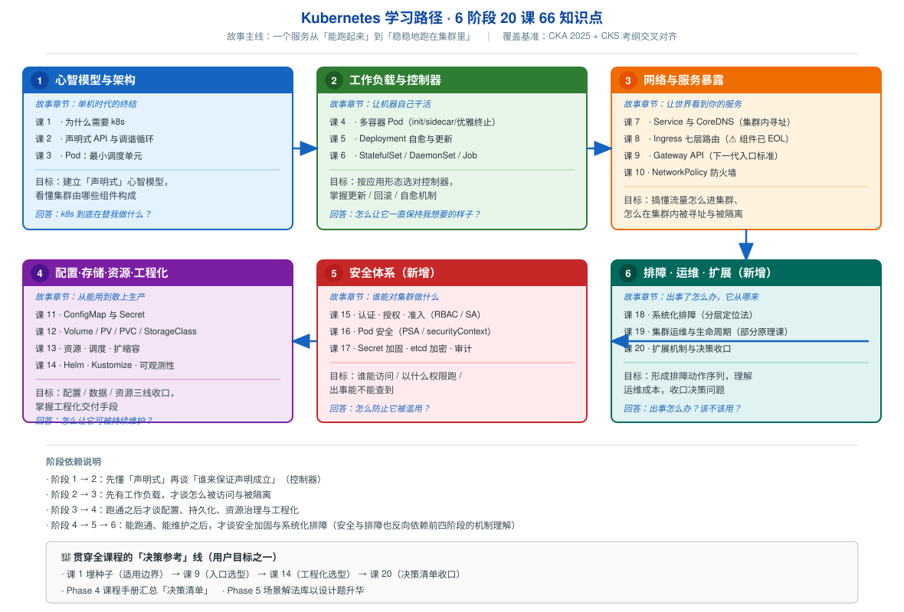

# Kubernetes 学习路径总览

> 本文件是活文档，随学习进度动态调整。阶段依赖图统一用 SVG。

## 🎯 学习目标

- **目标类型**：理解概念 + 动手实操 + 决策参考（三者并重）
- **目标说明**：
  - **理解概念**：搞懂 k8s 每个组件「是什么、为什么存在、怎么工作」，能解释调谐循环、Service 转发、调度决策等机制
  - **动手实操**：每课在 kind 集群上真跑，能独立部署、暴露、扩缩、回滚、排障
  - **决策参考**：能判断「该不该用 k8s」，能对新需求给出多方案权衡与选型理由
- **水平定位**：入门偏进阶 —— 容器基础一带而过，重点在 k8s 本体的**机制与权衡**
- **覆盖基准**：以 **CKA 2025 考纲（5 域）** 与 **CKS 考纲（6 域）** 交叉对齐作为完整性校验基准。本课程**不以应试为目标**，考纲仅用于确保体系无重大遗漏
- **官方文档覆盖比对（2026-09-10）**：已建 [k8s 官方文档索引](web-index/k8s/index.md)（329 条 / 4 分区；2026-09-15 由仓库根 `.web-index/k8s/` 归位至教程内），据此比对后补齐 **9 个知识点**（66 → 75），课时仍为 20。新增项及归属：

  | 新增知识点 | 并入 | 为什么必须补 |
  |------------|------|--------------|
  | 标签与选择算符 | 课 7 | Service/Deployment/NetworkPolicy/HPA 的关联基础，缺了后续每课都要临时补 |
  | 垃圾回收与级联删除 | 课 5 | ownerReference 解释「删 Deployment 为何连带删下层」；finalizer 解释 namespace 卡 Terminating |
  | EndpointSlice | 课 7 | kube-proxy 的真实后端数据源（Endpoints 已旧），服务不通排障要看它 |
  | 投射卷 projected volume | 课 11 | ConfigMap+Secret+downward API 合并挂载到同一目录的真实需求 |
  | Job 的 TTL 自动清理 | 课 6 | 完成的 Job 不清理会永久堆积（CronJob 跑一年 = 8000+ 残留对象） |
  | 云原生安全 4C 模型 | 课 15 | 把 RBAC / PSA / etcd 加密串成分层框架，否则知识点零散 |
  | API 聚合层 | 课 20 | 扩展 API 有 CRD 与 Aggregated APIServer 两条路，只讲一种不完整 |
  | 节点关闭处理 | 课 19 | drain 是计划内，非计划关机是另一套机制 |
  | kubeconfig 与多集群访问 | 课 2 | 本机已有 `k8s-c1` 与 `otel-l11` 两个集群，实操必遇 |

  **刻意不占课时**（收入课程手册「延伸阅读」）：DRA 动态资源分配、PodGroup 成组调度、Windows 容器、API 流控 —— 属 v1.34 新特性或特定场景，对「入门偏进阶」定位偏深且 kind 上难实操。

## 角色视角（多角色主题）

- **主线 = 应用使用者**：写 YAML、部署、暴露、扩缩、应用级排障（"我要跑一个应用"）
- **子教程 = [运维专项](子教程/运维专项/overview.md)**：集群交付 / 节点运维 / etcd 与控制面 / 升级与证书 / 可观测性底座 / 多租户与成本 / 备份灾备（"这个集群归我管"） —— **按需学习、不进主线进度**
- **提及级约定**：主线中次角色知识只写"一句话 + 指向子教程"，不展开（课 18-20 已有的"运维原理课"标注继续保持，子教程补的是**运维视角落地**，不重讲主线）

> 判定依据（2026-09-20）：官方文档本身分 concepts / tasks / setup 三类组织；现实中分「应用开发」与「集群运维 / SRE」岗位；删掉运维内容后主线仍完整 —— 命中多角色判定 ≥2 条信号。

## 故事主线

- **主角**：一个想「稳稳地跑起来」的服务（从单个容器到多副本、有状态、可被外部访问）
- **冲突**：容器本身不会自愈、不会扩缩、挂了不会重启、IP 变了就找不到 —— **单机思维管不了分布式应用**
- **收束**：学完后能回答「**k8s 到底在替我做什么，以及我该不该让它替我做**」

> 整个课程是这条故事线的展开，每个阶段是故事的一个「章节」。

## 学习路径图

> SVG 展示：6 个阶段、各阶段主题与课、阶段间前置依赖箭头，以及贯穿全课程的「决策参考」线。

## 阶段总览

### 阶段 1：心智模型与架构（故事章节：单机时代的终结）

- **目标**：建立「声明式」心智模型，看懂集群由哪些组件构成、各自负责什么
- **学习重点**：
  - 容器编排到底要解决什么鸿沟（容器 → 集群之间的断层）
  - 声明式 vs 命令式的根本差异，以及为什么 k8s 选声明式
  - 调谐循环（Reconcile）是理解**所有** k8s 行为的总钥匙
- **必须掌握**：能说清 control plane 各组件职责；能解释「我 apply 一个 YAML 之后发生了什么」
- **对应课**：课 1、课 2、课 3
- **配套应用实战**：
- [03 · 探针三件套](应用实战/03-Pod最小调度单元.md)（课 3）— 给「假死」服务配齐探针，三跳演进全实测
- [04 · 多容器协作与优雅退场](应用实战/04-多容器Pod与优雅终止.md)（课 4）— 更新上线不丢请求
- [05 · 上线不中断与一键回退](应用实战/05-Deployment无状态应用.md)（课 5）— 发布事故从断流到修复全实测
- [06 · 三种命运的工作负载](应用实战/06-StatefulSet与DaemonSet与Job.md)（课 6）— 用错控制器到逐个改对

### 阶段 2：工作负载与控制器（故事章节：让机器自己干活）

- **目标**：先吃透 Pod 内部怎么组合，再按应用形态选对控制器，掌握自愈、更新、回滚
- **学习重点**：
  - 多容器 Pod 的三种模式（init / sidecar / 适配器），以及优雅终止为什么是分布式系统的必修课
  - 控制器模式：Deployment → ReplicaSet → Pod 三层关系，谁在真正保证副本数
  - 滚动更新的两个旋钮（maxSurge / maxUnavailable）到底控制什么
  - 有状态（StatefulSet）、每节点（DaemonSet）、一次性任务（Job/CronJob）的适用边界
- **必须掌握**：能独立做一次滚动更新与回滚；能说清 StatefulSet 与 Deployment 的本质区别
- **对应课**：课 4、课 5、课 6

### 阶段 3：网络与服务暴露（故事章节：让世界看到你的服务）

- **目标**：搞懂流量怎么进集群、怎么在集群内被寻址与被隔离
- **学习重点**：
  - 为什么不能依赖 Pod IP（Pod 是「牲畜」不是「宠物」），以及 CoreDNS 如何把名字变成地址
  - Service 四种类型的选型与 kube-proxy 的转发机制
  - **七层入口的两代标准**：Ingress（存量事实标准，但 `ingress-nginx` 已于 2026-03 EOL、Ingress API 功能冻结）与 Gateway API（CKA 2025 考纲已纳入，面向未来）
  - NetworkPolicy 的默认全通隐患与零信任落地
- **必须掌握**：能配置 Service + 七层入口暴露应用；能写 NetworkPolicy 做最小权限隔离；能说清 Ingress 与 Gateway API 的选型理由
- **对应课**：课 7、课 8、课 9、课 10

### 阶段 4：配置 · 存储 · 资源 · 工程化（故事章节：从能用到敢上生产）

- **目标**：配置 / 数据 / 资源三线收口，并掌握工程化交付手段
- **学习重点**：
  - 配置与代码分离（ConfigMap / Secret），以及 Secret 只是 base64 不是加密
  - 存储三层抽象（Volume / PV / PVC / StorageClass）为什么要分这么细
  - requests / limits 与 QoS 等级，决定了节点内存不足时**谁先被杀**
  - 扩缩容三件套（HPA / VPA / Cluster Autoscaler）各自的适用前提
  - 多租户资源治理：ResourceQuota 与 LimitRange
  - Helm 与 Kustomize 的取舍；可观测性是可观测性的地基（metrics-server 与日志架构）
- **必须掌握**：能给有状态应用挂持久化存储；能设置合理的资源配额；能用 Helm/Kustomize 管理应用
- **对应课**：[课 11](stages/4-配置存储资源工程化/lessons/lesson-11-ConfigMap与Secret.md)、[课 12](stages/4-配置存储资源工程化/lessons/lesson-12-Volume与PVPVC.md)、[课 13](stages/4-配置存储资源工程化/lessons/lesson-13-资源调度扩缩容.md)、课 14

### 阶段 5：安全体系（故事章节：谁能对集群做什么）

- **目标**：建立 k8s 安全的完整骨架 —— 从「谁能访问」到「容器以什么权限运行」再到「出了事能不能查到」
- **学习重点**：
  - API 安全的三段式：认证（你是谁）→ 授权（你能做什么）→ 准入（这件事能不能这么干）
  - RBAC 是多租户的基石；ServiceAccount 默认挂载 token 是经典提权风险
  - Pod 安全标准（PSA）取代了已移除的 PSP；securityContext 决定容器以什么权限跑
  - Secret 的正确加固路径（etcd 静态加密 + 外部密钥管理），以及审计日志是事后追溯的唯一凭据
- **必须掌握**：能配置最小权限 RBAC；能给命名空间施加 PSA 基线/受限档；能加固一个 Pod 的运行时权限
- **对应课**：课 15、课 16、课 17
- **配套应用实战**（3 篇，2026-09-18 完成，[索引](应用实战/INDEX.md)）：
  - [15 · 最小权限授权](应用实战/15-最小权限授权.md) — 一个身份从「全集群通吃」到「只干本职」的对照实测
  - [16 · 合规检查把应用卡住了](应用实战/16-合规检查把应用卡住了.md) — 安全基线拦下应用时，「起不来却零报错」的排查路径
  - [17 · 密钥放在哪才算安全](应用实战/17-密钥放在哪才算安全.md) — **本机真实开启 etcd 静态加密 + 审计**（含 AES 密钥长度踩坑实录）

### 阶段 6：排障 · 运维 · 扩展（故事章节：出事了怎么办，以及它从哪来）

- **目标**：形成可复用的排障动作序列，理解生产集群的运维成本，并收口最初的决策问题
- **学习重点**：
  - 排障不是靠灵感，而是**分层定位**（节点 → 控制面 → 工作负载 → 网络 → 存储）
  - 节点维护（cordon / drain / PDB）—— 如何安全地摘掉一台机器
  - 集群生命周期：kubeadm 搭建、版本升级、etcd 备份恢复、HA 控制平面
  - 扩展机制：CRD / Operator / CNI / CSI / CRI —— 理解 k8s 为什么能长成今天这样
  - **决策收口**：该不该用 k8s 的判断清单
- **必须掌握**：能在 10 分钟内定位一个「服务访问不通」的根因；能说清自建集群的真实运维成本
- **对应课**：课 18、课 19、课 20
- **配套应用实战**（3 篇，2026-09-18 完成，[索引](应用实战/INDEX.md)）：
  - [18 · 应用起不来怎么排查](应用实战/18-应用起不来怎么排查.md) — "在跑"≠"能服务"，症状层 ≠ 根因层
  - [19 · 一次维护引发的连锁故障](应用实战/19-一次维护引发的连锁故障.md) — 真实 drain 演练：卡住、副本分散、探测工具误报
  - [20 · 要不要自建一个资源类型](应用实战/20-要不要自建一个资源类型.md) — 错误在提交时被拦，还是半夜才炸（**全课程实战收官**）
- **⚠️ 实操边界**：课 19 的 kubeadm 搭建 / 升级 / etcd 备份恢复 / HA 控制平面**无法在 kind 上真实操**（kind 节点是容器），将作为**原理课**撰写并显式标注，同时给出生产环境对照

## 贯穿全课程的「决策参考」线

> 用户目标之一是「决策参考」，故不单独设阶段，而是**贯穿式**设计：

| 位置 | 内容 |
|------|------|
| 课 1 | k8s 的适用边界 —— 什么场景不该上 k8s（埋下判断种子） |
| 课 9 | 入口选型：Ingress vs Gateway API（第一次真实选型决策） |
| 课 14 | 工程化选型：Helm vs Kustomize，以及什么时候都不用 |
| 课 20 | 决策清单 —— 该不该用 k8s 的判断条件与对比表（收口） |
| Phase 4 | 课程手册追加「决策清单」章节（汇总） |
| Phase 5 | 场景解法库 —— 以设计题形式训练「新要求来了怎么设计」（升华） |

## 当前进度

- [x] 阶段 1：心智模型与架构（✅ **已完成** · 课 1 / 课 2 / 课 3 均已交付）
- [x] 阶段 2：工作负载与控制器（✅ **已完成** · 课 4 / 课 5 / 课 6 均已交付）
- [x] 阶段 3：网络与服务暴露（✅ **已完成** · 课 7 / 课 8 / 课 9 / 课 10 均已交付）
- [x] 阶段 4：配置 · 存储 · 资源 · 工程化（✅ **已完成** · 课 11、12、13、14 全交付 2026-09-11）
- [x] 阶段 5：安全体系（✅ 已完成 · 课 15、16、17 全部交付 2026-09-11）
- [x] 阶段 6：排障 · 运维 · 扩展（✅ 已完成 · 课 18-20 全部交付 2026-09-14）
  - [x] 课 20 补充讲义同日交付：补齐 **CSI 卷快照 / Admission Webhook / 聚合层搭建** 三处原「只讲未做」的边界（[补充讲义](stages/6-排障运维与扩展/lessons/lesson-20-补充-三大未竟实践.md)）
  - [x] 课 20 补充讲义**独立复审**（2026-09-14）：P0×2 + P1×1 已修复并复验 —— 「1Gi 卷写 1.5G」证据链换新（真·1Gi 卷实测 `dd_exit=0`）；急救命令去掉 `jq` 依赖并改用 `/finalize` 子资源（`kubectl patch ns` 在真卡死时实测无效）。

## 收尾进度

- [x] **Phase 3 · 结课实战项目**（2026-09-14）：[三层 Web 应用生产化部署](projects/三层Web应用生产化部署/README.md) —— 18 个知识点落点覆盖全部 6 阶段
- [x] **Phase 4 · 课程手册**（✅ 2026-09-15 完成）：[课程手册](final-课程手册.md) —— 汇总 20 课，含要求的「延伸阅读」与「决策清单」两章
  - 七大章节：全课一张图 / 六大心智模型 / 按场景反查表 / 决策清单 / 速查表合订本 / 延伸阅读 / 学习路径与自检
  - 事实核查发现并修正 3 处数字错误（详见课程目录条目）
- [x] **Phase 5 · 实战经验 / 排障速查手册 / 场景解法库 三件套**（✅ 2026-09-15 完成，**2026-09-20 补入运维专项七课**）
  - [实战经验](08-实战经验.md)（**438 行**）：从项目 10 反例 + 20 课实测提炼，含**五类认知陷阱**与**二十条实战守则**
  - [排障速查手册](09-排障速查手册.md)（**616 行**）：课 18 五层模型 + 三纪律，症状→命令→判据路由
  - [场景解法库](场景解法库/INDEX.md)（✅ **2026-09-20 升级为独立成册**）：**8 个场景（经典设计题 4 + 规模压力题 4）× 3 解法 = 24 解法，24 张机制图**（23 SVG + 1 mermaid）
    - 由旧版 20 题（T1-T20）重组而来；旧单文件 [10-场景解法库.md](10-场景解法库.md) 转为**指针页**
    - 新形态硬要求：先想**常显** + 提示/解法进折叠、**每解法 ≥1 张图**（图上高亮失效点）、**按题定制效果对比列**、替代路线**表格化**、回指 08 反例/陷阱编号
  - **收尾进度：Phase 3 / 4 / 5 全部完成，课程交付闭环**
- [x] **Phase 5 · 运维视角补入**（✅ 2026-09-20 完成）：[运维专项子教程](子教程/运维专项/overview.md) 七课（2026-09-18~20 交付）的实战经验**此前未并入三件套**，本次按「真跑实测 + 增量补入」补齐：
  - [实战经验](08-实战经验.md)：新增第 5-7 章 —— **运维侧 7 个反例**（无 etcd 备份 / YAML 导出当备份 / 备份不演练 / 备份含系统资源 / 不管证书 / 节点不留余量 / 准入只开默认）、**3 个新认知陷阱**（把「备份了」当成「能恢复」、把「集群能跑」当成「可交付」、把「指标在涨」当成「指标是对的」）、**运维默认值清单 + 守则 21-30**（守则总数 20 → 30）
  - [排障速查手册](09-排障速查手册.md)：新增第 7-8 章 —— **集群运维层五查**（节点账本 / etcd / 证书 / 准入 / 备份）、**运维症状速查与判据**（能读不能写、恢复 Conflict、PV 挂不上、配额两种报错区分）
  - [场景解法库](场景解法库/INDEX.md)：新增 **T16-T20 运维设计题**（灾备 RPO/RTO、多租户隔离、准入规范上线、集群升级、可观测性底座）+ 集群视角三个必问（题数 15 → 20）；**2026-09-20 进一步升级为独立成册**（8 场景 / 24 解法 / 24 图）
  - **本次实测补测**（本机 kind v1.34.0 / 3 节点 Calico）：组件证书 **361 天**、CA 9 年、准入仅 `NodeRestriction`、**CronJob=0（RPO=∞）**、ResourceQuota=0、装箱率 1%~3%、etcdctl **3.6.4 在 etcd Pod 内**（控制面容器 not found）、etcd revision 30 秒 **84** 次（1 小时外推 **10080** 写入）、`kubectl get --raw /metrics` 取到 **31659** 行而 curl 直连 Forbidden、PSA restricted 真拦 **4 项**、VAP Deny 拒绝 / Warn 放行、LimitRange **不回溯**、`must specify` 与 `exceeded quota` 区分
  - **复审**：链接 19 个全可达、目录锚点 0 失效、守则编号 1-30 连续、设计题 T1-T20 连续、关键数字与实测原始值逐条比对一致
  - ⚠️ **推翻既有结论 1 处**：VAP 改 Warn 的生效延迟**不固定**（课 7 首测需 sleep 5，本次复测立即生效）→ 三件套统一改为「若看到旧行为，sleep 5~10 再验，别急着下『没生效』结论」
  - ⚠️ **新增实测坑 1 处**：etcd 容器是 **distroless**（无 `ls`/`rm`/`tar`），且 `kubectl cp` 在本环境失败 → 取快照须用 `docker cp`

## 实操环境

| 项 | 值 |
|----|-----|
| 环境 | WSL Ubuntu 24.04（20 核 / 32 GB / 769 GB 可用） |
| Docker | 29.4.1（cgroup v2 + systemd 驱动） |
| kubectl | v1.34.0 |
| kind | v0.30.0（节点镜像 `kindest/node:v1.34.0` 已缓存） |
| helm | v3.22.0 |
| 集群 | `k8s-c1`（1 control-plane + N worker，v1.34.0） |
| CNI | kindnet（⚠️ NetworkPolicy 支持性须实测，见评审清单待验证事项） |
| StorageClass | `standard`（rancher.io/local-path，默认） |

**待装组件**（撰写到对应课时安装，实测确认）

| 组件 | 涉及课 | 状态 |
|------|--------|------|
| Gateway API CRD + 实现（如 Envoy Gateway / kgateway） | 课 9 | ✅ 已装（Gateway API v1.4.1 experimental + Envoy Gateway v1.6.1，2026-09-10） |
| metrics-server | 课 13 / 课 14 | ✅ 已装（v0.9.0，2026-09-11 随课 13 安装并实测 `kubectl top` 可用；2026-09-15 在新建集群 `k8s-envtest` 上复验全链路通过） |
| Ingress Controller（用于对比演示，须说明 EOL 现状） | 课 8 | ✅ 已用 Traefik v3.7.13（课 8 已交付，用完即卸） |
| CNI（NetworkPolicy 执行能力） | 课 10 | ✅ kindnet v20250512 **实测确认执行 NetworkPolicy**（2026-09-11；推翻"不支持"的过时说法） |
| ConfigMap/Secret 键名拼错行为 | 课 11 | ✅ **实测推翻"空串不报错"**：默认 `CreateContainerConfigError` 起不来；`optional: true` 时变量不存在（2026-09-11 复审） |

> ⚠️ WSL 休眠 / `wsl --shutdown` 会导致 kind 集群不可用，长时间中断后需重建（约 1 分钟）。
> ⚠️ 已有 `otel-l11` 集群属 OpenTelemetry 课程遗留，本课程使用独立集群名避免干扰。
