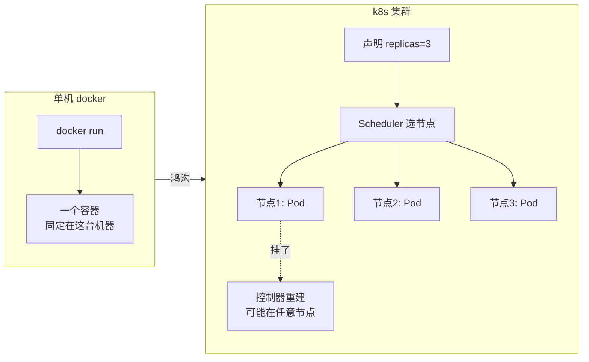
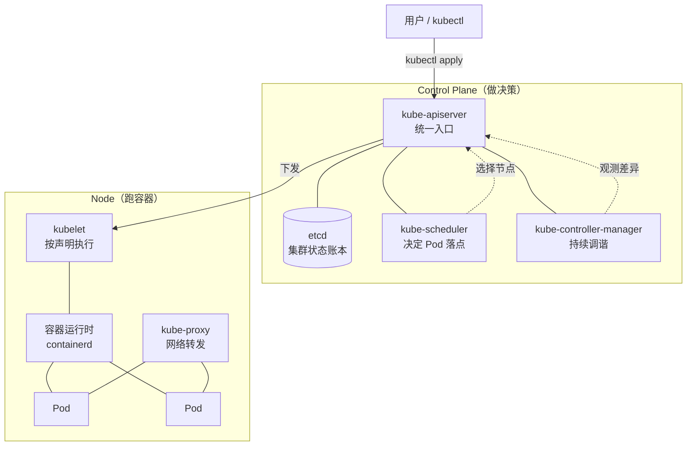
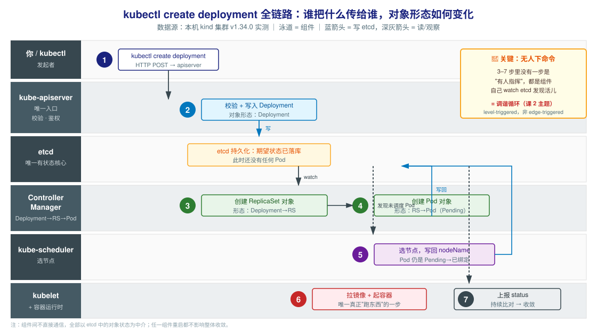
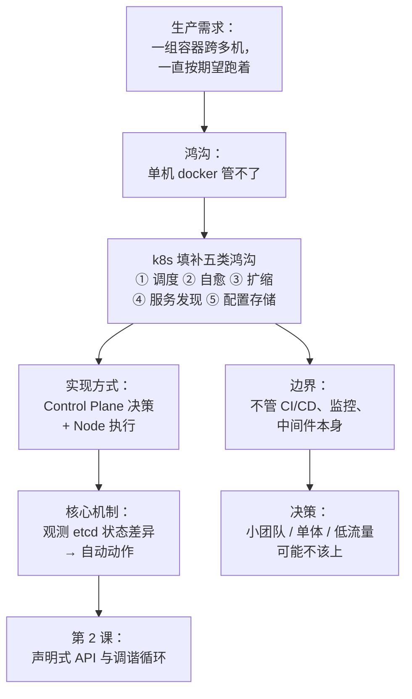

# 第 1 课：为什么需要 k8s

> 所属阶段：阶段 1《心智模型与架构》｜ 水平：入门偏进阶 ｜ 本课知识点：容器编排要解决的鸿沟、k8s 是什么与不是什么、集群架构总览
> 故事情节：主角（一个 Web 服务）第一次走出单机，发现"跑起来"和"一直跑着"是两件完全不同的事

## 🎯 本课目标

- 说清 docker  alone 管不了的五件事，以及 k8s 各自用什么机制解决
- 说清 k8s 的能力边界 —— 知道什么场景**不该**上 k8s
- 画出集群组件图，说清 control plane 与 node 各组件职责

---

## 第一幕：起源与场景引入

> 🏛️ **起源**：Kubernetes 脱胎于 Google 内部的 **Borg** 集群管理系统（Borg 于 2000 年代中期开始采用 Linux 容器技术，是 Google 管理大规模工作负载的内部系统；其后续版本名为 Omega）。
>
> 2013 年 Docker 让容器技术大众化之后，熟悉 Borg 与 Omega 的 Google 工程师（Joe Beda、Brendan Burns、Craig McLuckie 等）意识到"一个开源的容器编排系统"是必然之物，于 **2013 年秋**启动了这个项目。**2014 年 6 月 6 日**，Kubernetes 的第一次代码提交推送到 GitHub；6 月 10 日，Google 工程师 Eric Brewer 在 DockerCon 2014 上正式宣布该项目。
>
> **2015 年 7 月 21 日**发布 1.0 版本，同日 Google 联合 Linux 基金会成立 **CNCF**（云原生计算基金会），并将 Kubernetes 作为种子技术捐赠给它 —— 这保证了它不被任何单一公司控制。
>
> 名字来自希腊语 κυβερνήτης（kubernḗtēs），意为"舵手 / 领航员"，这也是 logo 是船舵的原因；"k8s" 是 K 与 s 之间省略 8 个字母的数字缩写（numeronym）。（核查于 2026-09，来源：[Kubernetes 官方十年回顾](https://kubernetes.io/zh-cn/blog/2024/06/06/10-years-of-kubernetes)、[Google Open Source](https://opensource.google/projects/kubernetes)）

🎬 **场景**：假设你有一个 Web 服务，用 docker 打包好了镜像。开发机上 `docker run` 一把梭，服务起来了，很开心。

然后你把它部署到生产环境，第二天早上一看 —— 服务挂了，因为容器半夜 OOM 被杀了，没人重启它。

你加上了 `--restart=always`，容器能自动重启了。第三周，流量涨了，一个实例扛不住，你想跑三个 —— 于是手动在四台机器上各起一个容器，还得自己记住"哪台上跑着什么"。第四周，某台机器宕机，上面的容器全没了，你半夜爬起来手动迁移。

**容器解决了"打包和隔离"，但完全没解决"管理一堆容器"。**

---

## 第二幕：认知冲突

> ❓ **问题**：`docker run --restart=always` 看起来已经能"自动重启"了，为什么还需要 k8s？

关键区别在于 —— **`--restart=always` 只对"同一台机器上的同一个容器"有效**。

真实的生产问题是一长串：

| 单机 docker 能做的 | 生产真正需要的 |
|---|---|
| 这台机器上重启这个容器 | 机器宕机了，在**别的机器**上重新拉起 |
| 起 1 个容器 | 起 N 个副本，并让流量分给它们 |
| 手动 `docker run` 指定端口 | 容器 IP 每次都变，别人怎么稳定找到它 |
| 手动拷贝配置文件 | 改一次配置，N 个副本同步生效 |
| 手动 `docker logs` | 几十个实例，日志在哪台机器上 |

**这就是鸿沟**：docker 的操作单位是"单个容器、单台机器"；而生产需要的是"**一组容器、跨多台机器、作为一个整体被管理**"。

---

## 第三幕：层层揭示

### 知识点 1：容器编排要解决的鸿沟

> 本知识点关键点：容器与集群的断层 / 五类鸿沟 / k8s 的对应解法

#### 一句话定义

**容器编排**（Container Orchestration）指的是：跨多台机器，自动化地管理容器的部署、扩缩、网络、自愈与配置。

#### 直觉建立（类比）

把单机 docker 想象成**一家小餐馆的厨师**：他能炒好一道菜（跑好一个容器）。

但你要开**连锁店**（生产集群），需要的是：决定哪家店开在哪（调度）、哪家店客满了就再多开一个窗口（扩缩）、某家店着火了就自动把客人引导到别的店（自愈）、客人进门不用关心去哪家分店（服务发现）、配方改了所有分店同步更新（配置管理）。

**厨师 ≠ 连锁店管理系统。** k8s 就是后者。

> 💡 **类比的边界**：餐馆分店是"固定的实体"，而 k8s 里的容器是**随时可被销毁重建的**——k8s 甚至不保证你今天看到的这个容器明天还在。这是"宠物 vs 牲畜"（Pets vs Cattle）的经典区别：k8s 把容器当牲畜，丢了再买一头，不心疼。

#### 核心原理

容器到集群之间的五类鸿沟，以及 k8s 的对应解法：

| # | 鸿沟 | 具体表现 | k8s 的解法 |
|---|------|----------|-----------|
| 1 | **调度** | 手动决定容器跑在哪台机器 | Scheduler 自动选择最合适的节点 |
| 2 | **自愈** | 容器挂了要人去重启；机器宕机就没了 | 控制器持续监测，副本数不足就重建（甚至换机器） |
| 3 | **扩缩** | 流量涨了手动加容器 | 改一个数字（`replicas`）或配 HPA 自动扩缩 |
| 4 | **服务发现** | 容器 IP 每次变，调用方无从跟踪 | Service 提供稳定的虚拟 IP + DNS 名 |
| 5 | **配置与存储** | 配置写死进镜像；数据随容器消失 | ConfigMap/Secret 解耦配置；PV/PVC 解耦存储 |



#### 示例演示

看看"有控制器"和"没控制器"的差别。先起一个裸 Pod（没有控制器接管）：

```bash
kubectl run probe-pod --image=nginx:alpine --restart=Never
kubectl get pod probe-pod
# 预期输出（刚创建时还在 Pending，无 IP）：
# NAME        STATUS    IP       NODE
# probe-pod   Pending   <none>   k8s-c1-control-plane

kubectl wait --for=condition=Ready pod/probe-pod --timeout=90s
kubectl get pod probe-pod
# 预期输出（已调度并运行）：
# NAME        STATUS    IP           NODE
# probe-pod   Running   10.244.0.5   k8s-c1-control-plane
```

现在删掉它，看会不会自己回来：

```bash
kubectl delete pod probe-pod
kubectl get pods
# 预期输出：No resources found in default namespace.
# 👆 裸 Pod 删了就是真没了 —— 没有任何东西负责"把它找回来"
```

换个有控制器的 Deployment 试试：

```bash
kubectl create deployment probe-dep --image=nginx:alpine --replicas=2
kubectl wait --for=condition=Ready pod -l app=probe-dep --timeout=120s
kubectl get pods -l app=probe-dep
# 预期输出（2 个副本）：
# NAME                         READY   STATUS    RESTARTS   AGE
# probe-dep-8455b466fc-2mzsp   1/1     Running   0          1s
# probe-dep-8455b466fc-4gmsx   1/1     Running   0          1s

kubectl delete pod -l app=probe-dep    # 删掉全部副本
sleep 6
kubectl get pods -l app=probe-dep
# 预期输出：又冒出 2 个新 Pod（名字不同，但数量回到 2）
# NAME                         READY   STATUS    RESTARTS   AGE
# probe-dep-8455b466fc-nrvkx   1/1     Running   0          6s
# probe-dep-8455b466fc-qtxj5   1/1     Running   0          6s
```

> 上面这组输出是本机 kind 集群（v1.34.0）的实测结果。**注意新 Pod 的名字变了** —— 这正是"宠物 vs 牲畜"：k8s 不救那个具体的容器，它只保证"数量是 2"。

同时可以看到，Deployment 自动创建了 ReplicaSet（真正保证副本数的那一层）：

```bash
kubectl get rs
# 预期输出：
# NAME                   DESIRED   CURRENT   READY   AGE
# probe-dep-8455b466fc   2         2         2       8s
```

#### 常见误区

1. **"k8s 是 docker 的替代品"**：错。k8s 不负责构建镜像、不负责运行单个容器 —— 它**依赖**容器运行时（containerd / CRI-O 等）。k8s 是 docker 之上的"管理层"，不是替代层。
2. **"有了 `--restart=always` 就等于有了自愈"**：错。它只在**同一台机器**上重启同一个容器；机器宕机、节点资源不足、需要换机重建，它一概管不了。
3. **"Pod 就是容器"**：不完全对。Pod 是 k8s 的最小调度单位，里面**可以装多个容器**（第 3 课会讲为什么）。

#### 一句话记住

> **docker 让一个容器跑起来，k8s 让"一组容器"按你期望的样子一直跑着。**

#### 官方文档

- [Kubernetes 官方文档 · 什么是 Kubernetes](https://kubernetes.io/zh-cn/docs/concepts/overview/)

---

### 知识点 2：k8s 是什么与不是什么

> 本知识点关键点：能力边界 / 不该用的场景 / 决策参考

#### 一句话定义

k8s 是一个**声明式的容器编排平台**：你告诉它"我要什么状态"，它持续努力让现实趋近于这个状态。

#### 直觉建立（类比）

k8s 像一个**恒温器**，而不是一个开关。

- 开关（命令式）：你按一下，灯亮；你再按一下，灯灭。每个动作都要你亲自下指令。
- 恒温器（声明式）：你设定"室温 24 度"，它自己决定什么时候开空调、开多大。你不关心过程，只关心结果。

> 💡 **类比的边界**：恒温器只控制一个变量，而 k8s 要同时协调成百上千个对象；且恒温器的"反馈"是即时的，k8s 的调谐有延迟（可能几秒到几分钟）。

#### 核心原理

**k8s 是什么**（能力清单）：

- 容器的**部署与生命周期管理**（调度、重启、扩缩、回滚）
- **服务发现与负载均衡**（Service / Ingress）
- **配置与密钥管理**（ConfigMap / Secret）
- **存储编排**（PV / PVC / StorageClass）
- **声明式 API**（所有资源都可用 YAML 描述、版本化管理）

**k8s 不是什么**（能力边界 —— 这部分对应你的"决策参考"目标）：

| 它不做的事 | 你需要另找什么 |
|---|---|
| 不构建镜像 | docker build / CI 流水线 |
| 不提供 CI/CD | Jenkins / GitLab CI / ArgoCD |
| 不管应用日志的**长期存储与检索** | ELK / Loki（k8s 只提供 `kubectl logs` 这类即时查看） |
| 不提供中间件本身 | 你要的 MySQL / Redis / Kafka 得自己部署（或用 Operator） |
| 不做监控告警 | Prometheus + Grafana |
| 不解决**应用内部**的架构问题 | 微服务拆分、接口设计仍是你自己的事 |

**🚫 什么场景不该上 k8s**（决策参考，先埋种子，课 12 会收口成完整决策清单）：

| 场景 | 为什么不划算 |
|---|---|
| **单体小应用 + 小团队** | k8s 的运维复杂度可能超过应用本身；一台机器 + docker compose 往往更合适 |
| **团队没有运维投入意愿** | k8s 不是"装上就完事"，升级、调优、排障都需要人 |
| **流量极低且稳定** | 用不上弹性伸缩这个最大卖点，白付复杂度成本 |
| **强实时 / 极低延迟场景** | 多层网络转发会引入额外延迟，需专门调优 |
| **有状态且难以改造的遗留系统** | "牲畜"模型与"宠物"系统天然冲突，改造成本极高 |

> ⚠️ 判断口诀：**k8s 的价值 ≈ （服务数量 × 变更频率 × 弹性需求）－ 团队运维能力成本**。前三项任何一项接近零，就要慎重。

#### 示例演示

从 k8s 自己的 API 清单能直观看出它的关注点 —— 它管的是"资源对象"，不是"你的应用逻辑"：

```bash
kubectl api-resources | wc -l
# 预期输出（本机 v1.34.0 实测）：
# 66
# 👆 66 行（含表头），即 k8s 内置了数十种可管理的资源类型

kubectl api-resources | head -8
# 预期输出（节选）：
# NAME                                SHORTNAMES   APIVERSION   NAMESPACED   KIND
# bindings                                         v1           true         Binding
# componentstatuses                   cs           v1           false        ComponentStatus
# configmaps                          cm           v1           true         ConfigMap
# endpoints                           ep           v1           true         Endpoints
# events                              ev           v1           true         Event
# limitranges                         limits       v1           false        LimitRange
# namespaces                          ns           v1           false        Namespace
```

#### 常见误区

1. **"上了 k8s 就等于高可用"**：错。k8s 提供高可用的**机制**（多副本、自愈），但如果你只部署 1 个副本、或所有副本挤在同一个节点上，它照样单点故障。
2. **"k8s 能自动解决性能问题"**：错。它只按你声明的资源配额调度；配额给错了，它照样让你 OOM 或者资源浪费。

#### 一句话记住

> **k8s 管"容器怎么跑"，不管"应用怎么写"，也不替你做 CI/CD 和监控。**

#### 官方文档

- [Kubernetes 官方文档 · 概念](https://kubernetes.io/zh-cn/docs/concepts/)

---

### 知识点 3：集群架构总览

> 本知识点关键点：control plane 与 node 的分工 / 各组件职责 / 组件如何协同

#### 一句话定义

一个 k8s 集群由**控制平面**（control plane，做决策）和**工作节点**（node，跑容器）两部分组成。

#### 直觉建立（类比）

把集群想成一家**餐厅**：

- **控制 plane = 后厨的管理层**：前台（API Server）接单、店长（Scheduler）决定哪桌由哪个厨师做、巡检员（Controller Manager）盯着每道菜有没有按标准做、账本（etcd）记录所有订单。
- **Node = 灶台**：真正炒菜的地方。每个灶台有个小工（kubelet）负责按订单执行，还有个传菜员（kube-proxy）负责把菜送到正确的桌子（网络转发）。

> 💡 **类比的边界**：餐厅里"管理层"可以down 一会儿客人还能吃现成的菜 —— k8s 也一样，**control plane 挂了，已运行的容器不会立刻死**，但你无法再做任何变更（新订单下不进去了）。这个特性对理解故障影响很重要。

#### 核心原理

**Control Plane 四大组件**：

| 组件 | 职责 | 一句话 |
|---|---|---|
| **kube-apiserver** | 所有操作的唯一入口，REST API | 集群的"前台"，谁都得经过它 |
| **etcd** | 分布式键值存储，保存集群全部状态 | 集群的"账本"，**唯一有状态的核心** |
| **kube-scheduler** | 决定新 Pod 落在哪个节点 | 集群的"调度员" |
| **kube-controller-manager** | 运行各种控制器，持续调谐 | 集群的"巡检员"，保证期望状态成立 |

**Node 上的组件**：

| 组件 | 职责 |
|---|---|
| **kubelet** | 节点上的"代理"，负责让本节点的容器按声明跑起来 |
| **kube-proxy** | 维护网络规则，实现 Service 的流量转发 |
| **容器运行时** | 真正运行容器的软件（containerd / CRI-O 等） |



**它们怎么协同**（以 `kubectl create deployment` 为例，这是理解全链路的关键）：

1. 你执行 `kubectl create deployment` → 请求打到 **kube-apiserver**
2. apiserver 验证后，把 Deployment 对象写入 **etcd**
3. **Controller Manager** 观察到有新的 Deployment，创建对应的 ReplicaSet
4. ReplicaSet 控制器观察到副本数不足，创建 Pod 对象（此时 Pod 还在 Pending，没有节点）
5. **Scheduler** 发现未被调度的 Pod，选一个节点，把结果写回 etcd
6. 目标节点的 **kubelet** 发现"有个 Pod 分给我了"，通知容器运行时拉镜像、起容器
7. kubelet 持续上报 Pod 状态；控制器持续比对"期望 2 个" vs "实际几个"

> 🔑 先看第 3、4、7 步的现象：**没有任何一步是"有人下达命令"** —— 各组件都是自己去 etcd 里看，发现有活儿就干，没人指挥它们。
>
> 这个"各自盯着状态、发现差异就动手"的模式有个专门的名字，叫**调谐循环**（Reconcile Loop），它是整个 k8s 的发动机 —— **下一课（课 2）就专门讲它**。这里你先记住现象：你下完命令之后，剩下的事是各个组件**自己**完成的。

**全链路图**（跨组件数据流，建议对照上面 7 步一起看）：



> 图读法：泳道是组件，**蓝色箭头 = 写 etcd，深灰箭头 = 读/观察**。注意 3–7 步全部是"组件自己 watch 到变化后动手"，没有一步来自你的指令；而且**所有组件都只与 apiserver/etcd 交互，彼此从不直接通信** —— 这正是调谐循环能成立的结构前提。

#### 示例演示

看看真实集群里的组件：

```bash
kubectl get nodes
# 预期输出（kind 单节点集群）：
# NAME                   STATUS   ROLES           AGE   VERSION
# k8s-c1-control-plane   Ready    control-plane   21s   v1.34.0

kubectl get pods -n kube-system -o custom-columns='NAME:.metadata.name,STATUS:.status.phase'
# 预期输出（本机实测）：
# NAME                                           STATUS
# coredns-66bc5c9577-chlnj                       Pending
# coredns-66bc5c9577-vv6tg                       Pending
# etcd-k8s-c1-control-plane                      Running
# kindnet-j8bnj                                  Running
# kube-apiserver-k8s-c1-control-plane            Running
# kube-controller-manager-k8s-c1-control-plane   Running
# kube-proxy-fn5zv                               Running
# kube-scheduler-k8s-c1-control-plane            Running
```

> 上面这张表值得细看：control plane 的四大组件**以 Pod 形式跑在集群里**（`etcd-`、`kube-apiserver-`、`kube-controller-manager-`、`kube-scheduler-`），外加 DNS 组件 `coredns`、网络插件 `kindnet`、以及每个节点都有的 `kube-proxy`。
>
> ⚠️ **实测观察（本机真实输出）**：抓这张表时，两个 `coredns` 还是 `Pending` —— 但这**不是**故障，而是**启动时序**造成的：刚建完集群时网络插件（kindnet）还没就绪，coredns 要等网络起来才能 Running。稍等几秒再看，它们就变成 `Running` 了：
>
> ```bash
> kubectl get pods -n kube-system -l k8s-app=kube-dns
> # 稍等片刻后的预期输出：
> # NAME                       STATUS
> # coredns-66bc5c9577-chlnj   Running
> # coredns-66bc5c9577-vv6tg   Running
> ```
>
> 我把这个"脏输出"如实保留下来，是因为 `Pending` 是你日后最常遇到的状态之一 —— 它多半只是**还没轮到它**，而不是它坏了。
>
> 💡 **通用排查出口**：如果某 Pod 长时间停在 `Pending`，正确的动作是问它原因，而不是干等：
>
> ```bash
> kubectl describe pod <pod名> -n <命名空间>    # 看 Events 段，k8s 会直接告诉你卡在哪
> ```
>
> 常见原因有三类：没有满足条件的节点（污点 / 亲和性 / 资源不足）、镜像拉不下来、存储卷没绑定。课 11 讲调度时会正式展开。

#### 常见误区

1. **"control plane 挂了，容器立刻全停"**：错。**已运行的容器会继续跑**，只是无法接受新指令（不能扩缩、不能部署新版本）。这也说明为什么生产环境 control plane 要部署多副本。
2. **"etcd 只是个数据库，没那么重要"**：错。etcd 是**唯一有状态的核心**——它丢了，集群的所有定义就没了。生产必须做备份。
3. **"kubelet 是 k8s 创建的"**：不是。kubelet 是跑在**宿主机上的系统服务**（不是 Pod），它负责把 k8s 的意图翻译成容器操作。

#### 一句话记住

> **Control plane 负责"决定应该是什么样"，Node 负责"把它变成那样"；两边从不直接对话，全靠 etcd 里的状态做中介。**

#### 官方文档

- [Kubernetes 官方文档 · 集群架构](https://kubernetes.io/zh-cn/docs/concepts/architecture/)
- [Kubernetes 官方文档 · 组件](https://kubernetes.io/zh-cn/docs/concepts/overview/components/)

---

## 第四幕：实操验证

现在把三个知识点串起来，验证"k8s 真的在替你维持状态"。

```bash
# 1. 先确认 apiserver 活着（它是唯一入口）
kubectl get --raw /healthz
# 预期输出：ok

kubectl get --raw /readyz | head -3
# 预期输出：ok

# 2. 看看集群默认有哪些命名空间
kubectl get ns
# 预期输出（本机实测）：
# NAME                 STATUS   AGE
# default              Active   22s
# kube-node-lease      Active   22s
# kube-public          Active   22s
# kube-system          Active   22s
# local-path-storage   Active   17s

# 3. 核心验证：期望 3 个副本，手动删到 0，看它是否自己恢复
kubectl create deployment verify-dep --image=nginx:alpine --replicas=3
kubectl wait --for=condition=Ready pod -l app=verify-dep --timeout=120s
kubectl get pods -l app=verify-dep --no-headers | wc -l
# 预期输出：3

kubectl delete pod -l app=verify-dep    # 一次性删光
sleep 8
kubectl get pods -l app=verify-dep --no-headers | wc -l
# 预期输出：3  ← 自己回来了，且你全程没下达"重建"指令
```

> ✅ **回扣场景**：回到第一幕的问题 —— 服务半夜挂了没人重启。在 k8s 里，这件事由 Controller Manager 自动完成：**你没下命令，是它观察到"实际 0 个 < 期望 3 个"，于是自己动手**。
>
> 更重要的是：如果这时某个**节点宕机**了，k8s 会在**其他健康节点**上重建这些 Pod —— 这是 `docker --restart=always` 永远做不到的事。

**清理**（可选，保留集群供后续课程使用）：

```bash
kubectl delete deployment verify-dep
```

---

## 第五幕：体系收束

> 📍 **全局定位**：本课建立了整个课程的"问题意识" —— k8s 存在的全部理由，就是填补"容器"到"集群"之间的那道鸿沟。
>
> 三个知识点的关系：
> - 知识点 1 讲**为什么需要**（五类鸿沟）
> - 知识点 2 讲**边界在哪**（什么它管、什么它不管、什么时候别用）
> - 知识点 3 讲**它由什么构成**（control plane + node 的分工）
>
> 🔗 **下一步**：你已经看到"删了 Pod 它自己回来"，但**是谁**在盯着这件事？它**怎么**知道要重建？这就引出第 2 课的核心 —— **声明式 API 与调谐循环**。那把钥匙一旦拿到手，后面 Deployment 的滚动更新、Service 的端点维护、HPA 的自动扩缩，全都是同一个原理的不同外衣。

---

## 🐞 常见误区

1. **"k8s 是 docker 的替代品"** → k8s 依赖容器运行时，是上层管理层而非替代层。
2. **"有 `--restart=always` 就有自愈了"** → 它只管同机同容器；换机重建、副本数维持一概不管。
3. **"上了 k8s 就高可用"** → k8s 提供机制，副本数与分布仍是你自己的责任。
4. **"control plane 挂了服务立刻停"** → 已在跑的容器继续跑，只是不能接受新变更。
5. **"Pod 就是容器"** → Pod 是调度单位，内部可含多个容器（第 3 课展开）。

## 一图总结



## 课后小测

**Q1**：关于 `docker run --restart=always` 与 k8s 自愈的区别，下列说法正确的是？
- A. 两者等价，k8s 只是封装了 restart 策略
- B. `--restart=always` 只能在同一台机器上重启同一容器，无法应对节点宕机
- C. k8s 的自愈依赖于宿主机的 systemd
- D. `--restart=always` 能跨节点重建容器

<details><summary>答案与解析</summary>

**答案：B**。restart 策略是单机的、单容器的；k8s 的自愈是集群级的，控制器发现副本数不足时可在**任意健康节点**上重建。A 错在"等价"，C 错在 kubelet 并非依赖 systemd 实现自愈，D 与事实相反。

</details>

**Q2**：某 3 人小团队维护一个访问量很低的单体内部系统，考虑引入 k8s。按本课"适用边界"，最合理的建议是？
- A. 应该上，k8s 能显著提升系统性能
- B. 应该上，因为所有应用都适合容器编排
- C. 慎重：服务数量少、变更频率低、无弹性需求，运维复杂度可能超过收益
- D. 无所谓，上了总比不上好

<details><summary>答案与解析</summary>

**答案：C**。k8s 的价值 ≈ 服务数量 × 变更频率 × 弹性需求 － 运维成本。前三项都很低时，一台机器加 docker compose 往往更合适。A 错（k8s 不提升应用性能），B 错（有明确适用边界），D 是回避判断。

</details>

**Q3**：control plane 整体不可用（但 node 正常）时，最可能出现的现象是？
- A. 所有正在运行的容器立即停止
- B. 已运行的容器继续运行，但无法部署新版本或扩缩容
- C. 集群自动选举新的 control plane
- D. kubelet 接管所有决策，集群功能不受影响

<details><summary>答案与解析</summary>

**答案：B**。control plane 负责"决策"，不影响已经在跑的容器；但新指令（部署、扩缩）都要经过 apiserver，因此无法执行。C 需要预先部署多副本 HA 才成立（不是自动发生的），D 错在 kubelet 只执行不决策。

</details>

## 🚀 下一批接力提示词

> 学完本批后，**复制下面这段文字发给 AI**，即可无缝进入下一批（无需重新描述上下文）：

```
继续学 Kubernetes。我的学习档案在 k8s/00-学习档案.md，
刚学完阶段 1《心智模型与架构》的课《为什么需要 k8s》知识点
「容器编排要解决的鸿沟、k8s 是什么与不是什么、集群架构总览」，
请按大纲继续讲解下一批知识点。
```

## 🧭 课程导航

- 下一课：[课 2：声明式 API 与调谐循环](lesson-02-声明式API与调谐循环.md)
- 返回目录：[02-课程目录.md](../../../02-课程目录.md) ｜ 本阶段概览：[心智模型与架构](../overview.md)
