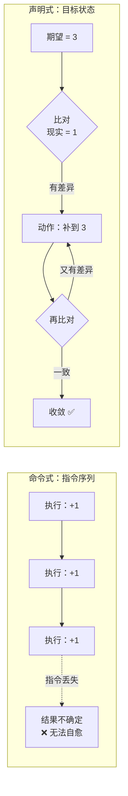
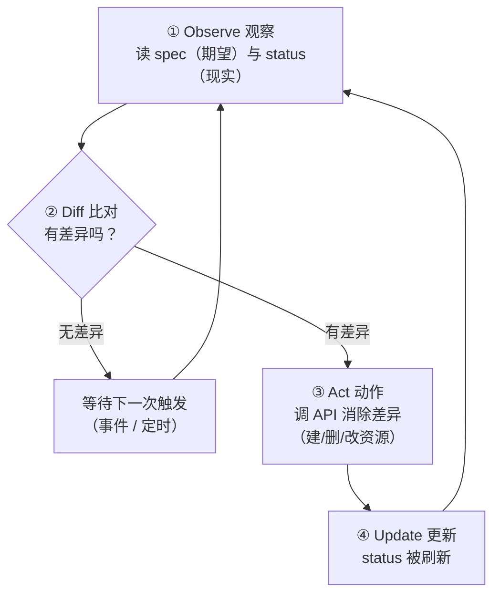
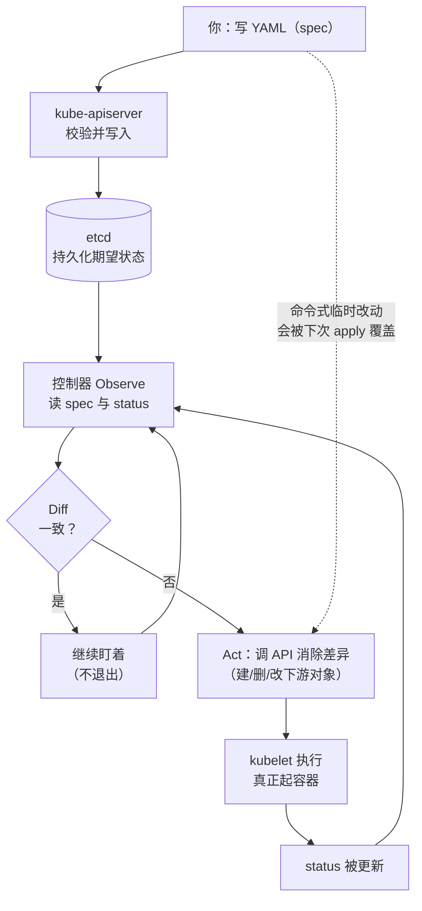

# 第 2 课：声明式 API 与调谐循环

> 所属阶段：阶段 1《心智模型与架构》｜ 水平：入门偏进阶 ｜ 本课知识点：声明式 vs 命令式、调谐循环 Reconcile、kubectl 与 API 资源模型
> 故事情节：上一课你看到"删了 Pod 它自己回来"，这一课要回答**是谁**在盯着、**凭什么**知道该重建

## 🎯 本课目标

- 说清命令式与声明式的根本差异，能用幂等性解释为什么 k8s 选声明式
- 说清调谐循环的四个步骤，能用它解释"删了 Pod 自己回来""扩缩容自动生效"等现象
- 看懂 GVK / GVR 与对象的四段式结构，能用 `kubectl explain` 自查字段含义

---

## 第一幕：起源与场景引入

> 🏛️ **起源**：声明式思想并非 k8s 发明，它最早的成熟形态是 **SQL**。
>
> 1970 年 IBM 的 E.F. Codd 提出关系模型；**1974 年**，同在 IBM 圣何塞研究实验室的 **Donald D. Chamberlin 与 Raymond F. Boyce** 在 System R 项目中设计出 SEQUEL（后因商标问题改名为 SQL）。Chamberlin 后来回忆这次设计的原话是：查询"描述了它要找什么信息，却没有提供如何找到这些信息的详细计划"—— **这正是它被称为声明式（而非过程式）语言的原因**。
>
> 你写 `SELECT * FROM users WHERE age > 18`，是告诉数据库"我要什么"，而不是"先读第 1 行、比较 age、再读第 2 行……"。**怎么找（用不用索引、走什么执行计划）交给数据库的优化器决定**。
>
> k8s 把这套思想带进了基础设施领域。在此之前，运维的主流是**脚本式（命令式）**：写一个部署脚本，第 1 步装依赖、第 2 步改配置、第 3 步重启服务。脚本的问题在于——**它描述的是"动作序列"，而不是"目标状态"**，一旦中途失败，你不知道系统停在了哪一步，重跑一遍还可能出错。
>
> k8s 的设计者在 Borg 的经验基础上做了一个关键决策：**API 只表达"期望状态"，不表达"达成步骤"**。这个决策带来了调谐循环，也带来了整个 k8s 的自愈能力。
>
> （核查于 2026-09；来源：[Wikipedia · SQL](https://en.wikipedia.org/wiki/SQL)、[IEEE · Early History of SQL（Chamberlin 本人回忆）](https://xplorestaging.ieee.org/document/6359709/citations)）

🎬 **场景**：上一课你跑过这个实验 —— 创建一个 3 副本的 Deployment，然后 `kubectl delete pod` 一次性删光，等几秒再看，又是 3 个。

现在请你停一下，问自己三个问题：

1. **谁**发现了"Pod 没了"？
2. 它**怎么知道**应该是 3 个，而不是 2 个或 5 个？
3. 你从头到尾**没有**下达"重建"指令，它凭什么自己动手？

这三个问题的答案，就是本课的全部内容。

---

## 第二幕：认知冲突

> ❓ **问题**：我 `kubectl delete pod` 是明确的删除指令，为什么 k8s 又给我变回来了？它是不是在跟我作对？

不是作对，是**你在用命令式的动作，去撞一个声明式的系统**。

关键在于：`kubectl delete pod` 删掉的是**具体的一个容器实例**，但**没有改变你声明的期望**（我要 3 个副本）。

```
你的声明（期望）：replicas = 3
现实：            0 个 Pod
控制器看到的差异： 0 < 3  →  动手补齐到 3
```

在 k8s 里，**"期望"是持久的，"现实"是暂时的**。你想真正删掉它们，得改期望（`kubectl scale --replicas=0` 或删掉 Deployment），而不是删现实。

> 💡 这个心智转变是学 k8s 最重要的一步：**不要去操作"现在是什么"，去声明"我要什么"**。

---

## 第三幕：层层揭示

### 知识点 1：声明式 vs 命令式

> 本知识点关键点：两种范式的根本差异 / 幂等性 / 为什么 k8s 选声明式

#### 一句话定义

- **命令式（Imperative）**：告诉系统"**怎么做**"—— 执行 A，再执行 B，再执行 C。
- **声明式（Declarative）**：告诉系统"**我要什么结果**"—— 最终状态是 X，你自己想办法。

#### 直觉建立（类比）

想象你要从北京去上海：

- **命令式**：你给司机逐路口下指令 —— "前方 500 米右转、上匝道、走中间车道……"。司机只知道下一步，**不知道你要去哪**。一旦某条路封了，他不会自己绕行，只会卡住等你下一条指令。
- **声明式**：你说"我要到上海"，然后就不管了。司机自己规划路线，遇到封路自动改道，走错了自动纠正 —— **他始终知道终点在哪，可以不断比对"我现在在哪"和"我要去哪"**。

> 💡 **类比的边界**：司机的"自动纠正"需要他知道自己在哪（GPS）。k8s 的对应物就是 **etcd 里记录的状态** —— 没有它，声明式就无从谈起。

#### 核心原理

两者的差异可以收敛到一个关键性质：**幂等性（Idempotency）**。

> **幂等**：同一个操作执行一次和执行 N 次，结果相同。

- 命令式的典型问题是**不幂等**："再加 2 个副本"执行三次就变成加 6 个。
- 声明式的表述天然幂等："副本数是 3"，无论说几次，结果都是 3。

**为什么这对分布式系统至关重要？** 因为**网络会失败、组件会重启、指令会丢失**。如果 API 是命令式的，一条"加 2 个副本"的指令在网络中丢失，系统就永久性地偏离了目标，且**没有任何机制能发现**；而声明式下，控制器随时可以重新读取"期望 = 3"和"现实 = 1"，发现差异就补 —— **丢失的指令可以被重新推导出来**。

这就是为什么 k8s 每个对象都有 `spec`（期望）和 `status`（现实）两个字段：



#### 示例演示

**先看命令式的"不幂等"** —— 同一条命令执行两次：

```bash
kubectl create deployment imp-demo --image=nginx:alpine --replicas=2
# 输出：deployment.apps/imp-demo created

kubectl create deployment imp-demo --image=nginx:alpine --replicas=2
# 输出（第二次报错）：
# error: failed to create deployment: deployments.apps "imp-demo" already exists
```

> 第二次直接报错。命令式命令**隐含了"它还不存在"这个前提**，前提不成立就失败。

**再看声明式的幂等性**。先准备一个 YAML 文件 `/tmp/decl-demo.yaml`：

```yaml
apiVersion: apps/v1
kind: Deployment
metadata:
  name: decl-demo
spec:
  replicas: 2
  selector:
    matchLabels:
      app: decl-demo
  template:
    metadata:
      labels:
        app: decl-demo
    spec:
      containers:
      - name: nginx
        image: nginx:alpine
```

连续 apply 两次：

```bash
kubectl apply -f /tmp/decl-demo.yaml
# 输出：deployment.apps/decl-demo created

kubectl apply -f /tmp/decl-demo.yaml
# 输出：deployment.apps/decl-demo unchanged   ← 没报错，说"没变化"
```

> ✅ **第二次是 `unchanged` 而不是报错** —— 这就是幂等。"我要 2 个副本"这个陈述，说几次都成立。

**再看"谁说了算"**。先用命令式改成 4 个，然后重新 apply 原文件：

```bash
kubectl scale deployment decl-demo --replicas=4
kubectl get deployment decl-demo --no-headers
# 输出：decl-demo   0/4   4   0   1s        ← 期望已变成 4

kubectl apply -f /tmp/decl-demo.yaml        # 文件里写的是 replicas: 2
# 输出：deployment.apps/decl-demo configured
kubectl get deployment decl-demo --no-headers
# 输出：decl-demo   2/2   2   2   1s        ← 被文件拉回 2
```

> 🔑 **这就是"单一事实源"（Single Source of Truth）**：YAML 文件是权威，集群状态向它收敛。用命令式临时改的东西，下次 apply 就会被覆盖回去。**生产环境应当始终把 YAML 纳入 Git 管理**（GitOps 的思想起点就在这）。

**apply 之前先预演** —— `kubectl diff` 告诉你将要发生什么：

```bash
kubectl scale deployment decl-demo --replicas=5
kubectl diff -f /tmp/decl-demo.yaml
# 输出（节选，本机 v1.34.0 实测）：
# @@ -6,14 +6,14 @@
# -  generation: 4
# +  generation: 5
#  spec:
# -  replicas: 5
# +  replicas: 2
```

> `-` 是集群现状，`+` 是文件期望。这条命令**不会真的改动集群**，适合在 apply 前做一次"体检"。

#### 常见误区

1. **"apply 和 create 差不多，apply 只是不报错而已"**：错。create 是"新建"语义（已存在就失败），apply 是"收敛到这个状态"语义（不存在就建、存在就改）。二者语义不同，混用会造成"我改了线上配置但文件里没有"的漂移。
2. **"我从 YAML 里删掉一个字段，k8s 就会删掉那个配置"**：**⚠️ 这是最容易踩的坑**。看实测 —— 把 `replicas: 2` 这行从文件里删掉再 apply：

```bash
grep -v 'replicas' /tmp/decl-demo.yaml > /tmp/decl-norep.yaml
kubectl apply -f /tmp/decl-norep.yaml
kubectl get deployment decl-demo -o jsonpath='{.spec.replicas}'
# 输出：1        ← 并没有"删除该字段"，而是回到了默认值 1
```

> 为什么是 1？因为 apply 的工作方式是**三方合并**（后面知识点 3 展开）：它比较"上次 apply 的内容 / 这次的文件 / 集群现状"，判定"你主动去掉了这个字段"，于是把它**恢复为默认值**而不是保留原值。
> **正确做法**：想改副本数就**改数值**（`replicas: 1`），不要靠"删字段"来消除配置。

3. **"命令式命令（scale / edit）永远不该用"**：不是。临时调试、应急响应完全可以用，但要记住**它们会造成漂移**，事后必须回写 YAML，否则下次 apply 就被覆盖。

#### 一句话记住

> **命令式说"你去做 A、B、C"；声明式说"我要状态 X"—— 前者丢失一步就永久偏离，后者随时能自我纠正。**

#### 官方文档

- [Kubernetes 官方文档 · 声明式对象管理](https://kubernetes.io/zh-cn/docs/tasks/manage-kubernetes-objects/declarative-config/)
- [Kubernetes 官方文档 · 命令式对象管理](https://kubernetes.io/zh-cn/docs/tasks/manage-kubernetes-objects/imperative-config/)

---

### 知识点 2：调谐循环 Reconcile

> 本知识点关键点：spec 与 status 的分离 / 四步循环 / 控制器只做两件事

#### 一句话定义

**调谐循环**（Reconcile Loop）是控制器的工作方式：**持续比对"期望状态"与"实际状态"，发现差异就执行动作消除它，然后重新比对，直到收敛。**

#### 直觉建立（类比）

调谐循环就是一个**永不停止的恒温器**：

```
while true:
    当前温度 = 读传感器()
    目标温度 = 24
    if 当前温度 > 目标:  开制冷
    if 当前温度 < 目标:  开制热
    if 当前温度 == 目标: 什么都不做（但继续盯着）
    sleep(一小会儿)
```

注意最后一行 —— **即使达到目标，它也不退出，而是继续盯着**。这就是"循环"（Loop）的含义，也是 k8s 能"自愈"的根本原因：它不认为"达成一次"就结束了，因为随时可能有东西把它推离目标（Pod 崩了、节点宕了）。

> 💡 **类比的边界**：恒温器只有一个传感器和一个执行器；k8s 有几十种控制器，各自盯各自的资源，且**控制器之间不直接通信** —— 它们通过 etcd 里的对象状态间接协作（这一点稍后展开）。

#### 核心原理

**第一步：理解 spec 与 status 的分离。**

每个 k8s 对象都有这两个字段，语义完全不同：

| 字段 | 含义 | 谁写 | 性质 |
|---|---|---|---|
| **`spec`** | **期望状态**（你要什么） | **你**（通过 YAML / kubectl） | 声明，你负责 |
| **`status`** | **实际状态**（现在是什么） | **k8s 组件**（控制器 / kubelet） | 观测结果，你不该手改 |

```bash
kubectl get deployment decl-demo -o jsonpath='spec.replicas={.spec.replicas}   status.replicas={.status.replicas}   status.readyReplicas={.status.readyReplicas}{"\n"}'
# 输出（本机实测）：
# spec.replicas=2   status.replicas=2   status.readyReplicas=2
```

> **`spec` 是你的输入，`status` 是系统的输出。** 这个分离是调谐循环能成立的前提 —— 没有"实际状态"的记录，就无从比对。

**第二步：调谐循环的四步。**



**第三步：控制器只做两件事 —— 读和写。**

这一点非常反直觉但极其重要：**控制器从不直接"启动容器"**。

- Deployment 控制器：比对副本数，不够就**创建一个 Pod 对象**（写 etcd）
- ReplicaSet 控制器：发现新 Pod 对象，就**再创建一个**（也是写 etcd）
- Scheduler：发现没有节点的 Pod，**给 Pod 加上节点名**（还是写 etcd）
- kubelet：发现"有个 Pod 分给我了"，**才真正调用容器运行时拉镜像、起容器**

> 🔑 **整条链路上，每个组件都只是在 etcd 里读写对象，然后去看有没有"属于自己的新活儿"**。没有谁指挥谁，全靠**状态**做中介。这种架构叫 **level-triggered（基于状态）** 而非 **edge-triggered（基于事件）**：
> - edge-triggered（命令式）：错过了那一次事件通知，就永远错过了
> - level-triggered（声明式）：状态一直在那儿，随时重读都能发现

这正是"指令丢失也能自愈"的技术根因。

#### 示例演示

**验证一：删除 Pod 后自愈，且能拿到"谁动的手"的证据。**

```bash
# 期望 2 个，当前 2 个
kubectl get pods -l app=decl-demo --no-headers | wc -l
# 输出：2

kubectl delete pod -l app=decl-demo      # 一次性删光，全程不下"重建"指令
sleep 8
kubectl get pods -l app=decl-demo --no-headers | wc -l
# 输出：2      ← 自己回来了
kubectl get pods -l app=decl-demo --no-headers
# 输出（注意名字变了）：
# decl-demo-b4ddcdb79-9vd5b   1/1   Running   0     9s
# decl-demo-b4ddcdb79-wcnxn   1/1   Running   0     9s
```

控制器动作的证据在事件里：

```bash
kubectl get events --sort-by=.lastTimestamp | tail -8
# 输出（本机实测节选）：
# 9s   Normal   Killing    pod/decl-demo-b4ddcdb79-hlxks   Stopping container nginx
# 9s   Normal   Scheduled  pod/decl-demo-b4ddcdb79-wcnxn   Successfully assigned default/... to k8s-c1-control-plane
# 8s   Normal   Pulled     pod/decl-demo-b4ddcdb79-wcnxn   Container image "nginx:alpine" already present on machine
# 8s   Normal   Created    pod/decl-demo-b4ddcdb79-9vd5b   Created container: nginx
# 8s   Normal   Started    pod/decl-demo-b4ddcdb79-9vd5b   Started container nginx
```

**验证二（关键）：绕过 Deployment 直接改 ReplicaSet，看它是否被纠正。**

这是本课最能说明"调谐"的演示 —— 我们故意制造一次"越权改动"：

```bash
RS=$(kubectl get rs -l app=decl-demo -o jsonpath='{.items[0].metadata.name}')
echo "当前 ReplicaSet = $RS"
# 输出：当前 ReplicaSet = decl-demo-b4ddcdb79

kubectl scale rs "$RS" --replicas=5     # 直接把 ReplicaSet 改成 5
sleep 6
kubectl get rs -l app=decl-demo --no-headers
# 输出：decl-demo-b4ddcdb79   2   2   2   21s     ← 又被拉回 2 了
```

> 🎯 **这个实验说明什么？** Deployment 控制器**根本不管你改了谁**。它只循环做一件事：读 Deployment 的 `spec.replicas`（= 2），看 ReplicaSet 实际是多少（= 5），发现不一致就改回去。**你改下游，它就覆盖你；你只有改 `spec` 才能改变它的判断**。
>
> 这就是"声明式"的威力：**系统的行为由期望状态唯一决定，与中间发生了什么无关。**

**验证三：ownerReferences —— 谁归谁管。**

```bash
kubectl get rs decl-demo-b4ddcdb79 -o jsonpath='{.metadata.ownerReferences}'
# 输出：
# [{"apiVersion":"apps/v1","blockOwnerDeletion":true,"controller":true,
#   "kind":"Deployment","name":"decl-demo","uid":"e1110f3e-..."}]

kubectl get pod -l app=decl-demo -o jsonpath='{range .items[0]}{.metadata.ownerReferences}{end}'
# 输出：
# [{"apiVersion":"apps/v1","blockOwnerDeletion":true,"controller":true,
#   "kind":"ReplicaSet","name":"decl-demo-b4ddcdb79","uid":"e6286e43-..."}]
```

> 这条链是 **Deployment → ReplicaSet → Pod**。`ownerReferences` 是 k8s 记录"父子关系"的方式，它同时支撑了**级联删除**（删 Deployment，下属 RS 与 Pod 一起消失）和**垃圾回收**。

#### 常见误区

1. **"控制器会立刻响应，删了马上重建"**：不是。调谐有**延迟**（通常秒级，但受 `--sync-period`、事件队列、API 限流影响）。上面实测等了 8 秒才看到补齐。**不要用"立刻"去写断言脚本**，要用 `kubectl wait`。
2. **"控制器之间互相调用"**：不是。它们**只读写 etcd**，彼此不通信。这带来一个重要的工程性质：任何组件重启都不影响整体收敛，因为状态都存在 etcd 里。
3. **"改 status 能改变行为"**：不能。`status` 由系统写入，你手改会被下一次调谐覆盖。**要改变行为，改 `spec`。**
4. **"调谐会一直重试直到成功"**：部分对。控制器确实会重试，但可能**退避**（backoff），也可能因 `progressDeadlineSeconds` 超时而放弃并标记失败状态。它不是无限死磕。

#### 一句话记住

> **控制器从不"做事"，它只做一件事：让 status 追上 spec —— 永远在比对，永远不退出。**

#### 官方文档

- [Kubernetes 官方文档 · 控制器](https://kubernetes.io/zh-cn/docs/concepts/architecture/controller/)
- [Kubernetes 官方文档 · 对象规约与状态](https://kubernetes.io/zh-cn/docs/concepts/overview/working-with-objects/kubernetes-objects/#object-spec-and-status)

---

### 知识点 3：kubectl 与 API 资源模型

> 本知识点关键点：GVK 与 GVR / 对象四段式 / 命名空间与标签

#### 一句话定义

k8s 的所有功能都暴露为**资源对象**（Resource Object），通过**统一的 REST API** 增删改查；`kubectl` 只是这个 API 的命令行客户端。

#### 直觉建立（类比）

把 k8s 想成一个**只接受标准化表单的政务大厅**：

- 每种"业务"有固定表格（**Kind**：Deployment 表、Service 表、ConfigMap 表……）
- 表格有版本号（**apiVersion**：v1、apps/v1、batch/v1……），改版时老表格仍能提交
- 所有表格都要填同样的抬头：**你是谁（apiVersion/kind）、叫什么（metadata）、要什么（spec）**
- 办事结果盖在表格下方（**status**），由工作人员填写，你不填

`kubectl` 就是帮你**填表、递交、查进度**的办事员。它没有特权 —— 你用 `curl` 直接访问 API 能得到完全相同的结果。

> 💡 **类比的边界**：政务大厅的窗口是人与人交互；k8s 的 API 是程序与程序交互，所以它有严格的**结构化**（JSON/YAML）与**版本化**（GVK）要求。

#### 核心原理

**一、GVK 与 GVR —— 对象的"身份证"与"门牌号"**

| 概念 | 全称 | 作用 | 例子 |
|---|---|---|---|
| **GVK** | Group / Version / Kind | 说明"这是什么**类型**" | `apps/v1, Kind=Deployment` |
| **GVR** | Group / Version / Resource | 说明"在**哪个 URL** 上访问" | `apps/v1, Resource=deployments` |

区别很微妙但很关键：**Kind 是单数大写的类型名（Deployment），Resource 是复数小写的 URL 段（deployments）**。

```bash
kubectl get deployment decl-demo -o jsonpath='apiVersion={.apiVersion}  kind={.kind}{"\n"}'
# 输出：apiVersion=apps/v1  kind=Deployment

kubectl get pod -l app=decl-demo -o jsonpath='{range .items[0]}apiVersion={.apiVersion}  kind={.kind}{"\n"}{end}'
# 输出：apiVersion=v1  kind=Pod
```

**GVR 决定了 REST 路径**，你可以直接用 `kubectl get --raw` 看：

```bash
kubectl get --raw /api/v1/namespaces/default/pods
# 返回：{"kind":"PodList","apiVersion":"v1","metadata":{...},"items":[...]}

kubectl get --raw /apis/apps/v1/namespaces/default/deployments
# 返回：{"kind":"DeploymentList","apiVersion":"apps/v1",...}
```

> 注意路径规律：**核心组**（Pod、Service、ConfigMap、Namespace）在 `/api/v1`，**其他组**（apps、batch、networking.k8s.io）在 `/apis/<group>/<version>`。

查资源与 URL 的对应关系用 `api-resources`：

```bash
kubectl api-resources --no-headers | grep -E '^(deployments|pods|services|configmaps|namespaces) '
# 输出（本机 v1.34.0 实测，列为 NAME / SHORTNAMES / APIVERSION / NAMESPACED / KIND）：
# configmaps     cm      v1        true    ConfigMap
# namespaces     ns      v1        false   Namespace
# pods           po      v1        true    Pod
# services       svc     v1        true    Service
# deployments    deploy  apps/v1   true    Deployment
```

> 👆 注意这两列的差别：**SHORTNAMES 是给你偷懒的**（`kubectl get po` 等价于 `kubectl get pods`），**NAMESPACED 表示这个资源是否属于某个命名空间**（Namespace 自己不属于任何命名空间，所以是 false）。

**二、对象的四段式结构**

所有 k8s 对象都是同一个骨架：

```yaml
apiVersion: apps/v1        # ① 我是哪个版本、哪个组的类型
kind: Deployment           # ② 我是什么类型
metadata:                  # ③ 我的身份信息（名字、命名空间、标签、uid…）
  name: decl-demo
  namespace: default
spec:                      # ④ 期望状态（你要什么）
  replicas: 2
# status:                  # ⑤ 实际状态（系统填，你不写）
#   replicas: 2
```

```bash
kubectl get deployment decl-demo -o json | python3 -c "import json,sys; print(list(json.load(sys.stdin).keys()))"
# 输出：['apiVersion', 'kind', 'metadata', 'spec', 'status']
```

> ✅ **看，顶层就是这五个字段**，一个不多一个不少。掌握这个骨架，你就能看懂任何 k8s YAML。

字段含义不用背，用 `kubectl explain` 自查：

```bash
kubectl explain deployment.spec | head -12
# 输出：
# GROUP:      apps
# KIND:       Deployment
# VERSION:    v1
# FIELD: spec <DeploymentSpec>
# DESCRIPTION:
#     Specification of the desired behavior of the Deployment.

kubectl explain deployment.spec.replicas | head -8
# 输出（本机 v1.34.0 实测）：
# GROUP:      apps
# KIND:       Deployment
# VERSION:    v1
#
# FIELD: replicas <integer>
#
#
# DESCRIPTION:
```

> 💡 **这是最该养成的习惯**：遇到不认识的字段，`explain` 比搜索快，而且**永远和你的集群版本一致**（不同版本字段可能不同）。想看字段说明正文就别截断（去掉 `head`），或用 `explain ... --recursive` 一次性展开所有子字段。

**三、命名空间：把集群切成"逻辑隔间"**

命名空间（Namespace）解决的是**重名与隔离**问题 —— 同名对象在不同命名空间可以共存：

```bash
kubectl create namespace lab-a
kubectl create namespace lab-b
kubectl apply -n lab-a -f /tmp/decl-demo.yaml     # 同名 decl-demo
kubectl apply -n lab-b -f /tmp/decl-demo.yaml     # 还是 decl-demo

kubectl get deployment decl-demo -n lab-a --no-headers
# 输出：decl-demo   0/2   2   0   0s
kubectl get deployment decl-demo -n lab-b --no-headers
# 输出：decl-demo   0/2   2   0   0s
```

```bash
kubectl get deployment decl-demo --no-headers     # 不指定 -n
# 输出：decl-demo   2/2   2   2   64s     ← 看到的是 default 命名空间那个
```

> ⚠️ **不指定 `-n` 时，kubectl 默认使用 `default` 命名空间**。"我明明创建了却找不到""我明明删了却还在"—— 十有八九是命名空间不对。

**四、标签与选择器：k8s 的"胶水"**

标签（Label）是挂在对象上的键值对，**本身没有任何语义**，纯粹用于"挑选"（这正是它强大的原因）：

```bash
kubectl label deployment decl-demo team=infra --overwrite
kubectl get deployment -l team=infra --no-headers
# 输出：decl-demo   2/2   2   2   65s

kubectl get pods -l app=decl-demo --no-headers
# 输出：
# decl-demo-b4ddcdb79-9vd5b   1/1   Running   0   60s
# decl-demo-b4ddcdb79-wcnxn   1/1   Running   0   60s
```

> 🔑 **标签是 k8s 里最重要的关联机制**：Deployment 靠 `selector.matchLabels` 找到自己管的 Pod，Service 靠它找到后端，NetworkPolicy 靠它圈定范围。**标签本身不做任何事，是"选择器"赋予了它意义。**

除了标签，还有**字段选择器**，用于按对象字段筛选：

```bash
kubectl get pods --field-selector status.phase=Running --no-headers | head -4
# 输出：所有 Running 状态的 Pod
```

#### 示例演示

**`kubectl apply` 到底做了什么？** 看这个注解：

```bash
kubectl get deployment decl-demo -o jsonpath='{.metadata.annotations.kubectl\.kubernetes\.io/last-applied-configuration}'
# 输出（格式化后）：
# {"apiVersion":"apps/v1","kind":"Deployment","metadata":{"annotations":{},"name":"decl-demo",
#   "namespace":"default"},"spec":{"replicas":2,"selector":{"matchLabels":{"app":"decl-demo"}},
#   "template":{...}}}
```

> 这是 kubectl **记录"上次 apply 的内容"**的地方。apply 做的是**三方合并**：
>
> 1. **上次 apply 的内容**（上面这个注解）
> 2. **这次文件的内容**
> 3. **集群现状**
>
> 比较三者来判断：哪些字段是"你文件里删掉的"（需要恢复默认值）、哪些是"别人改的"（应当保留）。
>
> 这解释了两个现象：
> - 为什么**删字段会回默认值**（知识点 1 的误区 2）：kubectl 从"上次内容"里看到 `replicas`，这次文件没有，判定为你主动移除 → 恢复默认值 1
> - 为什么**用 `create` 建的对象没有这个注解**：
>
> ```bash
> kubectl get deployment imp-demo -o jsonpath='{.metadata.annotations}'
> # 输出：{"deployment.kubernetes.io/revision":"1"}     ← 没有 last-applied-configuration
> ```
>
> ⚠️ **实践建议**：用 `create` 建的对象，第一次用 `apply` 管理时可能因为缺这个注解而产生意外覆盖。**统一用 `apply`** 是最省事的做法。

#### 常见误区

1. **"kubectl 是集群的一部分"**：不是。kubectl 只是个**客户端**，它把你的 YAML 翻译成 REST 请求发给 apiserver。**集群里没有任何一个 Pod 叫 kubectl** —— 你可以把它拷到任何能连到 apiserver 的机器上用。
2. **"apiVersion 随便抄一个就行"**：不行。`apps/v1` 的 Deployment 不能直接写成 `v1`，会报 `no matches for kind`。**不同 Kind 属于不同 Group**，抄 YAML 时要连 `apiVersion` 一起抄对。
3. **"命名空间能隔离一切"**：不能。它主要解决**命名冲突与权限边界**；但网络默认是**全互通**的（跨命名空间也能访问，需要用 NetworkPolicy 限制），节点、PV 等资源也不属于任何命名空间。
4. **"标签改了，之前的选择器还认"**：会不会认取决于**选择器当前的值**。改标签是"改对象属性"，可能让它**掉出**某个 Service 的后端集合，也可能**新进入**某个 —— 这是个隐蔽的故障源。

#### 一句话记住

> **k8s 的一切都是对象：apiVersion + kind 说"我是什么"，metadata 说"我是谁"，spec 说"我要什么"，status 说"现在怎样"。**

#### 官方文档

- [Kubernetes 官方文档 · 理解 Kubernetes 对象](https://kubernetes.io/zh-cn/docs/concepts/overview/working-with-objects/kubernetes-objects/)
- [Kubernetes 官方文档 · API 概念](https://kubernetes.io/zh-cn/docs/reference/using-api/api-concepts/)
- [Kubernetes 官方文档 · 标签与选择器](https://kubernetes.io/zh-cn/docs/concepts/overview/working-with-objects/labels/)

---

## 第四幕：实操验证

把三个知识点串成一个完整动作：**用声明式方式管理一个应用，并观察调谐循环在背后工作。**

```bash
# ① 声明式创建：写文件、apply、观察
cat > /tmp/l2-verify.yaml <<'EOF'
apiVersion: apps/v1
kind: Deployment
metadata:
  name: l2-verify
spec:
  replicas: 3
  selector:
    matchLabels:
      app: l2-verify
  template:
    metadata:
      labels:
        app: l2-verify
    spec:
      containers:
      - name: nginx
        image: nginx:alpine
EOF

kubectl apply -f /tmp/l2-verify.yaml
# 输出：deployment.apps/l2-verify created

kubectl wait --for=condition=Available deployment/l2-verify --timeout=120s
# 输出：deployment.apps/l2-verify condition met

# ② 确认 spec 与 status 已经收敛
kubectl get deployment l2-verify -o jsonpath='spec={.spec.replicas}  status={.status.replicas}  ready={.status.readyReplicas}{"\n"}'
# 预期输出：spec=3  status=3  ready=3
```

```bash
# ③ 制造"现实偏离期望"，观察自动收敛（全程不下达重建指令）
kubectl delete pod -l app=l2-verify
sleep 8
kubectl get pods -l app=l2-verify --no-headers | wc -l
# 预期输出：3     ← 调谐循环补齐

# ④ 制造"越权改动"，观察被纠正
RS=$(kubectl get rs -l app=l2-verify -o jsonpath='{.items[0].metadata.name}')
kubectl scale rs "$RS" --replicas=6
sleep 6
kubectl get rs -l app=l2-verify --no-headers
# 预期输出：DESIRED 仍为 3    ← Deployment 控制器把它拉回来了
```

```bash
# ⑤ 改变期望的正确方式：改文件，再 apply
sed -i 's/replicas: 3/replicas: 5/' /tmp/l2-verify.yaml
kubectl diff -f /tmp/l2-verify.yaml        # 先看差异
kubectl apply -f /tmp/l2-verify.yaml
kubectl wait --for=condition=Available deployment/l2-verify --timeout=120s
kubectl get deployment l2-verify --no-headers
# 预期输出：5/5   5   5   ...
```

> ✅ **回扣场景**：回到第一幕的三个问题 ——
> 1. **谁发现的？** Deployment / ReplicaSet 控制器，通过比对 `spec` 与 `status`。
> 2. **怎么知道该有几个？** 你写在 `spec.replicas` 里，存在 etcd 中，是持久的。
> 3. **凭什么自己动手？** 因为调谐循环**永不退出**，只要 status ≠ spec 就持续动作。
>
> 更关键的是第 ④ 步：**你绕过控制器直接改下游，它会覆盖你**。在声明式系统里，**唯一的权威是 `spec`**。

**清理**：

```bash
kubectl delete deployment l2-verify
kubectl delete namespace lab-a lab-b 2>/dev/null
rm -f /tmp/l2-verify.yaml /tmp/decl-demo.yaml /tmp/decl-norep.yaml
```

---

## 第五幕：体系收束

> 📍 **全局定位**：本课给出了理解 k8s 全部行为的**总钥匙**。
>
> 三个知识点的关系：
> - 知识点 1 讲**表述方式**：为什么 k8s 让你写"我要什么"而不是"你去做"（幂等性 + 抗指令丢失）
> - 知识点 2 讲**执行机制**：谁来保证"你要的"能成立（spec/status 分离 + 永不停止的比对）
> - 知识点 3 讲**载体**：这些"期望"存在哪里、长什么样（统一 REST API + 对象四段式）
>
> 🔑 **一句话贯穿**：**你写 spec（知识点 3 的载体），控制器比对 spec 与 status 并持续动作（知识点 2 的循环），因为声明式天然幂等所以这个过程可以无限重复而不出错（知识点 1 的性质）。**
>
> 🔗 **下一步**：现在你知道了"控制器"这个角色，但**Pod 本身**还有很多没讲 —— 为什么 Pod 是最小单位而不是容器？Pod 有哪些状态？k8s 凭什么判断一个容器"还活着"？这些是第 3 课《Pod：k8s 的最小调度单元》的内容。
>
> 另外预告一个伏笔：本课反复出现的 `Deployment → ReplicaSet → Pod` 三层链，第 5 课讲滚动更新时会再见到它 —— **中间那层 ReplicaSet 不是为了多此一举，而是回滚能力的实现基础**。

---

## 🐞 常见误区

1. **"apply 和 create 差不多"** → create 是新建语义（已存在就失败），apply 是收敛语义（不存在就建）。混用会造成配置漂移。
2. **"从 YAML 删掉字段就是删除该配置"** → 实测证明会**回到默认值**（replicas 变 1），不是删除。要改就改数值。
3. **"控制器会立刻响应"** → 有延迟（实测约 8 秒），写脚本要用 `kubectl wait` 而非固定 sleep。
4. **"控制器之间互相调用"** → 它们只读写 etcd，彼此不通信，靠状态间接协作。
5. **"改 status 能改变行为"** → status 由系统写，改了会被覆盖。要改就改 spec。
6. **"kubectl 是集群的一部分"** → 它只是 API 客户端，可以脱离集群运行。
7. **"命名空间能隔离一切"** → 网络默认全互通，需用 NetworkPolicy 限制（课 10）。
8. **"不指定 -n 就是看全部"** → 默认是 `default` 命名空间，这是最常见的"找不到资源"原因。

## 一图总结



## 课后小测

**Q1**：第二次执行 `kubectl create deployment imp-demo ...` 报错 `already exists`，而第二次执行 `kubectl apply -f x.yaml` 输出 `unchanged`。造成这个差异的根本原因是？
- A. create 功能比 apply 弱
- B. create 是"新建"语义（非幂等），apply 是"收敛到该状态"语义（幂等）
- C. apply 会自动改名避免冲突
- D. 两者都会报错，只是错误信息不同

<details><summary>答案与解析</summary>

**答案：B**。create 隐含"它还不存在"的前提，前提不成立就失败；apply 表达"最终状态是这个"，已满足就报告 `unchanged`。A 错在"功能弱"（语义不同而非强弱），C 与事实相反，D 错（apply 不报错）。

</details>

**Q2**：你把 YAML 里的 `replicas: 2` 这一行删除后执行 `kubectl apply`，最可能发生什么？
- A. Deployment 保持 2 个副本不变
- B. 副本数变成 1（默认值），因为 apply 判定你主动移除了该字段
- C. apply 报错，要求必须提供 replicas
- D. Deployment 被删除

<details><summary>答案与解析</summary>

**答案：B**。这是本课实测结果。kubectl 通过 `last-applied-configuration` 注解做三方合并，发现"上次有、这次没有"，判定为你主动移除，于是恢复默认值。A 是常见误解，C/D 与事实不符。**正确做法是改数值而非删字段。**

</details>

**Q3**：你绕过 Deployment，直接 `kubectl scale rs <rs名> --replicas=5`（原 Deployment 期望 2 个）。几秒后再看，结果最可能是？
- A. 副本数保持 5，因为是你手动设的
- B. 副本数回到 2，Deployment 控制器发现与 spec 不一致并纠正
- C. 副本数变成 7（2+5）
- D. Deployment 被自动删除

<details><summary>答案与解析</summary>

**答案：B**。本课实测验证：控制器只认 `spec`，你改下游会被覆盖。C 错（不是累加），A 错（手动改动没有权威性），D 与事实不符。**在声明式系统里，唯一权威是 spec。**

</details>

## 🚀 下一批接力提示词

> 学完本批后，**复制下面这段文字发给 AI**，即可无缝进入下一批（无需重新描述上下文）：

```
继续学 Kubernetes。我的学习档案在 k8s/00-学习档案.md，
刚学完阶段 1《心智模型与架构》的课 2《声明式 API 与调谐循环》知识点
「声明式 vs 命令式、调谐循环 Reconcile、kubectl 与 API 资源模型」，
请按大纲继续讲解下一批知识点。
```

## 🧭 课程导航

- 上一课：[课 1：为什么需要 k8s](lesson-01-为什么需要k8s.md)
- 下一课：课 3《Pod：k8s 的最小调度单元》（未编写）
- 返回目录：[02-课程目录.md](../../../02-课程目录.md) ｜ 本阶段概览：[心智模型与架构](../overview.md)
