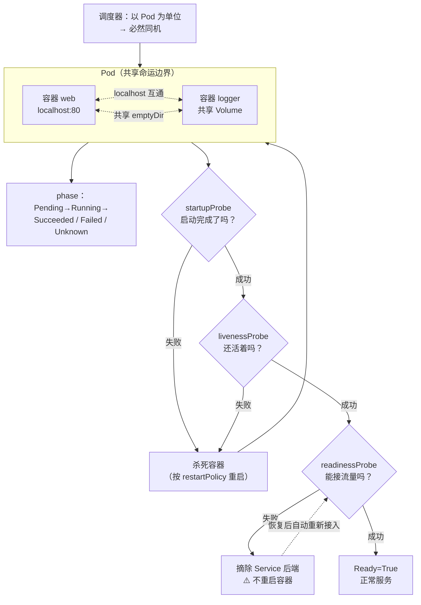

# 第 3 课：Pod：k8s 的最小调度单元

> 所属阶段：阶段 1《心智模型与架构》｜ 水平：入门偏进阶 ｜ 本课知识点：为什么需要 Pod 这一层、Pod 生命周期与状态机、探针三兄弟
> 故事情节：上一课你看到"控制器让 status 追上 spec"，这一课要回答**它追的那个东西（Pod）本身是什么**——为什么不能是容器，它有哪些状态，k8s 凭什么判断它"活着"

## 🎯 本课目标

- 说清 Pod 存在的理由：它不是"多包一层"，而是为了表达**容器间的共生关系**
- 能读懂 Pod 的 phase 与 conditions，区分"Pod 的状态"和"容器的状态"
- 区分三种探针各自解决什么问题，能说清配错 liveness 为何会导致级联故障

---

## 第一幕：起源与场景引入

> 🏛️ **起源**：Pod 这个名字和它"一组共享命运的东西"的设计，都不是 k8s 拍脑袋定的，而是来自 Google 内部系统 **Borg**。
>
> Borg 把一组紧密协作的进程调度到同一台机器上，称为 **alloc**（allocation 的缩写）—— 意思是"一次分配的机器资源"。它的核心洞察是：**有些进程天然就该待在一起**。比如一个 Web 服务与它的日志采集进程：分开调度，它们可能被分到不同机器，日志采集就拿不到本地日志文件；放在一起，共享磁盘与网络，问题消失。
>
> k8s 在设计时把 alloc 改名叫 **Pod**（鲸鱼群 / 豆荚的意象 —— 一群作为一个整体行动的东西），并明确了它的核心语义：**Pod 是"可以调度到一台机器上的一组容器"，它们共享网络命名空间与存储卷，永远被一起调度、一起消亡**。
>
> 这个"共享网络命名空间"的设计是关键决策。它意味着 Pod 内的进程**可以用 `localhost` 互相通信**，就像它们在同一台机器上一样 —— 这在分布式系统里是极其强大的约束：**共生关系被表达成了网络拓扑**。
>
> （核查于 2026-09；来源：[Kubernetes 官方文档 · Pod](https://kubernetes.io/zh-cn/docs/concepts/workloads/pods/)、[Google Borg 论文 · alloc 抽象](https://research.google/pubs/large-scale-cluster-management-at-google-with-borg/)）

🎬 **场景**：假设你要部署一个 Web 应用，它旁边需要一个" sidecar"负责收集日志。你手上已经有 Docker 了，于是你写了两个容器：

- `web`：跑 nginx，监听 80
- `log-agent`：读 `/var/log/nginx/access.log`，做解析后转发

现在问题来了 —— 你用什么方式告诉调度器"这两个必须在一起"？

1. 分别跑两个容器？**可能被调度到不同机器**，log-agent 根本读不到 web 的日志文件。
2. 塞进同一个容器里（在容器里起两个进程）？**失去了独立升级、独立资源限制、独立排障的能力**，而且你要自己写进程管理器（容器里没有 systemd）。
3. **打包成一个"原子单位"一起调度** —— 这就是 Pod。

再问第二个问题：容器里的进程可能"假死"—— 进程还在、端口还通，但已经死锁不再处理请求。`docker ps` 显示 `Up 5 hours`，看起来一切正常。**k8s 凭什么知道它已经不能用了？**

这两个问题的答案，就是本课的全部内容。

---

## 第二幕：认知冲突

> ❓ **问题**：既然 Pod 里通常只跑一个容器，那 Pod 不就是"多包了一层"吗？为什么不直接调度容器？

这是学 k8s 最普遍的误解之一。关键在于：**Pod 里"通常"只有一个容器，不代表它的语义是"一个容器"**。

打个比方：你独居时，一套房子里也只有你一个人 —— 但"房子"这个概念并不是"一个人的住所"。**房子的语义是"可以被分配的最小居住单位"**，它能容纳一个人，也能容纳一家人。Pod 同理。

真正确定 Pod 语义的，是**当里面有多个容器时它们的关系**：

```
两个独立容器（无 Pod）：     可能被分到不同节点
                              ↓
                          日志采集读不到文件 ❌

Pod 内的两个容器：           一定在同一节点
                             共享网络（localhost 互通）
                             共享存储卷（文件可见）
                                 ↓
                             日志采集正常工作 ✅
```

更关键的一点是：**Pod 是 k8s 调度的最小单位，不是最小"运行"单位**。调度器只决定"这个 Pod 放哪个节点"，从不单独调度容器。你永远不会看到一个 Pod 的两个容器分别在不同节点上。

> 💡 **心智转变**：不要把 Pod 理解成"一个容器的包装盒"，要理解成**"一组共享命运的进程的边界"**。这个边界划在哪，决定了哪些进程可以 `localhost` 通信、可以共享文件、会一起被杀掉。

---

## 第三幕：层层揭示

### 知识点 1：为什么需要 Pod 这一层

> 本知识点关键点：共享网络与存储 / 调度原子性 / Pod 与容器的关系

#### 一句话定义

**Pod 是 k8s 中可创建和管理的、最小的可部署计算单元**，它是一组（一个或多个）共享网络命名空间与存储卷的容器，这些容器**总是一起被调度到同一节点、一起启动、一起终止**。

#### 直觉建立（类比）

把 Pod 想成**一艘潜艇上的乘员组**，把容器想成**单个乘员**：

- 单个乘员（容器）无法独立执行任务 —— 他需要氧气、电力、舱室，这些是**潜艇（Pod）提供的共享环境**
- 一艘潜艇上的乘员**共享同一套生命维持系统**（= 共享网络命名空间与存储卷），因此彼此可以面对面说话（= `localhost` 通信）
- 潜艇是**调度的最小单位**：海军不会把单个乘员单独投放到某艘船上，投放的是整艘潜艇
- 潜艇沉了，全员一起完蛋 —— **Pod 里的容器共享命运**

> 💡 **类比的边界**：潜艇的乘员是可替换的个体；Pod 的容器在 Pod 生命周期内是固定的，不能动态增删（init 容器除外，它跑完就退出）。另外 k8s 里确实有 **Ephemeral Containers**（临时容器，用于调试），但那是 `kubectl debug` 场景，不是常规部署形态。

#### 核心原理

**一、Pod 提供的是什么？共享命名空间。**

一个 Pod 内的所有容器共享：

| 共享项 | 效果 | 实测证据 |
|---|---|---|
| **网络命名空间** | 同一个 IP 地址；容器间可用 `localhost` 互通 | Pod 只有一个 `status.podIP` |
| **存储卷（Volume）** | 挂载同一 Volume 的容器可见相同文件 | 见下文 A2 实测 |
| **主机名** | 共享 `metadata.name` 作为主机名 | 可用 `hostname` 命令验证 |

不共享的：容器的**文件系统**（各自镜像层）、**进程空间**（默认）。

**二、"永远在一起"是硬约束，不是尽力而为。**

调度器（kube-scheduler）在决定 Pod 放哪个节点时，**以整个 Pod 为单位**。它不会、也无法把一个 Pod 的两个容器拆到两个节点上。这就把"共生关系"从"约定"变成了**系统级保证**。

**三、Pod 表达的是"共生"，不是"组合"。**

这是个容易被忽略的设计判断：**该不该放进同一个 Pod，取决于这两个进程是否必须共享机器资源**，而不是"它们是否属于同一个应用"。

- ✅ 该同 Pod：Web 服务 + 日志采集（要读本地文件）；主容器 + 本地缓存 sidecar（要 `localhost` 低延迟）
- ❌ 不该同 Pod：Web 服务 + 数据库（数据库要独立扩缩、独立存储、独立故障域）

> ⚠️ **扩缩容的边界**：Pod 是扩缩容的单位。把 Web 和数据库塞进一个 Pod，你扩 Web 时就会连带扩出多个数据库 —— 这是初学者最常犯的架构错误。课 12 讲有状态应用时会再回来讨论这一点。

#### 示例演示

**验证一：两个容器共享同一个 IP，且 `localhost` 互通。**

```bash
# 创建一个含两个容器的 Pod（命名空间 lesson03）
cat <<'EOF' | kubectl apply -f -
apiVersion: v1
kind: Pod
metadata:
  name: shared-net
spec:
  containers:
  - name: web
    image: nginx:alpine
    ports:
    - containerPort: 80
  - name: sidecar
    image: curlimages/curl:8.5.0
    command: ["sleep","3600"]
EOF
# 输出：pod/shared-net created

kubectl wait --for=condition=Ready pod/shared-net --timeout=120s
# 输出：pod/shared-net condition met
```

```bash
kubectl get pod shared-net -o jsonpath='{.status.podIP}{"\n"}'
# 输出（本机 v1.34.0 实测）：10.244.0.34    ← 注意：整个 Pod 只有这一个 IP

kubectl exec shared-net -c sidecar -- curl -s -o /dev/null -w 'HTTP %{http_code}\n' http://localhost:80
# 输出：HTTP 200
```

> 🎯 **看清楚这个结果的含义**：sidecar 容器里**没有**跑 nginx，但它访问 `localhost:80` 得到了 200。因为 web 容器与它在同一网络命名空间，nginx 监听的 80 端口就在它的 `localhost` 上。**这就是 Pod 存在的直接证据。**

**验证二（关键反证）：`localhost` 是 Pod 私有的，跨 Pod 看不到。**

只看到上面的成功还不够 —— 要确认"localhost 互通"确实是 Pod 带来的，而不是"整个集群都能互通"。于是一个**没有跑任何 Web 服务的 Pod** 做对照：

```bash
cat <<'EOF' | kubectl apply -f -
apiVersion: v1
kind: Pod
metadata:
  name: solo-b
spec:
  containers:
  - name: c
    image: busybox:1.36
    command: ["sleep","3600"]
EOF
kubectl wait --for=condition=Ready pod/solo-b --timeout=120s

kubectl exec solo-b -- sh -c 'wget -q -O /dev/null --timeout=5 http://localhost:80 && echo "通" || echo "不通"'
# 输出：不通
# （完整报错：wget: can't connect to remote host (127.0.0.1): Connection refused）

# 对比：shared-net 内同样访问 localhost:80
kubectl exec shared-net -c sidecar -- sh -c 'curl -s -o /dev/null -w "HTTP %{http_code}\n" --max-time 5 http://localhost:80'
# 输出：HTTP 200
```

> ✅ **同样的 `http://localhost:80`，在 `shared-net` 里通、在 `solo-b` 里 Connection refused**。这证明 `localhost` 是 **Pod 私有的网络命名空间** —— 每个 Pod 都有自己的 `localhost`，彼此隔离。
>
> ⚠️ 注意别把对照实验做反：如果拿另一个**自己跑了 nginx** 的 Pod 去访问 `localhost:80`，它也会返回 200（那是它自己），**证明不了任何事情**。

**验证三：共享存储卷。**

```bash
cat <<'EOF' | kubectl apply -f -
apiVersion: v1
kind: Pod
metadata:
  name: shared-vol
spec:
  containers:
  - name: writer
    image: busybox:1.36
    command: ["sh","-c","echo 'written by writer' > /data/hello.txt; sleep 3600"]
    volumeMounts:
    - name: data
      mountPath: /data
  - name: reader
    image: busybox:1.36
    command: ["sleep","3600"]
    volumeMounts:
    - name: data
      mountPath: /data
  volumes:
  - name: data
    emptyDir: {}
EOF
kubectl wait --for=condition=Ready pod/shared-vol --timeout=120s

kubectl exec shared-vol -c reader -- cat /data/hello.txt
# 输出：written by writer
```

> `emptyDir` 类型的卷**随 Pod 创建而创建、随 Pod 删除而删除**。它是 Pod 内多个容器交换数据的最简单方式（课 12 会展开全部卷类型）。

**验证四：确认"调度原子性" —— Pod 内所有容器必然在同一节点。**

```bash
kubectl get pod shared-net -o jsonpath='pod={.metadata.name} node={.spec.nodeName}{"\n"}'
# 输出：pod=shared-net node=k8s-c1-control-plane
```

`spec.nodeName` 是**整个 Pod 一个值**，不存在"每个容器一个节点"的说法。

#### 常见误区

1. **"Pod 就是一个容器的别名"**：不对。Pod 的语义是"共享命运的一组容器"，单容器只是它的常见用法。把 Pod 理解成容器别名，会导致后面理解 sidecar / init 容器时处处别扭。
2. **"把 Web 和数据库放一个 Pod 里，反正它们要通信"**：**这是最危险的架构错误**。理由：① 扩缩容单位是 Pod，扩 Web 会连带扩数据库；② 二者故障域被绑定，数据库崩了 Web 也一起重启；③ 数据库需要持久化存储，而 Pod 重建后 `emptyDir` 就没了。正确做法是**分开部署，用 Service 通信**（课 7）。
3. **"Pod 里的容器可以单独重启"**：不行。k8s 重启的是**容器**（由 kubelet 执行），不是 Pod。Pod 被删除就是整体消失，不会"只删一个容器"。
4. **"Pod 有 IP，所以可以像虚拟机一样用"**：不要。Pod 是**可抛弃的**（cattle not pets），IP 会变。需要稳定访问入口请用 Service（课 7）。

#### 一句话记住

> **Pod 不是"容器的包装盒"，而是"共享命运的边界" —— 边界内的进程共享 `localhost` 与文件、必然同机、一起消亡。**

#### 官方文档

- [Kubernetes 官方文档 · Pod](https://kubernetes.io/zh-cn/docs/concepts/workloads/pods/)
- [Kubernetes 官方文档 · Pod 的生命周期](https://kubernetes.io/zh-cn/docs/concepts/workloads/pods/pod-lifecycle/)

---

### 知识点 2：Pod 生命周期与状态机

> 本知识点关键点：phase 与 conditions 的区别 / 三种终态 / 重启策略与容器状态

#### 一句话定义

Pod 从创建到消亡会经历若干**阶段（phase）**，每个阶段由一组**条件（conditions）** 精确描述；Pod 的最终归宿只有三种：**Succeeded（成功完成）、Failed（失败终止）、Unknown（状态不明）**。

#### 直觉建立（类比）

把 Pod 想成**一份快递订单**：

- **phase** 是订单主状态：`待揽收 → 运输中 → 已签收`
- **conditions** 是每一步的细项勾选：`已付款=True`、`已打包=True`、`已装车=False`、……

主状态给你**粗粒度定位**（"到哪一步了"），细项给你**精确诊断**（"卡在哪个环节、为什么"）。

排障时二者都要看：**phase 回答"现在算什么状态"，conditions 回答"为什么是这个状态"**。

> 💡 **类比的边界**：快递状态是单向推进的；Pod 的 `Ready` 条件可以**反复翻转**（运行中就绪探针失败，Ready 会从 True 变回 False）。

#### 核心原理

**一、五个 phase（阶段）。**

| phase | 含义 | 说明 |
|---|---|---|
| **Pending** | 已创建但还不能运行 | 正在拉镜像、或还没调度到节点 |
| **Running** | 已绑定到节点，至少有一个容器在运行或正在启动 | **注意：Running 不等于"能接流量"** |
| **Succeeded** | 所有容器都成功终止（退出码 0），且不会再重启 | 一次性任务的正常终态 |
| **Failed** | 至少一个容器以非 0 退出码终止 | 一次性任务的失败终态 |
| **Unknown** | 无法获取状态 | 通常是与 Pod 所在节点的通信故障 |

> ⚠️ **最容易误解的就是 `Running`**：它只表示"容器在跑"，**不代表服务可用**。一个正在启动、或就绪探针失败的 Pod，同样是 `Running`。判断能否接流量要看 `Ready` 条件（即 `kubectl get pod` 的 READY 列）。

**二、conditions（条件）—— 精确诊断在这里。**

每个条件都有 `type`（类型）、`status`（True/False/Unknown）、以及可选的 `reason` 与 `message`：

| condition | 含义 |
|---|---|
| `PodScheduled` | 是否已调度到某个节点 |
| `PodReadyToStartContainers` | 容器运行环境是否已准备好（较新的条件） |
| `Initialized` | 所有 init 容器是否已成功完成（课 4 讲） |
| `ContainersReady` | 所有容器是否都已就绪 |
| `Ready` | Pod 是否**可以接收流量**（最重要，对应 READY 列） |
| `DisruptionTarget` | Pod 是否即将因干扰而被删除（课 19 讲 PDB 时会回来） |

**三、容器状态（containerStatuses）—— 第三层信息。**

`phase` 和 `conditions` 都是 **Pod 级**的，而真正跑进程的**容器**有自己的状态机：

```
Waiting（等待）   ← 拉镜像中、等待启动
Running（运行中）
Terminated（已终止） ← 带 exitCode 与 reason
```

**四、重启策略：决定"容器死了怎么办"。**

| restartPolicy | 行为 | 典型用途 |
|---|---|---|
| **Always**（默认） | 容器终止就重启，**无论退出码** | 长期运行的服务（Deployment 用的就是这个） |
| **OnFailure** | 仅退出码非 0 时重启 | 希望"失败重试、成功就停"的任务 |
| **Never** | 从不重启 | 一次性任务 |

> 🔑 **关键区分**：`restartPolicy` 管的是**容器重启**（kubelet 在同节点原地拉起），**不是 Pod 重建**。裸 Pod 的容器退出后若策略为 `Never`，这个 Pod 就永远停在 `Succeeded`/`Failed`，**没人会重建它** —— 这正是需要 Deployment 等控制器的原因（课 5）。

#### 示例演示

**验证一：抓取从 Pending 到 Running 的转变。**

```bash
kubectl apply -f - <<'EOF'
apiVersion: v1
kind: Pod
metadata:
  name: lifecycle-demo
spec:
  containers:
  - name: app
    image: nginx:alpine
EOF
# 输出：pod/lifecycle-demo created

# 立刻连抓三次（Pending 转瞬即逝）
for i in 1 2 3; do
  kubectl get pod lifecycle-demo -o jsonpath='phase={.status.phase}{"\n"}'
  sleep 0.3
done
# 输出（本机实测）：
# phase=Pending
# phase=Pending
# phase=Pending

kubectl wait --for=condition=Ready pod/lifecycle-demo --timeout=120s
kubectl get pod lifecycle-demo -o jsonpath='{.status.phase}{"\n"}'
# 输出：Running
```

```bash
# 看完整的 conditions
kubectl get pod lifecycle-demo -o jsonpath='{range .status.conditions[*]}{.type}={.status}{"\n"}{end}'
# 输出（本机 v1.34.0 实测，按此顺序）：
# PodReadyToStartContainers=True
# Initialized=True
# Ready=True
# ContainersReady=True
# PodScheduled=True
```

> 五个条件全 True，Pod 才算真正可用。**排障时的正确顺序是先看哪个是 False，再看它的 `reason` 与 `message`**：
>
> ```bash
> kubectl get pod <pod名> -o jsonpath='{range .status.conditions[?(@.status!="True")]}{.type}={.status}{"  "}reason={.reason}{"  "}msg={.message}{"\n"}{end}'
> ```

**验证二：三种终态 —— Succeeded 与 Failed。**

```bash
cat <<'EOF' | kubectl apply -f -
apiVersion: v1
kind: Pod
metadata:
  name: job-success
spec:
  restartPolicy: Never
  containers:
  - name: c
    image: busybox:1.36
    command: ["sh","-c","echo 任务完成; exit 0"]
EOF
sleep 4
kubectl get pod job-success -o jsonpath='phase={.status.phase}{"\n"}'
# 输出：phase=Succeeded

kubectl logs job-success
# 输出：任务完成
```

```bash
cat <<'EOF' | kubectl apply -f -
apiVersion: v1
kind: Pod
metadata:
  name: job-fail
spec:
  restartPolicy: Never
  containers:
  - name: c
    image: busybox:1.36
    command: ["sh","-c","echo 出错了; exit 3"]
EOF
sleep 4
kubectl get pod job-fail -o jsonpath='phase={.status.phase}{"\n"}'
# 输出：phase=Failed

kubectl get pod job-fail -o jsonpath='{range .status.containerStatuses[*]}{.state}{"\n"}{end}'
# 输出（本机实测）：
# {"terminated":{"containerID":"containerd://38fc50133f7bf6d04bdc8bc0ce3b2985...",
#   "exitCode":3,"finishedAt":"2026-09-10T07:55:02Z","reason":"Error",
#   "startedAt":"2026-09-10T07:55:02Z"}}
```

> 🎯 **排障要点**：`exitCode: 3` 与 `reason: Error` 就在这里。**`exitCode` 是判断容器为什么死的第一手证据** —— 查不到日志时先看它。

**验证三：CrashLoopBackOff —— 退避重启。**

```bash
cat <<'EOF' | kubectl apply -f -
apiVersion: v1
kind: Pod
metadata:
  name: crash-demo
spec:
  restartPolicy: OnFailure
  containers:
  - name: c
    image: busybox:1.36
    command: ["sh","-c","echo 启动即失败; exit 1"]
EOF
sleep 40
kubectl get pod crash-demo --no-headers
# 输出（本机实测）：crash-demo   0/1   CrashLoopBackOff   2 (24s ago)   41s

kubectl get events --field-selector involvedObject.name=crash-demo --sort-by=.lastTimestamp | tail -3
# 输出（节选）：
# 24s   Normal   Started  pod/crash-demo   Started container c
# 10s   Warning  BackOff  pod/crash-demo   Back-off restarting failed container c in pod crash-demo_lesson03(...)
```

> 🔑 **`CrashLoopBackOff` 不是 phase，而是容器状态的一种表现**。它的含义是"容器反复崩溃，kubelet 正在按指数退避（10s → 20s → 40s……上限 5 分钟）延迟下一次重启"。**看到它不要急着重启集群** —— 它在保护节点不被反复拉起失败容器的开销打垮；**真正要做的是查为什么崩**（`kubectl logs <pod> --previous` 看上一次崩溃的日志）。

**验证四：裸 Pod 与控制器管理的 Pod 的根本差别。**

```bash
# 裸 Pod：没人管它
kubectl get pod job-success -o jsonpath='phase={.status.phase}  restartPolicy={.spec.restartPolicy}  owner={.metadata.ownerReferences}{"\n"}'
# 输出：phase=Succeeded  restartPolicy=Never  owner=          ← owner 为空！

# Deployment 管的 Pod
kubectl create deployment l3-cmp --image=nginx:alpine --replicas=1
kubectl wait --for=condition=Available deployment/l3-cmp --timeout=120s
POD=$(kubectl get pod -l app=l3-cmp -o jsonpath='{.items[0].metadata.name}')
kubectl get pod "$POD" -o jsonpath='restartPolicy={.spec.restartPolicy}  owner={.metadata.ownerReferences[0].kind}{"\n"}'
# 输出：restartPolicy=Always  owner=ReplicaSet        ← 有属主

# 删掉它，会被重建
kubectl delete pod "$POD"
sleep 6
kubectl get pods -l app=l3-cmp --no-headers
# 输出：l3-cmp-7966c6fcf-kz8f4   1/1   Running   0   9s   ← 名字变了，是新 Pod
```

> ✅ **这就是课 2 讲的 `ownerReferences` 在起作用**。裸 Pod 的 `owner` 为空 → 死了就死了；控制器管的 Pod 有属主 → 被删会被重建。**生产环境几乎不应直接创建裸 Pod**（课 5 展开）。

**验证五：`restartPolicy` 是不可变字段。**

```bash
kubectl get pod lifecycle-demo -o jsonpath='{.spec.restartPolicy}{"\n"}'
# 输出：Always

kubectl patch pod lifecycle-demo --type=merge -p '{"spec":{"restartPolicy":"Never"}}'
# 输出（本机实测，报错）：
# The Pod "lifecycle-demo" is invalid: spec: Forbidden: pod updates may not change fields
# other than `spec.containers[*].image`, `spec.initContainers[*].image`,
# `spec.activeDeadlineSeconds`, `spec.tolerations` (only additions to existing tolerations),
# `spec.terminationGracePeriodSeconds` (allow it to be set to 1 if it was previously negative)
```

> 💡 **这条报错本身就是一份文档** —— 它精确列出了 Pod **唯一允许修改的字段**：容器镜像、activeDeadlineSeconds、tolerations（仅新增）、terminationGracePeriodSeconds。**除此之外 Pod 的一切都不可变**，要改就得删了重建。这是很多"为什么我改不动"的根源。

#### 常见误区

1. **"`Running` 就是服务可用了"**：错。`Running` 只说明容器在跑。能否接流量看 `Ready` 条件（READY 列）。**这是排障时最常见的一厢情愿。**
2. **"`CrashLoopBackOff` 是 Pod 的一个 phase"**：不是。phase 只有 5 个固定值，`CrashLoopBackOff` 是**容器重启退避**的表现，Pod 的 phase 此时仍是 `Running` 或 `Pending`。
3. **"restartPolicy 会让 Pod 重建"**：不会。它只管**容器原地重启**。Pod 重建是控制器的职责。
4. **"Pod 想改什么都能 patch"**：不行。上面实测的报错已经列出了白名单，Pod 绝大部分字段不可变。
5. **"删 Pod 是瞬间完成的"**：不是。默认有 30 秒优雅终止宽限期（`terminationGracePeriodSeconds`）。本机实测删除一个 nginx Pod 约 1 秒（进程秒退），但如果应用不处理 SIGTERM，就会**卡满 30 秒**才被强杀（课 4 讲优雅终止）。

#### 一句话记住

> **phase 说"算什么状态"，conditions 说"为什么是这个状态"，containerStatuses 的 exitCode 说"到底怎么死的" —— 排障三层递进，不要只看 `get pod` 的第一列。**

#### 官方文档

- [Kubernetes 官方文档 · Pod 生命周期](https://kubernetes.io/zh-cn/docs/concepts/workloads/pods/pod-lifecycle/)
- [Kubernetes 官方文档 · Pod 状况（Pod Conditions）](https://kubernetes.io/zh-cn/docs/concepts/workloads/pods/pod-condition/)

---

### 知识点 3：探针三兄弟

> 本知识点关键点：三种探针各自解决什么问题 / 失败后果不同 / 四种探测方式 / 配错 liveness 的级联风险

#### 一句话定义

k8s 用三种**探针（Probe）** 让 kubelet 判断容器的健康状态：

- **startupProbe（启动探针）**：判断**应用是否已启动完成**；成功前，另外两种探针不会执行
- **livenessProbe（存活探针）**：判断**容器是否还活着**；失败则**杀死容器并重启**
- **readinessProbe（就绪探针）**：判断**容器是否可以接收流量**；失败则**从 Service 后端摘除，但不重启**

#### 直觉建立（类比）

把容器想成一家**餐厅**：

- **startupProbe** = 早上开门前，**检查准备工作做完了没**（食材到位、灶台点火）。没做完就不开门营业，也不接受顾客 —— 但**这不代表餐厅倒闭**，只是还没准备好。给足时间即可。
- **livenessProbe** = 营业中，**检查厨房是不是还活着**。如果厨师全晕倒了（死锁），那这家店必须**停业整顿（重启）**。
- **readinessProbe** = 营业中，**检查现在能不能接待新顾客**。如果已经满座（过载），就**先不接新客（摘流量）**，但**照常服务已在店里的客人**，也不关门 —— 等空了再重新接客。

> 💡 **这个类比点出了最核心的区别**：liveness 失败 = **关店重开**（破坏性，会重启）；readiness 失败 = **暂时不接新客**（非破坏性，容器不受影响）。把它们搞混，是生产事故的常见来源。

#### 核心原理

**一、三种探针的对比（最重要的一张表）。**

| 探针 | 回答的问题 | 失败后果 | 是否重启容器 | 典型场景 |
|---|---|---|---|---|
| **startupProbe** | 启动完成了吗？ | kubelet **杀死容器**（按 restartPolicy 处理） | 是 | 慢启动应用（Java 微服务、大模型加载） |
| **livenessProbe** | 还活着吗？ | kubelet **杀死容器**（按 restartPolicy 处理） | 是 | 死锁检测 |
| **readinessProbe** | 能接流量吗？ | **摘除 Service 后端**，容器继续运行 | **否** | 启动中、过载、依赖未就绪 |

**二、startupProbe 为什么必须单独存在？**

官方文档的原话是：**"如果配置了启动探针，k8s 将在启动探针成功之前不执行存活探针或就绪探针。"**

这句话解释了一切：

```
无 startupProbe：
  容器启动 → liveness 立即按固定节奏探测 → 慢启动应用还没监听 → 判定失败 → 被杀 → 重启 → 又被杀…
  结果：永远起不来（CrashLoopBackOff）

有 startupProbe：
  容器启动 → startupProbe 接管，给足宽容时间 → 成功 → liveness/readiness 才开始工作
  结果：慢启动应用能正常起来
```

> 🔑 **没有 startupProbe 的年代，人们只能用很长的 `initialDelaySeconds` 来凑** —— 但那是个常量，你得按"最坏情况"设置，导致**正常启动时也要等那么久才能被发现故障**。startupProbe 把这个"启动期宽容"与"运行期敏感"解耦成了两个独立参数。

**三、四种探测方式。**

| 方式 | 判定依据 | 适用 |
|---|---|---|
| `httpGet` | HTTP 状态码 2xx/3xx 为成功 | Web 服务（最常用） |
| `tcpSocket` | TCP 端口能否连通 | 非 HTTP 服务（数据库、Redis） |
| `exec` | 命令**退出码为 0** 为成功 | 需要自定义逻辑（检查文件、跑脚本） |
| `grpc` | gRPC 健康检查协议 | gRPC 服务 |

**四、关键参数与默认值（本机 v1.34.0 实测 `kubectl explain`）。**

| 参数 | 含义 | 默认值 |
|---|---|---|
| `initialDelaySeconds` | 容器启动后多久开始第一次探测 | 0（文档未标注 `Defaults to`，即未设置时不延迟） |
| `periodSeconds` | 探测间隔 | **10** |
| `timeoutSeconds` | 单次探测超时 | **1** |
| `failureThreshold` | 连续失败几次才判定失败 | **3** |
| `successThreshold` | 连续成功几次才判定成功 | 1（**liveness 与 startup 必须为 1**） |

```bash
kubectl explain pod.spec.containers.livenessProbe.periodSeconds | tail -4
# 输出：How often (in seconds) to perform the probe. Default to 10 seconds. Minimum value is 1.

kubectl explain pod.spec.containers.livenessProbe.successThreshold | tail -5
# 输出：... Defaults to 1. Must be 1 for liveness and startup. Minimum value is 1.
```

> 💡 **不用背这张表** —— 用 `kubectl explain` 自查，它**永远和你当前的集群版本一致**（不同版本默认值可能变）。

**五、⚠️ 官方明确警告：livenessProbe 配错会导致级联故障。**

官方文档原文："**错误地实现存活探针可能导致级联故障。这会引发容器在高负载下被重启、延长了请求的响应时间……**"

原因是这样的：如果 liveness 探测的是**依赖外部服务的接口**（比如"能否连上数据库"），那么当数据库抖动时，**所有** Pod 的 liveness 同时失败 → 全部被重启 → 重启期间流量打到更少的 Pod → 负载更高 → 更多 liveness 失败 → **雪崩**。

> 🔑 **正确做法**：liveness 只探测**容器自身是否死锁**（一个极低成本的内部检查），把"依赖可用性"交给 readiness（它失败只是摘流量，不会重启）。

#### 示例演示

**验证一（核心）：readiness 失败 ≠ 容器死，liveness 失败 = 容器重启。**

这是本课最该亲手做的一组对照。

```bash
# A：readiness 探针故意失败（访问不存在的路径）
cat <<'EOF' | kubectl apply -f -
apiVersion: v1
kind: Pod
metadata:
  name: probe-ready
spec:
  containers:
  - name: web
    image: nginx:alpine
    readinessProbe:
      httpGet:
        path: /not-exist
        port: 80
      initialDelaySeconds: 2
      periodSeconds: 3
EOF
sleep 8
kubectl get pod probe-ready --no-headers
# 输出（本机实测）：probe-ready   0/1   Running   0   8s
#                                   ↑ READY=0  ↑ 但 RESTARTS=0
```

```bash
kubectl get pod probe-ready -o jsonpath='{range .status.conditions[?(@.type=="Ready")]}{.type}={.status} reason={.reason} msg={.message}{"\n"}{end}'
# 输出：Ready=False reason=ContainersNotReady msg=containers with unready status: [web]

kubectl get pod probe-ready -o jsonpath='{range .status.containerStatuses[*]}name={.name} ready={.ready} started={.started}{"\n"}{end}'
# 输出：name=web ready=false started=true      ← 容器还在跑（started=true），只是不 ready
```

> ✅ **结论 1**：readiness 失败的结果是 `0/1 Running` —— **容器活着（`started=true`），但不接流量**。RESTARTS 保持 0。

```bash
# B：liveness 探针故意失败
cat <<'EOF' | kubectl apply -f -
apiVersion: v1
kind: Pod
metadata:
  name: probe-live
spec:
  containers:
  - name: web
    image: nginx:alpine
    livenessProbe:
      httpGet:
        path: /not-exist
        port: 80
      initialDelaySeconds: 3
      periodSeconds: 3
      failureThreshold: 2
EOF
sleep 14
kubectl get pod probe-live --no-headers
# 输出（本机实测）：probe-live   1/1   Running   2 (2s ago)   14s
#                                              ↑ RESTARTS=2！

kubectl get events --field-selector involvedObject.name=probe-live --sort-by=.lastTimestamp | tail -3
# 输出（节选）：
# 2s   Warning   Unhealthy   pod/probe-live   Liveness probe failed: HTTP probe failed with statuscode: 404
# 2s   Normal    Killing     pod/probe-live   Container web failed liveness probe, will be restarted
```

> ✅ **结论 2**：liveness 失败的结果是 `RESTARTS` 持续增长，事件里明确写着 `Killing`。**同样是"探针失败"，后果完全不同。**

**验证二（本课最重要）：startupProbe 保护慢启动应用。**

先看**没有** startupProbe 时，一个需要 25 秒才启动的应用会被怎样对待：

```bash
cat <<'EOF' | kubectl apply -f -
apiVersion: v1
kind: Pod
metadata:
  name: slow-nostartup
spec:
  containers:
  - name: app
    image: busybox:1.36
    command:
    - sh
    - -c
    - |
      # 模拟慢启动：25 秒后才监听 8080
      sleep 25
      while true; do
        echo -e "HTTP/1.1 200 OK\n" | nc -l -p 8080
      done
    livenessProbe:
      tcpSocket:
        port: 8080
      initialDelaySeconds: 2
      periodSeconds: 3
      failureThreshold: 1
EOF
sleep 20
kubectl get pod slow-nostartup --no-headers
# 输出（本机实测）：slow-nostartup   1/1   Running   0   20s

kubectl get events --field-selector involvedObject.name=slow-nostartup --sort-by=.lastTimestamp | tail -2
# 输出：
# 17s   Warning   Unhealthy   pod/slow-nostartup   Liveness probe failed: dial tcp 10.244.0.44:8080: connect: connection refused
# 17s   Normal    Killing     pod/slow-nostartup   Container app failed liveness probe, will be restarted
```

> ⚠️ **注意这个"看似矛盾"的输出**：`kubectl get pod` 显示 `1/1 Running 0`，但事件里已经 `Killing` 了。这不是 bug —— 是**状态显示滞后**：容器刚被重启、还没跑满一个探测周期，RESTARTS 与 READY 还没反映最新事实。**排障时不能只看 `get pod`，必须看 events。**
>
> 🎯 **这个应用的命运**：它每次启动都要 25 秒，而 liveness 从 2 秒就开始探测 —— **它永远活不过第一次检查**，陷入"启动→被杀→重启→再被杀"的死循环。

现在加上 startupProbe：

```bash
cat <<'EOF' | kubectl apply -f -
apiVersion: v1
kind: Pod
metadata:
  name: slow-startup
spec:
  containers:
  - name: app
    image: busybox:1.36
    command:
    - sh
    - -c
    - |
      sleep 25
      while true; do
        echo -e "HTTP/1.1 200 OK\n" | nc -l -p 8080
      done
    startupProbe:
      tcpSocket:
        port: 8080
      periodSeconds: 3
      failureThreshold: 15          # 容忍 15×3=45 秒启动时间
    livenessProbe:
      tcpSocket:
        port: 8080
      initialDelaySeconds: 2
      periodSeconds: 3
      failureThreshold: 1
EOF
sleep 20
kubectl get pod slow-startup --no-headers
# 输出（本机实测）：slow-startup   0/1   Running   0   21s
#                                  ↑ 还没 ready，但 RESTARTS=0（没被杀）

sleep 20
kubectl get pod slow-startup --no-headers
# 输出（本机实测）：slow-startup   1/1   Running   0   41s
#                                  ↑ 25 秒后应用起来了，顺利转为 Ready
```

> 🎯 **同样的慢启动应用，命运完全不同**：
> - 无 startupProbe → 17 秒时被 `Killing`，陷入重启循环
> - 有 startupProbe → 20 秒时 `0/1`（宽容期内），41 秒时 `1/1` 且 **RESTARTS 始终为 0**
>
> **这就是 startupProbe 存在的全部意义**：它让"启动期宽容"与"运行期敏感"可以分别配置。startupProbe 容忍 45 秒，而 livenessProbe 保持 3 秒间隔的敏感度 —— 一旦启动完成，故障仍能被快速发现。

**验证三：exec 探针（用退出码判定）。**

```bash
cat <<'EOF' | kubectl apply -f -
apiVersion: v1
kind: Pod
metadata:
  name: probe-exec
spec:
  containers:
  - name: app
    image: busybox:1.36
    command: ["sh","-c","touch /tmp/healthy; sleep 3600"]
    livenessProbe:
      exec:
        command: ["test","-f","/tmp/healthy"]
      periodSeconds: 5
EOF
kubectl wait --for=condition=Ready pod/probe-exec --timeout=120s
kubectl get pod probe-exec --no-headers
# 输出：probe-exec   1/1   Running   0   1s

# 删掉"健康标记"，模拟「进程还在但已不健康」
kubectl exec probe-exec -- rm -f /tmp/healthy
sleep 20
kubectl get events --field-selector involvedObject.name=probe-exec --sort-by=.lastTimestamp | tail -2
# 输出：
# 6s   Warning   Unhealthy   pod/probe-exec   Liveness probe failed:
# 6s   Normal    Killing     pod/probe-exec   Container app failed liveness probe, will be restarted
```

> 🎯 **这个实验演示了探针真正的价值**：容器进程**一直在正常运行**（`sleep 3600` 没退出），但应用语义上已经"不健康"了。光看进程在不在是发现不了的 —— **这正是"进程活着 ≠ 服务可用"**。

**验证四：官方对 exec 探针的性能提醒。**

文档原文："**为任何探针配置 exec 机制都可能给节点的 CPU 使用带来额外开销。**"原因是每次 exec 都要在容器内 fork 一个进程。**高频 exec 探针（如 `periodSeconds: 1`）在大集群上会成为负担**，优先用 httpGet / tcpSocket。

#### 常见误区

1. **"readiness 失败会重启容器"**：**不会**。它只摘流量。把 readiness 当 liveness 用（指望它帮你重启），会得到一个永远"假死"的服务。
2. **"liveness 和 readiness 配成一样的就行"**：常见但危险。配成一样意味着"暂时过载"也会触发重启 —— 高负载时反而雪上加霜。**正确做法：liveness 只查自身死锁，readiness 可以查依赖。**
3. **"探针越频繁越好"**：不是。高频探测浪费 CPU、加大网络负担，且**过于敏感** —— 一次 1 秒的 GC 停顿就可能触发重启。默认 `periodSeconds: 10` 是合理的起点。
4. **"liveness 探测依赖服务（数据库/下游）更全面"**：**这是会引发级联故障的错误做法**（官方明确警告）。依赖抖动会导致全部 Pod 同时重启。
5. **"有 startupProbe 就不需要 liveness 了"**：不对。startupProbe **仅在启动期执行一次**，成功后就不再运行（它不像另外两个那样周期性运行）。运行期的死锁仍需 liveness 来发现。
6. **"探针失败后 Pod 会被重建"**：不是。是**容器被重启**（原地），Pod 对象还在。

#### 一句话记住

> **startup 管"起了没"、liveness 管"活着没"、readiness 管"能接客不"—— 前两个失败会重启容器，最后一个只会摘掉流量。**

#### 官方文档

- [Kubernetes 官方文档 · 存活、就绪和启动探针](https://kubernetes.io/zh-cn/docs/concepts/workloads/pods/probes/)
- [Kubernetes 官方文档 · 配置存活、就绪和启动探针](https://kubernetes.io/zh-cn/docs/tasks/configure-pod-container/configure-liveness-readiness-startup-probes/)

---

## 第四幕：实操验证

把三个知识点串起来：**部署一个真实的多容器 Pod，观察它的生命周期，并用探针保证它的可用性。**

```bash
# ① 建一个带全部三种探针的 Pod（生产级写法）
cat > /tmp/l3-verify.yaml <<'EOF'
apiVersion: v1
kind: Pod
metadata:
  name: l3-verify
  labels:
    app: l3-verify
spec:
  containers:
  - name: web
    image: nginx:alpine
    ports:
    - containerPort: 80
    # 启动探针：给足 30 秒启动时间
    startupProbe:
      httpGet:
        path: /
        port: 80
      periodSeconds: 3
      failureThreshold: 10
    # 存活探针：只查自身，不查依赖
    livenessProbe:
      httpGet:
        path: /
        port: 80
      periodSeconds: 10
      failureThreshold: 3
    # 就绪探针：可以查依赖
    readinessProbe:
      httpGet:
        path: /
        port: 80
      periodSeconds: 5
      failureThreshold: 2
  - name: logger
    image: busybox:1.36
    command: ["sh","-c","while true; do echo $(date) heartbeat >> /logs/app.log; sleep 5; done"]
    volumeMounts:
    - name: logs
      mountPath: /logs
  volumes:
  - name: logs
    emptyDir: {}
EOF

kubectl apply -f /tmp/l3-verify.yaml
# 输出：pod/l3-verify created

kubectl wait --for=condition=Ready pod/l3-verify --timeout=120s
# 输出：pod/l3-verify condition met

kubectl get pod l3-verify --no-headers
# 预期输出：l3-verify   2/2   Running   0   15s
```

```bash
# ② 验证「共享命运」：logger 写的文件，web 容器能否看到？（需给 web 也挂上）
#    这里改为从 web 容器读取 logger 写的日志
kubectl exec l3-verify -c web -- ls /usr/share/nginx/html > /dev/null
kubectl exec l3-verify -c logger -- tail -2 /logs/app.log
# 预期输出（时间戳随时间变化）：
# Thu Sep 10 08:12:33 UTC 2026 heartbeat
# Thu Sep 10 08:12:38 UTC 2026 heartbeat

# ③ 验证 localhost 是 Pod 私有的：在 logger 里访问 web 的 80
kubectl exec l3-verify -c logger -- sh -c 'wget -q -O /dev/null --timeout=5 http://localhost:80 && echo "通：同 Pod 内 localhost 可达" || echo "不通"'
# 预期输出：通：同 Pod 内 localhost 可达
```

```bash
# ④ 观察完整状态机：phase + conditions + 容器状态
kubectl get pod l3-verify -o jsonpath='phase={.status.phase}{"\n"}'
# 预期输出：phase=Running

kubectl get pod l3-verify -o jsonpath='{range .status.conditions[*]}{.type}={.status}{"\n"}{end}'
# 预期输出：
# PodReadyToStartContainers=True
# Initialized=True
# Ready=True
# ContainersReady=True
# PodScheduled=True

kubectl get pod l3-verify -o jsonpath='{range .status.containerStatuses[*]}{.name} ready={.ready} restarts={.restartCount}{"\n"}{end}'
# 预期输出：
# logger ready=true restarts=0
# web ready=true restarts=0
```

```bash
# ⑤ 制造 readiness 失败，验证「摘流量但不重启」
#    让 web 的就绪检查指向一个不存在的路径
kubectl exec l3-verify -c web -- sh -c 'mv /usr/share/nginx/html/index.html /usr/share/nginx/html/index.html.bak'
sleep 12
kubectl get pod l3-verify --no-headers
# 预期输出：l3-verify   1/2   Running   0   ...
#                        ↑ READY 从 2/2 降到 1/2，但 RESTARTS 仍为 0
kubectl get pod l3-verify -o jsonpath='{range .status.conditions[?(@.type=="Ready")]}{.type}={.status}{"\n"}{end}'
# 预期输出：Ready=False

# 恢复
kubectl exec l3-verify -c web -- sh -c 'mv /usr/share/nginx/html/index.html.bak /usr/share/nginx/html/index.html'
sleep 8
kubectl get pod l3-verify --no-headers
# 预期输出：l3-verify   2/2   Running   0   ...   ← Ready 自动恢复，全程零重启
```

> ✅ **回扣场景**：回到第一幕的两个问题 ——
> 1. **怎么保证"两个容器必须在一起"？** 放进同一个 Pod。共享网络命名空间让它们能 `localhost` 通信，共享 Volume 让它们能交换文件，调度器保证它们必然同机。
> 2. **k8s 凭什么知道"假死"的进程不能用了？** 靠探针。进程在不在是 kubelet 的事，**能不能服务是探针的事** —— readiness 摘流量、liveness 重启、startup 保护慢启动。
>
> 更关键的一点：**探针把"活着"这个模糊的概念拆成了三个可分别配置的问题**。这个拆分是 k8s 可用性的基石。

**清理**：

```bash
kubectl delete pod l3-verify shared-net shared-vol solo-a solo-b lifecycle-demo \
  job-success job-fail crash-demo probe-ready probe-live probe-exec \
  slow-nostartup slow-startup --ignore-not-found
kubectl delete deployment l3-cmp
rm -f /tmp/l3-verify.yaml
```

---

## 第五幕：体系收束

> 📍 **全局定位**：本课补齐了"控制器在调谐什么"这个问题里**被调谐的那个对象**。
>
> 三个知识点的关系：
> - 知识点 1 讲**边界**：Pod 划出了"共享命运"的范围（网络、存储、同机）
> - 知识点 2 讲**状态**：这个边界内的东西会经历哪些阶段，怎么精确诊断（phase → conditions → exitCode 三层）
> - 知识点 3 讲**健康判定**：谁来判断它是否还能服务，以及不同"不健康"的处理方式
>
> 🔑 **一句话贯穿**：**Pod 划定共生边界（知识点 1），它的状态由 phase/conditions/containerStatuses 三层描述（知识点 2），而"它是否还能服务"由三种探针分别判定并导向不同动作（知识点 3）。**
>
> 🔗 **与课 2 的呼应**：课 2 说"控制器让 status 追上 spec"。现在你知道了，**Pod 的 `status` 里那几个 conditions 与容器状态，正是 kubelet 与探针持续写入的结果** —— 调谐循环的下游执行者就是它们。
>
> 🔗 **下一步**：本课留下三个未解问题，后续课程逐一回答：
> 1. **Pod 里的容器有先后之分吗？**（init 容器先跑完，主容器才启动；容器终止时如何优雅退场）→ **课 4**
> 2. **Pod 会被删除重建，那谁来保证它一直有？**（控制器）→ **课 5**
> 3. **Pod IP 会变，怎么稳定访问它？**（Service）→ **课 7**
>
> 还有一个伏笔：本课反复出现的 `restartPolicy` 只管**容器重启**，而 Deployment 能**重建 Pod** —— 这两件事的区别，是理解 k8s 自愈能力的关键，课 5 会完整展开。
>
> ⚠️ **关于示例中的安全默认值**：本课的 Pod 示例**故意没有**写 `securityContext`（非 root 用户、只读根文件系统等）。原因有二：① 这些字段属于**运行时加固**，是**课 16《Pod 安全》** 的主题，在本课引入会造成认知倒序；② 加了会让每个 YAML 多出 5-6 行，掩盖本课真正要讲的共享命名空间与探针机制。
>
> **但你必须清楚**：**上面这些 YAML 不能直接用于生产**。生产 Pod 至少应配置 `runAsNonRoot: true`、`readOnlyRootFilesystem: true` 并丢弃全部 capabilities。课 16 会系统讲这套加固三件套，学完请回来对照本课示例补上。

---

## 🐞 常见误区

1. **"Pod 就是容器的包装盒"** → 它是"共享命运的边界"，单容器只是常见用法。
2. **"Web 和数据库该放同一个 Pod"** → 会导致扩缩容耦合、故障域绑定、存储丢失。应分开部署用 Service 通信。
3. **"`Running` 就是服务可用"** → Running 只说明容器在跑，能否接流量看 `Ready` 条件。
4. **"`CrashLoopBackOff` 是 phase"** → 不是，phase 只有 5 个固定值，它是容器重启退避的表现。
5. **"restartPolicy 会让 Pod 重建"** → 不会，它只管容器原地重启；Pod 重建靠控制器。
6. **"Pod 想改什么都能 patch"** → 绝大部分字段不可变，报错信息里列出了唯一允许修改的白名单。
7. **"readiness 失败会重启容器"** → 不会，只摘流量；liveness 失败才重启。
8. **"liveness 和 readiness 配一样就行"** → 危险。liveness 应只查自身死锁，readiness 才可查依赖。
9. **"探针越频繁越好"** → 高频探测浪费资源且过于敏感，一次 GC 停顿就可能误杀。
10. **"有 startupProbe 就不需要 liveness"** → startupProbe 仅启动期执行一次，运行期死锁仍需 liveness。

## 一图总结



## 课后小测

**Q1**：你在 `solo-b`（一个只跑 busybox、无任何监听的 Pod）里执行 `wget http://localhost:80`，结果是 `Connection refused`；但在 `shared-net` 的 sidecar 容器里访问同样的地址却得到 HTTP 200。最合理的解释是？
- A. `solo-b` 的网络插件没装好
- B. `localhost` 是 Pod 私有的网络命名空间，sidecar 能看到同 Pod 内 web 容器的 80 端口，而 `solo-b` 里没有任何东西监听 80
- C. nginx 镜像在 `shared-net` 里额外开了特权端口
- D. `solo-b` 的 busybox 镜像不支持 wget

<details><summary>答案与解析</summary>

**答案：B**。本课实测验证。Pod 内所有容器共享网络命名空间，因此 `shared-net` 的 sidecar 能通过 `localhost` 访问同 Pod 的 web 容器；而 `localhost` 是**每个 Pod 私有**的，`solo-b` 里没有进程监听 80，自然 Connection refused。A、C、D 均与实测不符。

</details>

**Q2**：某 Pod 长期处于 `0/1 Running`，但 `RESTARTS` 一直是 0。最可能的原因是？
- A. liveness 探针失败，容器被反复重启
- B. readiness 探针失败，容器在运行但不接收流量
- C. 镜像拉取失败
- D. 节点资源不足导致调度失败

<details><summary>答案与解析</summary>

**答案：B**。本题实测：`0/1` 表示 Ready 为 False，`Running` 说明容器在跑，`RESTARTS=0` 说明没被重启过 —— 这三者同时成立只有 readiness 失败。A 错（liveness 失败会导致 RESTARTS 增长）；C 会是 `ImagePullBackOff`；D 会导致 Pending。

</details>

**Q3**：你的 Java 服务启动需要 40 秒，但 livenessProbe 从容器启动后 2 秒就开始探测、间隔 3 秒、失败 1 次即判定失败。最可能发生什么？
- A. 服务正常启动，40 秒后开始提供服务
- B. 服务反复被杀死重启，陷入 CrashLoopBackOff，永远起不来
- C. liveness 探针会自动等待服务就绪
- D. Pod 会一直停留在 Pending

<details><summary>答案与解析</summary>

**答案：B**。本课实测：无 startupProbe 的慢启动应用在 17 秒时就被 `Killing`，陷入"启动→被杀→重启"循环。**正确解法是加 startupProbe**（如 `failureThreshold: 15` × `periodSeconds: 3` = 容忍 45 秒），而不是把 liveness 的 `initialDelaySeconds` 调大（那会让运行期故障的发现也变慢）。C 错（探针不会自动等待），D 错（Pending 是调度/拉镜像阶段）。

</details>

## 🚀 下一批接力提示词

> 学完本批后，**复制下面这段文字发给 AI**，即可无缝进入下一批（无需重新描述上下文）：

```
继续学 Kubernetes。我的学习档案在 k8s/00-学习档案.md，
刚学完阶段 1《心智模型与架构》的课 3《Pod：k8s 的最小调度单元》知识点
「为什么需要 Pod 这一层、Pod 生命周期与状态机、探针三兄弟」，
请按大纲继续讲解下一批知识点。
```

## 🧭 课程导航

- 上一课：[课 2：声明式 API 与调谐循环](lesson-02-声明式API与调谐循环.md)
- 下一课：课 4《多容器 Pod：init、sidecar 与优雅终止》（未编写）
- 返回目录：[02-课程目录.md](../../../02-课程目录.md) ｜ 本阶段概览：[心智模型与架构](../overview.md)
