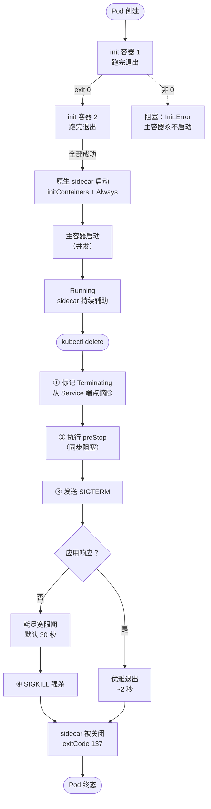

# 第 4 课：多容器 Pod：init、sidecar 与优雅终止

> 所属阶段：阶段 1《心智模型与架构》｜ 水平：入门偏进阶 ｜ 本课知识点：init 容器、sidecar 与适配器模式、优雅终止与生命周期钩子
> 故事情节：上一课你理解了 Pod 是"共享命运的边界"，这一课要回答**边界内的容器如何协作**——有没有先后？能不能一直陪跑？以及最关键的：**Pod 要被删除时，容器是怎么退场的**

## 🎯 本课目标

- 说清 init 容器解决什么问题，以及它与主容器的执行顺序关系
- 区分"普通 sidecar"与"原生 sidecar"，理解后者为何是 Job 场景的关键
- 掌握优雅终止的完整时序，能解释"为什么我的 Pod 删除要等 30 秒"

---

## 第一幕：起源与场景引入

> 🏛️ **起源**：init 容器与 sidecar 都不是 k8s 发明的"新东西"，它们是把两类由来已久的工程实践**固化成了 API**。
>
> **init 容器**对应的是"启动前准备"：早期部署应用时，你需要在启动脚本里写"先等数据库就绪、再拉配置、再改权限，最后启动主程序"。这些逻辑写在启动脚本里，就与镜像强耦合、难以复用、失败信息也难诊断。k8s 把它抽成了**独立的容器** —— 每个准备步骤一个容器，顺序执行、失败即停。
>
> **sidecar** 则来自服务网格与可观测性实践：日志采集、指标暴露、代理转发这些**横切关注点**，不该侵入业务代码。Sidecar 模式的正式命名来自 2017 年微软 Azure 团队的技术文章，与 **Ambassador（大使）**、**Adapter（适配器）** 并列为三种容器组织模式（合称"多容器 Pod 的三种模式"，其中 Ambassador 与 Adapter 都可视为 sidecar 的变体 → 即本课的**适配器模式**）。
>
> **优雅终止**的背景更实际：在容器编排里，"杀掉一个进程"从来不是瞬时的。分布式系统要求进程在退出前**交还手上的工作**（处理完请求、关闭连接、反注册自己）。k8s 为此设计了完整的终止时序：先发信号、给宽限期、超时才强杀。
>
> 一个重要的版本节点：**原生 sidecar**（initContainers + `restartPolicy: Always`）在 **k8s 1.29 进入 Beta 并默认启用，1.33 正式 GA**。在它出现之前，sidecar 只能用普通容器实现，而这会带来本课要讲的**"Job 永不结束"** 问题 —— 这是理解原生 sidecar 价值的关键历史背景。
>
> （核查于 2026-09；来源：[Kubernetes 官方文档 · Init 容器](https://kubernetes.io/zh-cn/docs/concepts/workloads/pods/init-containers/)、[Sidecar 容器](https://kubernetes.io/zh-cn/docs/concepts/workloads/pods/sidecar-containers/)、[容器生命周期回调](https://kubernetes.io/zh-cn/docs/concepts/containers/container-lifecycle-hooks/)）

🎬 **场景**：你要部署一个 Web 应用，启动前有三件事必须先完成：

1. 数据库可能还没就绪，得**等它起来**
2. 需要从远端**拉一份配置文件**
3. 数据目录需要**改权限**

同时，应用运行期间需要一个**日志采集器**持续把日志发出去。

最后还有个生产问题：每次你发版删 Pod，**总有几个请求失败**。用户看到 502。

这三个问题，就是本课要解决的：
- **前两步**怎么做？→ init 容器
- **日志采集器**怎么放？→ sidecar
- **502 从哪来**？→ 优雅终止没做好

---

## 第二幕：认知冲突

> ❓ **问题**：既然 Pod 里的容器"共享命运、一起启动"，那它们是不是**同时启动**的？

不是。这是从课 3 的"共享命运"自然推导出的**错误结论**。

"共享命运"说的是**生命周期边界一致**（同生共死、同机、同网络），**不是说启动时刻相同**。Pod 内部其实有严格的**启动顺序**：

```
Pod 创建
   ↓
init 容器 1 → 跑完退出
   ↓
init 容器 2 → 跑完退出        ← 严格串行，前一个成功才轮到下一个
   ↓
（全部 init 成功）
   ↓
主容器 + 原生 sidecar 并发启动
```

> 💡 **关键洞察**：init 容器是**"任务"**（跑完就退），主容器是**"服务"**（长期运行）。这两类东西的运行模式根本不同，k8s 用不同的字段把它们区分开了 —— `initContainers` 与 `containers`。
>
> 而**原生 sidecar** 是个有意思的中间态：它写在 `initContainers` 里（所以它享受"优先启动"的时序保证），但配了 `restartPolicy: Always`（所以它像服务一样长期运行，不退出）。

---

## 第三幕：层层揭示

### 知识点 1：init 容器

> 本知识点关键点：串行执行 / 跑完退出 / 失败阻塞主容器 / 与普通容器的区别

#### 一句话定义

**init 容器是在主容器启动之前、按定义顺序串行执行的专用容器**，每个都必须**成功退出（exit 0）** 后才会轮到下一个，全部成功后主容器才启动。

#### 直觉建立（类比）

把 Pod 的启动想成**餐厅开门前的准备流程**：

- **init 容器** = 开店前的准备工作：**先**检查食材、**再**打扫卫生、**最后**点火预热。每件事**做完**才能进下一件；任何一件做不成（比如没食材），**就不开门**。
- **主容器** = 正式营业。准备工作全做完了才开始。

> 💡 **类比的边界**：餐厅准备工作的失败可以"带病营业"（比如少个菜就跳过）；init 容器失败是**硬阻塞** —— 主容器**永远不会启动**，k8s 会一直重试这个 init 容器。

#### 核心原理

**一、init 容器的五条关键特性。**

| 特性 | 说明 |
|---|---|
| **严格串行** | 按 `initContainers` 数组顺序执行，前一个成功退出才轮到下一个 |
| **必须成功退出** | 退出码必须为 0；非 0 则按 `restartPolicy` 重试 |
| **失败则阻塞** | 任一 init 容器未成功，**主容器永不启动** |
| **可有多个** | 每个 init 容器可以是不同的镜像（这点很有用） |
| **先于主容器** | 因此适合做前置检查、数据准备、权限设置 |

**二、为什么用 init 容器，而不是把逻辑写进主容器镜像？**

这是个设计选择，理由有四条：

1. **解耦**：init 容器可以用**完全不同的镜像**。等待数据库就绪只需一个 `busybox` + `nc`，不必为此往业务镜像里装工具（**这能显著减小业务镜像体积**）。
2. **职责分离**：业务镜像只管跑业务，准备工作独立维护、独立测试。
3. **失败可诊断**：哪个 init 容器失败一目了然（`kubectl logs <pod> -c <init容器名>`）。
4. **安全**：init 容器往往需要更高权限（比如改文件权限），而主容器可以降权运行 —— **敏感操作只在短暂的 init 阶段进行**。

**三、init 容器的资源与重启语义。**

- init 容器**也消耗资源**，且调度时按"所有 init 容器的资源需求最大值 + 所有主容器资源之和"计算（课 9 讲调度时会回来）
- init 容器**不支持** `readinessProbe`（它不是服务，无所谓"就绪"）
- init 容器的 `restartPolicy` 默认跟随 Pod 级；设为 `Always` 就变成**原生 sidecar**（知识点 2）

#### 示例演示

**验证一：顺序执行 —— 从 `Init:0/2` 到 `Running`。**

```bash
cat <<'YAMLEOF' | kubectl apply -f -
apiVersion: v1
kind: Pod
metadata:
  name: init-demo
spec:
  initContainers:
  - name: init-1
    image: busybox:1.36
    command: ["sh","-c","echo '[init-1] 开始'; sleep 5; echo '[init-1] 完成'"]
  - name: init-2
    image: busybox:1.36
    command: ["sh","-c","echo '[init-2] 开始（等 init-1 完成后才跑）'; sleep 3; echo '[init-2] 完成'"]
  containers:
  - name: app
    image: busybox:1.36
    command: ["sh","-c","echo '[app] 主容器启动'; sleep 3600"]
YAMLEOF
# 输出：pod/init-demo created
```

```bash
# 立刻抓状态
kubectl get pod init-demo --no-headers
# 输出（本机 v1.34.0 实测）：init-demo   0/1   Init:0/2   0   2s
#                                              ↑ Init:0/2 = 2 个 init 容器中 0 个完成

# 每 3 秒抓一次，看递进
for i in 1 2 3 4 5; do
  kubectl get pod init-demo --no-headers
  sleep 3
done
# 输出（本机实测）：
# init-demo   0/1   Init:0/2   0     2s
# init-demo   0/1   Init:0/2   0     5s
# init-demo   0/1   Init:1/2   0     8s     ← init-1 完成，init-2 开始
# init-demo   1/1   Running    0     11s    ← 全部完成，主容器启动
```

> 🎯 **`Init:0/2` 这个状态本身就是证据**：它明确告诉你"2 个 init 容器，完成了 0 个"。排障时看到 `Init:` 开头的状态，就知道卡在初始化阶段了。

**验证二：日志证明严格串行。**

```bash
kubectl logs init-demo -c init-1
# 输出：[init-1] 开始
#       [init-1] 完成

kubectl logs init-demo -c init-2
# 输出：[init-2] 开始（等 init-1 完成后才跑）
#       [init-2] 完成

kubectl logs init-demo -c app
# 输出：[app] 主容器启动
```

> ✅ **`[init-1] 完成` 之后才有 `[init-2] 开始`** —— 严格串行，没有重叠。

**验证三：init 失败 → 主容器永不启动（硬阻塞）。**

```bash
cat <<'YAMLEOF' | kubectl apply -f -
apiVersion: v1
kind: Pod
metadata:
  name: init-fail
spec:
  initContainers:
  - name: bad-init
    image: busybox:1.36
    command: ["sh","-c","echo '尝试初始化...失败'; exit 1"]
  containers:
  - name: app
    image: busybox:1.36
    command: ["sh","-c","echo '主容器不该启动'; sleep 3600"]
YAMLEOF

sleep 25
kubectl get pod init-fail --no-headers
# 输出（本机实测）：init-fail   0/1   Init:Error   2 (24s ago)   25s
#                                    ↑ 卡在 Init:Error，且已重试 2 次

kubectl logs init-fail -c app
# 输出（本机实测，报错）：
# Error from server (BadRequest): container "app" in pod "init-fail"
#   is waiting to start: PodInitializing

kubectl get events --field-selector involvedObject.name=init-fail --sort-by=.lastTimestamp | tail -3
# 输出（节选）：
# 9s   Warning   BackOff   pod/init-fail   Back-off restarting failed container bad-init in pod init-fail_lesson04(...)
```

> 🎯 **两个关键证据**：
> ① 主容器查询日志直接报 `PodInitializing` —— **它从未启动过**
> ② 事件显示 `BackOff` —— init 容器在**指数退避重试**
>
> 这就是为什么 init 容器里**不要写"无限等待"逻辑**：如果数据库永远起不来，这个 Pod 会永远卡在 `Init:Error`。正确做法是给 init 命令加**超时**（如 `nc -w 5 ...` 配重试次数上限）。

#### 常见误区

1. **"init 容器和主容器是并发启动的"**：不是。严格串行，init 全部成功才有主容器。
2. **"init 容器失败了主容器也会启动（只是可能报错）"**：不会。**硬阻塞**，主容器永不启动。
3. **"init 容器可以用 readinessProbe"**：不行。init 容器**不支持 readinessProbe**（它不是服务）。可以用 `startupProbe`（对原生 sidecar 有意义）。
4. **"init 容器里可以写死循环等待"**：危险。数据库永远不就绪时，Pod 会永远卡在 `Init:Error`。**必须加超时**。
5. **"init 容器只跑一次，失败了不会重试"**：会重试，按 `restartPolicy`（默认 Always 即持续退避重试）。

#### 一句话记住

> **init 容器是"开店前的准备"：串行做、必须成功、做不完就不开门 —— 主容器永不启动。**

#### 官方文档

- [Kubernetes 官方文档 · Init 容器](https://kubernetes.io/zh-cn/docs/concepts/workloads/pods/init-containers/)
- [Kubernetes 官方文档 · 配置 Pod 初始化](https://kubernetes.io/zh-cn/docs/tasks/configure-pod-container/configure-pod-initialization/)

---

### 知识点 2：sidecar 与适配器模式

> 本知识点关键点：普通 sidecar 的 Job 陷阱 / 原生 sidecar 的启动与关闭时序 / 三种容器模式

#### 一句话定义

**sidecar（边车容器）是与主容器并发运行、为其提供辅助能力的容器**（日志采集、代理、指标暴露等）；k8s 有两种实现方式：**普通 sidecar**（写在 `containers` 里）与**原生 sidecar**（写在 `initContainers` 里且 `restartPolicy: Always`），后者保证**先于主容器启动、后于主容器关闭**。

#### 直觉建立（类比）

回到摩托车的**挎斗（sidecar）**：

- 摩托车（主容器）负责**本职任务** —— 跑起来
- 挎斗（sidecar）里坐的是**辅助人员** —— 他不驾驶，但负责导航、观察、联络

关键是**二者的生命周期关系**：

- **普通 sidecar** = 挎斗是**另外一辆独立的车**。它可能比摩托车晚到（主容器先起），也可能摩托车到了它还在路上。**更要命的是：摩托车到了终点停下，挎斗还在跑** —— 车队永远不算"到达"。
- **原生 sidecar** = 挎斗**真的挂在摩托车上**。出发时挎斗**先挂好**（优先启动），到达时**等挎斗一起停**（最后关闭）。

> 💡 **这个类比直击要害**：普通 sidecar 与原生 sidecar 的本质差别**不在能力，而在生命周期时序**。而时序问题只在**一次性任务（Job）** 场景才暴露 —— 长期服务里两者表现几乎一样。

#### 核心原理

**一、三种多容器模式（本课重点是前两种）。**

| 模式 | 作用 | 例子 |
|---|---|---|
| **Sidecar（边车）** | 为主容器提供**辅助能力**，不改变其对外行为 | 日志采集、指标暴露、配置热更新 |
| **Adapter（适配器）** | 把主容器的输出**转换成标准格式** | 把应用的自有 metrics 格式转成 Prometheus 格式 |
| **Ambassador（大使）** | 代理主容器**对外**的访问 | 本地代理数据库、服务网格 sidecar（Envoy） |

> 后两种可视为 sidecar 的变体。**k8s 官方文档把 Ambassador 与 Adapter 都归为 sidecar 的变体**，因为它们在实现上都是"同 Pod 的辅助容器"。

**二、普通 sidecar 的致命问题：Job 永不结束。**

这是理解原生 sidecar 为什么存在的**唯一理由**，值得说透：

```
场景：一个 Job（一次性任务）+ 普通 sidecar（日志采集）

  主容器：跑完任务，退出（Completed）
  sidecar：还在跑（它是长期运行的循环）
     ↓
  Pod 状态：Running（因为还有容器在跑）
     ↓
  Job 判定：Pod 未完成 → 任务永不结束 ❌
```

**在原生 sidecar 出现之前**，社区的解决方案很笨拙：让 sidecar 自己感知主容器退出（轮询共享卷里的标记文件），或者用 `activeDeadlineSeconds` 强杀。**这些都不干净。**

**三、原生 sidecar 的语义（官方 `kubectl explain` 原文）。**

在 initContainers 里配 `restartPolicy: Always` 时，官方说明是：

> "this init container will be continually restarted on exit until all regular containers have terminated. **Once all regular containers have completed, all init containers with `restartPolicy: Always` will be shut down.** ... it does not wait for the container to complete before proceeding to the next init container."

翻译要点三条：
1. 它会**持续重启**，直到所有常规容器终止
2. **常规容器全部完成后，它会被关闭** ← 这就是解决 Job 陷阱的机制
3. 它**不阻塞**后续 init 容器（启动后立即轮到下一个）

**四、两者对比（本课重点表）。**

| 维度 | 普通 sidecar（`containers`） | 原生 sidecar（`initContainers` + `Always`） |
|---|---|---|
| 启动时序 | 与主容器**并发**，无先后保证 | **先于**主容器启动 |
| 关闭时序 | 无保证，可能一直跑 | 主容器全部结束后**被关闭** |
| Job 场景 | Pod **永不完成** ❌ | Pod **正常 Completed** ✅ |
| 最低版本 | 一直支持 | 1.29 Beta（默认开）/ **1.33 GA** |
| 适用 | 长期服务 | 长期服务 + **一次性任务** |

#### 示例演示

**验证一：原生 sidecar 与主容器并发，且先启动。**

```bash
cat <<'YAMLEOF' | kubectl apply -f -
apiVersion: v1
kind: Pod
metadata:
  name: native-sidecar
spec:
  initContainers:
  - name: log-agent
    image: busybox:1.36
    restartPolicy: Always          # ← 关键：这让它成为「原生 sidecar」
    command: ["sh","-c","i=0; while true; do i=$((i+1)); echo '[agent] collecting'; sleep 3; done"]
  containers:
  - name: app
    image: busybox:1.36
    command: ["sh","-c","for i in 1 2 3 4 5 6; do echo '[app] working'; sleep 3; done; echo '[app] DONE'"]
YAMLEOF
```

```bash
for i in 1 2 3 4; do kubectl get pod native-sidecar --no-headers; sleep 4; done
# 输出（本机 v1.34.0 实测）：
# native-sidecar   0/2   Init:0/1   0     0s    ← sidecar 启动中，主容器未起
# native-sidecar   2/2   Running    0     4s    ← 两者并发运行
# native-sidecar   2/2   Running    0     9s
# native-sidecar   2/2   Running    0     13s
```

> 🎯 注意第一行 `Init:0/1` —— **sidecar 先启动，主容器随后**。这正是原生 sidecar 的时序保证。对比普通 sidecar：它和主容器同时起步，无法保证谁先就绪。

**验证二（核心）：主容器结束后，原生 sidecar 被关闭，Pod 能完成。**

```bash
cat <<'YAMLEOF' | kubectl apply -f -
apiVersion: v1
kind: Pod
metadata:
  name: sidecar-job
spec:
  restartPolicy: Never
  initContainers:
  - name: log-agent
    image: busybox:1.36
    restartPolicy: Always
    command: ["sh","-c","i=0; while true; do i=$((i+1)); echo '[agent] collecting'; sleep 2; done"]
  containers:
  - name: app
    image: busybox:1.36
    command: ["sh","-c","sleep 8; echo '[app] DONE'"]
YAMLEOF
```

```bash
sleep 4
kubectl get pod sidecar-job --no-headers
# 输出：sidecar-job   2/2   Running   0   4s

# 等主容器结束（8 秒）
sleep 12
kubectl get pod sidecar-job --no-headers
# 输出（本机实测）：sidecar-job   1/2   Completed   0   16s
#                                       ↑ 注意：Completed！

kubectl get pod sidecar-job -o jsonpath='{range .status.initContainerStatuses[*]}init={.name} terminated={.state.terminated.reason} exitCode={.state.terminated.exitCode}{"\n"}{end}'
# 输出（本机实测）：init=log-agent terminated=Error exitCode=137
#                                                    ↑ 137 = 128+9 = SIGKILL，被强制关闭

kubectl get events --field-selector involvedObject.name=sidecar-job --sort-by=.lastTimestamp | tail -2
# 输出：40s   Normal   Killing   pod/sidecar-job   Stopping container log-agent
```

> 🎯 **`exitCode=137` + 事件 `Stopping container log-agent`** = 官方语义的实证：**常规容器全部完成后，原生 sidecar 被关闭**。Pod 因此能走到终态。

**验证三（对照）：普通 sidecar 会让 Pod 永不完成。**

```bash
cat <<'YAMLEOF' | kubectl apply -f -
apiVersion: v1
kind: Pod
metadata:
  name: plain-sidecar
spec:
  restartPolicy: Never
  containers:
  - name: app
    image: busybox:1.36
    command: ["sh","-c","sleep 8; echo '[app] DONE'"]
  - name: sidecar
    image: busybox:1.36
    command: ["sh","-c","while true; do echo '[sidecar] running'; sleep 2; done"]
YAMLEOF

sleep 14
kubectl get pod plain-sidecar --no-headers
# 输出（本机实测）：plain-sidecar   1/2   NotReady   0   15s
#                                        ↑ 永远停在 NotReady，不是 Completed！

kubectl get pod plain-sidecar -o jsonpath='{range .status.containerStatuses[*]}name={.name} terminated={.state.terminated.reason}{"\n"}{end}'
# 输出（本机实测）：
# name=app terminated=Completed        ← 主容器已完成
# name=sidecar terminated=             ← sidecar 仍在运行（无终止原因）
```

> ⚖️ **两个实验放一起看，差别一目了然**：
>
> | | 主容器 | sidecar | Pod 终态 |
> |---|---|---|---|
> | **原生 sidecar** | Completed | 被关闭（137） | ✅ `Completed` |
> | **普通 sidecar** | Completed | **仍在运行** | ❌ `NotReady`（永不完成） |
>
> **这就是为什么 Job/CronJob 场景必须用原生 sidecar**（课 6 讲 Job 时会回来）。

**验证四：一个隐藏陷阱 —— Pod 级 restartPolicy 会覆盖容器级设置。**

```bash
kubectl get pod native-sidecar -o jsonpath='pod级={.spec.restartPolicy}{"\n"}'
# 输出：pod级=Always

kubectl get pod native-sidecar -o jsonpath='{range .status.containerStatuses[*]}容器={.name} restarts={.restartCount}{"\n"}{end}'
# 输出（本机实测）：容器=app restarts=3
#                                    ↑ 主容器跑了 6 次循环就该结束，却被重启了 3 次
```

> ⚠️ **这个陷阱很隐蔽**：我在验证一里给主容器设了 `restartPolicy: Never`（意图是"跑完就停"），但它**仍然被重启了 3 次**。原因是 **Pod 级 `restartPolicy` 默认 `Always`，会作用于所有常规容器**。
>
> 教训：**要让一次性任务真正"跑完就停"，必须设 Pod 级 `restartPolicy: Never`（或 OnFailure）**，光设容器级没有用。验证二、三正是这么做的，所以它们能走到终态。

#### 常见误区

1. **"sidecar 就是 Pod 里多一个容器，写法无所谓"**：在长期服务里差别不大，但在 **Job/CronJob** 里普通 sidecar 会导致任务永不结束。**这是生产事故的经典来源。**
2. **"原生 sidecar 是新的，普通写法该淘汰了"**：不必。长期服务用普通 sidecar 完全没问题；原生 sidecar 的价值**主要在一次性任务与启动时序保证**。
3. **"sidecar 会自动在主容器之后关闭"**：只有**原生** sidecar 会。普通 sidecar 不会。
4. **"设了容器级 restartPolicy: Never 就不会重启"**：不行，被 Pod 级覆盖（上面实测已证明）。
5. **"sidecar 一定有 'sidecar' 这个关键字"**：没有。它是**模式名称**，不是 API 字段。原生 sidecar 的实现是在 `initContainers` 里加 `restartPolicy: Always`。

#### 一句话记住

> **普通 sidecar 与主容器"同生但不同死"（Job 永不完成）；原生 sidecar 保证"先起后停"，让 Pod 能真正走到终态。**

#### 官方文档

- [Kubernetes 官方文档 · Sidecar 容器](https://kubernetes.io/zh-cn/docs/concepts/workloads/pods/sidecar-containers/)
- [Kubernetes 官方文档 · Init 容器](https://kubernetes.io/zh-cn/docs/concepts/workloads/pods/init-containers/)

---

### 知识点 3：优雅终止与生命周期钩子

> 本知识点关键点：终止时序（SIGTERM → 宽限期 → SIGKILL）/ preStop 钩子的作用 / 宽限期是总上限 / 502 的真正来源

#### 一句话定义

**优雅终止**是 k8s 删除 Pod 时的标准流程：先发 `SIGTERM` 通知容器"准备退出"，同时执行 `preStop` 钩子，等待宽限期（`terminationGracePeriodSeconds`，默认 30 秒）后若仍未退出则强发 `SIGKILL`。

#### 直觉建立（类比）

把 Pod 删除想成**餐厅打烊**：

- **`SIGTERM`** = 服务员对最后一批客人说"我们要打烊了，请慢用"——**给个通知，让人把饭吃完**
- **`preStop`** = 服务员趁这个时间做**收尾动作**：把这桌的账单结了、通知外卖平台"停止接单"（= 从 Service 摘除自己）
- **宽限期** = 留给他们的时间（默认 30 分钟，这里是 30 秒）
- **`SIGKILL`** = 时间到了还有人不走 → **直接关灯赶人**（强杀，请求失败）

> 💡 **这个类比直接解释了 502 的来源**：如果应用**不懂** `SIGTERM`（不响应），或者**收尾动作没做**（没从 Service 摘除就停止接收），正在处理的请求就会被硬生生打断 —— **用户看到 502**。

#### 核心原理

**一、完整的终止时序（本课最重要的一张图）。**

```
kubectl delete pod
      ↓
① Pod 被标记 Terminating，同时从 Service 端点摘除
   （这一步是【并行】的，不等 preStop）
      ↓
② 执行 preStop 钩子（若配置了）
      ↓
③ preStop 完成后，发送 SIGTERM 给容器主进程
      ↓
④ 应用处理 SIGTERM：停止接收新请求、处理完手上的、退出
      ↓
⑤ 若在 terminationGracePeriodSeconds 内未退出 → 发送 SIGKILL 强杀
```

> 🔑 **官方原文的准确表述**："回调并不会与停止容器的信号处理程序**异步**执行；回调必须在可以发送信号之前完成执行。" —— 即 **preStop 与 SIGTERM 是串行的**，preStop 跑完才发 SIGTERM。

**二、`terminationGracePeriodSeconds` 是总时间上限（易错点）。**

这是很多人理解错的地方，我用实测数据说明（宽限期统一设为 10 秒）：

| 用例 | preStop | 响应 SIGTERM? | 实测耗时 |
|---|---|---|---|
| 甲 | 无 | ✅ 是 | **2 秒** |
| 乙 | 无 | ❌ 否 | **12 秒** |
| 丙 | sleep 4 | ❌ 否 | **12 秒** |
| 丁 | sleep 4 | ✅ 是 | **6 秒** |
| 戊 | sleep 20 | ❌ 否 | **14 秒** |

逐条解读：
- **甲 vs 乙**：应用响应 SIGTERM，2 秒退出；不响应则耗尽 10 秒宽限期 → **差距 10 秒**
- **乙 vs 丙**：不响应的情况下，加 preStop sleep 4 **总时长不变**（都是 12 秒）→ 说明 **preStop 的时间被"吸收"进宽限期预算，不是额外叠加**
- **甲 vs 丁**：响应的情况下，preStop 4 秒**确实增加**了总时长（2 → 6 秒）
- **戊（关键）**：preStop 要 20 秒，但宽限期只有 10 秒 → 实际 14 秒就结束，**preStop 被截断**

> 🎯 **结论（务必记牢）**：
> **宽限期是从删除开始的【总时间预算】，preStop 在其中串行执行、占用这个预算，但不会突破上限。**
> 官方原文印证："无论回调函数的执行结果如何，容器最终都会在 Pod 的终止宽限期内被终止。"

**三、两个钩子：`postStart` 与 `preStop`。**

| 钩子 | 触发时机 | 特性 | 典型用途 |
|---|---|---|---|
| **`postStart`** | 容器创建后**立即** | **异步**，与主进程并行；**不保证**在 ENTRYPOINT 之前执行 | 写标记文件、注册自己 |
| **`preStop`** | 容器终止**前** | **同步阻塞**，必须完成才发 SIGTERM | 优雅下线、反注册、等待连接排空 |

> ⚠️ **`postStart` 的两个坑**：
> ① 它**不保证**先于主进程执行（官方只说 "called immediately after a container is created"），所以**不要**用它做主进程依赖的初始化 —— 那是 init 容器的职责
> ② 如果 `postStart` 失败（非 0 退出），**容器会被杀死并重启**

**四、为什么删除 Pod 会出现 502？—— 第一幕场景的答案。**

回到开头的场景。502 的真正原因是**①号步骤（从 Service 摘除）与应用停止接收请求这两个动作之间的时间差**：

```
① Service 端点摘除是【异步传播】的
   → kube-proxy 更新规则需要时间（可能几秒）
   → 在这几秒里，仍有新请求被转发到这个正在关闭的 Pod
   → 而应用已经收到 SIGTERM 开始关闭 → 请求失败 = 502
```

> 🔑 **标准解法（两条，通常一起用）**：
> 1. **`preStop` 里 sleep 几秒**：给端点传播留出时间。这是最常用、最实用的做法（虽然看起来粗暴，但极其有效）
> 2. **应用正确处理 SIGTERM**：收到信号后**先停止接收新请求，但继续处理完已有的**，再退出
>
> 只做第 2 条**不够** —— 因为端点传播延迟是 k8s 侧的，与应用无关。课 7 讲 Service 时会再回来完整分析这个时序。

#### 示例演示

**验证一：postStart / preStop 确实被执行了。**

```bash
cat <<'YAMLEOF' | kubectl apply -f -
apiVersion: v1
kind: Pod
metadata:
  name: hook-visible
spec:
  terminationGracePeriodSeconds: 30
  volumes:
  - name: log
    emptyDir: {}
  containers:
  - name: app
    image: busybox:1.36
    command: ["sh","-c","while true; do sleep 1; done"]
    volumeMounts:
    - name: log
      mountPath: /var/log
    lifecycle:
      postStart:
        exec:
          command: ["sh","-c","echo 'postStart 执行于 '$(date -u +%H:%M:%S) >> /var/log/hooks.log"]
      preStop:
        exec:
          command: ["sh","-c","echo 'preStop 执行于 '$(date -u +%H:%M:%S) >> /var/log/hooks.log"]
YAMLEOF
kubectl wait --for=condition=Ready pod/hook-visible --timeout=120s

# 运行中：postStart 应已写入
kubectl exec hook-visible -- cat /var/log/hooks.log
# 输出（本机实测）：postStart 执行于 08:17:53
```

> ✅ `postStart` 在容器就绪后已经执行完毕。

**验证二（核心）：响应 SIGTERM vs 不响应 —— 删除耗时差 6 倍。**

```bash
# A：不响应 SIGTERM 的应用（trap '' TERM 忽略信号）
cat <<'YAMLEOF' | kubectl apply -f -
apiVersion: v1
kind: Pod
metadata:
  name: stubborn
spec:
  terminationGracePeriodSeconds: 10
  containers:
  - name: app
    image: busybox:1.36
    command: ["sh","-c","trap '' TERM; while true; do sleep 1; done"]
YAMLEOF
kubectl wait --for=condition=Ready pod/stubborn --timeout=120s

START=$(date +%s)
kubectl delete pod stubborn --wait=true --timeout=40s
END=$(date +%s)
echo "删除耗时：$((END-START)) 秒"
# 输出（本机实测）：删除耗时：12 秒
#                          ↑ 耗尽 10 秒宽限期后才被 SIGKILL
```

```bash
# B：正常响应 SIGTERM 的应用
cat <<'YAMLEOF' | kubectl apply -f -
apiVersion: v1
kind: Pod
metadata:
  name: graceful
spec:
  containers:
  - name: app
    image: busybox:1.36
    command: ["sh","-c","trap 'echo 收到SIGTERM，退出; exit 0' TERM; while true; do sleep 1; done"]
YAMLEOF
kubectl wait --for=condition=Ready pod/graceful --timeout=120s

START=$(date +%s)
kubectl delete pod graceful --wait=true --timeout=40s
END=$(date +%s)
echo "删除耗时：$((END-START)) 秒"
# 输出（本机实测）：删除耗时：2 秒
#                          ↑ 立即退出
```

> 🎯 **12 秒 vs 2 秒**。同样的删除操作，仅仅因为应用是否处理 `SIGTERM`，耗时差 6 倍。
>
> **生产含义**：如果你的应用不处理 SIGTERM，**每次滚动更新都会让旧 Pod 卡满 30 秒**（默认宽限期），发版速度被严重拖慢；更糟的是，这 30 秒里请求是被强杀的 → **502**。

**验证三：默认宽限期是 30 秒。**

```bash
kubectl get pod hook-demo -o jsonpath='terminationGracePeriodSeconds={.spec.terminationGracePeriodSeconds}{"\n"}'
# 输出（本机 v1.34.0 实测）：terminationGracePeriodSeconds=30
```

**验证四：preStop 会阻塞 SIGTERM（串行），且不能突破宽限期。**

```bash
# preStop sleep 20，但宽限期只有 10 秒
cat <<'YAMLEOF' | kubectl apply -f -
apiVersion: v1
kind: Pod
metadata:
  name: c-ding
spec:
  terminationGracePeriodSeconds: 10
  containers:
  - name: app
    image: busybox:1.36
    command: ["sh","-c","trap '' TERM; while true; do sleep 1; done"]
    lifecycle:
      preStop:
        exec:
          command: ["sh","-c","sleep 20"]
YAMLEOF
kubectl wait --for=condition=Ready pod/c-ding --timeout=120s
START=$(date +%s)
kubectl delete pod c-ding --wait=true --timeout=60s
END=$(date +%s)
echo "preStop=20 但宽限期=10 → 实际耗时 $((END-START)) 秒"
# 输出（本机实测）：preStop=20 但宽限期=10 → 实际耗时 14 秒
```

> 🎯 **实际 14 秒，远小于 20 秒** —— 证明 **preStop 无法突破宽限期上限**，超时即被截断。
> 这印证了官方原文："无论回调函数的执行结果如何，容器最终都会在 Pod 的终止宽限期内被终止。"
>
> ⚠️ **实践含义**：给 preStop 设 sleep 时，**必须保证 `preStop 时间 < 宽限期`**，否则 preStop 会被截断，等于没配。既然默认宽限期是 30 秒，`preStop: sleep 5` 是安全的；但如果你把宽限期改成了 10 秒，配 `sleep 20` 就毫无意义。

#### 常见误区

1. **"删除 Pod 是瞬间完成的"**：不是。默认有 30 秒宽限期。不响应 SIGTERM 的应用会**卡满全程**。
2. **"preStop 是异步的，配了 sleep 不影响删除速度"**：**它是同步阻塞的** —— preStop 跑完才发 SIGTERM（实测：配 sleep 4 后总耗时从 2 秒变 6 秒）。
3. **"preStop 时间可以超过宽限期"**：不行，会被截断（实测：sleep 20 配 10 秒宽限期，14 秒就结束）。
4. **"应用处理了 SIGTERM 就不会有 502"**：**不够**。端点从 Service 摘除是异步传播的，仍有时间差。需要**同时**配 preStop sleep 给传播留时间。
5. **"postStart 保证在主进程之前执行"**：**不保证**。官方只说"容器创建后立即调用"，与主进程并行。**初始化请用 init 容器。**
6. **"应用处理了 SIGTERM 就够了"**：**不够，两处都容易漏**：
   - ① 端点从 Service 摘除是异步传播的，仍有时间差 → 需**同时**配 preStop sleep 给传播留时间
   - ② **原生 sidecar 也参与宽限期等待** → sidecar 不响应 SIGTERM 会拖满宽限期（实测：sidecar 不响应 32 秒 vs 响应 5 秒）
7. **"postStart 失败了无所谓"**：postStart 失败（非 0）会**导致容器被杀并重启**。

#### 一句话记住

> **优雅终止三步走：摘端点 → 跑 preStop → 发 SIGTERM；宽限期是总预算，preStop 占用它但突破不了它 —— 不响应 SIGTERM 的应用，每次发版都要多等 30 秒。**

#### 官方文档

- [Kubernetes 官方文档 · 容器生命周期回调](https://kubernetes.io/zh-cn/docs/concepts/containers/container-lifecycle-hooks/)
- [Kubernetes 官方文档 · 为容器的生命周期事件设置处理函数](https://kubernetes.io/zh-cn/docs/tasks/configure-pod-container/attach-handler-lifecycle-event/)
- [Kubernetes 官方文档 · Pod 的终止](https://kubernetes.io/zh-cn/docs/concepts/workloads/pods/pod-lifecycle/#pod-termination)

---

## 第四幕：实操验证

把三个知识点串起来：**部署一个"生产级"的多容器 Pod —— init 容器做前置检查、原生 sidecar 采集日志、preStop 保证优雅下线。**

```bash
# 创建 YAML：init 写配置 + 原生 sidecar 采集日志 + preStop 优雅下线
cat > /tmp/l4-verify2.yaml <<'YAMLEOF'
apiVersion: v1
kind: Pod
metadata:
  name: l4-verify2
  labels:
    app: l4-verify2
spec:
  terminationGracePeriodSeconds: 30
  initContainers:
  - name: init-config
    image: busybox:1.36
    command: ["sh","-c","echo '[init] 写入配置'; echo 'server{}' > /etc/nginx-conf/default.conf; echo '[init] 完成'"]
    volumeMounts:
    - name: conf
      mountPath: /etc/nginx-conf
  - name: log-shipper
    image: busybox:1.36
    restartPolicy: Always
    command: ["sh","-c","while true; do echo '[shipper] 采集中' >> /var/log/ship.log; sleep 2; done"]
    volumeMounts:
    - name: logs
      mountPath: /var/log
  containers:
  - name: app
    image: nginx:alpine
    lifecycle:
      preStop:
        exec:
          command: ["sh","-c","echo '[preStop] 优雅下线'; sleep 3"]
    volumeMounts:
    - name: logs
      mountPath: /var/log/nginx
  volumes:
  - name: conf
    emptyDir: {}
  - name: logs
    emptyDir: {}
YAMLEOF

kubectl apply -f /tmp/l4-verify2.yaml
kubectl wait --for=condition=Ready pod/l4-verify2 --timeout=120s
# 输出：pod/l4-verify2 condition met

kubectl get pod l4-verify2 --no-headers
# 预期输出：l4-verify2   2/2   Running   0   8s
```

```bash
# 观察 ①（紧接 apply 之后立刻执行）：init 阶段
kubectl get pod l4-verify2 --no-headers
# 实际输出（本机实测）：l4-verify2   0/2   Init:0/2   0   0s
#                                           ↑ 2 个 init 容器中 0 个完成
#                                             （init-config 与 log-shipper 都算 init 容器）
```

> 💡 **注意 `Init:0/2` 而不是 `Init:0/1`**：本 Pod 有 **2 个 init 容器**（`init-config` 做初始化，`log-shipper` 是原生 sidecar）。**原生 sidecar 也计入 init 容器数量**，这一点容易看错。
>
> 由于 init-config 执行很快（仅写入配置），这个阶段转瞬即逝 —— 想稳定观察，请用第三幕验证三的 `init-fail`（停在 `Init:Error`）。

> 💡 **关于"等待依赖就绪"的说明**：上面的最终版本把 init 容器改成了**写配置**（必然成功），以保证命令可照抄跑通。
>
> 若你要模拟"依赖未就绪导致阻塞"，请用第三幕验证三的 `init-fail`（`exit 1` → 停在 `Init:Error`）。**注意不要写无超时的死循环等待** —— 依赖永不就绪时，Pod 会永远卡在 `Init:Error`（详见知识点 1 常见误区 3）。
>
> 另外提醒：**`emptyDir` 是 Pod 私有的，无法跨 Pod 共享**，所以不要试图用一个临时 Pod 去"创建标记文件"来解锁另一个 Pod 的 init 容器 —— 这在 kind 与生产环境都行不通。


```bash
# 验证 ②：init 容器先跑完，日志可查
kubectl logs l4-verify2 -c init-config
# 实际输出（本机实测）：
# [init] 写入配置
# [init] 完成

# 验证 ③：原生 sidecar 持续运行（与主容器并发）
kubectl exec l4-verify2 -c log-shipper -- tail -2 /var/log/ship.log
# 实际输出（本机实测）：
# [shipper] 采集中
# [shipper] 采集中
```

> ⚠️ **为什么这里用 `kubectl exec` 读文件，而不是 `kubectl logs`？**
>
> 因为本例的 sidecar 把日志**写进了文件**（`>> /var/log/ship.log`），而不是输出到 stdout。而 `kubectl logs` 只显示**容器 stdout/stderr** —— 对写文件的 sidecar，它会**返回空**（实测确认为空）。
>
> 记住这个判据：**`kubectl logs` 看的是 stdout，看不到写进文件的日志。**

```bash
# 验证 ③-b：顺带验证「共享存储」—— 主容器能看到 sidecar 写的文件（课 3 知识点）
kubectl exec l4-verify2 -c app -- tail -2 /var/log/nginx/ship.log
# 实际输出（本机实测）：
# [shipper] 采集中
# [shipper] 采集中
```

> 🎯 **这个输出印证了课 3 的"共享存储"**：sidecar 写到 `/var/log/ship.log`，主容器却能从 `/var/log/nginx/ship.log` 读到 —— 因为**同一个 `emptyDir` 卷被挂载到了两个容器的不同路径**。这就是多容器协作的实际样子。

```bash
# 验证 ④：优雅终止 —— preStop sleep 3
START=$(date +%s)
kubectl delete pod l4-verify2 --wait=true --timeout=60s
END=$(date +%s)
echo "删除耗时：$((END-START)) 秒"
# 实际输出（本机实测）：删除耗时：31 秒   ← ⚠️ 不是预期的 5 秒！
```

> ⚠️ **这是一个真实且重要的发现，请仔细看。**
>
> 你可能会预期 5 秒左右（preStop 3 秒 + nginx 快速退出），但**实测是 31 秒**。原因不在主容器，而在**那个原生 sidecar**：
>
> | 配置 | 删除耗时（实测） |
> |---|---|
> | 主容器 + 原生 sidecar（**不响应** SIGTERM） | **32 秒**（耗尽 30 秒宽限期） |
> | 主容器 + 原生 sidecar（**响应** SIGTERM） | **5 秒** |
>
> **关键结论**：原生 sidecar 虽然会在主容器结束后被关闭，**但它仍然要参与宽限期等待**。如果 sidecar 自己不响应 `SIGTERM`（比如本例的 `while true` 死循环），它就会**拖满整个宽限期**，让 Pod 迟迟无法删除。
>
> 🎯 **实践含义（易被忽略）**：**优雅终止是 Pod 级别的，不是主容器级别的。** 配了原生 sidecar 时，**sidecar 也必须处理 SIGTERM**，否则前功尽弃 —— 主容器 2 秒就退出了，却要陪 sidecar 等满 30 秒。
>
> 修复方法很简单，给 sidecar 也加上信号处理：
>
> ```bash
> # 响应 SIGTERM 的 sidecar 写法
> command: ["sh","-c","trap 'exit 0' TERM; while true; do echo 采集中; sleep 2; done"]
> ```

> ✅ **回扣场景**：回到第一幕的三个问题 ——
> 1. **启动前准备**（等数据库、拉配置、改权限）→ **init 容器**：串行执行、必须成功、失败则硬阻塞
> 2. **日志采集器怎么放** → **原生 sidecar**：写在 `initContainers` + `restartPolicy: Always`，保证先起后停，Job 场景下 Pod 能正常完成
> 3. **发版时的 502** → **优雅终止**：preStop 给端点传播留出时间 + 应用正确处理 SIGTERM，二者缺一不可
>
> 更关键的一点：**这三个机制共同定义了"容器如何退场"，而退场质量直接决定了你的服务有多少 502。**

**清理**：

```bash
kubectl delete pod l4-verify2 init-demo init-fail \
  native-sidecar sidecar-job plain-sidecar hook-demo hook-visible \
  stubborn graceful c-jia c-jia2 c-yi c-bing c-ding prestop-slow \
  sa sb t1 t2 t3 --ignore-not-found
rm -f /tmp/l4-verify2.yaml
```

---

## 第五幕：体系收束

> 📍 **全局定位**：本课把课 3 的"Pod 是共享命运的边界"细化成了**边界内的秩序**。
>
> 三个知识点的关系 —— 它们分别管理 Pod 生命周期的**三个时段**：
>
> | 时段 | 机制 | 本课知识点 |
> |---|---|---|
> | **启动前** | init 容器：串行准备、失败阻塞 | 知识点 1 |
> | **运行中** | sidecar：并发辅助、与主体共生 | 知识点 2 |
> | **退出时** | preStop + SIGTERM + 宽限期 | 知识点 3 |
>
> 🔑 **一句话贯穿**：**init 容器管"开门前"（串行准备），sidecar 管"营业中"（并发辅助），优雅终止管"打烊时"（preStop → SIGTERM → 宽限期）** —— 三者合起来，才构成一个能安全上生产的 Pod。
>
> 🔗 **与课 3 的呼应**：课 3 说"Pod 是共享命运的边界"。现在这个"命运"有了**内部结构**：不是所有容器同时启动、也不是同时退场，而是有严格时序。**"共享命运"指的是生命周期边界一致，不是时刻一致。**
>
> 🔗 **下一步**：本课留下的问题，后续课程逐一回答：
> 1. **Pod 会被删除重建，谁来保证它一直有？**（控制器）→ **课 5**
> 2. **一次性任务（Job）里，sidecar 的价值更大** —— 讲的 Job/CronJob 会用上原生 sidecar → **课 6**
> 3. **端点摘除为什么是异步的？502 的完整时序** → **课 7（Service）**
> 4. **init 容器的资源怎么算进调度？** → **课 9（调度）**
>
> 一个伏笔：本课实测发现 **Pod 级 `restartPolicy` 会覆盖容器级设置**。这个"Pod 级字段作用于所有容器"的模式在 k8s 里很常见（宽限期、安全上下文都是如此）。**遇到"我明明设了却不生效"时，先想想是不是有 Pod 级默认值在覆盖你。**
>
> ⚠️ **关于示例中的安全默认值**：与课 3 一致，本课的 Pod 示例**故意没有**写 `securityContext`（非 root、只读根文件系统等）。这些属于**运行时加固**，是**课 16《Pod 安全》** 的主题，在此引入会造成认知倒序。
>
> **但你必须清楚**：**上面这些 YAML 不能直接用于生产**。特别提醒：init 容器常需要**更高权限**（如改文件权限），而主容器应降权运行 —— 这个"权限分层"本身就是 init 容器的安全价值之一，课 16 会完整展开。

---

## 🐞 常见误区

1. **"init 容器和主容器并发启动"** → 严格串行，init 全部成功才有主容器。
2. **"init 失败主容器也会启动"** → 硬阻塞，主容器永不启动（实测报 `PodInitializing`）。
3. **"init 容器里可以写死循环等待"** → 危险。依赖永不就绪时 Pod 永远卡 `Init:Error`，**必须加超时**。
4. **"sidecar 怎么写都一样"** → Job 场景下普通 sidecar 会导致**任务永不完成**，必须用原生 sidecar。
5. **"原生 sidecar 是新的，该淘汰普通写法"** → 长期服务用普通 sidecar 没问题；原生 sidecar 价值在**一次性任务与启动时序**。
6. **"设了容器级 restartPolicy: Never 就不会重启"** → 被 Pod 级 `Always` 覆盖（实测证明）。
7. **"删除 Pod 是瞬间的"** → 默认 30 秒宽限期；不响应 SIGTERM 会卡满全程（实测 12s vs 2s）。
8. **"preStop 是异步的"** → **同步阻塞**，跑完才发 SIGTERM（实测：配 sleep 4 后耗时 2s → 6s）。
9. **"preStop 时间可以超过宽限期"** → 会被截断（实测：sleep 20 配 10s 宽限期，14s 就结束）。
10. **"应用处理了 SIGTERM 就不会 502"** → 不够：① 端点摘除是异步传播的，需同时配 preStop 留时间；② **sidecar 也参与宽限期**，不响应 SIGTERM 会拖满 30 秒（实测 32s vs 5s）。
11. **"postStart 保证在主进程之前执行"** → 不保证，与主进程并行；初始化请用 init 容器。

## 一图总结



## 课后小测

**Q1**：你的 Pod 有一个 init 容器负责等待数据库就绪，命令是 `until nc -z db 5432; do sleep 1; done`（无超时）。数据库因故障 30 分钟未能恢复。此时 Pod 的状态最可能是？
- A. `Running`，主容器正常启动
- B. `Init:Error`，主容器从未启动，init 容器在退避重试
- C. `Completed`，init 容器成功后 Pod 结束
- D. `CrashLoopBackOff`，主容器反复崩溃

<details><summary>答案与解析</summary>

**答案：B**。本课实测：init 容器失败（或永不成功）会导致 Pod 停在 `Init:Error`，主容器查询日志报 `PodInitializing` —— **它从未启动过**，且 init 容器在指数退避重试。A 错（主容器不会启动）；C 错（init 未成功）；D 错（崩溃的是 init 容器不是主容器，且状态显示是 `Init:` 前缀）。

**延伸**：正确写法要加超时，如 `for i in $(seq 1 30); do nc -z db 5432 && exit 0; sleep 2; done; exit 1` —— **让失败快速暴露，而不是无限等待**。

</details>

**Q2**：你有一个 Job（一次性任务）需要配日志采集 sidecar。用普通容器写法（写在 `containers` 里）会怎样？
- A. Job 正常完成
- B. Job 永不完成，因为 sidecar 持续运行，Pod 无法走到 Completed
- C. sidecar 会在主容器结束后自动关闭
- D. k8s 会报错拒绝创建

<details><summary>答案与解析</summary>

**答案：B**。本课实测对照：普通 sidecar 写法下，主容器 `Completed` 但 sidecar 仍在 `running`，Pod 停在 `NotReady` **永不完成**；而原生 sidecar 写法下主容器完成后 sidecar 被关闭（`exitCode=137`），Pod 走到 `Completed`。C 错（只有原生 sidecar 会）；D 错（不会报错，只是行为不符合预期）。

**正确做法**：把 sidecar 写到 `initContainers` 里并加 `restartPolicy: Always`，同时**设 Pod 级 `restartPolicy: Never`**（否则主容器跑完会被重启）。

</details>

**Q3**：你的 Pod 配了 `terminationGracePeriodSeconds: 10` 与 `preStop: sleep 20`，删除时会怎样？
- A. 等待 20 秒后优雅退出
- B. 约 10-14 秒后结束，preStop 被截断
- C. 立即被强杀
- D. 报错拒绝删除

<details><summary>答案与解析</summary>

**答案：B**。本课实测：宽限期 10 秒 + preStop 20 秒 → **实际 14 秒**结束。因为**宽限期是从删除开始的总时间预算**，preStop 在其中串行执行、占用预算但**不能突破上限**。官方原文："无论回调函数的执行结果如何，容器最终都会在 Pod 的终止宽限期内被终止。"

**实践含义**：配 preStop sleep 时必须保证 `preStop 时间 < 宽限期`，否则等于没配。

</details>

## 🚀 下一批接力提示词

> 学完本批后，**复制下面这段文字发给 AI**，即可无缝进入下一批（无需重新描述上下文）：

```
继续学 Kubernetes。我的学习档案在 k8s/00-学习档案.md，
刚学完阶段 1《心智模型与架构》的课 4《多容器 Pod：init、sidecar 与优雅终止》知识点
「init 容器、sidecar 与适配器模式、优雅终止与生命周期钩子」，
请按大纲继续讲解下一批知识点。
```

## 🧭 课程导航

- 上一课：[课 3：Pod：k8s 的最小调度单元](lesson-03-Pod最小调度单元.md)
- 下一课：[课 5：Deployment：无状态应用的自愈与更新](../../2-工作负载与控制器/lessons/lesson-05-Deployment无状态应用.md)（阶段 2）
- 返回目录：[02-课程目录.md](../../../02-课程目录.md) ｜ 本阶段概览：[心智模型与架构](../overview.md)