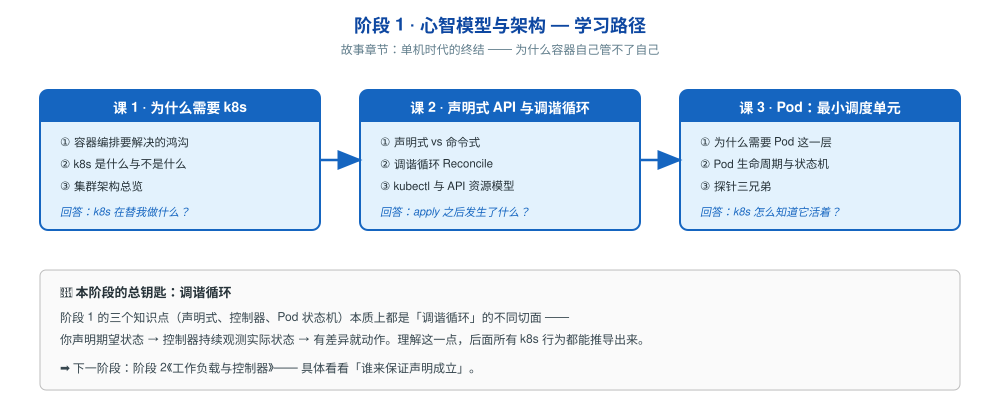

# 阶段 1：心智模型与架构

> 所属课程：Kubernetes 系统学习 ｜ 故事章节：**单机时代的终结** ｜ 上一阶段：无（起始阶段）
> 下一阶段：[阶段 2《工作负载与控制器》](../2-工作负载与控制器/overview.md)

## 🎯 本阶段目标

- 能说清「容器」到「集群」之间到底缺了什么，为什么 docker alone 不够
- 建立**声明式**心智模型：从「我要你做什么」转向「我要什么状态」
- 看懂 k8s 集群的组件构成与各自职责，能讲清 `kubectl apply` 之后发生了什么
- 理解 Pod 为什么是最小调度单元，以及 k8s 如何判断一个容器「活着」

## 📍 学习重点

- **容器编排的鸿沟**：单机 docker 解决"跑起来"，k8s 解决"一直按期望跑着"——这是两件事
- **声明式 vs 命令式**：这是 k8s 所有设计的地基，也是很多人学 k8s 卡住的第一个坎
- **调谐循环（Reconcile）**：理解它，后面所有 k8s 行为都能推导出来；不理解它，后面全是死记硬背
- **Pod 这一层抽象**：为什么 k8s 不直接调度容器，而要包一层 Pod
- **探针**：不是"健康检查"这么简单，三种探针解决三个不同问题

## ✅ 必须掌握的知识点

| 知识点 | 所属课 | 学完应能 |
|--------|--------|----------|
| 容器编排要解决的鸿沟 | 课 1 | 说清 docker  alone 管不了的 5 件事，以及 k8s 各自怎么解决 |
| k8s 是什么与不是什么 | 课 1 | 说清 k8s 的能力边界，知道什么场景**不该**上 k8s |
| 集群架构总览 | 课 1 | 画出 control plane 与 node 的组件图，说清每个组件职责 |
| 声明式 vs 命令式 | 课 2 | 用具体例子对比两种范式，说清 k8s 为什么选声明式 |
| 调谐循环 Reconcile | 课 2 | 解释"观测→比较→动作"循环，能推导出自愈行为 |
| kubectl 与 API 资源模型 | 课 2 | 说清 apiVersion/kind/metadata/spec/status 四段各是什么 |
| kubeconfig 与多集群访问 | 课 2 | 说清 kubeconfig 的 context 结构，能在多集群间切换（本机已有 `k8s-c1` 与 `otel-l11` 两个集群） |
| 为什么需要 Pod 这一层 | 课 3 | 解释 Pod 存在的理由（共享网络/存储的原子单位） |
| Pod 生命周期与状态机 | 课 3 | 说清 Pending→Running→Succeeded/Failed 的转换条件 |
| 探针三兄弟 | 课 3 | 区分 startup/liveness/readiness 三种探针解决的不同问题 |

## 🗺️ 本阶段路径图

> SVG 展示本阶段三课的学习顺序与依赖：课 1（为什么）→ 课 2（怎么运作）→ 课 3（最小单元）。

## 本阶段产出

- [x] `lessons/lesson-01-为什么需要k8s.md`
- [x] `lessons/lesson-02-声明式API与调谐循环.md`
- [x] `lessons/lesson-03-Pod最小调度单元.md`
- [x] `lessons/lesson-04-多容器Pod与优雅终止.md`

### 课级入口要素补齐（2026-09-15）

按 topic-teach 最新 skill 的「课级入口要素」硬约束，本阶段课 1-4已全部补齐六项要素（一句话本质 / 处境对照 / 一眼全局图 + 读图指引 / 本课地图 / 📖 文档核对 / 🧭 知识点衔接句），经 `verify.sh` 全量核验 P0=0。

**本阶段新增全局图**：lesson-01-为什么需要编排.svg、lesson-02-说目标还是说步骤.svg、lesson-03-为什么多包一层.svg、lesson-04-开张干活收摊.svg

**真实性纪律**：处境对照一律不给编造数字，全部为机制层面对照，无把握处标 ⏳；📖 留痕仅在确认真实引用官方文档后补写。
