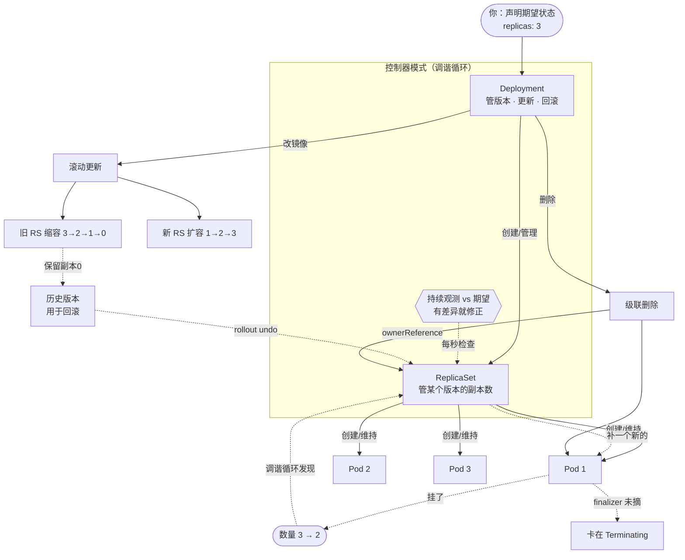

# 第 5 课：Deployment：无状态应用的自愈与更新

> 所属阶段：阶段 2《工作负载与控制器》｜ 水平：入门偏进阶 ｜ 本课知识点：控制器与 ReplicaSet、滚动更新、回滚与版本历史、垃圾回收与级联删除（ownerReference / finalizer）
> 故事情节：前面四课你一直在跟 Pod 打交道 —— 但 Pod 是"一次性"的，删了就没了。**谁来保证它一直有？** 这一课揭开 k8s 最核心的机制：**控制器模式**。它不仅是 Deployment 的原理，更是理解整个 k8s 的钥匙

## 🎯 本课目标

- 理解控制器模式（声明式 + 调谐循环），说清 Deployment、ReplicaSet、Pod 三层的分工
- 掌握滚动更新的过程与两个关键参数，能解释"为什么更新时服务不断"
- 会用 `rollout undo` 回滚，理解 revision 的真实语义
- 理解 ownerReference 与 finalizer，能解释"为什么我的对象删不掉"

---

## 第一幕：起源与场景引入

> 🏛️ **起源**：Deployment 背后的思想，来自一篇影响深远的论文与一个古老的系统。
>
> **声明式 API 与调谐循环（Reconcile Loop）** 的思想，可追溯到 Google 的 **Borg**（k8s 的前身）以及 2015 年 Google 发表的 Borg 论文《Large-scale cluster management at Google with Borg》。但更直接的学术源头，是**控制理论（Control Theory）** 中的**反馈控制**：系统持续观测"当前状态"，与"期望状态"比较，有差异就采取行动消除它。这与恒温器工作原理完全一致 —— 设定 26°C，温度低了就加热，高了就停。
>
> **ReplicationController** 是 k8s 最早的副本控制器（v1.0 就有），后来被 **ReplicaSet** 取代（支持更强大的标签选择器）。而 **Deployment 在 2016 年的 k8s 1.2 引入**，目的是在 ReplicaSet 之上增加**滚动更新与回滚**能力 —— 这正是从 RC 到 RS 再到 Deployment 的演进逻辑：**每一层只加一件事**。
>
> **垃圾回收（Garbage Collection）** 与 **ownerReference** 则是 k8s 对象生命周期管理的基石，其设计明显借鉴了编程语言的 GC 思想：**对象记录自己的"从属关系"，当"所有者"消失时，从属对象可被自动回收**。
>
> （核查于 2026-09；来源：[Kubernetes 官方文档 · Deployment](https://kubernetes.io/zh-cn/docs/concepts/workloads/controllers/deployment/)、[ReplicaSet](https://kubernetes.io/zh-cn/docs/concepts/workloads/controllers/replicaset/)、[控制器](https://kubernetes.io/zh-cn/docs/concepts/architecture/controller/)、[垃圾回收](https://kubernetes.io/zh-cn/docs/concepts/architecture/garbage-collection/)）

🎬 **场景**：你用课 3 的方式手动创建了 3 个 nginx Pod。某天深夜，其中一个 Pod 所在的节点宕机了。

第二天早上，监控告警：**服务只剩 2 个副本**。

你手动补了一个。两周后同样的事又发生。你开始想：

> **能不能让系统自己保证"始终有 3 个"？**

还有第二个问题：**你要更新镜像版本**。如果直接删掉 3 个旧 Pod 再建 3 个新的 —— 这中间服务是**断的**。用户会看到几十秒的 502。

第三个问题：新版本上线后发现了严重 bug，你要**立刻退回上一个版本**。但旧版本的配置你已经记不清了。

这三个问题，正是本课要解决的：
- **保证副本数** → 控制器与 ReplicaSet
- **更新不断服** → 滚动更新
- **能退回去** → 回滚与版本历史

---

## 第二幕：认知冲突

> ❓ **问题**：既然 k8s 是"声明式"的，我把 Pod 的 YAML 提交上去，它就应该一直存在 —— 为什么还需要控制器？

**这是本课最重要的一次观念转变。**

先看清一个事实：**Pod 自己不会复活。**

```bash
kubectl run myapp --image=nginx:alpine
kubectl delete pod myapp
# 它就没了，不会自己回来
```

你提交 Pod YAML 时说的"我要这个 Pod"，**只是一次性的创建动作**，不是一个持续生效的承诺。k8s 不会因为"你曾经要过"就一直维持它。

真正的声明式是另一回事 —— 你说的是：

> **"我要『始终有 3 个这样的 Pod』。"**

这句话里的**"始终"**二字，才是关键。它需要有一个**常驻的进程**不断检查、不断修复。这个进程就是**控制器（Controller）**。

> 💡 **关键洞察**：**Pod 是"名词"（一个资源），Deployment 是"动词 + 承诺"（一个持续维持状态的机制）。**
>
> 换个说法：**Pod 描述"要什么"，控制器负责"一直去做到"。** 两者缺一不可 —— 没有控制器，声明只是空头支票。
>
> 这个"观测 → 比较 → 修正"的循环，叫**调谐循环（Reconcile Loop）**，是 k8s 的心跳。**理解它，你就理解了 k8s 一半。**

---

## 第三幕：层层揭示

### 知识点 1：控制器与 ReplicaSet

> 本知识点关键点：调谐循环 / 声明式 vs 命令式 / 三层分工 / 自愈

#### 一句话定义

**控制器是一个持续运行的循环，它不断观测集群的当前状态，与你声明的期望状态比较，发现差异就采取行动消除差异**；**ReplicaSet 是其中一种控制器，专门负责"维持指定数量的 Pod 副本"**；**Deployment 则是管理 ReplicaSet 的控制器**，在它之上增加了更新与回滚能力。

#### 直觉建立（类比）

把 k8s 想成一家**餐厅**，三种角色对应三层：

| 角色 | 对应 | 职责 |
|---|---|---|
| **老板** | **你（用户）** | 只说"我要 3 桌客人被服务好" —— **只提要求，不干活** |
| **餐厅经理** | **Deployment** | 负责**排班与换菜单**：决定用哪套方案（哪个 ReplicaSet），怎么平滑过渡 |
| **领班** | **ReplicaSet** | 负责**盯人数**：少了就招人，多了就裁掉 —— **只管数量，不管内容** |
| **服务员** | **Pod** | 真正干活的人；**走了不会自己补** |

> 💡 **类比的要点**：老板从不下场端盘子。这就是**声明式** —— 你说"要什么"，系统负责"怎么做、一直做"。
>
> **对照命令式**：命令式相当于你亲自喊"张三去端菜、李四去收盘" —— 每个人都是你安排的，一旦张三走了，没人补位，**因为没人在盯着**。

#### 核心原理

**一、调谐循环（Reconcile Loop）—— k8s 的心跳。**

```
   ┌─────────────────────────────────────────┐
   │                                         │
   ▼                                         │
观测当前状态 ──→ 与期望状态比较 ──→ 有差异？──是──→ 采取行动 ──┘
（list 实际 Pod）   （3 vs 实际）            │
                                            否
                                            │
                                            ▼
                                      什么都不做（已收敛）
```

**这个循环永不停止**。即使已经"收敛"（3 个都在），它仍在每秒检查 —— 因为下一秒可能就有 Pod 挂掉。

> 🔑 **这就是"自愈"的本质**：**不是有东西在"修"，而是有东西在"一直盯着，发现不对就修"。** 课 3 说"Pod 挂了 k8s 会重启它" —— 现在你知道了，那不是 k8s 的魔法，是**控制器在干活**。

**二、声明式 vs 命令式（本课核心观念）。**

| | 命令式（Imperative） | 声明式（Declarative） |
|---|---|---|
| 说法 | "创建 3 个 Pod" | "保持 3 个 Pod" |
| 执行次数 | **一次** | **持续** |
| 故障后 | 不管 | 自动修复 |
| 典型命令 | `kubectl run` / `create pod` | `kubectl apply -f deployment.yaml` |
| 本质 | 一个**动作** | 一个**承诺** |

> ⚠️ 常见误解：以为"用 YAML 文件"就是声明式。**不是** —— 关键在**有没有控制器在维持**。`kubectl apply -f pod.yaml` 依然是命令式的（它只创建一次）。

**三、三层分工（务必分清，这是排查问题的基础）。**

```
Deployment（我）
  │ 管理：决定用哪个 ReplicaSet、怎么更新、保留多少历史
  ▼
ReplicaSet（领班）
  │ 管理：保证「指定模板的 Pod」数量正确
  ▼
Pod（服务员）
    干活：跑容器
```

| 层 | 关注什么 | 不关注什么 |
|---|---|---|
| **Deployment** | 版本、更新策略、回滚 | 具体 Pod 是谁 |
| **ReplicaSet** | **某个版本**的 Pod 数量 | 版本好不好、该不该换 |
| **Pod** | 跑自己的容器 | 别的 Pod |

> 🎯 **为什么要分三层，不直接让 Deployment 管 Pod？**
>
> 因为**中间那层 ReplicaSet 就是"版本"的载体**。滚动更新时，**新旧两个 ReplicaSet 同时存在**，一个扩一个缩 —— 这才有"平滑过渡"和"随时回滚"。**ReplicaSet 的存在，本质上是为了让"版本"成为可操作的对象。**

**四、ReplicaSet 名字里的哈希是什么？**

`web-6d689fbfdf` 中 `6d689fbfdf` 是 **pod-template-hash** —— 由 **Pod 模板内容**计算得出。

**模板不变 → 哈希不变 → ReplicaSet 不变。模板一改（比如换镜像）→ 哈希变 → 创建新的 ReplicaSet。**

这就是滚动更新的实现基础：**Deployment 通过创建新 ReplicaSet 来完成"换版本"**。

#### 示例演示

**验证一：三层结构。**

```bash
kubectl create deployment web --image=nginx:alpine --replicas=3
kubectl wait --for=condition=Available deployment/web --timeout=180s
kubectl get deploy,rs,pod --no-headers
# 实际输出（本机 v1.34.0 实测）：
# deployment.apps/web   3/3   3     3     2s
# replicaset.apps/web-6d689fbfdf   3     3     3     2s
# pod/web-6d689fbfdf-49stb   1/1   Running   0     2s
# pod/web-6d689fbfdf-5d7vf   1/1   Running   0     2s
# pod/web-6d689fbfdf-9q8gf   1/1   Running   0     2s
```

> 🎯 **注意 Pod 名字的构成**：`web-6d689fbfdf-49stb` = **Deployment 名** + **RS 哈希** + **Pod 随机后缀**。看到这种三段式名字，就知道它是 Deployment 管理的。

**验证二：自愈 —— 删掉 Pod，它会自动补回来。**

```bash
POD=$(kubectl get pod -l app=web --no-headers | head -1 | awk '{print $1}')
echo "准备删除：$POD"
# 输出（本机实测）：准备删除：web-6d689fbfdf-49stb

kubectl delete pod "$POD" --wait=false
# 输出：pod "web-6d689fbfdf-49stb" deleted from lesson05 namespace

sleep 3
kubectl get pod -l app=web --no-headers
# 输出（本机实测）：
# web-6d689fbfdf-5d7vf   1/1   Running   0     5s
# web-6d689fbfdf-6jvmq   1/1   Running   0     3s    ← 新 Pod，自动补的
# web-6d689fbfdf-9q8gf   1/1   Running   0     5s

sleep 8
kubectl get deploy web --no-headers
# 输出：web   3/3   3     3     14s
```

> 🎯 **`web-6d689fbfdf-49stb` 被删，`web-6d689fbfdf-6jvmq` 立刻补上** —— 注意**前缀哈希相同**（同一个 ReplicaSet），只有随机后缀变。
>
> 这就是调谐循环在干活：ReplicaSet 发现"实际 2 个 < 期望 3 个"，立刻创建一个。**整个过程你没有任何命令参与。**

**验证三：ownerReference —— Pod 记录了"我是谁的"。**

```bash
POD=$(kubectl get pod -l app=web --no-headers | head -1 | awk '{print $1}')
kubectl get pod "$POD" -o jsonpath='{range .metadata.ownerReferences[*]}kind={.kind} name={.name} uid={.uid}{"\n"}{end}'
# 输出（本机实测）：
# kind=ReplicaSet name=web-6d689fbfdf uid=72b778aa-e005-42da-9115-a3918cea21c0

RS=$(kubectl get rs --no-headers | head -1 | awk '{print $1}')
kubectl get rs "$RS" -o jsonpath='{range .metadata.ownerReferences[*]}kind={.kind} name={.name}{"\n"}{end}'
# 输出（本机实测）：kind=Deployment name=web
```

> 🎯 **一条完整的归属链**：**Pod → ReplicaSet（`web-6d689fbfdf`）→ Deployment（`web`）**。
>
> 这条链就是知识点 4 垃圾回收的依据 —— **k8s 靠它知道"删 Deployment 时该连带删什么"**。

#### 常见误区

1. **"k8s 会自动重启挂掉的 Pod"** → 准确说是 **ReplicaSet 控制器**发现数量不符才补的。单独的裸 Pod（无控制器）挂了就是挂了。
2. **"用 YAML 文件就是声明式"** → 关键在**有没有控制器持续维持**。`kubectl apply -f pod.yaml` 仍是命令式。
3. **"Deployment 直接管理 Pod"** → 中间还有 ReplicaSet 层。**ReplicaSet 是"版本"的载体**，这是平滑更新与回滚的基础。
4. **"ReplicaSet 名字的哈希是随机的"** → 由 **Pod 模板内容**算出。模板不变则哈希不变。
5. **"可以直接改 ReplicaSet 来更新应用"** → 不应该。改 RS 的模板**不会触发滚动更新**（Deployment 不感知）。**应改 Deployment。**
6. **"ReplicaSet 和 ReplicationController 是一回事"** → RC 是旧版（已废弃），RS 支持更强大的**集合式标签选择器**。新代码一律用 RS（且通常直接用 Deployment）。

#### 一句话记住

> **你声明"要什么"，控制器负责"一直做到" —— 这就是声明式；Pod 是名词，控制器是"持续生效的承诺"。**

#### 官方文档

- [Kubernetes 官方文档 · Deployment](https://kubernetes.io/zh-cn/docs/concepts/workloads/controllers/deployment/)
- [Kubernetes 官方文档 · ReplicaSet](https://kubernetes.io/zh-cn/docs/concepts/workloads/controllers/replicaset/)
- [Kubernetes 官方文档 · 控制器](https://kubernetes.io/zh-cn/docs/concepts/architecture/controller/)

---

### 知识点 2：滚动更新

> 本知识点关键点：新旧 RS 交替 / maxSurge 与 maxUnavailable / 坏更新时服务不断

#### 一句话定义

**滚动更新（RollingUpdate）是 Deployment 默认的更新策略**：创建新 ReplicaSet 并逐步扩容、同时把旧 ReplicaSet 逐步缩容到 0，**全程保持有可用 Pod 在服务**，因此更新期间服务不中断。

#### 直觉建立（类比）

回到餐厅 —— 你要**换菜单**（更新版本）：

- **重建（Recreate）策略** = **直接关店重装**：让所有客人出去，装修完再开门。**快，但客人全被赶走了**（服务中断）
- **滚动更新（RollingUpdate）** = **逐桌换**：先摆好一桌新菜单，请一桌客人过去，再收拾一桌旧的……**全程餐厅都在营业**

关键在**同时存在的"新旧比例"**，由两个参数控制：
- **`maxSurge`**（最多能**多**出几桌）：为了换得快，允许临时多摆几桌
- **`maxUnavailable`**（最多能**少**几桌）：为了不赶客，规定同时在服务的桌子不能少于多少

> 💡 **这个类比解释了参数的取值逻辑**：`maxSurge` 越大更新越快（但占更多资源）；`maxUnavailable` 越小服务越稳（但更新越慢）。**两个参数就是"速度 vs 稳定"的权衡。**

#### 核心原理

**一、滚动更新的实际过程（实测观察）。**

```
初始：  RS-old 有 3 个 Pod
  ↓
第1步： 创建 RS-new，扩容到 1（旧仍 3）
  ↓      ← 此时总 Pod 数 4，超出 3，但 maxSurge 允许
第2步： RS-new 的 Pod 就绪后，RS-old 缩到 2
  ↓
第3步： RS-new 扩到 2，RS-old 缩到 1
  ↓
第4步： RS-new 扩到 3，RS-old 缩到 0
  ↓
完成：  RS-old 保留（0 副本）← 这是回滚的资本
```

> 🔑 **旧 ReplicaSet 缩到 0 但不会被删除** —— 它成了"历史版本"，随时可以扩回来。这就是知识点 3 回滚能瞬间完成的原因。

**二、两个参数的官方精确定义（重要，方向不同）。**

`maxSurge`（默认 25%）：
> "the total number of old and new pods do not exceed 130% of desired pods... **Absolute number is calculated from percentage by rounding up.**"

`maxUnavailable`（默认 25%）：
> "the total number of pods available at all times during the update is at least 70% of desired pods... **Absolute number is calculated from percentage by rounding down.**"

🎯 **记住这两个取整方向（易错点）**：

| 参数 | 默认 | 取整方向 | 3 副本时 | 含义 |
|---|---|---|---|---|
| `maxSurge` | 25% | **向上取整** | `ceil(0.75)` = **1** | 最多**多** 1 个（总 ≤ 4） |
| `maxUnavailable` | 25% | **向下取整** | `floor(0.75)` = **0** | 最多**少** 0 个（可用 ≥ 3） |

> ⚠️ **注意 3 副本时 `maxUnavailable` = 0** —— 意味着**任何一个旧 Pod 都不能在新 Pod 就绪前被删**。这就是为什么实测中总是"先起新的、再删旧的"。想更新更快，可把它调大（如 `1`）。

**三、为什么坏更新不会导致服务中断（本课最有价值的证据）。**

这是滚动更新设计中**最精妙**的一点。当你更新到一个**坏镜像**（拉不到 / 启动就崩）：

```
新 Pod 无法就绪（ErrImagePull / CrashLoopBackOff）
   ↓
RS-new 扩容卡住（永远达不到期望数）
   ↓
因为 maxUnavailable=0，RS-old 一个都不能删
   ↓
旧 Pod 全部继续服务 ✅
```

**Deployment 会停在那里，既不会继续、也不会删旧 Pod** —— 这就是**安全失败（fail-safe）**：更新失败的最坏结果是"没更新成功"，而不是"服务挂了"。

#### 示例演示

**验证一：滚动更新全过程（新旧 RS 交替）。**

```bash
kubectl get rs --no-headers
# 更新前输出：web-6d689fbfdf   3     3     3     29s

kubectl set image deployment/web nginx=nginx:1.25-alpine
# 输出：deployment.apps/web image updated

sleep 3
kubectl get rs --no-headers
# 输出（本机实测）：
# web-576d8f694b   1     1     0     3s    ← 新 RS 开始扩容
# web-6d689fbfdf   3     3     3     32s   ← 旧 RS 仍是 3
```

```bash
# 逐 3 秒观察 Pod 更替
for i in 1 2 3 4 5; do
  kubectl get pod -l app=web --no-headers
  echo "  --"
  sleep 3
done
# 输出（本机实测，节选）：
# web-576d8f694b-zlg5d   0/1   ContainerCreating   0     3s   ← 新 Pod 1
# web-6d689fbfdf-5d7vf   1/1   Running             0     32s
# web-6d689fbfdf-6jvmq   1/1   Running             0     30s
# web-6d689fbfdf-9q8gf   1/1   Running             0     32s
#   --
# web-576d8f694b-zlg5d   1/1   Running   0     9s              ← 新 Pod 1 就绪
# web-6d689fbfdf-6jvmq   0/1   Completed 0     36s             ← 旧 Pod 开始退出
#   --
# web-576d8f694b-sxkh8   1/1   Running   0     5s              ← 最终：3 个全是新 RS
# web-576d8f694b-vv67d   1/1   Running   0     4s
# web-576d8f694b-zlg5d   1/1   Running   0     13s
```

```bash
kubectl rollout status deployment/web
# 输出：deployment "web" successfully rolled out

kubectl get rs --no-headers
# 输出（本机实测）：
# web-576d8f694b   3     3     3     19s   ← 新 RS 接管
# web-6d689fbfdf   0     0     0     48s   ← 旧 RS 保留，副本 0
```

> 🎯 **关键观察**：**旧 RS `web-6d689fbfdf` 没有被删除，只是缩到 0 副本**。它作为历史版本留着 —— 这就是下一幕回滚能瞬间生效的原因。

**验证二（核心）：坏更新时服务不断。**

```bash
kubectl set image deployment/web nginx=nginx:does-not-exist-999
# 输出：deployment.apps/web image updated

sleep 12
kubectl get pod -l app=web --no-headers
# 输出（本机实测）：
# web-576d8f694b-sxkh8   1/1   Running        0     37s   ← 旧版本 3 个，全在服务
# web-576d8f694b-vv67d   1/1   Running        0     36s
# web-576d8f694b-zlg5d   1/1   Running        0     45s
# web-5f5b447cbf-6kmjb   0/1   ErrImagePull   0     12s   ← 新版本 1 个，起不来

kubectl get deploy web --no-headers
# 输出（本机实测）：web   3/3   1     3     75s
#                        ↑ 可用仍是 3！

kubectl rollout status deployment/web --timeout=30s
# 输出（本机实测）：
# Waiting for deployment "web" rollout to finish: 1 out of 3 new replicas have been updated...
# error: timed out waiting for the condition
```

> 🎯 **这是本课最重要的证据**：镜像是坏的、新 Pod 起不来、更新卡住了 —— 但 **Deployment 显示 `3/3`，3 个旧 Pod 全部正常服务**。
>
> **用户完全无感知。** 这正是滚动更新的价值：**失败的最坏结果是"没更新成"，不是"服务挂了"。**
>
> ⚖️ **对比 Recreate 策略**：如果用了 `strategy.type: Recreate`，k8s 会**先删光所有旧 Pod 再建新的** —— 此时这 3 个旧 Pod 已被删，新 Pod 又起不来 → **服务彻底中断**。这就是为什么默认策略是 RollingUpdate。

**验证三：更新参数的默认值。**

```bash
kubectl get deployment web -o jsonpath='maxSurge={.spec.strategy.rollingUpdate.maxSurge}{"\n"}maxUnavailable={.spec.strategy.rollingUpdate.maxUnavailable}{"\n"}strategy={.spec.strategy.type}{"\n"}'
# 输出（本机 v1.34.0 实测）：
# maxSurge=25%
# maxUnavailable=25%
# strategy=RollingUpdate
```

#### 常见误区

1. **"更新时旧 Pod 会先被删掉"** → 默认不会。3 副本时 `maxUnavailable` 算出来是 **0**，必须等新 Pod 就绪才删旧的。
2. **"滚动更新会瞬间完成"** → 是**逐个**替换，耗时取决于副本数与就绪速度。用 `kubectl rollout status` 跟踪。
3. **"更新失败会导致服务中断"** → 不会（本幕实测已证）。**这是滚动更新的核心设计目标**：安全失败。
4. **"旧 ReplicaSet 更新完就没用了"** → **保留着**（0 副本），是回滚的资本。由 `revisionHistoryLimit`（默认 10）控制保留几个。
5. **"maxSurge 和 maxUnavailable 取整方向一样"** → **不一样**：maxSurge **向上取整**，maxUnavailable **向下取整**。
6. **"两者可以同时设为 0"** → 不行（官方：`This can not be 0 if MaxUnavailable is 0`），会互相矛盾导致无法更新。

#### 一句话记住

> **滚动更新 = 先起新的、再删旧的；坏更新最坏结果是"没更新成"，而不是"服务挂了"。**

#### 官方文档

- [Kubernetes 官方文档 · 更新 Deployment](https://kubernetes.io/zh-cn/docs/concepts/workloads/controllers/deployment/#updating-a-deployment)
- [Kubernetes 官方文档 · 执行滚动更新](https://kubernetes.io/zh-cn/docs/tasks/run-application/update-deployment-rolling/)

---

### 知识点 3：回滚与版本历史

> 本知识点关键点：rollback 实质是切回旧 RS / revision 会递增而非回退 / CHANGE-CAUSE 需手动标注

#### 一句话定义

**回滚（`kubectl rollout undo`）是把 Deployment 的 Pod 模板切回某个历史 ReplicaSet 的配置**；由于旧 ReplicaSet 一直保留着（只是副本为 0），回滚几乎是**瞬间完成**的。**但回滚会创建新的 revision 号，而不是"回到"旧号。**

#### 直觉建立（类比）

把版本历史想成**文档的自动保存快照**：

- 每次改镜像 = **存一个新快照**，编号递增（1、2、3…）
- 回滚 = **把某个旧快照的内容复制出来，作为一个新版本提交**

> 💡 **关键**：回滚**不是**"撤销操作"（不是把历史抹掉），而是"**照着旧版本重新做一遍**"。
>
> 这跟 Git 的 `revert` 很像（创建新提交来抵消旧提交），而**不像** `reset`（抹掉历史）。**Git revert 的类比在这里非常准确。**

#### 核心原理

**一、revision 的真实语义（易错点，务必看清）。**

实测观察到的完整变化（本机 v1.34.0）：

| 操作 | 历史中的 revision | 说明 |
|---|---|---|
| 创建 Deployment | `1` | 初始版本 |
| 更新到 `nginx:1.25-alpine` | `1, 2` | 新增 revision 2 |
| 更新到坏镜像 | `1, 2, 3` | 新增 revision 3 |
| **`rollout undo`** | `1, 3, 4` | ⚠️ **revision 2 消失了，新增 4** |
| 更新到 `nginx:1.27-alpine` | `1, 3, 4, 5` | 新增 5 |
| **再 `rollout undo`** | `1, 3, 5, 6` | ⚠️ **revision 4 消失，新增 6** |

> 🎯 **两个反直觉事实**：
> ① **回滚后 revision 号继续递增**（2 → 4），不是"回到 2"
> ② **被回滚掉的那个 revision 会从历史中消失**（2 消失、4 消失）
>
> **原因**：`undo` 的实质是"**把 revision 2 的内容作为新版本 4 提交**"。内容来自 2，但它是个新版本 —— 所以编号是 4，而 2 因为内容已被"重新采纳"而不再单独列出。

**二、回滚为什么快？**

因为**旧 ReplicaSet 一直都在**（副本 0）：

```
回滚 = 把旧 RS 的 replicas 从 0 扩到 3，把当前 RS 缩到 0
     = 只是改两个数字，不需要重新拉镜像、不需要重建！
```

> 💡 **这就是为什么 `revisionHistoryLimit` 很重要**：它决定保留多少个旧 RS（**默认 10**）。设成 0 等于**放弃回滚能力**。

**三、`CHANGE-CAUSE` 为什么总是 `<none>`？**

`kubectl rollout history` 有一列 `CHANGE-CAUSE`，默认全是 `<none>` —— 因为它记录的是 **`kubernetes.io/change-cause` 注解**，而**命令行更新默认不写这个注解**（早期的 `--record` 参数已被废弃）。

要让它有意义，得**手动标注**：

```bash
kubectl annotate deployment/web kubernetes.io/change-cause="回滚到 nginx:1.27" --overwrite
```

> ⚠️ **注意**：`annotate` 只作用于**当前（最新）revision**。实测中标注后只有最新一行显示，历史行仍是 `<none>`。**所以要养成"每次更新后立即标注"的习惯**。

#### 示例演示

**验证一：版本历史与 RS 的对应关系。**

```bash
kubectl rollout history deployment/web
# 输出（本机实测）：
# deployment.apps/web
# REVISION  CHANGE-CAUSE
# 1         <none>
# 3         <none>
# 4         <none>

kubectl get rs --no-headers -o custom-columns='NAME:.metadata.name,REV:.metadata.annotations.deployment\.kubernetes\.io/revision,DESIRED:.spec.replicas'
# 输出（本机实测）：
# web-576d8f694b   4     3   ← revision 4，3 副本（当前在用）
# web-5f5b447cbf   3     0   ← revision 3（坏版本），0 副本
# web-6d689fbfdf   1     0   ← revision 1（初始版本），0 副本
```

> 🎯 **每个 revision 对应一个 RS**，`deployment.kubernetes.io/revision` 注解标明了它是第几版。**DESIRED=0 的就是历史版本。**

**验证二：回滚（从坏版本回到好版本）。**

```bash
# 承接上一幕的坏更新状态（新 Pod ErrImagePull）
kubectl rollout undo deployment/web
# 输出：deployment.apps/web rolled back

kubectl rollout status deployment/web --timeout=120s
# 输出：deployment "web" successfully rolled out

kubectl get deploy web --no-headers
# 输出（本机实测）：web   3/3   3     3     105s

kubectl get rs --no-headers
# 输出（本机实测）：
# web-576d8f694b   3     3     3     76s   ← 好版本扩回 3
# web-5f5b447cbf   0     0     0     43s   ← 坏版本缩到 0
# web-6d689fbfdf   0     0     0     105s
```

> 🎯 **回滚非常快** —— 因为好版本的 RS 一直保留着，只是把副本数改回来，**不需要重新拉镜像**。

**验证三：revision 递增而非回退。**

```bash
kubectl rollout history deployment/web
# 输出（本机实测，回滚后）：
# REVISION  CHANGE-CAUSE
# 1         <none>
# 3         <none>
# 4         <none>
#                        ↑ 注意：revision 2 不见了，出现了 4
```

**验证四：CHANGE-CAUSE 标注。**

```bash
kubectl annotate deployment/web kubernetes.io/change-cause="手动标注：回滚到 nginx:1.27" --overwrite
kubectl rollout history deployment/web
# 输出（本机实测）：
# REVISION  CHANGE-CAUSE
# 1         <none>
# 3         <none>
# 5         <none>
# 6         手动标注：回滚到 nginx:1.27   ← 只有最新的有
```

**验证五：回滚到指定版本。**

```bash
# 回滚到特定 revision（不加 --to-revision 则回到上一版）
kubectl rollout undo deployment/web --to-revision=1
```

#### 常见误区

1. **"回滚会回到原来的 revision 号"** → 不会。**revision 继续递增**（实测 2 → 4）。
2. **"回滚会抹掉中间的版本"** → 不会删除 RS，只是**被回滚的那个 revision 不再列在历史中**。
3. **"回滚要重新拉镜像、很慢"** → 通常**很快**，因为旧 RS 还在，只是扩缩容。
4. **"CHANGE-CAUSE 会自动记录命令"** → 不会，默认 `<none>`。`--record` 已废弃，需手动 `annotate`（且只作用于最新版本）。
5. **`revisionHistoryLimit: 0`** → 等于**放弃回滚能力**，旧 RS 会被立即清理。
6. **"回滚一定能救回来"** → 只在**旧 RS 还在**时有效。超出 `revisionHistoryLimit`（默认 10）的版本已被清理，回不去。

#### 一句话记住

> **回滚像 Git revert：照着旧版本重做一遍，产生新 revision 号；旧 RS 一直保留着（副本 0），所以回滚几乎是瞬时的。**

#### 官方文档

- [Kubernetes 官方文档 · 回滚 Deployment](https://kubernetes.io/zh-cn/docs/concepts/workloads/controllers/deployment/#rolling-back-a-deployment)
- [Kubernetes 官方任务 · 回滚 Deployment](https://kubernetes.io/zh-cn/docs/tasks/run-application/rollback-deployment/)

---

### 知识点 4：垃圾回收与级联删除（ownerReference / finalizer）

> 本知识点关键点：ownerReference 决定删谁连带删谁 / cascade 三种模式 / finalizer 是删除的"钩子"

#### 一句话定义

**k8s 通过 `ownerReference` 记录对象间的从属关系，当所有者被删除时，其从属对象会被垃圾回收器自动删除（级联删除）**；而 **`finalizer` 是一个"删除钩子"，只要它还挂着，对象就只会被标记 `deletionTimestamp` 而不会真正消失**，直到 finalizer 被移除。

#### 直觉建立（类比）

把对象关系想成**公司与资产**：

- **ownerReference** = **资产登记在谁名下**。公司注销时，名下资产依法清算 —— 这就是**级联删除**
- **孤儿（orphan）** = 公司注销时**声明放弃资产**，资产留在原地继续运作 —— 这就是 `--cascade=orphan`
- **finalizer** = **注销流程里的"未结事项"**。只要还有未结事项（比如税务清算没完成），**公司就不能真正注销**，只能处于"注销中"状态

> 💡 **finalizer 的类比要点**：它不是"阻止删除"，而是"**删除流程的必经关卡**"。每完成一项就摘掉一个 finalizer，**全部摘完才真正删除**。

#### 核心原理

**一、ownerReference：从属关系的记录。**

前面实测看到的完整链条：

```
Deployment "web"
   ▲
   │ ownerReference
ReplicaSet "web-6d689fbfdf"
   ▲
   │ ownerReference
Pod "web-6d689fbfdf-49stb"
```

`ownerReference` 里的关键字段：
- **`kind` / `name` / `uid`**：指向所有者是谁
- **`blockOwnerDeletion: true`**：删除所有者时，**必须先等这个从属对象删完**
- **`controller: true`**：标记"这是我的主控制器"（用于避免多个控制器争抢）

**二、级联删除的三种模式。**

| 模式 | 命令 | 行为 |
|---|---|---|
| **级联（默认）** | `kubectl delete deployment X` | 删除 Deployment + 其下所有 RS + Pod |
| **孤儿（orphan）** | `kubectl delete deployment X --cascade=orphan` | **只删 Deployment**，从属对象保留并继续运行 |
| **前台（foreground）** | `--cascade=foreground` | 先删所有从属对象，**全部删完后**才删所有者 |

> 🎯 **`--cascade=orphan` 的典型用途**：**你想保留正在运行的 Pod，但不想再被 Deployment 管理**。常见于调试 —— 把 Pod 留下来慢慢查，同时避免控制器干扰（否则你删一个它补一个）。

**三、finalizer：删除的"关卡"。**

finalizer 是 `metadata.finalizers` 里的一个**字符串列表**。删除带 finalizer 的对象时：

```
kubectl delete
   ↓
k8s 设置 metadata.deletionTimestamp（标记"待删除"）
   ↓
对象进入 Terminating 状态，但【不会消失】
   ↓
控制器看到 deletionTimestamp + finalizer → 执行清理逻辑 → 摘掉自己的 finalizer
   ↓
finalizers 列表清空 → 对象被真正删除
```

> ⚠️ **这就是"对象删不掉"的最常见原因**：某个控制器没能在摘 finalizer 前完成清理（比如 PVC 还被 Pod 占用），对象就会**永远卡在 `Terminating`**。

**四、谁在用 finalizer？（理解它的价值）**

finalizer 不是给普通用户用的，主要是**控制器**在用：
- **PVC 保护**：`kubernetes.io/pvc-protection` —— 防止正在被 Pod 使用的存储被误删
- **命名空间清理**：namespace 控制器用它确保 NS 下的资源清理完毕
- **各类 Operator**：确保在删除 CRD 实例前，先清理掉对应的外部资源（如云上的数据库实例）

#### 示例演示

**验证一：级联删除（默认行为）。**

```bash
kubectl create deployment cascade-demo --image=nginx:alpine --replicas=2
kubectl wait --for=condition=Available deployment/cascade-demo --timeout=180s
kubectl get deploy,rs,pod -l app=cascade-demo --no-headers
# 输出（本机实测）：
# deployment.apps/cascade-demo   2/2   2     2     1s
# replicaset.apps/cascade-demo-57df5fb5bf   2     2     2     1s
# pod/cascade-demo-57df5fb5bf-w8wdp   1/1   Running   0     1s
# pod/cascade-demo-57df5fb5bf-xq7jp   1/1   Running   0     1s

kubectl delete deployment cascade-demo
# 输出：deployment.apps "cascade-demo" deleted from lesson05 namespace

sleep 3
kubectl get rs,pod -l app=cascade-demo --no-headers
# 输出（本机实测）：No resources found in lesson05 namespace.
#                          ↑ RS 与 Pod 一并被删
```

**验证二：非级联删除（orphan）—— Pod 变成孤儿继续运行。**

```bash
kubectl create deployment orphan-demo --image=nginx:alpine --replicas=2
kubectl wait --for=condition=Available deployment/orphan-demo --timeout=180s

kubectl delete deployment orphan-demo --cascade=orphan
# 输出：deployment.apps "orphan-demo" deleted from lesson05 namespace

sleep 3
kubectl get pod -l app=orphan-demo --no-headers
# 输出（本机实测）：
# orphan-demo-948d6d77-789lq   1/1   Running   0     4s
# orphan-demo-948d6d77-7ql97   1/1   Running   0     4s
#                        ↑ Pod 还在运行！
```

```bash
POD=$(kubectl get pod -l app=orphan-demo --no-headers | head -1 | awk '{print $1}')
kubectl get pod "$POD" -o jsonpath='ownerReferences={.metadata.ownerReferences}{"\n"}'
# 输出（本机实测）：
# ownerReferences=[{"apiVersion":"apps/v1","blockOwnerDeletion":true,"controller":true,
#                   "kind":"ReplicaSet","name":"orphan-demo-948d6d77","uid":"3dae3b77-..."}]
```

> ⚠️ **这里有个容易误解的点，请仔细看**：
>
> 你可能以为"孤儿"的 `ownerReference` 会被清空 —— **并没有**。它仍然指向 ReplicaSet `orphan-demo-948d6d77`。
>
> **真实情况是**：`--cascade=orphan` **只删除了你指定的那一层（Deployment）**，它下面的 **ReplicaSet 和 Pod 都完整保留**，因此 Pod 的 ownerReference 依然有效（指向那个还活着的 RS）。
>
> 那它们为什么叫"孤儿"？因为**它们失去了顶端的管理者** —— 再也没有 Deployment 去指导这个 RS 更新、扩缩容了。这些 Pod 会**继续运行，但不再被"承诺"维持**：现在你删一个 Pod，RS 仍会补（RS 还在）；但**如果 RS 本身被删，一切就没了**。
>
> 🎯 **实用结论**：`--cascade=orphan` 的真实用途是"**解除 Deployment 的管理，但保留运行中的 workload**"，常用于调试与迁移。

**验证三：finalizer 阻止删除。**

```bash
cat <<'YAMLEOF' | kubectl apply -f -
apiVersion: v1
kind: Pod
metadata:
  name: fin-demo
  finalizers:
  - example.com/my-finalizer
spec:
  containers:
  - name: app
    image: busybox:1.36
    command: ["sh","-c","sleep 600"]
YAMLEOF
kubectl wait --for=condition=Ready pod/fin-demo --timeout=120s

kubectl delete pod fin-demo --wait=false
# 输出：pod "fin-demo" deleted from lesson05 namespace

sleep 5
kubectl get pod fin-demo --no-headers
# 输出（本机实测）：fin-demo   1/1   Terminating   0     7s
#                                    ↑ 卡在 Terminating，没有消失！

kubectl get pod fin-demo -o jsonpath='deletionTimestamp={.metadata.deletionTimestamp}{"\n"}finalizers={.metadata.finalizers}{"\n"}'
# 输出（本机实测）：
# deletionTimestamp=2026-09-10T08:48:04Z
# finalizers=["example.com/my-finalizer"]
```

> 🎯 **`deletionTimestamp` 已设置，但对象还在** —— 因为 `example.com/my-finalizer` 没有任何控制器去摘掉它。这就是**对象删不掉**的根因。

**验证四：移除 finalizer 后对象才真正消失。**

```bash
kubectl patch pod fin-demo -p '{"metadata":{"finalizers":[]}}' --type=merge
# 输出：pod/fin-demo patched

sleep 3
kubectl get pod fin-demo --no-headers
# 输出（本机实测）：No resources found in lesson05 namespace.
```

> ⚠️ **生产提醒**：手动清 finalizer 是**排障手段，不是常规操作**。正常情况应该让对应的控制器完成清理。**强行清空可能留下未回收的外部资源**（比如云上还挂着的磁盘）。

#### 常见误区

1. **"删除 Deployment 后 Pod 会立刻消失"** → 级联删除需要时间，且要等 Pod 走完优雅终止（课 4）。
2. **"--cascade=orphan 会让 Pod 失去 ownerReference"** → **不会**。它只删你指定的那一层，下面的 RS 和 Pod 都保留（实测 ownerReference 仍在）。
3. **"孤儿 Pod 会继续被自动维持"** → RS 还在时会补；但**没有 Deployment 管理更新与回滚**了。
4. **"Terminating 卡住就是 k8s 出 bug 了"** → 多半是 **finalizer** 没被摘掉。查 `metadata.finalizers`。
5. **"可以直接删掉卡住的 namespace"** → 要**清空其中的 finalizer**，否则 NS 永远删不掉。
6. **"finalizer 是我该经常用的功能"** → 不是。它主要给**控制器/Operator** 用。普通用户直接写 finalizer 极易导致对象删不掉（本幕就是例子）。

#### 一句话记住

> **ownerReference 决定"删谁连带删谁"，finalizer 决定"删之前必须先做完什么" —— 对象卡在 Terminating，十有八九是 finalizer 没摘。**

#### 官方文档

- [Kubernetes 官方文档 · 垃圾回收](https://kubernetes.io/zh-cn/docs/concepts/architecture/garbage-collection/)
- [Kubernetes 官方文档 · 属主与附属](https://kubernetes.io/zh-cn/docs/concepts/overview/working-with-objects/owners-dependents/)
- [Kubernetes 官方文档 · Finalizers](https://kubernetes.io/zh-cn/docs/concepts/overview/working-with-objects/finalizers/)

---

## 第四幕：实操验证

把四个知识点串起来：**完整走一遍"部署 → 更新 → 发现故障 → 回滚 → 清理"的生产流程。**

```bash
cat > /tmp/l5-verify.yaml <<'YAMLEOF'
apiVersion: apps/v1
kind: Deployment
metadata:
  name: shop
  labels:
    app: shop
spec:
  replicas: 3
  selector:
    matchLabels:
      app: shop
  template:
    metadata:
      labels:
        app: shop
    spec:
      containers:
      - name: nginx
        image: nginx:1.25-alpine
        ports:
        - containerPort: 80
YAMLEOF

kubectl apply -f /tmp/l5-verify.yaml
# 输出：deployment.apps/shop created

kubectl rollout status deployment/shop --timeout=180s
# 输出：deployment "shop" successfully rolled out
```

```bash
# 验证 ①：三层结构与自愈
kubectl get deploy,rs,pod -l app=shop --no-headers
# 预期输出（结构类似）：
# deployment.apps/shop   3/3   3     3     5s
# replicaset.apps/shop-xxxxxxxxxx   3     3     3     5s
# pod/shop-xxxxxxxxxx-aaaaa   1/1   Running   0     5s
# pod/shop-xxxxxxxxxx-bbbbb   1/1   Running   0     5s
# pod/shop-xxxxxxxxxx-ccccc   1/1   Running   0     5s

# 删一个 Pod，看自愈
POD=$(kubectl get pod -l app=shop --no-headers | head -1 | awk '{print $1}')
kubectl delete pod "$POD" --wait=false
sleep 6
kubectl get deploy shop --no-headers
# 预期输出：shop   3/3   3     3     20s   ← 副本数自动回到 3
```

```bash
# 验证 ②：滚动更新（好版本 → 坏版本），观察服务是否中断
kubectl set image deployment/shop nginx=nginx:does-not-exist-999
sleep 12

echo "=== 更新中：可用副本数 ==="
kubectl get deploy shop --no-headers
# 预期输出：shop   3/3   1     3     40s
#                       ↑ 可用仍是 3 —— 服务没断！

echo "=== Pod 状态 ==="
kubectl get pod -l app=shop --no-headers
# 预期输出（结构类似）：
# shop-<新RS>-xxxxx   0/1   ErrImagePull   0     12s   ← 新版本起不来
# shop-<旧RS>-xxxxx   1/1   Running        0     40s   ← 旧版本仍在服务
# shop-<旧RS>-yyyyy   1/1   Running        0     40s
# shop-<旧RS>-zzzzz   1/1   Running        0     40s
```

```bash
# 验证 ③：回滚
kubectl rollout undo deployment/shop
kubectl rollout status deployment/shop --timeout=120s
# 预期输出：deployment "shop" successfully rolled out

kubectl get deploy shop --no-headers
# 预期输出：shop   3/3   3     3     70s

kubectl rollout history deployment/shop
# 实际输出（本机实测）：
# REVISION  CHANGE-CAUSE
# 2         <none>
# 3         <none>
```

> ⚠️ **注意这里的 revision 是 `2, 3`，不是 `1, 2`** —— 初始的 revision 1 消失了。
>
> 原因正是知识点 3 讲的机制：**`undo` 会"把旧版本内容作为新版本提交"，而被回滚掉的那个 revision 就不再单独列出**。这里 revision 1（初始版本）的内容被重新采纳为 revision 3，所以 1 从历史中消失了。
>
> 🎯 **再次印证**：**不要依赖 revision 号判断"这是第几次发布"** —— 回滚会打乱编号。

```bash
# 验证 ④：级联删除清理
kubectl delete deployment shop
sleep 3
kubectl get deploy,rs,pod -l app=shop --no-headers
# 预期输出：No resources found.
#            ↑ Deployment + RS + Pod 一并清除
```

> ✅ **回扣场景**：回到第一幕的三个问题 ——
> 1. **"能不能让系统自己保证始终有 3 个？"** → **能，靠控制器**。调谐循环持续观测，发现少了就补（实测：删掉立刻补回）
> 2. **"更新时服务会不会断？"** → **不会**（默认 RollingUpdate）。坏更新时 3 个旧 Pod 全部继续服务，Deployment 仍显示 `3/3`
> 3. **"能不能退回上一版？"** → **能，且很快**。旧 ReplicaSet 一直保留（副本 0），回滚只是把副本数改回去
>
> 还有个额外收获：**"删不掉的对象"不再是玄学** —— 卡在 Terminating 就去看 `metadata.finalizers`。

**清理**：

```bash
kubectl delete deployment web shop cascade-demo orphan-demo --ignore-not-found
kubectl get pod -l app=orphan-demo --no-headers 2>/dev/null | awk '{print $1}' | xargs -r kubectl delete pod --ignore-not-found
kubectl delete pod fin-demo --ignore-not-found
rm -f /tmp/l5-verify.yaml
```

---

## 第五幕：体系收束

> 📍 **阶段 1 收官**：这一课你拿到了理解 k8s 的**钥匙** —— **控制器模式**。
>
> 回头看阶段 1 的五课，它们其实在讲同一件事的两面：
>
> | 课 | 主题 | 回答的问题 |
> |---|---|---|
> | 课 1 | 心智模型 | k8s 的**世界观**是什么 |
> | 课 2 | 集群架构 | 这个系统**由什么组成** |
> | 课 3 | Pod | 最小的**执行单元**是什么 |
> | 课 4 | 多容器 Pod | 单元**内部**如何协作 |
> | **课 5** | **Deployment** | **谁让这些单元一直存在** |
>
> 🔑 **一句话贯穿阶段 1**：**k8s 不是一个"跑容器的系统"，而是一个"持续维持期望状态的系统"。** Pod 会死、节点会挂、镜像会坏 —— 但**只要你的声明还在，控制器就会一直把状态拉回来**。
>
> 🔗 **与前面几课的呼应**：
> - **课 3** 说"Pod 是原子的调度单元"。现在你知道：**Pod 不该被单独创建** —— 它应该由控制器管理，否则没有自愈能力。
> - **课 4** 讲"优雅终止"。现在明白它在**滚动更新**中的价值：正是因为有了优雅终止 + `maxUnavailable` 的配合，新旧 Pod 交替才能做到**用户无感知**。
> - **课 4** 讲"Job 里 sidecar 会让 Pod 永不完成"。课 6 会讲 Job/CronJob 本身 —— **那是另一种控制器**。
>
> 🔗 **下一步（阶段 2 预告）**：
> 1. **有状态应用怎么办？** Deployment 假定所有副本**完全等价**（无状态）。数据库、消息队列这类**每个实例都有身份**的应用，需要 **StatefulSet**；**每台机器上都要跑一个**的（日志采集、监控 agent）需要 **DaemonSet**；**跑完就结束**的需要 **Job/CronJob** → **课 6**
> 2. **Pod 有了，怎么访问它们？** Pod IP 会变（滚动更新后全换了），需要**稳定的访问入口** → **课 7（Service）**
> 3. **控制器怎么知道新 Pod "就绪"了？** 本课默认"容器起来了就是就绪的"，这不够精确 → **探针（Probe）**
>
> 一个伏笔：本课的滚动更新**没有配就绪探针**。`nginx` 启动极快，所以看不出问题；但**启动需要 30 秒的应用**（如 JVM），没有就绪探针会导致 **新 Pod 还没准备好就被认为可用、旧 Pod 被删** → 服务中断。**这是生产环境最常见的滚动更新事故**，后续课程会专门讲。
>
> ⚠️ **关于示例中的安全默认值**：与前几课一致，本课的 Deployment 示例**故意没有**写 `securityContext`（非 root、只读根文件系统等）。这些属于**运行时加固**，是**课 16《Pod 安全》** 的主题，在此引入会造成认知倒序。
>
> **但你必须清楚**：**上面这些 YAML 不能直接用于生产**。至少要补上：资源 requests/limits（课 9）、就绪与存活探针、安全上下文（课 16）。

---

## 🐞 常见误区

1. **"k8s 会自动重启挂掉的 Pod"** → 是 **ReplicaSet 控制器**补的。裸 Pod 挂了就是挂了。
2. **"用 YAML 文件就是声明式"** → 关键在有没有**控制器持续维持**。
3. **"Deployment 直接管理 Pod"** → 中间还有 ReplicaSet 层，它是**"版本"的载体**。
4. **"RS 名字的哈希是随机的"** → 由 **Pod 模板内容**算出。
5. **"更新时旧 Pod 会先被删"** → 默认不会（3 副本时 `maxUnavailable` 算出是 0）。
6. **"更新失败会导致服务中断"** → 不会，这是滚动更新的**核心设计目标**（安全失败）。
7. **"旧 RS 更新完就没用了"** → 保留着（副本 0），是**回滚的资本**。
8. **"maxSurge 与 maxUnavailable 取整方向一样"** → 不一样：前者**向上**、后者**向下**。
9. **"回滚会回到原来的 revision 号"** → 不会，**编号继续递增**（实测 2 → 4）。
10. **"回滚要重新拉镜像、很慢"** → 通常很快，旧 RS 还在。
11. **"CHANGE-CAUSE 会自动记录"** → 不会，默认 `<none>`，需手动 annotate（且只作用于最新版）。
12. **"--cascade=orphan 会清空 ownerReference"** → **不会**，只删指定层，下面完整保留。
13. **"Terminating 卡住是 k8s bug"** → 多半是 **finalizer** 没摘。
14. **"finalizer 是常用功能"** → 主要给控制器用，普通用户用了极易导致对象删不掉。

## 一图总结



## 课后小测

**Q1**：你用 `kubectl run myapp --image=nginx:alpine` 创建了一个 Pod，然后 `kubectl delete pod myapp`。接下来会发生什么？
- A. Pod 被删除后，k8s 会自动创建一个新的
- B. Pod 消失，不会自动重建
- C. Pod 进入 Terminating 并永久卡住
- D. k8s 报错，拒绝删除

<details><summary>答案与解析</summary>

**答案：B**。这是个**裸 Pod**（没有控制器管理），删了就是删了 —— **没有谁在"维持"它**。

A 错在把"k8s 有自愈能力"泛化了：**自愈的是控制器，不是 Pod**。本课核心观念：声明式的关键在于**有控制器持续维持**，单纯用 YAML 创建 Pod 仍是命令式（只执行一次）。

C 错：卡在 Terminating 是 finalizer 导致的，普通 Pod 删除会正常完成（走课 4 的优雅终止流程）。

**正确做法**：用 `kubectl create deployment myapp --image=nginx:alpine`，让 ReplicaSet 来管理它。

</details>

**Q2**：你的 Deployment 有 3 个副本，执行 `kubectl set image` 更新到一个**拉取失败**的镜像。此时服务会怎样？
- A. 服务中断，所有 Pod 都无法访问
- B. 服务正常，3 个旧 Pod 继续提供服务，更新卡住
- C. 服务部分中断，可用副本降为 2
- D. k8s 自动回滚到上一个版本

<details><summary>答案与解析</summary>

**答案：B**。本课实测：新 Pod `ErrImagePull` 起不来，但 **3 个旧 Pod 全部 `Running`，Deployment 显示 `3/3`**。

原因是默认 `maxUnavailable=25%`，3 副本时**向下取整为 0** —— 意味着**任何一个旧 Pod 都不能在新 Pod 就绪前被删除**。所以更新会卡住，但服务不受影响。

**这正是滚动更新的"安全失败"设计**：更新的最坏结果是"没更新成功"，而不是"服务挂了"。

C 错（不会因为更新而降低可用性）；D 错（k8s **不会自动回滚**，需要人工执行 `rollout undo`，或用更高级的 Progressive Delivery 工具）。

</details>

**Q3**：`kubectl rollout history` 显示 revision 为 `1, 2, 3`。你执行 `rollout undo` 后，历史最可能是？
- A. `1, 2`（回到 2，3 被删除）
- B. `1, 2, 3`（不变）
- C. `1, 3, 4`（新增 4，且 2 消失）
- D. `1, 2, 3, 2`（重复记录）

<details><summary>答案与解析</summary>

**答案：C**。本课实测：回滚前 `1, 2`，回滚后变成 `1, 3, 4` —— **revision 2 消失，新增 4**。

因为 `undo` 的实质是"**把 revision 2 的内容作为新版本提交**"，所以编号继续递增。这与 Git 的 `revert` 完全一致（创建新提交抵消旧提交），而**不像** `reset`（抹掉历史）。

**实践含义**：**不要依赖 revision 号去判断"这是第几次发布"** —— 回滚会打乱编号。要记录发布信息，请用 `kubernetes.io/change-cause` 注解（且注意它只作用于最新 revision）。

</details>

## 🚀 下一批接力提示词

> 学完本批后，**复制下面这段文字发给 AI**，即可无缝进入下一批（无需重新描述上下文）：

```
继续学 Kubernetes。我的学习档案在 k8s/00-学习档案.md。
阶段 1《心智模型与架构》已全部完成（课 1-5），
请进入阶段 2，按大纲继续讲解。
```

## 🧭 课程导航

- 上一课：[课 4：多容器 Pod：init、sidecar 与优雅终止](../../1-心智模型与架构/lessons/lesson-04-多容器Pod与优雅终止.md)
- 下一课：[课 6：StatefulSet / DaemonSet / Job](lesson-06-StatefulSet与DaemonSet与Job.md)
- 返回目录：[02-课程目录.md](../../../02-课程目录.md) ｜ 本阶段概览：[工作负载与控制器](../overview.md)