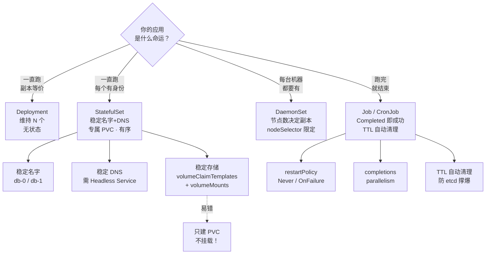

# 第 6 课：StatefulSet / DaemonSet / Job：三种不同命运的工作负载

> 所属阶段：阶段 2《工作负载与控制器》｜ 水平：入门偏进阶 ｜ 本课知识点：StatefulSet、DaemonSet、Job 与 CronJob、Job 的 TTL 自动清理
> 故事情节：课 5 的 Deployment 假设所有副本**完全等价** —— 随便删一个，补个新的就行。但现实中三类应用不是这样：**数据库每个实例有身份**（主和从不能互换）、**监控 agent 必须每台机器都跑**、**备份任务跑完就该结束**。这一课讲解决这三类的三种控制器

## 🎯 本课目标

- 理解 StatefulSet 的"稳定身份 + 稳定存储"，说清它与 Deployment 的三个本质区别
- 掌握 DaemonSet 的"每节点一个"语义与 nodeSelector 限定
- 理解 Job/CronJob 的"完成即结束"语义，会配置并行与定时
- 会用 `ttlSecondsAfterFinished` 自动清理已完成的 Job

---

## 第一幕：起源与场景引入

> 🏛️ **起源**：三种控制器解决三类不同问题，诞生时间也不相同。
>
> **Job** 与 **CronJob** 最早 —— CronJob 的名字直接来自 Unix 的 **cron**（1975 年，AT&T Unix V7 引入的定时任务守护进程）。**CronJob 在 k8s 1.4（2016）进入 beta，1.21（2021）才 GA（正式发布）**，是这三者中最晚成熟的 —— 因为它的**幂等性、并发策略、错过执行的处理**都比想象中复杂。
>
> **DaemonSet** 同样 1.2 就有，思想继承自 Borg 的 **"系统守护进程"（system daemons）** —— Borg 集群里每台上都跑着日志采集、监控这类基础设施进程，k8s 把它抽象成了 DaemonSet。
>
> **StatefulSet** 出现最晚、争议最大。它的前身叫 **PetSet**（"宠物集"，1.3 引入），名字来自业界著名的 **"cattle vs pets"（牲口 vs 宠物）** 比喻：无状态应用像牲口，死了换一头；有状态应用像宠物，每只都有名字、不能随便换。**2017 年的 k8s 1.9 正式更名为 StatefulSet 并 GA** —— 改名正是因为"宠物"这个比喻虽形象，但容易让人误解为"要精心照料"，而官方想强调的是"**有稳定身份**"。
>
> **TTL 自动清理**（`ttlSecondsAfterFinished`）则是 1.12 引入、1.23 GA 的特性 —— 源自一个非常实际的运维痛点：**频繁执行的 CronJob 会留下海量已完成的 Job 对象，把 etcd 撑爆**。
>
> （核查于 2026-09；来源：[StatefulSet](https://kubernetes.io/zh-cn/docs/concepts/workloads/controllers/statefulset/)、[DaemonSet](https://kubernetes.io/zh-cn/docs/concepts/workloads/controllers/daemonset/)、[Job](https://kubernetes.io/zh-cn/docs/concepts/workloads/controllers/job/)、[CronJob](https://kubernetes.io/zh-cn/docs/concepts/workloads/controllers/cron-jobs/)、[TTL](https://kubernetes.io/zh-cn/docs/concepts/workloads/controllers/ttlafterfinished/)）

🎬 **场景**：你接手了一个新系统，要部署三种东西：

**第一种：一个 3 节点的数据库集群。**

你用课 5 的 Deployment 部署了，然后发现：
- 三个 Pod 名字是随机的（`db-6d689fbfdf-x7k2p`），你分不清谁是主谁是从
- 删掉一个 Pod，重建后**名字变了**，其他节点配置里写的还是旧名字 → 集群裂开
- 更要命：重建后**数据没了**

**第二种：日志采集 agent。**

你要在**每台机器**上跑一个。用 Deployment 部署 3 个副本？问题是：k8s 可能把 3 个都调度到同一台机器上，而其他机器一个都没有。

**第三种：每天凌晨 2 点的数据库备份。**

用 Deployment？它会"保证 Pod 一直运行" —— 备份跑完了，k8s 又给你重启一个，**无限循环备份**。

这三个问题的共同点是：**Deployment 的"保证 N 个等价副本一直运行"，对它们全都不合适。**

- 数据库需要：**每个实例有身份、有专属存储**
- 日志 agent 需要：**每台机器恰好一个**（不是"总共 N 个"）
- 备份任务需要：**跑完就结束，别重启**

---

## 第二幕：认知冲突

> ❓ **问题**：课 5 说 Deployment 能"自愈"—— 那为什么不能拿它部署数据库？**删掉一个 Pod 补一个，不是挺好的吗？**

**关键在于：Deployment 的"自愈"，补出来的是一个"陌生人"。**

回忆课 5 的实测：删掉 `web-6d689fbfdf-49stb`，补出来的是 `web-6d689fbfdf-6jvmq` —— **一个全新的、不认识的身份**。

对 nginx 来说这毫无问题：**所有 nginx 副本完全等价，谁都一样**。用户请求打到哪个都行。

但对数据库来说，这是灾难：

```
db-1 挂了 → 重建为 db-1'（新名字、新 IP、新空数据盘）
   ↓
其他节点："db-1 是谁？没见过。我们的副本集里没有它。"
   ↓
数据：db-1' 的磁盘是空的，原来的数据呢？—— 没了（或还在，但没人认领）
```

> 💡 **本质区别**：**Deployment 假设副本"可互换"（interchangeable）；StatefulSet 承认副本"有身份"（identity）。**
>
> 用课 5 的餐厅类比：Deployment 的服务员是**临时工**，谁来了都能端盘子，走一个再招一个；StatefulSet 的服务员是**有工号的老员工**，`007` 号走了，补来的必须还是 `007` —— 因为**熟客认的是他，他的记事本也得还在**。

> 🔑 **一句话点破**：**Deployment 管的是"数量"，StatefulSet 管的是"身份"。**

---

## 第三幕：层层揭示

### 知识点 1：StatefulSet

> 本知识点关键点：稳定身份（名字+DNS） / 稳定存储 / 有序创建与删除

#### 一句话定义

**StatefulSet 是管理有状态应用的控制器：它给每个 Pod 一个稳定的序号身份（名字、DNS 都不会因重建而改变），并为每个 Pod 绑定一份专属的持久存储；创建和删除都按序号有序进行。**

#### 直觉建立（类比）

回到"牲口 vs 宠物"的经典比喻：

| | Deployment | StatefulSet |
|---|---|---|
| 比喻 | **牲口（cattle）** | **宠物（pets）** |
| 名字 | 随机编号 `web-6d689fbfdf-x7k2p` | 固定工号 `sts-web-0/1/2` |
| 换一个 | 随便换，无人察觉 | **换了就出事**（其他节点找不到它） |
| 存储 | 共享或不要 | **每只专属**（各用各的碗） |
| 顺序 | 同时起，无所谓先后 | **按工号排队**（0 好了才起 1） |

> 💡 **为什么"有序"这么重要？**
>
> 分布式系统（数据库、消息队列）**启动有依赖关系**：通常 `0` 号是"种子节点"，它必须先起来完成初始化，`1`、`2` 才能加入集群。如果三个同时起、谁也不知道谁是种子 → 谁也不愿意先动 → **死锁**。
>
> **有序性解决的是"集群初始化"的鸡生蛋问题。**

#### 核心原理

**一、三个"稳定"（StatefulSet 的全部价值）。**

| 稳定性 | 表现 | 靠什么实现 |
|---|---|---|
| **稳定名字** | Pod 名固定为 `<sts名>-<序号>` | 控制器按序号创建 |
| **稳定 DNS** | `pod-0.svc.ns.svc.cluster.local` 解析到固定 Pod | **Headless Service**（`clusterIP: None`） |
| **稳定存储** | 每个 Pod 绑定专属 PVC，重建后重新挂上 | `volumeClaimTemplates` |

> 🎯 **Headless Service 是 StatefulSet 的必备搭档**。普通 Service 有 ClusterIP，DNS 解析到的是"**一个负载均衡后的虚拟 IP**"（你不知道背后是哪个 Pod）；**Headless Service（`clusterIP: None`）的 DNS 会直接返回每个 Pod 的真实 IP** —— 这样你才能"点名找人"。

**二、与 Deployment 的三个本质区别（本课重点）。**

| 维度 | Deployment | StatefulSet |
|---|---|---|
| Pod 名字 | 随机哈希后缀 | **固定序号** `0,1,2…` |
| 存储 | 通常共享或无 | **每个 Pod 专属 PVC** |
| 创建/删除 | **并行**，无顺序 | **有序**（创建 0→N，删除 N→0） |

**三、`volumeClaimTemplates`：一个模板，N 份存储。**

```
volumeClaimTemplates:        →  生成：
  - name: data                  data-sts-web-0  ← 给 Pod 0
    spec: ...                   data-sts-web-1  ← 给 Pod 1
                                data-sts-web-2  ← 给 Pod 2
```

> 🔑 **缩容时 PVC 不会被删除**（实测已证）—— 这是**故意的安全设计**：万一是误操作缩容，数据还在。想要回就扩回去。**删除 PVC 必须手动**。

#### 示例演示

**验证一：有序创建（0 → 1 → 2 逐个就绪）。**

```bash
cat <<'YAMLEOF' | kubectl apply -f -
apiVersion: v1
kind: Service
metadata:
  name: web-svc
spec:
  clusterIP: None          # ← Headless：这是 StatefulSet 的关键搭档
  selector:
    app: sts-web
  ports:
  - port: 80
---
apiVersion: apps/v1
kind: StatefulSet
metadata:
  name: sts-web
spec:
  serviceName: web-svc     # ← 必须指向那个 Headless Service
  replicas: 3
  selector:
    matchLabels:
      app: sts-web
  template:
    metadata:
      labels:
        app: sts-web
    spec:
      containers:
      - name: nginx
        image: nginx:alpine
        ports:
        - containerPort: 80
  volumeClaimTemplates:
  - metadata:
      name: data
    spec:
      accessModes: ["ReadWriteOnce"]
      resources:
        requests:
          storage: 100Mi
YAMLEOF
# 输出：
# service/web-svc created
# statefulset.apps/sts-web created
```

```bash
for i in 1 2 3 4 5 6; do
  kubectl get pod -l app=sts-web --no-headers
  echo "  --"
  sleep 3
done
# 输出（本机 v1.34.0 实测，节选）：
# sts-web-0   0/1   Pending   0     0s
#   --
# sts-web-0   1/1   Running   0     6s
# sts-web-1   0/1   Pending   0     1s      ← 0 就绪后，1 才开始
#   --
# sts-web-0   1/1   Running   0     13s
# sts-web-1   1/1   Running   0     8s
# sts-web-2   0/1   Pending   0     3s      ← 1 就绪后，2 才开始
#   --
# sts-web-0   1/1   Running   0     16s
# sts-web-1   1/1   Running   0     11s
# sts-web-2   1/1   Running   0     6s
```

> 🎯 **严格串行**：0 没 Ready，**1 根本不会开始创建**。这与 Deployment 的"3 个同时起"形成鲜明对比。

**验证二：稳定名字与稳定 DNS。**

```bash
kubectl get pod -l app=sts-web --no-headers -o custom-columns='NAME:.metadata.name,IP:.status.podIP'
# 输出（本机实测）：
# sts-web-0   10.244.0.105
# sts-web-1   10.244.0.107
# sts-web-2   10.244.0.109

kubectl exec dns-test -- nslookup sts-web-0.web-svc.lesson06.svc.cluster.local
# 输出（本机实测）：
# Name:	sts-web-0.web-svc.lesson06.svc.cluster.local
# Address: 10.244.0.105

kubectl exec dns-test -- nslookup web-svc.lesson06.svc.cluster.local
# 输出（本机实测，返回全部 3 个）：
# Name:	web-svc.lesson06.svc.cluster.local
# Address: 10.244.0.105
# Name:	web-svc.lesson06.svc.cluster.local
# Address: 10.244.0.109
# Name:	web-svc.lesson06.svc.cluster.local
# Address: 10.244.0.107
```

> 🎯 **DNS 格式的规律**：`<pod名>.<service名>.<namespace>.svc.cluster.local`
>
> 因为名字稳定，**这个 DNS 名字永远指向同一个"身份"** —— 其他节点写死它也不会失效。这就是"点名找人"的能力。

**验证三：删掉 Pod，身份保持（但 IP 会变）。**

```bash
OLD_IP=$(kubectl get pod sts-web-1 -o jsonpath='{.status.podIP}')
echo "删除前 sts-web-1 IP = $OLD_IP"
# 输出（本机实测）：删除前 sts-web-1 IP = 10.244.0.107

kubectl delete pod sts-web-1 --wait=false
sleep 12
kubectl get pod sts-web-1 -o custom-columns='NAME:.metadata.name,IP:.status.podIP'
# 输出（本机实测）：
# sts-web-1   10.244.0.111
#              ↑ 名字不变，IP 变了！
```

> ⚠️ **这是最容易误解的一点，务必看清**：
>
> **"稳定"的是名字和 DNS，不是 IP。** 实测中 IP 从 `.107` 变成了 `.111`。
>
> **所以你绝不能在配置里写死 Pod IP** —— 必须写 **DNS 名字**（`sts-web-1.web-svc...`）。重建后 DNS 会自动指向新 IP，而写死的 IP 会失效。
>
> 这也解释了为什么 **Headless Service 是 StatefulSet 的必需组件** —— 没有它，稳定身份就无从谈起。

**验证四：稳定存储（关键修正 —— 见下方警告）。**

```bash
kubectl get pvc --no-headers -o custom-columns='PVC:.metadata.name,STATUS:.status.phase'
# 输出（本机实测）：
# data-sts-web-0   Bound
# data-sts-web-1   Bound
# data-sts-web-2   Bound
#   ↑ 名字规律：volumeClaimTemplate名-Pod名-序号

kubectl get pod sts-web-0 -o jsonpath='{.spec.volumes[*].persistentVolumeClaim.claimName}{"\n"}'
# 输出（本机实测）：data-sts-web-0
```

> ⚠️⚠️ **重要陷阱（本课实测踩到过，务必记住）**：
>
> **`volumeClaimTemplates` 只负责"创建 PVC"，不会自动挂载！** 必须在 `template` 里**显式写 `volumeMounts`**。
>
> 我在写讲义时第一版漏了 `volumeMounts`，结果：
> ```bash
> # 错误示范：只声明了 volumeClaimTemplates，没写 volumeMounts
> kubectl exec sts-web-0 -- sh -c 'echo "hello" > /usr/share/nginx/html/whoami.txt'
> # 写入成功
> kubectl delete pod sts-web-0
> # 重建后：
> kubectl exec sts-web-0 -- cat /usr/share/nginx/html/whoami.txt
> # 输出：cat: can't open '/usr/share/nginx/html/whoami.txt': No such file or directory  ← 数据丢了！
> ```
>
> **原因**：没写 `volumeMounts`，PVC 虽然 Bound 了，但**根本没挂进容器**。数据写在了容器的**可写层**，Pod 一删就没了。
>
> **查挂载是否生效**：
> ```bash
> kubectl get pod sts-web-0 -o jsonpath='{range .spec.containers[*]}{range .volumeMounts[*]}mountPath={.mountPath} name={.name}{"\n"}{end}{end}'
> ```
>
> **正确写法**（加上 `volumeMounts` 后实测通过）：
>
> ```yaml
> spec:
>   template:
>     spec:
>       containers:
>       - name: nginx
>         image: nginx:alpine
>         volumeMounts:          # ← 必须显式写！
>         - name: data           # ← 名字要对应 volumeClaimTemplates 的 name
>           mountPath: /data     # ← 挂载点
>   volumeClaimTemplates:
>   - metadata:
>       name: data               # ← 与上面的 name 对应
> ```

**验证五：数据确实持久化了（修正后）。**

```bash
kubectl exec sts-data-0 -- sh -c 'echo "persistent-hello" > /data/whoami.txt'
kubectl exec sts-data-0 -- cat /data/whoami.txt
# 输出（本机实测）：persistent-hello

kubectl delete pod sts-data-0 --wait=false
sleep 15
kubectl get pod sts-data-0 --no-headers
# 输出（本机实测）：sts-data-0   1/1   Running   0     14s
#                              ↑ 名字不变

kubectl exec sts-data-0 -- cat /data/whoami.txt
# 输出（本机实测）：persistent-hello
#                    ↑ 数据还在！存储跟着身份走了
```

**验证六：有序删除 + PVC 不会因缩容而删除。**

```bash
kubectl scale statefulset sts-web --replicas=2
sleep 8
kubectl get pod -l app=sts-web --no-headers
# 输出（本机实测）：
# sts-web-0   1/1   Running   0     23s
# sts-web-1   1/1   Running   0     54s
#   ↑ sts-web-2（序号最大的）先被删

kubectl get pvc --no-headers -o custom-columns='PVC:.metadata.name,STATUS:.status.phase'
# 输出（本机实测）：
# data-sts-web-0   Bound
# data-sts-web-1   Bound
# data-sts-web-2   Bound   ← 仍保留！
```

> 🎯 **PVC 保留是故意的安全设计**：缩容不等于删数据。想真正释放空间，需**手动删 PVC**（`kubectl delete pvc data-sts-web-2`）。
>
> **这既是保护也是坑**：忘记手动清理 → **一直占着云盘计费**。

#### 常见误区

1. **"StatefulSet 的 IP 是稳定的"** → **不是**。稳定的是**名字与 DNS**，IP 会变（实测 0.107 → 0.111）。**配置里必须写 DNS 名，不能写 IP。**
2. **"volumeClaimTemplates 会自动挂载"** → **不会**！必须显式写 `volumeMounts`（本课实测踩坑）。
3. **"缩容会删掉 PVC"** → 不会，PVC 保留（安全设计，也是云盘费用的坑）。
4. **"StatefulSet 比 Deployment 更高级，应该默认用它"** → 错。**无状态应用用 StatefulSet 只会更慢**（有序创建）且更复杂。
5. **"Headless Service 可有可无"** → 必备。没有它就没有稳定 DNS，稳定身份无从谈起。
6. **"删 StatefulSet 会删掉数据"** → 删 StatefulSet **不会**删 PVC（与缩容同理）。
7. **"StatefulSet 能保证数据一致"** → 它只提供**基础设施**（身份+存储）。真正的一致性由应用自己（如数据库的主从复制）实现。

#### 一句话记住

> **Deployment 管"数量"，StatefulSet 管"身份"—— 稳定的是名字和 DNS（不是 IP），且 volumeClaimTemplates 只建 PVC、不挂载。**

#### 官方文档

- [Kubernetes 官方文档 · StatefulSet](https://kubernetes.io/zh-cn/docs/concepts/workloads/controllers/statefulset/)
- [Kubernetes 官方任务 · 调试 StatefulSet](https://kubernetes.io/zh-cn/docs/tasks/debug/debug-application/debug-statefulset/)

---

### 知识点 2：DaemonSet

> 本知识点关键点：每节点一个（而非 N 个） / 无 replicas 字段 / nodeSelector 限定

#### 一句话定义

**DaemonSet 保证集群中每个（匹配的）节点上都运行且仅运行一个 Pod 副本**；新节点加入时自动在上面创建 Pod，节点移除时 Pod 被回收。**它没有 `replicas` 字段** —— 副本数由节点数决定。

#### 直觉建立（类比）

回到餐厅 —— Deployment 和 DaemonSet 的区别是**两种完全不同的排班逻辑**：

| | Deployment | DaemonSet |
|---|---|---|
| 问法 | "我要 **3 个**服务员" | "**每个楼层**都要 1 个服务员" |
| 逻辑 | 数**人头** | 数**楼层** |
| 楼层变多 | 还是 3 个（不够用了） | **自动补上**（4 个楼层 4 个人） |
| 典型角色 | 服务员、厨师（业务） | **每层楼的消防栓、监控摄像头**（基础设施） |

> 💡 **关键**：Deployment 关心"**总量**"，DaemonSet 关心"**覆盖率**"。

#### 核心原理

**一、"每节点一个"是怎么保证的？**

DaemonSet 控制器监听**节点列表**，为每个匹配的节点创建 Pod。因此：

- **新节点加入** → 自动创建 Pod（无需人工干预）
- **节点被移除** → 对应 Pod 被回收
- **节点数变化** → 副本数自动跟着变

> 🎯 **这就是 Deployment 做不到的**：Deployment 只会维持"总共 N 个"，**无法保证"每台机器恰好一个"** —— k8s 调度器完全可能把 3 个副本都放到同一台机器上（如果资源够）。

**二、为什么必须用它？（典型场景）**

| 场景 | 为什么需要"每节点一个" |
|---|---|
| **日志采集**（Fluentd、Filebeat） | 要读**本机** `/var/log` 的日志文件 —— 少一台就漏采集 |
| **监控 agent**（node-exporter、Datadog） | 要采集**本机** CPU/内存 —— 少一台就漏监控 |
| **网络插件**（Calico、Cilium） | 要在**每台**机器上配置网络规则 |
| **存储插件**（CSI node driver） | 要在**每台**机器上挂载卷 |

> 🔑 **共同点**：这些都属于**节点级基础设施** —— 它们的职责就是"管好自己所在的那台机器"。**这类任务天然是"每节点一个"。**

**三、用 nodeSelector / 污点容忍限定范围。**

不是所有节点都要跑（比如只有 GPU 节点才跑 GPU 监控），用 `nodeSelector` 限定：

```yaml
spec:
  template:
    spec:
      nodeSelector:
        disktype: ssd    # 只在打了 disktype=ssd 标签的节点上跑
```

> 💡 **控制平面节点的特殊之处**：生产集群的控制平面节点通常带**污点（Taint）** `node-role.kubernetes.io/control-plane:NoSchedule`，普通 Pod 默认**不会**调度上去。若 DaemonSet 需要覆盖控制平面（如网络插件），必须配对应的 **toleration（容忍）**。这是**课 9/课 10（调度）** 的内容，此处知道有这回事即可。

#### 示例演示

**验证一：每节点一个。**

```bash
kubectl get nodes --no-headers -o custom-columns='NAME:.metadata.name'
# 输出（本机 kind 集群实测）：k8s-c1-control-plane
#  ⚠️ 注意：本机是【单节点集群】，所以只能看到 1 个 Pod
#     多节点集群上会看到每个节点各一个 Pod

cat <<'YAMLEOF' | kubectl apply -f -
apiVersion: apps/v1
kind: DaemonSet
metadata:
  name: node-agent
spec:
  selector:
    matchLabels:
      app: node-agent
  template:
    metadata:
      labels:
        app: node-agent
    spec:
      containers:
      - name: agent
        image: busybox:1.36
        command: ["sh","-c","while true; do echo $(hostname) $(date); sleep 10; done"]
YAMLEOF
# 输出：daemonset.apps/node-agent created

kubectl rollout status daemonset/node-agent --timeout=180s
# 输出（本机实测）：daemon set "node-agent" successfully rolled out

kubectl get pod -l app=node-agent -o wide --no-headers | awk '{print $1"  node="$7}'
# 输出（本机实测）：node-agent-cf6fk  node=k8s-c1-control-plane
```

> ⚠️ **关于本环境的说明**：本课程环境是 **kind 单节点集群**（课 2 已说明），因此这里**只能看到 1 个 Pod**，无法直观体现"每节点一个"。
>
> **如何在多节点环境验证**：用 `kind create cluster --config` 建多节点集群，或直接在生产/测试集群上观察 —— 会看到 `kubectl get pod -l app=node-agent` 返回与节点数相同的 Pod，且 `NODE` 列各不相同。

**验证二：没有 replicas 字段 —— 副本数由节点数决定。**

```bash
kubectl get ds node-agent -o jsonpath='desiredNumberScheduled={.status.desiredNumberScheduled}{"\n"}currentNumberScheduled={.status.currentNumberScheduled}{"\n"}numberReady={.status.numberReady}{"\n"}'
# 输出（本机实测）：
# desiredNumberScheduled=1
# currentNumberScheduled=1
# numberReady=1
```

> 🎯 对比 Deployment 的 `replicas` 字段：DaemonSet **没有** `spec.replicas`。它的 `status` 里是 `desiredNumberScheduled`（期望调度数）—— **这个值由"匹配节点数"自动算出，你无法直接指定**。

**验证三：用 nodeSelector 只跑部分节点。**

```bash
NODE=$(kubectl get nodes --no-headers | head -1 | awk '{print $1}')
kubectl label node "$NODE" disktype=ssd --overwrite
# 输出（本机实测）：node/k8s-c1-control-plane labeled

cat <<'YAMLEOF' | kubectl apply -f -
apiVersion: apps/v1
kind: DaemonSet
metadata:
  name: ssd-agent
spec:
  selector:
    matchLabels:
      app: ssd-agent
  template:
    metadata:
      labels:
        app: ssd-agent
    spec:
      nodeSelector:
        disktype: ssd
      containers:
      - name: agent
        image: busybox:1.36
        command: ["sh","-c","sleep 3600"]
YAMLEOF

sleep 8
kubectl get ds ssd-agent --no-headers
# 输出（本机实测）：ssd-agent   1   1   1   1   1   disktype=ssd   8s
#                                                  ↑ NODE SELECTOR 列显示了约束
```

#### 常见误区

1. **"DaemonSet 的副本数用 replicas 设置"** → **没有这个字段**。副本数由**匹配节点数**决定。
2. **"部署日志采集用 Deployment 也行"** → 不行。Deployment 无法保证"每台机器都有"，可能全挤在一台上 → **漏采集**。
3. **"DaemonSet 会自动调度到控制平面节点"** → 生产集群通常**不会**（控制平面有污点），需配 toleration。
4. **"节点下线后 DaemonSet Pod 会飘到别的节点"** → 不会。它是"**跟节点绑定**"的，节点没了 Pod 就没了（这与 Deployment 不同 —— Deployment 的 Pod 会重调度到其他节点）。
5. **"删 DaemonSet 后节点上还有残留 Pod"** → 不会，级联删除（课 5 知识点 4）。

#### 一句话记住

> **Deployment 数"人头"（总共 N 个），DaemonSet 数"楼层"（每个节点 1 个）—— 后者管的是覆盖率。**

#### 官方文档

- [Kubernetes 官方文档 · DaemonSet](https://kubernetes.io/zh-cn/docs/concepts/workloads/controllers/daemonset/)
- [Kubernetes 官方任务 · 创建 DaemonSet](https://kubernetes.io/zh-cn/docs/tasks/manage-daemon/create-daemon-set/)

---

### 知识点 3：Job 与 CronJob

> 本知识点关键点：完成即结束（不重启） / restartPolicy 限制 / completions 与 parallelism / CronJob 定时

#### 一句话定义

**Job 是"批处理"控制器：它创建 Pod 去执行一次性任务，任务成功完成后 Job 就结束，Pod 进入 `Completed` 状态且不会被重启**；**CronJob 则是在 Job 之上加了定时调度**，按 cron 表达式周期性地创建 Job。

#### 直觉建立（类比）

| | Deployment | Job |
|---|---|---|
| 比喻 | **长期雇员**：天天上班，走了要补人 | **临时工**：干完这个活就走 |
| k8s 的态度 | "Pod 没了？赶紧补一个！" | "Pod 跑完了？很好，收工。" |
| 终态 | 永远 `Running` | `Completed`（成功） |

> 💡 **这就是第一幕"备份任务"问题的答案**：用 Deployment 跑备份，k8s 会认为"Pod 退出了 = 异常"，于是重启 → 再备份 → 再退出 → **无限循环**。用 Job，跑完就 `Completed`，k8s 说"干得漂亮"，不再管。

**CronJob 就是加了闹钟的临时工**：每天 2 点，闹钟响了，雇一个临时工来干活，干完走人；明天 2 点再来一个（**新的人、新的 Pod**）。

#### 核心原理

**一、Job 的"完成"判定。**

Job 通过 `completions` 判定是否成功：

| 字段 | 含义 | 默认 |
|---|---|---|
| `completions` | **总共**需要成功几次 | 1 |
| `parallelism` | **同时**最多跑几个 | 1 |
| `backoffLimit` | 失败重试几次后放弃 | 6 |

- 不写 `completions` → 默认 1，跑成功 1 次就 Complete
- 写 `completions: 5, parallelism: 2` → 总共成功 5 次，**同时最多 2 个在跑**

**二、`restartPolicy` 必须是 `Never` 或 `OnFailure`（易错点）。**

Job **不接受 `Always`** —— 因为 `Always` 的语义是"退出就重启"，与 Job 的"跑完就结束"直接矛盾。

实测报错原文：
```
The Job "bad-job" is invalid: spec.template.spec.restartPolicy:
Required value: valid values: "OnFailure", "Never"
```

> ⚠️ 这个报错很常见：**用惯了 Deployment 的 YAML，复制过来忘了改 `restartPolicy`**（Deployment 默认就是 `Always`）。

**三、`Never` vs `OnFailure` 的区别（重要）。**

| 值 | 失败时行为 | 适用场景 |
|---|---|---|
| `Never` | **新建 Pod** 重试（旧 Pod 留在 `Failed` 状态供排查） | 想保留失败现场 |
| `OnFailure` | **重启同一个 Pod**（原地重试） | 想省资源、快速重试 |

> 💡 选 `Never` 时，失败会不断产生新 Pod，**要配合 `backoffLimit`** 防止无限创建。

**四、CronJob 的 schedule 与三个坑。**

`schedule` 用标准的 **cron 表达式**（5 段：分 时 日 月 周）：

```yaml
schedule: "*/1 * * * *"    # 每分钟
schedule: "0 2 * * *"      # 每天 2:00
```

> ⚠️ **CronJob 的三个经典坑**（概念性说明，生产必知）：
> 1. **并发策略**（`concurrencyPolicy`）：上一个任务还没跑完，下一个时间到了怎么办？默认 `Allow`（允许并发，可能重叠）。数据备份类应设 `Forbid`。
> 2. **错过执行**（`startingDeadlineSeconds`）：节点故障导致某次没触发，恢复后要不要补？默认不补。
> 3. **时区**：CronJob 默认用 **kube-controller-manager 的时区（通常 UTC）**，不是你的本地时区。v1.27+ 可用 `timeZone` 字段显式指定。

#### 示例演示

**验证一：Job 跑完就结束。**

```bash
cat <<'YAMLEOF' | kubectl apply -f -
apiVersion: batch/v1
kind: Job
metadata:
  name: pi
spec:
  template:
    spec:
      containers:
      - name: pi
        image: perl:5.34
        command: ["perl","-Mbignum=bpi","-wle","print bpi(50)"]
      restartPolicy: Never       # ← 关键：不能是 Always
YAMLEOF
# 输出：job.batch/pi created

kubectl get job pi --no-headers
# 输出（本机实测，运行中）：pi   Running   0/1   5s   5s

kubectl wait --for=condition=Complete job/pi --timeout=180s
# 输出（本机实测）：job.batch/pi condition met

kubectl get job pi --no-headers
# 输出（本机实测）：pi   Complete   1/1   31s   31s
#                        ↑ COMPLETIONS 1/1，不是 Running

kubectl get pod -l job-name=pi --no-headers
# 输出（本机实测）：pi-rkn57   0/1   Completed   0     32s
#                              ↑ 注意：0/1 但状态是 Completed，不是 Running

kubectl logs -l job-name=pi --tail=3
# 输出（本机实测）：3.1415926535897932384626433832795028841971693993751
```

> 🎯 **两个关键观察**：
> ① Job 的状态是 `Complete`，Pod 的状态是 `Completed` —— **与 Deployment 的 `Running` 完全不同**
> ② Pod 显示 `0/1` 却不是异常 —— 因为它**已经正常结束了**，不是"没起来"

**验证二：restartPolicy 限制（实测报错）。**

```bash
# 故意用 Always：
cat <<'YAMLEOF' | kubectl apply -f -
apiVersion: batch/v1
kind: Job
metadata:
  name: bad-job
spec:
  template:
    spec:
      containers:
      - name: c
        image: busybox:1.36
        command: ["echo","hi"]
      restartPolicy: Always      # ← 非法
YAMLEOF
# 输出（本机实测）：
# The Job "bad-job" is invalid: spec.template.spec.restartPolicy:
# Required value: valid values: "OnFailure", "Never"
```

**验证三：并行 Job。**

```bash
cat <<'YAMLEOF' | kubectl apply -f -
apiVersion: batch/v1
kind: Job
metadata:
  name: parallel-pi
spec:
  completions: 5        # 总共成功 5 次
  parallelism: 2        # 同时最多 2 个
  template:
    spec:
      containers:
      - name: pi
        image: perl:5.34
        command: ["perl","-Mbignum=bpi","-wle","print bpi(20)"]
      restartPolicy: Never
YAMLEOF

kubectl get job parallel-pi --no-headers      # 每隔几秒看一次
# 输出（本机实测）：
# parallel-pi   Running    0/5   0s    0s
# parallel-pi   Running    2/5   6s    6s     ← 同时 2 个在跑
# parallel-pi   Complete   5/5   10s   11s    ← 全部完成
```

**验证四：CronJob 定时触发。**

```bash
cat <<'YAMLEOF' | kubectl apply -f -
apiVersion: batch/v1
kind: CronJob
metadata:
  name: hello-cron
spec:
  schedule: "*/1 * * * *"       # 每分钟
  jobTemplate:
    spec:
      template:
        spec:
          containers:
          - name: hello
            image: busybox:1.36
            command: ["sh","-c","echo [$(date)] hello from cron"]
          restartPolicy: OnFailure
YAMLEOF
# 输出：cronjob.batch/hello-cron created

kubectl get cronjob hello-cron --no-headers
# 输出（本机实测）：hello-cron   */1 * * * *   <none>   False   0   <none>   0s
#                                                      ↑ SUSPEND=False

# 等待约 60 秒后
kubectl get job --no-headers | grep hello-cron
# 输出（本机实测）：hello-cron-29817199   Complete   1/1   2s   4s
#                    ↑ CronJob 自动创建了 Job（名字带时间戳）

kubectl logs job/hello-cron-29817199 --tail=3
# 输出（本机实测）：[Thu Sep 10 09:19:00 UTC 2026] hello from cron
```

**验证五：暂停 CronJob。**

```bash
kubectl patch cronjob hello-cron -p '{"spec":{"suspend":true}}' --type=merge
kubectl get cronjob hello-cron --no-headers
# 输出（本机实测）：hello-cron   */1 * * * *   <none>   True   0   5s   44s
#                                                      ↑ SUSPEND=True，不再触发
```

> 💡 `suspend: true` 常用于**临时停用**定时任务（如维护窗口），比删掉重建更安全。

#### 常见误区

1. **"Job 和 Deployment 差不多，只是跑一次"** → 本质区别在**终态语义**：Deployment 追求"永远 Running"，Job 追求"成功 Completed"。
2. **"Job 的 restartPolicy 可以用 Always"** → 不行，只能是 `Never` / `OnFailure`（实测报错已证）。
3. **"Job 完成后的 Pod 会一直占资源"** → Pod 是 `Completed` 状态，**不再消耗 CPU/内存**（但对象还在 etcd 里 —— 见知识点 4）。
4. **"CronJob 直接用我的本地时区"** → 默认 **UTC**，v1.27+ 才可用 `timeZone` 指定。
5. **"CronJob 会等上一个跑完"** → 默认 `Allow` 并发，**会重叠**。备份类要设 `concurrencyPolicy: Forbid`。
6. **"Job 失败了会自动重试无限次"** → 有 `backoffLimit`（默认 6）限制。

#### 一句话记住

> **Deployment 要"永远活着"，Job 要"干完就走" —— 这就是它们不可互换的原因。**

#### 官方文档

- [Kubernetes 官方文档 · Job](https://kubernetes.io/zh-cn/docs/concepts/workloads/controllers/job/)
- [Kubernetes 官方文档 · CronJob](https://kubernetes.io/zh-cn/docs/concepts/workloads/controllers/cron-jobs/)
- [Kubernetes 官方任务 · 使用 CronJob 运行自动化任务](https://kubernetes.io/zh-cn/docs/tasks/job/automated-tasks-with-cron-jobs/)

---

### 知识点 4：Job 的 TTL 自动清理

> 本知识点关键点：为什么需要 / ttlSecondsAfterFinished / 级联清理 Pod / 与 CronJob 历史限制的区别

#### 一句话定义

**`ttlSecondsAfterFinished` 让 Job 在完成（成功或失败）指定秒数后被自动删除**，连同它创建的 Pod 一起清理。**默认 Job 完成后不会自动删除**，需要这个字段（或手动删除）来避免对象堆积。

#### 直觉建立（类比）

Job 完成后留下的对象，就像**外卖餐盒**：

- **没有 TTL** = 吃完的餐盒**堆在桌上不扔**。一顿没事，**每天三顿、连续一年**（想想每分钟执行一次的 CronJob）→ 屋子塞满
- **有 TTL** = 吃完 **20 分钟后自动收走**。桌子永远干净

> 💡 **这个类比点出了 TTL 的本质价值**：它不是"功能"，是**"防止系统被自己产生的垃圾撑爆"**的保护机制。

#### 核心原理

**一、为什么需要它？（这是本知识点的关键）**

实测证据 —— 本课跑完几个 Job 后：

```bash
kubectl get job --no-headers
# 输出（本机实测）：
# hello-cron-29817199   Complete   1/1   2s    5s
# parallel-pi           Complete   5/5   10s   81s
# pi                    Complete   1/1   31s   113s
#   ↑ 全部保留着，一个都没自动删
```

每个已完成的 Job 都包含：**Job 对象 + 对应的 Pod 对象**（Pod 虽不再消耗 CPU，但**对象元数据一直在 etcd 里**）。

对于 `*/1 * * * *`（每分钟）的 CronJob：
```
1 天 = 1440 次 → 1440 个 Job + 1440 个 Pod
1 个月 ≈ 43,200 个对象
```
**etcd 会被撑爆，API 查询也会变慢。**

> 🔑 **这是生产环境真实发生过的事故**：CronJob 跑了几个月没配 TTL，某天整个集群 API 响应变慢，排查发现 etcd 里有几十万个 Completed Job。

**二、TTL 怎么工作。**

```yaml
spec:
  ttlSecondsAfterFinished: 20    # 完成后 20 秒自动删除
```

时间线：
```
Job Complete
   ↓ （20 秒）
TTL 控制器发现"已过期"
   ↓
删除 Job 对象
   ↓ （级联，课 5 知识点 4）
删除它创建的 Pod
```

> 🎯 **注意是"级联删除"** —— 这正是课 5 学的 ownerReference 在起作用：**Job 是 Pod 的 owner**，删 Job 就连带删 Pod。

**三、TTL 与 CronJob 历史保留的区别（易混淆）。**

| 机制 | 作用对象 | 字段 |
|---|---|---|
| **TTL** | 删除**已完成的 Job 对象**（及其 Pod） | Job 的 `spec.ttlSecondsAfterFinished` |
| **CronJob 历史限制** | 保留**最近 N 个** Job 记录 | CronJob 的 `successfulJobsHistoryLimit` / `failedJobsHistoryLimit` |

> 💡 **两者不冲突，可同时用**。CronJob 的历史限制默认保留 3 个成功 + 1 个失败 —— 注意**它默认就保留了 3 个**，所以纯靠它仍会累积。

**四、注意事项（官方说明的要点）。**

- TTL 从 Job **完成时刻**开始计时，不是创建时刻
- 设为 `0` = **完成后立即删除**（日志可能来不及看）
- 不设置 = **永不自动删除**（默认行为）

#### 示例演示

**验证一：默认情况 —— 完成的 Job 不会自动删除。**

```bash
kubectl get job --no-headers
# 输出（本机实测）：
# hello-cron-29817199   Complete   1/1   2s    5s
# parallel-pi           Complete   5/5   10s   81s
# pi                    Complete   1/1   31s   113s
#   ↑ 都还在（AGE 已过 1 分钟也没消失）
```

**验证二：设置 TTL 后自动清理。**

```bash
cat <<'YAMLEOF' | kubectl apply -f -
apiVersion: batch/v1
kind: Job
metadata:
  name: ttl-demo
spec:
  ttlSecondsAfterFinished: 20      # ← 完成后 20 秒自动删除
  template:
    spec:
      containers:
      - name: hello
        image: busybox:1.36
        command: ["echo","ttl test"]
      restartPolicy: Never
YAMLEOF
# 输出：job.batch/ttl-demo created

kubectl wait --for=condition=Complete job/ttl-demo --timeout=180s
# 输出（本机实测）：job.batch/ttl-demo condition met

kubectl get job ttl-demo --no-headers
# 输出（本机实测）：ttl-demo   Complete   1/1   3s   4s

sleep 26
kubectl get job ttl-demo --no-headers
# 输出（本机实测）：Error from server (NotFound): jobs.batch "ttl-demo" not found
#                    ↑ 已被 TTL 控制器自动删除

kubectl get pod -l job-name=ttl-demo --no-headers
# 输出（本机实测）：No resources found in lesson06 namespace.
#                    ↑ Pod 也一并被清理（级联删除）
```

> 🎯 **Pod 一起消失** —— 这是课 5 学的 ownerReference 级联删除在起作用。**Job 是 Pod 的 owner，删 Job 就删 Pod。**

#### 常见误区

1. **"Job 完成就自动消失了"** → **不会**。默认永久保留（实测已证），必须设 TTL 或手动删。
2. **"TTL 从 Job 创建时开始计时"** → 从**完成时刻**开始。
3. **"设了 TTL 日志就看不到了"** → 确实。Job 被删后 `kubectl logs job/xxx` 会失败。**想保留日志应先把日志送到外部系统**（这是可观测性话题，课 12+）。
4. **"ttlSecondsAfterFinished: 0 是禁用 TTL"** → 相反，`0` 是**立即删除**。不设置才是禁用。
5. **"CronJob 配了历史限制就不需要 TTL"** → 历史限制默认保留 3 个成功 Job，**仍会累积**。两者是不同层面。
6. **"TTL 是秒还是分钟"** → **秒**（`ttlSecondsAfterFinished`）。

#### 一句话记住

> **Job 完成后默认不删，每分钟一次的 CronJob 一年能攒 50 万个对象 —— TTL 是防止 etcd 被自己撑爆的保险丝。**

#### 官方文档

- [Kubernetes 官方文档 · TTL 控制器](https://kubernetes.io/zh-cn/docs/concepts/workloads/controllers/ttlafterfinished/)

---

## 第四幕：实操验证

把四种控制器串起来：**为一个完整应用部署三类工作负载。**

```bash
cat > /tmp/l6-verify.yaml <<'YAMLEOF'
# ① 有状态：数据库（StatefulSet + Headless Service）
apiVersion: v1
kind: Service
metadata:
  name: db-svc
spec:
  clusterIP: None
  selector:
    app: db
  ports:
  - port: 5432
---
apiVersion: apps/v1
kind: StatefulSet
metadata:
  name: db
spec:
  serviceName: db-svc
  replicas: 2
  selector:
    matchLabels:
      app: db
  template:
    metadata:
      labels:
        app: db
    spec:
      containers:
      - name: db
        image: busybox:1.36
        command: ["sh","-c","echo node-$(hostname | awk -F- '{print $NF}') > /data/whoami; sleep 3600"]
        volumeMounts:
        - name: data
          mountPath: /data
  volumeClaimTemplates:
  - metadata:
      name: data
    spec:
      accessModes: ["ReadWriteOnce"]
      resources:
        requests:
          storage: 50Mi
YAMLEOF

kubectl apply -f /tmp/l6-verify.yaml
# 输出（本机实测）：
# service/db-svc created
# statefulset.apps/db created
```

```bash
# 验证 ①：有序创建 + 稳定身份
kubectl rollout status statefulset/db --timeout=180s
# 预期输出：partitioned roll out complete: 2 new pods have been updated...

kubectl get pod -l app=db --no-headers -o custom-columns='NAME:.metadata.name,IP:.status.podIP'
# 预期输出（结构类似）：
# db-0   10.244.0.xxx
# db-1   10.244.0.xxx
#   ↑ 名字固定为 db-0 / db-1（不是随机哈希）

# 验证数据持久化
kubectl exec db-0 -- cat /data/whoami
# 预期输出：node-0

kubectl delete pod db-0 --wait=false
sleep 15
kubectl exec db-0 -- cat /data/whoami
# 预期输出：node-0
#            ↑ 重建后数据仍在（PVC 跟着身份走）
```

```bash
# 验证 ②：DaemonSet（每节点一个）
kubectl get pod -l app=node-agent -o wide --no-headers | awk '{print $1"  node="$7}'
# 预期输出（本机单节点集群）：node-agent-cf6fk  node=k8s-c1-control-plane
#   ⚠️ 单节点只能看到 1 个；多节点集群会看到每节点各一个

# 验证 ③：Job 跑完就结束
kubectl get job pi parallel-pi --no-headers
# 预期输出（结构类似）：
# pi            Complete   1/1   31s   xxx
# parallel-pi   Complete   5/5   10s   xxx
#   ↑ 状态是 Complete，不是 Running

# 验证 ④：TTL 自动清理
kubectl get job ttl-demo --no-headers 2>&1
# 预期输出：Error from server (NotFound): jobs.batch "ttl-demo" not found
#            ↑ TTL 到期后已自动删除
```

> ✅ **回扣场景**：回到第一幕的三个问题 ——
> 1. **数据库（有身份、要存数据）** → **StatefulSet**。稳定名字 `db-0/1` + 稳定 DNS + 专属 PVC，重建后身份与数据都还在（实测 `node-0` 可读回）
> 2. **日志 agent（每台机器一个）** → **DaemonSet**。它管的是"覆盖率"而非"总数"，新节点加入自动补
> 3. **备份任务（跑完就结束）** → **Job/CronJob**。终态是 `Completed`，k8s 不会再重启它
>
> 还有一个"看不见但很重要"的收获：**TTL 自动清理** —— 否则每分钟一次的 CronJob 一年能攒 50 万个对象，把 etcd 撑爆。
>
> **四种控制器的选择口诀**：
> ```
> 一直跑、无身份  → Deployment
> 一直跑、有身份  → StatefulSet
> 每节点一个      → DaemonSet
> 跑完就结束      → Job / CronJob
> ```

**清理**：

```bash
kubectl delete statefulset db sts-web sts-data --ignore-not-found
kubectl delete daemonset node-agent ssd-agent --ignore-not-found
kubectl delete cronjob hello-cron --ignore-not-found
kubectl delete job pi parallel-pi --ignore-not-found
kubectl delete svc web-svc db-svc --ignore-not-found
kubectl delete pod dns-test --ignore-not-found
kubectl get pvc --no-headers -o custom-columns='NAME:.metadata.name' --no-headers | grep '^data-' | xargs -r kubectl delete pvc
kubectl delete ns lesson06 --ignore-not-found
rm -f /tmp/l6-verify.yaml
```

> ⚠️ **清理说明**：StatefulSet 的 PVC **不会**随 StatefulSet 删除而删除（知识点 1）。上面特意加了一行删 PVC —— **这也是云盘费用的常见坑**。

---

## 第五幕：体系收束

> 📍 **本课在阶段 2 中的位置**：阶段 2《工作负载与控制器》的**核心问题**是"**不同命运的应用，用什么控制器管**"。这一课给出了完整答案。
>
> **四种控制器的一句话对照**：
>
> | 控制器 | 它保证什么 | Pod 的命运 |
> |---|---|---|
> | **Deployment**（课 5） | 维持 **N 个等价副本** | 死了就换新的（**陌生人**） |
> | **StatefulSet** | 维持 **N 个有身份的副本** | 死了补回**同一个身份** |
> | **DaemonSet** | 每个**节点**恰好 1 个 | 跟节点绑定，节点没了就没了 |
> | **Job / CronJob** | 任务**成功完成** | 干完就 `Completed` |
>
> 🔑 **贯穿其中的是课 5 学过的控制器模式**：它们全都是"**观测 → 比较 → 修正**"的调谐循环，**区别只在于"期望状态"的定义不同** —— Deployment 期望"3 个"，DaemonSet 期望"每个节点 1 个"，Job 期望"成功 1 次"。
>
> **理解到这一层，你就掌握了 k8s 工作负载的全部控制器** —— 后续遇到的任何控制器（包括各种 Operator），都是在问同一个问题：**它的"期望状态"是什么？**
>
> 🔗 **与前面几课的呼应**：
> - **课 3（Pod）**：本课四种控制器管理的**都是 Pod** —— Pod 始终是调度与执行的原子单位。控制器只是"**决定 Pod 该怎么生、怎么死**"的上层逻辑。
> - **课 4（优雅终止）**：StatefulSet 的**有序删除**依赖优雅终止 —— 必须等 `db-2` 真正关干净，才会去关 `db-1`。若 `terminationGracePeriodSeconds` 配置不当，有序性会被破坏。
> - **课 5（Deployment 与滚动更新）**：StatefulSet **也有更新策略**，但默认不同 —— 它默认 `OnDelete`（**手动删了才更新**），因为数据库这类应用**不希望被自动重启**。想自动滚动更新需显式设 `RollingUpdate`。
>
> 🔗 **下一步预告**：
> 1. **Pod 有了，怎么访问它们？** 本课用了 Headless Service（`clusterIP: None`），但还没系统讲 Service 的四种类型、ClusterIP 负载均衡、以及 CoreDNS 的解析机制 → **课 7（Service 与 CoreDNS）**
> 2. **外部流量怎么进来？** Service 的 ClusterIP 只在集群内可见 → **课 8（Ingress）**
> 3. **本课留下了两个调度相关的伏笔**：DaemonSet 的 **nodeSelector**、控制平面节点的**污点与容忍** → **课 9/课 10（调度）** 会系统讲
>
> ⚠️ **关于示例中的安全默认值**：与前几课一致，本课的 YAML **故意没有**写 `securityContext`、`resources` 等字段。这些属于后续主题（**课 9** 资源、**课 16** 安全）。
>
> **但你必须清楚**：**上面这些 YAML 不能直接用于生产**。特别是 StatefulSet —— 生产数据库还要考虑：**备份策略、故障转移、主从选举**（这些通常由 **Operator** 实现，不是 StatefulSet 自带的）。**StatefulSet 只提供"身份+存储"的基础设施，不保证数据一致性。**

---

## 🐞 常见误区

1. **"StatefulSet 的 IP 是稳定的"** → **不是**。稳定的是**名字与 DNS**（实测 IP 从 .107 变 .111）。
2. **"volumeClaimTemplates 会自动挂载"** → **不会**！必须显式写 `volumeMounts`（本课实测踩坑，数据丢了）。
3. **"缩容会删掉 PVC"** → 不会，PVC 保留（既是保护也是云盘费用的坑）。
4. **"StatefulSet 更高级，应默认用它"** → 无状态用它是自找麻烦（有序创建更慢）。
5. **"DaemonSet 用 replicas 设副本数"** → **没有这个字段**，由节点数决定。
6. **"日志采集用 Deployment 也行"** → 无法保证每台机器都有 → **漏采集**。
7. **"Job 的 restartPolicy 可以用 Always"** → 不行，只能 `Never`/`OnFailure`（实测报错）。
8. **"Job 完成后就自动消失了"** → **不会**，默认永久保留，需 TTL 或手动删。
9. **"CronJob 用我的本地时区"** → 默认 **UTC**。
10. **"CronJob 会等上一个跑完"** → 默认 `Allow` 并发，会重叠。
11. **"ttlSecondsAfterFinished: 0 是禁用"** → 相反，是**立即删除**；不设置才是禁用。
12. **"StatefulSet 保证数据一致性"** → 它只提供身份+存储，**一致性由应用自己实现**。

## 一图总结



## 课后小测

**Q1**：你用 StatefulSet 部署数据库，配置了 `volumeClaimTemplates` 但**忘记写 `volumeMounts`**。Pod 重建后数据会怎样？
- A. 数据保留，因为 PVC 已创建
- B. 数据丢失，因为 PVC 虽创建但没挂进容器
- C. Pod 无法启动，k8s 报错
- D. 数据保留在宿主机上，重新挂载即可

<details><summary>答案与解析</summary>

**答案：B**。这是本课**实测踩到的坑**。

`volumeClaimTemplates` 的职责**只是"创建 PVC"**，不会自动挂载。忘记写 `volumeMounts` 时：
- PVC 正常创建并 `Bound`（看起来一切正常！）
- 但容器里**根本没有挂载点**
- 数据写进了容器的**可写层**
- Pod 一旦删除重建，可写层随之消失 → **数据丢失**

实测输出：
```
kubectl exec sts-web-0 -- cat /usr/share/nginx/html/whoami.txt
cat: can't open '/usr/share/nginx/html/whoami.txt': No such file or directory
```

**危险之处**：PVC 显示 `Bound` 让你误以为持久化已生效，**直到真正丢数据才发现**。

**排查方法**：检查容器是否真的挂上了
```bash
kubectl get pod <pod> -o jsonpath='{range .spec.containers[*]}{range .volumeMounts[*]}mountPath={.mountPath}{"\n"}{end}{end}'
```

</details>

**Q2**：你有一个每分钟执行一次的 CronJob，运行了 3 个月没配 TTL。最可能发生什么？
- A. 什么都不会发生，Job 会自动清理
- B. etcd 中累积大量 Completed Job 对象，API 变慢
- C. Pod 持续消耗 CPU 和内存
- D. CronJob 自动停止执行

<details><summary>答案与解析</summary>

**答案：B**。

**Job 完成后默认不会自动删除**（本课实测：`pi`、`parallel-pi` 完成后一直保留）。每分钟一次 × 3 个月 ≈ **13 万个 Job 对象 + 13 万个 Pod 对象**全部堆在 etcd 里 → **API 响应变慢，甚至撑爆 etcd**。这是生产环境真实发生过的事故。

C 错：`Completed` 状态的 Pod **不再消耗 CPU/内存**（容器已退出），但**对象元数据一直占着 etcd 空间**。这正是这个坑隐蔽的原因 —— 你看资源监控一切正常，但 etcd 在悄悄膨胀。

**解法**：`spec.ttlSecondsAfterFinished: <秒数>`。

</details>

**Q3**：以下关于 StatefulSet 的说法，哪个是**正确**的？
- A. StatefulSet 的 Pod IP 是稳定的，可以直接写进配置文件
- B. StatefulSet 缩容时会自动删除对应的 PVC，释放空间
- C. StatefulSet 的 Pod 名字和 DNS 是稳定的，但 IP 会变
- D. StatefulSet 不需要 Service，Pod 之间直接通信即可

<details><summary>答案与解析</summary>

**答案：C**。

实测证据：删除 `sts-web-1` 后，名字仍为 `sts-web-1`，但 IP 从 `10.244.0.107` 变成了 `10.244.0.111`。

- **A 错**（也是最危险的误解）：**IP 会变**。配置里写死 Pod IP 会导致重建后连接失败。**必须写 DNS 名字**（`sts-web-1.web-svc.ns.svc.cluster.local`）。
- **B 错**：缩容**不会**删 PVC（故意的安全设计，防止误操作丢数据）。代价是**忘记手动清理会一直占着云盘计费**。
- **D 错**：StatefulSet **必须有 Headless Service**（`clusterIP: None`）配合 —— 稳定 DNS 正是它提供的。没有它，稳定身份无从谈起。

</details>

## 🚀 下一批接力提示词

> 学完本批后，**复制下面这段文字发给 AI**，即可无缝进入下一批（无需重新描述上下文）：

```
继续学 Kubernetes。我的学习档案在 k8s/00-学习档案.md。
已完成阶段 2《工作负载与控制器》课 5-6，
请继续讲解课 7。
```

## 🧭 课程导航

- 上一课：[课 5：Deployment：无状态应用的自愈与更新](lesson-05-Deployment无状态应用.md)
- 下一课：[课 7：Service 与 CoreDNS：集群内寻址](../../3-网络与服务暴露/lessons/lesson-07-Service与CoreDNS.md)
- 返回目录：[02-课程目录.md](../../../02-课程目录.md) ｜ 本阶段概览：[工作负载与控制器](../overview.md)