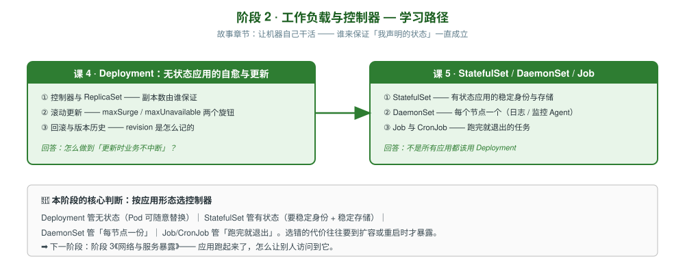

# 阶段 2：工作负载与控制器

> 所属课程：Kubernetes 系统学习 ｜ 故事章节：**让机器自己干活** ｜ 上一阶段：[阶段 1《心智模型与架构》](../1-心智模型与架构/overview.md)
> 下一阶段：[阶段 3《网络与服务暴露》](../3-网络与服务暴露/overview.md)

## 🎯 本阶段目标

- 先吃透 Pod 内部怎么组合（init / sidecar），以及容器如何优雅退场
- 理解控制器模式：Deployment → ReplicaSet → Pod 三层关系，谁在真正保证副本数
- 能独立完成滚动更新与回滚，说清两个更新旋钮的实际效果
- 能按应用形态（无状态 / 有状态 / 每节点 / 一次性任务）选对控制器，并说清选错的代价

## 📍 学习重点

- **多容器 Pod 的三种模式**：init 容器（先决条件）、sidecar（伴随增强）、适配器（格式转换）—— 理解它们才能看懂 Service Mesh 与日志采集的部署形态
- **优雅终止是分布式系统的必修课**：容器收到 SIGTERM 后不是立刻死，`terminationGracePeriodSeconds` 与 `preStop` 钩子决定了请求会不会被中断
- **控制器模式**：k8s 不直接管 Pod，而是通过控制器间接管理 —— 这是「调谐循环」的落地形态
- **滚动更新的两个旋钮**：`maxSurge` 与 `maxUnavailable` 控制的是「更新期间能多几个 / 少几个」，很多人配错是因为没搞清分母是谁
- **有状态的本质困难**：不是「要不要存数据」，而是「身份要不要稳定、存储要不要跟着身份走」
- **Job 的语义**：跑完就退出 ≠ 失败重启，二者的重启策略完全不同

## ✅ 必须掌握的知识点

| 知识点 | 所属课 | 学完应能 |
|--------|--------|----------|
| init 容器 | 课 4 | 用 init 容器做启动前置依赖，说清与主容器的执行顺序 |
| sidecar 与适配器模式 | 课 4 | 区分两种伴生容器模式的用途，能举例说明（日志采集 / 协议转换） |
| 优雅终止与生命周期钩子 | 课 4 | 配置 preStop 与 grace period，说清终止时流量如何平滑摘除 |
| 控制器与 ReplicaSet | 课 5 | 说清 Deployment/ReplicaSet/Pod 三层关系与各自职责 |
| 滚动更新 | 课 5 | 配置 maxSurge/maxUnavailable，实测更新期间副本变化 |
| 回滚与版本历史 | 课 5 | 用 rollout undo 回滚，说清 revision 记录在哪、保留几份 |
| 垃圾回收与级联删除 | 课 5 | 用 ownerReference 解释删 Deployment 为何连带删 ReplicaSet/Pod；用 finalizer 解释「namespace 卡在 Terminating」并会清理 |
| StatefulSet | 课 6 | 说清稳定网络标识与稳定存储的机制，以及与 Deployment 的本质区别 |
| DaemonSet | 课 6 | 说清适用场景（日志采集 / 节点监控），会用 nodeSelector 限制范围 |
| Job 与 CronJob | 课 6 | 说清 restartPolicy 为什么不能用 Always，会配置并发策略 |
| Job 的 TTL 自动清理 | 课 6 | 配置 `ttlSecondsAfterFinished`，说清完成的 Job 不清理会永久堆积的危害 |

## 🗺️ 本阶段路径图

> SVG 展示三课顺序：课 4 先吃透 Pod 内部组合，课 5 再攻最常用也最复杂的 Deployment，课 6 横向对比其余三类控制器。

## 本阶段产出

- [ ] `lessons/lesson-04-多容器Pod与优雅终止.md`
- [ ] `lessons/lesson-05-Deployment自愈与更新.md`
- [ ] `lessons/lesson-06-StatefulSet与DaemonSet与Job.md`
