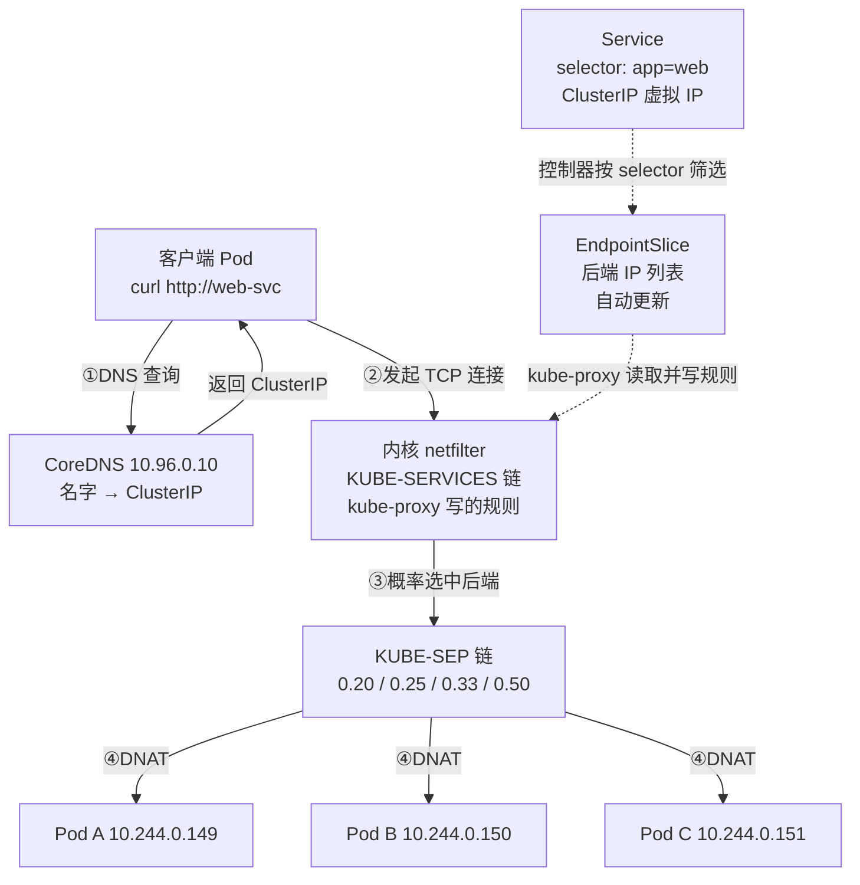

# 第 7 课：Service 与 CoreDNS：集群内寻址

> 所属阶段：阶段 3《网络与服务暴露》｜ 水平：入门偏进阶 ｜ 本课知识点：为什么 Pod IP 不能直接依赖、标签与选择算符、Service 类型与选型、kube-proxy 与转发机制、EndpointSlice 与后端列表、CoreDNS 与服务发现
> 故事情节：课 6 实测发现 **Pod 重建后 IP 会变**（`sts-web-1` 从 .107 变 .111），课 5 又看到**副本数会变**。那客户端到底该访问谁？这一课讲 k8s 给出的答案：**Service —— 一个不变的入口，背后是一组会变的 Pod**

## 🎯 本课目标

- 说清 Pod IP 不能依赖的三个原因，理解 Service 为什么存在
- 掌握标签与选择算符，理解它是 Service 找到后端的唯一依据
- 区分四种 Service 类型，会按场景选型
- 理解 kube-proxy 如何用 iptables 实现转发与负载均衡
- 理解 EndpointSlice 是"后端列表"的真相，会用它排障
- 理解 CoreDNS 的服务发现机制与 `ndots` 陷阱

---

## 第一幕：起源与场景引入

> 🏛️ **起源**：**Service 是 k8s 最早的一批原语之一**（2014 年 v0.x 就有，2015 年 7 月的 **k8s 1.0** 正式发布时即为核心对象）—— 因为"**服务发现**"是 Borg/Omega 时代就已验证的刚需。
>
> 它的设计直接继承自 **Borg 的 BNS（Borg Name Service）**：Borg 里每个任务也有会变的 IP，BNS 提供"**稳定名字 → 后端集合**"的映射。k8s 的 Service 几乎是同一思路的翻版。
>
> **kube-proxy** 同样是 1.0 的核心组件，但**实现换过三代**：
> - **userspace 代理（1.0）**：流量真的经过 kube-proxy 进程转发 —— **慢**，且 kube-proxy 挂了全网断
> - **iptables 模式（1.2 引入，1.9 起默认）**：**只写规则、不转发流量**，内核 netfilter 直接处理 —— 快很多
> - **IPVS 模式（1.8 alpha，1.11 GA）**：用内核的 IPVS 负载均衡器，支持更多调度算法，**大规模集群下性能更好**
>
> **CoreDNS** 则是"**后换上去的**"：k8s 早期用 **SkyDNS**（基于 etcd），1.3 引入 **kube-dns**，**1.11（2018）起 CoreDNS 成为默认**，**1.13 GA**。换的理由很实在：CoreDNS **内存占用低、灵活（插件化）**，而 kube-dns 的架构（etcd + skyDNS + kube2sky 多进程）**又重又容易出问题**。今天你看到的 Service 名字 `kube-dns`，**就是这段历史留下的化石** —— 它里面跑的其实是 CoreDNS。
>
> **EndpointSlice** 是**最年轻**的（1.16 alpha，1.21 GA）：老的 `Endpoints` 对象**一个 Service 只存一个对象**，后端一多（上千 Pod）就成了性能瓶颈。EndpointSlice **切片存储**（默认每片 100 个端点），解决了大规模服务的扩展性问题。
>
> （核查于 2026-09；来源：[Service](https://kubernetes.io/zh-cn/docs/concepts/services-networking/service/)、[EndpointSlice](https://kubernetes.io/zh-cn/docs/concepts/services-networking/endpoint-slices/)、[DNS for Services](https://kubernetes.io/zh-cn/docs/concepts/services-networking/dns-pod-service/)、[集群中的代理](https://kubernetes.io/zh-cn/docs/concepts/cluster-administration/proxies/)）

🎬 **场景**：你部署好了应用，3 个 Pod 跑起来了。现在前端要调用后端。

**你查了一下 Pod 的 IP，写进了前端配置：**

```yaml
backend_urls:
  - http://10.244.0.140:80
  - http://10.244.0.141:80
  - http://10.244.0.142:80
```

**然后，灾难开始了：**

**第一天**：一切正常。

**第二天**：运维做了一次滚动更新。前端**全部报错连不上** —— 因为三个 Pod 都被重建了，IP 变成了 `.143`、`.144`、`.145`。

```
你的配置写的是：10.244.0.140 / .141 / .142
现在的 Pod 是：  10.244.0.143 / .144 / .145
                 ↑ 一个都对不上
```

**第三天**：流量涨了，运维扩到 5 个副本。你又得改配置……**又要重启前端**。

**第四天**：你发现还有个问题 —— 前端**自己得实现负载均衡**（三个 IP 选哪个？轮询？）。这就是为什么每个服务都要写一遍负载均衡代码。

> 💡 **这不是假想**。课 6 已经实测过：删掉 StatefulSet 的 `sts-web-1`，重建后 **IP 从 `.107` 变成了 `.111`**。Deployment 更彻底 —— **连 Pod 名字都变了**（本课实测：`.140/.141/.142` → `.143/.144/.145`）。

**三个问题摆在这里：**

1. **IP 会变** —— 重建、扩缩容、节点故障、滚动更新，任何一次都会变
2. **数量会变** —— 客户端要维护一个"会变的 IP 列表"？
3. **要自己做负载均衡** —— 每个客户端都写一遍？

**k8s 的答案是 Service**：给你一个**永不变的入口**，背后**自动**跟着一组会变的 Pod。

---

## 第二幕：认知冲突

> ❓ **问题**：给 Pod 配个**固定 IP** 不就解决了吗？为什么非要引入 Service 这一层？

**因为"固定 IP"在分布式系统里是个伪命题。**

想想看：Pod 可能因为**任何原因**消失 —— 节点宕机、OOM、滚动更新、缩容、被驱逐。**它重建后大概率在另一个节点上**，而另一个节点有**自己的 IP 段**。

```
Pod 在节点 A：IP = 10.244.0.140（节点 A 的网段）
Pod 挂了
Pod 在节点 B 重建：IP = 10.244.1.87（节点 B 的网段）
                          ↑ 网段都不一样了，怎么"固定"？
```

**要给 Pod 固定 IP，就得让它永远待在同一台机器上** —— 那 k8s 的**调度能力**就废了（不能自由迁移、不能自愈、不能弹性伸缩）。

> 💡 **换个思路**：**既然 IP 注定会变，就别去固定它，而是在它前面加一层"稳定的中间人"。**

> 🔑 **一句话点破**：**Service 不是"固定 IP 的 Pod"，而是"指向一组会变 Pod 的稳定入口" —— 它用「不变的名字」屏蔽「会变的 IP」。**

用餐厅类比：你打电话给餐厅**总机**（Service），**总机把你的电话转给当前值班的服务员**（Pod）。服务员换班了（IP 变了），**你拨打的号码从没变过**。

---

## 第三幕：层层揭示

### 知识点 1：为什么 Pod IP 不能直接依赖

> 本知识点关键点：IP 会变 / 数量会变 / 需自己做负载均衡

#### 一句话定义

**Pod IP 是"基础设施分配的临时地址"，会随 Pod 重建、扩缩容、节点故障而改变**；因此任何直接依赖 Pod IP 的客户端都会在变化发生时失效。**Service 正是为屏蔽这种变化而设计的稳定抽象层。**

#### 直觉建立（类比）

Pod IP 就像**酒店房间号**，Service 是**酒店前台**：

| | Pod IP | Service |
|---|---|---|
| 类比 | 房间号 305 | 前台总机 |
| 稳定性 | 客人退房就换人 | **永远是同一个号** |
| 换房间后 | 你打电话给 305，接的是陌生人 | 打前台，总能找到你要的人 |

> 💡 **更贴切的是「外卖地址 vs 手机号」**：你给外卖员留"3 号楼 305"，他到了发现**你搬家了**；留手机号，**无论搬到哪都能联系上**。

#### 核心原理

**一、Pod IP 的三个致命问题（用实测说话）。**

**问题 1：IP 会变。**

课 6 已实测（StatefulSet）：
```
删除前 sts-web-1 IP = 10.244.0.107
删除后 sts-web-1 IP = 10.244.0.111   ← 变了
```

本课实测（Deployment，更彻底 —— 连名字都变）：
```
删除前：
  web-7cd64d47bb-4q67m=10.244.0.141
  web-7cd64d47bb-9jllj=10.244.0.140
  web-7cd64d47bb-tc4gt=10.244.0.142
删除后：
  web-7cd64d47bb-7qghn=10.244.0.144
  web-7cd64d47bb-9dlh7=10.244.0.145
  web-7cd64d47bb-qktkg=10.244.0.143
  ↑ 三个 IP 全变了，名字也全变了
```

**触发 IP 变化的操作**（任何一次都会）：
- Pod 重建（崩溃、OOM、被驱逐）
- **滚动更新**（课 5 学过 —— 本质就是逐个替换 Pod）
- 扩缩容
- 节点故障后重新调度

**问题 2：数量会变。**

```bash
kubectl scale deployment web --replicas=5
# 输出（本机实测）：
# web-7cd64d47bb-7qghn   10.244.0.144
# web-7cd64d47bb-9dlh7   10.244.0.145
# web-7cd64d47bb-j9ws9   10.244.0.146
# web-7cd64d47bb-qktkg   10.244.0.143
# web-7cd64d47bb-vglfd   10.244.0.147
```

客户端要从"维护 3 个 IP"改成"维护 5 个 IP" —— **每次扩缩容都要改配置、重启**。

**问题 3：客户端得自己做负载均衡。**

就算 IP 列表能拿到，"**这一请求该发给哪个 IP**"也得客户端自己决定。这意味着**每个客户端都要实现一遍负载均衡 + 健康检查 + 故障剔除**。

> 🔑 **Service 一次性解决三个问题**：
> 1. **IP 会变** → 给你**不变的 ClusterIP / DNS 名**
> 2. **数量会变** → 自动维护后端列表（**EndpointSlice**，知识点 5）
> 3. **要自己做 LB** → 内置负载均衡（**iptables/IPVS**，知识点 4）

#### 示例演示

```bash
kubectl get pod -l app=web -o custom-columns='NAME:.metadata.name,IP:.status.podIP'
# 输出（本机 v1.34.0 实测）：
# web-7cd64d47bb-4q67m   10.244.0.141
# web-7cd64d47bb-9jllj   10.244.0.140
# web-7cd64d47bb-tc4gt   10.244.0.142

kubectl delete pod -l app=web --wait=false
sleep 15
kubectl get pod -l app=web -o jsonpath='{range .items[*]}{.metadata.name}={.status.podIP}{"\n"}{end}'
# 输出（本机实测）：
# web-7cd64d47bb-7qghn=10.244.0.144
# web-7cd64d47bb-9dlh7=10.244.0.145
# web-7cd64d47bb-qktkg=10.244.0.143
#   ↑ IP 全变，名字也全变（随机哈希后缀）
```

> 🎯 **注意对比课 6**：StatefulSet 重建后**名字不变**（`sts-web-1` 还是 `sts-web-1`），Deployment 重建后**名字也变**（`...-4q67m` → `...-7qghn`）。
>
> **但两者 IP 都会变** —— 所以**无论哪种工作负载，都不能依赖 Pod IP**。

#### 常见误区

1. **"Pod IP 在 Pod 存活期间是稳定的，所以可以用"** → 能用一时，但**滚动更新、节点故障**随时会打破它。
2. **"用 StatefulSet 就能固定 IP"** → **不能**。课 6 实测：StatefulSet 稳定的是**名字和 DNS**，IP 照样变（.107 → .111）。
3. **"把 Pod IP 写进配置，出问题再改"** → 这是**分布式系统的经典反模式**，生产环境必然出事。
4. **"Service 就是给 Pod 配固定 IP"** → 不是。Service 是**另一层抽象**，它自己有 ClusterIP，Pod 的 IP 依然会变。

#### 一句话记住

> **Pod IP 会变、数量会变、还得自己做负载均衡 —— Service 用「不变的名字」一次性屏蔽这三个问题。**

#### 官方文档

- [Kubernetes 官方文档 · Service](https://kubernetes.io/zh-cn/docs/concepts/services-networking/service/)
- [Kubernetes 官方任务 · 使用 Service 访问应用](https://kubernetes.io/zh-cn/docs/tasks/access-application-cluster/service-access-application-cluster/)

---

### 知识点 2：标签与选择算符

> 本知识点关键点：标签是 Service 找后端的唯一依据 / 等值选择 / 集合选择 / label 与 annotation 的区别

#### 一句话定义

**标签（Label）是附着在 k8s 对象上的键值对，用于标识对象的"属性"；选择算符（Selector）则按标签筛选出一组对象。Service 正是通过 selector 动态决定哪些 Pod 是它的后端。**

#### 直觉建立（类比）

标签就像**快递包裹上的分类贴纸**：

```
包裹（Pod）：
  [app=web] [tier=frontend] [env=prod]     ← 三张贴纸

分拣员（Service/selector）：
  "把所有带 app=web 的包裹给我"            ← 筛出一组
```

> 💡 **关键**：**贴纸可以随便贴、随时改**，包裹本身（Pod）不需要知道谁在找它。**这种"松耦合"正是 k8s 的核心设计哲学**。

#### 核心原理

**一、标签是什么。**

- 格式：`key=value`，如 `app=web`、`tier=frontend`
- 附在对象的 `metadata.labels` 下
- **一个对象可以有任意多个标签**
- **key 唯一，value 随意**

**二、选择算符的两种写法。**

| 类型 | 语法 | 例子 |
|---|---|---|
| **等值** | `=`、`==`、`!=` | `app=web`、`env!=prod` |
| **集合** | `in`、`notin`、`exists`(!) | `tier in (frontend,backend)` |

**三、Service 靠 selector 找后端（核心机制）。**

```yaml
apiVersion: v1
kind: Service
metadata:
  name: web-clusterip
spec:
  selector:
    app: web        # ← "所有带 app=web 标签的 Pod 都是我的后端"
  ports:
  - port: 80
```

> 🎯 **这是 Service 的"胶水"**：Service **不认识 Pod 名字，也不记录 Pod IP**，它只记一条**筛选规则**。谁符合规则，谁就是后端 —— **Pod 增删会自动反映到后端列表**（知识点 5 会细讲 EndpointSlice）。

**四、标签 vs 注解（annotation）—— 必考的区别。**

| | Label（标签） | Annotation（注解） |
|---|---|---|
| 用途 | **标识**对象，供**查询/筛选** | **记录**信息，供**人/工具读取** |
| 能否被 selector 用 | ✅ **能** | ❌ **不能** |
| 例子 | `app=web`、`tier=frontend` | 构建号、Git commit、Prometheus 配置 |
| 语义 | "**这是什么**" | "**关于它的额外信息**" |

> 💡 **一句话区分**：**标签是用来"找"的，注解是用来"看"的。**

#### 示例演示

**验证一：打标签与按标签筛选。**

```bash
kubectl label pod -l app=web tier=frontend --overwrite
# 输出（本机实测）：
# pod/web-7cd64d47bb-7qghn labeled
# pod/web-7cd64d47bb-9dlh7 labeled
# pod/web-7cd64d47bb-j9ws9 labeled
# pod/web-7cd64d47bb-qktkg labeled
# pod/web-7cd64d47bb-vglfd labeled

kubectl get pod -l app=web --no-headers -o custom-columns='NAME:.metadata.name'
# 输出（本机实测）：5 个 Pod

kubectl get pod -l tier=backend --no-headers
# 输出（本机实测）：No resources found in lesson07 namespace.
#   ↑ 没有带这个标签的 Pod
```

**验证二：集合型选择算符。**

```bash
kubectl get pod -l 'tier in (frontend,backend)' --no-headers -o custom-columns='NAME:.metadata.name'
# 输出（本机实测）：5 个 Pod（frontend 的 5 个 + backend 的 0 个）
```

> 🎯 `in` 是"**或**"的关系：符合其中任一个即选中。

#### 常见误区

1. **"标签改了，Service 会立刻更新后端"** → 会，但**不是瞬间**（要经 EndpointSlice 同步，通常秒级）。
2. **"可以用 annotation 做筛选"** → **不能**，selector 只认 label。
3. **"Service 的 selector 可以写得很复杂"** → 目前**只支持等值匹配**（`app=web`），**不支持** `in`/`notin` 这类集合运算。想做复杂路由得用 **Ingress / Gateway API**（课 8/课 9）。
4. **"删除 Service 会删掉 Pod"** → 不会。Service 只是**引用** Pod，删 Service 对 Pod 无影响。
5. **"标签只能打在 Pod 上"** → 任何对象都能打（Node、Namespace、PVC……）。**节点标签**在调度里很重要（课 6 的 `nodeSelector` 用过）。

#### 一句话记住

> **标签是用来「找」的，注解是用来「看」的 —— Service 靠 selector 这条筛选规则动态圈定后端。**

#### 官方文档

- [Kubernetes 官方文档 · 标签和选择算符](https://kubernetes.io/zh-cn/docs/concepts/overview/working-with-objects/labels/)
- [Kubernetes 官方文档 · 注解](https://kubernetes.io/zh-cn/docs/concepts/overview/working-with-objects/annotations/)

---

### 知识点 3：Service 类型与选型

> 本知识点关键点：ClusterIP / NodePort / LoadBalancer / ExternalName 的区别与选型

#### 一句话定义

**k8s 提供四种 Service 类型：`ClusterIP`（默认，仅集群内可达）、`NodePort`（在每个节点开固定端口）、`LoadBalancer`（借助云厂商的外部负载均衡器）、`ExternalName`（纯 DNS 别名，指向集群外）。**

#### 直觉建立（类比）

| 类型 | 类比 | 谁能访问 |
|---|---|---|
| **ClusterIP** | **公司内线分机** | 只有公司内部（集群内）能打 |
| **NodePort** | **公司总机 + 分机号** | 外部能打进来（但要知道总机号+分机） |
| **LoadBalancer** | **对外公布的客服热线** | 任何人打这个号，自动转接 |
| **ExternalName** | **通讯录里的别名** | 不转接，只告诉你"打张三请拨 138xxxx" |

> 💡 **前三种是"自己有后端"**，第四种（ExternalName）**只是个别名**，背后没有 Pod。

#### 核心原理

**一、四种类型对照表。**

| 类型 | ClusterIP | 端口暴露 | 典型用途 | 生产常用度 |
|---|---|---|---|---|
| **ClusterIP** | 有 | 仅集群内 | **微服务间内部调用** | ⭐⭐⭐⭐⭐ |
| **NodePort** | 有 | 节点 IP:30000-32767 | 测试、Ingress 的后端 | ⭐⭐ |
| **LoadBalancer** | 有 | 云厂商 LB 的外部 IP | **对外暴露服务** | ⭐⭐⭐⭐ |
| **ExternalName** | **无** | 无 | 访问集群外的服务（如云数据库） | ⭐⭐⭐ |

**二、各类型的关键细节。**

**ClusterIP（默认）**：
- 分配一个**虚拟 IP**（VIP），来自集群的 Service CIDR
- **只在集群内可达** —— 集群外 ping 不到、连不上
- 客户端用 **DNS 名**访问（知识点 6），不要直接用 IP

**NodePort**：
- 在**每个节点**上开同一个端口（范围 **30000-32767**）
- 访问方式：`<任意节点IP>:<nodePort>`
- **会自动创建 ClusterIP**（它是 ClusterIP 的超集）
- 生产一般不直接用（端口难记、节点故障要换 IP），**通常作为 Ingress 的后端**

**LoadBalancer**：
- **依赖云厂商**（AWS ELB、GCP LB、腾讯云 CLB…）
- k8s 创建 LB 类型的 Service → **云厂商控制器**分配外部 IP → 写回 `status.loadBalancer.ingress`
- **裸机/本地集群没有云厂商 → EXTERNAL-IP 一直是 `<pending>`**（本课实测）

**ExternalName**：
- **没有 selector、没有 ClusterIP**
- 本质是**一条 CNAME 记录**：访问 `my-db` → DNS 返回 `example.com`
- 用于**把外部服务"映射"进集群**，让应用配置不变

> ⚠️ **ExternalName 的坑**：它工作在 **DNS 层**，**不做端口映射**。如果外部服务用的不是 80/443，客户端**必须显式带端口**。

#### 示例演示

**验证一：ClusterIP 是"虚拟 IP" —— ping 不通但能连。**

```bash
cat <<'YAMLEOF' | kubectl apply -f -
apiVersion: v1
kind: Service
metadata:
  name: web-clusterip
spec:
  type: ClusterIP
  selector:
    app: web
  ports:
  - port: 80
    targetPort: 80
YAMLEOF
# 输出：service/web-clusterip created

kubectl get svc web-clusterip --no-headers
# 输出（本机实测）：web-clusterip   ClusterIP   10.96.27.33   <none>   80/TCP   0s

CIP=$(kubectl get svc web-clusterip -o jsonpath='{.spec.clusterIP}')
kubectl exec net-test -- ping -c 1 -W 2 $CIP
# 输出（本机实测）：
# 1 packets transmitted, 0 packets received, 100% packet loss
#   ↑ ping 不通！因为这个 IP 是虚拟的，不响应 ICMP

kubectl exec net-test -- wget -qO- --timeout=3 http://$CIP
# 输出（本机实测）：Welcome to nginx
#   ↑ 但 HTTP 能连上（TCP 层面被转发了）
```

> 🎯 **这个实验很关键**：`ping` 不通但 `curl` 能通 —— **证明 ClusterIP 是"虚拟 IP"**，它**不是一个真实网卡**，只是一条**转发规则**（知识点 4 会看到这条规则长什么样）。
>
> **排障要点**：**用 `ping` 测 Service 连通性会得到错误结论** —— 应用 `telnet`/`curl` 测真实端口。

**验证二：NodePort。**

```bash
cat <<'YAMLEOF' | kubectl apply -f -
apiVersion: v1
kind: Service
metadata:
  name: web-nodeport
spec:
  type: NodePort
  selector:
    app: web
  ports:
  - port: 80
    targetPort: 80
    nodePort: 30080
YAMLEOF

kubectl get svc web-nodeport --no-headers
# 输出（本机实测）：web-nodeport   NodePort   10.96.84.22   <none>   80:30080/TCP   0s
#                                                            ↑ port:nodePort
```

**验证三：ExternalName（无 ClusterIP）。**

```bash
cat <<'YAMLEOF' | kubectl apply -f -
apiVersion: v1
kind: Service
metadata:
  name: web-external
spec:
  type: ExternalName
  externalName: example.com
YAMLEOF

kubectl get svc web-external --no-headers
# 输出（本机实测）：web-external   ExternalName   <none>   example.com   <none>   0s
#                                                  ↑ 无 CLUSTER-IP    ↑ DNS 别名
```

**验证四：LoadBalancer 在无云厂商环境的行为。**

```bash
kubectl apply -f - <<'YAMLEOF'
apiVersion: v1
kind: Service
metadata:
  name: web-lb
spec:
  type: LoadBalancer
  selector:
    app: web
  ports:
  - port: 80
    targetPort: 80
YAMLEOF

kubectl get svc web-lb --no-headers
# 输出（本机 kind 集群实测）：web-lb   LoadBalancer   10.96.146.241   <pending>   80:30547/TCP   0s
#                                                                    ↑ 一直是 pending
```

> ⚠️ **本环境说明**：本机是 **kind 本地集群，没有云厂商控制器**，所以 EXTERNAL-IP 永远 `<pending>`。
>
> **在真实云上**（如 TKE、EKS、GKE），几分钟后这里会显示云厂商分配的外部 IP。
>
> **本地想体验 LoadBalancer**，可装 **MetalLB**（裸机 LB 实现）—— 这属于**进阶话题**，本课程不展开。

#### 常见误区

1. **"NodePort 的端口可以随便指定"** → 只能在 **30000-32767** 范围（不指定则由系统分配）。
2. **"LoadBalancer 在本地集群也能用"** → 不能，需云厂商或 MetalLB。
3. **"ExternalName 能做端口映射"** → **不能**，它只是 DNS CNAME。
4. **"ClusterIP 是真实网卡的 IP"** → 不是，**虚拟 IP**，ping 不通（实测已证）。
5. **"生产环境直接用 NodePort 暴露服务"** → 一般不。应走 **LoadBalancer 或 Ingress**（课 8）。
6. **"Service 的每个类型都要单独建"** → NodePort/LoadBalancer **都自带 ClusterIP**，是超集关系。

#### 一句话记住

> **ClusterIP 内部用、NodePort 开节点端口、LoadBalancer 靠云厂商对外、ExternalName 只是个别名。**

#### 官方文档

- [Kubernetes 官方文档 · Service](https://kubernetes.io/zh-cn/docs/concepts/services-networking/service/)

---

### 知识点 4：kube-proxy 与转发机制

> 本知识点关键点：每个节点一个（DaemonSet）/ 只写规则不转发流量 / iptables 的概率负载均衡 / DNAT

#### 一句话定义

**kube-proxy 是运行在每个节点上的网络代理组件（以 DaemonSet 形式部署），它监听 Service 和 EndpointSlice 的变化，把「访问 ClusterIP 的流量转发到后端 Pod」这件事翻译成节点上的 iptables（或 IPVS）规则；它只写规则，不实际转发流量。**

#### 直觉建立（类比）

kube-proxy 是**电话局的「接线规则编写员」**，不是接线员本人：

```
传统接线员（userspace 模式，已淘汰）：
  你的电话 → 接线员接听 → 转给对方        ← 每个电话都经过他，他是瓶颈

现代方式（iptables 模式）：
  编写员提前写好「305 → 张三、306 → 李四」的规则表
  你的电话 → 交换机按规则直接转接        ← 编写员不在链路上
```

> 💡 **这个区别就是 iptables 模式取代 userspace 模式的原因**：**kube-proxy 不在数据通路上**，所以它挂了**只影响「新规则更新」，不影响已有连接的转发**。

#### 核心原理

**一、kube-proxy 的两个身份。**

| 身份 | 说明 |
|---|---|
| **控制面角色** | 监听 Service / EndpointSlice，把变化翻译成节点规则 |
| **部署形态** | **DaemonSet**（课 6 学过 —— 每节点一个，天然契合） |

```bash
kubectl get pod -n kube-system -l k8s-app=kube-proxy --no-headers -o custom-columns='NAME:.metadata.name,NODE:.spec.nodeName'
# 输出（本机实测）：kube-proxy-fn5zv   k8s-c1-control-plane
```

**二、三种代理模式（历史演进）。**

| 模式 | 机制 | 现状 |
|---|---|---|
| **userspace** | 流量真的经过 kube-proxy 进程 | **已淘汰**（仅历史意义） |
| **iptables**（默认） | 写 iptables 规则，内核 netfilter 转发 | **当前默认**，稳定、通用 |
| **IPVS** | 用内核 IPVS 负载均衡器 | 大规模集群（上千 Service）性能更好 |

> 💡 **怎么选**：**默认 iptables 就够了**。官方建议 **Service 数量超过约 1000 个**时考虑 IPVS（iptables 规则是**线性匹配**，规模大了会慢）。

**三、iptables 模式怎么实现负载均衡（核心难点）。**

iptables 本身**没有原生的「负载均衡」功能**，kube-proxy 用了一个巧妙的办法 —— **随机概率 + 规则链级联**：

```
KUBE-SVC-XXX（Service 的规则链）
  ├─ 20% 概率 → KUBE-SEP-A（Pod 1）
  ├─ 25% 概率 → KUBE-SEP-B（Pod 2）   ← 注意：是「剩余中的 25%」
  ├─ 33% 概率 → KUBE-SEP-C（Pod 3）
  ├─ 50% 概率 → KUBE-SEP-D（Pod 4）
  └─ 剩余     → KUBE-SEP-E（Pod 5）
```

**为什么概率是 0.2 / 0.25 / 0.33 / 0.5？** 因为这是**条件概率**：

```
5 个后端，要每个各占 1/5：
  第 1 条：1/5 = 0.20              → 命中概率 0.20
  第 2 条：剩余 4 个里选 1 = 1/4    → 0.25
  第 3 条：剩余 3 个里选 1 = 1/3    → 0.33
  第 4 条：剩余 2 个里选 1 = 1/2    → 0.50
  第 5 条：剩下的，直接命中          → 1.00（不写概率）
```

> 🎯 **这样每条规则的实际命中率都是 1/5**，实现**均匀负载均衡**。
>
> 这是 k8s 里「**用简单原语组合出复杂功能**」的典型例子 —— iptables 没有 LB，就用概率凑出来。

**四、DNAT：真正改包的动作。**

选中某个后端后，由 `KUBE-SEP-XXX` 链执行 **DNAT**（目标地址转换）：

```
数据包目标：10.96.27.33:80  （ClusterIP）
     ↓ DNAT
数据包目标：10.244.0.149:80  （真实 Pod IP）
```

> 🔑 **这就是 ClusterIP「虚拟」的本质**：它**不对应任何网卡**，只是 iptables 里的一条 **DNAT 规则**。这也解释了为什么 **ping 不通**（ICMP 没有对应的 DNAT 规则处理，且 VIP 无实体）。

#### 示例演示

**验证一：看 kube-proxy 写的 iptables 规则。**

```bash
# kind 集群需进入节点查看
docker exec k8s-c1-control-plane sh -c 'iptables -t nat -L KUBE-SERVICES -n | head -12'
# 输出（本机实测，节选）：
# Chain KUBE-SERVICES (2 references)
# target     prot opt source               destination
# KUBE-SVC-ERIFXISQEP7F7OF4  6  --  0.0.0.0/0   10.96.0.10    /* kube-system/kube-dns:dns-tcp cluster IP */ tcp dpt:53
# KUBE-SVC-NPX46M4PTMTKRN6Y  6  --  0.0.0.0/0   10.96.0.1     /* default/kubernetes:https cluster IP */ tcp dpt:443
# KUBE-SVC-TODC7PASUGI4LYWR  6  --  0.0.0.0/0   10.96.27.33   /* lesson07/web-clusterip cluster IP */ tcp dpt:80
# KUBE-SVC-N6XPAATN2ZBE3GTE  6  --  0.0.0.0/0   10.96.84.22   /* lesson07/web-nodeport cluster IP */ tcp dpt:80
# KUBE-SVC-AAERVMYBYHD6MVP2  6  --  0.0.0.0/0   10.96.146.241 /* lesson07/web-lb cluster IP */ tcp dpt:80
# KUBE-NODEPORTS  0  --  0.0.0.0/0  0.0.0.0/0  /* kubernetes service nodeports; ... */
```

> 🎯 **每条规则都带注释**，标明它属于哪个 Service（`lesson07/web-clusterip`）—— **排障时非常有用**。

**验证二：看 Service 规则链里的概率分配（5 个后端）。**

```bash
docker exec k8s-c1-control-plane sh -c 'iptables -t nat -L KUBE-SVC-TODC7PASUGI4LYWR -n'
# 输出（本机实测）：
# Chain KUBE-SVC-TODC7PASUGI4LYWR (1 references)
# KUBE-MARK-MASQ  6  -- !10.244.0.0/16   10.96.27.33  /* lesson07/web-clusterip cluster IP */ tcp dpt:80
# KUBE-SEP-AZYDYEWNLRQDOSFQ  0  --  0.0.0.0/0  0.0.0.0/0  /* lesson07/web-clusterip -> 10.244.0.149:80 */ statistic mode random probability 0.20000000019
# KUBE-SEP-WD7KQNMQYCHSG3UQ  0  --  0.0.0.0/0  0.0.0.0/0  /* lesson07/web-clusterip -> 10.244.0.150:80 */ statistic mode random probability 0.25000000000
# KUBE-SEP-W7SAFFDSC66A57TI  0  --  0.0.0.0/0  0.0.0.0/0  /* lesson07/web-clusterip -> 10.244.0.151:80 */ statistic mode random probability 0.33333333349
# KUBE-SEP-DQYRWA4R5JSB4LFY  0  --  0.0.0.0/0  0.0.0.0/0  /* lesson07/web-clusterip -> 10.244.0.152:80 */ statistic mode random probability 0.50000000000
# KUBE-SEP-VNNMYSRNOADKWXQZ  0  --  0.0.0.0/0  0.0.0.0/0  /* lesson07/web-clusterip -> 10.244.0.153:80 */
```

> 🎯 **完美印证了概率算法**：`0.20 / 0.25 / 0.33 / 0.50 / （剩余）` —— 正是 1/5、1/4、1/3、1/2、1。
>
> 而且 **5 个后端 IP（.149-.153）与 EndpointSlice 里看到的完全一致**（见知识点 5）—— **两个组件的数据对上了**。

**验证三：看 DNAT 规则。**

```bash
docker exec k8s-c1-control-plane sh -c 'iptables -t nat -L KUBE-SEP-AZYDYEWNLRQDOSFQ -n'
# 输出（本机实测）：
# Chain KUBE-SEP-AZYDYEWNLRQDOSFQ (1 references)
# KUBE-MARK-MASQ  0  --  10.244.0.149   0.0.0.0/0   /* lesson07/web-clusterip */
# DNAT       6  --  0.0.0.0/0  0.0.0.0/0  /* lesson07/web-clusterip */ tcp to:10.244.0.149:80
#                                                                          ↑ 目标改成真实 Pod IP
```

> 💡 **`to:10.244.0.149:80`** —— 这就是「虚拟 IP → 真实 Pod IP」的那一步转换。

**验证四：kube-proxy 是 DaemonSet（呼应课 6）。**

```bash
kubectl get ds -n kube-system kube-proxy --no-headers
# 结构上每节点一个；本课单节点集群只看到 1 个 Pod（kube-proxy-fn5zv）
```

> 🔗 **呼应课 6**：kube-proxy 就是典型的「**节点级基础设施**」—— 它必须**每台机器都有一个**（管好自己那台的网络规则），所以用 **DaemonSet** 部署，而**不是** Deployment。

#### 常见误区

1. **「流量要经过 kube-proxy 进程」** → **iptables 模式下不经过**。它只写规则，转发由内核完成。
2. **「kube-proxy 挂了，服务就断了」** → **已有连接不受影响**（规则还在内核里）；只是**新规则无法更新**（扩缩容后后端不刷新）。
3. **「iptables 有负载均衡功能」** → 没有，是 kube-proxy **用概率规则模拟**出来的。
4. **「ClusterIP 是某台机器上的网卡」** → 不是，**没有实体**，只是 DNAT 规则（ping 不通已证）。
5. **「kube-proxy 用 Deployment 部署」** → 是 **DaemonSet**（每节点一个）。
6. **「负载均衡是轮询的」** → iptables 模式是**随机**（`statistic mode random`），**不是轮询**。

#### 一句话记住

> **kube-proxy 只写规则不转发流量；iptables 用「随机概率链」模拟负载均衡，用 DNAT 把虚拟 IP 换成真实 Pod IP。**

#### 官方文档

- [Kubernetes 官方文档 · 集群中的代理](https://kubernetes.io/zh-cn/docs/concepts/cluster-administration/proxies/)

---

### 知识点 5：EndpointSlice 与后端列表

> 本知识点关键点：Service 的真正后端列表 / 自动更新 / 替代了老 Endpoints / 排障第一现场

#### 一句话定义

**EndpointSlice 是「Service 当前有哪些可用后端」的真实记录**：它保存着符合 selector 的 Pod 的 IP 和端口，由控制器自动维护并随 Pod 变化实时更新；kube-proxy 正是依据它来写转发规则的。

#### 直觉建立（类比）

如果 Service 是**公司总机**，那么 **EndpointSlice 就是「当前值班表」**：

```
总机号码（Service）：永不变
值班表（EndpointSlice）：今天张三、李四、王五在岗（他们的分机号 = Pod IP）
                        明天有人换班 → 值班表自动更新
```

> 💡 **关键**：**总机号码不变，值班表在变，但你（客户端）从不需要关心值班表** —— 这就是抽象的价值。
>
> **排障时却相反**：**必须去看值班表** —— 「电话打不通」的第一件事是查「**现在到底谁在岗**」。

#### 核心原理

**一、EndpointSlice 在哪、存什么。**

```
Service（只记 selector 规则）
   ↓ 控制器按规则筛选
EndpointSlice（真实的 Pod IP + 端口列表）
   ↓ kube-proxy 读取
iptables / IPVS 规则（实际的转发）
```

> 🎯 **这条链就是 Service 的完整实现**：**规则 → 列表 → 转发规则**。

**二、为什么要有 EndpointSlice（取代老的 Endpoints）？**

| | Endpoints（老） | EndpointSlice（新） |
|---|---|---|
| 对象数 | **1 个 Service = 1 个对象** | **切片**，默认每片 100 个端点 |
| 大服务的问题 | 一个巨型对象，**更新一次全量传输** | **只更新变化的那一小片** |
| 现状 | **v1.33+ 已弃用** | 推荐 |

本课实测中，k8s 明确给出了弃用警告：
```
Warning: v1 Endpoints is deprecated in v1.33+; use discovery.k8s.io/v1 EndpointSlice
```

**三、EndpointSlice 是排障第一现场。**

Service 访问不通时，先看 EndpointSlice：

- **空的** → selector 没匹配到任何 Pod（**最常见的原因**：标签写错）
- **有但 Pod 不健康** → Pod 的 readinessProbe 没过（**课 4 学的就绪探针**）
- **IP 不是你期望的** → 后端更新有延迟，或 selector 范围不对

#### 示例演示

**验证一：看 Service 的后端列表。**

```bash
kubectl get endpointslices -l kubernetes.io/service-name=web-clusterip --no-headers
# 输出（本机实测）：
# web-clusterip-2qvjb   IPv4   80    10.244.0.147,10.244.0.144,10.244.0.145 + 2 more...   24s

kubectl get endpointslices -l kubernetes.io/service-name=web-clusterip -o jsonpath='{range .items[*]}{.endpoints[*].addresses}{"\n"}{end}'
# 输出（本机实测）：
# ["10.244.0.147"] ["10.244.0.144"] ["10.244.0.145"] ["10.244.0.146"] ["10.244.0.143"]
```

**验证二：关键实验 —— 删掉 Pod，后端列表自动更新。**

```bash
# 删除前
kubectl get endpointslices -l kubernetes.io/service-name=web-clusterip -o jsonpath='{range .items[*]}{.endpoints[*].addresses}{"\n"}{end}'
# 输出（本机实测）：
# ["10.244.0.147"] ["10.244.0.144"] ["10.244.0.145"] ["10.244.0.146"] ["10.244.0.143"]

kubectl delete pod -l app=web --wait=false
sleep 18

# 删除后（Pod 重建，IP 变了）
kubectl get endpointslices -l kubernetes.io/service-name=web-clusterip -o jsonpath='{range .items[*]}{.endpoints[*].addresses}{"\n"}{end}'
# 输出（本机实测）：
# ["10.244.0.151"] ["10.244.0.149"] ["10.244.0.152"] ["10.244.0.150"] ["10.244.0.153"]
```

> 🎯 **这就是 Service 稳定的根因**：
>
> **后端 IP 从 .143-.147 全变成 .149-.153，但 ClusterIP 和 DNS 名字从没变过。**
>
> 客户端始终访问 `http://web-clusterip`，**后端怎么变它都不需要知道**。
>
> **并且**：知识点 4 里看到的 iptables 规则，其后端 IP（`.149-.153`）**与这里完全一致** —— 数据链路闭环。

**验证三：老的 Endpoints 对象（会出现弃用警告）。**

```bash
kubectl get endpoints web-clusterip --no-headers
# 输出（本机实测）：
# Warning: v1 Endpoints is deprecated in v1.33+; use discovery.k8s.io/v1 EndpointSlice
# web-clusterip   10.244.0.143:80,10.244.0.144:80,10.244.0.145:80 + 2 more...   25s
```

#### 常见误区

1. **「Service 的后端是 Pod 名字」** → 是 **IP:Port**（EndpointSlice 里存的是 IP）。
2. **「Endpoints 和 EndpointSlice 是一回事」** → 后者是前者的**替代者**，**v1.33+ Endpoints 已弃用**。
3. **「EndpointSlice 空了也没事」** → 空 = 无后端 = **访问必然失败**，这是**最常见的 Service 故障原因**。
4. **「Pod Running 就一定在后端列表里」** → 不一定，还要过 **readinessProbe**（课 4）。
5. **「改了 selector，后端立刻变」** → 通常**秒级**，但不是瞬间。

#### 一句话记住

> **EndpointSlice 是 Service 的「值班表」—— 后端 IP 在变，ClusterIP 不变；排障时第一件事就是看它空不空。**

#### 官方文档

- [Kubernetes 官方文档 · EndpointSlice](https://kubernetes.io/zh-cn/docs/concepts/services-networking/endpoint-slices/)
- [Kubernetes 官方任务 · 调试 Service](https://kubernetes.io/zh-cn/docs/tasks/debug/debug-application/debug-service/)

---

### 知识点 6：CoreDNS 与服务发现

> 本知识点关键点：CoreDNS 是集群 DNS / 短名与 FQDN / resolv.conf 的 search 与 ndots / DNS 名字不变的价值

#### 一句话定义

**CoreDNS 是集群内置的 DNS 服务器**：它为每个 Service 自动创建 DNS 记录，让 Pod 可以用**服务名**（而非 IP）访问 Service；名字不变、IP 可变，这就是「服务发现」。

#### 直觉建立（类比）

CoreDNS 是**公司的「通讯录」**：

```
你（Pod）：「帮我转接 web-clusterip」          ← 只说名字
通讯录（CoreDNS）：「它的号码是 10.96.27.33」   ← 返回 IP
你：拨打这个号码
```

> 💡 **关键**：**你从不记号码，只记名字**。号码（IP）换了，通讯录自动更新，**你无感知**。

#### 核心原理

**一、Service 的 DNS 名字规则。**

```
格式：<service名>.<命名空间>.svc.cluster.local

例：web-clusterip.lesson07.svc.cluster.local
    └──┬───────┘ └──┬───┘  └──┬──┘
    Service名    命名空间   固定后缀
```

**同命名空间下可以只用短名** `web-clusterip` —— 靠 `/etc/resolv.conf` 里的 `search` 域自动补全。

**二、Pod 里的 `/etc/resolv.conf`（k8s 自动注入）。**

```
search lesson07.svc.cluster.local svc.cluster.local cluster.local
nameserver 10.96.0.10
options ndots:5
```

| 配置 | 作用 |
|---|---|
| `nameserver` | DNS 服务器地址 → **CoreDNS 的 ClusterIP** |
| `search` | **搜索域**：短名解析时依次尝试补全 |
| `ndots:5` | 名字里**点的个数 < 5** 时，**先走 search 补全**再查原始名 |

> ⚠️ **`ndots:5` 是个经典性能陷阱**（生产必知）：
>
> 访问外部域名 `api.github.com`（**只有 2 个点** < 5），解析顺序是：
> ```
> 1. api.github.com.lesson07.svc.cluster.local   ← 先补（查不到）
> 2. api.github.com.svc.cluster.local            ← 再补（查不到）
> 3. api.github.com.cluster.local                ← 再补（查不到）
> 4. api.github.com                              ← 最后才查真正的
> ```
> **一次外部域名解析变成 4 次 DNS 查询** —— 高频调用外部 API 时，**延迟和 DNS 压力都会翻倍**。
>
> **缓解办法**：域名**末尾加点**写成 `api.github.com.`（FQDN 形式，跳过 search），或调低 `ndots`。这属于进阶调优，知道有这回事即可。

**三、Headless Service 的 DNS（呼应课 6）。**

课 6 学过：`clusterIP: None` 的 Headless Service **DNS 返回所有 Pod IP**。

| Service 类型 | DNS 返回 |
|---|---|
| **普通 ClusterIP** | **1 个 IP**（Service 自己的 VIP） |
| **Headless** | **全部 Pod 的 IP 列表** |

> 🔗 **这就是课 6 StatefulSet 能「点名找人」的原因** —— `sts-web-0.web-svc...` 解析到**那一个特定 Pod**。

**四、CoreDNS 的配置（Corefile）。**

CoreDNS 用插件化的 `Corefile` 配置，其中 `kubernetes` 插件负责 Service DNS：

```
kubernetes cluster.local in-addr.arpa ip6.arpa {
   pods insecure
   fallthrough in-addr.arpa ip6.arpa
   ttl 30
}
```

#### 示例演示

**验证一：CoreDNS 的位置。**

```bash
kubectl get svc -n kube-system kube-dns --no-headers
# 输出（本机实测）：kube-dns   ClusterIP   10.96.0.10   <none>   53/UDP,53/TCP,9153/TCP   6h17m
```

> 💡 **注意名字叫 `kube-dns`** —— 这是**历史遗留**（第一幕讲过：早期用 kube-dns，现已被 CoreDNS 取代，但 Service 名保留了下来）。

**验证二：Pod 里的 resolv.conf。**

```bash
kubectl exec net-test -- cat /etc/resolv.conf
# 输出（本机实测）：
# search lesson07.svc.cluster.local svc.cluster.local cluster.local
# nameserver 10.96.0.10
# options ndots:5
```

**验证三：短名访问（同命名空间）。**

```bash
kubectl exec net-test -- wget -qO- --timeout=3 http://web-clusterip
# 输出（本机实测）：Welcome to nginx
#   ↑ 直接用服务名，不用写全域名，也不用知道 IP
```

**验证四：完整 FQDN 解析。**

```bash
kubectl exec net-test -- nslookup web-clusterip.lesson07.svc.cluster.local
# 输出（本机实测）：
# Name:	web-clusterip.lesson07.svc.cluster.local
# Address: 10.96.27.33
```

**验证五：关键实验 —— Service 删了重建，DNS 名字不变（但 IP 会变）。**

```bash
kubectl exec net-test -- nslookup web-clusterip
# 输出（本机实测，节选）：Address: 10.96.27.33

kubectl delete svc web-clusterip
cat <<'YAMLEOF' | kubectl apply -f -
apiVersion: v1
kind: Service
metadata:
  name: web-clusterip
spec:
  type: ClusterIP
  selector:
    app: web
  ports:
  - port: 80
    targetPort: 80
YAMLEOF
# 输出：service/web-clusterip created

kubectl get svc web-clusterip --no-headers
# 输出（本机实测）：web-clusterip   ClusterIP   10.96.183.243   <none>   80/TCP   4s
#                                                ↑ IP 从 .27.33 变成了 .183.243

kubectl exec net-test -- nslookup web-clusterip
# 输出（本机实测，节选）：Address: 10.96.183.243
#   ↑ DNS 名字没变，指向了新 IP
```

> 🎯 **这就是「服务发现」的价值**：
>
> **Service 的 ClusterIP 都可能变**（重建后 `.27.33` → `.183.243`），**更别说 Pod IP**。
>
> **唯一不变的是 DNS 名字** —— 所以**永远用服务名访问，不要用 IP**（ClusterIP 也不要写死）。

**验证六：CoreDNS 的 Corefile。**

```bash
kubectl get cm -n kube-system coredns -o jsonpath='{.data.Corefile}'
# 输出（本机实测，节选）：
# .:53 {
#     errors
#     health { lameduck 5s }
#     ready
#     kubernetes cluster.local in-addr.arpa ip6.arpa {
#        pods insecure
#        fallthrough in-addr.arpa ip6.arpa
#        ttl 30
#     }
#     prometheus :9153
#     forward . /etc/resolv.conf { max_concurrent 1000 }
#     cache 30 { disable success cluster.local  disable denial cluster.local }
#     loop
#     reload
#     loadbalance
# }
```

#### 常见误区

1. **「Service 的 ClusterIP 是固定的，可以写进配置」** → **不行**，重建会变（实测 .27.33 → .183.243）。**永远用服务名。**
2. **「CoreDNS 的 Service 名是 coredns」** → 叫 **`kube-dns`**（历史遗留）。
3. **「跨命名空间用短名也能访问」** → 不能，要用 `<服务名>.<命名空间>` 或完整 FQDN。
4. **「DNS 解析慢是 CoreDNS 的问题」** → 常是 **`ndots:5` 导致多次无效查询**（见上文）。
5. **「Headless Service 和普通 Service 的 DNS 一样」** → 不一样：Headless **返回所有 Pod IP**，普通**只返回 VIP**。
6. **「Pod 里没有 DNS 配置」** → k8s **自动注入** `/etc/resolv.conf`。

#### 一句话记住

> **CoreDNS 让「名字不变、IP 可变」成为现实 —— 永远用服务名访问，连 ClusterIP 都别写死。**

#### 官方文档

- [Kubernetes 官方文档 · Service 与 Pod 的 DNS](https://kubernetes.io/zh-cn/docs/concepts/services-networking/dns-pod-service/)
- [Kubernetes 官方任务 · 调试 DNS 解析](https://kubernetes.io/zh-cn/docs/tasks/administer-cluster/dns-debugging-resolution/)

---

## 第四幕：实操验证

把六个知识点串成一条完整链路：**从「Pod IP 不可靠」到「用服务名稳定访问」**。

```bash
kubectl create ns lesson07
kubectl config set-context --current --namespace=lesson07

cat > /tmp/l7-verify.yaml <<'YAMLEOF'
apiVersion: apps/v1
kind: Deployment
metadata:
  name: web
spec:
  replicas: 3
  selector:
    matchLabels:
      app: web
  template:
    metadata:
      labels:
        app: web
        tier: frontend
    spec:
      containers:
      - name: nginx
        image: nginx:alpine
        ports:
        - containerPort: 80
---
apiVersion: v1
kind: Service
metadata:
  name: web-svc
spec:
  type: ClusterIP
  selector:
    app: web
  ports:
  - port: 80
    targetPort: 80
YAMLEOF

kubectl apply -f /tmp/l7-verify.yaml
# 输出（本机实测）：
# deployment.apps/web created
# service/web-svc created
```

```bash
# 验证 ①：Pod IP 会变（知识点 1）
kubectl get pod -l app=web -o custom-columns='NAME:.metadata.name,IP:.status.podIP'
# 预期输出（结构类似）：
# web-xxxxxxxxxx-xxxxx   10.244.0.xxx
# web-xxxxxxxxxx-xxxxx   10.244.0.xxx
# web-xxxxxxxxxx-xxxxx   10.244.0.xxx

kubectl delete pod -l app=web --wait=false
sleep 15
kubectl get pod -l app=web -o custom-columns='NAME:.metadata.name,IP:.status.podIP'
# 预期输出（本机实测）：
# web-59cf8c59fb-4mftq   10.244.0.159
# web-59cf8c59fb-h7ggx   10.244.0.158
# web-59cf8c59fb-k82lh   10.244.0.157
#   ↑ IP 全变，名字也全变
```

```bash
# 验证 ②：标签筛选（知识点 2）
kubectl get pod -l app=web --no-headers -o custom-columns='NAME:.metadata.name'
# 预期输出：3 个 Pod

kubectl get pod -l 'tier in (frontend,backend)' --no-headers -o custom-columns='NAME:.metadata.name'
# 预期输出（本机实测）：同样的 3 个 Pod（tier=frontend）
```

```bash
# 验证 ③：四种 Service 类型（知识点 3）
kubectl get svc --no-headers
# 预期输出（本机实测）：
# web-clusterip   ClusterIP      10.96.183.243   <none>        80/TCP
# web-external    ExternalName   <none>          example.com   <none>
# web-lb          LoadBalancer   10.96.146.241   <pending>     80:30547/TCP
# web-nodeport    NodePort       10.96.84.22     <none>        80:30080/TCP
# web-svc         ClusterIP      10.96.146.13    <none>        80/TCP
#   ⚠️ LoadBalancer 的 EXTERNAL-IP 在本机为 <pending>（无云厂商）
```

```bash
# 验证 ④：ClusterIP 是虚拟 IP（ping 不通但能连）
kubectl run net-test --image=busybox:1.36 --restart=Never --command -- sleep 900
kubectl wait --for=condition=Ready pod/net-test --timeout=120s
CIP=$(kubectl get svc web-svc -o jsonpath='{.spec.clusterIP}')
kubectl exec net-test -- ping -c 1 -W 2 $CIP
# 预期输出（本机实测）：1 packets transmitted, 0 packets received, 100% packet loss

kubectl exec net-test -- wget -qO- --timeout=3 http://$CIP
# 预期输出（本机实测）：Welcome to nginx
```

```bash
# 验证 ⑤：EndpointSlice 随 Pod 自动更新（知识点 5）
kubectl get endpointslices -l kubernetes.io/service-name=web-svc -o jsonpath='{range .items[*]}{.endpoints[*].addresses}{"\n"}{end}'
# 预期输出（本机实测）：["10.244.0.158"] ["10.244.0.157"] ["10.244.0.159"]

kubectl delete pod -l app=web --wait=false
sleep 18
kubectl get endpointslices -l kubernetes.io/service-name=web-svc -o jsonpath='{range .items[*]}{.endpoints[*].addresses}{"\n"}{end}'
# 预期输出（本机实测）：["10.244.0.160"] ["10.244.0.161"] ["10.244.0.162"]
#   ↑ 后端 IP 全部更新
```

```bash
# 验证 ⑥：kube-proxy 的 iptables 规则（知识点 4）
docker exec k8s-c1-control-plane sh -c 'iptables -t nat -L KUBE-SERVICES -n | grep web-svc'
# 预期输出（本机实测）：
# KUBE-SVC-2LEODRKG3DTGQ5D4  6  --  0.0.0.0/0  10.96.146.13  /* lesson07/web-svc cluster IP */ tcp dpt:80
```

```bash
# 验证 ⑦：CoreDNS 服务发现（知识点 6）
kubectl exec net-test -- cat /etc/resolv.conf
# 预期输出（本机实测）：
# search lesson07.svc.cluster.local svc.cluster.local cluster.local
# nameserver 10.96.0.10
# options ndots:5

kubectl exec net-test -- wget -qO- --timeout=3 http://web-svc
# 预期输出（本机实测）：Welcome to nginx
#   ↑ 用服务名访问，无需知道任何 IP
```

> ✅ **回扣场景**：回到第一幕的困境 ——
>
> 1. **IP 会变** → Service 的 **ClusterIP + DNS 名**不变（实测：Pod IP .154-.156 → .157-.159，服务名始终可达）
> 2. **数量会变** → **EndpointSlice** 自动维护后端列表（实测：删 Pod 后 .157-.159 → .160-.162 自动更新）
> 3. **要自己做 LB** → **kube-proxy** 用 iptables 概率规则内置负载均衡（实测：0.20/0.25/0.33/0.50 均匀分配）
>
> **完整链路**（这是本课的核心，务必串起来理解）：
>
> ```
> 客户端访问 http://web-svc
>    ↓ CoreDNS 解析（知识点 6）
> ClusterIP 10.96.27.33
>    ↓ 内核 netfilter 匹配（知识点 4）
> KUBE-SVC-XXX 链 → 按概率选中一个 KUBE-SEP
>    ↓ DNAT
> 真实 Pod IP 10.244.0.149:80
>    ↑ 这个 IP 从哪来？
> EndpointSlice（知识点 5）自动维护
>    ↑ 谁写进去的？
> 控制器按 Service 的 selector（知识点 2）筛出带标签的 Pod
> ```
>
> **一句话串起来**：**标签圈定 Pod → EndpointSlice 记录 IP → kube-proxy 写转发规则 → CoreDNS 提供名字**。

**清理**：

```bash
kubectl delete svc web-clusterip web-nodeport web-lb web-external web-svc --ignore-not-found
kubectl delete deployment web --ignore-not-found
kubectl delete pod net-test --ignore-not-found
kubectl delete ns lesson07 --ignore-not-found
rm -f /tmp/l7-verify.yaml
```

---

## 第五幕：体系收束

> 📍 **本课在阶段 3 中的位置**：阶段 3《网络与服务暴露》要回答「**流量怎么找到你的应用**」。这一课解决的是**最内层** —— **集群内部**怎么寻址。
>
> **这一课真正的价值，是揭示了一条「抽象链」**：
>
> ```
> Pod IP（会变、不靠谱）
>   ↓ 加一层
> EndpointSlice（真实的后端列表，自动更新）
>   ↓ 加一层
> ClusterIP（虚拟 IP，由 kube-proxy 翻译成转发规则）
>   ↓ 加一层
> DNS 名字（CoreDNS 提供，永不变）
> ```
>
> 🔑 **每一层都用「稳定」屏蔽下一层的「变化」** —— 这是**整个分布式系统的通用手法**：**DNS 屏蔽 IP 变化、虚拟 IP 屏蔽实例变化、服务名屏蔽地址变化**。
>
> **理解到这一层，你会发现 k8s 的网络设计并不神秘** —— 它只是把互联网早已验证过的「**分层解耦**」思想搬进了集群。
>
> 🔗 **与前面几课的呼应**：
> - **课 2（声明式 API 与调谐循环）**：Service 是**又一例调谐循环** —— 你声明「selector: app=web」，控制器**持续**保证 EndpointSlice 与匹配的 Pod 一致。**理解了课 2，这一课的机制就是它的一次具体应用。**
> - **课 4（多容器 Pod 与优雅终止）**：Pod 的 **readinessProbe** 直接决定它**是否进入 EndpointSlice** —— 探针没过 = 不在后端列表 = 收不到流量。**这是「优雅上线」的关键。**
> - **课 5（Deployment）**：滚动更新时 Pod **逐个替换**，EndpointSlice 同步更新，**所以整个过程服务不中断** —— 这就是「**零宕机发布**」的原理。
> - **课 6（StatefulSet 等）**：**Headless Service**（`clusterIP: None`）的 DNS **返回所有 Pod IP**，正是 StatefulSet「稳定身份」的基础；**kube-proxy 是 DaemonSet**（每节点一个），因为它属于节点级基础设施。
>
> 🔗 **下一步预告**：
> 1. **集群外的流量怎么进来？** ClusterIP 只在集群内可达，NodePort 端口难管理 → **课 8（Ingress：七层路由与灰度发布）**
> 2. **Ingress 的现状**：ingress-nginx 已宣布退役，业界正转向 **Gateway API** → **课 9**
> 3. **Pod 之间要不要限制互访？** 默认**全通** → **课 10（NetworkPolicy）**
>
> ⚠️ **关于示例中的安全默认值**：与前几课一致，本课的 YAML **故意没有**写 `securityContext`、`resources`、`NetworkPolicy` 等。
>
> **但你必须清楚**：**上面这些 YAML 不能直接用于生产**。特别是 —— **k8s 默认所有 Pod 之间网络全通**（课 10 会讲），Service 暴露的端口**没有任何访问控制**。生产环境还需要：**NetworkPolicy 限制访问范围**、**mTLS/服务网格做身份认证**（进阶话题）。

---

## 🐞 常见误区

1. **「用 StatefulSet 就能固定 Pod IP」** → 不能，稳定的是**名字和 DNS**（课 6 实测）。
2. **「可以用 annotation 做 selector 筛选」** → 不能，selector **只认 label**。
3. **「ClusterIP 能 ping 通」** → **ping 不通**（虚拟 IP，无实体），但 **TCP 能连**（实测已证）。
4. **「LoadBalancer 在本地集群也能用」** → 不能，需云厂商或 MetalLB（EXTERNAL-IP 会一直 `<pending>`）。
5. **「流量要经过 kube-proxy 进程」** → iptables 模式下**不经过**，它只写规则。
6. **「iptables 有原生负载均衡」** → 没有，是**概率规则模拟**的（0.20/0.25/0.33/0.50）。
7. **「EndpointSlice 空了也没事」** → 空 = 无后端 = **必然访问失败**，是最常见故障原因。
8. **「Pod Running 就在后端列表里」** → 还要过 **readinessProbe**。
9. **「Service 的 ClusterIP 可以写进配置」** → **不行**，重建会变（实测 .27.33 → .183.243）。
10. **「CoreDNS 的 Service 叫 coredns」** → 叫 **`kube-dns`**（历史遗留）。
11. **「跨命名空间能用短名访问」** → 不能，要用 `<服务名>.<命名空间>`。
12. **「DNS 慢是 CoreDNS 的锅」** → 常是 **`ndots:5`** 导致多次无效查询。

## 一图总结



## 课后小测

**Q1**：Service 访问不通，你查看 EndpointSlice 发现**是空的**。最可能的原因是？
- A. kube-proxy 挂了
- B. Service 的 selector 没匹配到任何 Pod（如标签写错）
- C. CoreDNS 配置错误
- D. 节点网络插件故障

<details><summary>答案与解析</summary>

**答案：B**。

**EndpointSlice 为空 = 没有任何 Pod 符合 selector**，这是 **Service 访问失败最常见的原因**（远超其他选项）。

排查步骤：
```bash
# 1. 看 Service 的 selector
kubectl get svc web-svc -o jsonpath='{.spec.selector}'

# 2. 看 Pod 实际的标签
kubectl get pod --show-labels

# 3. 用 selector 直接筛，验证能否匹配
kubectl get pod -l app=web
```

**常见踩坑**：Deployment 的 `template.metadata.labels` 写成了 `app: webapp`，但 Service 的 selector 写的是 `app: web` —— **差一个字就匹配不上，且没有任何报错**（Service 静静地没有后端）。

其他选项为何不对：
- A：kube-proxy 挂了**不影响已有规则**（iptables 模式只写规则不转发），且**不会导致 EndpointSlice 空**
- C：CoreDNS 故障会导致**名字解析失败**，但 EndpointSlice **依然有内容**
- D：网络插件故障症状是**节点间不通**，不是后端列表空

</details>

**Q2**：你的应用要访问外部域名 `api.example.com`，发现**每次解析都要花几十毫秒**。最可能的原因是？
- A. CoreDNS 性能不足，需要扩容
- B. `ndots:5` 导致短域名先走 search 域补全，产生多次无效查询
- C. 外部 DNS 服务器响应慢
- D. Service 的 ClusterIP 配置错误

<details><summary>答案与解析</summary>

**答案：B**。

`api.example.com` 只有 **2 个点**，而 Pod 的 `/etc/resolv.conf` 里 `options ndots:5` 规定：**点数 < 5 的名字先按 search 域依次补全查询**：

```
1. api.example.com.lesson07.svc.cluster.local   ← 查不到
2. api.example.com.svc.cluster.local            ← 查不到
3. api.example.com.cluster.local                ← 查不到
4. api.example.com                              ← 才查到真正的
```

**一次解析变成 4 次 DNS 查询** —— 高频调用外部 API 时延迟和 DNS 压力都会显著上升。

**实测的 resolv.conf**（本机）：
```
search lesson07.svc.cluster.local svc.cluster.local cluster.local
nameserver 10.96.0.10
options ndots:5
```

**缓解办法**：
1. 域名末尾加点写成 FQDN：`api.example.com.`（**告诉解析器这个名字是完整的，跳过 search**）
2. 在 Pod 的 `dnsConfig` 里调低 `ndots`

这属于**进阶调优**，本课只需知道这个陷阱存在。

</details>

**Q3**：以下关于 Service 的说法，哪个是**正确**的？
- A. ClusterIP 是真实网卡的 IP，可以 ping 通
- B. Service 的 ClusterIP 在 Service 生命周期内不变，可以写进客户端配置
- C. kube-proxy 在 iptables 模式下会转发每一个数据包
- D. 用服务名访问时，DNS 解析返回的是后端 Pod 的 IP 列表

<details><summary>答案与解析</summary>

**答案是「以上都不对」—— 这是一道全错题，逐条看：**

- **A 错**：ClusterIP 是**虚拟 IP**，没有实体网卡。实测 `ping` **100% 丢包**，但 `wget` 能拿到 nginx 页面 —— 因为它只是 iptables 里的一条 DNAT 规则。
- **B 错**：**这是最危险的误解**。实测：Service 删除重建后，ClusterIP 从 `10.96.27.33` 变成了 `10.96.183.243`。**即使是 Service 自己的 IP 也可能变** —— 所以**永远用服务名，不要写 IP**（Pod IP 更不用说）。
- **C 错**：iptables 模式下 **kube-proxy 只写规则，不转发数据包**。转发由**内核 netfilter** 完成。这正是它取代 userspace 模式的原因。
- **D 错**：**普通 Service 的 DNS 只返回 ClusterIP（1 个）**；**只有 Headless Service**（`clusterIP: None`）才返回所有 Pod IP 列表（课 6 StatefulSet 用的就是它）。

**正确表述应是**：**用服务名访问 → DNS 返回 ClusterIP → 内核按 iptables 规则 DNAT 到某个真实 Pod。**

</details>

## 🚀 下一批接力提示词

> 学完本批后，**复制下面这段文字发给 AI**，即可无缝进入下一批（无需重新描述上下文）：

```
继续学 Kubernetes。我的学习档案在 k8s/00-学习档案.md。
已完成阶段 3《网络与服务暴露》课 7，
请继续讲解课 8。
```

## 🧭 课程导航

- 上一课：[课 6：StatefulSet / DaemonSet / Job](../../2-工作负载与控制器/lessons/lesson-06-StatefulSet与DaemonSet与Job.md)
- 下一课：[课 8：Ingress：七层路由与灰度发布](lesson-08-Ingress七层路由与灰度发布.md)
- 返回目录：[02-课程目录.md](../../../02-课程目录.md) ｜ 本阶段概览：[网络与服务暴露](../overview.md)