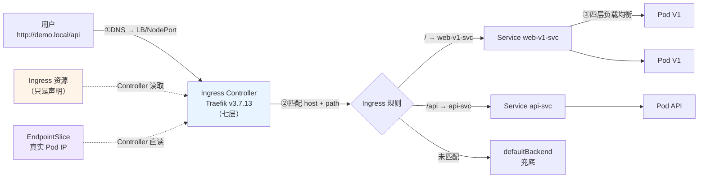

# 第 8 课：Ingress：七层路由与灰度发布

> 所属阶段：阶段 3《网络与服务暴露》｜ 水平：入门偏进阶 ｜ 本课知识点：Ingress 与 Controller 的分离、Ingress 规则与路径匹配、灰度发布与流量切分、ingress-nginx 退役与 Ingress 现状
> 故事情节：课 7 解决了**集群内**寻址，但 ClusterIP 集群外访问不到、NodePort 端口难管理、LoadBalancer 每个服务都要一个且很贵。这一课讲**集群外流量怎么进来** —— 以及一个你必须知道的现实：**这个领域的老大哥 ingress-nginx 已经在 2026 年 3 月退役了**

## 🎯 本课目标

- 理解"Ingress 只是一份声明，Controller 才干活"的分离设计
- 会配置基于 host/path 的路由规则，理解 pathType 的行为
- 会用加权方式做灰度发布，理解权重切分的实现与局限
- 说清 ingress-nginx 退役的时间线、影响与迁移判断

---

## 第一幕：起源与场景引入

> 🏛️ **起源**：**Ingress 从诞生起就带着"先天不足"**。
>
> 它 **2015 年随 k8s 1.1 引入**（那时还在 `extensions/v1beta1`，**1.19 才转正为 `networking.k8s.io/v1`**）。设计目标很朴素：给"**HTTP 流量进集群**"定一个**厂商中立**的 API。
>
> **但 k8s 自己做了一个反常的决定**：**官方只定义 API，不提供实现**。
>
> 你想用 Ingress？**自己去装一个 Controller** —— NGINX、Traefik、HAProxy、Contour、ALB…… 官方列了几十种。
>
> **这个"声明与实现分离"的初衷是好的**（避免绑定厂商），但**代价是**：所有高级功能（灰度、超时、重试、认证）**都只能靠各厂商自定义的 annotation 表达**。于是出现了著名的"**注解泥潭**"（annotation sprawl）—— 同一个"灰度 10% 流量"，NGINX 写 `nginx.ingress.kubernetes.io/canary-weight: "10"`，Traefik 写另一套，Contour 又是一套，**彼此完全不通用**。
>
> **结局在 2025 年到来**：
> - **2025-11-11**，k8s SIG Network 与**安全响应委员会**联合宣布 **ingress-nginx 退役**
> - **2026-01-29**，**指导委员会与安全响应委员会再次联合发声**，措辞极其严厉
> - **2026-03**，best-effort 维护结束，仓库归档为只读
>
> 官方原话值得记住：
>
> > "**退役后继续使用 Ingress NGINX，会让你和你的用户暴露在攻击之下。**"
> > "**没有任何替代方案是可以直接平替的。**"
> > "**现有部署不会坏 —— 所以除非你主动检查，否则你可能直到被入侵才知道自己受影响。**"
>
> 触发退役的直接原因包括 **CVE-2025-1974（IngressNightmare）** —— 一个**集群级**的严重漏洞，而当时**只有一两个人在业余时间维护**这个项目。
>
> （核查于 2026-09；来源：[Ingress NGINX Retirement](https://v1-34.docs.kubernetes.io/blog/2025/11/11/ingress-nginx-retirement)、[Steering & Security Response Committee 联合声明](https://kubernetes.io/blog/2026/01/29/ingress-nginx-statement/)）

🎬 **场景**：你的微服务跑起来了，现在要让用户从互联网访问。

**课 7 学的三种方式，在这个场景下全都不够用：**

| 方式 | 问题 |
|---|---|
| **ClusterIP** | **集群外根本访问不到** |
| **NodePort** | 能访问，但端口是 **30080** 这种，用户记不住；而且**节点挂了要换 IP** |
| **LoadBalancer** | 好用，但**每个服务一个 LB** —— 20 个微服务 = 20 个 LB = **20 份云账单** |

```
你有 20 个服务：
  user-service     → LB 1  → ¥
  order-service    → LB 2  → ¥
  payment-service  → LB 3  → ¥
  ...
  → 20 个公网 IP + 20 份 LB 费用 + 20 份 TLS 证书
```

**而且还有个更麻烦的问题**：这些服务要**按路径区分** —— `/api/user` 走用户服务，`/api/order` 走订单服务。**四层（L4）的 LoadBalancer 根本看不懂 URL**，它只认 IP 和端口。

> 💡 **这就是"四层 vs 七层"的分工**：
> - **四层（L4）**：只看 **IP + 端口**，不知道你在请求什么 URL
> - **七层（L7）**：能看懂 **HTTP**（域名、路径、Header、Cookie）
>
> **按 URL 分发流量，必须是七层的活。**

**k8s 的答案是 Ingress**：**一个七层入口，靠域名和路径把流量分给不同的 Service**。

```
                    ┌─ /api/user  → user-svc
互联网 → Ingress ───┼─ /api/order → order-svc
  (1个入口)         └─ /          → web-svc
                    只需 1 个 LB、1 个公网 IP
```

**但这个故事有个你必须知道的结局** —— 这个领域最常用的控制器，**已经在 2026 年 3 月退役了**。本课会在知识点 4 详细讲。

---

## 第二幕：认知冲突

> ❓ **问题**：Ingress 看起来就是个"配置文件"啊，为什么我 `kubectl apply` 了一个 Ingress，**服务还是访问不了**？

**因为你 apply 的只是一份"愿望清单"，没有人在执行它。**

这是 k8s 里**最反直觉**的设计之一，也是本课的核心：

```
你创建了一个 Pod          → kubelet 立刻去跑容器
你创建了一个 Deployment   → Deployment controller 立刻去建 ReplicaSet
你创建了一个 Service      → kube-proxy 立刻去写转发规则
你创建了一个 Ingress      → ??? 没人管你
                            ↑ 除非你装了 Controller
```

> 🔑 **一句话点破**：**Ingress 是"交通规则"，Controller 是"交警"。只贴规则不上交警，路口没人指挥，车照样乱开。**

**为什么 k8s 要这么设计？**

因为"七层路由"这件事**没有标准答案** —— NGINX、Envoy、HAProxy、云厂商的 ALB/CLB…… 各有优劣。k8s **不想绑定任何一个**，所以：

> **我只定义"你想怎么路由"，具体用什么软件实现，你自己选。**

> 💡 **这个套路在 k8s 里会反复出现** —— 阶段 4 的 **StorageClass**（我只定义"你要多大存储"，用什么存储系统你自己选）、课 9 的 **GatewayClass**（同一个模式）。**理解这一次，后面都通了。**

---

## 第三幕：层层揭示

### 知识点 1：Ingress 与 Controller 的分离

> 本知识点关键点：Ingress 只是声明 / Controller 才干活 / IngressClass 的作用 / 声明与实现分离

#### 一句话定义

**Ingress 是 k8s 提供的一个 API 对象，用来声明"外部 HTTP 流量该如何路由到集群内的 Service"；但 Ingress 本身不做任何事 —— 真正监听、转发流量的是独立安装的 Ingress Controller。两者的关联通过 `ingressClassName` 字段建立。**

#### 直觉建立（类比）

Ingress 和 Controller 的关系，就像**建筑设计图与施工队**：

```
设计图（Ingress）：这里开门、那里开窗、楼梯在东侧   ← 只是一张纸
施工队（Controller）：按图施工，真的把房子盖出来    ← 干活的人

只有图纸没有施工队 → 房子永远不存在
换一个施工队       → 同一张图纸，盖出来的质量/风格可能不同
```

> 💡 **更精确的比喻**：Ingress 是**菜谱**，Controller 是**厨师**。**菜谱不会自己做菜**，而且**同一个菜谱，不同的厨师做出来味道不一样**（所以 NGINX 的注解 Traefik 不认）。

#### 核心原理

**一、完整链路：从互联网到 Pod。**

```
① 用户访问 http://demo.local/api
        ↓ DNS 解析到负载均衡器（或 NodePort）
② 外部负载均衡器 / NodePort
        ↓ 转发到 Ingress Controller 的 Service
③ Ingress Controller Pod（如 Traefik、NGINX）
        ↓ 读 Ingress 规则，按 host/path 匹配
④ 匹配到 backend 的 Service
        ↓ Service 的 ClusterIP + kube-proxy 规则（课 7）
⑤ 最终 Pod
```

> 🎯 **注意这条链把课 7 和本课串起来了**：**Ingress 不是替代 Service，而是站在 Service 前面**。Ingress 负责"**进哪个 Service**"，Service 负责"**进哪个 Pod**"。

```
用户 → Ingress（七层：按域名/路径选 Service）→ Service（四层：负载均衡到 Pod）→ Pod
       ↑ 本课                                  ↑ 课 7
```

**二、IngressClass：告诉 k8s 用哪个 Controller。**

集群里可能装了多个 Controller（NGINX 用于对外、Traefik 用于对内），Ingress 怎么知道该被谁处理？

```yaml
apiVersion: networking.k8s.io/v1
kind: Ingress
metadata:
  name: demo
spec:
  ingressClassName: traefik    # ← 指定由哪个 Controller 处理
  rules:
  - host: demo.local
    ...
```

```bash
kubectl get ingressclass
# 输出（本机实测）：
# NAME      CONTROLLER                      PARAMETERS   AGE
# traefik   traefik.io/ingress-controller   <none>       22s
```

> ⚠️ **不写 `ingressClassName` 会怎样？** 取决于是否有**默认 IngressClass**（带 `ingressclass.kubernetes.io/is-default-class: "true"` 注解）。有则用它，**没有则没有 Controller 认领，规则不生效**。

**三、Controller 是怎么工作的（调谐循环，呼应课 2）。**

Controller 做的事，正是**课 2 学的调谐循环**：

```
持续 watch Ingress、Service、EndpointSlice 的变化
        ↓
规则变了？重新生成配置文件（如 nginx.conf）或更新内部路由表
        ↓
热加载，不重启
```

> 🔗 **呼应课 2**：**Ingress Controller 是"声明式 API + 调谐循环"最直观的例子之一** —— 你只声明结果，Controller 持续把现实调整到那个结果。

#### 示例演示

**验证一：关键实验 —— 删掉 Controller，Ingress 还在吗？**

```bash
# 先看有 Controller 时
docker exec k8s-c1-control-plane sh -c "curl -s -o /dev/null -w 'HTTP=%{http_code}' -H 'Host: demo.local' http://localhost:30081/"
# 输出（本机实测）：HTTP=200

# 卸载 Controller
helm uninstall traefik -n traefik
kubectl delete ns traefik
# 输出（本机实测）：release "traefik" uninstalled

# Ingress 资源还在吗？
kubectl get ingress demo-ingress --no-headers
# 输出（本机实测）：
# demo-ingress   traefik   demo.local   80   25s
#   ↑ 还在！etcd 里的声明没被删除

# IngressClass 呢？
kubectl get ingressclass
# 输出（本机实测）：No resources found
#   ↑ 随 Controller 一起没了

# 再访问
docker exec k8s-c1-control-plane sh -c "curl -s -o /dev/null -w 'HTTP=%{http_code}' --max-time 5 -H 'Host: demo.local' http://localhost:30081/"
# 输出（本机实测）：HTTP=000
#   ↑ 000 = 连接失败（没有任何进程在监听 30081）

# 装回 Controller
helm upgrade --install traefik traefik/traefik --namespace traefik --create-namespace
# 输出（本机实测）：traefik with docker.io/traefik:v3.7.13 has been deployed successfully

docker exec k8s-c1-control-plane sh -c "curl -s -H 'Host: demo.local' http://localhost:30081/"
# 输出（本机实测）：V1
#   ↑ 恢复
```

> 🎯 **这个实验完美证明了"分离"**：
>
> | 操作 | Ingress 资源 | 实际访问 |
> |---|---|---|
> | 有 Controller | 存在 | ✅ 200 |
> | **删 Controller** | **仍然存在** | ❌ **000（连接失败）** |
> | 重装 Controller | 存在 | ✅ 恢复 |
>
> **Ingress 资源自始至终没变过，变的是"有没有人执行它"。**

**验证二：Ingress 详情里能看到 Controller 认领的后端。**

```bash
kubectl describe ingress demo-ingress
# 输出（本机实测，节选）：
# Rules:
#   Host        Path  Backends
#   ----        ----  --------
#   demo.local
#               /      web-v1-svc:80 (10.244.0.168:80,10.244.0.167:80)
#               /api   api-svc:80 (10.244.0.171:80)
```

> 💡 **Backends 里显示的是真实 Pod IP** —— 这正是课 7 学的 **EndpointSlice**。
>
> **Ingress Controller 直接读 EndpointSlice，绕过 ClusterIP 直连 Pod** —— 这样能自己做更精细的负载均衡（这是 Controller 的常见优化）。

#### 常见误区

1. **"apply 了 Ingress 就能访问了"** → **必须装 Controller**，否则规则不生效。
2. **"Ingress 是 Service 的一种"** → 不是。Ingress **在 Service 前面**，是**七层**；Service 是**四层**。
3. **"Ingress 能替代 Service"** → **不能**。Ingress 的 backend **必须是 Service**。
4. **"删了 Controller，Ingress 也会跟着删"** → 不会（实测已证，资源仍在）。
5. **"ingressClassName 可以不写"** → 可以，但**依赖默认 IngressClass** 存在，否则无人认领。
6. **"所有 Controller 的行为都一样"** → **完全不一样**（知识点 3 会用实测证明注解不可移植）。

#### 一句话记住

> **Ingress 是设计图，Controller 是施工队 —— 没有施工队，图纸永远只是纸。**

#### 官方文档

- [Kubernetes 官方文档 · Ingress](https://kubernetes.io/zh-cn/docs/concepts/services-networking/ingress/)
- [Kubernetes 官方文档 · Ingress 控制器](https://kubernetes.io/zh-cn/docs/concepts/services-networking/ingress-controllers/)

---

### 知识点 2：Ingress 规则与路径匹配

> 本知识点关键点：host + path 双维度 / pathType 三种取值 / defaultBackend 兜底 / 路径不改写

#### 一句话定义

**Ingress 规则由 `rules` 组成，每条规则按 `host`（域名）+ `path`（路径）两个维度匹配请求，转发到指定的 Service；`pathType` 决定路径的匹配方式（Exact / Prefix / ImplementationSpecific）。**

#### 直觉建立（类比）

Ingress 规则就像**公司的前台分诊台**：

```
访客说："我找技术部的张三"
        ↓
前台查表：
  「技术部」+「张三」→ 3 楼东侧
   ↑ host      ↑ path      ↑ backend
```

> 💡 **两个维度缺一不可**：只说"找张三"（path）—— 可能多个部门都有张三；只说"技术部"（host）—— 不知道找谁。**host 缩小范围，path 精确定位。**

#### 核心原理

**一、规则结构。**

```yaml
spec:
  rules:
  - host: demo.local          # ① 域名（可省略 = 匹配所有域名）
    http:
      paths:
      - path: /api            # ② 路径
        pathType: Prefix      # ③ 匹配方式
        backend:
          service:
            name: api-svc     # ④ 后端 Service
            port:
              number: 80
```

**二、`pathType` 的三种取值（重点）。**

| 取值 | 含义 | `/api` 规则下，哪些请求命中 |
|---|---|---|
| **Exact** | **精确匹配** | 只有 `/api`（**不匹配** `/api/`、`/api/x`） |
| **Prefix** | **前缀匹配**（按 `/` 分段） | `/api`、`/api/`、`/api/x`（**不匹配** `/apixxx`） |
| **ImplementationSpecific** | **由 Controller 自己决定** | 不保证，可能是正则 |

> ⚠️ **Prefix 的关键细节**：它是**按路径分段**匹配的，不是字符串前缀。
>
> ```
> path: /api, pathType: Prefix
>   /api       → ✅ 命中
>   /api/      → ✅ 命中
>   /api/x     → ✅ 命中
>   /apixyz    → ❌ 不命中（不是独立的一段）
> ```
>
> 这个"按段匹配"的规则**避免了 `/api` 误吞 `/apixxx`** —— 如果按字符串前缀匹配就会出这个 bug。

**三、`defaultBackend`：兜底。**

没有规则匹配时，转发到这里：

```yaml
spec:
  defaultBackend:
    service:
      name: web-v1-svc
      port:
        number: 80
```

**四、重要：Ingress 默认不改写路径。**

这是个高频踩坑点：

```
请求 /api/user，规则 path: /api → api-svc
实际转发给 api-svc 的路径是：/api/user   ← 原样转发，没有去掉 /api
```

如果你的后端应用期望收到 `/user`，就**必须自己做路径改写**（靠 Controller 特定的 annotation，如 NGINX 的 `rewrite-target`）—— **这又是注解不可移植的一个例子**。

#### 示例演示

**验证一：host + path 双维度路由。**

```bash
cat <<'YAMLEOF' | kubectl apply -f -
apiVersion: networking.k8s.io/v1
kind: Ingress
metadata:
  name: demo-ingress
spec:
  ingressClassName: traefik
  rules:
  - host: demo.local
    http:
      paths:
      - path: /
        pathType: Prefix
        backend:
          service:
            name: web-v1-svc
            port:
              number: 80
      - path: /api
        pathType: Prefix
        backend:
          service:
            name: api-svc
            port:
              number: 80
YAMLEOF

kubectl get ingress demo-ingress --no-headers
# 输出（本机实测）：
# demo-ingress   traefik   demo.local   80   0s
#   ↑ ADDRESS 列为空 —— 本机是 kind 集群，没有云厂商 LB 分配外部 IP
```

**验证二：按 host 区分（不匹配则 404）。**

```bash
docker exec k8s-c1-control-plane sh -c "curl -s -o /dev/null -w 'HTTP=%{http_code}' -H 'Host: demo.local' http://localhost:30081/"
# 输出（本机实测）：HTTP=200

docker exec k8s-c1-control-plane sh -c "curl -s -o /dev/null -w 'HTTP=%{http_code}' -H 'Host: other.local' http://localhost:30081/"
# 输出（本机实测）：HTTP=404
#   ↑ host 不匹配 → 404
```

**验证三：Prefix 匹配与路径不改写（关键实验）。**

```bash
# 直连 Service 作为对照
kubectl exec t2 -- wget -qO- --timeout=3 http://echo-svc/api
# 输出（本机实测）：API-OK

kubectl exec t2 -- wget -qO- --timeout=3 http://echo-svc/api/sub
# 输出（本机实测）：wget: server returned error: HTTP/1.1 404 Not Found
#   ↑ 应用自身对 /api/sub 返回 404 —— 这是 nginx 容器内没有该路径，不是 Ingress 的问题
```

```bash
# 通过只有 /api 规则的 Ingress 访问
docker exec k8s-c1-control-plane sh -c "curl -s -H 'Host: echoapi.local' http://localhost:30081/api/"
# 输出（本机实测）：API-OK

docker exec k8s-c1-control-plane sh -c "curl -s -o /dev/null -w '%{http_code}' -H 'Host: echoapi.local' http://localhost:30081/"
# 输出（本机实测）：404
#   ↑ / 没有规则 → 404（因为没有 defaultBackend）
```

> 🎯 **排障方法论（很重要）**：遇到 Ingress 返回 404，**先绕过 Ingress 直连 Service 做对照**，确认是"**路由没通**"还是"**应用本身没这个路径**"。本课实测中，`/api/sub` 的 404 就是**应用内容问题**，与 Ingress 无关。

**验证四：defaultBackend 兜底。**

```bash
cat <<'YAMLEOF' | kubectl apply -f -
apiVersion: networking.k8s.io/v1
kind: Ingress
metadata:
  name: default-backend
spec:
  ingressClassName: traefik
  defaultBackend:
    service:
      name: web-v1-svc
      port:
        number: 80
YAMLEOF

docker exec k8s-c1-control-plane sh -c "curl -s -H 'Host: nomatch.xyz' http://localhost:30081/"
# 输出（本机实测）：V1
#   ↑ 任意未匹配的 host 都兜底到 web-v1-svc
```

**验证五：多个 Ingress 共存，按 host 互不干扰。**

```bash
kubectl get ingress --no-headers -o custom-columns='NAME:.metadata.name,HOST:.spec.rules[0].host'
# 输出（本机实测）：
# canary-nginx-style   canary-ng.local
# demo-ingress         demo.local
# echo-api-only        echoapi.local
# pathapp-ing          path.local

# 逐个访问
# demo.local    -> 200
# echoapi.local -> 404（该 Ingress 只配了 /api，/ 无规则）
# path.local    -> 200
# canary.local  -> 200
```

#### 常见误区

1. **"Prefix 是字符串前缀匹配"** → 是**按 `/` 分段**匹配（`/api` 不匹配 `/apixyz`）。
2. **"Ingress 会自动去掉 path 前缀"** → **不会**，原样转发（需要改写得靠 Controller 特定配置）。
3. **"404 一定是 Ingress 配错了"** → 不一定，**先直连 Service 做对照**（实测已证）。
4. **"ADDRESS 为空是异常"** → 在**无云厂商 LB** 的环境（如 kind）**正常**，需通过 NodePort 或端口转发访问。
5. **"一个集群只能有一个 Ingress"** → 可以有很多个，按 host 区分（实测 4 个共存）。
6. **"不写 host 就匹配所有域名"** → 对，但要注意它会**吃掉所有未匹配的流量**。

#### 一句话记住

> **host 缩小范围、path 精确定位；Prefix 按段匹配不改写路径；404 先直连 Service 做对照再下结论。**

#### 官方文档

- [Kubernetes 官方文档 · Ingress](https://kubernetes.io/zh-cn/docs/concepts/services-networking/ingress/)

---

### 知识点 3：灰度发布与流量切分

> 本知识点关键点：原生 Ingress 不支持权重 / 靠 Controller 扩展实现 / 注解不可移植 / 平滑加权

#### 一句话定义

**灰度发布（canary release）是指让新版本先承接一小部分流量，验证无误后再逐步放量。原生 Ingress API 不支持按权重切分流量** —— 必须依赖各 Controller 的扩展机制（NGINX 用 canary 注解、Traefik 用 TraefikService CRD），**这些方案彼此不通用**。

#### 直觉建立（类比）

灰度发布就像**新菜试卖**：

```
老菜（V1）：正常供应
新菜（V2）：先给 10% 的桌位试吃
  ↓ 客人反馈好 → 提到 50% → 100%
  ↓ 客人投诉   → 立刻撤回，只有 10% 的人受影响
```

> 💡 **为什么叫 canary（金丝雀）**：源于**矿工带金丝雀下矿井** —— 有毒气时鸟先死，**用最小代价预警**。
>
> **灰度就是拿一小部分真实用户当"金丝雀"**。

#### 核心原理

**一、原生 Ingress 的能力边界（重要）。**

```
Ingress API 能表达什么：
  ✅ 按 host 路由
  ✅ 按 path 路由
  ❌ 按权重分流        ← 不支持！
  ❌ 按 Header/ Cookie 分流  ← 不支持！
  ❌ 超时、重试、熔断    ← 不支持！
```

> 🔑 **这是 Ingress API 最大的短板**，也是它被 Gateway API 取代的**根本原因**之一。
>
> **所有高级功能都只能靠 annotation 表达** —— 于是同一个需求，每个 Controller 一套写法，**完全不可移植**。

**二、两种实现方式对比。**

| 方式 | 实现 | 可移植性 |
|---|---|---|
| **NGINX canary 注解** | 建**两个** Ingress，第二个加 `canary: "true"` + `canary-weight` | ❌ 仅 NGINX |
| **Traefik TraefikService** | 用 CRD 定义 `weighted` 服务，IngressRoute 引用 | ❌ 仅 Traefik |
| **Gateway API HTTPRoute** | **原生支持 `weight` 字段** | ✅ **跨实现通用**（课 9） |

> 🎯 **第三种才是正解** —— 这正是课 9 要讲的。**Ingress 的灰度是"补丁"，Gateway API 的灰度是"设计"。**

**三、权重是怎么落地的（平滑加权轮询）。**

Controller 内部通常用**加权轮询**算法。实测中 Traefik 的表现**非常精确**：

```
配置 90:10 → 200 次请求 → V1=180 (90%)  V2=20 (10%)
改成 50:50 → 200 次请求 → V1=100 (50%)  V2=100 (50%)
```

#### 示例演示

**验证一：用 Traefik 的 TraefikService 做加权分流。**

```bash
cat <<'YAMLEOF' | kubectl apply -f -
apiVersion: traefik.io/v1alpha1
kind: TraefikService
metadata:
  name: weighted-svc
spec:
  weighted:
    services:
    - name: web-v1-svc
      port: 80
      weight: 90
    - name: web-v2-svc
      port: 80
      weight: 10
---
apiVersion: traefik.io/v1alpha1
kind: IngressRoute
metadata:
  name: canary-route
spec:
  entryPoints:
  - web
  routes:
  - match: Host(`canary.local`)
    kind: Rule
    services:
    - name: weighted-svc
      kind: TraefikService
YAMLEOF
# 输出（本机实测）：
# traefikservice.traefik.io/weighted-svc created
# ingressroute.traefik.io/canary-route created
```

```bash
# 打 200 次请求统计分布
# 输出（本机实测）：
#   V1 = 180
#   V2 = 20
#   有效样本 = 200
#   V1 占比 = 90%      V2 占比 = 10%
#   （配置 90:10）
```

**验证二：改成 50:50，分布随之变化。**

```bash
kubectl patch traefikservice weighted-svc --type=merge -p \
  '{"spec":{"weighted":{"services":[{"name":"web-v1-svc","port":80,"weight":50},{"name":"web-v2-svc","port":80,"weight":50}]}}}'
# 输出（本机实测）：traefikservice.traefik.io/weighted-svc patched

# 再打 200 次
# 输出（本机实测）：
#   V1 = 100   V2 = 100   有效样本 = 200
#   V1 占比 = 50%   V2 占比 = 50%
#   （配置 50:50）
```

> 🎯 **这就是灰度发布的完整流程**：**10% → 观察指标 → 50% → 观察 → 100%**。全程**只改一个权重数字**，不用重启、不用改应用。

**验证三：关键对照 —— NGINX 的 canary 注解在 Traefik 下失效。**

```bash
cat <<'YAMLEOF' | kubectl apply -f -
apiVersion: networking.k8s.io/v1
kind: Ingress
metadata:
  name: canary-nginx-style
  annotations:
    nginx.ingress.kubernetes.io/canary: "true"
    nginx.ingress.kubernetes.io/canary-weight: "10"
spec:
  ingressClassName: traefik
  rules:
  - host: canary-ng.local
    http:
      paths:
      - path: /
        pathType: Prefix
        backend:
          service:
            name: web-v2-svc
            port:
              number: 80
YAMLEOF

docker exec k8s-c1-control-plane sh -c "curl -s -H 'Host: canary-ng.local' http://localhost:30081/"
# 输出（本机实测）：V2
#   ↑ 全部到 V2 —— 权重注解被 Traefik 完全忽略，没有做 90/10 切分
```

> ⚠️ **这个实验极其重要**：它证明了**注解不可移植**。
>
> `nginx.ingress.kubernetes.io/*` 这些注解**只对 NGINX Controller 有效**。换到 Traefik，它们就是**一堆无意义的字符串** —— **不报错、不警告，直接静默忽略**。
>
> **这就是"注解泥潭"的代价**：**迁移 Controller = 重写所有注解**，而且**没有工具能帮你发现漏改**（因为它不报错）。

#### 常见误区

1. **"Ingress 原生支持权重分流"** → **不支持**，必须靠 Controller 扩展。
2. **"canary 注解换 Controller 也能用"** → **不能**（实测：Traefik 静默忽略）。
3. **"灰度只需要改权重"** → 权重只是手段，**关键是配套的监控指标**（错误率、延迟），否则灰度等于盲发。
4. **"权重是精确的"** → 是**概率性的**（200 次样本下精确，但 10 次请求可能全是 V1）。
5. **"灰度 = 蓝绿部署"** → 不同。灰度是**按比例**；蓝绿是**整体切换**（要么全老，要么全新）。
6. **"两个版本的 Service 名可以一样"** → 不行，要**两个独立的 Service**（`web-v1-svc` / `web-v2-svc`）。

#### 一句话记住

> **灰度 = 用小部分真实流量做金丝雀；Ingress 原生不支持权重，靠 Controller 扩展实现 —— 而注解不通用，这正是 Gateway API 要解决的问题。**

#### 官方文档

- [Kubernetes 官方文档 · Ingress](https://kubernetes.io/zh-cn/docs/concepts/services-networking/ingress/)

---

### 知识点 4：ingress-nginx 退役与 Ingress 现状

> 本知识点关键点：退役的是控制器不是 API / 时间线 / 影响面 / 迁移判断

#### 一句话定义

**2026 年 3 月，社区维护的 Ingress Controller `kubernetes/ingress-nginx` 正式退役（EOL），此后不再有安全补丁；但 Ingress API 本身仍受支持（只是功能冻结）。受影响的是约 50% 的云原生环境，必须评估并规划迁移。**

#### 直觉建立（类比）

这次退役最容易被误解，用一个比喻说清：

```
"福特某款车型停产了"
  ≠ "汽车这个品类消失了"
  ≠ "所有福特车都不能开了"

同理：
"ingress-nginx 这个控制器退役了"
  ≠ "Ingress API 被废弃了"
  ≠ "你现有的集群会立刻坏掉"
```

> 💡 **真实的危险不是"立刻不能用"，而是"**静静地变得不安全**"** —— 官方原话：**"除非你主动检查，否则你可能直到被入侵才知道自己受影响。"**

#### 核心原理

**一、必须分清的四个概念（最容易混淆）。**

| 名称 | 是什么 | 是否退役 |
|---|---|---|
| **`kubernetes/ingress-nginx`** | **社区维护**的 NGINX Ingress 控制器 | ✅ **已退役（2026-03）** |
| **`nginxinc/kubernetes-ingress`** | **F5/NGINX 公司**维护的控制器 | ❌ **不受影响**，持续维护 |
| **Ingress API**（`networking.k8s.io/v1`） | k8s 的 API 对象 | ❌ **仍受支持**，但**功能冻结** |
| **NGINX Web 服务器** | 那个反向代理软件本身 | ❌ **完全不受影响** |

> ⚠️ **最常见的误解**：把"ingress-nginx 退役"理解成"Ingress 不能用了"。**不是**。Ingress API 会继续存在，只是**不再有新特性** —— 新特性都进 Gateway API。

**二、时间线。**

| 时间 | 事件 |
|---|---|
| **2025-11-11** | SIG Network + 安全响应委员会 **宣布退役** |
| **2026-01-29** | **指导委员会 + 安全响应委员会联合声明**，措辞严厉 |
| **2026-03** | best-effort 维护结束，**仓库归档为只读** |
| 此后 | **无 bugfix、无安全补丁、无更新** |

**三、为什么会走到这一步（三个原因）。**

1. **维护者枯竭**：多年只有 **1-2 人**在业余时间维护，而它承载着约 **50%** 云原生环境的流量
2. **技术债压顶**：曾经引以为傲的灵活性（尤其是 **snippets 注解可注入任意 NGINX 配置**），后来被认定为**严重安全隐患**
3. **CVE-2025-1974（IngressNightmare）**：一个**集群级**严重漏洞，让"没人维护"这个问题再也无法回避

**四、三条迁移路径。**

| 路径 | 做法 | 适合 |
|---|---|---|
| **A. 平替（lift-and-shift）** | 换另一个仍维护的 Ingress 控制器（Contour、Traefik、HAProxy、F5 NGINX） | **时间紧**，先止血 |
| **B. 现代化（推荐）** | 迁移到 **Gateway API** | 长期主义，一次到位 |
| **C. 商业支持** | 购买第三方安全支持（如 HeroDevs、Chainguard fork） | 需要**过渡期** |

> 💡 **路径 A 的隐藏成本**：所有 `nginx.ingress.kubernetes.io/*` 注解**都要重写**（知识点 3 的实测已经证明注解不通用）。**所以 A 是"缓兵之计"，不是终点** —— 你大概率还是要再迁一次。

#### 示例演示

**验证一：检查你的集群是否受影响（官方给的命令）。**

```bash
kubectl get pods --all-namespaces --selector app.kubernetes.io/name=ingress-nginx
# 输出（本机实测）：No resources found
#   ↑ 本机未使用 ingress-nginx（本课用的是 Traefik）
```

> 🎯 **这是官方推荐的自查命令**，需要集群管理员权限。**有输出 = 你受影响 = 需要规划迁移**。

**验证二：本课集群用的是什么。**

```bash
kubectl get ingressclass -o custom-columns='NAME:.metadata.name,CONTROLLER:.spec.controller' --no-headers
# 输出（本机实测）：
# traefik   traefik.io/ingress-controller
```

> 💡 **本课刻意选择 Traefik 而非 ingress-nginx** —— 因为**退役项目不应作为推荐实践教授**。Traefik 是当前活跃维护的控制器之一，且**同时支持 Ingress API 和 Gateway API**，正好可以作为课 9 的过渡。

**验证三：Ingress API 仍在（只是功能冻结）。**

```bash
kubectl api-resources --api-group=networking.k8s.io
# 输出（本机 v1.34.0 实测，节选）：
# NAME              SHORTNAMES   APIVERSION             NAMESPACED   KIND
# ingressclasses                 networking.k8s.io/v1   false        IngressClass
# ingresses         ing          networking.k8s.io/v1   true         Ingress
# networkpolicies   netpol       networking.k8s.io/v1   true         NetworkPolicy
```

> ✅ **Ingress API 依然可用，本课的全部实验都基于它** —— 这证实了"退役的是控制器，不是 API"。

#### 常见误区

1. **"Ingress API 被废弃了"** → **没有**。仍受支持，只是**功能冻结**。
2. **"我的集群会立刻坏掉"** → **不会**。现有部署继续工作，**风险是未来的漏洞无人修**。
3. **"所有 NGINX Ingress 都退役了"** → **只有 `kubernetes/ingress-nginx`**。**F5 的 `nginxinc/kubernetes-ingress` 不受影响**。
4. **"换个控制器就行，YAML 不用改"** → **不行**，注解全部要重写（实测已证）。
5. **"我不用 ingress-nginx 就跟我无关"** → 还应检查 **Helm chart、Terraform、CI/CD 模板**里是否残留。
6. **"Gateway API 是 Ingress 的别名"** → 不是，是**重新设计的新标准**（课 9）。

#### 一句话记住

> **退役的是「控制器」不是「API」—— 现有部署不会坏，但漏洞不再有补丁；先自查，再选平替或 Gateway API。**

#### 官方文档

- [Ingress NGINX Retirement: What You Need to Know](https://v1-34.docs.kubernetes.io/blog/2025/11/11/ingress-nginx-retirement)
- [Steering & Security Response Committee 联合声明](https://kubernetes.io/blog/2026/01/29/ingress-nginx-statement/)
- [Kubernetes 官方文档 · Ingress 控制器（替代方案列表）](https://kubernetes.io/zh-cn/docs/concepts/services-networking/ingress-controllers/)

---

## 第四幕：实操验证

把四个知识点串成一条完整链路：**装 Controller → 配路由 → 做灰度 → 查退役风险**。

```bash
kubectl create ns lesson08
kubectl config set-context --current --namespace=lesson08

# ① 安装 Ingress Controller（本课用 Traefik，活跃维护且支持 Gateway API）
helm repo add traefik https://traefik.github.io/charts
helm repo update traefik
helm upgrade --install traefik traefik/traefik \
  --namespace traefik --create-namespace \
  --set ports.web.nodePort=30081 \
  --timeout 300s
# 输出（本机实测）：
# traefik with docker.io/traefik:v3.7.13 has been deployed successfully on traefik namespace!

kubectl get ingressclass
# 预期输出（本机实测）：
# NAME      CONTROLLER                      PARAMETERS   AGE
# traefik   traefik.io/ingress-controller   <none>       22s
```

```bash
# ② 部署两个版本的应用 + Service
cat > /tmp/l8-verify.yaml <<'YAMLEOF'
apiVersion: apps/v1
kind: Deployment
metadata:
  name: web-v1
spec:
  replicas: 2
  selector:
    matchLabels:
      app: web-v1
  template:
    metadata:
      labels:
        app: web-v1
    spec:
      containers:
      - name: nginx
        image: nginx:alpine
        command: ["/bin/sh","-c"]
        args: ["echo 'V1' > /usr/share/nginx/html/index.html && nginx -g 'daemon off;'"]
        ports:
        - containerPort: 80
---
apiVersion: v1
kind: Service
metadata:
  name: web-v1-svc
spec:
  selector:
    app: web-v1
  ports:
  - port: 80
    targetPort: 80
---
apiVersion: apps/v1
kind: Deployment
metadata:
  name: web-v2
spec:
  replicas: 2
  selector:
    matchLabels:
      app: web-v2
  template:
    metadata:
      labels:
        app: web-v2
    spec:
      containers:
      - name: nginx
        image: nginx:alpine
        command: ["/bin/sh","-c"]
        args: ["echo 'V2' > /usr/share/nginx/html/index.html && nginx -g 'daemon off;'"]
        ports:
        - containerPort: 80
---
apiVersion: v1
kind: Service
metadata:
  name: web-v2-svc
spec:
  selector:
    app: web-v2
  ports:
  - port: 80
    targetPort: 80
YAMLEOF

kubectl apply -f /tmp/l8-verify.yaml
kubectl rollout status deployment/web-v1 --timeout=180s
kubectl rollout status deployment/web-v2 --timeout=180s
# 预期输出（本机实测）：
# deployment "web-v1" successfully rolled out
# deployment "web-v2" successfully rolled out
```

```bash
# ③ 验证 host + path 路由（知识点 2）
cat <<'YAMLEOF' | kubectl apply -f -
apiVersion: networking.k8s.io/v1
kind: Ingress
metadata:
  name: demo-ingress
spec:
  ingressClassName: traefik
  rules:
  - host: demo.local
    http:
      paths:
      - path: /
        pathType: Prefix
        backend:
          service:
            name: web-v1-svc
            port:
              number: 80
YAMLEOF
# 输出：ingress.networking.k8s.io/demo-ingress created

docker exec k8s-c1-control-plane sh -c "curl -s -H 'Host: demo.local' http://localhost:30081/"
# 预期输出（本机实测）：V1

docker exec k8s-c1-control-plane sh -c "curl -s -o /dev/null -w '%{http_code}' -H 'Host: other.local' http://localhost:30081/"
# 预期输出（本机实测）：404
#   ↑ host 不匹配
```

```bash
# ④ 验证 Controller 分离（知识点 1，关键实验）
helm uninstall traefik -n traefik
# 输出（本机实测）：release "traefik" uninstalled

kubectl get ingress demo-ingress --no-headers
# 预期输出（本机实测）：demo-ingress   traefik   demo.local   80   25s
#   ↑ Ingress 资源还在！

docker exec k8s-c1-control-plane sh -c "curl -s -o /dev/null -w '%{http_code}' --max-time 5 -H 'Host: demo.local' http://localhost:30081/"
# 预期输出（本机实测）：000
#   ↑ 连接失败 —— 没有 Controller 执行规则

helm upgrade --install traefik traefik/traefik --namespace traefik --create-namespace --set ports.web.nodePort=30081
docker exec k8s-c1-control-plane sh -c "curl -s -H 'Host: demo.local' http://localhost:30081/"
# 预期输出（本机实测）：V1
#   ↑ 恢复
```

```bash
# ⑤ 验证灰度权重（知识点 3）
cat <<'YAMLEOF' | kubectl apply -f -
apiVersion: traefik.io/v1alpha1
kind: TraefikService
metadata:
  name: weighted-svc
spec:
  weighted:
    services:
    - name: web-v1-svc
      port: 80
      weight: 90
    - name: web-v2-svc
      port: 80
      weight: 10
---
apiVersion: traefik.io/v1alpha1
kind: IngressRoute
metadata:
  name: canary-route
spec:
  entryPoints:
  - web
  routes:
  - match: Host(`canary.local`)
    kind: Rule
    services:
    - name: weighted-svc
      kind: TraefikService
YAMLEOF

for i in $(seq 1 200); do
  docker exec k8s-c1-control-plane sh -c "curl -s --max-time 3 -H 'Host: canary.local' http://localhost:30081/"
done | sort | uniq -c
# 预期输出（本机实测）：
#     180 V1
#      20 V2
#   ↑ 90% / 10%，与配置一致
```

```bash
# ⑥ 验证注解不可移植（知识点 3 对照）
cat <<'YAMLEOF' | kubectl apply -f -
apiVersion: networking.k8s.io/v1
kind: Ingress
metadata:
  name: canary-nginx-style
  annotations:
    nginx.ingress.kubernetes.io/canary: "true"
    nginx.ingress.kubernetes.io/canary-weight: "10"
spec:
  ingressClassName: traefik
  rules:
  - host: canary-ng.local
    http:
      paths:
      - path: /
        pathType: Prefix
        backend:
          service:
            name: web-v2-svc
            port:
              number: 80
YAMLEOF

docker exec k8s-c1-control-plane sh -c "curl -s -H 'Host: canary-ng.local' http://localhost:30081/"
# 预期输出（本机实测）：V2
#   ↑ 注解被 Traefik 静默忽略，全部到 V2
```

```bash
# ⑦ 自查是否受 ingress-nginx 退役影响（知识点 4）
kubectl get pods --all-namespaces --selector app.kubernetes.io/name=ingress-nginx
# 预期输出（本机实测）：No resources found
#   ↑ 无输出 = 未使用；有输出 = 需规划迁移
```

> ✅ **回扣场景**：回到第一幕的三个困境 ——
>
> 1. **ClusterIP 集群外访问不到** → Ingress 提供**七层入口**（实测：通过 Traefik NodePort 从节点访问成功）
> 2. **NodePort 端口难管理** → Ingress **一个入口**承载多个服务，按 host/path 区分
> 3. **LoadBalancer 每个服务一个** → **一个 Ingress 对多个 Service**（实测：4 个 Ingress 共存，各自路由到不同后端）
>
> **四层与七层的分工**（本课的核心）：
>
> ```
> 用户请求 http://demo.local/api
>    ↓
> Ingress（七层）→ 看懂 host + path → 选 Service     ← 本课
>    ↓
> Service（四层）→ ClusterIP + kube-proxy → 选 Pod    ← 课 7
>    ↓
> Pod
> ```
>
> **Ingress 不替代 Service，而是站在它前面** —— Ingress 决定"**进哪个 Service**"，Service 决定"**进哪个 Pod**"。

**清理**：

```bash
kubectl delete ns lesson08 --ignore-not-found
helm uninstall traefik -n traefik --ignore-not-found 2>/dev/null
kubectl delete ns traefik --ignore-not-found
rm -f /tmp/l8-verify.yaml
```

---

## 第五幕：体系收束

> 📍 **本课在阶段 3 中的位置**：阶段 3《网络与服务暴露》回答"**流量怎么找到你的应用**"。课 7 解决**集群内寻址**，本课解决**集群外进入**。
>
> **这一课真正的价值，是让你理解 k8s 的一个通用设计套路**：
>
> ```
> Ingress（声明）      ←→  Ingress Controller（实现）
> StorageClass（声明） ←→  CSI Driver（实现）        ← 阶段 4 会见到
> GatewayClass（声明） ←→  Gateway 实现（实现）      ← 课 9 会见到
> ```
>
> 🔑 **「声明与实现分离」**：k8s **只定义接口，不绑定实现**，把选择权交给用户。
>
> **好处**是**不被厂商锁定**；**代价**是**同一功能在不同实现下写法不同**（本课实测：NGINX 的 canary 注解在 Traefik 下被静默忽略）。
>
> **理解了这个权衡，你就明白了 Gateway API 为什么要重新设计** —— 它把"**高级功能**"（权重、header 匹配、重试）**收进标准字段**，而不是丢给各家注解。**这是从"能做某事"到"标准地做某事"的进步。**
>
> 🔗 **与前面几课的呼应**：
> - **课 2（声明式 API 与调谐循环）**：Ingress Controller 是**调谐循环的又一实例** —— 你声明规则，Controller 持续把实际配置调整到目标状态。
> - **课 7（Service 与 CoreDNS）**：Ingress **不是替代 Service**，而是**站在 Service 前面**；Ingress Controller 直接读 **EndpointSlice** 绕过 ClusterIP 直连 Pod（本课 `describe` 输出中 Backends 显示的就是真实 Pod IP）。
> - **课 5（Deployment）**：灰度发布依赖**两个 Deployment 并存**（`web-v1` / `web-v2`），这与**滚动更新**是两种不同的发布策略 —— 滚动更新是**逐步替换**，灰度是**按比例分流**。
>
> 🔗 **下一步预告**：
> 1. **Ingress 的这些问题怎么解决？** → **课 9（Gateway API：下一代入口标准）** —— 三层模型（GatewayClass / Gateway / HTTPRoute）、**原生支持权重**、角色分离
> 2. **流量进来之后，Pod 之间要不要限制互访？** → **课 10（NetworkPolicy）**
>
> ⚠️ **关于示例中的安全默认值**：与前几课一致，本课的 YAML **故意没有**写 `securityContext`、`resources`、`NetworkPolicy` 等。
>
> **但你必须清楚**：**上面这些 YAML 不能直接用于生产**。特别是 —— **Ingress 是集群的公网入口，是整个集群最暴露的攻击面**。生产环境还需要：**TLS 证书（cert-manager）**、**认证与限流**、**WAF**、以及**及时跟进控制器的 CVE**。
>
> **最后再强调一次本课的现状**：**`kubernetes/ingress-nginx` 已于 2026-03 退役**。如果你在生产中使用它，**现有部署不会坏，但新漏洞不再有补丁** —— 请尽快自查（`kubectl get pods -A --selector app.kubernetes.io/name=ingress-nginx`）并规划迁移。

---

## 🐞 常见误区

1. **「apply 了 Ingress 就能访问」** → **必须装 Controller**，否则规则不生效（实测：删 Controller 后 HTTP=000）。
2. **「Ingress 是 Service 的一种」** → 不是。Ingress **在 Service 前面**，是七层；Service 是四层。
3. **「Ingress 能替代 Service」** → **不能**，Ingress 的 backend **必须是 Service**。
4. **「Prefix 是字符串前缀匹配」** → 是**按 `/` 分段**匹配（`/api` 不匹配 `/apixyz`）。
5. **「Ingress 会自动去掉 path 前缀」** → **不会**，原样转发。
6. **「404 一定是 Ingress 配错了」** → 不一定，**先直连 Service 做对照**。
7. **「Ingress 原生支持权重分流」** → **不支持**，必须靠 Controller 扩展。
8. **「canary 注解换 Controller 也能用」** → **不能**（实测：Traefik 静默忽略）。
9. **「Ingress API 被废弃了」** → **没有**，仍受支持，只是**功能冻结**。
10. **「用了 ingress-nginx 集群会立刻坏」** → **不会**，风险是**未来漏洞无人修**。
11. **「所有 NGINX Ingress 都退役了」** → 只有 `kubernetes/ingress-nginx`；**F5 的 `nginxinc/kubernetes-ingress` 不受影响**。
12. **「灰度 = 蓝绿部署」** → 不同。灰度是**按比例**，蓝绿是**整体切换**。

## 一图总结



## 课后小测

**Q1**：你 `kubectl apply` 了一个 Ingress，`kubectl get ingress` 也显示正常，但**访问始终返回连接失败**（不是 404，是连不上）。最可能的原因是？
- A. Ingress 的 path 写错了
- B. 没有安装 Ingress Controller，或 `ingressClassName` 没匹配上
- C. 后端 Service 没有 selector
- D. 集群的 CoreDNS 故障

<details><summary>答案与解析</summary>

**答案：B**。

**区分"连不上"和"404"是排障的第一步**：

| 现象 | 含义 | 排查方向 |
|---|---|---|
| **连接失败**（curl 返回 000） | **没有进程在监听** | Controller 没装 / 端口不通 |
| **404** | **有人监听，但没匹配到规则** | host 或 path 写错 |

本题是"**连接失败**" → **入口这一层根本没起来**。

本课实测恰好演示了这个对比：
```
有 Controller：HTTP=200
删掉 Controller：HTTP=000  ← 连接失败
重装 Controller：HTTP=200
```

**排查步骤**：
```bash
# 1. 有没有 Controller 在跑？
kubectl get pods -A | grep -i -E 'traefik|nginx|ingress'

# 2. 有没有 IngressClass？
kubectl get ingressclass

# 3. Ingress 的 ingressClassName 对不对？
kubectl get ingress <name> -o jsonpath='{.spec.ingressClassName}'
```

其他选项为何不对：
- A：path 写错会导致 **404**，不是连接失败
- C：Service 没 selector 会导致 **503**（后端不可用），不是连接失败
- D：CoreDNS 故障影响**集群内解析**，不影响集群外访问入口

</details>

**Q2**：你从 ingress-nginx 迁移到 Traefik，原来的 Ingress YAML 里有 `nginx.ingress.kubernetes.io/canary-weight: "10"`，想要 10% 流量进新版本。迁移后会怎样？
- A. 正常工作，10% 流量进新版本
- B. 报错，Ingress 无法创建
- C. 注解被静默忽略，全部流量进新版本
- D. 注解被翻译成 Traefik 等价配置

<details><summary>答案与解析</summary>

**答案：C**。

**这是本课最有价值的实测结论之一**：

```bash
# 应用带 nginx canary 注解的 Ingress 到 Traefik
docker exec k8s-c1-control-plane sh -c "curl -s -H 'Host: canary-ng.local' http://localhost:30081/"
# 输出（本机实测）：V2
#   ↑ 全部到 V2，权重注解完全没生效
```

**关键点在于"静默"**：

- **不报错** —— Ingress 正常创建
- **不警告** —— 没有任何提示说注解无效
- **直接忽略** —— 对 Traefik 而言，`nginx.ingress.kubernetes.io/*` 就是一堆无意义的字符串

**这正是"注解泥潭"（annotation sprawl）的代价**：

1. 迁移 Controller = **重写所有注解**
2. **没有工具能帮你发现漏改**（因为不报错）
3. 你只能在**生产流量异常时**才发现问题

**正确做法**：迁移前先**清点**所有 `nginx.ingress.kubernetes.io/*` 注解，逐个翻译成目标 Controller 的等价写法。

**更根本的解法**：迁移到 **Gateway API**（课 9）—— 权重是**标准字段**（`weight`），**跨实现通用**，不再依赖注解。

</details>

**Q3**：关于 ingress-nginx 退役，以下说法正确的是？
- A. Ingress API 已被废弃，所有 Ingress 资源将失效
- B. 退役的是 `kubernetes/ingress-nginx` 控制器；Ingress API 仍受支持但功能冻结
- C. 所有基于 NGINX 的 Ingress 控制器都已退役
- D. 现有 ingress-nginx 部署会在 2026-03 之后立即停止工作

<details><summary>答案与解析</summary>

**答案：B**。

**这是最容易混淆的一组概念，必须分清四个东西**：

| 名称 | 状态 |
|---|---|
| `kubernetes/ingress-nginx`（社区控制器） | ✅ **已退役 2026-03** |
| `nginxinc/kubernetes-ingress`（F5 维护） | ❌ **不受影响** |
| Ingress API（`networking.k8s.io/v1`） | ❌ **仍受支持，功能冻结** |
| NGINX Web 服务器 | ❌ **完全不受影响** |

逐条看：
- **A 错**：Ingress API **没有被废弃**。本课全部实验都基于 `networking.k8s.io/v1`，在 v1.34.0 上正常工作。只是**不再新增特性** —— 新特性都进 Gateway API。
- **B 对**：精确表述。
- **C 错**：只有社区版 `kubernetes/ingress-nginx` 退役，**F5/NGINX 公司的 `nginxinc/kubernetes-ingress` 独立维护，不受影响**。这是迁移选项之一。
- **D 错**：**现有部署不会立即坏**。官方明确说"existing deployments will continue to function"。**真正的风险是"未来发现的漏洞不再有补丁"** —— 官方原话："除非你主动检查，否则你可能直到被入侵才知道自己受影响。"

**自查命令**（官方推荐）：
```bash
kubectl get pods --all-namespaces --selector app.kubernetes.io/name=ingress-nginx
```

</details>

## 🚀 下一批接力提示词

> 学完本批后，**复制下面这段文字发给 AI**，即可无缝进入下一批（无需重新描述上下文）：

```
继续学 Kubernetes。我的学习档案在 k8s/00-学习档案.md。
已完成阶段 3《网络与服务暴露》课 8，
请继续讲解课 9。
```

## 🧭 课程导航

- 上一课：[课 7：Service 与 CoreDNS：集群内寻址](lesson-07-Service与CoreDNS.md)
- 下一课：课 9《Gateway API：下一代入口标准》（阶段 3，未编写）
- 返回目录：[02-课程目录.md](../../../02-课程目录.md) ｜ 本阶段概览：[网络与服务暴露](../overview.md)