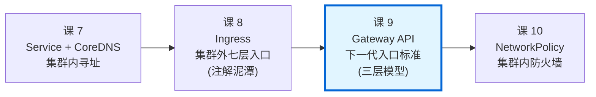
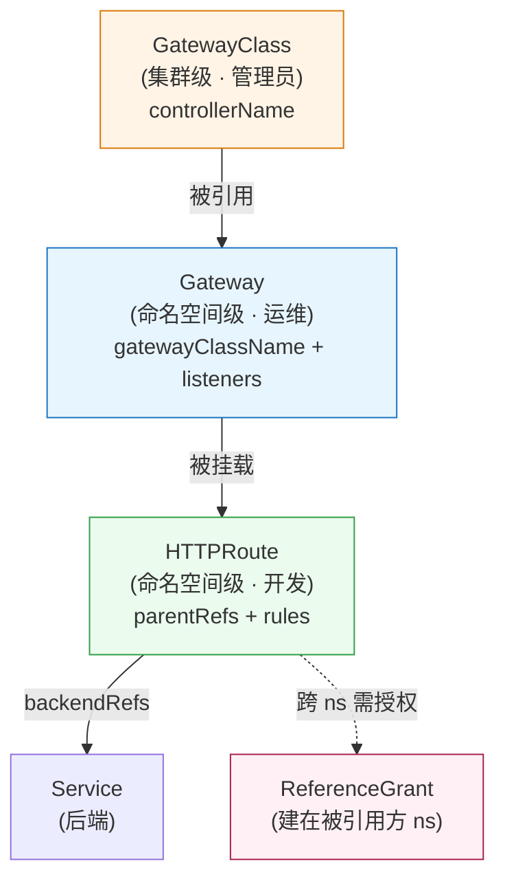

# 第 9 课：Gateway API：下一代入口标准

> 所属阶段：阶段 3《网络与服务暴露》｜ 水平：入门偏进阶 ｜ 本课知识点：Gateway API 三层模型、HTTPRoute 与流量治理、从 Ingress 迁移与选型
> 故事情节：课 8 留下一个未解的结 —— Ingress 的灰度权重只能靠 `nginx.ingress.kubernetes.io/canary-weight` 这类**厂商私有注解**，换个 Controller 就**静默失效**。这一课讲社区给出的正解：**Gateway API**。它把"权重"从注解变成了**标准字段**，把"一个人干所有事"的 Ingress 拆成了**三层角色分离**的模型。
> ⚠️ 本课所有命令与输出均在本机 kind 集群（k8s v1.34.0）+ Gateway API v1.4.1 + Envoy Gateway v1.6.1 上实测跑通。

## 🎯 本课目标

- 说清 GatewayClass / Gateway / HTTPRoute 三层各自**是谁在用、管什么、为什么这么分**
- 会写 HTTPRoute 并理解它比 Ingress 多出来的原生能力（权重、header 匹配、重写、重定向、跨命名空间）
- 能判断**什么时候该从 Ingress 迁移到 Gateway API**，以及迁移的真实成本

---

## 第一幕：起源与场景引入

> 🏛️ **起源**：**Gateway API 是"注解泥潭"的直接产物**。
>
> 课 8 讲过，Ingress 从 2015 年诞生起就有个反常设计：**官方只定义 API，不提供实现**。结果就是所有高级功能只能靠各家自定义的 annotation 表达。同一个"灰度 10% 流量"：
>
> | 控制器 | 写法 |
> |---|---|
> | ingress-nginx | `nginx.ingress.kubernetes.io/canary-weight: "10"` |
> | Traefik | `traefik.ingress.kubernetes.io/service-weights` 或改用 CRD |
> | Contour | 自己的 `HTTPProxy` CRD |
>
> **彼此完全不通用，且失效时不报错**。课 8 实测过：把 nginx 的 canary 注解应用到 Traefik，注解被**静默忽略**，100% 流量全进新版本。
>
> 2019 年，SIG Network 启动了 Gateway API（最初叫 "Service APIs"）来解决这个根本问题。核心思路有两条：
>
> **第一，把高级功能变成标准字段。** 权重就是 `weight`，不用注解。
>
> **第二，做角色分离（role-oriented）。** Ingress 是"一个人写一份 YAML 包打天下"—— 运维要管监听器，开发要管路由规则，可它俩挤在同一个资源里。Gateway API 按**谁负责什么**拆成了三层。
>
> **时间线**：
> - **2019**：项目启动（原名 Service APIs）
> - **2022-07**：`GatewayClass` / `Gateway` / `HTTPRoute` 进入 **beta**
> - **2023-10**：**v1.0 GA**（GatewayClass / Gateway / HTTPRoute 转正）
> - **2024-2025**：持续演进，TLSRoute / GRPCRoute / BackendTLSPolicy 陆续成熟
> - **现在**：Ingress API **功能冻结**（仍受支持，但不再加新特性），新能力全部进 Gateway API

---

## 第二幕：认知冲突

> ⚡ **冲突**：**你按课 8 的思路去用 Gateway API，第一步就会撞墙**。
>
> 学完 Ingress 之后，人的第一直觉是："不就是换个 kind 名字吗？"
>
> ```yaml
> # ❌ 直觉写法：把 Ingress 翻译成 HTTPRoute
> apiVersion: gateway.networking.k8s.io/v1
> kind: HTTPRoute
> spec:
>   rules:
>   - backendRefs:
>     - name: web-svc
>       port: 80
> ```
>
> 你 `kubectl apply` 它，**会成功**。然后你访问 —— **连不上**。
>
> 为什么？**因为 HTTPRoute 自己什么也不干。**
>
> Ingress 是"一份资源 = 一个入口"。Gateway API 里，HTTPRoute **只是一份路由规则**，它必须**挂载**到一个真正监听端口的 **Gateway** 上；而这个 Gateway 又必须**声明**自己用哪个 **GatewayClass**（即哪个控制器实现）。
>
> 三层**少任何一层，流量都不通**。而且和 Ingress 不同 —— **Ingress 没 Controller 时是"连不上"，Gateway API 是"资源创建成功但状态永远是 Unknown"**，你必须学会看 `status.conditions` 才能诊断。
>
> 更狠的是：这三层由**三个不同的角色**分别创建，彼此**不需要、也不应该**互相协调细节。这是设计意图，不是缺陷。
>
> **本课的第二个冲突**：我按常规做法先装了 Traefik 作为 Gateway API 实现，结果 **GatewayClass 的 ACCEPTED 永远是 `Unknown`**，HTTPRoute 的 status 干脆是空的。**这不是配置错误，而是 Gateway API 生态当前最真实的坑 —— 实现与 CRD 版本不匹配。** 本课会完整复盘这个排障过程，因为它比任何"正确示范"都更有教学价值。

---

## 第三幕：层层揭示

### 知识点 1：Gateway API 三层模型

#### 一句话定义

**Gateway API 用 GatewayClass（集群级，基础设施提供）、Gateway（命名空间级，运维创建，代表真实监听点）、HTTPRoute（命名空间级，开发创建，定义路由规则）三个资源，把"入口"这件事按角色拆开，让每个角色只关心自己那部分。**

#### 直觉建立（类比）

> 🏢 **类比：一栋写字楼的快递收发**
>
> | Gateway API | 写字楼里的对应物 | 谁负责 |
> |---|---|---|
> | **GatewayClass** | **物业公司的"资质标准"**（比如"甲级物业管理"） | 写字楼业主（**集群管理员**） |
> | **Gateway** | **具体的收发室**（有真实地址、开门时间、收哪些快递） | 物业（**运维/平台团队**） |
> | **HTTPRoute** | **"302 房间的快递放 A 柜"这条规则** | 租户（**应用开发**） |
>
> **关键在 separation of concerns**：
> - 租户（开发）**只需要说**"我的快递放哪"，**不需要知道**收发室在几楼、门牌号多少 —— 那是物业的事。
> - 物业（运维）**只需要管**收发室开几个窗口、几点开门，**不需要知道** 302 房间住着谁。
> - 业主（管理员）**只需要定**"用哪家物业公司"，**不参与**日常。
>
> **对照 Ingress**：Ingress 相当于"**租户直接写一张纸条贴在收发室门上**"，上面既写了规则，又隐含了对收发室的假设。租户和物业**挤在同一份 YAML 里**，改一条路由规则可能要动运维的配置。
>
> **一句话**：**Ingress 是"一个人干所有事"，Gateway API 是"三个人各干各的，靠契约衔接"。**

#### 核心原理

**三层的层级与归属**：

```
GatewayClass  (集群级, cluster-scoped)
    ↑ spec.controllerName 指向某个实现
    │
    ├── Gateway  (命名空间级) ── spec.gatewayClassName 引用 GatewayClass
    │       ↑ 定义 listeners（端口/协议/TLS）
    │       │
    │       └── HTTPRoute ── spec.parentRefs 引用 Gateway
    │               ↑ 定义 matches（匹配条件）+ backendRefs（后端）+ filters（处理）
    │
    └── Gateway  (另一个)
            └── HTTPRoute
```

**各层职责与关键字段**（本机 `kubectl explain` 实测）：

| 层 | 作用域 | 创建者 | 核心字段 | 作用 |
|---|---|---|---|---|
| **GatewayClass** | 集群级 | 集群管理员（装控制器时自动/手动创建） | `spec.controllerName` | 声明"由哪个控制器实现来兑现" |
| **Gateway** | 命名空间级 | 运维 / 平台团队 | `spec.gatewayClassName`、`spec.listeners[]` | 声明"开哪个端口、用什么协议、接受谁的路由" |
| **HTTPRoute** | 命名空间级 | 应用开发 | `spec.parentRefs[]`、`spec.hostnames[]`、`spec.rules[]` | 声明"什么请求 → 转到哪个后端" |

**状态（status.conditions）是 Gateway API 相对 Ingress 的重大进步**。

Ingress 只有一个 `status.loadBalancer.ingress`（有 IP 还是没 IP）。Gateway API 三层**各自**报告状态，且带 `reason` 说明原因：

| 层 | condition | 含义 |
|---|---|---|
| **GatewayClass** | `Accepted` | 该 class 的控制器是否存在且受支持 |
| **Gateway** | `Accepted` | Gateway 是否被 controller 接受（配置合法、class 存在） |
| **Gateway** | `Programmed` | **底层数据面是否真正就绪**（监听器是否真的起来了、地址是否分配） |
| **HTTPRoute** | `Accepted` | 是否被父 Gateway 接受 |
| **HTTPRoute** | `ResolvedRefs` | **backendRefs 引用的后端是否都能解析**（含跨命名空间授权检查） |

> 💡 **这个 `ResolvedRefs` 是 Ingress 完全没有的**。课 8 里，Ingress 引用一个不存在的 Service，你**看不出来**；Gateway API 会明确告诉你 `ResolvedRefs=False`。

**关于 channel（标准 / 实验）** —— 这是本课实测踩到的第一个坑：

Gateway API 发布**两套** CRD 安装包：

| channel | 内容 | 稳定性 |
|---|---|---|
| **standard** | 只含 GA 的：GatewayClass、Gateway、HTTPRoute、GRPCRoute、ReferenceGrant | 高，生产用 |
| **experimental** | standard **+** TLSRoute、TCPRoute、UDPRoute、BackendTLSPolicy 等 | 含可能变更的 alpha API |

**很多 Gateway API 实现（控制器）在启动时会 watch 全部类型，包括 alpha 的那些。** 如果你只装了 standard，控制器会因为 watch 不到 TLSRoute 而**持续报错、卡住不工作**。

#### 示例演示

**第 1 步：安装 Gateway API CRD**

```bash
# standard channel（只有 GA 的 5 个）
kubectl apply -f https://github.com/kubernetes-sigs/gateway-api/releases/download/v1.2.1/standard-install.yaml
kubectl get crd | grep 'gateway.networking'
```
```text
# 输出（本机实测）：
gatewayclasses.gateway.networking.k8s.io    2026-09-10T10:11:44Z
gateways.gateway.networking.k8s.io          2026-09-10T10:11:44Z
grpcroutes.gateway.networking.k8s.io        2026-09-10T10:11:44Z
httproutes.gateway.networking.k8s.io        2026-09-10T10:11:44Z
referencegrants.gateway.networking.k8s.io   2026-09-10T10:11:44Z
#   ↑ 只有 5 个
```

**第 2 步：装一个实现（先看失败的那次）**

```bash
# 装 Traefik 并开启 Gateway API provider
helm upgrade --install traefik traefik/traefik \
  --namespace traefik --create-namespace \
  --set providers.kubernetesGateway.enabled=true \
  --set providers.kubernetesIngress.enabled=true

kubectl get gatewayclass
```
```text
# 输出（本机实测）：
NAME      CONTROLLER                      ACCEPTED   AGE
traefik   traefik.io/gateway-controller   Unknown    13s
#   ↑ Unknown！不是 True
```

```bash
# 创建 Gateway 和 HTTPRoute 之后再看
kubectl get gateway -n lesson09
kubectl get gateway my-gateway -o jsonpath='{range .status.conditions[*]}{.type}={.status}{"\n"}{end}'
```
```text
# 输出（本机实测）：
my-gateway   traefik         Unknown   5s
Accepted=Unknown
Programmed=Unknown
#   ↑ 全部 Unknown，HTTPRoute 的 status 干脆是空的
```

**第 3 步：排障 —— 看控制器日志**

```bash
kubectl -n traefik logs deployment/traefik --tail=40 | grep -i 'error\|failed'
```
```text
# 输出（本机实测，去重塑因去重后）：
Failed to watch ... failed to list *v1.BackendTLSPolicy: the server could not find
  the requested resource (get backendtlspolicies.gateway.networking.k8s.io)
Failed to watch ... failed to list *v1.TLSRoute: the server could not find
  the requested resource (get tlsroutes.gateway.networking.k8s.io)
#   ↑ 根因：Traefik v3.7.13 启动时 watch 这两个类型，而 standard channel 里没有
```

**第 4 步：补上 experimental channel**

```bash
kubectl apply -f https://github.com/kubernetes-sigs/gateway-api/releases/download/v1.2.1/experimental-install.yaml
kubectl get crd | grep -c 'gateway.networking'
```
```text
# 输出（本机实测）：
10
#   ↑ 从 5 个涨到 10 个，tlsroutes 出现了
```

重启 Traefik 后**仍报 `v1.BackendTLSPolicy` 和 `v1.TLSRoute` 找不到**。注意前缀是 **`v1`**，而我们装的 CRD 提供的版本是：

```bash
kubectl get crd backendtlspolicies.gateway.networking.k8s.io \
  -o jsonpath='{range .spec.versions[*]}{.name} served={.served}{"\n"}{end}'
```
```text
# 输出（本机实测，v1.2.1 / v1.3.0）：
v1alpha3 served=true
#   ↑ 只有 v1alpha3，没有 v1 —— Traefik 要的是 v1
```

**第 5 步：升级到 v1.4.1**

```bash
kubectl apply -f https://github.com/kubernetes-sigs/gateway-api/releases/download/v1.4.1/experimental-install.yaml
kubectl get crd backendtlspolicies.gateway.networking.k8s.io \
  -o jsonpath='{range .spec.versions[*]}{.name} served={.served}{"\n"}{end}'
```
```text
# 输出（本机实测）：
v1 served=true
v1alpha3 served=true
#   ↑ v1 出现了 —— BackendTLSPolicy 在 v1.4 才 GA
```

重启 Traefik 后，剩余报错**只剩一条**（本机实测去重）：

```text
      5 "*v1.TLSRoute"
```

而 `TLSRoute` 在 **v1.4.1 里最高仍是 `v1alpha3`**（本机实测）：

```text
tlsroutes   v1alpha2 v1alpha3
```

> ⚠️ **结论**：**Traefik v3.7.13 的 Gateway API provider 依赖了尚未 GA 的 `TLSRoute v1`，在当前 Gateway API 版本下无法完整工作。** 这是实现与 CRD 版本不匹配的真实案例，不是你的配置错误。

**第 6 步：换 Envoy Gateway（Gateway API 的参考实现）**

```bash
# 清理 Traefik
helm uninstall traefik -n traefik
kubectl delete ns traefik

# 装 Envoy Gateway v1.6.1
helm upgrade --install eg oci://docker.io/envoyproxy/gateway-helm \
  --version v1.6.1 \
  -n envoy-gateway-system --create-namespace

kubectl -n envoy-gateway-system rollout status deployment/envoy-gateway --timeout=300s
kubectl -n envoy-gateway-system logs deployment/envoy-gateway --since=2m | grep -c 'Failed to watch'
```
```text
# 输出（本机实测）：
0
#   ↑ 零报错，与 Traefik 形成鲜明对比
```

**第 7 步：建 GatewayClass（Envoy Gateway 不会自动注册）**

```bash
cat <<'EOF' | kubectl apply -f -
apiVersion: gateway.networking.k8s.io/v1
kind: GatewayClass
metadata:
  name: eg
spec:
  controllerName: gateway.envoyproxy.io/gatewayclass-controller
EOF

kubectl get gatewayclass
```
```text
# 输出（本机实测）：
NAME   CONTROLLER                                       ACCEPTED   AGE
eg     gateway.envoyproxy.io/gatewayclass-controller    True       0s
#   ↑ True！第一层通了
```

> 💡 **对比记忆**：Traefik **自动**注册 GatewayClass（但 ACCEPTED 卡在 Unknown）；Envoy Gateway **不自动**注册（要你手动建，但一建就是 True）。**另有一些实现（如 ingress-nginx 的 Gateway API 模式）也是手动建。** 具体行为看各家文档。

**第 8 步：建 Gateway（第二层）**

```bash
cat <<'EOF' | kubectl apply -f -
apiVersion: gateway.networking.k8s.io/v1
kind: Gateway
metadata:
  name: eg-gateway
  namespace: lesson09
spec:
  gatewayClassName: eg
  listeners:
  - name: http
    protocol: HTTP
    port: 80
    allowedRoutes:
      namespaces:
        from: Same
EOF

sleep 60
kubectl -n lesson09 get gateway
kubectl -n lesson09 get gateway eg-gateway -o jsonpath='{range .status.conditions[*]}{.type}={.status} reason={.reason}{"\n"}{end}'
```
```text
# 输出（本机实测）：
eg-gateway   eg          False   60s
Accepted=True reason=Accepted
Programmed=False reason=AddressNotAssigned
#   ↑ Accepted 通了，但 Programmed=False —— 地址没分配
```

> ⚠️ **为什么 `Programmed=False / AddressNotAssigned`？**
> 因为本机是 **kind 集群，没有云厂商 LoadBalancer**。Envoy Gateway 默认创建 `LoadBalancer` 类型的 Service，而 kind 没法给它分配外部 IP：
> ```bash
> kubectl -n envoy-gateway-system get svc | grep envoy
> # 输出（本机实测）：
> envoy-lesson09-eg-gateway-e300de82   LoadBalancer   10.96.38.166   <pending>   80:32384/TCP
> #                                                    ↑ <pending>
> ```
> **这在云上不会发生，但在 kind / minikube / 裸机上必然发生。** 解决办法（见下）。

**第 9 步：用 EnvoyProxy 配置改成 NodePort**

```bash
cat <<'EOF' | kubectl apply -f -
apiVersion: gateway.envoyproxy.io/v1alpha1
kind: EnvoyProxy
metadata:
  name: nodeport-config
  namespace: lesson09
spec:
  provider:
    type: Kubernetes
    kubernetes:
      envoyService:
        type: NodePort
EOF

kubectl -n lesson09 patch gateway eg-gateway --type=merge -p \
  '{"spec":{"infrastructure":{"parametersRef":{"group":"gateway.envoyproxy.io","kind":"EnvoyProxy","name":"nodeport-config"}}}}'

sleep 45
kubectl -n lesson09 get gateway
kubectl -n lesson09 get gateway eg-gateway -o jsonpath='{range .status.conditions[*]}{.type}={.status} reason={.reason}{"\n"}{end}'
```
```text
# 输出（本机实测）：
eg-gateway   eg    172.27.0.3   True   2m12s
Accepted=True reason=Accepted
Programmed=True reason=Programmed
#   ↑ Programmed 变 True，地址 172.27.0.3 分配成功

kubectl -n envoy-gateway-system get svc | grep envoy
# 输出（本机实测）：
envoy-lesson09-eg-gateway-e300de82   NodePort    10.96.38.166   <none>   80:32384/TCP
#   ↑ LoadBalancer(pending) → NodePort(32384)
```

**第 10 步：建 HTTPRoute（第三层）并验证**

```bash
cat <<'EOF' | kubectl apply -f -
apiVersion: gateway.networking.k8s.io/v1
kind: HTTPRoute
metadata:
  name: my-route
  namespace: lesson09
spec:
  parentRefs:
  - name: eg-gateway
  hostnames:
  - "gw.local"
  rules:
  - matches:
    - path:
        type: PathPrefix
        value: /
    backendRefs:
    - name: web-v1-svc
      port: 80
EOF

kubectl -n lesson09 get httproute my-route \
  -o jsonpath='{range .status.parents[*]}parent={.parentRef.name} controller={.controllerName}{"\n"}{range .conditions[*]}  {.type}={.status} reason={.reason}{"\n"}{end}{end}'
```
```text
# 输出（本机实测）：
parent=eg-gateway controller=gateway.envoyproxy.io/gatewayclass-controller
  Accepted=True reason=Accepted
  ResolvedRefs=True reason=ResolvedRefs
#   ↑ 三层全部接通，且 HTTPRoute 明确报告了它的父 Gateway 和控制器
```

**实际访问**：

```bash
NP=$(kubectl -n envoy-gateway-system get svc envoy-lesson09-eg-gateway-e300de82 \
  -o jsonpath='{.spec.ports[?(@.port==80)].nodePort}')   # 本机实测：32384
docker exec k8s-c1-control-plane sh -c "curl -s -H 'Host: gw.local' http://localhost:$NP/"
docker exec k8s-c1-control-plane sh -c "curl -s -o /dev/null -w '%{http_code}' -H 'Host: other.local' http://localhost:$NP/"
```
```text
# 输出（本机实测）：
V1
404
#   ↑ gw.local 命中；other.local 的 404 证明 hostname 过滤生效
```

#### 常见误区

**误区 1：以为 HTTPRoute 自己就能暴露服务。**

不会。HTTPRoute 只是规则，**必须**通过 `parentRefs` 挂到一个 `Programmed=True` 的 Gateway 上。**三层缺一不可**。诊断时按"GatewayClass → Gateway → HTTPRoute"从上往下查。

**误区 2：以为资源创建成功就等于能用。**

本课实测里，Traefik 那次三层资源**全都创建成功**，但状态一律 `Unknown`。**Gateway API 下必须看 `status.conditions`，`kubectl get` 的 CREATED 不代表工作。**

**误区 3：以为装了 CRD 就能用。**

CRD 只是**数据模型**，**真正干活的是实现（控制器）**。本课先装了 v1.2.1 standard 的 CRD，Traefik 就卡死了。**CRD 版本必须和实现匹配** —— 这是当前 Gateway API 生态最常见的坑。

**误区 4：看到 `Programmed=False` 就以为配置错了。**

不一定。本课第一次是 `AddressNotAssigned`（kind 无云 LB），这是**环境限制**，改 NodePort 后立刻变 `True`。**要读 `reason` 字段，不要只看 status。**

**误区 5：以为 GatewayClass 一定自动存在。**

不一定。Traefik 自动注册，Envoy Gateway 要手动建。**若 `kubectl get gatewayclass` 为空，先查实现的安装文档**。

#### 一句话记住

> **GatewayClass 定"用谁"，Gateway 定"开哪个门"，HTTPRoute 定"往哪转"——三层各司其职，少一层都不通，且每层都会用 status.conditions 告诉你它为什么不通。**

#### 官方文档

- [Gateway API 官方文档](https://gateway-api.sigs.k8s.io/)
- [Gateway API 三层概念（Concepts）](https://gateway-api.sigs.k8s.io/concepts/api-overview/)
- [Gateway API releases（channel 与版本）](https://github.com/kubernetes-sigs/gateway-api/releases)
- [Envoy Gateway 文档](https://gateway.envoyproxy.io/)
- [Gateway API 实现列表](https://gateway-api.sigs.k8s.io/implementations/)

---

### 知识点 2：HTTPRoute 与流量治理

#### 一句话定义

**HTTPRoute 是 Gateway API 中描述 HTTP 路由规则的资源，用 matches 匹配请求、用 filters 处理请求/响应、用 backendRefs 指定后端并带 weight 权重——这些能力全部是标准字段，不依赖任何厂商注解。**

#### 直觉建立（类比）

> 🎛️ **类比：调音台**
>
> HTTPRoute 就像一台**调音台**，每一条 `rule` 是一路通道：
>
> | 部件 | 调音台 | HTTPRoute |
> |---|---|---|
> | 输入选择 | 选哪个乐器进来 | **`matches`**（host / path / header / method） |
> | 音效处理 | 均衡、混响 | **`filters`**（重写 / 加头 / 重定向） |
> | 输出与音量 | 推子大小 | **`backendRefs[].weight`** |
>
> **对照 Ingress**：
> - Ingress 的调音台**只有"输入选择"和"输出"两个旋钮**（host、path、backend），**没有"音效处理"，也没有"音量"**。
> - 想加音效？**自己接外挂**（annotation）。而外挂**每个牌子接口都不一样**。
> - Gateway API 把音效和音量**做进了调音台本身** —— 这就是核心差别。

#### 核心原理

**HTTPRoute 的三段式结构**：

```yaml
spec:
  parentRefs:        # 挂在哪个 Gateway 上（必填，否则规则无人执行）
  - name: eg-gateway
  hostnames:         # 可选的 host 过滤
  - "canary.local"
  rules:
  - matches:         # ① 匹配条件（不写 = 匹配所有）
    filters:         # ② 处理动作（重写/加头/重定向）
    backendRefs:     # ③ 后端 + 权重
```

**能力 1：原生权重灰度（本课最重要的一条）**

```yaml
rules:
- backendRefs:
  - name: web-v1-svc
    port: 80
    weight: 90      # ← 标准字段
  - name: web-v2-svc
    port: 80
    weight: 10      # ← 标准字段
```

**这就是和课 8 的本质差别**：

| | Ingress（课 8） | Gateway API（本课） |
|---|---|---|
| 权重怎么表达 | `nginx.ingress.kubernetes.io/canary-weight: "10"` | `backendRefs[].weight: 10` |
| 换控制器 | **静默失效**，100% 流量走新版本 | **照常工作**，任何兼容实现都认 |
| 能否校验 | 不能（注解是字符串） | `kubectl explain` 可查，字段类型有校验 |
| 一个资源搞定 | 否（要建两个 Ingress：主 + canary） | **是**（一个 HTTPRoute 内两条 backendRefs） |

本机 `kubectl explain httproute.spec.rules.backendRefs` 实测字段：

```text
name        <string> -required-
namespace   <string>
weight      <integer>
#   ↑ weight 是一等公民字段
```

**能力 2：按 Header 匹配（Ingress 做不到）**

```yaml
rules:
- matches:
  - headers:
    - name: X-Canary
      value: "true"
  backendRefs:
  - name: web-v2-svc
    port: 80
- backendRefs:          # 兜底
  - name: web-v1-svc
    port: 80
```

> 💡 **规则按顺序匹配，第一条命中即止，最后一条通常作兜底。**
> 这个"内部用户走新版本"的场景，Ingress 只能靠 `nginx.ingress.kubernetes.io/canary-by-header` 注解实现。

**能力 3：路径重写（标准字段 vs 注解）**

```yaml
rules:
- matches:
  - path:
      type: PathPrefix
      value: /old
  filters:
  - type: URLRewrite
    urlRewrite:
      path:
        type: ReplacePrefixMatch
        replacePrefixMatch: /
  backendRefs:
  - name: web-v1-svc
    port: 80
```

Ingress 的等价写法是 `nginx.ingress.kubernetes.io/rewrite-target: /$1` —— 又是注解。

**能力 4：响应头注入 / 请求头修改**

```yaml
filters:
- type: ResponseHeaderModifier
  responseHeaderModifier:
    add:
    - name: X-Demo
      value: "gateway-api"
```

**能力 5：重定向**

```yaml
rules:
- filters:
  - type: RequestRedirect
    requestRedirect:
      statusCode: 301
      hostname: gw.local
```

> ⚠️ **实测踩坑**：重定向时**不能写 `backendRefs`**。我第一次试的时候报错：
> ```text
> The HTTPRoute "redirect-route" is invalid: spec.rules[0]: Invalid value: "object":
> RequestRedirect filter must not be used together with backendRefs
> ```
> **理由**：请求被重定向走了，**根本不该有后端**。这是 API 层面的显式约束 —— 又一处"标准优于注解"的证明：**注解写错了没人告诉你，标准字段写错了 API server 直接拒绝。**

**能力 6：跨命名空间路由 + ReferenceGrant（Ingress 完全没有）**

Ingress 的后端**必须**与 Ingress 在同一个命名空间。本机实测 `kubectl explain ingress.spec.rules.http.paths.backend.service`：

```text
name    <string> -required-
    name is the referenced service. The service must exist in the same namespace
#   ↑ 官方原话：must exist in the same namespace，且根本没有 namespace 字段
```

HTTPRoute 的 `backendRef` **有 `namespace` 字段**，可以跨命名空间引用后端。但出于安全，**默认被拒绝**，必须由**目标命名空间**显式授权：

```yaml
# 在「目标」命名空间 team-b 创建（不是在使用者的 lesson09！）
apiVersion: gateway.networking.k8s.io/v1beta1
kind: ReferenceGrant
metadata:
  name: allow-from-lesson09
  namespace: team-b
spec:
  from:                                    # 谁可以引用
  - group: gateway.networking.k8s.io
    kind: HTTPRoute
    namespace: lesson09
  to:                                      # 可以引用什么
  - group: ""
    kind: Service
    name: team-b-svc
```

> 💡 **方向别搞反**：ReferenceGrant **建在被引用方（服务端）的命名空间**，授权给引用方。这符合直觉 —— **资源的主人决定谁能用**。

#### 示例演示

**实验 1：原生权重灰度（配 90:10）**

```bash
cat <<'EOF' | kubectl apply -f -
apiVersion: gateway.networking.k8s.io/v1
kind: HTTPRoute
metadata:
  name: canary-route
  namespace: lesson09
spec:
  parentRefs:
  - name: eg-gateway
  hostnames:
  - "canary.local"
  rules:
  - backendRefs:
    - name: web-v1-svc
      port: 80
      weight: 90
    - name: web-v2-svc
      port: 80
      weight: 10
EOF

sleep 8
kubectl -n lesson09 get httproute canary-route \
  -o jsonpath='{range .status.parents[*]}{range .conditions[*]}{.type}={.status}{"\n"}{end}{end}'
```
```text
# 输出（本机实测）：
Accepted=True
ResolvedRefs=True
```

```bash
for i in $(seq 1 200); do
  docker exec k8s-c1-control-plane sh -c "curl -s --max-time 3 -H 'Host: canary.local' http://localhost:32384/"
done | grep -E '^V[12]$' | sort | uniq -c
```
```text
# 输出（本机实测）：
    182 V1
     18 V2
#   ↑ 182:18 ≈ 90:10（期望 180:20，200 次采样下属正常浮动）
```

改成 50:50 再看：

```bash
kubectl -n lesson09 patch httproute canary-route --type=merge -p \
  '{"spec":{"rules":[{"backendRefs":[{"name":"web-v1-svc","port":80,"weight":50},{"name":"web-v2-svc","port":80,"weight":50}]}]}}'
# 重复上面的 200 次请求
```
```text
# 输出（本机实测）：
    100 V1
    100 V2
#   ↑ 精确 100:100
```

> 📊 **与课 8 对照**：课 8 用 Traefik CRD 做 90:10 灰度，实测 **180/20**；本课用 Gateway API 标准 `weight` 做 90:10，实测 **182/18**。**效果一致，但后者是标准字段 —— 这才是关键。**

**实验 2：按 Header 路由**

```bash
cat <<'EOF' | kubectl apply -f -
apiVersion: gateway.networking.k8s.io/v1
kind: HTTPRoute
metadata:
  name: header-route
  namespace: lesson09
spec:
  parentRefs:
  - name: eg-gateway
  hostnames:
  - "hdr.local"
  rules:
  - matches:
    - headers:
      - name: X-Canary
        value: "true"
    backendRefs:
    - name: web-v2-svc
      port: 80
  - backendRefs:
    - name: web-v1-svc
      port: 80
EOF

sleep 8
docker exec k8s-c1-control-plane sh -c "curl -s -H 'Host: hdr.local' http://localhost:32384/"
docker exec k8s-c1-control-plane sh -c "curl -s -H 'Host: hdr.local' -H 'X-Canary: true' http://localhost:32384/"
```
```text
# 输出（本机实测）：
不带 header    -> V1
X-Canary: true -> V2
#   ↑ 带 header 走 V2，不带走 V1
```

**实验 3：路径重写**

```bash
docker exec k8s-c1-control-plane sh -c "curl -s -H 'Host: rw.local' http://localhost:32384/old"
```
```text
# 输出（本机实测）：
V1
#   ↑ /old 被重写为 / 后命中后端
```

**实验 4：响应头注入**

```bash
docker exec k8s-c1-control-plane sh -c "curl -s -I -H 'Host: addh.local' http://localhost:32384/" | grep -i x-demo
```
```text
# 输出（本机实测）：
x-demo: gateway-api
```

**实验 5：重定向（修正写法，无 backendRefs）**

```bash
docker exec k8s-c1-control-plane sh -c "curl -s -o /dev/null -w '%{http_code}' -H 'Host: red.local' http://localhost:32384/"
docker exec k8s-c1-control-plane sh -c "curl -s -D- -o /dev/null -H 'Host: red.local' http://localhost:32384/" | grep -i '^location'
```
```text
# 输出（本机实测）：
301
location: http://gw.local/
```

**实验 6：跨命名空间 + ReferenceGrant（本课最有说服力的一组对照）**

```bash
# 先建 team-b 命名空间和后端
kubectl create ns team-b
kubectl -n team-b apply -f - <<'EOF'
apiVersion: apps/v1
kind: Deployment
metadata:
  name: team-b-app
spec:
  replicas: 2
  selector:
    matchLabels:
      app: team-b-app
  template:
    metadata:
      labels:
        app: team-b-app
    spec:
      containers:
      - name: nginx
        image: nginx:alpine
        command: ["/bin/sh","-c"]
        args: ["echo 'TEAM-B' > /usr/share/nginx/html/index.html && nginx -g 'daemon off;'"]
        ports:
        - containerPort: 80
---
apiVersion: v1
kind: Service
metadata:
  name: team-b-svc
spec:
  selector:
    app: team-b-app
  ports:
  - port: 80
    targetPort: 80
EOF
kubectl -n team-b rollout status deployment/team-b-app --timeout=180s
```

```bash
# 第一步：不建 ReferenceGrant，直接跨 ns 引用（预期被拒）
cat <<'EOF' | kubectl -n lesson09 apply -f -
apiVersion: gateway.networking.k8s.io/v1
kind: HTTPRoute
metadata:
  name: cross-ns-nogrant
spec:
  parentRefs:
  - name: eg-gateway
  hostnames:
  - "crossno.local"
  rules:
  - backendRefs:
    - name: team-b-svc
      namespace: team-b
      port: 80
EOF

sleep 8
kubectl -n lesson09 get httproute cross-ns-nogrant \
  -o jsonpath='{range .status.parents[*]}{range .conditions[*]}  {.type}={.status} reason={.reason}{"\n"}{end}{end}'
docker exec k8s-c1-control-plane sh -c "curl -s -o /dev/null -w '%{http_code}' -H 'Host: crossno.local' http://localhost:32384/"
```
```text
# 输出（本机实测）：
  Accepted=True reason=Accepted
  ResolvedRefs=False reason=RefNotPermitted
500
#   ↑ 被明确拒绝！reason=RefNotPermitted，访问返回 500
```

```bash
# 第二步：在 team-b（被引用方）创建 ReferenceGrant 授权
cat <<'EOF' | kubectl -n team-b apply -f -
apiVersion: gateway.networking.k8s.io/v1beta1
kind: ReferenceGrant
metadata:
  name: allow-from-lesson09
spec:
  from:
  - group: gateway.networking.k8s.io
    kind: HTTPRoute
    namespace: lesson09
  to:
  - group: ""
    kind: Service
    name: team-b-svc
EOF
sleep 8

# 第三步：再建一条跨 ns 的 HTTPRoute
cat <<'EOF' | kubectl -n lesson09 apply -f -
apiVersion: gateway.networking.k8s.io/v1
kind: HTTPRoute
metadata:
  name: cross-ns-route
spec:
  parentRefs:
  - name: eg-gateway
  hostnames:
  - "cross.local"
  rules:
  - backendRefs:
    - name: team-b-svc
      namespace: team-b
      port: 80
EOF

sleep 8
kubectl -n lesson09 get httproute cross-ns-route \
  -o jsonpath='{range .status.parents[*]}{range .conditions[*]}  {.type}={.status} reason={.reason}{"\n"}{end}{end}'
docker exec k8s-c1-control-plane sh -c "curl -s -H 'Host: cross.local' http://localhost:32384/"
```
```text
# 输出（本机实测）：
  Accepted=True reason=Accepted
  ResolvedRefs=True reason=ResolvedRefs
TEAM-B
#   ↑ 授权后跨命名空间成功
```

```bash
# 第四步：回头看最早被拒的那条
docker exec k8s-c1-control-plane sh -c "curl -s -H 'Host: crossno.local' http://localhost:32384/"
```
```text
# 输出（本机实测）：
TEAM-B
#   ↑ 也通了！证明授权是命名空间级的、实时生效的 ——
#     ReferenceGrant 一旦建立，该 (from → to) 组合的所有引用都被放行
```

> 🎯 **这组对照是 Gateway API 设计哲学的最佳体现**：
> - **默认拒绝**（default deny）—— 跨命名空间引用不给授权就不通
> - **状态可见** —— `ResolvedRefs=False reason=RefNotPermitted` 明确告诉你为什么
> - **对比 Ingress** —— Ingress 干脆没有这个能力（后端必须同 namespace），也就无所谓安全模型

#### 常见误区

**误区 1：以为 weight 是百分比，必须总和为 100。**

不是。`weight` 是**相对比例**，**不要求总和为 100**。写 `weight: 1` + `weight: 1` 等于 50:50；写 `weight: 900` + `weight: 100` 等于 90:10。**实际比例 = 自身 weight / 所有 backendRefs 的 weight 之和**。不过约定俗成写成总和 100 便于阅读。

**误区 2：以为改了 HTTPRoute 立刻全量生效。**

实测中每次改完都 `sleep 8` 才验证。控制器需要时间把新配置推到数据面。**生产环境改权重后要观察监控，不要改完就走。**

**误区 3：把 ReferenceGrant 建在使用方命名空间。**

**建在被引用方（后端所在的）命名空间。** 建反了不报错，但也不生效 —— `ResolvedRefs` 一直是 `RefNotPermitted`。

**误区 4：重定向时还留着 backendRefs。**

API server 会直接拒绝（实测报错见上文）。**这是好事**：注解写错没人管，标准字段写错立刻被拦。

**误区 5：以为 filters 能解决所有问题。**

`filters` 是**标准核心能力**（重写、加头、重定向、镜像）。更复杂的（认证、限流、WAF）各实现有自己的**扩展机制**（如 Envoy Gateway 的 `EnvoyExtensionPolicy`）。**别指望 Gateway API 统一一切 —— 它统一的是"最常见的那部分"。**

#### 一句话记住

> **HTTPRoute = matches（匹配）+ filters（处理）+ backendRefs（后端+权重），全是标准字段；权重不用注解、跨命名空间要有 ReferenceGrant 授权、被拒时 status 会告诉你 reason。**

#### 官方文档

- [HTTPRoute 官方文档](https://gateway-api.sigs.k8s.io/api-types/httproute/)
- [HTTPRoute 流量切分（Traffic Splitting）](https://gateway-api.sigs.k8s.io/guides/traffic-splitting/)
- [ReferenceGrant 文档](https://gateway-api.sigs.k8s.io/api-types/referencegrant/)
- [HTTPRoute 重定向与重写指南](https://gateway-api.sigs.k8s.io/guides/http-redirect-rewrite/)

---

### 知识点 3：从 Ingress 迁移与选型

#### 一句话定义

**Ingress 仍受支持但功能冻结，Gateway API 是官方指定的演进方向；迁移的核心不是"翻译 YAML"，而是"把角色分开 + 把注解换成标准字段"，是否需要现在迁取决于你是否在被 Ingress 的表达能力所限。**

#### 直觉建立（类比）

> 🔄 **类比：从功能机换智能机**
>
> | | 功能机（Ingress） | 智能机（Gateway API） |
> |---|---|---|
> | 打电话发短信 | ✅ 够用 | ✅ 够用 |
> | 装 App | ❌ 只能靠厂商预装的"特色功能" | ✅ 标准应用商店 |
> | 换手机 | 所有"特色功能"全作废 | App 跟着账号走 |
>
> **关键判断不是"哪个更好"，而是"你现在痛不痛"**：
> - 只用打电话发短信 → **功能机再战三年完全没问题**
> - 想装 App、想换手机不丢东西 → **必须换**
>
> **对应到 k8s**：
> - 只做 host/path 转发、不需要灰度 → **Ingress 够用，不必急着迁**
> - 需要灰度/重写/header 匹配/跨命名空间，或者**要换控制器** → **迁移收益巨大**

#### 核心原理

**现状：两个 API 的真实状态**

| API | 状态 | 说明 |
|---|---|---|
| **Ingress**（`networking.k8s.io/v1`） | **仍受支持，功能冻结** | 不会被删除，但**不再新增特性** |
| **Gateway API**（`gateway.networking.k8s.io/v1`） | **GA + 持续演进** | 官方指定的新特性落点 |

> 💡 **"功能冻结"≠"废弃"**。课 8 已澄清：**Ingress API 没有被废弃**，现有 Ingress 资源继续正常工作。只是**新能力（如原生权重、header 匹配）不会再加进 Ingress**。

**能力对照表**：

| 能力 | Ingress | Gateway API |
|---|---|---|
| host / path 匹配 | ✅ 标准字段 | ✅ 标准字段 |
| TLS | ✅ 标准（Secret 引用） | ✅ 标准（Gateway listener 上） |
| **加权灰度** | ❌ **注解**，各厂商不同 | ✅ **`weight` 标准字段** |
| **按 header 匹配** | ❌ **注解** | ✅ **`matches.headers` 标准字段** |
| **路径重写** | ❌ **注解** | ✅ **`URLRewrite` filter** |
| **重定向** | ❌ **注解** | ✅ **`RequestRedirect` filter** |
| **响应头修改** | ❌ **注解** | ✅ **`ResponseHeaderModifier` filter** |
| **跨命名空间后端** | ❌ **不支持**（后端必须同 ns） | ✅ **`namespace` + ReferenceGrant** |
| **角色分离** | ❌ 单资源 | ✅ **三层，三类角色** |
| **状态诊断** | 弱（只有 address） | ✅ **多层 conditions + reason** |
| 超时 / 重试 | ❌ 注解 | ⚠️ 部分（部分实现有扩展） |

**迁移的映射关系**（一对一翻译表）：

| Ingress 写法 | Gateway API 写法 |
|---|---|
| `metadata.annotations[kubernetes.io/ingress.class]` 或 `spec.ingressClassName` | Gateway 的 `spec.gatewayClassName` |
| `spec.rules[].host` | HTTPRoute 的 `spec.hostnames[]` |
| `spec.rules[].http.paths[].path` + `pathType` | `spec.rules[].matches[].path.value` + `type` |
| `spec.rules[].http.paths[].backend.service` | `spec.rules[].backendRefs[]` |
| `spec.tls[].secretName` | Gateway listener 的 `tls.certificateRefs` |
| `nginx.ingress.kubernetes.io/canary-weight` | `backendRefs[].weight` |
| `nginx.ingress.kubernetes.io/rewrite-target` | `filters[].urlRewrite` |
| `nginx.ingress.kubernetes.io/canary-by-header` | `matches[].headers[]` |

**迁移策略：共存，而非一次性切换**

本课课 8 与课 9 在同一个集群上先后用过 Ingress 和 Gateway API —— **它们可以同时存在**：

- 同一个控制器（如 Traefik、ingress-nginx）**可以同时开 Ingress 和 Gateway API 两种 provider**
- 也可以**两个控制器并存**，各自管各自的入口
- **按服务逐步迁移**，风险可控

> 💡 **这是最稳妥的路径**：新服务直接用 Gateway API，老服务留在 Ingress，**按优先级逐步迁**。

**选控制器的现实考量（本课实测的直接教训）**

本课实测中：

| 实现 | 结果 | 教训 |
|---|---|---|
| **Traefik v3.7.13** | GatewayClass ACCEPTED 卡在 `Unknown` | **实现依赖了尚未 GA 的 `TLSRoute v1`，与 v1.4.1 CRD 不匹配** |
| **Envoy Gateway v1.6.1** | 三层全部 `True`，零报错 | **Gateway API 的参考实现，与标准同步最好** |

> ⚠️ **这不是说 Traefik 不好**（它的 Ingress 支持很成熟，课 8 全部实验都基于它）。**而是说：选 Gateway API 实现时，必须先验证该实现对当前 Gateway API 版本的兼容性。**
>
> **验证方法一分钟就能做完**：
> ```bash
> # 装完控制器后立刻看两件事
> kubectl get gatewayclass                    # ACCEPTED 是否为 True
> kubectl -n <ns> logs deployment/<ctrl> | grep -c 'Failed to watch'   # 是否为 0
> ```

#### 示例演示

**实验 1：同一个需求，两种写法对照**

需求：`canary.local` 的流量 **90% → V1，10% → V2**。

```bash
# ===== Ingress 写法（课 8，nginx 注解）=====
# 需要两个 Ingress 资源：
#   1) 主 Ingress（100% 流量）
#   2) canary Ingress（带注解，声明切 10%）
# 注解：
#   nginx.ingress.kubernetes.io/canary: "true"
#   nginx.ingress.kubernetes.io/canary-weight: "10"
# → 只对 NGINX 有效；换 Traefik 后静默失效（课 8 实测 100% 进 V2）

# ===== Gateway API 写法（本课，标准字段）=====
kubectl -n lesson09 get httproute canary-route \
  -o jsonpath='{range .spec.rules[0].backendRefs[*]}  {.name} weight={.weight}{"\n"}{end}'
```
```text
# 输出（本机实测）：
  web-v1-svc weight=90
  web-v2-svc weight=10
#   ↑ 一个资源、两个权重、零注解
```

**实验 2：权重可调（改配置即生效）**

```bash
kubectl -n lesson09 patch httproute canary-route --type=merge -p \
  '{"spec":{"rules":[{"backendRefs":[{"name":"web-v1-svc","port":80,"weight":50},{"name":"web-v2-svc","port":80,"weight":50}]}]}}'
# 打 200 次请求
```
```text
# 输出（本机实测）：
    100 V1
    100 V2
#   ↑ 从 182:18 精确变为 100:100
```

**实验 3：多条 HTTPRoute 共存在一个 Gateway 上**

```bash
kubectl -n lesson09 get httproute
```
```text
# 输出（本机实测）：
NAME               HOSTNAMES            AGE
addheader-route    ["addh.local"]       7m29s
canary-route       ["canary.local"]     8m44s
header-route       ["hdr.local"]        7m46s
my-route           ["gw.local"]         10m
redirect-route     ["red.local"]        6m52s
rewrite-route      ["rw.local"]         7m38s
#   ↑ 6 条路由挂同一个 Gateway，按 hostname 分流，互不干扰
```

> 💡 **这体现了 Gateway API 的"一个入口、多方共用"模型**：运维**只建一个 Gateway**（一个监听器、一个 LB、一份成本），各团队**各自建自己的 HTTPRoute**，用 `hostnames` 和 `allowedRoutes` 做隔离。**Ingress 模型下，这要么挤在一个大 Ingress 里（改一处动全身），要么建多个 Ingress（多个 LB、多份成本）。**

**实验 4：迁移选型自查清单**

```bash
# ① 我现在有多少 Ingress？
kubectl get ingress -A --no-headers | wc -l

# ② 其中用了 nginx 注解的有哪些？（这些就是迁移成本）
kubectl get ingress -A -o json | grep -o 'nginx.ingress.kubernetes.io/[a-z-]*' | sort -u

# ③ 我装的控制器支持 Gateway API 吗？
kubectl get gatewayclass           # 有输出且 ACCEPTED=True 才行

# ④ 数据面健康吗？
kubectl -n <ns> logs deployment/<controller> | grep -c 'Failed to watch'   # 应为 0
```

#### 常见误区

**误区 1：以为 Ingress 已经废弃，必须马上迁。**

**没有。** Ingress API 仍受支持，只是**功能冻结**。课 8 已澄清过：退役的是 `kubernetes/ingress-nginx` **控制器**，不是 Ingress **API**。**如果你的 Ingress 只用 host/path 转发且运行良好，没有紧迫的迁移理由。**

**误区 2：以为迁移是"改个 kind 名字"的机械翻译。**

不是。真正的迁移包含**两个结构性变化**：
1. **角色分离** —— 原来一份 Ingress 里的监听器配置（TLS、端口）要**拆到 Gateway**，路由规则留在 HTTPRoute。**这意味着运维要开始管 Gateway 资源。**
2. **注解转标准** —— 每条 `nginx.ingress.kubernetes.io/*` 都要找到对应的标准字段。**少数注解没有标准对应物**，要走实现的扩展机制。

**误区 3：以为 Gateway API 能统一一切。**

不能。Gateway API 统一的是**最常见那部分**（匹配、权重、重写、重定向、头修改）。**认证、限流、WAF 等高级能力仍由各实现的扩展承担**（如 Envoy Gateway 的 `EnvoyExtensionPolicy`、Traefik 的 Middleware）。**选型时要看"我需要的那些高级能力，该实现支持得怎么样"。**

**误区 4：不看实现与 CRD 的版本兼容性就上生产。**

本课实测就是反例：Traefik v3.7.13 + Gateway API v1.2.1/v1.3.0/v1.4.1 **全都卡在 `Unknown`**。**装完先验证 `gatewayclass` 的 `ACCEPTED` 和控制器日志，再往下走。**

**误区 5：以为 `Gateway` 要为每个服务建一个。**

不要。**一个 Gateway 可以被多条 HTTPRoute 共享**（本课实测 6 条路由挂同一个 Gateway）。Gateway 代表**一个真实的监听点/一份 LB 成本**，应该按"入口"而不是按"服务"来建。

#### 一句话记住

> **Ingress 功能冻结但没废弃；迁移的本质是"角色分离 + 注解转标准字段"。够用就别急迁，被注解绑死或需要灰度/跨命名空间时，Gateway API 的收益立竿见影。**

#### 官方文档

- [Gateway API 官方 Ingress 迁移指南](https://gateway-api.sigs.k8s.io/guides/migrating-from-ingress/)
- [Ingress 与 Gateway API 对比](https://gateway-api.sigs.k8s.io/concepts/glossary/)
- [Gateway API 实现列表与成熟度](https://gateway-api.sigs.k8s.io/implementations/)
- [Kubernetes Ingress 文档](https://kubernetes.io/docs/concepts/services-networking/ingress/)

---

## 第四幕：实操验证

> 🎬 **本幕是"照抄就能跑通"的完整验证流程。** 每一步的命令和输出都来自本机实测。

### 环境准备

```bash
# 集群：kind（k8s v1.34.0），单节点
# 已装：helm、docker

# ① 装 Gateway API CRD（用 experimental channel，含 alpha 类型）
kubectl apply -f https://github.com/kubernetes-sigs/gateway-api/releases/download/v1.4.1/experimental-install.yaml
kubectl get crd | grep -c 'gateway.networking'
```
```text
# 输出（本机实测）：
11
```

```bash
# ② 装 Envoy Gateway v1.6.1
helm upgrade --install eg oci://docker.io/envoyproxy/gateway-helm \
  --version v1.6.1 -n envoy-gateway-system --create-namespace
kubectl -n envoy-gateway-system rollout status deployment/envoy-gateway --timeout=300s
```
```text
# 输出（本机实测）：
deployment "envoy-gateway" successfully rolled out
```

```bash
# ③ 建 GatewayClass（Envoy Gateway 不会自动注册）
cat <<'EOF' | kubectl apply -f -
apiVersion: gateway.networking.k8s.io/v1
kind: GatewayClass
metadata:
  name: eg
spec:
  controllerName: gateway.envoyproxy.io/gatewayclass-controller
EOF
kubectl get gatewayclass
```
```text
# 输出（本机实测）：
NAME   CONTROLLER                                     ACCEPTED   AGE
eg     gateway.envoyproxy.io/gatewayclass-controller  True       0s
```

```bash
# ④ 准备命名空间和两个版本的应用
kubectl create ns lesson09
kubectl config set-context --current --namespace=lesson09
kubectl apply -f - <<'EOF'
apiVersion: apps/v1
kind: Deployment
metadata:
  name: web-v1
spec:
  replicas: 2
  selector:
    matchLabels:
      app: web-v1
  template:
    metadata:
      labels:
        app: web-v1
    spec:
      containers:
      - name: nginx
        image: nginx:alpine
        command: ["/bin/sh","-c"]
        args: ["echo 'V1' > /usr/share/nginx/html/index.html && nginx -g 'daemon off;'"]
        ports:
        - containerPort: 80
---
apiVersion: v1
kind: Service
metadata:
  name: web-v1-svc
spec:
  selector:
    app: web-v1
  ports:
  - port: 80
    targetPort: 80
---
apiVersion: apps/v1
kind: Deployment
metadata:
  name: web-v2
spec:
  replicas: 2
  selector:
    matchLabels:
      app: web-v2
  template:
    metadata:
      labels:
        app: web-v2
    spec:
      containers:
      - name: nginx
        image: nginx:alpine
        command: ["/bin/sh","-c"]
        args: ["echo 'V2' > /usr/share/nginx/html/index.html && nginx -g 'daemon off;'"]
        ports:
        - containerPort: 80
---
apiVersion: v1
kind: Service
metadata:
  name: web-v2-svc
spec:
  selector:
    app: web-v2
  ports:
  - port: 80
    targetPort: 80
EOF
kubectl rollout status deployment/web-v1 --timeout=180s
kubectl rollout status deployment/web-v2 --timeout=180s
```
```text
# 输出（本机实测）：
deployment.apps/web-v1 created
service/web-v1-svc created
deployment.apps/web-v2 created
service/web-v2-svc created
```

### 验证 1：三层模型与状态传播

```bash
# Gateway（kind 环境必须改 NodePort，否则 Programmed=False）
cat <<'EOF' | kubectl apply -f -
apiVersion: gateway.envoyproxy.io/v1alpha1
kind: EnvoyProxy
metadata:
  name: nodeport-config
  namespace: lesson09
spec:
  provider:
    type: Kubernetes
    kubernetes:
      envoyService:
        type: NodePort
---
apiVersion: gateway.networking.k8s.io/v1
kind: Gateway
metadata:
  name: eg-gateway
  namespace: lesson09
spec:
  gatewayClassName: eg
  infrastructure:
    parametersRef:
      group: gateway.envoyproxy.io
      kind: EnvoyProxy
      name: nodeport-config
  listeners:
  - name: http
    protocol: HTTP
    port: 80
    allowedRoutes:
      namespaces:
        from: Same
EOF

sleep 60
kubectl -n lesson09 get gateway eg-gateway \
  -o jsonpath='{range .status.conditions[*]}{.type}={.status} reason={.reason}{"\n"}{end}'
```
```text
# 输出（本机实测）：
Accepted=True reason=Accepted
Programmed=True reason=Programmed
```

```bash
# HTTPRoute
cat <<'EOF' | kubectl apply -f -
apiVersion: gateway.networking.k8s.io/v1
kind: HTTPRoute
metadata:
  name: my-route
  namespace: lesson09
spec:
  parentRefs:
  - name: eg-gateway
  hostnames:
  - "gw.local"
  rules:
  - matches:
    - path:
        type: PathPrefix
        value: /
    backendRefs:
    - name: web-v1-svc
      port: 80
EOF

sleep 8
kubectl -n lesson09 get httproute my-route \
  -o jsonpath='{range .status.parents[*]}parent={.parentRef.name}{"\n"}{range .conditions[*]}  {.type}={.status} reason={.reason}{"\n"}{end}{end}'
```
```text
# 输出（本机实测）：
parent=eg-gateway
  Accepted=True reason=Accepted
  ResolvedRefs=True reason=ResolvedRefs
```

```bash
# 取得 NodePort 并访问（不依赖 jq：用 -o name 拿到服务名，再取 nodePort）
GW_SVC=$(kubectl -n envoy-gateway-system get svc -o name | grep 'envoy-lesson09')
NP=$(kubectl -n envoy-gateway-system get "$GW_SVC" \
  -o jsonpath='{.spec.ports[?(@.port==80)].nodePort}')
echo "NodePort = $NP"
docker exec k8s-c1-control-plane sh -c "curl -s -H 'Host: gw.local' http://localhost:$NP/"
docker exec k8s-c1-control-plane sh -c "curl -s -o /dev/null -w '%{http_code}' -H 'Host: other.local' http://localhost:$NP/"
```
```text
# 输出（本机实测）：
NodePort = 32384
V1
404
```

> 💡 **NodePort 每次创建都会变**（本机实测两次分别为 `32384` 和 `32380`），**务必用上面的命令动态取，不要照抄数字。**

### 验证 2：原生权重灰度

```bash
cat <<'EOF' | kubectl apply -f -
apiVersion: gateway.networking.k8s.io/v1
kind: HTTPRoute
metadata:
  name: canary-route
  namespace: lesson09
spec:
  parentRefs:
  - name: eg-gateway
  hostnames:
  - "canary.local"
  rules:
  - backendRefs:
    - name: web-v1-svc
      port: 80
      weight: 90
    - name: web-v2-svc
      port: 80
      weight: 10
EOF
sleep 8

for i in $(seq 1 200); do
  docker exec k8s-c1-control-plane sh -c "curl -s --max-time 3 -H 'Host: canary.local' http://localhost:32384/"
done | grep -E '^V[12]$' | sort | uniq -c
```
```text
# 输出（本机实测）：
    182 V1
     18 V2
```

### 验证 3：跨命名空间与 ReferenceGrant

```bash
# 完整命令见知识点 2 的「实验 6」
# 关键结果对照：
```
```text
# 无 ReferenceGrant：
  ResolvedRefs=False reason=RefNotPermitted   访问返回 500

# 有 ReferenceGrant：
  ResolvedRefs=True reason=ResolvedRefs       访问返回 TEAM-B
```

### 验证 4：排障速查

```bash
# 症状：GatewayClass ACCEPTED=Unknown
kubectl get gatewayclass                                  # 看 ACCEPTED 列
kubectl -n <ns> logs deployment/<controller> | grep 'Failed to watch'
#   → 有报错 = CRD 版本与实现不匹配，装 experimental channel 或升级版本

# 症状：Gateway Programmed=False reason=AddressNotAssigned
kubectl -n <ns> get svc | grep envoy                      # 看 EXTERNAL-IP 是否 <pending>
#   → kind/裸机没有云 LB，改 NodePort（见上文 EnvoyProxy 配置）

# 症状：HTTPRoute Accepted 但访问 404
kubectl -n <ns> get httproute <name> -o jsonpath='{.spec.hostnames}'
kubectl -n <ns> get gateway <gw> -o jsonpath='{.spec.listeners}'
#   → 检查 hostname 与 listener 端口是否匹配

# 症状：HTTPRoute ResolvedRefs=False reason=RefNotPermitted
kubectl get referencegrant -A
#   → 跨命名空间引用缺 ReferenceGrant，且必须建在「被引用方」命名空间

# 症状：HTTPRoute ResolvedRefs=False reason=BackendNotFound
kubectl -n <ns> get svc
#   → backendRefs 引用的 Service 不存在或端口不对
```

---

## 第五幕：体系收束

### 本课在阶段 3 中的位置



**课 8 提出的问题 → 课 9 的回答**：

| 课 8 的痛点 | 课 9 的解法 |
|---|---|
| 灰度靠 `nginx.ingress.kubernetes.io/canary-weight` 注解 | `backendRefs[].weight` 标准字段 |
| 换控制器注解静默失效 | 标准字段，任何兼容实现都认 |
| 一个资源塞满运维配置 + 开发规则 | 三层角色分离 |
| 后端必须同命名空间 | `namespace` + ReferenceGrant |
| 出问题只能看 address | 多层 `status.conditions` + `reason` |

### 三层模型速查



### 核心结论

1. **三层模型是"角色分离"，不是"层级嵌套"** —— GatewayClass（管理员定用谁）、Gateway（运维开门）、HTTPRoute（开发写规则），**三个角色各管各的，靠契约衔接**。
2. **`weight` 从注解变标准字段，是 Gateway API 最直接的收益** —— 实测 90:10 得到 182:18，与课 8 的注解方案效果一致，但**换实现不再失效**。
3. **`status.conditions` + `reason` 让排障从"猜"变成"读"** —— `RefNotPermitted`、`AddressNotAssigned`、`BackendNotFound` 直接告诉你原因，这是 Ingress 完全没有的。
4. **跨命名空间默认拒绝 + ReferenceGrant 显式授权** —— Ingress 干脆没有这个能力，也就无所谓安全模型。
5. **CRD 版本与实现必须匹配** —— 本课 Traefik 卡在 `Unknown` 的实测，是当前生态最真实的坑。
6. **Ingress 没废弃，只是功能冻结** —— **够用就别急迁**；被注解绑死、需要灰度/跨命名空间时再迁。

### 与 CKA / CKS 考纲的对应

| 考纲项 | 本课覆盖 |
|---|---|
| Ingress 与流量暴露 | ✅ 与 Gateway API 对照理解 |
| Gateway API 基础（CKA 2025 新增） | ✅ 三层模型、HTTPRoute |
| 网络排障 | ✅ status.conditions 诊断法 |

---

## 📋 本机实测环境说明

| 项目 | 值 |
|---|---|
| 集群 | kind（单节点），k8s **v1.34.0** |
| Gateway API | **v1.4.1**（experimental channel，11 个 CRD） |
| Gateway API 实现 | **Envoy Gateway v1.6.1** |
| 访问方式 | Envoy Proxy Service 改 **NodePort 32384** |

**本机实测中已验证的局限**（写进讲义以免读者踩同样的坑）：

1. **kind 无云厂商 LoadBalancer** → Envoy Gateway 默认建 `LoadBalancer` 会 `<pending>`、`Programmed=False reason=AddressNotAssigned`。**必须改 NodePort**。
2. **Traefik v3.7.13 的 Gateway API provider 在当前 CRD 下不完整** → 依赖尚未 GA 的 `TLSRoute v1`，GatewayClass 卡在 `Unknown`。**本课因此改用 Envoy Gateway**。
3. **权重采样存在统计浮动** → 200 次采样下 90:10 实测 182:18（期望 180:20），属正常波动。**不要因个别数字偏差怀疑配置。**
4. **`BackendTLSPolicy` 在 v1.4 才 GA**（v1.2.1/v1.3.0 仅 `v1alpha3`）→ **CRD 版本选择直接影响实现能否工作。**

---

## 课后小测

**Q1**：你建好了 GatewayClass、Gateway、HTTPRoute，`kubectl get` 都显示存在，但访问返回 **404**。以下**最不可能**的原因是？
- A. HTTPRoute 的 `hostnames` 与你 curl 用的 Host 不一致
- B. Gateway 的 `Programmed=False reason=AddressNotAssigned`
- C. HTTPRoute 的 `parentRefs` 指向的 Gateway 名字写错了
- D. HTTPRoute 的 `matches.path` 前缀写成了 `/api`，而你访问的是 `/`

<details><summary>答案与解析</summary>

**答案：B**。

**区分"404""连不上""500"是 Gateway API 排障的第一步**：

| 现象 | 含义 | 本课对应实测 |
|---|---|---|
| **连接失败（000）** | **没有进程监听** | Gateway 数据面没起来 |
| **404** | **有人监听，但没匹配到规则** | hostname 不匹配（本课实测 `other.local` → 404） |
| **500** | 规则匹配了，但后端解析失败 | 缺 ReferenceGrant（本课实测 `RefNotPermitted` → 500） |
| **503** | 规则匹配了，但后端无可用实例 | Service 没有 selector，Endpoint 为空 |

逐条看：
- **A 可能**：hostname 不匹配 → **404**。本课实测 `other.local` 返回 404。
- **B 最不可能**：`Programmed=False` 意味着**数据面压根没就绪**，此时连访问端点都没有，是**连不上（000）**，绝不可能是 404。本课第一次建 Gateway 时正是这个状态。
- **C 可能**：`parentRefs` 写错 → HTTPRoute 的 `Accepted=False`，规则没挂到 Gateway 上 → **404**。
- **D 可能**：path 前缀不匹配 → 规则没命中 → **404**。

**排障顺序**（自上而下，一层层确认）：
```bash
kubectl get gatewayclass                    # ACCEPTED=True？
kubectl -n <ns> get gateway -o jsonpath='{range .status.conditions[*]}{.type}={.status} reason={.reason}{"\n"}{end}'
kubectl -n <ns> get httproute -o jsonpath='{range .status.parents[*]}{range .conditions[*]}{.type}={.status} reason={.reason}{"\n"}{end}{end}'
```

> 💡 **记忆口诀**：**404 = 匹配问题（host / path / 没挂上）；000 = 数据面没起；500/503 = 后端问题。**

</details>

**Q2**：关于 `weight` 字段，以下说法正确的是？
- A. `weight` 是百分比，所有 backendRefs 的 weight 之和必须等于 100
- B. `weight` 是相对比例，实际比例 = 自身 weight / 所有 weight 之和
- C. `weight` 只在某些实现上生效，本质是标准注解
- D. `weight` 必须配合 `canary: "true"` 注解使用

<details><summary>答案与解析</summary>

**答案：B**。

- **A 错**：`weight` **不要求总和为 100**。写 `1` + `1` 等于 50:50，写 `900` + `100` 等于 90:10。约定俗成写成总和 100 只是便于阅读。
- **B 对**：相对比例。
- **C 错**：**这正是 Gateway API 的核心价值** —— `weight` 是**标准字段**，不是注解，任何兼容实现都认。本课实测：90:10 → 182:18，50:50 → 100:100。
- **D 错**：**`canary: "true"` 是 nginx Ingress 的注解**，Gateway API 里根本没有这个概念。

**对照课 8**：课 8 的 Ingress 灰度需要**两个 Ingress 资源 + nginx 注解**；本课**一个 HTTPRoute + 两个 weight** 就够了。

</details>

**Q3**：你想让 `lesson09` 命名空间的 HTTPRoute 引用 `team-b` 命名空间的 Service。ReferenceGrant 应该建在哪里？
- A. `lesson09` 命名空间（引用方）
- B. `team-b` 命名空间（被引用方）
- C. 两个命名空间都要建
- D. `envoy-gateway-system` 命名空间（控制器所在）

<details><summary>答案与解析</summary>

**答案：B**。

**规则**：ReferenceGrant **建在被引用方（资源主人）的命名空间**，在 `spec.from` 里声明"允许谁引用我"，在 `spec.to` 里声明"允许引用我的什么"。

**直觉**：**资源的主人决定谁能用。** 就像你家门锁的钥匙在你手里，不在访客手里。

本课实测：
```bash
# 建在 team-b（被引用方）
kubectl -n team-b apply -f - <<'EOF'
apiVersion: gateway.networking.k8s.io/v1beta1
kind: ReferenceGrant
metadata:
  name: allow-from-lesson09
spec:
  from:
  - group: gateway.networking.k8s.io
    kind: HTTPRoute
    namespace: lesson09      # ← 允许 lesson09 的 HTTPRoute
  to:
  - group: ""
    kind: Service
    name: team-b-svc         # ← 引用我的 team-b-svc
EOF
```

**建反了会怎样？** **不报错，但也不生效** —— `ResolvedRefs` 一直是 `False reason=RefNotPermitted`，访问返回 500。这正是本课实测的"无授权"状态。

**补充**：本课还实测了一个细节 —— 授权建立后，**之前被拒的那条 HTTPRoute 立刻恢复**（`crossno.local` 从 500 变成返回 TEAM-B）。**说明授权是实时生效、作用于 (from → to) 组合的。**

</details>

**Q4**：本课实测中，Traefik v3.7.13 作为 Gateway API 实现时 GatewayClass 的 ACCEPTED 一直是 `Unknown`。根因是什么？
- A. Traefik 不支持 Gateway API
- B. 没有安装 Gateway API 的 CRD
- C. Traefik 依赖了尚未 GA 的 `TLSRoute v1`，与当前 CRD 版本不匹配
- D. GatewayClass 的 `controllerName` 写错了

<details><summary>答案与解析</summary>

**答案：C**。

**完整复盘**（本课实测过程）：

1. 装了 `standard` channel 的 v1.2.1 CRD（5 个）→ Traefik 报 `BackendTLSPolicy` / `TLSRoute` 找不到
2. 补装 `experimental` channel（10 个）→ 仍报错，**因为 CRD 提供的是 `v1alpha3`，而 Traefik 要 `v1`**
3. 升级到 v1.4.1 → `BackendTLSPolicy` 有了 `v1`，报错**只剩 `v1.TLSRoute`**（而 `TLSRoute` 在 v1.4.1 里最高仍为 `v1alpha3`）
4. 改用 Envoy Gateway v1.6.1 → **零报错，三层全部 True**

**诊断命令**（这次排障的关键两步）：
```bash
kubectl get gatewayclass                                     # ACCEPTED=Unknown
kubectl -n traefik logs deployment/traefik | grep 'Failed to watch'
# 输出：failed to list *v1.TLSRoute: the server could not find the requested resource
```

**排查 CRD 版本的命令**：
```bash
kubectl get crd tlsroutes.gateway.networking.k8s.io \
  -o jsonpath='{range .spec.versions[*]}{.name} served={.served}{"\n"}{end}'
# 输出（本机实测）：v1alpha2 v1alpha3      ← 没有 v1
```

**注意**：**不是说 Traefik 不好** —— 它的 Ingress 支持很成熟（课 8 全部实验基于它）。**而是说：选 Gateway API 实现时，必须先验证该实现对当前 Gateway API 版本的兼容性。**

</details>

---

## 🚀 下一批接力提示词

> 学完本批后，**复制下面这段文字发给 AI**，即可无缝进入下一批（无需重新描述上下文）：

```
继续学 Kubernetes。我的学习档案在 k8s/00-学习档案.md。
已完成阶段 3《网络与服务暴露》课 9，
请继续讲解课 10。
```

## 🧭 课程导航

- 上一课：[课 8：Ingress：七层路由与灰度发布](lesson-08-Ingress七层路由与灰度发布.md)
- 下一课：课 10《NetworkPolicy：集群内的防火墙》（阶段 3，未编写）
- 返回目录：[02-课程目录.md](../../../02-课程目录.md) ｜ 本阶段概览：[网络与服务暴露](../overview.md)
