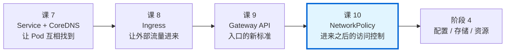
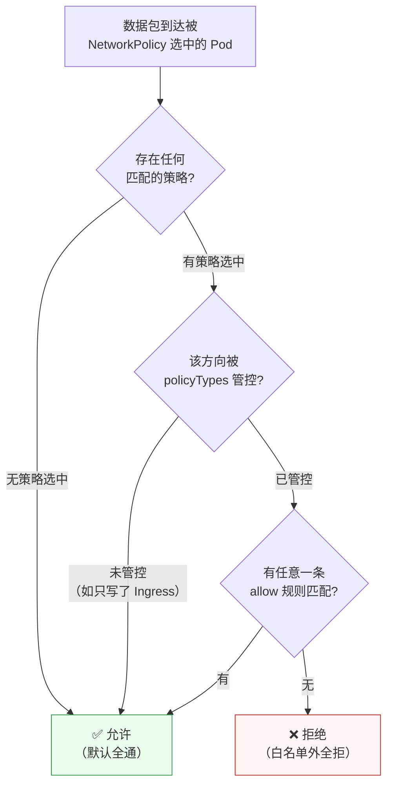

# 第 10 课：NetworkPolicy：集群内的防火墙

> 所属阶段：阶段 3《网络与服务暴露》｜ 水平：入门偏进阶 ｜ 本课知识点：默认全通的隐患、NetworkPolicy 语义、CNI 支持与验证
> 故事情节：课 7 让 Pod 之间能互相找到，课 8/9 让集群外的流量能进来。**但有一个事实到现在为止都被忽略了：k8s 里任何 Pod 都能访问任何其他 Pod，默认没有任何限制。** 这一课讲怎么把这个"默认全通"的模型，改造成"默认拒绝、按需放行"。
> ⚠️ 本课所有命令与输出均在本机 kind 集群（k8s v1.34.0，CNI = kindnet）上实测跑通。**"CNI 是否真的执行 NetworkPolicy"这一条已在实测中确认，不凭记忆断言。**

## 🎯 本课目标

- 理解"默认全通"为什么是安全隐患，以及零信任模型下的正确默认姿态
- 会读会写 NetworkPolicy：`podSelector` / `policyTypes` / `ingress` / `egress` 的语义组合
- 知道 NetworkPolicy **依赖 CNI 实现**，会在自己的集群上验证它是否真的生效

---

## 第一幕：起源与场景引入

> 🏛️ **起源**：**NetworkPolicy 是为"默认全通"这个历史设计打的补丁。**
>
> k8s 的网络模型有一条基本原则，官方称为 "**every Pod can communicate with all other Pods without NAT**"（任何 Pod 都能不经 NAT 与其他 Pod 通信）。这条原则带来巨大的易用性 —— 课 7 讲 Service 时你已经享受到了，**部署应用时完全不用管网络通不通**。
>
> 但它的代价是：**安全边界为零**。
>
> 想象一栋办公楼，每个房间的门**都不锁、也不装**：
> - 前台（对外 Web 服务）被攻破 → 攻击者可以直接走到财务室（数据库）
> - 一个跑测试的 Pod 出了 bug → 可以扫遍整个集群
>
> 现实中这不可接受。但 k8s **从第一天就是这个样子**，改默认行为会破坏无数存量应用，所以社区选择了另一条路：**保留默认全通，另提供一个可选的"防火墙"资源** —— 这就是 **NetworkPolicy**（`networking.k8s.io/v1`）。
>
> **时间线**：
> - **2016**：NetworkPolicy 进入 `extensions/v1beta1`
> - **2017**（k8s 1.7）：GA 到 `networking.k8s.io/v1`，沿用至今
> - **至今**：**API 稳定，但实现不在 k8s 内核里** —— 由 CNI 插件负责执行（这点极其重要，本课第三幕细讲）
>
> 💡 **一句话定位**：**NetworkPolicy 是 k8s 的"声明式防火墙"，但它只负责声明；真正拦流量的是 CNI 插件。**

---

## 第二幕：认知冲突

> ⚡ **冲突**：**你写了一条 NetworkPolicy，`kubectl apply` 成功了，然后 —— 什么也没发生。**
>
> 或者更糟：**你写了一条"拒绝所有"的策略，访问居然还是通的。**
>
> 为什么？两个反直觉的事实叠加：
>
> **第一，NetworkPolicy 是"白名单"，没有"拒绝"动作。**
>
> 你没法写 `action: Deny`。NetworkPolicy 只有一种语义：**"被我选中的 Pod，允许这些流量"**。要"拒绝"，你的办法是 —— **给一批 Pod 应用策略，但不写任何允许规则**。
>
> 这跟 iptables / 云安全组的"写一条 deny 规则"思维方式**完全不同**。
>
> **第二，NetworkPolicy 只是"声明"，k8s 自己不执行它。**
>
> 这是本课最大的坑。**kube-apiserver 只负责存下这个对象**，真正把它翻译成 iptables / nftables / eBPF 规则的是 **CNI 插件**。而 CNI 插件**可以完全不理会 NetworkPolicy** —— 这不是 bug，是允许的行为。
>
> 于是出现一个诡异的组合：
>
> | 现象 | 含义 |
> |---|---|
> | `kubectl apply` 成功 | 只说明 **YAML 被存进 etcd 了** |
> | `kubectl get netpol` 能看到 | 同上 |
> | **NetworkPolicy 没有 `status` 字段** | **你无法从资源上看出它有没有生效**（本课实测确认） |
>
> **所以："策略已创建"和"策略已生效"是两件完全不同的事。** 本课第三幕会给你一套实测方法，用 2 分钟在自己的集群上判定它到底生不生效。
>
> **本课的第三个冲突**：我按常规思路先测"按 Service 名访问"，发现失败了，一度以为是策略没配对。**实际根因是 DNS 查询被 NetworkPolicy 拦掉了** —— 这是 NetworkPolicy 领域最经典的坑，几乎每个人第一次写 egress 策略都会踩。本课会把它完整复现出来。

---

## 第三幕：层层揭示

### 知识点 1：默认全通的隐患

#### 一句话定义

**k8s 默认允许任意 Pod 间全向通信（无 NAT、无隔离），NetworkPolicy 是打破这一默认、实现"按需最小连通"的可选资源；在零信任模型下，正确的默认姿态是"先拒绝所有，再逐条放行"。**

#### 直觉建立（类比）

> 🏢 **类比：开放式办公园区 vs 门禁园区**
>
> **k8s 默认 = 开放式办公园区**：
> - 所有楼之间**没有门禁**，任何人可以走进任何楼的任何房间
> - **优点**：协作效率极高，搬工位、开新部门都不用申请网络
> - **缺点**：**一个访客拿到园区的通行证，就能进所有楼**
>
> **加了 NetworkPolicy = 装了门禁系统**：
> - 默认还是全开（你**不装门禁规则，门就是不设防的**）
> - 你可以给某栋楼装门禁，规则是**白名单**："只有持卡人 A、B、C 能进"
> - **关键**：门禁**不能写"禁止张三"**，只能写"**允许**这些人" —— 不在允许名单里的人**自动进不来**
>
> **这个"只能写允许，不能写禁止"就是白名单模型。**
>
> **对照现实防火墙**：iptables / 云安全组通常是"**默认允许 + 写 deny 规则**"或"**默认拒绝 + 写 allow 规则**"两种都支持。而 **NetworkPolicy 只给你后一种**：它被应用的那一刻起，**没被显式允许的流量就全断了**。

#### 核心原理

**默认全通到底意味着什么** —— 本课实测（两个无任何策略的 Pod，跨命名空间也通）：

```bash
# 同一命名空间
client -> server   : 通（返回 nginx 欢迎页）

# 跨命名空间（l10b/outsider -> l10/server）
outsider -> server : 通
```

**没有任何策略时，这两个方向都是通的。** 命名空间**不是**安全边界 —— 这是一个极常见的误解。

> ⚠️ **命名空间是"管理边界"，不是"网络边界"。** 想要网络隔离，**必须显式写 NetworkPolicy**。

**零信任（Zero Trust）模型的落地姿势**：

| 步骤 | 做法 | 对应 NetworkPolicy |
|---|---|---|
| 1 | **先默认拒绝** | `default-deny-ingress`（+ 可选 egress） |
| 2 | **再逐条放行** | 按"谁需要访问谁"写 allow 策略 |
| 3 | **持续收敛** | 定期审查，删掉不再需要的放行 |

**为什么推荐"默认拒绝"而不是"默认允许"？** 因为**前者是"增量安全"（加新服务时它默认安全），后者是"增量风险"（加新服务时它默认暴露）**。集群规模增长时，这两种姿势的安全水位差距会越来越大。

**"最小连通"的现实收益**（不只是安全）：

- **缩小爆炸半径**：一个 Pod 被攻破，攻击者横向移动的范围受限
- **合规要求**：PCI-DSS、等保等标准普遍要求网络分段
- **故障隔离**：网络层面的错误配置不会无限扩散

#### 示例演示

**实验 1：证明"默认全通"（基线）**

```bash
kubectl create ns l10
kubectl config set-context --current --namespace=l10

cat <<'EOF' | kubectl apply -f -
apiVersion: v1
kind: Pod
metadata:
  name: client
  namespace: l10
  labels:
    app: client
spec:
  containers:
  - name: busybox
    image: busybox:1.36
    command: ["sleep","3600"]
---
apiVersion: v1
kind: Pod
metadata:
  name: server
  namespace: l10
  labels:
    app: server
spec:
  containers:
  - name: nginx
    image: nginx:alpine
    ports:
    - containerPort: 80
EOF

kubectl wait --for=condition=Ready pod/client --timeout=180s
kubectl wait --for=condition=Ready pod/server --timeout=180s
kubectl get pods -o wide --no-headers
```
```text
# 输出（本机实测）：
client   1/1   Running   0     2s    10.244.0.201   k8s-c1-control-plane
server   1/1   Running   0     2s    10.244.0.202   k8s-c1-control-plane
```

```bash
SP=$(kubectl get pod server -o jsonpath='{.status.podIP}')
kubectl exec client -- wget -q -T 5 -O - "http://$SP/"
```
```text
# 输出（本机实测）：
<!DOCTYPE html>
#   ↑ 没有任何策略，直接通
```

**实验 2：default-deny 后立刻断开（三段式对照的第一段）**

```bash
cat <<'EOF' | kubectl apply -f -
apiVersion: networking.k8s.io/v1
kind: NetworkPolicy
metadata:
  name: default-deny-ingress
  namespace: l10
spec:
  podSelector: {}          # ← 空 selector = 选中本命名空间所有 Pod
  policyTypes:
  - Ingress                # ← 只管入站
EOF
sleep 5
kubectl get netpol --no-headers
```
```text
# 输出（本机实测）：
default-deny-ingress   <none>   5s
```

```bash
kubectl exec client -- wget -q -T 5 -O - "http://$SP/"
```
```text
# 输出（本机实测）：
wget: download timed out
command terminated with exit code 1
#   ↑ 被拦住了！策略真的生效了
```

> 🎯 **这组对照（`通` → `download timed out`）就是本课最重要的一条实测结论**：
> **本机 kind 集群的 CNI（kindnet）确实执行 NetworkPolicy。**（评审清单"待验证事项 #1"由此结案）
> 详见知识点 3 —— **但这个结论不能推广到你的集群，必须在你自己的环境上重跑一遍。**

**实验 3：default-deny 只影响本命名空间**

```bash
# 在另一个命名空间建一个 Pod，访问 l10 的 server
kubectl create ns l10b
kubectl run outsider -n l10b --image=busybox:1.36 --labels=app=outsider -- sleep 3600
kubectl wait --for=condition=Ready pod/outsider -n l10b --timeout=180s
kubectl exec outsider -n l10b -- wget -q -T 5 -O - "http://$SP/"
```
```text
# 输出（本机实测）：
wget: download timed out
#   ↑ 同样被拒：default-deny 选中了 l10 的「所有 Pod」，
#     不管流量来自本命名空间还是别的命名空间
```

> 💡 **注意这里的两层含义**：
> 1. `default-deny` 保护的是**被选中的 Pod（l10 全部）**，拒绝的是**所有来源**（除非另有放行规则）。
> 2. 反过来，`l10b` **没有**策略，所以 `l10b` 里的 Pod 之间**依然是全通的**。**策略是"按被保护的 Pod"来组织的，不是按命名空间边界。**

#### 常见误区

**误区 1：以为命名空间自带网络隔离。**

**不自带。** 命名空间是**管理边界**（配额、RBAC、命名），**不是网络边界**。本课实测：无任何策略时跨命名空间照样通。**想要隔离必须写 NetworkPolicy。**

**误区 2：以为 NetworkPolicy 能写"拒绝"规则。**

不能。**NetworkPolicy 只有"允许"语义**（白名单）。要拒绝，只能"选中一批 Pod + 不给任何 allow 规则"。

**误区 3：以为建了策略就安全了。**

**取决于 CNI 是否执行它。** 本课实测 kindnet 执行，但**有些 CNI（如 vanilla flannel）不执行** —— 那样你的策略就是**一张废纸**，而且**没有任何报错**。知识点 3 会给验证方法。

**误区 4：以为 default-deny 会挡住 DNS。**

**会的，如果你用的是 default-deny-all（含 Egress）。** 本课实测：`ingress+egress` 双向 deny 后，`nslookup kubernetes` 直接 `connection timed out`。**所以生产上做 egress 限制时，第一件事是放行 DNS**（详见知识点 2 的"DNS 陷阱"）。

**误区 5：以为 default-deny 之后集群还能正常跑（比如监控抓取、健康检查）。**

**可能不能。** 一旦上 default-deny，所有**未显式放行**的流量都会断 —— 包括 Prometheus 抓指标、kubelet 探针、日志采集。**这就是为什么"先 deny 再逐步放行"需要谨慎规划，并建议先在非生产环境演练。**

#### 一句话记住

> **k8s 默认全通、命名空间不是安全边界；NetworkPolicy 是白名单模型（只能写"允许"），零信任的正确姿势是"先默认拒绝，再按最小连通逐条放行"。**

#### 官方文档

- [NetworkPolicy 概念](https://kubernetes.io/docs/concepts/services-networking/network-policies/)
- [声明网络策略（实战任务）](https://kubernetes.io/docs/tasks/administer-cluster/declare-network-policy/)
- [NetworkPolicy API 参考](https://kubernetes.io/docs/reference/kubernetes-api/policy-resources/network-policy-v1/)

---

### 知识点 2：NetworkPolicy 语义

#### 一句话定义

**NetworkPolicy 通过 podSelector 选中要保护的 Pod，用 policyTypes 声明管控方向（Ingress / Egress），再用 ingress / egress 规则列出允许的流量；未被任何规则匹配的流量一律拒绝，且多条策略之间是叠加（OR）关系。**

#### 直觉建立（类比）

> 🎫 **类比：一场演唱会的入场规则**
>
> 把 NetworkPolicy 想成演唱会门口的**检票规则**，策略分三个部分：
>
> | NetworkPolicy 字段 | 演唱会对应物 |
> |---|---|
> | **`podSelector`** | **哪个场馆/区域适用本规则**（选中被保护的对象） |
> | **`policyTypes`** | **管"进场"还是"出场"**（Ingress=进场，Egress=出场） |
> | **`ingress[].from`** | **允许谁进场**（白名单来源） |
> | **`ingress[].ports`** | **允许从哪个门进**（端口） |
> | **`egress[].to`** | **允许出场去哪**（白名单目的地） |
>
> **三条关键规则**：
> 1. **不在名单上的人自动进不来** —— 白名单模型
> 2. **多条规则叠加**：A 规则放行进 VIP，B 规则放行进工作人员，**VIP 和工作人员都能进**（不是互相覆盖）
> 3. **只写"管进场"不影响出场** —— 你管了进场检票，**不代表出场也被管了**
>
> **第 3 条最容易出错**，也是本课实测的重点之一。

#### 核心原理

**完整结构**：

```yaml
apiVersion: networking.k8s.io/v1
kind: NetworkPolicy
metadata:
  name: example
  namespace: default        # ← 策略是命名空间级资源，只对本命名空间的 Pod 生效
spec:
  podSelector:              # ← ① 选中「被保护」的 Pod（必填）
    matchLabels:
      app: backend
  policyTypes:              # ← ② 管控方向（可选，不写时自动推断）
  - Ingress
  - Egress
  ingress:                  # ← ③ 允许的入站（白名单）
  - from:
    - podSelector:
        matchLabels:
          app: frontend
    ports:
    - protocol: TCP
      port: 80
  egress:                   # ← ④ 允许的出站（白名单）
  - to:
    - podSelector: {}
    ports:
    - protocol: UDP
      port: 53
```

**① `podSelector` —— 选中被保护的 Pod**

| 写法 | 含义 |
|---|---|
| `podSelector: {}` | **本命名空间所有 Pod**（空 selector 匹配一切） |
| `podSelector: {matchLabels: {app: x}}` | 只选 `app=x` 的 Pod |

**② `policyTypes` —— 管控方向**

| 值 | 含义 |
|---|---|
| `Ingress` | 管控**进入**这些 Pod 的流量 |
| `Egress` | 管控**从**这些 Pod **出去**的流量 |
| 两者都写 | 双向管控 |
| **不写** | **API server 自动推断**（本课实测：只写了 `ingress` 规则 → 自动填 `["Ingress"]`） |

> ⚠️ **本课实测确认**：
> ```bash
> kubectl get netpol no-policytypes -o jsonpath='{.spec.policyTypes}'
> # 输出：["Ingress"]
> ```
> 但**强烈建议显式写出** —— 因为推断规则有个副作用：**只写了 `egress` 规则却省略 policyTypes 时，Ingress 就完全不受管控**（保持全通）。显式写出能避免这种"我以为是双向，其实只有单向"的误解。

**③ 规则是"叠加（OR）"的，不是"覆盖"的**

这是 NetworkPolicy 最重要的组合语义：

- **同一条策略内**的多个 `from` 元素 → **OR**
- **不同策略之间** → **OR**（只要**任意一条**策略允许，流量就通过）

**没有优先级、没有冲突、没有 deny 例外。** 这让策略易于推理 —— **"能不能通" = 是否存在一条匹配的 allow 规则**。

**④ `from` / `to` 的三种 Peer**

| 类型 | 作用 | 示例 |
|---|---|---|
| **`podSelector`** | 选**同命名空间**的 Pod | `podSelector: {matchLabels: {app: frontend}}` |
| **`namespaceSelector`** | 选**命名空间**（配合 podSelector 使用） | `namespaceSelector: {matchLabels: {team: main}}` |
| **`ipBlock`** | 选 **IP 段**（集群外或 Pod CIDR） | `ipBlock: {cidr: 10.0.0.0/8, except: [...]}` |

**`namespaceSelector` 与 `podSelector` 的 AND / OR 语义**（本课实测验证）：

```yaml
# 写法 A：AND（同一 from 元素内写两个 selector）
ingress:
- from:
  - namespaceSelector:
      matchLabels:
        team: main
    podSelector:              # ← 与上面同一层级 = AND
      matchLabels:
        app: frontend
# 含义：来自「team=main 命名空间」且「app=frontend」的 Pod
```

```yaml
# 写法 B：OR（两个独立的 from 元素）
ingress:
- from:
  - namespaceSelector:
      matchLabels:
        team: main
  - podSelector:              # ← 独立的 - 开头 = OR
      matchLabels:
        app: frontend
# 含义：来自「team=main 命名空间的所有 Pod」或「本命名空间的 app=frontend Pod」
```

> 💡 **记忆法**：**同一个 `from` 元素（同一个 `-`）里的多个 selector 是 AND；不同 `from` 元素之间是 OR。**

**⑤ 命名空间标签：有个自动的**

k8s 从 1.21 起**自动**给每个命名空间加一个标签 `kubernetes.io/metadata.name: <命名空间名>`。本课实测：

```bash
kubectl get ns --show-labels --no-headers | head -4
```
```text
# 输出（本机实测）：
default                Active   22h   kubernetes.io/metadata.name=default
envoy-gateway-system   Active   15h   kubernetes.io/metadata.name=envoy-gateway-system,name=envoy-gateway-system
kube-node-lease        Active   22h   kubernetes.io/metadata.name=kube-node-lease
kube-public            Active   22h   kubernetes.io/metadata.name=kube-public
```

> 💡 **这个自动标签极其实用** —— 想按**命名空间名**（而不是自定义标签）来选，直接写：
> ```yaml
> namespaceSelector:
>   matchLabels:
>     kubernetes.io/metadata.name: kube-system
> ```
> 本课放行 DNS 的示例就用了它。**不需要手动给命名空间打标签。**

**⑥ `ports` 与 `endPort`**

| 字段 | 含义 |
|---|---|
| `port` | 端口号（数字）**或命名端口**（字符串）；**不写 = 所有端口** |
| `endPort` | 端口范围结束值（含），如 `port: 80, endPort: 90` = 80–90 |
| `protocol` | `TCP`（默认）/ `UDP` / `SCTP` |

本课实测 `kubectl explain networkpolicy.spec.ingress.ports.protocol`：

```text
protocol represents the protocol (TCP, UDP, or SCTP) which traffic must
match. If not specified, this field defaults to TCP.
#   ↑ 默认 TCP —— 这意味着「只放行 UDP 53」必须显式写 protocol: UDP
```

**⑦ 最经典的坑：egress 策略会拦掉 DNS**

这是几乎所有人第一次写 egress 策略都会踩的坑，本课本着"不 grep 掉报错"的原则**完整复现**：

**现象**：写了"只允许 frontend 访问 backend:80"的 egress 策略，然后**按 Service 名访问失败，但按 Pod IP 直连却成功**。

**根因**：访问 Service 名**先要查 DNS**（kube-dns 的 53 端口）。你的 egress 策略只允许了 80 端口，**DNS 查询被拦**，所以名字解析不出来。**而直连 Pod IP 不需要 DNS，所以通了。**

> 🎯 **这个"按名字失败、按 IP 成功"的现象，就是 DNS 被拦的诊断信号。**

#### 示例演示

**实验 1：policyTypes 的单向性（只写 Ingress 不影响出站）**

```bash
kubectl create ns l10x
kubectl config set-context --current --namespace=l10x

# 建 frontend（busybox）与 backend（nginx）+ Service
cat <<'EOF' | kubectl apply -f -
apiVersion: apps/v1
kind: Deployment
metadata:
  name: frontend
  namespace: l10x
spec:
  replicas: 1
  selector:
    matchLabels:
      app: frontend
  template:
    metadata:
      labels:
        app: frontend
    spec:
      containers:
      - name: busybox
        image: busybox:1.36
        command: ["sleep","3600"]
---
apiVersion: apps/v1
kind: Deployment
metadata:
  name: backend
  namespace: l10x
spec:
  replicas: 1
  selector:
    matchLabels:
      app: backend
  template:
    metadata:
      labels:
        app: backend
    spec:
      containers:
      - name: nginx
        image: nginx:alpine
        ports:
        - containerPort: 80
---
apiVersion: v1
kind: Service
metadata:
  name: backend-svc
  namespace: l10x
spec:
  selector:
    app: backend
  ports:
  - port: 80
    targetPort: 80
EOF
kubectl wait --for=condition=Ready pod -l app=frontend --timeout=180s
kubectl wait --for=condition=Ready pod -l app=backend --timeout=180s
```

```bash
# 只写 Ingress 的 default-deny
cat <<'EOF' | kubectl apply -f -
apiVersion: networking.k8s.io/v1
kind: NetworkPolicy
metadata:
  name: deny-ingress-only
  namespace: l10x
spec:
  podSelector: {}
  policyTypes:
  - Ingress
EOF
sleep 5

FRONT=$(kubectl get pod -l app=frontend -o jsonpath='{.items[0].metadata.name}')
# ① 访问 backend（backend 入站被拒）
timeout 8 kubectl exec $FRONT -- wget -q -T 5 -O - "http://backend-svc/"
# ② 访问外网（frontend 自己的出站不受影响）
timeout 8 kubectl exec $FRONT -- wget -q -T 4 -O - "http://example.com/" | head -c 60
```
```text
# 输出（本机实测）：
① wget: download timed out                        ← backend 入站被拒，符合预期
② <!doctype html><html lang="en"><head><title>Example Domain</...   ← 出站仍然通！
```

> 🎯 **这条实测极关键**：**只写 `policyTypes: [Ingress]` 的 default-deny，被选中的 Pod 依然可以自由出站。**
> 想管出站，**必须显式写 `Egress`**。

**实验 2：叠加 Egress deny 后，出站才被切断**

```bash
cat <<'EOF' | kubectl apply -f -
apiVersion: networking.k8s.io/v1
kind: NetworkPolicy
metadata:
  name: deny-egress-frontend
  namespace: l10x
spec:
  podSelector:
    matchLabels:
      app: frontend
  policyTypes:
  - Egress
EOF
sleep 5
timeout 10 kubectl exec $FRONT -- wget -q -T 5 -O - "http://example.com/"
timeout 8 kubectl exec $FRONT -- nslookup backend-svc
```
```text
# 输出（本机实测）：
（外网访问：超时，无输出）
;; connection timed out; no servers could be reached
#   ↑ 出站被切断，DNS 也一起断了
```

**实验 3：DNS 陷阱完整复现（本课最有教学价值的一组）**

> ⚠️ **这个实验必须在干净环境里跑** —— 如果上面 `deny-egress-frontend` 还在，策略叠加会干扰结果（我就踩过这个坑：第一次跑时因为残留策略，导致"直连 Pod IP"也失败，误判为策略没配对）。

```bash
# 干净环境：新建命名空间，只放 frontend / backend，零策略
kubectl create ns l10d
kubectl config set-context --current --namespace=l10d
# （部署 frontend / backend / backend-svc，YAML 同实验 1，改 namespace 为 l10d）
kubectl get netpol            # 确认 0 条策略
```

```bash
# 基线：无策略时两种访问都通
timeout 8 kubectl exec $FRONT -- wget -q -T 4 -O - "http://backend-svc/" | head -1
timeout 8 kubectl exec $FRONT -- wget -q -T 4 -O - "http://$BACKIP/" | head -1
```
```text
# 输出（本机实测）：
按 Service 名: <!DOCTYPE html>
按 PodIP 直连: <!DOCTYPE html>
```

```bash
# 加 egress 策略：只允许到 app=backend:80（不放行 DNS）
cat <<'EOF' | kubectl apply -f -
apiVersion: networking.k8s.io/v1
kind: NetworkPolicy
metadata:
  name: egress-to-backend-only
  namespace: l10d
spec:
  podSelector:
    matchLabels:
      app: frontend
  policyTypes:
  - Egress
  egress:
  - to:
    - podSelector:
        matchLabels:
          app: backend
    ports:
    - protocol: TCP
      port: 80
EOF
sleep 6
```

```bash
timeout 10 kubectl exec $FRONT -- wget -q -T 5 -O - "http://backend-svc/"   # 按名字
timeout 10 kubectl exec $FRONT -- wget -q -T 5 -O - "http://$BACKIP/"       # 按 IP
timeout 8 kubectl exec $FRONT -- nslookup backend-svc
```
```text
# 输出（本机实测）：
【A】按 Service 名: （空 —— 失败）
【B】按 PodIP 直连: <!DOCTYPE html> ...（完整 nginx 页面 —— 成功）
【C】nslookup: ;; connection timed out; no servers could be reached
#   ↑ 完美的对照：策略本身生效了（B 通），失败的只是 DNS 解析（A/C 不通）
```

```bash
# 补上 DNS 放行（单独一条策略，验证叠加 OR）
cat <<'EOF' | kubectl apply -f -
apiVersion: networking.k8s.io/v1
kind: NetworkPolicy
metadata:
  name: egress-allow-dns
  namespace: l10d
spec:
  podSelector:
    matchLabels:
      app: frontend
  policyTypes:
  - Egress
  egress:
  - to:
    - namespaceSelector:
        matchLabels:
          kubernetes.io/metadata.name: kube-system
      podSelector:
        matchLabels:
          k8s-app: kube-dns
    ports:
    - protocol: UDP
      port: 53
    - protocol: TCP
      port: 53
EOF
sleep 6
timeout 10 kubectl exec $FRONT -- wget -q -T 5 -O - "http://backend-svc/"
```
```text
# 输出（本机实测）：
【D】补 DNS 后按 Service 名: <!DOCTYPE html> ...（完整 nginx 页面 —— 恢复！）
#   ↑ 两条策略叠加生效：一条放行 DNS、一条放行业务端口
```

> 💡 **放行为什么要写 UDP+TCP 两种？** DNS **主要用 UDP 53**，但当响应超过 512 字节（如 DNSSEC、大量记录）时会**回退到 TCP 53**。只放行 UDP 会出现"小查询能通、大查询超时"的诡异现象。**两个都写是标准做法。**

**实验 4：namespaceSelector 的 AND 语义**

```bash
# 给两个命名空间打标签
kubectl label ns l10x team=main --overwrite
kubectl create ns l10y
kubectl label ns l10y team=other --overwrite
# 在 l10y 建 guest Pod
kubectl run guest -n l10y --image=busybox:1.36 --labels=app=guest -- sleep 3600
kubectl wait --for=condition=Ready pod/guest -n l10y --timeout=180s
```

```bash
# C1：只允许来自 team=main 命名空间的入站
cat <<'EOF' | kubectl apply -f -
apiVersion: networking.k8s.io/v1
kind: NetworkPolicy
metadata:
  name: allow-from-main-ns
  namespace: l10x
spec:
  podSelector:
    matchLabels:
      app: backend
  policyTypes:
  - Ingress
  ingress:
  - from:
    - namespaceSelector:
        matchLabels:
          team: main
EOF
sleep 5
kubectl exec $FRONT -- wget -q -T 5 -O - "http://backend-svc/"       # 同 ns（team=main）
kubectl exec guest -n l10y -- wget -q -T 5 -O - "http://$SVCIP/"     # 跨 ns（team=other）
```
```text
# 输出（本机实测）：
l10x/frontend -> backend: <!DOCTYPE html>        ← 通
l10y/guest -> backend:    wget: download timed out  ← 被拒
#   ↑ namespaceSelector 生效：只有 team=main 的命名空间能进
```

```bash
# C2：namespaceSelector + podSelector 组合（AND）
cat <<'EOF' | kubectl apply -f -
apiVersion: networking.k8s.io/v1
kind: NetworkPolicy
metadata:
  name: allow-from-main-and-frontend
  namespace: l10x
spec:
  podSelector:
    matchLabels:
      app: backend
  policyTypes:
  - Ingress
  ingress:
  - from:
    - namespaceSelector:
        matchLabels:
          team: main
      podSelector:
        matchLabels:
          app: frontend
EOF
sleep 5
kubectl describe netpol allow-from-main-and-frontend
```
```text
# 输出（本机实测）：
Spec:
  PodSelector:     app=backend
  Allowing ingress traffic:
    To Port: <any> (traffic allowed to all ports)
    From:
      NamespaceSelector: team=main
      PodSelector: app=frontend
  Not affecting egress traffic
  Policy Types: Ingress
#   ↑ kubectl describe 把「AND」显式呈现为同一 From 下的两行
```

> 💡 **`kubectl describe netpol` 是读策略语义最快的方式** —— 它把 YAML 翻译成人话，还明确告诉你 `Not affecting egress traffic`（不影响出站）。

**实验 5：ipBlock 与 endPort**

```bash
# ipBlock：允许 10.244.0.0/16 但排除某个 IP
cat <<'EOF' | kubectl apply -f -
apiVersion: networking.k8s.io/v1
kind: NetworkPolicy
metadata:
  name: allow-ipblock
  namespace: l10x
spec:
  podSelector:
    matchLabels:
      app: backend
  policyTypes:
  - Ingress
  ingress:
  - from:
    - ipBlock:
        cidr: 10.244.0.0/16
        except:
        - 10.244.0.201/32
EOF
sleep 5
kubectl get netpol allow-ipblock -o jsonpath='cidr={.spec.ingress[0].from[0].ipBlock.cidr} except={.spec.ingress[0].from[0].ipBlock.except}{"\n"}'
```
```text
# 输出（本机实测）：
cidr=10.244.0.0/16 except=["10.244.0.201/32"]
```

```bash
# endPort：端口范围
cat <<'EOF' | kubectl apply -f -
apiVersion: networking.k8s.io/v1
kind: NetworkPolicy
metadata:
  name: allow-port-range
  namespace: l10x
spec:
  podSelector:
    matchLabels:
      app: backend
  policyTypes:
  - Ingress
  ingress:
  - from:
    - podSelector:
        matchLabels:
          app: frontend
    ports:
    - protocol: TCP
      port: 80
      endPort: 90
EOF
kubectl get netpol allow-port-range -o jsonpath='port={.spec.ingress[0].ports[0].port} endPort={.spec.ingress[0].ports[0].endPort}{"\n"}'
```
```text
# 输出（本机实测）：
port=80 endPort=90
#   ↑ endPort 被接受，v1.34 API 支持
```

**实验 6：空规则数组 = 拒绝所有**

```bash
cat <<'EOF' | kubectl apply -f -
apiVersion: networking.k8s.io/v1
kind: NetworkPolicy
metadata:
  name: empty-ingress-array
  namespace: l10e
spec:
  podSelector:
    matchLabels:
      app: iso
  policyTypes:
  - Ingress
  ingress: []          # ← 空数组 = 没有任何允许规则 = 拒绝所有入站
EOF
kubectl describe netpol empty-ingress-array | grep -E 'Allowing|Policy Types'
```
```text
# 输出（本机实测）：
Allowing ingress traffic:
Not affecting egress traffic
Policy Types: Ingress
#   ↑ "Allowing ingress traffic:" 后面空空如也 —— 即拒绝所有
```

> 💡 **`ingress: []` 与"完全不写 ingress 字段"效果相同**，都表示拒绝所有入站。但**显式写 `[]` 可读性更好**（明确表达"我故意不放行任何东西"，而不是"我忘了写"）。

#### 常见误区

**误区 1：以为多条策略会互相覆盖。**

不会。**策略是叠加的（OR）**：只要任意一条允许，流量就通过。**没有优先级、没有 deny 规则能覆盖 allow。** 想收紧，只能**删掉**那条过宽的策略。

**误区 2：以为 `policyTypes` 不写就是双向管控。**

不是。**不写时 API server 按"你写了哪些规则"推断**（本课实测：只写 `ingress` → 自动填 `["Ingress"]`）。**务必显式写出**，避免"以为管了出站其实没管"。

**误区 3：写 egress 策略忘了放行 DNS。**

**最高频的坑。** 诊断信号：**按 Service 名失败、按 Pod IP 成功**。解法：加一条放行 `kube-system` 里 `k8s-app=kube-dns` 的 53 端口（UDP + TCP 都写）。

**误区 4：以为 `namespaceSelector` 单独用就能选到 Pod。**

`namespaceSelector` **只选命名空间，不选 Pod**。单独使用时含义是"**该命名空间里的所有 Pod**"。要精确到 Pod，必须**在同一个 `from` 元素里**再加 `podSelector`（AND）。

**误区 5：以为 `protocol` 默认包含 UDP。**

**默认 TCP**（本课 `kubectl explain` 实测确认）。放行 DNS 必须显式写 `protocol: UDP`。

**误区 6：以为 `kubectl get netpol` 能看到策略生效了没有。**

**不能。** NetworkPolicy **没有 `status` 字段**（本课 `kubectl explain networkpolicy.status` 实测只返回 GROUP/KIND/VERSION）。**唯一可靠的判定方法是实际发起连接测试。**

#### 一句话记住

> **podSelector 选被保护者、policyTypes 定方向、ingress/egress 列白名单；多条策略叠加取并集；写 egress 必放行 DNS（否则按名字访问全挂、按 IP 却正常）。**

#### 官方文档

- [NetworkPolicy API 参考](https://kubernetes.io/docs/reference/kubernetes-api/policy-resources/network-policy-v1/)
- [NetworkPolicy 官方示例集](https://kubernetes.io/docs/concepts/services-networking/network-policies/#networkpolicy-resource)
- [声明网络策略（含 default-deny 模板）](https://kubernetes.io/docs/tasks/administer-cluster/declare-network-policy/)

---

### 知识点 3：CNI 支持与验证

#### 一句话定义

**NetworkPolicy 只是 API 对象，kube-apiserver 不执行它；真正把策略翻译成 iptables / nftables / eBPF 规则的是 CNI 插件。因此"策略能不能生效"完全取决于 CNI，且必须用真实流量实测验证，不能凭资源创建成功来推定。**

#### 直觉建立（类比）

> 📋 **类比：公司的"门禁制度"与"保安"**
>
> - **NetworkPolicy = 写在纸上的门禁制度**（规定谁能进哪扇门）
> - **CNI 插件 = 真正站在门口的保安**
>
> 你把制度贴到公告栏上（= `kubectl apply` 成功），**不代表有保安在执行它**。
>
> - 有的公司（Calico / Cilium / kindnet 新版）**有保安**，制度写了就生效
> - 有的公司（纯 Flannel）**根本没雇保安** —— 制度贴在那儿，**谁都能进，而且没人报错**
>
> **最危险的是后者**：你以为自己已经加固了，实际上门户大开。**而且从制度本身（资源对象）上看不出区别。**
>
> **所以：贴完制度，你要做的是"派人试着闯一次门"，看能不能拦住。**

#### 核心原理

**为什么 k8s 自己不执行？**

这是 k8s 的设计选择：**k8s 只定义网络模型（每个 Pod 有独立 IP、Pod 间直连），把具体实现交给 CNI 插件。** NetworkPolicy 是"模型的一部分"，但**执行落在数据面**，只能由插件做。

**执行链条**：

```text
你 apply NetworkPolicy
      ↓
kube-apiserver 存进 etcd（仅此而已，不产生任何拦截行为）
      ↓
CNI 插件的控制器 watch 到 NetworkPolicy 对象
      ↓
翻译成节点上的 iptables / nftables / eBPF 规则
      ↓
数据包经过时被规则匹配 → 放行或丢弃
```

**主流 CNI 的 NetworkPolicy 支持**（综合官方文档与各插件文档）：

| CNI | NetworkPolicy | 数据面 | 备注 |
|---|---|---|---|
| **Calico** | ✅ 支持 | iptables / eBPF | 业界最常用；GKE 默认 |
| **Cilium** | ✅ 支持（含 L7） | eBPF | 额外提供 `CiliumNetworkPolicy`，支持 HTTP/gRPC 层策略 |
| **Antrea** | ✅ 支持 | OVS | VMware 主导 |
| **Weave Net** | ✅ 支持 | - | ⚠️ **仓库已归档，不建议新用** |
| **AWS VPC CNI** | ✅ 支持（需 Network Policy Agent） | eBPF | EKS 需额外装 agent |
| **Flannel** | ❌ **不支持** | VXLAN | **纯 Flannel 下策略无效**，需搭配 Calico 或额外策略控制器 |
| **kindnet** | ✅ **新版支持**（见下方实测） | nftables / iptables | kind 默认 CNI |

> ⚠️ **关于 kindnet，网络资料存在普遍过时的说法**：大量教程和博客（包括一些 2026 年的）仍写着"kindnet 不支持 NetworkPolicy"。**这是过时信息。** 本课在本机 kind 集群上**实测确认 kindnet 确实执行策略**，证据见下方"示例演示"。
>
> **这件事本身就是最好的教学案例**：**网络资料会过时，唯一可靠的做法是在自己的集群上实测。** 这也正是评审清单把"CNI 行为不臆断"列为必查项的原因。

**如何判断"策略到底生效没有" —— 三个层次**

| 方法 | 可靠性 | 说明 |
|---|---|---|
| 看 `kubectl apply` 是否成功 | ❌ **完全不可靠** | 只说明 YAML 语法对、被存进 etcd |
| 看 `kubectl get netpol` / `describe` | ❌ **不可靠** | NetworkPolicy **没有 `status` 字段**（本课实测确认） |
| **实际发起连接测试** | ✅ **唯一可靠** | 用 `wget` / `nc` / `curl` 真实访问，看通不通 |

本课实测 `kubectl explain networkpolicy.status`：

```text
GROUP:      networking.k8s.io
KIND:       NetworkPolicy
VERSION:    v1
#   ↑ 只有 GROUP/KIND/VERSION，没有 status 的字段描述
```

#### 示例演示

**实验 1：查明自己集群的 CNI**

```bash
kubectl -n kube-system get pods -o wide --no-headers | grep -iE 'kindnet|calico|cilium|flannel|weave' | awk '{print $1, $3}'
```
```text
# 输出（本机实测）：
kindnet-j8bnj Running k8s-c1-control-plane
#   ↑ CNI = kindnet

# 节点上的 CNI 配置文件
docker exec k8s-c1-control-plane ls /etc/cni/net.d/
# 输出（本机实测）：
10-kindnet.conflist
```

```bash
# 看 CNI 镜像版本
kubectl -n kube-system get pod -l app=kindnet -o jsonpath='{.items[0].spec.containers[0].image}'
```
```text
# 输出（本机实测）：
docker.io/kindest/kindnetd:v20250512-df8de77b
```

**实验 2：看 CNI 是否有权限处理 NetworkPolicy（RBAC 侧证据）**

```bash
kubectl get clusterrole kindnet -o jsonpath='{range .rules[*]}{.apiGroups}{" | "}{.resources}{"\n"}{end}'
```
```text
# 输出（本机实测）：
["policy"] | ["podsecuritypolicies"]
[""] | ["nodes","pods","namespaces"]
["networking.k8s.io"] | ["networkpolicies"]
#   ↑ 最后一行是关键：kindnet 有 networkpolicies 的读写权限
#     说明它确实会去 watch 并处理 NetworkPolicy
```

> 💡 **这是个很有用的旁证**：如果某个 CNI 的 ClusterRole **完全不含 `networkpolicies`**，那它基本不可能执行策略。

**实验 3：金标准 —— 因果对照法验证（本课最重要的一组）**

> 🎯 **为什么必须用因果对照？** 因为"访问失败"有很多原因（服务没起、端口没监听、DNS 挂了、网络不通……）。**只看到"失败"就断定"策略生效"，是假阳性。**
>
> **正确做法：让策略反复增删，看连通性是否跟着来回变。** 这才能确立因果关系。

```bash
kubectl create ns l10w
kubectl config set-context --current --namespace=l10w
# 建 cli（busybox）与 srv（nginx）
```

**① 前置：先确认"失败"的基线形态（排除干扰）**

```bash
timeout 8 kubectl exec cli -- wget -q -T 4 -O - "http://$SP:80/"
timeout 8 kubectl exec cli -- wget -q -T 4 -O - "http://$SP:81/"
```
```text
# 输出（本机实测，此时 0 条策略）：
cli -> srv:80 : <!DOCTYPE html>
cli -> srv:81 : wget: can't connect to remote host (10.244.0.213): Connection refused
#   ↑ 关键！81 端口无策略时是 Connection refused（nginx 没监听）
#     这与「被策略拦截」的 download timed out 是【不同的失败现象】
#     后续就能据此区分：超时=被策略拦，refused=服务没监听
```

**② 加 default-deny → 应被拦**

```bash
cat <<'EOF' | kubectl apply -f -
apiVersion: networking.k8s.io/v1
kind: NetworkPolicy
metadata:
  name: dd
  namespace: l10w
spec:
  podSelector: {}
  policyTypes:
  - Ingress
EOF
sleep 8
timeout 10 kubectl exec cli -- wget -q -T 5 -O - "http://$SP:80/"
```
```text
# 输出（本机实测）：
wget: download timed out
#   ↑ 注意是【timed out】不是 refused —— 符合「被策略丢弃」的特征
```

**③ 删掉策略 → 应恢复（因果关系的正向验证）**

```bash
kubectl delete netpol dd
sleep 8
timeout 10 kubectl exec cli -- wget -q -T 5 -O - "http://$SP:80/"
```
```text
# 输出（本机实测）：
<!DOCTYPE html>
#   ↑ 恢复！证明 ② 的失败确实是 default-deny 造成的
```

**④ 再加回来 → 应再次被拦（可重复性验证）**

```bash
# 重新 apply default-deny（改名 dd2）
sleep 8
timeout 10 kubectl exec cli -- wget -q -T 5 -O - "http://$SP:80/"
```
```text
# 输出（本机实测）：
wget: download timed out
#   ↑ 再次被拦 —— 可重复
```

**⑤ 叠加放行策略 → 应恢复（验证"叠加 OR"）**

```bash
cat <<'EOF' | kubectl apply -f -
apiVersion: networking.k8s.io/v1
kind: NetworkPolicy
metadata:
  name: allow-cli
  namespace: l10w
spec:
  podSelector:
    matchLabels:
      app: srv
  policyTypes:
  - Ingress
  ingress:
  - from:
    - podSelector:
        matchLabels:
          app: cli
EOF
sleep 8
timeout 10 kubectl exec cli -- wget -q -T 5 -O - "http://$SP:80/"
```
```text
# 输出（本机实测）：
<!DOCTYPE html>
#   ↑ 恢复！default-deny 仍在，但叠加的放行策略生效了
```

**⑥ 端口级精确性验证：只放行 81，测 80**

```bash
kubectl delete netpol allow-cli
cat <<'EOF' | kubectl apply -f -
apiVersion: networking.k8s.io/v1
kind: NetworkPolicy
metadata:
  name: allow-81-only
  namespace: l10w
spec:
  podSelector:
    matchLabels:
      app: srv
  policyTypes:
  - Ingress
  ingress:
  - from:
    - podSelector:
        matchLabels:
          app: cli
    ports:
    - protocol: TCP
      port: 81
EOF
sleep 8
timeout 10 kubectl exec cli -- wget -q -T 5 -O - "http://$SP:80/"
```
```text
# 输出（本机实测）：
wget: download timed out
#   ↑ 只放行 81 时，80 被拦 —— 端口级精确控制成立
```

> ✅ **本组实验的完整结论**：
> **kindnet（v20250512-df8de77b）确实执行 NetworkPolicy，且是精确到端口的 L4 控制。** 证据链：因果关系（删→恢复，加→再拦）+ 可重复 + 端口级精确 + RBAC 含 networkpolicies + 失败现象与"服务没监听"可区分。

**实验 4：两条容易被忽略的失败现象区分**

| 现象 | 含义 |
|---|---|
| `Connection refused` | **有进程明确拒绝** —— 端口没监听，或防火墙发了 RST |
| `download timed out` / `connection timed out` | **包石沉大海** —— 被策略丢弃（DROP）的典型特征 |
| `Name or service not known` / `no servers could be reached` | **DNS 解析失败** —— 多半是 egress 策略拦了 53 端口 |

> 💡 **这个区分在排障时极其实用**：看到 `refused` 先去查服务；看到 `timed out` 才去查 NetworkPolicy。

**实验 5：生产环境上 default-deny 的完整模板**

```yaml
# ① 拒绝所有入站（每命名空间一条）
apiVersion: networking.k8s.io/v1
kind: NetworkPolicy
metadata:
  name: default-deny-ingress
spec:
  podSelector: {}
  policyTypes:
  - Ingress
---
# ② 拒绝所有出站（更严格，但必须先放 DNS）
apiVersion: networking.k8s.io/v1
kind: NetworkPolicy
metadata:
  name: default-deny-egress
spec:
  podSelector: {}
  policyTypes:
  - Egress
---
# ③ 放行 DNS（上②的必备配套，否则按名字访问全挂）
apiVersion: networking.k8s.io/v1
kind: NetworkPolicy
metadata:
  name: allow-dns
spec:
  podSelector: {}
  policyTypes:
  - Egress
  egress:
  - to:
    - namespaceSelector:
        matchLabels:
          kubernetes.io/metadata.name: kube-system
      podSelector:
        matchLabels:
          k8s-app: kube-dns
    ports:
    - protocol: UDP
      port: 53
    - protocol: TCP
      port: 53
```

> ⚠️ **上 default-deny 前务必检查**：监控抓取（Prometheus）、日志采集、kubelet 探针、Ingress/Gateway 回源 —— 这些流量都会被拦。**建议先在测试命名空间演练，再逐步推广。**

#### 常见误区

**误区 1：以为 `kubectl apply` 成功 = 策略生效。**

**这是本课最大的坑。** apply 成功只表示对象被存进 etcd。**必须实测流量。**

**误区 2：轻信网络资料里"某 CNI 支不支持"的说法。**

**资料会过时。** 本课亲历：多方资料（甚至 2026 年的）称 kindnet 不支持 NetworkPolicy，**实测推翻**。**唯一可靠的是在你自己的集群、你自己的版本上跑一遍因果对照。**

**误区 3：看到"访问失败"就认为是策略生效了。**

**可能是假阳性**（服务没起、端口没监听、DNS 挂了）。本课实测中，无策略时访问 81 端口也是失败的（`Connection refused`）。**必须用删/加策略的因果对照来确认。**

**误区 4：以为 NetworkPolicy 有 status 能看生效状态。**

**没有。** 本课 `kubectl explain networkpolicy.status` 实测无 status 字段。**想看"有没有选中 Pod"，用 `kubectl describe netpol`（它会列出选中的 Pod 与规则）。**

**误区 5：以为上了 default-deny 就高枕无忧。**

NetworkPolicy 只管 **L3/L4**（IP + 端口）。**管不了 L7**（比如"只允许 GET /api，禁止 POST /admin"）。需要 L7 能力要用 Cilium 的 `CiliumNetworkPolicy` 或服务网格。

**误区 6：以为策略跨集群可移植。**

**语法可移植，执行不可移植。** 同样的 YAML 在 Calico 上生效、在纯 Flannel 上无效。**换集群 = 重新验证。**

#### 一句话记住

> **NetworkPolicy 是"纸上的制度"，CNI 是"门口的保安"；apply 成功不等于生效，且资源没有 status 可看 —— 唯一可靠的验证是增删策略做因果对照，用真实流量测通断。**

#### 官方文档

- [NetworkPolicy 概念](https://kubernetes.io/docs/concepts/services-networking/network-policies/)
- [声明网络策略（含 default-deny 模板）](https://kubernetes.io/docs/tasks/administer-cluster/declare-network-policy/)
- [CNI 插件列表](https://kubernetes.io/docs/concepts/extend-kubernetes/compute-storage-net/network-plugins/)
- [Calico 文档](https://docs.tigera.io/calico/latest/about/)
- [Cilium 文档](https://docs.cilium.io/en/stable/)

---

## 第四幕：实操验证

> 🎬 **本幕是"照抄就能跑通"的完整验证流程。** 每一步的命令和输出都来自本机实测。

### 环境准备

```bash
# 集群：kind（k8s v1.34.0），CNI = kindnet v20250512-df8de77b
# ① 先确认 CNI
kubectl -n kube-system get pods --no-headers -o name | grep -iE 'kindnet|calico|cilium|flannel'
kubectl -n kube-system get pod -l app=kindnet -o jsonpath='{.items[0].spec.containers[0].image}{"\n"}'
```
```text
# 输出（本机实测）：
pod/kindnet-j8bnj
docker.io/kindest/kindnetd:v20250512-df8de77b
```

```bash
# ② 建命名空间与测试 Pod
kubectl create ns l10
kubectl config set-context --current --namespace=l10

cat <<'EOF' | kubectl apply -f -
apiVersion: v1
kind: Pod
metadata:
  name: client
  namespace: l10
  labels:
    app: client
spec:
  containers:
  - name: busybox
    image: busybox:1.36
    command: ["sleep","3600"]
---
apiVersion: v1
kind: Pod
metadata:
  name: server
  namespace: l10
  labels:
    app: server
spec:
  containers:
  - name: nginx
    image: nginx:alpine
    ports:
    - containerPort: 80
EOF

kubectl wait --for=condition=Ready pod/client --timeout=180s
kubectl wait --for=condition=Ready pod/server --timeout=180s
kubectl get pods -o wide --no-headers
```
```text
# 输出（本机实测）：
client   1/1   Running   0     2s    10.244.0.201   k8s-c1-control-plane
server   1/1   Running   0     2s    10.244.0.202   k8s-c1-control-plane
```

```bash
# ③ 记住 server 的 Pod IP，后续反复用
SP=$(kubectl get pod server -o jsonpath='{.status.podIP}')
echo "server PodIP = $SP"
```
```text
# 输出（本机实测）：
server PodIP = 10.244.0.202
```

> 💡 **后续验证 2–4 都依赖 `$SP` 这个变量。** 如果中途终端重开导致变量丢失，重新执行一次上面的命令即可。

### 验证 1：默认全通（基线）

```bash
kubectl exec client -- wget -q -T 5 -O - "http://$SP/"
```
```text
# 输出（本机实测）：
<!DOCTYPE html>
#   ↑ 无任何策略，直接通 —— 这就是「默认全通」
```

### 验证 2：default-deny 立刻生效

```bash
cat <<'EOF' | kubectl apply -f -
apiVersion: networking.k8s.io/v1
kind: NetworkPolicy
metadata:
  name: default-deny-ingress
  namespace: l10
spec:
  podSelector: {}
  policyTypes:
  - Ingress
EOF
sleep 5
kubectl exec client -- wget -q -T 5 -O - "http://$SP/"
```
```text
# 输出（本机实测）：
wget: download timed out
command terminated with exit code 1
#   ↑ 被拦。注意是 timed out（被丢弃），不是 refused
```

### 验证 3：因果对照（证明是策略在起作用）

```bash
kubectl delete netpol default-deny-ingress
sleep 8
kubectl exec client -- wget -q -T 5 -O - "http://$SP/"
```
```text
# 输出（本机实测）：
<!DOCTYPE html>
#   ↑ 删策略即恢复 —— 因果关系确立
```

### 验证 4：放行后恢复（叠加 OR）

```bash
cat <<'EOF' | kubectl apply -f -
apiVersion: networking.k8s.io/v1
kind: NetworkPolicy
metadata:
  name: dd
  namespace: l10
spec:
  podSelector: {}
  policyTypes:
  - Ingress
---
apiVersion: networking.k8s.io/v1
kind: NetworkPolicy
metadata:
  name: allow-client
  namespace: l10
spec:
  podSelector:
    matchLabels:
      app: server
  policyTypes:
  - Ingress
  ingress:
  - from:
    - podSelector:
        matchLabels:
          app: client
    ports:
    - protocol: TCP
      port: 80
EOF
sleep 8
kubectl exec client -- wget -q -T 5 -O - "http://$SP/"
```
```text
# 输出（本机实测）：
<!DOCTYPE html>
#   ↑ default-deny 还在，但叠加的放行策略让它恢复 —— 证明策略是「或」关系
```

### 验证 5：DNS 陷阱复现（egress 场景）

```bash
# 在干净命名空间重建 frontend / backend / backend-svc
kubectl create ns l10d
kubectl config set-context --current --namespace=l10d
# （部署 YAML 见知识点 2 实验 3，把 namespace 改为 l10d）

# 取变量（后续两条验证都要用）
FRONT=$(kubectl get pod -l app=frontend -o jsonpath='{.items[0].metadata.name}')
BACKIP=$(kubectl get pod -l app=backend -o jsonpath='{.items[0].status.podIP}')
echo "frontend=$FRONT  backend PodIP=$BACKIP"
```
cat <<'EOF' | kubectl apply -f -
apiVersion: networking.k8s.io/v1
kind: NetworkPolicy
metadata:
  name: egress-to-backend-only
  namespace: l10d
spec:
  podSelector:
    matchLabels:
      app: frontend
  policyTypes:
  - Egress
  egress:
  - to:
    - podSelector:
        matchLabels:
          app: backend
    ports:
    - protocol: TCP
      port: 80
EOF
sleep 6
FRONT=$(kubectl get pod -l app=frontend -o jsonpath='{.items[0].metadata.name}')
timeout 10 kubectl exec $FRONT -- wget -q -T 5 -O - "http://backend-svc/"   # 按名字
timeout 10 kubectl exec $FRONT -- wget -q -T 5 -O - "http://$BACKIP/"       # 按 IP
```
```text
# 输出（本机实测）：
【A】按 Service 名: （空 —— 失败）
【B】按 PodIP 直连: <!DOCTYPE html> ...（完整 nginx 页面 —— 成功）
#   ↑ 按名字失败、按 IP 成功 = DNS 被拦的诊断信号
```

```bash
# ② 补 DNS 放行
cat <<'EOF' | kubectl apply -f -
apiVersion: networking.k8s.io/v1
kind: NetworkPolicy
metadata:
  name: egress-allow-dns
  namespace: l10d
spec:
  podSelector:
    matchLabels:
      app: frontend
  policyTypes:
  - Egress
  egress:
  - to:
    - namespaceSelector:
        matchLabels:
          kubernetes.io/metadata.name: kube-system
      podSelector:
        matchLabels:
          k8s-app: kube-dns
    ports:
    - protocol: UDP
      port: 53
    - protocol: TCP
      port: 53
EOF
sleep 6
timeout 10 kubectl exec $FRONT -- wget -q -T 5 -O - "http://backend-svc/"
```
```text
# 输出（本机实测）：
<!DOCTYPE html> ...（完整 nginx 页面 —— 恢复）
```

### 验证 6：排障速查

```bash
# ① 我的 CNI 是什么？
kubectl -n kube-system get pods --no-headers -o name | grep -iE 'kindnet|calico|cilium|flannel'

# ② 策略选中了哪些 Pod？（describe 会列出）
kubectl describe netpol <name> -n <ns>

# ③ 我的 Pod 标签写对了吗？（标签拼错是静默失效第一名）
kubectl get pods --show-labels -n <ns>

# ④ 当前命名空间有几条策略？
kubectl get netpol -n <ns>

# ⑤ 失败现象区分（排障第一步）
#    Connection refused     → 端口没监听，查服务，不是策略问题
#    download timed out     → 被策略丢弃（DROP）的典型特征
#    no servers could be reached → DNS 被拦，查 egress 策略是否放行 53

# ⑥ 命名空间的自动标签（写 namespaceSelector 时最常用）
kubectl get ns <ns> -o jsonpath='{.metadata.labels}'
# 输出示例：{"kubernetes.io/metadata.name":"kube-system"}
```

---

## 第五幕：体系收束

### 本课在阶段 3 中的位置



**阶段 3 的完整叙事**：

| 课 | 解决的问题 | 留下的问题 |
|---|---|---|
| 课 7 | Pod 之间怎么互相找到 | 集群**外**的流量怎么进来？ |
| 课 8 | 七层入口（Ingress）+ 灰度 | 注解不可移植怎么办？ |
| 课 9 | Gateway API 三层模型 | **进来之后，谁能访问谁？** |
| 课 10 | **NetworkPolicy 访问控制** | 配置、存储、资源怎么管（阶段 4） |

### NetworkPolicy 决策流程



### 核心结论

1. **k8s 默认全通，命名空间不是安全边界** —— 想要隔离必须显式写 NetworkPolicy（本课实测：无任何策略时跨命名空间照样通）。
2. **NetworkPolicy 是白名单模型** —— 只能写"允许"，不能写"拒绝"。要拒绝就"选中 + 不给 allow 规则"。
3. **多条策略叠加取并集（OR）** —— 没有优先级、没有 deny 覆盖。**想收紧只能删策略。**
4. **`policyTypes` 决定管控方向，务必显式写** —— 只写 `Ingress` 时，被管 Pod 的**出站仍然全通**（本课实测：能访问外网）。
5. **写 egress 必放行 DNS** —— 否则"按 Service 名访问失败、按 Pod IP 直连成功"（本课完整复现）。**这是最高频的坑。**
6. **策略是否生效取决于 CNI，且必须实测** —— 资源**没有 status**；`apply` 成功 ≠ 生效。**本课用因果对照法（删→恢复，加→再拦）确认 kindnet 确实执行策略，推翻了网络资料中"kindnet 不支持"的过时说法。**
7. **失败现象要会区分** —— `Connection refused`（服务没监听）vs `download timed out`（被策略丢弃）vs `no servers could be reached`（DNS 被拦）。

### 与 CKA / CKS 考纲的对应

| 考纲项 | 本课覆盖 |
|---|---|
| CKA · NetworkPolicy 基础 | ✅ 全课（白名单模型、default-deny、selector） |
| CKS · 网络分段与零信任 | ✅ 默认全通隐患、最小连通、default-deny 模板 |
| CKS · 安全边界 | ✅ 命名空间非网络边界、爆炸半径收敛 |

---

## 📋 本机实测环境说明

| 项目 | 值 |
|---|---|
| 集群 | kind（单节点），k8s **v1.34.0** |
| CNI | **kindnet**（`kindest/kindnetd:v20250512-df8de77b`） |
| 数据面 | nftables（节点上 `nft` 可用） |
| NetworkPolicy 执行 | ✅ **实测确认 kindnet 执行策略**（含端口级精确控制） |

**本机实测中已验证的局限**（写进讲义以免读者踩同样的坑）：

1. **单节点集群** —— 所有 Pod 在同一节点。**跨节点**的 NetworkPolicy 行为（如 `ipBlock` 跨节点路由）**无法在本环境完整验证**。
2. **资料过时风险** —— 多个 2026 年的网络资料称"kindnet 不支持 NetworkPolicy"，**实测推翻**。**换集群、换 CNI 版本都必须重新验证。**
3. **策略叠加可能干扰实验** —— 我在第一次跑 DNS 陷阱实验时，因前序实验残留的 `deny-egress` 策略未清理，导致"直连 Pod IP"也失败，**一度误判为策略没配对**。**做 NetworkPolicy 实验务必在干净命名空间里跑，逐条加策略。**
4. **失败现象需仔细区分** —— 无策略时访问未监听端口也会失败（`Connection refused`），**不能一看到失败就认定是策略生效**。

---

## 课后小测

**Q1**：你在命名空间 `prod` 里建了一条 NetworkPolicy，`kubectl apply` 成功，`kubectl get netpol` 也能看到。但 Pod 之间依然全通。最可能的原因是？
- A. `podSelector` 写错了，没选中任何 Pod
- B. 集群的 CNI 插件不执行 NetworkPolicy
- C. `policyTypes` 只写了 `Egress`，而你要管的是入站
- D. 以上都有可能

<details><summary>答案与解析</summary>

**答案：D**。

**四个选项都是真实可能的**，逐一说明：

- **A 可能**：`podSelector` 匹配不到任何 Pod → 该策略**对任何 Pod 都不生效**。这是"标签拼错"导致的静默失效，用 `kubectl get pods --show-labels` 核对。
- **B 可能**：**这是本课的核心结论** —— NetworkPolicy 由 CNI 执行，纯 Flannel 等不支持的 CNI 下策略就是废纸，**且没有任何报错**。
- **C 可能**：`policyTypes` 决定管控方向。只写 `Egress` 时**入站完全不受管控**（本课实测：只写 `Ingress` 时出站仍全通，反过来同理）。
- **D 对**。

**排障顺序**（本课推荐）：
```bash
# 1. 先看策略选中了谁（describe 会列出）
kubectl describe netpol <name> -n prod

# 2. 核对 Pod 标签
kubectl get pods --show-labels -n prod

# 3. 确认 CNI 是否执行策略 —— 用因果对照法
kubectl delete netpol <name> -n prod    # 删掉看是否变化
#   若无任何变化 → 高度怀疑 CNI 不支持
```

> 💡 **本题的教训**：**"策略创建了"和"策略生效了"是两件事。** 后者必须由真实流量验证。

</details>

**Q2**：你给 `frontend` Pod 加了 egress 策略，只允许它访问 `app=backend` 的 80 端口。结果发现：**访问 `backend-svc`（Service 名）失败，但直连 backend 的 Pod IP 却成功。** 最可能的原因是？
- A. Service 没有正确关联到 backend Pod
- B. egress 策略没放行 DNS（UDP/TCP 53）
- C. CoreDNS 挂了
- D. `ports` 里应该写 Service 的端口而不是 Pod 端口

<details><summary>答案与解析</summary>

**答案：B**。

**这是 NetworkPolicy 最高频的坑**，本课完整复现过：

```text
【A】按 Service 名: （空 —— 失败）
【B】按 PodIP 直连: <!DOCTYPE html> ...（成功）
【C】nslookup: ;; connection timed out; no servers could be reached
```

**为什么**：访问 Service 名**必须先做 DNS 查询**（kube-dns 的 53 端口）。你的 egress 策略**只放行了 80 端口**，DNS 查询被拦 → 名字解析不出来 → 访问失败。**而直连 Pod IP 不需要 DNS，所以通了。**

**这个"按名字失败、按 IP 成功"就是 DNS 被拦的诊断信号。**

逐条看其他选项：
- **A 错**：如果 Service 没关联 Pod，那么**直连 Pod IP 也不该成功**（二者是同一批 Pod）。
- **C 错**：CoreDNS 挂了的话，**整个集群**的服务发现都会失败，不会只影响这一个 Pod。
- **D 错**：`egress.ports.port` 指的是**目标端口**（这里是 backend 的 80），写法没问题。

**修复**：加一条 DNS 放行（策略叠加生效）：
```yaml
apiVersion: networking.k8s.io/v1
kind: NetworkPolicy
metadata:
  name: egress-allow-dns
spec:
  podSelector:
    matchLabels:
      app: frontend
  policyTypes:
  - Egress
  egress:
  - to:
    - namespaceSelector:
        matchLabels:
          kubernetes.io/metadata.name: kube-system
      podSelector:
        matchLabels:
          k8s-app: kube-dns
    ports:
    - protocol: UDP
      port: 53
    - protocol: TCP
      port: 53
```

> 💡 **UDP 和 TCP 都要写**：DNS 主要用 UDP 53，但响应超过 512 字节时会回退到 TCP 53。**只放行 UDP 会导致"小查询通、大查询超时"的诡异现象。**

</details>

**Q3**：关于 `namespaceSelector` 和 `podSelector` 的组合，以下说法正确的是？
- A. 同一个 `from` 元素里同时写两个 selector，表示 OR（满足其一即可）
- B. 同一个 `from` 元素里同时写两个 selector，表示 AND（两个都要满足）
- C. `namespaceSelector` 单独使用就能精确选中某个 Pod
- D. 不同 `from` 元素之间是 AND 关系

<details><summary>答案与解析</summary>

**答案：B**。

**记忆法**：**同一个 `from` 元素（同一个 `-`）里的多个 selector 是 AND；不同 `from` 元素之间是 OR。**

```yaml
# B 的场景：AND —— 来自 team=main 命名空间 且 app=frontend 的 Pod
ingress:
- from:
  - namespaceSelector:
      matchLabels:
        team: main
    podSelector:              # 与上面同一层级（同一个 - 内）
      matchLabels:
        app: frontend
```

```yaml
# OR 的写法：两个独立的 from 元素
ingress:
- from:
  - namespaceSelector:
      matchLabels:
        team: main
  - podSelector:              # 独立的 - 开头
      matchLabels:
        app: frontend
# 含义：来自 team=main 的所有 Pod 【或】 本命名空间的 app=frontend Pod
```

逐条看：
- **A 错**：同一元素内是 AND，不是 OR。
- **C 错**：`namespaceSelector` **只选命名空间，不选 Pod**。单独使用时含义是"**该命名空间里的所有 Pod**"。要精确到 Pod 必须再加 `podSelector`。
- **D 错**：不同 `from` 元素之间是 **OR**（取并集）。

> 💡 **实用技巧**：想按**命名空间名**而不是自定义标签来选，用 k8s **自动**给每个命名空间加的标签：
> ```yaml
> namespaceSelector:
>   matchLabels:
>     kubernetes.io/metadata.name: kube-system
> ```
> 本课实测确认该标签自动存在，**不需要手动打标签**。

</details>

**Q4**：本课实测中，关于 kind 集群默认 CNI（kindnet）与 NetworkPolicy 的关系，正确结论是什么？
- A. kindnet 不支持 NetworkPolicy，策略写了也没用
- B. kindnet 从不支持，但可以通过额外安装 Calico 来支持
- C. kindnet（v20250512）实测**确实执行** NetworkPolicy，且是端口级精确控制
- D. kindnet 只支持 Ingress 方向，不支持 Egress

<details><summary>答案与解析</summary>

**答案：C**。

**本课最重要的实测结论之一**，而且它推翻了网络上的流行说法。

**背景**：多个网络资料（包括一些 2026 年的教程）称"kindnet 不支持 NetworkPolicy"（常与 Flannel 并列）。**如果照抄这个说法写进讲义，就是凭资料断言而非实测。**

**本机实测证据链**（用因果对照法，排除假阳性）：

| 步骤 | 操作 | 结果 |
|---|---|---|
| ① | 无策略 | 通（`<!DOCTYPE html>`） |
| ② | 加 default-deny | `download timed out` |
| ③ | **删掉策略** | **恢复** ← 因果关系 |
| ④ | 再加回来 | 再次被拦 ← **可重复** |
| ⑤ | 叠加放行策略 | 恢复 ← 证明叠加 OR |
| ⑥ | 只放行 81，测 80 | 80 被拦 ← **端口级精确** |

**旁证**：
- kindnet 的 ClusterRole 含 `["networking.k8s.io"] | ["networkpolicies"]`
- 失败现象是 `download timed out`（被丢弃），与"服务没监听"的 `Connection refused` **明显不同**

**这件事的教学价值**：**网络资料会过时**（kindnet 是持续演进的项目）。**唯一可靠的做法是在自己的集群、自己的版本上实测** —— 这也正是评审清单把"CNI 行为不臆断"列为必查项的原因。

**其他选项**：
- **A 错**（过时说法，已被实测推翻）
- **B 错**（同上；"额外装 Calico"是**纯 Flannel 场景**的做法，不是 kindnet 的）
- **D 错**（实测 Ingress 与 Egress **都支持**）

</details>

---

## 🚀 下一批接力提示词

> 学完本批后，**复制下面这段文字发给 AI**，即可无缝进入下一批（无需重新描述上下文）：

```
继续学 Kubernetes。我的学习档案在 k8s/00-学习档案.md。
已完成阶段 3《网络与服务暴露》全部四课（课 7-10），
请进入阶段 4 讲解课 11。
```

## 🧭 课程导航

- 上一课：[课 9：Gateway API：下一代入口标准](lesson-09-GatewayAPI下一代入口标准.md)
- 下一课：课 11《ConfigMap 与 Secret》（阶段 4，未编写）
- 返回目录：[02-课程目录.md](../../../02-课程目录.md) ｜ 本阶段概览：[网络与服务暴露](../overview.md)
