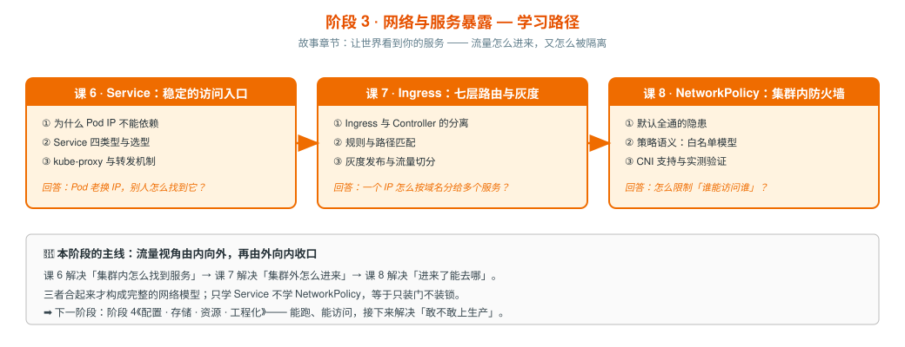

# 阶段 3：网络与服务暴露

> 所属课程：Kubernetes 系统学习 ｜ 故事章节：**让世界看到你的服务** ｜ 上一阶段：[阶段 2《工作负载与控制器》](../2-工作负载与控制器/overview.md)
> 下一阶段：[阶段 4《配置 · 存储 · 资源 · 工程化》](../4-配置存储资源工程化/overview.md)

## 🎯 本阶段目标

- 理解为什么不能依赖 Pod IP，以及 Service + CoreDNS 如何共同解决集群内寻址
- 能配置 Service + 七层入口把应用暴露到集群外，并说清四层与七层的分工
- 理解**两代入口标准**的取舍：Ingress（存量事实标准）与 Gateway API（面向未来，CKA 2025 已纳入）
- 能用 NetworkPolicy 做最小权限隔离，理解「默认全通」的安全含义

## 📍 学习重点

- **Pod 是「牲畜」不是「宠物」**：Pod 会销毁重建，IP 必然变化 —— 服务发现必须建立在稳定抽象上
- **Service 的转发机制**：ClusterIP 是虚拟 IP（不是真实网卡），kube-proxy 负责把流量转走
- **标签与选择算符是 k8s 的「胶水」**：Service 靠 selector 找到 Pod、Deployment 靠它管 ReplicaSet、NetworkPolicy 靠它限定范围。它本身简单，但缺了它后面每一课都要临时补 —— 故放在课 7「Service 如何找到后端」这个最直观的场景里讲，而不是抽象地提前讲
- **EndpointSlice 才是 kube-proxy 的真实数据源**：老教程讲的 Endpoints 已是大集群下的性能瓶颈，v1.34 实际使用 EndpointSlice 分片存储后端。「Service 后面没有 Pod」的排障，看的是 EndpointSlice 有没有后端
- **CoreDNS 把名字变成地址**：集群内 DNS 约定（`svc.ns.svc.cluster.local`）是服务发现的基础
- **Ingress 与 Controller 的分离**：Ingress 只是一份「规则声明」，真正干活的是 Controller —— 这是 k8s 的经典套路（声明与实现分离），阶段 4 的 StorageClass 还会再见到
- **⚠️ ingress-nginx 已 EOL**：社区版 `kubernetes/ingress-nginx` 已于 **2026-03-24 退役**（2025-11-11 官方宣布），此后无安全补丁；且 Ingress API 已功能冻结，新特性只进 Gateway API。**课 8 讲 Ingress 时必须标注此现状，不得作为推荐实践教授**
- **Gateway API 是继任者**：三层模型（GatewayClass / Gateway / HTTPRoute）解决了 Ingress 的角色分离与表达能力不足问题，CKA 2025 考纲已纳入
- **NetworkPolicy 是白名单模型**：默认全通，一旦某方向有策略就变成默认拒绝 —— 这个语义反直觉但至关重要
- **⚠️ CNI 支持性必须实测**：不是所有 CNI 都真正执行 NetworkPolicy。kind 默认用 kindnet，**需在写课 10 时实测确认**其行为，不得凭记忆断言

## ✅ 必须掌握的知识点

| 知识点 | 所属课 | 学完应能 |
|--------|--------|----------|
| 为什么 Pod IP 不能直接依赖 | 课 7 | 解释 Pod IP 不稳定的根因与后果 |
| 标签与选择算符 | 课 7 | 书写 label 与 selector（含 matchLabels / matchExpressions），说清它是 Service、Deployment、NetworkPolicy、HPA 的关联基础 |
| Service 类型与选型 | 课 7 | 区分 ClusterIP/NodePort/LoadBalancer/ExternalName，说清各自场景 |
| kube-proxy 与转发机制 | 课 7 | 说清 iptables/IPVS 模式下流量如何到达后端 Pod |
| EndpointSlice 与后端列表 | 课 7 | 说清 kube-proxy 从 EndpointSlice 获取后端（Endpoints 已是旧机制），能用它排查「Service 后面没有后端」 |
| CoreDNS 与服务发现 | 课 7 | 说清集群内 DNS 命名约定与解析链路，能排查解析失败 |
| Ingress 与 Controller 的分离 | 课 8 | 解释「声明与实现分离」设计，说清为什么必须另装 Controller |
| Ingress 规则与路径匹配 | 课 8 | 配置基于 host/path 的路由规则 |
| 灰度发布与流量切分 | 课 8 | 用 canary 方式做灰度，说清权重切分的实现思路 |
| ingress-nginx 退役与 Ingress 现状 | 课 8 | 说清 EOL 时间线与 Ingress API 功能冻结，能给出迁移判断 |
| Gateway API 三层模型 | 课 9 | 说清 GatewayClass / Gateway / HTTPRoute 的职责分工 |
| HTTPRoute 与流量治理 | 课 9 | 配置 HTTPRoute 实现路由、权重切分与 header 匹配 |
| 从 Ingress 迁移与选型 | 课 9 | 给出 Ingress vs Gateway API 的选型理由与迁移路径 |
| 默认全通的隐患 | 课 10 | 解释为什么「集群内全互通」在生产上是风险 |
| NetworkPolicy 语义 | 课 10 | 正确书写 ingress/egress 白名单规则，理解叠加语义 |
| CNI 支持与验证 | 课 10 | **实测**确认当前 CNI 是否真正执行策略，而非假设它支持 |

## 🗺️ 本阶段路径图

> SVG 展示四课递进：课 7（集群内寻址）→ 课 8（集群外进入 · 存量方案）→ 课 9（集群外进入 · 新一代）→ 课 10（进来后的访问控制）。

## 课 10 核心结论（2026-09-11 交付 · 阶段收官）

- **默认全通，命名空间不是安全边界**：无任何策略时**跨命名空间照样通**（实测）。网络隔离**必须**显式写 NetworkPolicy。
- **白名单模型**：只能写"允许"，不能写"拒绝"。要拒绝 = 选中一批 Pod + 不给任何 allow 规则。多条策略**叠加取并集（OR）**，没有优先级、没有 deny 覆盖。
- **`policyTypes` 决定管控方向**：只写 `Ingress` 时被管 Pod 的**出站仍全通**（实测能访问外网）。想管出站必须显式写 `Egress`。
- **写 egress 必放行 DNS**（最高频的坑）：否则"**按 Service 名失败、按 Pod IP 直连成功**"（完整复现）。诊断信号 + 修复模板已入讲义。
- **策略生效与否取决于 CNI，且必须实测**：资源**没有 status**；`apply` 成功 ≠ 生效。

> ✅ **【重要实测结论 · 推翻网络流行说法】kindnet 确实执行 NetworkPolicy**
> 多个网络资料（含 2026 年的教程）称"kindnet 不支持 NetworkPolicy"（常与 Flannel 并列）。**本机实测推翻**：`kindest/kindnetd:v20250512-df8de77b` **确实执行**，且为**端口级精确控制**。
> **证据链**（因果对照法，排除假阳性）：无策略通 → 加 default-deny 超时 → **删策略恢复** → 再加再拦（可重复）→ 叠加放行恢复 → **只放行 81 时 80 被拦**。
> **旁证**：失败现象可区分（策略拦截 = `download timed out`；服务未监听 = `Connection refused`）；kindnet ClusterRole 含 `["networking.k8s.io"] | ["networkpolicies"]`。
> **教训**：网络资料会过时，**换集群/换 CNI 版本必须重新实测**。

**阶段 3 状态**：四课（课 7-10）**全部交付完成**，下一阶段为阶段 4《配置、存储、资源与工程化》。

## 课 9 核心结论（2026-09-10 交付）

- **三层模型是「角色分离」**：GatewayClass（管理员定用谁）→ Gateway（运维开门）→ HTTPRoute（开发写规则）。**三层缺一不可**，且每层都用 `status.conditions` + `reason` 自报状态。
- **`weight` 从注解变标准字段**：课 8 的 `nginx.ingress.kubernetes.io/canary-weight` 换控制器即静默失效；课 9 的 `backendRefs[].weight` 任何兼容实现都认（实测 90:10 → 182/18，50:50 → 100/100）。
- **跨命名空间默认拒绝**：需 `ReferenceGrant` 显式授权，且**必须建在被引用方命名空间**（无授权 → `RefNotPermitted` + 500；授权后自动恢复）。Ingress 无此能力（后端强制同 namespace）。

> ⚠️ **课 9 实测环境坑（后续复习/重建时必看）**
> 1. **Traefik v3.7.13 的 Gateway API provider 在当前 CRD 下不完整** —— 它 watch `v1.BackendTLSPolicy` / `v1.TLSRoute`；standard channel 缺这两个 CRD，v1.2.1/v1.3.0 experimental 只给 `v1alpha3`，v1.4.1 解决了 BackendTLSPolicy 但 `TLSRoute` 仍最高 `v1alpha3` → GatewayClass 卡在 `Unknown`。**本课改用 Envoy Gateway v1.6.1（零报错）。**
> 2. **kind 无云 LB** → Envoy Gateway 默认建 `LoadBalancer` 会 `<pending>`、`Programmed=False reason=AddressNotAssigned`，**必须改 NodePort**。
> 3. **本机未装 `jq`**，讲义命令已全部改为 kubectl 原生写法。

## 本阶段产出

- [x] `lessons/lesson-07-Service与CoreDNS集群内寻址.md`
- [x] `lessons/lesson-08-Ingress七层路由与灰度发布.md`
- [x] `lessons/lesson-09-GatewayAPI下一代入口标准.md`
- [x] `lessons/lesson-10-NetworkPolicy集群内防火墙.md`
