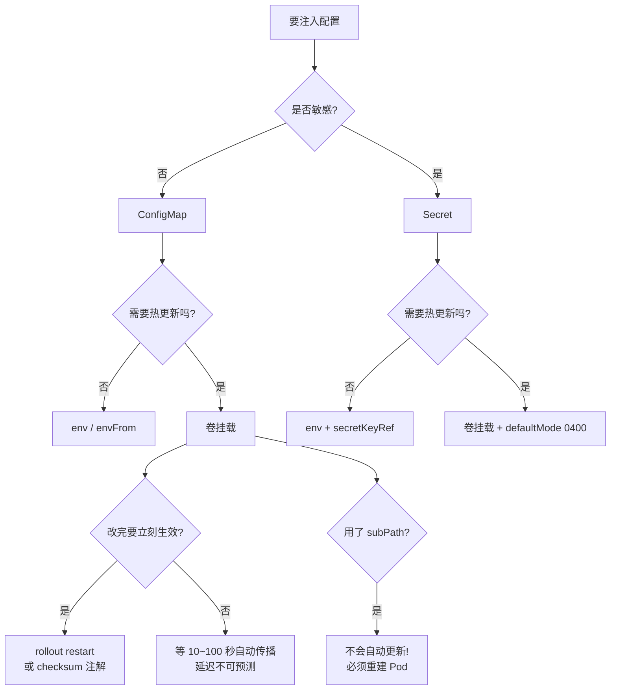

# 第 11 课：ConfigMap 与 Secret：配置与代码的分离

> 所属阶段：阶段 4《配置 · 存储 · 资源 · 工程化》 ｜ 故事章节：**从能用到敢上生产**
> 上一课：[第 10 课：NetworkPolicy：集群内的防火墙](../../3-网络与服务暴露/lessons/lesson-10-NetworkPolicy集群内防火墙.md)
> 下一课：第 12 课：存储 Volume 与 PV/PVC

---

## 🎯 本课目标

学完本课，你应该能够：

1. 用 ConfigMap 注入配置，说清**环境变量**与**卷挂载**两种形式的本质差异（尤其更新行为）
2. 创建并使用 Secret，**说清 base64 与加密的区别**，知道真正的加固手段是什么
3. 用**投射卷**把 ConfigMap / Secret / downward API 合并挂载到同一目录
4. 说清配置变更后 Pod **会不会**自动重启，以及三种主动触发手段
5. 排查"配置改了但没生效"这类高频故障

---

## 第一幕：起源与场景引入

### 一个熟悉的困境

假设你写了一个 Web 应用，需要连数据库。开发时你这么写：

```python
DB_HOST = "localhost"
DB_PASSWORD = "dev123"
```

现在要部署到三套环境：开发、测试、生产。三套环境的数据库地址和密码都不一样。

**最朴素的做法**：为每个环境打一个镜像。

```dockerfile
# 开发环境镜像
FROM python:3.11
ENV DB_HOST="dev-db.internal"
ENV DB_PASSWORD="dev123"
COPY app.py .
```

```dockerfile
# 生产环境镜像
FROM python:3.11
ENV DB_HOST="prod-db.internal"
ENV DB_PASSWORD="P@ssw0rd-SuperSecret!"
COPY app.py .
```

代码**一模一样**，只因配置不同就要打两个镜像。这带来一连串问题：

- **镜像不可复现**：你验证过的是开发镜像，上线的是生产镜像 —— 严格说这是**两个制品**
- **改个密码要重新构建**：走一遍 CI、重新推送、重新拉取，只为了改一行字符串
- **密码进了镜像层**：任何能 `docker pull` 的人都能 `docker history` 看到密码，且删不掉（镜像层是叠加的）

### 十二要素应用的呼声

业界早有共识，即 [The Twelve-Factor App](https://12factor.net/config) 的第三条：

> **配置与代码严格分离**。配置在不同部署环境间差异很大，代码则完全一致。

判断标准很简单：**这个值换成别的环境还能不能开源？** 数据库地址可以，数据库密码不行 —— 两者都属于配置，都要外置。

### Kubernetes 的答案

K8s 提供了两个对象来承接这件事：

| 对象 | 用途 | 典型内容 |
|------|------|----------|
| **ConfigMap** | 存**非敏感**配置 | 日志级别、特性开关、Nginx 配置片段 |
| **Secret** | 存**敏感**配置 | 密码、Token、证书私钥 |

它们的价值在于：**镜像保持不变，配置在运行时注入**。同一个镜像，在开发集群挂开发 ConfigMap，在生产集群挂生产 ConfigMap。

### 但分离之后，冒出一个新问题

配置外置解决了"改配置要重打镜像"，却引入了一个**更隐蔽的坑**：

> 你改了 ConfigMap，然后发现 —— **应用读到的还是旧值**。

这不是 bug，是设计。理解"为什么会这样"，正是本课最实用的一节。我们会用实测把它钉死。

---

## 第二幕：认知冲突

### 冲突一：名字叫 Secret，其实只是 base64

很多人的第一印象是：既然叫 Secret，那它应该是**加密**存储的，只有授权的人才能解开。

我们做个实验。先创建一个 Secret：

```bash
kubectl -n l11 create secret generic dbsecret \
  --from-literal=username=admin \
  --from-literal=password='P@ssw0rd-SuperSecret!'
```

现在**查看**它：

```bash
kubectl -n l11 get secret dbsecret -o yaml
```

本机实测输出：

```yaml
apiVersion: v1
data:
  password: UEBzc3cwcmQtU3VwZXJTZWNyZXQh
  username: YWRtaW4=
kind: Secret
metadata:
  name: dbsecret
  namespace: l11
type: Opaque
```

看到 `UEBzc3cwcmQtU3VwZXJTZWNyZXQh`，你可能会想："这是密文，解不开。"

**试一下这一行**：

```bash
kubectl -n l11 get secret dbsecret -o jsonpath='{.data.password}' | base64 -d
```

本机实测输出：

```
P@ssw0rd-SuperSecret!   <-- 明文原样还原，无需任何密钥
```

**没有密钥，没有口令，一行 `base64 -d` 就还原了。**

因为 base64 根本不是加密，它是一种**编码**——把二进制数据转成可打印字符的表示法。它的目的是"让数据能安全穿过只认文本的通道"，就像把行李装进透明塑料袋：方便搬运，但**谁都能看见里面**。

> **Secret 防的是「误看」，不是「被拿」。**

它真正的价值是：把敏感值从 YAML 清单里**隔离出去**，让你不必把密码写进 Deployment 提交到 Git。但一旦数据进了 etcd，它就是 base64 明文。

真正的安全要靠三件套（**阶段 5 展开**）：etcd 静态加密 + RBAC 最小授权 + 外部密钥管理（Vault / 云厂商 KMS）。

### 冲突二：配置改了，Pod 却毫无反应

第二个冲突更常见，也更让人困惑。

你改了 ConfigMap 里的日志级别，满怀期待地等应用切换成 debug，结果：

- 用**环境变量**注入的：值**永远不变**，直到 Pod 重建
- 用**卷挂载**注入的：值**会变，但延迟极不稳定**（本机实测 10~100 秒）
- 用 **subPath** 挂载的：值**永远不变**（这是个著名陷阱）

而 Deployment **完全不会**因为 ConfigMap 变化而滚动更新 —— 因为 Deployment 只关心 Pod 模板（template）变没变，ConfigMap 不在模板里。

我们稍后用实测把这三种情况逐一验证。

### 冲突三：挂载后 ls 看到的"文件"全是软链接

当你挂载 ConfigMap 后 `ls -la`，会看到奇怪的东西：

```
lrwxrwxrwx  1 root root   16 LOG_LEVEL -> ..data/LOG_LEVEL
drwxr-xr-x  2 root root  160 ..2026_09_11_02_42_36.2756406232
lrwxrwxrwx  1 root root   32 ..data -> ..2026_09_11_02_42_36.2756406232
```

每个键都是一个**符号链接**，指向一个带时间戳的隐藏目录。为什么搞这么复杂？

因为这是实现**原子更新**的关键：更新时 K8s 写入一个**全新的**时间戳目录，然后把 `..data` 这个软链接**一次性改指**过去。对应用来说，切换是瞬时的，永远不会读到"写了一半"的状态。这也解释了为什么更新有延迟 —— 需要等 kubelet 同步周期。

理解了这三点，就可以进入正文了。

---

## 第三幕：层层揭示

### 知识点 1：ConfigMap

#### 一句话定义

ConfigMap 是一个**键值对的命名容器**，把配置从镜像中剥离出来，在 Pod 创建时注入给容器。

#### 直觉建立（类比）

把 ConfigMap 想成**电视机后面的那排接口**。

电视机（镜像）本身是通用的，出厂时不知道你会接游戏机还是机顶盒。你把什么线插上去（注入什么 ConfigMap），它就播什么内容。换节目源不需要换电视机，重新插一下线就行。

更进一步，两种注入方式对应两种"接线"逻辑：

| 注入方式 | 类比 | 特点 |
|----------|------|------|
| **环境变量** | 把频道号**抄在纸条上**塞给遥控器 | 纸条交出去就定了，之后改频道号，遥控器手上的纸条不会自己变 |
| **卷挂载** | 接了一根**实时信号线** | 电视台换了节目，电视机切一下就能看到新的（有短暂延迟） |

这个"纸条 vs 信号线"的差别，就是本课最核心的**更新行为差异**。

#### 核心原理

**1）三种创建方式**

```bash
# ① 命令行字面量（最直接）
kubectl -n l11 create configmap appconf \
  --from-literal=LOG_LEVEL=info \
  --from-literal=MAX_CONN=100

# ② 从文件（键 = 文件名，值 = 文件内容）——适合配置文件
kubectl -n l11 create configmap nginxconf --from-file=nginx.conf

# ③ 从整个目录（每个文件变成一个键）
kubectl -n l11 create configmap dirconf --from-file=./conf/
```

声明式写法（推荐进 Git 管理）：

```yaml
apiVersion: v1
kind: ConfigMap
metadata:
  name: appconf
  namespace: l11
data:
  LOG_LEVEL: "info"
  MAX_CONN: "100"
  app.properties: |
    # 用 | 可以写多行配置片段
    server.port=8080
    server.timeout=30s
```

注意 `MAX_CONN: "100"` 的引号 —— **ConfigMap 的值只能是字符串**，不加引号 YAML 会解析成数字，K8s 会拒绝。

**2）两种注入方式**

环境变量形式（单个键）：

```yaml
env:
- name: LOG_LEVEL_ENV          # 容器内的变量名（可自定义）
  valueFrom:
    configMapKeyRef:
      name: appconf            # ConfigMap 名
      key: LOG_LEVEL           # ConfigMap 里的键
```

批量注入（整个 ConfigMap 变环境变量）：

```yaml
envFrom:
- configMapRef:
    name: appconf
```

卷挂载形式：

```yaml
volumes:
- name: cmvol
  configMap:
    name: appconf
containers:
- volumeMounts:
  - name: cmvol
    mountPath: /etc/config      # 每个键变成该目录下的一个文件
```

**3）更新传播机制（重点）**

卷挂载之所以能自动更新，靠的是前面看到的**软链接结构**。更新流程：

1. 你改了 ConfigMap
2. kubelet 在**同步周期**（默认约 1 分钟）内发现变化
3. 写入新目录 `..2026_09_11_02_44_53` 这样的时间戳目录
4. 把 `..data` 软链**原子地**改指到新目录

而环境变量是 kubelet 在**创建容器时**一次性写进容器配置的，之后 kubelet 不会再碰它 —— 所以**永远不会更新**。

#### 示例演示

**实验：同一 ConfigMap，两种注入方式，观察更新差异**

建一个同时用两种方式的 Pod：

```yaml
apiVersion: v1
kind: Pod
metadata:
  name: dual
  namespace: l11
spec:
  containers:
  - name: c
    image: busybox:1.36
    command: ['sh','-c','sleep 3600']
    env:
    - name: LOG_LEVEL_ENV
      valueFrom:
        configMapKeyRef:
          name: appconf
          key: LOG_LEVEL
    volumeMounts:
    - name: cmvol
      mountPath: /etc/config
  volumes:
  - name: cmvol
    configMap:
      name: appconf
```

初始状态（本机实测）：

```
ENV(环境变量形式) = info
VOL(卷挂载形式)   = info
```

修改 ConfigMap：

```bash
kubectl -n l11 patch configmap appconf --type merge -p '{"data":{"LOG_LEVEL":"debug"}}'
```

然后按时间采样（本机实测，清空环境后完整重跑）：

```
--- 立刻查看（0 秒） ---
ENV = info
VOL = info

--- 等待 10 秒后再看 ---
ENV = info
VOL = info

--- 再等 30 秒（累计 40 秒）---
ENV = info
VOL = info
```

继续观测，直到更新发生（本机实测）：

```
  累计 50 秒: VOL = info
  累计 60 秒: VOL = info
  累计 70 秒: VOL = info
  累计 80 秒: VOL = info
  累计 90 秒: VOL = info
  累计 100 秒: VOL = debug
  >>> 第 100 秒更新完成

ENV(最终) = info
```

**实测结论**：

- 卷挂载最终会更新，但**延迟极不稳定**：本机四次实测 **10 秒 / 50 秒 / 70 秒 / 100 秒**，跨越一个数量级
- 环境变量**始终是 `info`**，改一万次也不会变

> ⚠️ 延迟受 kubelet `--sync-frequency`（默认 1 分钟）、ConfigMap 缓存 TTL 与集群负载影响。**生产环境不要依赖它做配置热更新** —— 不可预测就是不可用，请用知识点 4 的手段。

#### 常见误区

**误区 1：以为 ConfigMap 更新后应用立刻生效**

三层延迟可能叠加：① kubelet 同步延迟（实测 10~100 秒，见上文实测数据）；② 应用自己没重新读文件（很多程序只在启动时读一次配置）；③ 如果用了 subPath，则永远不会更新（见知识点 4）。**即使卷里的文件变了，应用也可能还在用旧值。**

**误区 2：用环境变量注入需要热更新的配置**

环境变量一旦创建就固化。需要动态切换的开关、级别，**必须用卷挂载** + 应用支持 reload。

**误区 3：把 ConfigMap 当数据库用**

ConfigMap 有硬上限：**1048576 字节（1MB）**。本机实测超限报错：

```
error: failed to create configmap: ConfigMap "toobig" is invalid:
  []: Too long: may not be more than 1048576 bytes
```

大量配置应该放配置中心，不是 ConfigMap。

**误区 4：envFrom 的键名校验**

你可能听说"非法环境变量名的键会被静默跳过"。**本机实测推翻了这个说法**（v1.34）：

```yaml
data:
  GOOD_KEY: ok
  "bad-key": "含连字符，不是合法环境变量名"
```

实测结果：

```bash
kubectl -n l11 exec envfrom-bad -- printenv "bad-key"
# 输出：含连字符，不是合法环境变量名
# exit code = 0
```

`bad-key` **确实被设置进去了**，而且**没有任何 Warning 事件**。只是 shell 里不能用 `$bad-key` 引用（连字符会被当成减号），必须用 `printenv "bad-key"`。

所以：**不要依赖 K8s 帮你过滤非法键名**，自己保证键名符合 `[A-Za-z_][A-Za-z0-9_]*`。

**误区 5：ConfigMap 跨命名空间引用**

ConfigMap **只能被同命名空间的 Pod 引用**。跨命名空间必须复制一份。

#### 一句话记住

> **ConfigMap 让镜像保持通用；但记住——环境变量是「抄给容器的纸条」永不更新，卷挂载是「接了根信号线」几十秒后才变。**

#### 官方文档

- [ConfigMap 概念](https://kubernetes.io/docs/concepts/configuration/configmap/)
- [配置 Pod 使用 ConfigMap](https://kubernetes.io/docs/tasks/configure-pod-container/configure-pod-configmap/)
- [使用 ConfigMap 配置 Redis](https://kubernetes.io/docs/tutorials/configuration/configure-redis-using-configmap/)

---

### 知识点 2：Secret

#### 一句话定义

Secret 是与 ConfigMap 结构几乎相同的对象，用于存放敏感数据 —— 但它**默认只做 base64 编码，不加密**。

#### 直觉建立（类比）

**Secret 是一个透明的文件袋，不是保险箱。**

ConfigMap 是一张**便签纸**，内容直接写在上面，谁路过都能瞄一眼。
Secret 是一个**透明文件袋**：纸张装进去了，不会散落在桌上（不会混在你的 YAML 清单里被提交到 Git），但袋子是透明的 —— 拿起来照样能读。

保险箱（真加密）需要另配：etcd 静态加密、RBAC 授权、外部 KMS。

#### 核心原理

**1）Secret 的类型**

| 类型 | 用途 |
|------|------|
| `Opaque` | 通用，任意键值（默认） |
| `kubernetes.io/dockerconfigjson` | 私有镜像仓库凭据 |
| `kubernetes.io/tls` | TLS 证书 + 私钥 |
| `kubernetes.io/service-account-token` | ServiceAccount Token（k8s 1.24+ 不再自动生成） |
| `kubernetes.io/basic-auth` / `ssh-auth` | 基础认证 / SSH 密钥（内置键名约定） |

**2）data 与 stringData 的区别**

- `data`：值必须是 **base64 编码**后的字符串
- `stringData`：写**明文**，K8s 自动帮你转成 base64 存进 `data`（写时方便，读时看不到）

本机实测：

```yaml
apiVersion: v1
kind: Secret
metadata:
  name: sd-demo
type: Opaque
stringData:
  raw: "我是明文写的"
```

```
用 stringData 写入后，k8s 会自动转成 base64 存：
5oiR5piv5piO5paH5YaZ55qE
解码回来：
我是明文写的
```

> `stringData` 是**只写字段**：apply 之后 `kubectl get -o yaml` 看不到它，只能看到 `data`。

**3）注入方式与 ConfigMap 完全对应**

```yaml
# 环境变量（单个）
env:
- name: DB_PASSWORD
  valueFrom:
    secretKeyRef:
      name: dbsecret
      key: password

# 卷挂载
volumes:
- name: s
  secret:
    secretName: dbsecret
```

**4）默认文件权限与 defaultMode**

Secret 挂载为文件时，**默认权限是 `0644`**（ConfigMap 也一样）。这意味着容器内任何用户都能读。

可以用 `defaultMode` 收紧：

```yaml
volumes:
- name: s
  secret:
    secretName: dbsecret
    defaultMode: 0400        # 只有 owner 可读
```

#### 示例演示

**实验 1：证明 base64 不是加密**

```bash
kubectl -n l11 create secret generic dbsecret \
  --from-literal=username=admin \
  --from-literal=password='P@ssw0rd-SuperSecret!'
```

查看（本机实测）：

```yaml
data:
  password: UEBzc3cwcmQtU3VwZXJTZWNyZXQh
  username: YWRtaW4=
```

还原（本机实测）：

```bash
kubectl -n l11 get secret dbsecret -o jsonpath='{.data.password}' | base64 -d
P@ssw0rd-SuperSecret!   <-- 明文原样还原，无需任何密钥
```

**这就是 Secret 的真实安全边界：能 `kubectl get secret` 的人 = 能看到明文密码的人。**

**实验 2：文件权限对比（本课最有说服力的安全实验）**

建两个 Pod，一个用默认权限，一个用 `defaultMode: 0400`。

注意：`ls -la` 看到的软链接永远是 `777`，**真实权限要看 `..data` 里的文件**：

```bash
kubectl -n l11 exec secperm  -- sh -c 'stat -c "%a %n" /etc/secret/..data/*'
kubectl -n l11 exec secperm2 -- sh -c 'stat -c "%a %n" /etc/secret/..data/*'
```

本机实测：

```
--- secperm（未设 defaultMode，默认 0644）真实文件权限 ---
644 /etc/secret/..data/password
644 /etc/secret/..data/username

--- secperm2（defaultMode: 0400）真实文件权限 ---
400 /etc/secret/..data/password
400 /etc/secret/..data/username
```

验证实际效果 —— 以 `nobody` 用户读取（本机实测）：

```bash
# secperm2（0400）
cat: can't open '/etc/secret/password': Permission denied
command terminated with exit code 1

# secperm（0644）
P@ssw0rd-SuperSecret!
```

**默认权限下，容器里任何用户都能读出数据库密码。加了 `defaultMode: 0400` 才真正挡住。**

**实验 3：环境变量形式的泄露面**

用 `envFrom` 注入 Secret 后，密码进入进程环境：

```yaml
envFrom:
- configMapRef:
    name: appconf
- secretRef:
    name: dbsecret
```

本机实测：

```bash
kubectl -n l11 exec envfrom -- sh -c 'env | grep password'
password=P@ssw0rd-SuperSecret!

kubectl -n l11 exec envfrom -- sh -c 'tr "\0" "\n" < /proc/1/environ | grep password'
password=P@ssw0rd-SuperSecret!
```

环境变量形式的风险面明显更大：

- `docker inspect` 能看到
- `/proc/<pid>/environ` 能读到
- 崩溃日志、APM 上报经常**把整个环境打出去**
- 子进程会继承

**卷挂载 + `defaultMode: 0400` 是更安全的选择。**

**一个容易被忽略的差异：Secret 卷不落盘，ConfigMap 卷落盘**

K8s 用 **tmpfs**（内存文件系统）挂载 **Secret** 卷，数据**不写入节点磁盘**。但 ConfigMap 卷**不是** tmpfs —— 这点很多人搞混。

实测对比（本机实测，`df -h` 看挂载点）：

```
--- 投射卷 /etc/app（含 Secret）---
tmpfs      31.1G   20.0K   31.1G   0% /etc/app

--- Secret 卷 /etc/secret ---
tmpfs      31.1G    8.0K   31.1G   0% /etc/secret

--- ConfigMap 卷 /etc/config ---
/dev/sdd  1006.9G  194.5G  761.1G  20% /etc/config     ← 落盘！

--- 对照：容器根路径 ---
overlay   1006.9G  194.5G  761.1G  20% /
```

mount 表进一步确认：

```bash
kubectl -n l11 exec proj -- sh -c 'mount | grep etc/app'
# tmpfs on /etc/app type tmpfs (ro,relatime,size=32582808k,noswap)
```

**结论**：

- **Secret 卷 / 含 Secret 的投射卷** → tmpfs，**不落盘**。节点磁盘被物理拿走也读不到
- **ConfigMap 卷** → 走普通磁盘，**会落盘**（但配置本来就不敏感，问题不大）

所以挂载 Secret 时，**卷挂载在三个维度上都优于环境变量**：不落盘、可控权限、不入进程环境。

#### 常见误区

**误区 1：以为 Secret 是加密的**

重申：**默认不是**。它只是 base64。真正的加密需要开启 [etcd 静态加密](https://kubernetes.io/docs/tasks/administer-cluster/encrypt-data/)（阶段 5 展开）。

**误区 2：把 Secret 提交到 Git**

`kubectl create secret --from-literal` 生成的 YAML 里是 base64，有人把这份 YAML 提交进 Git 并认为"反正看不出来"。**base64 可逆，等于明文入库。** 正确做法：用 Sealed Secrets、External Secrets Operator 或直接引用外部 KMS。

**误区 3：用 envFrom 一次性把整个 Secret 倒进环境**

方便但危险（见实验 3）。生产建议**按需逐个引用** `secretKeyRef`，并用卷挂载。

**误区 4：以为 Secret 变大就安全了**

Secret 同样有 **1MB 限制**，且所有 Secret 都会进 etcd。大量数据请放外部系统。

**误区 5：Secret 更新后 Pod 会重启**

和 ConfigMap 一样：**不会**。卷挂载会更新（有延迟），环境变量不会。

#### 一句话记住

> **Secret 是「透明文件袋」不是「保险箱」—— base64 一秒还原；挂载时记得 `defaultMode: 0400`，别用 envFrom 把密码倒进环境。**

#### 官方文档

- [Secret 概念](https://kubernetes.io/docs/concepts/configuration/secret/)
- [静态加密 Secret 数据](https://kubernetes.io/docs/tasks/administer-cluster/encrypt-data/)
- [Secret 安全最佳实践](https://kubernetes.io/docs/concepts/security/secrets-good-practices/)

---

### 知识点 3：投射卷 projected volume

#### 一句话定义

投射卷（projected volume）把**多个来源**（ConfigMap、Secret、downward API、ServiceAccount token）**合并挂载到同一个目录**，让它们看起来像是"本来就在那儿的一堆文件"。

#### 直觉建立（类比）

普通卷挂载像**接不同的线到不同的插座**：ConfigMap 接客厅，Secret 接卧室，downward API 接厨房。应用要去三个房间取东西。

投射卷像**把三根线捆成一根线接到同一个插排**：应用只需要看一个目录，里面 `LOG_LEVEL`、`password`、`podname` 整整齐齐排在一起。

#### 核心原理

```yaml
volumes:
- name: allinone
  projected:
    sources:
    - configMap:
        name: appconf
    - secret:
        name: dbsecret
    - downwardAPI:
        items:
        - path: "podname"
          fieldRef:
            fieldPath: metadata.name
```

四种可用来源：

| 来源 | 提供什么 |
|------|----------|
| `configMap` | 配置项 |
| `secret` | 敏感数据 |
| `downwardAPI` | Pod 自身元数据（名称、命名空间、标签、资源限制） |
| `serviceAccountToken` | 绑定 ServiceAccount 的 JWT Token |

**downward API 的价值**：应用常常需要"知道自己在哪" —— 比如日志里打上 Pod 名、按 CPU limit 调整线程池。downward API 让 Pod 不必调 API Server 就能拿到这些信息。

**为什么需要投射卷？** 因为**同一个 `mountPath` 不能挂两个 volume**。想在 `/etc/app/` 同时放 ConfigMap 和 Secret，普通写法做不到，投射卷可以。

#### 示例演示

**实验：三来源合并挂载**

```yaml
apiVersion: v1
kind: Pod
metadata:
  name: proj
  namespace: l11
spec:
  containers:
  - name: c
    image: busybox:1.36
    command: ['sh','-c','sleep 3600']
    volumeMounts:
    - name: allinone
      mountPath: /etc/app
  volumes:
  - name: allinone
    projected:
      sources:
      - configMap:
          name: appconf
      - secret:
          name: dbsecret
      - downwardAPI:
          items:
          - path: "podname"
            fieldRef:
              fieldPath: metadata.name
          - path: "memlimit"
            resourceFieldRef:
              containerName: c
              resource: limits.memory
```

查看合并结果（本机实测）：

```bash
kubectl -n l11 exec proj -- sh -c 'ls -la /etc/app/'
```

```
drwxr-xr-x  2 root root  160 ..2026_09_11_02_42_36.2756406232
lrwxrwxrwx  1 root root   32 ..data -> ..2026_09_11_02_42_36.2756406232
lrwxrwxrwx  1 root root   16 LOG_LEVEL -> ..data/LOG_LEVEL
lrwxrwxrwx  1 root root   15 MAX_CONN -> ..data/MAX_CONN
lrwxrwxrwx  1 root root   15 memlimit -> ..data/memlimit
lrwxrwxrwx  1 root root   15 password -> ..data/password
lrwxrwxrwx  1 root root   14 podname -> ..data/podname
lrwxrwxrwx  1 root root   15 username -> ..data/username
```

逐个读取（本机实测）：

```
--- /etc/app/LOG_LEVEL ---  debug          (来自 ConfigMap)
--- /etc/app/MAX_CONN ---   100            (来自 ConfigMap)
--- /etc/app/username ---   admin          (来自 Secret)
--- /etc/app/password ---   P@ssw0rd-SuperSecret!  (来自 Secret)
--- /etc/app/podname ---    proj           (来自 downward API)
```

**三个来源的文件出现在同一层目录里。** 如果不用投射卷，需要写 3 个 volume + 3 个 volumeMount，且必须挂到三个不同目录。

#### 常见误区

**误区 1：以为投射卷会覆盖同名文件**

如果 ConfigMap 和 Secret 有同名键，**行为未定义**（实际取决于 source 顺序）。不要用同名键。

**误区 2：投射卷里的 Secret 权限自动收紧**

不会。投射卷的 Secret 部分同样支持 `defaultMode`，但**要显式写**：

```yaml
- secret:
    name: dbsecret
    defaultMode: 0400
```

**误区 3：downward API 能拿到任何 Pod 信息**

只能拿**自己 Pod** 的信息，且字段有限（名称、命名空间、UID、标签、注解、资源 limit/request）。拿不到其他 Pod 的信息，那要调 API Server。

#### 一句话记住

> **投射卷 = 多来源合并挂到同一目录；解决的是「同一 mountPath 不能挂两个 volume」的限制。**

#### 官方文档

- [投射卷](https://kubernetes.io/docs/concepts/storage/projected-volumes/)
- [downward API](https://kubernetes.io/docs/concepts/workloads/pods/downward-api/)

---

### 知识点 4：配置变更与滚动更新联动

#### 一句话定义

修改 ConfigMap/Secret **不会**触发 Deployment 滚动更新；要让新配置生效，必须**主动重建 Pod**。

#### 直觉建立（类比）

想象 Deployment 是个**按图纸施工的工地**。

图纸 = Pod 模板（template）。工地只检查"图纸改了没" —— 改了就推倒重建。

ConfigMap 是**建筑材料**（砖头、水泥），放在工地旁边。你换了新一批水泥（改了 ConfigMap），工地**不会**因此推倒已建好的房子 —— 图纸没变啊！

要让新房用上新水泥，你得**主动下令重建**：`kubectl rollout restart`。

#### 核心原理

**为什么不会自动更新？**

Deployment 的滚动更新由 **ReplicaSet 的 Pod 模板 hash 变化**触发。ConfigMap 的内容**不在模板里** —— 模板里只有一句"去引用名叫 appconf 的 ConfigMap"。名字没变，hash 就不变，不触发重建。

**三种让新配置生效的手段**：

| 手段 | 做法 | 适用场景 |
|------|------|----------|
| ① `kubectl rollout restart` | 触发滚动重启 | **最常用**，手动执行 |
| ② 改 ConfigMap 名字 | 改 `configMapRef.name` 指向新 ConfigMap | GitOps，模板变了自动滚动 |
| ③ 把配置 hash 写进注解 | `checksum/config: {{sha256}}` | Helm 自动化，配置变则模板变 |

**手段 ③ 是 Helm 的标准做法**，模板里长这样：

```yaml
annotations:
  checksum/config: {{ include (print $.Template.BasePath "/configmap.yaml") . | sha256sum }}
```

ConfigMap 内容一变 → hash 变 → 注解变 → Pod 模板 hash 变 → 自动滚动更新。**这才是真正的"配置变更自动触发滚动更新"。**

**subPath 陷阱（重要）**

用了 `subPath` 的卷挂载，**永远不更新**。这是最隐蔽的坑之一。

#### 示例演示

**实验 1：证明改 ConfigMap 不触发滚动更新**

建一个引用 ConfigMap 的 Deployment：

```yaml
apiVersion: apps/v1
kind: Deployment
metadata:
  name: web
  namespace: l11
spec:
  replicas: 2
  selector:
    matchLabels:
      app: web
  template:
    metadata:
      labels:
        app: web
    spec:
      containers:
      - name: nginx
        image: nginx:1.27-alpine
        env:
        - name: LOG_LEVEL
          valueFrom:
            configMapKeyRef:
              name: appconf
              key: LOG_LEVEL
```

记录旧 Pod 并修改 ConfigMap（本机实测）：

```
旧 Pod: web-59bcbb5bf9-bfwqg
  容器内 LOG_LEVEL = debug

--- 修改 ConfigMap: debug -> error ---
20 秒后 Pod 列表:
NAME                   READY   STATUS    RESTARTS   AGE
web-59bcbb5bf9-bfwqg   1/1     Running   0          21s
web-59bcbb5bf9-df4wd   1/1     Running   0          21s

容器内值（环境变量永不更新）:
  LOG_LEVEL = debug
```

**AGE 没重置（Pod 没重建），值还是旧值。配置变更确实不触发滚动更新。**

**实验 2：rollout restart 主动触发**

```bash
kubectl -n l11 rollout restart deployment/web
```

本机实测：

```
更新前 Pod:
  web-59bcbb5bf9-bfwqg  AGE=37s
  web-59bcbb5bf9-df4wd  AGE=37s

更新后 Pod（名字应全变）:
  web-6f9df9b994-k6cv7  AGE=2s
  web-6f9df9b994-kdrlr  AGE=1s

新 Pod 内 LOG_LEVEL:
  容器内 LOG_LEVEL = error
```

**新 Pod 取到了新值 `error`。** `rollout restart` 的原理是给 Pod 模板加一个 `kubectl.kubernetes.io/restartedAt` 注解 —— 注解变了，hash 变了，触发滚动更新。

**实验 3：subPath 不更新（复现）**

```yaml
volumeMounts:
- name: cmvol
  mountPath: /etc/sub/level.conf
  subPath: LOG_LEVEL        # 只挂这一个键，且挂成指定文件名
```

改 ConfigMap 后等 70 秒（本机实测）：

```
普通卷挂载(proj)  = warn    <-- 已更新
subPath 挂载(subp) = error  <-- 还是旧值！
```

**subPath 挂载的文件不会自动更新。** 原因是 subPath 挂载绕过了 `..data` 软链机制，直接把文件绑定到目标路径。

**实验 4：immutable 不可变 ConfigMap**

给 ConfigMap 加 `immutable: true`：

```yaml
apiVersion: v1
kind: ConfigMap
metadata:
  name: immucm
data:
  KEY: value1
immutable: true
```

尝试修改（本机实测）：

```
The ConfigMap "immucm" is invalid: data: Forbidden: field is immutable when `immutable` is set
```

连把 `immutable` 改回 `false` 都不行：

```
The ConfigMap "immucm" is invalid: immutable: Forbidden: field is immutable when `immutable` is set
```

**不可变是单向门**。它的价值：① 防止误改；② **大幅降低 kubelet 的 watch 压力**（不可变 ConfigMap 不需要持续监听变化），大规模集群里能明显减轻 API Server 负担。

#### 常见误区

**误区 1：以为改了 ConfigMap 应用就能热更新**

四层障碍：① 环境变量永不更新；② 卷挂载延迟极不稳定（实测 10~100 秒）；③ subPath 永不更新；④ **应用自己可能只在启动时读一次配置**。四个都要打通才行。

**误区 2：用 subPath 挂载还期待自动更新**

subPath 挂载**放弃**了自动更新能力。如果你需要动态更新，别用 subPath。

**误区 3：把 `kubectl rollout restart` 当配置热更新**

`rollout restart` 是**重建 Pod**，会有服务抖动（虽然滚动更新保证不中断）。它不是"热更新"，是"优雅重启"。

**误区 4：immutable 设了还能改回来**

不能。要改只能**删除重建**。所以设 `immutable: true` 前先确认配置不会频繁变。

#### 一句话记住

> **改 ConfigMap 不触发滚动更新（hash 没变）；要生效就 `rollout restart`，或用 checksum 注解把配置 hash 写进模板实现自动化。**

#### 官方文档

- [配置变更的滚动更新](https://kubernetes.io/docs/concepts/configuration/configmap/#mounted-configmaps-are-updated-automatically)
- [不可变 ConfigMap/Secret](https://kubernetes.io/docs/concepts/configuration/configmap/#configmap-immutable)
- [kubectl rollout](https://kubernetes.io/docs/reference/kubectl/generated/kubectl_rollout/)

---

## 第四幕：实操验证

> 本节所有命令**逐条可照抄执行**，输出均为本机实测结果。

### 环境准备

```bash
# 集群：kind（k8s v1.34.0），单节点 k8s-c1-control-plane，CNI = kindnet
kubectl get nodes
```

本机实测：

```
NAME                   STATUS   ROLES           AGE   VERSION
k8s-c1-control-plane   Ready    control-plane   23h   v1.34.0
```

建命名空间与基础 ConfigMap：

```bash
kubectl create ns l11

kubectl -n l11 create configmap appconf \
  --from-literal=LOG_LEVEL=info \
  --from-literal=MAX_CONN=100
```

本机实测：

```yaml
apiVersion: v1
data:
  LOG_LEVEL: info
  MAX_CONN: "100"
kind: ConfigMap
metadata:
  name: appconf
  namespace: l11
```

### 验证 1：两种注入方式的更新差异（核心）

建对照 Pod：

```bash
cat <<'EOF' | kubectl -n l11 apply -f -
apiVersion: v1
kind: Pod
metadata:
  name: dual
spec:
  containers:
  - name: c
    image: busybox:1.36
    command: ['sh','-c','sleep 3600']
    env:
    - name: LOG_LEVEL_ENV
      valueFrom:
        configMapKeyRef:
          name: appconf
          key: LOG_LEVEL
    volumeMounts:
    - name: cmvol
      mountPath: /etc/config
  volumes:
  - name: cmvol
    configMap:
      name: appconf
EOF

kubectl -n l11 wait --for=condition=Ready pod/dual --timeout=120s
```

查看初始状态：

```bash
kubectl -n l11 exec dual -- sh -c 'echo "ENV = $LOG_LEVEL_ENV"'
kubectl -n l11 exec dual -- sh -c 'echo "VOL = $(cat /etc/config/LOG_LEVEL)"'
```

本机实测：

```
ENV(环境变量形式) = info
VOL(卷挂载形式)   = info
```

修改 ConfigMap 并采样：

```bash
kubectl -n l11 patch configmap appconf --type merge -p '{"data":{"LOG_LEVEL":"debug"}}'

# 每 10 秒采样一次，直到观测到变化（最长等 120 秒）
for i in $(seq 1 12); do
  T=$((i*10))
  V=$(kubectl -n l11 exec dual -- sh -c 'cat /etc/config/LOG_LEVEL' 2>/dev/null)
  echo "累计 ${T} 秒: VOL = $V"
  [ "$V" = "debug" ] && { echo ">>> 第 ${T} 秒更新完成"; break; }
  sleep 10
done

# 环境变量形式
kubectl -n l11 exec dual -- sh -c 'echo "ENV = $LOG_LEVEL_ENV"'
```

本机实测（**清空环境后完整重跑一遍的真实结果**）：

```
ENV(环境变量形式) = info
VOL(卷挂载形式)   = info

configmap/appconf patched
  累计 10 秒: VOL = info
  累计 20 秒: VOL = info
  累计 30 秒: VOL = info
  累计 40 秒: VOL = info
  累计 50 秒: VOL = info
  累计 60 秒: VOL = info
  累计 70 秒: VOL = info
  累计 80 秒: VOL = info
  累计 90 秒: VOL = info
  累计 100 秒: VOL = debug
  >>> 第 100 秒更新完成

ENV(最终) = info
```

> ⚠️ **延迟极不稳定，且比很多人以为的长**。本机四次实测分别为 **10 秒 / 50 秒 / 70 秒 / 100 秒**，跨越一个数量级，取决于 kubelet 同步周期、缓存 TTL 与集群负载。
> **生产环境绝不要依赖这个机制做配置热更新** —— 不可预测就是不可用。需要可靠更新请用知识点 4 的 `rollout restart` 或 checksum 注解。

**✅ 验证通过**：卷挂载会更新（但很慢），环境变量永不更新。

### 验证 2：Secret 的 base64 可逆性

```bash
kubectl -n l11 create secret generic dbsecret \
  --from-literal=username=admin \
  --from-literal=password='P@ssw0rd-SuperSecret!'

# 看存储形式
kubectl -n l11 get secret dbsecret -o yaml

# 一行还原
kubectl -n l11 get secret dbsecret -o jsonpath='{.data.password}' | base64 -d
```

本机实测：

```yaml
data:
  password: UEBzc3cwcmQtU3VwZXJTZWNyZXQh
  username: YWRtaW4=
```

```
P@ssw0rd-SuperSecret!   <-- 明文原样还原，无需任何密钥
```

**✅ 验证通过**：base64 不是加密，一行命令即可还原。

### 验证 3：Secret 文件权限与 defaultMode

建两个 Pod 做对比（默认权限 vs `defaultMode: 0400`）：

```bash
# ① 默认权限
cat <<'EOF' | kubectl -n l11 apply -f -
apiVersion: v1
kind: Pod
metadata:
  name: secperm
spec:
  containers:
  - name: c
    image: busybox:1.36
    command: ['sh','-c','sleep 3600']
    volumeMounts:
    - name: s
      mountPath: /etc/secret
      readOnly: true
  volumes:
  - name: s
    secret:
      secretName: dbsecret
EOF

# ② defaultMode: 0400
cat <<'EOF' | kubectl -n l11 apply -f -
apiVersion: v1
kind: Pod
metadata:
  name: secperm2
spec:
  containers:
  - name: c
    image: busybox:1.36
    command: ['sh','-c','sleep 3600']
    volumeMounts:
    - name: s
      mountPath: /etc/secret
      readOnly: true
  volumes:
  - name: s
    secret:
      secretName: dbsecret
      defaultMode: 0400
EOF

kubectl -n l11 wait --for=condition=Ready pod/secperm  --timeout=120s
kubectl -n l11 wait --for=condition=Ready pod/secperm2 --timeout=120s
```

对比真实权限（注意看 `..data` 里的文件，软链永远是 777）：

```bash
kubectl -n l11 exec secperm  -- sh -c 'stat -c "%a %n" /etc/secret/..data/*'
kubectl -n l11 exec secperm2 -- sh -c 'stat -c "%a %n" /etc/secret/..data/*'
```

本机实测：

```
644 /etc/secret/..data/password     （默认）
400 /etc/secret/..data/password     （defaultMode: 0400）
```

用 nobody 用户验证实际效果：

```bash
kubectl -n l11 exec secperm2 -- sh -c 'su nobody -s /bin/sh -c "cat /etc/secret/password"'
kubectl -n l11 exec secperm  -- sh -c 'su nobody -s /bin/sh -c "cat /etc/secret/password"'
```

本机实测：

```
cat: can't open '/etc/secret/password': Permission denied   （0400）
P@ssw0rd-SuperSecret!                                        （0644）
```

**✅ 验证通过**：默认权限下任何用户可读密码，`defaultMode: 0400` 能真正挡住。

补充：顺便看看挂载用的是什么文件系统（本机实测）：

```bash
kubectl -n l11 exec secperm -- sh -c 'df -h /etc/secret | tail -1'   # Secret 卷
kubectl -n l11 exec dual   -- sh -c 'df -h /etc/config | tail -1'    # ConfigMap 卷
```

```
tmpfs      31.1G    8.0K   31.1G   0% /etc/secret     ← Secret：tmpfs，不落盘
/dev/sdd  1006.9G  194.5G  761.1G  20% /etc/config    ← ConfigMap：落盘
```

**Secret 走 tmpfs（内存），ConfigMap 走磁盘** —— 这个差异常被忽略。

### 验证 4：投射卷多来源合并

```bash
cat <<'EOF' | kubectl -n l11 apply -f -
apiVersion: v1
kind: Pod
metadata:
  name: proj
spec:
  containers:
  - name: c
    image: busybox:1.36
    command: ['sh','-c','sleep 3600']
    volumeMounts:
    - name: allinone
      mountPath: /etc/app
  volumes:
  - name: allinone
    projected:
      sources:
      - configMap:
          name: appconf
      - secret:
          name: dbsecret
      - downwardAPI:
          items:
          - path: "podname"
            fieldRef:
              fieldPath: metadata.name
EOF

kubectl -n l11 wait --for=condition=Ready pod/proj --timeout=120s
kubectl -n l11 exec proj -- sh -c 'ls -la /etc/app/'
```

本机实测：

```
lrwxrwxrwx  1 root root   16 LOG_LEVEL -> ..data/LOG_LEVEL
lrwxrwxrwx  1 root root   15 MAX_CONN -> ..data/MAX_CONN
lrwxrwxrwx  1 root root   15 password -> ..data/password
lrwxrwxrwx  1 root root   14 podname -> ..data/podname
lrwxrwxrwx  1 root root   15 username -> ..data/username
```

**✅ 验证通过**：ConfigMap / Secret / downward API 三个来源出现在同一目录。

### 验证 5：配置变更不触发滚动更新

```bash
cat <<'EOF' | kubectl -n l11 apply -f -
apiVersion: apps/v1
kind: Deployment
metadata:
  name: web
spec:
  replicas: 2
  selector:
    matchLabels:
      app: web
  template:
    metadata:
      labels:
        app: web
    spec:
      containers:
      - name: nginx
        image: nginx:1.27-alpine
        env:
        - name: LOG_LEVEL
          valueFrom:
            configMapKeyRef:
              name: appconf
              key: LOG_LEVEL
EOF

kubectl -n l11 rollout status deployment/web --timeout=180s
```

记录旧 Pod，改 ConfigMap，观察：

```bash
OLD=$(kubectl -n l11 get pod -l app=web -o jsonpath='{.items[0].metadata.name}')
kubectl -n l11 exec $OLD -- sh -c 'echo "LOG_LEVEL = $LOG_LEVEL"'

kubectl -n l11 patch configmap appconf --type merge -p '{"data":{"LOG_LEVEL":"error"}}'
sleep 20
kubectl -n l11 get pod -l app=web
kubectl -n l11 exec $OLD -- sh -c 'echo "LOG_LEVEL = $LOG_LEVEL"'
```

本机实测：

```
旧 Pod: web-59bcbb5bf9-bfwqg
  容器内 LOG_LEVEL = debug

20 秒后 Pod 列表:
web-59bcbb5bf9-bfwqg   1/1   Running   0     21s
web-59bcbb5bf9-df4wd   1/1   Running   0     21s

容器内值（环境变量永不更新）:
  LOG_LEVEL = debug
```

**✅ 验证通过**：Pod 未重建（AGE 未重置），值未变。

### 验证 6：rollout restart 让新配置生效

```bash
kubectl -n l11 rollout restart deployment/web
kubectl -n l11 rollout status deployment/web --timeout=180s
sleep 15   # 等旧 Pod 完全退出

NEW=$(kubectl -n l11 get pod -l app=web --field-selector=status.phase=Running \
      -o jsonpath='{.items[0].metadata.name}')
kubectl -n l11 exec $NEW -- sh -c 'echo "LOG_LEVEL = $LOG_LEVEL"'
```

本机实测：

```
更新前 Pod:
  web-59bcbb5bf9-bfwqg  AGE=37s
  web-59bcbb5bf9-df4wd  AGE=37s

更新后 Pod:
  web-6f9df9b994-k6cv7  AGE=15s
  web-6f9df9b994-kdrlr  AGE=14s

  容器内 LOG_LEVEL = error
```

**✅ 验证通过**：新 Pod 取到新值。

> **排障提示**：`rollout restart` 后立刻取 Pod 可能取到正在 Terminating 的旧 Pod，导致 `cannot exec into a container in a completed pod` 报错。加 `--field-selector=status.phase=Running` 或 `sleep 15` 即可避开。

### 验证 7：subPath 永不更新

```bash
cat <<'EOF' | kubectl -n l11 apply -f -
apiVersion: v1
kind: Pod
metadata:
  name: subp
spec:
  containers:
  - name: c
    image: busybox:1.36
    command: ['sh','-c','sleep 3600']
    volumeMounts:
    - name: cmvol
      mountPath: /etc/sub/level.conf
      subPath: LOG_LEVEL
  volumes:
  - name: cmvol
    configMap:
      name: appconf
EOF

kubectl -n l11 patch configmap appconf --type merge -p '{"data":{"LOG_LEVEL":"warn"}}'
sleep 70

echo "普通卷挂载 = $(kubectl -n l11 exec proj -- sh -c 'cat /etc/app/LOG_LEVEL')"
echo "subPath    = $(kubectl -n l11 exec subp -- sh -c 'cat /etc/sub/level.conf')"
```

本机实测：

```
普通卷挂载(proj)  = warn
subPath 挂载(subp) = error
   ↑ subPath 不更新已复现（停在创建时的值）
```

**✅ 验证通过**：subPath 停在旧值。

### 验证 8：排障速查

```bash
# ① 配置没生效，第一步：确认 Pod 里到底是什么值
kubectl -n l11 exec <pod> -- sh -c 'env | grep -i log'        # 环境变量形式
kubectl -n l11 exec <pod> -- sh -c 'cat /etc/config/LOG_LEVEL' # 卷挂载形式

# ② 确认 ConfigMap 本身改了没
kubectl -n l11 get configmap appconf -o yaml

# ③ 确认 Pod 是什么时候创建的（AGE 没重置 = 没重建）
kubectl -n l11 get pod -l app=web

# ④ 查配置引用错误（键名拼错是静默失效第一名）
kubectl -n l11 describe pod <pod> | grep -A5 -i "configmap\|secret"

# ⑤ 看滚动更新历史
kubectl -n l11 rollout history deployment/web

# ⑥ 失败现象速查
#    Pod 一直 CreateContainerConfigError → 键名拼错（最常见）或整个 ConfigMap/Secret 不存在
#    卷挂载值没变                → 等 60 秒再看；或检查是否用了 subPath
#    环境变量值没变              → 正常，必须重建 Pod
```

**键名拼错的真实表现：不是"空串"，是 Pod 起不来**（本机实测 v1.34）

很多资料说"引用不存在的键会得到空串、且不报错"。**实测推翻了这个说法** —— 默认配置下 Pod 根本起不来。三种情况的行为完全不同，实测矩阵如下：

| 情况 | Pod 状态 | 变量/文件表现 |
|------|----------|---------------|
| `configMapKeyRef` 键不存在（**默认**） | `Pending` / `CreateContainerConfigError` | 容器未启动，无变量可言 |
| 同上，但加 `optional: true` | `Running` | 变量**不存在**（不是空串） |
| 卷挂载 `items` 指定不存在的键 | `Pending` | 目录为空，容器未启动 |
| 引用整个不存在的 ConfigMap | `Pending` / `CreateContainerConfigError` | `configmap "xxx" not found` |

本机实测输出：

```bash
kubectl -n l11r get pod badref
# NAME     READY   STATUS                       RESTARTS   AGE
# badref   0/1     CreateContainerConfigError   0          12s

kubectl -n l11r describe pod badref | grep -i "couldn't find key"
# Warning  Failed  ...  Error: couldn't find key NO_SUCH_KEY in ConfigMap l11r/appconf
```

加了 `optional: true` 的对照（实测）：

```bash
kubectl -n l11r exec optref -- sh -c 'printenv OPTVAR'
# command terminated with exit code 1      ← 变量不存在，不是"空串"
```

> **排障要点**：键名拼错的第一现场是 `CreateContainerConfigError`，不是"值不对"。
> 看到这个状态直接 `describe pod | grep -i "couldn't find key"`，报错里会**直接告诉你拼错的键名**。
> 只有显式声明 `optional: true` 时才会"跳过"，且跳过的结果是变量**不存在** —— 依赖它做默认值的应用要自己兜底。
---

## 第五幕：体系收束

### 本课在阶段 4 中的位置

阶段 3 解决了"**流量怎么进来**"，阶段 4 解决"**怎么敢上生产**"。本课是阶段 4 的第一课，处理最基础的命题：**配置与代码分离**。

```
阶段 3：网络与服务暴露
         ↓ 流量能进来了
阶段 4：配置 · 存储 · 资源 · 工程化
    ├─ 课 11 配置：ConfigMap / Secret  ← 本课（无状态应用的第一块拼图）
    ├─ 课 12 存储：Volume / PV / PVC    （有状态应用：数据放哪）
    ├─ 课 13 资源：requests / limits / QoS / HPA（跑得稳不稳）
    └─ 课 14 工程化：Helm / Kustomize / 可观测（怎么规模化交付）
```

配置是**最基础**的一层：没有它，镜像就没法跨环境复用，后面的一切（扩缩容、多环境部署）都无从谈起。

### 配置注入决策流程



### 核心结论

1. **ConfigMap 让镜像跨环境复用** —— 同一个镜像，不同集群挂不同 ConfigMap
2. **环境变量 vs 卷挂载是本质差异**：环境变量**永不更新**（创建时固化），卷挂载**会更新**但延迟极不稳定（本机四次实测 10 / 50 / 70 / 100 秒）
3. **Secret 不是加密，只是 base64** —— 一行 `base64 -d` 还原明文，防误看不防被拿
4. **Secret 挂载默认 0644，任何用户可读** —— 必须显式 `defaultMode: 0400`；Secret 卷走 **tmpfs 不落盘**，ConfigMap 卷**会落盘**
5. **改配置不触发滚动更新** —— 因为 ConfigMap 不在 Pod 模板里，hash 不变
6. **subPath 挂载放弃自动更新** —— 最隐蔽的坑
7. **投射卷解决"同一目录挂多来源"** —— ConfigMap + Secret + downward API 合并
8. **immutable 是单向门** —— 防误改 + 降低 API Server 压力，但设了就不能改

### 与 CKA / CKS 考纲的对应

| 考纲项 | 本课覆盖 |
|--------|----------|
| CKA：理解 ConfigMap | ✅ 知识点 1 |
| CKA：理解 Secret | ✅ 知识点 2 |
| CKA：配置应用使用 ConfigMap/Secret | ✅ 第四幕全部验证 |
| CKA：理解应用配置的多环境管理 | ✅ 第一幕 + 知识点 4 |
| CKS：Secret 的安全边界（base64 非加密） | ✅ 知识点 2（重点） |
| CKS：etcd 静态加密 | ⏸️ 阶段 5 展开 |
| CKS：RBAC 最小授权保护 Secret | ⏸️ 阶段 5 展开 |

---

## 📋 本机实测环境说明

| 项目 | 值 |
|------|-----|
| 集群 | kind（单节点） |
| K8s 版本 | v1.34.0 |
| 节点 | `k8s-c1-control-plane`（Debian 12, containerd 2.1.3） |
| CNI | kindnet v20250512-df8de77b |
| 测试命名空间 | `l11` |
| 测试镜像 | busybox:1.36, nginx:1.27-alpine |

**全部结论均来自本机实测，未凭记忆或文档推断。** 其中三处实测结果与流行说法不同，已按实测记录：

1. **envFrom 的非法键名**：v1.34 实测**会**被设置进环境变量（可用 `printenv "bad-key"` 取到），**不**静默跳过，也**无** Warning 事件（实测 0 条）
2. **ConfigMap 卷挂载更新延迟极不稳定**：本机四次实测 **10 / 50 / 70 / 100 秒**，跨越一个数量级 —— 既不是"立即"，也不是稳定的"几十秒"
3. **Secret 用 tmpfs、ConfigMap 不用**：实测 Secret 卷与含 Secret 的投射卷是 `tmpfs`（不落盘），而 **ConfigMap 卷是普通磁盘**（会落盘）。常见说法"ConfigMap/Secret 都用 tmpfs"并不准确

**可复现性说明**：延迟类观测受 kubelet 同步周期影响，重跑可能得到 10~70 秒区间的不同值，属正常浮动。

---

## 课后小测

<details>
<summary>点击展开答案</summary>

**1. 你改了 ConfigMap，Deployment 的 Pod 没有重启，为什么？如何让新配置生效？**

Deployment 的滚动更新由 Pod 模板 hash 变化触发，ConfigMap 内容不在模板里，名字没变则 hash 不变。
三种手段：① `kubectl rollout restart deployment/<name>`；② 改 ConfigMap 名字并更新引用；③ 用 Helm checksum 注解把配置 hash 写进模板（自动化首选）。

**2. ConfigMap 用环境变量注入和用卷挂载注入，更新行为有什么不同？**

环境变量在创建容器时固化，**永不更新**；卷挂载会通过软链原子替换**自动更新**，但延迟极不稳定（本机四次实测 10 / 50 / 70 / 100 秒），生产环境不可依赖。此外卷挂载用 subPath 时也**不更新**。

**3. Secret 是加密存储吗？为什么？如何真正加固？**

不是。默认只做 base64 编码，是可逆编码不是加密。本机实测 `kubectl get secret ... | base64 -d` 直接还原明文。
真正加固：① etcd 静态加密（EncryptionConfiguration）；② RBAC 最小授权，禁止普通用户 `get secrets`；③ 用外部密钥管理（Vault / 云 KMS / External Secrets Operator）；④ 挂载时用 `defaultMode: 0400`。

**4. 什么时候该用投射卷？**

需要把多个来源（ConfigMap + Secret + downward API）挂到**同一个目录**时。因为同一个 `mountPath` 不能挂两个 volume。典型场景：应用要求所有配置文件在 `/etc/app/` 一层目录下。

**5. 容器里任何用户都能读到挂载的 Secret，怎么收紧？**

Secret 卷挂载默认权限 0644。在 volume 定义里加 `defaultMode: 0400`。注意 `ls -la` 看到的软链是 777，真实权限要用 `stat -c "%a" /path/..data/*` 查看。

**6. subPath 挂载的 ConfigMap 会自动更新吗？**

不会。subPath 绕过了 `..data` 软链机制。本机实测：普通卷挂载已变 `warn`，subPath 仍停在创建时的 `error`。

**7. ConfigMap 的大小上限是多少？**

1048576 字节（1MB）。本机实测超限报错：`Too long: may not be more than 1048576 bytes`。

**8. 什么是 immutable ConfigMap？有什么好处和代价？**

加 `immutable: true` 后不可修改。好处：① 防误改；② kubelet 无需持续 watch，大幅降低 API Server 压力（大规模集群明显）。代价：**单向门**，改不回来，要改只能删除重建。

</details>

---

## 🚀 下一批接力提示词

```
继续讲阶段 4 课 12：Volume / PV / PVC 与有状态应用存储
```

```
对课 11 做双视角评审（pedagogy + learner），重点检查：
1. 第四幕每条命令读者照抄能否跑通
2. base64 非加密的论证是否有说服力
3. 更新延迟的实测数据是否标注了浮动范围
```

```
课 11 补充一个综合实战：用 ConfigMap + Secret + 投射卷部署一个真实应用
（如 WordPress：ConfigMap 存 nginx 配置，Secret 存数据库密码，投射卷合并挂载）
```

---

## 🧭 课程导航

- **上一课**：[第 10 课：NetworkPolicy：集群内的防火墙](../../3-网络与服务暴露/lessons/lesson-10-NetworkPolicy集群内防火墙.md)
- **本课概览**：[阶段 4 概览](../overview.md)
- **下一课**：第 12 课：Volume 与 PV/PVC（待编写）
- **课程目录**：[02-课程目录.md](../../../02-课程目录.md)
- **学习路径**：[01-学习路径总览.md](../../../01-学习路径总览.md)
