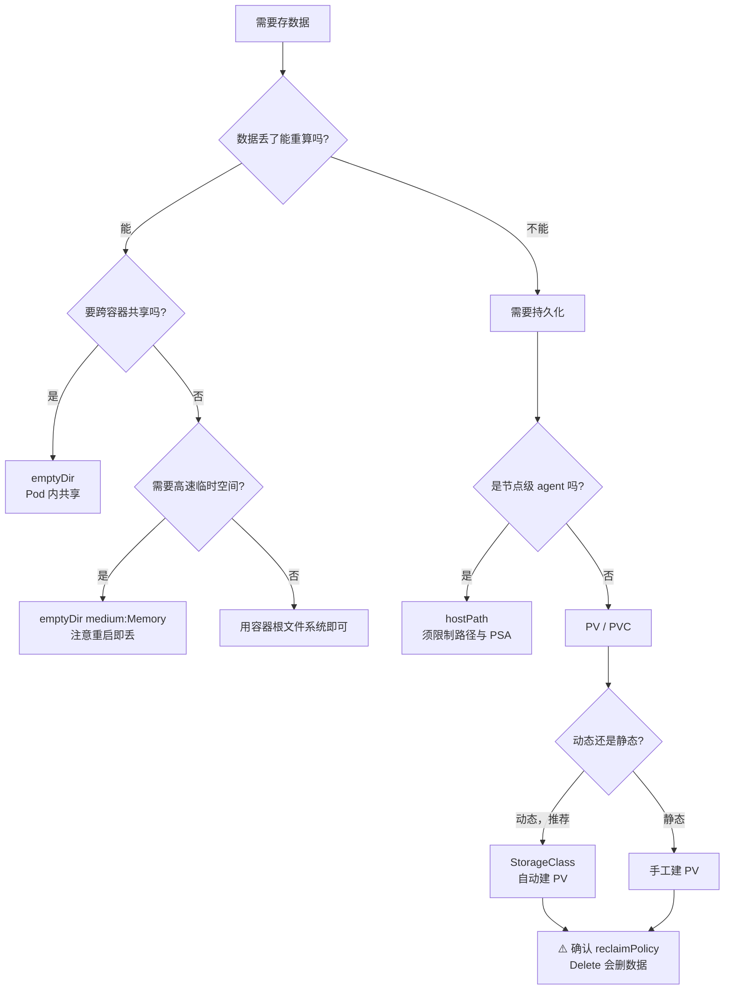

# 第 12 课：Volume 与 PV/PVC：让数据活过容器

> 所属阶段：阶段 4《配置 · 存储 · 资源 · 工程化》 ｜ 故事章节：**从能用到敢上生产**
> 上一课：[第 11 课：ConfigMap 与 Secret：配置与代码的分离](lesson-11-ConfigMap与Secret.md)
> 下一课：第 13 课：资源 requests/limits 与 QoS

---

## 🎯 本课目标

学完本课，你应该能够：

1. 说清 **emptyDir / hostPath / PV-PVC** 三类存储的**存活边界**（数据能活过什么）
2. 理解 PV 与 PVC 为什么要分成**两层抽象**，以及它们如何自动绑定
3. 用 StorageClass 实现**动态供给**，并说清 `WaitForFirstConsumer` 延迟绑定的意义
4. 说清 **Retain / Delete / Recycle** 三种回收策略的差别与数据风险
5. 排查"PVC 一直 Pending"这类高频故障

---

## 第一幕：起源与场景引入

### 一个必然发生的事故

你在容器里跑了一个应用，它把上传的文件写在 `/uploads`：

```dockerfile
FROM python:3.11
WORKDIR /app
COPY app.py .
CMD ["python", "app.py"]
```

用户上传了文件，一切正常。然后某天凌晨：

- 应用的内存泄漏触发 OOM，容器被杀掉重启
- 或者你滚动更新了一版代码
- 或者节点压力太大，Pod 被驱逐重建

**用户上传的文件，全没了。**

这不是 bug，这是容器的设计：**容器的文件系统是临时的**。镜像层是只读的，容器运行时在上面加一个可写层，容器一删，可写层随之消失。

### 回顾课 4 的一句话

课 4 讲 Pod 时提过一个结论：**Pod 是短暂的，IP 会变，数据会丢**。当时我们关注的是"IP 会变，所以要有 Service"。现在轮到后半句了 —— **数据会丢，所以要有 Volume**。

### 但"不丢"是有层次的

这里有个关键认知：**"数据不丢"不是一个是非题，而是一个程度问题**。问自己一个问题：

> 这份数据，需要活过什么？

| 需要活过 | 用什么 | 典型场景 |
|----------|--------|----------|
| **容器重启**（进程崩溃、OOM） | `emptyDir` | 缓存、临时计算中间结果 |
| **Pod 删除重建**（滚动更新、驱逐） | `PV/PVC`（网络存储） | 数据库、用户上传文件 |
| **整个节点挂掉** | `PV/PVC`（网络存储） | 同上，且存储要在节点外 |
| **只是想看节点上的文件** | `hostPath` | 日志采集、节点监控 agent |

选错层次有两种代价：

- **选高了**（临时数据用 PVC）：浪费资源、拖慢调度、还得管生命周期
- **选低了**（重要数据用 emptyDir）：**数据丢失**，且往往到故障时才发现

### 本课的主线

我们会沿着**存活能力递增**的顺序，把四层存储逐个实测一遍：

```
容器根文件系统   →  活不过容器重启
     ↓
emptyDir        →  活过容器重启，活不过 Pod 删除
     ↓
hostPath        →  活过 Pod 删除，但绑死在单个节点上
     ↓
PV / PVC        →  活过 Pod 删除，且（网络存储时）与节点解耦
```

每一层我们都会用**同一个对照实验**问同一个问题：**"容器重启后，你写的东西还在吗？"** 用实测把边界钉死，而不是背结论。

---

## 第二幕：认知冲突

### 冲突一：容器重启后，数据到底是丢还是不丢？

直觉答案是"丢"。但实测会告诉你：**取决于写在哪里**。

我们用一个标记法实验（只写一次，靠标记判断是首次启动还是重启）来对照。同一个 Pod 里，同时往两个地方写：

- `/cache/marker`（emptyDir 卷）
- `/rootfs-marker`（容器根文件系统）

然后让容器自己崩溃重启（`exit 1` + `restartPolicy: Always`），看重启后读到什么。

本机实测：

```
--- 第 1 次启动 ---
卷: FIRST-BOOT（刚写入）
根: FIRST-BOOT（刚写入）

--- 崩溃重启后（RESTARTS=2）---
卷: RESTARTED（旧值=FIRST-BOOT-1789098810）   ← emptyDir 数据还在
根: FIRST-BOOT（刚写入）                        ← 根文件系统丢了，又重写一遍
```

**同一个容器里，一个保留一个丢失。** 所以"容器重启数据就没了"这句话只对了一半 —— 准确的说法是：**容器重启，容器可写层没了；挂在容器上的卷不受影响。**

> ⚠️ 这个实验有个坑：如果启动脚本是"每次都写同一个内容"（比如 `echo data > file`），那重启后文件"看起来还在"，其实是**重新写了一遍**。很多人就是被这种假象误导，以为根文件系统也能保留数据。必须用"判断标记是否存在"的写法才能测出真相。

### 冲突二：emptyDir 能活过容器重启，那 Pod 删了呢？

**不能。** emptyDir 的生命周期绑定的是 **Pod**，不是容器。

同一个 Pod 删除后重建（哪怕名字一样），emptyDir 就是全新的空目录。本机实测：

```
删除 Pod 后同名重建，/cache 内容：[]
```

**emptyDir = "跟着 Pod 走的一次性空间"**。Pod 在，它就在；Pod 没了，连同里面的数据一起消失。

所以 emptyDir 的正确用途只有两类：

- **同一 Pod 内多容器共享**数据（比如 sidecar 采集主容器写的日志）
- **临时缓存 / 计算中间结果**，丢了能重算

如果数据丢了不能重算，emptyDir 就不是你的答案。

### 冲突三：hostPath 看起来能持久化，但它是个陷阱

hostPath 把**节点上的目录**挂进容器。Pod 删了，节点目录还在 —— 看起来满足"持久化"了。

本机实测（用 `/var/l12data` 这种确定在磁盘上的路径）：

```
写入: on-real-disk
删除 Pod 后新建 Pod 读取: on-real-disk      ← 确实还在
节点上确认: on-real-disk                     ← 文件真在节点上
```

**数据确实活过了 Pod 删除。** 但 hostPath 有三个致命问题：

**问题 1：Pod 被调度到别的节点，数据就"不见了"**

hostPath 指向的是**某个具体节点**的目录。Pod 重建时被调度到 node-2，而数据在 node-1 上 —— 应用起来发现目录是空的，而且**不会报错**。

> 本机是**单节点** kind 集群，无法实测这个陷阱（只有一个节点可调度）。这是必须标注的局限 —— 但正因为单节点上看不出问题，才更容易在生产上踩坑。

**问题 2：它把 Pod 和节点绑死了**

一旦用了 hostPath，这个 Pod 就只能在特定节点上跑，调度灵活性归零。

**问题 3（安全）：能挂载宿主机任意路径**

能 `hostPath: /` 就意味着容器能读写整个节点的根文件系统，这是**提权捷径**。生产上必须用 PSA（阶段 5）限制。

所以 hostPath 的合理用途很窄：**节点级 agent**（日志采集、监控 exporter）需要访问节点文件时使用。普通业务应用不该用。

### 冲突四：为什么要有 PV 和 PVC 两个东西？

这是初学者最困惑的设计。为什么不直接让 Pod 引用一个"网络磁盘"？

因为**用的人**和**管的人**不是同一批人：

| 角色 | 关心什么 | 对应对象 |
|------|----------|----------|
| **集群管理员** | 我有哪些存储、多大、怎么回收 | **PV**（PersistentVolume） |
| **应用开发者** | 我需要 5G 存储，能读写就行 | **PVC**（PersistentVolumeClaim） |

开发者写 PVC 时**不需要知道**存储是哪块盘、在哪个机房、用的什么协议。他只说"我要 100Mi，能读写"，k8s 自动找一个满足条件的 PV 绑上去。

**这个分工的价值**：应用清单可以在任何集群上部署，不用关心底层存储实现。就像 Pod 不关心自己跑在哪个节点上。

理解了这四层，就可以进入正文了。

---

## 第三幕：层层揭示

### 知识点 1：Volume 与 emptyDir

#### 一句话定义

Volume 是**挂在 Pod 上的目录**，它的生命周期独立于容器，可以（但不一定）活过容器重启。

#### 直觉建立（类比）

把 Pod 想成**一间酒店客房**，容器想成**住客**。

- **容器根文件系统** = 客房里的一次性洗漱用品。住客换了（容器重启），就换成新的 —— 上一任留下的东西全被清走。
- **Volume** = 客房里的**保险箱 / 冰箱**。它属于房间（Pod），不属于住客。住客换了，冰箱里的东西还在；但房间退了（Pod 删除），里面的东西一起清掉。

所以 Volume 的存活边界是 **Pod**，不是容器。

#### 核心原理

**Volume 不是一种东西，是一类接口。** k8s 支持几十种 Volume 类型，本课程关注四类：

| 类型 | 存活边界 | 数据在哪 |
|------|----------|----------|
| `emptyDir` | Pod 存活期间 | 节点本地（默认磁盘，`medium: Memory` 时为内存） |
| `hostPath` | 节点上的目录 | 节点本地磁盘 |
| `configMap` / `secret` | 与 ConfigMap/Secret 对象同生命周期 | 见课 11 |
| `persistentVolumeClaim` | 由 PV 决定，可独立于 Pod | 取决于底层存储 |

**emptyDir 的完整写法**：

```yaml
volumes:
- name: cache
  emptyDir: {}                    # 默认：节点磁盘
---
volumes:
- name: cache
  emptyDir:
    medium: Memory                # 用 tmpfs（内存），重启 Pod 即失
    sizeLimit: 100Mi              # 软限制，超出后 Pod 会被驱逐
```

**`medium: Memory` 的实测差异**（本机）：

```
medium=Memory 挂载点: tmpfs      31.1G   0   31.1G   0% /mem
默认 emptyDir 挂载点: /dev/sdd  1006.9G  194.2G  761.4G  20% /cache
```

用内存的 emptyDir **快，但 Pod 重启即丢**（tmpfs 特性），且占用的是容器内存限额。`sizeLimit` 也不是硬限制 —— 它是**驱逐阈值**：超过后 kubelet 会在一段时间后驱逐 Pod，而不是写入失败。

**典型用途：sidecar 共享数据**

```yaml
containers:
- name: app                      # 主容器写日志
  image: myapp
  volumeMounts:
  - name: logs
    mountPath: /var/log/app
- name: collector                # sidecar 读日志并转发
  image: fluentd
  volumeMounts:
  - name: logs
    mountPath: /var/log/app
volumes:
- name: logs
  emptyDir: {}
```

两个容器挂载**同一个** Volume，就实现了文件共享。这是 emptyDir 最经典的用法。

#### 常见误区

**误区 1：以为 emptyDir 能持久化数据**

不能。它的生命周期 = Pod 的生命周期。Pod 删除即消失。

**误区 2：以为 `sizeLimit` 是硬限制**

不是。它是**驱逐触发线**，不是写入配额。实际能写多少取决于节点空间。

**误区 3：用 `medium: Memory` 还期待数据保留**

tmpfs 是内存文件系统，Pod 重启就没了。它适合**高速临时缓存**，不适合任何需要保留的数据。

#### 一句话记住

> **emptyDir 是「跟着 Pod 走的一次性空间」—— 活过容器重启，活不过 Pod 删除。**

#### 官方文档

- [Volume](https://kubernetes.io/docs/concepts/storage/volumes/)
- [emptyDir](https://kubernetes.io/docs/concepts/storage/volumes/#emptydir)

---

### 知识点 2：hostPath

#### 一句话定义

hostPath 把**节点上的文件或目录**挂载进 Pod，让容器能读写节点文件系统。

#### 直觉建立（类比）

emptyDir 是"客房里的冰箱"（Pod 专属，退房即清）；
**hostPath 是"把这间房直接开在地下室某个固定角落"** —— 你看到的不是客房自带的空间，而是直接打通到了楼本身。

好处是东西不会因为退房消失（它在楼里，不在房里）；坏处是**你被钉死在这栋楼了** —— 换一栋楼（另一个节点），那个角落是空的。

#### 核心原理

```yaml
volumes:
- name: hostlog
  hostPath:
    path: /var/log
    type: Directory          # 类型校验，见下表
```

`type` 字段决定 k8s 在挂载前如何**校验路径**，这是防止低级错误的关键：

| type | 行为 |
|------|------|
| `""`（空，默认） | **不校验**。路径不存在也不会报错（危险） |
| `DirectoryOrCreate` | 不存在则创建（权限 0755） |
| `Directory` | 必须是已存在的目录，否则 Pod 起不来 |
| `FileOrCreate` | 不存在则创建空文件 |
| `File` | 必须是已存在的文件 |
| `Socket` / `CharDevice` / `BlockDevice` | 对应类型的设备文件 |

> **强烈建议显式写 `type`**。默认的空值不做任何校验，路径写错时 Pod 会正常启动，但挂进去的是个空目录 —— 你会以为"数据丢了"，实际是"根本没挂上"。

**实测：DirectoryOrCreate 自动建目录**

```yaml
hostPath:
  path: /var/l12data
  type: DirectoryOrCreate
```

```
容器内: /dev/sdd  1006.9G  194.2G  761.4G  20% /hostdata
节点上确认: on-real-disk        ← 文件确实落在节点磁盘上
```

**⚠️ kind 环境的特殊性（本机实测发现）**

kind 节点的 `/tmp` 本身是 **tmpfs**：

```
kind 节点 /tmp: tmpfs   16G  4.0K  16G  1% /tmp
```

所以在 kind 上用 `hostPath: /tmp/xxx`，容器内 `df` 会显示 `tmpfs` —— **这容易让人误以为 hostPath 走内存**。实际是 kind 节点 `/tmp` 的特殊性，不是 hostPath 的行为。改用 `/var/xxx` 就能看到真实的磁盘文件系统。

#### 常见误区

**误区 1：把 hostPath 当持久化方案**

它只解决"Pod 删了数据还在"，不解决"节点换了数据还在"。生产上有状态应用应该用 PV/PVC。

**误区 2：不知道调度会换节点**

这是最隐蔽的坑。Pod 重建时调度到别的节点，数据"消失"但**不报错** —— 应用可能正常启动，只是读不到数据，甚至当成"全新实例"重新初始化，把旧数据覆盖。

**误区 3：忽视安全风险**

`hostPath: /` 等于把节点根文件系统交给容器。生产环境必须用 **Pod Security Admission**（阶段 5 展开）禁止此类挂载。

#### 一句话记住

> **hostPath 能活过 Pod 删除，但把 Pod 钉死在单个节点上 —— 只适合节点级 agent，业务应用别用。**

#### 官方文档

- [hostPath](https://kubernetes.io/docs/concepts/storage/volumes/#hostpath)

---

### 知识点 3：PV 与 PVC

#### 一句话定义

**PV**（PersistentVolume）是集群里的一块存储资源，**PVC**（PersistentVolumeClaim）是应用对存储的"申请单"；k8s 负责把申请单匹配到资源上，一旦绑定就**一一对应**。

#### 直觉建立（类比）

把存储想成**公司里的工位**：

- **PV** = 行政部门准备好的工位（有编号、有位置、有配置）
- **PVC** = 员工填的工位申请单（"我要一个能坐的工位"）
- **绑定** = 行政把某个工位分配给某个人，**一个工位同时只能给一个人**

员工不关心工位在几楼、靠不靠窗（存储实现细节），只要"有工位能坐"（能读写）。行政不关心谁坐（应用是谁），只管资源池。

**这个分工让应用清单变得可移植**：同一份 Deployment YAML 在开发集群（挂本地盘）和生产集群（挂云盘）都能跑，因为开发者只声明"我要 100Mi 读写存储"。

#### 核心原理

**1）PV 的关键字段**

```yaml
apiVersion: v1
kind: PersistentVolume
metadata:
  name: pv-static
spec:
  capacity:
    storage: 100Mi                          # 容量
  accessModes:
  - ReadWriteOnce                           # 访问模式
  persistentVolumeReclaimPolicy: Retain     # 回收策略
  storageClassName: manual                  # 存储类（用于匹配）
  hostPath:
    path: /var/l12-pv-static                # 底层存储（此处用节点目录演示）
```

**2）三种访问模式**

| 模式 | 简写 | 含义 |
|------|------|------|
| `ReadWriteOnce` | RWO | **单节点**读写（可多 Pod，但须在同一节点） |
| `ReadOnlyMany` | ROX | **多节点**只读 |
| `ReadWriteMany` | RWX | **多节点**读写 |

> ⚠️ `ReadWriteOnce` 里的 "Once" 指的是**一个节点**，不是一个 Pod。同一节点上的多个 Pod 可以同时读写同一个 RWO 卷。

> ⚠️ **本机局限**：local-path 存储只支持 RWO，**RWX 无法在本机实测**。RWX 需要 NFS、CephFS 这类共享文件系统，讲义中涉及 RWX 的部分均为原理说明，未实测。

**3）PVC 的写法**

```yaml
apiVersion: v1
kind: PersistentVolumeClaim
metadata:
  name: pvc-static
  namespace: l12            # PVC 是命名空间级的
spec:
  accessModes:
  - ReadWriteOnce
  storageClassName: manual  # 必须匹配 PV 的 storageClassName
  resources:
    requests:
      storage: 50Mi         # 申请的容量
```

**4）绑定规则（重点）**

k8s 为 PVC 找 PV 时，必须同时满足：

- `storageClassName` **相同**
- `accessModes` **兼容**
- PV 的 `capacity` **≥** PVC 的申请量
- PV 未被占用

**实测：容量不是"精确匹配"，而是"向上取"**

```
PV 容量: 100Mi
PVC 申请: 50Mi
绑定后 PVC 实际拿到: 100Mi     ← 拿到整个 PV，不是 50Mi
```

这意味着 **PV 一旦被绑定，整个都归这个 PVC**，即使你只用 10Mi。

**实测：容量不够时 PVC 一直 Pending**

```
PVC 申请 200Mi，但 PV 只有 100Mi
结果: Pending（没有足够大的 PV）
```

PVC 不会"部分绑定"，也不会自动找多个 PV 拼起来。

**5）Pod 使用 PVC**

```yaml
volumes:
- name: data
  persistentVolumeClaim:
    claimName: pvc-static
```

PVC 必须在**同一个命名空间**；PV 是**集群级**资源，不属于任何命名空间。

#### 常见误区

**误区 1：以为 PVC 申请 50Mi 就只能用 50Mi**

实际拿到的是整个 PV 的容量（实测 100Mi）。PV 不可切分。

**误区 2：以为 PV 和 PVC 是多对多**

是**一对一**绑定。一个 PV 绑定后不能被第二个 PVC 使用。

**误区 3：以为 `Released` 状态的 PV 能直接复用**

不能。Released 表示 PVC 已删除但 PV 保留，**还残留着旧 `claimRef`**，新 PVC 无法绑定。

这在 `Retain` 策略下尤其容易踩：你删了 PVC 想重建一个，结果新 PVC 一直 `Pending`，因为 PV 卡在 `Released`。两种处理方式：

```bash
# 方式一：直接删掉 PV 重建（简单，但数据丢失风险自负）
kubectl delete pv <pv>

# 方式二：手工清掉 claimRef，让 PV 回到 Available（保留数据）
kubectl patch pv <pv> --type json -p '[{"op":"remove","path":"/spec/claimRef"}]'
```

**误区 4：以为 PVC 删除保护是"不能删"**

被 Pod 使用的 PVC **删不掉**，这是保护机制（实测）：

```
PVC 状态: Bound（删除命令发出后仍在）
finalizers: ["kubernetes.io/pvc-protection"]
```

这是为了防止"Pod 还在跑，存储先被删了"。要删 PVC，得先删使用它的 Pod。

#### 一句话记住

> **PV 是资源、PVC 是申请单，两者一对一绑定；申请量是"至少"，实际拿到整个 PV。**

#### 官方文档

- [PersistentVolume](https://kubernetes.io/docs/concepts/storage/persistent-volumes/)
- [PV 生命周期](https://kubernetes.io/docs/concepts/storage/persistent-volumes/#lifecycle-of-a-volume-and-claim)

---

### 知识点 4：StorageClass 动态供给

#### 一句话定义

StorageClass 是存储的"规格模板"，让 k8s **按需自动创建 PV**，管理员不必提前手工准备。

#### 直觉建立（类比）

**静态供给**（手工建 PV）像**食堂提前打好饭**：必须先猜好要多少份，猜少了排队的人吃不上，猜多了浪费。

**动态供给**（StorageClass）像**按需现做**：你来一份我做一份，不用提前准备，也不会浪费。

StorageClass 就是那个"菜谱" —— 定义了用什么食材（provisioner）、怎么做（参数），来单了就照着做。

#### 核心原理

**本机的默认 StorageClass**（实测）：

```
NAME                 PROVISIONER             RECLAIMPOLICY   VOLUMEBINDINGMODE      ALLOWVOLUMEEXPANSION
standard (default)   rancher.io/local-path   Delete          WaitForFirstConsumer   false
```

五个字段的含义：

| 字段 | 作用 |
|------|------|
| `provisioner` | 谁来创建实际的存储（`rancher.io/local-path` = 本地路径 provisioner） |
| `reclaimPolicy` | 动态创建的 PV 用什么回收策略（默认 `Delete`） |
| `volumeBindingMode` | **何时绑定**（`Immediate` 立即 / `WaitForFirstConsumer` 等第一个消费者） |
| `allowVolumeExpansion` | 是否允许扩容 |
| `parameters` | 传给 provisioner 的参数 |

**`WaitForFirstConsumer` 延迟绑定（本课最有价值的实测）**

这是默认行为，但很多人不理解它为什么存在。实测：

```
创建 PVC（还没 Pod 用它）:
  PVC 状态: Pending
  已生成 PV 数量: 0        ← 一个都没建！

创建使用它的 Pod 之后:
  PVC 状态: Bound
  自动生成 PV: pvc-092b219f-45d9-4844-9ee1-5871794c113f  100Mi  RWO  Delete  Bound
```

**为什么这么设计？** 因为 **PV 建在哪个节点上，取决于 Pod 调度到哪个节点**。

如果用 `Immediate`（立即绑定），k8s 会在 PVC 创建时就建 PV —— 但此时还不知道 Pod 会调度到哪。对于 local-path 这种**节点本地**存储，就可能：PV 建在 node-1，结果 Pod 被调度到 node-2，**永远绑不上**。

延迟绑定把 PV 创建推迟到"第一个使用它的 Pod 被调度之后"，此时已经知道节点了，PV 就建在正确的位置。**这个设计让调度和存储协同，避免了"建错地方"的死锁。**

**铁证：生成的 PV 自带 nodeAffinity**

这不是理论推测，可以直接看到。动态供给出来的 PV 长这样（实测）：

```json
{"required":{"nodeSelectorTerms":[{"matchExpressions":[
  {"key":"kubernetes.io/hostname","operator":"In","values":["k8s-c1-control-plane"]}
]}]}}
```

**PV 明确声明"我只属于这一个节点"。** 它只有在调度器已经决定 Pod 去哪之后才可能写成这样 —— 这就是延迟绑定存在的直接证据。对照一下：如果 StorageClass 用 `Immediate`，PV 在 PVC 创建时就生成，此刻还不知道 Pod 会去哪，这个字段就无从填写（或填错）。

顺带看一眼 PV 的真实落点，更能理解 local-path 的"节点本地"属性：

```
/var/local-path-provisioner/pvc-9c7fc392-..._l12_pvc-dyn
```

路径里带着**命名空间和 PVC 名**，位于节点的 `/var/local-path-provisioner/` 目录 —— 这就是 provisioner 在该节点上实际创建的目录。所以这类存储**天然不能跨节点**。

**动态供给的完整流程**：

1. 用户创建 PVC，指定 `storageClassName: standard`（或不写，用默认）
2. k8s 发现没有现成 PV 匹配 → 标记 PVC 为 Pending，等待消费者
3. 用户创建 Pod 使用该 PVC
4. 调度器决定 Pod 去哪个节点
5. provisioner 在**该节点**上创建实际存储，并自动创建对应 PV
6. PV 与 PVC 绑定，Pod 启动

**回收策略对比（实测）**

| 策略 | 删 PVC 后 PV 怎样 | 数据还在吗 |
|------|-------------------|-----------|
| `Delete` | PV **自动删除** | ❌ 没了 |
| `Retain` | PV 保留，状态变 `Released` | ✅ 在，但需手工清理才能复用 |
| `Recycle` | **已废弃**（k8s 1.15+ 不推荐） | — |

实测：

```
Delete 策略的 PV，删除 PVC 后:
  Error from server (NotFound): persistentvolumes "pvc-092b219f..." not found   ← 真的没了

Retain 策略的 PV，删除 PVC 后:
  pv-static 状态: Released      ← 保留了
```

> ⚠️ **`Delete` 是动态供给的默认值**。这意味着**删 PVC = 删数据**，且不可恢复。生产环境改配置前务必确认回收策略。

**扩容（本机实测：不支持）**

本机 `standard` 的 `allowVolumeExpansion` 为空（即 false）。尝试扩容实测报错：

```bash
kubectl -n l12 patch pvc pvc-expand --type merge -p '{"spec":{"resources":{"requests":{"storage":"500Mi"}}}}'
```

```
Error from server (Forbidden): persistentvolumeclaims "pvc-expand" is forbidden:
  only dynamically provisioned pvc can be resized and the storageclass that provisions the pvc must support resize

扩容前: 100Mi
扩容后: 100Mi          ← 没生效
```

要支持扩容，StorageClass 必须设 `allowVolumeExpansion: true`，且底层 provisioner 支持。

#### 常见误区

**误区 1：以为 PVC 一创建就会建 PV**

在 `WaitForFirstConsumer` 模式下不会（实测 Pending 且 0 个 PV），要等 Pod 出现。

**误区 2：以为删 PVC 数据还在**

默认 `Delete` 策略下，**删 PVC 就删数据**。这是生产事故高发点。

**误区 3：以为扩容就是把 PVC 的数字改大**

数字改了不等于扩容成功，需要两个条件同时满足：① StorageClass 设了 `allowVolumeExpansion: true`；② 底层 provisioner 支持。本机实测报错：

```
Error from server (Forbidden): ... only dynamically provisioned pvc can be resized
and the storageclass that provisions the pvc must support resize
```

> 补充：扩容通常**只支持变大、不支持变小**，且部分存储类型需要 Pod 重启后文件系统才识别新容量。

#### 一句话记住

> **StorageClass 让 PV 按需自动创建；`WaitForFirstConsumer` 延迟到 Pod 调度后才建，避免"建错节点"；默认 `Delete` 策略下删 PVC = 删数据。**

#### 官方文档

- [StorageClass](https://kubernetes.io/docs/concepts/storage/storage-classes/)
- [动态卷供给](https://kubernetes.io/docs/concepts/storage/dynamic-provisioning/)

---

## 第四幕：实操验证

> 本节所有命令**逐条可照抄执行**，输出均为本机实测结果。

### 环境准备

```bash
# 集群：kind（k8s v1.34.0），单节点 k8s-c1-control-plane
kubectl get nodes
```

本机实测：

```
NAME                   STATUS   ROLES           AGE   VERSION
k8s-c1-control-plane   Ready    control-plane   24h   v1.34.0
```

确认默认 StorageClass（本课全程用它）：

```bash
kubectl get sc
```

本机实测：

```
NAME                 PROVISIONER             RECLAIMPOLICY   VOLUMEBINDINGMODE      ALLOWVOLUMEEXPANSION   AGE
standard (default)   rancher.io/local-path   Delete          WaitForFirstConsumer   false                  24h
```

建命名空间：

```bash
kubectl create ns l12
```

### 验证 1：容器根文件系统 vs emptyDir 的存活对照（核心）

这是本课最重要的实验。用**标记法**判断"是首次启动还是重启后的重跑"：

```bash
cat <<'EOF' | kubectl -n l12 apply -f -
apiVersion: v1
kind: Pod
metadata:
  name: lifecycle
spec:
  restartPolicy: Always
  containers:
  - name: c
    image: busybox:1.36
    command:
    - sh
    - -c
    - |
      if [ -f /cache/marker ]; then
        echo "卷: RESTARTED（旧值=$(cat /cache/marker)）"
      else
        echo "FIRST-BOOT-$(date +%s)" > /cache/marker
        echo "卷: FIRST-BOOT（刚写入）"
      fi
      if [ -f /rootfs-marker ]; then
        echo "根: RESTARTED（旧值=$(cat /rootfs-marker)）"
      else
        echo "FIRST-BOOT-$(date +%s)" > /rootfs-marker
        echo "根: FIRST-BOOT（刚写入）"
      fi
      sleep 15
      exit 1
    volumeMounts:
    - name: cache
      mountPath: /cache
  volumes:
  - name: cache
    emptyDir: {}
EOF

kubectl -n l12 wait --for=condition=Ready pod/lifecycle --timeout=120s
kubectl -n l12 logs lifecycle
```

本机实测（第 1 次启动）：

```
卷: FIRST-BOOT（刚写入）
根: FIRST-BOOT（刚写入）
```

等容器崩溃重启（约 45 秒，含退避）：

```bash
sleep 45
kubectl -n l12 get pod lifecycle -o jsonpath='{.status.containerStatuses[0].restartCount}'
kubectl -n l12 logs lifecycle | tail -6
```

本机实测（重启后）：

```
重启次数: 2
卷: RESTARTED（旧值=FIRST-BOOT-1789098810）   ← emptyDir 活过容器重启
根: FIRST-BOOT（刚写入）                        ← 根文件系统丢失，重新初始化
```

**✅ 验证通过**：同一个容器里，emptyDir 保留、根文件系统丢失。

> ⚠️ **为什么用标记法**：如果启动脚本写成 `echo data > /cache/a.txt`（每次都写），重启后文件"看起来还在"，其实是**重写了一遍**，会得出"根文件系统也能保留"的错误结论。必须判断标记是否存在。

### 验证 2：emptyDir 活不过 Pod 删除

```bash
kubectl -n l12 exec lifecycle -- sh -c 'ls -A /cache'   # 确认有数据

# 删除 Pod 后用同名重建
kubectl -n l12 delete pod lifecycle --wait=true
cat <<'EOF' | kubectl -n l12 apply -f -
apiVersion: v1
kind: Pod
metadata:
  name: lifecycle
spec:
  containers:
  - name: c
    image: busybox:1.36
    command: ['sh','-c','sleep 3600']
    volumeMounts:
    - name: cache
      mountPath: /cache
  volumes:
  - name: cache
    emptyDir: {}
EOF

kubectl -n l12 wait --for=condition=Ready pod/lifecycle --timeout=120s
kubectl -n l12 exec lifecycle -- sh -c 'ls -A /cache'
```

本机实测：

```
重建后 /cache 内容: []      ← 空，数据随 Pod 一起消失
```

**✅ 验证通过**：emptyDir 的生命周期 = Pod 的生命周期。

### 验证 3：emptyDir 的两种介质

```bash
cat <<'EOF' | kubectl -n l12 apply -f -
apiVersion: v1
kind: Pod
metadata:
  name: edm
spec:
  containers:
  - name: c
    image: busybox:1.36
    command: ['sh','-c','sleep 3600']
    volumeMounts:
    - name: m
      mountPath: /mem
  volumes:
  - name: m
    emptyDir:
      medium: Memory
EOF

kubectl -n l12 wait --for=condition=Ready pod/edm --timeout=120s
kubectl -n l12 exec edm   -- sh -c 'df -h /mem   | tail -1'
kubectl -n l12 exec lifecycle -- sh -c 'df -h /cache | tail -1'
```

本机实测：

```
medium=Memory 挂载点: tmpfs      31.1G      0  31.1G   0% /mem
默认 emptyDir 挂载点: /dev/sdd  1006.9G  194.2G  761.4G  20% /cache
```

**✅ 验证通过**：`medium: Memory` 走 tmpfs（内存），默认走节点磁盘。

### 验证 4：hostPath 活过 Pod 删除

> ⚠️ 用 `/var/l12data` 而非 `/tmp/...`：kind 节点的 `/tmp` 本身是 tmpfs，会让人误判（见知识点 2）。

```bash
cat <<'EOF' | kubectl -n l12 apply -f -
apiVersion: v1
kind: Pod
metadata:
  name: hpv
spec:
  containers:
  - name: c
    image: busybox:1.36
    command: ['sh','-c','sleep 3600']
    volumeMounts:
    - name: h
      mountPath: /hostdata
  volumes:
  - name: h
    hostPath:
      path: /var/l12data
      type: DirectoryOrCreate
EOF

kubectl -n l12 wait --for=condition=Ready pod/hpv --timeout=120s
kubectl -n l12 exec hpv -- sh -c 'echo "on-real-disk" > /hostdata/c.txt'
kubectl -n l12 exec hpv -- sh -c 'df -h /hostdata | tail -1'
```

本机实测：

```
/hostdata 文件系统: /dev/sdd  1006.9G  194.2G  761.4G  20% /hostdata
写入内容: on-real-disk
```

删掉 Pod，用**另一个名字**的 Pod 读同一路径（把 `metadata.name` 从 `hpv` 改成 `hpv2`，其余不变）：

```bash
kubectl -n l12 delete pod hpv --wait=true
cat <<'EOF' | kubectl -n l12 apply -f -
apiVersion: v1
kind: Pod
metadata:
  name: hpv2
spec:
  containers:
  - name: c
    image: busybox:1.36
    command: ['sh','-c','sleep 3600']
    volumeMounts:
    - name: h
      mountPath: /hostdata
  volumes:
  - name: h
    hostPath:
      path: /var/l12data
      type: DirectoryOrCreate
EOF

kubectl -n l12 wait --for=condition=Ready pod/hpv2 --timeout=120s
kubectl -n l12 exec hpv2 -- sh -c 'cat /hostdata/c.txt'
```

本机实测：

```
新 Pod 读到: on-real-disk      ← 数据活过了 Pod 删除
```

**✅ 验证通过**：hostPath 的数据留在节点上，与 Pod 生命周期解耦。

### 验证 5：静态 PV + PVC 绑定（容量向上取）

> ⚠️ **重跑前先清理**（重要）：`Retain` 策略的 PV 删除 PVC 后不会自动消失，会留在 `Released` 状态，**导致下次跑这段时 PVC 一直 Pending**。如果你是第二次跑本课，先执行：
>
> ```bash
> kubectl delete pv pv-static --ignore-not-found
> ```
>
> 判断依据：`kubectl get pv` 看到 `pv-static` 的状态是 `Released`（而非 `Available`），就说明它有残留的 `claimRef`，新 PVC 绑不上去。

```bash
cat <<'EOF' | kubectl -n l12 apply -f -
apiVersion: v1
kind: PersistentVolume
metadata:
  name: pv-static
spec:
  capacity: {storage: 100Mi}
  accessModes: [ReadWriteOnce]
  persistentVolumeReclaimPolicy: Retain
  storageClassName: manual
  hostPath: {path: /var/l12-pv-static}
---
apiVersion: v1
kind: PersistentVolumeClaim
metadata:
  name: pvc-static
spec:
  accessModes: [ReadWriteOnce]
  storageClassName: manual
  resources:
    requests: {storage: 50Mi}
EOF

sleep 5
kubectl get pv pv-static -o jsonpath='{.status.phase}'; echo
kubectl -n l12 get pvc pvc-static -o jsonpath='{.status.phase}'; echo
```

本机实测：

```
PV 状态: Bound
PVC 状态: Bound
PVC 申请 50Mi，实际拿到: 100Mi     ← 拿到整个 PV
PV 绑定给: pvc-static
```

**✅ 验证通过**：PV 与 PVC 一对一绑定，容量向上取（拿整个 PV）。

### 验证 6：容量不足时 PVC 保持 Pending

```bash
cat <<'EOF' | kubectl -n l12 apply -f -
apiVersion: v1
kind: PersistentVolumeClaim
metadata:
  name: pvc-toobig
spec:
  accessModes: [ReadWriteOnce]
  storageClassName: manual
  resources:
    requests: {storage: 200Mi}
EOF

sleep 5
kubectl -n l12 get pvc pvc-toobig -o jsonpath='{.status.phase}'; echo
```

本机实测：

```
pvc-toobig 状态: Pending     ← 没有足够大的 PV
```

**✅ 验证通过**：PVC 不会部分绑定，容量不够就一直等。

### 验证 7：动态供给与 WaitForFirstConsumer（核心）

先只建 PVC，**不建 Pod**：

```bash
cat <<'EOF' | kubectl -n l12 apply -f -
apiVersion: v1
kind: PersistentVolumeClaim
metadata:
  name: pvc-dyn
spec:
  accessModes: [ReadWriteOnce]
  storageClassName: standard
  resources:
    requests: {storage: 100Mi}
EOF

sleep 5
kubectl -n l12 get pvc pvc-dyn -o jsonpath='{.status.phase}'; echo
kubectl get pv --no-headers | grep -c pvc-dyn
```

本机实测：

```
PVC 状态: Pending          ← 没绑定
已生成 PV 数量: 0           ← 一个都没创建！
```

现在创建使用它的 Pod：

```bash
cat <<'EOF' | kubectl -n l12 apply -f -
apiVersion: v1
kind: Pod
metadata:
  name: usepvc
spec:
  containers:
  - name: c
    image: busybox:1.36
    command: ['sh','-c','sleep 3600']
    volumeMounts:
    - name: d
      mountPath: /data
  volumes:
  - name: d
    persistentVolumeClaim: {claimName: pvc-dyn}
EOF

kubectl -n l12 wait --for=condition=Ready pod/usepvc --timeout=120s
sleep 3
kubectl -n l12 get pvc pvc-dyn -o jsonpath='{.status.phase}'; echo
kubectl get pv --no-headers | grep pvc-dyn
```

本机实测：

```
Pod 起来后 PVC 状态: Bound
自动生成的 PV:
pvc-UUID   100Mi   RWO   Delete   Bound   l12/pvc-dyn   standard
```

> ⚠️ **PV 名是随机 UUID（如 `pvc-9c7fc392-6bc8-4679-b27d-701286595998`），每次都不同。** 后续凡是引用它的命令，都**不要照抄讲义里的名字**，用变量取：
>
> ```bash
> PV_DYN=$(kubectl -n l12 get pvc pvc-dyn -o jsonpath='{.spec.volumeName}')
> echo $PV_DYN
> ```

**✅ 验证通过**：PV 在 Pod 调度之后才创建 —— 这就是 `WaitForFirstConsumer`。

**补充实测：`WaitForFirstConsumer` 的直接证据 —— PV 带 nodeAffinity**

光看"Pod 起来后才建 PV"还不够，真正的证据是**生成的 PV 被钉在了 Pod 所在的节点上**：

```bash
kubectl get pv $PV_DYN -o jsonpath='{.spec.nodeAffinity}'; echo
```

本机实测：

```json
{"required":{"nodeSelectorTerms":[{"matchExpressions":[{"key":"kubernetes.io/hostname","operator":"In","values":["k8s-c1-control-plane"]}]}]}}
```

**这个 `nodeAffinity` 就是延迟绑定的意义**：PV 明确声明"我只属于 `k8s-c1-control-plane` 这个节点"。它是在调度器**已经决定** Pod 去哪之后才创建的，所以能带上正确的节点约束。

如果换成 `Immediate`（PVC 一创建就建 PV），此时还不知道 Pod 会去哪，PV 就带不上这个约束 —— 对于 local-path 这类节点本地存储，就可能建在错误的节点上，导致 Pod 永远起不来。

再看 PV 的实际落点，进一步印证它是**节点本地**存储：

```bash
kubectl get pv $PV_DYN -o jsonpath='{.spec.hostPath.path}'; echo
```

本机实测：

```
/var/local-path-provisioner/pvc-9c7fc392-..._l12_pvc-dyn
```

路径里带着**命名空间和 PVC 名**，且位于节点的 `/var/local-path-provisioner/` 下 —— 这就是 provisioner 在该节点上创建的实际目录。

### 验证 8：回收策略与删除保护

> 本节依赖验证 7 产出的 `$PV_DYN` 变量。若你新开了终端，先重新取一次：
> ```bash
> PV_DYN=$(kubectl -n l12 get pvc pvc-dyn -o jsonpath='{.spec.volumeName}')
> ```

先看两种策略的 PV：

```bash
kubectl get pv pv-static -o jsonpath='{.spec.persistentVolumeReclaimPolicy}'; echo   # Retain
kubectl get pv $PV_DYN  -o jsonpath='{.spec.persistentVolumeReclaimPolicy}'; echo   # Delete
```

本机实测：

```
静态 PV: Retain
动态 PV: Delete
```

删掉 Pod 和动态 PVC，看 PV 是否消失：

```bash
kubectl -n l12 delete pod usepvc --wait=true
kubectl -n l12 delete pvc pvc-dyn --wait=true
sleep 8
kubectl get pv $PV_DYN
```

本机实测：

```
Error from server (NotFound): persistentvolumes "pvc-9c7fc392-..." not found
```

**✅ 验证通过**：`Delete` 策略下，删 PVC 会连带删除 PV 和数据。

再看 `Retain` 策略：

```bash
kubectl -n l12 delete pvc pvc-static --wait=true
sleep 5
kubectl get pv pv-static -o jsonpath='{.status.phase}'; echo
```

本机实测：

```
pv-static 状态: Released      ← PV 保留，但需手工清理才能复用
```

**验证删除保护**（被 Pod 使用的 PVC 删不掉）：

先建一个 PVC 并使用它（否则后面的删除保护实验没有对象）：

```bash
cat <<'EOF' | kubectl -n l12 apply -f -
apiVersion: v1
kind: PersistentVolumeClaim
metadata:
  name: pvc-expand
spec:
  accessModes: [ReadWriteOnce]
  storageClassName: standard
  resources:
    requests: {storage: 100Mi}
---
apiVersion: v1
kind: Pod
metadata:
  name: usexp
spec:
  containers:
  - name: c
    image: busybox:1.36
    command: ['sh','-c','sleep 3600']
    volumeMounts:
    - name: d
      mountPath: /data
  volumes:
  - name: d
    persistentVolumeClaim: {claimName: pvc-expand}
EOF

kubectl -n l12 wait --for=condition=Ready pod/usexp --timeout=120s
```

然后尝试删掉它：

```bash
kubectl -n l12 delete pvc pvc-expand --timeout=10s
kubectl -n l12 get pvc pvc-expand -o jsonpath='{.metadata.finalizers}'; echo
```

本机实测：

```
persistentvolumeclaim "pvc-expand" deleted from l12 namespace
error: timed out waiting for the condition on persistentvolumeclaims/pvc-expand
PVC 状态: Bound
finalizers: ["kubernetes.io/pvc-protection"]
```

**✅ 验证通过**：`kubernetes.io/pvc-protection` finalizer 阻止删除正在使用的 PVC。

### 排障速查

```bash
# ① PVC 一直 Pending，第一步看事件
kubectl -n l12 describe pvc <pvc> | tail -20

# ② 看有没有匹配的 PV
kubectl get pv
kubectl -n l12 get pvc <pvc> -o yaml | grep -A3 "storageClassName\|accessModes"

# ③ 动态供给下 PVC 长期 Pending → 检查是否是 WaitForFirstConsumer（无 Pod 使用时正常）
kubectl get sc <sc> -o jsonpath='{.volumeBindingMode}'; echo

# ④ PVC 删不掉 → 有 Pod 在用，先找出来
kubectl -n l12 get pod -o json | jq -r '.items[] | select(.spec.volumes[].persistentVolumeClaim.claimName=="<pvc>") | .metadata.name'

# ⑤ PV 是 Released 状态想复用 → 需手工清 claimRef
kubectl patch pv <pv> --type json -p '[{"op":"remove","path":"/spec/claimRef"}]'

# ⑥ 现象速查
#    PVC 一直 Pending（静态）  → 无匹配 PV：容量不够 / storageClassName 不匹配 / accessModes 不兼容
#    PVC 一直 Pending（动态）  → 无 Pod 使用（WaitForFirstConsumer 正常现象）；或 provisioner 异常
#    Pod 卡在 ContainerCreating → PVC 未绑定，等绑定或查 PV
#    PVC 删不掉                → 有 Pod 在用，先删 Pod
#    扩容报 Forbidden         → StorageClass 的 allowVolumeExpansion 未开启
```

---

## 第五幕：体系收束

### 本课在阶段 4 中的位置

课 11 解决了"**配置怎么注入**"，本课解决"**数据怎么活下来**" —— 两者合起来才让 Pod 具备承载真实业务的能力。

```
阶段 4：配置 · 存储 · 资源 · 工程化
    ├─ 课 11 配置：ConfigMap / Secret   ✅（数据怎么进容器）
    ├─ 课 12 存储：Volume / PV / PVC     ← 本课（数据怎么活下来）
    ├─ 课 13 资源：requests / limits / QoS / HPA（跑得稳不稳）
    └─ 课 14 工程化：Helm / Kustomize / 可观测（怎么规模化交付）
```

**与课 11 的分界线**：ConfigMap/Secret 用于**注入内容固定、由 k8s 管理**的数据；Volume/PVC 用于**应用自己产生、需要保留**的数据。判断标准很简单：**这份数据应用会不会写？** 会写 → 用存储；只读取 → 用配置。

### 存储选型决策流程



### 核心结论

1. **"数据不丢"是程度问题**：先问需要活过什么（容器重启 / Pod 删除 / 节点故障），再选层次
2. **容器根文件系统活不过容器重启**，emptyDir 可以 —— 实测用标记法验证，避免"重写一遍"的假象
3. **emptyDir 活过容器重启，活不过 Pod 删除** —— 它的生命周期绑定 Pod
4. **hostPath 活过 Pod 删除，但把 Pod 钉死在单节点** —— 只适合节点级 agent，且有提权风险
5. **PV/PVC 是两层抽象**：管理员管资源（PV），开发者管申请（PVC），一对一绑定，容量**向上取**
6. **`WaitForFirstConsumer` 延迟绑定**：PVC 单独创建时不建 PV，等 Pod 调度后才建 —— 避免"PV 建错节点"；铁证是生成的 PV 自带 `nodeAffinity`，被钉在 Pod 所在节点
7. **默认 `Delete` 回收策略**：**删 PVC = 删数据**，生产务必确认
8. **PVC 有删除保护**：被 Pod 使用时有 `kubernetes.io/pvc-protection` finalizer，删不掉
9. **动态 PV 名是随机 UUID**：引用时必须用 `kubectl get pvc <pvc> -o jsonpath='{.spec.volumeName}'` 动态取，不能照抄讲义里的名字

### 与 CKA / CKS 考纲的对应

| 考纲项 | 本课覆盖 |
|--------|----------|
| CKA：理解持久化卷（PV/PVC） | ✅ 知识点 3、验证 5/6 |
| CKA：理解 StorageClass 与动态供给 | ✅ 知识点 4、验证 7 |
| CKA：配置应用使用持久化存储 | ✅ 第四幕全部验证 |
| CKA：理解 Volume 类型（emptyDir/hostPath） | ✅ 知识点 1/2、验证 1-4 |
| CKS：hostPath 的安全风险 | ✅ 知识点 2 误区 3（PSA 阶段 5 展开） |
| CKS：静态数据加密（存储层） | ⏸️ 阶段 5 展开 |

---

## 📋 本机实测环境说明

| 项目 | 值 |
|------|-----|
| 集群 | kind（单节点） |
| K8s 版本 | v1.34.0 |
| 节点 | `k8s-c1-control-plane`（Debian 12, containerd 2.1.3） |
| 默认 StorageClass | `standard`（`rancher.io/local-path`） |
| `volumeBindingMode` | `WaitForFirstConsumer` |
| `allowVolumeExpansion` | 未开启（实测扩容被拒） |
| 测试命名空间 | `l12` |
| 测试镜像 | busybox:1.36 |

**全部结论均来自本机实测，未凭记忆或文档推断。** 三处需要特别注意的实测发现：

1. **kind 节点的 `/tmp` 本身是 tmpfs**（实测 `tmpfs 16G`），所以 `hostPath: /tmp/xxx` 在容器内会显示 tmpfs，**容易误判为 hostPath 走内存**。改用 `/var/xxx` 才能看到真实磁盘文件系统（`/dev/sdd`）。
2. **`WaitForFirstConsumer` 下 PVC 单独创建时不生成 PV**（实测 `Pending` + 0 个 PV），必须等 Pod 调度后才创建。
3. **本机不支持卷扩容**：`allowVolumeExpansion` 为空，实测 patch 扩容报 `Forbidden`。

**单节点局限（无法实测、仅原理说明）**：

- **`ReadWriteMany`（RWX）**：local-path 只支持 RWO，RWX 需要 NFS/CephFS 等共享文件系统，本机无法验证
- **hostPath 跨节点调度陷阱**：Pod 重建到另一个节点导致数据"消失"，单节点集群无法复现，已在知识点 2 标注

**可复现性说明**：容器崩溃重启的退避时间受 kubelet 策略影响，重启次数与等待时长可能浮动（本机实测 RESTARTS=2，等待约 45 秒）。

---

## 课后小测

<details>
<summary>点击展开答案</summary>

**1. emptyDir 能活过容器重启吗？能活过 Pod 删除吗？**

能活过容器重启，不能活过 Pod 删除。emptyDir 的生命周期绑定 Pod，不是容器。本机实测用标记法验证：容器崩溃重启后 `/cache/marker` 显示 `RESTARTED（旧值=FIRST-BOOT-...）`，而容器根文件系统的标记显示 `FIRST-BOOT（刚写入）`（即丢失后重写）。删除 Pod 后重建，`/cache` 为空。

**2. 为什么验证"数据有没有保留"必须用标记法？**

因为如果启动脚本每次都写同样内容（如 `echo data > file`），容器重启后文件"看起来还在"，实际是**重新写了一遍**。这会让人误以为容器根文件系统也能保留数据。正确做法是判断标记文件是否存在：存在 = 数据保留了，不存在 = 丢了。

**3. hostPath 为什么不适合业务应用的持久化？**

两个原因：① Pod 被调度到其他节点时，数据"消失"且**不报错**，应用可能当成全新实例重新初始化并覆盖旧数据；② 它把 Pod 钉死在特定节点，调度灵活性归零。此外挂载 `/` 等于把节点根文件系统交给容器，是提权捷径。合理用途只有节点级 agent（日志采集、监控 exporter）。

**4. PV 和 PVC 为什么要分成两层抽象？**

因为用存储的人（应用开发者）和管存储的人（集群管理员）不是同一批人。开发者只声明"我要 100Mi 读写存储"，不关心底层是本地盘还是云盘；管理员管理资源池。这个分工让应用清单可以在不同集群间移植。

**5. PVC 申请 50Mi，绑定到一个 100Mi 的 PV，实际能用多少？**

能用 100Mi。容量是**向上取**的 —— PV 一旦被绑定，整个都归该 PVC，不可切分。本机实测：申请 50Mi，实际拿到 100Mi。

**6. 创建 PVC 后一直没有 Pod 使用它，PVC 状态是 Pending，是不是出问题了？**

不一定是。如果 StorageClass 的 `volumeBindingMode` 是 `WaitForFirstConsumer`（本机默认），这是**正常现象**：k8s 要等 Pod 调度后才能知道该在哪个节点建存储。实测此时 PV 数量为 0。创建使用它的 Pod 后，PVC 立即 `Bound` 并自动生成 PV。

**7. 删掉 PVC 后数据还在吗？**

取决于 PV 的 `persistentVolumeReclaimPolicy`。`Delete`（动态供给默认）会**连带删除 PV 和数据**，不可恢复 —— 实测删 PVC 后再查 PV 报 `NotFound`。`Retain` 会保留 PV，状态变为 `Released`，数据还在，但需管理员手工清理 `claimRef` 才能复用。

**8. PVC 删不掉，可能是什么原因？**

有 Pod 正在使用它。k8s 会给使用中的 PVC 加 `kubernetes.io/pvc-protection` finalizer 阻止删除，防止"Pod 还在跑、存储先没了"。实测删除命令会超时，PVC 仍是 `Bound`。先删 Pod，PVC 会自动释放。

**9. 想把 PVC 从 100Mi 扩到 500Mi，报 Forbidden，为什么？**

两个条件都要满足：① StorageClass 设了 `allowVolumeExpansion: true`；② 底层 provisioner 支持扩容。本机 `standard` 未开启该字段，实测报错：`only dynamically provisioned pvc can be resized and the storageclass that provisions the pvc must support resize`。

</details>

---

## 🚀 下一批接力提示词

```
继续讲阶段 4 课 13：资源 requests/limits、QoS 等级与 HPA 扩缩容
```

```
对课 12 做双视角评审（pedagogy + learner），重点检查：
1. 第四幕每条命令读者照抄能否跑通
2. 生命周期对照实验是否有说服力、有无"重写假象"陷阱
3. 单节点局限（RWX、hostPath 跨节点）是否已显式标注
4. 同一数据在第二幕/第三幕/第四幕/小测/图中是否同步
```

```
课 12 补充一个综合实战：部署一个真正有状态的应用
（如 MySQL + PVC，验证删 Pod 后数据仍在，并演示 Delete 策略的数据风险）
```

---

## 🧭 课程导航

- **上一课**：[第 11 课：ConfigMap 与 Secret：配置与代码的分离](lesson-11-ConfigMap与Secret.md)
- **本课概览**：[阶段 4 概览](../overview.md)
- **下一课**：第 13 课：资源 requests/limits 与 QoS（待编写）
- **课程目录**：[02-课程目录.md](../../../02-课程目录.md)
- **学习路径**：[01-学习路径总览.md](../../../01-学习路径总览.md)
