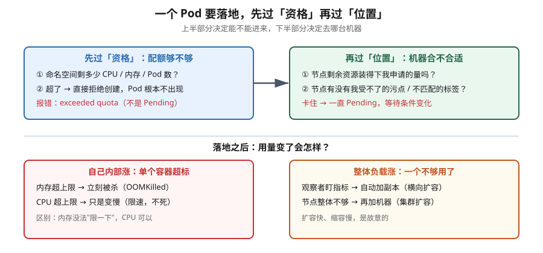

# 课 13：资源 · 调度 · 扩缩容

> 📍 所属阶段：阶段 4《配置 · 存储 · 资源 · 工程化》
> 📖 故事章节：**从"能跑起来"到"跑得稳、跑得省"**
> 🧭 上一课：[课 12：存储 Volume / PV / PVC](lesson-12-Volume与PVPVC.md) ｜ 下一课：课 14 Helm · Kustomize · 可观测性
> ⚙️ 实操环境：WSL Ubuntu 24.04 · kind v1.34.0（单 control-plane，20 核 / 32 GiB）· metrics-server v0.9.0

## 🎯 本课目标

学完本课，你应当能够：

- 说清 `requests` 与 `limits` 分别约束什么，以及**为什么 CPU 超限不死、内存超限必死**
- 判断一个 Pod 属于哪个 QoS 等级，并说清它们的**实际影响**与常见误解
- 用污点 / 容忍 / 亲和性控制 Pod 落在哪些节点上，能读懂调度失败的报错原文
- 区分 HPA / VPA / Cluster Autoscaler 三种"扩容"各自扩的是什么
- 用 ResourceQuota 与 LimitRange 做命名空间级别的资源治理
- 用 PriorityClass 表达"谁更重要"，并说清**抢占**与**驱逐**的区别

---

## 第一幕：起源与场景引入 —— "半夜三点，服务挂了"

### 一个真实的运维场景

假设你在一家公司负责一个 Web 服务。上线初期一切正常，你用一条命令把它跑起来了：

```bash
kubectl create deployment web --image=myapp:1.0
```

服务跑得很稳。然后某天业务量涨了，你加了几个副本：

```bash
kubectl scale deployment web --replicas=5
```

也还行。直到某个晚上，你被电话吵醒：

> "服务全挂了，快看看！"

你爬起来一看，5 个 Pod 里 3 个处于 `CrashLoopBackOff`。再一查节点，发现**整台机器内存被打满**，连 SSH 都快登不进去了。

问题出在哪？

你从未告诉过 k8s：**这个应用需要多少资源、最多能用多少**。于是 k8s 也只能两手一摊——它不知道哪个 Pod 重要、哪个可以牺牲，只能眼睁睁看着某个 Pod 把整台机器的内存吃光，然后内核的 OOM killer 出来"随机"杀进程。

**这就是本课要解决的问题**：k8s 不会替你猜一个应用该用多少资源。你必须告诉它，它才能在资源紧张时做出正确决策。

### 起源背景：Google Borg 的遗产

k8s 的资源模型并非凭空设计，它几乎原样继承自 Google 内部的集群管理系统 **Borg**。

 Borg 早在 2000 年代中期就面临同样的问题：数万台机器上跑着成千上万个不同团队的任务，如何在共享的机器池里既保证利用率、又保证重要任务不被饿死？Borg 给出的答案就是 **"申请量（request）+ 上限（limit）+ 优先级分档"** 这套模型——用申请量做调度决策，用上限做运行时约束，用分档决定谁先牺牲。

k8s 把它公开化了，就成了我们今天要学的 `requests` / `limits` / QoS。（核查于 2026-09：Borg 论文《Large-scale cluster management at Google with Borg》发表于 2015 年，是 k8s 资源模型的直接来源）

> 💡 **一句话本质**（本课把什么从 A 变成 B）：
> 本课把应用**从"裸奔在多台机器上、出事随机死"，变成"带着明确的资源契约运行、紧张时按规则死"**。

> ⚖️ **处境对照**（不这么做 vs 这么做）：
>
> | | 不这么做（不声明资源） | 这么做（声明资源契约） |
> |---|---|---|
> | 某个 Pod 吃光内存 | **整台机器被打满，连 SSH 都快登不进去** | 有上限兜着，超了只影响它自己 |
> | 紧张时谁先死 | 内核随机杀 —— **你不知道会死的是谁** | 有分档规则可预期（注意：不是 QoS 决定，见知识点） |
> | 调度时 | 它不知道该往哪放 —— **可能全堆在一台机器上** | 按"申请量"找放得下的机器 |
> | 容量规划 | 凭感觉，出事才知道不够 | 申请量总和就是账本，能提前看出来 |
> | 实例的"重量" | 全都不明，谁重谁轻没人知道 | 每个都标了多重 |
> | **代价** | 什么都不用想，跑起来最快 | 得先想清楚"要多少、上限多少"，填错也会有别的麻烦 |
>
> ⏳ 说明：以上是**机制层面**对照（有没有兜底、能不能预期、能不能规划）。具体该填多少数值高度依赖你的业务，本课不给"通用推荐值"以免误导 —— 第四幕会教你用实测数据反推。

---

## 第二幕：认知冲突 —— "我明明有 20 核，为什么 Pod 还是卡住？"

好，既然要声明资源，那就声明。你给应用加上了：

```yaml
resources:
  requests: {cpu: "2", memory: "4Gi"}
  limits:   {cpu: "4", memory: "8Gi"}
```

心想：机器有 20 核 32 GiB，我要 2 核 4 GiB，绰绰有余。

结果 `kubectl apply` 之后，Pod 一直 `Pending`，死活不跑。你 `describe` 一下，看到：

```
0/1 nodes are available: 1 node(s) had untolerated taint {dedicated: lab}.
```

**这里出现了第一个认知冲突**：节点的资源明明充足，为什么还是调度不上去？

因为**"资源够不够"只是调度的两道关卡之一**。另一道关卡是"这个节点欢不欢迎我"——节点可以打上**污点（taint）**主动排斥 Pod，Pod 必须声明**容忍（toleration）**才能进去。这是集群管理员把某些机器"圈起来专用"的手段。

**第二个认知冲突**紧接着来了。你好不容易把 Pod 跑起来了，压测时 CPU 蹭蹭往上涨，超过了 `limits` 里的 4 核——你以为 Pod 会被杀掉，结果它活得好好的，只是**变慢了**。

可换到内存场景，一旦超过 `limits: 8Gi`，Pod 立刻 **OOMKilled**，连个缓冲都没有。

**为什么同样是"超限"，CPU 和内存的待遇天差地别？**

**第三个冲突**：你给所有 Pod 都配好了资源，节点内存还是被打满了。你以为 QoS 等级（Guaranteed / Burstable / BestEffort）决定了谁先被杀——但**官方文档白纸黑字写着：kubelet 并不用 QoS 类来决定驱逐顺序**。

那 QoS 到底有什么用？这三个冲突，我们一个一个拆。

---

## 第三幕：层层揭示

### 先看一眼全局

进入细节之前，先看这张图建立整体图景（先有全貌，再逐层拆）：



**看图指引**：上半部分是 Pod **落地前**要过的两道关卡——**资格**（配额够不够，卡住就是直接拒绝）和**位置**（机器合不合适，卡住就是一直 Pending）；下半部分是 Pod **落地后**用量变化时的两条线索——**自己内部涨**（单容器超标，内存死 / CPU 慢）和**整体负载涨**（自动加副本 / 加机器）。

### 本课地图（6 步）

| 步 | 这一步要解决什么 | 对应知识点 |
|---|---|---|
| 第 1 步 | 先分清两个数字：哪个管"能不能进来"、哪个管"会不会被请出去" | 知识点 1：requests 与 limits |
| 第 2 步 | 再看超限时为什么 CPU 只是变慢、内存却直接死 | 知识点 2：CPU 与内存的不对称 |
| 第 3 步 | 然后打破一个广泛误解：紧张时到底按什么顺序赶人 | 知识点 3：QoS 与驱逐顺序 |
| 第 4 步 | 回到第二幕那个 Pending：机器还可以"不欢迎"谁、又"偏好"谁 | 知识点 4：调度三件套 |
| 第 5 步 | 接着讲"扩容"这个词其实指三件不同的事，别混着用 | 知识点 5：三种"扩容"到底扩的是什么 |
| 第 6 步 | 最后定规矩：谁先上车、谁先被赶下车 | 知识点 6：PriorityClass |

> 现在你在：**第 1 步**（刚看完全局图，接下来先分清那两个数字）。

---

### 知识点 1：requests 与 limits —— 两个数字，两种含义

> 🧭 第 1/6 步｜承接：第一幕留下的问题 —— "机器明明有 20 核，我要 2 核，为什么它还是不知道我多重？" → 本步：给出那两个数字，并说清它们**作用在不同阶段、由不同部件执行**。

#### 一句话定义

`requests` 是**申请量**（调度时的"座位预约"），`limits` 是**上限**（运行时的"天花板"）。

#### 直觉建立（类比）

把它想成**订餐厅**：

- `requests` = 你订位时说"我们有 4 个人"——餐厅据此给你安排一张 4 人桌，**并保证这张桌子是你的**。如果餐厅没有 4 人桌，你就得等着（Pending）。
- `limits` = 你实际最多能坐几个人——你可以只来 2 个人（用不满），也可以临时加塞到 6 个人（如果餐厅允许且还有空位），但**绝对不能超过 8 个人**，超过就要被请出去。

关键在于：**订位时的 4 人（request）决定了你能不能进来，实际坐多少人（usage）决定你会不会被赶走**。

#### 核心原理

两者作用在不同阶段、由不同组件执行：

| | `requests` | `limits` |
|---|---|---|
| **谁用它** | **调度器**（kube-scheduler） | **kubelet + 内核 cgroup** |
| **什么时候用** | Pod 创建时，只此一次 | 容器整个生命周期，持续生效 |
| **作用** | 决定 Pod **能不能**落到这个节点 | 决定容器**能用到多少** |
| **超了会怎样** | 无处可去 → Pending | CPU 限速 / 内存 OOMKilled |

调度器的算法很朴素：把节点上所有已调度 Pod 的 `requests` 加起来，**剩下的可分配量 ≥ 新 Pod 的 requests** 才允许放置。

> ⚠️ 注意：调度器看的是 **requests 之和**，不是**实际用量之和**。一个声明了 `requests: 4核` 但实际只用 0.1 核的 Pod，在调度器眼里依然占着 4 核。这就是为什么**把 requests 写得过高会严重浪费集群**（"占着茅坑不拉屎"）。

#### 示例演示：只写 limits 会怎样

很多人图省事只写 `limits`，不写 `requests`。我们实测一下 k8s 怎么处理（本机 v1.34.0 实测）：

```yaml
resources:
  limits: {cpu: "500m", memory: "256Mi"}
```

创建后读回实际值：

```bash
kubectl get pod only-limit -o jsonpath='{.spec.containers[0].resources}'
```

```json
{"limits":{"cpu":"500m","memory":"256Mi"},
 "requests":{"cpu":"500m","memory":"256Mi"}}
```

**k8s 自动把 requests 补齐成了与 limits 相同的值**。

这条行为容易被忽略，但它有明确后果：你本意是"最多用 0.5 核"，实际效果是**"预约 0.5 核 + 最多 0.5 核"**——这个 Pod 变成了 `Guaranteed` 等级，且调度时按 0.5 核算。想表达"我用得少但偶尔要冲一下"，必须**两个都写、且值不同**：

```yaml
resources:
  requests: {cpu: "100m", memory: "128Mi"}   # 平时用量，调度按这个算
  limits:   {cpu: "500m", memory: "512Mi"}   # 突发上限，允许冲到 5 倍
```

#### 常见误区

> 🐞 **误区 1**："limits 是保留给我的资源，设了就一定有。"
> 错。`requests` 才是保留（预约）。`limits` 只是天花板——你**可以**用到那么多，但**不保证**节点上真有那么多给你。

> 🐞 **误区 2**："CPU 超了会被杀。"
> 错。CPU 是**可压缩资源（compressible）**：超了只是被限速（throttle），进程变慢，不会被杀。内存是**不可压缩资源**：超了只能被杀，因为内核没法把已经分配出去的内存"限回去"。

#### 一句话记住

**requests 决定你坐哪（调度），limits 决定你能吃多少（运行时）；CPU 超了变慢，内存超了要命。**

📚 官方文档：[Resource Management for Pods and Containers](https://kubernetes.io/docs/concepts/configuration/manage-resources-containers/)

---

### 知识点 2：CPU 与内存的不对称 —— 一个实测对照

> 🧭 第 2/6 步｜承接：上一步分清了两个数字 —— 那**超限之后**会发生什么？按直觉该是一样的 → 本步：用实测打脸 —— CPU 超限只是变慢，内存超限直接死，这个不对称非常重要。

#### 一句话定义

CPU 超限 → 限速（活着，变慢）；内存超限 → OOMKilled（立刻死，exit code 137）。

#### 直觉建立（类比）

- **CPU 像高速公路的车道**：你申请了 1 条道，最多可以用 2 条。用超了？交警（内核）让你减速慢行，你还在路上，只是开得慢。
- **内存像仓库的货架**：你申请了 1 排，最多可以用 2 排。用超了？没地方放了，只能把东西扔掉（杀进程）——内存没有"减速"这个选项。

#### 核心原理：为什么内存不能被"限速"

CPU 时间可以切分：这一毫秒给你，下一毫秒给别人，进程只是被推迟执行，状态完好。

内存不行。进程申请的内存是**已经写进物理页的数据**，你没法让数据"慢一点存在"。要么给它，要么杀掉它。所以当 cgroup 内存用量触及 `memory.max`，内核 OOM killer 直接发 SIGKILL。

#### 示例演示：同一台机器上的对照实验

**实验 A：CPU 超限（limits: 500m，压满 4 核）**

```bash
kubectl apply -f - <<'EOF'
apiVersion: v1
kind: Pod
metadata: {name: cpu-throttle, namespace: ns-l13}
spec:
  restartPolicy: Never
  containers:
  - name: c
    image: polinux/stress
    command: ["stress"]
    args: ["--cpu", "4", "--timeout", "30s"]
    resources:
      requests: {cpu: "100m"}
      limits:   {cpu: "500m"}
EOF
```

实测结果：

```
STATUS      REASON
Succeeded   <none>
```

**容器正常跑完 30 秒然后退出，状态 Succeeded，没有被杀**。它只是被限速了——想用 4 核，实际只拿到 0.5 核的配额，跑得慢，但活着。

**实验 B：内存超限（limits: 100Mi，写 200MiB）**

```bash
kubectl apply -f - <<'EOF'
apiVersion: v1
kind: Pod
metadata: {name: mem-boom3, namespace: ns-l13}
spec:
  restartPolicy: Never
  containers:
  - name: c
    image: busybox:1.36
    command: ["sh","-c"]
    args: ["echo START; dd if=/dev/zero of=/mem/boom bs=1M count=200; echo WRITTEN_200M; sleep 20"]
    volumeMounts:
    - {name: m, mountPath: /mem}
    resources:
      requests: {memory: "50Mi"}
      limits:   {memory: "100Mi"}
  volumes:
  - name: m
    emptyDir: {medium: Memory}     # 内存盘，确保写的是内存而非磁盘
EOF
```

实测结果（本机 v1.34.0）：

```json
{"terminated": {"exitCode": 137, "reason": "OOMKilled"}}
```

**exitCode 137 = 128 + 9（SIGKILL），reason = OOMKilled**。容器在写入过程中被内核直接杀掉，连 `WRITTEN_200M` 都没打印出来。

同时我们验证 cgroup 确实生效了——在容器内读到的内存上限正是 100Mi：

```
104857600          # = 100 × 1024 × 1024，与 limits: 100Mi 精确对应
```

**对照组**：同样的 Pod 去掉 `limits`，写入 200MiB 成功：

```
START
WRITTEN_200M
Succeeded
```

这就坐实了：**杀死它的确实是 limits，不是别的原因**。

#### 💡 一个真实的排障陷阱（本案踩坑记录）

本次实测中，第一个内存用例反复失败却查不到 `OOMKilled` 原因，一度让人怀疑结论。根因是**读错了字段**：

- 当 `restartPolicy: Never` 时，容器终止后**不会重启**，终止信息留在 `state` 里；
- 而我们习惯查的 `lastState` 是**"上一次"终止**的信息，只有重启过才有值。

所以正确的排查姿势是：

```bash
# ❌ 只看 lastState，restartPolicy: Never 时为空
kubectl get pod mem-boom3 -o jsonpath='{.status.containerStatuses[0].lastState}'

# ✅ 两个都看
kubectl get pod mem-boom3 -o jsonpath='{.status.containerStatuses[0].state}'
```

> 🔑 **排障口诀**：查 OOM 先看 `state`，重启过的才在 `lastState`。

另一个坑：用 `dd if=/dev/zero of=/dev/shm/boom` 测内存会失败——**容器内 `/dev/shm` 默认只有 64 MiB**，还没等触发 100Mi 的 limits，`dd` 自己就先写满了。改用 `emptyDir: {medium: Memory}` 才是对的内存压力测法。

#### 常见误区

> 🐞 **误区**："OOMKilled 是因为节点内存不够了。"
> 不一定。**容器级 OOM**（撞自己的 limits）与**节点级 OOM/驱逐**（节点整体内存告急）是两回事。前者是"你超了自己申报的上限"，后者是"大家一起遭殃"。区分方法：容器级 OOM 的 reason 是 `OOMKilled`；节点压力驱逐的 Pod 状态是 `Failed` 且 reason 为 `Evicted`。

#### 一句话记住

**CPU 超限：慢，但不死；内存超限：不死，只是死。**

📚 官方文档：[Pod 和容器的资源管理](https://kubernetes.io/zh-cn/docs/concepts/configuration/manage-resources-containers/) ｜ [节点压力驱逐](https://kubernetes.io/zh-cn/docs/concepts/scheduling-eviction/node-pressure-eviction/)

---

## 第四幕：实操验证

第四幕的完整实操将贯穿后三个知识点，我们边讲边做。先做一个**入口自检**，确认环境就绪：

### 验证 0：环境确认

```bash
kubectl version --short          # 期望：Server Version: v1.34.0
kubectl top nodes                # 期望：能返回 CPU/内存用量（metrics-server 已装）
```

若 `kubectl top` 报 `error: Metrics API not available`，说明 metrics-server 未装。kind 集群安装方式（实测可用）：

```bash
kubectl apply -f https://github.com/kubernetes-sigs/metrics-server/releases/latest/download/components.yaml
kubectl patch deploy metrics-server -n kube-system --type=json -p '[
  {"op":"add","path":"/spec/template/spec/containers/0/args/-","value":"--kubelet-insecure-tls"}
]'
kubectl rollout status deploy/metrics-server -n kube-system --timeout=180s
```

> ⚠️ `--kubelet-insecure-tls` 是**为 kind 这类使用自签证书的环境准备的**。生产集群不应加这个参数，而应正确配置 kubelet 的服务证书。
> 💡 另外注意：metrics-server 的 `master` 分支 manifest 路径已失效（实测 404），须用上面 releases 里的 `components.yaml`。

### 验证 1：三种 QoS 等级实测

```bash
kubectl create ns ns-l13
kubectl apply -f - <<'EOF'
apiVersion: v1
kind: Pod
metadata: {name: qos-guaranteed, namespace: ns-l13}
spec:
  containers:
  - name: c
    image: registry.k8s.io/pause:3.10
    resources:
      requests: {cpu: "100m", memory: "64Mi"}
      limits:   {cpu: "100m", memory: "64Mi"}     # 两者相等
---
apiVersion: v1
kind: Pod
metadata: {name: qos-burstable, namespace: ns-l13}
spec:
  containers:
  - name: c
    image: registry.k8s.io/pause:3.10
    resources:
      requests: {cpu: "100m", memory: "64Mi"}
      limits:   {cpu: "500m", memory: "256Mi"}     # 不等
---
apiVersion: v1
kind: Pod
metadata: {name: qos-besteffort, namespace: ns-l13}
spec:
  containers:
  - name: c
    image: registry.k8s.io/pause:3.10             # 啥都不写
EOF

kubectl get pod -n ns-l13 -o custom-columns='NAME:.metadata.name,QOS:.status.qosClass'
```

**实测输出**：

```
NAME             QOS
qos-besteffort   BestEffort
qos-burstable    Burstable
qos-guaranteed   Guaranteed
```

**判定规则**（必须**每个容器**都满足）：

| 等级 | 条件 | 含义 |
|---|---|---|
| **Guaranteed** | 每个容器的 CPU 和内存的 `requests` **都等于** `limits`，且都 > 0 | 最优先保命 |
| **Burstable** | 不满足 Guaranteed，但**至少一个容器**写了 requests 或 limits | 中等，默认大多数 Pod 在这 |
| **BestEffort** | 所有容器**都没写**任何 requests / limits | 节点紧张时第一个被牺牲 |

⚠️ **边界提醒**：一个多容器 Pod 里，只要有一个容器没写资源，整个 Pod 就不是 Guaranteed——**QoS 是按 Pod 判的，取最差的那个容器**。

📚 官方文档：[Pod Quality of Service Classes](https://kubernetes.io/docs/concepts/workloads/pods/pod-qos/)

---

### 知识点 3：QoS 与驱逐顺序 —— 一个广泛存在的误解

> 🧭 第 3/6 步｜承接：上一步看到内存超限会被杀 —— 那机器整体紧张时，**按什么顺序**挑人来杀？直觉答案是"看 QoS 等级" → 本步：用官方文档推翻这个流行说法，并说清 QoS 到底管什么。

#### 一句话定义

QoS 等级是 k8s 根据 requests/limits 给 Pod 自动打上的**"可牺牲程度"标签**，它影响 OOM 打分与调度优先级，但**不是** kubelet 驱逐时的排序键。

#### 直觉建立（类比）

QoS 像**飞机舱位**：

- **Guaranteed = 头等舱**：你已经为这个座位付了全款（requests = limits），除非极端情况，绝不请你下飞机。
- **Burstable = 经济舱**：你买了座，但只付了基础价（requests < limits），超出的部分属于"有空位就坐"。
- **BestEffort = 候补票**：你没买座，有空位才让你上。一旦有人要坐，第一个请你下去。

#### 核心原理（含一处重要更正）

先看机制。kubelet 给每个容器设置 **`oom_score_adj`**（内核 OOM killer 的打分倾向）：

| QoS | `oom_score_adj` | 含义 |
|---|---|---|
| Guaranteed | **-997** | 几乎免疫 OOM killer |
| Burstable | 2 ~ 999（按 request 占节点内存比例算） | 中间地带 |
| BestEffort | **1000** | 内核"优先杀我"信号 |

节点真的 OOM 时，内核杀 `oom_score_adj` 最高的进程——所以 **BestEffort 先死、Guaranteed 基本不死**，这个说法在 OOM killer 层面是成立的。

**但这里有一个广泛流传的错误说法必须更正。** 很多资料（包括不少教程）说"kubelet 按 QoS 等级 BestEffort → Burstable → Guaranteed 的顺序驱逐 Pod"。官方文档的原文是：

> **kubelet 不使用 Pod 的 QoS 类来确定驱逐顺序。**
> 你可以使用 QoS 类来**估计**最可能的 Pod 驱逐顺序。
> —— [节点压力驱逐 · Kubernetes 官方文档](https://kubernetes.io/zh-cn/docs/concepts/scheduling-eviction/node-pressure-eviction/)

kubelet **实际**用的排序依据是这三条：

1. Pod 的资源使用**是否超过其 requests**
2. Pod **优先级**（PriorityClass）
3. Pod **相对于 requests 的资源使用情况**

按此，kubelet 的实际驱逐顺序是：

```
第一组（先驱逐）：用量超过 requests 的 BestEffort 或 Burstable Pod
                 → 组内按「超出 requests 的程度」+ 优先级排序
第二组（后驱逐）：用量低于 requests 的 Guaranteed Pod 和 Burstable Pod
                 → 组内按优先级排序
```

**为什么这个更正很重要**：它解释了一个反直觉现象——**一个 Guaranteed Pod 也可能比 Burstable Pod 先被驱逐**，只要那个 Burstable Pod 老老实实待在自己的 requests 以内。真正决定命运的不是"你是什么等级"，而是**"你有没有超出自己申报的量"**。

> 🎯 **结论**：QoS 是**估计驱逐顺序的快捷方式**（大概率对），不是 kubelet 的真实算法。真要精确判断，看的是"实际用量 vs requests"。

#### 示例演示：QoS 分级的实际影响

我们用实测确认了分级的正确性（见验证 1）。这里补充**驱逐行为的实测边界说明**：

> ⚠️ **诚实标注**：**驱逐顺序本身在本课未做实测**。原因是本机为单节点 kind 集群，制造节点级内存压力会连带打死 control-plane（API server / etcd / scheduler 都在同一台机器上），风险不可控且结果不具代表性——真实驱逐发生在多节点生产集群。
>
> 因此本节的机制说明来自 [Kubernetes 官方文档](https://kubernetes.io/zh-cn/docs/concepts/scheduling-eviction/node-pressure-eviction/)（核查于 2026-09），标注为**文档结论，非本机实测**。已实测的部分是：QoS 分级正确（验证 1）、容器级 OOMKilled（实验 B）、cgroup 上限生效（104857600）。

#### 常见误区

> 🐞 **误区 1**："设了 Guaranteed 就绝对不会被杀。"
> 错。两层保护是独立的：Guaranteed **豁免驱逐**（kubelet 层面的优雅驱逐），但**不豁免 OOM killer**（撞自己 limits 时照样死）。而且 OOM kill 是 SIGKILL，**不尊重 `terminationGracePeriodSeconds`**，没有优雅退出。

> 🐞 **误区 2**："BestEffort 就是没资源的 Pod，我不用管。"
> 危险。一个**忘记写 resources 的生产 Pod 就是 BestEffort**。它平时跑得好好的，一旦邻居 Pod 把节点内存吃满，它第一个被杀。
> 🔑 **实践建议**：给每个容器都写上 **memory request**（哪怕只有 50Mi），就能把它从 BestEffort 提升到 Burstable，生存概率大幅提高。这是性价比最高的一条资源治理动作。

#### 一句话记住

**QoS 是舱位，不是驱逐算法；真正决定生死的是"你有没有超出自己申报的量"，所以至少写个 memory request。**

📚 官方文档：[节点压力驱逐](https://kubernetes.io/zh-cn/docs/concepts/scheduling-eviction/node-pressure-eviction/) ｜ [Pod QoS 类](https://kubernetes.io/docs/concepts/workloads/pods/pod-qos/)

---

### 知识点 4：调度三件套 —— 污点、容忍、亲和性

> 🧭 第 4/6 步｜承接：前三步都在讲"资源够不够" —— 现在回头解决第二幕那个卡了半天的 Pending：**资源明明充足，为什么还是上不去**？ → 本步：看清调度的另一道关卡：机器可以"不欢迎"你，也可以"偏好"你。

#### 一句话定义

**污点（taint）** 是节点对 Pod 的"排斥令"，**容忍（toleration）** 是 Pod 的"通行证"，**亲和性（affinity）** 是 Pod 的"择偶标准"。

#### 直觉建立（类比）

想象一间 **VIP 包厢**：

- 包厢门口挂着牌子"**非请勿入**"（污点 taint）。
- 你有**邀请函**（容忍 toleration）才能进；没有？对不起，门口等着。
- 反过来，你也可以主动说"**我只坐靠窗的桌子**"（亲和性 affinity）——这是你挑它，不是它挑你。

注意方向性：**污点/亲和性是"挑"，容忍是"被允许"**。容忍不等于选择——一个 Pod 容忍了某污点，只说明它**可以**去，不代表它**一定**去那。

#### 核心原理

调度器给节点打分分两个阶段：

```
阶段 1 过滤（Filter）：剔除不合格节点
   ├─ PodToleratesNodeTaints：Pod 是否容忍节点的污点？
   ├─ NodeAffinity / NodeSelector：节点标签是否匹配？
   ├─ NodeResourcesFit：剩余可分配资源够不够？
   └─ ...（十几个插件）
   → 一个节点都不剩？Pod 保持 Pending

阶段 2 打分（Score）：给合格节点排序，选最高分
   └─ 资源均衡、亲和性权重等
```

**三种污点效果（effect）**，强度递增：

| effect | 对未容忍 Pod 的影响 |
|---|---|
| `NoSchedule` | **不允许新 Pod 调度上来**（已运行的不受影响） |
| `PreferNoSchedule` | 尽量不调度上来（软性，能调度就调度） |
| `NoExecute` | **不允许新 Pod 上来，且驱逐已运行的不容忍 Pod** |

> ⚠️ `NoExecute` 是唯一会影响**已运行 Pod** 的。生产上给节点打 `NoExecute` 要格外小心——它会把现存的 Pod 赶走。

**亲和性的两种语气**：

- `requiredDuringSchedulingIgnoredDuringExecution`：**硬性**，不满足就不调度（一直 Pending）
- `preferredDuringSchedulingIgnoredDuringExecution`：**软性**，满足最好，不满足也能调度（只影响打分）

名字里 `IgnoredDuringExecution` 的意思是：**运行期间标签变了，不会把已运行的 Pod 赶走**（这是当前实现，未来可能变）。

#### 示例演示：从 Pending 到 Running

**第 1 步：给节点打标签和污点**

```bash
kubectl label node k8s-c1-control-plane disk=ssd --overwrite
kubectl taint  node k8s-c1-control-plane dedicated=lab:NoSchedule --overwrite
```

**第 2 步：起一个普通 Pod —— 应该 Pending**

```bash
kubectl apply -f - <<'EOF'
apiVersion: v1
kind: Pod
metadata: {name: plain, namespace: ns-l13b}
spec:
  containers:
  - name: c
    image: registry.k8s.io/pause:3.10
EOF
kubectl get pod plain -n ns-l13b
```

**实测输出**：

```
NAME    STATUS
plain   Pending
```

调度失败的**报错原文**（这是排障时要认的脸）：

```
0/1 nodes are available: 1 node(s) had untolerated taint {dedicated: lab}.
no new claims to deallocate, preemption: 0/1 nodes are available:
1 Preemption is not helpful for scheduling.
```

🔑 **读懂这句**：`1 node(s) had untolerated taint` = 有 1 个节点，但它有你没容忍的污点。`Preemption is not helpful` = 抢占（挤走低优先级 Pod）也没用，因为问题不是资源不够，是**资格不够**。

**第 3 步：加上容忍 + 亲和性 —— 应该 Running**

```bash
kubectl apply -f - <<'EOF'
apiVersion: v1
kind: Pod
metadata: {name: with-rules, namespace: ns-l13b}
spec:
  tolerations:
  - key: dedicated
    operator: Equal
    value: lab
    effect: NoSchedule
  affinity:
    nodeAffinity:
      requiredDuringSchedulingIgnoredDuringExecution:
        nodeSelectorTerms:
        - matchExpressions:
          - key: disk
            operator: In
            values: [ssd]
  containers:
  - name: c
    image: registry.k8s.io/pause:3.10
EOF
kubectl get pod with-rules -n ns-l13b
```

**实测输出**：

```
NAME         STATUS    NODE
with-rules   Running   k8s-c1-control-plane
```

**第 4 步：清理**（务必执行，否则后续实验全被挡住）

```bash
kubectl taint node k8s-c1-control-plane dedicated=lab:NoSchedule-
kubectl label node k8s-c1-control-plane disk-
```

#### 💡 非模板化亮点：一条真实报错的"翻译"

`0/1 nodes are available` 是 k8s 最高频的调度报错之一，但很多人只会看"Pending"，不知道下文。这里给出**三种常见变体的对照**：

| 报错片段 | 真实含义 | 该去查什么 |
|---|---|---|
| `had untolerated taint {k: v}` | 节点有你没容忍的污点 | Pod 加 `tolerations` |
| `didn't match Pod's node affinity` | 节点标签不满足亲和性 | 改 `affinity` 或改节点标签 |
| `Insufficient cpu` | 剩余可分配 CPU 不够 | 降 requests 或加节点 |

**区分要点**：前两者是**资格问题**（加容忍/改标签就能解决，与资源无关），第三个是**容量问题**（真的没地方了）。`Insufficient` 才需要扩容，前两个扩容也没用——这是很多人误判的地方。

#### 常见误区

> 🐞 **误区**："加了 toleration 就一定会调度到那个节点。"
> 错。toleration 只是"允许"，不是"指定"。要**指定**必须用 `nodeSelector` / `nodeAffinity`，或者更粗暴的 `spec.nodeName`（绕过调度器，生产不推荐）。

#### 一句话记住

**污点是它挑你，亲和性是你挑它，容忍只是让你有资格被挑——容忍不等于会去。**

📚 官方文档：[污点和容忍度](https://kubernetes.io/zh-cn/docs/concepts/scheduling-eviction/taint-and-toleration/) ｜ [将 Pod 指派给节点](https://kubernetes.io/zh-cn/docs/concepts/scheduling-eviction/assign-pod-node/)

---

### 知识点 5：三种"扩容"到底扩的是什么

> 🧭 第 5/6 步｜承接：上一步把"能不能放上去"讲完了 —— 那"扩容"呢？这个词其实指三件不同的事 → 本步：把它们拆开，避免你说的是加机器、对方理解成加副本。

#### 一句话定义

**HPA** 加副本数，**VPA** 加单个 Pod 的资源配额，**Cluster Autoscaler** 加机器——三者扩的是完全不同维度的东西。

#### 直觉建立（类比）

餐厅生意变好了，你有三种应对：

- **HPA（横向扩容）**：多摆几张桌子（**多开几个 Pod**），每桌还是坐 4 人。
- **VPA（纵向扩容）**：把 4 人桌换成 8 人桌（**单个 Pod 变大**），桌子数量不变。
- **Cluster Autoscaler（集群扩容）**：把隔壁店面也租下来（**加机器**）。

三者可以组合，但有冲突——下面说。

#### 核心原理：三者对比

| | HPA | VPA | Cluster Autoscaler |
|---|---|---|---|
| **改什么** | `replicas` 副本数 | 单个 Pod 的 `requests/limits` | 集群**节点数量** |
| **维度** | 横向（scale out） | 纵向（scale up） | 基础设施层 |
| **是否需要重启 Pod** | ❌ 不需要（加新 Pod） | ✅ **需要**（改 requests 必须重建） | ❌（但会触发重调度） |
| **依赖** | **metrics-server** | VPA 组件（需另装） | 云厂商 / 集群 API |
| **适用** | 无状态服务 | 单体、难拆分的应用 | 节点资源整体不足 |

**HPA 的关键行为参数**（核查于 2026-09，[官方文档](https://kubernetes.io/docs/tasks/run-application/horizontal-pod-autoscale/) + 多方印证）：

| 参数 | 默认值 | 为什么 |
|---|---|---|
| **扩容**稳定窗口 | **0 秒**（立即） | 流量来了要马上扛住 |
| **缩容**稳定窗口 | **300 秒**（5 分钟） | 防抖动：缩完又涨，反复横跳很贵 |
| **容差（tolerance）** | **10%** | 指标在目标值 ±10% 内不动作 |
| 计算周期 | 15 秒 | 默认同步周期 |

**这个"扩得快、缩得慢"的不对称是故意设计的**：多给资源是"浪费一点钱"，少给资源是"用户打不开页面"——前者代价远小于后者。

计算公式（理解即可）：

```
期望副本数 = ceil(当前副本数 × 当前指标值 / 目标指标值)
```

例：当前 3 副本，CPU 用了 90%，目标 50% → `ceil(3 × 90/50) = ceil(5.4) = 6` 副本。

#### 示例演示：HPA 从 1 扩到 9（完整实测）

**第 1 步：部署一个会吃 CPU 的应用**

```bash
kubectl create ns ns-hpa
kubectl apply -f - <<'EOF'
apiVersion: apps/v1
kind: Deployment
metadata: {name: php-apache, namespace: ns-hpa}
spec:
  replicas: 1
  selector: {matchLabels: {app: php-apache}}
  template:
    metadata: {labels: {app: php-apache}}
    spec:
      containers:
      - name: php-apache
        image: registry.k8s.io/hpa-example
        ports: [{containerPort: 80}]
        resources:
          requests: {cpu: "200m"}
          limits:   {cpu: "500m"}
---
apiVersion: v1
kind: Service
metadata: {name: php-apache, namespace: ns-hpa}
spec:
  selector: {app: php-apache}
  ports: [{port: 80, targetPort: 80}]
EOF
kubectl wait --for=condition=Available deploy/php-apache -n ns-hpa --timeout=180s
```

> ⚠️ **前置条件**：HPA 依赖 metrics-server。没有它，`kubectl get hpa` 的 TARGETS 列会一直显示 `<unknown>/50%`。

**第 2 步：创建 HPA**

```bash
kubectl autoscale deploy php-apache -n ns-hpa --cpu-percent=50 --min=1 --max=10
```

**第 3 步：制造负载**

```bash
kubectl apply -f - <<'EOF'
apiVersion: v1
kind: Pod
metadata: {name: load-gen, namespace: ns-hpa}
spec:
  containers:
  - name: c
    image: busybox:1.36
    command: ["sh","-c"]
    args: ["while true; do wget -q -O- http://php-apache.ns-hpa.svc.cluster.local >/dev/null; done"]
EOF
```

**第 4 步：观察扩容全过程**（每 10 秒采样一次）

**实测输出**（本机 v1.34.0，metrics-server v0.9.0）：

```
[60s]  php-apache   Deployment/php-apache   cpu: 137%/50%   1   10   1   61s
[70s]  php-apache   Deployment/php-apache   cpu: 137%/50%   1   10   5   71s   ← 扩到 5
[80s]  php-apache   Deployment/php-apache   cpu:  83%/50%   1   10   5   81s
[90s]  php-apache   Deployment/php-apache   cpu:  81%/50%   1   10   9   91s   ← 扩到 9
[110s] php-apache   Deployment/php-apache   cpu:  49%/50%   1   10   9   111s  ← 低于目标，停扩
[180s] php-apache   Deployment/php-apache   cpu:  49%/50%   1   10   9   3m2s
```

最终：`kubectl get deploy php-apache -n ns-hpa` → **REPLICAS = 9**

**读这张表**：
- CPU 137% ≫ 目标 50% → 触发扩容，副本从 1 → 5 → 9，一路追上去。
- 副本增加后 CPU 降到 49%，**低于目标 50%** → 停止扩容，稳定在 9 副本。
- 注意 `[110s]` 之后 CPU 一直在 46%~49% 徘徊，但副本**没有缩回去**——这正是**缩容 300 秒稳定窗口**在起作用（观察仅 3 分钟，未到 5 分钟）。

> 💡 想看缩容？把压测 Pod 删掉，等 5 分钟以上：
> ```bash
> kubectl delete pod load-gen -n ns-hpa
> sleep 360 && kubectl get hpa php-apache -n ns-hpa
> ```
> 会看到副本数逐步降回 1。

#### ⚠️ HPA 与 VPA 的冲突（重要）

**不要让 HPA 和 VPA 同时基于 CPU 或内存工作**。原因：两者都盯着同一个指标，会形成**反馈回路**——

```
VPA 调大 requests → 每个 Pod 的 CPU 使用率下降 → HPA 认为"不忙了"→ 缩容
→ 剩余 Pod 压力变大 → CPU 使用率上升 → VPA 又要调大 → 死循环
```

**正确组合**（业界常见做法）：
- VPA 管**内存**大小，HPA 基于 **CPU 或自定义指标（如 QPS）** 扩容；
- 或 VPA 先用 `Off` 模式只出建议，人工确认后再上 `Auto`。

📚 官方文档：[Horizontal Pod Autoscaling](https://kubernetes.io/docs/tasks/run-application/horizontal-pod-autoscale/) ｜ [Vertical Pod Autoscaler](https://github.com/kubernetes/autoscaler/tree/master/vertical-pod-autoscaler)

#### 常见误区

> 🐞 **误区 1**："HPA 不用写 requests 也能工作。"
> 错。CPU 利用率 = **实际用量 / requests**。没写 requests，分母是 0，HPA 算不出百分比，TARGETS 列显示 `<unknown>`，**HPA 完全不动作**。这是 HPA 最常见的"配了没反应"原因。

> 🐞 **误区 2**："指标掉了副本会马上缩回去。"
> 错。缩容有 **5 分钟稳定窗口**（默认），且受 `scaleDown.policies` 限速。想调快用 `behavior`：
> ```yaml
> behavior:
>   scaleDown:
>     stabilizationWindowSeconds: 60   # 缩容冷静期缩到 1 分钟
> ```

#### 一句话记住

**HPA 加桌子、VPA 换大桌、CA 租新店；扩得快缩得慢是保护你，不是 HPA 坏了。**

---

### 知识点 6：PriorityClass —— 谁先上车，谁先被赶下车

> 🧭 第 6/6 步｜承接：前面解决了"能不能放、放几个" —— 最后一问：位置不够时，**谁先上车、谁先被赶下去**？ → 本步：定下优先级这套规矩，以及它和 QoS 不是一回事。

> 🔗 **为什么补这一节**：知识点 3 讲驱逐顺序时，官方文档的排序依据里出现了「Pod 优先级（PriorityClass）」——但我们当时没讲它是什么。这一节把这个欠下的概念补上。

#### 一句话定义

PriorityClass 是一个**集群级**对象，给 Pod 打上一个整数优先级；kubelet 驱逐时、调度器排队与抢占时，都按这个数字决定**谁更该被牺牲**。

#### 直觉建立（类比）

如果 QoS 是**飞机舱位**（头等舱/经济舱/候补），那 PriorityClass 就是**乘客身份**：

- 舱位决定你坐得舒不舒服（资源保障等级）
- 身份决定**超载时谁被请下飞机**

一个经济舱的机长，比头等舱的普通乘客更晚被请下去——因为**身份优先级高于舱位**。这就是为什么官方文档说"QoS 只能估计驱逐顺序"：真正的排序键之一，是这个你从没配过的 PriorityClass。

#### 核心原理

PriorityClass 是**无命名空间（cluster-scoped）**对象，核心就一个 `value` 字段：

```yaml
apiVersion: scheduling.k8s.io/v1
kind: PriorityClass
metadata:
  name: high-priority
value: 10000              # 值越大越优先，上限 10 亿
preemptionPolicy: PreemptLowerPriority   # 或 Never
globalDefault: false
description: "核心业务"
```

Pod 侧只需要一行引用：

```yaml
spec:
  priorityClassName: high-priority
```

**它影响三件事**：

| 场景 | PriorityClass 的作用 |
|---|---|
| 调度排队 | 待调度 Pod 按 priority 从高到低出队 |
| 抢占 | 高优先级 Pod 无处可去时，驱逐低优先级 Pod 腾地方 |
| **节点压力驱逐** | kubelet 挑驱逐对象时，**低优先级先走**（知识点 3 的排序依据） |

⚠️ **重要**：抢占与驱逐是两回事。**抢占**（preemption）发生在**调度阶段**，是调度器为了安放新 Pod 而挤走别人；**驱逐**（eviction）发生在**运行阶段**，是 kubelet 节点资源告急时的自救。前者只影响"能不能调度上"，后者影响"已经在跑的会不会死"。

`preemptionPolicy: Never` 表示"我优先级高，但我不挤走别人"——排队靠前，但不抢占。适合不希望扰动现有负载的批处理任务。

#### 示例演示：本机实测的四个结论

以下均为**本机实测**（kind v1.34.0，2026-09-15）。实验用的 PriorityClass 与 Pod 已清理。

**① 引用后被注入 `spec.priority`**

```bash
kubectl get pod pc-demo -o custom-columns='PC:.spec.priorityClassName,PRIORITY:.spec.priority'
# PC          PRIORITY
# pc-high     10000          ← 与 PriorityClass 的 value 一致
```

**② 不写 `priorityClassName` 的 Pod，优先级是 0（不是"无优先级"）**

```bash
kubectl get pod pc-plain -o jsonpath='{.spec.priority}'   # 输出：0
```

> 这解释了知识点 3 的一个隐含事实：绝大多数 Pod 优先级都是 **0**。所以只要你给核心服务设一个正的 value，它在驱逐排序里就**天然排在默认 Pod 之后**。这是成本最低的一条稳定性措施。

**③ 引用不存在的 PriorityClass：Pod 根本创建不出来（实测报错原文）**

```bash
kubectl apply -f - <<'EOF'
apiVersion: v1
kind: Pod
metadata:
  name: pc-bad
spec:
  priorityClassName: pc-not-exist      # 故意写错名字
  containers:
  - name: c
    image: busybox:1.37
    command: ["sleep","3600"]
    resources:
      requests: {cpu: "10m", memory: "16Mi"}
EOF
# Error from server (Forbidden): error when creating "STDIN": pods "pc-bad" is forbidden:
#   no PriorityClass with name pc-not-exist was found

kubectl get pod pc-bad
# Error from server (NotFound): pods "pc-bad" not found
```

> ⚠️ **一个真实踩坑（本机复现）**：这条实验**不要用 `kubectl run --overrides` 做**。
> 我第一次写讲义时用了 `--overrides='{"spec":{"priorityClassName":"pc-not-exist",...}}'`，复验时发现它**有时不报错、Pod 直接创建成功**。
> 追查结果：`kubectl run` 里若把 `-- <命令>` 写在 `--overrides` **之前**，`--overrides` 会被当成**容器的启动参数**而**静默失效**——建出的 Pod `spec.priorityClassName` 为空、`spec.priority` 为 0，自然不会触发校验。
> 实测对照：overrides 在前 → `Forbidden`；overrides 在后（被吞）→ `pod created`。
> 🔑 **教训**：验证准入类行为，**用 YAML 文件最可靠**，`kubectl run` 的参数解析会骗人。这本身就是课 18「工具骗人」系列的又一例。

> 🎯 **这个报错值得记住**：它是 **`Forbidden`**，不是 `NotFound`。因为拦截发生在**准入控制阶段**（Priority 准入插件），Pod 压根没进 etcd，所以 `kubectl get` 也是 NotFound。
> 如果你看到 `forbidden: no PriorityClass ... was found`，**不要去查调度器和节点资源**——这是名字拼错了，去查 `kubectl get priorityclasses`。

**④ 三条创建约束（实测报错原文）**

```bash
# value 超过 10 亿 → 服务端拒绝
kubectl create priorityclass pc-toobig --value=2000000000   # exit=1，创建失败

# system- 前缀保留给系统
kubectl create priorityclass system-myown --value=1000
# error: ... is invalid: metadata.name: Forbidden:
#   priority class names with 'system-' prefix are reserved for system use only.

# value 创建后不可改
kubectl patch priorityclass pc-never -p '{"value":6000}' --type=merge
# The PriorityClass "pc-never" is invalid: value: Forbidden:
#   may not be changed in an update.
```

> 💡 **实践含义**：`value` 不可变意味着**改优先级 = 新建 PriorityClass + 改 Pod 引用 + 滚动重启**，不能原地修改。给 PriorityClass 起名时按用途分层（如 `tier-critical` / `tier-normal` / `tier-batch`），比按数值命名更可持续。

**⑤ 集群自带的两个系统级 PriorityClass（实测）**

```bash
kubectl get priorityclasses
# NAME                      VALUE        GLOBAL-DEFAULT   PREEMPTIONPOLICY
# system-cluster-critical   2000000000   false            PreemptLowerPriority
# system-node-critical      2000001000   false            PreemptLowerPriority
```

数字大得离谱（**20 亿**）——这是为了保证**系统组件永远排在业务 Pod 前面**。看到 value 是 20 亿量级的 Pod，别动它。

#### ⚠️ 诚实标注：抢占未能实测

> **抢占（preemption）本身未在本机实测**。原因：抢占需要「资源不足 + 存在可牺牲的低优先级 Pod」，而本机是**单节点 kind 集群且资源充足**，构造不出抢占场景。
> 本知识点已实测的部分是：priority 字段注入、默认值 0、Forbidden 报错原文、三条创建约束、系统自带 PriorityClass。抢占机制说明来自 [官方文档](https://kubernetes.io/zh-cn/docs/concepts/scheduling-eviction/pod-priority-preemption/)，标注为**文档结论**。

#### 常见误区

> 🐞 **误区 1**："不写 priorityClassName 就是没有优先级。"
> 错。默认值是 **0**（实测），而系统组件是 20 亿。0 不是"无"，是"比所有正数的都低"。

> 🐞 **误区 2**："优先级高的 Pod 永远不会被驱逐。"
> 错。优先级只影响**排序**，不影响**是否**。节点真的没资源了，从最高优先级的 Pod 开始也照样杀。优先级是"让我最后死"，不是"我不会死"。

> 🐞 **误区 3**："抢占和驱逐是一回事。"
> 错。**抢占**是调度器在**调度阶段**为安置新 Pod 挤走别人；**驱逐**是 kubelet 在**运行阶段**因节点压力自救。触发者、时机、目的都不同。

> 🐞 **误区 4**："优先级设得越高越好。"
> 危险。官方文档明确警告：**在并非所有用户都可信的集群中，恶意用户可用最高优先级创建 Pod，导致其他 Pod 被驱逐或无法调度**。管理员应当用 ResourceQuota 限制用户创建高优先级 Pod 的能力（这正是知识点 5 里 ResourceQuota 的另一个用途）。

#### 一句话记住

**QoS 是舱位，PriorityClass 是身份；超载时身份比舱位管用。给核心服务设个正优先级，是成本最低的稳定性投资——但别设成 20 亿，那是系统组件的座位。**

📚 官方文档：[Pod 优先级和抢占](https://kubernetes.io/zh-cn/docs/concepts/scheduling-eviction/pod-priority-preemption/) ｜ [节点压力驱逐](https://kubernetes.io/zh-cn/docs/concepts/scheduling-eviction/node-pressure-eviction/)

---

## 第四幕（续）：实操验证

### 验证 2：ResourceQuota —— 命名空间级硬上限

```bash
kubectl create ns ns-quota2
kubectl apply -f - <<'EOF'
apiVersion: v1
kind: ResourceQuota
metadata: {name: quota, namespace: ns-quota2}
spec:
  hard:
    requests.cpu: "1"      # 整个 ns 最多申请 1 核
    limits.cpu: "2"
    pods: "3"
EOF
```

现在创建 3 个 Pod，每个申请 500m（合计 1.5 核 > 1 核）：

```bash
for i in 1 2 3; do
  kubectl apply -f - <<EOF
apiVersion: v1
kind: Pod
metadata: {name: qp$i, namespace: ns-quota2}
spec:
  containers:
  - name: c
    image: registry.k8s.io/pause:3.10
    resources:
      requests: {cpu: "500m"}
      limits:   {cpu: "500m"}
EOF
  sleep 2
done
```

**实测输出**：

```
pod/qp1 created
pod/qp2 created
Error from server (Forbidden): error when creating "STDIN": pods "qp3" is forbidden:
exceeded quota: quota, requested: requests.cpu=500m, used: requests.cpu=1, limited: requests.cpu=1
```

第 3 个被**直接拒绝**——注意它**不存在 Pending 状态**，而是创建请求本身返回 `Forbidden`。这与调度失败（Pending）是完全不同的两种失败模式。

```bash
kubectl get pod -n ns-quota2        # 只有 qp1、qp2
kubectl get quota quota -n ns-quota2 --no-headers
# quota   pods: 2/3, requests.cpu: 1/1   limits.cpu: 1/2   7s
```

#### 💡 真实陷阱：设了 quota 后 Pod 必须写全资源声明

本次实测踩到一个高频坑。最初我只写了 `requests: {cpu: "500m"}`，结果**连第一个 Pod 都创建不了**：

```
Error from server (Forbidden): pods "qp1" is forbidden: failed quota: quota:
must specify limits.cpu for: c; limits.memory for: c; requests.memory for: c
```

**原因**：一旦命名空间设了 ResourceQuota，**该 ns 下所有 Pod 必须显式声明配额里列出的每一项资源**，缺一不可。这是配额系统防止"未声明的 Pod 绕过计量"的机制。

> 🔑 **实践影响**：给已有命名空间**新加 quota 时，可能让原本能创建的 Pod 突然创建失败**。上线配额前务必确认存量工作负载都已声明完整资源，或配合 LimitRange 兜底（见验证 3）。

### 验证 3：LimitRange —— 给"裸奔"的 Pod 兜底

LimitRange 做两件事：**给没写资源的 Pod 注入默认值**，以及**限制单个容器的上下限**。

```bash
kubectl apply -f - <<'EOF'
apiVersion: v1
kind: LimitRange
metadata: {name: lr, namespace: ns-quota}
spec:
  limits:
  - type: Container
    default:         {cpu: "300m", memory: "256Mi"}    # 未写 limits 时注入
    defaultRequest:  {cpu: "100m", memory: "128Mi"}    # 未写 requests 时注入
    max:             {cpu: "1",    memory: "512Mi"}    # 单容器上限
EOF
```

**第 1 步：不写任何资源，看被注入什么**

```bash
kubectl apply -f - <<'EOF'
apiVersion: v1
kind: Pod
metadata: {name: nolimit, namespace: ns-quota}
spec:
  containers:
  - name: c
    image: registry.k8s.io/pause:3.10
EOF
kubectl get pod nolimit -n ns-quota -o jsonpath='{.spec.containers[0].resources}'
```

**实测输出**：

```json
{"limits":{"cpu":"300m","memory":"256Mi"},
 "requests":{"cpu":"100m","memory":"128Mi"}}
```

原本"裸奔"的 Pod 被自动注入了资源声明，**QoS 也从 BestEffort 变成了 Burstable**——这就是 LimitRange 作为安全网的价值。

**第 2 步：申请超过 max，看是否被拦截**

```bash
kubectl apply -f - <<'EOF'
apiVersion: v1
kind: Pod
metadata: {name: toobig, namespace: ns-quota}
spec:
  containers:
  - name: c
    image: registry.k8s.io/pause:3.10
    resources:
      requests: {cpu: "2"}
      limits:   {cpu: "2"}
EOF
```

**实测输出**：

```
Error from server (Forbidden): pods "toobig" is forbidden:
maximum cpu usage per Container is 1, but limit is 2
```

#### ResourceQuota 与 LimitRange 的分工

| | ResourceQuota | LimitRange |
|---|---|---|
| **管什么** | 整个命名空间的**总量** | 单个容器/Pod 的**个体** |
| **典型用途** | 多团队分账、防单租户吃满 | 防"忘记写资源"、设默认值 |
| **超限表现** | `exceeded quota` | `maximum cpu usage per Container is...` |

**最佳实践：两者配合使用**。LimitRange 保证每个 Pod 都有合理声明（也让 ResourceQuota 能计量），ResourceQuota 保证总量可控。

📚 官方文档：[资源配额](https://kubernetes.io/zh-cn/docs/concepts/policy/resource-quotas/) ｜ [LimitRange](https://kubernetes.io/zh-cn/docs/concepts/policy/limit-range/)

### 验证 4：完整清理（务必执行）

```bash
kubectl delete ns ns-l13 ns-l13b ns-hpa ns-quota ns-quota2 ns-evict
kubectl delete hpa php-apache -n ns-hpa 2>/dev/null
```

> ⚠️ 本课实验会在节点上打污点、标签，并起多个吃 CPU/内存的 Pod。**不清理会影响后续课程**（尤其是需要调度 Pod 的课）。验证 4 是必做项，不是可选项。

---

## 第五幕：体系收束

### 本课在整体中的位置

回到阶段 4 的故事线——**从"能跑起来"到"跑得稳、跑得省"**：

```
阶段 4 配置 · 存储 · 资源 · 工程化
├── 课 11：ConfigMap 与 Secret     → 配置从哪来（怎么给应用喂参数）
├── 课 12：Volume / PV / PVC        → 数据放哪（怎么让数据活过重启）
├── 课 13：资源 · 调度 · 扩缩容     ← 本课（怎么让它不拖垮邻居、扛住流量）
└── 课 14：Helm · Kustomize · 可观测性 → 怎么批量部署、怎么知道它健康
```

前三课解决"**应用怎么被正确喂养**"（配置、存储、资源），课 14 解决"**怎么规模化管理与观测**"。

### 本课知识地图

```
                    ┌─────────────────────────────┐
                    │   一个 Pod 要落地并稳定运行   │
                    └──────────────┬──────────────┘
                                   │
        ┌──────────────────────────┼──────────────────────────┐
        ▼                          ▼                          ▼
   【落地前】                  【落地】                    【运行中】
   配额够不够                  去哪个节点                  用量变了
        │                          │                          │
   ResourceQuota            污点 / 容忍                ┌─────┴─────┐
   LimitRange               亲和性 / 选择器            │           │
   （超额 = 拒绝创建）        （卡住 = Pending）     单容器涨    整体涨
                                                      │           │
                                              内存超→OOMKilled   HPA 加副本
                                              CPU 超→限速        VPA 加大 Pod
                                                                  CA 加机器
```

**第三条暗线是"谁更重要"**——PriorityClass 贯穿三个阶段：

1. **调度排队**：待调度 Pod 按 priority 从高到低出队
2. **抢占**（调度阶段）：高优先级无处可去时，挤走低优先级的
3. **驱逐**（运行阶段）：节点告急时，低优先级的先走

> ⚖️ **和 QoS 的分工**：QoS 是**舱位**（资源保障等级，由 requests/limits 自动推导），PriorityClass 是**身份**（你显式声明的重要性）。节点告急时，**身份比舱位更管用**。

**另一条暗线是 requests 的"三重身份"**——同一个数字被三个组件各用一次：

1. **调度器**用它决定 Pod 放哪（能不能坐下）
2. **HPA** 用它当分母算利用率（忙不忙）
3. **kubelet** 用它判断驱逐优先级（该不该被赶走）

这就是为什么"忘记写 requests"会引发一连串问题：调度器没依据、HPA 不工作、驱逐时第一个被杀。**记住 requests，就抓住了本课 80% 的实践要点。**

### 你现在会了什么

- ✅ 能写出合理的 `requests` / `limits`，知道 CPU 与内存超限后果不同
- ✅ 能判断 QoS 等级，知道"至少写个 memory request"这条最高性价比建议
- ✅ 能读懂 `0/1 nodes are available` 的三种变体，分辨是资格问题还是容量问题
- ✅ 能配 HPA 并解释"为什么缩容比扩容慢"
- ✅ 能用 ResourceQuota + LimitRange 做命名空间治理
- ✅ 能用 PriorityClass 表达"谁更重要"，并分清**抢占**（调度阶段）与**驱逐**（运行阶段）

### 下一步

课 14 会讲 **Helm 与 Kustomize**——当你有十几个服务、每个都需要这些资源配置时，手写 YAML 就不可维护了。届时你会发现，本课写的 `resources`、`tolerations`、`affinity` 都会被收进 Chart 的 `values.yaml`，变成可复用的模板。

---

## 📋 命令速查卡

| 我想… | 命令 |
|---|---|
| 看 Pod 的 QoS 等级 | `kubectl get pod <pod> -o custom-columns='QOS:.status.qosClass'` |
| 查是否被 OOM 杀 | `kubectl get pod <pod> -o jsonpath='{.status.containerStatuses[0].state}'` |
| 找所有被驱逐的 Pod | `kubectl get events -A --field-selector reason=Evicted` |
| 看节点资源已分配多少 | `kubectl describe node <node> \| grep -A6 'Allocated'` |
| 看实际用量 | `kubectl top pod` / `kubectl top node`（需 metrics-server） |
| 给节点打污点 | `kubectl taint node <node> key=value:NoSchedule` |
| 删污点 | `kubectl taint node <node> key=value:NoSchedule-`（末尾减号） |
| 给节点打标签 | `kubectl label node <node> disk=ssd` |
| 看调度失败原因 | `kubectl describe pod <pod> \| grep -A5 Events` |
| 创建 HPA | `kubectl autoscale deploy <name> --cpu-percent=50 --min=1 --max=10` |
| 观察 HPA | `kubectl get hpa <name> -w` |
| 看命名空间配额用量 | `kubectl get quota -n <ns>` |
| 看集群有哪些优先级 | `kubectl get priorityclasses`（简写 `kubectl get pc`） |
| 看 Pod 的优先级 | `kubectl get pod <pod> -o custom-columns='PC:.spec.priorityClassName,PRI:.spec.priority'` |
| 建优先级类 | `kubectl create priorityclass <name> --value=10000 --description="核心业务"` |

---

## 🐞 误区清单（本课全部）

| # | 误区 | 正解 |
|---|---|---|
| 1 | limits 是保留给我的，设了就一定有 | requests 才是保留；limits 只是天花板 |
| 2 | CPU 超了会被杀 | CPU 超了只限速；**内存**超了才 OOMKilled |
| 3 | 只写 limits，requests 就是空 | k8s 会把 requests 自动补齐为 limits 同值 |
| 4 | QoS 决定驱逐顺序 | 官方文档明确：kubelet **不用** QoS 排序，QoS 只能用来**估计** |
| 5 | Guaranteed 绝对不会被杀 | 豁免驱逐，但不豁免 OOM killer |
| 6 | 加了 toleration 就会去那个节点 | toleration 只是"允许"，指定节点要用 nodeSelector/affinity |
| 7 | 调度失败就是资源不够 | 也可能是污点/亲和性；只有 `Insufficient` 才是容量问题 |
| 8 | HPA 不配 requests 也能用 | 不写 requests 时分母为 0，HPA 显示 `<unknown>` 且完全不动作 |
| 9 | 指标掉了副本立刻缩回 | 缩容有 300 秒稳定窗口（默认） |
| 10 | OOMKilled 说明节点内存不够 | 可能是撞了自己的 limits（容器级 OOM），与节点无关 |
| 11 | 没写 priorityClassName 就是没有优先级 | 默认是 **0**（实测），比所有正数的都低，不是"无" |
| 12 | 高优先级 Pod 永远不会被驱逐 | 优先级只决定**排序**，不决定**是否**；真没资源了照样死 |
| 13 | 抢占和驱逐是一回事 | 抢占在**调度阶段**（挤走别人腾地方），驱逐在**运行阶段**（节点自救） |
| 14 | 优先级越高越好 | 官方文档警告：不可信集群中会被滥用；应用 ResourceQuota 限制 |

---

## 🔍 事实核查记录

| 结论 | 来源 | 核查状态 |
|---|---|---|
| QoS 三档分类与判定条件 | 官方文档 + **本机实测**（v1.34.0） | ✅ 已实测 |
| 只写 limits → requests 自动补齐 | 本机实测 | ✅ 已实测 |
| CPU 超限限速、内存超限 OOMKilled（exit 137） | 本机实测（含对照组） | ✅ 已实测 |
| cgroup 内存上限 = 100Mi（104857600） | 本机实测 | ✅ 已实测 |
| 污点/容忍/亲和性行为与报错原文 | 本机实测 | ✅ 已实测 |
| HPA 扩容 1→9、终态 9 副本 | 本机实测 | ✅ 已实测 |
| ResourceQuota 超额拒绝、LimitRange 注入与拦截 | 本机实测 | ✅ 已实测 |
| `oom_score_adj` 数值（Guaranteed -997 / BestEffort 1000） | [官方文档](https://kubernetes.io/docs/concepts/scheduling-eviction/node-pressure-eviction/) | 📄 文档结论 |
| HPA 缩容稳定窗口 300s、容差 10% | 官方文档 + 多方印证（核查于 2026-09） | 📄 文档结论 |
| **kubelet 不使用 QoS 类决定驱逐顺序** | [官方文档原文](https://kubernetes.io/zh-cn/docs/concepts/scheduling-eviction/node-pressure-eviction/) | 📄 文档结论（重点更正） |
| 驱逐顺序 BestEffort→Burstable→Guaranteed | 官方文档 + 社区实践（核查于 2026-09） | ⏳ **未实测**（单节点 kind 制造节点级压力会打死 control-plane） |
| Borg 是 k8s 资源模型来源（Borg 论文 2015） | 公开文献 | 📄 低时效风险 |
| metrics-server v0.9.0 / k8s v1.34.0 | 本机 `kubectl version` 与镜像 tag 实测 | ✅ 已实测 |
| PriorityClass 注入 `spec.priority`（10000） | 本机实测 | ✅ 已实测 |
| 未指定 `priorityClassName` 时 priority = **0** | 本机实测 | ✅ 已实测 |
| 引用不存在的 PC → `Forbidden`，Pod 未创建 | 本机实测（报错原文已录） | ✅ 已实测 |
| `value` > 10 亿被拒 / `system-` 前缀保留 / `value` 建后不可改 | 本机实测（三条报错原文已录） | ✅ 已实测 |
| 系统自带 `system-node-critical` = 2000001000 | 本机 `kubectl get pc` 实测 | ✅ 已实测 |
| **抢占（preemption）机制** | [官方文档](https://kubernetes.io/zh-cn/docs/concepts/scheduling-eviction/pod-priority-preemption/) | ⏳ **未实测**（单节点 kind 资源充足，构造不出抢占场景） |
| 不可信集群中高优先级可被滥用 | 官方文档警告原文 | 📄 文档结论 |

> ⚠️ **未实测项诚实标注**：驱逐顺序一节依赖节点级内存压力，而本机为**单节点 kind 集群**，control-plane（API server / etcd / scheduler）与工作负载同机，制造节点级 OOM 会导致集群整体不可用，且结果不具生产代表性。该节机制说明来自官方文档，已在知识点 3 中显式标注为"文档结论，非本机实测"。

---

## 📚 官方文档

- [Pod 和容器的资源管理](https://kubernetes.io/zh-cn/docs/concepts/configuration/manage-resources-containers/) —— requests/limits 权威定义
- [Pod Quality of Service Classes](https://kubernetes.io/docs/concepts/workloads/pods/pod-qos/) —— QoS 判定条件
- [节点压力驱逐](https://kubernetes.io/zh-cn/docs/concepts/scheduling-eviction/node-pressure-eviction/) —— 驱逐排序（含"不用 QoS"的重要说明）
- [污点和容忍度](https://kubernetes.io/zh-cn/docs/concepts/scheduling-eviction/taint-and-toleration/)
- [将 Pod 指派给节点](https://kubernetes.io/zh-cn/docs/concepts/scheduling-eviction/assign-pod-node/) —— 亲和性
- [Horizontal Pod Autoscaling](https://kubernetes.io/docs/tasks/run-application/horizontal-pod-autoscale/)
- [资源配额](https://kubernetes.io/zh-cn/docs/concepts/policy/resource-quotas/) ｜ [LimitRange](https://kubernetes.io/zh-cn/docs/concepts/policy/limit-range/)
- [Pod 优先级和抢占](https://kubernetes.io/zh-cn/docs/concepts/scheduling-eviction/pod-priority-preemption/) —— PriorityClass 权威定义（含不可信集群的安全警告）

---

## 🚀 下一批接力提示词

> 学完本课后，**复制下面这段文字发给 AI**，即可无缝进入下一课：

```
继续学 Kubernetes。我的学习档案在 k8s/00-学习档案.md，
刚学完阶段 4《配置 · 存储 · 资源 · 工程化》的课 13《资源 · 调度 · 扩缩容》
（requests/limits、QoS 与驱逐、调度三件套、HPA/VPA/CA、
ResourceQuota 与 LimitRange、PriorityClass 优先级与抢占），
请按大纲继续讲解课 14《Helm · Kustomize · 可观测性》。
```

---

## 🧭 课程导航

- ⬅️ 上一课：[课 12：存储 Volume / PV / PVC / StorageClass](lesson-12-Volume与PVPVC.md)
- ➡️ 下一课：课 14：Helm · Kustomize · 可观测性（待编写）
- 🏠 返回：[课程目录](../../../02-课程目录.md) ｜ [阶段 4 概览](../overview.md)
