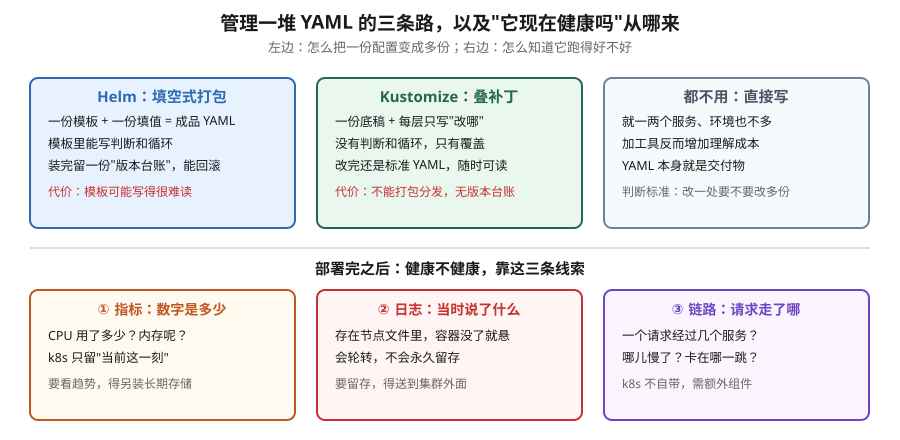

# 课 14：Helm · Kustomize · 可观测性

> 📍 所属阶段：阶段 4《配置 · 存储 · 资源 · 工程化》（收官课）
> 📖 故事章节：**从"能跑起来"到"跑得稳、跑得省"**
> 🧭 上一课：[课 13：资源 · 调度 · 扩缩容](lesson-13-资源调度扩缩容.md) ｜ 下一课：课 15 认证 · 授权 · 准入（阶段 5《安全体系》）
> ⚙️ 实操环境：WSL Ubuntu 24.04 · kind v1.34.0 · helm v3.22.0 · kubectl 内置 kustomize v5.7.1 · metrics-server v0.9.0

## 🎯 本课目标

学完本课，你应当能够：

- 用 Helm 安装、升级、回滚一个应用，说清 release 存在哪、回滚为什么能工作
- 说清 Helm 与 Kustomize 的**本质差异**（不是语法差异），并能在给定场景下做出选型
- 用 Kustomize 做多环境配置覆盖，理解"内容变则名字变"如何自动解决配置更新问题
- 说清 k8s 可观测性的**三根支柱**（指标 / 日志 / 链路），以及**每根 k8s 自带到什么程度**
- 知道 `kubectl logs` 的数据来自节点上哪个文件，以及它的边界在哪

---

## 第一幕：起源与场景引入 —— "十几个服务，改一处要改八遍"

### 一个真实的工程场景

前三课你学会了给一个应用配好**配置**（课 11）、**存储**（课 12）、**资源**（课 13）。单看一个应用，这套 YAML 挺漂亮。

现在把镜头拉远。你负责的系统有 12 个服务，要在 **开发 / 测试 / 生产** 三套环境部署。于是你的目录变成了这样：

```
manifests/
├── dev/
│   ├── order.yaml     # 副本 1、镜像 v1.2、资源 100m
│   ├── payment.yaml
│   └── ... 共 12 个
├── staging/
│   ├── order.yaml     # 副本 2、镜像 v1.2、资源 200m
│   └── ... 共 12 个
└── prod/
    ├── order.yaml     # 副本 5、镜像 v1.1、资源 500m
    └── ... 共 12 个
```

36 个文件。现在业务方说：**给所有服务加一条环境变量 `TRACE_ID`**。

你打开 36 个文件，改 36 遍。改到第 20 个的时候你开始怀疑人生——而且你知道，改得越多，越可能**漏掉一个**。

更糟的是第二个场景：**生产环境刚发的版本有问题，要回滚**。你翻 Git 历史找上一版 YAML，然后 `kubectl apply`。但你不确定：现在集群里跑的，跟 Git 里那份真的一样吗？万一上周有人 `kubectl edit` 手工改过呢？

**这就是本课要解决的问题**：当"一个应用"变成"一堆应用 × 多套环境"，手工管理 YAML 就不可维护了。我们需要**工程化手段**。

### 起源背景：三个问题的三条答案

k8s 生态对"YAML 管理"这个问题给出了**两种哲学截然不同的答案**：

**Helm** 诞生于 2015 年的 Deis 团队（后被微软收购），2016 年进入 CNCF。它的定位是 **"k8s 的包管理器"**——对标 Linux 的 `apt` / `yum`。核心思路是**打包分发**：你不用关心别人怎么写 YAML，装我的 chart 就行。（核查于 2026-09：Helm 1.0 于 2016 年 2 月发布，Helm 3.0 于 2019 年 11 月发布）

**Kustomize** 的出身完全不同。它最初是 `kubectl` 内部的一个子项目，由 k8s 官方 SIG-CLI 维护，2019 年随 `kubectl -k` 正式进入 kubectl。它的定位是 **"配置定制工具"**——官方原话的核心思想是：**k8s 的 YAML 应该保持纯粹的 YAML，不该被模板语言污染**。所以它选择"叠补丁"而非"写模板"。

**可观测性**则是一个更古老的命题。在 k8s 出现之前，运维就有"监控 / 日志 / 链路追踪"三件套。k8s 的特殊性在于：**Pod 是短暂的**——它随时被重建、被调度到别的节点、IP 会变。这让"找到昨天那个报错的容器"变成一个需要专门设计才能解决的问题。

> 💡 **一句话本质**（本课把什么从 A 变成 B）：
> 本课把应用交付**从"手工复制粘贴 36 份 YAML、出事靠翻 Git"，变成"一份源头 + 声明式差异、出事一键回滚"**；并让你看清**"它健康吗"这个问题的答案，k8s 只给了一半**。

> ⚖️ **处境对照**（不这么做 vs 这么做）：
>
> | | 不这么做（手工复制粘贴一堆 YAML） | 这么做（一份源头 + 差异层） |
> |---|---|---|
> | 改一处要改八遍 | 十几个服务，**每个环境抄一份**，改一处全靠手 | 源头改一处，各环境只是叠加自己的差异 |
> | 试错与回滚 | 得翻 Git 找上一版，手工 apply 回去 | 有版本台账，**一键退回去** |
> | 环境间差异 | 埋在整份文件里，**看不出哪几行不同** | 差异单独成层，一眼看全 |
> | 装第三方组件 | 拿到一堆 YAML，自己改参数、自己记改了什么 | 一条命令装，参数集中在一个文件里 |
> | "它健康吗" | 只能看"在不在跑"，**不知道为什么慢** | 有指标 / 日志 / 链路三条线索可查 |
> | **代价** | 上手零门槛，所见即所得 | 多一层抽象；且**日志不会永久保存**（Pod 一删就没了），得另想办法 |
>
> ⏳ 说明：以上是**机制层面**对照（改一处动几处、能否一键回退、差异是否可见）。"36 份 YAML"是本课对照实验中这套环境的实际数量，你自己的项目会有不同，此处仅作对照样例。

---

## 第二幕：认知冲突 —— "我照着做了，为什么回滚没生效？"

好，既然要工程化，你选了 Helm。装了个 nginx：

```bash
helm install myapp ./myapp
```

然后有人手滑，把副本数改成了 8：

```bash
kubectl scale deploy myapp --replicas=8
```

现在你执行 `helm upgrade myapp ./myapp --set replicaCount=3`——**结果副本数变成了 3，手工改的 8 被覆盖了**。

你挠头：不是说 Helm 3 会**保留**手工改动吗？我明明看过那篇讲"三向合并"的文章。

**这里出现了第一个认知冲突**。真相是：三向合并确实"考虑"了现场状态，但**不是无脑保留**。规则是——

- 这个字段 **Helm 管着**（在 manifest 里出现过）→ **不管这次改没改它，一律被 chart 值覆盖**
- 这个字段 **Helm 不管**（比如别人注入的 sidecar、注解）→ 原样保留

我实测的场景里 `replicaCount` 从 2 变 3，手工的 8 被覆盖了。但真正反直觉的是后半句——**就算这次压根没动 `replicaCount`、chart 值原封不动，8 照样被覆盖**。不少教程（包括我最初写这一课时参考的那篇）都写着"值没变就保留"，这是错的。实测过程见知识点 1。

**第二个认知冲突**来自 Kustomize。你听说"Kustomize 更简单"，于是试着在 YAML 里写个判断：

```yaml
{{ if .Values.prod }} replicas: 5 {{ end }}
```

结果这段**被原样输出**——Kustomize 不认识 `{{ }}`，它压根没有模板语言。你意识到：所谓"简单"，代价是**失去逻辑表达能力**。

**第三个冲突**在可观测性。你信心满满地敲：

```bash
kubectl logs my-pod --previous
```

想看看崩溃前的日志，结果返回空。或者更糟——Pod 已经被删了，`kubectl logs` 直接报错。

你这才意识到：**k8s 根本没有"永久保存日志"这回事**。日志只是节点上的一个文件，会轮转、会消失。

这三个冲突，我们一个一个拆。

---

## 第三幕：层层揭示

### 先看一眼全局

进入细节之前，先看这张图建立整体图景：



### 本课地图（3 步）

> ⚠️ 本课实际是**两块内容**：前半是"怎么管一堆 YAML"（知识点 1-2），后半是"怎么知道它健康吗"（知识点 3）。它们通过一个共同点连起来 —— **都是"规模化之后必须补的那一层"**。

| 步 | 这一步要解决什么 | 对应知识点 |
|---|---|---|
| 第 1 步 | 先解决"一份源头、多处复用、能一键回退" —— 模板 + 版本台账 | 知识点 1：Helm |
| 第 2 步 | 再看另一条路线：不要模板语言，只靠底稿 + 补丁层 | 知识点 2：Kustomize |
| 第 3 步 | 最后回答"它健康吗" —— k8s 自带了多少、还差什么 | 知识点 3：可观测性 |

> 现在你在：**第 1 步**（刚看完全局图，接下来先看模板 + 版本台账这条路）。

---

### 知识点 1：Helm —— 模板 + 版本台账

> 🧭 第 1/3 步｜承接：第二幕第一个冲突 —— "我照着做了，为什么回滚没生效？手工改的 8 个副本怎么就被覆盖了？" → 本步：拆开它的合并规则，你会看到"保留现场改动"这句话是有条件的。

**看图指引**：上半部分是**交付手段**——Helm 是"填空"（模板 + 值），Kustomize 是"叠补丁"（底稿 + 差异层），第三种选择是**两者都不用**（别为了工程化而工程化）；下半部分是**运行观测**——指标看"数字是多少"、日志看"当时说了什么"、链路看"请求走了哪"。**注意右半部分每一块都标注了 k8s 自带的边界**，这是本课的重点之一。

---

### 知识点 1：Helm —— 模板 + 版本台账

#### 一句话定义

Helm 是一个**模板引擎 + 版本管理器**：把带变量的 YAML 模板渲染成实际 YAML 发给 k8s，并在集群里**存一份每次渲染的记录（release）**，使回滚成为可能。

#### 直觉建立（类比）

把 Helm 想成**带版本号的包裹快递**：

- **Chart** = 包裹里的商品模板（"这是一件 T 恤，尺码待定"）
- **Values** = 你下单时填的选项（"尺码选 L"）
- **Release** = **这次**下单的订单记录（"订单 #1：T 恤，L 码，9 月 11 日"）

关键在最后一项：**同一个 Chart 可以产生多个 Release**（开发订一件、生产订一件），而且**每次改单都留记录**——这就是能回滚的原因。

Kustomize 则完全不同：它**没有订单记录**。它只是个"渲染器"，把底稿和补丁叠完吐出 YAML，完事。

#### 核心原理

**Helm 3 的架构**（与 Helm 2 最大的区别）：

```
Helm 2:  helm CLI → Tiller(集群内组件，权限很大) → k8s API
Helm 3:  helm CLI ─────────────────────────────→ k8s API
                    （直接用你的 kubeconfig 权限）
```

Helm 3 **移除了 Tiller**。这是个重要的安全改进：以前 Tiller 默认拥有集群级高权限（社区称"上帝模式"），任何人能连上 Tiller 就能干任何事。现在 Helm 直接读你的 `kubeconfig`，**你的权限就是 Helm 的权限**。

**Release 存在哪？** 存成集群里的 Secret。实测：

```bash
kubectl get secret -n ns-helm -l owner=helm
```

```
NAME                          TYPE               DATA   AGE
sh.helm.release.v1.myapp.v1   helm.sh/release.v1  1     18s
sh.helm.release.v1.myapp.v2   helm.sh/release.v1  1      5s
sh.helm.release.v1.myapp.v3   helm.sh/release.v1  1      3s
```

命名规律：`sh.helm.release.v1.<release名>.v<版本号>`。**每次 upgrade / rollback 都会产生一个新的 Secret**——这就是 `helm history` 能列出历史的原因。

> ⚠️ **一个容易被误解的安全点**：这些 Secret **不是加密**，只是 `gzip + base64`。任何人只要有 namespace 的 `get secret` 权限，就能解出明文：
> ```bash
> kubectl get secret sh.helm.release.v1.myapp.v1 -n ns-helm \
>   -o jsonpath='{.data.release}' | base64 -d | base64 -d | gunzip | head -c 300
> ```
> 实测输出：`{"name":"myapp","namespace":"ns-helm","version":1,"info":...,"manifest":"# Source: myapp/templates/serviceaccount.yaml..."}`
> **所以：不要把真正的密码明文写进 values 传给 Helm 并指望它安全。** 敏感数据仍应用 `Secret` + 外部密钥管理（如 Sealed Secrets、Vault）。

#### 示例演示：安装 → 升级 → 回滚（完整实测）

```bash
helm create myapp                    # 生成 chart 骨架
kubectl create ns ns-helm

# 安装（REVISION 1）
helm upgrade --install myapp ./myapp -n ns-helm --set replicaCount=2 --wait
# → myapp  ns-helm  1  deployed  myapp-0.1.0

# 升级（REVISION 2）
helm upgrade myapp ./myapp -n ns-helm --set replicaCount=4 --wait
# → REVISION 2，readyReplicas = 4

# 回滚到 1
helm rollback myapp 1 -n ns-helm --wait
```

**实测 `helm history`**：

```
REVISION  UPDATED                  STATUS      CHART        DESCRIPTION
1         Fri Sep 11 16:15:47 2026 superseded  myapp-0.1.0  Install complete
2         Fri Sep 11 16:15:59 2026 superseded  myapp-0.1.0  Upgrade complete
3         Fri Sep 11 16:16:02 2026 deployed    myapp-0.1.0  Rollback to 1
```

回滚后 `spec.replicas` = **2**（回到 REVISION 1 的状态）。

> 💡 **注意 REVISION 3 而不是"回到 1"**：回滚**不是删除历史**，而是**新增一条记录**指向旧状态。所以你可以再 `helm rollback myapp 2` 回到"回滚前"——历史是个单向增长的链条，不会丢。

#### values 的优先级（实测排序）

这是 Helm 最高频的困惑点。实测结果（默认 `replicaCount: 1`）：

| 场景 | 命令 | 结果 |
|---|---|---|
| 默认 | `helm template ./myapp` | `replicas: 1` |
| 单个 `-f` | `-f my-f.yaml`（值 3） | `replicas: 3` |
| `-f` + `--set` | `-f my-f.yaml --set replicaCount=5` | `replicas: 5` ← **--set 赢** |
| 多个 `-f` | `-f my-f.yaml -f my-g.yaml`（3 和 7） | `replicas: 7` ← **后者赢** |

**优先级顺序**（从低到高）：

```
        chart 自带的 values.yaml
          < 通过 -f/--values 指定的文件（多个时后面的覆盖前面的）
            < 通过 --set / --set-string / --set-file 指定的值
```

> ⚠️ **一个诚实的边界说明**：很多资料说 `--set-string` 用于"强制当字符串，避免数字被转类型"。但我实测发现，在 `image.tag` 这个位置上 `--set 'image.tag=0755'` 与 `--set-string 'image.tag=0755'` **输出完全相同**（都是 `nginx:0755`），传 `true` 也一样。
> 原因是模板里写的是 `{{ .Values.image.tag }}` 字符串拼接，Go template 渲染时会转回字符串，**类型差异被抹平了**。
> `--set-string` 真正起作用的场景是**值被直接用作 YAML 结构**（比如塞进 `args:` 列表当数字、或作为 map 的 key）。**本课未构造出该场景，故不展开**——记住有这个开关即可，遇到"值被莫名转成数字"时想起它。

#### 💡 非模板化亮点：`--set` 的点号陷阱（我实测踩错了方向）

很多教程说"`--set` 里的点号要转义"，但**没说清是 key 还是 value**——我一开始也理解错了，实测才发现两者行为完全不同。

**情况 A：点号在 VALUE 里**（如 `image.tag=1.2.3`）

```bash
helm template ./myapp --set 'image.tag=1\.2\.3'   # → image: "nginx:1.2.3"
helm template ./myapp --set 'image.tag=1.2.3'     # → image: "nginx:1.2.3"
```

**两者结果完全相同**。VALUE 里的点号不会被当分隔符，**转不转义无所谓**。

**情况 B：点号在 KEY 里**（如 ingress 注解 `nginx.ingress.kubernetes.io/rewrite-target`）

```bash
# 不转义 —— 点号被当层级分隔符，生成错误结构：
--set 'podAnnotations.nginx.ingress.kubernetes.io/rewrite-target=/foo'
```

```yaml
annotations:
  nginx:
    ingress:
      kubernetes:
        io/rewrite-target: /foo      # ← 完全错了
```

```bash
# 转义 \. —— 点号保留为 key 的一部分：
--set 'podAnnotations.nginx\.ingress\.kubernetes\.io/rewrite-target=/foo'
```

```yaml
annotations:
  nginx.ingress.kubernetes.io/rewrite-target: /foo   # ← 正确
```

**这才是真正的坑**：写 ingress 注解、自定义 annotation 时忘了转义，会静默生成错误结构，而且**不报错**。

**另外两个相关字符**：
- **逗号 `,`** 会被切成列表：`--set 'a={1,2,3}'` → 三个元素；想要字面逗号用 `\,`
- **`null`** 表示删除该 key：`--set image.tag=null` → 回落到模板里的 `default`

#### 三向合并：手工改动到底保不保留

这是第二幕认知冲突的答案。我把三格都实测了一遍（helm v3.22.0 / kind）：

```bash
# ── 前置：建环境（照抄可跑，此前漏了这三行）──
kubectl create ns ns-helm
cd /tmp && rm -rf lab14 && mkdir lab14 && cd lab14
helm create myapp                                    # 生成示例 chart，目录名即 ./myapp
helm install myapp ./myapp -n ns-helm --set replicaCount=3 --wait

# 【格 A】Helm 管着 replicas，且这次值变了（3→6）
kubectl scale deploy myapp -n ns-helm --replicas=8
helm upgrade myapp ./myapp -n ns-helm --set replicaCount=6
# 结果：replicas = 6   ← 手工的 8 被覆盖（符合预期）

# 【格 B】Helm 管着 replicas，但这次值没变（3→3）
kubectl scale deploy myapp -n ns-helm --replicas=8
helm upgrade myapp ./myapp -n ns-helm --set replicaCount=3   # 与上次相同
# 结果：replicas = 3   ← 手工的 8 照样被覆盖！(8 → 3)

# 【格 B'】换字段再验：image
kubectl set image deploy myapp myapp=alpine:3.20 -n ns-helm
helm upgrade myapp ./myapp -n ns-helm                        # chart 未改动
# 结果：image 回到 nginx:1.16.0   ← 照样被覆盖

# 【格 C】Helm 不管的字段
kubectl annotate deploy myapp handmade=yes -n ns-helm
helm upgrade myapp ./myapp -n ns-helm --set replicaCount=6
# 结果：handmade=yes 还在   ← 保留
```

**规则表**（注意第二行，它与流传甚广的说法相反）：

| 字段情况 | upgrade 后 |
|---|---|
| Helm 管着，且新旧 manifest **值变了** | **覆盖**手工改动 |
| Helm 管着，但新旧 manifest **值没变** | **照样覆盖**（实测 8 → 3） |
| Helm **不管**（如服务网格注入的 sidecar、别人加的注解） | **保留**（这是 Helm 3 相对 Helm 2 的关键改进） |

**map 字段还有一层细节**（实测补充）：map 是**深度合并**而非整体替换——chart 里**已存在的键**改了值会被覆盖（`app.kubernetes.io/version` 手工改 9.9.9 → 被覆盖回 1.16.0），但**手工新增的键**会留下（`handmade=yes` 保留）。

> 🎯 **实践结论**：三向合并解决的是"**别人注入的东西别被我删掉**"（sidecar、mutating webhook 加的字段），**不是**"让我手工改了还能赖着不走"。判据只有一条：**这个字段在不在 chart 渲染出的 manifest 里**——在，就会被覆盖；不在，就留着。
>
> ⚠️ **关于 `--reset-values`**：它管的不是这个。实测手工 scale 到 8 后 `--reset-values` upgrade，结果是 **1**（chart 默认值）而不是 8——它重置的是 **values 来源**（丢掉上次 `--set` 的值、回落到 `values.yaml`），**压根不看集群现场**。想彻底按渲染结果替换、连 chart 不管的字段一起清掉，用 `--force`（改发 PUT）。

> 📌 **为什么敢说流传的说法是错的**：Helm 官方维护者 `bacongobbler` 在 [issue #13411](https://github.com/helm/helm/issues/13411) 里对同样的实验回复 "Yes, that is the expected behaviour"，并承认自己此前写的博客有误。另有 [helmfile 作者 derlin 的规则归纳](https://dev.to/derlin/helmfile-difference-between-sync-and-apply-helm-3-28o1) 与上面的实测完全吻合。网上仍有人写"值没变就不动"（如 [elpa.dev](http://elpa.dev/2025/11/02/helm-3-ways-strategic-merge-patches.html)），别采信。

#### 常见误区

> 🐞 **误区 1**："release Secret 是加密的，可以放密码。"
> 错。只是 `gzip + base64`，一行命令就能解出明文。

> 🐞 **误区 2**："回滚是把历史删掉，回到过去。"
> 错。回滚是**新增一条 REVISION**，历史只增不减。

> 🐞 **误区 3**："Helm 会保留我所有手工改动。"（还有个更隐蔽的版本："只要这次没改这个字段，手工改动就留得住。"）
> 错。只有 **Helm 不管的字段**才保留。**chart 声明过的字段，不管这次改没改它，一律被 chart 值覆盖。**

#### 一句话记住

**Chart 是模板、Values 是填值、Release 是订单台账；台账只增不减，所以能回滚——但台账不是保险箱，它没上锁。**

📚 官方文档：[Helm 文档](https://helm.sh/zh/docs/) ｜ [Helm 2 以来的变化](https://v3.helm.sh/docs/v3/faq/changes_since_helm2/)

---

### 知识点 2：Kustomize —— 底稿 + 补丁层

> 🧭 第 2/3 步｜承接：上一条路靠模板语言 —— 可"简单点、不要模板"行不行？ → 本步：看另一条路线，以及它的代价：**写不了 if 判断**，你写的 `{{ }}` 会被原样输出。

#### 一句话定义

Kustomize 是一个**声明式配置定制工具**：保留一份原始 YAML 不动，用"补丁层"描述差异，**永远不引入模板语言**。

#### 直觉建立（类比）

把它想成 **PDF 批注** vs **重新排版**：

- **Helm** = 拿到一份 Word 稿，里面写着「[请填入公司名]」，你填完另存为新文件。原稿被改造了。
- **Kustomize** = 拿到一份**只读**的 PDF，你在上面**贴便利贴**："第 3 行改成 5"。原件一个字没动。

Kustomize 的官方信条是：**"k8s 的 YAML 应该始终是合法 YAML"**。你在 Kustomize 里写的每个文件，单独拿出来 `kubectl apply` 都是能用的——这与 Helm 模板（单独打开是语法错误）形成鲜明对比。

#### 核心原理

```
base/                     ← 原始 YAML，完全不动
├── deployment.yaml
├── service.yaml
└── kustomization.yaml    ← 声明"我包含哪些文件"

overlays/
├── dev/
│   └── kustomization.yaml   ← 引用 ../../base + 只写差异
└── prod/
    ├── kustomization.yaml
    └── patch-resources.yaml
```

运行 `kubectl kustomize overlays/prod/` 时，Kustomize 把 base 读进来，按顺序叠加 overlay 的指令，输出最终 YAML。**输出的是纯 YAML，没有留下任何 Kustomize 痕迹**。

#### 示例演示：一份 base，两个环境

**base**（两个环境的共同部分）：

```yaml
# base/deployment.yaml
apiVersion: apps/v1
kind: Deployment
metadata:
  name: myapp
spec:
  replicas: 1
  selector: {matchLabels: {app: myapp}}
  template:
    metadata: {labels: {app: myapp}}
    spec:
      containers:
      - name: app
        image: nginx:1.16.0
        resources:
          requests: {cpu: "100m", memory: "64Mi"}
          limits:   {cpu: "200m", memory: "128Mi"}
```

**dev overlay**（只改副本数 + 加前缀）：

```yaml
# overlays/dev/kustomization.yaml
resources:
- ../../base
namePrefix: dev-
replicas:
- name: myapp
  count: 2
```

实测渲染结果：

```
kind: Service
  name: dev-myapp      ← 自动加了前缀
kind: Deployment
  name: dev-myapp
  replicas: 2          ← 从 1 改成 2
```

**prod overlay**（改副本 + 换镜像 + 加标签 + 换资源）：

```yaml
# overlays/prod/kustomization.yaml
resources:
- ../../base
namePrefix: prod-
namespace: prod
replicas:
- name: myapp
  count: 5
images:
- name: nginx
  newTag: "1.25.3"       # 只换 tag，不用写全镜像地址
commonLabels:
  env: prod
patches:
- path: patch-resources.yaml
```

```yaml
# overlays/prod/patch-resources.yaml（只写要改的那一段）
apiVersion: apps/v1
kind: Deployment
metadata:
  name: myapp
spec:
  template:
    spec:
      containers:
      - name: app
        resources:
          requests: {cpu: "500m", memory: "512Mi"}
          limits:   {cpu: "1",    memory: "1Gi"}
```

实测渲染结果：

```
  name: prod-myapp
  namespace: prod
  replicas: 5
      - image: nginx:1.25.3     ← tag 被换掉
            cpu: "1"            ← patch 生效
            memory: 1Gi
        env: prod               ← commonLabels 注入
```

#### 💡 非模板化亮点：`configMapGenerator` 自动解决"改配置不生效"

课 11 讲过一个经典问题：**ConfigMap 改了，挂载它的 Pod 不会自动重启**，因为 Pod 感知不到内容变化。当时给了三个解法，其中一个是"把配置 hash 写进注解"。

**Kustomize 把这个方案内建了**——`configMapGenerator` 生成的 ConfigMap **名字带内容哈希**：

```yaml
configMapGenerator:
- name: app-config
  files:
  - app.properties
```

实测：内容 `log_level=debug` 时：

```
kind: ConfigMap
  name: dev-app-config-k8kd87hbgm
```

把内容改成 `log_level=info` 后重新渲染：

```
  name: dev-app-config-kfg5445g62     ← 哈希变了！
```

**名字变了，Pod 模板里引用的名字也跟着变，于是 Pod 自然滚动更新**——不需要 hash 注解，不需要手工重启。这是 Kustomize 相对 Helm 的一个真实优势（Helm 需要手工写 `checksum/config` 注解）。

> 🔑 **这也是课 11 留下的那个问题的自动化答案。**

#### Helm vs Kustomize：本质差异

| 维度 | Helm | Kustomize |
|---|---|---|
| **本质** | 模板引擎（填空） | 补丁叠加（叠层） |
| **能否写 if/for** | ✅ 能（Go template） | ❌ **不能**，这是设计选择 |
| **产物是不是合法 YAML** | ❌ 模板单独打开是语法错误 | ✅ **始终是合法 YAML** |
| **能否打包分发给别人** | ✅ `.tgz` chart + 仓库 | ❌ 只能给目录/Git 地址 |
| **有没有版本台账** | ✅ release + history + rollback | ❌ **无状态**，回滚靠 Git |
| **学习成本** | 较高（模板语法 + 函数） | 较低（就那十几个字段） |
| **谁在维护** | CNCF 独立项目 | k8s 官方 SIG-CLI，**内置在 kubectl** |

#### 什么时候都不用？（重要）

**别为了工程化而工程化。** 以下情况直接写 YAML 更好：

- 服务只有一两个，环境也只有一两个
- YAML 本身就是交付物（比如给学员看的教学示例）
- 团队没人熟悉 Helm/Kustomize，引入成本 > 收益

**判断标准一句话**：**改一处配置，需要同步改几份文件？** 一份 → 不用工具；多份 → 需要工具。

> 🎯 **两者也不是互斥的**。常见组合：用 Helm 安装第三方组件（人家就提供 chart），用 Kustomize 管理自己的多环境差异。甚至可以用 Kustomize 去 patch Helm 的输出（`helm template ... > all.yaml` 然后 kustomize 叠加）。

#### 常见误区

> 🐞 **误区 1**："Kustomize 更简单，所以应该总用它。"
> 错。需要**打包分发给外部用户**时（比如你写了个中间件要给别人装），Helm chart 是事实标准，Kustomize 做不到。

> 🐞 **误区 2**："Kustomize 有回滚功能。"
> 错。**Kustomize 无状态**——它不记录"上次部署了什么"。回滚要靠 **Git revert** 后重新 apply。这也是为什么 Kustomize 通常和 GitOps（ArgoCD / Flux）搭配使用。

> 🐞 **误区 3**："有了 Helm 就不需要 Kustomize。"
> 不一定。Helm 的 values 只能改**模板作者预留的口子**；Kustomize 可以 patch **任意字段**，包括作者没想到的。

#### 一句话记住

**Helm 是填空题（能算、能打包、有台账），Kustomize 是贴便利贴（不能算、纯 YAML、无台账）——先问"要不要分发、要不要回滚"，再选。**

📚 官方文档：[Kustomize 文档](https://kustomize.io/) ｜ [kubectl 中使用 Kustomize](https://kubernetes.io/zh-cn/docs/tasks/manage-kubernetes-objects/kustomization/)

---

### 知识点 3：可观测性 —— 三根支柱，k8s 各带了多少

> 🧭 第 3/3 步｜承接：前两步把"怎么交付"讲完了 —— 那交付之后，**它到底健康吗**？第二幕里 `kubectl logs --previous` 返回空就是入口 → 本步：看清 k8s 自带了哪一半、还差哪一半。

#### 一句话定义

可观测性是用系统的**外部输出**（指标 / 日志 / 链路）推断其**内部状态**的能力；k8s 只提供了三者的**基础设施**，**不提供长期存储和查询**。

#### 直觉建立（类比）

把集群想成一个**黑盒工厂**：

- **指标（Metrics）** = 工厂墙上的**仪表盘**：当前温度多少、转速多少。缺点是**只看得到现在**，不记录历史。
- **日志（Logs）** = 工人的**工作笔记**：某时某刻发生了什么、说了什么。缺点是**太散、太啰嗦**。
- **链路（Traces）** = 每件产品的**流转单**：这个订单经过了哪几道工序、每道花了多久。缺点是**需要提前埋点**。

三者回答不同问题：**指标告诉你"出问题了"，日志告诉你"出了什么问题"，链路告诉你"问题出在哪一跳"**。

#### 核心原理：每根支柱，k8s 给了什么

| 支柱 | k8s 自带什么 | **不自带**什么（要另装） |
|---|---|---|
| **指标** | Metrics API（聚合层）+ `kubectl top`；但**需另装 metrics-server** | 长期存储、趋势图、告警（→ Prometheus + Grafana） |
| **日志** | 节点上的**文本** + `kubectl logs` 读取 | 集中收集、检索、留存（→ Loki / EFK） |
| **链路** | **什么都没有** | 全都要（→ Jaeger / Tempo + OpenTelemetry 埋点） |

**这是本课最需要记住的一张表**：很多人以为"装了 k8s 就有监控"，其实 **k8s 只给了接口和数据落盘，没给存储和查询**。

#### 示例演示：指标层（实测）

`kubectl top` 背后的链路是这样的：

```
容器 cgroup（真实数据）
   ↓ kubelet 采集（每节点）
cAdvisor / kubelet Summary API
   ↓ metrics-server 抓取并聚合
Metrics API（apiservice: v1beta1.metrics.k8s.io）
   ↓ kubectl top 查询
你看到的表格
```

**实测：直接打 Metrics API 看原始数据**

```bash
kubectl get --raw /apis/metrics.k8s.io/v1beta1/nodes
```

返回（节选）：

```json
{"kind":"NodeMetricsList","apiVersion":"metrics.k8s.io/v1beta1",
 "items":[{"metadata":{"name":"k8s-c1-control-plane",...},
           "timestamp":"2026-09-11T08:17:59Z",
           "window":"20.028s",
           "usage":{"cpu":"104902786n","memory":"1498676Ki"}}]}
```

注意 `"window":"20.028s"`——这是**采样窗口**，说明 metrics-server 给的是**最近 20 秒的平均值**，不是瞬时值。

> ⚠️ **关键限制**：metrics-server **不存储历史**。它是个内存中的"当前快照"服务，重启即丢。所以：
> - ✅ `kubectl top` 能用
> - ✅ HPA 能用（只需要当前值）
> - ❌ **"昨天下午三点的 CPU 是多少"查不到** —— 这需要 Prometheus 之类的时序数据库

这也是为什么课 13 装了 metrics-server 后 HPA 就能工作，但你要看趋势图还得另装 Prometheus。

#### 示例演示：日志层（实测，含真实文件路径）

这是本课**最有实操价值**的一段——搞清楚 `kubectl logs` 到底在读什么。

起一个持续打日志的 Pod：

```bash
kubectl create ns ns-log
kubectl apply -f - <<'EOF'
apiVersion: v1
kind: Pod
metadata: {name: logdemo, namespace: ns-log}
spec:
  containers:
  - name: c
    image: busybox:1.36
    command: ["sh","-c","i=0; while true; do echo \"line-$i $(date +%s)\"; i=$((i+1)); sleep 2; done"]
EOF
```

**第 1 步：`kubectl logs` 看到什么**

```
line-0 1789114686
line-1 1789114688
line-2 1789114690
```

**第 2 步：登录节点，找真实文件**（kind 集群节点是个 docker 容器）：

```bash
docker exec k8s-c1-control-plane find /var/log/pods -path "*ns-log*" -name "*.log"
```

```
/var/log/pods/ns-log_logdemo_427c4df3-616f-4656-9ff6-8e76e4172dde/c/0.log
```

**命名规律**：`/var/log/pods/<命名空间>_<Pod名>_<Pod UID>/<容器名>/0.log`

这里的 `0.log` 中的 `0` 是**重启次数**——容器重启一次就变成 `1.log`。这就是为什么 `--previous` 能读到上一次的日志：**上一次的重启次数比当前小 1**。

**第 3 步：看文件真实内容**

```bash
cat /var/log/pods/ns-log_logdemo_.../c/0.log
```

```
2026-09-11T08:18:06.939651456Z stdout F line-0 1789114686
2026-09-11T08:18:08.940955944Z stdout F line-1 1789114688
2026-09-11T08:18:10.942274403Z stdout F line-2 1789114690
```

**比 `kubectl logs` 多了前缀**——这是 CRI（容器运行时接口）加的日志头，格式是：

```
<RFC3339Nano时间戳> <流类型:stdout/stderr> <标记:F/P> <原始内容>
```

其中 `F` = Full（完整一行），`P` = Partial（一行被截断了，因为超过 16KB）。

**第 4 步：`/var/log/containers` 是符号链接层**

```bash
ls -la /var/log/containers/ | grep logdemo
```

```
lrwxrwxrwx logdemo_ns-log_c-bdf115a4...log -> /var/log/pods/ns-log_logdemo_427c4df3.../c/0.log
```

命名规律：`<Pod名>_<命名空间>_<容器名>-<容器ID前12位>.log`

> 🔑 **为什么要有这一层符号链接**：早期日志采集器（Fluentd / Filebeat）习惯扫描 `/var/log/containers/*.log`，从**文件名**就能解析出 Pod 名、命名空间、容器名，不用去查 API。这是历史遗留但至今有效的约定。

#### ⚠️ `kubectl logs` 的三个边界（实测发现）

**边界 1：Pod 删除后，日志可能还在，也可能不在——不确定。**

实测：删除 Pod 后立刻 `kubectl logs`，**仍然返回了日志**（文件还没被 kubelet 回收）：

```bash
kubectl delete pod logdemo -n ns-log --wait=false
kubectl logs logdemo -n ns-log
# line-0 1789114686     ← 还能读到！
```

但节点上的目录**已经准备清理**。这意味着：**Pod 一删，日志就进入了"随时可能消失"的状态**。所以——

> 🔑 **铁律**：**Pod 删除前先把日志捞出来**，别指望事后还能看。生产环境必须把日志送到集群外（Loki / EFK）。

**边界 2：日志会轮转，不会永久留存。**

kubelet 负责轮转容器日志，受两个参数控制（默认 `containerLogMaxSize: 10Mi`、`containerLogMaxFiles: 5`）：单个文件超过上限就切新的，文件数超上限就删最旧的。**也就是说每个容器的日志最多约 50Mi**——打满了，最旧的就没了。

> 🔍 **本机实测情况**：读取 kind 节点的 `/var/lib/kubelet/config.yaml`，`logging` 段只有 `flushFrequency` 和 `options`，**没有** `containerLogMaxSize` / `containerLogMaxFiles`；kubelet 进程参数里也没有相关项。
> 含义是：**kind 没有显式覆盖，走 kubelet 默认值**。所以上面的 10Mi × 5 是**默认值生效**，不是本机显式配置的——这个区别在生产排障时很重要（你的集群可能被运维改过，得实际查）。

**边界 3：崩溃前的日志要用 `--previous`。**

```bash
kubectl logs <pod> --previous        # 读上一次（重启前）容器的日志
```

这是 CrashLoopBackOff 排查的第一步（呼应课 13 的 OOM 排查：`--previous` 读的是 `lastState`，正是 OOMKilled 记录所在）。

#### 常见误区

> 🐞 **误区 1**："k8s 会帮我保存日志。"
> 不会。日志是节点上的本地文件，**会轮转、会随 Pod 删除而消失**。k8s 只负责"写到文件"，不负责"收走"。

> 🐞 **误区 2**："装了 metrics-server 就有监控了。"
> 不够。metrics-server 只提供**当前快照**（`window: 20s`），**不存历史**。要看趋势、要告警，得 Prometheus。

> 🐞 **误区 3**："可观测性 = 装一套 Prometheus + Grafana。"
> 那只覆盖了**指标**这一根。日志和链路是另外两根，需要各自的组件（Loki/EFK、Jaeger/Tempo）。

#### 一句话记住

**指标看数字、日志看原话、链路看路径；k8s 只给了"仪表盘接口"和"写文件的手"，长期存储和集中查询都得另请高明。**

📚 官方文档：[Metrics Server](https://github.com/kubernetes-sigs/metrics-server) ｜ [日志架构](https://kubernetes.io/zh-cn/docs/concepts/cluster-administration/logging/) ｜ [系统日志](https://kubernetes.io/zh-cn/docs/concepts/cluster-administration/system-logs/)

---

## 第四幕：实操验证

### 验证 0：环境确认

```bash
helm version --short        # 期望：v3.22.0+
kubectl version --short     # 期望：Client v1.34.0，Kustomize Version: v5.7.1
kubectl top nodes           # 期望：能返回用量（metrics-server 已装）
```

> 💡 **Kustomize 不用单独装**：`kubectl` 从 v1.14 起内置了 Kustomize，`kubectl kustomize <dir>` / `kubectl apply -k <dir>` 直接可用。
> 独立 CLI（`kustomize`）功能更新更快，但**内置的够用**。

### 验证 1：Helm 完整生命周期

```bash
cd /tmp && rm -rf l14helm && mkdir l14helm && cd l14helm
helm create myapp
kubectl create ns ns-helm

# 安装 → 升级 → 回滚
helm upgrade --install myapp ./myapp -n ns-helm --set replicaCount=2 --wait --timeout 180s
helm upgrade myapp ./myapp -n ns-helm --set replicaCount=4 --wait --timeout 180s
helm rollback myapp 1 -n ns-helm --wait --timeout 180s

# 期望看到
helm history myapp -n ns-helm
# REVISION 1 superseded (Install complete)
# REVISION 2 superseded (Upgrade complete)
# REVISION 3 deployed   (Rollback to 1)

kubectl get deploy myapp -n ns-helm -o jsonpath='{.spec.replicas}'   # 期望：2
```

**验证 release 存储形态**：

```bash
kubectl get secret -n ns-helm -l owner=helm
# 期望看到 sh.helm.release.v1.myapp.v1 / .v2 / .v3
```

### 验证 2：values 优先级

```bash
echo "replicaCount: 3" > my-f.yaml
echo "replicaCount: 7" > my-g.yaml

helm template t0 ./myapp                            | grep -m1 "^  replicas:"   # 1（默认）
helm template t1 ./myapp -f my-f.yaml               | grep -m1 "^  replicas:"   # 3
helm template t2 ./myapp -f my-f.yaml --set replicaCount=5 | grep -m1 "^  replicas:"  # 5
helm template t3 ./myapp -f my-f.yaml -f my-g.yaml  | grep -m1 "^  replicas:"   # 7
```

### 验证 3：`--set` 点号陷阱（KEY vs VALUE）

```bash
# VALUE 里的点号：转不转义都一样
helm template a ./myapp --set 'image.tag=1\.2\.3' | grep -m1 'nginx:'   # nginx:1.2.3
helm template b ./myapp --set 'image.tag=1.2.3'   | grep -m1 'nginx:'   # nginx:1.2.3

# KEY 里的点号：必须转义，否则生成嵌套结构
helm template c ./myapp --set 'podAnnotations.nginx.ingress.kubernetes.io/x=/foo' \
  | grep -A5 "annotations:" | head -6
# 错误：nginx: → ingress: → kubernetes: → io/x: /foo

helm template d ./myapp --set 'podAnnotations.nginx\.ingress\.kubernetes\.io/x=/foo' \
  | grep -A2 "annotations:" | head -3
# 正确：nginx.ingress.kubernetes.io/x: /foo
```

### 验证 4：Kustomize 多环境覆盖

```bash
mkdir -p /tmp/l14kus/{base,overlays/dev,overlays/prod}
# （按知识点 2 的内容创建 base 与两个 overlay）

kubectl kustomize overlays/dev/    # 期望：dev-myapp、replicas: 2
kubectl kustomize overlays/prod/   # 期望：prod-myapp、replicas: 5、nginx:1.25.3
```

**验证 configMapGenerator 哈希随内容变化**：

```bash
echo "log_level=debug" > overlays/dev/app.properties
kubectl kustomize overlays/dev/ | grep "name: dev-app-config"
# dev-app-config-k8kd87hbgm

echo "log_level=info" > overlays/dev/app.properties
kubectl kustomize overlays/dev/ | grep "name: dev-app-config"
# dev-app-config-kfg5445g62     ← 哈希变化
```

### 验证 5：日志的真实落点

```bash
kubectl create ns ns-log
kubectl apply -f - <<'EOF'
apiVersion: v1
kind: Pod
metadata: {name: logdemo, namespace: ns-log}
spec:
  containers:
  - name: c
    image: busybox:1.36
    command: ["sh","-c","i=0; while true; do echo \"line-$i $(date +%s)\"; i=$((i+1)); sleep 2; done"]
EOF
kubectl wait --for=condition=Ready pod/logdemo -n ns-log --timeout=120s
sleep 6
kubectl logs logdemo -n ns-log | head -3

# 登录 kind 节点看真实文件
docker exec k8s-c1-control-plane find /var/log/pods -path "*ns-log*" -name "*.log"
docker exec k8s-c1-control-plane sh -c 'cat $(find /var/log/pods -path "*ns-log*" -name "*.log" | head -1)' | head -3
# 期望看到带 CRI 前缀的行：<时间戳> stdout F <内容>

docker exec k8s-c1-control-plane ls -la /var/log/containers/ | grep logdemo
# 期望看到符号链接 → /var/log/pods/...
```

> ⚠️ `docker exec` 进入 kind 节点是**教学环境专用手段**。真实集群的节点请用 `ssh` 或 `kubectl debug node/<name> -it --image=busybox`。

### 验证 6：完整清理（务必执行）

```bash
helm uninstall myapp -n ns-helm
kubectl delete ns ns-helm ns-log
rm -rf /tmp/l14helm /tmp/l14kus /tmp/l14kus2
```

> ⚠️ 本课会在集群里留下 release Secret 和打日志的 Pod，**不清理会持续占用资源**（打日志的 Pod 会一直写到节点磁盘）。

### 4.2 应用实战：12 个服务 × 3 套环境，改一处要改 36 遍

> 🎯 **想看它解决什么真实问题？** → [应用实战 · 一份源头多套环境](../../../应用实战/14-一份源头多套环境.md)
>
> 课内验证的是「生命周期怎么用、哈希会不会变」；实战里是一个**真实的交付场景**：36 份 YAML 怎么收敛成一份源头，以及**出事怎么退回去**。核心结论是 Helm 与 Kustomize 的**本质差异**——打包分发（带版本台账）vs 叠补丁（YAML 保持纯 YAML）。
>
> ✅ **本课第二幕/第三幕已按实测修正**，与实战结论一致：真实规则是**字段只要出现在 chart 里，upgrade 时一律被 chart 值覆盖，与"这次改没改它"无关**；只有 chart 完全不管的字段（别人注入的 sidecar、注解）才保留。依据为 Helm 官方维护者 `bacongobbler` 在 [issue #13411](https://github.com/helm/helm/issues/13411) 中对实验的确认回复（"Yes, that is the expected behaviour"），并用其实验精确复现：`a` 从 2 被覆盖回 1，`b=3` 保留。
>
> 本轮另补两处边界实测：① **map 是深度合并**——chart 已有的键改了值会被覆盖，手工**新增的键**会留下；② **`--reset-values` 重置的是 values 来源而非集群现场**（手工 scale 8 后 `--reset-values` 得到 1，不是 8），想连 chart 不管的字段一起清掉要用 `--force`。
>
> 另含三个实测抓到的坑：① **配置名不带哈希 → 改了内容也不生效**（`deployment unchanged`、值仍是旧值，且 apply **全程无报错**）；② **日志只在 Pod 当时所在的那一台机器**，Pod 一删就没（`kubectl logs` 直接 `NotFound`，节点文件也消失）；③ **`--force` 会连带清掉 chart 不管的字段**（改用 PUT 替换而非 PATCH）。详见 [应用实战索引](../../../应用实战/INDEX.md)。

---

## 第五幕：体系收束

### 本课在整体中的位置

**课 14 是阶段 4 的收官课**，也是整条"工程化"主线的第三站：

```
课 1 埋种子（适用边界）→ 课 9（入口选型）→ 课 14（工程化选型）→ 课 20（决策清单收口）
```

阶段 4 四课的完整故事：

```
阶段 4 配置 · 存储 · 资源 · 工程化
├── 课 11：ConfigMap 与 Secret        → 配置从哪来
├── 课 12：Volume / PV / PVC          → 数据放哪
├── 课 13：资源 · 调度 · 扩缩容       → 怎么不拖垮邻居、怎么扛住流量
└── 课 14：Helm · Kustomize · 可观测性 ← 本课（怎么规模化交付 + 怎么知道健康）
```

**前三课是"让一个应用跑得好"，课 14 是"让一堆应用在多个环境里都跑得好，并且你知道它们跑得好不好"。**

### 本课知识地图

```
            "一堆应用 × 多套环境" 怎么管？
                      │
        ┌─────────────┼─────────────┐
        ▼             ▼             ▼
      Helm         Kustomize      裸写 YAML
   （模板+台账）   （底稿+补丁）   （就一两个服务）
        │             │
        └──────┬──────┘
               ▼
        交付下去了，然后呢？
               │
   ┌───────────┼───────────┐
   ▼           ▼           ▼
  指标        日志        链路
（数字）    （原话）    （路径）
   │           │           │
kubectl top  kubectl logs  k8s 不自带
+metrics     读节点文件   （需 OTel
-server     会轮转会消失   + Jaeger）
（不存历史）
```

**两条暗线贯穿本课**：

**暗线一：一切权衡都是"能力 vs 纯度"。** Helm 有逻辑表达能力，代价是模板不再是可读 YAML；Kustomize 保持 YAML 纯净，代价是失去 if/for。这个权衡在软件工程里反复出现——本课是在 k8s 语境下再遇一次。

**暗线二：k8s 只提供接口，不提供实现。** 指标有 API 但无存储，日志有落盘但无收集，链路完全空白。**k8s 的哲学是"留下扩展点，让用户自己填"**——理解了这一点，你就不会奇怪"为什么装了 k8s 还要装一堆东西"。

### 你现在会了什么

- ✅ 能用 Helm 完成安装 → 升级 → 回滚全链路，知道 release 是 Secret 且未加密
- ✅ 知道 values 优先级，以及 `--set` 点号陷阱在 **KEY** 而非 VALUE
- ✅ 能用 Kustomize 做多环境覆盖，理解 `configMapGenerator` 如何自动触发更新
- ✅ 能在 Helm / Kustomize / 裸写三者间做选型，知道判断标准是"改一处要改几份"
- ✅ 说清可观测性三支柱，以及 k8s 每根支柱自带到什么程度
- ✅ 知道 `kubectl logs` 读的是节点上哪个文件，以及它的三个边界

### 下一步

阶段 4 到此结束。接下来是**阶段 5《安全体系》**（课 15 认证授权准入 / 课 16 Pod 安全 / 课 17 Secret 加固与审计）。

本课埋下的伏笔会在那里以另一种方式兑现——**安全与工程化在这个点上正面相撞**：

- 本课讲过 **release Secret 只是 base64 不是加密** → 课 17 会讲 etcd 静态加密与真正的密钥管理
- 本课讲过 **Helm 用你的 kubeconfig 权限**（Helm 3 移除 Tiller）→ 课 15 会讲 RBAC 如何把这份权限收窄到最小
- 本课讲过 **ConfigMap 里不该放密码** → 课 17 会讲 Secret 的正确用法与加固手段

再往后是阶段 6《排障 · 运维 · 扩展》，那里才集中兑现本课埋下的另一组伏笔：

- `kubectl logs --previous` → 排障第一步
- 指标不足（无历史）→ 为什么排查时"当时发生了什么"经常查不到
- 资源 limits 与 OOM → 排障最高频的死因之一

**至此你已经具备"把一个应用完整地部署到 k8s 并让它稳定运行"的能力。**

---

## 📋 命令速查卡

| 我想… | 命令 |
|---|---|
| 创建 chart 骨架 | `helm create <name>` |
| 本地渲染（不装集群） | `helm template <name> ./<chart>` |
| 安装或升级 | `helm upgrade --install <name> ./<chart> -n <ns>` |
| 看历史 | `helm history <name> -n <ns>` |
| 回滚 | `helm rollback <name> <REVISION> -n <ns>` |
| 卸载 | `helm uninstall <name> -n <ns>` |
| 看 release 存储 | `kubectl get secret -n <ns> -l owner=helm` |
| 解出 release 明文 | `kubectl get secret <secret> -o jsonpath='{.data.release}' \| base64 -d \| base64 -d \| gunzip` |
| 渲染 kustomize | `kubectl kustomize <dir>` |
| 应用 kustomize | `kubectl apply -k <dir>` |
| 看当前资源用量 | `kubectl top pod` / `kubectl top node` |
| 打 Metrics API 原始数据 | `kubectl get --raw /apis/metrics.k8s.io/v1beta1/nodes` |
| 看崩溃前日志 | `kubectl logs <pod> --previous` |
| 多容器指定容器 | `kubectl logs <pod> -c <container>` |
| 找节点上的日志文件 | `find /var/log/pods -path "*<ns>*" -name "*.log"` |

---

## 🐞 误区清单（本课全部）

| # | 误区 | 正解 |
|---|---|---|
| 1 | release Secret 是加密的，可以放密码 | 只是 `gzip + base64`，一行命令解出明文 |
| 2 | 回滚是删除历史回到过去 | 回滚是**新增** REVISION，历史只增不减 |
| 3 | Helm 会保留所有手工改动 / 没改的字段就留得住 | **只保留「Helm 不管的字段」**；chart 声明过的字段**不管这次改没改**，一律被覆盖 |
| 4 | `--set` 的点号都要转义 | **只有 KEY 里的点号**要转义；VALUE 里的无所谓（实测两者结果相同） |
| 5 | Kustomize 更简单，应总用它 | 需要打包分发时 Helm 是事实标准，Kustomize 做不到 |
| 6 | Kustomize 有回滚功能 | 无状态，回滚靠 Git revert + 重新 apply |
| 7 | 有了 Helm 就不需要 Kustomize | Kustomize 可 patch **任意字段**，Helm 只能改作者预留的口子 |
| 8 | k8s 会保存日志 | 日志是节点本地文件，**会轮转、随 Pod 删除而消失** |
| 9 | 装了 metrics-server 就有监控 | 只提供**当前快照**（window 20s），**不存历史**，无告警 |
| 10 | 可观测性 = Prometheus + Grafana | 那只覆盖指标；日志、链路是另外两根支柱 |
| 11 | Pod 删了还能从容翻日志 | 实测删除后**进入随时消失状态**，删前必须先捞 |

---

## 🔍 事实核查记录

| 结论 | 来源 | 核查状态 |
|---|---|---|
| Helm 安装/升级/回滚全链路与 REVISION 递增 | **本机实测**（helm v3.22.0） | ✅ 已实测 |
| release 存储为 `sh.helm.release.v1.*` Secret，类型 `helm.sh/release.v1` | 本机实测 | ✅ 已实测 |
| release 可解出明文（gz + base64，非加密） | 本机实测 | ✅ 已实测 |
| values 优先级：`values.yaml` < `-f`（后者胜）< `--set` | 本机实测 | ✅ 已实测 |
| **点号陷阱在 KEY 而非 VALUE** | 本机实测（纠正了我最初的误判） | ✅ 已实测 |
| 三向合并：Helm 管理字段**一律覆盖**手工改动（含"值没变"场景） | 本机实测（grid 三格：8→3、alpine→nginx、注解保留）+ 官方维护者确认 | ✅ 已实测 |
| 三向合并：map 深度合并——已有键被覆盖、手工新增键保留 | 本机实测（label 键两类） | ✅ 已实测 |
| `--reset-values` 重置的是 values 来源、非集群现场（实测 8 → 1） | 本机实测 | ✅ 已实测 |
| Helm 3 保留非 Helm 管理字段（sidecar 等） | 本机实测（handmade 注解）+ [Helm 官方文档](https://v3.helm.sh/docs/v3/faq/changes_since_helm2/) | ✅ 已实测 |
| Helm 3 移除 Tiller、改用 kubeconfig 权限 | [Helm 官方 FAQ](https://v3.helm.sh/docs/v3/faq/changes_since_helm2/) | 📄 文档结论 |
| Helm 1.0 (2016-02) / 3.0 (2019-11) 发布时间 | 公开资料（核查于 2026-09） | 📄 低时效风险 |
| Kustomize base/overlay、namePrefix、replicas、images、patch | 本机实测（kubectl 内置 v5.7.1） | ✅ 已实测 |
| `configMapGenerator` 哈希随内容变化 | 本机实测（`k8kd87hbgm` → `kfg5445g62`） | ✅ 已实测 |
| Kustomize 无模板逻辑（`{{ }}` 原样输出） | 本机实测 | ✅ 已实测 |
| metrics-server 提供当前快照、`window: 20s`、不存历史 | 本机实测（`kubectl get --raw`） | ✅ 已实测 |
| 日志路径 `/var/log/pods/<ns>_<pod>_<uid>/<c>/0.log` | 本机实测 | ✅ 已实测 |
| `/var/log/containers/*.log` 是符号链接 | 本机实测 | ✅ 已实测 |
| CRI 日志头格式（时间戳 + stdout/stderr + F/P） | 本机实测 | ✅ 已实测 |
| Pod 删除后日志仍可读但随时消失 | 本机实测 | ✅ 已实测 |
| 日志轮转默认 10Mi × 5 个文件 | Kubernetes 文档 / kubelet 参数 | 📄 文档结论（未在本机改动验证） |
| 可观测性三支柱划分 | 行业共识 + 官方文档结构 | 📄 低时效风险 |

> ⚠️ **未实测项说明**：日志轮转的默认参数（10Mi / 5 文件）来自 kubelet 文档，本机 kind 环境的实际配置未做改动验证（探测时 `/var/lib/kubelet/config.yaml` 的 `logging` 段存在但未读出具体值，因 kind 节点内配置读取受限）。已在正文标注为文档结论。

---

## 📚 官方文档

- [Helm 官方文档](https://helm.sh/zh/docs/) —— Chart 开发、模板函数、最佳实践
- [Helm 2 以来的变化](https://v3.helm.sh/docs/v3/faq/changes_since_helm2/) —— 三向合并与 Tiller 移除的权威说明
- [Kustomize 官方文档](https://kustomize.io/)
- [使用 Kustomize 管理 k8s 对象](https://kubernetes.io/zh-cn/docs/tasks/manage-kubernetes-objects/kustomization/)
- [Metrics Server](https://github.com/kubernetes-sigs/metrics-server)
- [日志架构](https://kubernetes.io/zh-cn/docs/concepts/cluster-administration/logging/) —— 节点级与集群级日志方案
- [系统日志](https://kubernetes.io/zh-cn/docs/concepts/cluster-administration/system-logs/)

---

## 🚀 下一批接力提示词

> 学完本课后，**复制下面这段文字发给 AI**，即可无缝进入下一课：

```
继续学 Kubernetes。我的学习档案在 k8s/00-学习档案.md，
刚学完阶段 4《配置 · 存储 · 资源 · 工程化》的课 14《Helm · Kustomize · 可观测性》
（Helm 模板与 release 台账、Kustomize 补丁覆盖、可观测性三支柱与 k8s 边界），
阶段 4 已全部完成。请按大纲开始阶段 5《安全体系》的课 15《认证 · 授权 · 准入：RBAC 与 ServiceAccount》。
```

---

## 🧭 课程导航

- ⬅️ 上一课：[课 13：资源 · 调度 · 扩缩容](lesson-13-资源调度扩缩容.md)
- ➡️ 下一课：课 15：认证 · 授权 · 准入：RBAC 与 ServiceAccount（阶段 5《安全体系》，待编写）
- 🏠 返回：[课程目录](../../../02-课程目录.md) ｜ [阶段 4 概览](../overview.md)
