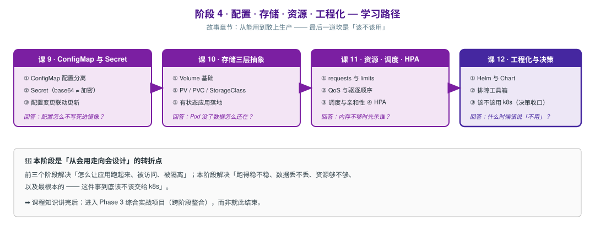

# 阶段 4：配置 · 存储 · 资源 · 工程化

> 所属课程：Kubernetes 系统学习 ｜ 故事章节：**从能用到敢上生产** ｜ 上一阶段：[阶段 3《网络与服务暴露》](../3-网络与服务暴露/overview.md)
> 下一阶段：[阶段 5《安全体系》](../5-安全体系/overview.md)

## 🎯 本阶段目标

- 实现配置与代码分离，理解 Secret 的安全边界（它**不是**加密）
- 给有状态应用挂上持久化存储，理解为什么要分 Volume / PV / PVC / StorageClass 四层
- 能设置合理的资源配额，并**预判**节点资源紧张时谁会被杀
- 掌握扩缩容三件套的适用前提，以及多租户资源治理手段
- 能用 Helm / Kustomize 管理应用，理解可观测性是自动化的前提

## 📍 学习重点

- **Secret 只是 base64**：它防的是「误看」，不是「被拿」。真正的安全要靠 RBAC + etcd 加密 + 外部密钥管理（阶段 5 展开）
- **存储为什么要四层抽象**：把「用什么存储」（基础设施关注）与「要多少存储」（应用关注）解耦 —— 与 Ingress/Controller 是同一种设计套路
- **QoS 决定生死**：节点内存不足时，BestEffort 先死、Guaranteed 最后死。这不是配置细节，是容量规划的核心
- **requests 影响调度、limits 影响运行**：两者语义不同，只配 limits 是常见错误
- **扩缩容三件套各有前提**：HPA 扩副本（需 metrics-server）、VPA 调资源（与 HPA 共存需谨慎）、Cluster Autoscaler 加节点（依赖云厂商）
- **多租户需要双重约束**：ResourceQuota 限制命名空间总量，LimitRange 为单个容器兜底默认值 —— 没有 LimitRange 的 Quota 容易被单个 Pod 打满
- **Helm 与 Kustomize 是两种哲学**：Helm 是模板化打包（适合分发），Kustomize 是声明式覆盖（适合多环境差异）。二者不是互斥关系
- **可观测性是自动化的前提**：没有 metrics-server，HPA 无法工作；没有日志架构，排障只能靠 `kubectl logs` 单点查看

## ✅ 必须掌握的知识点

| 知识点 | 所属课 | 学完应能 |
|--------|--------|----------|
| ConfigMap | 课 11 | ~~用 ConfigMap 注入配置（环境变量 / 挂载文件两种形式）~~ ✅ 已完成 |
| Secret | 课 11 | ~~创建并注入 Secret，说清 base64 与加密的区别及正确加固方式~~ ✅ 已完成 |
| 投射卷 projected volume | 课 11 | ~~把 ConfigMap/Secret/downward API 多个来源合并挂载到同一目录，说清它解决了什么问题~~ ✅ 已完成 |
| 配置变更与滚动更新联动 | 课 11 | ~~说清配置更新后 Pod 是否自动重启，以及如何主动触发~~ ✅ 已完成 |
| Volume 基础 | 课 12 | 区分 emptyDir / hostPath 的生命周期与适用场景 |
| PV / PVC / StorageClass | 课 12 | 说清三层抽象各自解决什么问题，能写 PVC 并观察绑定 |
| 有状态应用落地 | 课 12 | 给有状态应用挂持久化卷，验证 Pod 重建后数据仍在 |
| requests 与 limits | 课 13 | 正确设置二者，说清各自影响调度还是运行时 |
| QoS 与驱逐顺序 | 课 13 | 判定 Pod 的 QoS 等级，预判节点压力时的驱逐顺序 |
| 调度、亲和性与污点容忍 | 课 13 | 用 nodeSelector / 亲和性 / 污点容忍控制 Pod 落点 |
| HPA / VPA / Cluster Autoscaler | 课 13 | 区分三者扩什么，说清各自依赖与共存注意事项 |
| ResourceQuota 与 LimitRange | 课 13 | 用 Quota + LimitRange 做多租户资源治理，说清二者配合关系 |
| Helm 与 Chart | 课 14 | 用 Helm 安装、升级、回滚一个应用 |
| Kustomize | 课 14 | 用 Kustomize 做多环境配置覆盖，说清与 Helm 的取舍 |
| 可观测性（metrics-server 与日志架构） | 课 14 | 部署 metrics-server 使 `kubectl top` 可用，说清集群日志架构 |

## 🗺️ 本阶段路径图

> SVG 展示四课顺序：配置 → 存储 → 资源与扩缩容 → 工程化与可观测。

## ✅ 课 11 完成情况（2026-09-11）

**讲义**：[lesson-11-ConfigMap与Secret.md](lessons/lesson-11-ConfigMap与Secret.md)（1600 行）

**阶段状态**：课 11 已完成，课 12（存储）待开始。

**本课核心结论（全部本机实测）**：

1. ConfigMap 让镜像跨环境复用；**环境变量永不更新**（创建时固化），**卷挂载会更新**但延迟 50~100 秒
2. **Secret 不是加密，只是 base64** —— 一行 `base64 -d` 还原明文，防误看不防被拿
3. Secret 卷挂载**默认 0644，任何用户可读**；必须显式 `defaultMode: 0400`
4. **Secret 走 tmpfs 不落盘，ConfigMap 走磁盘会落盘**（实测推翻了"都是 tmpfs"的常见说法）
5. 改配置**不触发**滚动更新（ConfigMap 不在 Pod 模板里，hash 不变）
6. **subPath 挂载放弃自动更新** —— 最隐蔽的坑
7. 投射卷解决"同一目录挂多来源"（ConfigMap + Secret + downward API）
8. immutable 是**单向门**：防误改 + 降 API Server 压力，但设了改不回来

> **阶段 5 待展开**：etcd 静态加密、RBAC 最小授权保护 Secret（本课只讲清边界，不越界）。

## ✅ 课 12 完成情况（2026-09-11）

**讲义**：[lesson-12-Volume与PVPVC.md](lessons/lesson-12-Volume与PVPVC.md)（约 900 行）

**阶段状态**：课 11、课 12 已完成，课 13（资源 · 调度 · 扩缩容）待开始。

**本课核心结论（全部本机实测）**：

1. **"数据不丢"是程度问题** —— 先问需要活过什么：容器重启 / Pod 删除 / 节点故障
2. **容器根文件系统活不过容器重启**，emptyDir 可以 —— 用**标记法**实测验证，避免"重启后重写一遍"的假象
3. **emptyDir 活过容器重启，活不过 Pod 删除**（生命周期绑定 Pod，不是容器）
4. **hostPath 活过 Pod 删除，但把 Pod 钉死在单节点** —— 只适合节点级 agent；挂载 `/` 是提权捷径
5. **PV/PVC 两层抽象**：管理员管资源、开发者管申请；**一对一绑定，容量向上取**（申请 50Mi 拿到 100Mi）
6. **`WaitForFirstConsumer` 延迟绑定**：PVC 单独创建时**不生成 PV**（Pending + 0 个 PV），等 Pod 调度后才建 —— 避免"PV 建错节点"
7. **默认 `Delete` 回收策略：删 PVC = 删数据**（实测删后 PV 报 NotFound）；`Retain` 保留但变 `Released`，需手工清 `claimRef` 才能复用
8. **PVC 有删除保护**：被 Pod 使用时有 `kubernetes.io/pvc-protection` finalizer

**单节点局限（已标注，未实测）**：`ReadWriteMany`（local-path 只支持 RWO）、hostPath 跨节点调度陷阱。

**⚠️ 环境注意**：kind 节点的 `/tmp` 本身是 tmpfs，用 `hostPath: /tmp/x` 会误判为"走内存"；本机 `allowVolumeExpansion` 未开启，扩容实测报 Forbidden。

## 本阶段产出

- [x] `lessons/lesson-11-ConfigMap与Secret.md`（1600 行，2026-09-11 完成）
- [x] `lessons/lesson-12-Volume与PVPVC.md`（约 900 行，2026-09-11 完成；第四幕 22 项断言实测通过）
- [ ] `lessons/lesson-12-存储Volume与PV与PVC.md`
- [ ] `lessons/lesson-13-资源调度与扩缩容.md`
- [ ] `lessons/lesson-14-Helm与Kustomize与可观测性.md`
