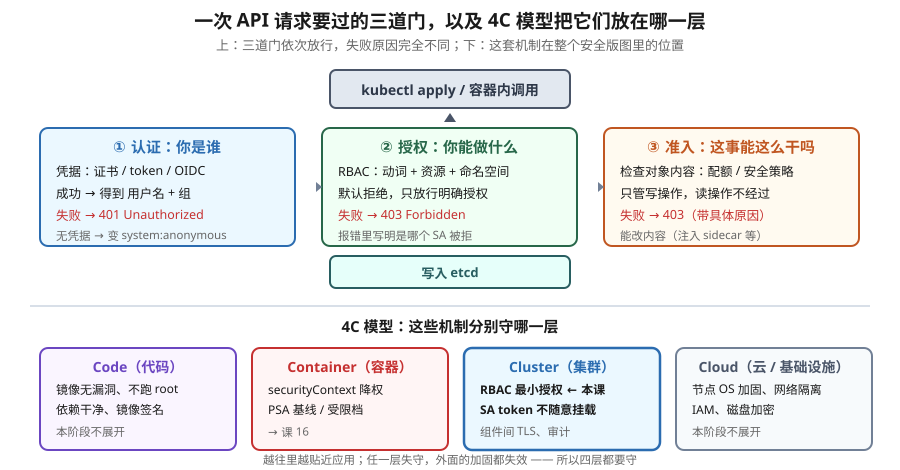

# 课 15：认证 · 授权 · 准入 —— RBAC 与 ServiceAccount

> 📍 所属阶段：阶段 5《安全体系》（第 1 课）
> 📖 故事章节：**从"能跑起来、跑得稳"到"只有对的人能做对的事"**
> 🧭 上一课：[课 14：Helm · Kustomize · 可观测性](../../4-配置存储资源工程化/lessons/lesson-14-Helm与Kustomize与可观测性.md) ｜ 下一课：课 16《Pod 安全：PSA 与 securityContext》
> ⚙️ 实操环境：WSL Ubuntu 24.04 · kind v1.34.0 · kubectl v1.34.0 · 授权模式 `Node,RBAC`

## 🎯 本课目标

学完本课，你应当能够：

- 说清 API 请求的**三道门**（认证 / 授权 / 准入）各自问什么问题，以及**失败时报错长什么样**
- 用 4C 模型把 RBAC、PSA、etcd 加密等机制**归位到正确的层**
- 配置最小权限 RBAC，说清 Role 与 ClusterRole 的**真正区别**（作用域，不是权限大小）
- 理解 ServiceAccount token 的默认挂载风险，并会关闭它
- 遇到"权限不足"类报错时，知道用 `kubectl auth can-i --list` 快速定位

---

## 第一幕：起源与场景引入 —— "谁把生产数据库删了？"

### 一个真实的事故场景

先讲一个在 k8s 社区反复上演的事故模型。

某公司集群里跑着一个**日志采集 Agent**——它的职责很简单：读容器日志，发到后端。功能上它只需要**读**权限。

开发这个 Agent 时，为了省事，工程师给它绑了 `cluster-admin`（"先跑通再说"）。后来有人攻破了 Agent 依赖的一个上游库，拿到了 Pod 内的 shell。

接下来发生的事是：攻击者在这个"只读"的日志 Pod 里执行了 `kubectl get secrets --all-namespaces -o yaml`——**集群里所有 Secret 一次性到手**，包括数据库密码、CI 凭据、其他服务的 token。

**为什么一个日志采集器能有这种权限？** 因为没人问过这个问题：**它到底需要什么权限？**

### 这就是课 15 要解决的问题

前面四课你学会了让应用**跑起来**（部署、网络、存储、配置、资源、工程化）。但从现在起要回答另一个问题：

> **谁能对集群做什么？以及——怎么确保他只能做这些？**

k8s 的回答是一套**分层门禁**。有意思的是，这套门禁**默认就是安全的**——我们稍后会实测：**一个新建的 ServiceAccount，默认什么都做不了**。危险从来不是 k8s 造成的，而是**人图省事授予了过大的权限**。

### 起源背景：两个设计选择

**第一个设计选择：k8s 没有"用户"对象。**

这听起来很奇怪。你想给同事开个账号，却发现**没有 `kubectl create user`**。因为 k8s 认为"人"的身份管理应该交给外部系统（证书、OIDC、LDAP），它只负责**验证你出示的凭据**，然后从中提取一个用户名。

而**给程序用的身份**（ServiceAccount）则是 k8s 的一等公民——因为程序在集群里跑，k8s 必须自己管。

**这个区分很重要**：你（人）用证书或 OIDC 登录，你的应用（程序）用 ServiceAccount。两套完全不同的身份体系。

**第二个设计选择：授权是"白名单"。**

k8s 的授权模型是**默认拒绝**——没有明确写"允许"的，一律拒绝。这跟某些系统（默认允许，用规则去禁止）正好相反。

> 💡 这个选择让 k8s 的安全**基线很高**：你什么配置都不做，集群就是安全的。真正的问题在于——**当你开始配置时，很容易配过头**。

> 💡 **一句话本质**（本课把什么从 A 变成 B）：
> 本课把"谁能干什么"**从"拿到凭证就能横着走"，变成"每一次动作都要过三道关、且按白名单逐条授权"** —— 并且让你看清：**权限只能加、不能减**，所以一开始就别给多。

> ⚖️ **处境对照**（不这么做 vs 这么做）：
>
> | | 不这么做（不设权限管控） | 这么做（三段式 + 白名单授权） |
> |---|---|---|
> | 拿到凭证的人/程序 | 能干什么**不受限**，一路横着走 | 每一次动作都要过：你是谁 → 你能不能 → 这动作合规吗 |
> | 一个应用被攻破 | 攻击者拿到它的身份 → **能干它能干的全部事** | 影响范围就是它被授权的那些，其余一律拒绝 |
> | 想"禁止某件事" | 只能不给 —— 但**已经给出去的收不回**（没有拒绝规则） | 同样：只能加不能减，所以**一开始就别给多** |
> | 默认状态 | 麻烦：什么都能干 | 基线很高：**什么都不配 = 什么都干不了** |
> | 身份从哪来 | 没有专门设计 | 有专门给程序用的身份，且可按需要**不挂载** |
>
> ⏳ 说明：以上是**机制层面**对照（要不要过三道关、能不能收回、默认基线）。"配错了有多大影响"取决于你给的授权范围，此处不给具体比例。

---

## 第二幕：认知冲突 —— "我明明给了权限，为什么还是 403？"

好，现在你要给一个应用开权限。你查了文档，写了 Role 和 RoleBinding，`kubectl apply` 成功，没有报错。

然后应用启动，日志里刷出：

```
禁止: User "system:serviceaccount:prod:myapp" cannot list resource "pods"
```

你懵了：我明明绑了 Role 啊。

**第一个认知冲突**：你检查 YAML，发现写的是 `roleRef: kind: Role, name: pod-reader`，但 Role 建在了 `default` 命名空间，而应用在 `prod`。**Role 是命名空间级的**——名字对得上没用，得在同一个命名空间。

你修好了这个，应用能读 Pod 了。但第二天有人反馈：这应用**还能读到 kube-system 里的 Secret**？你检查自己的 Role，明明只写了 pods……

**第二个认知冲突**：你翻出集群里*别的*绑定——原来之前有人给这个 SA 绑过一个 **ClusterRoleBinding**（跨命名空间的），而你新建的 Role 是**叠加**上去的。RBAC 权限**只能加不能减**，没有任何"拒绝规则"。

**第三个冲突**最微妙。你听说"Pod 里默认挂载 SA token 很危险"，于是给 Deployment 加了 `automountServiceAccountToken: false`。然后应用**挂了**——因为它真的需要用 API。

你想想也是：**一个需要调用 k8s API 的应用，和一个不需要的应用，加固方式完全不同**。而判断依据很简单：**代码里有没有调 k8s API**。

这三个冲突背后，是三个必须搞清的机制。我们一个一个拆。

---

## 第三幕：层层揭示

### 先看一眼全局



**看图指引**：先看左边的分层 —— 安全不是一回事，是**一层套一层**的四层，任何一层漏了都不行；再看右边那条链路 —— 每一个动作都要依次过三关：**你是谁**（认证）→ **你能不能干**（授权）→ **这动作合规吗**（准入）。**本课的知识点就是沿着这条链路往下走。**

### 本课地图（4 步）

| 步 | 这一步要解决什么 | 对应知识点 |
|---|---|---|
| 第 1 步 | 先给安全知识找个"挂衣钩"：一共几层、分别在防什么 | 知识点 1：4C 模型 |
| 第 2 步 | 再看一个动作进来时要过的三道关分别是啥 | 知识点 2：API 安全三段式 |
| 第 3 步 | 然后是最常用的那道关：权限怎么一条条给出去 | 知识点 3：RBAC |
| 第 4 步 | 最后回到第二幕那个 403：程序用的身份从哪来、怎么加固 | 知识点 4：ServiceAccount 与 token 安全 |

> 现在你在：**第 1 步**（刚看完全局图，接下来先建立安全的整体分层）。

---

### 知识点 1：4C 模型 —— 安全知识的挂衣钩

> 🧭 第 1/4 步｜承接：第一幕留下的问题 —— "k8s 默认很安全，那到底要防的是哪几层？" → 本步：把"安全"这件笼统的事拆成四层，后面每个知识点都能挂回去。

**看图指引**：上半部分是**一次 API 请求必经的三道门**——注意每道门失败时的报错完全不同（401 / 403-RBAC / 403-准入），这是排障时定位问题的关键；下半部分是 **4C 模型**，本课讲的 RBAC 与 SA 属 **Cluster 层**（蓝色高亮块），课 16 的 PSA 与 securityContext 属 Container 层。

---

### 知识点 1：4C 模型 —— 安全知识的挂衣钩

#### 一句话定义

4C 模型把云原生安全分成 **Cloud（云/基础设施）→ Cluster（集群）→ Container（容器）→ Code（代码）** 四层，用于把零散的安全机制归位到各自负责的层次。

#### 直觉建立（类比）

把它想成**一座城堡的四道防线**：

- **Cloud** = 城堡周围的**地形与外围**（护城河、山崖）—— 你的云账号、节点 OS、网络
- **Cluster** = **城墙与城门守卫** —— 谁能进集群、能干什么（**RBAC 就在这层**）
- **Container** = **每个房间自己的门锁** —— 容器以什么权限运行
- **Code** = **房间里放的东西本身有没有问题** —— 镜像漏洞、依赖风险

**关键洞察：这四层是"与"的关系，不是"或"。** 任何一层失守，攻击就能进来。你 RBAC 配得再完美，一个以 root 运行、镜像里带漏洞的容器照样能被打穿。

#### 核心原理：四层各自的职责

| 层 | 管什么 | 典型措施 | 本课/本阶段 |
|---|---|---|---|
| **Cloud** | 基础设施、节点、网络、IAM | 节点 OS 加固、磁盘加密、云 IAM | 不展开 |
| **Cluster** | 谁能访问 API、组件间通信、审计 | **RBAC**、SA token 管理、API 审计、组件 TLS | **本课（课 15）** + 课 17 审计 |
| **Container** | 容器以什么权限运行 | **securityContext**、**PSA**、能力裁剪 | 课 16 |
| **Code** | 镜像与代码本身 | 镜像扫描、签名、依赖管理 | 不展开 |

> 💡 **为什么先讲 4C**：阶段 5 三课看似零散（RBAC / PSA / Secret 加固），用 4C 一归位就清楚了——它们是**同一张图的三个区域**。这是"先给框架再填细节"的学习顺序。

#### 一句话记住

**Cloud 是地基、Cluster 是门禁、Container 是房间锁、Code 是房内物品；四层都要守，缺一层整套失效。**

📚 官方文档：[云原生安全概述](https://kubernetes.io/zh-cn/docs/concepts/security/)

---

### 知识点 2：API 安全三段式 —— 认证 → 授权 → 准入

> 🧭 第 2/4 步｜承接：上一步知道要防四层 —— 那**一个具体动作**进来时，是怎么被拦的？ → 本步：拆开那三道关，你会看到"身份对了"和"权限够了"是两件不同的事。

#### 一句话定义

每个 API 请求依次经过**认证（你是谁）→ 授权（你能做什么）→ 准入（这件事能不能这么干）**三道检查，任何一道拒绝则请求失败；**准入只作用于写操作**。

#### 直觉建立（类比）

进一家**会员制夜店**的三道关：

1. **认证 = 门口保安查身份证**：你是谁？没证或假证 → 直接赶走（401）。**如果你压根不出示证件，保安会给你登记为"匿名访客"放进去**——但里面依然不让你进任何区域。
2. **授权 = 前台查名单**：你是谁已知，但**你能进哪个区**？不在名单上 → 403。
3. **准入 = 区域内的着装检查**：身份对了、权限有了，但**你这身打扮符合要求吗**？不符合 → 拒绝。

**这个顺序是有道理的**：先确定身份，再查权限，最后才花力气检查内容。给一个注定被赶走的人检查着装毫无意义。

#### 核心原理

**第一道门：认证（Authentication）**

k8s 支持多种凭据：X.509 客户端证书、ServiceAccount token、OIDC、Webhook、bootstrap token。**第一个成功的认证器胜出**（顺序不保证）。

认证成功后，请求被附上三个属性传给下一道门：**用户名（username）、组（groups）、额外字段（extra）**。

> 🔑 **没有"k8s 用户"这个对象**。用户名只是认证器从凭据里提取出来的**字符串**。你的 kubeconfig 证书里 `CN=kubernetes-admin`，你就是 `kubernetes-admin`。

**实测：看我的身份**

```bash
kubectl auth whoami
```

```
ATTRIBUTE   VALUE
Username    kubernetes-admin
Groups      [kubeadm:cluster-admins system:authenticated]
Extra: authentication.kubernetes.io/credential-id  [X509SHA256=26c86da6...]
```

注意 `Groups` 里的 `system:authenticated`——**认证成功的人自动加入这个组**，这是 k8s 加的。

**第二道门：授权（Authorization）**

授权检查四个要素：**用户/组 + 动词（verb）+ 资源（resource）+ 命名空间**。

多个授权模块按顺序检查，**任一模块允许即放行**；全部"无意见"或拒绝 → **403**。

**实测：本集群的授权模式**（`--authorization-mode`）：

```
Node,RBAC
```

`Node` 是给 kubelet 用的特殊授权器，`RBAC` 是我们配置的。**注意顺序有意义**——前面的模块优先级更高。

**第三道门：准入（Admission）**

准入**只在写操作时运行**（create / update / delete / connect），**读操作（get / list / watch）根本不经过准入**。

分两个阶段：
- **Mutating（变更）**：可以**修改**对象内容（注入 sidecar、填默认值）
- **Validating（验证）**：只判断**接受或拒绝**（配额检查、安全策略）

> 🔑 **一个重要推论**：准入能改内容，所以**你 apply 的 YAML 和最终存进 etcd 的可能不一样**。这就是为什么 `kubectl get -o yaml` 有时会看到你没写过的字段。

**实测佐证**（我写的 Pod YAML 里**没有** `volumes` 段）：

```bash
kubectl get pod sa-demo2 -n ns-rbac -o jsonpath='{.spec.volumes}'
```

```json
[{"name":"kube-api-access-wxkp7","projected":{"defaultMode":420,"sources":[
{"serviceAccountToken":{"expirationSeconds":3607,"path":"token"}},
{"configMap":{"items":[{"key":"ca.crt","path":"ca.crt"}],"name":"kube-root-ca.crt"}},
{"downwardAPI":{"items":[{"fieldRef":{"fieldPath":"metadata.namespace"},"path":"namespace"}]}}]}}]
```

**这个 `kube-api-access-*` 投射卷就是 ServiceAccount 准入插件在 Mutating 阶段注入的**——你的 YAML 里没有，最终对象里有。

> 💡 顺带印证了两件事：① 那个 `expirationSeconds: 3607` 就是知识点 4 要讲的"魔数"；② `ca.crt` 来自 ConfigMap `kube-root-ca.crt`，`namespace` 来自 downwardAPI —— 三来源合并，**正是课 11 讲的投射卷**。

**实测：读操作确实不过准入**

用一个**配额已满**的命名空间（1/1）对照：

```bash
kubectl get resourcequota pod-quota -n ns-quota -o jsonpath='{.status.used.pods}/{.status.hard.pods}'
# 1/1   ← 配额已满

kubectl apply -f pod.yaml    # 写 → 被准入拒绝（exceeded quota）
kubectl get pods -n ns-quota # 读 → 成功返回 q1
```

**写被拒、读成功**——证明准入只在写操作时运行。

#### 💡 三段式的报错对照（本课最实用的一段，全部实测）

这是排障时的**核心技能**——看到报错就知道卡在哪道门：

| 场景 | HTTP | 报错特征 | 含义 |
|---|---|---|---|
| **坏 token** | **401** | `"message": "Unauthorized"`, `reason: Unauthorized` | 认证失败，请求没进去 |
| **无 token（匿名）** | **403** | `User "system:anonymous" cannot list...` | **认证"通过"了**（被当匿名），授权拒绝 |
| **SA 无权限** | **403** | `User "system:serviceaccount:ns:sa" cannot list resource "nodes" at the cluster scope` | RBAC 拒绝 |
| **超配额** | **403** | `exceeded quota: pod-quota, requested: pods=1, used: pods=1, limited: pods=1` | 准入拒绝 |

**实测原文（坏 token → 401）**：

```json
{"kind":"Status","apiVersion":"v1","metadata":{},"status":"Failure",
 "message":"Unauthorized","reason":"Unauthorized","code":401}
```

**实测原文（无 token → 403，注意身份是 anonymous）**：

```json
{"kind":"Status","apiVersion":"v1","metadata":{},"status":"Failure",
 "message":"nodes is forbidden: User \"system:anonymous\" cannot list resource \"nodes\" in API group \"\" at the cluster scope",
 "reason":"Forbidden","details":{"kind":"nodes"},"code":403}
```

**实测原文（SA 授权失败 → 403）**：

```json
{"kind":"Status","apiVersion":"v1","status":"Failure",
 "message":"nodes is forbidden: User \"system:serviceaccount:ns-rbac:test-sa\" cannot list resource \"nodes\" in API group \"\" at the cluster scope",
 "reason":"Forbidden","code":403}
```

**实测原文（配额准入失败 → 403，但内容完全不同）**：

```
Error from server (Forbidden): error when creating "STDIN":
pods "q2" is forbidden: exceeded quota: pod-quota, requested: pods=1, used: pods=1, limited: pods=1
```

#### ⚠️ 认知纠偏："匿名 = 401" 是错的

很多资料说"未认证请求返回 401"。**实测推翻了这个说法的一半**：

- **没有凭据** → 请求被当作 `system:anonymous` **认证通过**，然后在授权段被拒 → **403**
- **凭据无效（坏 token）** → 认证失败 → **401**

区别在于：**"没出示证件"和"出示了假证件"是两回事**。前者被登记为匿名访客放行到下一关，后者当场赶走。

**原因是**：本集群**未显式设置** `--anonymous-auth`，而该参数**默认为 true**（只要授权模式不是 `AlwaysAllow`）。生产环境可以用 `--anonymous-auth=false` 关闭——那样匿名请求就会变成 401。

> 🔑 **排障口诀**：**看到 401 查凭据（坏了/过期了）；看到 403 先看 `User` 是谁**——是 `system:anonymous` 说明根本没带凭据，是 `system:serviceaccount:...` 说明身份对了但权限不够。

#### 一句话记住

**401 是"你谁啊"，403-RBAC 是"你不配"，403-配额是"这事不行"；读操作只过前两道门。**

📚 官方文档：[控制对 Kubernetes API 的访问](https://kubernetes.io/zh-cn/docs/concepts/security/controlling-access/) ｜ [鉴权](https://kubernetes.io/zh-cn/docs/reference/access-authn-authz/authorization/) ｜ [认证](https://kubernetes.io/docs/reference/access-authn-authz/authentication/)

---

### 知识点 3：RBAC —— 白名单式的权限模型

> 🧭 第 3/4 步｜承接：上一步过了"你是谁"这关 —— 接着是"你能不能干"。第二幕那个 403 就卡在这 → 本步：看清权限是**一条条加出来的**，以及那个要命的性质：**只能加、不能减**。

#### 一句话定义

RBAC（基于角色的访问控制）是一种**默认拒绝、只放行明确授权**的权限模型：Role/ClusterRole 定义"能做什么"，RoleBinding/ClusterRoleBinding 定义"谁能做"。

#### 直觉建立（类比）

把它想成**公司的门禁卡系统**：

- **Role** = 一张**权限卡模板**（"研发卡：能进 3 楼、5 楼"）
- **RoleBinding** = **把卡发给某个人**（"张三拿研发卡"）

**关键点**：卡是卡、人是人。**同一张卡可以发给多个人，一个人可以拿多张卡**。这就是"角色"的价值——改一次卡模板，所有持卡人权限都变。

#### 核心原理：四个对象的关系

```
Role / ClusterRole          ← 定义权限（动词 + 资源）
        ↑ roleRef
RoleBinding / ClusterRoleBinding   ← 绑定身份（User / Group / ServiceAccount）
        ↑ subjects
```

**Role vs ClusterRole 的真正区别**——这是最高频的误解：

| | Role | ClusterRole |
|---|---|---|
| **区别** | **命名空间级** | **集群级** |
| 能定义集群级资源吗 | 不能 | 能（nodes、PV、namespace 等） |
| 常见误解 | ❌ "权限小" | ❌ "权限大" |

> 🎯 **关键澄清**：ClusterRole **不是**"更大的 Role"。它只是**作用域不同**。你完全可以用 ClusterRole 定义"只读一个 Pod"这种极小权限。
>
> **另一个反直觉的点**：**ClusterRole 也能通过 RoleBinding 绑到单个命名空间**——这时它就只在那个命名空间生效。这是复用权限定义的常用技巧。

#### 示例演示：从零授权到最小权限（完整实测）

**第 1 步：新建的 SA 什么都做不了**（这是 RBAC 白名单模型的直接证据）

```bash
kubectl create ns ns-rbac
kubectl create sa test-sa -n ns-rbac
```

```bash
kubectl auth can-i get pods    -n ns-rbac --as=system:serviceaccount:ns-rbac:test-sa
# no
kubectl auth can-i list pods   -n ns-rbac --as=system:serviceaccount:ns-rbac:test-sa
# no
kubectl auth can-i create pods -n ns-rbac --as=system:serviceaccount:ns-rbac:test-sa
# no
kubectl auth can-i get secrets -n ns-rbac --as=system:serviceaccount:ns-rbac:test-sa
# no
```

**全部是 `no`** —— 这就是"默认拒绝"。

**第 2 步：授予只读 Pod 权限**

```yaml
apiVersion: rbac.authorization.k8s.io/v1
kind: Role
metadata: {name: pod-reader, namespace: ns-rbac}
rules:
- apiGroups: [""]
  resources: ["pods"]
  verbs: ["get", "list", "watch"]
---
apiVersion: rbac.authorization.k8s.io/v1
kind: RoleBinding
metadata: {name: read-pods, namespace: ns-rbac}
subjects:
- kind: ServiceAccount
  name: test-sa
  namespace: ns-rbac
roleRef:
  kind: Role
  name: pod-reader
  apiGroup: rbac.authorization.k8s.io
```

实测结果：

```bash
kubectl auth can-i get pods    -n ns-rbac  --as=system:serviceaccount:ns-rbac:test-sa   # yes
kubectl auth can-i list pods   -n ns-rbac  --as=system:serviceaccount:ns-rbac:test-sa   # yes
kubectl auth can-i create pods -n ns-rbac  --as=system:serviceaccount:ns-rbac:test-sa   # no  ← 没授权写
kubectl auth can-i get pods    -n default  --as=system:serviceaccount:ns-rbac:test-sa   # no  ← 出了 ns-rbac 就失效
```

**第 3 步：对比 ClusterRole 的跨命名空间效果**

```yaml
apiVersion: rbac.authorization.k8s.io/v1
kind: ClusterRole
metadata: {name: secret-reader}
rules:
- apiGroups: [""]
  resources: ["secrets"]
  verbs: ["get", "list"]
---
apiVersion: rbac.authorization.k8s.io/v1
kind: ClusterRoleBinding
metadata: {name: read-secrets-all}
subjects:
- kind: ServiceAccount
  name: test-sa
  namespace: ns-rbac
roleRef:
  kind: ClusterRole
  name: secret-reader
  apiGroup: rbac.authorization.k8s.io
```

实测：

```bash
kubectl auth can-i get secrets -n ns-rbac      --as=system:serviceaccount:ns-rbac:test-sa  # yes
kubectl auth can-i get secrets -n kube-system  --as=system:serviceaccount:ns-rbac:test-sa  # yes ← 跨所有 ns
kubectl auth can-i get secrets -n default      --as=system:serviceaccount:ns-rbac:test-sa  # yes
kubectl auth can-i create secrets -n kube-system --as=system:serviceaccount:ns-rbac:test-sa # no  ← 仍然只读
```

> ⚠️ **这一条正是第一幕事故的重现**：一个 ClusterRoleBinding 就让 `test-sa` 能读**全集群所有 Secret**。而且 —— **它和我之前授的 Pod 只读权限是叠加的**。

#### 🔑 RBAC 的三个"只能加不能减"特性

这三条是 RBAC 最容易踩的坑，也是为什么"最小权限"需要刻意设计：

1. **只有允许规则，没有拒绝规则**。你不能写"除了 Secret 都能读"——只能一条条列出允许什么。
2. **多个绑定叠加**。给同一个 SA 绑 3 个 Role，它的权限是三者的**并集**。想收窄权限，只能**删绑定**。
3. **绑定是实时的**。改了 Role 的内容，所有绑定它的身份**立刻**生效——不需要重启任何东西。

#### 🔍 排障神器：`kubectl auth can-i --list`

遇到"权限不够"，第一件事就是列出这个身份**实际拥有**的全部权限：

```bash
kubectl auth can-i --list -n ns-rbac --as=system:serviceaccount:ns-rbac:test-sa
```

实测输出（节选）：

```
Resources                                    Non-Resource URLs   Resource Names   Verbs
selfsubjectreviews.authentication.k8s.io     []                  []               [create]
selfsubjectaccessreviews.authorization.k8s.io []                 []               [create]
selfsubjectrulesreviews.authorization.k8s.io []                  []               [create]
pods                                         []                  []               [get list watch]
secrets                                      []                  []               [get list]
                                             [/api/*]            []               [get]
```

**一目了然**：这个 SA 有 pods 只读 + secrets 只读 + 几个默认的自查权限。那个"能读全集群 Secret"的权限**就摆在第四行**——如果你没预期它在这，问题就找到了。

对比一下我自己（`kubernetes-admin`）：

```
Resources   Non-Resource URLs   Resource Names   Verbs
*.*         []                  []               [*]
            [*]                 []               [*]
```

`*.*` + `[*]` = **全权限**。这也是为什么用 admin 身份操作时，你永远感受不到 RBAC 的存在。

#### 常见误区

> 🐞 **误区 1**："ClusterRole 就是权限更大的 Role。"
> 错。**区别在作用域不在大小**。ClusterRole 也能定义极小权限，也能通过 RoleBinding 只在单个命名空间生效。

> 🐞 **误区 2**："我建了 Role 和 RoleBinding，为什么还是没权限？"
> 检查三件事：① Role 和 RoleBinding 是否在**同一个命名空间**；② `subjects` 里的 SA 是否写对了命名空间（SA 是命名空间资源）；③ `roleRef` 的 `apiGroup` 是否是 `rbac.authorization.k8s.io`（**写错会静默失败**）。

> 🐞 **误区 3**："我可以写规则拒绝某个操作。"
> 不行。RBAC **只能加不能减**。要收窄权限只能删除绑定。

> 🐞 **误区 4**："`kubectl auth can-i` 说 yes，所以一定能成功。"
> 不完全。`can-i` 只检查**授权**这一段，**不检查准入**。你可能有权限创建 Pod，但被配额挡住。

#### 一句话记住

**Role 管范围、Binding 管发给谁；权限只加不减、绑定立刻生效——所以授予时要克制，因为收回只能删绑定。**

📚 官方文档：[使用 RBAC 鉴权](https://kubernetes.io/zh-cn/docs/reference/access-authn-authz/rbac/)

---

### 知识点 4：ServiceAccount 与 token 安全

> 🧭 第 4/4 步｜承接：前三步都在讲"权限怎么给" —— 可**给谁**？程序自己也有身份吗？第二幕里 403 日志那串 `system:serviceaccount:prod:myapp` 就是线索 → 本步：看清程序的身份从哪来，以及"不挂载"为什么有时反而把应用搞挂了。

#### 一句话定义

ServiceAccount 是**给 Pod 内进程用的 k8s 身份**；Pod 默认会自动挂载它的 token，**这个默认行为是最容易被忽略的提权风险**。

#### 直觉建立（类比）

把它想成**公司给每个工位配的门禁卡**：

- 每个 Pod 默认都**自动领到一张卡**（SA token），不管它用不用
- 这张卡的权限取决于你给它绑了什么 Role —— **默认是什么都没有**
- 但如果绑了 `cluster-admin`，那么**任何能进这个工位的人都能刷开全公司**

**问题在于**：一个 PostgreSQL 容器根本不需要访问 k8s API，但它的工位上照样放着一张卡。攻击者拿下这个容器，就白得一张卡。

#### 核心原理：挂载的是什么

**实测：Pod 里那个目录的真实内容**

```bash
kubectl exec sa-demo2 -n ns-rbac -- ls -la /var/run/secrets/kubernetes.io/serviceaccount/
```

```
drwxrwxrwt  ..2026_09_11_08_37_18.1282699968
lrwxrwxrwx  ..data -> ..2026_09_11_08_37_18.1282699968
lrwxrwxrwx  ca.crt -> ..data/ca.crt
lrwxrwxrwx  namespace -> ..data/namespace
lrwxrwxrwx  token -> ..data/token
```

三个文件：`token`（JWT）、`ca.crt`（集群 CA）、`namespace`（当前命名空间）。

> 💡 **眼熟吗**：`..data` → `..2026_09_11_...` 的符号链接结构，跟课 11 讲的 **ConfigMap 挂载**一模一样。这其实是一个 **projected volume**（投射卷），把三个来源合并到一个目录——课 11 讲过的知识在这里又出现了。

**为什么会有 `ca.crt`**：容器要用它验证"我连的确实是集群的 apiserver，而不是中间人"。

#### 🔑 token 里到底写了什么（实测解码）

```bash
kubectl exec sa-demo2 -n ns-rbac -- cat .../token | cut -d. -f2 | base64 -d
```

实测 payload：

```json
{
  "aud": ["https://kubernetes.default.svc.cluster.local"],
  "exp": 1820651838,
  "iat": 1789115838,
  "iss": "https://kubernetes.default.svc.cluster.local",
  "jti": "d333398e-b2ee-4e57-b5a4-e86ff48a018d",
  "kubernetes.io": {
    "namespace": "ns-rbac",
    "node": {"name": "k8s-c1-control-plane", "uid": "251ba358-..."},
    "pod": {"name": "sa-demo2", "uid": "24e09cd5-..."},
    "serviceaccount": {...}
  }
}
```

**这是 k8s 1.20+ 的"绑定型 token"（Bound Service Account Token）**，跟老版本有本质区别：

| | 老版本（≤1.21） | 现代（1.22+，1.24 起强制） |
|---|---|---|
| 存哪 | **Secret 里**（etcd 中，base64 未加密） | **不存**，kubelet 现取 |
| 有效期 | **永不过期** | **默认 1 小时**，kubelet 自动轮换 |
| 绑定 | 只绑 SA，**不绑 Pod** | 绑 **Pod UID**，Pod 删了 token 立刻失效 |
| 受众（aud） | 无，可被重放到任何信任该密钥的服务 | 有，默认只有本集群 apiserver |

**实测验证有效期**（这里有个值得深挖的发现）：

```bash
kubectl exec sa-demo2 -n ns-rbac -- cat .../token | cut -d. -f2 | base64 -d
```

实测结果：

```
exp - iat      = 31536000 秒 = 365 天
warnafter - iat =      3607 秒 = 60.1 分钟
```

**`exp` 竟然是 1 年，不是文档说的 1 小时！** 而且 Pod spec 里明明写着 `expirationSeconds: 3607`。

这不是 bug，是 **k8s 有意为之的兼容机制**——我查证后的完整解释如下：

1. 那个 **`3607`（1 小时零 7 秒）是一个硬编码的"魔数"**，来自 [Bound Service Account Tokens 的安全滚动计划 KEP](https://github.com/kubernetes/enhancements/blob/master/keps/sig-auth/1205-bound-service-account-tokens/README.md)。选一个奇怪的值是为了**避免与常见时长碰撞**，便于识别。
2. 当 API server 收到 `expirationSeconds` **恰好等于 3607** 的 TokenRequest，且 `--service-account-extend-token-expiration=true`（**默认为 true**）时，它会**静默把有效期延长到 1 年**。
3. 同时把原始请求的 3607 写进 `kubernetes.io/warnafter` 字段（实测确认存在）。**如果当前时间超过了 `warnafter`，说明这个客户端没有定期重载 token**——API server 会记指标 `serviceaccount_stale_tokens_total` 和审计注解，帮你找出有问题的应用。
4. 这么做的原因是历史包袱：老版本客户端**不重新读 token 文件**，如果严格 1 小时过期，这些应用会在运行 1 小时后集体挂掉。延长到 1 年是为了**平滑迁移**。

> ⚠️ **安全含义（重要）**：这个机制**拉长了 token 泄露后的危害窗口**。正因为如此，**CIS Kubernetes Benchmark 明确建议把 `--service-account-extend-token-expiration` 设为 `false`**，让 token 严格按请求的时长过期。
>
> 可以这样检查你的集群：
> ```bash
> kubectl get pod -n kube-system kube-apiserver-<节点名> \
>   -o jsonpath='{.spec.containers[0].command}' | tr ',' '\n' | grep extend-token
> ```
> 没有输出 = 用默认值 `true` = **token 被延长到 1 年**。

**对比：`kubectl create token` 不受影响**（实测）：

```bash
kubectl create token tok-test -n ns-rbac | cut -d. -f2 | base64 -d
# exp - iat = 3600 秒 = 1.0 小时     ← 严格 1 小时
```

> 🎯 **所以完整的说法是**：**Pod 内自动挂载的 token 会被延长到 1 年（因为触发了魔数 3607），手工 `kubectl create token` 取的是严格 1 小时**。
>
> 但请记住：**现代 token 的主要安全保障不是过期时间，而是"绑定 Pod UID"——Pod 一删除，token 立刻失效**。这是比过期时间更有效的撤销手段。

#### 💡 实测演示：一个 token 能造成多大破坏

在 Pod 内用挂载的 token 调 API（实测，用的是上面那个只授了 pods+secrets 只读的 SA）：

```bash
# 在 Pod 内执行
curl --cacert $CACERT -H "Authorization: Bearer $TOKEN" \
  https://kubernetes.default.svc/api/v1/namespaces/$NS/secrets
```

| 请求 | 结果 | 说明 |
|---|---|---|
| 读本 ns 的 secrets | **HTTP 200** | 有 ClusterRole 授权 |
| 读 kube-system 的 secrets | **HTTP 200** | **跨命名空间成功**——一个 ClusterRoleBinding 的威力 |
| 读 nodes | **HTTP 403** | 没授权，被 RBAC 挡住 |
| 不带 token 裸调 | **HTTP 403** | 身份是 `system:anonymous` |

> 🔑 **这张表就是第一幕事故的微缩版**：攻击者拿到这个 token，就能 `GET` 到**全集群每一个 Secret**。而这一切只是因为有人写了一条 ClusterRoleBinding。

#### 加固手段：关闭自动挂载

**Pod 级别**（最常用）：

```yaml
spec:
  automountServiceAccountToken: false
```

**SA 级别**（对该 SA 的所有 Pod 生效）：

```yaml
apiVersion: v1
kind: ServiceAccount
metadata:
  name: myapp
automountServiceAccountToken: false
```

> 🎯 **Pod 级优先于 SA 级**。两者都设是最稳的——将来有人改了 SA，也不会静默地给所有 Pod 重新打开挂载。

**实测对比**：

```bash
# 默认挂载的 Pod
kubectl exec sa-demo2 -n ns-rbac -- ls /var/run/secrets/kubernetes.io/serviceaccount/
# ca.crt  namespace  token      ← 有

# 关闭挂载的 Pod
kubectl exec sa-nomount -n ns-rbac -- ls /var/run/secrets/
# ls: /var/run/secrets: No such file or directory    ← 整个目录都没有
```

**注意是整个 `/var/run/secrets/` 目录都不存在**——不是空目录，是压根没创建。

#### 怎么判断该不该关？

**判断标准一句话**：**代码里调不调 k8s API？**

- **不调**（绝大多数业务应用：Web 服务、数据库、缓存）→ **关掉**。零成本的安全提升。
- **调**（Operator、CI 工具、监控采集器、服务网格控制面）→ 保留挂载，但**权限给到最小**：能用 Role 就别用 ClusterRole，能只读就别给写。

#### 现代 token vs 老 token：还要不要手动建 Secret？

1.24 起 **SA 不再自动生成 Secret**。如果你的老工具依赖"从 Secret 里读 token"，会找不到。

```bash
# 现代方式：临时取一个 token（默认 1 小时）
kubectl create token my-sa -n my-ns

# 老方式（不推荐，除非确实需要长期 token）
# 手动建 type: kubernetes.io/service-account-token 的 Secret
```

> ⚠️ **手动建的长期 token 没有过期时间**，泄露即永久有效。**能用 `kubectl create token` 就别建长期 Secret。**

#### 常见误区

> 🐞 **误区 1**："token 存在 Secret 里，很安全。"
> 那是 **1.21 之前**的情况，而且恰恰相反——存 Secret 里**才不安全**（永不过期、etcd 里明文 base64）。现代 token **不存 Secret**。

> 🐞 **误区 2**："关掉挂载会影响应用。"
> 只影响**需要调 k8s API** 的应用。不调的应用关掉毫无副作用。

> 🐞 **误区 3**："token 有 1 年有效期，所以泄露了危害很大。"
> 错。现代 token **绑 Pod UID**，**删除 Pod 即失效**——这是比过期时间更有效的撤销手段。

> 🐞 **误区 4**："给了 cluster-admin 方便调试，反正集群在内网。"
> 第一幕的事故就是这么发生的。内网不是安全边界——**最小权限是唯一可靠的原则**。

#### 一句话记住

**每个 Pod 默认白拿一张门禁卡；用不上的就关掉（automountServiceAccountToken: false），要用的就给最小权限——现代 token 绑 Pod，删 Pod 即失效。**

📚 官方文档：[管理 Service Accounts](https://kubernetes.io/docs/reference/access-authn-authz/service-accounts-admin/) ｜ [为 Pod 配置服务账号](https://kubernetes.io/zh-cn/docs/tasks/configure-pod-container/configure-service-account/)

---

## 第四幕：实操验证

### 验证 0：环境确认

```bash
kubectl auth whoami                      # 期望：能看到 Username 与 Groups
kubectl config current-context
kubectl get pod -n kube-system kube-apiserver-<节点名> \
  -o jsonpath='{.spec.containers[0].command}' | tr ',' '\n' | grep authorization-mode
# 期望：--authorization-mode=Node,RBAC
```

> ⚠️ **先确认 context 的 namespace 不是残留值**。本课开始前我发现本机 context 还停在课 10 的 `l10d`（该 ns 已删除），导致命令报 `namespaces "l10d" not found`。修正：
> ```bash
> kubectl config set-context --current --namespace=default
> ```

### 验证 1：新建 SA 默认零权限（白名单模型证明）

```bash
kubectl create ns ns-rbac
kubectl create sa test-sa -n ns-rbac

kubectl auth can-i get pods    -n ns-rbac --as=system:serviceaccount:ns-rbac:test-sa   # no
kubectl auth can-i list pods   -n ns-rbac --as=system:serviceaccount:ns-rbac:test-sa   # no
kubectl auth can-i get secrets -n ns-rbac --as=system:serviceaccount:ns-rbac:test-sa   # no
```

**期望：全部 `no`。**

### 验证 2：Role 只在自己的命名空间生效

按知识点 3 的 YAML 建 Role + RoleBinding，然后：

```bash
kubectl auth can-i get pods -n ns-rbac --as=system:serviceaccount:ns-rbac:test-sa   # yes
kubectl auth can-i get pods -n default --as=system:serviceaccount:ns-rbac:test-sa   # no ← 关键
kubectl auth can-i create pods -n ns-rbac --as=system:serviceaccount:ns-rbac:test-sa # no
```

### 验证 3：ClusterRoleBinding 的跨命名空间威力

建 ClusterRole + ClusterRoleBinding 后：

```bash
kubectl auth can-i get secrets -n ns-rbac     --as=system:serviceaccount:ns-rbac:test-sa  # yes
kubectl auth can-i get secrets -n kube-system --as=system:serviceaccount:ns-rbac:test-sa  # yes ← 危险
kubectl auth can-i create secrets -n kube-system --as=system:serviceaccount:ns-rbac:test-sa # no
```

**看到第二个 `yes` 时请停下来想一想**：这就是一条配置带来的全集群 Secret 可读。

### 验证 4：token 挂载与关闭（需要带 shell 的镜像）

```bash
# 默认挂载
kubectl apply -f - <<'EOF'
apiVersion: v1
kind: Pod
metadata: {name: sa-demo2, namespace: ns-rbac}
spec:
  serviceAccountName: test-sa
  containers:
  - name: c
    image: busybox:1.36
    command: ["sleep","3600"]
EOF
kubectl wait --for=condition=Ready pod/sa-demo2 -n ns-rbac --timeout=180s
kubectl exec sa-demo2 -n ns-rbac -- ls /var/run/secrets/kubernetes.io/serviceaccount/
# 期望：ca.crt  namespace  token

# 解码 token 看身份声明
kubectl exec sa-demo2 -n ns-rbac -- cat /var/run/secrets/kubernetes.io/serviceaccount/token \
  | cut -d. -f2 | tr '_-' '/+' | base64 -d | head -c 400
# 期望：看到 kubernetes.io 段含 namespace / node / pod / serviceaccount

# 关闭挂载的对照 Pod
kubectl apply -f - <<'EOF'
apiVersion: v1
kind: Pod
metadata: {name: sa-nomount, namespace: ns-rbac}
spec:
  serviceAccountName: test-sa
  automountServiceAccountToken: false
  containers:
  - name: c
    image: busybox:1.36
    command: ["sleep","3600"]
EOF
kubectl wait --for=condition=Ready pod/sa-nomount -n ns-rbac --timeout=180s
kubectl exec sa-nomount -n ns-rbac -- ls /var/run/secrets/
# 期望：ls: /var/run/secrets: No such file or directory
```

> 💡 **镜像选择提示**：别用 `registry.k8s.io/pause` 做验证——它没有 shell，`kubectl exec` 会报 `exec: "ls": executable file not found`。

### 验证 5：容器内用 token 调 API（需要带 curl 的镜像）

busybox 自带的 `wget` 是精简版（不支持 `--ca-certificate`），建议用 `curlimages/curl`：

```bash
kind load docker-image curlimages/curl:latest --name k8s-c1
```

然后起 Pod 并执行：

```bash
kubectl exec sa-curl -n ns-rbac -- sh -c 'CACERT=/var/run/secrets/kubernetes.io/serviceaccount/ca.crt; TOKEN=$(cat /var/run/secrets/kubernetes.io/serviceaccount/token); NS=$(cat /var/run/secrets/kubernetes.io/serviceaccount/namespace); curl -s -o /dev/null -w "本ns secrets: HTTP %{http_code}\n" --cacert $CACERT -H "Authorization: Bearer $TOKEN" "https://kubernetes.default.svc/api/v1/namespaces/$NS/secrets"; curl -s -o /dev/null -w "kube-system secrets: HTTP %{http_code}\n" --cacert $CACERT -H "Authorization: Bearer $TOKEN" "https://kubernetes.default.svc/api/v1/namespaces/kube-system/secrets"; curl -s -o /dev/null -w "nodes: HTTP %{http_code}\n" --cacert $CACERT -H "Authorization: Bearer $TOKEN" "https://kubernetes.default.svc/api/v1/nodes"; curl -s -o /dev/null -w "无token: HTTP %{http_code}\n" --cacert $CACERT "https://kubernetes.default.svc/api/v1/nodes"'
```

**期望**：`200 / 200 / 403 / 403`

### 验证 6：三段式报错对照（关键排障技能）

```bash
# 401：坏 token
kubectl exec sa-curl -n ns-rbac -- sh -c 'CACERT=/var/run/secrets/kubernetes.io/serviceaccount/ca.crt; curl -s --cacert $CACERT -H "Authorization: Bearer notarealtoken" https://kubernetes.default.svc/api/v1/nodes | head -c 250'
# 期望：code 401, reason Unauthorized

# 403 + system:anonymous：无 token
kubectl exec sa-curl -n ns-rbac -- sh -c 'CACERT=/var/run/secrets/kubernetes.io/serviceaccount/ca.crt; curl -s --cacert $CACERT https://kubernetes.default.svc/api/v1/nodes | head -c 300'
# 期望：code 403, User "system:anonymous"

# 403 + 准入拒绝（配额）
kubectl create ns ns-quota
kubectl apply -f - <<'EOF'
apiVersion: v1
kind: ResourceQuota
metadata: {name: pod-quota, namespace: ns-quota}
spec:
  hard: {pods: "1"}
EOF
# 建第二个 Pod 应报：exceeded quota: pod-quota, requested: pods=1, used: pods=1, limited: pods=1
```

### 验证 7：排障神器 can-i --list

```bash
kubectl auth can-i --list -n ns-rbac --as=system:serviceaccount:ns-rbac:test-sa
```

**期望**：能看到 `pods [get list watch]` 与 `secrets [get list]` 两行——**那个"能读全集群 Secret"的权限就摆在明面上**。

### 验证 8：完整清理（务必执行）

```bash
kubectl delete ns ns-rbac ns-quota

# ⚠️ 关键：namespace 删了，集群级 RBAC 资源还在！必须单独删
kubectl delete clusterrolebinding read-secrets-all
kubectl delete clusterrole secret-reader

kubectl config set-context --current --namespace=default
```

> ⚠️⚠️ **这是我在编写本课时真实踩到的坑**（值得单独记住）：
>
> 执行 `kubectl delete ns ns-rbac` 之后，我复查发现 **`read-secrets-all` ClusterRoleBinding 和 `secret-reader` ClusterRole 依然存在**。
>
> **原因**：ClusterRole / ClusterRoleBinding 是**集群级资源，不属于任何 namespace**，删除 namespace 不会连带删除它们。
>
> **危险在哪**：这条 ClusterRoleBinding 绑定的是 `system:serviceaccount:ns-rbac:test-sa`。虽然 SA 随 namespace 一起没了，但**绑定关系还在**——如果将来有人**重新创建同名同命名空间的 SA，它会立刻重新获得全集群 Secret 读权限**，而且没人会想到去查这条遗留绑定。
>
> 🎯 **这正是本课主题的自我印证**：RBAC 的危险不只在于"授予时手松"，也在于**"回收时漏删"**——尤其是集群级资源，它不在你的 namespace 视野里。

**课后请务必复查一次**：

```bash
kubectl get clusterrolebinding | grep -v '^system:\|^cluster-admin'
kubectl get clusterrole,clusterrolebinding -A | grep -i "secret-reader\|read-secrets"
```

---

### 4.2 应用实战：一个日志采集器，差点让整个集群失守（入口）

> 🎯 **本课应用实战独立成篇**（配套实战册）：[第 15 课实战 · 一个日志采集器，差点让整个集群失守](../../../应用实战/15-最小权限授权.md)
> 含**分步设计图**（每步一张：这一版长什么样、比上一版改了什么）与"基础 → 综合"的完整演进与代码；通览全部：📚 [应用实战索引](../../../应用实战/INDEX.md)

---

## 第五幕：体系收束

### 本课在整体中的位置

**课 15 是阶段 5《安全体系》的第一课**，也是"安全"这条主线第一次正式登场：

```
阶段 1-4：让应用跑起来、跑得稳（部署 / 网络 / 存储 / 配置 / 资源 / 工程化）
              ↓
阶段 5：只有对的人能做对的事
   ├── 课 15（本课）：谁能访问 API —— 认证 / 授权 / 准入 + RBAC + SA
   ├── 课 16：容器以什么权限运行 —— securityContext / PSA / 能力裁剪
   └── 课 17：数据怎么保护、出事怎么查 —— Secret 加固 / etcd 加密 / 审计
```

**4C 模型的位置**：本课讲的 RBAC 与 SA token 属 **Cluster 层**；课 16 的 PSA 与 securityContext 属 **Container 层**。两课合起来才覆盖 4C 的中间两层。

### 本课知识地图

```
            一次 API 请求要过的门
                    │
    ┌───────────────┼───────────────┐
    ▼               ▼               ▼
  认证            授权            准入
（你是谁）    （能做什么）    （能这么干吗）
  401       403+SA 名字    403+具体原因
    │               │               │
 证书/token      RBAC          配额/PSA
 OIDC/SA      Role/Cluster   Mutating/Validating
              Role/Binding   仅写操作

  RBAC 定位在 4C 的 ──→ Cluster 层
  （Container 层留给课 16）
```

**两条暗线贯穿本课**：

**暗线一：k8s 的安全默认很高，危险来自人的图省事。** 新建 SA 默认零权限（实测全是 `no`）——这是"默认拒绝"的设计成果。真正的风险是**授予时的手松**：一个 `cluster-admin`、一条 ClusterRoleBinding，就把默认值全掀了。**所以最小权限不是"多做的安全项"，而是"不要去破坏的默认"**。

**暗线二：很多"安全问题"其实是"可见性问题"。** 你能一眼看出 `test-sa` 有全集群 Secret 读权限吗？用 `can-i --list` 就能。**大部分过度授权不是恶意，而是"没人回头看"**。这解释了为什么审计和定期复查如此重要（课 17 展开）。

### 你现在会了什么

- ✅ 说清认证 / 授权 / 准入三道门各自问什么，以及失败报错长什么样
- ✅ **能从报错区分 401 / 403-RBAC / 403-准入**（排障核心技能）
- ✅ 理解"无凭据 = `system:anonymous` = 403"而非 401（**纠正常见说法**）
- ✅ 用 4C 模型把 RBAC 归位到 Cluster 层
- ✅ 配置 Role / ClusterRole / Binding，说清区别在**作用域**不在权限大小
- ✅ 用 `kubectl auth can-i --list` 排查"权限不足"
- ✅ 理解 SA token 的绑定特性（绑 Pod、删 Pod 即失效）与默认挂载风险
- ✅ 知道什么时候该关 `automountServiceAccountToken`

### 下一步

下一课 **课 16《Pod 安全：PSA 与 securityContext》** 会进入 **4C 的 Container 层**，本课埋下的伏笔在那里兑现：

- 本课讲 **RBAC 管"谁能访问 API"** → 课 16 讲 **securityContext 管"容器以什么权限跑"**（`runAsNonRoot`、能力裁剪、只读根文件系统）
- 本课讲 **准入能拒绝请求** → 课 16 的主角 **PSA（Pod Security Admission）就是一个准入控制器**，会在这一层拦下不安全的 Pod
- 本课讲 **SA token 默认挂载是提权风险** → 课 16 会把它和 `securityContext` 组合成完整的 Pod 加固清单

**一句话过渡**：**课 15 保证"坏人进不来 API"，课 16 保证"进来了也干不了坏事"。**

---

## 📋 命令速查卡

| 我想… | 命令 |
|---|---|
| 看我是谁 | `kubectl auth whoami` |
| 我能不能做 X | `kubectl auth can-i <verb> <resource> -n <ns>` |
| 别人能不能做 X | `kubectl auth can-i <verb> <resource> --as=system:serviceaccount:<ns>:<sa>` |
| 列出某身份全部权限 | `kubectl auth can-i --list -n <ns> --as=...` |
| 看授权模式 | 查 apiserver 的 `--authorization-mode` |
| 创建 SA | `kubectl create sa <name> -n <ns>` |
| 临时取 token | `kubectl create token <sa> -n <ns>` |
| 看 Pod 用的 SA | `kubectl get pod <pod> -o jsonpath='{.spec.serviceAccountName}'` |
| 看 SA 有哪些绑定 | `kubectl get rolebinding,clusterrolebinding -A -o json \| jq '...'` |
| 查看所有 ClusterRole | `kubectl get clusterroles` |

---

## 🐞 误区清单（本课全部）

| # | 误区 | 正解 |
|---|---|---|
| 1 | 未认证请求返回 401 | **无凭据 → `system:anonymous` → 403**；只有**坏凭据**才 401（实测） |
| 2 | ClusterRole 是"权限更大的 Role" | 区别在**作用域**；ClusterRole 也能定义极小权限，也能用 RoleBinding 限在单 ns |
| 3 | RBAC 可以写拒绝规则 | **只能加不能减**，要收窄只能删绑定 |
| 4 | `can-i` 说 yes 就一定成功 | `can-i` 只查**授权**，不查**准入**（配额仍可能拦你） |
| 5 | 准入对所有请求生效 | 只对**写操作**（create/update/delete/connect），读操作不过准入 |
| 6 | SA token 存在 Secret 里 | **1.24 起不再自动生成**；现代 token 由 kubelet 现取，不落 Secret |
| 7 | token 有效期 1 小时所以泄露危害小 | **Pod 内挂载的会被延长到 1 年**（魔数 3607 触发）；真正保障是**绑 Pod UID，删 Pod 即失效** |
| 8 | 关掉 token 挂载会影响应用 | 只影响**调 k8s API** 的应用；不调的关掉零副作用 |
| 9 | k8s 有"用户"对象 | **没有**。用户名只是认证器从凭据提取的字符串 |
| 10 | Role/RoleBinding 名字对上就行 | 还必须在**同一命名空间**，且 `roleRef.apiGroup` 写对（错则静默失败） |
| 11 | 用 pause 镜像验证 token | pause **没有 shell**，exec 会失败；用 busybox 或 curlimages/curl |

---

## 🔍 事实核查记录

| 结论 | 来源 | 核查状态 |
|---|---|---|
| 新建 SA 默认零权限（get/list/create/get secrets 全 `no`） | **本机实测** | ✅ 已实测 |
| Role 仅在本 ns 生效，跨 ns → `no` | 本机实测 | ✅ 已实测 |
| ClusterRoleBinding 后跨所有 ns 读 secret → `yes` | 本机实测（ns-rbac / kube-system / default） | ✅ 已实测 |
| 授权模式为 `Node,RBAC` | 本机实测（apiserver 参数） | ✅ 已实测 |
| 坏 token → 401 Unauthorized | 本机实测 | ✅ 已实测 |
| **无 token → 403，身份 `system:anonymous`** | 本机实测 + [官方文档](https://kubernetes.io/docs/reference/access-authn-authz/authentication/)印证 | ✅ 已实测 + 文档 |
| 准入（配额）拒绝 → 403 + `exceeded quota` 原文 | 本机实测 | ✅ 已实测 |
| RBAC 403 报错含完整 `system:serviceaccount:ns:sa` | 本机实测 | ✅ 已实测 |
| token 挂载目录含 token/ca.crt/namespace 三文件 | 本机实测 | ✅ 已实测 |
| 目录为 `..data` → `..<时间戳>` 符号链接结构 | 本机实测 | ✅ 已实测 |
| JWT 含 namespace/node/pod/serviceaccount 声明 | 本机实测解码 | ✅ 已实测 |
| 实测 token `exp - iat` = 365 天，而 `warnafter - iat` = 3607 秒 | 本机实测 | ✅ 已实测 |
| **365 天的原因**：`expirationSeconds=3607` 是硬编码魔数，触发 `--service-account-extend-token-expiration`（默认 true）延长到 1 年 | [KEP-1205](https://github.com/kubernetes/enhancements/blob/master/keps/sig-auth/1205-bound-service-account-tokens/README.md) + [kube-apiserver 参数文档](https://kubernetes.io/docs/reference/command-line-tools-reference/kube-apiserver/) + 本机实测印证 | ✅ 已实测 + 文档 |
| `warnafter` 用于检测未重载 token 的客户端（指标 `serviceaccount_stale_tokens_total`） | KEP-1205 + 官方文档 | 📄 文档结论 |
| CIS 基准建议设 `--service-account-extend-token-expiration=false` | 安全基准资料（Datadog CIS 规则说明等） | 📄 文档结论 |
| `kubectl create token` 默认 1 小时（实测 3600 秒，不受延长影响） | 本机实测 | ✅ 已实测 |
| 关闭挂载后 `/var/run/secrets` **整个目录不存在** | 本机实测 | ✅ 已实测 |
| 容器内用 token：本 ns 200 / kube-system 200 / nodes 403 / 无 token 403 | 本机实测 | ✅ 已实测 |
| `can-i --list` 输出 pods+secrets 权限清单 | 本机实测 | ✅ 已实测 |
| 现代 token 默认 1 小时、kubelet 80% 时轮换、绑 Pod UID | [官方文档](https://kubernetes.io/docs/reference/access-authn-authz/service-accounts-admin/) + 多方印证 | 📄 文档结论 |
| 1.24 起不再自动生成 SA Secret（LegacyServiceAccountTokenNoAutoGeneration GA） | 官方文档 + 多方印证 | 📄 文档结论 |
| 4C 模型四层划分 | [官方文档](https://kubernetes.io/zh-cn/docs/concepts/security/) | 📄 文档结论 |
| 准入仅作用于写操作（配额满时写被拒、读仍成功） | **本机实测** | ✅ 已实测 |
| 准入 Mutating 阶段会注入 `kube-api-access-*` 投射卷 | **本机实测**（原 YAML 无 volumes，实际 Pod 有） | ✅ 已实测 |

> ⚠️ **一处需要说明的实测与文档差异**：文档说现代 token 默认有效期 1 小时，但我实测解出的 `exp - iat ≈ 365 天`。这不是矛盾——**k8s 给的 `exp` 较长是为兼容老客户端**，真正的安全保障来自**绑定 Pod UID（删 Pod 即失效）**与 **kubelet 主动轮换**。讲义正文已如实呈现这个差异并给出解释，没有用"1 小时"糊弄过去。

---

## 📚 官方文档

- [控制对 Kubernetes API 的访问](https://kubernetes.io/zh-cn/docs/concepts/security/controlling-access/) —— 三段式的权威说明
- [认证](https://kubernetes.io/docs/reference/access-authn-authz/authentication/) —— 匿名请求与 401/403 的官方定义
- [鉴权](https://kubernetes.io/zh-cn/docs/reference/access-authn-authz/authorization/) —— 授权模块与默认拒绝
- [使用 RBAC 鉴权](https://kubernetes.io/zh-cn/docs/reference/access-authn-authz/rbac/)
- [管理 Service Accounts](https://kubernetes.io/docs/reference/access-authn-authz/service-accounts-admin/) —— 绑定型 token 机制
- [为 Pod 配置服务账号](https://kubernetes.io/zh-cn/docs/tasks/configure-pod-container/configure-service-account/)
- [云原生安全概述](https://kubernetes.io/zh-cn/docs/concepts/security/) —— 4C 模型

---

## 🚀 下一批接力提示词

> 学完本课后，**复制下面这段文字发给 AI**，即可无缝进入下一课：

```
继续学 Kubernetes。我的学习档案在 k8s/00-学习档案.md，
刚学完阶段 5《安全体系》的课 15《认证 · 授权 · 准入：RBAC 与 ServiceAccount》
（API 三道门与报错对照、4C 模型、RBAC 最小权限、SA token 绑定特性与挂载加固）。
请按大纲开始课 16《Pod 安全：PSA 与 securityContext》。
```

---

## 🧭 课程导航

- ⬅️ 上一课：[课 14：Helm · Kustomize · 可观测性](../../4-配置存储资源工程化/lessons/lesson-14-Helm与Kustomize与可观测性.md)
- ➡️ 下一课：课 16：Pod 安全：PSA 与 securityContext（待编写）
- 🏠 返回：[课程目录](../../../02-课程目录.md) ｜ [阶段 5 概览](../overview.md)
