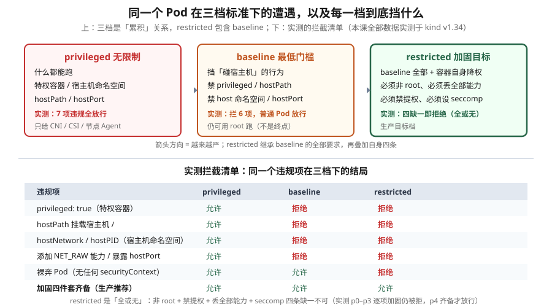

# 课 16：Pod 安全：PSA 与 securityContext

> 📍 所属阶段：阶段 5《安全体系》（第 2 课）
> 📖 故事章节：**从"只有对的人能做对的事"到"进来了也干不了坏事"**
> 🧭 上一课：[课 15：认证 · 授权 · 准入：RBAC 与 ServiceAccount](lesson-15-RBAC与ServiceAccount.md) ｜ 下一课：课 17《Secret 加固 · etcd 加密 · 审计》
> ⚙️ 实操环境：WSL Ubuntu 24.04 · kind v1.34.0 · kubectl v1.34.0 · 容器运行时 containerd

## 🎯 本课目标

学完本课，你应当能够：

- 说清 **PSP 为何被移除、PSA 如何取代它**，以及三档标准的**累积关系**
- 用命名空间标签施加 PSA，并解释 **enforce / audit / warn** 三种模式的区别
- 配置 securityContext 加固四件套，说清**每一项防的是什么**
- 理解 Linux capabilities，知道**默认给 14 项、为什么该丢光**
- 排查"Deployment 建成功但 Pod 起不来"这个高频陷阱
- 说清镜像与供应链安全在 4C 模型中的位置

---

## 第一幕：起源与场景引入 —— "容器里的 root 就是节点上的 root"

### 一个必须先打破的错觉

先做个实验。在集群里跑一个**最普通**的 Pod，然后问它：你是谁？

```bash
kubectl exec plain -- id
```

```
uid=0(root) gid=0(root) groups=0(root),10(wheel)
```

**root。**

这不是 bug，这是 k8s 的**默认行为**——你什么配置都不写，容器就以 root 运行，根文件系统可写，还带着 14 项 Linux capability。

**为什么这件事很严重？** 因为容器不是虚拟机。

容器里的进程**就是宿主机上的一个普通进程**，只不过被 namespace 和 cgroup 隔离了。容器里的 `uid=0` 和宿主机的 `uid=0` **是同一个 uid**（在没有 user namespace 的情况下）。

> 🔑 **这意味着**：一旦攻击者利用容器逃逸漏洞（CVE 之类）跳出了那层隔离，他落在宿主机上**就是 root**。整个节点、以及节点上所有其他 Pod，全部失守。

**对比一下虚拟机**：VM 里你是 root，逃逸出来还有 hypervisor 挡着。容器没有这一层——**容器和宿主机共用同一个内核**。

### 第二个错觉：以为镜像里的 USER 保护了你

有同学会说："我 Dockerfile 里写了 `USER 1000`，没问题。"

但 k8s 的 `securityContext` **优先级高于镜像的 USER 指令**。更关键的是——**反过来也成立**：如果镜像没写 `USER`，容器就默认 root；而如果有人在 Pod spec 里写了 `runAsUser: 0`，**你镜像里的 `USER 1000` 会被覆盖掉**。

**所以安全不能只靠镜像，必须在 Pod spec 这一层明确声明。**

### 这引出了两个不同层次的问题

| 层次 | 问题 | 谁来解决 |
|---|---|---|
| **单个 Pod** | 这个容器该以什么权限跑？ | **securityContext**（知识点 2） |
| **整个命名空间** | 谁能在这个 ns 里起不安全的 Pod？ | **PSA**（知识点 1） |

**这两个是互补的**：securityContext 是"我声明我要什么"，PSA 是"集群规定你最少要做到什么"。**PSA 会拒绝不达标的 Pod**，哪怕 Pod 自己没声明。

### 起源：为什么 PSP 被干掉了

在 PSA 之前，k8s 有个叫 **PodSecurityPolicy（PSP）** 的机制。它有几个致命问题：

1. **模型反直觉**：PSP 的授权模型是"谁能**使用**哪个策略"，导致配置极其绕
2. **没有 dry-run**：你不知道开启后会拦掉什么，一开就炸
3. **API 复杂且无边界**：字段庞大、语义随版本漂移

于是社区做了个决定：**v1.21 弃用，v1.25 彻底移除**，用 PSA 取代。

**实测确认它真的没了**：

```bash
kubectl get psp
# error: the server doesn't have a resource type "psp"
```

> ⚠️ **考试与实战提示**：如果你在 2026 年还看到资料教 PSP，**那已经过时了**。PSP 在 v1.25 之后**完全不存在**，连 API 都没有。

### PSA 的设计哲学：简单到只有一个标签

PSA 的做法极其克制——**不给自定义策略，只给三个预定义档位**，你用**命名空间标签**选一个：

```bash
kubectl label ns my-app pod-security.kubernetes.io/enforce=restricted
```

**一行命令，整个命名空间的安全基线就定了。**

代价是**不灵活**——PSA 只能表达这三档。要"镜像必须来自我的仓库"这类自定义规则，得用 Kyverno / OPA Gatekeeper / ValidatingAdmissionPolicy（课末会提）。

> 💡 **一句话本质**（本课把什么从 A 变成 B）：
> 本课把"容器里能干什么"**从"默认想干什么就干什么（包括用整台机器的最高权限）"，变成"集群定一条基线、不达标的直接不让起"**。

> ⚖️ **处境对照**（不这么做 vs 这么做）：
>
> | | 不这么做（裸奔） | 这么做（设定基线 + 逐项收紧） |
> |---|---|---|
> | 容器里的 root | **就是节点上的 root**，逃逸即拿下整台机器 | 强制非 root 运行，先卸掉这条最直接的路 |
> | 权限提升 | 默认允许，拿到一点就能往上爬 | 禁掉提权、丢掉多余能力 |
> | 想写哪就写哪 | 整个文件系统可写，**被植入东西容易** | 根文件系统只读，要写的地方单独挂 |
> | 谁来把关 | 靠每个人自觉写对 | 命名空间打一行标签，**整个空间统一基线** |
> | 不达标的 Pod | 照常跑起来，没人拦 | **直接不让起**（但报错藏在别处，见第二幕） |
> | **代价** | 什么都不用学 | 加固要求是"**全或无**"，缺一条就全拒；收太紧也可能把应用搞崩 |
>
> ⏳ 说明：以上是**机制层面**对照（是不是 root、能不能提权、有没有统一基线）。"拦住多少攻击"取决于你的镜像与业务，此处不给具体比例。

---

## 第二幕：认知冲突 —— 三个"看起来没问题"的时刻

### 冲突一：部署成功了，但一个 Pod 都没有

你给命名空间加了 `enforce=restricted`，然后部署一个 Deployment：

```bash
kubectl apply -f deployment.yaml
# deployment.apps/bad created     ← 成功了！
```

你松了口气。然后：

```bash
kubectl get pods -n ns-dep
# No resources found in ns-dep namespace.
```

**一个 Pod 都没有。** 再看 Deployment：

```bash
kubectl get deploy bad -n ns-dep
# NAME   READY   UP-TO-DATE   AVAILABLE   AGE
# bad    0/1     0            0           40s
```

`READY 0/1`。**没有任何报错出现在你眼前。**

真相藏在 Deployment 的 `status.conditions` 里——**ReplicaFailure**。

**这个坑为什么特别坑**：Deployment 是"创建对象成功"和"创建 Pod 失败"分离的。`kubectl apply` 返回 0，CI 变绿，但服务根本没起来。**第四幕会完整复现并给出排查姿势。**

### 冲突二：我加固了三项，为什么还是被拒？

你读了文档，restricted 档要求"非 root、禁提权、丢能力、设 seccomp"四条。你耐心地加了三条：

```yaml
securityContext:
  allowPrivilegeEscalation: false
  capabilities: {drop: ["ALL"]}
  seccompProfile: {type: RuntimeDefault}
```

**还是被拒。** 报错说缺少 `runAsNonRoot`。

你心想"我明明加固了三项啊"——但 **restricted 是"全或无"**：四条缺一不可，没有"部分合规"。实测里我逐步加了 4 次，前 3 次**全部被拒**，第 4 次凑齐才通过。

**这背后是"累积策略"的判定逻辑**：restricted 继承 baseline 的全部要求，再加上自己的四条——**它是一个清单，不是打分**。

### 冲突三：readOnlyRootFilesystem 开了，应用直接崩

你听说只读根文件系统是最佳实践，加上了 `readOnlyRootFilesystem: true`。

然后应用启动失败——**它要往 `/tmp` 写缓存**。

你面临两难：安全要只读，应用要写。**答案是"分区"而不是"二选一"**：根文件系统只读，但给需要写的目录挂 `emptyDir`。

```yaml
securityContext: {readOnlyRootFilesystem: true}
volumeMounts:
- {name: tmp, mountPath: /tmp}
volumes:
- {name: tmp, emptyDir: {}}
```

实测：`/` 写入报 `Read-only file system`，`/tmp` 正常可写。**安全和可用性都拿到了。**

这三个冲突背后，是三个必须搞清的机制。

---

## 第三幕：层层揭示

### 先看一眼全局



**看图指引**：上半部分是**三档标准的累积关系**——restricted 包含 baseline 的全部要求再叠加四条，箭头方向是越来越严；下半部分是**实测拦截矩阵**，注意最后两行：裸奔 Pod 在 baseline 下**放行**（所以 baseline 不是终点），而 restricted 对加固要求是"全或无"。

### 本课地图（3 步）

| 步 | 这一步要解决什么 | 对应知识点 |
|---|---|---|
| 第 1 步 | 先解决"整个空间统一基线" —— 三档怎么选、不达标会怎样 | 知识点 1：Pod 安全标准 PSA |
| 第 2 步 | 再看单件怎么收紧 —— 非 root、禁提权、只读根分别怎么配 | 知识点 2：securityContext 与 capabilities |
| 第 3 步 | 最后往外走一步：容器本身收紧了，可**你拉的那个镜像可信吗** | 知识点 3：镜像与供应链安全 |

> 现在你在：**第 1 步**（刚看完全局图，接下来先看那三档基线）。

---

### 知识点 1：Pod 安全标准 PSA —— 命名空间级的安全基线

> 🧭 第 1/3 步｜承接：第二幕第一个冲突 —— "部署明明成功了，为什么一个 Pod 都没有？" → 本步：看清基线是**在命名空间这一层拦**的，所以"创建对象成功"和"Pod 真的起来了"是两回事。

---

### 知识点 1：Pod 安全标准 PSA —— 命名空间级的安全基线

#### 一句话定义

PSA（Pod Security Admission）是内置的**准入控制器**，通过**命名空间标签**施加预定义的三档安全标准（privileged / baseline / restricted），在创建 Pod 时**校验**其 spec 是否达标，不达标则拒绝。

#### 直觉建立（类比）

把它想成**小区的入住标准**：

- 你不给每个住户写"行为规范"——太累了
- 而是规定**三档标准**：**毛坯房**（随便装）、**精装标准**（不能拆承重墙）、**拎包入住标准**（全都要到位）
- 每个楼栋（命名空间）门口挂个牌子写清适用哪一档
- 住户（Pod）搬进来时，**物业（准入控制器）检查**：不符合本楼标准？不许搬进来

**关键**：这个检查是**针对 Pod 的**，而标签是**贴在命名空间上的**。所以它是"批量设基线"——你不用改任何应用的 YAML，整个 ns 的安全水位就抬上去了。

#### 核心原理：三档是"累积"的，不是"并列"的

| 档位 | 定位 | 典型用途 |
|---|---|---|
| **privileged** | **无限制**（等于不设防） | CNI 插件、CSI 驱动、节点监控 Agent |
| **baseline** | **最低门槛**：挡住已知的提权路径 | 大多数普通应用的起步档 |
| **restricted** | **加固目标**：baseline 全部 + 容器自身降权 | 生产环境目标档 |

> 🔑 **累积关系**：restricted **继承** baseline 的全部要求，再叠加自己的四条。**不存在"符合 restricted 但不符合 baseline"的 Pod。**

**实测：三档逐项拦截矩阵**（本表全部数据来自本机实测）

| 违规项 | privileged | baseline | restricted |
|---|---|---|---|
| `privileged: true` | 允许 | **拒绝** | **拒绝** |
| `hostPath` 挂载 `/` | 允许 | **拒绝** | **拒绝** |
| `hostNetwork` / `hostPID` | 允许 | **拒绝** | **拒绝** |
| 添加 `NET_RAW` 能力 | 允许 | **拒绝** | **拒绝** |
| 暴露 `hostPort` | 允许 | **拒绝** | **拒绝** |
| **裸奔 Pod**（无 securityContext） | 允许 | 允许 | **拒绝** |
| **加固四件套齐备** | 允许 | 允许 | 允许 |

**读这张表的两个关键点**：

1. **baseline 挡的是"碰宿主机"的行为**——特权容器、hostPath、host 命名空间、hostPort、额外的能力。它**不要求**容器自身降权。
2. **baseline 下裸奔 Pod 仍然放行**（倒数第二行）——所以 **baseline 是地板，不是天花板**。很多团队以为上了 baseline 就安全了，其实容器照样能 root 跑。

> 🎯 **课 12 的伏笔在这里兑现**：课 12 讲 `hostPath: /` 时说"生产上必须用 PSA 限制"——实测确认，**baseline 档就能把 `hostPath` 挡掉**。报错原文：
> ```
> pods "hp" is forbidden: violates PodSecurity "baseline:latest": hostPath volumes (volume "host")
> ```

#### restricted 的"全或无"特性（实测）

我构造了 5 个逐步加固的 Pod，在 restricted 档下逐个试：

| Pod | 配置 | 结果 |
|---|---|---|
| p0 | 裸奔 | **拒绝** |
| p1 | + `allowPrivilegeEscalation: false` | **拒绝** |
| p2 | + `capabilities.drop: ALL` | **拒绝** |
| p3 | + `seccompProfile: RuntimeDefault` | **拒绝** |
| p4 | + `runAsNonRoot` + `runAsUser: 1000` + 只读根 | **允许** |

**前三次加固全部无效**——restricted 要求四条**同时**满足。这不是打分制，是**清单制**。

#### 三种模式：enforce / audit / warn

这是 PSA **最实用**的设计——三种模式可以**同时**设置，且可以用**不同档位**：

| 模式 | 行为 | 用途 |
|---|---|---|
| **enforce** | 违反则**拒绝创建** | 真正的强制力 |
| **audit** | 允许创建，但**记入审计日志** | 收集"谁会炸" |
| **warn** | 允许创建，但**给用户返回警告** | 提前告知开发者 |

**实测对比**（同一个 Pod，restricted 档）：

```bash
# warn 模式
kubectl apply -f pod.yaml
# Warning: would violate PodSecurity "restricted:latest": allowPrivilegeEscalation != false ...
# pod/w1 created          ← 警告归警告，照样创建

# enforce 模式
kubectl apply -f pod.yaml
# Error from server (Forbidden): pods "w1" is forbidden: violates PodSecurity ...
# （Pod 不存在）
```

> 💡 **这就是 PSA 取代 PSP 的关键改进之一**：PSP 没有 dry-run，一开就炸。**PSA 的 warn/audit 让你能在"不打断任何人"的前提下，摸清谁不合规。**

**推荐的渐进落地路径**（业界共识）：

```bash
# 第 1 步：只开 warn + audit，不动 enforce（跑一两周收集数据）
kubectl label ns my-app \
  pod-security.kubernetes.io/warn=restricted \
  pod-security.kubernetes.io/audit=restricted

# 第 2 步：先强制 baseline（低门槛，很少炸）
kubectl label ns my-app pod-security.kubernetes.io/enforce=baseline --overwrite

# 第 3 步：修完所有违规后，才升到 restricted
kubectl label ns my-app pod-security.kubernetes.io/enforce=restricted --overwrite
```

**稳妥的组合**是 `enforce=baseline` + `audit=restricted` + `warn=restricted`：**用低档保底，用高档收集信息**。

#### 版本锁定：`-version` 标签

```bash
pod-security.kubernetes.io/enforce=restricted
pod-security.kubernetes.io/enforce-version=v1.34
```

**为什么需要**：如果只写 `enforce=restricted` 不锁版本，集群升级时**标准定义可能变紧**，你的应用会在某次升级后突然被拒。

**锁版本 = 行为可预期**。不锁则用 `latest`（跟随集群当前版本）。

#### ⚠️ 陷阱：Deployment 会"假成功"

这是**本课最实用的排障知识**，务必记住。

**实测复现**：

```bash
kubectl apply -f deployment.yaml
# Warning: would violate PodSecurity "restricted:latest": ...
# deployment.apps/bad created        ← 看似成功！

kubectl get pods -n ns-dep
# No resources found.                ← 一个 Pod 都没有

kubectl get deploy bad -n ns-dep
# NAME   READY   UP-TO-DATE   AVAILABLE
# bad    0/1     0            0
```

**原因**：Deployment 这类上层对象**自己**能通过校验（它不是 Pod），真正被拒的是它**底下创建的 Pod**。所以 `kubectl apply` 返回 0，但服务永远起不来。

**三种排查姿势**（实测有效）：

```bash
# 姿势 1：看 Deployment 的 conditions（最直接）
kubectl get deploy bad -n ns-dep \
  -o jsonpath='{.status.conditions[?(@.type=="ReplicaFailure")].message}'
# pods "bad-76d47c8d99-n42zw" is forbidden: violates PodSecurity "restricted:latest": ...

# 姿势 2：看事件
kubectl get events -n ns-dep --sort-by=.lastTimestamp | grep -i forbidden

# 姿势 3：describe
kubectl describe deploy bad -n ns-dep   # Conditions 里 ReplicaFailure=True
```

> 🔑 **为什么这个坑特别危险**：CI/CD 里 `kubectl apply` 退出码是 0，**流水线是绿的**，但服务没起来。等到流量打进来才发现，已经是故障了。
>
> **防御手段**：部署后加一步 `kubectl rollout status` 或检查 `READY` 是否达标——**别只看 apply 的返回值**。

#### 另一个提醒：改标签只警告，不驱逐

**实测发现**：给一个已经有 Pod 的命名空间加 `enforce=restricted` 时，k8s 会警告**已存在的** Pod 违规，但**不会删除它们**：

```
Warning: existing pods in namespace "ns-psa" violate the new PodSecurity enforce level "restricted:latest"
Warning: plain: allowPrivilegeEscalation != false, unrestricted capabilities, runAsNonRoot != true, seccompProfile
```

**Pod 照常运行。** PSA **只在创建/更新时校验**，不做后台巡检。这意味着——**老的不合规 Pod 会一直活着，直到你手动重建**。

#### 常见误区

> 🐞 **误区 1**："上了 baseline 就安全了。"
> 错。**baseline 下裸奔 Pod 照样放行**（实测倒数第二行）。baseline 只挡"碰宿主机"，**不要求非 root**。目标是 restricted。

> 🐞 **误区 2**："restricted 要求我写 `readOnlyRootFilesystem`。"
> **不强制**。restricted 的四条硬要求是：非 root、禁提权、丢全部能力、设 seccomp。**只读根文件系统是推荐项，不是强制项**——但强烈建议加。

> 🐞 **误区 3**："改了 enforce 标签，不合规的存量 Pod 会被清掉。"
> 不会。PSA **只在创建时校验**，存量 Pod 只收到警告，**继续运行**。

> 🐞 **误区 4**："PSA 能自定义规则，比如'镜像必须来自我的仓库'。"
> 不能。PSA **只有三档**，无法扩展。自定义规则要上 Kyverno / Gatekeeper / ValidatingAdmissionPolicy。

> 🐞 **误区 5**："Deployment 创建成功就等于部署成功。"
> **本课最大陷阱**。见上面的"假成功"章节——必须查 `READY` 或 `rollout status`。

#### 一句话记住

**三档累积、标签施加；enforce 才拦人、warn/audit 只提醒；restricted 四件套缺一不可；Deployment 会假成功，要查 READY。**

📚 官方文档：[Pod 安全性标准](https://kubernetes.io/zh-cn/docs/concepts/security/pod-security-standards/) ｜ [Pod 安全性准入](https://kubernetes.io/zh-cn/docs/concepts/security/pod-security-admission/)

---

### 知识点 2：securityContext 与 capabilities

> 🧭 第 2/3 步｜承接：上一步有了空间级基线 —— 那**单个 Pod 自己**能怎么收紧？第二幕"加固了三项还是被拒"就卡在这 → 本步：逐项看清那些字段，以及为什么 restricted 是"全或无"。

#### 一句话定义

securityContext 是 Pod/容器 spec 里声明**运行时权限**的字段组；capabilities 是 Linux 把 root 的"超级权力"**拆成的细粒度单元**，可以逐个丢弃。

#### 直觉建立（类比）

**先说 capabilities。**

传统 Linux 的 root 是"**全有或全无**"——要么是 root 拥有 40 多项特权，要么是普通用户什么都没有。这很粗暴：一个只需要绑定 80 端口的 Web 服务，**不得不拿到完整的 root**。

Linux 的解法是把 root 的权力**切成一个个小块**，叫 capability：

- `CAP_NET_BIND_SERVICE` = 能绑定 1024 以下端口
- `CAP_NET_RAW` = 能造原始网络包（**ARP 欺骗就靠它**）
- `CAP_SYS_ADMIN` = 约等于"新 root"，权力过大
- ……一共 40 多项

**这样你就能说**：我只要"绑端口"这一块，其余全部丢掉。

**再说 securityContext。**

它就是你**向 k8s 声明**"我要哪些能力、以谁的身份跑"的那张表。可以写在两个层级：

- **Pod 级**（`spec.securityContext`）：对 Pod 内**所有容器**生效
- **容器级**（`spec.containers[].securityContext`）：只对**该容器**生效，**优先级高于 Pod 级**

#### 核心原理：默认给了你什么

**实测：默认容器的 capability 位图**

```bash
kubectl exec plain -- grep CapEff /proc/self/status
# CapEff:	00000000a80425fb
```

用 `capsh` 解码这个十六进制值：

```bash
capsh --decode=00000000a80425fb
```

```
0x00000000a80425fb = cap_chown, cap_dac_override, cap_fowner, cap_fsetid,
                     cap_kill, cap_setgid, cap_setuid, cap_setpcap,
                     cap_net_bind_service, cap_net_raw, cap_sys_chroot,
                     cap_mknod, cap_audit_write, cap_setfcap
```

**14 项。** 这就是容器的默认"权力清单"。

> 💡 **这 14 项正好是 baseline 档允许的能力白名单**（官方文档列出的是同一组）。也就是说：**默认容器 = baseline 允许的上限**。restricted 则要求**全部丢掉**。

**注意里面有几个敏感的**：

| Capability | 能干什么 | 风险 |
|---|---|---|
| `CAP_NET_RAW` | 造原始网络包 | **ARP 欺骗、SYN flood** |
| `CAP_SETUID` / `CAP_SETGID` | 改进程 uid/gid | 配合 setuid 程序**提权** |
| `CAP_DAC_OVERRIDE` | 绕过文件权限检查 | **读任意文件** |
| `CAP_SYS_CHROOT` | chroot | 逃逸辅助 |
| `CAP_MKNOD` | 创建设备文件 | 逃逸辅助 |

#### 实测：丢掉全部能力会发生什么

```yaml
securityContext:
  capabilities: {drop: ["ALL"]}
  runAsNonRoot: true
  runAsUser: 1000
```

```bash
kubectl exec cap-drop -- grep CapEff /proc/self/status
# CapEff:	0000000000000000      ← 全 0，一项不剩

kubectl exec cap-drop -- ping -c 1 127.0.0.1
# PING 127.0.0.1 (127.0.0.1): 56 data bytes
# ping: permission denied (are you root?)    ← ping 失效了
```

**对比默认容器的 `CapEff: 00000000a80425fb`（能 ping 通）**——丢光的差异一目了然。

> ⚠️ **注意**：`drop: ["ALL"]` 之后 **ping 会失效**，因为 ping 需要 `CAP_NET_RAW`（或 setuid）。这不是 bug，**这正是我们想要的效果**——一个 Web 服务根本不需要造原始网络包。

**如果应用真的需要某个能力**（比如绑定 80 端口），**按需加回**：

```yaml
securityContext:
  capabilities:
    drop: ["ALL"]
    add: ["NET_BIND_SERVICE"]     # 只加回这一项
```

> 🎯 **restricted 档允许加回的唯一能力就是 `NET_BIND_SERVICE`**（绑定 1024 以下端口）。其他一律不允许。

#### 加固四件套：每一项防什么

| 配置 | 防的是什么 | 实测证据 |
|---|---|---|
| `runAsNonRoot: true`<br>`runAsUser: 1000` | 容器内进程不是 root → **逃逸出来也不是 root** | `id` 从 `uid=0(root)` 变 `uid=1000`（**注意 gid 仍为 0**，见下方说明） |
| `allowPrivilegeEscalation: false` | 禁止通过 setuid/setgid 程序**获得比启动时更多的权限** | `NoNewPrivs` 从 `0` 变 `1` |
| `capabilities.drop: ["ALL"]` | 砍掉 root 的细分权力 | `CapEff` 从 `a80425fb` 变 `0000000000000000` |
| `seccompProfile: RuntimeDefault` | 限制能调用的**系统调用**（危险 syscall 被拦） | 声明从"未设置"变 `RuntimeDefault` |
| `readOnlyRootFilesystem: true`（推荐） | 防止写入/篡改容器文件系统 | 写 `/` 报 `Read-only file system` |

**重点说 `allowPrivilegeEscalation`**——它是最容易被误解的一项。

**它防的是"setuid 提权"**：Linux 里有些程序带 setuid 位，普通用户执行它时会**临时获得文件所有者的权限**（通常是 root）。比如一个属于 root 的 setuid 程序，普通用户跑它就变 root。

`allowPrivilegeEscalation: false` 会设置内核的 **`no_new_privs` 标志**，含义是"**这个进程及其子进程，永远不能获得比现在更多的权限**"。

**实测**：

```bash
kubectl exec cap-test  -- grep NoNewPrivs /proc/self/status   # 普通：0
kubectl exec cap-drop  -- grep NoNewPrivs /proc/self/status   # 加固：1
```

> 🔑 **它不管 root 不 root**——一个 root 容器同样可以设 `allowPrivilegeEscalation: false`。它管的是"**能不能变得更强**"。

#### 完整的加固清单（可直接复用）

```yaml
apiVersion: v1
kind: Pod
metadata: {name: secure}
spec:
  securityContext:                        # Pod 级：对所有容器生效
    runAsNonRoot: true
    runAsUser: 1000
    runAsGroup: 1000
    fsGroup: 1000
    seccompProfile: {type: RuntimeDefault}
  containers:
  - name: app
    image: myapp:1.0
    securityContext:                      # 容器级
      allowPrivilegeEscalation: false
      readOnlyRootFilesystem: true
      capabilities: {drop: ["ALL"]}
    volumeMounts:                         # 只读根时提供可写目录
    - {name: tmp, mountPath: /tmp}
  volumes:
  - name: tmp
    emptyDir: {}
```

**实测验证**：

```bash
kubectl exec secure -- id
# uid=1000 gid=0(root) groups=0(root)   ← 注意 gid 仍是 0！

kubectl exec secure -- sh -c 'echo x > /b'
# sh: can't create /b: Read-only file system
```

> ⚠️ **注意 `gid` 那个 `0`** —— 我只设了 `runAsUser: 1000`，**没设 `runAsGroup`**，所以**主组仍然是 root 组（gid 0）**。
>
> 实测确认：`uid=1000 gid=0(root) groups=0(root)`。
>
> **这说明什么**：`runAsNonRoot` 只保证 **uid 非 0**，**不保证 gid 非 0**。如果你的应用因为属组权限出问题，或者你想更彻底地降权，要显式加上：
>
> ```yaml
> securityContext:
>   runAsUser: 1000
>   runAsGroup: 1000      # ← 显式设置主组
>   fsGroup: 1000         # ← 卷的属组
> ```
>
> 加上后才会得到 `uid=1000 gid=1000`。**完整加固清单里就包含这两项**——这里故意先不写，是为了让你看见这个差异。

# 但 /tmp 正常可写（emptyDir）
kubectl exec ro-rw -- sh -c 'echo ok > /tmp/a && echo 是'
# 是
```

> ⚠️ **哪些字段在 Pod 级、哪些在容器级**（非常容易写错）：
> - **Pod 级**：`runAsNonRoot`、`runAsUser`、`runAsGroup`、`fsGroup`、`seccompProfile`
> - **容器级**：`allowPrivilegeEscalation`、`capabilities`、`readOnlyRootFilesystem`、`privileged`
>
> 好消息是：**`runAsNonRoot` 和 `seccompProfile` 两级都能写**，Pod 级写了容器级可以省略。

> 📌 **"三件套"还是"四件套"？**（与课 3 的对照）
>
> 课 3 曾提到"生产 Pod 至少应配置 `runAsNonRoot`、`readOnlyRootFilesystem` 并丢弃全部 capabilities"，称之为**三件套**。本课说的是**四件套**（`runAsNonRoot` / `allowPrivilegeEscalation: false` / `capabilities.drop: ALL` / `seccompProfile`）。
>
> **两者不矛盾，是视角不同**：
>
> | | 课 3 的"三件套" | 本课的"四件套" |
> |---|---|---|
> | 出发点 | 生产实践**推荐** | **restricted 档的强制要求** |
> | 内容 | runAsNonRoot / readOnlyRootFilesystem / drop caps | runAsNonRoot / allowPrivilegeEscalation / drop caps / seccompProfile |
> | 差异 | **没有** allowPrivilegeEscalation、seccomp | **没有** readOnlyRootFilesystem |
>
> 简单说：**restricted 档强制的恰好是课 3 没列的两项，而课 3 推荐的只读根文件系统反而不是强制项**。
>
> **实践建议：两者取并集，五项全加**——四件套保证通过 restricted，再加 `readOnlyRootFilesystem` 提升抗篡改能力。本课的"完整加固清单"就是这么写的。

#### ⚠️ 特权容器有多可怕（实测对比）

如果只是好奇"差别有多大"，这组数据很直观：

| | 普通容器 | 特权容器 |
|---|---|---|
| `CapEff` | `00000000a80425fb`（14 项） | **`000001ffffffffff`（几乎全部）** |
| `/dev` 下设备数 | **16** | **182** |

**182 vs 16。**

特权容器几乎拿到了宿主机内核的全部能力，还能看到所有设备。而这一切只需要一行 `privileged: true`。

> 🔑 **这就是为什么 baseline 档第一件事就是禁 `privileged`**。生产上给业务应用开特权容器，等于**把节点交出去**。

#### 常见误区

> 🐞 **误区 1**："我镜像里有 `USER 1000`，不用再配 securityContext。"
> 不够。Pod spec 里的 `runAsUser` **会覆盖**镜像的 USER。而且 `allowPrivilegeEscalation`、`capabilities` 这些**镜像根本管不了**——它们是运行时配置。

> 🐞 **误区 2**："`drop: ["ALL"]` 后应用还能跑，说明这些能力没用。"
> 反过来才对——**正是因为不需要所以才丢**。真需要的话应用**会报错**，那时再按需 `add` 回来。**先全丢，再加回**，比"猜哪些需要"安全得多。

> 🐞 **误区 3**："`allowPrivilegeEscalation: false` 是给非 root 容器用的。"
> 不是。它防的是**"获得更多权限"**，与当前是不是 root 无关。root 容器同样需要它。

> 🐞 **误区 4**："开了只读根文件系统，应用就废了。"
> 配 `emptyDir` 挂载需要写的目录即可（`/tmp`、`/var/cache` 等）。**实测 `/` 只读、`/tmp` 可写**，两者不冲突。

> 🐞 **误区 5**："`readOnlyRootFilesystem` 是 restricted 的强制项。"
> **不是强制项**，是推荐项。restricted 的四条硬要求里没有它——但强烈建议加。

#### 一句话记住

**默认 root + 14 项能力 = 逃逸即拿节点；四件套（非 root / 禁提权 / 丢能力 / seccomp）逐条砍掉这条路径，只读根配 emptyDir 兼顾可用性。**

📚 官方文档：[为 Pod 或容器配置安全上下文](https://kubernetes.io/zh-cn/docs/tasks/configure-pod-container/security-context/) ｜ [配置 Seccomp](https://kubernetes.io/zh-cn/docs/tutorials/security/seccomp/)

---

### 知识点 3：镜像与供应链安全

> 🧭 第 3/3 步｜承接：前两步把"跑起来之后能干什么"收紧了 —— 可如果**你拉下来的那个镜像本身就有问题**呢？ → 本步：把防线往前推一步，看镜像这一环能做什么。

#### 一句话定义

镜像与供应链安全关注**容器镜像从构建到运行全过程的可信性**——来源是否可信、内容是否被篡改、是否含已知漏洞。它在 4C 模型中属 **Code 层**。

#### 直觉建立（类比）

前两个知识点管的是"**容器怎么跑**"，这个知识点管的是"**跑的东西本身干不干净**"。

类比**食品安全**：

- securityContext / PSA = **餐具消毒、厨房规范**（怎么加工）
- 镜像安全 = **食材来源、保质期、有没有农残**（原料本身）

**再好的厨房规范，也救不了变质的食材。** 反过来，食材再好，厨房脏乱也一样出问题——**4C 四层是"与"的关系**。

#### 核心原理：三个核心问题

**问题一：这个镜像真的是我想要的那个吗？（来源可信）**

`myapp:latest` 这种标签**可以被覆盖**——昨天和今天拉的可能是完全不同的内容。

**对策**：

- **用 digest 固定**：`myapp@sha256:abc123...` —— 内容寻址，**不可变**
- **镜像签名**：用 cosign / Sigstore 签名，验证发布者身份

```yaml
# 脆弱：latest 可能被覆盖
image: myapp:latest

# 好：固定版本
image: myapp:1.2.3

# 最好：固定到内容哈希，不可能被偷偷替换
image: myapp@sha256:3b00a3d...
```

> 💡 **为什么 `:latest` 危险**：不同节点在不同时间拉取，可能拉到**不同的镜像**，导致集群里跑着不一致的版本——而且极难排查。

**问题二：镜像里有没有已知漏洞？（内容安全）**

镜像 = 基础镜像 + 你的代码 + 一堆依赖。**绝大部分漏洞来自依赖和基础镜像**，不是你的代码。

**对策**：**镜像扫描**（trivy、grype、云厂商的扫描服务），集成到 CI 里，高危阻断。

```bash
trivy image myapp:1.2.3
```

**问题三：供应链会不会被投毒？（构建可信）**

攻击者可能不攻击你的集群，而是**攻击你的上游**——污染一个被广泛依赖的库，或者劫持 CI 流水线。

**对策**：

- **SLSA 框架 / 供应链等级**：记录构建来源（provenance），可追溯
- **SBOM（软件物料清单）**：明确列出镜像里有什么，出事时快速定位"我受不受影响"
- **最小化基础镜像**：distroless / alpine，**减少攻击面**

#### 4C 模型的归位

| 4C 层 | 对应措施 | 本课位置 |
|---|---|---|
| **Code** | 镜像扫描、**签名**、SBOM、最小化基础镜像、依赖管理 | **知识点 3** |
| **Container** | securityContext、**PSA**、能力裁剪 | 知识点 1、2 |
| **Cluster** | RBAC、SA token、审计 | 课 15（课 17 继续） |
| **Cloud** | 节点 OS、网络、IAM | 本阶段不展开 |

> 🎯 **为什么本阶段讲这个**：因为 4C 是**四层都要守**。课 15 守 Cluster、本课知识点 1-2 守 Container、知识点 3 守 Code——**三课合起来才覆盖 4C 的内三层**。

#### 一份可落地的镜像清单

```
□ 使用固定 tag 或 digest，禁止 :latest
□ 基础镜像最小化（distroless / alpine / chainguard）
□ CI 中集成镜像扫描，高危漏洞阻断合并
□ 生产镜像启用签名（cosign），集群侧校验签名
□ 生成并归档 SBOM，便于漏洞事件快速排查
□ 私有仓库 + 拉取鉴权，禁止随意拉取公网镜像
□ 镜像不以 root 作为默认 USER（配合 runAsNonRoot）
□ 定期重建基础镜像，获取上游安全补丁
```

#### 常见误区

> 🐞 **误区 1**："我做了 RBAC 和 PSA，镜像就不用管了。"
> 4C 是"与"关系。**镜像里带漏洞，运行时加固挡不住**——一个存在 RCE 的应用，在非 root 容器里照样能被利用（只是危害小一些）。

> 🐞 **误区 2**："扫一次镜像就够了。"
> 漏洞库**每天都在更新**。今天没漏洞的镜像，明天 CVE 一公布就有了。**要持续扫描。**

> 🐞 **误区 3**："用 alpine 就安全了。"
>  alpine 只是**基础镜像小**，攻击面小——但**你的依赖该有漏洞还是有**。而且 alpine 用 musl libc，某些场景有兼容问题。

> 🐞 **误区 4**："镜像扫描出漏洞就必须马上修。"
> 优先看**是否可被利用**（是否有已知 exploit、是否在可达路径上）。有些漏洞在容器里根本触发不了。**按风险排序，不是按数量。**

#### 一句话记住

**PSA 和 securityContext 管"怎么跑"，镜像安全管"跑的是什么"；固定 digest、最小化基础镜像、持续扫描、关键镜像签名——这四件事做了，Code 层才算守住了。**

📚 官方文档：[镜像](https://kubernetes.io/zh-cn/docs/containers/images/) ｜ [供应链安全](https://kubernetes.io/zh-cn/docs/concepts/security/supply-chain/) ｜ [SLSA 框架](https://slsa.dev/)

---

## 第四幕：实操验证

### 验证 0：环境确认与 PSP 已移除

```bash
kubectl version --short
kubectl get psp
# 期望：error: the server doesn't have a resource type "psp"   ← PSP 于 v1.25 移除

kubectl config set-context --current --namespace=default
```

### 验证 1：默认 Pod 有多"裸"（基线认知）

```bash
kubectl create ns ns-psa
cat <<'EOF' | kubectl apply -f -
apiVersion: v1
kind: Pod
metadata: {name: plain, namespace: ns-psa}
spec:
  containers:
  - name: c
    image: busybox:1.36
    command: ["sleep","3600"]
EOF
kubectl wait --for=condition=Ready pod/plain -n ns-psa --timeout=180s

kubectl exec plain -n ns-psa -- id
# 期望：uid=0(root) gid=0(root)     ← 默认是 root

kubectl exec plain -n ns-psa -- sh -c 'echo test > /tmp/x && echo "可写"'
# 期望：可写                          ← 根文件系统可写

kubectl exec plain -n ns-psa -- grep CapEff /proc/self/status
# 期望：CapEff: 00000000a80425fb      ← 14 项能力
```

**解码能力清单**：

```bash
capsh --decode=00000000a80425fb
# cap_chown, cap_dac_override, cap_fowner, cap_fsetid, cap_kill,
# cap_setgid, cap_setuid, cap_setpcap, cap_net_bind_service, cap_net_raw,
# cap_sys_chroot, cap_mknod, cap_audit_write, cap_setfcap
```

### 验证 2：restricted 档拒绝裸奔 Pod

```bash
kubectl label ns ns-psa pod-security.kubernetes.io/enforce=restricted --overwrite
kubectl label ns ns-psa pod-security.kubernetes.io/enforce-version=latest --overwrite

cat <<'EOF' | kubectl apply -f - 2>&1 | head -3
apiVersion: v1
kind: Pod
metadata: {name: plain2, namespace: ns-psa}
spec:
  containers:
  - name: c
    image: busybox:1.36
    command: ["sleep","3600"]
EOF
```

**期望报错**（四条违规一次列全）：

```
Error from server (Forbidden): pods "plain2" is forbidden: violates PodSecurity "restricted:latest":
allowPrivilegeEscalation != false (container "c" must set securityContext.allowPrivilegeEscalation=false),
unrestricted capabilities (container "c" must set securityContext.capabilities.drop=["ALL"]),
runAsNonRoot != true (pod or container "c" must set securityContext.runAsNonRoot=true),
seccompProfile (pod or container "c" must set securityContext.seccompProfile.type to "RuntimeDefault" or "Localhost")
```

> 💡 同时你会看到一条**存量 Pod 的警告**——PSA 只警告不驱逐，已有 Pod 照常运行。

### 验证 3：加固 Pod 通过 restricted

```bash
cat <<'EOF' | kubectl apply -f -
apiVersion: v1
kind: Pod
metadata: {name: secure, namespace: ns-psa}
spec:
  containers:
  - name: c
    image: busybox:1.36
    command: ["sleep","3600"]
    securityContext:
      runAsNonRoot: true
      runAsUser: 1000
      allowPrivilegeEscalation: false
      readOnlyRootFilesystem: true
      capabilities: {drop: ["ALL"]}
      seccompProfile: {type: RuntimeDefault}
EOF
kubectl wait --for=condition=Ready pod/secure -n ns-psa --timeout=180s

kubectl exec secure -n ns-psa -- id
# 期望：uid=1000 gid=0

kubectl exec secure -n ns-psa -- sh -c 'echo x > /b'
# 期望：sh: can't create /b: Read-only file system
```

### 验证 4：restricted 是"全或无"（逐步加固）

按知识点 1 的 p0→p4 序列逐个试，**期望：p0/p1/p2/p3 全拒，p4 才通过**。

### 验证 5：capabilities 丢光的实测效果

```bash
kubectl exec cap-test -n ns-psa -- ping -c 1 127.0.0.1     # 通（有 CAP_NET_RAW）
kubectl exec cap-drop -n ns-psa -- ping -c 1 127.0.0.1     # ping: permission denied

kubectl exec cap-test -n ns-psa -- grep CapEff /proc/self/status  # 00000000a80425fb
kubectl exec cap-drop -n ns-psa -- grep CapEff /proc/self/status  # 0000000000000000
```

### 验证 6：allowPrivilegeEscalation 的 no_new_privs 标志

```bash
kubectl exec cap-test -n ns-psa -- grep NoNewPrivs /proc/self/status   # 0
kubectl exec cap-drop -n ns-psa -- grep NoNewPrivs /proc/self/status   # 1
```

### 验证 7：特权容器的危害（对比）

```bash
kubectl exec priv -n ns-psa -- grep CapEff /proc/self/status   # 000001ffffffffff
kubectl exec cap-test -n ns-psa -- grep CapEff /proc/self/status # 00000000a80425fb

kubectl exec priv -n ns-psa -- sh -c 'ls /dev | wc -l'      # 182
kubectl exec cap-test -n ns-psa -- sh -c 'ls /dev | wc -l'  # 16
```

### 验证 8：baseline 档拦什么（逐项）

按知识点 1 的矩阵逐个建 Pod 验证。**期望：hostPath/privileged/hostNetwork/hostPID/NET_RAW/hostPort 全拒，裸奔 Pod 放行。**

**课 12 伏笔兑现**：

```bash
# baseline 档下建 hostPath Pod
# 期望：pods "hp" is forbidden: violates PodSecurity "baseline:latest": hostPath volumes (volume "host")
```

### 验证 9：warn vs enforce（关键对比）

```bash
kubectl create ns ns-warn
kubectl label ns ns-warn pod-security.kubernetes.io/warn=restricted
kubectl label ns ns-warn pod-security.kubernetes.io/warn-version=latest
kubectl apply -f /tmp/warnpod.yaml
# 期望：Warning ... + pod/w1 created      ← 警告但仍创建

kubectl create ns ns-enf
kubectl label ns ns-enf pod-security.kubernetes.io/enforce=restricted
kubectl apply -f /tmp/enfpod.yaml
# 期望：Error from server (Forbidden) ...  ← 直接拒绝
```

> 💡 用**文件**而不是 heredoc，否则 `kubectl apply -f -` 会把 YAML 原文回显出来干扰判断。

### 验证 10：Deployment "假成功"陷阱（本课最实用）

```bash
kubectl create ns ns-dep
kubectl label ns ns-dep pod-security.kubernetes.io/enforce=restricted
kubectl apply -f deployment.yaml
# 期望：deployment.apps/bad created     ← 看似成功

kubectl get pods -n ns-dep
# 期望：No resources found.              ← 一个都没有

kubectl get deploy bad -n ns-dep
# 期望：READY 0/1

kubectl get deploy bad -n ns-dep \
  -o jsonpath='{.status.conditions[?(@.type=="ReplicaFailure")].message}'
# 期望：看到完整的 violates PodSecurity 报错

kubectl get events -n ns-dep --sort-by=.lastTimestamp | grep -i forbidden
# 期望：FailedCreate 事件
```

### 验证 11：只读根 + emptyDir（兼顾可用性）

> ⚠️ 下面的 Pod 写了**完整四件套**。如果你沿用前面验证 2 里已加 `enforce=restricted` 的命名空间，**缺任一项都会被拒**——这正是 restricted "全或无"的体现。

```bash
cat <<'EOF' | kubectl apply -f -
apiVersion: v1
kind: Pod
metadata: {name: ro-rw, namespace: ns-psa}
spec:
  containers:
  - name: c
    image: busybox:1.36
    command: ["sleep","3600"]
    securityContext:
      readOnlyRootFilesystem: true
      runAsNonRoot: true
      runAsUser: 1000
      allowPrivilegeEscalation: false
      capabilities: {drop: ["ALL"]}
      seccompProfile: {type: RuntimeDefault}
    volumeMounts: [{name: tmp, mountPath: /tmp}]
  volumes: [{name: tmp, emptyDir: {}}]
EOF
kubectl wait --for=condition=Ready pod/ro-rw -n ns-psa --timeout=180s
kubectl exec ro-rw -n ns-psa -- sh -c 'echo ok > /tmp/a && echo 是'   # 是
kubectl exec ro-rw -n ns-psa -- sh -c 'echo x > /b'                   # Read-only file system
```

**期望**：`/tmp` 可写、`/` 只读——**两者不冲突**。

### 验证 12：改标签前先 dry-run 预演

```bash
kubectl label --dry-run=server --overwrite ns my-ns \
  pod-security.kubernetes.io/enforce=restricted
# 不改实际标签，先看会不会有冲突
```

### 验证 13：完整清理（务必执行）

```bash
kubectl delete ns ns-psa ns-dep ns-warn ns-enf ns-tri ns-b ns-dry ns-quota 2>/dev/null
kubectl config set-context --current --namespace=default
kubectl get pods -A | grep -E "ns-psa|ns-dep" || echo "  无残留"
```

> ⚠️ 本课还创建了**特权容器**用于对比演示。**特权容器必须删掉**——它能看到宿主机全部设备，是本课创建的**最高危**对象。

---

### 4.2 应用实战：合规检查把应用卡住了（入口）

> 🎯 **本课应用实战独立成篇**（配套实战册）：[第 16 课实战 · 合规检查把应用卡住了](../../../应用实战/16-合规检查把应用卡住了.md)
> 含**分步设计图**（每步一张：这一版长什么样、比上一版改了什么）与"基础 → 综合"的完整演进与代码；通览全部：📚 [应用实战索引](../../../应用实战/INDEX.md)

---

## 第五幕：体系收束

### 本课在整体中的位置

```
阶段 1-4：让应用跑起来、跑得稳（部署 / 网络 / 存储 / 配置 / 资源 / 工程化）
              ↓
阶段 5：只有对的人能做对的事 + 进来了也干不了坏事
   ├── 课 15：谁能访问 API —— 认证 / 授权 / 准入 / RBAC / SA（Cluster 层）✅
   ├── 课 16：容器以什么权限跑 —— PSA / securityContext / 镜像（Container + Code 层）✅ 本课
   └── 课 17：数据怎么保护、出事怎么查 —— Secret 加固 / etcd 加密 / 审计
```

**4C 模型的完整覆盖**：

| 层 | 由谁覆盖 | 完成于 |
|---|---|---|
| **Code** | 镜像扫描、签名、SBOM、最小化基础镜像 | **本课知识点 3** |
| **Container** | securityContext、capabilities、PSA | **本课知识点 1、2** |
| **Cluster** | RBAC、SA token、准入 | 课 15（课 17 补审计） |
| **Cloud** | 节点 OS、网络、IAM | 本阶段不展开 |

**三课合起来，才覆盖 4C 的内三层。**

### 本课知识地图

```
             容器安全 = 两层防护
                    │
        ┌───────────┴───────────┐
        ▼                       ▼
   命名空间级 PSA             Pod 级 securityContext
  （集群规定最低标准）        （我声明我要什么）
        │                       │
   三档累积                    四件套
   privileged                  runAsNonRoot
   baseline  ← 挡碰宿主机        allowPrivilegeEscalation=false
   restricted ← 全或无          capabilities.drop ALL
        │                       seccompProfile
   enforce/audit/warn          + readOnlyRootFilesystem(推荐)
        │                       │
        └───────────┬───────────┘
                    ▼
        Code 层：镜像本身干不干净
        digest 固定 / 扫描 / 签名 / SBOM
```

**两条暗线贯穿本课**：

**暗线一：默认配置几乎全是"方便"而非"安全"。** 默认 root、默认根可写、默认 14 项能力、默认无 PSA 标签（等于 privileged）。**k8s 把安全性交给了使用者**。这跟课 15 形成有趣对照——**RBAC 是默认拒绝（安全），而 Pod 运行时是默认放行（不安全）**。

> 💡 记住这个不对称：**API 访问权限默认收紧，容器运行权限默认放开**。两个方向都要手动加固，但方向相反。

**暗线二：安全的"可见性"和"渐进性"。** PSA 的 `warn`/`audit` 模式是 PSP 被淘汰后最重要的改进——**先看见再动手**。这个思路在课 15 也出现过（`kubectl auth can-i --list` 让权限可见）。**大部分安全事故不是因为不知道怎么做，而是因为不知道现状是什么。**

### 你现在会了什么

- ✅ 说清 PSP 为何被移除（v1.21 弃用 / v1.25 移除），PSA 如何取代它
- ✅ 三档标准的**累积关系**，以及 baseline 与 restricted 的关键差异
- ✅ 用 enforce/audit/warn 三种模式**渐进落地**，知道 `enforce=baseline + audit/warn=restricted` 这个稳妥组合
- ✅ 排查 **Deployment "假成功"** 陷阱（查 `READY` / `conditions` / `events`）
- ✅ 理解 Linux capabilities，能解码 `CapEff` 并解释默认 14 项的风险
- ✅ 配置加固四件套，**说清每一项防什么**（含 `no_new_privs` 的真实含义）
- ✅ 用 `readOnlyRootFilesystem` + `emptyDir` 兼顾安全与可用性
- ✅ 知道特权容器的危害（182 vs 16 个设备）
- ✅ 镜像供应链的四件事：固定 digest、最小化基础镜像、持续扫描、签名

### 下一步

下一课 **课 17《Secret 加固 · etcd 加密 · 审计》** 会回到 **Cluster 层**，补上课 15 留下的缺口：

- 课 15 讲了 **RBAC 管"谁"**，但没讲 **Secret 本身怎么保护**——课 17 会讲 etcd 静态加密、Secret 的正确加固路径（外部密钥管理）
- 课 15 讲了**准入能拒绝请求**，课 16 用 PSA 演示了这一点——课 17 会讲**审计日志（audit log）**，即"谁在什么时候做了什么"的完整记录，**这是事后追溯的唯一凭据**
- 课 17 还会讲**运行时安全与威胁模型**，把本阶段三课的知识放到攻防视角下串一遍

**一句话过渡**：**课 15 管"谁能进来"，课 16 管"进来后能干什么"，课 17 管"干过什么都要留下痕迹、重要数据不能泄露"。**

---

## 📋 命令速查卡

| 我想… | 命令 |
|---|---|
| 给 ns 施加 PSA | `kubectl label ns <ns> pod-security.kubernetes.io/enforce=restricted` |
| 锁版本 | `kubectl label ns <ns> pod-security.kubernetes.io/enforce-version=v1.34` |
| 只警告不拦 | `kubectl label ns <ns> pod-security.kubernetes.io/warn=restricted` |
| 改标签前预演 | `kubectl label --dry-run=server --overwrite ns <ns> ...` |
| 看 ns 的 PSA 档位 | `kubectl get ns <ns> --show-labels` |
| 看容器当前用户 | `kubectl exec <pod> -- id` |
| 看容器能力位图 | `kubectl exec <pod> -- grep CapEff /proc/self/status` |
| 解码能力位图 | `capsh --decode=00000000a80425fb` |
| 看是否禁提权 | `kubectl exec <pod> -- grep NoNewPrivs /proc/self/status` |
| 查 Deployment 为什么没 Pod | `kubectl get deploy <d> -o jsonpath='{.status.conditions[?(@.type=="ReplicaFailure")].message}'` |
| 查 Pod 安全事件 | `kubectl get events -n <ns> --sort-by=.lastTimestamp \| grep -i forbidden` |
| 扫描镜像漏洞 | `trivy image <image>` |
| 查 Pod 用的 securityContext | `kubectl get pod <pod> -o jsonpath='{.spec.containers[0].securityContext}'` |

---

## 🐞 误区清单（本课全部）

| # | 误区 | 正解 |
|---|---|---|
| 1 | 上了 baseline 就安全了 | **baseline 下裸奔 Pod 仍放行**（实测），它只挡"碰宿主机" |
| 2 | restricted 强制要求 `readOnlyRootFilesystem` | **不是强制项**，是推荐项；四条硬要求里没有它 |
| 3 | 改 enforce 标签会清掉不合规存量 Pod | **不会**，PSA 只在创建时校验，存量只警告（实测） |
| 4 | PSA 能写自定义规则 | 不能，只有三档；自定义用 Kyverno / Gatekeeper |
| 5 | **Deployment 创建成功 = 部署成功** | **最大陷阱**：apply 返回 0 但 Pod 建不出来，必须查 `READY` |
| 6 | 镜像有 `USER 1000` 就不用配 securityContext | Pod spec 的 `runAsUser` **会覆盖**镜像 USER |
| 7 | `drop: ALL` 后应用还跑得动说明能力没用 | 反了——**不需要所以才丢**；真需要会报错，那时再 `add` |
| 8 | `allowPrivilegeEscalation` 只给非 root 用 | 它防"获得更多权限"，与当前是否 root **无关** |
| 9 | 开了只读根文件系统应用就废了 | 配 `emptyDir` 挂可写目录（实测 `/` 只读、`/tmp` 可写） |
| 10 | 做了 RBAC 和 PSA，镜像就不用管 | 4C 是"与"关系，**Code 层独立** |
| 11 | 扫一次镜像就够了 | 漏洞库每天更新，**要持续扫描** |
| 12 | alpine 就安全了 | 只是基础镜像小，**你的依赖该有漏洞还是有** |
| 13 | PSP 还能用 | **v1.25 已移除**，连 API 都没有（实测 `no resource type "psp"`） |
| 14 | 特权容器只是"权限大一点" | 实测 **182 vs 16 个设备**、`CapEff` 几乎全开 |

---

## 🔍 事实核查记录

| 结论 | 来源 | 核查状态 |
|---|---|---|
| PSP 于 v1.21 弃用、**v1.25 移除** | **本机实测** `kubectl get psp` → `no resource type "psp"` + [官方博客](https://kubernetes.io/blog/2022/08/25/pod-security-admission-stable/) | ✅ 已实测 + 文档 |
| 默认 Pod 以 root 运行、根可写 | 本机实测（`uid=0(root)`；写 `/tmp` 成功） | ✅ 已实测 |
| 默认 CapEff = `00000000a80425fb`，含 14 项能力 | 本机实测 + `capsh --decode` 解码 | ✅ 已实测 |
| 这 14 项 = baseline 允许的能力白名单 | 官方文档 PSP 映射表 | 📄 文档结论 |
| `drop: ALL` 后 CapEff 归零、ping 失效 | 本机实测（`0000000000000000`、`permission denied`） | ✅ 已实测 |
| `allowPrivilegeEscalation: false` 设 `no_new_privs=1` | 本机实测（0 → 1） | ✅ 已实测 |
| 特权容器 `CapEff=000001ffffffffff`、/dev 182 vs 16 | 本机实测 | ✅ 已实测 |
| restricted 拒绝裸奔 Pod，报错含四条违规 | 本机实测 | ✅ 已实测 |
| **restricted 是"全或无"**（p0–p3 全拒，p4 才过） | 本机实测（逐步加固序列） | ✅ 已实测 |
| baseline 拦下 privileged/hostPath/hostNetwork/hostPID/NET_RAW/hostPort | 本机实测（7 项逐项） | ✅ 已实测 |
| baseline 对裸奔 Pod **放行** | 本机实测 | ✅ 已实测 |
| warn 模式给警告仍创建；enforce 直接拒绝 | 本机实测（同一 Pod 两种结果） | ✅ 已实测 |
| **Deployment apply 成功但 Pod 建不出**，真相在 `ReplicaFailure` | 本机实测 + [AWS EKS 最佳实践](https://aws.github.io/aws-eks-best-practices/security/docs/pods) 印证 | ✅ 已实测 + 文档 |
| 改标签对存量 Pod 只警告不驱逐 | 本机实测（Warning 但 Pod 仍在跑） | ✅ 已实测 |
| 只读根 + emptyDir：`/` 只读而 `/tmp` 可写 | 本机实测 | ✅ 已实测 |
| restricted 的 4 条硬要求 | [官方文档](https://kubernetes.io/zh-cn/docs/concepts/security/pod-security-standards/) | 📄 文档结论（本机实测印证） |
| restricted 允许加回 `NET_BIND_SERVICE`（唯一） | 官方文档 | 📄 文档结论 |
| 三种模式（enforce/audit/warn）语义 | 官方文档 | 📄 文档结论（warn/enforce 已实测对比） |
| 用户命名空间 `hostUsers: false`（k8s 1.30+ 稳定） | 官方文档 / Microsoft Learn | 📄 文档结论（**本课未实测**，仅提及） |

> ⚠️ **一处如实说明**：我尝试用 `crictl inspect` 对比**默认容器**与 `seccompProfile: RuntimeDefault` 容器在系统调用层面的实际差异，但本 kind 环境下**两者都显示 `profile_type: 1`**，无法区分（疑似节点级默认已应用 RuntimeDefault）。因此**本课只实测了 seccomp 的"声明差异"（未设置 vs RuntimeDefault），未实测"行为差异"**。讲义中已用"声明从'未设置'变 `RuntimeDefault`"的措辞，**没有编造拦截效果**。

---

## 📚 官方文档

- [Pod 安全性标准](https://kubernetes.io/zh-cn/docs/concepts/security/pod-security-standards/) —— 三档的完整字段要求
- [Pod 安全性准入](https://kubernetes.io/zh-cn/docs/concepts/security/pod-security-admission/) —— 三种模式与标签
- [为 Pod 或容器配置安全上下文](https://kubernetes.io/zh-cn/docs/tasks/configure-pod-container/security-context/)
- [从 PodSecurityPolicy 迁移到内置 PodSecurity 准入控制器](https://kubernetes.io/docs/reference/access-authn-authz/psp-to-pod-security-standards/)
- [PodSecurityPolicy 弃用通告](https://kubernetes.io/blog/2022/08/25/pod-security-admission-stable/) —— v1.25 移除的官方说明
- [镜像](https://kubernetes.io/zh-cn/docs/concepts/containers/images/) ｜ [供应链安全](https://kubernetes.io/zh-cn/docs/concepts/security/supply-chain/)

---

## 🚀 下一批接力提示词

> 学完本课后，**复制下面这段文字发给 AI**，即可无缝进入下一课：

```
继续学 Kubernetes。我的学习档案在 k8s/00-学习档案.md，
刚学完阶段 5《安全体系》的课 16《Pod 安全：PSA 与 securityContext》
（PSA 三档与 enforce/audit/warn、securityContext 四件套、capabilities、镜像供应链）。
请按大纲开始课 17《Secret 加固 · etcd 加密 · 审计》。
```

---

## 🧭 课程导航

- ⬅️ 上一课：[课 15：认证 · 授权 · 准入：RBAC 与 ServiceAccount](lesson-15-RBAC与ServiceAccount.md)
- ➡️ 下一课：课 17：Secret 加固 · etcd 加密 · 审计（待编写）
- 🏠 返回：[课程目录](../../../02-课程目录.md) ｜ [阶段 5 概览](../overview.md)
