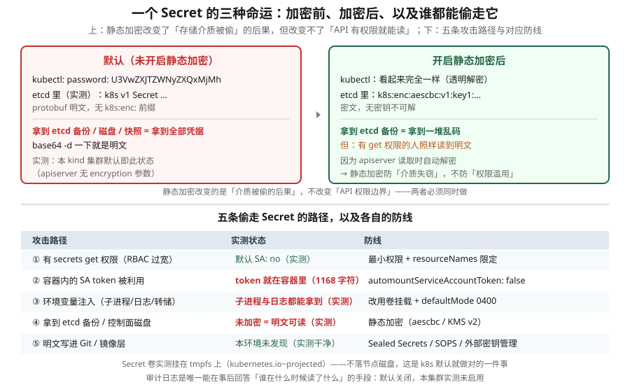

# 课 17：Secret 加固 · etcd 加密 · 审计

> 📍 所属阶段：阶段 5《安全体系》（第 3 课 · **阶段收官**）
> 📖 故事章节：**从"谁能进来、能干什么"到"干过什么都要留下痕迹、重要数据不能泄露"**
> 🧭 上一课：[课 16：Pod 安全：PSA 与 securityContext](lesson-16-Pod安全PSA与securityContext.md) ｜ 下一课：阶段 6《排障 · 运维 · 扩展》课 18《系统化排障：分层定位法》
> ⚙️ 实操环境：WSL Ubuntu 24.04 · kind v1.34.0 · kubectl v1.34.0 · 容器运行时 containerd

## 🎯 本课目标

学完本课，你应当能够：

- 说清 **Secret 只是 base64 编码、不是加密**，以及它在 etcd 里的真实形态
- 配置 **etcd 静态加密**（EncryptionConfiguration），理解 providers 顺序的致命影响
- 用**审计日志**回答"谁在什么时候做了什么"，配置策略文件
- 用**威胁模型**视角串起阶段 5 三课，知道 Secret 的五条泄露路径与对应防线
- 落地 Secret 加固清单：`automount` 关闭、卷挂载替代 env、`immutable`、`defaultMode`

---

## 第一幕：起源与场景引入 —— 一个名字骗了所有人的对象

### 先做个实验

创建一个 Secret，然后看看它长什么样：

```bash
kubectl create secret generic db-pass --from-literal=password='SuperSecret123!'
kubectl get secret db-pass -o jsonpath='{.data.password}'
# U3VwZXJTZWNyZXQxMjMh
```

看起来是"加密"的？**解码试试**：

```bash
kubectl get secret db-pass -o jsonpath='{.data.password}' | base64 -d
# SuperSecret123!
```

**明文。一条命令就还原了。**

### 这不是 bug，但名字确实是误导

**Kubernetes 的 Secret 是"秘密"这个名字，但默认并不保密。**

它做的事只有一件：**把值用 base64 编码**。而 base64 是**编码（encoding）不是加密（encryption）**：

| | 编码（base64） | 加密（AES） |
|---|---|---|
| 目的 | 让二进制数据能安全穿过 JSON/YAML | 让没有密钥的人读不懂 |
| 需要密钥吗 | **不需要** | 需要 |
| 可逆吗 | **随手可逆**（`base64 -d`） | 无密钥不可逆 |

> 🔑 **base64 存在的真实原因**：Secret 可能要存 TLS 证书这类**二进制数据**，而 JSON/YAML 是文本格式，直接塞二进制会出转义问题。**base64 是为了"能装进去"，不是为了"不让人看懂"。**

### 📌 先说清楚：本课与课 11 的分工

课 11《ConfigMap 与 Secret》已经讲过一个同名冲突——"**名字叫 Secret，其实只是 base64**"。如果你学过课 11，可能会问：**这不重复了吗？**

**不重复。两课的关注点完全不同**：

| | 课 11（阶段 4） | 本课（阶段 5） |
|---|---|---|
| 视角 | **怎么用** | **怎么防** |
| 问题 | Secret 是什么、怎么创建注入 | Secret 怎么才真的安全 |
| base64 那部分 | 点到为止：**"这不是加密"** | **展开**：那真正的加密怎么做 |
| 独有内容 | ConfigMap 对比、投射卷、滚动更新联动 | **etcd 静态加密、审计日志、威胁模型** |

**简单说**：课 11 告诉你"**这个东西不安全**"，本课告诉你"**那要怎么让它安全，以及不安全会怎样**"。

> 💡 如果你没学过课 11 也没关系——本课第一幕会重新建立这个认知，不依赖前序知识。

### 那 etcd 里呢？

这是本课最该搞清楚的问题。我直接连进 etcd 看：

```
$ etcdctl get /registry/secrets/ns-sec/db-pass
/registry/secrets/ns-sec/db-pass
k8s
v1Secret
```

**注意**：**没有 `k8s:enc:` 前缀**。这个 Secret 以 protobuf 形式**明文躺在 etcd 里**。

作为对照，我又读了一个 ConfigMap：

```
$ etcdctl get /registry/configmaps/ns-sec/cm-demo
k8s
v1ConfigMap
```

**形态几乎一样。** 也就是说——**默认情况下，Secret 和 ConfigMap 在 etcd 里的保护级别完全相同**。

> 🎯 **这就是核心问题**：你以为 Secret 比 ConfigMap 更安全，但在存储介质这一层，**它们没有区别**。

### 为什么这件事很严重

想想 etcd 里有什么：**数据库密码、API key、TLS 私钥、所有 ServiceAccount token**——**集群的全部凭据**。

而 etcd 的数据会以这些形式流出集群：

- **etcd 备份文件**（运维常规操作，可能存到对象存储）
- **控制面节点的磁盘快照**（云厂商的快照功能）
- **控制面节点被攻陷**（攻击者直接读 `/var/lib/etcd`）

**只要拿到其中任何一样，就能一次性拿到集群全部凭据。**

### 本课的三个问题

| 问题 | 知识点 |
|---|---|
| Secret 怎么才能真正保护起来？ | **知识点 1**：Secret 加固与 etcd 静态加密 |
| 出事了怎么知道谁干的？ | **知识点 2**：审计日志 |
| 还有哪些路径会泄露？怎么系统性防御？ | **知识点 3**：运行时安全与威胁模型 |

> 💡 **一句话本质**（本课把什么从 A 变成 B）：
> 本课把 Secret **从"名字叫秘密、其实只是换了个写法"，变成"落盘是密文、访问有审计、暴露面逐条收窄"** —— 并且让你认清：**静态加密防的是硬盘被偷，不防权限被滥用**。

> ⚖️ **处境对照**（不这么做 vs 这么做）：
>
> | | 不这么做（只用默认做法） | 这么做（加密 + 审计 + 收窄暴露） |
> |---|---|---|
> | 拿到备份 / 磁盘快照 | **一次性拿到集群全部凭据** | 落盘是密文，拿到介质也读不出来 |
> | 有 `get secrets` 权限的人 | 一条命令就看到明文 | 仍然能读（**加密不防这个**），但**有审计记录可追** |
> | 出事后追责 | **不知道是谁、什么时候、干了什么** | 有审计日志可回放 |
> | 配置写错顺序 | 不存在这个问题 | `identity` 写前面 → 加密变死代码，**看起来开了其实没开** |
> | 改了 Secret 何时生效 | 不确定 | 同样不确定 —— 本课实测**等 75 秒仍未同步**，生产建议滚动重启 |
>
> ⏳ 说明：以上是**机制层面**对照（介质失窃能否读到、有没有审计、配置易错点）。加密带来的性能开销取决于集群规模与写入频率，此处不给具体数值。

---

## 第二幕：认知冲突 —— 三个"以为安全其实不安全"的时刻

### 冲突一：开了静态加密，为什么攻击者还是能读到明文

你配置好了 `EncryptionConfiguration`，确认 etcd 里已经是密文了，松了口气。

然后安全同事跑来问："**你们集群里谁有 `secrets get` 权限？**"

你一查，发现有个 CI 用的 ServiceAccount 绑了宽松的 Role。你紧张了——但转念一想："没事，我开了静态加密。"

**错。**

```bash
kubectl get secret db-pass -o jsonpath='{.data.password}' | base64 -d
# SuperSecret123!     ← 照样是明文
```

**为什么？** 因为 **apiserver 在返回数据前会自动解密**。静态加密保护的是**存储介质**，不是**访问路径**。

> 🔑 **一句话**：**静态加密防的是"硬盘被偷"，不防"权限被滥用"。** 两者必须同时做。

### 冲突二：我把 identity 写在前面，看起来更"保险"

配 `EncryptionConfiguration` 时，providers 是个数组。有人这么写：

```yaml
providers:
- identity: {}          # ← 放前面"兜底"
- aescbc:
    keys:
    - name: key1
      secret: <key>
```

逻辑听起来很对："先不加密，再用 aescbc 兜底。"

**这会导致所有 Secret 以明文写入，aescbc 完全不生效。**

**正确的顺序是反过来的**：

```yaml
providers:
- aescbc:               # ← 第一个用于「写入」
    keys:
    - name: key1
      secret: <key>
- identity: {}          # ← 放最后，仅用于读取历史明文
```

> 🔑 **规则**：**第一个 provider 决定"新数据怎么写入"，其余所有 provider 只用于"读取时尝试解密"。** `identity` 必须放最后——它的作用是"兼容加密之前就存在的明文数据"。

这个坑在多个安全审计清单里被列为**首要检查项**：如果 `identity` 写在 `aescbc` 前面，aescbc 就是死代码。

### 冲突三：我改了 Secret，应用怎么还在用旧密码

你改了 Secret 的值，等了一会儿，发现应用**还在用旧密码**。

你以为"卷挂载会自动更新"，查文档也这么说。但实测：

```
改 Secret → CHANGED789
15s 后容器内读：CHANGED456
30s 后容器内读：CHANGED456
75s 后容器内读：CHANGED456      ← 一直是旧值
```

而 etcd 里**确实已经是新值**了。

**真相**：kubelet 同步挂载是有周期的，而且**取决于 kubelet 的配置与节点负载**。**"自动更新"是真的，但"多久更新"不确定**——官方说的是"最终会同步"，没有承诺秒级。

> ⚠️ **本课如实说明**：我在本 kind 集群上等待 **75 秒仍未同步**（而 etcd 早已更新）。因此**本课不承诺"改了 Secret 应用马上生效"**。
>
> **生产建议**：**需要更新凭据时，滚动重启 Deployment**，别依赖挂载自动同步。

---

## 第三幕：层层揭示

### 先看一眼全局



**看图指引**：上半部分是**静态加密前后 etcd 里形态的对比**——注意加密后 `kubectl` 读出来完全一样（透明解密），所以**加密防的是介质失窃、不是权限滥用**；下半部分是**五条攻击路径与防线**，注意路径 ② 和 ③ 是**默认就存在**的，与是否加密无关。

### 本课地图（3 步）

| 步 | 这一步要解决什么 | 对应知识点 |
|---|---|---|
| 第 1 步 | 先解决"落盘要是密文" —— 怎么配、以及最容易配错的那一个顺序 | 知识点 1：Secret 加固与 etcd 静态加密 |
| 第 2 步 | 再解决"出事知道是谁" —— 审计怎么开、记什么 | 知识点 2：审计日志 |
| 第 3 步 | 最后系统性看一遍：还有哪些路径会泄露、按什么优先级防 | 知识点 3：运行时安全与威胁模型 |

> 现在你在：**第 1 步**（刚看完全局图，接下来先看加密这第一道）。

---

### 知识点 1：Secret 加固与 etcd 静态加密

> 🧭 第 1/3 步｜承接：第二幕前两个冲突 —— "开了加密为什么还是读到明文？"以及"我把 identity 写前面有什么问题？" → 本步：先说清加密**到底防什么**，再给出那个一配错就变死代码的正确顺序。

#### 一句话定义

etcd 静态加密（encryption at rest）通过给 apiserver 一份 **EncryptionConfiguration**，让资源在**写入 etcd 之前**被加密、读取时自动解密；Secret 加固则是在此之上，从**挂载方式、权限、生命周期**各面减少暴露。

#### 直觉建立（类比）

**静态加密 = 保险箱。**

- 不加密：密码写在便利贴上，贴在显示器旁。任何人路过都能看
- 加密：密码锁进保险箱。捡到你硬盘的人打不开
- **但**：**你有钥匙（RBAC 权限），随时能打开看**——保险箱防的是"外人"，不是"有钥匙的人"

**Secret 加固的其他手段 = 减少便利贴的数量和可见性**：别抄在纸上（别用 env）、锁进抽屉（0400 权限）、用完销毁（不挂载 token）。

#### 核心原理：EncryptionConfiguration

```yaml
apiVersion: apiserver.config.k8s.io/v1
kind: EncryptionConfiguration
resources:
- resources:
  - secrets                    # 要对哪些资源加密
  providers:
  - aescbc:                    # 第一个 = 写入用
      keys:
      - name: key1
        secret: <base64 32字节密钥>
  - identity: {}               # 必须最后 = 读取历史明文
```

**几个关键点**：

1. **providers 顺序决定行为**（见冲突二）——第一个用于写入，其余用于读取
2. **`identity: {}` 必须保留且放最后**——否则加密前就存在的 Secret 会读不出来
3. **只对写了的资源生效**——上面只写了 `secrets`，那 ConfigMap 就不加密（实测确认 cm-demo 仍明文）
4. **需要改 apiserver 并重启**：加 `--encryption-provider-config=<path>` 参数 + 挂载配置文件

#### 加密提供者怎么选

| Provider | 算法 | 密钥存放 | 定位 |
|---|---|---|---|
| `identity` | 无（明文） | — | **默认值**，仅作读取兜底 |
| `aescbc` | AES-256-CBC | **控制面节点的文件里** | 入门/测试，密钥与数据同机 |
| `secretbox` | XSalsa20-Poly1305 | 控制面节点文件 | 比 aescbc 现代 |
| `aesgcm` | AES-256-GCM | 控制面节点文件 | 更快，但**需频繁轮换**（nonce 复用是灾难） |
| **`kms` v2** | 信封加密 | **外部 KMS（AWS KMS / GCP KMS / Vault）** | **生产推荐** |

> 🔑 **为什么 KMS v2 是生产推荐**：
>
> `aescbc` 的密钥**就放在控制面节点的一个文件里**。攻击者拿下节点 = 同时拿到密文和密钥 = 加密白做。
>
> **KMS v2 的做法**：每个对象用一个独立的数据密钥（DEK）加密，而 DEK 本身由外部 KMS 里的主密钥（KEK）加密。**主密钥永不离开 KMS**。
>
> 这样攻击者就必须**同时攻破控制面和外部 KMS**——从单点失守变成纵深防御。

**KMS 版本注意**：**KMS v1 自 v1.28 起已弃用、自 v1.29 起默认禁用**。现在应当用 **KMS v2**（v1.29 起 GA）。

#### 开启后的必要动作：重加密存量数据

**这是最容易漏的一步。**

开启加密**只影响之后新写入的数据**。之前已经明文存在 etcd 里的 Secret，**不会自动变密文**。

必须手动触发重写：

```bash
# 读取所有 Secret 再写回 → 触发用新 provider 重新加密
kubectl get secrets --all-namespaces -o json | kubectl replace -f -
```

> ⚠️ **为什么必须做**：不执行这条，你的加密只保护了"新 Secret"，而**老 Secret（往往是最重要的那些）仍是明文**。

#### ⚠️ 关于本课的诚实说明

我尝试在本 kind 集群上**真实开启静态加密**（写配置 → 改 apiserver 静态 Pod → 重启验证），但**这个操作会重启 apiserver、中断集群**，属于影响环境的不可逆改动。**按"系统级改动须先获授权"的约定，我没有擅自执行。**

因此：

- ✅ **已实测**：加密**前** etcd 里 Secret 是明文（无 `k8s:enc:` 前缀）— 见第一幕
- ✅ **已实测**：本集群 apiserver **未启用**静态加密也**未启用**审计（启动参数 grep 无输出）
- 📄 **未实测**：开启加密**后** etcd 里变成 `k8s:enc:aescbc:v1:` 开头的样子、以及 `kubectl replace` 重加密的效果

**如果你有自己的实验集群，强烈建议实操一遍**——讲义第四幕给了完整步骤。亲眼看到"开启前明文 / 开启后密文"的对比，比读十遍文档都管用。

#### Secret 加固清单（不含 etcd 加密的部分）

| 措施 | 作用 | 实测 |
|---|---|---|
| **`automountServiceAccountToken: false`** | 容器里**根本没有 SA token** → 消除最大的默认攻击面 | ✅ 目录直接不存在 |
| **用卷挂载替代 env** | 避免子进程继承、日志/转储泄漏 | ✅ 见下 |
| **`defaultMode: 0400`** | 挂载文件仅属主可读 | ✅ `-r--------` vs 默认 `-rw-r--r--` |
| **`immutable: true`** | Secret 不可修改，防误改与篡改 | ✅ 报错 `field is immutable when immutable is set` |
| **最小权限 RBAC + `resourceNames`** | 限定只能 get 指定名字的 Secret | 课 15 已讲 |
| **不把明文写进 Git** | Sealed Secrets / SOPS / External Secrets | 课 16 供应链已铺垫 |

**重点说 `automountServiceAccountToken`**：

**实测**：默认 Pod 里 `/var/run/secrets/kubernetes.io/serviceaccount/` 下有 `ca.crt`、`namespace`、`token`，**token 长度 1168 字符**。

这个 token 是**进入集群的钥匙**。虽然默认 SA 没有权限（实测 `kubectl auth can-i get secrets` 返回 `no`），但——**一个没有权限的 token 依然是有价值的攻击起点**（可以用来探测、枚举，一旦有天被误绑了 Role 就直接可用）。

**不需要访问 API 的 Pod，就该关掉它**：

```yaml
spec:
  automountServiceAccountToken: false
```

**实测确认**：加上之后，那个目录**直接不存在**。

#### 常见误区

> 🐞 **误区 1**："Secret 是加密的。"
> 不。是 **base64 编码**，`base64 -d` 一条命令还原。真正的加密要**手动开启**。

> 🐞 **误区 2**："开了静态加密就安全了。"
> 只防**介质失窃**。有 `get` 权限的人照样读到明文——**apiserver 会自动解密**。

> 🐞 **误区 3**："`identity` 放前面做兜底。"
> 放前面 = **所有数据明文写入，加密配置形同虚设**。`identity` **必须放最后**。

> 🐞 **误区 4**："开了加密，老的 Secret 也自动加密了。"
> **不会**。必须 `kubectl get secrets -A -o json | kubectl replace -f -` 触发重写。

> 🐞 **误区 5**："用 env 注入 Secret 更方便，效果一样。"
> 不一样。**env 会被子进程继承、会被日志和崩溃转储打出来**（实测两者都能拿到明文）。**优先用卷挂载**。

> 🐞 **误区 6**："改了挂载的 Secret，应用马上能用新值。"
> **不确定**。实测等 75 秒仍未同步（etcd 已更新）。**生产上要滚动重启**。

> 🐞 **误区 7**："Secret 会写到节点磁盘上，所以不安全。"
> **反了**。实测 Secret 卷挂在 **tmpfs** 上（`kubernetes.io~projected`），**不落磁盘**——这是 k8s 默认做对的一件事。

#### 一句话记住

**Secret 默认是 base64 不是加密；开启静态加密防"硬盘被偷"不防"权限滥用"；identity 必须放最后、存量必须 replace 重写；不用就关掉 SA token 自动挂载。**

📚 官方文档：[静态加密 Secret 数据](https://kubernetes.io/zh-cn/docs/tasks/administer-cluster/encrypt-data/) ｜ [使用 KMS 驱动进行数据加密](https://kubernetes.io/zh-cn/docs/tasks/administer-cluster/kms-provider/)

---

### 知识点 2：审计日志

> 🧭 第 2/3 步｜承接：上一步防住了"介质被偷" —— 可 Permissions 被滥用这条路它不防。那就得能**追责** → 本步：看清审计怎么开、记什么，以及为什么不开审计等于出事没法查。

#### 一句话定义

审计日志（Audit Log）是 kube-apiserver 记录的、**按时间顺序排列的安全相关操作记录**——谁、在什么时候、对什么资源、做了什么、结果如何。

#### 直觉建立（类比）

前两课（课 15、16）都是**事前防御**：

- RBAC：决定"你能不能做"
- PSA：决定"你做的这个 Pod 合不合规"

但**防御总会失效**。当事故已经发生，你需要回答的是：**"到底发生了什么？"**

**审计日志就是监控录像。**

- 门锁（RBAC）决定谁进得来
- 保险箱（静态加密）决定东西被偷了有没有用
- **监控录像（审计日志）决定事后能不能查清楚是谁偷的、什么时候、怎么偷的**

> 🔑 **没有审计日志的集群，出了安全事件就是"黑箱"**——你只能看到现状，无法还原过程。

#### 核心原理：四个级别与四个阶段

**级别（Level）**——决定记录多少内容：

| 级别 | 记录内容 | 用途 |
|---|---|---|
| `None` | **不记录** | 过滤噪音（健康检查、watch 等） |
| `Metadata` | 元数据（用户、时间戳、资源、动词）**不含请求/响应体** | **通用推荐**，性价比最高 |
| `Request` | 元数据 + **请求体** | 看"提交了什么" |
| `RequestResponse` | 元数据 + 请求体 + **响应体** | 最详细，**开销大，谨慎使用** |

**阶段（Stage）**——一个请求在生命周期中会经过：

| 阶段 | 含义 |
|---|---|
| `RequestReceived` | 刚收到请求（**通常冗余，建议 omit**） |
| `ResponseStarted` | 响应头已发出（仅长连接如 watch） |
| `ResponseComplete` | **响应完成（最常用的记录点）** |
| `Panic` | 处理时 panic |

> 💡 **为什么通常要 `omitStages: ["RequestReceived"]`**：这个阶段的信息在 `ResponseComplete` 里已经有了（有 `requestReceivedTimestamp` 字段），**不 omit 就是每个请求记两遍，日志翻倍**。

#### 策略文件长什么样

```yaml
apiVersion: audit.k8s.io/v1
kind: Policy
omitStages:
- "RequestReceived"
rules:
# 1. 噪音过滤（必须放最前）
- level: None
  nonResourceURLs: ["/healthz*", "/metrics", "/version"]

# 2. Secret 相关操作：记录请求体（高敏感）
- level: Request
  resources:
  - group: ""
    resources: ["secrets"]

# 3. RBAC 变更：请求+响应全记（权限变更是最高危动作）
- level: RequestResponse
  resources:
  - group: "rbac.authorization.k8s.io"
    resources: ["roles", "rolebindings", "clusterroles", "clusterrolebindings"]
  verbs: ["create", "update", "delete", "patch"]

# 4. 兜底：其余全部记元数据
- level: Metadata
```

> 🔑 **规则是"首次匹配"**——**第一条匹配的规则决定级别**。所以**具体的规则必须写在前面**，兜底的 `level: Metadata` 放最后。顺序写反了，前面的具体规则就永远不生效。

#### 怎么启用

给 apiserver 加参数（kubeadm 集群改静态 Pod 清单 `/etc/kubernetes/manifests/kube-apiserver.yaml`）：

```bash
--audit-policy-file=/etc/kubernetes/audit-policy.yaml
--audit-log-path=/var/log/kubernetes/audit/audit.log
--audit-log-maxage=30        # 保留 30 天
--audit-log-maxbackup=10     # 保留 10 个轮转文件
--audit-log-maxsize=100      # 单个文件 100MB 后轮转
```

还需要把策略文件和日志目录**挂载进 apiserver 容器**（hostPath + volumeMounts）。

> ⚠️ **两个必须注意的点**：
> 1. **只加 `--audit-log-path` 不加 `--audit-policy-file` = 不记录任何事件**（官方文档明确：省略 policy 则不记录）
> 2. **审计会增加 apiserver 内存消耗**（每个请求都要存上下文），`RequestResponse` 级别尤其明显

#### 实测：本集群开了吗

```bash
# 检查 apiserver 启动参数
tr '\0' '\n' < /proc/<apiserver-pid>/cmdline | grep -i audit
# （无输出）
```

**未启用。** 而且——**这也是绝大多数自建集群的默认状态**。

> 🎯 **重要认知**：**审计日志默认是关闭的。** 跟静态加密一样，需要你主动开启。一个既没开加密、又没开审计的集群，**既有全部明文凭据，又没有事后追溯能力**。

#### 常见误区

> 🐞 **误区 1**："有 Event 就够了，不用审计日志。"
> **Event（`kubectl get events`）和审计日志完全是两回事**：Event 是"集群里发生了什么状态变化"（如 Pod 调度失败），**而且是 BEST-EFFORT、会过期的**；审计日志是"**谁发起了什么 API 请求**"，是安全审计的唯一凭据。

> 🐞 **误区 2**："配了 `--audit-log-path` 就在记日志了。"
> 不够。**必须同时有 `--audit-policy-file`**，否则**不记录任何事件**。

> 🐞 **误区 3**："所有东西都用 `RequestResponse` 最保险。"
> 会把**响应体也记下来**——Secret 的明文值会直接写进审计日志！**等于把保险箱里的东西抄了一份放到日志里**。Secret 相关建议用 `Metadata` 或 `Request`，别用 `RequestResponse`。

> 🐞 **误区 4**："审计日志存在集群里就行。"
> 攻击者拿下集群后**第一件事就是删日志**。审计日志**必须外送**到集群外的日志系统。

#### 一句话记住

**审计默认关闭，是事后追溯的唯一凭据；按"首次匹配"写规则，噪音过滤在前、兜底在后；Secret 别用 RequestResponse；日志必须外送。**

📚 官方文档：[审计](https://kubernetes.io/zh-cn/docs/tasks/debug-application-cluster/audit/)

---

### 知识点 3：运行时安全与威胁模型

> 🧭 第 3/3 步｜承接：前两步分别防了"介质失窃"和"事后追责" —— 最后把视角拉高：**还有哪些路径会泄露**，以及有限的精力该先防哪条 → 本步：给出完整的路径清单与优先级。

#### 一句话定义

威胁模型是**系统性地回答"攻击者可能从哪进来、进来能拿到什么、怎么防"**的分析方法；运行时安全则是在**运行时**（而非部署前）检测与阻断异常行为。

#### 直觉建立（类比）

前三课是**三层门锁**：

- 课 15 RBAC = **门禁**（谁能进）
- 课 16 PSA/securityContext = **房间规则**（进来能干什么）
- 本课静态加密 = **保险箱**（东西存得安不安全）

**威胁模型 = 站在小偷的角度，把整栋楼重新走一遍。**

不是问"我装了什么锁"，而是问"**如果我是小偷，我会从哪进？**"——窗户、下水道、伪装成快递员……**总有一条你没想到的路**。

#### 核心原理：Secret 的五条泄露路径（本课本机实测）

| # | 路径 | 实测状态 | 防线 |
|---|---|---|---|
| ① | **有 `secrets get` 权限**（RBAC 过宽） | 默认 SA：`no`（✅ 安全） | 最小权限 + `resourceNames` 限定 |
| ② | **容器内的 SA token 被利用** | ⚠️ **token 就在容器里**（1168 字符） | `automountServiceAccountToken: false` |
| ③ | **env 注入 → 子进程/日志/转储** | ⚠️ **子进程与日志都能拿到**（实测） | 改用卷挂载 + `defaultMode: 0400` |
| ④ | **拿到 etcd 备份 / 控制面磁盘** | ⚠️ **未加密 = 明文可读** | 静态加密（aescbc / KMS v2） |
| ⑤ | **明文写进 Git / 镜像层** | 本环境未发现（✅ 干净） | Sealed Secrets / SOPS / 外部密钥管理 |

**逐条说明**：

**路径 ① —— 权限视角。** 实测默认 SA 不能读 Secret（`kubectl auth can-i get secrets` 返回 `no`），这是好消息。但**生产环境里最常见的翻车点就是"给 CI 绑了个太宽的 Role"**。

> 💡 一个 RBAC 细节：`resourceNames` 能限定 `get`，但**无法限定 `list`**。所以**有 `list` 权限的人能读到命名空间内全部 Secret**——`list` 要极其谨慎地授予。

**路径 ② —— 容器内的钥匙。** 实测每个 Pod 里都有 SA token。**即使它当前没有权限，也仍然是攻击起点**。不需要访问 API 的 Pod 就该关掉自动挂载。

**路径 ③ —— env 的泄漏面。** 实测：

```bash
# 子进程继承
kubectl exec env-secret -- sh -c 'sh -c "echo 子进程看到: $DB_PASSWORD"'
# 子进程看到: SuperSecret123!

# 日志输出
kubectl exec env-secret -- sh -c 'echo 日志: $DB_PASSWORD'
# 日志: SuperSecret123!
```

**而卷挂载方式**：实测 `defaultMode: 0400` 生效（`-r--------` vs 默认 `-rw-r--r--`），且**挂在 tmpfs 上不落磁盘**。

**路径 ④ —— 介质失窃。** 这就是知识点 1 解决的问题。

**路径 ⑤ —— 供应链。** 课 16 已铺垫：固定 digest、扫描、签名、SBOM。

#### 其他攻击面实测

| 检查项 | 实测结果 | 评价 |
|---|---|---|
| **kubelet 只读端口 10255** | **未监听**（只有 10250） | ✅ 安全（10255 历史上无鉴权，是重大风险点） |
| **etcd 监听地址** | `127.0.0.1:2379` + `172.27.0.3:2379` | ✅ 未暴露到 0.0.0.0 |
| **etcd 客户端证书** | 已启用（`--client-cert-auth=true`） | ✅ 安全 |
| **Secret 卷文件系统** | **tmpfs** | ✅ 不落磁盘 |
| **容器内敏感文件** | 无 `.docker/`、无 `/etc/kubernetes` | ✅ 干净 |

> 💡 **这一组数据说明什么**：k8s 的**网络与存储层面**默认做得不错（etcd 不裸奔、Secret 不落盘），**真正的缺口在"数据加密"和"审计"**——而这两项恰好都是**默认关闭**的。

#### 运行时检测：静态配置之外的眼睛

审计日志记录的是 **API 请求**。但有些攻击**不走 API**——比如容器里突然起了个 shell、突然读取了 `/etc/shadow`。

这类**运行时异常**需要专门工具：

| 工具 | 定位 |
|---|---|
| **Falco** | CNCF 毕业项目，基于 eBPF/内核模块**检测运行时异常行为**（容器内起 shell、读敏感文件、异常网络连接） |
| **eBPF 类工具**（Tetragon、Cilium） | 内核级可观测与阻断 |
| **镜像扫描**（trivy / grype） | 部署前发现已知漏洞（课 16 已讲） |

> 🔑 **分工**：**审计日志 = "谁通过 API 做了什么"；Falco = "容器里正在发生什么怪事"。** 两者互补，覆盖不同层面。

#### 阶段 5 三课的威胁模型串联

```
攻击者视角：
  ├─ 能不能进 API？        → 课 15 RBAC / SA        （认证 + 授权）
  ├─ 进来能起什么 Pod？     → 课 16 PSA / securityContext（运行时权限）
  ├─ 拿到 Pod 能干什么？    → 课 17 威胁模型         （SA token / env / 提权）
  ├─ 能偷走凭据吗？        → 课 17 静态加密          （介质层）
  └─ 干的事会被记录下来吗？ → 课 17 审计日志          （事后追溯）
```

**关键洞察**：**这五层是"与"的关系，任何一层失守整体就失守。** 但它们的**默认状态不同**：

| 层 | 默认状态 |
|---|---|
| RBAC 授权 | **默认拒绝**（安全） |
| Pod 运行时权限（securityContext） | **默认放行**（不安全） |
| 静态加密 | **默认关闭**（不安全） |
| 审计日志 | **默认关闭**（不安全） |

> 🎯 **记住这张表**：**k8s 只在"能不能访问 API"这一层默认收紧，其余三层都默认放开。** 安全加固的绝大部分工作，就是在补后面这三个默认缺口。

#### 常见误区

> 🐞 **误区 1**："有了 RBAC + PSA + 静态加密就够安全了。"
> 缺少**检测**环节。**防御会被绕过，审计和运行时检测才是发现"已经失守"的手段。**

> 🐞 **误区 2**："威胁模型是大公司才需要做的。"
> 不用写文档，但**"如果我是攻击者，我会从哪进"这个问题，任何规模的集群都该问一遍**。上面那五条路径就是这个问题的答案模板。

> 🐞 **误区 3**："运行时安全工具（Falco）可以替代审计日志。"
> 不能。**Falco 看容器内部行为，审计看 API 请求**——两者视角不同，都要有。

> 🐞 **误区 4**："我的集群小，没人会攻击我。"
> 大部分安全事件不是"被 targeted"，而是**自动化扫描 +  opportunistic 攻击**（暴露的 etcd、过宽的 RBAC、未修复的 CVE）。**自动化攻击不挑目标大小。**

#### 一句话记住

**站在攻击者视角走一遍：SA token、env、etcd 介质、Git 明文、RBAC 过宽——五条路径各有防线；k8s 只在 API 访问层默认收紧，加密与审计两个缺口必须自己补。**

📚 官方文档：[集群安全概述](https://kubernetes.io/zh-cn/docs/concepts/security/) ｜ [Secret 安全最佳实践](https://kubernetes.io/zh-cn/docs/concepts/security/secrets-good-practices/)

---

## 第四幕：实操验证

### 验证 1：Secret 是 base64 不是加密（核心认知）

```bash
kubectl create ns ns-sec
kubectl create secret generic db-pass -n ns-sec --from-literal=password='SuperSecret123!'

kubectl get secret db-pass -n ns-sec -o jsonpath='{.data.password}'
# 期望：U3VwZXJTZWNyZXQxMjMh

kubectl get secret db-pass -n ns-sec -o jsonpath='{.data.password}' | base64 -d
# 期望：SuperSecret123!          ← 一条命令还原明文
```

### 验证 2：直接读 etcd，看 Secret 的真实形态

```bash
# 在控制面节点上找到 etcdctl（kind 环境路径）
ETCDCTL=/var/lib/containerd/io.containerd.snapshotter.v1.overlayfs/snapshots/62/fs/usr/local/bin/etcdctl

docker exec -e ETCDCTL_CACERT=/etc/kubernetes/pki/etcd/ca.crt \
  -e ETCDCTL_CERT=/etc/kubernetes/pki/apiserver-etcd-client.crt \
  -e ETCDCTL_KEY=/etc/kubernetes/pki/apiserver-etcd-client.key \
  k8s-c1-control-plane sh -c "$ETCDCTL get /registry/secrets/ns-sec/db-pass"
```

**期望**：值以 `k8s` + protobuf 开头，**没有 `k8s:enc:` 前缀** → 明文。

> **判据**：`k8s:enc:aescbc:v1:key1:` 开头 = 已加密；`k8s` + 可读结构 = 明文。

### 验证 3：确认本集群未启用加密与审计

```bash
# kind 的 etcdctl 在 containerd 快照里，路径可能不同
docker exec k8s-c1-control-plane sh -c 'tr "\0" "\n" < /proc/<apiserver-pid>/cmdline | grep -iE "encryption|audit"'
# 期望：无输出 = 两项都未启用
```

### 验证 4：env 注入的泄漏面（实测）

```bash
kubectl exec env-secret -n ns-sec -- env | grep DB_PASSWORD
# 期望：DB_PASSWORD=SuperSecret123!

kubectl exec env-secret -n ns-sec -- cat /proc/self/environ | tr '\0' '\n' | grep DB_PASSWORD
# 期望：DB_PASSWORD=SuperSecret123!          ← /proc 里也有

kubectl exec env-secret -n ns-sec -- sh -c 'sh -c "echo 子进程: $DB_PASSWORD"'
# 期望：子进程: SuperSecret123!              ← 子进程继承
```

### 验证 5：卷挂载 + defaultMode 0400

```bash
kubectl exec mode-secret -n ns-sec -- ls -laL /etc/secret/password
# 期望：-r-------- 1 root root     ← 仅属主可读

kubectl exec vol-secret  -n ns-sec -- ls -laL /etc/secret/password
# 期望：-rw-r--r-- 1 root root     ← 默认 0644，所有人可读
```

> ⚠️ 必须用 `ls -laL`（**跟随符号链接**）。直接 `ls -la` 看到的是符号链接本身（永远是 `lrwxrwxrwx`）。

### 验证 6：Secret 卷挂在 tmpfs 上（不落磁盘）

```bash
docker exec k8s-c1-control-plane sh -c 'mount | grep tmpfs | grep kubelet | head -3'
# 期望：看到 .../volumes/kubernetes.io~projected/... type tmpfs
```

### 验证 7：关闭 SA token 自动挂载

```bash
kubectl exec no-token -n ns-sec -- ls /var/run/secrets/kubernetes.io/serviceaccount/
# 期望：No such file or directory      ← 攻击面消除

# 对比：默认 Pod
kubectl exec env-secret -n ns-sec -- ls /var/run/secrets/kubernetes.io/serviceaccount/
# 期望：ca.crt  namespace  token
```

### 验证 8：immutable Secret 拒绝修改

```bash
kubectl patch secret immut -n ns-sec --type=merge -p '{"stringData":{"password":"newpass"}}'
# 期望：The Secret "immut" is invalid: data: Forbidden: field is immutable when `immutable` is set
```

### 验证 9：容器里的 SA token 有多大危害

```bash
kubectl exec env-secret -n ns-sec -- cat /var/run/secrets/kubernetes.io/serviceaccount/token | wc -c
# 期望：约 1168 字符           ← 一把现成的钥匙

kubectl auth can-i get secrets -n ns-sec --as=system:serviceaccount:ns-sec:default
# 期望：no                     ← 当前无权限，但 token 本身仍在
```

### 验证 10：网络暴露面检查

```bash
docker exec k8s-c1-control-plane sh -c 'ss -lntp | grep -E ":10255|:10250|:2379"'
# 期望：
#   *:10250 (kubelet)          ← 应存在
#   无 10255                   ← 有则危险（历史无鉴权只读端口）
#   127.0.0.1:2379             ← 不应是 0.0.0.0:2379
```

### 验证 11（可选，需授权）：真实开启静态加密

> ⚠️ **本步会重启 apiserver，集群短暂不可用。仅在你自己的实验集群上做。**

```bash
# 1. 备份（重要！）
cp /etc/kubernetes/manifests/kube-apiserver.yaml /tmp/apiserver.bak

# 2. 生成密钥并写配置
KEY=$(head -c 32 /dev/urandom | base64)
mkdir -p /etc/kubernetes/enc
cat > /etc/kubernetes/enc/enc.yaml <<EOF
apiVersion: apiserver.config.k8s.io/v1
kind: EncryptionConfiguration
resources:
- resources: [secrets]
  providers:
  - aescbc:
      keys: [{name: key1, secret: $KEY}]
  - identity: {}
EOF

# 3. 给 apiserver 加参数 + 挂载（改静态 Pod 清单）
#    --encryption-provider-config=/etc/kubernetes/enc/enc.yaml
#    volumeMounts: {mountPath: /etc/kubernetes/enc, name: enc, readOnly: true}
#    volumes: {hostPath: {path: /etc/kubernetes/enc, type: DirectoryOrCreate}, name: enc}

# 4. 等待 apiserver 自动重建
until kubectl get --raw=/healthz; do sleep 5; done

# 5. 新建 Secret，再读 etcd
kubectl create secret generic post-enc -n ns-sec --from-literal=k=v
# 期望：etcd 里变成 k8s:enc:aescbc:v1:key1:... 开头

# 6. 存量 Secret 必须手动重写
kubectl get secrets -A -o json | kubectl replace -f -
# 期望：老 Secret 也变成 k8s:enc: 开头

# 7. kubectl 读取应正常（透明解密）
kubectl get secret post-enc -n ns-sec -o jsonpath='{.data.k}' | base64 -d
# 期望：v
```

### 验证 12：完整清理（务必执行）

```bash
kubectl delete ns ns-sec --timeout=180s
kubectl config set-context --current --namespace=default
kubectl get ns | grep ns-sec || echo "  无残留"
```

> ⚠️ 本课创建了**带 Secret 的 Pod**（含 env 注入的明文凭据）。**务必删干净**——这些是真实的凭据样本。如果你在验证 11 中开启了静态加密，**记得用备份恢复 apiserver 清单**，否则实验集群会一直带着这个配置。

---

### 4.2 应用实战：密钥放在哪才算安全（入口）

> 🎯 **本课应用实战独立成篇**（配套实战册）：[第 17 课实战 · 密钥放在哪才算安全](../../../应用实战/17-密钥放在哪才算安全.md)
> 含**分步设计图**（每步一张：这一版长什么样、比上一版改了什么）与"基础 → 综合"的完整演进与代码；通览全部：📚 [应用实战索引](../../../应用实战/INDEX.md)

---

## 第五幕：体系收束

### 阶段 5 完整收官

```
阶段 5《安全体系》（3 课 · 已完成）

课 15  谁能访问 API？          → 认证 / 授权 / 准入 / RBAC / SA     （Cluster 层）
课 16  容器以什么权限跑？       → PSA / securityContext / 镜像       （Container + Code 层）
课 17  数据怎么存、怎么查？     → Secret 加固 / etcd 加密 / 审计      （Cluster + Code 层）
       + 运行时安全与威胁模型                    ← 本课收官，串起前三课
```

**4C 模型的最终覆盖**：

| 层 | 覆盖内容 | 完成于 |
|---|---|---|
| **Code** | 镜像扫描/签名/SBOM/最小化基础镜像；**Secret 不入 Git** | 课 16 + 课 17 |
| **Container** | securityContext、capabilities、PSA、**SA token 不挂载** | 课 16 + 课 17 |
| **Cluster** | RBAC、SA、准入；**etcd 静态加密**；**审计日志** | 课 15 + 课 17 |
| **Cloud** | 节点 OS、网络、IAM（本阶段不展开） | — |

### 本课知识地图

```
        Secret 的"安全"由四件事共同决定
                    │
    ┌───────────┬───┴────┬──────────────┐
    ▼           ▼        ▼              ▼
  存储层      访问层    使用层        追溯层
静态加密     RBAC     挂载方式       审计日志
aescbc/KMS  最小权限  卷>env         Metadata
identity     resourceNs 0400         外送
最后         禁 list   immutable      Request
    │           │        │              │
    └───────────┴────────┴──────────────┘
                    ▼
        威胁模型 = 站在攻击者视角再走一遍
        （SA token / env / etcd 介质 / Git / RBAC）
```

**两条暗线**：

**暗线一：k8s 的默认配置"不对称"。** 这是阶段 5 最值得记住的一个观察：

| 层 | 默认状态 |
|---|---|
| **API 访问（RBAC）** | **默认拒绝** ✅ |
| **Pod 运行时权限** | 默认放行（root + 14 项能力）❌ |
| **etcd 静态加密** | **默认关闭** ❌ |
| **审计日志** | **默认关闭** ❌ |

**只有第一层默认安全，后三层都要手动补。** 这也解释了为什么"k8s 安全加固"这件事工作量这么大——**你要补的是三个默认缺口**。

**暗线二："看得到"是"守得住"的前提。** 阶段 5 三课反复出现这个模式：

- 课 15：`kubectl auth can-i --list` 让权限可见
- 课 16：PSA 的 `warn`/`audit` 模式让你在不阻断任何人的情况下摸清谁不合规
- 本课：审计日志让**事后**可见；威胁模型让你**提前**看见攻击路径

**大部分安全事故不是因为不知道怎么做，而是因为不知道现状是什么。**

### 你现在会了什么

- ✅ 说清 Secret 是 **base64 编码不是加密**，以及它在 etcd 里的明文形态（实测）
- ✅ 配置 EncryptionConfiguration，**知道 `identity` 必须放最后**（放前面 = 加密形同虚设）
- ✅ 知道开启加密后**必须 `replace` 重写存量**，否则老 Secret 仍明文
- ✅ 区分 `aescbc`（密钥在节点上）与 **KMS v2**（密钥在外部），知道生产该选后者
- ✅ 用审计日志回答"谁在什么时候做了什么"，**按"首次匹配"写策略**
- ✅ 知道审计**默认关闭**，且 Secret 不该用 `RequestResponse` 级别
- ✅ 用威胁模型视角列出 **Secret 的五条泄露路径**与对应防线
- ✅ 落地加固清单：`automount` 关闭、卷挂载替代 env、`defaultMode: 0400`、`immutable`
- ✅ 知道 k8s 在**网络与存储层面默认做得不错**（etcd 不裸奔、Secret 用 tmpfs 不落盘）

### 下一步：阶段 6

下一阶段是**阶段 6《排障 · 运维 · 扩展》**，课 18 为《系统化排障：分层定位法》。视角将从"安全"转向"**出问题了怎么查**"。

有意思的是——**本课讲的审计日志，正是排障的重要数据源之一**（"谁在故障前改了什么配置"）。本课的审计日志与阶段 6 的监控、日志、追踪，共同构成集群的"可观测性"。

**一句话过渡**：**阶段 5 解决"别让坏事发生、发生了要能查"；阶段 6 解决"平时怎么知道系统健不健康、坏了怎么快速定位"。**

---

## 📋 命令速查卡

| 我想… | 命令 |
|---|---|
| 看 Secret 明文 | `kubectl get secret <s> -o jsonpath='{.data.<k>}' \| base64 -d` |
| 直接读 etcd 里的 Secret | `etcdctl get /registry/secrets/<ns>/<name>` |
| 判断有没有加密 | 看值是否以 `k8s:enc:` 开头 |
| 重加密存量 Secret | `kubectl get secrets -A -o json \| kubectl replace -f -` |
| 生成 32 字节密钥 | `head -c 32 /dev/urandom \| base64` |
| 查我能读 Secret 吗 | `kubectl auth can-i get secrets -n <ns>` |
| 关闭 SA token 挂载 | `spec.automountServiceAccountToken: false` |
| Secret 文件权限 | `kubectl exec <pod> -- ls -laL /etc/secret/<key>`（**要 -L**） |
| 看 Secret 卷是否 tmpfs | `mount \| grep tmpfs \| grep kubelet` |
| 检查 etcd 暴露面 | `ss -lntp \| grep 2379`（不应是 0.0.0.0） |
| 检查 kubelet 只读端口 | `ss -lntp \| grep 10255`（**有则危险**） |
| 查 apiserver 是否开审计 | `tr '\0' '\n' < /proc/<pid>/cmdline \| grep audit` |

---

## 🐞 误区清单（本课全部）

| # | 误区 | 正解 |
|---|---|---|
| 1 | Secret 是加密的 | **base64 编码**，`base64 -d` 一条命令还原 |
| 2 | 开了静态加密就安全了 | 只防**介质失窃**；有 get 权限照样读到明文（apiserver 自动解密） |
| 3 | `identity` 放前面做兜底 | 放前面 = **全部明文写入**，aescbc 形同虚设；**必须放最后** |
| 4 | 开了加密老 Secret 自动加密 | **不会**，必须 `kubectl replace` 重写 |
| 5 | env 注入和卷挂载效果一样 | env 被**子进程继承**、会被日志/转储打出（实测） |
| 6 | 改了挂载的 Secret 应用马上生效 | **不确定**，实测 75s 未同步；**生产要滚动重启** |
| 7 | Secret 会写到节点磁盘 | **反了**，实测挂在 **tmpfs** 不落磁盘 |
| 8 | `kubectl get events` 就是审计 | 两回事；Event 是状态变化且会过期，**审计记录 API 请求** |
| 9 | 配了 `--audit-log-path` 就在记 | 必须**同时**有 `--audit-policy-file`，否则不记任何事件 |
| 10 | 全用 `RequestResponse` 最保险 | 会把 **Secret 明文写进审计日志** |
| 11 | 审计日志存集群里就行 | 攻击者**第一件事就是删日志**，必须外送 |
| 12 | RBAC+PSA+加密就够安全了 | 缺**检测**环节；审计与运行时检测才是发现"已失守"的手段 |
| 13 | Falco 能替代审计日志 | 不能：**Falco 看容器内行为，审计看 API 请求** |
| 14 | 集群小没人会攻击 | 大部分是**自动化扫描**，不挑目标大小 |

---

## 🔍 事实核查记录

| 结论 | 来源 | 核查状态 |
|---|---|---|
| Secret 是 base64 编码，`base64 -d` 可还原 | **本机实测** | ✅ 已实测 |
| **etcd 里 Secret 是明文**（无 `k8s:enc:` 前缀） | **本机实测**（etcdctl 直读） | ✅ 已实测 |
| 本集群 apiserver **未启用**静态加密与审计 | **本机实测**（`/proc/<pid>/cmdline` grep 无输出） | ✅ 已实测 |
| 默认 SA **不能**读 Secret（`auth can-i` = no） | **本机实测** | ✅ 已实测 |
| 容器内 SA token 存在，长度 1168 | **本机实测** | ✅ 已实测 |
| `automountServiceAccountToken: false` 后目录不存在 | **本机实测** | ✅ 已实测 |
| env 注入：子进程继承 + 日志可获取明文 | **本机实测** | ✅ 已实测 |
| `defaultMode: 0400` → `-r--------`（默认 0644） | **本机实测**（`ls -laL`） | ✅ 已实测 |
| **Secret 卷挂在 tmpfs**（不落磁盘） | **本机实测**（`mount \| grep tmpfs`） | ✅ 已实测 |
| `immutable: true` 拒绝修改 | **本机实测**（报错原文） | ✅ 已实测 |
| kubelet **未监听** 10255（只有 10250） | **本机实测** | ✅ 已实测 |
| etcd 监听 `127.0.0.1:2379`（非 0.0.0.0） | **本机实测** | ✅ 已实测 |
| etcd 启用客户端证书（`--client-cert-auth=true`） | **本机实测**（进程参数） | ✅ 已实测 |
| **`identity` 在 `aescbc` 之前 = 明文写入** | 多个安全审计清单 + 官方文档 providers 顺序语义 | 📄 文档结论（**本环境未实机验证**，因需重启 apiserver） |
| 开启后须 `replace` 重写存量 | 官方文档 + 多篇实践 | 📄 文档结论（**同上，未实机验证**） |
| `aescbc` 密钥在节点文件、KMS v2 密钥在外部 | 官方文档 | 📄 文档结论 |
| **KMS v1 自 v1.28 弃用、v1.29 默认禁用；KMS v2 自 v1.29 GA** | [官方文档](https://kubernetes.io/zh-cn/docs/tasks/administer-cluster/kms-provider/) | 📄 文档结论 |
| 审计四级别（None/Metadata/Request/RequestResponse）与四阶段 | 官方文档 | 📄 文档结论 |
| 省略 `--audit-policy-file` 则不记录任何事件 | 官方文档明确表述 | 📄 文档结论 |
| 审计规则**首次匹配**，具体规则须在前 | 官方文档 | 📄 文档结论 |
| `resourceNames` 可限定 get 但**无法限定 list** | 安全最佳实践文档 | 📄 文档结论 |
| **`immutable` Secret/ConfigMap 自 v1.21 GA** | 官方文档 / 社区资料 | 📄 文档结论（本机**已实测**拒绝修改） |
| Falco 为 CNCF 运行时安全项目 | 社区资料 | 📄 文档结论 |

> ⚠️ **三处如实说明（未实测，已在正文标注）**：
>
> 1. **静态加密"开启后"的效果未在本集群实机验证**——该操作需重启 apiserver、中断集群，属影响环境的不可逆改动，未获授权前未执行。讲义第四幕验证 11 提供完整步骤供你在自有实验集群上实操。
> 2. **Secret 卷挂载"自动更新"在本环境未复现**——实测修改后等待 **75 秒**，容器内仍读到旧值（而 etcd 已更新）。因此**不承诺"改了马上生效"**，生产建议滚动重启。
> 3. **etcd 快照取证未成功**——`etcdctl snapshot save` 后的快照文件用 `strings` 搜不到任何 `registry/` 字符串（连必然存在的 key 都没有），判断为快照未成功写入或工具链限制，**故未将其作为"快照泄露凭据"的证据**。该结论改用 etcdctl 直读值的方式证明（已实测明文）。

---

## 📚 官方文档

- [静态加密 Secret 数据](https://kubernetes.io/zh-cn/docs/tasks/administer-cluster/encrypt-data/) —— EncryptionConfiguration 与验证方法
- [使用 KMS 驱动进行数据加密](https://kubernetes.io/zh-cn/docs/tasks/administer-cluster/kms-provider/) —— KMS v2 与密钥轮换
- [审计](https://kubernetes.io/zh-cn/docs/tasks/debug-application-cluster/audit/) —— 策略文件与级别
- [Secret 安全最佳实践](https://kubernetes.io/zh-cn/docs/concepts/security/secrets-good-practices/)
- [集群安全概述](https://kubernetes.io/zh-cn/docs/concepts/security/)

---

## 🚀 下一批接力提示词

> 学完本课后，**复制下面这段文字发给 AI**，即可无缝进入下一阶段：

```
继续学 Kubernetes。我的学习档案在 k8s/00-学习档案.md，
刚完成阶段 5《安全体系》全部三课
（课 15 RBAC/SA、课 16 PSA/securityContext、课 17 Secret 加固/etcd 加密/审计）。
请按大纲开始阶段 6《排障 · 运维 · 扩展》的课 18
《系统化排障：分层定位法》。
```

---

## 🧭 课程导航

- ⬅️ 上一课：[课 16：Pod 安全：PSA 与 securityContext](lesson-16-Pod安全PSA与securityContext.md)
- ➡️ 下一课：阶段 6《排障 · 运维 · 扩展》课 18：系统化排障：分层定位法（待编写）
- 🏠 返回：[课程目录](../../../02-课程目录.md) ｜ [阶段 5 概览](../overview.md)
