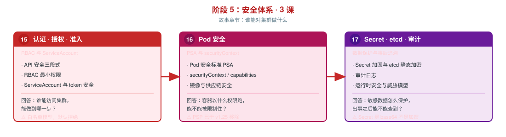

# 阶段 5：安全体系

> 所属课程：Kubernetes 系统学习 ｜ 故事章节：**谁能对集群做什么** ｜ 上一阶段：[阶段 4《配置 · 存储 · 资源 · 工程化》](../4-配置存储资源工程化/overview.md)

## 🎯 本阶段目标

- 建立 k8s 安全的完整骨架：**谁能访问 API**（认证授权）→ **容器以什么权限运行**（运行时）→ **出了事能不能查到**（审计追溯）
- 能配置最小权限 RBAC，理解 ServiceAccount 默认挂载 token 带来的提权风险
- 能用 Pod 安全标准（PSA）在命名空间层面强制基线，并用 securityContext 加固单个 Pod
- 理解 Secret 的正确加固路径，知道审计日志是事后追溯的唯一凭据

## 📍 学习重点

- **API 安全三段式**：认证（你是谁）→ 授权（你能做什么）→ 准入（这件事能不能这么干）。这三段是理解所有 k8s 安全机制的骨架
- **4C 是安全知识的挂衣钩**：Cloud / Cluster / Container / Code 四层，把本阶段看似零散的机制（RBAC 属 Cluster 层、PSA 与 securityContext 属 Container 层、镜像签名属 Code 层）串成一张图。课 15 开篇先立框架，学生才知道每个机制在防哪一层的攻击
- **RBAC 是白名单模型**：默认拒绝，只授予明确列出的权限。Role 与 ClusterRole 的区别不在「权限大小」而在「作用域」
- **ServiceAccount 的隐式风险**：Pod 默认挂载 SA token，一个只读应用可能因此获得集群操作权限 —— `automountServiceAccountToken: false` 是最容易被忽略的加固项
- **PSP 已被移除**：PodSecurityPolicy 于 v1.25 移除，替代品是 Pod Security Admission（PSA）。本机实测 v1.34 集群 PSA 可用
- **securityContext 决定容器的运行权限**：runAsNonRoot / readOnlyRootFilesystem / capabilities 是运行时加固的三件套
- **Secret 不是加密**：它防「误看」不防「被拿」。真正的加固靠 RBAC + etcd 静态加密 + 外部密钥管理三层叠加
- **审计日志是事后追溯的唯一凭据**：没有审计，入侵发生后就只能靠猜

## ✅ 必须掌握的知识点

| 知识点 | 所属课 | 学完应能 |
|--------|--------|----------|
| 云原生安全 4C 模型 | 课 15 | 说清 Cloud/Cluster/Container/Code 四层各自的安全边界，能把 RBAC、PSA、etcd 加密归位到对应层 |
| API 安全三段式 | 课 15 | 说清认证 / 授权 / 准入各自解决什么问题，以及三者的执行顺序 |
| RBAC | 课 15 | 配置最小权限 Role/ClusterRole 与绑定，能排查「权限不足」类报错 |
| ServiceAccount 与 token 安全 | 课 15 | 说清 SA 的作用与默认挂载风险，会关闭不必要的自动挂载 |
| Pod 安全标准 PSA | 课 16 | 用命名空间标签施加 privileged/baseline/restricted 三档，说清各档约束 |
| securityContext 与 capabilities | 课 16 | 配置 runAsNonRoot / readOnlyRootFilesystem / 丢弃 capabilities |
| 镜像与供应链安全 | 课 16 | 说清镜像来源、签名、漏洞扫描在供应链中的角色 |
| Secret 加固与 etcd 静态加密 | 课 17 | 配置 etcd 加密，说清 Secret 与专业密钥管理方案的边界 |
| 审计日志 | 课 17 | 配置审计策略，能回答「谁在什么时候删了这个资源」 |
| 运行时安全与威胁模型 | 课 17 | 识别常见攻击路径（容器逃逸 / 横向移动 / 提权），理解纵深防御 |

## 🗺️ 本阶段路径图

> SVG 展示三课递进：课 15（谁能访问）→ 课 16（以什么权限跑）→ 课 17（数据怎么保护、出事怎么查）。

## 本阶段产出

- [ ] `lessons/lesson-15-RBAC与ServiceAccount.md`
- [ ] `lessons/lesson-16-Pod安全PSA与securityContext.md`
- [ ] `lessons/lesson-17-Secret加固与etcd加密与审计.md`
