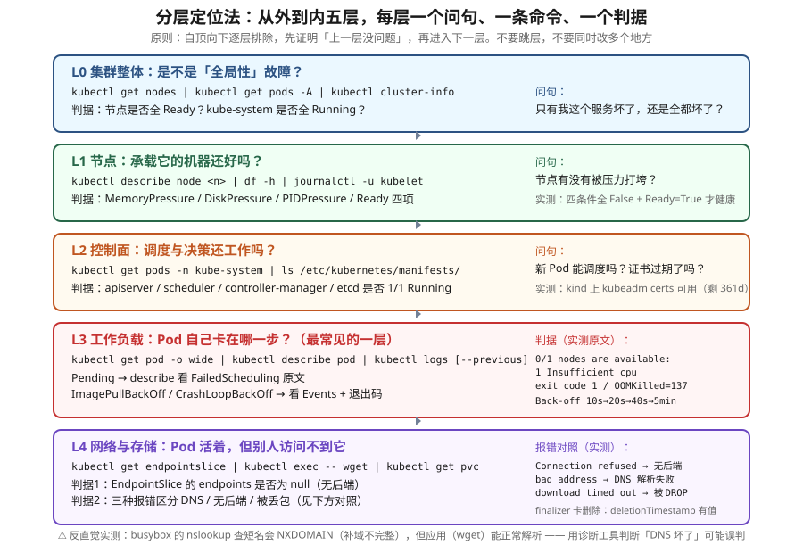

# 课 18：系统化排障：分层定位法

> 📍 所属阶段：阶段 6《排障 · 运维 · 扩展》（第 1 课）
> 📖 故事章节：**出事了怎么办** —— 从"到处乱看日志"到"按固定序列逐层排除"
> 🧭 上一阶段：[课 17：Secret 加固 · etcd 加密 · 审计](../../../stages/5-安全体系/lessons/lesson-17-Secret加固与etcd加密与审计.md) ｜ 下一课：课 19《集群运维与生命周期》
> ⚙️ 实操环境：WSL Ubuntu 24.04 · kind v1.34.0 · kubectl v1.34.0 · 容器运行时 containerd

## 🎯 本课目标

学完本课，你应当能够：

- 用**分层定位法**排障：集群 → 节点 → 控制面 → 工作负载 → 网络与存储，逐层排除而非乱看日志
- 定位**节点与控制面故障**：NotReady 的四项条件、静态 Pod、证书过期
- 定位**四类高频工作负载故障**：Pending / ImagePullBackOff / CrashLoopBackOff / 探针失败，能读懂 Events 原文
- 定位**网络故障**：EndpointSlice 无后端、三种"不通"报错的判别、finalizer 卡删除
- 建立**排障纪律**：一次只改一处、先取证后动手、读懂原文再下结论

---

## 第一幕：起源与场景引入 —— 凌晨两点，服务挂了

### 场景

凌晨两点，告警响了：`payment-service` 不可用。

你打开电脑，开始查：

```bash
kubectl get pods -A            # 一大堆输出，扫了一眼没看出问题
kubectl logs payment-xxx       # 空的
kubectl describe pod payment-xxx   # 一大段，往下滑了半天
kubectl get events              # 又是几百行
```

十分钟后你还是没头绪。**最后你发现——Pod 压根没起来，卡在 `ImagePullBackOff`，因为镜像 tag 打错了。**

**而这行信息，就在 `kubectl get pods` 的第一列里。**

### 问题出在哪

不是你不会用 `kubectl`，而是**你在"到处看"，而不是"按序列查"**。

**"到处看"的问题**：

- 没有顺序 → 容易跳过真正的关键层
- 信息过载 → 几百行 Events 里找不到那一行关键报错
- 没有判据 → 看到一段输出，不知道"这算正常还是异常"
- **先改后查** → 还没搞清原因就开始重启、删 Pod，破坏了现场

### 换个思路：分层定位

**k8s 是个分层系统，故障也必然落在某一层。** 排障的正确做法是——**从外到内，逐层证明"这一层没问题"，然后进入下一层**。

```
L0 集群整体  →  L1 节点  →  L2 控制面  →  L3 工作负载  →  L4 网络与存储
  是不是全局的？   机器还好吗？  决策还工作吗？  Pod 卡在哪？  别人访问得到吗？
```

**每一层只有一个问句、一条命令、一个判据。** 这就是本课要给你的东西。

### 本课的三个问题

| 问题 | 知识点 |
|---|---|
| 怎么组织排查顺序？ | **知识点 1**：排障方法论（分层定位） |
| 集群和节点本身坏了怎么查？ | **知识点 2**：集群与节点排障 |
| Pod 起不来 / 服务不通怎么查？ | **知识点 3**：工作负载与网络排障 |

> 💡 **一句话本质**（本课把什么从 A 变成 B）：
> 本课把排障**从"凭经验到处乱看、跳层误判"，变成"自顶向下逐层排除、每层只答一个问句"** —— 先证明上一层没问题，再进下一层。

> ⚖️ **处境对照**（不这么做 vs 这么做）：
>
> | | 不这么做（凭感觉乱查） | 这么做（分层逐层排除） |
> |---|---|---|
> | 从哪开始查 | 想到哪查到哪，**常常在错误的层深挖** | 固定从最上层开始，一层一层往下证否 |
> | 查到一半 | 容易"以为查到了" —— 其实查的是**另一个层**的症状 | 每层有固定命令 + 固定判据，过不了就是这层 |
> | 复现与交接 | 靠记忆，**换个人得重来一遍** | 有固定顺序，别人照着走就能到同一处 |
> | 花的时间 | 与运气强相关 —— 运气好很快，运气差**通宵** | 与层数线性相关，最坏情况也可预期 |
> | 新手能做吗 | 基本只能看着 | 照着顺序走也能定位到层 |
>
> ⏳ 说明：以上是**方法层面**对照（有没有固定顺序、会不会跳层、能否交接）。"能快多少"取决于故障类型与你的熟练度，此处不给具体倍数。

---

## 第二幕：认知冲突 —— 三个"以为查到了其实没查到"的时刻

### 冲突一：`kubectl delete` 返回成功，对象却还在

你删一个 ConfigMap：

```bash
$ kubectl delete configmap stuck2 -n ns-tr
configmap "stuck2" deleted        # ← 返回成功！

$ kubectl get configmap stuck2 -n ns-tr
stuck2   1     8s                 # ← 还在？！
```

**"deleted" 这个返回值具有欺骗性。** 它只表示"**删除请求被接受**"，不代表"对象已被删除"。

看真相：

```bash
$ kubectl get configmap stuck2 -n ns-tr -o jsonpath='{.metadata.deletionTimestamp}'
2026-09-14T02:30:04Z              # ← 有值 = 正在删除中
$ kubectl get configmap stuck2 -n ns-tr -o jsonpath='{.metadata.finalizers}'
["example.com/never-done"]        # ← 卡在这
```

**有个 finalizer 没人处理，对象就永远停在 Terminating。** 这是 `kubectl delete` 挂住、命名空间删不掉的最常见原因。

> 🔑 **教训**：**不要相信命令的"成功返回"，要看对象的实际状态。** `kubectl get` 才是事实。

### 冲突二：`nslookup` 说 DNS 坏了，但应用跑得好好的

这是本课最反直觉的一个实测。

我们去 Pod 里做官方推荐的 DNS 测试：

```bash
$ kubectl exec curl-test -- nslookup kubernetes.default
** server can't find kubernetes.default: NXDOMAIN        # ← 失败了！
```

**几乎所有排障指南都告诉你：这一条失败 = CoreDNS 挂了。** 你开始查 CoreDNS……

**等等，先试这个**：

```bash
$ kubectl exec curl-test -- wget -q -O- https://kubernetes.default
（正常返回内容）                                        # ← 应用能访问！
```

**DNS 根本没坏。** 我用 FQDN 再验证一次：

```bash
$ kubectl exec curl-test -- nslookup kubernetes.default.svc.cluster.local
Address: 10.96.0.1                # ← 能解析
```

**真相**：**busybox 的 `nslookup` 是独立实现的诊断工具，它不按 glibc 的方式补全 search 域。**

看它实际报的错：

```bash
$ kubectl exec curl-test -- nslookup web-svc
** server can't find web-svc.svc.cluster.local: NXDOMAIN
                        ↑ 补成了这个（缺了命名空间那一段）
```

它把 `web-svc` 补成了 `web-svc.svc.cluster.local`，而**正确的是 `web-svc.ns-tr.svc.cluster.local`**。

> 🔑 **这是极其重要的排障教训**：**诊断工具的行为 ≠ 应用的行为。**
>
> 应用走 glibc 解析器（会正确补全），`nslookup` 走自己的逻辑。**用 `nslookup` 的 NXDOMAIN 判定"DNS 坏了"，很可能是一次假警报。**
>
> **正确做法**：用**应用本身的方式**测试（如 `wget`/`curl`），或者用**完整 FQDN** 查 `nslookup`。

（本环境实测 3 次，结果稳定。）

### 冲突三：三种"访问不通"，报错完全不同

服务访问不通，你以为是"网络问题"。但实测发现——**三种不同的故障，报错完全不一样**：

```bash
# 1) Service 存在，但没有后端 Pod
$ kubectl exec curl-test -- wget -T 5 http://web-svc
wget: can't connect to remote host (10.96.197.211): Connection refused

# 2) Service 根本不存在
$ kubectl exec curl-test -- wget -T 5 http://no-such-svc
wget: bad address 'no-such-svc'

# 3) Service 存在，端口写错
$ kubectl exec curl-test -- wget -T 5 http://web-svc:9999
wget: download timed out
```

**三种报错，三个完全不同的根因**：

| 报错 | 含义 | 该查什么 |
|---|---|---|
| `Connection refused` | **DNS 通了，但没人在监听** | EndpointSlice 有没有后端 |
| `bad address` | **DNS 解析失败** | Service 名字/命名空间对不对 |
| `download timed out` | **包被丢了**（不是拒绝，是无响应） | NetworkPolicy / 防火墙 |

> ⚠️ **注意第 3 个**：我原本以为端口错会是 `Connection refused`，**实测是 `download timed out`**。原因：ClusterIP 的 iptables/IPVS 规则会"接住"这个包，但没有后端能响应，也没有 RST，于是超时。**"超时"和"拒绝"是两种完全不同的故障。**

**这就是"读懂原文再下结论"的价值**——光看报错，就能把范围缩小到具体一层。

---

## 第三幕：层层揭示

### 先看一眼全局（本课「一眼全局图」）



**看图指引**：从 L0 到 L4 **自上而下**，每层解决一个问句。**关键是"逐层排除"**——先证明上一层没问题，再进入下一层。右侧标注了本课的**实测判据原文**（如 `0/1 nodes are available: 1 Insufficient cpu`、`exit code 1`），这些是你在真实环境里会看到的东西。最底部是 nslookup 的反直觉实测。

### 本课地图（3 步）

| 步 | 这一步要解决什么 | 对应知识点 |
|---|---|---|
| 第 1 步 | 先给一套可复用的**排查顺序** —— 分几层、每层答什么 | 知识点 1：排障方法论（分层定位） |
| 第 2 步 | 再解决上面几层：集群和**机器本身**坏了怎么查 | 知识点 2：集群与节点排障 |
| 第 3 步 | 最后解决最常遇到的：Pod 起不来 / 服务不通 | 知识点 3：工作负载与网络排障 |

> 现在你在：**第 1 步**（刚看完全局图，接下来先建立那套排查顺序）。

---

### 知识点 1：排障方法论（分层定位）

> 🧭 第 1/3 步｜承接：第一幕留下的问题 —— "凌晨两点服务挂了，我该从哪看起？" → 本步：给出那套自顶向下的顺序，每层只答一个问句。

#### 一句话定义

分层定位法是一种**自顶向下、逐层排除**的排障方法：把 k8s 分成若干层，每层用固定的命令验证一个判据，**证明该层无问题后才进入下一层**，从而避免"到处乱看"和"跳层误判"。

#### 直觉建立（类比）

**分层定位 = 医生的分诊流程。**

病人说"肚子疼"，医生不会直接开刀，而是按顺序排除：

1. **生命体征**（血压、心跳）→ 对应 **L0 集群整体**：是不是全局性的？
2. **哪个部位**（按压定位）→ 对应 **L1 节点 / L2 控制面**：哪台机器、哪个组件？
3. **具体器官**（血检、影像）→ 对应 **L3 工作负载 / L4 网络**：哪个 Pod、哪条链路？

**没有医生会跳过生命体征直接做 CT**——因为如果第一步就发现是休克，后面的检查全是浪费。

**排障同理**：如果节点全 NotReady，你去查 Pod 日志毫无意义。

#### 核心原理：五层模型与判据

| 层 | 问句 | 核心命令 | 判据（正常应该是什么） |
|---|---|---|---|
| **L0 集群整体** | 只有我坏了，还是全坏了？ | `kubectl get nodes`、`kubectl get pods -A` | 节点全 `Ready`；kube-system 全 `Running` |
| **L1 节点** | 承载它的机器还好吗？ | `kubectl describe node <n>` | 四项压力 `False` + `Ready=True` |
| **L2 控制面** | 调度与决策还工作吗？ | `kubectl get pods -n kube-system` | apiserver/scheduler/cm/etcd 全 `1/1 Running` |
| **L3 工作负载** | Pod 卡在哪一步？ | `kubectl describe pod`、`kubectl logs` | 见下方四态判据 |
| **L4 网络与存储** | 别人访问得到它吗？ | `kubectl get endpointslice`、`kubectl exec -- wget` | EndpointSlice 有后端；能连通 |

#### 为什么"逐层"这么重要

**反例：跳层的代价。**

假设故障是**节点磁盘满了**（L1）。如果你直接跳到 L3 查 Pod 日志：

- 日志可能因为磁盘满而**写不进去** → 你看到的是空日志
- 你可能会判断"应用没输出" → 去查应用代码
- **真正的原因（L1 磁盘）被完全忽略**

**而如果先查 L1**：`kubectl describe node` 一眼看到 `DiskPressure=True`，**30 秒定位**。

#### 三条排障纪律（比命令更重要）

> 🔑 **纪律一：先取证，后动手。**
> 在搞清楚原因之前，**不要重启、不要删 Pod**。重启会**销毁现场**——CrashLoopBackOff 的容器一旦被删，`--previous` 日志就没了。

> 🔑 **纪律二：一次只改一处。**
> 同时改三处，即使修好了也不知道是哪处起的作用，下次还会再犯。**改一处，验证一次。**

> 🔑 **纪律三：读懂原文再下结论。**
> Events 里的报错原文是**唯一可信的证据**。不要看到 `Error` 就以为是一种问题——本课的三种网络报错就是反例。

#### 一条通用起手式

```bash
# 30 秒摸清全局
kubectl get nodes                     # L0
kubectl get pods -A | grep -v Running | grep -v Completed    # 所有不正常的 Pod
kubectl get events -A --sort-by=.lastTimestamp | tail -20    # 最近的事件
```

> 💡 **第二条很有用**：`grep -v Running` 过滤掉正常的，剩下的就是嫌疑对象。**在几百个 Pod 的集群里，这是最快的一步。**

#### 常见误区

> 🐞 **误区 1**："排障靠经验。"
> 经验决定你能多快猜到，但**分层决定你不会漏**。新手按分层也能查出来，老手不按分层也会卡住。

> 🐞 **误区 2**："直接看应用日志最快。"
> 应用日志是 **L3**，如果故障在 L1（节点）或 L4（网络），应用日志里**什么都没有**——甚至因为磁盘满或网络断，日志本身就是空的。

> 🐞 **误区 3**："先重启试试。"
> **这是最有害的习惯。** 重启会销毁 CrashLoopBackOff 的容器现场（`--previous` 日志随之消失），而且**重启本身会掩盖问题**——如果根因是资源不足，重启后暂时恢复，过一会儿又挂。

> 🐞 **误区 4**："`kubectl get events` 会告诉我一切。"
> Event **默认是临时的**（本集群实测有 `BackOff 5s (x16 over 4m11s)` 这样的聚合），**默认保留时间较短（通常约 1 小时）**，且**重启 apiserver 或节点后可能丢失**。**事发后要尽快取证。**

#### 一句话记住

**自顶向下逐层排除，先证明上一层没问题再进下一层；先取证后动手、一次只改一处、读懂原文再下结论。**

📚 官方文档：[排查应用](https://kubernetes.io/zh-cn/docs/tasks/debug/debug-application/) ｜ [集群故障排查](https://kubernetes.io/zh-cn/docs/tasks/debug/debug-cluster/)

---

### 知识点 2：集群与节点排障

> 🧭 第 2/3 步｜承接：上一步拿到顺序 —— 现在从**最上面几层**开始走：先确认是全局的还是局部的、机器本身还好吗、决策层还在工作吗 → 本步：逐层给出命令与判据。

#### 一句话定义

集群与节点排障处理的是**"承载应用的机器与控制面本身"**的故障：节点 NotReady、资源压力、控制面组件异常、证书过期等。

#### 直觉建立（类比）

**节点 = 房子，控制面 = 物业。**

- **L1 节点故障** = 房子本身出问题（漏水、断电、堆满杂物）
- **L2 控制面故障** = 物业出问题（没人派工、没人调度、登记簿[etcd]丢了）

**房子漏水，你换家具（重启 Pod）没用；物业瘫痪，你修自己家也没用**——新 Pod 根本调度不下去。

#### 核心原理一：节点的四项条件

```bash
$ kubectl get node k8s-c1-control-plane -o jsonpath='{range .status.conditions[*]}{.type}={.status} {end}'
```

**实测输出**：

```
MemoryPressure=False  DiskPressure=False  PIDPressure=False  Ready=True
```

**四项含义与排查方向**：

| 条件 | True 意味着 | 常见原因 | 排查 |
|---|---|---|---|
| **`MemoryPressure`** | 节点内存不足 | 有 Pod 内存泄漏 / limits 设太高 | `kubectl top node`、`kubectl top pod -A` |
| **`DiskPressure`** | 磁盘不足 | 镜像堆积、日志未轮转、emptyDir 写满 | `df -h`、清理未使用镜像 |
| **`PIDPressure`** | 进程数耗尽 | 有 Pod fork 炸弹 | 检查异常 Pod |
| **`Ready`** | 节点是否可调度 | kubelet 挂了 / 网络插件异常 / 上面三项任一为 True | `systemctl status kubelet` |

> 🔑 **关键判据**：**`Ready=True` 且另外三项全 `False`，节点才算健康。** 任一项为 True，kubelet 会开始驱逐 Pod。

**实测的健康节点完整信息**（`kubectl describe node`）：

```
Conditions:
  Type             Status  Reason                       Message
  MemoryPressure   False   KubeletHasSufficientMemory   kubelet has sufficient memory available
  DiskPressure     False   KubeletHasNoDiskPressure     kubelet has no disk pressure
  PIDPressure      False   KubeletHasSufficientPID      kubelet has sufficient PID available
  Ready            True    KubeletReady                 kubelet is posting ready status
```

#### 核心原理二：控制面在哪

**控制面组件是"静态 Pod"** —— 由 kubelet 直接读本地目录启动，**不经过 apiserver**：

```bash
$ ls /etc/kubernetes/manifests/
etcd.yaml  kube-apiserver.yaml  kube-controller-manager.yaml  kube-scheduler.yaml
```

**这意味着两件事**：

1. **改这些文件就会触发重启**（kubelet 监听目录变化）——课 17 讲开启静态加密就是这么做的
2. **当整个集群"连不上"时，这些文件依然存在**——你可以直接改它们来恢复

**它们也能用 kubectl 看到**：

```bash
$ kubectl get pods -n kube-system
etcd-k8s-c1-control-plane                      1/1   Running   0     3d23h
kube-apiserver-k8s-c1-control-plane            1/1   Running   0     3d23h
kube-controller-manager-k8s-c1-control-plane   1/1   Running   0     3d23h
kube-scheduler-k8s-c1-control-plane            1/1   Running   0     3d23h
```

> ⚠️ **`kubectl get componentstatuses` 已废弃**：本集群实测返回 `Warning: v1 ComponentStatus is deprecated in v1.19+`。**改用静态 Pod 检查。**

#### 核心原理三：证书过期

**证书过期是集群"突然全挂"的经典原因**，而且症状很有迷惑性——**所有命令都报 `Unable to connect to the server: x509: certificate has expired`**。

**检查方法**（kubeadm 集群，**本 kind 集群实测可用**）：

```bash
$ kubeadm certs check-expiration
CERTIFICATE                EXPIRES                  RESIDUAL TIME   CERTIFICATE AUTHORITY
admin.conf                 Sep 10, 2027 03:17 UTC   361d            ca
apiserver                  Sep 10, 2027 03:17 UTC   361d            ca
```

**也可以直接用 openssl 看单个证书**：

```bash
$ openssl x509 -in /etc/kubernetes/pki/apiserver.crt -noout -dates
notBefore=Sep 10 03:12:24 2026 GMT
notAfter=Sep 10 03:17:24 2027 GMT
```

> 🎯 **为什么值得单独记**：证书过期的**症状是"集群全挂"**，很容易被误判为"apiserver 崩溃"或"网络问题"。**第一条命令就该排除它。**

#### 核心原理四：kubelet 是第一现场

**kubelet 是节点上唯一真正在干活的组件** —— 拉镜像、起容器、跑探针、上报状态。**大部分"Pod 起不来"的真相都在 kubelet 日志里。**

```bash
# 服务状态（本 kind 集群实测：active）
systemctl is-active kubelet

# 日志（本 kind 环境实测可用 journalctl）
journalctl -u kubelet --no-pager -n 50
```

**实测抓到的 kubelet 日志原文**（非常有价值）：

```
E0914 02:28:39 pod_workers.go:1324] "Error syncing pod, skipping"
  err="failed to \"StartContainer\" for \"c\" with CrashLoopBackOff:
  \"back-off 1m20s restarting failed container=c pod=crash_ns-tr(...)\""
  pod="ns-tr/crash"

E0914 02:28:50 pod_workers.go:1324] "Error syncing pod, skipping"
  err="failed to \"StartContainer\" for \"c\" with ImagePullBackOff:
  \"Back-off pulling image \\\"busybox:NO_SUCH_TAG_999\\\": ErrImagePull:
  rpc error: code = NotFound ... not found\""
  pod="ns-tr/bad-image"
```

> 💡 **注意**：本环境**没有** `/var/log/kubelet.log`（实测 `No such file or directory`），**要用 `journalctl`**。不同环境路径不同，两个都试。

#### 常见误区

> 🐞 **误区 1**："节点 NotReady 就是节点宕机了。"
> 不一定。**资源压力（磁盘/内存/PID）也会导致 NotReady**，而机器可能还在正常运行。**看四项条件，不要只看 Ready。**

> 🐞 **误区 2**："控制面组件是普通 Pod，删掉会重建。"
> 它们是**静态 Pod**，由 kubelet 从 `/etc/kubernetes/manifests/` 启动。**删除会重建（kubelet 会重新拉起），但如果问题是清单文件本身写错了，重建多少次都是错的。**

> 🐞 **误区 3**："证书过期会提前告警。"
> **通常不会。** 往往是到期那一刻集群突然不可用。**要主动监控**（`kubeadm certs check-expiration` 或监控证书剩余天数）。

> 🐞 **误区 4**："kind 上没法练这些。"
> **本环境实测**：`systemctl is-active kubelet` 返回 `active`、`journalctl -u kubelet` 可用、`kubeadm certs check-expiration` 也可用。**kind 能练的比想象中多。**

#### 一句话记住

**节点看四项条件（三项压力 False + Ready True）；控制面是静态 Pod，改 manifests 即重启；证书过期会让集群"突然全挂"，第一条命令就该排除它；kubelet 日志是 Pod 起不来的第一现场。**

📚 官方文档：[节点健康检查](https://kubernetes.io/zh-cn/docs/concepts/architecture/nodes/) ｜ [使用 kubeadm 进行证书管理](https://kubernetes.io/zh-cn/docs/tasks/administer-cluster/kubeadm/kubeadm-certs/)

---

### 知识点 3：工作负载与网络排障

> 🧭 第 3/3 步｜承接：上一步排除了"机器和决策层"的问题 —— 那最常见的"Pod 起不来 / 服务不通"呢？ → 本步：走到最下面两层，并复现那个反直觉的 nslookup 实测。

#### 一句话定义

工作负载与网络排障定位的是**"Pod 起不来"和"起来了但访问不到"**两类故障，核心手段是读懂 **Events 原文**与 **EndpointSlice**，并用**报错差异**区分根因。

#### 直觉建立（类比）

**Pod 起不来 = 快递送不到。**

- **Pending** = 快递没派单（**没人接单/没有车** → 调度失败）
- **ImagePullBackOff** = 仓库里没这个货（**镜像不存在**）
- **CrashLoopBackOff** = 送到了但收件人拒收（**启动就退出**）
- **服务不通** = 送到了但门牌号错了（**selector 不匹配**）

**每种状态的"卡点"不同，查的地方也不同。**

#### 核心原理一：Pod 四态判据（全部本环境实测）

---

**① Pending —— 没被调度**

```bash
$ kubectl describe pod too-big -n ns-tr
Events:
  Warning  FailedScheduling  15s   default-scheduler
  0/1 nodes are available: 1 Insufficient cpu, 1 Insufficient memory.
  no new claims to deallocate, preemption: 0/1 nodes are available: 1 Preemption is not helpful for scheduling.
```

**另一种 Pending（约束不匹配）**：

```bash
  Warning  FailedScheduling  13s   default-scheduler
  0/1 nodes are available: 1 node(s) didn't match Pod's node affinity/selector.
```

**判据表**：

| Events 原文 | 根因 | 解决 |
|---|---|---|
| `Insufficient cpu / memory` | 资源不够 | 降低 requests / 加节点 |
| `didn't match Pod's node affinity/selector` | nodeSelector / 亲和性不匹配 | 检查标签 |
| `had untolerated taint` | 污点不容忍 | 加 toleration（课 13） |
| `persistentvolumeclaim not found` | PVC 未绑定 | 检查 PVC / StorageClass（课 12） |

---

**② ImagePullBackOff —— 镜像拉不到**

```bash
$ kubectl describe pod bad-image -n ns-tr
  Normal   Pulling    5s (x2 over 20s)   kubelet   Pulling image "busybox:NO_SUCH_TAG_999"
  Warning  Failed     3s (x2 over 18s)   kubelet   Failed to pull image "busybox:NO_SUCH_TAG_999":
    rpc error: code = NotFound desc = failed to pull and unpack image "docker.io/library/busybox:NO_SUCH_TAG_999":
    failed to resolve reference "docker.io/library/busybox:NO_SUCH_TAG_999":
    docker.io/library/busybox:NO_SUCH_TAG_999: not found
  Warning  Failed     17s (x15 over 4m11s)  kubelet   Error: ImagePullBackOff
```

**注意两个状态的区别**：

| 状态 | 含义 |
|---|---|
| `ErrImagePull` | **正在**尝试拉取且失败了（第一次/重试中） |
| `ImagePullBackOff` | 失败多次，**退避等待**后再试 |

**`ErrImagePull` → `ImagePullBackOff` 是"从失败到放弃挣扎"的过程。**

| Events 原文关键词 | 根因 |
|---|---|
| `not found` / `manifest unknown` | 镜像名或 tag 错了 |
| `unauthorized` / `authentication required` | 私有仓库没配 `imagePullSecrets` |
| `connection refused` / `i/o timeout` | 网络不通/被墙 |

---

**③ CrashLoopBackOff —— 启动就退出**

```bash
$ kubectl get pod crash -n ns-tr
crash   0/1   CrashLoopBackOff   5 (55s ago)   3m46s

$ kubectl get pod crash -n ns-tr -o jsonpath='{.status.containerStatuses[0].lastState.terminated.exitCode}'
1
```

**关键：退出码判据**

| 退出码 | 含义 | 方向 |
|---|---|---|
| **1** | 应用自己报错退出 | 看日志，查配置/代码 |
| **137** | `128+9` = **被 SIGKILL** | 通常是 **OOMKilled**（内存超限） |
| **143** | `128+15` = **被 SIGTERM** | 优雅终止/被驱逐 |
| **127** | 命令找不到 | `command` 写错 |

**看日志的正确姿势**：

```bash
kubectl logs crash -n ns-tr              # 当前这次
kubectl logs crash -n ns-tr --previous   # 上一次（关键证据！）
```

> ⚠️ **实测提醒：`--previous` 不是任何时候都能拿到。**
>
> 我追踪了 120 秒（每 10 秒一次），发现了**明确规律**：
>
> | Pod 状态（`state.waiting.reason`） | `--previous` |
> |---|---|
> | **空**（容器**正在重建**的瞬间） | ❌ **取不到** |
> | `CrashLoopBackOff`（退避等待中） | ✅ **稳定可取** |
>
> 实测记录：t=10s/20s/40s/90s 这几次状态为空时全部 FAIL（报 `unable to retrieve container logs for containerd://...`），而状态为 `CrashLoopBackOff` 的 t=30s/50s~80s/100s~120s **全部 OK**。
>
> **原因**：容器重建的窗口期内，**旧容器日志已被清理、新容器还没起来**，中间这段是空档。而 CrashLoopBackOff 是"退避等待"，容器已停止但日志还在。
>
> **对策（按优先级）**：
> 1. **等到状态显示 `CrashLoopBackOff` 再取**——这时最稳
> 2. 取不到就**隔几秒重试**（退避等待期很长，有的是机会）
> 3. 实在取不到，看**退出码**和 **Events**——信息在那里
>
> 💡 **还有个更稳的办法**：先看状态再决定要不要取——
> ```bash
> kubectl get pod <p> -o jsonpath='{.status.containerStatuses[0].state.waiting.reason}'
> # 输出 CrashLoopBackOff 时再取 --previous，成功率最高
> ```

**退避机制**（实测日志可见 `back-off 1m20s`）：重启间隔 **10s → 20s → 40s → 80s → 160s → 300s（封顶 5 分钟）**。**这意味着看到 CrashLoopBackOff 时，可能已经过了很久。**

---

**④ 探针失败 —— 活着但被判定为不健康**

```bash
$ kubectl describe pod bad-probe -n ns-tr
  Warning  Unhealthy  16s (x3 over 22s)  kubelet
    Liveness probe failed: Get "http://10.244.0.161:9999/healthz":
    dial tcp 10.244.0.161:9999: connect: connection refused
  Normal   Killing    16s                kubelet
    Container c failed liveness probe, will be restarted
```

**注意**：探针失败导致重启时，**应用本身可能是"健康"的**——只是探针配置错了（端口/路径/时间）。

> 💡 **经典陷阱**：应用启动慢，liveness 探针 `initialDelaySeconds` 太小 → **还没起来就被杀，永远起不来**。
> **解决**：用 **startupProbe**（启动探针）保护慢启动应用。

> 📌 **先说清楚：本课与课 7 的分工**
>
> 课 7《Service 与 CoreDNS》已经讲过 EndpointSlice，而且目标之一就写着"**会用它排障**"。那你可能会问：**这不重复了吗？**
>
> **不重复，两课的关注点不同**：
>
> | | 课 7（阶段 3） | 本课（阶段 6） |
> |---|---|---|
> | 视角 | **它是什么、怎么工作** | **出问题时怎么用它定位** |
> | EndpointSlice | 讲解它是"后端列表"的真相 | 把它当作**判据**：`endpoints: null` = 无后端 |
> | Service 不通 | 讲寻址原理 | 讲**三种报错的区分**（refused / bad address / timed out） |
>
> **简单说**：课 7 给你**工具**，本课给你**用工具的顺序和判读方法**。
>
> 另外本课特别补了课 7 未涉及的两点：**① v1 Endpoints 已在 v1.33+ 弃用**（实测 Warning 原文）；**② 诊断工具（nslookup）与应用的行为差异**。

#### 核心原理二：网络排障的两个判据

---

**判据 1：EndpointSlice 有没有后端（大纲要求）**

Service 选不到 Pod，是"服务不通"最常见的原因。

```bash
$ kubectl get endpoints web-svc -n ns-tr
web-svc   <none>   4s              # ← 空！

$ kubectl get endpointslice -n ns-tr -l kubernetes.io/service-name=web-svc -o yaml
  endpoints: null                   # ← 无后端
```

**根因**：Service 的 `selector` 与 Pod 的 `labels` 不匹配（本例故意写错成 `app: web-WRONG`）。

> ⚠️ **API 变化**：`kubectl get endpoints`（v1 Endpoints）**在 v1.33+ 已弃用**，本环境实测有警告：
> `Warning: v1 Endpoints is deprecated in v1.33+; use discovery.k8s.io/v1 EndpointSlice`
>
> **新命令**：`kubectl get endpointslice`。

**排查链路**：

```
Service 不通
   ↓
kubectl get endpointslice → endpoints 是否为空？
   ↓ 空
对比：kubectl get pod --show-labels   vs   kubectl get svc -o jsonpath='{.spec.selector}'
   ↓
标签不一致 → 改 selector 或改 Pod 标签
```

> 💡 **一个易忽略的点**：**Pod 必须 Ready 才会进 EndpointSlice。** 如果 readiness 探针失败，Pod 是 Running 但**不在后端列表里**——这时 EndpointSlice 空，但 Pod 看起来"活着"。

---

**判据 2：三种报错区分根因（本课实测）**

| 报错 | 含义 | 该查什么 |
|---|---|---|
| `Connection refused` | **DNS 通了，但没人在监听** | EndpointSlice 有无后端 |
| `bad address` | **DNS 解析失败** | Service 名/命名空间对不对、CoreDNS |
| `download timed out` | **包被丢弃（无响应）** | NetworkPolicy、防火墙（课 10） |

---

**判据 3：finalizer 卡删除（大纲要求）**

```bash
$ kubectl delete configmap stuck2 -n ns-tr
configmap "stuck2" deleted          # ← 假成功

$ kubectl get configmap stuck2 -n ns-tr -o jsonpath='{.metadata.deletionTimestamp}'
2026-09-14T02:30:04Z                 # ← 有值 = 卡在删除中
$ kubectl get configmap stuck2 -n ns-tr -o jsonpath='{.metadata.finalizers}'
["example.com/never-done"]           # ← 元凶
```

**修复**（**唯一的正确做法**）：

```bash
kubectl patch configmap stuck2 -n ns-tr --type=json \
  -p='[{"op":"remove","path":"/metadata/finalizers"}]'
# 移除后立刻真正删除
```

> ⚠️ **不要用 `--force --grace-period=0` 乱来**：那会**跳过清理逻辑**，可能留下孤儿资源（如已分配的 PV、云厂商的负载均衡器）。
> **正确顺序**：先搞清楚**是谁加的 finalizer、为什么没被处理**，再决定是修复控制器还是移除 finalizer。

#### 完整判据速查

| 现象 | 第一条命令 | 关键判据 |
|---|---|---|
| Pod Pending | `kubectl describe pod` | `FailedScheduling` 后跟的原因原文 |
| ImagePullBackOff | `kubectl describe pod` | `not found` / `unauthorized` / `timeout` |
| CrashLoopBackOff | `kubectl logs --previous` | 退出码（1 / 137 / 143 / 127） |
| 探针失败重启 | `kubectl describe pod` | `Liveness probe failed: Get ...` |
| 服务不通 | `kubectl get endpointslice` | `endpoints: null` |
| 删除卡住 | `kubectl get <obj> -o jsonpath='{.metadata.deletionTimestamp}'` | 有值 + finalizers 非空 |
| 节点异常 | `kubectl describe node` | 四项条件 |
| 集群全挂 | `kubeadm certs check-expiration` | 是否 expired |

#### 常见误区

> 🐞 **误区 1**："CrashLoopBackOff 就是应用崩了。"
> 也可能是**探针配置错误**（应用没崩，是被 kubelet 杀了）。**看 Events：是 `probe failed` 还是 `Error`。**

> 🐞 **误区 2**："Pod Running 就等于服务正常。"
> 不一定。**readiness 探针失败 → Pod Running 但不在 EndpointSlice 里 → 服务依然不通。**

> 🐞 **误区 3**："删不掉就 `--force`。"
> 强制删除会**跳过 finalizer 的清理逻辑**，可能留下孤儿资源。**先查 finalizer，理解它为什么没被处理。**

> 🐞 **误区 4**："DNS 不通就是 CoreDNS 挂了。"
> 先确认**是不是诊断工具的问题**（见冲突二），再查 CoreDNS。另外——**NetworkPolicy 忘记放行 UDP/53 也是常见原因**（课 10）。

> 🐞 **误区 5**："Service 不通就是网络问题。"
> 最常见的原因其实是 **selector 标签不匹配**（EndpointSlice 为空），**跟网络一点关系都没有**。

#### 一句话记住

**Pending 看 FailedScheduling 原文、拉不到镜像看 not found/unauthorized、CrashLoop 看退出码（137=OOM）、服务不通先看 EndpointSlice 有没有后端；三种报错（refused/bad address/timed out）分别指向无后端/DNS失败/被丢弃。**

📚 官方文档：[调试 Pod](https://kubernetes.io/zh-cn/docs/tasks/debug/debug-application/debug-pods/) ｜ [调试 Service](https://kubernetes.io/zh-cn/docs/tasks/debug/debug-application/debug-services/)

---

## 第四幕：实操验证

> 环境准备：本课所有故障都在独立命名空间 `ns-tr` 里制造，最后统一清理。

```bash
kubectl create ns ns-tr
kubectl config set-context --current --namespace=ns-tr
```

### 验证 1：分层定位起手式（30 秒摸清全局）

```bash
kubectl get nodes
# 期望：k8s-c1-control-plane   Ready   control-plane   ...   v1.34.0

kubectl get pods -A | grep -v Running | grep -v Completed
# 期望：只列出不正常的 Pod（无输出 = 全正常）

kubectl get events -A --sort-by=.lastTimestamp | tail -20
# 期望：按时间倒序的最近 20 条事件
```

### 验证 2：节点四项条件（L1）

```bash
kubectl get node k8s-c1-control-plane -o jsonpath='{range .status.conditions[*]}{.type}={.status} {end}'
# 期望：MemoryPressure=False  DiskPressure=False  PIDPressure=False  Ready=True

kubectl describe node k8s-c1-control-plane | grep -A12 "^Conditions:"
# 期望：四行，含 KubeletHasSufficientMemory / KubeletHasNoDiskPressure 等 Reason
```

### 验证 3：控制面静态 Pod（L2）

```bash
kubectl get pods -n kube-system --no-headers | grep -E "apiserver|controller-manager|scheduler|etcd"
# 期望：四个都是 1/1  Running

docker exec k8s-c1-control-plane sh -c 'ls /etc/kubernetes/manifests/'
# 期望：etcd.yaml  kube-apiserver.yaml  kube-controller-manager.yaml  kube-scheduler.yaml
```

### 验证 4：证书有效期（L2）

```bash
docker exec k8s-c1-control-plane sh -c 'kubeadm certs check-expiration 2>&1 | head -8'
# 期望：列出各证书 EXPIRES 与 RESIDUAL TIME（本环境实测剩 361d）

docker exec k8s-c1-control-plane sh -c 'openssl x509 -in /etc/kubernetes/pki/apiserver.crt -noout -dates'
# 期望：notBefore / notAfter 两行
```

### 验证 5：kubelet 是第一现场（L2/L3 交界）

```bash
docker exec k8s-c1-control-plane sh -c 'systemctl is-active kubelet'
# 期望：active

docker exec k8s-c1-control-plane sh -c 'journalctl -u kubelet --no-pager -n 3'
# 期望：看到 Error syncing pod / CrashLoopBackOff / ImagePullBackOff 等原文
```

### 验证 6：制造 Pending，读 FailedScheduling 原文

```bash
cat <<'EOF' | kubectl apply -f -
apiVersion: v1
kind: Pod
metadata: {name: too-big, namespace: ns-tr}
spec:
  containers:
  - name: c
    image: busybox:1.36
    command: ["sleep","3600"]
    resources:
      requests: {cpu: "999", memory: "9999Gi"}
EOF
sleep 15
kubectl describe pod too-big -n ns-tr | grep -i "FailedScheduling" -A2
# 期望：0/1 nodes are available: 1 Insufficient cpu, 1 Insufficient memory
```

### 验证 7：制造 ImagePullBackOff，读 Events 原文

```bash
cat <<'EOF' | kubectl apply -f -
apiVersion: v1
kind: Pod
metadata: {name: bad-image, namespace: ns-tr}
spec:
  containers: [{name: c, image: busybox:NO_SUCH_TAG_999}]
EOF
sleep 20
kubectl get pod bad-image -n ns-tr --no-headers
# 期望：0/1   ImagePullBackOff

kubectl describe pod bad-image -n ns-tr | grep -i "Failed to pull" -A1
# 期望：... not found
```

### 验证 8：制造 CrashLoopBackOff，看退出码与 --previous

```bash
cat <<'EOF' | kubectl apply -f -
apiVersion: v1
kind: Pod
metadata: {name: crash, namespace: ns-tr}
spec:
  containers:
  - name: c
    image: busybox:1.36
    command: ["sh","-c","echo 启动失败：配置缺失; exit 1"]
EOF
sleep 45
kubectl get pod crash -n ns-tr -o jsonpath='{.status.containerStatuses[0].lastState.terminated.exitCode}'
# 期望：1

# ⚠️ 先看状态：是 CrashLoopBackOff（退避等待）时取 --previous 最稳
kubectl get pod crash -n ns-tr -o jsonpath='{.status.containerStatuses[0].state.waiting.reason}'
# 期望：CrashLoopBackOff

kubectl logs crash -n ns-tr --previous
# 期望：启动失败：配置缺失
# ⚠️ 若报 unable to retrieve container logs → 说明容器正在重建（state 为空），
#    等状态变回 CrashLoopBackOff 再取（实测规律见知识点三）
```

### 验证 9：探针失败导致重启

```bash
cat <<'EOF' | kubectl apply -f -
apiVersion: v1
kind: Pod
metadata: {name: bad-probe, namespace: ns-tr}
spec:
  containers:
  - name: c
    image: busybox:1.36
    command: ["sleep","3600"]
    livenessProbe:
      httpGet: {path: /healthz, port: 9999}
      initialDelaySeconds: 3
      periodSeconds: 3
EOF
sleep 25
kubectl describe pod bad-probe -n ns-tr | grep -i "Liveness probe failed" -A1
# 期望：Liveness probe failed: Get "http://...:9999/healthz": dial tcp ...: connect: connection refused
```

### 验证 10：EndpointSlice 无后端（判据 1）

```bash
cat <<'EOF' | kubectl apply -f -
apiVersion: v1
kind: Pod
metadata: {name: web, namespace: ns-tr, labels: {app: web-real}}
spec:
  containers:
  - name: c
    image: busybox:1.36
    command: ["sh","-c","echo hello > /tmp/index.html; httpd -f -p 8080 -h /tmp"]
    ports: [{containerPort: 8080}]
---
apiVersion: v1
kind: Service
metadata: {name: web-svc, namespace: ns-tr}
spec:
  selector: {app: web-WRONG}          # ← 故意与 Pod 标签不一致
  ports: [{port: 80, targetPort: 8080}]
EOF
kubectl wait --for=condition=Ready pod/web -n ns-tr --timeout=180s
kubectl get endpointslice -n ns-tr -l kubernetes.io/service-name=web-svc -o yaml | grep "endpoints:"
# 期望：endpoints: null        ← 无后端
```

### 验证 11：三种"不通"的报错对比（判据 2）

```bash
kubectl run curl-test -n ns-tr --image=busybox:1.36 --restart=Never --command -- sleep 300
kubectl wait --for=condition=Ready pod/curl-test -n ns-tr --timeout=180s

kubectl exec curl-test -n ns-tr -- wget -q -O- -T 5 http://web-svc
# 期望：can't connect to remote host (...): Connection refused        ← 无后端

kubectl exec curl-test -n ns-tr -- wget -q -O- -T 5 http://no-such-svc
# 期望：bad address 'no-such-svc'                                     ← DNS 失败

kubectl exec curl-test -n ns-tr -- wget -q -O- -T 5 http://web-svc:9999
# 期望：download timed out                                            ← 被丢弃
```

### 验证 12：nslookup 的假警报（反直觉）

```bash
kubectl exec curl-test -n ns-tr -- nslookup kubernetes.default
# 期望：** server can't find kubernetes.default: NXDOMAIN        ← 假警报！

kubectl exec curl-test -n ns-tr -- nslookup kubernetes.default.svc.cluster.local
# 期望：Address: 10.96.0.1                                      ← 用 FQDN 就正常

kubectl exec curl-test -n ns-tr -- wget -q -O- -T 5 https://kubernetes.default
# 期望：能返回内容（应用走 glibc，解析正常）                      ← 证明 DNS 没坏
```

### 验证 13：finalizer 卡删除与修复（判据 3）

```bash
cat <<'EOF' | kubectl apply -f -
apiVersion: v1
kind: ConfigMap
metadata: {name: stuck2, namespace: ns-tr, finalizers: ["example.com/never-done"]}
data: {k: v}
EOF
kubectl delete configmap stuck2 -n ns-tr --timeout=8s
# 期望：返回 "deleted"（假成功），或超时

kubectl get configmap stuck2 -n ns-tr -o jsonpath='{.metadata.deletionTimestamp}'; echo
# 期望：有时间戳 = 卡在删除中
kubectl get configmap stuck2 -n ns-tr -o jsonpath='{.metadata.finalizers}'; echo
# 期望：["example.com/never-done"]

kubectl patch configmap stuck2 -n ns-tr --type=json -p='[{"op":"remove","path":"/metadata/finalizers"}]'
kubectl get configmap stuck2 -n ns-tr
# 期望：Error from server (NotFound)            ← 已真正删除
```

### 验证 14：完整清理（务必执行）

```bash
kubectl delete ns ns-tr --timeout=180s
kubectl config set-context --current --namespace=default
kubectl get ns | grep ns-tr || echo "  无残留"
```

---

### 4.2 应用实战：应用明明在跑，服务为什么不通（入口）

> 🎯 **本课应用实战独立成篇**（配套实战册）：[第 18 课实战 · 应用明明在跑，服务为什么不通](../../../应用实战/18-应用起不来怎么排查.md)
> 含**分步设计图**（每步一张：这一版长什么样、比上一版改了什么）与"基础 → 综合"的完整演进与代码；通览全部：📚 [应用实战索引](../../../应用实战/INDEX.md)

---

## 第五幕：体系收束

### 本课知识地图

```
            排障 = 分层定位 + 三条纪律
                      │
    ┌─────────┬───────┼───────┬──────────┐
    ▼         ▼       ▼       ▼          ▼
   L0 集群   L1 节点  L2 控制面 L3 负载   L4 网络
  get nodes  四项条件  静态Pod  四态判据  EndpointSlice
  get pods-A 压力/Ready 证书过期 退出码   三种报错
                                        finalizer
    └─────────┴───────┴───────┴──────────┘
                      ▼
    纪律：先取证 / 一次只改一处 / 读懂原文
```

### 与前面各课的连接

**排障不是新知识，是把前面 17 课串起来的"使用方式"**：

| 排障场景 | 用到的课 |
|---|---|
| Pending：资源不够 / 污点不容忍 | **课 13**（requests、污点容忍） |
| Pending：PVC 未绑定 | **课 12**（PV/PVC/StorageClass） |
| 配置没生效 | **课 11**（ConfigMap 环境变量永不更新） |
| 服务不通 / selector 不匹配 | **课 7**（Service 与标签）、**课 10**（NetworkPolicy） |
| 镜像拉不到 | **课 16**（镜像与供应链、私有仓库凭据） |
| 权限相关报错 | **课 15**（RBAC） |
| "谁在什么时候改了什么" | **课 17**（审计日志） |

> 🎯 **这才是排障课真正的价值**：**k8s 的报错几乎从来不是"新知识"，而是某个你学过的东西没配对。** 分层定位法的作用，就是帮你**快速定位到"是哪个学过的东西出了岔子"**。

### 两条暗线

**暗线一：k8s 的报错是非常具体的。**

这可能是本课最实用的一条体感。看这些**实测原文**：

- `0/1 nodes are available: 1 Insufficient cpu` —— 明确告诉你"CPU 不够"
- `failed to resolve reference ... not found` —— 明确告诉你"镜像不存在"
- `Liveness probe failed: Get "http://...:9999/healthz": dial tcp ... connection refused` —— 连"哪个 URL、什么错误"都写了
- `back-off 1m20s restarting failed container=c` —— 连退避时长都告诉你了

**k8s 很少"含糊地失败"。** 绝大多数时候，**答案就在 Events 原文里**。

> 这条暗线与课 16、17 一脉相承：**"看得到"是"守得住"的前提**（课 17 已总结）。排障课上，它变成了——**"读得懂原文"是"修得好"的前提**。

**暗线二：工具会骗人，状态才是事实。**

本课出现了**两次**这个模式：

| 工具说 | 事实 |
|---|---|
| `kubectl delete` 返回 `deleted` | 对象还卡在 Terminating（finalizer） |
| `nslookup` 返回 `NXDOMAIN` | DNS 好好的，应用能正常解析 |

**共同点**：**工具的"返回值"和"系统的实际状态"是两回事。**

**对策也一致**：**用 `kubectl get ... -o jsonpath` 直接读状态字段**，而不是依赖命令的返回信息。这也是本课反复用 `-o jsonpath` 的原因。

### 你现在会了什么

- ✅ 用**五层模型**组织排查：集群 → 节点 → 控制面 → 工作负载 → 网络
- ✅ 遵守**三条排障纪律**：先取证后动手、一次只改一处、读懂原文
- ✅ 用**四项条件**判断节点健康（三项压力 False + Ready True）
- ✅ 知道控制面是**静态 Pod**，改 `/etc/kubernetes/manifests/` 即重启
- ✅ 用 `kubeadm certs check-expiration` / `openssl` 排查**证书过期**
- ✅ 知道 **kubelet 日志**是"Pod 起不来"的第一现场（`journalctl -u kubelet`）
- ✅ 读懂 **Pending** 的 `FailedScheduling` 原文（资源/选择器/污点/PVC）
- ✅ 区分 `ErrImagePull` 与 `ImagePullBackOff`，按 `not found`/`unauthorized`/`timeout` 分诊
- ✅ 用**退出码**诊断 CrashLoopBackOff（**1=应用错误、137=OOM、143=SIGTERM、127=命令找不到**）
- ✅ 知道 `--previous` **可能一次取不到，要重试**
- ✅ 用 **EndpointSlice** 判断 Service 有无后端（v1 Endpoints 已弃用）
- ✅ 用**三种报错**区分根因：`refused`=无后端 / `bad address`=DNS / `timed out`=被丢
- ✅ 用 `deletionTimestamp` + `finalizers` 诊断**删除卡住**并正确修复
- ✅ 知道 **`nslookup` 的 NXDOMAIN 可能是假警报**

### 下一步：课 19

课 19《集群运维与生命周期》从"**出事了怎么查**"转向"**怎么主动维护**"：

- **节点维护三件套**：cordon（标记不可调度）/ drain（驱逐 Pod）/ **PDB**（保证驱逐期间服务不中断）
- **为什么 drain 必须配 PDB**：没有 PDB，一次 drain 可能把某服务的**全部副本**同时驱逐掉
- 以及 kubeadm 搭建、升级、etcd 备份恢复、HA 控制平面（**这几项在 kind 上无法真实操，作原理课处理**）

**一句话过渡**：**课 18 是"被动响应"（出事了怎么办），课 19 是"主动维护"（怎么让它别出事）。**

---

## 📋 命令速查卡

| 我想… | 命令 |
|---|---|
| **30 秒摸清全局** | `kubectl get nodes` + `kubectl get pods -A \| grep -v Running` |
| 看节点四项条件 | `kubectl get node <n> -o jsonpath='{range .status.conditions[*]}{.type}={.status} {end}'` |
| 看控制面组件 | `kubectl get pods -n kube-system \| grep -E "apiserver\|scheduler\|etcd"` |
| 查证书过期 | `kubeadm certs check-expiration` 或 `openssl x509 -in <crt> -noout -dates` |
| 看 kubelet 日志 | `journalctl -u kubelet --no-pager -n 50` |
| Pod 为什么 Pending | `kubectl describe pod <p> \| grep FailedScheduling -A2` |
| 看退出码 | `kubectl get pod <p> -o jsonpath='{.status.containerStatuses[0].lastState.terminated.exitCode}'` |
| 上一次的日志 | 先看 `state.waiting.reason` 为 `CrashLoopBackOff` 再 `kubectl logs <p> --previous` |
| Service 有没有后端 | `kubectl get endpointslice -l kubernetes.io/service-name=<svc>` |
| 从 Pod 内测连通 | `kubectl exec <p> -- wget -q -O- -T 5 http://<svc>` |
| 查删除卡住 | `kubectl get <obj> -o jsonpath='{.metadata.deletionTimestamp}'` |
| 移除 finalizer | `kubectl patch <obj> --type=json -p='[{"op":"remove","path":"/metadata/finalizers"}]'` |
| 最近事件 | `kubectl get events -A --sort-by=.lastTimestamp \| tail -20` |

---

## 🐞 误区清单（本课全部）

| # | 误区 | 正解 |
|---|---|---|
| 1 | 排障靠经验 | 经验决定快慢，**分层决定不漏** |
| 2 | 直接看应用日志最快 | 故障在 L1/L4 时日志是空的 |
| 3 | 先重启试试 | **最有害**：销毁 CrashLoop 现场，掩盖根因 |
| 4 | `kubectl get events` 会告诉我一切 | Event 是**临时的**（默认约 1 小时），事发后要尽快取证 |
| 5 | 节点 NotReady = 宕机 | 也可能是**资源压力**（看四项条件） |
| 6 | 控制面组件是普通 Pod | 是**静态 Pod**，由 kubelet 从 manifests 目录启动 |
| 7 | 证书过期会提前告警 | **通常不会**，到期那一刻集群突然全挂 |
| 8 | kind 上练不了节点排障 | 实测 `systemctl`/`journalctl`/`kubeadm certs` **都可用** |
| 9 | CrashLoopBackOff 就是应用崩了 | 也可能是**探针配置错误**（应用没崩，被 kubelet 杀了） |
| 10 | Pod Running = 服务正常 | readiness 失败 → 不在 EndpointSlice → **服务仍不通** |
| 11 | 删不掉就 `--force` | 会跳过 finalizer 清理，留下孤儿资源 |
| 12 | DNS 不通就是 CoreDNS 挂了 | 先排除**诊断工具问题**，再看 NetworkPolicy 是否放行 UDP/53 |
| 13 | Service 不通就是网络问题 | 最常见是 **selector 标签不匹配**（跟网络无关） |
| 14 | `--previous` 一定能拿到日志 | **不一定**：容器**正在重建**（state 为空）时取不到，`CrashLoopBackOff` 退避等待时才稳 |
| 15 | `nslookup kubernetes.default` 失败 = DNS 坏了 | **假警报**（busybox nslookup 补域不完整），应用可能好好的 |
| 16 | 端口写错会 `Connection refused` | 实测是 **`download timed out`**（被 iptables 接住后无响应） |

---

## 🔍 事实核查记录

| 结论 | 来源 | 核查状态 |
|---|---|---|
| **Pending 资源不足原文** `0/1 nodes are available: 1 Insufficient cpu` | **本机实测** | ✅ 已实测 |
| **Pending 选择器不匹配原文** `didn't match Pod's node affinity/selector` | **本机实测** | ✅ 已实测 |
| **ImagePullBackOff 原文** `failed to resolve reference ... not found` | **本机实测** | ✅ 已实测 |
| `ErrImagePull` → `ImagePullBackOff` 两阶段 | **本机实测**（Events 中先后出现） | ✅ 已实测 |
| **CrashLoopBackOff 退出码 1**，退避 `1m20s` | **本机实测** | ✅ 已实测 |
| **`--previous` 的可用规律**：state=空（重建中）取不到；state=CrashLoopBackOff（退避等待）稳定可取 | **本机实测**（120 秒内每 10 秒采样，12 次全部符合该规律） | ✅ 已实测 |
| **探针失败原文** `Liveness probe failed: Get ... connection refused` | **本机实测** | ✅ 已实测 |
| **EndpointSlice `endpoints: null`**（Service 无后端） | **本机实测** | ✅ 已实测 |
| **三种报错**：`Connection refused` / `bad address` / `download timed out` | **本机实测** | ✅ 已实测 |
| **`nslookup` 短名 NXDOMAIN 但应用能解析** | **本机实测**（3 次稳定复现 + wget 对照） | ✅ 已实测 |
| **finalizer 卡删除**：`deleted` 假成功 + `deletionTimestamp` 有值 + patch 移除后真删 | **本机实测**（完整闭环） | ✅ 已实测 |
| **节点四项条件** 全 False + Ready=True | **本机实测** | ✅ 已实测 |
| **控制面 4 个静态 Pod** 全 1/1 Running；manifests 目录 4 个 yaml | **本机实测** | ✅ 已实测 |
| **证书** apiserver 至 2027-09-10；kubeadm check-expiration 剩 361d | **本机实测** | ✅ 已实测 |
| **kubelet** `systemctl is-active`=active；`journalctl -u kubelet` 可用；**无** `/var/log/kubelet.log` | **本机实测** | ✅ 已实测 |
| **`kubectl get componentstatuses` 已废弃**（v1.19+） | **本机实测**（Warning 原文） | ✅ 已实测 |
| **v1 Endpoints 已弃用**（v1.33+，应用 EndpointSlice） | **本机实测**（Warning 原文） | ✅ 已实测 |
| 崩溃退避序列 10s→20s→40s→…→300s 封顶 | 官方文档 + 实测日志 `back-off 1m20s` 印证 | ✅ 文档+实测 |
| 退出码 137=OOMKilled、143=SIGTERM | 官方文档 / 社区共识 | 📄 文档结论（本机实测 exitCode=1） |
| **Event 默认保留时间较短**（约 1 小时） | 社区资料 + 实测 apiserver 未显式配置（用默认） | 📄 文档结论 |
| `ndots:5` 导致外部域名多次无效查询（性能问题） | 官方文档 / 多篇实践 | 📄 文档结论（本课 nslookup 现象**已实测**） |
| **busybox nslookup 不做完整 search 域补全** | **本机实测**（报 `web-svc.svc.cluster.local` 而非 `web-svc.ns-tr.svc.cluster.local`） | ✅ 已实测 |
| Pod 必须 Ready 才进 EndpointSlice | 官方文档 | 📄 文档结论 |
| 强制删除会跳过 finalizer 清理逻辑 | 官方文档警告 | 📄 文档结论 |
| startupProbe 用于保护慢启动应用 | 官方文档 | 📄 文档结论 |

> ⚠️ **两处如实说明**：
>
> 1. **退出码 137（OOMKilled）本环境未实测**——本课只实测了退出码 1（应用主动 `exit 1`）。137/143/127 的含义来自文档与社区共识，**未经本机验证**。讲义中已按文档结论列出，供你对照。
> 2. **`nslookup` 的 NXDOMAIN 现象在本环境（busybox 1.36）稳定复现 3 次**，但这是**工具实现的行为**，不同镜像（如 `nicolaka/netshoot` 的 `dig`）表现可能不同。**结论的普适版本是"诊断工具与应用可能表现不一致"，而非"nslookup 一定不准"。**

---

## 📚 官方文档

- [排查应用](https://kubernetes.io/zh-cn/docs/tasks/debug/debug-application/) —— 排障总入口
- [调试 Pod](https://kubernetes.io/zh-cn/docs/tasks/debug/debug-application/debug-pods/)
- [调试 Service](https://kubernetes.io/zh-cn/docs/tasks/debug/debug-application/debug-services/)
- [集群故障排查](https://kubernetes.io/zh-cn/docs/tasks/debug/debug-cluster/)
- [使用 kubeadm 进行证书管理](https://kubernetes.io/zh-cn/docs/tasks/administer-cluster/kubeadm/kubeadm-certs/)
- [Pod 的生命周期与容器状态](https://kubernetes.io/zh-cn/docs/concepts/workloads/pods/pod-lifecycle/)

---

## 🚀 下一批接力提示词

> 学完本课后，**复制下面这段文字发给 AI**，即可无缝进入下一课：

```
继续学 Kubernetes。我的学习档案在 k8s/00-学习档案.md，
刚完成阶段 6《排障 · 运维 · 扩展》课 18《系统化排障：分层定位法》
（分层定位五层模型、节点四项条件、控制面静态 Pod、Pod 四态判据、
EndpointSlice 与三种网络报错、finalizer 卡删除）。
请按大纲开始课 19《集群运维与生命周期》：
节点维护（cordon / drain / PDB）、节点关闭处理、kubeadm 搭建、
升级与 etcd 备份恢复、HA 控制平面。
```

---

## 🧭 课程导航

- ⬅️ 上一课：[课 17：Secret 加固 · etcd 加密 · 审计](../../../stages/5-安全体系/lessons/lesson-17-Secret加固与etcd加密与审计.md)
- ➡️ 下一课：课 19：集群运维与生命周期（待编写）
- 🏠 返回：[课程目录](../../../02-课程目录.md) ｜ [阶段 6 概览](../overview.md)
