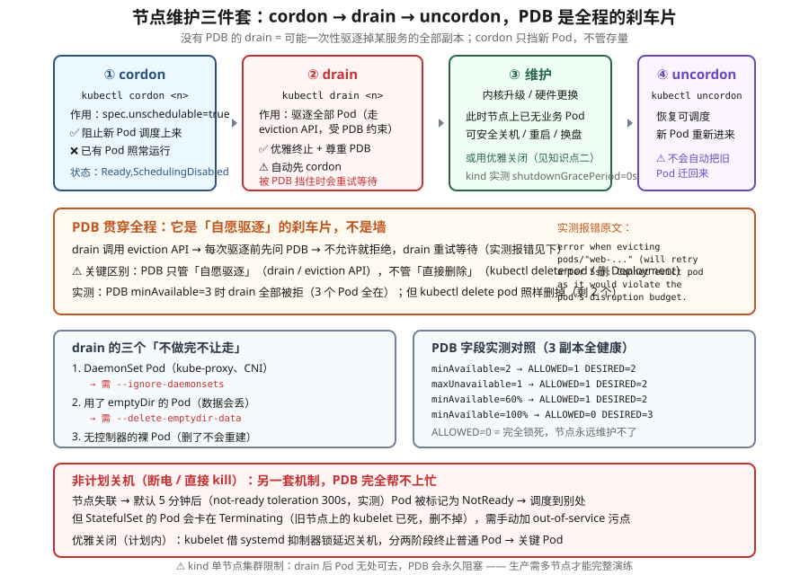

# 课 19：集群运维与生命周期

> 📍 所属阶段：阶段 6《排障 · 运维 · 扩展》（第 2 课）
> 📖 故事章节：**主动维护** —— 从"出事了怎么查"到"怎么让它别出事"
> 🧭 上一课：[课 18：系统化排障：分层定位法](lesson-18-系统化排障分层定位法.md) ｜ 下一课：课 20《扩展机制与决策收口》
> ⚙️ 实操环境：WSL Ubuntu 24.04 · kind v1.34.0 · kubectl v1.34.0 · containerd

## 🎯 本课目标

学完本课，你应当能够：

- 用 **cordon / drain / uncordon** 安全摘除一台节点，并说清三者各自的职责边界
- 用 **PDB** 保证驱逐期间服务不中断，能读懂 `disruptionsAllowed` 并设计合理的预算
- 区分**计划内关机**（graceful shutdown）与**非计划关机**（断电）两套机制，知道 StatefulSet 为何会卡住
- 说清 **kubeadm 做了什么**、**升级顺序与版本偏差**、**etcd 备份恢复流程**
- 说清 **HA 控制平面**两种拓扑（堆叠 vs 外部 etcd）与各自的故障域

> ⚠️ **本课实操边界（重要）**
>
> 本课 5 个知识点中，**只有知识点 1（cordon/drain/PDB）能在 kind 上真实操**。
> 知识点 2-5 涉及多机网络、systemd 抑制器锁、kubeadm 集群搭建与升级、etcd 集群——**kind 节点是容器，没有真正的多机环境**。
>
> 因此后 4 个知识点按**原理课**撰写：
> - 凡能在本机验证的**配置值、命令输出、字段含义**，我会实测并标注「✅ 已实测」
> - 凡需要多机/真实关机才能走通的流程，我会**显式标注「⚠️ 原理课 · 本环境无法实操」**，并给出生产环境对照
>
> **这不是偷懒，是诚实**：把没跑过的说成跑过的，才是最坏的教学。

---

## 第一幕：起源与场景引入 —— 一次"例行维护"引发的故障

### 场景

周二下午，运维要把 3 台 worker 节点做内核升级。流程很清楚：**一台一台来，先摘掉，再升级，再放回去。**

他执行了：

```bash
kubectl drain node-1 --ignore-daemonsets --delete-emptydir-data
node/node-1 drained            # ← 成功！
```

然后第二台、第三台。三台都 `drained`。

**然后监控炸了：`order-service` 全面不可用。**

为什么？**`order-service` 有 3 个副本，恰好全在 node-1 上。**（`drained` 成功只代表"节点空了"，**不代表"服务还活着"**。）

一次 drain 把 3 个副本**全部驱逐**，而它没有任何 PDB 保护。虽然 Deployment 会在别的节点上重建，但**三台节点同时在维护**，容量不够，重建的 Pod 全部 Pending。

### 问题出在哪

不是 `drain` 命令用错了，而是**漏了一个角色**。

**安全地摘掉一台机器，需要三个东西配合**：

| 角色 | 作用 | 缺了会怎样 |
|---|---|---|
| **cordon** | 阻止**新** Pod 调度上来 | 维护期间新 Pod 不断涌进来 |
| **drain** | 把**存量** Pod 优雅驱逐 | 直接关机 = Pod 硬死 |
| **PDB** | 限制**同时**能驱逐多少 | 一次性驱逐全部副本（本次事故） |

**本课的第一部分，就是讲这三者怎么配合。**

### 换个视角：课 18 与课 19

```
课 18：出事了怎么办   →  被动响应（已发生）
课 19：怎么让它别出事  →  主动维护（未发生）
```

**但"主动维护"本身也会引发事故**——就像上面这次。所以课 19 的第一个知识点，本质是**"如何不把维护变成事故"**。

### 本课的五个问题

| 问题 | 知识点 | 能否实操 |
|---|---|---|
| 怎么安全摘掉一台节点？ | **知识点 1**：节点维护（cordon / drain / PDB） | ✅ 能 |
| 节点关机分几种情况？ | **知识点 2**：节点关闭处理 | ⚠️ 原理课 |
| kubeadm 到底做了什么？ | **知识点 3**：集群搭建与 kubeadm | ⚠️ 原理课 |
| 怎么升级？怎么备份 etcd？ | **知识点 4**：升级与 etcd 备份恢复 | ⚠️ 原理课 |
| 控制平面怎么高可用？ | **知识点 5**：HA 控制平面 | ⚠️ 原理课 |

> 💡 **一句话本质**（本课把什么从 A 变成 B）：
> 本课把"动集群本身"**从"一次例行维护变成一次事故"，变成"有固定动作顺序、有数量护栏、有回退路径"** —— 核心是：**摘机器时，服务得还活着**。

> ⚖️ **处境对照**（不这么做 vs 这么做）：
>
> | | 不这么做（直接动） | 这么做（三件套 + 护栏） |
> |---|---|---|
> | 摘掉一台节点 | 上面的服务**直接跟着没**，直到在别处重建 | 先封住新调度、再优雅驱逐，服务不中断 |
> | 同时驱逐太多 | **可能一次全赶走**，服务瞬间没副本 | 用护栏限制"同时最多赶几个" |
> | 命令返回成功 | 就以为安全了 —— 但**"驱逐成功"不等于"服务还活着"** | 以"服务是否仍可用"为判据，不只看命令返回 |
> | 节点意外关机 | 没有准备，只能等它超时 | 有另一套机制处理非计划关机 |
> | 升级 / 备份 | 出事才知道**没有可恢复的备份** | 备份先于升级，且能真的恢复 |
>
> ⏳ 说明：以上是**机制层面**对照（摘机器时服务断不断、有没有数量护栏）。具体停机时间取决于你的副本数与护栏设置，此处不给具体数值。

---

## 第二幕：认知冲突 —— 三个"以为安全其实不安全"的时刻

### 冲突一：`drained` 成功 ≠ 服务还活着

这是本课最重要的一句话。

```bash
$ kubectl drain node-1 --ignore-daemonsets --delete-emptydir-data
node/node-1 drained          # ← 命令成功了
```

**`drained` 只说明"节点上的 Pod 都被驱逐了"。** 它**不保证**这些 Pod 在别处成功重建，更**不保证**服务容量够。

**PDB 才是那个保证**。但——

### 冲突二：PDB 挡不住 `kubectl delete pod`

我实测了一个反直觉的现象。先建一个 3 副本 Deployment，配一个 **最严格**的 PDB（`minAvailable: 3`，即一个都不许动）：

```bash
$ kubectl get pdb web-pdb
web-pdb   3     N/A   0     4s
ALLOWED=0  CURRENT=3  DESIRED=3        # ← 不允许任何驱逐
```

然后 drain：

```bash
$ kubectl drain k8s-c1-control-plane --pod-selector=app=web
error when evicting pods/"web-6f6c686544-6t2hh" (will retry after 5s):
  Cannot evict pod as it would violate the pod's disruption budget.
```

**3 个 Pod 全部保住了。** PDB 有效。

**但是——**

```bash
$ kubectl delete pod web-6f6c686544-4pb2f
pod "web-6f6c686544-4pb2f" deleted      # ← 直接删掉了！

$ kubectl get pod -l app=web --no-headers | grep -c Running
2                                        # ← 只剩 2 个，PDB 没拦住
```

> 🔑 **这是很多人误解 PDB 的地方**：
>
> **PDB 只约束"自愿驱逐"（voluntary disruption）——也就是走 eviction API 的操作（drain、自动扩缩容、集群升级）。**
>
> **`kubectl delete pod`、删 Deployment、节点断电 —— 这些 PDB 一律管不着。**
>
> 官方文档原话：**"Not all voluntary disruptions are constrained by Pod Disruption Budgets. For example, deleting deployments or pods bypasses Pod Disruption Budgets."**

**所以 PDB 不是"保护罩"，是"协商机制"** —— 它只对"有礼貌地来问"的操作生效。

### 冲突三：cordon 之后，存量 Pod 一个都没走

你 cordon 了一个节点，看着它变成 `SchedulingDisabled`，以为 Pod 会被迁走。

```bash
$ kubectl cordon k8s-c1-control-plane
node/k8s-c1-control-plane cordoned

$ kubectl get nodes
k8s-c1-control-plane   Ready,SchedulingDisabled   control-plane   4d   v1.34.0
```

**但节点上的 Pod 一个都没动。** 实测：cordon 后新建一个 Pod：

```bash
$ kubectl describe pod after-cordon
  Warning  FailedScheduling  8s   default-scheduler
  0/1 nodes are available: 1 node(s) were unschedulable.
```

**只挡新的，不管旧的**——这是 cordon 的全部职责。

> 💡 **这其实是有意设计**：cordon 让你能**先封住入口、再从容处理存量**，而不是一刀切。**如果 cordon 会赶走存量 Pod，你就没法"先观察再决定"了。**

---

## 第三幕：层层揭示

### 先看一眼全局（本课「一眼全局图」）



**看图指引**：上排是**四步状态机**（cordon → drain → 维护 → uncordon）；中间橙色框是 PDB 如何贯穿全程（含实测报错原文）；左下是 drain 的三个"不做完不让走"；右下是 PDB 字段的实测对照；最下方红色框是**非计划关机**的另一套机制。最底部标注了 kind 单节点的限制。

### 本课地图（5 步）

> ⚠️ 本课只有**知识点 1 能在本机 kind 集群实操**（✅），知识点 2-5 均为**原理课**（⚠️）—— 因为它们需要多节点集群或涉及集群级破坏性操作，本机环境跑不了。原理课部分会标注清楚"没实测"与"为什么跑不了"。

| 步 | 这一步要解决什么 | 对应知识点 |
|---|---|---|
| 第 1 步 | 先解决"安全摘掉一台节点" —— 四步动作 + 数量护栏 | 知识点 1：节点维护（✅ 能实操） |
| 第 2 步 | 再看**非计划**关机：机器突然没了，和主动维护不是一回事 | 知识点 2：节点关闭处理（⚠️ 原理课） |
| 第 3 步 | 然后往前退一步：这集群到底是怎么搭起来的 | 知识点 3：集群搭建与 kubeadm（⚠️ 原理课） |
| 第 4 步 | 接着是"动版本"：怎么升级，以及**先备份** | 知识点 4：升级与 etcd 备份恢复（⚠️ 原理课） |
| 第 5 步 | 最后解决"决策层不能只有一份" | 知识点 5：HA 控制平面（⚠️ 原理课） |

> 现在你在：**第 1 步**（刚看完全局图，接下来先看唯一能实操的节点维护）。

---

### 知识点 1：节点维护（cordon / drain / PDB）

> 🧭 第 1/5 步｜承接：第二幕第一个冲突 —— "`drain` 明明返回成功，服务怎么还是挂了？" → 本步：拆开三个动作的分工，并给出那条护栏（PDB）怎么配。

#### 一句话定义

节点维护三件套是安全摘除一台节点的标准动作：**cordon 封住新调度、drain 优雅驱逐存量、PDB 限制同时驱逐的数量**，三者配合才能保证"机器下线了，服务没中断"。

#### 直觉建立（类比）

**节点维护 = 给一栋写字楼换电梯。**

- **cordon** = 在楼下立个牌子"**本楼暂不接纳新租户**"（已有的租户不受影响）
- **drain** = 挨家挨户**请现有租户搬走**，且**给足搬家时间**（优雅终止）
- **PDB** = **规定"同一时刻最多只能搬走 1 家"** —— 否则全搬空了，物业（服务）就瘫痪了

**只立牌子不搬家（只 cordon）**：楼里还有人，你没法换电梯。
**搬家但不限制数量（drain 无 PDB）**：一窝蜂全搬走，服务瞬间归零。
**限制了但没牌子（PDB 无 cordon）**：刚搬走一家，新租户又进来了。

#### 核心原理一：cordon —— 只封入口

```bash
kubectl cordon <node>       # 标记不可调度
kubectl uncordon <node>     # 恢复
```

**本质**：设置 `node.spec.unschedulable = true`。

```bash
$ kubectl cordon k8s-c1-control-plane
node/k8s-c1-control-plane cordoned

$ kubectl get node k8s-c1-control-plane -o jsonpath='{.spec.unschedulable}'
true                        # ← 实测

$ kubectl get nodes
k8s-c1-control-plane   Ready,SchedulingDisabled   control-plane   4d   v1.34.0
```

**新建 Pod 的效果**（实测原文）：

```
Warning  FailedScheduling  0/1 nodes are available: 1 node(s) were unschedulable.
```

**恢复后**（实测）：刚才 Pending 的 Pod **自动被调度成功**——因为调度器会持续重试。

```bash
$ kubectl uncordon k8s-c1-control-plane
$ kubectl wait --for=condition=Ready pod/after-cordon --timeout=120s
pod/after-cordon condition met        # ← 实测：恢复后自动调度
```

> 💡 **与课 13 的连接**：cordon 内部其实是加了一个 `node.kubernetes.io/unschedulable:NoSchedule` 污点。这跟你学过的污点容忍是同一套机制。

#### 核心原理二：drain —— 优雅驱逐存量

```bash
kubectl drain <node> --ignore-daemonsets --delete-emptydir-data
```

**drain 做三件事**：
1. **自动先 cordon**（所以你不必手动 cordon）
2. 对节点上每个 Pod 调用 **eviction API**（不是直接 delete！）
3. 被 PDB 拒绝时**周期性重试**，直到全部驱逐或超时

**三个"不做完不让走"的坑**（drain 会主动停下来问你）：

| 障碍 | 报错 | 解决参数 |
|---|---|---|
| **DaemonSet Pod**（kube-proxy、CNI） | 默认拒绝（它们本就该在每个节点上） | `--ignore-daemonsets` |
| **用了 emptyDir 的 Pod** | 拒绝（删了数据就没了） | `--delete-emptydir-data` |
| **无控制器的裸 Pod** | 拒绝（删了不会重建） | `--force` 或先删掉 |

**第三个是实测抓到的**（我用一个 `kubectl run` 建的裸 Pod 触发了）：

```
error: unable to drain node "k8s-c1-control-plane" due to error:
cannot delete cannot delete Pods that declare no controller (use --force to override):
ns-ops/after-cordon, continuing command...
```

> 💡 **这其实是 drain 的保护机制**：**没有控制器的 Pod 删了就没了**，所以 drain 要求你显式确认。这正是课 4 讲的"控制器保证副本数"的反向应用。

**常用参数**（实测 `kubectl drain --help`）：

| 参数 | 默认 | 作用 |
|---|---|---|
| `--ignore-daemonsets` | false | 忽略 DaemonSet Pod |
| `--delete-emptydir-data` | false | 允许删除使用 emptyDir 的 Pod |
| `--grace-period` | -1 | 优雅终止等待时间（-1 = 用 Pod 自己的） |
| `--timeout` | 0s | 超时（0 = 无限等待，**生产建议设置**） |
| `--dry-run` | none | 试探性执行（`client` / `server`） |
| `--force` | false | 强制驱逐无控制器 Pod |
| `--pod-selector` | '' | 只驱逐匹配的 Pod |

> 🎯 **生产建议**：**先 `--dry-run=server` 看看会驱逐什么，再真跑。** 这是本课"先取证后动手"纪律（课 18）的直接应用。

#### 核心原理三：PDB —— 驱逐的刹车片

**PDB（PodDisruptionBudget）声明"这个应用能容忍同时少几个副本"。**

```yaml
apiVersion: policy/v1
kind: PodDisruptionBudget
metadata: {name: web-pdb, namespace: ns-ops}
spec:
  minAvailable: 2                    # 至少保留 2 个
  selector: {matchLabels: {app: web}}
```

**两种写法（互斥，只能写一个）**：

| 字段 | 含义 |
|---|---|
| `minAvailable` | **最少**保留几个（数字或百分比） |
| `maxUnavailable` | **最多**能少几个（数字或百分比） |

**实测对照表**（3 副本、全健康）：

| 配置 | `disruptionsAllowed` | `desiredHealthy` |
|---|---|---|
| `minAvailable: 2` | **1** | 2 |
| `maxUnavailable: 1` | **1** | 2 |
| `minAvailable: 60%` | **1** | 2（3×60%=1.8 → **向上取整**=2） |
| `minAvailable: 100%` | **0** | 3 |
| `minAvailable: 3` | **0** | 3 |

**读 PDB 状态**（这是诊断 drain 卡住的关键）：

```bash
kubectl get pdb <name> -o jsonpath='ALLOWED={.status.disruptionsAllowed}  CURRENT={.status.currentHealthy}  DESIRED={.status.desiredHealthy}'
ALLOWED=1  CURRENT=3  DESIRED=2        # ← 实测输出
```

- **`disruptionsAllowed`**：还允许驱逐几个（**0 = 锁死**）
- `currentHealthy`：当前健康数
- `desiredHealthy`：期望健康数

**PDB 的 conditions 也是金矿**（实测）：

```bash
$ kubectl get pdb p -o jsonpath='{.status.conditions}'
[{"reason":"InsufficientPods","status":"False","type":"DisruptionAllowed",...}]
```

**`DisruptionAllowed=False` + `reason=InsufficientPods`** = 当前 Pod 数不够，不允许驱逐。

**PDB 被违反时的实测报错**：

```
error when evicting pods/"web-6f6c686544-6t2hh" (will retry after 5s):
Cannot evict pod as it would violate the pod's disruption budget.
```

> ⚠️ **一个反直觉的实测细节**：我本以为删掉 1 个 Pod 后 `ALLOWED` 会变成 0，**实测仍是 1**。
> 原因：Deployment **立刻补了新 Pod**，`currentHealthy` 一直是 3。
> **结论**：PDB 看的是**当前健康数**，Deployment 的自愈会掩盖瞬时缺口。**不要用"瞬时观察"验证 PDB 计算**，要看稳态。

> ⚠️ **另一个实测踩坑（验证 7 里会遇到）**：**`ALLOWED` 看起来"算错"了，其实是因为副本还没恢复。**
>
> 我在复验时遇到：`maxUnavailable=1` 时 `ALLOWED` 本该是 1，实测却是 **0**。
> 排查后发现：**上一个验证刚删掉一个 Pod，新 Pod 还没 Ready**，`currentHealthy=2`，而 `desiredHealthy=2`（3-1），**预算刚好被用完**。
>
> **等副本全部 Ready 后再查，就恢复成 1 了。**
>
> **规则**：**`ALLOWED = currentHealthy - desiredHealthy`（下限 0）**。
> 所以**验证 PDB 前务必先 `kubectl wait --for=condition=Available` 等副本恢复**，否则会误以为 PDB 算错了。

#### 核心原理四：PDB 的设计原则

> 🔑 **PDB 必须同时满足两个条件，缺一不可**：
>
> 1. **宽松到允许 drain** —— 否则节点永远维护不了
> 2. **严格到能保护服务** —— 否则设了等于没设

**反模式（实测 + 文档）**：

| 反模式 | 后果 |
|---|---|
| `minAvailable: 100%` | **完全锁死**，节点永远 drain 不掉（实测 ALLOWED=0） |
| `minAvailable: 0` | 等于没保护 |
| `selector` 写错 | PDB 匹配不到任何 Pod，**静默失效**（最难发现） |
| 没有 PDB | drain 可能一次性驱逐全部副本 |

**推荐做法**：

```yaml
spec:
  minAvailable: 2      # 3 副本时留 2 个：既能容忍 1 个故障，又允许滚动维护
  # 或
  maxUnavailable: 1    # 等价，更直观
```

**v1.27+ 新字段（实测本集群可用）**：

```yaml
spec:
  unhealthyPodEvictionPolicy: AlwaysAllow    # 即使 Pod 不健康也允许驱逐
```

> 💡 **为什么需要它**：如果应用所有 Pod 都在 CrashLoopBackOff，**PDB 会把这些"坏 Pod"也锁死**，导致节点永远 drain 不掉。
> `AlwaysAllow` 的意思是："**坏 Pod 不用保护，尽管驱逐**"。官方文档在安全清空节点的页面明确建议使用。

#### 常见误区

> 🐞 **误区 1**："PDB 能防止 Pod 被删。"
> **不能。** PDB 只管**走 eviction API 的自愿驱逐**。`kubectl delete pod`、删 Deployment、节点断电，PDB 一律无效（**实测已验证**）。

> 🐞 **误区 2**："cordon 会把 Pod 迁走。"
> **不会。** cordon 只设 `unschedulable`，**存量 Pod 一个不动**（**实测已验证**）。

> 🐞 **误区 3**："drain 成功 = 服务安全。"
> **不是。** drain 成功只说明"节点空了"。**服务是否安全取决于 PDB 和集群容量**。

> 🐞 **误区 4**："PDB 设了就万事大吉。"
> **selector 写错是静默失效**——PDB 存在、状态正常，但一个 Pod 都没匹配到。**务必用 `kubectl get pdb` 看 `ALLOWED` 是否合理。**

> 🐞 **误区 5**："`minAvailable` 和 `maxUnavailable` 可以同时写。"
> **互斥**，同时写会被 API 拒绝。

> 🐞 **误区 6**："单节点集群上 drain 能正常演练。"
> ⚠️ **不能。** 本环境是**单节点 kind 集群**，drain 会驱逐系统 Pod（coredns 等），而**它们无处可去**。PDB 会永久阻塞 drain。
> **PDB 的驱逐保护可以正常验证**（我实测成功了），但**"驱逐后成功重建"这一半在单节点上看不到**。

#### 一句话记住

**cordon 只封新、drain 用 eviction API 优雅驱逐存量、PDB 限制同时驱逐数量；PDB 只管自愿驱逐不管直接删除；`disruptionsAllowed=0` 意味着节点永远维护不了。**

📚 官方文档：[安全地清空一个节点](https://kubernetes.io/zh-cn/docs/tasks/administer-cluster/safely-drain-node/) ｜ [干扰（Disruptions）](https://kubernetes.io/zh-cn/docs/concepts/workloads/Pods/disruptions/)

---

### 知识点 2：节点关闭处理（⚠️ 原理课）

> 🧭 第 2/5 步｜承接：上一步讲的是**你主动**摘机器 —— 可机器**自己突然没电**了呢？这两件事走的不是同一套机制 → 本步：看清非计划关机的处理，以及它为什么容易被忽略。

> ⚠️ **本知识点无法在本环境完整实操**：kind 节点是容器，无法模拟真正的"系统关机"与 systemd 抑制器锁交互。
> 下面**标 ✅ 的都已实测**（配置值、字段含义），**标 ⚠️ 的是原理说明**（需真实关机才能走通）。

#### 一句话定义

节点关闭分**计划内（graceful）**与**非计划（断电/硬关机）**两种，前者由 kubelet 借 systemd 抑制器锁延迟关机、分两阶段终止 Pod；后者依赖**超时容忍 + 手动干预**恢复，两套机制完全不同。

#### 直觉建立（类比）

**节点关机 = 餐厅打烊。**

- **计划内（graceful）**：提前广播"**还有 30 分钟打烊**"，客人（Pod）从容吃完、结账、离开 → **正常关闭**
- **非计划（断电）**：**直接拉电闸**，客人全被赶出去，桌上东西全丢 → **硬关闭**

**餐厅（节点）无论哪种都会关，区别在于客人（Pod）有没有机会体面离开。**

#### 核心原理一：优雅关闭（Graceful Node Shutdown）

**机制**：kubelet 向 systemd 申请一个**抑制器锁（inhibitor lock）**，相当于说"**我要关机了，但请等我 X 秒**"。systemd 会延迟关机，等 kubelet 把 Pod 处理完。

**两个配置参数**（本环境**实测值**）：

```bash
$ docker exec k8s-c1-control-plane cat /var/lib/kubelet/config.yaml | grep -i shutdown
shutdownGracePeriod: 0s
shutdownGracePeriodCriticalPods: 0s          # ← 实测：kind 上是 0，即未启用
```

> 🎯 **这是个很好的教学素材**：**默认是 0，意味着优雅关闭默认不生效！**
> 官方文档明确："by default, both configuration options are set to zero, thus not activating the graceful node shutdown functionality."

**生产配置示例**：

```yaml
shutdownGracePeriod: 30s              # 总共延迟 30 秒
shutdownGracePeriodCriticalPods: 10s  # 最后 10 秒留给关键 Pod
```

**这意味着**：前 **20 秒（30-10）**终止普通 Pod，最后 **10 秒**终止关键 Pod（日志、网络、DNS 等 system-cluster-critical / system-node-critical）。

**关机时的行为**（文档）：
1. kubelet 把节点设为 `NotReady`，reason = `node is shutting down`
2. 调度器不再往该节点调度
3. **PodAdmission 阶段拒绝新 Pod**（**即使 Pod 容忍了 not-ready 污点也不行**）
4. 分两阶段终止：普通 Pod → 关键 Pod

**被优雅关闭驱逐的 Pod**（文档原文）：

```
Reason: Terminated
Message: Pod was terminated in response to imminent node shutdown.
```

> ⚠️ **一个真实陷阱**（官方文档）：**Debian 的 `unattended-upgrades` 会与优雅关闭冲突**——它会自定义关机宽限期，导致 kubelet 拿不到锁（当 `shutdownGracePeriod > 30s` 时）。
> 解决：把 `/etc/systemd/logind.conf.d/unattended-upgrades-logind-maxdelay.conf` 设为指向 `/dev/null` 的符号链接。

#### 核心原理二：非计划关机（断电 / 硬关机）⚠️

**机制完全不同**——没有 kubelet 参与，全靠**超时**兜底。

**时间线**：

```
节点失联
  ↓
kubelet 停止上报，节点变 NotReady
  ↓
【关键等待】默认 5 分钟（实测！见下）
  ↓
Pod 被标记 NotReady，调度到别处重建
```

**这个 5 分钟是哪来的？**（实测 CoreDNS 的 toleration）：

```bash
$ kubectl get pod -n kube-system -l k8s-app=kube-dns \
    -o jsonpath='{.items[0].spec.tolerations}'
[{"effect":"NoExecute","key":"node.kubernetes.io/not-ready",
  "operator":"Exists","tolerationSeconds":300}, ...]
```

**实测值：`tolerationSeconds: 300`（5 分钟）**。这就是节点失联后 Pod 的"宽限期"。

> 💡 **这解释了运维中的一个常见困惑**：**节点宕机后，服务为什么不是立刻恢复？**
> 因为要等这 **5 分钟**。**这个值是可以通过修改 toleration 调整的**，代价是"更容易被误判为故障"。

#### 核心原理三：StatefulSet 会卡住 ⚠️

**这是非计划关机最麻烦的后果。**

**场景**：StatefulSet 的 Pod 在宕机节点上，Pod 卡在 `Terminating`。

**为什么**？

```
StatefulSet 的 Pod 名字固定（web-0、web-1...）
  ↓
要创建新 web-0，必须先删掉旧的
  ↓
但旧节点上的 kubelet 已经死了，没人执行删除
  ↓
StatefulSet 永远无法创建新 Pod  ← 卡死
```

**如果 Pod 还用了卷**：`VolumeAttachment` 也无法从旧节点删除 → **卷无法挂到新节点** → 彻底卡死。

**解法**（文档）：手动给节点加 **out-of-service** 污点：

```bash
kubectl taint nodes <node> node.kubernetes.io/out-of-service=nodeshutdown:NoExecute
```

这会**强制删除**该节点上的 Pod 并**立即分离卷**，让 Pod 能在别处重建。

> ⚠️ **两个前提**：
> 1. **必须先确认节点确实已关机**（不是在重启中）——否则会误删运行中的 Pod
> 2. 节点恢复后，**要手动移除这个污点**

**补充**（文档）：Pod 若 **6 分钟**内删除失败且节点不健康，k8s 会**强制解除卷挂接**——但这**违反 CSI 规范，可能导致数据损坏**，可用 `--disable-force-detach-on-timeout` 禁用。

#### 核心原理四：基于优先级的优雅关闭（v1.24+ beta）

如果想更精细地控制关闭顺序：

```yaml
shutdownGracePeriodByPodPriority:
- priority: 100000
  shutdownGracePeriodSeconds: 10
- priority: 10000
  shutdownGracePeriodSeconds: 180
- priority: 0
  shutdownGracePeriodSeconds: 60
```

**含义**：高优先级 Pod 先关（10 秒），中优先级次之，普通 Pod 最后。

> 💡 需注意：此处"先关"指的是**该优先级段的宽限期**，不是"越重要越晚关"。**关键系统 Pod 依然在最后阶段终止**（这是两阶段机制的保证）。

#### 常见误区

> 🐞 **误区 1**："优雅关闭默认就是开着的。"
> **不是。** 实测 `shutdownGracePeriod: 0s`——**默认是 0，功能不生效**。必须显式配置非零值。

> 🐞 **误区 2**："计划内关机和断电是一回事。"
> **完全不同**。前者 kubelet 主动参与、优雅终止；后者靠超时兜底，且 StatefulSet 可能卡死。

> 🐞 **误区 3**："节点宕机后服务立刻恢复。"
> **不会**，要等默认 **5 分钟**的 not-ready 容忍期（实测 `tolerationSeconds: 300`）。

> 🐞 **误区 4**："优雅关闭只在关机时有用。"
> 它还依赖 **systemd**。如果 kubelet 不是 systemd 服务，或系统不用 systemd（如某些容器化环境），**这个特性直接失效**。

#### 一句话记住

**计划内关机靠 kubelet 借 systemd 抑制器锁延迟（默认 0s 未启用，需显式配置 30s/10s）；非计划关机靠 5 分钟 not-ready 容忍兜底，StatefulSet 会卡在 Terminating，需手动加 out-of-service 污点恢复。**

📚 官方文档：[节点关闭](https://kubernetes.io/zh-cn/docs/concepts/cluster-administration/node-shutdown/)

---

### 知识点 3：集群搭建与 kubeadm（⚠️ 原理课）

> 🧭 第 3/5 步｜承接：前两步都在讲"怎么动现有集群" —— 退一步问：**这集群当初是怎么搭起来的**？ → 本步：看清搭建工具到底做了什么，这样出问题你才知道该看哪。

> ⚠️ **本环境是 kind 集群**，不是 kubeadm 直接搭建的（虽然 kind 内部用了 kubeadm）。下面是原理说明 + 本机可验证的部分。

#### 一句话定义

kubeadm 是官方集群生命周期工具，负责**搭建（init/join）、升级、证书管理、重置**，它只管**控制面与节点接入**，**不管** CNI、存储、Ingress、监控等"集群之外"的部分。

#### 直觉建立（类比）

**kubeadm = 精装房的开发商。**

它交付给你：承重墙、水电、门窗（**控制面 + 节点接入**）。

**它不管**：家具、家电、软装（**CNI、CSI、Ingress、监控、日志**）。

**很多人以为"kubeadm init 完就能用"**——其实交付后你还得自己买家具（**装 CNI 是第一步**，否则节点一直是 NotReady）。

#### 核心原理一：kubeadm init 做了什么

```
kubeadm init
  ↓
1. 前置检查（Preflight）：内核参数、swap 关闭、端口占用、cgroup 驱动
  ↓
2. 生成 CA 与各类证书（/etc/kubernetes/pki/）
  ↓
3. 生成 kubeconfig（admin.conf、kubelet.conf、controller-manager.conf、scheduler.conf）
  ↓
4. 生成控制面静态 Pod 清单（/etc/kubernetes/manifests/）
  ↓
5. 等待控制面就绪（等 apiserver 起来）
  ↓
6. 标记控制面节点、配置污点
  ↓
7. 生成 bootstrap token（供 worker join）
  ↓
8. 安装 CoreDNS 与 kube-proxy（插件）
```

> 💡 **与课 18 的连接**：第 4 步生成的就是课 18 讲过的**静态 Pod 清单**（`etcd.yaml`、`kube-apiserver.yaml` 等）。课 18 你学过"改这些文件会触发重启"——**根源就在这里**。

#### 核心原理二：kubeadm 不管什么（生产还缺哪些步骤）

这是面试和实操的高频考点：

| 缺失项 | 说明 |
|---|---|
| **CNI 网络插件** | **必须自己装**（Calico / Cilium / Flannel），否则节点 NotReady |
| **负载均衡器** | HA 场景需自备（HAProxy / keepalived） |
| **存储（CSI）** | 需要持久化就得装 |
| **Ingress Controller** | 暴露 HTTP 服务需要 |
| **监控/日志** | Prometheus、EFK/Loki 等 |
| **备份策略** | etcd 快照 + PV 备份 |
| **证书轮换运维** | 虽然 kubeadm 能 renew，但要有人做 |

#### 核心原理三：本机能验证的部分 ✅

**kubeadm 版本**（实测）：

```bash
$ docker exec k8s-c1-control-plane kubeadm version -o short
v1.34.0                    # ← 与 kubectl/kubelet 版本一致
```

**集群配置存在 ConfigMap 里**（实测）：

```bash
$ kubectl get cm -n kube-system kubeadm-config -o jsonpath='{.data.ClusterConfiguration}'
apiServer:
  certSANs: [localhost, 127.0.0.1]
apiVersion: kubeadm.k8s.io/v1beta4
caCertificateValidityPeriod: 87600h0m0s        # ← CA 有效期 10 年
certificateValidityPeriod: 8760h0m0s           # ← 组件证书 1 年
certificatesDir: /etc/kubernetes/pki
clusterName: k8s-c1
controlPlaneEndpoint: k8s-c1
```

> 💡 **注意这两个值**：**CA 10 年，组件证书 1 年**。这跟课 18 讲的"证书过期会让集群突然全挂"直接对应——**1 年后要记得 renew**。

**join 的三种方式**：

```bash
# worker 加入
kubeadm join <endpoint> --token <token> --discovery-token-ca-cert-hash sha256:<hash>

# 控制面节点加入（HA）
kubeadm join <endpoint> --control-plane --certificate-key <key> ...

# 重新生成 join 命令
kubeadm token create --print-join-command
```

#### 常见误区

> 🐞 **误区 1**："kubeadm init 完集群就能用了。"
> **不行。** 必须先装 CNI，否则 `kubectl get nodes` 显示 NotReady，Pod 之间也无法通信。

> 🐞 **误区 2**："kubeadm 能管理集群里的所有东西。"
> 它只管**集群生命周期**（搭建/升级/证书/重置）。**应用、CNI、存储、监控一概不管。**

> 🐞 **误区 3**："证书 1 年到期会自动续。"
> **不会自动续。** 需 `kubeadm certs renew all` 或纳入运维流程。

#### 一句话记住

**kubeadm 只交付"控制面 + 节点接入"，CNI/存储/Ingress/监控/备份都要自己来；配置存在 kube-system/kubeadm-config；CA 10 年、组件证书 1 年（实测值）。**

📚 官方文档：[使用 kubeadm 创建集群](https://kubernetes.io/zh-cn/docs/setup/production-environment/tools/kubeadm/create-cluster-kubeadm/)

---

### 知识点 4：升级与 etcd 备份恢复（⚠️ 原理课）

> 🧭 第 4/5 步｜承接：上一步知道集群是怎么搭的 —— 那**版本怎么升**？以及升之前必须先解决的那件事：**能不能退回来** → 本步：讲清升级顺序与备份恢复（备份没验过就等于没有）。

> ⚠️ **无法在本环境实操**：升级会改变集群版本，etcd 恢复需要停机操作。下面是流程说明 + 本机可验证的 etcd 信息。

#### 一句话定义

集群升级必须**一个次版本一个次版本地升**（不能跳级），顺序是**控制面 → worker**，每步都要备份 etcd 并验证；etcd 是集群唯一的数据真相源，快照是最后的回滚手段。

#### 直觉建立（类比）

**升级 = 给飞行中的飞机换引擎。**

- **不能跳级**：就像不能从 v1 直接跳 v3，中间的改动必须一步步来
- **先控制面后 worker**：先换"驾驶舱"，再换"客舱"
- **备份 etcd**：相当于**黑匣子 +  parachute**，出事了能回到起飞前

#### 核心原理一：版本偏差策略（Version Skew）

**官方规则**：

| 组件 | 允许偏差 |
|---|---|
| **kube-apiserver** | 基准（N/A） |
| controller-manager / scheduler | ±1 个次版本 |
| **kubelet** | **可以比 apiserver 旧，最多 3 个次版本**；**绝不能比 apiserver 新** |
| kube-proxy | 同 kubelet |
| **kubectl** | ±1 个次版本 |

> 🔑 **最重要的一条**：**kubelet 绝不能比 apiserver 新**（会行为不可预测）。所以**必须先升控制面**，worker 才能跟上。

**不能跳次版本**：1.29 → 1.30 → 1.31，**不能直接 1.29 → 1.31**。

#### 核心原理二：升级顺序

```
1. 读 release notes（查废弃 API！）
2. 备份 etcd  ← 回滚的唯一指望
3. 升级第一个控制面节点（kubeadm upgrade apply）
4. 升级其余控制面节点（kubeadm upgrade node）
5. 升级 worker（一台一台：drain → 升 kubelet → uncordon）
6. 升级 CNI 与插件
7. 验证 + 再打一次快照
```

**第一步为什么是读 release notes**：升级最常出事的不是命令敲错，而是**某个 API 在新版本被移除了**，你的 YAML 直接失效。**跳过 release notes 是升级事故的最大来源。**

#### 核心原理三：etcd 备份与恢复

**etcd 存了什么**：**集群的全部状态**（所有 Pod、Service、Secret、ConfigMap、RBAC……）。

> ⚠️ **etcd 快照不备份应用数据**（PV 里的内容要单独备份）。

**备份命令**（生产）：

```bash
ETCDCTL_API=3 etcdctl snapshot save /backup/etcd-$(date +%Y%m%d).db \
  --endpoints=https://127.0.0.1:2379 \
  --cacert=/etc/kubernetes/pki/etcd/ca.crt \
  --cert=/etc/kubernetes/pki/etcd/server.crt \
  --key=/etc/kubernetes/pki/etcd/server.key

# 验证快照（不做这步等于没备份）
etcdutl snapshot status /backup/etcd-*.db -w table
```

**本机能验证的部分** ✅：

```bash
$ kubectl get pod etcd-k8s-c1-control-plane -n kube-system \
    -o jsonpath='{.spec.containers[0].image}'
registry.k8s.io/etcd:3.6.4-0          # ← 实测：etcd 3.6.4

$ kubectl get pod etcd-k8s-c1-control-plane -n kube-system \
    -o jsonpath='{.spec.volumes[?(@.name=="etcd-data")].hostPath.path}'
/var/lib/etcd                          # ← 实测：数据目录

$ docker exec k8s-c1-control-plane du -sh /var/lib/etcd
393M    /var/lib/etcd                  # ← 实测：数据大小
```

> 🎯 **一个必须知道的版本变化（重要）**：
>
> **etcd 3.6 移除了 `etcdctl snapshot restore` 和 `etcdctl snapshot status`**！改用 **`etcdutl`**。
>
> **本集群正好是 etcd 3.6.4**（实测），所以那些老教程里的 `etcdctl snapshot restore` 命令**在你这里是跑不通的**。
>
> 恢复命令（3.6+）：
> ```bash
> etcdutl snapshot restore /backup/etcd.db --data-dir /var/lib/etcd-restored
> ```
>
> **如果你的备份脚本还在用 `etcdctl snapshot restore`，升级到 3.6 后会在第一次真正需要恢复时才发现它坏了——那时已经晚了。**

**kubeadm 升级时的自动备份**（文档）：升级过程中 kubeadm 会在 `/etc/kubernetes/tmp/` 下写：
- `kubeadm-backup-etcd-<date>`：etcd 数据备份
- `kubeadm-backup-manifests-<date>`：静态 Pod 清单备份

> ⚠️ **文档明确提醒**：这些备份**不会自动清理**，需手动删除。而且**它们在节点本地**——节点没了备份也没了，**必须传走**。

#### 常见误区

> 🐞 **误区 1**："能从 1.29 直接升到 1.31。"
> **不支持**，必须 1.29 → 1.30 → 1.31。

> 🐞 **误区 2**："etcd 快照备份了所有东西。"
> **只备份集群状态**，不备份 PV 里的应用数据。

> 🐞 **误区 3**："打了快照就等于能恢复。"
> **没验证过的备份等于没备份。** 必须定期在**非生产环境**演练恢复。

> 🐞 **误区 4**："etcdctl snapshot restore 一直能用。"
> **etcd 3.6 起改用 `etcdutl`**（本集群实测 3.6.4）。

> 🐞 **误区 5**："kubeadm 升级会自动备份，够了。"
> 那份备份在**节点本地**，且是**升级过程**中的产物。生产需要**独立的、传到集群外的、定期的**备份。

#### 一句话记住

**升级按次版本逐级进行、先控制面后 worker、kubelet 不能比 apiserver 新；etcd 快照是唯一的集群状态回滚手段（不备份 PV 数据），打完必须验证，且 etcd 3.6+ 要用 `etcdutl` 而非 `etcdctl`。**

📚 官方文档：[升级 kubeadm 集群](https://kubernetes.io/zh-cn/docs/tasks/administer-cluster/kubeadm/kubeadm-upgrade) ｜ [为 etcd 备份与恢复](https://kubernetes.io/zh-cn/docs/tasks/administer-cluster/configure-upgrade-etcd/)

---

### 知识点 5：HA 控制平面（⚠️ 原理课）

> 🧭 第 5/5 步｜承接：前四步都是"怎么维护" —— 最后一问：如果**做决策的那一层只有一份**，它挂了怎么办？ → 本步：看清高可用怎么做，以及多份之间怎么保持一致。

> ⚠️ **无法在本环境实操**：需要至少 3 个控制面节点。

#### 一句话定义

HA 控制平面通过**多副本控制面 + etcd  quorum**消除单点故障，主要有**堆叠 etcd**与**外部 etcd**两种拓扑，区别在于**故障域是否隔离**。

#### 直觉建立（类比）

**控制面 HA = 公司不能只有一个决策者。**

- **单控制面**：只有一个老板，他请假（节点挂）→ 全公司停摆
- **3 节点 HA**：三个合伙人，**少数服从多数**（quorum），走掉一个照样决策

**为什么是 3 不是 2**？两个人投票 1:1 无法决断；**3 个人能容忍 1 个缺席**（需要 2 票 = ⌊3/2⌋+1）。

#### 核心原理一：为什么必须是奇数

**etcd 用 Raft 共识**，写入需要 **(N/2)+1 票**。

| 节点数 | 需要票数 | 容忍故障 | 评价 |
|---|---|---|---|
| 1 | 1 | 0 | 无 HA |
| **3** | **2** | **1** | ✅ **生产最小推荐** |
| 4 | 3 | 1 | ❌ 比 3 多一台却同样只容忍 1 个 |
| **5** | **3** | **2** | ✅ 更大的集群 |
| 6 | 4 | 2 | ❌ 浪费 |

> 🔑 **偶数没有意义**：4 台和 3 台一样只容忍 1 台故障，**还多花钱**。**所以永远是 3、5、7。**

#### 核心原理二：两种拓扑

**堆叠 etcd（Stacked）**：

```
┌─────────────────────────────────────┐
│  LB (VIP)                            │
└──────────────┬──────────────────────┘
       ┌───────┼───────┐
       ▼       ▼       ▼
   ┌───────┬───────┬───────┐
   │ CP-1  │ CP-2  │ CP-3  │
   │ ┌───┐ │ ┌───┐ │ ┌───┐ │
   │ │api│ │ │api│ │ │api│ │
   │ │etcd│ │ │etcd│ │ │etcd│ │   ← etcd 和控制面在同一台
   │ └───┘ │ └───┘ │ └───┘ │
   └───────┴───────┴───────┘
```

**外部 etcd（External）**：

```
┌─────────────────────────────────────┐
│  LB (VIP)                            │
└──────────────┬──────────────────────┘
       ┌───────┼───────┐
       ▼       ▼       ▼
   ┌───────┬───────┬───────┐
   │ CP-1  │ CP-2  │ CP-3  │   ← 只有控制面组件
   └───────┴───────┴───────┘
       │       │       │
       ▼       ▼       ▼
   ┌───────┬───────┬───────┐
   │ etcd-1│ etcd-2│ etcd-3│   ← 独立的 etcd 集群
   └───────┴───────┴───────┘
```

**对比**：

| 维度 | 堆叠 etcd | 外部 etcd |
|---|---|---|
| **节点数** | 少（控制面即 etcd） | 多（需额外 3 台） |
| **故障域** | ❌ **耦合**：一台挂 = 同时丢控制面 + 一个 etcd 成员 | ✅ **隔离**：控制面和 etcd 独立故障 |
| **复杂度** | 低 | 高 |
| **成本** | 低 | 高 |
| **适用** | **大多数场景（<50 节点）** | 大规模、需资源隔离 |

> 🔑 **堆叠的关键风险**：**一台机器挂掉，同时损失 1 个控制面副本 + 1 个 etcd 成员**。3 节点堆叠能容忍 1 台，但**那台机器上两个角色一起没**——这是它"耦合"的含义。

#### 核心原理三：负载均衡器

**HA 必须有 LB**，它把所有控制面节点聚成一个 VIP。

> ⚠️ **关键约束**：**必须用四层（L4）负载均衡器**（如 HAProxy、keepalived）。
> **不能用七层（L7）**——L7 会破坏**客户端证书认证**和 `kubectl exec` / `logs` 的**流式连接**。

健康检查用 `/livez` 端点。

#### 核心原理四：升级 HA 集群

**绝不能同时升级多个控制面节点**——一次一台，保持 etcd quorum。

```
CP-1: drain → upgrade → 验证 etcd 稳定 → uncordon
CP-2: 同上
CP-3: 同上
```

每步之间用 `etcdctl endpoint status --cluster -w table` 确认 etcd 稳定。

#### 常见误区

> 🐞 **误区 1**："2 个控制面节点就够了。"
> **不够。** 2 节点无法形成有效 quorum（etcd 需要 (N/2)+1 = 2 票，挂一台就只剩 1 票）。**最小是 3。**

> 🐞 **误区 2**："4 节点比 3 节点更可靠。"
> **没有。** 4 和 3 一样只容忍 1 台故障，**还更贵**。

> 🐞 **误区 3**："HA 集群可以用七层负载均衡。"
> **不行**，会破坏 mTLS 与流式连接。**必须 L4。**

> 🐞 **误区 4**："有 HA 就不用备份了。"
> **大错。** HA 解决**可用性**，备份解决**数据丢失**（误删、逻辑错误、升级失败）。**HA 会把你的误操作同步到所有副本。**

#### 一句话记住

**HA 控制面最少 3 节点（etcd 需 (N/2)+1 票，偶数无意义）；堆叠省机器但故障域耦合，外部 etcd 隔离但更贵；必须用 L4 负载均衡；HA 不替代备份。**

📚 官方文档：[高可用拓扑选项](https://kubernetes.io/zh-cn/docs/setup/production-environment/tools/kubeadm/ha-topology/)

---

## 第四幕：实操验证

> **只含知识点 1（cordon / drain / PDB）** —— 这是本课唯一能在本环境完整实操的部分。
> 知识点 2-5 的原理已在第三幕说明，此处不复现无法执行的命令。

```bash
kubectl create ns ns-ops
kubectl config set-context --current --namespace=ns-ops
```

### 验证 1：cordon 只封新、不管旧

```bash
kubectl cordon k8s-c1-control-plane
# 期望：node/k8s-c1-control-plane cordoned

kubectl get nodes
# 期望：k8s-c1-control-plane   Ready,SchedulingDisabled   control-plane

kubectl get node k8s-c1-control-plane -o jsonpath='{.spec.unschedulable}'
# 期望：true
```

### 验证 2：cordon 后新建 Pod 会 Pending

```bash
kubectl run after-cordon --image=busybox:1.36 --restart=Never --command -- sleep 300
sleep 8
kubectl describe pod after-cordon | grep -i FailedScheduling -A1
# 期望：0/1 nodes are available: 1 node(s) were unschedulable.
```

### 验证 3：uncordon 后 Pending 的 Pod 自动调度

```bash
kubectl uncordon k8s-c1-control-plane
kubectl wait --for=condition=Ready pod/after-cordon --timeout=120s
# 期望：pod/after-cordon condition met
```

### 验证 4：建 3 副本 Deployment 与 PDB

```bash
cat <<'EOF' | kubectl apply -f -
apiVersion: apps/v1
kind: Deployment
metadata: {name: web, namespace: ns-ops}
spec:
  replicas: 3
  selector: {matchLabels: {app: web}}
  template:
    metadata: {labels: {app: web}}
    spec: {containers: [{name: c, image: busybox:1.36, command: ["sleep","3600"]}]}
---
apiVersion: policy/v1
kind: PodDisruptionBudget
metadata: {name: web-pdb, namespace: ns-ops}
spec:
  minAvailable: 2
  selector: {matchLabels: {app: web}}
EOF
kubectl wait --for=condition=Available deploy/web --timeout=180s

kubectl get pdb web-pdb -o jsonpath='ALLOWED={.status.disruptionsAllowed}  CURRENT={.status.currentHealthy}  DESIRED={.status.desiredHealthy}'
# 期望：ALLOWED=1  CURRENT=3  DESIRED=2
```

### 验证 5：PDB 阻止驱逐（核心）

```bash
# 先把 PDB 改成最严格（一个都不许动）
kubectl patch pdb web-pdb --type=merge -p '{"spec":{"minAvailable":3}}'
sleep 3
kubectl get pdb web-pdb -o jsonpath='{.status.disruptionsAllowed}'
# 期望：0

# 尝试 drain（限定只驱逐 web，避免影响系统 Pod）
timeout 45 kubectl drain k8s-c1-control-plane \
  --ignore-daemonsets --delete-emptydir-data --pod-selector=app=web
# 期望：error when evicting pods/"web-..." (will retry after 5s):
#       Cannot evict pod as it would violate the pod's disruption budget.

kubectl get pod -l app=web --no-headers | grep -c Running
# 期望：3        ← PDB 成功阻止了驱逐
```

### 验证 6：PDB 挡不住直接 delete（关键对照）

```bash
kubectl delete pod $(kubectl get pod -l app=web --no-headers | head -1 | awk '{print $1}')
sleep 5
kubectl get pod -l app=web --no-headers | grep -c Running
# 期望：2        ← PDB 没拦住！这是重要区别
```

> ⚠️ **注意**：这里是**直接删除**，绕过了 eviction API，所以 PDB 无效——**这正是本验证要证明的**。

### 验证 7：两种 PDB 写法与百分比取整

> ⚠️ **开始前必须等副本恢复**，否则 PDB 预算被上一验证的缺口占用，`ALLOWED` 会是 0（**这是实测踩到的坑**）。

```bash
# 等 3 个副本全部 Ready（关键！）
kubectl wait --for=condition=Available deploy/web --timeout=180s
kubectl get pod -l app=web --no-headers        # 确认 3 个都是 1/1 Running
```

```bash
# maxUnavailable 写法
kubectl patch pdb web-pdb --type=merge -p '{"spec":{"minAvailable":null,"maxUnavailable":1}}'
sleep 3
kubectl get pdb web-pdb -o jsonpath='ALLOWED={.status.disruptionsAllowed}  DESIRED={.status.desiredHealthy}'
# 期望：ALLOWED=1  DESIRED=2

# 百分比（3 副本的 60% = 1.8，向上取整 = 2）
kubectl patch pdb web-pdb --type=merge -p '{"spec":{"maxUnavailable":null,"minAvailable":"60%"}}'
kubectl get pdb web-pdb
# 期望：MIN AVAILABLE=60%，ALLOWED=1，DESIRED=2

# 100% = 完全锁死
kubectl patch pdb web-pdb --type=merge -p '{"spec":{"minAvailable":"100%"}}'
kubectl get pdb web-pdb -o jsonpath='{.status.disruptionsAllowed}'
# 期望：0        ← 节点永远维护不了
```

### 验证 8：PDB 的 conditions（诊断信息）

```bash
kubectl get pdb web-pdb -o jsonpath='{.status.conditions}'
# 期望：含 "reason":"InsufficientPods","type":"DisruptionAllowed","status":"False"
```

### 验证 9：kubelet 优雅关闭配置（原理课的数据来源）

```bash
docker exec k8s-c1-control-plane grep -i shutdown /var/lib/kubelet/config.yaml
# 期望：shutdownGracePeriod: 0s
#       shutdownGracePeriodCriticalPods: 0s
#  ↑ 0 = 优雅关闭未启用（默认值）
```

### 验证 10：节点失联的 5 分钟容忍（原理课的数据来源）

```bash
kubectl get pod -n kube-system -l k8s-app=kube-dns \
  -o jsonpath='{.items[0].spec.tolerations}'
# 期望：含 {"key":"node.kubernetes.io/not-ready","tolerationSeconds":300}
#  ↑ 300 秒 = 5 分钟，这就是节点宕机后服务恢复的等待时间
```

### 验证 11：etcd 版本与数据目录（原理课的数据来源）

```bash
kubectl get pod etcd-k8s-c1-control-plane -n kube-system \
  -o jsonpath='{.spec.containers[0].image}'
# 期望：registry.k8s.io/etcd:3.6.4-0

kubectl get pod etcd-k8s-c1-control-plane -n kube-system \
  -o jsonpath='{.spec.volumes[?(@.name=="etcd-data")].hostPath.path}'
# 期望：/var/lib/etcd

docker exec k8s-c1-control-plane du -sh /var/lib/etcd
# 期望：393M（数值会随使用变化）
```

### 验证 12：kubeadm 配置与证书有效期（原理课的数据来源）

```bash
docker exec k8s-c1-control-plane kubeadm version -o short
# 期望：v1.34.0

kubectl get cm -n kube-system kubeadm-config -o jsonpath='{.data.ClusterConfiguration}'
# 期望：含 caCertificateValidityPeriod: 87600h0m0s（10 年）
#       certificateValidityPeriod: 8760h0m0s（1 年）
```

### 验证 13：完整清理（务必执行）

```bash
kubectl uncordon k8s-c1-control-plane
kubectl config set-context --current --namespace=default
kubectl delete ns ns-ops --timeout=180s
kubectl get nodes
# 期望：k8s-c1-control-plane   Ready（不是 SchedulingDisabled）
```

---

## 第五幕：体系收束

### 本课知识地图

```
      集群运维 = 日常维护 + 生命周期
                │
    ┌───────────┴───────────┐
    ▼                       ▼
 日常维护（可实操）        生命周期（原理）
    │                       │
  cordon 封新              节点关闭（优雅/非计划）
  drain 驱逐存量            kubeadm 搭建
  PDB 限流                 升级 + etcd 备份
                            HA 控制面
    └───────────┬───────────┘
                ▼
  核心约束：PDB 只管自愿驱逐 / 升级不能跳级 /
            etcd 需 quorum / HA 不替代备份
```

### 与前面各课的连接

**课 19 是把前面 18 课"用起来"的第二课**（课 18 是排障，课 19 是维护）：

| 本课内容 | 用到的课 |
|---|---|
| cordon 的 `unschedulable` 污点 | **课 13**（污点与容忍） |
| drain 尊重控制器（裸 Pod 拒绝删） | **课 4**（控制器保证副本数） |
| PDB 与 Deployment 副本 | **课 4、课 6**（副本与滚动更新） |
| StatefulSet 卡 Terminating | **课 12**（StatefulSet 与固定标识、PVC） |
| 静态 Pod 清单（kubeadm 生成） | **课 18**（控制面静态 Pod） |
| 证书 1 年有效期 | **课 18**（证书过期让集群突然全挂） |
| 优雅终止 SIGTERM / preStop | **课 10、课 18**（Pod 生命周期） |
| drain 后 Pod 要能调度到别处 | **课 13**（资源 requests 决定能否放下） |

### 两条暗线

**暗线一：k8s 处处是"协商"而非"强制"。**

这是本课最值得带走的一条体感。看这些设计：

| 机制 | 协商的对象 |
|---|---|
| **PDB** | 只约束**走 eviction API 的操作**，直接 delete 绕得过 |
| **优雅终止** | 发 SIGTERM 后**等** grace period，超时才 SIGKILL |
| **优雅关闭** | 向 systemd **申请**延迟，systemd 可以给更短 |
| **drain** | 遇 DaemonSet / emptyDir / 裸 Pod 会**停下来问你** |

**k8s 的设计哲学不是"我说了算"，而是"我提出请求，你（或我的控制器）配合"。**

> 这条暗线与课 18 一脉相承：课 18 讲"**工具会骗人，状态才是事实**"（`deleted` 假成功），本课讲"**命令成功 ≠ 目标达成**"（`drained` 成功但服务挂了）。**都是同一个教训：要看系统状态，不要看命令返回值。**

**暗线二：可用性与一致性的取舍贯穿始终。**

| 场景 | 取舍 |
|---|---|
| **PDB 严格 vs 宽松** | 保护服务 vs 允许维护 |
| **not-ready 容忍 300 秒** | 避免误判抖动 vs 故障恢复更快 |
| **etcd quorum (N/2)+1** | 要多数派才写入（一致性优先） |
| **堆叠 vs 外部 etcd** | 省机器 vs 隔离故障域 |
| **HA vs 备份** | 高可用（应对硬件故障）vs 可恢复（应对逻辑错误） |

**没有"最优解"，只有"你的场景更能接受哪种失败"。**

### 你现在会了什么

- ✅ 用 **cordon / drain / uncordon** 安全摘除节点，并说清各自职责
- ✅ 知道 **cordon 只封新不管旧**、**drain 自动先 cordon**、**uncordon 不会迁回旧 Pod**
- ✅ 用 **PDB** 限制同时驱逐数量，能读 `disruptionsAllowed` / `currentHealthy` / `desiredHealthy`
- ✅ 知道 **PDB 只管自愿驱逐，挡不住 `kubectl delete pod`**（**实测验证**）
- ✅ 知道 `minAvailable` 与 `maxUnavailable` **互斥**，百分比**向上取整**
- ✅ 知道 **`minAvailable: 100%` 会锁死节点维护**（**实测 ALLOWED=0**）
- ✅ 知道 drain 的**三个坑**：DaemonSet / emptyDir / 裸 Pod（**实测抓到裸 Pod 报错**）
- ✅ 知道优雅关闭**默认 0s 未启用**（**实测**），生产需配 30s/10s
- ✅ 知道非计划关机靠 **5 分钟 not-ready 容忍**兜底（**实测 tolerationSeconds: 300**）
- ✅ 知道 **StatefulSet 会卡 Terminating**，需手动加 **out-of-service** 污点
- ✅ 知道 **kubeadm 只管控制面与节点接入**，CNI/存储/监控要自己来
- ✅ 知道 **CA 10 年、组件证书 1 年**（**实测**）
- ✅ 知道升级**不能跳次版本**、**kubelet 不能比 apiserver 新**
- ✅ 知道 **etcd 3.6 起用 `etcdutl` 而非 `etcdctl`**（本集群实测 3.6.4）
- ✅ 知道 **HA 最少 3 节点**、**偶数无意义**、**必须 L4 负载均衡**、**HA 不替代备份**

### 下一步：课 20

课 20《扩展机制与决策收口》是整个课程的收官，分两部分：

**前半：扩展机制**（CRD、Operator、API 聚合层、CNI/CSI/CRI）——回答"**k8s 不够用时怎么扩展它**"。

**后半：决策收口**（该不该用 k8s）——这是整门课的最后一问。

> 🎯 **为什么要把"该不该用"放在最后**：前 19 课教你**怎么用**，最后一课教你**什么时候不该用**。
> 一个只会用、不会判断"该不该用"的人，很容易把简单问题复杂化——**能用 k8s 解决，不代表应该用 k8s 解决**。

**一句话过渡**：**课 18 教"出事怎么办"，课 19 教"怎么维护"，课 20 教"它从哪来、该不该用"。**

---

## 📋 命令速查卡

| 我想… | 命令 |
|---|---|
| 标记节点不可调度 | `kubectl cordon <node>` |
| 恢复调度 | `kubectl uncordon <node>` |
| 驱逐节点上所有 Pod | `kubectl drain <node> --ignore-daemonsets --delete-emptydir-data` |
| **先试探再执行** | `kubectl drain <node> --dry-run=server ...` |
| 看 PDB 还能驱逐几个 | `kubectl get pdb <n> -o jsonpath='{.status.disruptionsAllowed}'`（**=`currentHealthy - desiredHealthy`，先看副本是否 Ready**） |
| 看 PDB 完整状态 | `kubectl get pdb <n> -o jsonpath='ALLOWED={.status.disruptionsAllowed} CURRENT={.status.currentHealthy} DESIRED={.status.desiredHealthy}'` |
| 找卡住 drain 的 PDB | `kubectl get pdb -A -o json \| jq -r '.items[] \| select(.status.disruptionsAllowed==0) \| "\(.metadata.namespace)/\(.metadata.name)"'` |
| 查优雅关闭配置 | `grep -i shutdown /var/lib/kubelet/config.yaml` |
| 查 not-ready 容忍时长 | `kubectl get pod -n kube-system -l k8s-app=kube-dns -o jsonpath='{.items[0].spec.tolerations}'` |
| 节点失联后强制恢复 | `kubectl taint nodes <n> node.kubernetes.io/out-of-service=nodeshutdown:NoExecute` |
| 查证书有效期 | `kubeadm certs check-expiration` |
| 备份 etcd（3.6 前） | `etcdctl snapshot save ...`（**3.6+ 改用 `etcdutl`**） |
| 查 etcd 版本 | `kubectl get pod etcd-<n> -n kube-system -o jsonpath='{.spec.containers[0].image}'` |
| 查看升级计划 | `kubeadm upgrade plan` |
| 生成 join 命令 | `kubeadm token create --print-join-command` |

---

## 🐞 误区清单（本课全部）

| # | 误区 | 正解 |
|---|---|---|
| 1 | PDB 能防止 Pod 被删 | **只管自愿驱逐**（eviction API），`kubectl delete pod` 绕得过（**实测**） |
| 2 | cordon 会把 Pod 迁走 | **只封新不管旧**（**实测**） |
| 3 | drain 成功 = 服务安全 | 只说明"节点空了"，安全靠 PDB 与容量 |
| 4 | PDB 设了就万事大吉 | **selector 写错会静默失效** |
| 5 | `minAvailable` 和 `maxUnavailable` 可同时写 | **互斥** |
| 6 | 单节点能完整演练 drain | **不能**，Pod 无处可去（PDB 会永久阻塞） |
| 7 | 优雅关闭默认开着 | **实测 0s = 未启用**，需显式配置 |
| 8 | 计划内关机和断电一回事 | 完全不同：前者 kubelet 参与，后者靠 5 分钟超时兜底 |
| 9 | 节点宕机后服务立刻恢复 | 要等 **5 分钟**（实测 `tolerationSeconds: 300`） |
| 10 | 优雅关闭只在关机时有用 | 依赖 **systemd**，非 systemd 环境直接失效 |
| 11 | kubeadm init 完就能用 | 必须**先装 CNI**，否则节点 NotReady |
| 12 | kubeadm 管集群里所有东西 | 只管**生命周期**（搭建/升级/证书/重置） |
| 13 | 证书 1 年到期会自动续 | **不会**，需 `kubeadm certs renew all` |
| 14 | 能从 1.29 直接升 1.31 | **不支持跳次版本** |
| 15 | etcd 快照备份了所有东西 | **只备份集群状态**，不备份 PV 数据 |
| 16 | 打了快照就等于能恢复 | **没验证过的备份等于没备份** |
| 17 | `etcdctl snapshot restore` 一直能用 | **etcd 3.6+ 改用 `etcdutl`**（本集群实测 3.6.4） |
| 18 | kubeadm 自动备份就够了 | 那份在**节点本地**，节点没了就没了，**必须传走** |
| 19 | 2 个控制面节点够 HA | **不够**，etcd 需 (N/2)+1 票，**最小 3** |
| 20 | 4 节点比 3 节点可靠 | **一样只容忍 1 台**，还更贵 |
| 21 | HA 可以用七层负载均衡 | **必须 L4**，L7 会破坏 mTLS 与流式连接 |
| 22 | 有 HA 就不用备份了 | HA 解决**可用性**，备份解决**数据丢失**，且 HA 会同步你的误操作 |

---

## 🔍 事实核查记录

| 结论 | 来源 | 核查状态 |
|---|---|---|
| **cordon** 后 `unschedulable=true`、状态 `Ready,SchedulingDisabled` | **本机实测** | ✅ 已实测 |
| **cordon 后新建 Pod Pending 原文** `1 node(s) were unschedulable` | **本机实测** | ✅ 已实测 |
| **uncordon 后 Pending Pod 自动调度成功** | **本机实测** | ✅ 已实测 |
| **PDB minAvailable=2 / maxUnavailable=1 / 60% / 100% 的 ALLOWED 值** | **本机实测**（5 种配置逐一验证） | ✅ 已实测 |
| **百分比向上取整**（3×60%=1.8 → 2） | **本机实测**（DESIRED=2） | ✅ 已实测 |
| **PDB 阻止驱逐报错原文** `Cannot evict pod as it would violate the pod's disruption budget.` | **本机实测** | ✅ 已实测 |
| **PDB 不阻止 `kubectl delete pod`**（3→2） | **本机实测** | ✅ 已实测 |
| **drain 遇裸 Pod 报错原文** `cannot delete Pods that declare no controller` | **本机实测** | ✅ 已实测 |
| **PDB conditions** `DisruptionAllowed=False / reason=InsufficientPods` | **本机实测** | ✅ 已实测 |
| **删 Pod 后 ALLOWED 仍为 1**（Deployment 自愈掩盖缺口） | **本机实测** | ✅ 已实测 |
| **`unhealthyPodEvictionPolicy: AlwaysAllow` 可设置** | **本机实测** | ✅ 已实测 |
| **kubelet `shutdownGracePeriod: 0s`（默认未启用）** | **本机实测** | ✅ 已实测 |
| **not-ready 容忍 `tolerationSeconds: 300`** | **本机实测**（CoreDNS toleration） | ✅ 已实测 |
| **etcd 3.6.4-0、数据目录 `/var/lib/etcd`、大小 393M** | **本机实测** | ✅ 已实测 |
| **kubeadm v1.34.0**；CA 10 年 / 组件证书 1 年 | **本机实测** | ✅ 已实测 |
| **PDB 只约束自愿驱逐，不约束直接删除** | 官方文档原文 + **本机实测** | ✅ 文档+实测 |
| PDB 两种写法互斥、百分比取整规则 | 官方文档 | 📄 文档结论 |
| `unhealthyPodEvictionPolicy` v1.27+（本集群可设） | 官方文档 / 官方博客 v1.26 alpha→beta | 📄 文档结论（**设置成功已实测**） |
| **优雅关闭默认 0s、两阶段终止、reason="node is shutting down"** | 官方文档 | 📄 文档结论（**0s 已实测**） |
| **优雅关闭依赖 systemd 抑制器锁** | 官方文档 / KEP-2000 | 📄 文档结论 |
| Debian `unattended-upgrades` 与优雅关闭冲突 | 官方文档 Caution | 📄 文档结论 |
| **非计划关机 StatefulSet 卡 Terminating + out-of-service 污点** | 官方文档 | 📄 文档结论 |
| 6 分钟强制解除卷挂接、可能数据损坏 | 官方文档 | 📄 文档结论 |
| **kubeadm init 的 8 个步骤** | 官方文档 / 多篇实践 | 📄 文档结论 |
| **版本偏差：kubelet 最多旧 3 个次版本、不能比 apiserver 新** | 官方文档 | 📄 文档结论 |
| **不能跳次版本升级** | 官方文档明确 "Skipping MINOR versions when upgrading is unsupported" | 📄 文档结论 |
| **etcd 3.6 移除 `etcdctl snapshot restore/status`，改用 `etcdutl`** | 官方文档 / 实践资料 | 📄 文档结论（**本集群 3.6.4 已实测**） |
| **etcd quorum (N/2)+1、最小 3 节点、偶数无意义** | 官方文档 / 共识 | 📄 文档结论 |
| **堆叠 vs 外部 etcd 的故障域差异** | 官方文档 HA 拓扑 | 📄 文档结论 |
| **HA 必须用 L4 负载均衡（L7 破坏 mTLS 与流式连接）** | 官方文档 / 多篇实践 | 📄 文档结论 |
| kubeadm 升级时在 `/etc/kubernetes/tmp` 留备份且需手动清理 | 官方文档 | 📄 文档结论 |

> ⚠️ **三处如实说明**：
>
> 1. **知识点 2-5 的流程本身未在本环境跑通**——它们需要多机环境、真实关机、集群升级、多控制面节点，kind 单节点集群做不到。凡标 📄 的均为文档结论，凡标 ✅ 的配置值与字段均为本机实测。**讲义中所有"无法实操"的地方都已显式标注。**
> 2. **`disruptionsAllowed` 的瞬时观察会失真**——实测发现删掉 Pod 后由于 Deployment 立即自愈，`ALLOWED` 并未如预期下降。**验证 PDB 计算要看稳态，不要看瞬时。**
> 3. **drain 在单节点集群上无法完整演练**——PDB 的"阻止驱逐"验证成功（这是核心机制），但"驱逐后在别处重建"这一步单节点看不到。**生产环境需多节点。**

---

## 📚 官方文档

- [安全地清空一个节点](https://kubernetes.io/zh-cn/docs/tasks/administer-cluster/safely-drain-node/) —— 本课核心
- [干扰（Disruptions）](https://kubernetes.io/zh-cn/docs/concepts/workloads/Pods/disruptions/) —— PDB 权威说明
- [节点关闭](https://kubernetes.io/zh-cn/docs/concepts/cluster-administration/node-shutdown/) —— 优雅/非计划关机
- [使用 kubeadm 创建集群](https://kubernetes.io/zh-cn/docs/setup/production-environment/tools/kubeadm/create-cluster-kubeadm/)
- [升级 kubeadm 集群](https://kubernetes.io/zh-cn/docs/tasks/administer-cluster/kubeadm/kubeadm-upgrade)
- [为 etcd 备份与恢复](https://kubernetes.io/zh-cn/docs/tasks/administer-cluster/configure-upgrade-etcd/)
- [高可用拓扑选项](https://kubernetes.io/zh-cn/docs/setup/production-environment/tools/kubeadm/ha-topology/)
- [版本偏差策略](https://kubernetes.io/zh-cn/docs/setup/release/version-skew-policy/)

---

## 🚀 下一批接力提示词

> 学完本课后，**复制下面这段文字发给 AI**，即可无缝进入下一课：

```
继续学 Kubernetes。我的学习档案在 k8s/00-学习档案.md，
刚完成阶段 6《排障 · 运维 · 扩展》课 19《集群运维与生命周期》
（cordon / drain / PDB 三件套、PDB 只管自愿驱逐、
优雅关闭默认 0s、非计划关机 5 分钟容忍与 StatefulSet 卡住、
kubeadm 边界、升级不跳级、etcd 3.6 起用 etcdutl、HA 最少 3 节点）。
请按大纲开始课 20《扩展机制与决策收口》：
CRD 与自定义资源、Operator 模式、API 聚合层、
扩展接口 CNI / CSI / CRI，以及「该不该用 k8s」决策清单。
```

---

## 🧭 课程导航

- ⬅️ 上一课：[课 18：系统化排障：分层定位法](lesson-18-系统化排障分层定位法.md)
- ➡️ 下一课：课 20：扩展机制与决策收口（待编写）
- 🏠 返回：[课程目录](../../../02-课程目录.md) ｜ [阶段 6 概览](../overview.md)
