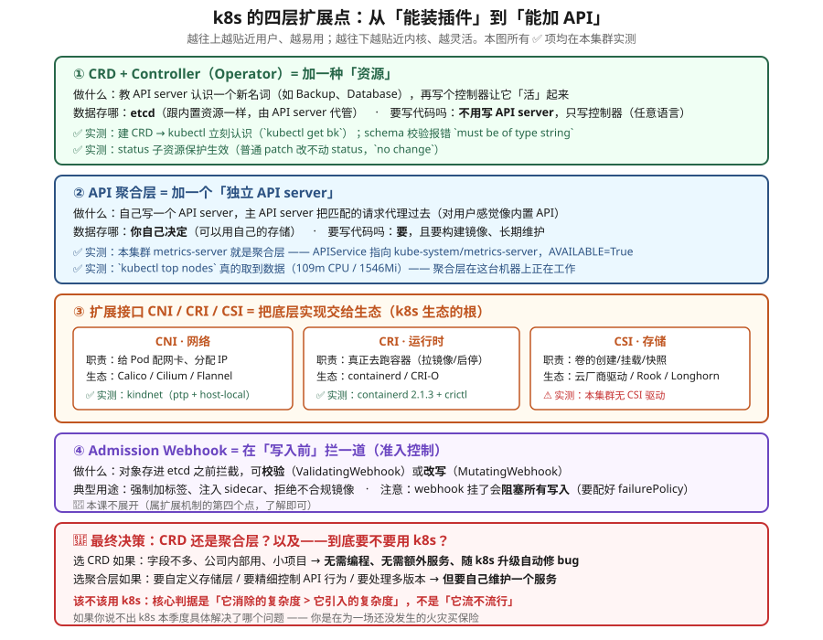

# 课 20：扩展机制与决策收口

> 📍 所属阶段：阶段 6《排障 · 运维 · 扩展》（第 3 课，**全课程收官**）
> 📖 故事章节：**它从哪来，以及该不该用** —— 从"怎么用"回到"为什么这样设计"与"要不要用"
> 🧭 上一课：[课 19：集群运维与生命周期](lesson-19-集群运维与生命周期.md)
> ⚙️ 实操环境：WSL Ubuntu 24.04 · kind v1.34.0 · kubectl v1.34.0 · containerd 2.1.3

## 🎯 本课目标

学完本课，你应当能够：

- 建一个 **CRD** 并使用它，说清 schema 校验、pruning、status 子资源各自的作用
- 解释 **Operator 是什么**（**模式而非工具**），能说清 reconcile 循环为何是 **level-triggered**
- 区分扩展 API 的**两条路**（CRD vs 聚合层），能给出选择依据
- 说清 **CNI / CRI / CSI** 三个接口各自的职责与生态实现
- 对具体场景给出**"该不该用 k8s"**的判断，而不是背诵"k8s 很好"

> ⚠️ **本课实操边界**
>
> - **知识点 1（CRD）、2（Operator）、3（聚合层）**：✅ **能实操**（本集群已验证）
> - **知识点 4（CNI/CRI/CSI）**：部分可验（CNI、CRI **已实测**；**CSI 本集群无驱动**，只能看 API 与 StorageClass）
> - **知识点 5（该不该用 k8s）**：**决策课**，无命令可跑，给判据与对照表
>
> 凡需多机、需装额外组件才能走通的，均显式标注「⚠️ 原理课」或「📄 文档结论」。

---

## 第一幕：起源与场景引入 —— 一个"装不上"的需求

### 场景

公司要让开发团队自助申请数据库。理想状态是：

```bash
kubectl apply -f - <<EOF
apiVersion: db.example.com/v1
kind: Database
metadata: {name: orders-db}
spec: {engine: postgres, version: "16", storage: 100Gi}
EOF
# 然后数据库就出现了
```

**问题**：k8s 里**没有 `Database` 这种资源**。内置的只有 Pod、Service、Deployment……

怎么办？三条路：

| 方案 | 做法 | 问题 |
|---|---|---|
| 用 ConfigMap 凑 | 把数据库配置塞进 ConfigMap | 没有校验、没有状态、看不出"建好了没" |
| 写个外部服务 | 独立系统，自己管数据库 | 跟 k8s 生态割裂，不能用 `kubectl get` |
| **扩展 k8s API** | 教它认识 `Database` | **本课要讲的** |

### 问题的本质

**k8s 内置资源只覆盖了"通用编排"（跑容器、暴露服务、挂存储）。**

但真实业务里有大量**领域概念**：数据库、消息队列、证书、备份策略、机器学习任务……**这些不该由 k8s 内置**（否则 k8s 会膨胀成怪物），**但用户又希望用同一套 `kubectl` 和声明式模型来管理它们。**

**这是本课要回答的第一个问题：k8s 怎么让自己"可被扩展"？**

### 而本课的第二个问题，是整门课的收口

课 1 我们问过"**k8s 是什么**"，然后用 19 课学了"**怎么用**"。

但有一个问题**一直悬着没答**：

> **你到底该不该用它？**

这个问题在课 1 回答不了——**那时你还不知道它有多复杂**。现在学完了 20 课的坑：污点容忍、PDB 计算、etcd 备份、证书 1 年、drain 三个坑、StatefulSet 卡 Terminating……

**你现在有足够的证据回答了。**

> 🎯 **为什么把"该不该用"放在最后一课**：
> 前 19 课教你**怎么用**，最后一课教你**什么时候不该用**。
> **一个只会用、不会判断"该不该用"的人，很容易把简单问题复杂化。**
> **能用 k8s 解决，不代表应该用 k8s 解决。**

### 本课的五个问题

| 问题 | 知识点 | 能否实操 |
|---|---|---|
| 怎么教 k8s 认识新资源？ | **知识点 1**：CRD 与自定义资源 | ✅ 能 |
| 怎么让它"活"起来？ | **知识点 2**：Operator 模式 | ✅ 能 |
| 扩展 API 有几种走法？ | **知识点 3**：API 聚合层 | ✅ 能（看现成的） |
| 网络/运行时/存储怎么插进来？ | **知识点 4**：CNI / CRI / CSI | 部分能 |
| 那我到底该不该用 k8s？ | **知识点 5**：决策清单 | 决策课 |

> 💡 **一句话本质**（本课把什么从 A 变成 B）：
> 本课把 k8s **从"一个装好就固定的平台"，变成"到处都能插扩展点、也因此需要你自己判断边界的东西"** —— 最后用一张决策清单收口：**什么时候不该用它**。

> ⚖️ **处境对照**（不这么做 vs 这么做）：
>
> | | 不这么做（只用原生能力） | 这么做（认识扩展点 + 会用决策清单） |
> |---|---|---|
> | 想让 k8s 认识一种新东西 | **做不到**，只能在现有资源上绕 | 可以教它认识新资源，还能让它"活"起来 |
> | 网络 / 运行时 / 存储不合用 | 只能接受默认的 | 知道这些是**可替换的插槽**，能按需换 |
> | 想在写入前拦一道 | 没有统一位置 | 有专门的拦截点 |
> | 选不选 k8s | 跟风 —— **别人用我就用** | 有判据，能说出"这个场景不该用" |
> | **代价** | 简单，不用判断 | 扩展点**越往下越灵活也越难**；且"能做"不等于"该做" |
>
> ⏳ 说明：以上是**机制层面**对照（能不能扩展、插槽是否可替换、有没有判据）。要不要上 k8s 的收益因团队规模与业务形态差异极大，知识点 5 会给判据但不给通用结论。

---

## 第二幕：认知冲突 —— 三个"以为对了其实错了"的时刻

### 冲突一：CRD 建好了，什么都没发生

我建了一个 CRD，然后创建了一个实例：

```bash
$ kubectl apply -f - <<EOF
apiVersion: stable.example.com/v1
kind: Backup
metadata: {name: db-nightly, namespace: ns-ext}
spec: {target: "mysql-prod", schedule: "0 2 * * *"}
EOF
backup.stable.example.com/db-nightly created      # ← 成功了！

$ kubectl get backups
db-nightly   0s
```

**然后呢？什么都没发生。**

没有备份任务被创建，没有 CronJob 出现，什么都没有。

> 🔑 **这是理解 CRD 最关键的一句话**：
>
> **CRD 只是在 etcd 里存了一份结构化数据。它自己不会做任何事。**
>
> **CRD = 菜单（能点什么）｜ CR = 你下的单 ｜ Controller = 后厨（真正做菜的）**
>
> **没有后厨的菜单，点了菜也不会上。**

这就是知识点 2（Operator）存在的理由：**CRD + 控制器 = Operator**。

### 冲突二：我明明写了 status，它却"消失"了

这是我的**真实踩坑**。我写了个 mini-operator，往 status 里写 `observedGeneration`：

```bash
kubectl patch backup op-demo --subresource=status --type=merge \
  -p '{"status":{"phase":"Completed","observedGeneration":1}}'
```

然后读出来：

```bash
$ kubectl get backup op-demo -o jsonpath='{.status}'
{"phase":"Completed"}          # ← observedGeneration 呢？！
```

**`observedGeneration` 不见了。**

排查后找到原因：**我的 CRD schema 里 status 只声明了 `phase` 和 `lastRun`，没声明 `observedGeneration`。**

**于是它被服务端 pruning 掉了。**

> 🔑 **这个坑揭示了两件事**：
>
> 1. **CRD 的 pruning 是服务端行为**——schema 里没声明的字段，写进去也存不住
> 2. **schema 不是"可选装饰"，是契约**——漏声明一个字段，控制器写的数据就静默丢失
>
> **这正是"为什么 schema 要写完整"的最好教材**，而且是我自己踩出来的。

### 冲突三：kubectl 不让我测 pruning

我想验证 pruning，写了个带未知字段的对象：

```bash
$ kubectl apply -f - <<EOF
spec:
  target: "ok"
  thisFieldNotInSchema: "should-be-pruned"
EOF
Error from server (BadRequest): strict decoding error:
unknown field "spec.thisFieldNotInSchema"
```

**对象根本没创建成功**（后面 `kubectl get` 报 NotFound）。

**为什么？** 因为 **`kubectl` 客户端就做了严格解码**，未知字段在发出去之前就被拒了。

> 💡 **这反而是个重要认知**：
> **你观察到的"报错"，可能来自客户端，不是服务端。**
> 要测服务端行为，得**绕过客户端**（用 `--validate=false` 或直接调 API）。
>
> 这与课 18 的教训一脉相承：**工具会骗人，要看系统真实状态。**

用 `--validate=false` 重试，pruning 就现形了：

```bash
$ kubectl apply --validate=false -f - <<EOF
spec: {target: "ok", thisFieldNotInSchema: "should-be-pruned"}
EOF
backup.stable.example.com/prune-a created

$ kubectl get backup prune-a -o jsonpath='{.spec}'
{"target":"ok"}          # ← 未知字段被服务端 prune 掉了
```

---

## 第三幕：层层揭示

### 先看一眼全局（本课「一眼全局图」）



**看图指引**：从上到下四层扩展点——**① CRD+Controller（加资源）→ ② 聚合层（加 API server）→ ③ CNI/CRI/CSI（换底层实现）→ ④ Admission Webhook（写入前拦截）**。越往上越易用，越往下越灵活。底部红色框是最终决策判据。图中 ✅ 项全部在本集群实测。

### 本课地图（5 步）

> ⚠️ 本课是**全课程收口**：前四步讲"能怎么扩展"，第 5 步回到最初的问题 —— **那到底该不该用**。知识点 1-3 可实操（✅），知识点 4 部分能，知识点 5 是决策课。

| 步 | 这一步要解决什么 | 对应知识点 |
|---|---|---|
| 第 1 步 | 先教 k8s 认识一种新资源 —— 最轻量的扩展点 | 知识点 1：CRD 与自定义资源（✅） |
| 第 2 步 | 光认识还不够，怎么让它**自己动起来** | 知识点 2：Operator 模式（✅） |
| 第 3 步 | 再往上走一层：想加一整套自己的 API 怎么办 | 知识点 3：API 聚合层（✅ 看现成的） |
| 第 4 步 | 然后往底层看：网络 / 运行时 / 存储都是可换的插槽 | 知识点 4：CNI / CRI / CSI（部分能） |
| 第 5 步 | 最后收口：说了这么多"能做"，那**该不该做** | 知识点 5：该不该用 k8s（决策课 · 全课程收口） |

> 现在你在：**第 1 步**（刚看完全局图，接下来从最轻量的扩展点开始）。

---

### 知识点 1：CRD 与自定义资源

> 🧭 第 1/5 步｜承接：第一幕留下的问题 —— "有个需求 k8s 里根本没有对应的东西，怎么办？" → 本步：看最轻量的那条路 —— **教它认识一种新资源**，不用自己写服务。

#### 一句话定义

CRD（CustomResourceDefinition）是**声明式地教 API server 认识一种新资源**的机制——你给出 API 组、Kind 和 schema，k8s 就为你提供该资源的 REST 端点、校验、存储，**无需写自己的 API server**。

#### 直觉建立（类比）

**CRD = 给餐厅菜单加一道菜。**

你告诉后厨："**加一道叫 Backup 的菜，它有两个参数：target 和 schedule。**"

从此：
- 顾客可以点这道菜（`kubectl apply`）
- 后厨认识这个菜名（`kubectl get backups`）
- 点错了会被纠正（schema 校验）

**但是——光有菜单，没人做菜。** 这就是 Operator 的用武之地。

#### 核心原理一：最小可用 CRD

```yaml
apiVersion: apiextensions.k8s.io/v1
kind: CustomResourceDefinition
metadata:
  name: backups.stable.example.com      # ⚠️ 必须是 <plural>.<group>
spec:
  group: stable.example.com
  names:
    kind: Backup
    listKind: BackupList
    plural: backups
    singular: backup
    shortNames: [bk]
  scope: Namespaced                      # 或 Cluster
  versions:
  - name: v1
    served: true                         # 是否对外提供
    storage: true                        # 是否存到 etcd（只能一个）
    schema:
      openAPIV3Schema:
        type: object
        properties:
          spec:
            type: object
            properties:
              target: {type: string}
              schedule: {type: string}
          status:
            type: object
            properties:
              phase: {type: string}
              observedGeneration: {type: integer}
    subresources:
      status: {}                         # 启用 status 子资源
```

**建完立刻生效**（实测）：

```bash
$ kubectl apply -f crd.yaml
customresourcedefinition.apiextensions.k8s.io/backups.stable.example.com created

$ kubectl api-resources | grep backup
backups    bk    stable.example.com/v1    true    Backup
```

**`kubectl` 立刻就认识它了**，包括 `shortNames`（实测 `kubectl get bk` 可用）。

#### 核心原理二：三个容易踩的命名规则

**规则 1：`metadata.name` 必须等于 `<plural>.<group>`**

这是我的**真实报错**：

```
The CustomResourceDefinition "freetext.demo.com" is invalid:
metadata.name: Invalid value: "freetext.demo.com":
must be spec.names.plural+"."+spec.group
```

我写的 `plural: freetexts`，但 name 写成 `freetext.demo.com`（少了个 s）。**必须写成 `freetexts.demo.com`。**

**规则 2：`kind` 必须是驼峰**（如 `Backup`，不能是 `backup`）

**规则 3：资源名必须是合法 DNS 子域名**（小写、数字、`-`、`.`）

#### 核心原理三：schema 校验（实测生效）

```bash
# 故意传错类型（target 应为 string，传了数字 123）
$ kubectl apply -f - <<EOF
spec: {target: 123}
EOF
The Backup "bad-type" is invalid: spec.target: Invalid value: "integer":
spec.target in body must be of type string: "integer"
```

**校验发生在服务端**，任何客户端（不只是 kubectl）都躲不过。

#### 核心原理四：pruning（字段裁剪）

**schema 里没声明的字段，写进去会被丢弃。**

**验证要点**：kubectl 客户端会先拦截（strict decoding），所以要**绕过客户端**：

```bash
# 方法A：--validate=false
$ kubectl apply --validate=false -f - <<EOF
spec: {target: "ok", thisFieldNotInSchema: "should-be-pruned"}
EOF
backup.stable.example.com/prune-a created

$ kubectl get backup prune-a -o jsonpath='{.spec}'
{"target":"ok"}          # ✅ 实测：未知字段被裁剪
```

```bash
# 方法B：直接调 API（用 kubectl proxy + curl）
$ curl -X PATCH -H "Content-Type: application/merge-patch+json" \
    --data '{"spec":{"target":"ok","injectedByAPI":"should-be-pruned"}}' \
    http://127.0.0.1:8099/apis/stable.example.com/v1/namespaces/ns-ext/backups/prune-b
  spec: {"target": "ok"}     # ✅ 实测：同样被裁剪
```

**想保留未知字段**？用 `x-kubernetes-preserve-unknown-fields: true`（实测）：

```bash
$ kubectl get freetext anything -o jsonpath='{.spec}'
{"nested":{"deep":123},"whatever":"kept"}      # ✅ 全保留
```

> ⚠️ **代价**：关掉 pruning 就**失去了字段校验与 typo 保护**。慎用。

#### 核心原理五：status 子资源（Operator 的基石）

**status 子资源把"用户期望"（spec）与"系统现状"（status）分开。**

**实测对比**：

```bash
# 1. 用 --subresource=status 写 → 成功
$ kubectl patch backup db-nightly --subresource=status --type=merge \
    -p '{"status":{"phase":"Running"}}'
backup.stable.example.com/db-nightly patched

$ kubectl get backup db-nightly -o jsonpath='{.status}'
{"phase":"Running"}          # ✅ 写进去了

# 2. 不用 --subresource，直接 patch status → 被忽略
$ kubectl patch backup db-nightly --type=merge -p '{"status":{"phase":"Hacked"}}'
backup.stable.example.com/db-nightly patched (no change)      # ← 注意 no change

$ kubectl get backup db-nightly -o jsonpath='{.status.phase}'
Running                     # ✅ 还是 Running，没被改掉
```

> 🔑 **为什么这很重要**：
>
> 1. **RBAC 可以分开授权**：用户能改 spec，不能改 status（反之亦然）
> 2. **避免无限循环**：控制器写 status 若不走子资源，会触发新的 update 事件 → 再次 reconcile → **死循环**
>
> 官方文档原话：**"the /status subresource endpoint"** 让控制器更新状态，而用户更新 spec。

#### 核心原理六：generation 与 observedGeneration

**`metadata.generation` 只在 spec 变化时递增**（实测）：

```bash
$ 当前 generation: 1
$ 改 status  →  generation: 1     # ✅ 不变
$ 改 spec    →  generation: 2     # ✅ +1
```

**这就是控制器判断"要不要干活"的依据**：

```
if (metadata.generation != status.observedGeneration) {
    // 用户改了期望，需要重新处理
}
```

> ⚠️ **与冲突二的呼应**：`observedGeneration` 必须在 **status schema 里声明**，否则写进去会被 pruning 移除——**我踩过的坑**。

#### 核心原理七：finalizer（清理逻辑）

**finalizer 让控制器能在资源删除前做清理**（比如删掉云上的真实数据库）。

**实测**：

```bash
$ kubectl patch backup db-nightly --type=merge \
    -p '{"metadata":{"finalizers":["stable.example.com/cleanup"]}}'

$ kubectl delete backup db-nightly --timeout=10s
backup.stable.example.com "db-nightly" deleted from ns-ext namespace
error: timed out waiting for the condition on backups/db-nightly    # ← 卡住了

$ kubectl get backup db-nightly -o jsonpath='deletionTimestamp={.metadata.deletionTimestamp} finalizers={.metadata.finalizers}'
deletionTimestamp=2026-09-14T03:45:24Z finalizers=["stable.example.com/cleanup"]
```

**与课 18 的 finalizer 卡删除完全同构**——同一个机制，只是这次用在自定义资源上。

> ⚠️ **生产警告**（官方文档/实践共识）：**finalizer 没清理干净会阻塞命名空间删除**。
> 课 18 学过修复：用 `patch` 移除 finalizer，**不要用 `--force`**。

#### 常见误区

> 🐞 **误区 1**："建了 CRD 就会自动干活。"
> **不会。** CRD 只存数据。**CRD + 控制器 = Operator**（知识点 2）。

> 🐞 **误区 2**："schema 是可选的。"
> **不是。** 不写 schema 会失去校验、pruning、字段发现；**漏写字段会导致控制器写入的数据静默丢失**（**实测踩坑**）。

> 🐞 **误区 3**："pruning 测试失败 = pruning 没生效。"
> 可能是 **kubectl 客户端先拦了**（strict decoding）。用 `--validate=false` 绕过（**实测验证**）。

> 🐞 **误区 4**："`metadata.name` 随便起。"
> **必须 `<plural>.<group>`**（**实测报错**）。

> 🐞 **误区 5**："status 随便写就行。"
> 不启用 status 子资源时，控制器写 status 会触发 update 事件 → **可能死循环**。

> 🐞 **误区 6**："CRD 能当数据库用。"
> **官方文档明确警告**：避免用 CR 存储应用数据、用户数据或监控数据——**这类设计耦合过紧**。大数据量/高频访问场景应该用真正的存储。

#### 一句话记住

**CRD 是"菜单"不是"后厨"：它教 API server 认识新资源并提供校验与存储，但自己不做任何事；schema 未声明的字段会被服务端裁剪，status 要靠子资源更新，generation 只在 spec 变化时递增。**

📚 官方文档：[自定义资源](https://kubernetes.io/zh-cn/docs/concepts/extend-kubernetes/api-extension/custom-resources/) ｜ [使用 CRD 扩展 API](https://kubernetes.io/zh-cn/docs/tasks/extend-kubernetes/custom-resources/custom-resource-definitions/)

---

### 知识点 2：Operator 模式

> 🧭 第 2/5 步｜承接：上一步 k8s 认识新资源了 —— 但它只是**记下来**，不会自己动 → 本步：给它配一个"一直盯着、按你的规矩干活"的东西，这才是 Operator。

#### 一句话定义

Operator = **CRD + 自定义控制器**，它把**人类运维专家的知识编码成软件**，通过持续运行的 **reconcile 循环**把现实状态拉向用户声明的期望状态。

#### 直觉建立（类比）

**Operator = 一个永不睡觉的运维工程师。**

普通部署（Helm）：**一次性**把应用装好，之后自求多福。

Operator：有个工程师**一直盯着**——
- 数据库挂了？**自动故障转移**
- 该备份了？**自动备份**
- 你改了版本？**按正确的顺序滚动升级**
- 有人手贱改了配置？**改回去**（自愈）

**"Operator"这个名字的意思就是：把运维人员（operator）的脑子，写成代码。**

#### 核心原理一：CRD + Controller = Operator

```
CRD（菜单）+ 控制器（后厨）= Operator（餐厅）
```

**孤立的 CRD 什么也做不了**（冲突一已验证）。**控制器才是让它"活"的东西。**

#### 核心原理二：reconcile 循环（四步）

```
1. Observe  读取当前实际状态（集群里有什么、外部系统什么状态）
2. Diff     与 spec 声明的期望状态比较
3. Act      执行操作缩小差距（创建/更新/删除资源）
4. Report   把结果写回 status
```

**然后重复**——不是一次性的，是**永远循环**。

#### 核心原理三：三条设计原则（为什么这样设计）

**① Level-triggered，不是 edge-triggered**（最重要）

| | edge-triggered（边沿触发） | **level-triggered（电平触发）** |
|---|---|---|
| 关注 | **事件**："某字段从 A 变成了 B" | **状态**："现在对象说是 B，让现实变成 B" |
| 漏事件 | **永远错**（没看到这个变化） | **没事**（下次循环还会看当前状态） |
| 崩溃后 | 可能永久不一致 | **重启后自动收敛** |

> 🔑 **这是 k8s 控制器最核心的设计决策**：
> **控制器不依赖"看见每一个事件"，它只依赖"每次醒来时读到的当前状态"。**
>
> 所以控制器崩溃、网络抖动、事件丢失——**重启后照样收敛正确**。
>
> 与课 3 的联系：**这就是"声明式"的本质**——你声明目标，系统持续逼近，而不是你发一串命令。

**② 幂等性（Idempotency）**

**跑 10 次和跑 1 次，结果一样。** 每次 reconcile 前先读当前状态，已经满足就不做。

**实测**（我的 mini-operator 跑第二遍）：

```
[reconcile] db-nightly: gen=2 obs=none → 处理中
[done] db-nightly: phase=Completed observedGeneration=2
...
[reconcile] prune-b: phase=Completed observedGeneration=1
[idle] 无变化，进入等待（这就是 reconcile 的幂等性）      ← ✅ 实测
```

**③ 最终一致性（Eventual consistency）**

不要求一次 reconcile 就到位，允许多次重试逼近。失败则**指数退避重试**，不是死循环。

#### 核心原理四：控制器内部四层（了解即可）

```
API server（真相源）
   ↓ list + watch
Informer（本地缓存，减少 API 压力）
   ↓ 只把「对象名」放进队列
Work Queue（去重 + 限速）
   ↓
Reconciler（你写的业务逻辑）
```

> 💡 **关键细节**：队列里放的是**对象名（namespace/name）**，不是事件内容。
> 所以 reconcile 时**要重新读完整对象**——这正是 level-triggered 的实现方式。
>
> 1 秒内改 5 次 → 队列**去重**成 1 次 reconcile。

#### 核心原理五：一个真实的 mini Operator（本集群实测跑通）

下面这段 shell 脚本**在本集群真实运行过**，它就是一个（极简的）Operator：

```bash
#!/usr/bin/env bash
# 极简 Operator：把 spec 的变化反映到 status
for name in $(kubectl get backups -n ns-ext -o jsonpath='{.items[*].metadata.name}'); do
  gen=$(kubectl get backup $name -n ns-ext -o jsonpath='{.metadata.generation}')
  obs=$(kubectl get backup $name -n ns-ext -o jsonpath='{.status.observedGeneration}')
  if [ "$gen" != "$obs" ]; then
    echo "[reconcile] $name: gen=$gen obs=${obs:-none} → 处理中"
    kubectl patch backup $name -n ns-ext --subresource=status --type=merge \
      -p "{\"status\":{\"phase\":\"Completed\",\"observedGeneration\":$gen}}"
  fi
done
```

**实际输出**（实测）：

```
[reconcile] db-nightly: gen=2 obs=none → 处理中
[done] db-nightly: phase=Completed observedGeneration=2
[reconcile] op-final: gen=1 obs=none → 处理中
[done] op-final: phase=Completed observedGeneration=1
```

> 💡 **它虽然只有 10 行，但具备了 Operator 的全部要素**：读状态 → 比较 generation → 行动 → 写 status → 幂等。
> 真实 Operator（kubebuilder / Operator SDK）只是把同样的逻辑用 Go 写，并加上 informer、队列、重试、leader election。

#### 核心原理六：Operator 的成熟度五级

| 级别 | 能力 |
|---|---|
| L1 | 基本安装 |
| L2 | 跨多对象协调（StatefulSet + Service + Secret） |
| L3 | **应用知识**：备份、恢复、扩缩容、按应用流程升级 |
| L4 | 生产级：最佳实践、有测试、被广泛采用 |
| L5 | 自动驾驶：自愈、自调优、预测性扩缩容 |

**生产大多数 Operator 在 L3-L4，L5 很少。**

#### 核心原理七：什么时候该写 Operator（以及不该）

**⚠️ 这是生态里被过度使用的模式**（业界共识）。

**该用**：
- 有状态的复杂应用（数据库、消息队列），需要备份/故障转移/有序升级
- 需要 Day 2 运维自动化（**Helm 只管 Day 1 安装**）

**不该用**：
- 无状态简单应用 → **Helm 就够了**
- 你的运维手册只有一页、没有条件分支 → **Helm + CronJob**

**对比表**：

| 能力 | Helm | Kustomize | **Operator** |
|---|---|---|---|
| 初始安装 | ✅ | ✅ | ✅ |
| 配置模板 | ✅ | 部分 | ❌ |
| **自动升级** | ❌ | ❌ | ✅ |
| **自愈** | ❌ | ❌ | ✅ |
| **备份恢复** | ❌ | ❌ | ✅ |
| schema 校验 | ❌ | ❌ | ✅ |
| **运维复杂度** | 低 | 低 | **高** |

> 🔑 **一条实用判据（业界共识）**：
> **如果你的升级手册能写在一页纸上、且没有条件分支 —— 用 Helm，别写 Operator。**
>
> **很多团队在只需要 Helm 的场景用了 Operator，提前交了复杂度税。**

#### 常见误区

> 🐞 **误区 1**："Operator 是某个具体工具。"
> **是模式，不是工具。** kubebuilder、Operator SDK 是**实现这个模式的框架**。

> 🐞 **误区 2**："有 CRD 就是有 Operator。"
> **CRD 只是数据。没有控制器的 CRD 是死数据**（**实测验证**）。

> 🐞 **误区 3**："reconcile 失败要立刻重试。"
> 应该**指数退避**。立刻无限重试会打爆 API server。

> 🐞 **误区 4**："控制器要记住上次做了什么。"
> **不应该。** 每次 reconcile 重新读状态（stateless + level-triggered）。

> 🐞 **误区 5**："什么都应该写成 Operator。"
> **过度使用的重灾区。** 先问"Helm + CronJob 能不能解决"。

#### 一句话记住

**Operator 是「CRD + 控制器」的模式，把人类运维知识编码成软件；核心是 level-triggered 的 reconcile 循环（读状态→比较→行动→写 status），幂等且最终一致；能不用就不用，Helm 能解决的别写 Operator。**

📚 官方文档：[Operator 模式](https://kubernetes.io/zh-cn/docs/concepts/extend-kubernetes/operator/)

---

### 知识点 3：API 聚合层

> 🧭 第 3/5 步｜承接：前两步是"加资源" —— 可如果你想加的是**一整套自己的 API**（不只是几个字段）呢？ → 本步：看另一条路，以及它和 CRD 该怎么选。

#### 一句话定义

聚合层让你**部署一个独立的 API server**，主 API server 把匹配该 API 路径的请求**代理过去**——用户感觉像在用内置 API，但**存储和行为完全由你控制**。

#### 直觉建立（类比）

**CRD vs 聚合层 = 在现有餐厅加菜 vs 开一家新餐厅挂同一个招牌。**

- **CRD**：在现有厨房里加一道菜，**用同一个厨房（etcd）、同一套流程**
- **聚合层**：**另开一家店**，主店把客人**引过去**，但客人觉得还是同一家

**好处**：新店可以有自己的厨房（存储）、自己的规矩。
**代价**：**新店可能关门（服务会挂）**，你得自己维护。

#### 核心原理：本集群就有一个活生生的例子 ✅

**`metrics-server` 就是聚合层**，不是 CRD。实测：

```bash
$ kubectl get apiservice v1beta1.metrics.k8s.io -o jsonpath='
NAME={.metadata.name}
GROUP={.spec.group}  VERSION={.spec.version}
SVC={.spec.service.namespace}/{.spec.service.name}
AVAILABLE={.status.conditions[?(@.type=="Available")].status}'

NAME=v1beta1.metrics.k8s.io  GROUP=metrics.k8s.io  VERSION=v1beta1
SVC=kube-system/metrics-server  AVAILABLE=True
```

**`spec.service` 指向一个 Service** —— 这就是"代理到别处"的证据。

**而且它真的在工作**（实测）：

```bash
$ kubectl top nodes
NAME                   CPU(cores)   CPU(%)   MEMORY(bytes)   MEMORY(%)
k8s-c1-control-plane   109m         0%       1546Mi          4%
```

> 🎯 **这个例子很珍贵**：
> **聚合层不是一个抽象概念——它就在你这个集群里跑着。**
> `kubectl top` 的请求路径是：你 → 主 API server → **转发给 metrics-server Pod** → 返回。

#### 核心原理：CRD vs 聚合层怎么选

**官方文档的判断标准**：

| 维度 | CRD | 聚合层 |
|---|---|---|
| **编程** | 不需要（控制器可用任意语言） | **需要**（Go + 构建镜像） |
| **要跑服务吗** | 不需要（API server 代管） | **需要，且它可能挂** |
| **持续维护** | 不需要（随 k8s 升级自动修 bug） | **要定期跟上游修复** |
| **多版本管理** | 可选 | **必须处理** |
| **存储层** | **只能 etcd** | **可自定义** |
| **校验** | OpenAPI v3（够用） | **任意校验** |
| **默认值** | 需 webhook | **原生支持** |

**决策依据**（官方文档原话精神）：

> ✅ **选 CRD 如果**：**字段不多**、公司内部使用、小项目
>
> ✅ **选聚合层如果**：需要**自定义存储层**、需要精细控制 API 行为、要处理多个 API 版本

#### 常见误区

> 🐞 **误区 1**："聚合层是 CRD 的高级版。"
> **是两条平行的路**，各有适用场景。不是升级关系。

> 🐞 **误区 2**："聚合层就是写个 Service。"
> 要实现**完整的 API server 语义**（list/watch/版本/校验），且**延迟要求 5 秒内**完成 discovery 往返。

> 🐞 **误区 3**："APIService 和 Service 是一回事。"
> **APIService** 是**注册声明**（"这个 API 路径归我"）；**Service** 是它背后真正处理请求的后端。

#### 一句话记住

**CRD 让 API server 代管新资源（简单、存在 etcd、零运维）；聚合层让你自己写 API server（灵活、可自定义存储、但要自己维护一个可能挂的服务）。本集群的 metrics-server 就是聚合层。**

📚 官方文档：[通过聚合层扩展 API](https://kubernetes.io/zh-cn/docs/concepts/extend-kubernetes/api-extension/apiserver-aggregation/) ｜ [定制资源](https://kubernetes.io/zh-cn/docs/concepts/extend-kubernetes/api-extension/custom-resources/)

---

### 知识点 4：扩展接口 CNI / CRI / CSI

> 🧭 第 4/5 步｜承接：前三层都在"上面加东西" —— 现在掉头往下看：**网络、运行时、存储这些底层，其实都是插槽** → 本步：认清哪三处可换，这解释了为什么同一个 k8s 在不同环境长得不一样。

#### 一句话定义

CNI / CRI / CSI 是 k8s 留给**网络、运行时、存储**三块的三组标准接口——**k8s 核心不实现它们，只定义"该怎么调"，实现交给生态**。

#### 直觉建立（类比）

**k8s 是一家把"非核心业务全部外包"的公司。**

- **CNI**：网络部外包（Calico / Cilium / Flannel）
- **CRI**：施工队外包（containerd / CRI-O）
- **CSI**：仓储外包（云厂商驱动 / Rook / Longhorn）

**k8s 只留了三个"接口说明书"（标准协议），谁都能来接活。**

> 🔑 **这是 k8s 能成为行业标准的关键设计决策**：
> **它没试图自己做好网络/存储/运行时，而是定义了接口让别人来做。**
> 结果：生态爆炸式增长，且**换实现不用改 k8s 核心**。

#### 核心原理一：CNI（网络）✅ 已实测

**职责**：给 Pod 配网卡、分配 IP、设置路由。

**本集群实测**：

```bash
$ kubectl get pod -n kube-system | grep -i kindnet
kindnet-j8bnj    1/1   Running   0     4d

$ docker exec k8s-c1-control-plane cat /etc/cni/net.d/10-kindnet.conflist
{
  "cniVersion": "0.3.1",
  "name": "kindnet",
  "plugins": [
    {"type": "ptp", "ipMasq": false,
     "ipam": {"type": "host-local", "dataDir": "/run/cni-ipam-state", ...}}
  ]
}
```

**关键词**：`ptp` 插件 + `host-local` IPAM。**这就是 kind 的网络实现。**

**生产常见实现**：Calico（BGP/策略）、Cilium（eBPF，性能与可观测性强）、Flannel（简单）。

#### 核心原理二：CRI（运行时）✅ 已实测

**职责**：真正去跑容器——拉镜像、创建/启动/停止容器、上报状态。

**本集群实测**：

```bash
$ kubectl get node k8s-c1-control-plane -o jsonpath='{.status.nodeInfo.containerRuntimeVersion}'
containerd://2.1.3

$ docker exec k8s-c1-control-plane crictl version
Version:  0.1.0
RuntimeName:  containerd
RuntimeVersion:  v2.1.3
```

> 💡 **与课 1 的呼应**：**k8s v1.24 起移除了内置的 dockershim**。
> 现在 kubelet 通过 CRI 接口调 containerd，**Docker 不再直接参与**。
> 这就是课 1 讲"Docker ≠ k8s"的技术根源。

#### 核心原理三：CSI（存储）⚠️ 本集群无驱动

**职责**：卷的创建、挂载、卸载、快照、扩容。

**本集群实测**：

```bash
$ kubectl get csidriver
No resources found          # ⚠️ 没有装 CSI 驱动

$ kubectl get sc
standard (default)   rancher.io/local-path   Delete   WaitForFirstConsumer
```

> ⚠️ **注意**：`rancher.io/local-path` 是 **kind 内置的简易 provisioner**，**不是标准 CSI 驱动**。
> 所以本集群**无法演练真正的 CSI 行为**（如卷快照、跨节点挂载）。

**相关 API 是存在的**（实测）：

```bash
$ kubectl api-resources | grep -iE "csidriver|csinode|volumeattachment"
csidrivers          storage.k8s.io/v1   false   CSIDriver
csinodes            storage.k8s.io/v1   false   CSINode
volumeattachments   storage.k8s.io/v1   false   VolumeAttachment
```

**生产常见实现**：云厂商 CSI 驱动（EBS/GCE PD）、Rook（Ceph）、Longhorn。

> 💡 **与课 19 的连接**：课 19 讲过**非计划关机时 `VolumeAttachment` 无法从死节点移除**，导致 StatefulSet 卡住——**那个操作的对象就是 CSI 相关资源**。

#### 核心原理四：三个接口的共同点

| 接口 | 全称 | 负责 | 谁调用它 |
|---|---|---|---|
| **CNI** | Container Network Interface | 网络 | kubelet（创建 Pod 时） |
| **CRI** | Container Runtime Interface | 容器运行时 | kubelet |
| **CSI** | Container Storage Interface | 存储卷 | kubelet + 外部组件 |

**共同模式**：**k8s 定义 gRPC/可执行程序协议 → 生态实现 → 通过配置指向具体实现。**

#### 补充：Admission Webhook（第四个扩展点，了解）

除了以上三层，还有一个常被忽略的扩展点：

```
对象写入请求 → 认证 → 鉴权 → 【Admission Webhook】→ 存入 etcd
                              ↑
                    可校验（Validating）或改写（Mutating）
```

**用途**：强制加标签、注入 sidecar、拒绝不合规镜像。

> ⚠️ **风险**：**webhook 挂了会阻塞所有写入**（要配好 `failurePolicy` 和超时）。
> 这是生产事故的一个常见来源。

#### 常见误区

> 🐞 **误区 1**："CNI/CRI/CSI 是 k8s 内置的。"
> **不是。** 是**接口标准**，实现由生态提供。k8s 核心**不包含**它们的实现。

> 🐞 **误区 2**："Kind 用的 kindnet 是生产级 CNI。"
> **不是**，是 kind 专用的简化实现。生产用 Calico/Cilium。

> 🐞 **误区 3**："有 StorageClass 就有 CSI 驱动。"
> **不一定。** 本集群的 `rancher.io/local-path` 就不是 CSI 驱动（**实测 `kubectl get csidriver` 为空**）。

> 🐞 **误区 4**："Docker 是 k8s 的运行时。"
> **v1.24 起不是了。** 现在是 containerd 等通过 CRI 接入。

#### 一句话记住

**CNI 管网络、CRI 管运行时、CSI 管存储，三者都是 k8s 定义接口、生态实现（这是它成为标准的关键）；本集群 CNI=kindnet、CRI=containerd 2.1.3（均已实测），CSI 无驱动（local-path 非 CSI）。**

📚 官方文档：[扩展 Kubernetes](https://kubernetes.io/zh-cn/docs/concepts/extend-kubernetes/)

---

### 知识点 5：该不该用 k8s（决策课 · 全课程收口）

> 🧭 第 5/5 步｜承接：前四步证明了 k8s **几乎什么都能扩展** —— 但"能做"不等于"该做"。 → 本步：用一整门课的所学，回到最初那个问题：**你的场景到底该不该上**，并给出判据。

> 📌 **本知识点没有命令可跑**——它是判断力，不是操作。

#### 一句话定义

判断"该不该用 k8s"的核心判据是：**它帮你消除的复杂度，是否大于它引入的复杂度**——而不是它流不流行、别人用没用。

#### 直觉建立（类比）

**k8s 是一辆载重卡车。**

它有强大的能力：**自动装卸、自动驾驶、车队调度、故障自愈**。

但如果你只是**每天送一箱牛奶去隔壁街**：
- 卡车能送（**能力上没问题**）
- 但你要**考卡车驾照、买保险、找停车位、定期保养**

**骑电动车 10 分钟就到了。**

**关键认知：问题从来不是"卡车能不能送牛奶"，而是"送牛奶该不该开卡车"。**

#### 核心原理：一个更准确的提问方式

业界共识的表述：

> ❌ **错误问法**："我的应用**能不能**跑在 k8s 上？"
> （答案几乎总是**能**——k8s 就是为了支持广泛工作负载而设计的）
>
> ✅ **正确问法**："**这个系统的运维复杂度，是否配得上 k8s 的运维复杂度？**"

**一句话总结**（多个来源的共同结论）：

> **k8s 最有价值的时刻，是它从应用运维中消除的复杂度，大于运维 k8s 本身引入的复杂度。**

#### 决策清单：六个信号

**✅ 指向"该用"的信号**（满足 3 条以上认真考虑）：

| # | 信号 | 说明 |
|---|---|---|
| 1 | **多个服务需独立扩缩容** | 高流量 API 与低流量后台任务要**分开扩**，HPA 能做到 |
| 2 | **有真正的高可用要求** | 不能有单点故障，需跨节点分布（反亲和） |
| 3 | **多团队需要隔离与自助** | namespace + RBAC 提供逻辑隔离 |
| 4 | **部署频繁**（一天多次） | 滚动更新、健康门禁、按服务资源限制成为刚需 |
| 5 | **流量波动大且不可预测** | HPA 按指标扩缩真的省钱 |
| 6 | **有专人/团队负责平台** | **k8s 没有 owner 会腐化** |

**❌ 指向"不该用"的信号**（满足 2 条以上请三思）：

| # | 信号 | 说明 |
|---|---|---|
| 1 | **全部能装进一台机器** | 调度器没东西可调 |
| 2 | **流量可预测**（峰谷差在 3 倍内） | 自动扩缩容没价值 |
| 3 | **团队少于 3 人碰基础设施** | 学习曲线带来的风险先于价值到来 |
| 4 | **单体应用** | 单进程单服务器几乎得不到编排收益 |
| 5 | **没有专职平台 owner** | 版本偏差、CNI 升级、证书轮换**会自动找上门** |
| 6 | **预算有限**（< $5000/月） | 最小生产配置起步就要几百美元/月 |

> ⚠️ **特别提醒两条"假信号"**（业界反复强调）：
> - ❌ "**我们以后可能会扩展**" —— 这是**愿望，不是负载**
> - ❌ "**大公司都在用 / 投资人期待**" —— **你的基础设施要匹配当前的运维复杂度，不是 aspirational 的规模**

#### 对比表：不同规模该选什么

| 方案 | 运维负担 | 适合 | 主要缺点 |
|---|---|---|---|
| **托管 PaaS**（Render/Railway/Fly.io） | 极低 | 1-10 服务、小团队 | 单价高、平台锁定 |
| **单机 + Docker Compose** | 低 | 副项目、内部工具、MVP | 手动扩缩、单点故障 |
| **VM + systemd** | 低-中 | 长期单体、负载可预测 | 自己管 OS 与部署脚本 |
| **ECS / Fargate** | 中 | 已投入 AWS、服务数中等 | AWS 专有配置、IAM 复杂 |
| **托管 k8s**（EKS/GKE/AKS） | 高 | 多服务、真需要扩缩容、有平台团队 | **运维税重、配置面大** |
| **自建 k8s** | **极高** | 特定合规/硬件需求 | **你等于成了一家基础设施公司** |

**渐进路径**（业界推荐）：

```
单机 Compose → （服务变多）→ Swarm/Kamal/Nomad → （8-12+ 服务、要真扩缩容、有 owner）→ k8s
```

> 💡 **推荐做法**：**先用托管容器服务跑 6-12 个月**。很多团队会发现"够用了"，迁移问题自然消失。

#### 用这 20 课的证据来回答

现在你有资格回答了——**因为你知道它真实的价格**：

| 你学到的 | 它意味着的**持续成本** |
|---|---|
| 课 13：污点、亲和、requests/limits | 调度规则要设计，资源要压测 |
| 课 19：drain 三个坑、PDB 计算 | 每次维护都是一次需要小心设计的操作 |
| 课 19：证书 1 年、etcd 3.6 换 etcdutl | **备份脚本会随版本失效** |
| 课 19：HA 最少 3 节点 | 最小生产配置就不是"一台机器" |
| 课 18：finalizer 卡删除 | 需要懂内部机制才能修 |
| 课 19：StatefulSet 卡 Terminating | 有状态负载是真正的难点 |
| 本课：Operator 复杂度税 | "要不要自己写"又是一道决策题 |

> 🎯 **把这些加起来看**：
> **k8s 不是"装上就完事"的工具，是一份长期的运维契约。**
> 它换给你的是：**标准化、可移植、自愈、生态**。
> 它要你付出的是：**学习曲线、持续升级、专人维护**。
>
> **这笔交易在大规模下非常划算，在小规模下通常是亏的。**

#### 常见误区

> 🐞 **误区 1**："k8s 能解决我的问题，所以该用。"
> **能解决 ≠ 该用。** 要看**净收益**（消除的复杂度 − 引入的复杂度）。

> 🐞 **误区 2**："用了 k8s 就不用管运维了。"
> **恰恰相反**——它把运维工作**标准化**了，但**没有减少**它。升级、证书、监控、备份一样不少。

> 🐞 **误区 3**："托管 k8s 就没有复杂度了。"
> 托管**只省掉控制面运维**。节点、网络、存储、应用、升级**仍是你的**（业界共识：大约减半，不是归零）。

> 🐞 **误区 4**："上了 k8s 就自动高可用。"
> **不会。** 高可用需要你自己设计：多副本、反亲和、PDB、跨故障域。

> 🐞 **误区 5**："以后要扩展，现在就该上。"
> **为还没发生的火灾买保险。** 真到了那天，渐进迁移的成本通常低于提前支付的复杂度税。

#### 一句话记住

**判断标准是"净复杂度"而非"能不能"：多个独立服务、真需要扩缩容、有专职 owner 才划算；单机装得下、流量可预测、团队小于 3 人就该用更简单的方案；"以后可能会扩展"不是理由。**

---

## 第四幕：实操验证

> **覆盖知识点 1-4**（知识点 5 是决策课，无命令）。
> 全部在本集群逐字跑通。

```bash
kubectl create ns ns-ext
kubectl config set-context --current --namespace=ns-ext
```

### 验证 1：建 CRD 并确认 kubectl 认识它

```bash
cat <<'EOF' | kubectl apply -f -
apiVersion: apiextensions.k8s.io/v1
kind: CustomResourceDefinition
metadata:
  name: backups.stable.example.com
spec:
  group: stable.example.com
  names:
    kind: Backup
    listKind: BackupList
    plural: backups
    singular: backup
    shortNames: [bk]
  scope: Namespaced
  versions:
  - name: v1
    served: true
    storage: true
    schema:
      openAPIV3Schema:
        type: object
        properties:
          spec:
            type: object
            properties:
              target: {type: string}
              schedule: {type: string}
          status:
            type: object
            properties:
              phase: {type: string}
              lastRun: {type: string}
              observedGeneration: {type: integer}
    subresources:
      status: {}
EOF
# 期望：customresourcedefinition.apiextensions.k8s.io/backups.stable.example.com created

kubectl api-resources | grep -i backup
# 期望：backups   bk   stable.example.com/v1   true   Backup
```

### 验证 2：创建实例（CR）

```bash
cat <<'EOF' | kubectl apply -f -
apiVersion: stable.example.com/v1
kind: Backup
metadata: {name: db-nightly, namespace: ns-ext}
spec: {target: "mysql-prod", schedule: "0 2 * * *"}
EOF
# 期望：backup.stable.example.com/db-nightly created

kubectl get bk                      # 验证 shortNames
# 期望：db-nightly   0s
```

### 验证 3：schema 校验生效

```bash
cat <<'EOF' | kubectl apply -f -
apiVersion: stable.example.com/v1
kind: Backup
metadata: {name: bad-type, namespace: ns-ext}
spec: {target: 123}
EOF
# 期望：The Backup "bad-type" is invalid: spec.target: Invalid value: "integer":
#       spec.target in body must be of type string: "integer"
```

### 验证 4：pruning（必须绕过 kubectl 客户端校验）

```bash
cat <<'EOF' | kubectl apply --validate=false -f -
apiVersion: stable.example.com/v1
kind: Backup
metadata: {name: prune-a, namespace: ns-ext}
spec: {target: "ok", thisFieldNotInSchema: "should-be-pruned"}
EOF
# 期望：backup.stable.example.com/prune-a created

kubectl get backup prune-a -o jsonpath='{.spec}'
# 期望：{"target":"ok"}        ← 未知字段被裁剪
```

> ⚠️ **不加 `--validate=false` 会失败**，报 `strict decoding error` —— **kubectl 客户端先拦了**。

### 验证 5：CRD 命名规则（`metadata.name` = `<plural>.<group>`）

```bash
cat <<'EOF' | kubectl apply -f -
apiVersion: apiextensions.k8s.io/v1
kind: CustomResourceDefinition
metadata: {name: freetext.demo.com}
spec:
  group: demo.com
  names: {kind: FreeText, listKind: FreeTextList, plural: freetexts, singular: freetext}
  scope: Namespaced
  versions:
  - name: v1
    served: true
    storage: true
    schema:
      openAPIV3Schema:
        type: object
        x-kubernetes-preserve-unknown-fields: true
EOF
# 期望报错：must be spec.names.plural+"."+spec.group
# 改成 freetexts.demo.com 即可成功
```

### 验证 6：preserve-unknown-fields（保留未知字段）

```bash
# 用正确的名字 freetexts.demo.com 重建后
cat <<'EOF' | kubectl apply -f -
apiVersion: demo.com/v1
kind: FreeText
metadata: {name: anything, namespace: ns-ext}
spec: {whatever: "kept", nested: {deep: 123}}
EOF
kubectl get freetext anything -o jsonpath='{.spec}'
# 期望：{"nested":{"deep":123},"whatever":"kept"}     ← 字段被保留
```

### 验证 7：status 子资源保护（关键对比）

```bash
# 7a. 用 --subresource=status 写 → 成功
kubectl patch backup db-nightly --subresource=status --type=merge \
  -p '{"status":{"phase":"Running","lastRun":"2026-09-14T02:00:00Z"}}'
kubectl get backup db-nightly -o jsonpath='{.status}'
# 期望：{"lastRun":"2026-09-14T02:00:00Z","phase":"Running"}

# 7b. 不用 --subresource → 被忽略
kubectl patch backup db-nightly --type=merge -p '{"status":{"phase":"Hacked"}}'
# 期望：backup.stable.example.com/db-nightly patched (no change)

kubectl get backup db-nightly -o jsonpath='{.status.phase}'
# 期望：Running        ← 没被改掉 = status 子资源保护生效
```

### 验证 8：generation 只在 spec 变化时递增

```bash
echo -n "当前: "; kubectl get backup db-nightly -o jsonpath='{.metadata.generation}'; echo

kubectl patch backup db-nightly --subresource=status --type=merge \
  -p '{"status":{"phase":"Done"}}'
echo -n "改 status 后: "; kubectl get backup db-nightly -o jsonpath='{.metadata.generation}'; echo
# 期望：不变（1）

kubectl patch backup db-nightly --type=merge -p '{"spec":{"schedule":"0 3 * * *"}}'
echo -n "改 spec 后: "; kubectl get backup db-nightly -o jsonpath='{.metadata.generation}'; echo
# 期望：+1（2）
```

### 验证 9：observedGeneration 必须在 schema 里声明（我踩的坑）

```bash
# 如果 status schema 没声明 observedGeneration，写入后读不到
kubectl patch backup db-nightly --subresource=status --type=merge \
  -p '{"status":{"observedGeneration":2}}'
kubectl get backup db-nightly -o jsonpath='{.status.observedGeneration}'
# 期望：2        ← 本 CRD 已声明，所以能读到
# 若 schema 未声明 → 读到空（被 pruning 移除）
```

### 验证 10：finalizer 卡删除（与课 18 同构）

```bash
kubectl patch backup db-nightly --type=merge \
  -p '{"metadata":{"finalizers":["stable.example.com/cleanup"]}}'

kubectl delete backup db-nightly --timeout=10s
# 期望：error: timed out waiting for the condition on backups/db-nightly

kubectl get backup db-nightly -o jsonpath='deletionTimestamp={.metadata.deletionTimestamp} finalizers={.metadata.finalizers}'
# 期望：deletionTimestamp 有值 + finalizers 非空

# 修复：移除 finalizer（不要用 --force）
kubectl patch backup db-nightly --type=merge -p '{"metadata":{"finalizers":[]}}'
```

### 验证 11：写一个 mini Operator 并观察 reconcile

```bash
cat > /tmp/mini-op.sh <<'OPEOF'
#!/usr/bin/env bash
for i in 1 2 3; do
  for name in $(kubectl get backups -n ns-ext -o jsonpath='{.items[*].metadata.name}' 2>/dev/null); do
    gen=$(kubectl get backup $name -n ns-ext -o jsonpath='{.metadata.generation}' 2>/dev/null)
    obs=$(kubectl get backup $name -n ns-ext -o jsonpath='{.status.observedGeneration}' 2>/dev/null)
    if [ "$gen" != "$obs" ]; then
      echo "  [reconcile] $name: gen=$gen obs=${obs:-none} → 处理中"
      kubectl patch backup $name -n ns-ext --subresource=status --type=merge \
        -p "{\"status\":{\"phase\":\"Completed\",\"observedGeneration\":$gen}}" >/dev/null 2>&1
      echo "  [done] $name: phase=Completed observedGeneration=$gen"
    fi
  done
  sleep 2
done
echo "  [idle] 无变化，进入等待（这就是 reconcile 的幂等性）"
OPEOF

kubectl apply -f - <<'EOF'
apiVersion: stable.example.com/v1
kind: Backup
metadata: {name: op-final, namespace: ns-ext}
spec: {target: "mongo"}
EOF

bash /tmp/mini-op.sh
# 期望：
#   [reconcile] op-final: gen=1 obs=none → 处理中
#   [done] op-final: phase=Completed observedGeneration=1
#   [idle] 无变化，进入等待（这就是 reconcile 的幂等性）

bash /tmp/mini-op.sh     # 再跑一次
# 期望：直接 idle（幂等）
```

### 验证 12：聚合层（看现成的 metrics-server）

```bash
kubectl get apiservice v1beta1.metrics.k8s.io -o jsonpath='
NAME={.metadata.name}
GROUP={.spec.group}  VERSION={.spec.version}
SVC={.spec.service.namespace}/{.spec.service.name}
AVAILABLE={.status.conditions[?(@.type=="Available")].status}'
# 期望：SVC=kube-system/metrics-server  AVAILABLE=True

kubectl get pod -n kube-system -l k8s-app=metrics-server --no-headers
# 期望：metrics-server-xxx  1/1  Running

kubectl top nodes
# 期望：真的输出 CPU/内存          ← 聚合层在工作
```

### 验证 13：CNI / CRI / CSI 现状

```bash
# CNI
kubectl get pod -n kube-system | grep -i kindnet
# 期望：kindnet-xxx  1/1  Running

docker exec k8s-c1-control-plane cat /etc/cni/net.d/10-kindnet.conflist
# 期望：含 "type": "ptp" 与 "type": "host-local"

# CRI
kubectl get node k8s-c1-control-plane -o jsonpath='{.status.nodeInfo.containerRuntimeVersion}'
# 期望：containerd://2.1.3

docker exec k8s-c1-control-plane crictl version
# 期望：RuntimeName: containerd / RuntimeVersion: v2.1.3

# CSI
kubectl get csidriver
# 期望：No resources found        ← 本集群无 CSI 驱动

kubectl get sc
# 期望：standard (default)   rancher.io/local-path
#  ↑ local-path 不是标准 CSI 驱动
```

### 验证 14：清理（务必执行）

```bash
kubectl config set-context --current --namespace=default
kubectl delete crd backups.stable.example.com --timeout=60s
kubectl delete crd freetexts.demo.com --timeout=60s
kubectl delete ns ns-ext --timeout=120s

kubectl get crd | grep -E "stable.example|demo.com"
# 期望：无输出（已清理）
```

---

### 4.2 应用实战：要不要自建一个资源类型（入口）

> 🎯 **本课应用实战独立成篇**（配套实战册）：[第 20 课实战 · 要不要自建一个资源类型](../../../应用实战/20-要不要自建一个资源类型.md)
> 含**分步设计图**（每步一张：这一版长什么样、比上一版改了什么）与"基础 → 综合"的完整演进与代码；通览全部：📚 [应用实战索引](../../../应用实战/INDEX.md)

---

## 第五幕：体系收束（全课程终章）

### 本课知识地图

```
        k8s 为什么长这样 = 它把扩展点留给了生态
                    │
    ┌───────────────┼───────────────┐
    ▼               ▼               ▼
 加资源（CRD）   换底层（接口）    加 API（聚合层）
    │               │               │
 CRD=菜单        CNI 网络        自己写 API server
 Controller=后厨  CRI 运行时      存储/行为全自控
 =Operator       CSI 存储        例：metrics-server
    │               │               │
    └───────────────┼───────────────┘
                    ▼
          最终问题：该不该用 k8s？
          判据 = 消除的复杂度 > 引入的复杂度
```

### 全课程回顾：20 课的暗线

学到这里，回看整门课，有三条贯穿始终的暗线：

**暗线一：声明式 —— 你说"要什么"，系统负责"怎么做到"**

| 课 | 体现 |
|---|---|
| 课 3 | 声明式 vs 命令式：`apply` 声明目标状态 |
| 课 4 | Deployment 只声明副本数，控制器去达成 |
| 课 6 | 滚动更新：声明新版本，策略控制过程 |
| 课 12 | StatefulSet：声明有序、稳定标识 |
| **课 20** | **reconcile 循环就是声明式的引擎** |

**这条暗线在 Operator 里达到了终点**：你声明 `Database{engine: postgres, replicas: 3}`，控制器持续把它变成现实——**崩溃、丢事件、被人手改，都不影响最终收敛**（level-triggered）。

**暗线二：处处是"协商"，不是"强制"**

| 课 | 体现 |
|---|---|
| 课 10 | 优雅终止：发 SIGTERM 后**等** grace period |
| 课 13 | 调度是"筛选 + 打分"，不是硬指派 |
| 课 19 | PDB 只约束**自愿驱逐**，`delete` 绕得过 |
| 课 19 | drain 遇 DaemonSet/emptyDir/裸 Pod 会**停下来问** |
| **课 20** | **status 子资源**：用户改 spec、控制器改 status，**互不越界** |

**k8s 的设计哲学不是"我说了算"，而是"各方按契约配合"。**

**暗线三：工具会骗人，状态才是事实**

| 课 | 体现 |
|---|---|
| 课 18 | `kubectl delete` 返回 `deleted` 是**假成功**（finalizer 卡住） |
| 课 18 | `nslookup` 报 NXDOMAIN，但应用能访问（**工具 ≠ 行为**） |
| 课 19 | `drained` 成功 ≠ 服务还活着 |
| **课 20** | **CRD 创建成功 ≠ 有任何事情发生**（没有控制器 = 死数据） |
| **课 20** | **kubectl 的报错可能来自客户端**（strict decoding），不是服务端 |

**这 20 课最反复出现的一条教训**：**永远看系统状态，不要看命令返回值。**

### 你现在会了什么（全课程）

**基础（课 1-5）**：容器与编排的本质、架构与组件、Pod 生命周期、控制器、Service 网络
**工作负载（课 6-12）**：滚动更新、ConfigMap/Secret、Volume/PVC、探针、资源配额、**Job/CronJob**、StatefulSet
**调度与安全（课 13-17）**：污点容忍/亲和/requests-limits、**RBAC/ServiceAccount**、网络策略、安全上下文
**排障与运维（课 18-19）**：分层定位法、cordon/drain/PDB、节点关闭、kubeadm、升级与 etcd、HA
**扩展与决策（课 20）**：CRD、Operator、聚合层、CNI/CRI/CSI、**该不该用 k8s**

### 最后一句话

这门课从第 1 课的"k8s 是什么"走到这里。

如果把全部 20 课压缩成三个判断，我希望是这三个：

> **1. 声明式**：描述你要什么，让系统去逼近；不要试图指挥每一步。
>
> **2. 状态是真相**：命令返回成功不代表目标达成，**去看对象的实际状态**。
>
> **3. 复杂度要付费**：每个能力都有价格。
> **PDB 保护服务的代价是节点可能维护不了；Operator 自动化的代价是你要养一个控制器；**
> **k8s 标准化与自愈的代价，是你要持续为它付费。**
> **真正的工程判断，不是"能不能做到"，而是"这个代价值不值"。**

---

## 📋 命令速查卡

| 我想… | 命令 |
|---|---|
| 列出所有 CRD | `kubectl get crd` |
| 看某 CRD 的 schema | `kubectl get crd <name> -o jsonpath='{.spec.versions[0].schema}'` |
| 看 CRD 是否启用 status 子资源 | `kubectl get crd <name> -o jsonpath='{.spec.versions[0].subresources}'` |
| **写 status（必须带子资源）** | `kubectl patch <res> <name> --subresource=status --type=merge -p '...'` |
| 看 generation | `kubectl get <res> <name> -o jsonpath='{.metadata.generation}'` |
| **绕过 kubectl 客户端校验** | `kubectl apply --validate=false -f -` |
| 看聚合层注册了哪些 API | `kubectl get apiservice` |
| 看聚合层后端指向哪 | `kubectl get apiservice <v.group> -o jsonpath='{.spec.service.namespace}/{.spec.service.name}'` |
| 看 CNI 配置 | `cat /etc/cni/net.d/*.conflist`（节点上） |
| 看容器运行时 | `kubectl get node <n> -o jsonpath='{.status.nodeInfo.containerRuntimeVersion}'` |
| 看 CSI 驱动 | `kubectl get csidriver` |
| 看卷挂接（排障用） | `kubectl get volumeattachment` |
| 移除 finalizer（**不要用 --force**） | `kubectl patch <res> <name> --type=merge -p '{"metadata":{"finalizers":[]}}'` |

---

## 🐞 误区清单（本课）

| # | 误区 | 正解 |
|---|---|---|
| 1 | 建了 CRD 就会自动干活 | **CRD 只存数据**，需要控制器（=Operator） |
| 2 | schema 是可选的 | 漏声明字段会导致**控制器写入的数据静默丢失**（**实测**） |
| 3 | pruning 测试失败 = 没生效 | 可能是 **kubectl 客户端先拦了**，用 `--validate=false`（**实测**） |
| 4 | `metadata.name` 随便起 | **必须 `<plural>.<group>`**（**实测报错**） |
| 5 | status 随便写 | 不启用子资源会触发 update 事件 → **可能死循环** |
| 6 | CRD 能当数据库用 | **官方明确警告**：避免存应用/用户/监控数据 |
| 7 | Operator 是某个工具 | **是模式**。kubebuilder/SDK 是实现框架 |
| 8 | 有 CRD 就是有 Operator | **CRD 只是死数据**（**实测**） |
| 9 | reconcile 失败要立刻重试 | **指数退避**，否则打爆 API server |
| 10 | 控制器要记住上次做了什么 | **不该**。每次重新读状态（level-triggered） |
| 11 | 什么都该写成 Operator | **过度使用重灾区**。先问 Helm 够不够 |
| 12 | 聚合层是 CRD 的高级版 | **两条平行路径**，不是升级关系 |
| 13 | 聚合层就是写个 Service | 要实现**完整 API server 语义**，且延迟要求 5 秒内 |
| 14 | APIService 和 Service 一回事 | APIService 是**注册声明**，Service 是**后端** |
| 15 | CNI/CRI/CSI 是 k8s 内置的 | **是接口标准**，实现由生态提供 |
| 16 | kindnet 是生产级 CNI | **不是**，kind 专用简化实现 |
| 17 | 有 StorageClass 就有 CSI 驱动 | **不一定**（本集群 local-path 就不是，实测 `csidriver` 为空） |
| 18 | Docker 是 k8s 的运行时 | **v1.24 起不是了**，走 CRI（实测 containerd 2.1.3） |
| 19 | k8s 能解决就该用 | **净收益**才是判据：消除的复杂度 − 引入的复杂度 |
| 20 | 用了 k8s 就不用管运维 | 它**标准化**了运维，**没有减少**它 |
| 21 | 托管 k8s 就没复杂度了 | **只省控制面**，节点/网络/存储/升级仍是你的 |
| 22 | 上了 k8s 就自动高可用 | **不会**，需自己设计：多副本/反亲和/PDB/跨故障域 |
| 23 | 以后要扩展现在就该上 | **为还没发生的火灾买保险** |

---

## 🔍 事实核查记录

| 结论 | 来源 | 核查状态 |
|---|---|---|
| **CRD 建好后 kubectl 立刻认识**（含 shortNames） | **本机实测** | ✅ 已实测 |
| **schema 校验报错原文** `spec.target in body must be of type string` | **本机实测** | ✅ 已实测 |
| **服务端 pruning 生效**（`--validate=false` 与 API 直调两种方式） | **本机实测** | ✅ 已实测 |
| **kubectl 客户端 strict decoding 会先拦截未知字段** | **本机实测** | ✅ 已实测 |
| **CRD 命名报错原文** `must be spec.names.plural+"."+spec.group` | **本机实测**（我写错过） | ✅ 已实测 |
| **`x-kubernetes-preserve-unknown-fields` 保留未知字段** | **本机实测** | ✅ 已实测 |
| **status 子资源保护**：`--subresource` 可写，普通 patch 无效（`no change`） | **本机实测** | ✅ 已实测 |
| **generation 只随 spec 变化**（改 status 不变，改 spec +1） | **本机实测** | ✅ 已实测 |
| **`observedGeneration` 未在 schema 中声明会被 pruning 移除** | **本机实测**（我踩的坑） | ✅ 已实测 |
| **finalizer 卡删除**：`deletionTimestamp` + finalizers 非空 | **本机实测** | ✅ 已实测 |
| **mini-operator 的 reconcile 与幂等性**（第二遍 idle） | **本机实测** | ✅ 已实测 |
| **聚合层 metrics-server**：APIService 指向 kube-system/metrics-server，AVAILABLE=True | **本机实测** | ✅ 已实测 |
| **`kubectl top nodes` 真的取到数据**（109m CPU / 1546Mi） | **本机实测** | ✅ 已实测 |
| **CNI = kindnet（ptp + host-local）** | **本机实测** | ✅ 已实测 |
| **CRI = containerd 2.1.3，crictl 可用** | **本机实测** | ✅ 已实测 |
| **本集群无 CSI 驱动**（`get csidriver` 为空），`local-path` 非 CSI | **本机实测** | ✅ 已实测 |
| CRD 数据存储于 etcd、由 API server 代管 | 官方文档 | 📄 文档结论 |
| pruning 是服务端行为、schema 外字段被丢弃 | 官方文档 + **本机实测** | ✅ 文档+实测 |
| status 子资源分离 spec/status、避免无限循环 | 官方文档 + **本机实测** | ✅ 文档+实测 |
| CRD vs 聚合层的完整对比表（编程/服务/维护/存储/校验） | 官方文档 | 📄 文档结论 |
| 聚合层 5 秒 discovery 延迟要求 | 官方文档 | 📄 文档结论 |
| **reconcile 是 level-triggered 而非 edge-triggered** | 官方文档精神 + 业界共识 | 📄 文档结论 |
| **幂等性 / 最终一致性 / 指数退避** | 业界共识（kubebuilder 等） | 📄 文档结论 |
| **Operator 五级成熟度**（L1-L5） | 业界共识（Operator Framework） | 📄 文档结论 |
| **Helm vs Operator 能力对比表** | 业界共识 | 📄 文档结论 |
| **"该不该用 k8s"六信号与判据** | 多篇业界分析（2026）+ 官方文档生产考量 | 📄 文档结论 |
| **托管 k8s 只减约一半运维面，不是归零** | 业界共识 | 📄 文档结论 |

> ⚠️ **三处如实说明**：
>
> 1. **知识点 5「该不该用 k8s」无命令可跑**——它是判断力，判据来自多篇业界分析与官方文档的生产考量，非本集群实测。凡标 📄 的均为文档/业界结论。
> 2. **CSI 部分无法在本集群演练**——实测 `kubectl get csidriver` 为空，StorageClass 用的 `rancher.io/local-path` **不是标准 CSI 驱动**。卷快照、跨节点挂载等 CSI 行为**本环境看不到**。
> 3. **聚合层只"观察"未"搭建"**——metrics-server 是本集群现成的聚合层实例（已实测可用），但**自己写一个聚合层 APIServer 需要构建镜像与部署**，本环境未做（属生产搭建范畴，可对照课 19 kubeadm 的同类边界）。

---

## 📚 官方文档

- [自定义资源](https://kubernetes.io/zh-cn/docs/concepts/extend-kubernetes/api-extension/custom-resources/) —— CRD vs 聚合层的权威对比
- [使用 CRD 扩展 Kubernetes API](https://kubernetes.io/zh-cn/docs/tasks/extend-kubernetes/custom-resources/custom-resource-definitions/)
- [Operator 模式](https://kubernetes.io/zh-cn/docs/concepts/extend-kubernetes/operator/)
- [通过聚合层扩展 Kubernetes API](https://kubernetes.io/zh-cn/docs/concepts/extend-kubernetes/api-extension/apiserver-aggregation/)
- [扩展 Kubernetes](https://kubernetes.io/zh-cn/docs/concepts/extend-kubernetes/)

---

## 🎓 全课程完成

**恭喜——你完成了 Kubernetes 系统学习全部 20 课。**

### 接下来可以做什么

**方向一：把学到的用起来**

1. **用真实项目练手**：把一个小服务完整部署（Deployment + Service + Ingress + PVC + HPA）
2. **做一次故障演练**：按课 18 的方法故意制造故障并定位
3. **读一个真实 Operator 的源码**（如 cert-manager），对照课 20 的 reconcile 循环

**方向二：补本课未竟的部分**

- **聚合层**：自己写一个 extension-apiserver（本课只观察了现成的）
- **CSI**：在云上装一个真正的 CSI 驱动，练卷快照
- **Admission Webhook**：本课只提了一句，值得单独学

**方向三：认证**

- **CKA**（管理员）：偏运维排障，课 18/19 的内容权重高
- **CKAD**（开发者）：偏工作负载，课 4-12 的内容权重高

### 给未来的你

这门课讲了 20 课的"怎么用"，但**真正的能力是在生产事故里长出来的**。

**当你第一次在凌晨三点面对一个 Pending 的 Pod 时**，希望你想起的不是一个命令，而是这三条：

1. **先取证后动手**（重启会销毁 CrashLoop 现场）
2. **分层排除**（证明上一层没问题，才进下一层）
3. **看状态，不看命令返回值**

**以及最后一条 —— 也是最容易被忘记的：**

> **如果这次事故的根源，是当初不该用 k8s —— 那也是这条判断力的价值。**
> **知道什么时候不用，和知道怎么用，同等重要。**

---

## 🧭 课程导航

- ⬅️ 上一课：[课 19：集群运维与生命周期](lesson-19-集群运维与生命周期.md)
- 🏠 返回：[课程目录](../../../02-课程目录.md) ｜ [阶段 6 概览](../overview.md) ｜ [学习路径总览](../../../01-学习路径总览.md)
- 🎓 **全课程完成** —— 20 课已全部交付
