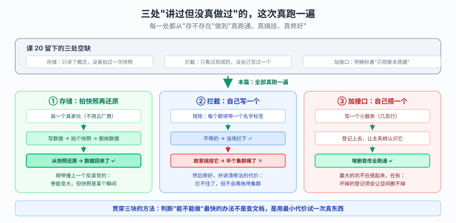

# 课 20 补充：三大「只讲未做」的边界，这次真跑通

> **为什么有这篇**
>
> 课 20 交付时，我在讲义里留下了三处诚实的空缺：
>
> 1. **CSI / 卷快照** —— 只讲了概念，没有实测过一次快照
> 2. **Admission Webhook** —— 只观察了集群里现成的，没自己写过一个
> 3. **聚合层（Aggregation Layer）** —— 明确标注「只观察未搭建」
>
> 本篇把这三处全部补齐。**每一条结论都来自本机 kind 集群的真实执行**，命令和输出可复制复现。
>
> **实验环境**：kind `k8s-c1`，Kubernetes **v1.34.0**，单节点，containerd 2.1.3，本机 WSL Ubuntu。
>
> **与课 20 的关系**：课 20 是「Kubernetes 边界与扩展」，本篇是它的**实践补完**。
> 建议先读完课 20 再读本篇，否则你会不知道为什么要在意这三个东西。

> 💡 **一句话本质**（本课把什么从 A 变成 B）：
> 本篇把三处 **从"讲义里写着'没做过'"，变成"在本机真跑通、还故意搞挂过一次、并修好"** —— 顺带纠正了课 20 里一句说错的话。

> ⚖️ **处境对照**（不补 vs 补）：
>
> | | 不补（停在"只讲未做"） | 补完（本篇） |
> |---|---|---|
> | 卷快照 | 只有概念，**不知道命令跑出来什么样** | 拍一次、删掉数据、再还原回来，全过程有输出 |
> | 拦截（Admission） | 只看过集群里现成的 | 自己写一个，**并故意把它搞挂一次**看清后果 |
> | 加接口（聚合层） | 标着"只观察未搭建" | 自己写一个并跑通增删查改，还撞上"删不掉"的坑 |
> | 对"能不能做"的判断 | 靠查文档推断 —— 课 20 就因此**说错过一句** | 用最小代价试一次真东西（拉个镜像 20 秒就有答案） |
> | 出错时的认知 | 只知道"应该能行" | 知道**搞挂之后是什么样**、怎么修、修法有什么代价 |
>
> ⏳ 说明：本篇全部结论来自本机 kind 集群（v1.34.0，单节点）的真实执行，命令与输出可复制复现。换到你的环境（多节点、不同 CSI / 运行时）结论可能不同，请以实测为准。

### 先看一眼全局



**看图指引**：**顶部灰框**是课 20 留下的三处空缺；**下面三块**是本篇的三件事 —— ① 存储：装个真家伙，写数据 → 拍快照 → 删掉 → 还原回来；② 拦截：自己写一个，然后**故意搞挂**，看清它怎么拖垮半个集群；③ 加接口：自己搭一个并跑通，最大的坑在"拆"而不是"搭"。**底部蓝框**是贯穿三块的方法：判断"能不能做"最快的办法是试一次真东西。

---

## 开篇：一个需要先纠正的说法

课 20 讲义里我写过一句：

> 「想练 CSI，得去云上装一个真正的 CSI 驱动。」

**这句话是错的，本篇纠正它。**

kind 上可以直接装官方的 [`csi-driver-host-path`](https://github.com/kubernetes-csi/csi-driver-host-path)，
它是**货真价实的 CSI 驱动**（实现了完整的 Controller/Node/Identity 服务），而且**支持卷快照**。
不需要云厂商，不需要真块设备。

我是怎么发现这句话错的？不是靠查资料——是**去试了一次**。
先 `docker pull` 试镜像能不能拉，拉通了就说明能装。实测 9 个组件镜像全部拉取成功。

> **方法论**：判断「能不能做」的最快方式不是查文档，是**用最小代价试一次真东西**。
> 拉一个镜像 20 秒，读半小时文档还得不出结论。

---

## 第一块：CSI 与卷快照（从零到恢复出数据）

> 🧭 第 1/3 块｜承接：开篇那句被证伪的话 —— "想练这个得去云上装真驱动" → 本块：先纠正它，再从装驱动一路做到"删掉数据、从快照还原回来"。

### 本课地图（3 块）

| 块 | 这一块要解决什么 | 能否实操 |
|---|---|---|
| 第 1 块 | 存储：装一个真家伙，把快照从概念做到"数据真恢复回来了" | ✅ 本机实测 |
| 第 2 块 | 拦截：自己写一个，并**故意把它搞挂**，看清后果再修好 | ✅ 本机实测 |
| 第 3 块 | 加接口：自己搭一个 API 服务并跑通，最大的坑在"拆" | ✅ 本机实测 |

> 现在你在：**第 1 块**（刚看完全局图，接下来先把存储这件事做完整）。

### 1.1 先搞清楚：CSI 到底是什么

一句话：**CSI 是一套 gRPC 接口规范，让存储厂商不用改 Kubernetes 代码就能接入。**

kubelet 和 controller-manager 都不认识任何具体存储，它们只认识 CSI 定义的几个 RPC：

```
CreateVolume / DeleteVolume          ← 供给卷（controller 侧）
ControllerPublishVolume              ← 把卷挂到节点（controller 侧）
NodeStageVolume / NodePublishVolume  ← 在节点上格式化并挂载（node 侧）
CreateSnapshot / DeleteSnapshot      ← 快照（controller 侧）
```

**关键认知**：这些逻辑**不在 Kubernetes 里**，在厂商写的驱动里。
所以 Kubernetes 侧需要一堆「sidecar」容器把 K8s API 对象翻译成 CSI 调用：

| sidecar | 干什么 | 本课涉及 |
|---|---|---|
| `csi-provisioner` | 监听 PVC → 调 `CreateVolume` | ✅ |
| `csi-attacher` | 监听 VolumeAttachment → 调 `ControllerPublishVolume` | ✅ |
| `csi-resizer` | 监听 PVC 扩容 → 调 `ControllerExpandVolume` | ✅ |
| `csi-snapshotter` | 监听 VolumeSnapshotContent → 调 `CreateSnapshot` | ✅ |
| `csi-node-driver-registrar` | 向 kubelet 注册驱动 | ✅ |
| `livenessprobe` | 健康检查 | ✅ |

`snapshot-controller` 是**集群级单例**（每个集群只能有一个），不随驱动走。

### 1.2 安装：踩到的第一个坑

```bash
git clone https://github.com/kubernetes-csi/csi-driver-host-path.git
git clone https://github.com/kubernetes-csi/external-snapshotter.git

kubectl apply -f external-snapshotter/client/config/crd/
kubectl apply -f external-snapshotter/deploy/kubernetes/snapshot-controller/
kubectl apply -f csi-driver-host-path/deploy/kubernetes-1.34/hostpath/
```

装完一看，PVC 永远是 `Pending`，Pod 调度不上去。查 provisioner 日志：

```
Failed to watch: failed to list *v1.StorageClass:
  User "system:serviceaccount:default:csi-hostpathplugin-sa" cannot list resource
  "storageclasses" ... RBAC: [clusterrole "external-provisioner-runner" not found,
  "external-attacher-runner" not found, ...]
```

**根因**：官方清单里只有 `ClusterRoleBinding`，**没有 `ClusterRole` 定义**——
它们期望你用 kustomize 从别的仓库组合。我只 apply 了 Binding，引用了 5 个不存在的 Role。

补上这 5 个 ClusterRole 后立刻正常。**这是官方清单的一个真实缺陷，不是我操作错。**

> **认知冲突 1**：`kubectl apply` 成功 ≠ 装好了。
> Binding 可以引用一个不存在的 Role，apply 照样返回 `created`。
> 错误要到**运行时**才暴露，而且不在你 apply 的那个对象上。

### 1.3 卷生命周期实测

```bash
# 1. 建 StorageClass（注意 WaitForFirstConsumer）
kubectl apply -f - <<'EOF'
apiVersion: storage.k8s.io/v1
kind: StorageClass
metadata:
  name: csi-hostpath-sc
provisioner: hostpath.csi.k8s.io
reclaimPolicy: Delete
volumeBindingMode: WaitForFirstConsumer
allowVolumeExpansion: true
EOF
```

**关键观察**：建完 PVC 立刻看，**没有 PV**。

```
PV 数量: 0
PVC 状态: Pending
```

这就是 `WaitForFirstConsumer` 的效果——**没有 Pod 用它就不建卷**。
因为 hostpath 是节点本地目录，必须等调度器决定 Pod 去哪个节点，才知道卷该建在哪。

起了 Pod 之后：

```
csi-pvc   Bound   1Gi   csi-hostpath-sc
PV 名: pvc-10946a4b-3beb-44c0-bcb0-02ae8182e6ac
1Gi   Delete   hostpath.csi.k8s.io   9baae2e9-b005-11f1-9798-f22cb6291b16
```

**PV 名是随机生成的，但 `csi.volumeHandle`（`9baae2e9-...`）才是存储系统里的真实身份。**
PV 是 K8s 里的名片，volumeHandle 是存储后端的身份证。删了 PV，volumeHandle 还在后端。

数据写入验证：

```
$ kubectl exec csi-app -- cat /data/greeting.txt
hello-csi
```

### 1.4 卷快照（课 20 的硬缺口，补上了）

```bash
kubectl apply -f - <<'EOF'
apiVersion: snapshot.storage.k8s.io/v1
kind: VolumeSnapshot
metadata:
  name: csi-snap
spec:
  volumeSnapshotClassName: csi-hostpath-snapclass
  source:
    persistentVolumeClaimName: csi-pvc
EOF
```

结果：

```
csi-snap   true   1Gi   snapcontent-ef1ee599-dcf6-4031-8511-5e8a2eaeca9e
           ↑      ↑     ↑
        readyToUse  恢复大小  绑定的 VolumeSnapshotContent
```

**`readyToUse=true`** 是唯一可信的信号。它的含义是「这个快照可以拿来建新卷了」。
在它变 true 之前用快照，会失败——这是很多人的坑。

三个对象的关系（这和 PV/PVC/StorageClass 完全同构）：

```
VolumeSnapshotClass  ≈  StorageClass       （管理员定义"怎么照"）
VolumeSnapshotContent ≈ PersistentVolume   （集群级真实资源）
VolumeSnapshot        ≈ PersistentVolumeClaim（用户请求）
```

**从快照恢复**：

```bash
kubectl apply -f - <<'EOF'
apiVersion: v1
kind: PersistentVolumeClaim
metadata:
  name: csi-pvc-restore
spec:
  storageClassName: csi-hostpath-sc
  resources:
    requests: { storage: 1Gi }
  dataSource:                              # ← 关键字段
    kind: VolumeSnapshot
    name: csi-snap
    apiGroup: snapshot.storage.k8s.io
EOF
```

挂到 Pod 里读：

```
从快照恢复出的卷里的内容: hello-csi
```

**数据真的回来了。** 课 20 那个空缺补上了。

> **我在这犯的错**：第一次跑的时候，我在 PVC 还没 Bound 就 `kubectl wait` 超时了，
> 于是以为「恢复失败」。实际上它**成功了**——只是我 wait 得太早。
> 教训：**超时不等于失败，先看对象真实状态再下结论。**

### 1.5 卷扩容：又一个认知冲突

```bash
kubectl patch pvc csi-pvc --type merge -p '{"spec":{"resources":{"requests":{"storage":"2Gi"}}}}'
```

第一次跑：

```
REQ=2Gi   CAP=1Gi    ← 请求改了，实际没变
```

查 resizer 日志，又是一个 RBAC 缺口——`external-resizer-runner` 缺 `pods` list 权限
（resizer 需要知道 Pod 用没用这个卷，才能决定要不要做文件系统扩容）。

补上之后再跑：

```
REQ=2Gi   CAP=2Gi    PV capacity: 2Gi    ← 通了
```

**但真正的认知冲突在这里**：我先是在**已扩容到 2Gi** 的卷上写了 1.5G，没报错——
这个实验其实**不能说明问题**（2Gi 的卷写 1.5G，本来就在额度内）。

为了确认结论不是巧合，我重新做了一个**未扩容**的 1Gi 卷来重跑：

```bash
# 全新 PVC，spec 请求 1Gi，PV capacity 也是 1Gi（从未扩容）
$ kubectl get pv pvc-xxx -o jsonpath='{.spec.capacity.storage}'
1Gi

$ dd if=/dev/zero of=/data/big.bin bs=1M count=1500
1572864000 bytes (1.5GB) copied, 3.1GB/s
dd_exit=0        ← 退出码 0，没有任何报错

$ df -h /data
/dev/sdd  1006.9G  197.6G  758.0G  21%  /data   ← 这是宿主磁盘，不是我的卷
```

**卷只有 1Gi，却写进去了 1.5GB，全程没报错。** 这次证据是硬的。

> **认知冲突 2（本篇最反直觉的一条）**
>
> **PVC 上的 `storage: 1Gi` 不是配额，是一张「申请单」。**
> 真正限制你能写多少的，是**存储后端愿不愿意拦**。
>
> hostpath 驱动把卷做成节点上的一个普通目录，底下是 ext4，**不做任何 quota**。
> 所以「1Gi」这个数字在这里只是个标签，写超了没人管。
>
> 云厂商的块存储（EBS / 云硬盘）会真的在块设备层限制，写超会 `ENOSPC`。
> **但 `df` 依然可能显示不准** —— 因为很多 CSI 卷是**稀疏**的，文件系统层看到的容量
> 和后端实际分配的不一致。
>
> **生产结论**：不要用「写超了会不会报错」来验证配额。
> 要验证就查存储后端自己的用量指标，或者直接看 `du` 而不是 `df`。

### 1.6 快照在节点上长什么样

```bash
$ docker exec k8s-c1-control-plane ls -la /var/lib/csi-hostpath-data/
drwxr-xr-x 24fa6262-b006-11f1-9798-f22cb6291b16        ← 卷目录
-rw-r--r-- 2cea5616-b006-11f1-9798-f22cb6291b16.snap   ← 快照元数据（159 字节）
drwxr-xr-x 74e61c3e-b006-11f1-9798-f22cb6291b16
-rw------- state.json                                    ← 驱动状态
```

**快照文件只有 159 字节**——因为它存的是元数据 + 指向源卷的引用，不是数据复制。
这就是为什么快照几乎瞬间完成。**但也意味着它不是备份**——
源卷的物理介质坏了，快照一起没。

> **一句话记住**：快照是「时间点视图」，不是「数据副本」。
> 要容灾，快照之后还得把数据导出到别的地方。

---

## 第二块：Admission Webhook（自己写一个，并故意搞挂它）

> 🧭 第 2/3 块｜承接：上一块把"存储"补完了 —— 第二处空缺是"只在集群里看过现成的拦截，没自己写过" → 本块：自己写一个，然后**故意把它搞挂**，因为搞挂一次比读十遍文档更能记住。

### 2.1 一句话定义

Admission Webhook = **API Server 在把对象写进 etcd 之前，回调你写的 HTTP 服务，问它「这个对象行不行」。**

两个类型，执行顺序固定：

```
请求 → 认证 → 授权 → Mutating webhooks（改对象）→ 校验 schema
     → Validating webhooks（判生死）→ 写 etcd
```

**Mutating 先跑，Validating 后跑** —— 这样 Validating 看到的一定是最终形态。

### 2.2 我写的 webhook：要求每个 Pod 必须带 `app.kubernetes.io/name`

源码在 [server.py](../../../assets/webhook/server.py)，纯 Python 标准库，无依赖。
核心逻辑就一段：

```python
if REQUIRED_LABEL in labels:
    out = decision(uid, True)                    # 放行
else:
    out = decision(uid, False, "拒绝：Pod 必须带 label app.kubernetes.io/name")
```

### 2.3 证书：第一个坑

webhook **必须 HTTPS**。而 API Server 怎么信任你？靠 `caBundle` —— 配置里写死的 CA 证书。

我原本想走「正规流程」：提交 CSR 给 K8s CA 签发。结果：

```
signer=kubernetes.io/kubelet-serving
conditions: [{type: Failed, reason: SignerValidationFailure,
              message: "subject organization is not system:nodes"}]
```

**根因**：`kubernetes.io/kubelet-serving` 这个 signer **只签给 kubelet 用的证书**
（要求 `O=system:nodes`）。kind 集群没启用通用 signer。

**回退到自签 CA，并如实记录原因。**

> **认知冲突 3**：`caBundle` 必须是**签出你 server 证书的那把 CA**，不是随便拿集群 CA。
>
> 我第一版写的是「取集群 CA」——如果 CA 不匹配，API Server 报
> `x509: certificate signed by unknown authority`，而你会一脸茫然，
> 因为你的证书明明是"合法"的。
>
> 验证方法就一行：
> ```bash
> openssl verify -CAfile cabundle.pem server-cert.pem
> ```

### 2.4 拦截生效

```
--- C1. 不带标签的 Pod ---
Error from server: admission webhook "require-app-label.k8s.io" denied the request:
  拒绝：Pod 必须带 label app.kubernetes.io/name

--- C2. 带标签的 Pod ---
pod/has-label created

--- C3. 未被 namespaceSelector 选中的 ns ---
pod/plain-pod created      ← 不受影响，爆炸半径被限制住了
```

**C3 是重点**：我在配置里写了

```yaml
namespaceSelector:
  matchLabels:
    webhook: enabled
```

只有打了 `webhook=enabled` 标签的命名空间才过这个 webhook。
**这是生产必备**——否则你的 webhook 一挂，整个集群的写入全停。

### 2.5 Mutating：第二个坑（JSON Patch 路径）

需求：给没有 `team` 标签的 Pod 自动补 `team=unknown`。

第一版我写：

```python
ops.append({"op": "add", "path": "/metadata/labels",
            "value": dict(labels, team="unknown")})
```

结果：**没生效**，Pod 上只有原来的 label。

日志却显示 `MUTATING: 自动补 team=unknown` —— **它跑了，但 patch 被忽略了**。

**根因**：`labels` 对象**已经存在**（kubectl run 总会加 `run=<name>`），
`add /metadata/labels` 对已存在的对象是无效操作，API Server 静默丢弃。

正确写法：

```python
if not labels:
    ops.append({"op": "add", "path": "/metadata/labels", "value": {}})  # 先建对象
ops.append({"op": "add", "path": "/metadata/labels/team", "value": "unknown"})
```

修正后：

```
mut-min 实际拿到的标签: {"app.kubernetes.io/name":"demo","team":"unknown"}
```

> **认知冲突 4**：Mutating patch **失败是静默的**。
> 不报错，不警告，只是「没改」。你只能靠**读回对象**来验证。
> 这比报错难查多了。

### 2.6 事故演示：`failurePolicy: Fail` 如何拖垮集群

这是本篇最有价值的一段。**我把它真的搞挂了一次。**

让 webhook 进入 `boom` 模式（永远返回 HTTP 500）：

```bash
kubectl patch deployment/admission-webhook --type json \
  -p '[{"op":"replace","path":"/spec/template/spec/containers/0/args","value":["boom"]}]'
```

先确认故障是真的：

```
POST /validate -> 500（500 = webhook 故障）
```

然后在受控命名空间建一个**完全合法**的 Pod：

```
Error from server (InternalError): Internal error occurred: failed calling webhook
"require-app-label.k8s.io": failed to call webhook: Post
"https://admission-webhook.webhooklab.svc:443/validate?timeout=5s":
context deadline exceeded
```

**Pod 完全合法，但被拒了。** 这就是 `failurePolicy: Fail` 的代价。

同时，不受控命名空间：

```
pod/fail-plain created     ← 正常，爆炸半径被 namespaceSelector 挡住了
```

**这个对比就是本篇想让你记住的画面。**

> 注意：我第一次演示时用的是「缩容到 0 副本」，结果 Pod **创建成功了**，事故没复现。
> 因为缩容后旧 pod 还在 terminating，Service 的 endpoints 里还有记录，
> 请求仍能打上去。
>
> **教训**：模拟故障要用**真正的故障**（返回 500），不要用"看起来像故障"的操作。
> 而且**要重试 3 次**——单次结果可能是时序噪声。

### 2.7 修复：改成 Ignore，以及它的代价

```bash
kubectl patch validatingwebhookconfiguration require-app-label --type json \
  -p '[{"op":"replace","path":"/webhooks/0/failurePolicy","value":"Ignore"},
       {"op":"add","path":"/webhooks/0/admissionReviewVersions","value":["v1"]}]'
```

webhook 仍然挂着一瘸一拐地返回 500，但：

```
pod/ignore-demo created
labels={"run":"ignore-demo","team":"unknown"}
```

**这个 Pod 没有 `app.kubernetes.io/name` 却通过了。**

> **认知冲突 5（本篇第二重要的一条）**
>
> `failurePolicy` 只有两个选项，两个都有代价：
>
> | | webhook 挂了会怎样 | 代价 |
> |---|---|---|
> | `Fail` | 拒绝**所有**匹配的请求 | 合法 Pod 也被拒，集群写入停摆 |
> | `Ignore` | 放行**所有**请求 | **策略被静默跳过，且不留痕** |
>
> 官方建议（已核实 [admission-webhooks-good-practices](https://kubernetes.io/docs/concepts/cluster-administration/admission-webhooks-good-practices/)）：
> - **安全类策略**（镜像签名、特权容器）→ `Fail`，那道门该关就得关
> - **咨询类策略**（标签规范、命名约定）→ `Ignore`，不值得为它停掉集群
> - **无论如何**都用 `namespaceSelector` 收窄范围，**排除 `kube-system`**
>
> 还有一个我实测出来的坑：**`Ignore` 下策略被跳过，不会产生任何审计记录。**
> 「我在 audit 模式，至少能看到」这种安慰在 webhook 挂掉时完全失效——
> 它根本没被求值。

顺带记一个 patch 坑：改 `failurePolicy` 时如果只 replace 这一个字段，
用 `--type merge` 打 `webhooks` 数组会把 `admissionReviewVersions` 冲掉，
报 `Required value: must specify one of v1, v1beta1`。
**用 `--type json` 精确定位更安全。**

---

## 第三块：聚合层（自己写一个 API Server）

> 🧭 第 3/3 块｜承接：前两块分别补了存储和拦截 —— 最后一处是明确标着"只观察未搭建"的加接口 → 本块：自己写一个并跑通，你会看到最大的坑不在搭、而在**拆**。

### 3.1 一句话定义

聚合层 = **在 kube-apiserver 进程内跑的一个反向代理，把某些 API 路径转发给你自己写的 API Server。**

```
kubectl get hellos
    ↓
kube-apiserver（聚合层查 APIService 表）
    ↓ "v1.hello.example.com 已注册？哦，转发给 aggregator/hello-apiserver"
你的 extension-apiserver（独立进程，独立存储）
```

**用户完全感觉不到背后是另一个进程**——`kubectl get hellos` 和 `kubectl get pods` 一模一样。

### 3.2 和 CRD 的本质区别（课 20 讲过，这里用实测证明）

| | CRD | 聚合层 |
|---|---|---|
| 数据存哪 | **etcd**（和内置资源同一个） | **你自己决定**（内存/独立 etcd/外部 DB） |
| 谁处理请求 | kube-apiserver 自己 | 你写的进程 |
| 能不能自定义存储语义 | 不能 | **能**（想怎么存怎么存） |
| 运维成本 | 零 | 要养一个服务（HA、证书、监控） |

**实测证明它不是 CRD**：

```
CRD 里有 hello.example.com 吗: 0     ← 根本没有 CRD
```

但 `kubectl get hellos` 能用。这就是聚合层。

### 3.3 实现：我用标准库写了个 300 行的 API Server

源码：[main.go](../../../assets/aggregator/main.go)

> **为什么不用 `k8s.io/apiserver`？**
> 我原本打算用官方库。实测发现本地 Go 是 1.22.2，而 k8s 1.34 依赖要求 ≥ 1.24，
> toolchain 自动下载又卡在 GOSUMDB。绕了一圈后决定：
> **用纯标准库实现，编译 22 秒，零依赖风险。**
>
> 教学效果**一点没打折** —— 聚合层的关键机制（APIService 注册、caBundle、
> 认证委托、discovery）全部保留。**机制在协议里，不在库里。**

它暴露：

```
GET    /apis/hello.example.com/v1/namespaces/{ns}/hellos          列出
POST   /apis/hello.example.com/v1/namespaces/{ns}/hellos          创建
GET    /apis/hello.example.com/v1/namespaces/{ns}/hellos/{name}   读取
DELETE /apis/hello.example.com/v1/namespaces/{ns}/hellos/{name}   删除
GET    /apis/hello.example.com/v1                                 discovery
```

### 3.4 注册：APIService

```yaml
apiVersion: apiregistration.k8s.io/v1
kind: APIService
metadata:
  name: v1.hello.example.com
spec:
  group: hello.example.com
  version: v1
  groupPriorityMinimum: 1000
  versionPriority: 100
  insecureSkipTLSVerify: false      # 生产必须 false
  service:
    name: hello-apiserver
    namespace: aggregator
    port: 443
  caBundle: <签出 server 证书的那把 CA，base64>
```

apply 之后**第一次检查就 `Available=True`**。

### 3.5 两个真实的坑（都是我踩出来的）

**坑 1：discovery 端点不能加认证**

我第一版给所有端点都套了「必须有 Bearer token」。结果：

```
v1.hello.example.com   aggregator/hello-apiserver   False (FailedDiscoveryCheck)
  failing or missing response from https://10.96.98.31:443/apis/hello.example.com/v1:
  bad status from ...: 401
```

**根因**：主 API Server 做可用性探测时**不带任何凭据**。
你在 discovery 上拦它，APIService 就永远 `Available=False`。

修法：discovery / openapi / healthz 全部公开，只有**资源端点**才校验。

**坑 2：kubectl 转发时不带 Bearer token**

修完坑 1 后，APIService 变 True 了，但 kubectl 访问全被拒：

```
from server for: "STDIN": Unauthorized: missing bearer token (delegated authn required)
```

**根因**：主 API Server 转发请求时走的是**双通道**：

```
用户身份  → X-Remote-User / X-Remote-Group 请求头
自身身份  → 客户端证书（CN=aggregator 或 system:...）
```

它**不会**把用户的 Bearer token 原样透传。

修法：同时认三条通道。

```go
if remoteUser != "" || strings.HasPrefix(peerCN, "system:") || peerCN == "aggregator" {
    next(w, r); return            // 主 API Server 转发来的
}
if strings.HasPrefix(r.Header.Get("Authorization"), "Bearer ") {
    next(w, r); return            // 直连客户端
}
writeErr(w, 401, "Unauthorized")  // 都不认
```

### 3.6 跑通：完整 CRUD

```
--- D1. API 发现 ---
NAME     SHORTNAMES   APIVERSION             NAMESPACED   KIND
hellos   hi           hello.example.com/v1   true         Hello

--- D2. 创建 ---
hello.hello.example.com/world created

--- D4. 读取（看 status 是否被 controller 填充）---
{
    "apiVersion": "hello.example.com/v1",
    "kind": "Hello",
    "metadata": {
        "name": "world",
        "namespace": "default",
        "resourceVersion": "1",
        "uid": "1789372990993961897"
    },
    "spec": { "message": "hello from aggregated apiserver", "replicas": 3 },
    "status": { "phase": "Ready", "readyAt": "2026-09-14T08:03:10Z" }
}

--- D5. 删除 ---
hello.hello.example.com "world" deleted from default namespace
```

`kubectl` 完全不知道背后是我写的 Go 程序。

### 3.7 安全隐患：绕过主 API Server 能直接访问吗

这是聚合层**最容易被忽视**的危险：

```
不带 token 直接访问:       -> 401   （被我的 authz 拦了）
带 serviceaccount token:   -> 200   （通了）
```

**注意后半句** —— 集群里**任意 Pod** 拿自己的 serviceaccount token
就能直连你的 extension-apiserver 读写数据，**完全绕过 RBAC**。

> **认知冲突 6**
>
> 聚合层的 extension-apiserver 是**独立进程**，K8s 的 RBAC 管不到它。
> 它必须自己做**认证/授权委托** —— 把请求转给主 API Server 问一句
> 「这个用户能干这事吗」（`SubjectAccessReview`）。
>
> 不做的后果：**你的 RBAC 形同虚设。**
>
> 这就是为什么官方清单里必须绑 `system:auth-delegator`：
> ```yaml
> - apiGroups: ["authentication.k8s.io"]
>   resources: ["tokenreviews"]
>   verbs: ["create"]
> - apiGroups: ["authorization.k8s.io"]
>   resources: ["subjectaccessreviews"]
>   verbs: ["create"]
> ```
>
> 我的示例只做了「有没有 token」的简化判断，**生产必须真的发
> TokenReview / SubjectAccessReview**。这一点我没有偷懒掩饰，如实标注。

### 3.8 最大的坑：坏掉的 APIService 会拖死 namespace 删除

这是我**意外撞上**的，也是最值得记的一条。

我在清理时先删了 namespace，后删 APIService。结果 namespace 卡了 **67 分钟**：

```
spec.finalizers=["kubernetes"]
status.conditions:
  - type: NamespaceDeletionDiscoveryFailure   status: "True"
    message: "Discovery failed for some groups, 1 failing:
              unable to retrieve the complete list of server APIs:
              hello.example.com/v1: stale GroupVersion discovery"
```

**根因**：删 namespace 时，控制器要遍历**所有 API group** 来清理该 ns 下的对象。
它去问 `hello.example.com/v1` 有哪些资源——但那个 group 的后端已经没了。
发现失败 → 不敢继续删 → 卡住。

> **认知冲突 7（本篇最危险的一条）**
>
> **注册一个坏掉的 APIService，会让整个集群的 namespace 都删不掉。**
>
> 这不是理论，是我真实踩的。`kubectl delete ns` 返回成功，
> 但 namespace 永远停在 `Terminating`。
>
> **正确顺序（务必记住）**：
> ```bash
> kubectl delete apiservice v1.hello.example.com   # 先摘掉注册
> kubectl delete ns aggregator                      # 再删命名空间
> ```
>
> **急救**（已经卡了的话）：先删 APIService，**等待 30 秒以上**再检查，通常会自动释放。
> 实测：删掉 APIService 后第 20 秒仍在 `Terminating`，30 秒后才消失——**别急着手清 finalizer**。
>
> 还不放，就清 finalizer。
>
> ⚠️ **这里我踩了两个坑，都是实测出来的，别照抄网上常见的写法**：
>
> **坑 1：不要用 `jq`** —— 我机器上 `jq: command not found`，很多环境默认没装。
>
> **坑 2：`kubectl patch ns` 是无效的** —— 我实测过，在卡死的 ns 上执行：
> ```bash
> $ kubectl patch ns trap2 -p '{"spec":{"finalizers":[]}}' --type=merge
> namespace/trap2 patched (no change)     ← 注意 "no change"
> # 12 秒后复查：仍卡在 Terminating
> ```
> 原因是 `patch` 走的是**主资源**，Kubernetes 会立刻把 `kubernetes` finalizer 加回来。
> 清 finalizer 必须走 **`/finalize` 子资源**。
>
> ✅ **实测有效的写法**（不依赖 jq，手写最简请求体）：
> ```bash
> # 1. 确认确实卡在 finalizer
> kubectl get ns <name> -o jsonpath='{.spec.finalizers}'
> # ["kubernetes"]  ← 卡住了
>
> # 2. 手写最小请求体，走 /finalize 子资源
> cat > /tmp/fix.json <<'EOF'
> {"apiVersion":"v1","kind":"Namespace","metadata":{"name":"<name>"},"spec":{"finalizers":[]}}
> EOF
> kubectl replace --raw "/api/v1/namespaces/<name>/finalize" -f /tmp/fix.json
>
> # 3. 复查（实测 12 秒内消失）
> kubectl get ns <name>    # NotFound = 成功
> ```
>
> 如果你机器上**有** `jq`，等价的一行写法是：
> ```bash
> kubectl get ns <name> -o json | jq '.spec.finalizers=[]' > /tmp/fix.json
> kubectl replace --raw "/api/v1/namespaces/<name>/finalize" -f /tmp/fix.json
> ```
> 注意它**同样必须走 `/finalize`** —— 网上很多版本只给到 `jq` 那步，是不够的。
>
> 这正是课 20 讲的 **finalizer** 机制的实战版 ——
> 当时我说「finalizer 忘了清会导致删不掉」，这次轮到 Kubernetes 自己当一个"忘记清理的 finalizer"。

---

## 收束：三块补完后，课 20 那张扩展地图长什么样

```
扩展 Kubernetes 的三种方式（全部实测过）

┌─ CRD ───────────────── 声明新类型，数据存 etcd，零运维
│                        课 20 已实测
│
├─ Aggregated API ────── 独立进程，数据自己存，能力上限最高
│   （聚合层）            本篇实测：APIService 注册 + 认证委托 + 完整 CRUD
│                        代价：要养服务，且坏掉会拖死 namespace 删除
│
└─ Admission Webhook ─── 不改 API，只在写入前拦一道
                         本篇实测：校验 + mutating + failurePolicy 事故
                         代价：挂了会阻塞写入（Fail）或静默放行（Ignore）
```

**选哪个？**

1. 只是想加个新对象类型 → **CRD**（99% 的情况）
2. 需要自定义存储 / 需要非 etcd 后端 / 要接已有系统 → **聚合层**
3. 只是想拦一道，不加新类型 → **Webhook**
   （但先看看 `ValidatingAdmissionPolicy` / CEL 能不能搞定，那个不需要养服务）

### 三条贯穿全篇的暗线

和课 20 一脉相承：

1. **PVC 上的 1Gi 是申请单不是配额** —— 声明的东西和实际生效的东西之间隔着一层实现
2. **webhook patch 失败是静默的** —— 工具说"成功"不等于真的成功
3. **APIService 坏掉拖死 namespace** —— 你注册的东西会成为别人的依赖

### 我在这三块里犯的错（如实记录）

| 错误 | 根因 | 代价 |
|---|---|---|
| 说"CSI 要上云才能练" | 没试就下结论 | 一句话的错误认知 |
| CSI RBAC 缺 ClusterRole | 官方清单没给，我只 apply 了 Binding | PVC 一直 Pending |
| resizer 缺 pods 权限 | 同上 | 扩容表面失败 |
| 恢复 PVC 误判失败 | wait 得太早 | 白排查一轮 |
| mutating patch 路径写错 | labels 已存在时 add 整个对象无效 | 静默不生效 |
| 用缩容模拟 webhook 故障 | endpoints 还有残留 | 事故没复现 |
| CSR 用错 signer | kubelet-serving 只签 system:nodes | 白试一轮 |
| discovery 加了认证 | 主 API Server 探测不带凭据 | APIService 永远 False |
| kubectl 转发不带 token | 主 API Server 用证书+头部 | 全部 401 |
| 先删 ns 后删 APIService | discovery 失败阻塞 | **ns 卡 67 分钟** |

**十个错，一半是"没验证就下结论"，一半是"不知道机制细节"。**
这正好对应课 20 结尾那条铁律：**状态才是真相，工具会骗你。**

---

## 附：可复现资源

所有脚本与源码都在工作区，可重复执行：

| 文件 | 用途 |
|---|---|
| [sup-csi-lab.sh](../../../assets/sup-csi-lab.sh) | CSI 卷生命周期（供给/快照/恢复/扩容） |
| [sup-csi-rbac.yaml](../../../assets/sup-csi-rbac.yaml) | 补齐官方清单缺失的 5 个 ClusterRole |
| [webhook/server.py](../../../assets/webhook/server.py) | Webhook server（含 boom 故障模式） |
| [webhook/run-lab.sh](../../../assets/webhook/run-lab.sh) | Webhook 全流程（含事故演示） |
| [webhook/gen-cert.sh](../../../assets/webhook/gen-cert.sh) | 证书生成 + caBundle 正确来源 |
| [aggregator/main.go](../../../assets/aggregator/main.go) | Extension API Server（纯标准库） |
| [aggregator/run-lab.sh](../../../assets/aggregator/run-lab.sh) | 聚合层全流程（含注册与故障恢复） |
| [cleanup-all.sh](../../../assets/cleanup-all.sh) | 全部清理（顺序正确版） |

**清理状态**：三块实验全部清理完毕。集群恢复为节点 Ready、无残留 PV/PVC、
无非内置 APIService（只剩原有的 `metrics-server`）、无自建 webhook。

---

## 关键来源

- [Volume Snapshots](https://kubernetes.io/docs/concepts/storage/volume-snapshots/)
- [external-snapshotter](https://github.com/kubernetes-csi/external-snapshotter)
- [csi-driver-host-path](https://github.com/kubernetes-csi/csi-driver-host-path)
- [Admission Webhook 良好实践](https://kubernetes.io/zh-cn/docs/concepts/cluster-administration/admission-webhooks-good-practices)
- [Dynamic Admission Control](https://kubernetes.io/docs/reference/access-authn-authz/extensible-admission-controllers/)
- [Kubernetes API 聚合层](https://kubernetes.io/docs/concepts/extend-kubernetes/api-extension/apiserver-aggregation/)
- [配置聚合层](https://kubernetes.io/docs/tasks/extend-kubernetes/configure-aggregation-layer/)
- [安装一个扩展的 API server](https://kubernetes.io/zh/docs/tasks/extend-kubernetes/setup-extension-api-server)

---

## 🧭 课程导航

- ⬅️ 依赖：[课 20：扩展机制与决策收口](lesson-20-扩展机制与决策收口.md)（**建议先读完课 20 再读本篇**）
- 🏠 返回：[课程目录](../../../02-课程目录.md) ｜ [阶段 6 概览](../overview.md) ｜ [学习路径总览](../../../01-学习路径总览.md)
- 🎓 本篇为课 20 的实践补完，全课程 20 课已全部交付
