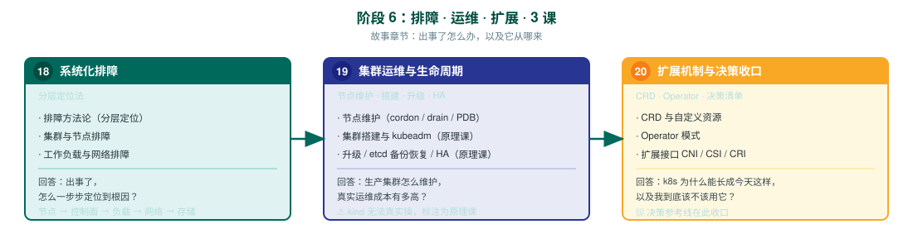

# 阶段 6：排障 · 运维 · 扩展

> 所属课程：Kubernetes 系统学习 ｜ 故事章节：**出事了怎么办，以及它从哪来** ｜ 上一阶段：[阶段 5《安全体系》](../5-安全体系/overview.md)

## 🎯 本阶段目标

- 形成**可复用的排障动作序列**：排障不靠灵感，靠分层定位
- 掌握节点维护的标准动作（cordon / drain / PDB），理解「安全地摘掉一台机器」为什么需要三者配合
- 理解生产集群的运维成本：kubeadm 搭建、版本升级、etcd 备份恢复、HA 控制平面
- 理解 k8s 的扩展机制（CRD / Operator / CNI / CSI / CRI），明白它为什么能长成今天这样
- **收口最初的决策问题**：该不该用 k8s

## 📍 学习重点

- **排障是分层定位**：节点 → 控制面 → 工作负载 → 网络 → 存储。逐层排除，而不是到处乱看日志
- **drain 为什么需要 PDB**：cordon 只是标记不可调度，drain 会驱逐 Pod —— 若不控制，可能一次性驱逐掉某服务的全部副本
- **⚠️ 实操边界**：kubeadm 搭建、版本升级、etcd 备份恢复、HA 控制平面**无法在 kind 上真实操**（kind 节点是容器，没有真正的 systemd 与多机网络）。这些内容作为**原理课**撰写，显式标注边界并给出生产环境对照
- **扩展接口是 k8s 生态的根**：CNI（网络）/ CSI（存储）/ CRI（运行时）三个接口把实现交给生态，这是 k8s 能成为标准的关键设计决策
- **CRD 与 Operator 是「把运维知识写进软件」**：理解 Operator 不是某个工具，而是一种模式
- **决策收口**：回到课 1 埋下的问题 —— 现在有足够的证据回答「该不该用 k8s」

## ✅ 必须掌握的知识点

| 知识点 | 所属课 | 学完应能 |
|--------|--------|----------|
| 排障方法论（分层定位） | 课 18 | 按固定分层序列定位故障，能说清每层的排查命令与判据 |
| 集群与节点排障 | 课 18 | 定位节点 NotReady、控制面组件异常、证书过期等故障 |
| 工作负载与网络排障 | 课 18 | 定位 Pending / CrashLoopBackOff / ImagePullBackOff / 服务不通；**含 finalizer 卡删除、EndpointSlice 无后端两个判据** |
| 节点维护（cordon / drain / PDB） | 课 19 | 安全摘除节点，用 PDB 保证驱逐期间服务不中断 |
| 节点关闭处理（原理课） | 课 19 | 区分计划内 drain 与非计划关机（断电/系统关机）两套机制，说清 graceful shutdown 的时限博弈 |
| 集群搭建与 kubeadm（原理课） | 课 19 | 说清 kubeadm 做了什么，以及生产环境还缺哪些步骤 |
| 升级与 etcd 备份恢复（原理课） | 课 19 | 说清升级顺序与版本偏差策略，能描述 etcd 备份恢复流程 |
| HA 控制平面（原理课） | 课 19 | 说清 HA 拓扑（堆叠 vs 外部 etcd）与各自的故障域 |
| CRD 与自定义资源 | 课 20 | 定义并使用 CRD，说清它与内置资源的关系 |
| Operator 模式 | 课 20 | 解释 Operator 是什么（模式而非工具），能举例说明它解决了什么 |
| API 聚合层 | 课 20 | 区分扩展 API 的两条路（CRD vs Aggregated APIServer），说清各自适用前提 |
| 扩展接口 CNI / CSI / CRI | 课 20 | 说清三个接口各自的职责与生态实现 |
| 该不该用 k8s：决策清单 | 课 20 | 给出判断条件与对比表，能对具体场景给出选型建议 |

## 🗺️ 本阶段路径图

> SVG 展示三课递进：课 18（怎么查问题）→ 课 19（怎么维护集群）→ 课 20（它从哪来、该不该用）。

## 本阶段产出

- [ ] `lessons/lesson-18-系统化排障分层定位法.md`
- [ ] `lessons/lesson-19-集群运维与生命周期.md`
- [ ] `lessons/lesson-20-扩展机制与决策收口.md`
