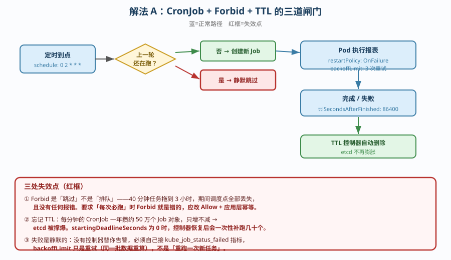
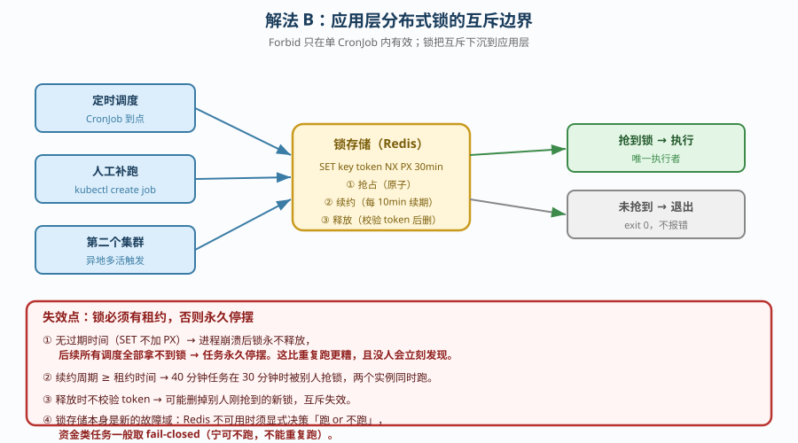
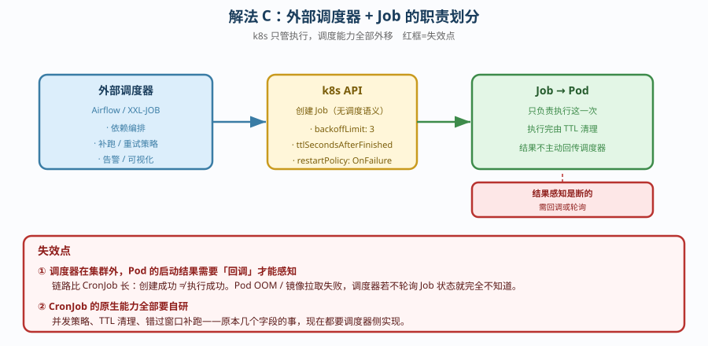

# 场景 1：一个「跑批任务」要上 k8s（经典设计题）

**场景描述**：团队有个每天凌晨 2 点跑的数据报表任务，单机脚本跑 40 分钟。现在要迁到 k8s。
要求：每天定时执行；失败了要能知道；**不能重复跑**；资源不能影响白天业务。

**🔒 先自己想 30 秒**：第一反应是「写个 CronJob 不就行了」？——那么，上次没跑完这次又到点了会怎样？跑完的 Job 对象谁清理？失败了你怎么知道？

<details><summary>💡 提示（分层 / 分维度想）</summary>

- **调度层**：用什么控制器？「不能重复跑」对应哪个字段？
- **失败层**：重试几次？重试与「重跑」是一回事吗？失败了谁通知你？
- **残留层**：Job 对象会自己消失吗？一年攒多少个？
- **资源层**：40 分钟的重任务会不会挤占白天的在线服务？
- **终止层**：任务跑到一半节点要维护，会发生什么？

</details>

<details><summary>📖 展开解法</summary>

### 解法一览

| 解法 | 效果（重复跑防护 / 残留风险） | 代价 | 适用边界 |
|------|---------------------------|------|---------|
| **A. CronJob + Forbid + TTL** | 防护：强（并发直接跳过）<br>残留：低（TTL 自动清理） | 错过执行窗口会**丢一次任务** | 幂等、可容忍跳过的报表类任务 |
| **B. CronJob + 应用层分布式锁** | 防护：最强（跨集群 / 跨调度器）<br>残留：低 | 需引入锁存储 + 锁续约逻辑 | 绝对不能并发的任务（如资金结算） |
| **C. 外部调度器 + Job** | 防护：由外部系统保证<br>残留：低（Job 只管执行） | 引入外部组件；CronJob 能力全部自研 | 已有 Airflow / XXL-JOB 的团队 |

### 各解法详解

#### 解法 A：CronJob + `concurrencyPolicy: Forbid` + TTL

思路：用 k8s 原生能力把三条要求全部满足——Forbid 防重跑、TTL 防残留、resources 防挤占。



读图：蓝色是正常路径（到点 → 检查上一轮 → 执行 → TTL 清理）；**红框是三处失效点**——① Forbid 会让超时的新调度被**静默跳过**（不是排队）；② 忘记 TTL 时 etcd 里 Job 对象**只增不减**；③ 失败是**静默的**，没有控制器会替你告警。

```yaml
apiVersion: batch/v1
kind: CronJob
metadata:
  name: daily-report
spec:
  schedule: "0 2 * * *"
  concurrencyPolicy: Forbid          # ← ① 防重跑：上一轮没结束就跳过本轮
  startingDeadlineSeconds: 300       # ← 错过超过 5 分钟就别补了（防雪崩式补跑）
  jobTemplate:
    spec:
      backoffLimit: 3                # ← ② 失败重试 3 次（注意：这是重试，不是重跑）
      ttlSecondsAfterFinished: 86400 # ← ③ 完成后 24h 自动删除，防 etcd 膨胀
      template:
        spec:
          restartPolicy: OnFailure   # ← 不能是 Always，CronJob 不支持
          containers:
          - name: report
            image: report:1.0
            resources:
              requests: {cpu: "1", memory: "2Gi"}   # ← ④ 按实测常态写，别虚高
              limits:   {cpu: "2", memory: "4Gi"}
```

> **代价 / 坑**：Forbid 的语义是**跳过**不是**排队**——40 分钟的任务若因故障拖到 3 小时，期间的调度点全部丢失且**没有任何报错**。若业务要求「必须每次都跑」，Forbid 就是错的，应改 `Allow` + 应用层幂等。
> 另一个隐性坑：`startingDeadlineSeconds` 若为 0（默认），控制器挂掉期间错过的任务会在恢复后**一次性补跑**（可能补几十个）。

#### 解法 B：CronJob 保留，但用应用层分布式锁兜底

思路：k8s 的 Forbid 只在**单个 CronJob 对象内**有效。若同一逻辑被多个 CronJob（多集群 / 多环境）触发，或有人手动 `kubectl create job`，Forbid 拦不住。此时把「互斥」下沉到应用层。



读图：两条触发路径（定时调度 / 人工补跑）都汇聚到**同一个锁存储**；**红框是失效点**——锁必须有**租约**（TTL），否则进程崩溃后锁永不释放，任务**永久停摆**（比重复跑更糟）。

```python
# 关键逻辑：带租约的锁（伪代码，示意核心三要素：抢占 / 续约 / 释放）
import redis, uuid, time
r = redis.Redis()
token = str(uuid.uuid4())

# ① 抢占：SET NX PX —— 原子操作，且必须带过期时间
if not r.set("lock:daily-report", token, nx=True, px=30*60*1000):
    print("已有实例在跑，退出"); exit(0)

try:
    # ② 续约：长任务必须在过期前续期（否则 40 分钟任务会在 30 分钟时被抢锁）
    def renew():
        while True:
            time.sleep(600)
            r.expire("lock:daily-report", 30*60)  # 实际应校验 token 再续
    threading.Thread(target=renew, daemon=True).start()
    run_report()
finally:
    # ③ 释放：只删自己的锁（用 token 校验，否则可能删掉别人新抢的锁）
    if r.get("lock:daily-report") == token.encode():
        r.delete("lock:daily-report")
```

> **代价 / 坑**：引入锁存储 = 引入新的故障域——Redis 不可用时，任务是「跑」还是「不跑」必须显式决策（一般是 fail-closed，宁可不跑也不能重复跑）。另外**续约逻辑写错**会让锁提前过期，防护形同虚设。

#### 解法 C：外部调度器（Airflow / XXL-JOB）+ Job

思路：把「调度」交给专业系统，k8s 只负责「执行」。CronJob 退化成普通的 Job。



读图：调度能力（依赖编排、补跑、告警、可视化）全部在集群外；**红框是失效点**——调度器在集群外，Pod 的启动结果需要**回调或轮询**才能感知，链路比 CronJob 长。

```yaml
# 外部调度器通过 API 或 kubectl 创建，Job 本身不含调度语义
apiVersion: batch/v1
kind: Job
metadata:
  name: daily-report-20260920
spec:
  backoffLimit: 3
  ttlSecondsAfterFinished: 86400
  template:
    spec:
      restartPolicy: OnFailure
      containers:
      - name: report
        image: report:1.0
        resources:
          requests: {cpu: "1", memory: "2Gi"}
          limits:   {cpu: "2", memory: "4Gi"}
```

> **代价 / 坑**：调度能力（依赖编排、补跑、告警、可视化）全部由外部系统提供，确实是**更强的**——但你要为它单独运维一套组件。且调度器在集群外，Pod 的启动结果需要**回调**才能感知，链路比 CronJob 长。
> 判断标准很简单：**团队是否已经在用调度系统**。若已有 Airflow，硬上 CronJob 是倒退；若没有，为一个报表任务引入 Airflow 是过度设计。

### 替代路线（非本课程 k8s 技术栈）

| 替代方案 | 思路 | 与本课程解法的差异 |
|---------|------|------------------|
| **云厂商定时任务**（AWS EventBridge / 阿里云定时触发器） | 定时触发函数计算或容器实例 | 无需常驻集群；但与 k8s 生态（Service / Secret / PVC）**割裂**，访问集群内服务要额外打通网络 |
| **宿主机 crontab + docker run** | 完全绕过 k8s | 最简单，但失去资源隔离、重试、可观测性；**节点挂了任务就没了** |
| **业务进程内置定时器**（如 APScheduler） | 应用自己管调度 | 与副本数冲突——**多副本会重复跑**，必须配合选主，等于自研分布式锁 |

### 推荐路径（递进，不是一次全上）

1. **先上解法 A**：CronJob + Forbid + TTL + resources。这四件套成本接近零，覆盖 90% 场景。
2. **补监控告警**（不是可选项）：Job 失败是**静默**的，必须自己接 `kube_job_status_failed` 指标。
3. **仍不够（多集群 / 绝对不可并发）才上解法 B**：加应用层锁。
4. **已有调度平台才考虑解法 C**：不要为了一个任务引入一套系统。

### 知识点挂钩

- CronJob / Job / TTL → 阶段 2 课 6（StatefulSet 与 DaemonSet 与 Job）
- resources requests/limits → 阶段 4 课 13（资源调度扩缩容）
- 优雅终止与 SIGTERM → 阶段 1 课 4（多容器 Pod 与优雅终止）
- 指标与告警 → [运维专项子教程](../子教程/运维专项/overview.md) 课 5（可观测性）

### 什么情况下此方案不适用

- **任务需要跨天续跑且不能被跳过** → Forbid 会丢调度，应改 `Allow` + 幂等设计。
- **任务是有状态的中间态（断点续跑）** → Job 重启后从头开始，需应用层自己存 checkpoint。
- **任务必须在集群外被感知结果** → CronJob 无回调机制，需外部轮询或应用主动上报。

### 做错会踩的坑

→ 关联 [08-实战经验.md](../08-实战经验.md)：**反例 10**（验收脚本不做幂等——「能跑但只能跑一次」）、**守则 6**（Job/CronJob 一定设 `ttlSecondsAfterFinished`）、**陷阱一**（把「没报错」当成「没问题」——Forbid 静默跳过没有任何报错）。

</details>
