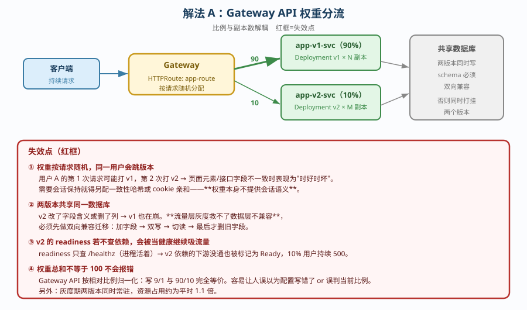
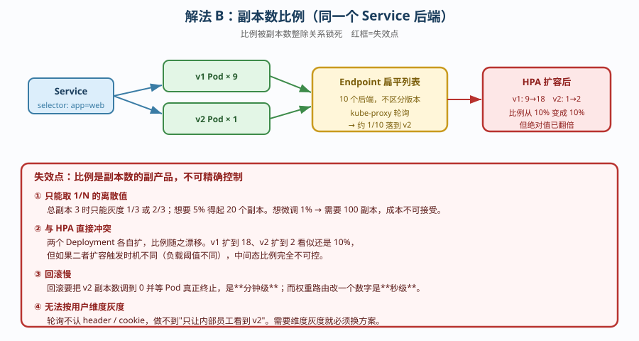
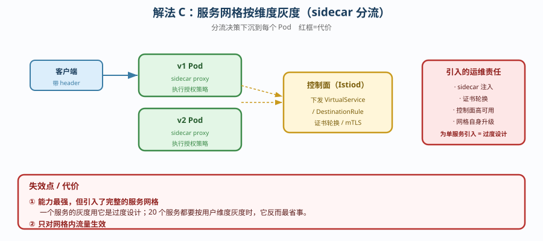

# 场景 2：服务要支持「灰度发布」（10% 流量给新版本 · 经典设计题）

**场景描述**：一个 Web 服务，想让新版本先接 10% 流量，观察无异常再全量。
要求：可逐步调比例；出问题能快速回滚；不能中断现有流量。

**🔒 先自己想 30 秒**：第一反应是「起一个新 Deployment，把 Service 的 selector 改一下」？——那么，10% 怎么精确表达？同一用户会不会在新旧版本间反复横跳？数据库 schema 兼容怎么办？

<details><summary>💡 提示（分层 / 分维度想）</summary>

- **入口层**：用什么资源做流量切分？比例怎么表达（几个副本 vs 权重）？
- **会话层**：权重是按请求随机的——同一个用户会不会跳版本？
- **数据层**：两个版本同时写同一个库，schema 怎么兼容？
- **回滚层**：回滚是「改权重」还是「改镜像」？哪个快？
- **观测层**：只看流量比例够吗？谁来判断「无异常」？

</details>

<details><summary>📖 展开解法</summary>

### 解法一览

| 解法 | 效果（比例精度 / 回滚速度） | 代价 | 适用边界 |
|------|--------------------------|------|---------|
| **A. Gateway API 权重路由** | 精度：高（权重精确可控）<br>回滚：秒级（改权重） | 需 Gateway API 实现；两版本常驻占资源 | 新项目、已用 Gateway API |
| **B. 副本数比例（1/10 副本）** | 精度：粗（受副本数整除限制）<br>回滚：慢（要改副本数） | 只能取 1/N 的离散值；扩容时比例会漂移 | 无网关能力、kube-proxy 轮询场景 |
| **C. 服务网格（Istio / Linkerd）** | 精度：最高（可按 header/用户维度）<br>回滚：秒级 | 引入网格组件，运维复杂度显著上升 | 多服务、需要按用户/地域灰度的中大型系统 |

### 各解法详解

#### 解法 A：Gateway API `HTTPRoute` 权重路由

思路：两个 Deployment 各自独立，由 `HTTPRoute` 的 `backendRefs` 权重决定分流比例——**比例与副本数解耦**。



读图：蓝色是请求经 Gateway 按权重分流到 v1/v2；**红框是三处失效点**——① 权重按请求**随机**，同一用户会跳版本；② 两个版本**共享同一个数据库**，schema 不兼容会同时打挂两边；③ v2 的 readiness 若不查依赖，会被当作健康继续吸流量。

```yaml
apiVersion: gateway.networking.k8s.io/v1
kind: HTTPRoute
metadata:
  name: app-route
spec:
  parentRefs:
  - name: shared-gateway
  rules:
  - backendRefs:
    - name: app-v1-svc
      weight: 90          # ← 90% 流量
      port: 80
    - name: app-v2-svc
      weight: 10          # ← 10% 流量（与副本数无关，这是关键）
      port: 80
---
# 两个 Deployment 用不同 label 区分，Service 各自独立
# 回滚 = 把权重改回 0/100，秒级生效（比改镜像 tag 触发滚动快得多）
```

> **代价 / 坑**：**权重是概率性的**——连打 100 次不一定精确落到 10 次，是二项分布。另外**权重总和不等于 100 不会报错**，Gateway API 会按相对比例归一化（写 `9/1` 与 `90/10` 等价），这容易让人误判配置。
> 还有个隐性成本：灰度期间两个版本**同时常驻**，资源占用约为平时的 1.1 倍。

#### 解法 B：副本数比例（靠 kube-proxy 轮询）

思路：不用任何网关能力，让 v1 与 v2 挂到**同一个 Service** 下，靠副本数比例（如 9 : 1）近似分流。



读图：Service 后端是**所有 Pod 的扁平列表**，kube-proxy 轮询分发；**红框是失效点**——比例被**副本数整除关系**锁死（总副本 3 时只能取 1/3、2/3），且 HPA 扩容时**比例会漂移**（扩到 12 副本时 1:2 的关系被打乱）。

```yaml
# v1：9 副本；v2：1 副本；共用同一个 Service（selector 用共同标签 app: web）
apiVersion: apps/v1
kind: Deployment
metadata: {name: web-v1}
spec:
  replicas: 9          # ← 比例由副本数表达，受整除关系限制
  selector: {matchLabels: {app: web}}
  template:
    metadata: {labels: {app: web, version: v1}}   # ← app 是共同标签，version 区分版本
---
apiVersion: apps/v1
kind: Deployment
metadata: {name: web-v2}
spec:
  replicas: 1
  selector: {matchLabels: {app: web}}
  template:
    metadata: {labels: {app: web, version: v2}}
```

> **代价 / 坑**：这是**最粗糙**的解法——比例只能是 `1/N`（总副本数决定），想要 5% 就得起 20 个副本。更麻烦的是**与 HPA 冲突**：HPA 扩容时两个 Deployment 各自扩，比例随之漂移。只建议在**没有网关能力且比例要求不精确**时用。

#### 解法 C：服务网格按维度灰度

思路：把分流决策从「入口」下沉到「每个 Pod 的 sidecar」，可以按 header、cookie、用户 ID、地域等任意维度路由。



读图：控制面把路由规则下发到每个 sidecar，分流在**调用侧**完成；**红框是代价**——引入了完整的服务网格，sidecar 注入、证书轮换、控制面高可用、网格升级全部成为你的运维责任，且**只对网格内流量生效**。

```yaml
# Istio VirtualService 示意：按 header 精确命中，未命中的走权重
apiVersion: networking.istio.io/v1beta1
kind: VirtualService
metadata: {name: app-vs}
spec:
  hosts: [app.example.com]
  http:
  - match:                              # ← ① 精确命中：内部测试人员永远看到 v2
    - headers:
        x-canary: {exact: "true"}
    route:
    - destination: {host: app-v2-svc}
  - route:                              # ← ② 其余流量按权重
    - destination: {host: app-v1-svc, subset: v1}
      weight: 90
    - destination: {host: app-v2-svc, subset: v2}
      weight: 10
```

> **代价 / 坑**：能力最强，但**引入了完整的服务网格**——sidecar 注入、证书轮换、控制面高可用、升级，全部变成你的运维责任。为一个服务的灰度引入网格，通常是**过度设计**；但当你有 20 个服务都要灰度、且要按用户维度时，它反而是最省事的。

### 替代路线（非本课程 k8s 技术栈）

| 替代方案 | 思路 | 与本课程解法的差异 |
|---------|------|------------------|
| **Ingress-NGINX Canary 注解** | `nginx.ingress.kubernetes.io/canary-weight: "10"` | 无需 Gateway API，但**Ingress 已冻结**（不再演进），且注解是厂商私有的、不可移植 |
| **云厂商 SLB / ALB 权重** | 在负载均衡层配置后端权重 | 与 k8s 解耦、由云管；但**感知不到 Pod 状态**，Pod 漂移时要靠健康检查兜底 |
| **DNS 权重解析** | 按解析比例分流 | 最外层，但**TTL 生效慢**（分钟级），回滚远不如改权重快 |

### 推荐路径（递进，不是一次全上）

1. **先上解法 A**：Gateway API 权重。10 分钟可配，回滚是改一个数字。
2. **补会话亲和**（若业务需要）：同一用户固定版本，靠 header 一致性哈希或 cookie。
3. **补自动回滚判据**：盯错误率 / P99，超阈值自动把权重打回 0——**人工盯盘不可靠**。
4. **多服务维度灰度才上解法 C**：单服务别引入网格。

### 知识点挂钩

- Gateway API / HTTPRoute → 阶段 3 课 9（Gateway API 下一代入口标准）
- Ingress 与灰度 → 阶段 3 课 8（Ingress 七层路由与灰度发布）
- readiness 探针查依赖 → 阶段 2 课 5（Deployment 无状态应用）
- Service 与 kube-proxy 轮询 → 阶段 3 课 7（Service 与 CoreDNS）

### 什么情况下此方案不适用

- **数据库 schema 不兼容** —— 任何流量层灰度都救不了，必须先做**双向兼容的迁移**（先加字段、双写、再切读、最后删旧字段）。
- **有强会话状态且未做共享存储** —— 用户跳版本会丢会话，需先解决会话外置。
- **批处理 / 非 HTTP 协议** —— 权重路由是七层能力，TCP/gRPC 需确认实现支持。

### 做错会踩的坑

→ 关联 [08-实战经验.md](../08-实战经验.md)：**反例 9**（三个探针打同一个端点——`/healthz` 只证明进程活着，不证明依赖可用，会让 v2 带病吸流量）、**陷阱一**（把「没报错」当成「没问题」——权重总和不等于 100 不报错，但语义被悄悄归一化）。

</details>
