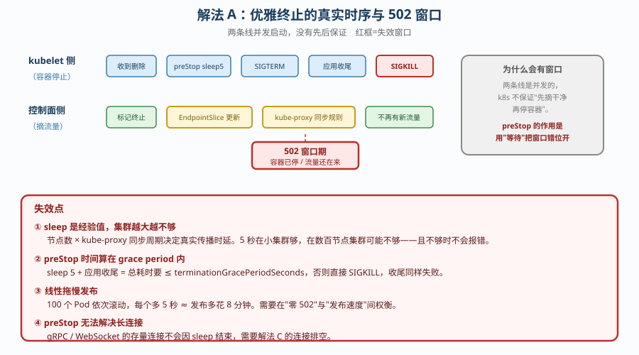
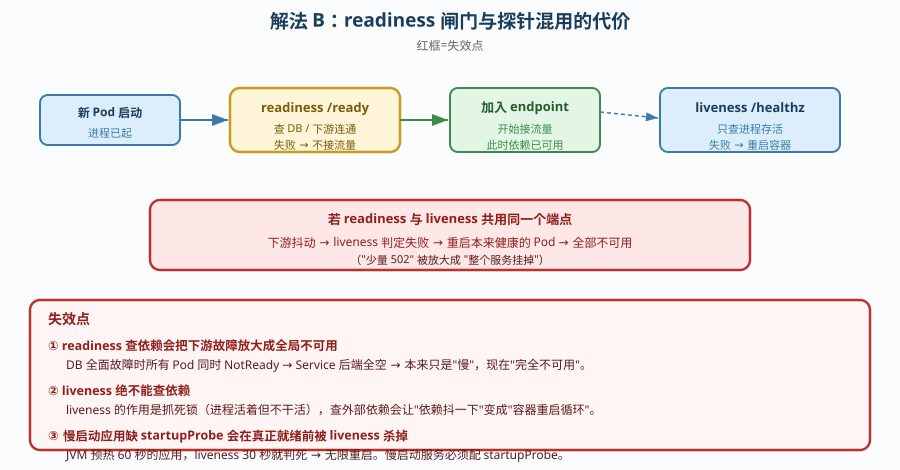
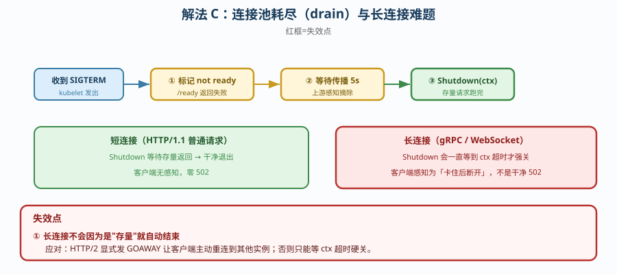

# 场景 3：一个服务在滚动更新时用户会看到 502（经典设计题）

**场景描述**：每次发版，总有少量请求返回 502。日志里能看到连接被拒，但 Pod 状态全程正常。
要求：找到根因并消除，且不能靠「半夜发版」规避。

**🔒 先自己想 30 秒**：第一反应是「Pod 重启期间必然有少量失败，正常」？——那么，Pod 被摘掉流量和容器真正停止之间，真的没有时差吗？新 Pod 被标记 Ready 的那一刻，它真的能服务吗？

<details><summary>💡 提示（分层 / 分维度想）</summary>

- **摘流量**：Pod 从 endpoint 移除，是瞬时的还是有时延的？谁在传播这个变更？
- **就绪**：新 Pod 通过 readiness 的判据是什么？查的是「进程活着」还是「依赖可用」？
- **终止**：容器收到 SIGTERM 后有多少时间收尾？默认多久？
- **耦合**：liveness 与 readiness 用同一个端点，会发生什么？

</details>

<details><summary>📖 展开解法</summary>

### 解法一览

| 解法 | 效果（502 消除程度 / 发布速度影响） | 代价 | 适用边界 |
|------|-----------------------------------|------|---------|
| **A. preStop 休眠 + 延长 grace** | 消除：主要解决**终止侧** 502<br>速度：发布变慢（多等 5~30 秒） | 每个 Pod 发布多花数秒 | 所有场景的基础配置（**必做**） |
| **B. readiness 查真实依赖** | 消除：解决**接入侧** 502<br>速度：几乎无影响 | 需应用暴露真实就绪端点 | 有外部依赖（DB / 缓存 / 下游）的服务 |
| **C. 优雅终止 + 连接池耗尽（drain）** | 消除：最彻底（含长连接）<br>速度：最慢 | 需应用配合实现连接排空 | 长连接 / gRPC / WebSocket 服务 |

### 各解法详解

#### 解法 A：`preStop` 休眠 + 延长 `terminationGracePeriodSeconds`

思路：Pod 被判定要删除时，**先等几秒再真正停**——给 kube-proxy / EndpointSlice 的变更传播留出时间。



读图：蓝色是「先摘流量、后停容器」的理想顺序；**红框是真实时序的错位**——kubelet 发 SIGTERM 与 endpoint 传播是**并发**发生的，没有先后保证，所以中间存在窗口期，此窗口内的请求打到已停止的 Pod 就是 502。

```yaml
spec:
  template:
    spec:
      terminationGracePeriodSeconds: 60   # ← ② 给足收尾时间（默认 30 秒常不够）
      containers:
      - name: app
        lifecycle:
          preStop:
            exec:
              command: ["sleep", "5"]     # ← ① 先睡 5 秒，等 endpoint 传播完
```

> **代价 / 坑**：`sleep` 时长是**拍脑袋的经验值**——集群越大、节点越多，传播越慢，5 秒可能不够。且它会**线性拖慢发布**：100 个 Pod 依次滚动，每个多 5 秒就是 8 分钟。另一个易错点：**`preStop` 的时间算在 grace period 内**，`sleep 5` + 应用收尾 55 秒 = 60 秒刚好够，超了就 SIGKILL。

#### 解法 B：readiness 探针查真实依赖

思路：新 Pod 必须在**依赖可用**后才被标记为 Ready，否则不该接流量。



读图：新 Pod 启动后先进入未就绪状态，readiness 持续探测下游依赖；**红框是失效点**——若 readiness 与 liveness **共用端点**，liveness 会因为依赖抖动而重启**本来健康的 Pod**，把「少量 502」变成「全部不可用」。

```yaml
readinessProbe:
  httpGet: {path: /ready, port: 8080}    # ← 必须查依赖（DB 连通、下游可达）
  periodSeconds: 5
  failureThreshold: 3
livenessProbe:
  httpGet: {path: /healthz, port: 8080}  # ← 只证明进程活着，绝不能查依赖
  periodSeconds: 10
  failureThreshold: 3
startupProbe:
  httpGet: {path: /healthz, port: 8080}  # ← 慢启动应用的保护伞
  failureThreshold: 30
  periodSeconds: 10
```

> **代价 / 坑**：readiness 查依赖有个**反向风险**——下游全面故障时，所有 Pod 同时变为 NotReady，Service 后端全空，**故障被放大**（本来只是慢，现在是完全不可用）。所以 `/ready` 里对非关键依赖应当**降级处理**（如缓存挂了仍算 ready），只把**强依赖**纳入判据。

#### 解法 C：优雅终止 + 连接池耗尽（connection draining）

思路：`preStop` 不只是「睡一会儿」，而是让应用**主动停止接受新连接、但把存量请求处理完**。



读图：三步依次是「标记 not ready → 等待传播 → Shutdown」；**红框是失效点**——**长连接（gRPC / WebSocket）不会因为是"存量"就自动结束**，`Shutdown` 会一直等到 ctx 超时才强制关闭，客户端感知为「卡住后断开」而非干净的 502。

```go
// Go 服务示意：收到 SIGTERM 后先关监听、再等待存量请求完成
srv := &http.Server{Addr: ":8080"}

go func() {
    sig := make(chan os.Signal, 1)
    signal.Notify(sig, syscall.SIGTERM)
    <-sig

    // ① 先把自己从 endpoint 摘掉（主动标记 not ready）
    atomic.StoreInt32(&isReady, 0)

    // ② 再等一小段，让上游感知到摘除
    time.Sleep(5 * time.Second)

    // ③ 优雅关闭：停止接受新连接，等待存量请求（最多 30 秒）
    ctx, cancel := context.WithTimeout(context.Background(), 30*time.Second)
    defer cancel()
    srv.Shutdown(ctx)   // ← 不是 srv.Close()，后者会硬断连接
}()

srv.ListenAndServe()
```

> **代价 / 坑**：**长连接（gRPC / WebSocket）不会因为是"存量"就自动结束**——`Shutdown` 会一直等到超时才强制关闭，客户端可能感知为「卡住后断开」而非 502。对长连接应显式发 `GOAWAY`（HTTP/2）让客户端主动重连到其他实例。

### 替代路线（非本课程 k8s 技术栈）

| 替代方案 | 思路 | 与本课程解法的差异 |
|---------|------|------------------|
| **服务网格的 outbound 重试** | sidecar 自动重试失败请求 | 对**幂等**请求有效且无需改应用；但非幂等（下单）重试会造成重复提交 |
| **蓝绿部署（Blue/Green）** | 全量切流，不存在中间态 | 彻底消除滚动期 502，但**资源翻倍**，且切换瞬间仍是"全有或全无" |
| **客户端重试 + 熔断** | 调用方重试一次 | 把问题推给调用方；只能掩盖，且不适用于非幂等接口 |

### 推荐路径（递进，不是一次全上）

1. **先做解法 A**：`preStop` + 延长 grace。零侵入，解决大部分终止侧 502。
2. **再做解法 B**：readiness 查依赖。解决接入侧 502，且顺便让「依赖挂了」这件事可观测。
3. **长连接服务才做解法 C**：应用侧实现 drain。
4. **最后加验证**：滚动更新期间**持续压测**看错误率——只看 Pod 状态永远看不出 502。

### 知识点挂钩

- 优雅终止 / preStop / grace period → 阶段 1 课 4（多容器 Pod 与优雅终止）
- 三种探针的分工 → 阶段 2 课 5（Deployment 无状态应用）
- Service endpoint 传播 → 阶段 3 课 7（Service 与 CoreDNS）
- 滚动更新策略 → 阶段 2 课 5（maxSurge / maxUnavailable）

### 什么情况下此方案不适用

- **应用无法处理 SIGTERM**（如某些 C++ 老服务直接忽略信号）——只能靠 grace period 兜底，无法优雅收尾。
- **发布要求秒级完成且 Pod 数极多** —— `preStop` 会线性拖慢发布，此时更适合蓝绿或调大 `maxSurge`。
- **下游强依赖本身不可用** —— 任何探针技巧都救不了，应先修复依赖或做降级。

### 做错会踩的坑

→ 关联 [08-实战经验.md](../08-实战经验.md)：**反例 9**（三个探针打同一个端点——liveness 查依赖会导致**正常 Pod 被杀**）、**陷阱一**（把「没报错」当成「没问题」——Pod 状态全程 Running，但用户已经在看 502）。

</details>
