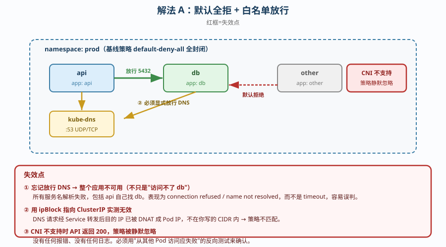
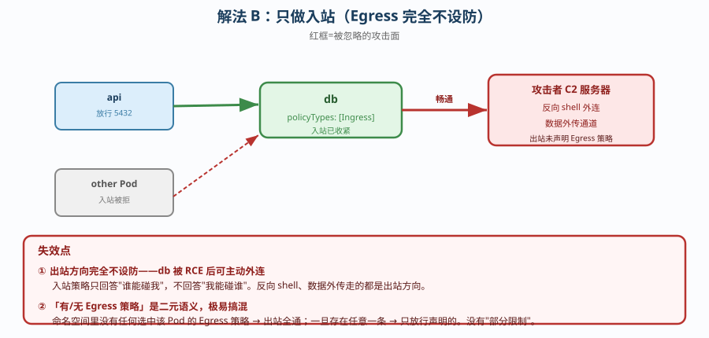
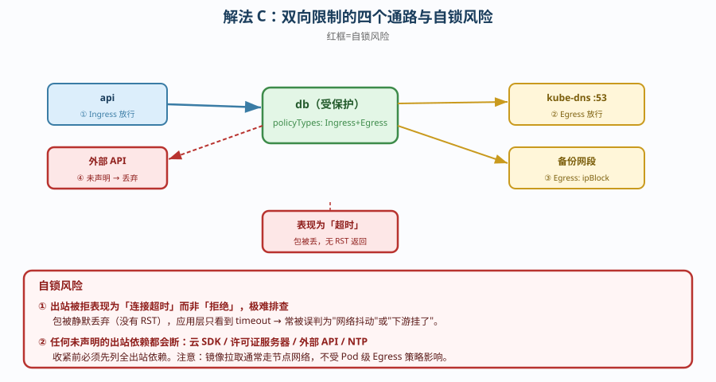

# 场景 4：一个服务只能被另一个服务访问，其他都不行（经典设计题）

**场景描述**：`api` 服务要访问 `db`，但**其他任何 Pod 都不允许访问 db**。
要求：默认全拒；只放行 api → db；不能影响 DNS。

**🔒 先自己想 30 秒**：第一反应是「写一条 NetworkPolicy，从 api 放行到 db」？——那么，只写这一条够吗？策略写完了怎么确认它真的生效（而不是被 CNI 静默忽略）？DNS 要不要放行？

<details><summary>💡 提示（分层 / 分维度想）</summary>

- **默认姿态**：NetworkPolicy 是白名单模型还是黑名单？不写策略时是什么状态？
- **方向**：只限制入站够吗？被攻破的 db 主动外连呢？
- **DNS**：为什么这是最容易漏的一条？漏了会怎样？
- **生效前提**：CNI 不支持时会发生什么？有报错吗？
- **验证**：正向通了就算成功吗？

</details>

<details><summary>📖 展开解法</summary>

### 解法一览

| 解法 | 效果（隔离强度 / 配置复杂度） | 代价 | 适用边界 |
|------|----------------------------|------|---------|
| **A. 默认全拒 + 逐条放行** | 强度：强（默认拒绝）<br>复杂度：中（要维护放行清单） | 新增服务要记得加策略，否则不通 | 生产推荐**基准做法** |
| **B. 只做入站（Ingress）** | 强度：中（挡 inbound）<br>复杂度：低 | 被攻破的 Pod 可主动外连（C2 通道） | 起步阶段、先解决最明显风险 |
| **C. 双向（Ingress + Egress）** | 强度：最强<br>复杂度：高（策略数翻倍） | 调试困难，容易把自己锁在外面 | 合规要求、多租户、高安全场景 |

### 各解法详解

#### 解法 A：默认全拒 + 逐条放行（推荐基准）

思路：先在命名空间内建一条「选中所有 Pod、拒绝所有流量」的基线策略，再为每一条合法通路单独开洞。



读图：基线策略把整个命名空间变成「全封闭」，只有显式放行的三条通路（DNS / api→db / 入站）能通；**红框是三处失效点**——① 忘记放行 DNS 会让**所有**服务名解析失败；② 用 `ipBlock` 指向 ClusterIP **实测无效**；③ CNI 不支持时策略**静默不生效**。

```yaml
# ① 基线：默认全拒（选中所有 Pod，但没有任何 ingress/egress 规则）
apiVersion: networking.k8s.io/v1
kind: NetworkPolicy
metadata: {name: default-deny-all, namespace: prod}
spec:
  podSelector: {}                      # ← 空 selector = 选中本 ns 所有 Pod
  policyTypes: [Ingress, Egress]
---
# ② 放行 DNS（最容易忘的一条，漏了整个应用不可用）
apiVersion: networking.k8s.io/v1
kind: NetworkPolicy
metadata: {name: allow-dns, namespace: prod}
spec:
  podSelector: {}
  policyTypes: [Egress]
  egress:
  - to:
    - namespaceSelector: {}
      podSelector:
        matchLabels: {k8s-app: kube-dns}
    ports:
    - {protocol: UDP, port: 53}
    - {protocol: TCP, port: 53}
---
# ③ 放行 api → db
apiVersion: networking.k8s.io/v1
kind: NetworkPolicy
metadata: {name: db-allow-from-api, namespace: prod}
spec:
  podSelector: {matchLabels: {app: db}}     # ← 作用在 db 上
  policyTypes: [Ingress]
  ingress:
  - from:
    - podSelector: {matchLabels: {app: api}}
    ports:
    - {protocol: TCP, port: 5432}
```

> **代价 / 坑**：**默认全拒是「先断网再开通」**，意味着任何一个新增服务在配好策略前都是**不通的**——这在存量集群里直接推行会造成大面积故障。正确做法是**先只开 `policyTypes: [Ingress]` 观察，或用 Warn 模式的 VAP 先摸清实际流量**。

#### 解法 B：只做入站（Ingress）

思路：只保护「谁能访问 db」，不限制 db 自己能访问谁。



读图：入站方向已收紧（只有 api 能进），但**出站方向完全敞开**；**红框是失效点**——db 被 RCE 后可主动外连到攻击者 C2 服务器（反向 shell / 数据外传），入站策略对此零防护。

```yaml
apiVersion: networking.k8s.io/v1
kind: NetworkPolicy
metadata: {name: db-ingress-only, namespace: prod}
spec:
  podSelector: {matchLabels: {app: db}}
  policyTypes: [Ingress]                # ← 只声明 Ingress，Egress 不受限
  ingress:
  - from:
    - podSelector: {matchLabels: {app: api}}
    ports:
    - {protocol: TCP, port: 5432}
```

> **代价 / 坑**：这是**最常见的"以为隔离了"**——db 被 RCE 后可以直接外连到攻击者服务器（反向 shell / 数据外传），出站方向**完全不设防**。另外注意：一旦某个命名空间里**存在任何**选中该 Pod 的 Egress 策略，该 Pod 的出站就被限制；**没有任何 Egress 策略时出站是全通的**——这个「有/无」的二元语义很容易搞混。

#### 解法 C：双向限制（Ingress + Egress）

思路：入站出站都收紧，db 只能接 api 的入站，也只能访问它真正需要的东西（如 NTP、备份存储）。



读图：四个方向的通路都要显式声明；**红框是自锁风险**——Egress 一旦收紧，任何未声明的出站（镜像拉取通常走节点网络不受影响，但**应用探测外部 API、调用云厂商 SDK、访问许可证服务器**）都会失败，且失败表现为「超时」而非「拒绝」，极难排查。

```yaml
apiVersion: networking.k8s.io/v1
kind: NetworkPolicy
metadata: {name: db-bidirectional, namespace: prod}
spec:
  podSelector: {matchLabels: {app: db}}
  policyTypes: [Ingress, Egress]
  ingress:
  - from:
    - podSelector: {matchLabels: {app: api}}
    ports: [{protocol: TCP, port: 5432}]
  egress:
  - to:                                  # ← 只放行 DNS 与备份存储
    - namespaceSelector: {}
      podSelector: {matchLabels: {k8s-app: kube-dns}}
    ports: [{protocol: UDP, port: 53}]
  - to:
    - ipBlock: {cidr: 10.20.0.0/16}      # ← 备份网段（ipBlock 只对"真实 IP"有效）
    ports: [{protocol: TCP, port: 443}]
```

> **代价 / 坑**：**最容易把自己锁死**。`ipBlock` 只能匹配**最终目的 IP**——访问 ClusterIP 时，DNAT 后的真实 Pod IP 不在你写的 CIDR 里，所以 `ipBlock` 指 ClusterIP **实测无效**（课程实测踩过）。另外出站被拒的表现是**连接超时**（包被丢弃，没有 RST），排查时很容易误判成「网络抖动」或「下游挂了」。

### 替代路线（非本课程 k8s 技术栈）

| 替代方案 | 思路 | 与本课程解法的差异 |
|---------|------|------------------|
| **服务网格 mTLS + 授权策略** | 基于身份（SPIFFE）而非 IP 做授权 | 不怕 IP 漂移、支持 L7 方法级授权；但需引入网格，且**仅对网格内流量生效** |
| **CiliumNetworkPolicy** | 基于 eBPF，支持 L7 / DNS 级策略 | 能力远超原生（如 `toFQDNs` 按域名放行）；但**绑定 Cilium CNI**，不可移植 |
| **云安全组 / 子网 ACL** | 在 VPC 层隔离 | 与 k8s 解耦、由网络团队管；但**粒度到节点**，无法区分同节点上的两个 Pod |

### 推荐路径（递进，不是一次全上）

1. **先确认 CNI 支持**（这是前提，不是步骤）——不支持的话后面全是白做，且**不报任何错**。
2. **先做解法 B**：只加 Ingress 策略，观察业务无异常。
3. **再加 DNS 放行 + 基线全拒**（解法 A）——此时风险已可控。
4. **合规要求才上解法 C**：出站收紧前，**先列出所有出站依赖**（外部 API / 许可证 / 云 SDK）。

### 知识点挂钩

- NetworkPolicy 白名单模型 → 阶段 3 课 10（NetworkPolicy 集群内防火墙）
- DNS 放行与 `ipBlock` 失效 → 阶段 3 课 10 实测（对应 [08-实战经验.md](../08-实战经验.md) 反例 4）
- CNI 支持性 → 阶段 3 课 10（kindnet 支持，很多 CNI 不支持）
- Service 与 ClusterIP DNAT → 阶段 3 课 7（Service 与 CoreDNS）

### 什么情况下此方案不适用

- **CNI 不支持 NetworkPolicy**（如 flannel 默认配置）——策略会被**静默忽略**，且 API 返回 200，你以为配好了。
- **需要 L7（HTTP 方法 / 路径）级授权** —— 原生 NetworkPolicy 只到 L4，需要网格或 Cilium。
- **Pod IP 频繁变化且无标签体系** —— 策略基于 label selector，标签混乱时策略会失配。

### 做错会踩的坑

→ 关联 [08-实战经验.md](../08-实战经验.md)：**反例 4**（NetworkPolicy 忘了放行 DNS——服务名全部解析失败，**整个应用不可用**；且 `ipBlock` 指向 ClusterIP 实测无效）、**陷阱四**（把「抽象层」当成「实现层」——写了策略不等于 CNI 真的执行了）。

</details>
