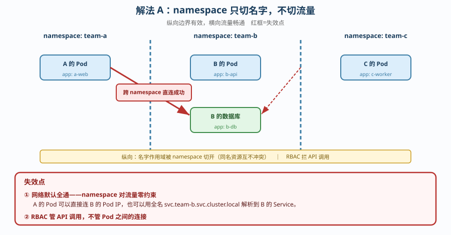
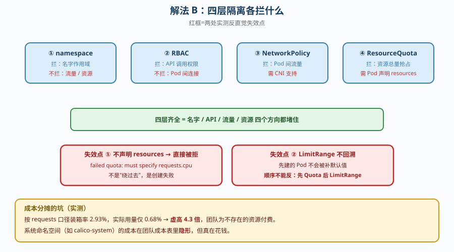
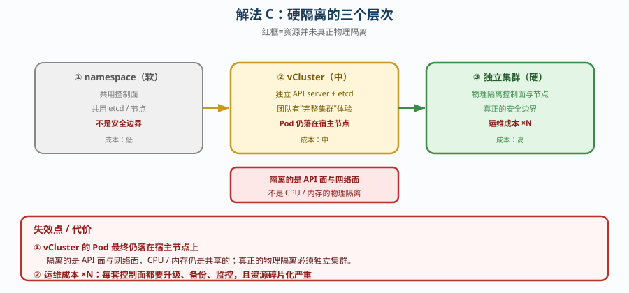

# 场景 5：多团队共用一个集群，怎么隔离（规模压力题）

**场景描述**：三个团队（A / B / C）要共用一个集群，各自部署自己的服务。
要求：互相看不到对方的东西；不能互相影响（一个团队打满资源不影响别人）；能算清各自成本。

**🔒 先自己想 30 秒**：第一反应是「给每个团队一个 namespace 不就隔离了」？——那么，namespace 能拦住网络流量吗？能拦住资源抢占吗？A 团队的 Pod 能不能直接连 B 团队的数据库？

<details><summary>💡 提示（分维度想）</summary>

- **名字层**：namespace 隔离的是什么？不是什么？
- **权限层**：RBAC 拦的是什么？能拦网络流量吗？
- **网络层**：Pod 之间默认是什么状态（通还是不通）？
- **资源层**：怎么限制总量？Pod 不声明 resources 会怎样？
- **成本层**：按什么口径分摊才公平？

</details>

> ⚠️ **边界声明**：本题为**原理推演 + 部分实测**。当前集群无 LimitRange / ResourceQuota / 业务 NetworkPolicy 实例，vCluster 未安装，「不回溯」「配额拒绝」等结论未能本轮复现；成本口径与网络非隔离为实测。详见文末「实测边界与验证清单」。

<details><summary>📖 展开解法</summary>

### 解法一览（效果维度：隔离强度 / 落地成本）

| 解法 | 效果（隔离强度 / 落地成本） | 代价 | 适用边界 |
|------|---------------------------|------|---------|
| **A. namespace + RBAC（软隔离）** | 强度：低（只隔离名字与 API 权限）<br>成本：低 | **网络默认全通**，A 能直接连 B 的库 | 团队间互信、仅做管理边界 |
| **B. 四层齐全（ns + RBAC + NetworkPolicy + Quota）** | 强度：中（可防误操作与资源抢占）<br>成本：中 | 需配 LimitRange，否则不声明 resources 的 Pod 被直接拒绝 | **推荐基准**：同公司内多团队 |
| **C. 独立集群 / 虚拟集群（硬隔离）** | 强度：高（真正的安全边界）<br>成本：高（多套控制面） | 运维成本 ×N，资源碎片化 | 强合规、跨公司、不可互信场景 |

### 各解法详解

#### 解法 A：namespace + RBAC（软隔离）

思路：每个团队一个 namespace，用 Role + RoleBinding 把权限锁在本 namespace 内。



读图：namespace 是一条**纵向的命名边界**，把名字空间切开；**红框是失效点**——横向的**网络流量完全不受 namespace 影响**，A 的 Pod 可以直接连 B 的 Pod IP 或 Service（DNS 全名 `svc.ns.svc.cluster.local` 可跨 ns 解析）。

```yaml
apiVersion: rbac.authorization.k8s.io/v1
kind: Role
metadata: {name: team-a-role, namespace: team-a}
rules:
- apiGroups: [""]
  resources: ["pods", "pods/log", "services", "configmaps"]
  verbs: ["get", "list", "watch", "create", "update", "delete"]
---
apiVersion: rbac.authorization.k8s.io/v1
kind: RoleBinding
metadata: {name: team-a-binding, namespace: team-a}
subjects:
- kind: Group
  name: team-a
  apiGroup: rbac.authorization.k8s.io
roleRef: {kind: Role, name: team-a-role, apiGroup: rbac.authorization.k8s.io}
```

> **代价 / 坑**：这是**最常见的"以为隔离了"**——RBAC 管的是「你能不能调 API」，**完全不管「你的 Pod 能不能连我的 Pod」**。网络默认全通意味着 A 团队一次误配（或一次入侵）就能直接碰到 B 的数据库。反过来，**只做这一层也不是全无价值**：它确实防住了「手滑删别人资源」。

#### 解法 B：四层齐全（推荐基准）

思路：namespace（名字）+ RBAC（API）+ NetworkPolicy（网络）+ ResourceQuota（资源）四层叠加，另配 LimitRange 兜住「不声明 resources」的 Pod。



读图：四层像四道闸门依次叠加，每层拦不同的东西；**红框是两处失效点**——① 不声明 resources 的 Pod 会被配额**直接拒绝**（不是"绕过去"）；② LimitRange **不回溯**，先建的 Pod 不会被补默认值。

```yaml
# ③ 资源总量限制
apiVersion: v1
kind: ResourceQuota
metadata: {name: team-a-quota, namespace: team-a}
spec:
  hard:
    requests.cpu: "10"
    requests.memory: 20Gi
    pods: "50"
---
# ④ 默认值兜底（否则不声明 resources 的 Pod 直接被配额拒绝）
apiVersion: v1
kind: LimitRange
metadata: {name: team-a-lr, namespace: team-a}
spec:
  limits:
  - type: Container
    defaultRequest: {cpu: "100m", memory: "128Mi"}
    default: {cpu: "500m", memory: "512Mi"}
```

> **代价 / 坑**：两个实测反直觉点——**① 不声明 resources 的 Pod 会被配额直接拒绝**（`must specify requests.cpu`），用户会一脸懵；**② LimitRange 不回溯**，先建的 Pod 不会被补默认值，所以「先建 Pod 后加 LimitRange」的顺序下存量 Pod 仍是裸的。
> 另外**成本按 requests 分摊会虚高**：实测 requests 口径装箱率 2.93%，实际用量只有 0.68%（**虚高 4.3 倍**），团队会为不存在的资源付费。

#### 解法 C：独立集群或 vCluster（硬隔离）

思路：namespace **从来不是安全边界**。真正不可互信时，只有独立的控制面（或虚拟集群）才够。



读图：从 namespace（软）→ vCluster（中）→ 独立集群（硬），隔离强度递增；**红框是代价**——vCluster 的 Pod **最终仍落在宿主节点上**（隔离的是 API 面与网络面，不是 CPU/内存），而独立集群的运维成本是 ×N。

```bash
# vCluster：在宿主集群里跑一个轻量独立控制面（有自己的 API server 与 etcd）
vcluster create team-a --namespace team-a-host
# 团队拿到的是一个"看起来完整的集群"，kubectl 体验一致
```

> **代价 / 坑**：运维成本 ×N——每个虚拟集群都要升级、备份、监控。而且**资源并未真正物理隔离**（vCluster 的 Pod 最终仍落在宿主节点上），只是**API 面与网络面隔离**。真正的物理隔离要独立集群，成本更高且资源碎片化严重。

### ✅ 实测边界与验证清单（2026-09-21 补充）

| 结论 | 状态 | 依据 |
|------|------|------|
| requests 口径装箱率 2.93% vs 实际 0.68%（虚高 4.3 倍） | ✅ **实测** | 运维专项课 6，2026-09-20 实测 |
| namespace 不隔离网络（跨 ns DNS 全名可解析） | ✅ **实测** | 阶段 3 课 10，NetworkPolicy 课实测 |
| 不声明 resources 的 Pod 被配额**直接拒绝** | ⚠️ **需复核** | 本机当前**无 ResourceQuota**，见下 |
| LimitRange 不回溯（先建的 Pod 不被补默认值） | ⚠️ **推演** | 本机当前**无 LimitRange** |
| vCluster 虚拟集群 | ⚠️ **推演** | `vcluster` **未安装** |
| 独立集群硬隔离 | ⚠️ **推演** | 本机仅 1 套运行中的集群 |

#### 2026-09-21 复核结果

```bash
$ kubectl get limitrange -A      → No resources found
$ kubectl get resourcequota -A   → No resources found
$ kubectl get netpol -A          → 仅 calico-system/allow-apiserver（系统自带，非业务规则）
```

也就是说：**场景 5 解法 A/B 的 YAML 在当前集群里没有任何落地实例**。此前记录的「不声明 resources 被拒绝」「LimitRange 不回溯」来自其他时段或其他环境的演练，**本轮未能重新复现**，因此按下表定性——结论方向可信（它们是 k8s 的既定行为），但**引用时请自行验证一次**。

#### 想自己验证，按这个清单做

```bash
# ① 建命名空间 + 先放一个不声明 resources 的 Pod（顺序很重要）
kubectl create ns team-a
kubectl run bare -n team-a --image=nginx --restart=Never   # 不声明 resources

# ② 先加 Quota，观察"裸 Pod"被拒（这是反直觉点之一）
kubectl apply -f quota.yaml
kubectl run bare2 -n team-a --image=nginx --restart=Never
# 判据：bare2 失败，事件含 "must specify requests.cpu"

# ③ 再加 LimitRange，验证"不回溯"
kubectl apply -f limitrange.yaml
kubectl get pod bare -n team-a -o jsonpath='{.spec.containers[0].resources}'
# 判据：bare（先建的）仍为空 ← 证明不回溯
kubectl run newone -n team-a --image=nginx --restart=Never
# 判据：newone（后建的）被自动补上默认值

# ④ 验证网络隔离（从"软"到"真"的分水岭）
kubectl run probe -n team-a --rm -it --image=curlimages/curl -- \
  curl -s -m 5 http://<svc-b>.team-b.svc.cluster.local
# 加 NetworkPolicy 前：应能通（证明 namespace 不管流量）
# 加默认拒绝后：应超时

# ⑤ 清理
kubectl delete ns team-a
```

**顺序提醒**：② → ③ 的顺序不能反（先 LimitRange 后 Quota），否则 Pod 会被补默认值从而绕过配额，你会误以为"配额没生效"。

### 替代路线（非本课程 k8s 技术栈）

| 替代方案 | 思路 | 与本课程解法的差异 |
|---------|------|------------------|
| **vCluster / 虚拟集群** | 每团队一个轻量控制面 | API 面完全隔离、团队有"完整集群"体验；但**资源仍落在宿主节点**，且多套控制面要运维 |
| **Karmada / 多集群联邦** | 物理独立集群 + 统一分发 | 真正硬隔离；但引入联邦层，故障域与复杂度显著上升 |
| **云厂商专属节点池 +  IAM** | 节点级独占 + 云 IAM 授权 | 隔离粒度到节点，成本可算清；但**失去了集群内资源共享的弹性** |

### 推荐路径（递进，不是一次全上）

1. **先做 A**：namespace + RBAC。成本最低，先防住「手滑删别人东西」。
2. **加 NetworkPolicy**（这是从"软"到"真"的分水岭）：默认全拒 + 放行同 ns 内通信。
3. **加 ResourceQuota + LimitRange**：先 Quota 后 LimitRange，且**顺序不能反**（反了会大面积拒绝）。
4. **成本可见性**：同时看 requests 口径与实际用量，**别只按 requests 分摊**；系统命名空间成本要显式承担。
5. **合规要求才上 C**。

### 知识点挂钩

- namespace 与 RBAC → 阶段 5 课 15（RBAC 与 ServiceAccount）
- NetworkPolicy → 阶段 3 课 10（NetworkPolicy 集群内防火墙）
- ResourceQuota / LimitRange → 阶段 4 课 13（资源调度扩缩容）
- 多租户与成本 → [运维专项子教程](../子教程/运维专项/overview.md) 课 6（多租户与配额，2026-09-20 实测）

### 什么情况下此方案不适用

- **团队间不可互信 / 强合规**（金融、跨公司）——namespace 不是安全边界，必须上解法 C。
- **需要集群级资源**（CRD、Webhook、PSA 标签）——这类资源无法按 namespace 授权，共用一个集群必然互相干扰。
- **资源需求高度波动且总量吃紧**——Quota 会扼杀弹性，此时独立集群更合适。

### 做错会踩的坑

→ 关联 [08-实战经验.md](../08-实战经验.md)：**反例 3**（默认挂载 SA token——应用被 RCE 后 token 可调 API，团队边界形同虚设）、**反例 6**（只写 limits 不写 requests——requests 被自动补成虚高值，成本分摊失真）、**陷阱四**（把「抽象层」当成「实现层」）。

</details>
