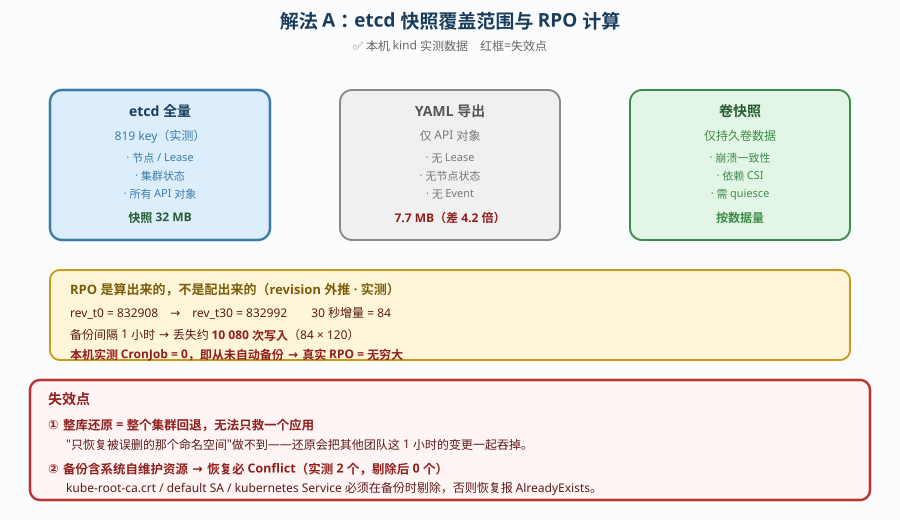
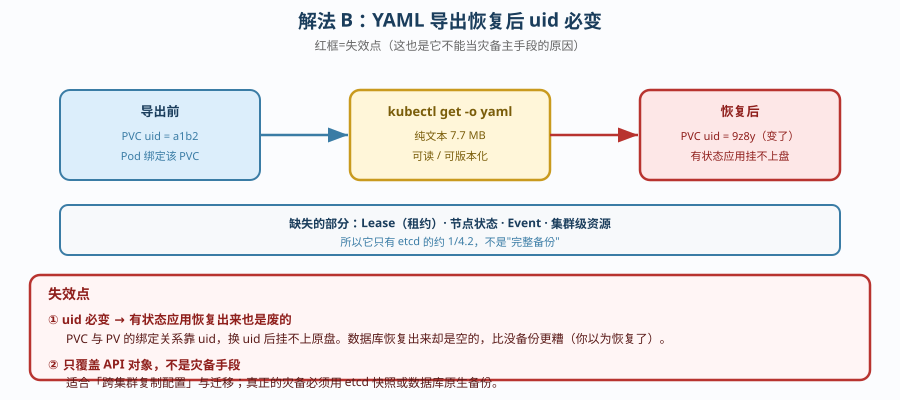
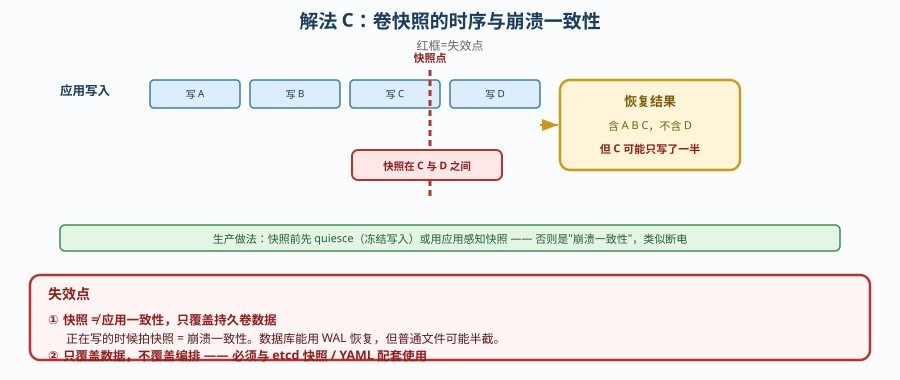

# 场景 6：给一个集群设计灾备方案（RPO / RTO 怎么定 · 规模压力题）

**场景描述**：公司有一个生产集群，老板要求「数据不能丢、故障要能快速恢复」。
要求：给出可落地的备份策略，并说明**能接受丢多少数据、多久恢复**。

**🔒 先自己想 30 秒**：第一反应是「每天备份一次不就行了」？——那么，「数据不能丢」到底是多少？一天？一小时？还是零？备份做完了，你怎么证明它**真的能恢复**？

<details><summary>💡 提示（分维度想）</summary>

- **需求翻译**：老板说的「不能丢」是一个数字吗？怎么把它变成可验证的指标？
- **备份对象**：备份 etcd 和备份 YAML，覆盖的东西一样吗？差多少？
- **RPO 怎么定**：写「1 小时」和「真的只丢 1 小时」是一回事吗？怎么算？
- **恢复验证**：没演练过的备份，能算备份吗？
- **存放位置**：备份存在同一个集群里，集群没了怎么办？

</details>

<details><summary>📖 展开解法</summary>

> ✅ 本机实测环境：kind 3 节点 v1.34.0 / Calico。备份体量与 revision 增速为**演练期快照**，非生产常态。
> ⚠️ **卷快照（解法 C）为原理推演** —— 本机无 snapshot API（`volumesnapshotclass` 不存在），YAML 无法真实 apply。详见文末「实测边界与验证清单」。

### 解法一览（效果维度：RPO 可达 / 恢复完整性）

| 解法 | 效果（RPO 可达 / 恢复完整性） | 代价 | 适用边界 |
|------|----------------------------|------|---------|
| **A. etcd 快照** | RPO：可到分钟级（取决于频率）<br>完整性：最高（819 key 全量） | 整库还原 = 全集群回退，**无法只恢复单个应用** | 集群级灾难（控制面损毁） |
| **B. 应用级 YAML 导出** | RPO：取决于频率<br>完整性：低（仅 API 对象，约 1/4.2） | **uid 必变**，有状态应用挂不上盘；Lease/节点状态不在内 | 迁移 / 跨集群复制，**不是灾备主手段** |
| **C. 卷快照（CSI VolumeSnapshot）** | RPO：可到分钟级<br>完整性：只覆盖持久卷数据 | 依赖 CSI 支持；**快照 ≠ 应用一致性** | 有状态服务的**数据层**兜底 |

### 各解法详解

#### 解法 A：etcd 快照（灾备的底线）

思路：etcd 是集群唯一的事实来源，快照它 = 给整个集群拍一张完整底片。



读图：etcd 快照覆盖 **819 key**（含节点、Lease、集群状态），是唯一能「原样还原」的手段；**红框是两处失效点**——① 整库还原会把**整个集群**回退到快照时刻，无法只救一个应用；② 备份若含系统自维护资源，恢复时必 Conflict。

```bash
# 备份（etcd 3.6 起用 etcdutl，不再是 etcdctl snapshot save）
ETCDCTL_API=3 etcdutl snapshot save /backup/etcd-$(date +%Y%m%d-%H%M).db \
  --endpoints=https://127.0.0.1:2379 \
  --cacert=/etc/kubernetes/pki/etcd/ca.crt \
  --cert=/etc/kubernetes/pki/etcd/server.crt \
  --key=/etc/kubernetes/pki/etcd/server.key

# 校验快照有效性（不做这步 = 不知道备份是好的）
etcdutl snapshot status /backup/etcd-20260920-0200.db
```

**RPO 不是配出来的，是算出来的**（用 etcd revision 外推）：

```bash
# 取两次 revision，算写入速率 → 反推"间隔 T 会丢多少写入"
rev_t0=$(kubectl get --raw /metrics | grep etcd_server_current_revision | awk '{print $2}')
sleep 30
rev_t30=$(kubectl get --raw /metrics | grep etcd_server_current_revision | awk '{print $2}')
# 实测：832908 → 832992，30 秒增量 84
# → 备份间隔 1 小时会丢约 10080 次写入（84 × 120）
```

> **代价 / 坑**：**算不出 RPO = 没测过 = RPO 是无穷大**。本机实测 CronJob = 0，即**从未自动备份**——这是最真实的现状。另一个隐性坑：恢复时**必须剔除系统自维护资源**（`kube-root-ca.crt`、default SA、`kubernetes` Service），否则必 Conflict（实测 2 个，剔除后 0 个）。

#### 解法 B：应用级 YAML 导出

思路：用 `kubectl get -o yaml` 把 API 对象导出来，纯文本、可版本化、可读。



读图：导出 → 恢复的过程中 **uid 被重新生成**；**红框是失效点**——PVC 与 PV 的绑定关系靠 uid，换 uid 后**挂不上原盘**，数据库恢复出来却是空的（比没备份更糟，因为你以为恢复了）。

```bash
# 按命名空间导出（注意：要剔除系统自维护资源）
kubectl get all,cm,secret,ingress,pvc -n prod -o yaml > prod-backup.yaml

# 剔除自维护资源，否则恢复必 Conflict
kubectl get ... | yq 'del(.items[] | select(.metadata.name == "kube-root-ca.crt"))'
```

> **代价 / 坑**：**它只有 etcd 的约 1/4.2**（实测 7.7 MB vs 32 MB）——Lease、节点状态、Event 全不在内，所以**它不是灾备手段**，只适合「跨集群复制配置」。最致命的是**恢复后 uid 必变**：有状态应用的 PVC 靠 uid 绑定，换 uid 后**挂不上盘**，恢复出来也是废的。

#### 解法 C：卷快照（数据层兜底）

思路：etcd 快照管「集群怎么摆」，卷快照管「数据是什么」——两者**必须都有**。



读图：写入持续进行，快照在某个瞬间切下；**红框是失效点**——快照点可能落在一次写入的中途（C 只写了一半），得到的是**崩溃一致性**数据，类似断电。生产必须先 quiesce 或用应用感知快照。

```yaml
apiVersion: snapshot.storage.k8s.io/v1
kind: VolumeSnapshot
metadata: {name: db-snap-20260920, namespace: prod}
spec:
  volumeSnapshotClassName: csi-hostpath-snapclass
  source:
    persistentVolumeClaimName: db-data
```

> **代价 / 坑**：**快照 ≠ 应用一致性**——快照瞬间可能正在写，恢复出来是「崩溃一致性」的数据（类似断电）。生产必须先 quiesce（冻结写入）或用应用感知快照。另外它**只覆盖持久卷**，恢复时还得有 etcd / YAML 才能重建 Pod 与 PVC 的对应关系。

### ✅ 实测边界与验证清单（2026-09-21 补充）

| 结论 | 状态 | 依据 |
|------|------|------|
| etcd 快照覆盖 819 key、revision 30 秒增量 84 | ✅ **实测** | 运维专项课 7，2026-09-20 实测 |
| YAML 导出体量约为 etcd 的 1/4.2（7.7 MB vs 32 MB） | ✅ **实测** | 同上 |
| 恢复时系统自维护资源必 Conflict（实测 2 个，剔除后 0 个） | ✅ **实测** | 同上 |
| 本机 CronJob = 0，即从未自动备份 | ✅ **实测** | 2026-09-21 复核：`kubectl get cronjob -A` 无资源 |
| 集群**无 snapshot 能力** | ✅ **实测** | 2026-09-21：`volumesnapshotclass` 报「无此资源类型」，`api-resources` 无 snapshot 组 |
| 解法 C 卷快照**真实创建与恢复** | ⚠️ **推演** | 见下 |
| 崩溃一致性 / quiesce 效果 | ⚠️ **推演** | 需真实有状态负载与 CSI 驱动 |

#### 为什么卷快照无法真跑

本机 StorageClass 是 `rancher.io/local-path`（hostPath 类），**不实现 CSI snapshot 接口**：

```text
$ kubectl get volumesnapshotclass
error: the server doesn't have a resource type "volumesnapshotclass"

$ kubectl api-resources | grep -i snapshot
（无输出）
```

`VolumeSnapshot` / `VolumeSnapshotClass` 属于 `snapshot.storage.k8s.io` API 组，需要 **external-snapshotter + 支持快照的 CSI 驱动**（如 csi-hostpath-driver、云端 EBS/GCE PD）。本机未装，**所以解法 C 的 YAML 是「能写但 apply 不进去」的状态**。

#### 想自己验证，按这个清单做

```bash
# ① 先装驱动（这一步才让快照成为可能）
#    kind 环境推荐 csi-hostpath-driver，云端用厂商 CSI
kubectl apply -f https://raw.githubusercontent.com/kubernetes-csi/csi-driver-host-path/master/deploy/kubernetes-1.34/deploy.yaml

# ② 确认 snapshot API 已就位
kubectl api-resources --api-group=snapshot.storage.k8s.io
# 期望看到：volumesnapshots / volumesnapshotclasses / volumesnapshotcontents

# ③ 创建快照 → 从快照恢复 PVC
kubectl apply -f volumesnapshot.yaml
kubectl get volumesnapshot -n prod      # READYTOUSE=true 才算成功

# ④ 一致性验证（最关键，也最常被跳过）
#    恢复出来的卷挂到临时 Pod，跑应用自身的校验命令：
#    - MySQL:  mysqlcheck / 启动后查 error log 有无 crash recovery
#    - Postgres: pg_ctl start 看是否进入 recovery
#    判据：应用能正常启动且数据行数与快照前一致
```

**崩溃一致性的实战判据**：如果恢复后数据库**进入了 crash recovery 且能自动完成**，说明拿到的是崩溃一致性快照（可接受）；如果**启动失败或表损坏**，说明快照点落在了不可恢复的位置，必须先 quiesce 再快照。

### 替代路线（非本课程 k8s 技术栈）

| 替代方案 | 思路 | 与本课程解法的差异 |
|---------|------|------------------|
| **Velero** | 对象存储 + 应用级备份恢复，支持命名空间级恢复 | 能**只恢复一个应用**（etcd 快照做不到）；但底层仍是对象导出，uid 问题同样存在（Velero 有 uid 保留机制缓解） |
| **数据库原生备份**（pg_dump / XtraBackup + WAL 归档） | 应用自己管备份与时间点恢复 | **可验证、可移植、支持 PITR**，是最可靠的"数据"备份；但只管数据，不管集群编排 |
| **GitOps 仓库即备份**（ArgoCD / Flux） | 声明即事实来源，集群重建靠 re-apply | 恢复快且可审计；但**只覆盖声明式资源**，Secret 加密、运行时状态仍需另备份 |

### 推荐路径（递进，不是一次全上）

1. **先把 RPO/RTO 写成两个数字**（这是需求翻译，不是技术动作）：RPO ≤ 15 分钟 / RTO ≤ 1 小时。
2. **上 etcd 定时快照**（解法 A），频率按 RPO 反推，并**用 revision 实测校验**。
3. **备份存到集群外**（异地 / 对象存储）——存本集群等于没备份。
4. **有状态数据必须叠解法 C**（卷快照）+ **数据库原生备份**。
5. **每季度做一次真删真恢复演练**——这是唯一可信的验证。

### 知识点挂钩

- etcd 与集群状态 → 阶段 6 课 19（集群运维与生命周期）
- etcdutl / 快照恢复 → [运维专项子教程](../子教程/运维专项/overview.md) 课 7（备份与恢复，2026-09-20 实测）
- CSI VolumeSnapshot → 阶段 4 课 12（Volume 与 PV/PVC）+ 课 20 补充讲义
- RPO 外推算法 → [运维专项子教程](../子教程/运维专项/overview.md) 课 7 首创（revision 增速外推）

### 什么情况下此方案不适用

- **要求 RPO = 0**（一笔都不能丢）——etcd 快照有间隔，必须靠**数据库层同步复制 / WAL 实时归档**，集群层做不到。
- **只想恢复单个应用**——etcd 整库还原粒度是整个集群，此时用 Velero 或 GitOps re-apply。
- **跨版本 / 跨平台恢复**——etcd 快照与集群版本、存储格式强绑定，不能当迁移工具用。

### 做错会踩的坑

→ 关联 [08-实战经验.md](../08-实战经验.md)：**陷阱六**（把「备份了」当成「能恢复」——恢复出来 uid 变了，有状态应用挂不上盘）、**陷阱一**（把「没报错」当成「没问题」——备份脚本返回 0，但备份文件可能是空的）。

</details>
