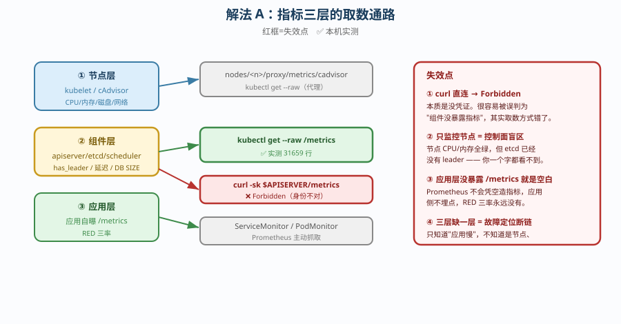
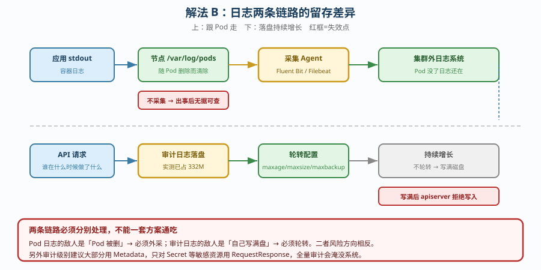
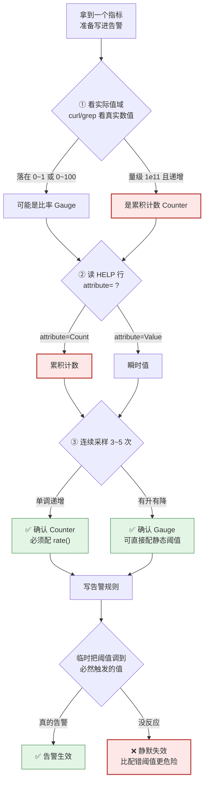

# 场景 7：从零搭建可观测性底座（要监控什么 · 规模压力题）

**场景描述**：新集群要建监控，团队问「我们要监控什么、告警怎么配」。
要求：给出**指标分层**、日志留存策略、以及告警设计的**原则**。

**🔒 先自己想 30 秒**：第一反应是「装个 Prometheus + Grafana，导几个大盘」？——那么，控制面（etcd / apiserver）的指标你取到了吗？Pod 删掉之后日志还在吗？**告警配完了，你怎么确认它真的会响？**

<details><summary>💡 提示（分维度想）</summary>

- **指标有几层**：节点层、组件层、应用层的取数方式一样吗？
- **取数通路**：为什么 `curl` 直连 metrics 会 Forbidden，而 `kubectl get --raw` 可以？
- **日志留存**：Pod 删了，日志去哪了？审计日志会不会写满盘？
- **告警语义**：配了阈值就等于会告警吗？Counter 和 Gauge 配错了会怎样？
- **告警分层**：全是 P0 会怎样？

</details>

<details><summary>📖 展开解法</summary>

> ✅ 本机实测环境：kind 3 节点 v1.34.0 / Calico。审计日志占 332M 为演练期快照。
> ✅ **告警链路本轮真跑通**（2026-09-21）：Prometheus → Alertmanager → 接收端全链路验证，并实测出「标签不匹配路由导致静默失效」的样本。详见文末「实测边界与验证清单」。

### 解法一览（效果维度：覆盖面 / 落地成本）

| 解法 | 效果（覆盖面 / 落地成本） | 代价 | 适用边界 |
|------|-------------------------|------|---------|
| **A. 指标三层全覆盖** | 覆盖面：全（节点+组件+应用）<br>成本：中（需 Prometheus 体系） | 组件层取数要**走对身份**，curl 直连会 Forbidden | **必做基准** |
| **B. 日志双链路分离** | 覆盖面：stdout + 审计两条链路<br>成本：中 | Pod 日志会随 Pod 消失，必须外采 | **必做**，且审计要独立轮转 |
| **C. 告警语义核验 + 分层** | 覆盖面：决定告警是否真的有效<br>成本：低（是纪律不是工具） | 每条指标都要人工核验，不能照抄教程阈值 | **必做**，否则告警静默失效 |

### 各解法详解

#### 解法 A：指标三层全覆盖

思路：节点层（kubelet/cAdvisor）、组件层（apiserver/etcd/scheduler）、应用层（RED 三率）——**三层的取数通路完全不同**。



读图：三条取数路径分别通向不同端点；**红框是两处失效点**——① 组件层用 `curl` 直连会 **Forbidden**（实测），必须 `kubectl get --raw` 带身份；② 只监控节点会漏掉控制面，etcd 出事前**没有任何信号**。

```bash
# ① 节点层：kubelet / cAdvisor
kubectl get --raw /api/v1/nodes/<node>/proxy/metrics/cadvisor

# ② 组件层：apiserver / etcd / scheduler 自带
kubectl get --raw /metrics          # ✅ 实测取到 31659 行
curl -sk $APISERVER/metrics         # ❌ Forbidden —— "身份不对"

# ③ 应用层：应用自己暴露 /metrics + ServiceMonitor 让 Prometheus 抓
```

> **代价 / 坑**：`curl` 直连被拒的本质是**没有凭证**——很多人因此误判「组件没暴露指标」，其实是**取数方式错了**。另外**只监控节点是最大的盲区**：节点 CPU 内存全绿，但 etcd 已经没有 leader 了，你一个字都看不到。

#### 解法 B：日志双链路分离

思路：Pod 日志（stdout）与审计日志是**两条完全不同的链路**，留存特性与风险各异。



读图：上方链路（Pod 日志）**跟 Pod 走**，Pod 删了就没了；下方链路（审计日志）**落盘**，会持续增长。**红框是两处失效点**——① 不采集的话，出事后想看日志时 Pod 早没了；② 审计日志不轮转会写满磁盘（实测 332M）。

```yaml
# 审计策略：只记录有价值的，全量审计会淹没系统
apiVersion: audit.k8s.io/v1
kind: Policy
rules:
- level: Metadata          # ← 大部分用 Metadata，不要 RequestResponse 全量
  resources:
  - group: ""
    resources: ["pods", "services"]
- level: RequestResponse   # ← 只对 Secret 这类敏感资源记全量
  resources:
  - group: ""
    resources: ["secrets"]
```

```yaml
# 审计日志落盘 + 轮转（kubeadm 配置）
apiServer:
  extraArgs:
    audit-log-maxage: "30"      # 保留 30 天
    audit-log-maxsize: "100"    # 单文件 100 MB 后切
    audit-log-maxbackup: "10"   # 最多 10 个备份
```

> **代价 / 坑**：**Pod 日志不采集 = 出事后无据可查**——这在生产事故里是致命的。而审计日志反过来：**不配轮转会写满盘**（实测已占 332M 且持续增长），写满后 apiserver 会拒绝写入，整个集群不可用。

#### 解法 C：告警语义核验 + 分层

思路：**告警设计的第一步不是配阈值，是核验这个指标到底是什么意思**。



读图：三步核验（值域 → HELP → 采样）逐级收敛到「Counter 还是 Gauge」；**红色分支是失效路径**——Counter 若被当成比率配了静态阈值，会**永不触发**，且你会误以为系统健康。最后还必须**临时调阈值验证真的会响**。

```promql
# ❌ 错误：Counter 配静态阈值（永不触发，静默失效）
kafka_request_handler_avg_idle_percent < 0.3

# ✅ 正确：先核验语义，Counter 必须配 rate()
rate(http_requests_total{code=~"5.."}[5m]) > 0.01
```

**任何指标写进告警前，三步核验（缺一不可）**：

```bash
# ① 看实际值域：是 0~1 的比率，还是 1e11 的累积计数？
kubectl get --raw /metrics | grep <指标名>

# ② 读 HELP 行：确认 attribute= 是 Count 还是 Value
# # HELP ... attribute=Count     ← 累积计数
# # HELP ... attribute=Value     ← 瞬时值

# ③ 连续采样 3~5 次：单调递增 = 计数；有升有降 = 瞬时值
for i in 1 2 3 4 5; do kubectl get --raw /metrics | grep <指标名>; sleep 3; done
```

**告警分层**（不分层 = 全部 P0 = 全部忽略）：

| 级别 | 触发条件示例 | 响应 |
|------|------------|------|
| **P0** | 控制面不可用、etcd `has_leader=0`、证书 < 30 天 | 立即叫醒 |
| **P1** | 节点 NotReady、DiskPressure、Pod CrashLoop | 当天处理 |
| **P2** | 装箱率趋势、成本异常 | 观察 |

> **代价 / 坑**：**告警配了但从没触发过，第一反应应该是"它是不是失效了"**，而不是"系统真健康"。Counter 配静态阈值是**最危险的静默失效**——比配错阈值更糟，因为配错至少还会误报。

### ✅ 实测边界与验证清单（2026-09-21 补充）

| 结论 | 状态 | 依据 |
|------|------|------|
| 组件层 `curl` 直连 Forbidden、`kubectl get --raw` 可取到 31659 行 | ✅ **实测** | 运维专项课 5，2026-09-20 实测 |
| 审计日志占 332M 且持续增长 | ✅ **实测** | 同上 |
| 告警全链路（Prometheus → Alertmanager → 接收端）**真实跑通** | ✅ **实测** | 2026-09-21 本轮实测，见下 |
| **severity 标签不匹配路由 → 静默失效** | ✅ **实测（本轮新发现）** | 见下 |
| Counter 配静态阈值永不触发 | ✅ **实测（他课迁移）** | Kafka 课 17，`RequestHandlerAvgIdlePercent` 实测 1e11 递增 |

#### 本轮实测：一个"看起来正常"的静默失效

监控栈**真实在运行**（`monitoring` 命名空间）：`kps-kube-prometheus-stack-prometheus`、`kps-...-alertmanager`、接收端 `am-echo`、以及 Loki/Promtail 日志链路，均已 Running 约 21 小时。

我建了一条**必然触发**的验证告警来检验链路是否真的打通：

```yaml
- alert: VerifyAlertFiresAlways
  expr: vector(1)          # 恒为真，必然 firing
  labels:
    severity: P1           # ← 注意这里
```

**第一次（`severity: P1`）的结果**：

```json
{"alertname":"VerifyAlertFiresAlways","severity":"P1",
 "receivers":[{"name":"null"}],        // ← 匹配到 null 接收器
 "status":{"state":"active"}}          // ← 状态仍是 active！
```

**这是比"告警没配"更危险的一种失效**：告警在 Prometheus 侧 firing、在 Alertmanager 侧 `state=active`，**看起来一切正常**，但 `receiver` 是 `null`——**永远不会有人收到通知**。

根因在 AlertmanagerConfig `ops-routing` 的路由只认三类 severity：

```yaml
routes:
- matchers: [{name: alertname, value: Watchdog}]      → echo-default
- matchers: [{name: severity,  value: critical}]      → echo-critical
- matchers: [{name: severity,  value: warning}]       → echo-warning
```

`P1` **不在其中**，于是不匹配任何子路由，落进无接收器的分支。

**第二次（改为 `severity: warning`）的结果**：

```json
{"alertname":"VerifyAlertFiresAlways","severity":"warning",
 "receivers":[{"name":"kube-system/ops-routing/echo-warning"}]}   // ✅ 匹配上了
```

> **这条实测把「告警静默失效」从抽象警告变成了可复现的事实**：告警链路（Prometheus→AM）是通的、告警状态是 active 的，仅仅因为**一个标签值对不上路由**，整条链路就断在最后一米。而这和 Kafka 课 17 的 `RequestHandlerAvgIdlePercent` 是**同一类失效**——指标在动、系统在跑，但告警永远不响。

#### 想自己验证，按这个清单做

```bash
# ① 建一条恒真告警（severity 故意用一个"看起来合理"的值，如 P1）
kubectl apply -f verify-alert.yaml

# ② 确认 Prometheus 真的加载并 firing 了
kubectl run p --rm -it --image=curlimages/curl -n monitoring -- \
  curl -s http://prometheus-operated:9090/api/v1/alerts
# 判据：能看到你的告警，state=firing

# ③ 关键一步：查 Alertmanager 里它的 receiver 是谁
kubectl run p --rm -it --image=curlimages/curl -n monitoring -- \
  curl -s http://kps-kube-prometheus-stack-alertmanager:9093/api/v2/alerts
# 判据：receivers[0].name 不能是 "null" ← 这是最容易漏的一关

# ④ 末端确认：接收端日志真的出现这条告警
kubectl logs -n monitoring deployment/am-echo --tail=20

# ⑤ 清理
kubectl delete prometheusrule -n monitoring verify-alert-fires
```

**验收判据**：①②③④ 全过才算「告警真的会响」。只做到 ② 就收工，是绝大多数静默失效的成因。

### 替代路线（非本课程 k8s 技术栈）

| 替代方案 | 思路 | 与本课程解法的差异 |
|---------|------|------------------|
| **云厂商托管监控**（CloudWatch / 云监控） | 无需自建 Prometheus | 省运维，但**控制面指标往往拿不全**（托管 k8s 的控制面对用户不可见） |
| **OpenTelemetry Collector 统一采集** | 指标/日志/链路一套 pipeline | 厂商中立、避免多套 agent；但引入 Collector 自身的运维与调优 |
| **托管可观测平台**（Datadog / Grafana Cloud） | SaaS 全托管 | 上手最快；成本高，且**数据出域**在合规场景可能受限 |

### 推荐路径（递进，不是一次全上）

1. **先通取数**（解法 A）：确认三层指标**真的能取到**（重点验证组件层别用 curl）。
2. **再建日志外采**（解法 B）：Pod 日志必须在**出事前**就采到外部；审计日志配轮转。
3. **告警按解法 C 分层 + 语义核验**：每条指标过三步核验，再定 P0/P1/P2。
4. **验证告警真会响**：临时把阈值调到必然触发，确认**真的告警**（不是静默）。
5. **最后做大屏**：大盘是给人和汇报看的，**告警才是保命的**，别颠倒优先级。

### 知识点挂钩

- 指标三层与取数 → [运维专项子教程](../子教程/运维专项/overview.md) 课 5（可观测性，2026-09-20 实测）
- 审计日志与 Secret 保护 → 阶段 5 课 17（Secret 加固与 etcd 加密与审计）
- 告警语义核验铁律 → [08-实战经验.md](../08-实战经验.md) 陷阱八（把「指标在涨」当成「指标是对的」）
- 装箱率口径 → [运维专项子教程](../子教程/运维专项/overview.md) 课 6（多租户与成本）

### 什么情况下此方案不适用

- **集群规模极小且生命周期短**（测试 / 演练集群）——全套可观测性投入可能超过集群本身价值，可只保留组件层关键告警。
- **合规要求所有数据不出域** —— SaaS 托管方案不可用，必须自建。
- **已有统一可观测平台** —— 不要重复造轮子，接进去即可（但仍要验证控制面指标覆盖）。

### 做错会踩的坑

→ 关联 [08-实战经验.md](../08-实战经验.md)：**陷阱八**（把「指标在涨」当成「指标是对的」——Counter 配静态阈值静默失效，比配错阈值更危险）、**守则「任何指标写进告警前必须先核验语义」**（三步核查：值域 → HELP 行 → 连续采样 3~5 次）。

</details>
