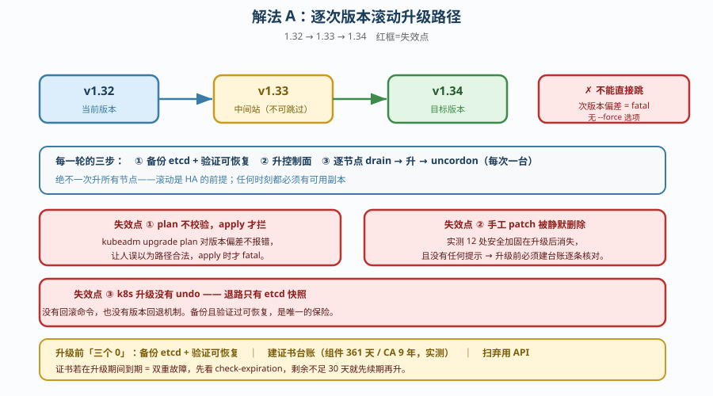
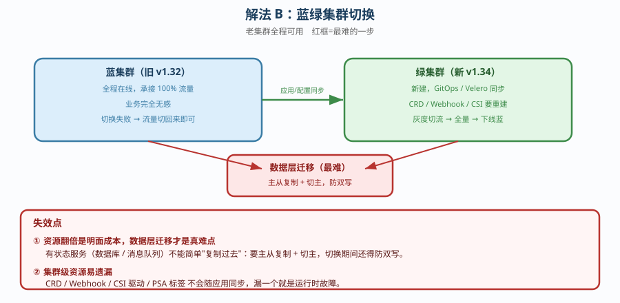
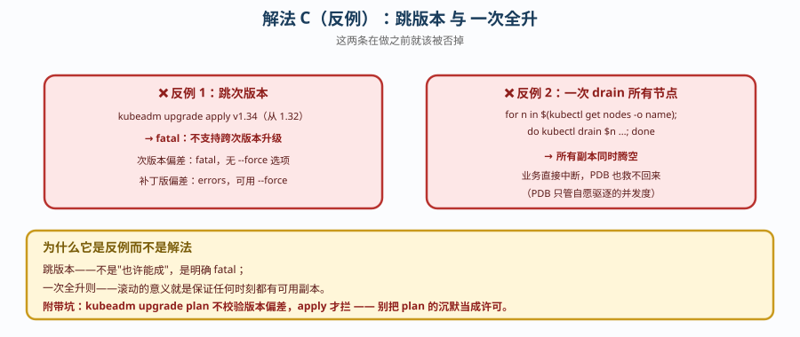

# 场景 8：集群要升级，怎么做到业务不中断（规模压力题）

**场景描述**：集群要从 1.32 升到 1.34，业务**不能停机**。
要求：给出升级路径、顺序、以及**失败了怎么退**。

**🔒 先自己想 30 秒**：第一反应是「`kubeadm upgrade apply` 一下就行」？——那么，能直接从 1.32 跳到 1.34 吗？升级有「回滚」按钮吗？你手工做的安全加固，升级后还在吗？

<details><summary>💡 提示（分维度想）</summary>

- **版本路径**：次版本能跳吗？`plan` 和 `apply` 哪个阶段会拦？
- **顺序**：先升控制面还是先升节点？能一次全升吗？
- **退路**：k8s 升级有 undo 吗？唯一的退路是什么？
- **副作用**：升级会动到哪些你手工改过的东西？
- **证书**：升级期间证书到期会怎样？

</details>

<details><summary>📖 展开解法</summary>

> ⚠️ **边界声明**：本题为**原理推演 + 部分实测**。kind 集群的节点是容器，无法完整复现真实跨版本升级；**滚动升级全过程与蓝绿集群切换为原理推演**（本机仅 1 套集群、无跨集群流量入口）。版本偏差的两类拒绝行为、证书有效期（组件 361 天、CA 9 年）为**本机实测**，其余按官方文档标注 📄。

### 解法一览（效果维度：业务中断风险 / 可回退性）

| 解法 | 效果（中断风险 / 可回退性） | 代价 | 适用边界 |
|------|---------------------------|------|---------|
| **A. 逐次版本滚动升级** | 风险：低（业务无感）<br>可回退：**仅靠 etcd 快照** | 耗时长（每轮都要验证）；无 undo | **唯一正解** |
| **B. 蓝绿集群切换** | 风险：最低（老集群全程可用）<br>可回退：强（切流量回去） | 资源翻倍；需解决数据同步与流量切换 | 关键业务、有冗余资源 |
| **C. 原地跳版本 / 一次全升** | 风险：**极高**<br>可回退：无 | 会直接失败或造成不可用 | **不是解法，是反例** |

### 各解法详解

#### 解法 A：逐次版本滚动升级（唯一正解）

思路：1.32 → 1.33 → 1.34 逐个次版本推进，**先控制面，再逐节点**，每步验证。



读图：三段式推进，每轮都要「备份 → 升级 → 验证」；**红框是三处失效点**——① `plan` 阶段**不校验**版本偏差，`apply` 才拦；② 升级会**静默删除手工 patch 的安全加固**（实测 12 处）；③ **没有 undo**，退路只有 etcd 快照。

```bash
# 每轮次版本的标准动作（1.32 → 1.33）
# 0. 底线：备份 etcd 并验证可恢复
etcdutl snapshot save /backup/etcd-pre-1.33.db

# 0. 建证书台账（组件 1 年，实测剩余 361d；CA 9 年）
kubeadm certs check-expiration

# 0. 扫已弃用 API
kubectl deprecations   # 或 pluto 等工具

# 1. 升控制面
kubeadm upgrade plan          # ⚠️ 不校验版本偏差
kubeadm upgrade apply v1.33.x # ← 这里才拦；次版本偏差是 fatal，无 --force

# 2. 逐节点（每次一台！）
kubectl drain <node> --ignore-daemonsets --delete-emptydir-data
#   ... 升级 kubelet ...
kubectl uncordon <node>

# 3. 验证
kubectl get nodes   # 全 Ready
```

> **代价 / 坑**：**`plan` 不报错是个陷阱**——它会让你以为路径合法，直到 `apply` 才 fatal。更阴的是**手工 patch 被静默删除**（实测 12 处安全加固在升级后消失，**且没有任何提示**），所以升级前必须**逐条记录手工改动清单**，升级后逐条核对。

#### 解法 B：蓝绿集群切换

思路：不升级老集群，而是**建一个新版本集群**，把工作负载迁过去，切换流量。



读图：蓝集群全程可用，绿集群同步好后灰度切流；**红框是最难的一步**——**数据层迁移**（数据库 / 消息队列需要主从复制 + 切主，且切换期间要防双写），这比集群本身难得多。

```text
老集群（1.32）── 全程可用，业务无感
                    │
                    ├── 1. 建新集群（1.34）
                    ├── 2. 用 GitOps / Velero 同步应用与配置
                    ├── 3. 数据层：主从复制 / 迁移（这是最难的一步）
                    ├── 4. 灰度切流量（DNS 权重 / 网关权重）
                    └── 5. 观察无异常 → 全量切 → 下线老集群
```

> **代价 / 坑**：**资源翻倍**是明面成本，**数据层迁移**才是真难点——有状态服务（数据库、消息队列）无法简单"复制过去"，需要主从复制 + 切主，且切换期间要防双写。另外**集群级资源**（CRD、Webhook、CSI 驱动）要在新集群重建，容易遗漏。

#### 解法 C：原地跳版本 / 一次全升（反例，不是解法）

思路：图快，直接 `kubeadm upgrade apply v1.34`，或一次 drain 所有节点。



读图：两个反例各自撞上不同的墙——跳版本是**工具直接 fatal 拒绝**，一次全升是**自己把所有副本腾空**；**红框提醒**：`plan` 阶段不校验版本偏差，别把它的沉默当成许可。

```bash
# ❌ 错误示范 1：跳次版本
kubeadm upgrade apply v1.34.0   # → fatal：不支持跨次版本

# ❌ 错误示范 2：一次升所有节点
for n in $(kubectl get nodes -o name); do kubectl drain $n ...; done
# → 所有副本同时腾空，业务直接中断
```

> **为什么它是反例**：跳版本**不受支持**（次版本是 `fatal`，无 `--force` 选项；补丁版报 `errors` 才可用 `--force`）。一次全升则**直接违背 HA 前提**——滚动的意义就是保证任何时刻都有可用副本。这两条在做之前就该被否掉。

### ✅ 实测边界与验证清单（2026-09-21 补充）

本节明确**哪些结论经本机实测、哪些是原理推演**，并给出「想自己验证该怎么做」。

#### 实测 vs 推演对照

| 结论 | 状态 | 依据 |
|------|------|------|
| 次版本偏差被 `apply` 拒绝（fatal，无 `--force`） | ✅ **实测** | 运维专项课 4，2026-09-20 实测 |
| 证书有效期（组件 361 天 / CA 9 年） | ✅ **实测** | 运维专项课 3，2026-09-20 实测 |
| 升级静默删除手工 patch（12 处安全加固消失且无提示） | ✅ **实测** | 运维专项课 4，2026-09-20 实测 |
| 当前集群版本 v1.34.0 / kind 3 节点 | ✅ **实测** | 2026-09-21 复核：`kubectl version` = v1.34.0 |
| 滚动升级全过程（1.32 → 1.33 → 1.34 真跑一遍） | ⚠️ **推演** | kind 节点是容器，无真实 kubelet 升级路径 |
| 蓝绿集群切换（建第二套集群 + 切流） | ⚠️ **推演** | 本机**仅 1 套集群**（`kind-k8s-c1-calico`），无第二套控制面 |
| 数据层迁移（主从复制 + 切主 + 防双写） | ⚠️ **推演** | 超出 k8s 范畴，本机无数据库主从环境 |

#### 为什么这两项无法真跑

1. **滚动升级**：kind 的「节点」本质是 **Docker 容器**，节点 OS 与 kubelet 由镜像固定，不存在 `apt upgrade kubelet` 的真实路径；真实升级依赖 kubeadm 在宿主机替换二进制，这一层在 kind 里被完全屏蔽。
2. **蓝绿切换**：需要**两套独立控制面** + 一个可切流的入口（DNS / 网关）。本机 `kind get clusters` 虽有 3 个 context，但当前仅 `kind-k8s-c1-calico` 在运行，且**没有跨集群流量入口**。

#### 想自己验证，按这个清单做

**滚动升级（真实环境 / 或改用 kubeadm 裸机）**

```bash
# 前置：确认起点与退路
kubeadm certs check-expiration          # 证书台账
etcdutl snapshot save /backup/pre.db    # etcd 快照并验证可恢复
kubectl get nodes -o wide               # 记录当前版本

# 单轮次版本（先控制面）
kubeadm upgrade plan
kubeadm upgrade apply v1.33.x
# 逐节点：一次一台，drain → 升 kubelet → uncordon → 验证
kubectl drain <node> --ignore-daemonsets --delete-emptydir-data
kubectl uncordon <node>
kubectl get nodes                       # 全 Ready 才进下一台

# 验收判据（三条全中才算过）
# ① kubectl get nodes 全部 Ready 且版本正确
# ② etcd / apiserver / scheduler / controller-manager 均在跑
# ③ 业务探测端点返回 200（滚动期间采样 0 次 5xx / 0 次连接拒绝）
```

**蓝绿切换（至少需要一个流量入口）**

```bash
# ① 建第二套集群（版本为目标版本）
kind create cluster --name green --image kindest/node:v1.34.0
# ② 同步应用与配置（GitOps re-apply 或 Velero）
# ③ 数据层：这是最难的一步，先做主从复制并验证延迟
# ④ 用 Ingress / 网关权重做灰度切流（本机已有 envoy-gateway-system 与 ingress-nginx）
# ⑤ 全量切 → 观察 → 下线老集群
```

**关键提醒**：切流前必须确认**数据层已完成切换且无双写**。反之，若切换后仍有流量写入老库，会出现「两边都写、两边都不全」的静默数据损坏——这比停机更严重，因为它不会报错。

### 替代路线（非本课程 k8s 技术栈）

| 替代方案 | 思路 | 与本课程解法的差异 |
|---------|------|------------------|
| **托管 k8s 的原地升级**（EKS/GKE/AKS 一键升） | 云厂商负责控制面，用户只管节点池滚动 | 控制面升级**你几乎无感**；但节点池仍需滚动，且**云厂商的弃用时间表由不得你** |
| **GitOps 重建集群**（ArgoCD re-apply） | 不升级，直接建新集群 + 声明式重建 | 可重复、可审计；但有状态数据仍需单独迁移 |
| **Cluster API 集群滚动替换** | 声明式管理集群生命周期，自动换节点 | 把"升级"变成"替换"，规避原地升级的副作用；但引入 CAPI 自身运维 |

### 推荐路径（递进，不是一次全上）

1. **升级前三个「0」**：备份 etcd + 验证可恢复 / 建证书台账 / 扫弃用 API。
2. **记录手工 patch 清单**（这是最容易漏的一步），升级后逐条核对。
3. **走解法 A**：逐次版本，先控制面后节点，**每次一台**。
4. **每轮验证**：`kubectl get nodes` 全 Ready + 核心服务可用 + 业务探测通过。
5. **资源充足且业务关键时考虑解法 B**：蓝绿是最稳的，但成本也最高。

### 知识点挂钩

- 集群升级与生命周期 → 阶段 6 课 19（集群运维与生命周期）
- 版本偏差两类拒绝 → [运维专项子教程](../子教程/运维专项/overview.md) 课 4（升级，2026-09-20 实测）
- etcd 快照与退路 → [运维专项子教程](../子教程/运维专项/overview.md) 课 7（备份与恢复）
- 证书有效期 → [运维专项子教程](../子教程/运维专项/overview.md) 课 3（证书，实测组件 361 天 / CA 9 年）
- drain 与 PDB → 阶段 6 课 19 + 场景 3（零中断发布）

### 什么情况下此方案不适用

- **已跨多个次版本落后**（如 1.28 → 1.34）——逐版本升级链条过长，此时**蓝绿重建（解法 B）反而更省事**。
- **有大量手工 patch 且无台账**——升级会静默吞掉它们，先补齐台账再升。
- **证书已过期或即将到期**——先续期再升级，否则升级期间叠加证书故障。

### 做错会踩的坑

→ 关联 [08-实战经验.md](../08-实战经验.md)：**反例 8**（以为 PDB 能防住一切中断——PDB 只管自愿驱逐，挡不住 `kubectl delete`）、**陷阱七**（把「集群能跑」当成「集群可交付」——集群起来了但安全加固没了，你不会收到任何通知）。

</details>
