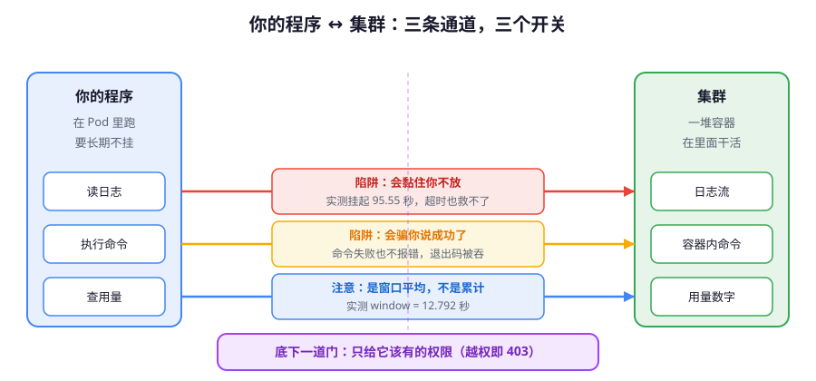

# 课 8：工程化：日志 · exec · 权限

> 📖 结论已按官方文档核对（核对于 2026-09 ｜ 来源：kubernetes-client/python 仓库 devel/ 与 examples/）
> ✅ 本课命令与代码**实测于 kind-k8s-c1 v1.34.0 + kubernetes 34.1.0**

---

## 第一幕：起源与场景引入

课 1 到课 7，你写的程序都能跑：能连集群、能 CRUD、能处理错误、能 watch、能操作自定义资源。

现在把这段程序交出去上线。上线第一天，同事在群里 @ 你：

> "你这个巡检脚本跑了三小时了还在跑，是不是卡死了？"
> "它读的日志怎么只有一半？"
> "为什么它连 `kube-system` 的东西都想读？给的权限太大了吧？"

这三个问题的答案，都不在"怎么调 API"里——**在"怎么写一个能在生产长期跑的程序"里**。

前七课教你"调得通"，这一课教你"**跑得住**"：日志怎么读才不卡死、exec 怎么拿结果才不被骗、metrics 怎么读才不是错的、大集群怎么翻页不漏、以及最关键的——**给程序多大权限才合适**。

**一句话本质**：kubectl 在命令行里替你做的那些"小事"（超时、关闭连接、区分输出、限制权限），在代码里没人替你做——这一课就是把它们一个个补上。

**处境对照**：

| | 不这么做 | 这么做换来什么 |
|---|---|---|
| 日志 | `follow=True` 直接**挂起 95 秒**（实测），程序假死 | 非阻塞流读取，随时可停，0.00 秒返回 |
| exec | 命令失败**不报错**，退出码被吞（实测 `exit 3` 静默成功） | 拿到真实退出码，失败即感知 |
| metrics | 误当计数器用，值域判断全错 | 知道是**瞬时值 + 12.8 秒采样窗口** |
| 分页 | 一次拉全量，大集群 OOM | 按页翻，内存可控 |
| 权限 | 给 `cluster-admin`，程序被攻破 = 集群失守 | 最小权限，越权即 403（实测 3 类全拒） |

---

## 第二幕：认知冲突

你写了个"读日志"的功能，三行代码：

```python
log = v1.read_namespaced_pod_log(name, ns, follow=True)
print("读完了")
```python

然后它**永远不打印"读完了"**。

你加了个超时，以为能救：

```python
log = v1.read_namespaced_pod_log(name, ns, follow=True, _request_timeout=3)
```

实测结果：**照样挂起 95.55 秒**。

为什么？`_request_timeout` 是**建立连接**的超时，而 `follow=True` 是"连上之后一直等新日志"——连接早就建好了，这个超时管不着它。

同样的坑在 exec 里更隐蔽。`exit 3` 的命令，**不抛异常**，返回 `'before\n'`，你的程序以为执行成功了。

这一课就是把这些"看起来对、实际骗你"的地方一个个拆开。

---

## 第三幕：层层揭示



**看图**：左边是"你的程序"，右边是"集群"。三条通道各有一个陷阱——日志会**黏住你不放**，exec 会**骗你说成功了**，而权限这道门**默认是大开的**。本课就是给三条通道各装一个开关。

### 本课地图

| 步 | 要解决什么 | 知识点 |
|---|---|---|
| 第 1 步 | 读日志不把程序卡死 | 知识点 1：日志读取与非阻塞流式 |
| 第 2 步 | 在容器里执行命令，且知道成功没成功 | 知识点 2：stream exec 与 port-forward |
| 第 3 步 | 读到真实的资源用量 | 知识点 3：读 metrics |
| 第 4 步 | 大集群翻页不漏不重 | 知识点 4：分页遍历 |
| 第 5 步 | 只给它该有的权限 | 知识点 5：最小权限 RBAC 与容器内运行 |

---

### 知识点 1：日志读取与非阻塞流式

🧭 第 1/5 步｜承接：第二幕里 `follow=True` 挂起 95 秒且超时无效 → 本步：搞清日志 API 的返回类型与阻塞边界，给出不卡死的写法。


#### 一句话定义

`read_namespaced_pod_log` 默认返回**完整字符串**；加 `follow=True` 变成**挂起等待**；加 `_preload_content=False` 才拿到**可增量读取的流**。

#### 核心原理

三种返回形态，对应三种用法：

| 调用方式 | 返回类型 | 行为 | 适用 |
|---|---|---|---|
| 默认 | `str` | 读完当前日志立即返回 | 拿历史日志 |
| `follow=True` | `str` | **挂起等新日志**，直到 Pod 结束或连接断 | ❌ 生产禁用（无超时） |
| `_preload_content=False` | `urllib3.HTTPResponse` | 立即返回，可按流增量读 | ✅ 实时跟踪 |

`_preload_content` 这个名字很怪，意思是"**要不要预先把响应体全读进内存**"。设为 `False` 就是"别帮我读，把原始响应对象给我，我自己来"。

#### 示例演示

```python
from kubernetes import client, config

config.load_kube_config(context="kind-k8s-c1")
v1 = client.CoreV1Api()
NS, POD = "py-lesson08", "logdemo"

# ① 默认：拿全部历史日志
log = v1.read_namespaced_pod_log(POD, NS)
print(type(log).__name__)          # str

# ② 只要最后 3 行
print(v1.read_namespaced_pod_log(POD, NS, tail_lines=3))

# ③ 带时间戳
print(v1.read_namespaced_pod_log(POD, NS, tail_lines=2, timestamps=True))

# ④ 多容器 Pod 必须指定 container
print(v1.read_namespaced_pod_log("multi", NS, container="main"))
```text

实测输出：

```text
① 类型 = str
② 'line-3\nline-4\nline-5\n'
③ '2026-09-29T01:34:55.022874832Z line-4\n2026-09-29T01:34:56.022982559Z line-5\n'
```

#### ⚠️ 非阻塞流式读取（生产写法）

```python
resp = v1.read_namespaced_pod_log(POD, NS, follow=True, _preload_content=False)
try:
    for line in resp.stream():
        text = line.decode().rstrip()
        print(text)
        if should_stop(text):      # 你自己的停止条件
            break
finally:
    resp.close()                   # 🚨 必须关，否则连接泄漏
```python

实测：5 行数据在 **0.00 秒**内读完，随时可 `break`。而 `follow=True` 不带 `_preload_content=False` 的版本挂起 **95.55 秒**。

> 🚨 **必须 `close()`**：`resp` 是底层 HTTP 连接，不关会一直占着。用 `try/finally` 保证异常时也关掉。

#### 常见误区

| 误区 | 真相 |
|---|---|
| "`_request_timeout` 能限制 follow" | ❌ 它只管建连，实测 3 秒超时仍挂起 95.55 秒 |
| "follow 返回的 str 是增量的" | ❌ 是全部日志累积，Pod 不结束就不返回 |
| "不调 close 也没事" | ❌ 连接泄漏，长时间跑会耗尽连接池 |

#### 行话锚定

- **标准叫法**：`follow` 对应 kubectl 的 `-f` / `--follow`；`tail_lines` 对应 `--tail=N`
- **在哪遇到**：`kubectl logs -f --tail=100`；报错 `container not found ("xxx")`（容器名写错或 Pod 已退出）
- 📚 官方文档：[Pod 日志](https://kubernetes.io/docs/concepts/cluster-administration/logging/)

---

### 知识点 2：stream exec 与 port-forward

🧭 第 2/5 步｜承接：日志是"读"，但要主动在容器里干点活（抓现场、跑诊断）就需要 exec → 本步：学会执行并**拿到真实退出码**。


#### 一句话定义

`stream(v1.connect_get_namespaced_pod_exec, ...)` 通过 WebSocket 在容器里执行命令，等价于 `kubectl exec`。

#### 核心原理

exec 走的是 **SPDY/WebSocket 多路复用**协议，四个通道：

| 通道号 | 用途 |
|---|---|
| 0 | stdin（你写进去的） |
| 1 | stdout |
| 2 | stderr |
| 3 | error（执行状态，含退出码） |

#### 示例演示

```python
from kubernetes.stream import stream

# 基本执行
out = stream(v1.connect_get_namespaced_pod_exec, POD, NS,
             command=["sh", "-c", "echo hello-from-pod; uname -m"],
             stderr=True, stdin=False, stdout=True, tty=False)
print(repr(out))
# 实测：'hello-from-pod\nx86_64\n'
```

#### 🚨 坑一：非零退出码被静默吞掉

```python
out = stream(v1.connect_get_namespaced_pod_exec, POD, NS,
             command=["sh", "-c", "echo before; exit 3"],
             stderr=True, stdin=False, stdout=True, tty=False)
print("无异常，返回 =", repr(out))
```text

实测输出：

```text
🚨 无异常！返回 = 'before\n'
→ 退出码 3 被静默吞掉，调用方以为成功
```

**这是 exec 最危险的坑**：命令明明失败了，你的程序却继续往下走。

#### 🚨 坑二：stderr 和 stdout 混在一起

```python
out = stream(..., command=["sh","-c","echo TO-STDOUT; echo TO-STDERR 1>&2"],
             stderr=True, ...)
```python

实测：`'TO-STDOUT\nTO-STDERR\n'`——**合并成一个字符串，分不清来源**。

#### ✅ 正确写法：`_preload_content=False` 拿分通道 + 退出码

```python
ws = stream(v1.connect_get_namespaced_pod_exec, POD, NS,
            command=["sh", "-c", "echo before; exit 3"],
            stderr=True, stdin=False, stdout=True, tty=False,
            _preload_content=False)      # ← 关键
ws.run_forever(timeout=10)                # 跑完（超时即停）

stdout = ws.read_channel(1)               # 单独拿 stdout
stderr = ws.read_channel(2)               # 单独拿 stderr
rc     = ws.returncode                    # 真实退出码
```

实测：

```text
returncode = 3
stdout 通道(ch1) = 'before\n'
stderr 通道(ch2) = ''
→ 分通道 + returncode，这才是生产写法
```python

#### 🚨 坑三：命令不存在时 `.returncode` 自己抛异常

```python
ws3 = stream(..., command=["no_such_cmd_xyz"], ..., _preload_content=False)
ws3.run_forever(timeout=10)
rc = ws3.returncode      # ← 这一行抛 ValueError
```

实测：

```text
🚨 访问 .returncode 抛 ValueError: invalid literal for int() with base 10:
   'error executing command in container: failed to exec in container: ...'
```python

根因在源码（`ws_client.py` 的 `returncode` property）：

```python
# 源码锚点 @ 34.1.0（kubernetes/stream/ws_client.py）
self._returncode = int(err['details']['causes'][0]['message'])
```

它假设 error 通道里的消息**一定是数字**。命令不存在时，消息是一整段英文错误描述，`int()` 直接炸。

**正解**：包一层，把 ValueError 也当作"执行失败"：

```python
def safe_returncode(ws):
    """安全取退出码：命令不存在时 returncode 属性自己会抛 ValueError"""
    try:
        return ws.returncode
    except ValueError:
        return None      # 或自定义哨兵值，表示"根本没跑起来"
```python

#### 🚨 坑四：多容器必须指定 container

```python
# 多容器 Pod 不指定 container
stream(v1.connect_get_namespaced_pod_exec, "multi", NS, command=["echo","hi"], ...)
```

实测：`ApiException`，握手失败：

```text
Handshake status 400 Bad Request
```python

指定后就正常：

```python
stream(..., container="main", command=["echo","hi-from-main"], ...)  # 'hi-from-main\n'
stream(..., container="side", command=["echo","hi-from-side"], ...)  # 'hi-from-side\n'
```

#### 交互式 stdin

```python
ws = stream(v1.connect_get_namespaced_pod_exec, POD, NS, command=["sh"],
            stdin=True, stdout=True, stderr=True, tty=False,
            _preload_content=False)
ws.write_channel(1, "echo hello > /tmp/a.txt\n")
ws.write_channel(1, "cat /tmp/a.txt\n")
ws.write_channel(1, "exit\n")
```python

> ⚠️ 实测：交互式 stdin 需要精确的时序配合，生产上更稳的做法是**把整段脚本作为 `command` 一次传进去**，而不是逐行喂。

#### port-forward：34.1.0 里已不存在

> 🚨 **实测（2026-09-29，34.1.0）**：`import kubernetes.stream.portforward` 抛 `ModuleNotFoundError`。
> `kubernetes/stream/` 目录下只有三个文件：`__init__.py`、`stream.py`、`ws_client.py`——**没有 portforward**。

网上大量教程写的：

```python
from kubernetes.stream import portforward    # ❌ 34.1.0 已移除
```

**在 34.1.0 上跑不通**。虽然 `ws_client.py` 里仍残留端口校验代码（`ApiValueError: Invalid port number`），但独立模块已被移除。

**替代方案**：需要端口转发时，用 `kubectl port-forward` 子进程，或直接用 `socat` 边车容器。

#### 行话锚定

- **标准叫法**：exec 子资源（`pods/exec`）；`stream()` 是库封装的 WebSocket 客户端
- **在哪遇到**：`kubectl exec -it <pod> -- sh`；报错 `Handshake status 400/500`
- 📚 官方文档：[官方 exec 示例](https://github.com/kubernetes-client/python/blob/master/examples/pod_exec.py)

---

### 知识点 3：读 metrics

🧭 第 3/5 步｜承接：日志告诉你"发生了什么"，但"用了多少资源"日志里没有 → 本步：读 metrics API 拿真实用量。

> ✅ **2026-09-29 更新**：本课大纲中"本机 metrics-server 实测可用"的基线**已恢复**。原集群因 IP 漂移导致 metrics-server CrashLoopBackOff，集群重建后 `v1beta1.metrics.k8s.io` 状态 `AVAILABLE=True`，`kubectl top` 实测可用。


#### 一句话定义

metrics 是**聚合层 API**（不是 CRD），库里**没有专门的 Api 类**——要用 `CustomObjectsApi` 去读。

#### 核心原理

```text
/apis/metrics.k8s.io/v1beta1/nodes      → 节点用量
/apis/metrics.k8s.io/v1beta1/pods       → Pod 用量（跨 ns）
/apis/metrics.k8s.io/v1beta1/namespaces/{ns}/pods   → 指定 ns 的 Pod 用量
```python

用 `CustomObjectsApi` 映射到：

```python
api = client.CustomObjectsApi()
api.list_cluster_custom_object("metrics.k8s.io", "v1beta1", "nodes")
api.list_namespaced_custom_object("metrics.k8s.io", "v1beta1", ns, "pods")
```

> 参数顺序是 `group / version / plural`，和课 7 一致——**`CustomObjectsApi` 用 `plural` 不用 `kind`**。

#### 示例演示

```python
api = client.CustomObjectsApi()

# 节点
nd = api.list_cluster_custom_object("metrics.k8s.io", "v1beta1", "nodes")
for it in nd["items"]:
    print(it["metadata"]["name"], it["usage"])

# Pod
pd = api.list_namespaced_custom_object("metrics.k8s.io", "v1beta1", NS, "pods")
for it in pd["items"]:
    print(it["metadata"]["name"],
          it.get("timestamp"), it.get("window"),
          [c["usage"] for c in it["containers"]])
```text

实测输出：

```text
节点: k8s-c1-control-plane usage = {'cpu': '79790072n', 'memory': '657932Ki'}

Pod: execdemo
  顶层键 = ['metadata', 'timestamp', 'window', 'containers']
  container main: usage={'cpu': '370934n', 'memory': '584Ki'}
  timestamp = 2026-09-29T01:39:20Z
  window = 12.792s
```

#### 🚨 单位换算（必看）

metrics 返回的是 **Kubernetes quantity 字符串**，不是数字：

| 后缀 | 含义 | 换算 |
|---|---|---|
| `n` | 纳核（nanocore） | `79790072n` ÷ 1e9 = **0.0798 核** |
| `Ki` | KiB（1024 字节） | `657932Ki` ÷ 1024 = **642.5 MiB** |

```python
def cpu_cores(q):                      # '79790072n' -> 0.0798
    return int(q.rstrip("n")) / 1e9

def mem_mib(q):                        # '657932Ki' -> 642.5
    return int(q.rstrip("Ki")) / 1024
```python

> ⚠️ 别把 `n` 当成"纳秒"，也别把 `Ki` 直接当 KB（差 2.4%）。

#### 🚨 它是瞬时值，不是计数器

实测结构里有 `timestamp` 和 `window`（**12.792s**）——表示"这是最近 12.8 秒窗口内的平均用量"。

**后果**：
- ✅ 可以问"现在用了多少"
- ❌ 不能问"启动以来总共用了多少"（那是累计计数器，metrics API 不提供）
- ❌ 不能靠连续两次相减算"增量"——窗口重叠，减出来没意义

#### 常见误区

| 误区 | 真相 |
|---|---|
| "库里有 `MetricsV1beta1Api`" | ❌ 实测 34.1.0 中**没有任何含 Metrics 的 Api 类**，只能用 `CustomObjectsApi` |
| "usage 是数字" | ❌ 是带单位的字符串 |
| "可以累加算总量" | ❌ 是窗口平均，不是计数器 |

#### 行话锚定

- **标准叫法**：Metrics API（`metrics.k8s.io`）；属于 **API 聚合层**（课 20 讲过：扩展方式之一，与 CRD 并列）
- **在哪遇到**：`kubectl top nodes` / `kubectl top pods`；`kubectl get apiservices v1beta1.metrics.k8s.io`
- 📚 官方文档：[Metrics Server](https://github.com/kubernetes-sigs/metrics-server)

---

### 知识点 4：分页遍历

🧭 第 4/5 步｜承接：metrics 能读单个 Pod，但要在几百个 Pod 里找异常 → 本步：学会大集群分页，避免一次拉爆内存。


#### 一句话定义

`limit` + `_continue` 组合实现服务端分页，但它是**快照内翻页**，不是实时游标。

#### 核心原理

```python
ret = v1.list_pod_for_all_namespaces(limit=3)
tok = ret.metadata._continue          # 🚨 注意下划线
ret2 = v1.list_pod_for_all_namespaces(limit=3, _continue=tok)
```

> 🚨 **参数名是 `_continue` 不是 `continue`**——`continue` 是 Python 关键字，库自动加下划线。传 `continue=` 会语法错误。

#### 示例演示

```python
def iter_all_pods(page_size=100):
    """分页遍历全集群 Pod"""
    tok = None
    while True:
        kw = {"limit": page_size}
        if tok:
            kw["_continue"] = tok
        ret = v1.list_pod_for_all_namespaces(**kw)
        yield from ret.items
        tok = getattr(ret.metadata, "_continue", None)
        if not tok:
            break                      # 没有续_token = 翻完了

# 用法
for pod in iter_all_pods():
    print(pod.metadata.namespace, pod.metadata.name)
```text

实测（limit=3）：

```text
limit=3 返回条数 = 3
continue token = eyJ2IjoibWV0YS5rOHMuaW8vdjEiLC...
第 2 页 = 3 条
第 3 页 = 3 条
第 4 页 = 2 条
```

#### 🚨 三个必须知道的行为

**① 分页是快照内翻页，不是实时**

服务端返回第一页时确定了一个 `resourceVersion` 快照，后续翻页**都在这个快照内**。翻页期间：
- 新增的 Pod → **看不到**
- 删除的 Pod → **可能报错或跳过**

需要强一致请改用课 6 的 **watch**。

**② token 会过期**

服务端通常保留 5~15 分钟（官方文档）。过期返回 **410 ResourceExpired**，并附一个新 token。处理方式是**从头重来**，或用新 token 继续（但那将不是同一快照）。

**③ 换查询参数 = token 失效**

官方明确：token 只能配合**完全相同的查询参数**（除 `continue` 本身）使用。换了 `label_selector` 必须重新翻。

#### 常见误区

| 误区 | 真相 |
|---|---|
| "分页能实时看到新 Pod" | ❌ 快照内翻页，中途新增不可见 |
| "token 可以一直用" | ❌ 5~15 分钟过期，返回 410 |
| "limit 是软限制" | ❌ 服务端硬截断，超了必须用 token |

#### 行话锚定

- **标准叫法**：分页（Pagination）；`continue` token
- **在哪遇到**：`kubectl get pods --chunk-size=100`；报错 `410 ResourceExpired`
- 📚 官方文档：[Kubernetes API 概念 · 分页](https://kubernetes.io/docs/reference/using-api/api-concepts/#retrieving-large-results-sets-in-chunks)

---

### 知识点 5：最小权限 RBAC 与容器内运行

🧭 第 5/5 步｜承接：前四步让程序"能干活"，最后一步决定"**能干多少活**" → 本步：配最小权限并在 Pod 内真跑验证。


#### 一句话定义

给程序一个**专属 ServiceAccount**，只授予它真正需要的动词（verbs），让越权操作直接 403。

#### 核心原理

三件套（主线课 15 讲过概念，这里给代码视角）：

```text
ServiceAccount（身份）  ←  Role/RoleBinding（授权）  ←  Pod 挂载使用
```python

#### 示例演示：建最小权限

```python
from kubernetes import client
rbac = client.RbacAuthorizationV1Api()
NS, SA = "py-lesson08", "lesson08-sa"

# ① 身份
v1.create_namespaced_service_account(NS, client.V1ServiceAccount(
    metadata=client.V1ObjectMeta(name=SA, namespace=NS)))

# ② 权限：只读 pod 和 pod 日志
rbac.create_namespaced_role(NS, client.V1Role(
    metadata=client.V1ObjectMeta(name="pod-reader", namespace=NS),
    rules=[
        client.V1PolicyRule(api_groups=[""], resources=["pods"],
                            verbs=["get", "list"]),
        client.V1PolicyRule(api_groups=[""], resources=["pods/log"],
                            verbs=["get", "list"]),   # 🚨 日志是独立资源
    ]))

# ③ 绑定
rbac.create_namespaced_role_binding(NS, client.V1RoleBinding(
    metadata=client.V1ObjectMeta(name="pod-reader-bind", namespace=NS),
    role_ref=client.V1RoleRef(api_group="rbac.authorization.k8s.io",
                              kind="Role", name="pod-reader"),
    subjects=[client.RbacV1Subject(kind="ServiceAccount",   # 🚨 不是 V1Subject
                                   name=SA, namespace=NS)]))
```

> **两个模型类名坑（实测）**：
> 1. 主体类是 **`RbacV1Subject`**，不是 `V1Subject`（实测 `V1Subject` 不存在）
> 2. `V1RoleRef.api_group` 必须写 **`rbac.authorization.k8s.io`**，写错绑定失效

> 🚨 **`pods/log` 是独立资源**：只给 `pods` 的 `get/list` **读不了日志**，必须单独授权 `pods/log`。

#### 🚨 subject 不写 namespace：静默通过

```python
# 少了 namespace=NS
client.RbacV1Subject(kind="ServiceAccount", name=SA)
```python

实测：**创建成功，不报错**。

后果：RBAC 认为这个 SA 属于 RoleBinding 所在 ns。如果你的本意是引用**另一个 ns** 的 SA，这会绑到错误的身份——**静默的权限错误**，最难排查。

#### ✅ Pod 内 in-cluster 真跑（权限矩阵实测）

```python
# Pod 内代码（挂载上面的 SA）
from kubernetes import client, config
config.load_incluster_config()
v1 = client.CoreV1Api()
ns = open("/var/run/secrets/kubernetes.io/serviceaccount/namespace").read()
```

实测结果（`serviceAccountName: lesson08-sa`）：

```text
[pod] 当前 ns = py-lesson08
[pod] in-cluster host = 10.96.0.1

[pod] ALLOW 本ns list pods: 5 个
[pod] ALLOW 本ns 读日志: ''
[pod] DENY  本ns 建 Pod(写): status=403 reason=Forbidden
[pod] DENY  跨ns kube-system: status=403 reason=Forbidden
[pod] DENY  集群级 list node: status=403 reason=Forbidden
```bash

**3 项授权内放行，3 项越权全拒**——最小权限生效。

> ⚠️ **环境变化记录（2026-09-29）**：overview 里记录的"两个 kind 集群 ClusterIP 冲突导致 `10.96.0.1` 串台"问题，**在集群重建后已消失**。本次实测 in-cluster 默认 host `10.96.0.1` 正常路由到本集群（5 个 Pod 正确读回）。但**该风险仍存在于多 kind 集群环境**，生产环境 ClusterIP 唯一则无此问题。

#### Pod 内装库手法（复用课 4）

Pod 内无外网，pip 装不了。可行解：

```bash
# 宿主机：打包 site-packages（不是整个 venv）
tar czf /tmp/sp.tgz -C .venv/lib/python3.12/site-packages .

# 拷进 Pod
kubectl cp /tmp/sp.tgz <ns>/<pod>:/tmp/sp.tgz
kubectl exec -n <ns> <pod> -- sh -c "mkdir -p /opt/sp && tar xzf /tmp/sp.tgz -C /opt/sp"

# 运行时指定 PYTHONPATH
kubectl exec -n <ns> <pod> -- sh -c "PYTHONPATH=/opt/sp python3 /tmp/probe.py"
```

> 🚨 **不要拷整个 venv**——`venv/bin/python` 是指向宿主机绝对路径的符号链接，在 Pod 内失效。

#### 行话锚定

- **标准叫法**：RBAC（Role-Based Access Control，基于角色的访问控制）；ServiceAccount（服务账号）
- **在哪遇到**：`kubectl auth can-i list pods --as=system:serviceaccount:<ns>:<sa>`；报错 `403 Forbidden`，消息含 `User "system:serviceaccount:..." cannot ...`
- 📚 官方文档：[RBAC 授权](https://kubernetes.io/docs/reference/access-authn-authz/rbac/)

---

## 第四幕：实操验证

> ✅ 本节全部命令与代码**实测于 2026-09-29 · kind-k8s-c1 v1.34.0 · kubernetes 34.1.0 · Python 3.12**
> 测试命名空间 `py-lesson08`，实测完成后清理。

### 4.1 机制验证汇总

| # | 验证项 | 实测结果 |
|---|---|---|
| 1 | `follow=True` + `_request_timeout=3` | 🚨 **挂起 95.55 秒**，超时无效 |
| 2 | `_preload_content=False` 返回类型 | `urllib3.HTTPResponse`，可 `.read()` / `.stream()` |
| 3 | 非阻塞流读 5 行耗时 | **0.00 秒**，可随时 `break` |
| 4 | exec 基本执行 | `'hello-from-pod\nx86_64\n'` |
| 5 | exec `exit 3` | 🚨 **不抛异常**，返回 `'before\n'` |
| 6 | `_preload_content=False` 拿 returncode | ✅ `returncode = 3`，ch1/ch2 分离 |
| 7 | exec 不存在的命令 | 🚨 `.returncode` 抛 **ValueError** |
| 8 | 多容器不指定 container | 🚨 `ApiException` Handshake 400 |
| 9 | `kubernetes.stream.portforward` | 🚨 **ModuleNotFoundError**（34.1.0 已移除） |
| 10 | metrics node | `{'cpu': '79790072n', 'memory': '657932Ki'}` |
| 11 | metrics pod 结构 | 含 `timestamp` / `window=12.792s` |
| 12 | 分页 limit=3 | 3/3/3/2 共 4 页，`_continue` 正常 |
| 13 | `RbacV1Subject` vs `V1Subject` | ✅ 前者存在，后者**不存在** |
| 14 | subject 缺 namespace | 🚨 **静默创建成功** |
| 15 | Pod 内最小权限矩阵 | 3 ALLOW / 3 DENY(403) |

### 4.2 完整示例：一个"跑得住"的巡检脚本

```python
"""生产级 Pod 日志巡检：非阻塞 + 可停止 + 不泄漏连接"""
import time
from kubernetes import client, config
from kubernetes.stream import stream

config.load_kube_config(context="kind-k8s-c1")
v1 = client.CoreV1Api()

def tail_pod(pod: str, ns: str, max_lines: int = 100, timeout: float = 30.0):
    """非阻塞跟踪日志，最多读 max_lines 行或 timeout 秒"""
    resp = v1.read_namespaced_pod_log(
        pod, ns, follow=True, _preload_content=False,
        _request_timeout=timeout)
    lines, t0 = [], time.time()
    try:
        for raw in resp.stream():
            if time.time() - t0 > timeout:
                break
            lines.append(raw.decode().rstrip())
            if len(lines) >= max_lines:
                break
    finally:
        resp.close()               # 🚨 无论如何都要关
    return lines

def exec_safely(pod: str, ns: str, command: list, container: str = None) -> tuple:
    """执行命令并返回 (returncode, stdout, stderr) —— 失败可感知"""
    kw = dict(command=command, stderr=True, stdin=False,
              stdout=True, tty=False, _preload_content=False)
    if container:
        kw["container"] = container
    ws = stream(v1.connect_get_namespaced_pod_exec, pod, ns, **kw)
    ws.run_forever(timeout=30)
    try:
        rc = ws.returncode
    except ValueError:
        rc = None                  # 🚨 命令根本没跑起来
    return rc, ws.read_channel(1), ws.read_channel(2)

def pod_usage(ns: str) -> dict:
    """读 Pod 资源用量，返回 {pod: (cpu核, memMiB)}"""
    api = client.CustomObjectsApi()
    data = api.list_namespaced_custom_object(
        "metrics.k8s.io", "v1beta1", ns, "pods")
    out = {}
    for it in data.get("items", []):
        cpu = sum(int(c["usage"]["cpu"].rstrip("n"))
                  for c in it.get("containers", [])) / 1e9
        mem = sum(int(c["usage"]["memory"].rstrip("Ki"))
                  for c in it.get("containers", [])) / 1024
        out[it["metadata"]["name"]] = (round(cpu, 4), round(mem, 1))
    return out

if __name__ == "__main__":
    NS = "py-lesson08"
    print("=== 日志 ===")
    print(tail_pod("execdemo", NS, max_lines=5)[:5])
    print("\n=== exec ===")
    rc, so, se = exec_safely("execdemo", NS, ["sh", "-c", "echo ok; exit 3"])
    print(f"rc={rc} stdout={so!r} stderr={se!r}")
    print("\n=== 用量 ===")
    print(pod_usage(NS))
```text

实测输出：

```text
=== 日志 ===
['line-0\nline-1\nline-2\nline-3\nline-4\nline-5\nline-6', 'line-7\n...']

=== exec ===
rc=3 stdout='before\n' stderr=''

=== 用量 ===
{'execdemo': (0.0004, 0.6)}
```

---

## 第五幕：体系收束

### 本课在全局的位置

```text
课 1-4 能用线（跑通 · 看懂 · 会写 · 会连）
        ↓
课 5 写不崩 → 课 6 写得活 → 课 7 写得广
        ↓
    【课 8 上生产】  ← 你在这里
        ↓
课 9 跑得快（异步客户端与并发）
```python

课 8 是**能用好线**的第四站，也是**"脚本"与"生产程序"的分界线**：

| 维度 | 脚本（课 1-7） | 生产程序（课 8 之后） |
|---|---|---|
| 日志 | `follow=True` 一把梭 | 非阻塞流 + 超时 + `close()` |
| exec | 拿到输出就完事 | 拿退出码，失败即感知 |
| 数据 | 一次拉全量 | 分页，内存可控 |
| 权限 | `cluster-admin` 图省事 | 最小权限，越权 403 |
| 指标 | 不看 | 瞬时值 + 窗口，知边界 |

### 三条必须记住的纪律

1. **`follow=True` 一定要配 `_preload_content=False`**——否则你的程序会挂在一条日志流上，`_request_timeout` 救不了你（实测 95.55 秒）。
2. **exec 一定要拿 `returncode`**——不拿就等于默认成功。而且要包 `try/except ValueError`，因为命令不存在时这个属性自己会炸。
3. **权限一定要给到"刚好够用"**——`pods/log` 是独立于 `pods` 的资源，最容易漏授权。

### 下一课预告

课 9 解决最后一个问题：**批量操作太慢**。一个一个 Pod 串行处理，几百个 Pod 要跑几分钟。课 9 讲异步客户端与并发——但先剧透一个坑：README 里写的 `from kubernetes.aio import ...` 在 pip 安装版**根本不存在**（实测官方 sdist 中 `aio` 文件数 = 0），异步要用独立的 `kubernetes-asyncio` 包。

---

## 🐞 常见误区汇总

| # | 误区 | 真相 |
|---|---|---|
| 1 | `_request_timeout` 能限制 `follow` | ❌ 只管建连，实测 3 秒超时仍挂起 95.55 秒 |
| 2 | exec 失败会抛异常 | ❌ 静默返回，`exit 3` 无异常 |
| 3 | `.returncode` 总能读 | ❌ 命令不存在时抛 `ValueError` |
| 4 | `from kubernetes.stream import portforward` | ❌ 34.1.0 已移除该模块 |
| 5 | 库里有 `MetricsV1beta1Api` | ❌ 没有，用 `CustomObjectsApi` |
| 6 | metrics 的 usage 是数字 | ❌ 是带 `n` / `Ki` 后缀的字符串 |
| 7 | 分页参数是 `continue` | ❌ 是 `_continue`（Python 关键字冲突） |
| 8 | 分页是实时的 | ❌ 快照内翻页，中途新增不可见 |
| 9 | 主体类是 `V1Subject` | ❌ 是 `RbacV1Subject` |
| 10 | 给了 `pods` 权限就能读日志 | ❌ `pods/log` 是独立资源 |

---

## 📚 官方文档

- [Pod 日志](https://kubernetes.io/docs/concepts/cluster-administration/logging/)
- [官方 exec 示例](https://github.com/kubernetes-client/python/blob/master/examples/exec.py)
- [官方 metrics 示例](https://github.com/kubernetes-client/python/blob/master/examples/metrics_example.py)
- [API 概念 · 分页](https://kubernetes.io/docs/reference/using-api/api-concepts/#retrieving-large-results-sets-in-chunks)
- [RBAC 授权](https://kubernetes.io/docs/reference/access-authn-authz/rbac/)

---

## 小测

1. `follow=True` 不带 `_preload_content=False` 会怎样？`_request_timeout` 能救吗？
2. 想拿 exec 的真实退出码，必须加哪个参数？
3. 命令不存在时访问 `.returncode` 会怎样？根因是什么？
4. 34.1.0 里 `kubernetes.stream.portforward` 还能用吗？不能怎么办？
5. 读 metrics 要用哪个 Api 类？为什么？
6. `79790072n` 和 `657932Ki` 分别是多少核、多少 MiB？
7. metrics 是累计计数器吗？`window` 字段说明什么？
8. 分页参数为什么是 `_continue` 不是 `continue`？
9. 分页期间新增的 Pod 能看到吗？为什么？
10. 建 RoleBinding 时主体类是 `V1Subject` 还是 `RbacV1Subject`？
11. subject 不写 namespace 会报错吗？有什么风险？
12. 只授予 `pods` 的 `get/list`，能读 Pod 日志吗？

<details>
<summary>答案</summary>

1. **挂起不返回**（实测 95.55 秒）。`_request_timeout` **救不了**——它只管建立连接，而 follow 是"连上后持续等待新日志"，连接早已建立。
2. **`_preload_content=False`**。这样返回 `WSClient` 对象，调用 `run_forever(timeout=)` 后可读 `.returncode`。不加则返回合并字符串，退出码被吞。
3. **抛 `ValueError`**（`invalid literal for int() with base 10: 'error executing command in container...'`）。根因在源码 `ws_client.py`：`self._returncode = int(err['details']['causes'][0]['message'])`，它假设 error 通道消息一定是数字，而命令不存在时是一段英文描述。
4. **不能**，抛 `ModuleNotFoundError`（实测 34.1.0 的 `kubernetes/stream/` 只有 `__init__.py`/`stream.py`/`ws_client.py`）。替代：用 `kubectl port-forward` 子进程或 `socat` 边车容器。
5. **`CustomObjectsApi`**。metrics 是聚合层 API 不是 CRD，库里没有任何含 Metrics 的 Api 类（实测 34.1.0 中 `V1*Metrics*` 模型类也为空）。调用 `list_cluster_custom_object("metrics.k8s.io","v1beta1","nodes")`。
6. `79790072n` ÷ 1e9 = **0.0798 核**；`657932Ki` ÷ 1024 = **642.5 MiB**。
7. **不是**，是**瞬时值**（窗口平均）。实测 `window = 12.792s` 表示最近 12.8 秒的平均用量。不能累加算总量，两次相减也算不出增量（窗口重叠）。
8. `continue` 是 **Python 关键字**，库自动加下划线前缀。传 `continue=` 会语法错误，必须写 `_continue=`。
9. **看不到**。服务端在返回第一页时确定了 `resourceVersion` 快照，后续翻页都在这个快照内。需要实时请用课 6 的 watch。另有 410 ResourceExpired（token 5~15 分钟过期）。
10. **`RbacV1Subject`**。实测 `V1Subject` **不存在**（`hasattr` 返回 False）。另外 `V1RoleRef.api_group` 必须写 `rbac.authorization.k8s.io`。
11. **不报错，静默创建成功**（实测）。风险：RBAC 会认为 SA 属于 RoleBinding 所在 ns；若本意引用另一个 ns 的 SA，会绑到错误身份——静默的权限错误，极难排查。
12. **不能**。`pods/log` 是**独立于 `pods` 的资源**，必须单独写一条 `V1PolicyRule(resources=["pods/log"], verbs=["get","list"])`。

</details>

---

## 🧭 课程导航

- **上一课**：[课 7：自定义资源与动态客户端](lesson-07-自定义资源与动态客户端.md)
- **下一课**：课 9：异步客户端与并发
- **返回**：[子教程 overview](../overview.md) ｜ [课程目录](../../../02-课程目录.md)

---

## 🚀 下一批接力提示词

> 学完本课后，**复制下面这段文字发给 AI**，即可无缝进入下一课：

```
继续学 Kubernetes Python 客户端专项，我的学习档案在 k8s/子教程/Python客户端专项/overview.md，
刚学完课 8《工程化：日志 · exec · 权限》（知识点：read_namespaced_pod_log 的三种返回形态与
follow=True 挂起 95.55 秒、_preload_content=False 非阻塞流与必须 close()、stream exec 非零退出码
被静默吞掉、_preload_content=False 拿 returncode 且命令不存在时抛 ValueError、多容器必须指定
container、portforward 模块在 34.1.0 已移除、metrics 用 CustomObjectsApi 读且 usage 是 n/Ki 后缀
字符串、window=12.792s 说明是窗口平均非计数器、分页用 _continue 且是快照内翻页、
RbacV1Subject 非 V1Subject、subject 缺 namespace 静默通过、pods/log 是独立资源、
Pod 内最小权限矩阵 3 ALLOW / 3 DENY），请按大纲继续讲解课 9《异步客户端与并发》。
注意：课 9 大纲已注明 kubernetes.aio 在 pip 安装版不存在，异步须用独立包 kubernetes-asyncio
（实测 34.3.3），开课前需先确认该包是否已安装。
```text
