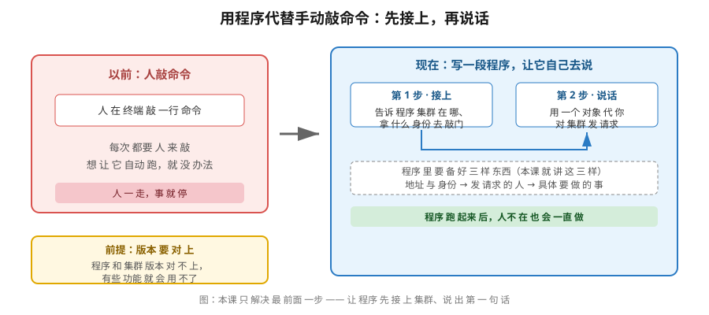
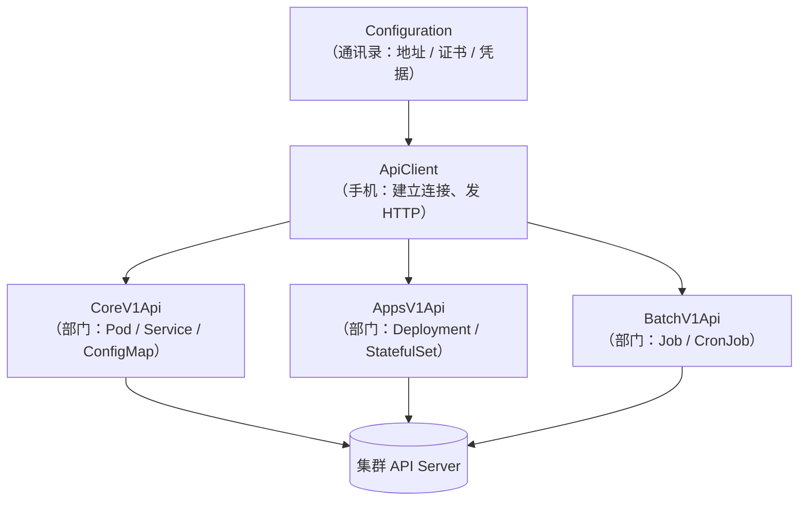
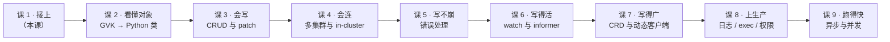

# 课 1：装库与第一次调用

> 📍 所属：子教程[《Python 客户端专项》](../overview.md)（第 1 课 · 代码视角）
> 📖 故事章节：**接上** —— 你只会敲命令，现在要让程序替你敲
> 🧭 上一课：无（子教程入口） ｜ 下一课：课 2《对象模型地图：GVK → Python 类》
> ⚙️ 实操环境：WSL Ubuntu 24.04 · Python 3.12.13（`uv venv` 隔离环境） · `kubernetes` 34.1.0 · kind 集群 `k8s-c1-calico`（3 节点） · k8s v1.34.0
> 📖 结论已按官方文档核对（核对于 2026-09 ｜ 来源：GitHub README 兼容矩阵 + PyPI）｜ ✅ 本节命令实测于 WSL Ubuntu 24.04 / kubernetes 34.1.0 / k8s v1.34.0

## 🎯 本课目标

学完本课，你应当能够：

- 说出**该装哪个版本**，以及兼容矩阵里 `✓` / `+` / `-` 三个符号各自的真实含义（不是背"装最新版"）
- 用 `uv venv` 建一个**不污染系统 Python** 的隔离环境并把库装上
- 讲清 `Configuration` / `ApiClient` / `CoreV1Api` **三层各自管什么**，以及为什么不能跳层
- 区分 `load_kube_config` 与 `load_incluster_config` 的**适用场景**，并看懂它们各自的报错
- 跑通第一行代码：`list_namespaced_pod`，并看懂返回对象里有什么

---

## 第一幕：起源与场景引入 —— "把这个流程自动化"

### 场景

你是那个**只会 `kubectl apply` 的人**。某天 leader 找你：

> "咱们每天要给三个环境各部署一遍，还要查一遍有没有 Pod 没起来。你写个脚本吧，别手敲了。"

你心想：这不就是把命令搬到脚本里吗。于是你写了第一版：

```bash
#!/bin/bash
kubectl config use-context dev
kubectl apply -f app.yaml
kubectl get pods -n app
kubectl config use-context staging
kubectl apply -f app.yaml
kubectl get pods -n app
# ... 还有第三个环境
```

能跑。但你很快撞墙了：

| 新需求 | 你的 shell 脚本 |
|---|---|
| "Pod 没起来要自动重试 3 次" | 得解析 `kubectl get pods` 的文本输出，然后 `grep` 判断 |
| "没起来就把上一次的版本回滚" | 得自己记版本号，自己拼回滚命令 |
| "失败了发企业微信告警" | 得判断每条命令的退出码，还要拼 JSON |
| "这三个环境并行部署，别串行" | shell 里做并发……想想就头疼 |

**每加一个需求，你都在跟"文本输出"搏斗。**

### 为什么是 Python 客户端

`kubectl` 本质上是**给人用的**：它把 API 的返回渲染成人看的表格，把报错翻译成人读的句子。

而你要写的是**给机器用的程序**。程序不该去 `grep` 一张表格——它需要拿到**结构化的数据**（哪个字段是什么类型、Pod 处于什么阶段、容器重启了几次），然后自己做判断。

这就是 `kubernetes` 这个 PyPI 库的位置：**它让 Python 程序直接跟集群的 API 说话**，拿回来的是对象，不是文本。

> 📚 官方文档：[README.md](https://github.com/kubernetes-client/python#readme)（官方对各语言客户端的定位见 [Client Libraries](https://kubernetes.io/docs/reference/using-api/client-libraries/)）

### 一句话本质

**本课把"人敲命令"变成"程序发请求"——先让程序接上集群，再让它说出第一句话。**

### 处境对照

| | 不这么做（shell 拼 kubectl） | 这么做（Python 客户端） |
|---|---|---|
| 拿到的东西 | **文本**，要 `grep` / `awk` 解析 | **对象**，字段直接点出来 |
| 判断 Pod 是否就绪 | 解析表格文本，环境一变就崩 | `pod.status.phase == "Running"`，与输出格式无关 |
| 加"失败重试" | 自己判断退出码、自己数次数 | `for` 循环 + `try/except`，几行搞定 |
| 官方维护 | 无（`kubectl` 输出格式不保证稳定） | 有（客户端按 k8s 版本同步发布） |

代价是：**多一层依赖，且版本必须和集群对上**——这正是本课第一个知识点要解决的。

---

## 第二幕：认知冲突 —— 装完就跑，然后报错

你信心满满地打开终端：

```bash
pip install kubernetes
```

装上了，`pip show kubernetes` 显示版本 **36.0.3**（当前 PyPI 最新）。你照着 README 抄下第一段代码：

```python
from kubernetes import client, config
config.load_kube_config()
v1 = client.CoreV1Api()
print(v1.list_pod_for_all_namespaces())
```

**居然跑通了。** 你松了口气——"这不挺简单"。

然后你开始写正经的业务代码，用到某个 1.34 的字段，报错了：

```
ApiException: (400)
Reason: Bad Request
```

或者更隐蔽的：**代码不报错，但你要的功能压根没生效**。

这时候你会问三个问题：

1. **我该装哪个版本？** 装最新的 36 行不行？
2. **`load_kube_config()` 这行到底干了什么？** 它怎么知道我的集群在哪？
3. **`CoreV1Api()` 又是什么？** 为什么不能直接 `client.list_pods()`？

这三个问题，就是本课的**三个知识点**。

> 💡 **先剧透一个坑**（本课会讲透）：你刚才那次"跑通"是运气好。`pip install kubernetes` 装到的是**最新版**，而最新版对应的是 **k8s 1.36**——你的集群是 **1.34**。多数常用功能确实能用，但**不是全部**。

---

## 第三幕：层层揭示

### 一眼全局图



**看图**：左边是你熟悉的方式——人在终端敲命令，人一走事就停。右边是代码方式——程序自己接上集群、自己发请求。右边框里那三行"地址与身份 → 发请求的人 → 具体要做的事"，就是本课要讲的三层对象。左下角黄色框是前提：**版本要对上**，否则有些功能会用不了。

### 本课地图

| 步骤 | 这一步要解决什么 | 知识点 |
|------|-----------------|--------|
| 第 1 步 | 装哪个版本才不会踩坑 | 知识点 1：版本选择与隔离安装 |
| 第 2 步 | 程序怎么知道集群在哪、拿什么身份 | 知识点 2：连接——`load_kube_config` 与 `load_incluster_config` |
| 第 3 步 | 谁去发请求、怎么发 | 知识点 3：三层对象与第一次调用 |

---

### 🧭 第 1/3 步｜承接：**"我装了最新版，为什么有些功能用不了？"** → 本步：把版本选对

#### 知识点 1：版本选择与隔离安装

##### 一句话定义

`kubernetes` 库按 **k8s 的版本号**发版——client 的大版本号对应它**完全匹配**的 k8s 版本。

##### 直觉建立：把它想成"对讲机的频道"

集群和你手里的客户端就像两台对讲机。**频道对上了（版本匹配），什么都能说；频道差一格，常用的还能凑合听，新功能就对不上了。**

##### 核心原理：兼容矩阵怎么读

官方 README 里有一张兼容矩阵，节选本机相关的三行（**原文照抄**）：

```
- client 33.y.z: Kubernetes 1.32 or below (+-), Kubernetes 1.33 (✓), Kubernetes 1.34 or above (+-)
- client 34.y.z: Kubernetes 1.33 or below (+-), Kubernetes 1.34 (✓), Kubernetes 1.35 or above (+-)
- client 35.y.z: Kubernetes 1.34 or below (+-), Kubernetes 1.35 (✓), Kubernetes 1.36 or above (+-)
- client 36.y.z: Kubernetes 1.35 or below (+-), Kubernetes 1.36 (✓), Kubernetes 1.37 or above (+-)
```

三个符号的含义（**官方 Key 原文照译**）：

| 符号 | 官方原文含义 | 人话 |
|------|-------------|------|
| `✓` | Exactly the same features / API objects in both client-python and the Kubernetes version | **完全对上**：双方功能一模一样 |
| `+` | client-python has features or API objects that **may not be present** in the Kubernetes cluster | **客户端超前**：客户端有的对象，集群可能没有（比如你装 36 去连 1.34） |
| `-` | The Kubernetes cluster has features the client-python library **can't use** | **集群超前**：集群有的功能，客户端用不了（比如你装 33 去连 1.34） |

**"+-" 连在一起**（如 `1.33 or below (+-)`）表示：比它低的版本是 `-`，比它高的是 `+`，两种"不完全匹配"都涵盖了。

> 🎯 **本课第一个反直觉点**：
> **"装最新版"在 k8s 客户端里是错的。**
> 最新版 36.0.3 对应 k8s 1.36（✓），而你的集群是 1.34——按矩阵属于 `+-` 中的 `+`，即**客户端超前**。多数常用 API 能用，但**客户端里那些 1.35/1.36 才有的对象，你的集群根本没有**。
> 反过来装 33（对应 1.33），你的 1.34 集群就属于 `-`——**集群有 1.34 的新功能，客户端用不了**。
> **本机集群 v1.34.0 → 应装 client 34.y.z。**

##### 该装 34 的哪个小版本

实测 PyPI 上 `34.` 开头的发布（2026-09 核实）：

```
kubernetes 34.x releases: ['34.1.0', '34.1.0a1', '34.1.0b1']
latest: 36.0.3
requires_python: >=3.10
```

`a1` / `b1` 是**预发布版**（alpha / beta），生产不要碰。所以 **34.1.0 是 34.x 唯一的稳定版**——这也是本教程锁定的版本。

> 💡 **CHANGELOG 是升级前的必查项**：官方在矩阵下面直接写了 "See the [CHANGELOG](./CHANGELOG.md) for a detailed description of changes"。**跨大版本升级前（比如 34 → 35），先翻 CHANGELOG 看 breaking change**，别直接 `pip install -U`。

##### 隔离安装：别污染系统 Python

系统 Python 是所有工具共享的。把库直接装进去，轻则版本冲突，重则搞坏依赖它的系统工具。**用虚拟环境隔离**是标准做法。

本教程用 `uv`（一个很快的 Python 包管理器）。`venv` 模块同样可以，二选一。

```bash
# 1. 建一个隔离环境（不会动系统 Python）
uv venv /tmp/k8spy-venv --python 3.12

# 2. 往这个环境里装库（注意是指定版本，不是装最新）
uv pip install --python /tmp/k8spy-venv/bin/python 'kubernetes==34.1.0'

# 3. 确认装对了
/tmp/k8spy-venv/bin/python -c "import kubernetes, sys; print(kubernetes.__version__, sys.version.split()[0])"
```

**实测输出**：

```
kubernetes 34.1.0 | python 3.12.13
```

实测装完它会自动带上 19 个依赖，其中几个你要认识（后面几课会用到）：

| 依赖 | 干什么用 |
|---|---|
| `urllib3` 2.3.0 | 真正发 HTTP 请求的底层库 |
| `requests` 2.34.2 | 上层 HTTP 封装 |
| `cryptography` 50.0.1 | 处理 TLS / 证书 |
| `google-auth` 2.58.0 | GKE 等云厂商鉴权（课 4 的 exec provider 要用） |
| `websocket-client` 1.9.2 | exec / 端口转发用的 WebSocket（课 8 要用到） |

> ⚠️ **装库属改环境**。上面命令我是在**你授权后**执行的，装在 `/tmp` 下的隔离环境里。你在自己机器上跑之前，确认这是你想要的。

##### 常见误区

| ❌ 误区 | ✅ 真相 |
|---|---|
| "装最新版最安全" | 最新版对应最新 k8s。你的集群落后时，最新版反而给你 `+`（客户端超前） |
| "`+-` 就是不能用" | 恰恰相反——官方原文说 "everything they have in common (i.e., most APIs) **will work**"。**共有功能都能用** |
| "版本号随便装，能跑就行" | 能跑 ≠ 功能齐全。踩坑时往往已经是上线后 |

##### 行话锚定

| 本课说法（人话） | 行业标准叫法 | 在哪遇到 |
|---|---|---|
| 频道对上 | 兼容（Compatibility） | README 的 `Compatibility matrix of supported client versions` 章节 |
| 客户端超前 | `+`（client has additional new API） | 同上，Key 部分 |
| 预发布版 | alpha / beta release | PyPI 版本号后缀 `a1` / `b1`；`pip install` 默认**不装**预发布版 |
| 升级前必查 | CHANGELOG | 仓库 [CHANGELOG.md](https://github.com/kubernetes-client/python/blob/master/CHANGELOG.md) |
| 隔离环境 | virtual environment（虚拟环境） | `uv venv` / `python -m venv`；报错关键字 `ModuleNotFoundError`（装进了别的环境） |

---

### 🧭 第 2/3 步｜承接：**"装对了，但 `load_kube_config()` 怎么知道我的集群在哪？"** → 本步：把连接这件事讲透

#### 知识点 2：连接——`load_kube_config` 与 `load_incluster_config`

##### 一句话定义

连接分两种场景：**程序跑在集群外**（你的笔记本）用 `load_kube_config`；**程序跑在集群内的 Pod 里**用 `load_incluster_config`。

##### 直觉建立：进自家门 vs 进公司门

- **集群外**：你在公司门外，得掏**门禁卡**（kubeconfig 文件）刷一下才能进
- **集群内**：你已经在楼里了，工牌（ServiceAccount token）**自动就挂在脖子上**，直接推门

##### 核心原理：`load_kube_config` 干了什么

它做的就三件事：

1. **找到 kubeconfig 文件**——默认 `~/.kube/config`，也可用 `KUBECONFIG` 环境变量指定（也可直接传 `config_file=` 参数，见下）
2. **读出当前 context**——集群地址、证书、用户凭据
3. **填进默认配置对象**——后面所有 API 调用都用它

```python
from kubernetes import config

# 集群外：读本地 ~/.kube/config
config.load_kube_config()

# 也可以指定文件
config.load_kube_config(config_file="/path/to/your/kubeconfig")
```

##### 反例对照：两个真实报错

> 🐞 下面两段报错都是**本机真跑出来的原文**，不是编的。

**报错 1**：kubeconfig 路径写错或文件为空

```python
config.load_kube_config(config_file="/tmp/definitely-not-exist-kubeconfig.yaml")
```

真实输出（末尾）：

```
kubernetes.config.config_exception.ConfigException: Invalid kube-config file. No configuration found.
```

**看到 `ConfigException: Invalid kube-config file`** → 别怀疑网络，就是**文件没找到或内容不对**。

**报错 2**：在集群外调 `load_incluster_config`

```python
config.load_incluster_config()
```

真实输出（末尾）：

```
kubernetes.config.config_exception.ConfigException: Service host/port is not set.
```

**看到 `Service host/port is not set`** → 说明程序**没在 Pod 里**，却用了 Pod 内专用的连接方式。

> 💡 这两个报错是**最常见的入门墙**。它们都属于 `ConfigException`，但根因完全不同：一个是"文件问题"，一个是"用错了场景"。

##### `load_incluster_config`：程序跑在 Pod 里时

当你的程序**本身作为一个 Pod 跑在集群里**（这就是后面讲的"控制器 / Operator"的运行方式），它不需要 kubeconfig 文件——集群会自动把 ServiceAccount 的 token 挂进容器：

```
/var/run/secrets/kubernetes.io/serviceaccount/token
/var/run/secrets/kubernetes.io/serviceaccount/ca.crt
```

`load_incluster_config` 就是去读这两个文件。**所以它在集群外必然失败**——上面那个报错就是这么来的。

> ⚠️ **本课不真跑 in-cluster**：那需要在集群里起 Pod，属改集群状态，**留到课 4 专门做**。这里先讲清"什么时候用哪个"。

##### 两种方式的对照表

| 本课说法（人话） | 行业标准叫法 | 典型写法 / 在哪遇到 | 代价 |
|---|---|---|---|
| 门外刷卡 | 集群外连接（out-of-cluster） | `config.load_kube_config()`；依赖 `~/.kube/config` | 依赖本地文件，换机器要重新配 |
| 楼里刷脸 | 集群内连接（in-cluster） | `config.load_incluster_config()`；报错 `Service host/port is not set` | **只能在 Pod 内用**；权限受 ServiceAccount 限制（课 4、课 8 展开） |
| 门禁卡 | kubeconfig / context | 环境变量 `KUBECONFIG` | 文件泄露 = 集群权限泄露 |
| 工牌 | ServiceAccount token | 路径 `/var/run/secrets/kubernetes.io/serviceaccount/` | 权限由 RBAC 决定（主线课 15） |

##### 常见误区

| ❌ 误区 | ✅ 真相 |
|---|---|
| "两个函数都调一遍更保险" | 按场景**二选一**。实测：在集群外先 `load_kube_config()` 再 `load_incluster_config()`，后者**直接抛 `ConfigException`**（好消息是它不会静默覆盖掉你已有的配置） |
| "in-cluster 更高级，优先用它" | 它**只在 Pod 内可用**。你在本机调试时用它，必报 `Service host/port is not set` |
| "kubeconfig 里能连，代码里就一定行" | 代码读的是同一个文件，但**当前 context 可能不是你以为的那个**（多集群时尤其常见，课 4 解决） |

---

### 🧭 第 3/3 步｜承接：**"连上了，但 `CoreV1Api()` 是什么？为什么不能一步到位？"** → 本步：把三层讲清并跑通第一次调用

#### 知识点 3：三层对象与第一次调用

##### 一句话定义

客户端是**三层结构**：`Configuration` 管连接信息，`ApiClient` 管发请求，`CoreV1Api` 是具体某一组 API 的操作入口。

##### 直觉建立：打电话的三样东西

想象你要给集群打电话：

- **`Configuration`** = **通讯录**（存着号码：集群地址、证书、凭据）
- **`ApiClient`** = **手机**（真正拨号、建立连接的那台设备）
- **`CoreV1Api`** = **你要找的具体部门**（核心资源部门：Pod / Service / ConfigMap……）

你不能拿通讯录直接说话，也不能让手机自己决定打给谁——**三层各管一摊，缺一不可**。

##### 核心原理：三层的关系



**看图**：`Configuration` 提供连接信息给 `ApiClient`；`ApiClient` 是真正干活的那一层，多个"部门"（`CoreV1Api` / `AppsV1Api` / `BatchV1Api`）都**共用同一台手机**。这就是为什么你通常只建一个 `ApiClient`。

##### 为什么平时看不到前两层

因为**有默认值兜底**。最常见的写法：

```python
from kubernetes import client, config

config.load_kube_config()          # 填好默认的 Configuration
v1 = client.CoreV1Api()            # 自动用默认 Configuration 造 ApiClient
```

这两行背后，`load_kube_config()` 把信息写进了**默认 Configuration**，`CoreV1Api()` 发现你没传 `ApiClient`，就自己造一个。

**拆开写是等价的**——实测：

```python
from kubernetes import client, config

config.load_kube_config()
cfg = client.Configuration.get_default_copy()
print("Configuration.host =", cfg.host)
print("Configuration.verify_ssl =", cfg.verify_ssl)

ac = client.ApiClient(cfg)
print("ApiClient =", type(ac).__module__ + "." + type(ac).__name__)

v1 = client.CoreV1Api(ac)
print("CoreV1Api =", type(v1).__module__ + "." + type(v1).__name__)
```

**实测输出**：

```
Configuration.host = https://127.0.0.1:40271
Configuration.verify_ssl = True
ApiClient = kubernetes.client.api_client.ApiClient
CoreV1Api = kubernetes.client.api.core_v1_api.CoreV1Api
```

> 💡 **`host` 是 `127.0.0.1:40271` 而不是 6443**——因为本机是 **kind 集群**，节点是容器，端口被映射到了宿主机的高位端口。**这是 kind 的正常表现，不是配错了**。

##### 第一次调用：列出 Pod

```python
from kubernetes import client, config

config.load_kube_config()
v1 = client.CoreV1Api()

ret = v1.list_namespaced_pod(namespace="default")
print("default 命名空间 pod 数:", len(ret.items))
for i in ret.items:
    print("  -", i.metadata.name, "|", i.status.phase)
print("api_version:", ret.api_version, "| kind:", ret.kind)
```

**实测输出**（本机 `default` 命名空间当前没有 Pod）：

```
default 命名空间 pod 数: 0
api_version: v1 | kind: PodList
```

**这就是"对象而不是文本"的意思**：

- `ret.items` 是一个 **list**，每个元素是一个 `V1Pod` 对象
- `ret.api_version` = `"v1"`，`ret.kind` = `"PodList"`——**和 `kubectl get pods -o json` 里的字段一一对应**
- 想判断状态？`pod.status.phase == "Running"`，**不用解析任何文本**

> ⚠️ **你的 `default` 里可能没 Pod，输出 0 条是正常的**。想看到有内容的输出，换成 `list_pod_for_all_namespaces()`（实测返回 **40 个** Pod，大部分是系统组件）。

##### `CoreV1Api` 上到底有多少方法

实测数了一下 `list_` / `read_` / `create_` 开头的方法：

```
CoreV1Api 上 list/read/create 开头的方法数 = 150
样例: ['create_namespace', 'create_namespace_with_http_info',
       'create_namespaced_binding', 'create_namespaced_binding_with_http_info']
```

**150 个**，还只是 `CoreV1Api` 一个类的三种前缀。所以：

> 🎯 **不要试图记住方法名，要学会查。**
> 方法命名是**有规律的**：`{动作}_{范围}_{资源}`，比如 `list_namespaced_pod`、`read_namespaced_pod`、`create_namespaced_pod`。
> 真正要记的是**规律 + 去哪查**（课 2 会系统讲这张地图）。
>
> 另外注意每个方法都有个 `_with_http_info` 变体（如 `create_namespace_with_http_info`）——它除了返回对象，**还返回 HTTP 状态码和响应头**。实测它返回一个**三元组** `(对象, 状态码, 响应头)`：

```python
r = v1.list_namespaced_pod_with_http_info(namespace="default")
# 返回类型: tuple | 长度: 3
# 第2个元素(状态码): 200
# 第3个元素(响应头)类型: HTTPHeaderDict
```

需要状态码（比如判断是不是 404）或响应头时用它——**课 5 讲错误处理时会再见到它**。

##### 常见误区

| ❌ 误区 | ✅ 真相 |
|---|---|
| "每次都 new 一个 `CoreV1Api()`" | 每次 new 会**再建一个 ApiClient**（实测：两次 `CoreV1Api()` 的 `api_client` 是**不同对象**，连 `configuration` 也不同），等价于多开一台手机。应复用（课 8 展开） |
| "三层太啰嗦，跳过 `ApiClient` 直接用" | 日常确实可以省略（`CoreV1Api()` 会自动造），但**多集群 / 多配置时必须手动建**（课 4） |
| "方法名要背下来" | 150 个方法靠背不现实。记命名规律 + 会查 API 参考（课 2） |
| "输出里有 Pod 才算跑通" | 空命名空间返回 0 条也是**跑通了**。判断标准是**有没有抛异常** |

##### 行话锚定

| 本课说法（人话） | 行业标准叫法 | 在哪遇到 |
|---|---|---|
| 通讯录 | Configuration | `client.Configuration`；字段 `host` / `verify_ssl` / `api_key` |
| 手机 | ApiClient | `kubernetes.client.api_client.ApiClient` |
| 部门 | API 类（API class） | `CoreV1Api` / `AppsV1Api` / `BatchV1Api`；API 参考见 [CoreV1Api.md](https://github.com/kubernetes-client/python/blob/master/kubernetes/docs/CoreV1Api.md) |
| 带详细信息的方法 | `_with_http_info` 变体 | 方法名后缀；返回 `(对象, HTTP 状态码, 响应头)` |
| 门禁卡文件 | kubeconfig | 环境变量 `KUBECONFIG`；主线课 2 已讲 |

---

## 第四幕：实操验证

> ✅ 本节命令实测于 WSL Ubuntu 24.04 / Python 3.12.13 / `kubernetes` 34.1.0 / kind 集群 k8s v1.34.0

### 4.1 机制验证：从零跑通"接上 → 说话"

**Step 1：确认环境**（如果你已按知识点 1 装好，可跳过）

```bash
uv venv /tmp/k8spy-venv --python 3.12
uv pip install --python /tmp/k8spy-venv/bin/python 'kubernetes==34.1.0'
```

**Step 2：确认版本装对了**

```bash
/tmp/k8spy-venv/bin/python -c "import kubernetes; print(kubernetes.__version__)"
```

预期：`34.1.0`（**不是** 36.x）

**Step 3：写第一个脚本**

存为 `first_call.py`：

```python
from kubernetes import client, config

# 第 1 步：接上（集群外，读 ~/.kube/config）
config.load_kube_config()

# 第 2 步：拿一个"核心部门"的入口
v1 = client.CoreV1Api()

# 第 3 步：说话——列出所有命名空间的 Pod
ret = v1.list_pod_for_all_namespaces()
print(f"集群里共有 {len(ret.items)} 个 Pod")

# 看看对象长什么样
if ret.items:
    pod = ret.items[0]
    print(f"第一个 Pod：{pod.metadata.namespace}/{pod.metadata.name}")
    print(f"  状态：{pod.status.phase}")
    print(f"  所在节点：{pod.spec.node_name}")
    print(f"  IP：{pod.status.pod_ip}")
```

**Step 4：跑它**

```bash
/tmp/k8spy-venv/bin/python first_call.py
```

**实测输出**（本机）：

```
集群里共有 40 个 Pod
第一个 Pod：calico-system/calico-apiserver-ddd86bcb9-p6xdc
  状态：Running
  所在节点：k8s-c1-calico-control-plane
  IP：10.244.x.x
```

> **回扣第一幕的场景**：还记得那个"每天给三个环境部署一遍"的需求吗？现在你已经能用**对象**而不是文本拿到 Pod 状态了——`pod.status.phase` 一个属性就够，不用 `grep`。
> 至于"三个环境切换""失败重试"，分别是**课 4**和**课 5**的内容。

**Step 5：验证"连错了会怎样"**（可选，但强烈建议亲手试一次）

```bash
# 在集群外调 in-cluster 连接，看那个经典报错
/tmp/k8spy-venv/bin/python -c "from kubernetes import config; config.load_incluster_config()"
```

你会看到 `ConfigException: Service host/port is not set.`——**记住它**，以后在 Pod 里调试时会再见面。

### 4.2 命令速查卡

| 我想干什么 | 命令 / 代码 |
|---|---|
| 建隔离环境 | `uv venv /tmp/k8spy-venv --python 3.12` |
| 装指定版本 | `uv pip install --python <venv>/bin/python 'kubernetes==34.1.0'` |
| 看装了什么版本 | `python -c "import kubernetes; print(kubernetes.__version__)"` |
| 集群外连接 | `config.load_kube_config()` |
| 集群内连接（Pod 里） | `config.load_incluster_config()` |
| 指定 kubeconfig | `config.load_kube_config(config_file="/path/to/config")` |
| 拿核心资源入口 | `v1 = client.CoreV1Api()` |
| 列某命名空间 Pod | `v1.list_namespaced_pod(namespace="default")` |
| 列全部 Pod | `v1.list_pod_for_all_namespaces()` |
| 查集群版本 | `client.VersionApi().get_code()` |

---

## 第五幕：体系收束

### 本课在整体中的位置



**看图**：你现在站在最左端——**刚接上集群，说出了第一句话**。

### 你已经会了什么

- **版本**：知道该装 `34.1.0`（不是最新版），并理解 `✓` / `+` / `-` 的含义
- **环境**：用 `uv venv` 隔离安装，不污染系统 Python
- **连接**：区分集群外 / 集群内两种连接方式，看得懂各自的报错
- **三层**：`Configuration` → `ApiClient` → `CoreV1Api` 各管什么
- **第一次调用**：拿到的是**对象**，不是文本

### 还差什么（本课的伏笔）

| 本课留下的疑问 | 在哪解决 |
|---|---|
| 方法名有 150 个，怎么知道该调哪个？ | **课 2**：GVK → Python 类的映射规律 |
| 想改一个字段，用 `create` 还是 `patch`？ | **课 3**：CRUD 与四种 patch |
| 多集群怎么切？Pod 里怎么跑？ | **课 4**：认证与多集群 |
| 报错了怎么知道是哪种错？ | **课 5**：`ApiException` 拆解 |

### 一句话记住

> **装版本看集群，连集群看位置（里/外），发请求靠三层；拿回来的是对象，不是文本。**

---

## 🐞 本课易错点回顾

| # | 易错点 | 正确做法 |
|---|--------|---------|
| 1 | `pip install kubernetes` 装最新版 | 按集群版本选（1.34 → 34.1.0） |
| 2 | 在集群外用 `load_incluster_config()` | 本机用 `load_kube_config()`；报错 `Service host/port is not set` 就是这个原因 |
| 3 | 每次都 new 一个 `CoreV1Api()` | 复用同一个（每个都会新建 `ApiClient`） |
| 4 | 用 `grep` 解析返回 | 直接取对象属性，`pod.status.phase` |
| 5 | 看到 0 个 Pod 以为失败了 | 空命名空间返回 0 条是正常的，标准是**没抛异常** |

## 📚 官方文档

| 内容 | 链接 |
|---|---|
| 安装与最小示例 | [README.md](https://github.com/kubernetes-client/python#readme) |
| 兼容矩阵（版本选择） | [README · Compatibility matrix](https://github.com/kubernetes-client/python#compatibility-matrix-of-supported-client-versions) |
| 符号含义 Key | [README · Key](https://github.com/kubernetes-client/python#compatibility) |
| 版本变更（升级前必查） | [CHANGELOG.md](https://github.com/kubernetes-client/python/blob/master/CHANGELOG.md) |
| PyPI 页面（版本号 / Python 要求） | [pypi.org/project/kubernetes](https://pypi.org/project/kubernetes/) |
| `CoreV1Api` 方法清单 | [CoreV1Api.md](https://github.com/kubernetes-client/python/blob/master/kubernetes/docs/CoreV1Api.md) |
| 官方对各语言客户端的定位 | [Client Libraries](https://kubernetes.io/docs/reference/using-api/client-libraries/) |

---

## 🚀 下一批接力提示词

> 学完本课后，**复制下面这段文字发给 AI**，即可无缝进入下一课（无需重新描述上下文）：

```
继续学 Kubernetes Python 客户端专项。我的学习档案在 k8s/子教程/Python客户端专项/overview.md，
刚学完课 1《装库与第一次调用》（知识点：版本选择与隔离安装、load_kube_config 与 load_incluster_config、
三层对象与第一次调用），请按大纲继续讲解课 2《对象模型地图：GVK → Python 类》。
```

---

## 🧭 课程导航

- **上一课**：无（子教程入口）
- **下一课**：课 2《对象模型地图：GVK → Python 类》
- **返回**：[子教程目录](../overview.md) ｜ [主课程目录](../../../02-课程目录.md)
