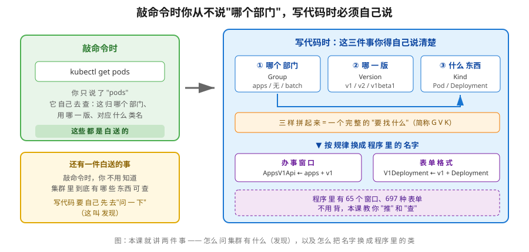
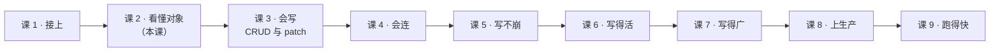

# 课 2：对象模型地图：GVK → Python 类

> 📍 所属：子教程[《Python 客户端专项》](../overview.md)（第 2 课 · 代码视角）
> 📖 故事章节：**看懂** —— 你只会敲命令，现在要让程序替你敲
> 🧭 上一课：[课 1《装库与第一次调用》](lesson-01-装库与第一次调用.md) ｜ 下一课：课 3《CRUD 与 patch 语义》
> ⚙️ 实操环境：WSL Ubuntu 24.04 · Python 3.12.13（`uv venv` 隔离环境） · `kubernetes` 34.1.0 · kind 集群 `k8s-c1-calico`（3 节点） · k8s v1.34.0
> 📖 结论已按官方文档核对（核对于 2026-09 ｜ 来源：GitHub 仓库 API 参考）｜ ✅ 本节命令实测于 WSL Ubuntu 24.04 / kubernetes 34.1.0 / k8s v1.34.0

## 🎯 本课目标

学完本课，你应当能够：

- 说出 **GVK 三要素**（Group / Version / Kind）各自回答什么问题，以及为什么**代码里必须自己拼而 kubectl 不用**
- 用三种方式做**API 发现**：集群版本、有哪些组、某组下有哪些资源（并知道 `ApisApi` 的真实能力边界）
- 掌握 **GVK → Python 类**的映射规律，能用它**推**出类名，也知道**什么时候推不准必须查**
- 分清**"办事窗口"（Api 类）与"表单格式"（模型类）**这两类东西
- 会用 `to_dict()` / `sanitize_for_serialization()` 做**对象 ↔ dict 互转**，并说清两者差异
- 讲清 **为什么 `read` 回来的对象不能直接 `create`**，以及怎么处理才对

---

## 第一幕：起源与场景引入 —— "我要查 Pod，用哪个类？"

### 场景

课 1 结束时，你已经能跑通这一行：

```python
v1 = client.CoreV1Api()
ret = v1.list_namespaced_pod(namespace="default")
```

现在 leader 加需求了：

> "顺便把每个 Deployment 的副本数也查一下，还有那些 Job 有没有跑完。"

你很自然地照着抄：

```python
v1 = client.CoreV1Api()
v1.list_namespaced_deployment(namespace="default")   # ❓ 有这个方法吗？
v1.list_namespaced_job(namespace="default")          # ❓
```

**你不敢确定。** 于是你打开搜索引擎，搜"kubernetes python list deployments"，翻到一篇博客，照抄：

```python
apps_v1 = client.AppsV1Api()
apps_v1.list_namespaced_deployment(namespace="default")
```

跑通了。但你心里发虚：

- **为什么 Pod 用 `CoreV1Api`，Deployment 就要换 `AppsV1Api`？**
- **下一个要查 Ingress 呢？CronJob 呢？我是不是每种资源都得搜一次博客？**
- **`V1Pod`、`V1Deployment` 这些"表单"又是从哪来的？**

### 处境对照

| | 敲命令时（kubectl） | 写代码时（Python 客户端） |
|---|---|---|
| 我要查 Pod | `kubectl get pods` —— **只说"pods"** | 得知道：归哪个组、哪个版本、用哪个 Api 类、返回什么模型类 |
| 它怎么知道 pods 是什么 | kubectl **自己去集群问**（发现机制） | **你得自己问**，或者自己知道规律 |
| 换一种资源 | 改个词就行 | 可能要**换一个 Api 类** |
| 类不对时 | 不存在这问题 | 报 `AttributeError`，或者更糟——**连错组、查到别的东西** |

> 💡 **这一课的本质**：kubectl 把"这资源归哪管、用哪版、什么结构"这三件事**全替你做了**。你写代码，这三件事**得自己做**——要么**推**（规律），要么**查**（发现）。

### 一句话本质

**本课给你一张地图：集群里"有什么"怎么问（发现），"叫什么"怎么换成程序里的类名（映射）。**

---

## 第二幕：认知冲突 —— 照着博客抄，抄到第三个就崩了

你按博客抄，前两个都顺利：

```python
client.CoreV1Api()      # Pod          ← 博客说这么写
client.AppsV1Api()      # Deployment   ← 博客说这么写
```

第三个要查 Ingress，你**按规律推**：

```python
client.NetworkingV1Api()    # ← 猜对了
```

第四个要查 Role（RBAC 相关，主线课 15 学过），你继续推：

```python
client.RbacV1Api()          # ❌ AttributeError: module 'kubernetes.client' has no attribute 'RbacV1Api'
```

**崩了。** 你搜了一圈才发现正确的是：

```python
client.RbacAuthorizationV1Api()   # ✅ 多了 "Authorization"
```

这时候你会问：

1. **这规律到底准不准？** 什么时候能推，什么时候必须查？
2. **我怎么知道集群里到底有哪些资源？** 总不能每次都搜博客
3. **`V1Pod` 这种"表单"和 `CoreV1Api` 这种"窗口"是什么关系？**

> 🎯 **先剧透本课最重要的一条**：这个库里有 **65 个 Api 类、697 个模型类**（本机 34.1.0 实测）。
> **不要背，也不可能背。** 本课教的是**推导规律 + 查证手段**这两件事——比记住 65 个类名有用得多。

---

## 第三幕：层层揭示

### 一眼全局图



**看图**：左边是敲命令——你只说"pods"，剩下三件事 kubectl 白送。右边是写代码——**哪个部门（Group）、哪一版（Version）、什么东西（Kind）**这三样你得自己拼，拼完按规律换成两个程序里的名字：办事窗口（Api 类）和表单格式（模型类）。左下角还有一件白送的事：**集群里有什么可查**，kubectl 自己问，代码要自己先问（这叫发现）。

### 本课地图

| 步骤 | 这一步要解决什么 | 知识点 |
|------|-----------------|--------|
| 第 1 步 | 集群里到底有什么可查 | 知识点 1：API 发现——先问再查 |
| 第 2 步 | 名字怎么换成程序里的类 | 知识点 2：GVK → Python 类的映射规律 |
| 第 3 步 | 对象怎么变成能发出去的数据 | 知识点 3：模型类 ↔ dict 互转，以及 read 的对象为何不能直接 create |

---

### 🧭 第 1/3 步｜承接：**"我怎么知道集群里有什么可查？"** → 本步：先问再查

#### 知识点 1：API 发现——先问再查

##### 一句话定义

**发现**就是程序去问集群："你有哪些资源？"——kubectl 每次执行都在做这件事，代码里你得自己做。

##### 直觉建立：去政务大厅先拿一张"楼层索引"

你第一次去政务大厅办事，不会直接冲进某个窗口。你会先看**楼层索引**：这栋楼有哪些部门、每个部门在几楼、办什么事。

集群就是那栋楼。**发现 = 拿那张索引**。

##### 核心原理：三种问法

**问法 1：集群版本是什么**

```python
from kubernetes import client, config
config.load_kube_config()

v = client.VersionApi().get_code()
print(v.git_version, v.major, v.minor)
```

实测输出：

```
v1.34.0 1 34
```

> `VersionApi` 只有 `get_code()` 一个方法（外加 `_with_http_info` 变体）——这是本课实测确认的，别猜它有别的。

**问法 2：集群里有哪些"部门"（Group）**

```python
groups = client.ApisApi().get_api_versions()
print("group 总数:", len(groups.groups))
for g in sorted(groups.groups, key=lambda x: x.name):
    pv = g.preferred_version.version if g.preferred_version else "-"
    print(f"  {g.name:35s} preferred={pv}")
```

实测输出（本机 kind 集群，**节选前 12 个，共 29 个组**）：

```
group 总数: 29
  admissionregistration.k8s.io        preferred=v1
  apiextensions.k8s.io                preferred=v1
  apiregistration.k8s.io              preferred=v1
  apps                                preferred=v1
  authentication.k8s.io               preferred=v1
  authorization.k8s.io                preferred=v1
  autoscaling                         preferred=v2
  batch                               preferred=v1
  certificates.k8s.io                 preferred=v1
  coordination.k8s.io                 preferred=v1
  crd.projectcalico.org               preferred=v1
  discovery.k8s.io                    preferred=v1
```

> 💡 注意 `autoscaling` 的 `preferred=v2`——**首选版本是 v2，不是 v1**。这意味着你要操作 HPA，现代写法应该用 `AutoscalingV2Api`。这类信息**只能靠发现拿到**，猜不出来。

**问法 3：某个组下有哪些具体资源**

这是**最有用**的一条，但也是**最容易踩坑**的一条。

> ⚠️ **实测结论（重要）**：`ApisApi` / `CoreApi` 在 34.1.0 里**只有 `get_api_versions()`**，**没有** `get_api_resources()` 这类方法。实测：
>
> ```
> CoreApi 方法: ['get_api_versions', 'get_api_versions_with_http_info']
> ApisApi 方法: ['get_api_versions', 'get_api_versions_with_http_info']
> ```
>
> 也就是说：**"列出某组下所有资源"这件事，这两个类都干不了。**

那怎么办？两个办法：

**办法 A（推荐）：直接打 HTTP**

```python
from kubernetes import client, config
config.load_kube_config()
api = client.ApiClient()

# 核心组 /api/v1
r = api.call_api(resource_path="/api/v1", method="GET",
                 auth_settings=["BearerToken"],
                 response_type="object", _return_http_data_only=True)
print("kind:", r.get("kind"), "| resources 数:", len(r.get("resources", [])))
kinds = {x["kind"] for x in r["resources"]}
print("含 Pod?", "Pod" in kinds)

# apps/v1
r2 = api.call_api(resource_path="/apis/apps/v1", method="GET",
                  auth_settings=["BearerToken"],
                  response_type="object", _return_http_data_only=True)
for x in r2.get("resources", [])[:6]:
    print(f"  {x['name']:26s} kind={x['kind']:18s} namespaced={x['namespaced']}")
```

实测输出：

```
kind: APIResourceList | resources 数: 39
含 Pod? True

  controllerrevisions        kind=ControllerRevision namespaced=True
  daemonsets                 kind=DaemonSet          namespaced=True
  daemonsets/status          kind=DaemonSet          namespaced=True
  deployments                kind=Deployment         namespaced=True
  deployments/scale          kind=Scale              namespaced=True
  deployments/status         kind=Deployment         namespaced=True
```

**这份数据就是 kubectl `api-resources` 背后的那份数据**——`namespaced` 字段直接告诉你该用 `list_namespaced_xxx` 还是 `list_xxx`。

**办法 B（更省事）：用 kubectl 看，但要知道它俩是同一份数据**

```bash
kubectl api-resources          # 人看的表格
kubectl api-resources -o wide  # 多一列 VERBS
kubectl explain deployment     # 看某个资源的字段说明
```

> 🎯 **本课第二个反直觉点**：
> **`kubectl` 和你的代码看到的是同一份数据**（都来自 `/api` 和 `/apis`）。
> 所以**先用 `kubectl api-resources` 查清楚，再写代码**——这不是"偷懒用命令行"，而是**用更方便的工具查同一份真相**。

##### 关于 `api_discovery`

你可能在某些资料里看到 `api_discovery` 这个说法。**实测：它在 34.1.0 的 `ApiClient` 上不存在**：

```
属性访问失败: AttributeError 'ApiClient' object has no attribute 'api_discovery'
ApiClient 里含 discovery 的方法: []
```

> ⚠️ 这是**资料与版本的偏差**。遇到这类"文档说有、代码里没有"的情况，**以本机实测为准**。本教程一律如此。

真正存在的是 `DiscoveryApi` / `DiscoveryV1Api`——但那是 **EndpointSlice 资源**（`discovery.k8s.io/v1`）的 API 类，**跟"发现集群有什么资源"不是一回事**。名字像，别搞混。

##### 常见误区

| ❌ 误区 | ✅ 真相 |
|---|---|
| "`ApisApi` 能列出所有资源" | 实测它只有 `get_api_versions()`。**列资源要用 `call_api` 打 HTTP，或用 kubectl** |
| "发现是高级功能，先跳过" | 它是**代码视角的地基**。kubectl 每次都在做，你不做就只能靠搜博客 |
| "集群装了什么我知道" | CRD 是你自己装的你知道，**别人装的、系统升级带的**你不知道。29 个组里有好几个是 Calico / Gateway API 带的 |

##### 行话锚定

| 本课说法（人话） | 行业标准叫法 | 在哪遇到 |
|---|---|---|
| 楼层索引 | API 发现（API discovery） | `kubectl api-resources`；HTTP 路径 `/api`、`/apis` |
| 部门 | API Group（API 组） | `apps`、`batch`、`networking.k8s.io`；核心组**组名为空** |
| 楼层 | Version（版本） | `v1`、`v2`、`v1beta1`；`preferred_version` 是**首选版** |
| 楼层索引里的那条记录 | APIResourceList | `call_api("/api/v1")` 返回的 `kind` |
| 有没有在集群里 | CRD / 聚合 API | 29 个组里 `crd.projectcalico.org` 等就是 CRD 装的（主线课 20） |

---

### 🧭 第 2/3 步｜承接：**"知道有什么了，但怎么换成程序里的类名？"** → 本步：映射规律

#### 知识点 2：GVK → Python 类的映射规律

##### 一句话定义

一个资源由 **Group + Version + Kind** 三要素定位；这三个词**按规律拼出两个 Python 类名**——一个"办事窗口"（Api 类），一个"表单格式"（模型类）。

##### 直觉建立：两类东西要分清

回到政务大厅：

- **办事窗口**（Api 类）：你要去**哪个窗口办**——`CoreV1Api`、`AppsV1Api`。窗口上有**一排按钮**（方法）：查、建、改、删
- **表单格式**（模型类）：这个窗口收**什么格式的申请表**——`V1Pod`、`V1Deployment`

**窗口决定"去哪办"，表单决定"怎么填"。** 两者名字很像，但**不是一回事**。

##### 核心原理：拼接规律

**Api 类（办事窗口）**= `{Group 首字母大写并去点}{Version 大写}Api`

| Group | Version | Api 类 |
|---|---|---|
| （空，核心组） | v1 | `CoreV1Api` ← 核心组特例，用 `Core` |
| `apps` | v1 | `AppsV1Api` |
| `batch` | v1 | `BatchV1Api` |
| `networking.k8s.io` | v1 | `NetworkingV1Api` ← 取第一段 |
| `rbac.authorization.k8s.io` | v1 | `RbacAuthorizationV1Api` ← **取前两段！** |
| `autoscaling` | v1 / v2 | `AutoscalingV1Api` / `AutoscalingV2Api` |
| `storage.k8s.io` | v1 | `StorageV1Api` |

**模型类（表单格式）**= `V{版本号数字}{Kind}`

| Version | Kind | 模型类 |
|---|---|---|
| v1 | Pod | `V1Pod` |
| v1 | Deployment | `V1Deployment` |
| v1 | Job | `V1Job` |
| v1 | CronJob | `V1CronJob` |
| v1 | Ingress | `V1Ingress` |
| v2 | HorizontalPodAutoscaler | `V2HorizontalPodAutoscaler` |

> 🎯 **本课第三个反直觉点（也是第二幕那个坑的答案）**：
> **Group → Api 类的规律不统一。** `networking.k8s.io` 取第一段（`Networking`），但 `rbac.authorization.k8s.io` 取**前两段**（`RbacAuthorization`）。
> 这就是为什么你推 `RbacV1Api` 会 `AttributeError`。
> **规律只能缩小范围，不能替代查证。**

##### 实测对照表（本机 34.1.0 全部验证存在）

| Group / Version | Api 类（窗口） | 常用方法 | 模型类（表单） |
|---|---|---|---|
| 核心组 / v1 | `CoreV1Api` | `list_namespaced_pod` | `V1Pod` |
| `apps` / v1 | `AppsV1Api` | `list_namespaced_deployment` | `V1Deployment` |
| `batch` / v1 | `BatchV1Api` | `list_namespaced_job` / `list_namespaced_cron_job` | `V1Job` / `V1CronJob` |
| `networking.k8s.io` / v1 | `NetworkingV1Api` | `list_namespaced_ingress` | `V1Ingress` |
| `rbac.authorization.k8s.io` / v1 | `RbacAuthorizationV1Api` | `list_namespaced_role` | `V1Role` |
| `autoscaling` / v1 | `AutoscalingV1Api` | `list_namespaced_horizontal_pod_autoscaler` | `V1HorizontalPodAutoscaler` |
| `autoscaling` / v2 | `AutoscalingV2Api` | 同上 | `V2HorizontalPodAutoscaler` |
| `policy` / v1 | `PolicyV1Api` | — | — |
| `storage.k8s.io` / v1 | `StorageV1Api` | — | — |
| CRD（任意） | `CustomObjectsApi` | 见课 7 | dict（无模型类） |

> 💡 **`CustomObjectsApi` 是特例**：CRD 是你自己定义的，没有现成的模型类，所以用 dict 直接进出。**课 7 专门讲**。

##### 方法命名规律

课 1 说过 `CoreV1Api` 有 150 个 `list_/read_/create_` 开头的方法。它们的命名是：

```
{动作}_{范围}_{资源小写}
```

- 动作：`list` / `read` / `create` / `replace` / `patch` / `delete`
- 范围：`namespaced_`（命名空间级）或 空（集群级）
- 资源：Kind 的**小写下划线**形式，如 `horizontal_pod_autoscaler`

所以：**`namespaced` 这个词在不在方法名里，取决于资源是不是命名空间级的**——而这正是知识点 1 里 `APIResourceList` 的 `namespaced` 字段告诉你的。

> **知识点 1 和知识点 2 是这样连起来的**：先发现拿到 `namespaced=True`，才知道该用 `list_namespaced_pod` 而不是 `list_pod`。

##### 怎么查（比推更可靠）

| 我想知道 | 怎么办 |
|---|---|
| 某个 Api 类有哪些方法 | `dir(client.AppsV1Api)` 或 `[m for m in dir(...) if not m.startswith('_')]` |
| 某个方法要什么参数 | `help(client.AppsV1Api.list_namespaced_deployment)` |
| 官方完整清单 | [CoreV1Api.md](https://github.com/kubernetes-client/python/blob/master/kubernetes/docs/CoreV1Api.md)（其它 Api 类同目录下同名文件） |
| 字段含义 | `kubectl explain deployment.spec.replicas` |
| 我是不是拼错了类名 | `hasattr(client, "RbacAuthorizationV1Api")` —— 一行验证，比搜博客快 |

```python
# 一行验证类名对不对（第二幕那个坑，这样 3 秒就能确认）
import kubernetes.client as c
print("RbacV1Api 存在:", hasattr(c, "RbacV1Api"))                  # False
print("RbacAuthorizationV1Api 存在:", hasattr(c, "RbacAuthorizationV1Api"))  # True
```

##### 常见误区

| ❌ 误区 | ✅ 真相 |
|---|---|
| "类名有统一规律，推出来就行" | Group→Api 类**不统一**（`Networking` vs `RbacAuthorization`）。推完**必须验证** |
| "`V1Pod` 和 `CoreV1Api` 是一套的" | 一个是表单、一个是窗口，**按规律各自生成**，只是恰好都含 `V1` |
| "697 个模型类要记" | 记规律 + 用 `hasattr` / `dir` / `help` 查 |
| "`apps/v1` 就对应 `AppsV1Api`，永远对" | 对。但 **Group 到前缀的映射不统一**，这才是坑点 |

##### 行话锚定

| 本课说法（人话） | 行业标准叫法 | 在哪遇到 |
|---|---|---|
| 三样拼起来 | GVK（Group/Version/Kind） | `kubectl api-resources` 输出；YAML 的 `apiVersion` + `kind` |
| 办事窗口 | API 类（Api class） | `CoreV1Api` 等，共 **65 个**（实测） |
| 表单格式 | 模型类（Model class） | `V1Pod` 等，共 **697 个**（实测） |
| 窗口上的按钮 | 方法（method） | `list_namespaced_pod`；每个都有 `_with_http_info` 变体 |
| 命名空间级 | namespaced | `APIResourceList` 的字段；决定方法名里有没有 `namespaced_` |

---

### 🧭 第 3/3 步｜承接：**"类名会了，但怎么把对象变成能发出去的数据？"** → 本步：互转与只读字段

#### 知识点 3：模型类 ↔ dict 互转，以及 read 的对象为何不能直接 create

##### 一句话定义

模型类提供 `to_dict()`（看全貌）和 `ApiClient.sanitize_for_serialization()`（真正发出去）两种转法；而 `read` 回来的对象**带着一堆只读字段**，直接 `create` 会出问题。

##### 直觉建立：表单上的"此栏由工作人员填写"

政务大厅的表单上，有些栏位印着"**此栏由工作人员填写**"。你拿到一张**已经办完**的表（read 回来的对象），上面那些栏位是填好的。

现在你要**拿这张办完的表去办一件新业务**（create）——工作人员会说：**这些栏位你不能自己填。**

##### 核心原理 1：`to_dict()` vs `sanitize_for_serialization()`

两者都把对象转成 dict，但**用途完全不同**。实测：

```python
from kubernetes import client

pod = client.V1Pod(
    metadata=client.V1ObjectMeta(name="demo-pod"),
    spec=client.V1PodSpec(containers=[
        client.V1Container(name="c", image="nginx:1.25")
    ]),
)

d = pod.to_dict()                      # 转法 1
s = client.ApiClient().sanitize_for_serialization(pod)  # 转法 2

print("to_dict 顶层键:", sorted(d.keys()))
print("sanitize 顶层键:", sorted(s.keys()))
print("to_dict['spec'] 键数:", len(d["spec"]))
print("sanitize['spec'] 键数:", len(s["spec"]))
```

实测输出：

```
to_dict 顶层键: ['api_version', 'kind', 'metadata', 'spec', 'status']
sanitize 顶层键: ['metadata', 'spec']
to_dict['spec'] 键数: 39
sanitize['spec'] 键数: 1
```

**差异一目了然**：

| | `to_dict()` | `sanitize_for_serialization()` |
|---|---|---|
| 保留**未设置的字段**吗 | **保留**，值为 `None`（39 个键） | **丢弃**（只剩真正设了的 1 个键） |
| 保留 `api_version` / `kind` | 保留 | **丢弃** |
| 用途 | **调试看全貌**：这个对象都有哪些字段可填 | **实际发送**：这正是发到集群的那份 JSON |
| 类比 | 一张**空白表单**（印着所有栏目） | 一张**填好的表单**（只留下你写的） |

> 💡 **实用结论**：
> - 想**知道某个对象有哪些字段可以设置** → `to_dict()`，键名就是字段名
> - 想**看真正发出去的 JSON 长什么样**（课 5 排障时极有用）→ `sanitize_for_serialization()` + `json.dumps`
>
> 顺带一提：本例两者都能 `json.dumps`（因为 `V1Pod` 里没有不可序列化的类型）。**真正容易踩的坑是 datetime**——比如 `creation_timestamp`，那要用 `sanitize_for_serialization`。

##### 核心原理 2：`read` 回来的对象，带了哪些"工作人员填的栏"

实测读一个 ServiceAccount：

```python
sa = v1.read_namespaced_service_account(name="default", namespace="default")
m = sa.metadata
print("resource_version =", m.resource_version)      # 353
print("uid             =", m.uid)                    # 6124db4b-...
print("creation_timestamp =", m.creation_timestamp)  # 2026-09-17 02:32:14+00:00
print("api_version / kind =", sa.api_version, "/", sa.kind)
```

实测输出：

```
resource_version = 353
uid             = 6124db4b-55dc-4d47-9062-00592ac00af1
creation_timestamp = 2026-09-17 02:32:14+00:00
api_version / kind = v1 / ServiceAccount
```

再读一个 Deployment（字段更全）：

```
deployment coredns managed_fields 条数: 2
首条 manager = kubeadm | operation = Update
resourceVersion = 326259
generation = 5
uid = 89747aa1-f121-404a-ac28-f3ff4af2350f
```

这些**集群填的只读字段**包括：

| 字段 | 谁填的 | 说明 |
|---|---|---|
| `metadata.uid` | 集群 | 资源的**唯一身份证**，集群分配 |
| `metadata.resource_version` | 集群 | **乐观锁版本号**，每次变更递增（课 3 的 patch 冲突、课 6 的 watch 都靠它） |
| `metadata.creation_timestamp` | 集群 | 创建时间 |
| `metadata.generation` | 集群 | 规格变更计数（Deployment 有） |
| `metadata.managed_fields` | 集群 | **字段归属记录**：哪个"管理者"改了哪些字段（课 3 的 server-side apply 冲突要用） |
| `status` | 控制器 | 实际状态，由控制器写 |

##### 那"直接 create"到底会怎样？

**实测结果可能出乎你意料**——我用 `dry_run="All"`（预演，不真创建）试了一下：

```
dry_run create: 成功（未真正创建）
```

**预演竟然通过了**。这说明什么？

> ⚠️ **不要被这个结果误导。** `dry_run` 通过 ≠ 真创建没问题。真实创建时，服务端会**忽略或拒绝**你带过去的只读字段，行为取决于具体资源和字段。
> **更重要的风险**：`resource_version`、`uid` 这些字段带过去，轻则被忽略，重则导致**语义混乱**——比如你以为在创建新对象，实际行为却受旧版本号影响。

**正确做法是显式清掉**：

```python
from kubernetes import client, config
config.load_kube_config()
apps = client.AppsV1Api()

# 1. read 一个现成的
d = apps.read_namespaced_deployment(name="coredns", namespace="kube-system")

# 2. 清掉集群填的只读字段（关键步骤）
d.metadata.resource_version = None
d.metadata.uid = None
d.metadata.creation_timestamp = None
d.metadata.generation = None
d.metadata.managed_fields = None
d.status = None            # 状态由控制器写，不该由你提交
d.metadata.name = "coredns-copy"   # 换名字，否则和原对象冲突
d.metadata.namespace = "default"

# 3. 现在才创建
apps.create_namespaced_deployment(namespace="default", body=d)
```

> 🎯 **一句话原则**：**`read` 出来的对象是"集群当前的完整状态"，`create` 需要的是"你想要的规格"。前者比后者多了一堆集群填的栏——提交前要清掉。**
>
> 这个"清字段"的动作，本质就是**从"读到的状态"回到"声明的意图"**。课 3 讲 patch 时会再遇到同一个问题。

##### 常见误区

| ❌ 误区 | ✅ 真相 |
|---|---|
| "`to_dict()` 就是发出去的 JSON" | 不是。它保留 39 个 `None` 键。**发的是 `sanitize_for_serialization()` 的结果** |
| "`dry_run` 过了，真跑就没问题" | `dry_run` 只做准入校验，**不代表语义正确**。只读字段问题它可能不报 |
| "read 完改个名字就能 create" | 要**清掉只读字段**（`uid` / `resource_version` / `managed_fields` / `status`） |
| "`status` 我也一起提交，省事" | `status` 由控制器写（主线课 2 声明式 API）。你提交它通常无效 |

##### 行话锚定

| 本课说法（人话） | 行业标准叫法 | 在哪遇到 |
|---|---|---|
| 填好的表单 | 序列化（serialization） | `sanitize_for_serialization()`；报错 `TypeError: Object of type datetime is not JSON serializable` |
| 空白表单 | 模型转字典 | `obj.to_dict()`；调试看字段 |
| 工作人员填的栏 | 只读字段 / 系统管理字段 | `metadata.uid` 等；YAML 里你从不写 |
| 乐观锁版本号 | resourceVersion | **课 3 patch 冲突、课 6 watch 断线重连**都靠它 |
| 字段归属记录 | managed fields | 课 3 server-side apply 冲突；`kubectl get -o yaml` 里能看到 |
| 预演 | dry-run | `dry_run="All"`；`kubectl apply --dry-run=server` |

---

## 第四幕：实操验证

> ✅ 本节命令实测于 WSL Ubuntu 24.04 / Python 3.12.13 / `kubernetes` 34.1.0 / kind 集群 k8s v1.34.0

### 4.1 机制验证：从"不知道有什么"到"查出来"

**Step 1：问集群——你有什么？**

```python
from kubernetes import client, config
config.load_kube_config()

# 集群版本
v = client.VersionApi().get_code()
print("集群版本:", v.git_version)

# 有哪些组
groups = client.ApisApi().get_api_versions()
print("组数:", len(groups.groups))
print("含 apps?", any(g.name == "apps" for g in groups.groups))

# apps 组首选版本
apps = next(g for g in groups.groups if g.name == "apps")
print("apps 首选版本:", apps.preferred_version.version)
```

预期（本机）：`v1.34.0` / `29` / `True` / `v1`

**Step 2：问集群——apps 组下有什么资源？**

```python
api = client.ApiClient()
r = api.call_api(resource_path="/apis/apps/v1", method="GET",
                 auth_settings=["BearerToken"],
                 response_type="object", _return_http_data_only=True)
for x in r["resources"]:
    if x["kind"] in ("Deployment", "StatefulSet", "DaemonSet"):
        print(f"{x['kind']:15s} namespaced={x['namespaced']} verbs={x['verbs']}")
```

预期：`Deployment` / `StatefulSet` / `DaemonSet` 三项，`namespaced=True`

**Step 3：按规律推类名，并验证（别猜）**

```python
import kubernetes.client as c

# 推：apps + v1 -> ?  v1 + Deployment -> ?
print("AppsV1Api 存在:", hasattr(c, "AppsV1Api"))        # True
print("V1Deployment 存在:", hasattr(c, "V1Deployment"))  # True

# 这个坑你还记得吗
print("RbacV1Api 存在:", hasattr(c, "RbacV1Api"))                        # False
print("RbacAuthorizationV1Api 存在:", hasattr(c, "RbacAuthorizationV1Api"))  # True
```

**Step 4：真的查一个 Deployment 出来**

```python
apps_api = c.AppsV1Api()
d = apps_api.read_namespaced_deployment(name="coredns", namespace="kube-system")
print("类型:", type(d).__name__)                 # V1Deployment
print("resourceVersion:", d.metadata.resource_version)
print("replicas:", d.spec.replicas)
```

> **回扣第一幕的场景**：还记得"顺便查每个 Deployment 的副本数"吗？现在你拿到了——`d.spec.replicas`，一个属性就够，不用解析 `kubectl get deploy` 的表格。

**Step 5：看两种转法的差别**

```python
import json
d = apps_api.read_namespaced_deployment(name="coredns", namespace="kube-system")

full = d.to_dict()
send = c.ApiClient().sanitize_for_serialization(d)

print("to_dict 顶层键数:", len(full), "->", sorted(full.keys()))
print("sanitize 顶层键数:", len(send), "->", sorted(send.keys()))
print("真正发出去的 JSON 前 200 字符:")
print(json.dumps(send, ensure_ascii=False)[:200])
```

**Step 6：亲手验证"read 的对象带了哪些只读字段"**

```bash
kubectl get deployment coredns -n kube-system -o jsonpath='{.metadata.resourceVersion}{"\n"}{.metadata.uid}{"\n"}{.metadata.generation}{"\n"}'
```

对照 Step 4 里 Python 读到的值——**应该完全一致**。这证明：代码和 kubectl 拿的是同一个东西。

### 4.2 命令速查卡

| 我想干什么 | 命令 / 代码 |
|---|---|
| 查集群版本 | `client.VersionApi().get_code()` |
| 查有哪些组 | `client.ApisApi().get_api_versions()` |
| 查某组下资源 | `api.call_api(resource_path="/apis/apps/v1", method="GET", auth_settings=["BearerToken"], response_type="object", _return_http_data_only=True)` |
| 查核心组资源 | 同上，路径换成 `/api/v1` |
| 人肉查资源 | `kubectl api-resources` / `-o wide` |
| 查字段含义 | `kubectl explain deployment.spec.replicas` |
| 验证类名对不对 | `hasattr(client, "RbacAuthorizationV1Api")` |
| 看某个 Api 类的方法 | `[m for m in dir(client.AppsV1Api) if not m.startswith('_')]` |
| 看某方法参数 | `help(client.AppsV1Api.list_namespaced_deployment)` |
| 看对象有哪些字段 | `obj.to_dict().keys()` |
| 看真正发出去的 JSON | `ApiClient().sanitize_for_serialization(obj)` |
| 查只读字段（kubectl） | `kubectl get deploy x -o jsonpath='{.metadata.resourceVersion}'` |

---

## 第五幕：体系收束

### 本课在整体中的位置



**看图**：课 1 你接上了集群；本课你**看懂了对象的命名体系**——从"照抄博客"变成"能推、能查"。

### 你已经会了什么

- **发现**：三种问法（版本 / 组 / 组下资源），并知道 `ApisApi` 的真实边界
- **映射**：GVK 三要素 → Api 类 + 模型类，知道规律**也知道规律会失效**
- **查证**：`hasattr` / `dir` / `help` / `kubectl explain`，比搜博客快
- **互转**：`to_dict()`（看全貌）vs `sanitize_for_serialization()`（真发出去）
- **只读字段**：`read` 的对象带着集群填的栏，create 前要清

### 三个关键实测发现（本课独有）

| 发现 | 意义 |
|---|---|
| `ApisApi` / `CoreApi` **只有** `get_api_versions()` | 列资源必须打 HTTP 或用 kubectl，别指望这两个类 |
| `api_discovery` 在 34.1.0 **不存在** | 文档与版本偏差，一律以本机实测为准 |
| `dry_run` 对只读字段**不报错** | 别拿 `dry_run` 通过当正确性证明 |

### 还差什么（本课的伏笔）

| 本课留下的疑问 | 在哪解决 |
|---|---|
| 知道类名了，怎么**建、改、删**？ | **课 3**：CRUD 与四种 patch |
| `managed_fields` 到底怎么用？ | **课 3**：server-side apply 的字段归属冲突 |
| `resource_version` 除了"只读"还有什么用？ | **课 6**：watch 断线重连靠它 |
| CRD 没有模型类怎么办？ | **课 7**：`CustomObjectsApi` 与 `DynamicClient` |

### 一句话记住

> **先问集群有什么（发现），再按规律换类名（映射）——但规律会失效，推完必须查；read 回来的是"状态"，create 要的是"意图"，中间隔着一堆只读字段。**

---

## 🐞 本课易错点回顾

| # | 易错点 | 正确做法 |
|---|--------|---------|
| 1 | 以为 `ApisApi` 能列出所有资源 | 实测它只有 `get_api_versions()`；列资源用 `call_api` 或 `kubectl api-resources` |
| 2 | 按规律推 `RbacV1Api` | 正确的是 `RbacAuthorizationV1Api`。**推完用 `hasattr` 验证** |
| 3 | 用 `to_dict()` 当发出去的 JSON | 那是含 39 个 `None` 的空白表单；真发的是 `sanitize_for_serialization()` |
| 4 | read 完改个名字就 create | 先清 `uid` / `resource_version` / `managed_fields` / `status` / `generation` |
| 5 | `dry_run` 过了就以为没问题 | `dry_run` 只做准入校验，**不代表语义正确** |
| 6 | 以为 `api_discovery` 能用 | 实测 34.1.0 不存在；`DiscoveryV1Api` 是 EndpointSlice 资源，两回事 |

## 📚 官方文档

| 内容 | 链接 |
|---|---|
| `CoreV1Api` 方法清单 | [CoreV1Api.md](https://github.com/kubernetes-client/python/blob/master/kubernetes/docs/CoreV1Api.md) |
| 全部 API 类文档目录 | [kubernetes/docs](https://github.com/kubernetes-client/python/tree/master/kubernetes/docs) |
| 全部模型类文档目录 | 同上（文件名即类名，如 `V1Pod.md`） |
| 官方 API 参考（上游） | [Kubernetes API Reference](https://kubernetes.io/docs/reference/generated/kubernetes-api/v1.34/) |
| `kubectl api-resources` 说明 | [kubectl 命令参考](https://kubernetes.io/docs/reference/generated/kubectl/kubectl-commands#api-resources) |
| `kubectl explain` 说明 | [kubectl explain](https://kubernetes.io/docs/reference/generated/kubectl/kubectl-commands#explain) |
| GVK 概念（主线课 2 已讲） | [Kubernetes 对象](https://kubernetes.io/docs/concepts/overview/working-with-objects/kubernetes-objects/) |

---

## 🚀 下一批接力提示词

> 学完本课后，**复制下面这段文字发给 AI**，即可无缝进入下一课（无需重新描述上下文）：

```
继续学 Kubernetes Python 客户端专项。我的学习档案在 k8s/子教程/Python客户端专项/overview.md，
刚学完课 2《对象模型地图：GVK → Python 类》（知识点：API 发现VersionApi/ApisApi/call_api、
GVK→Api类与模型类的映射规律、to_dict/sanitize_for_serialization 互转、read 对象不能直接 create 的原因），
请按大纲继续讲解课 3《CRUD 与 patch 语义》。
```

---

## 🧭 课程导航

- **上一课**：[课 1《装库与第一次调用》](lesson-01-装库与第一次调用.md)
- **下一课**：课 3《CRUD 与 patch 语义》
- **返回**：[子教程目录](../overview.md) ｜ [主课程目录](../../../02-课程目录.md)
