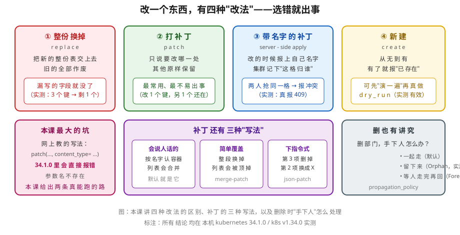

# 课 3：CRUD 与 patch 语义

> 📍 所属：子教程[《Python 客户端专项》](../overview.md)（第 3 课 · 代码视角）
> 📖 故事章节：**会写** —— 从"只读"到"能改"
> 🧭 上一课：[课 2《对象模型地图：GVK → Python 类》](lesson-02-对象模型地图.md) ｜ 下一课：课 4《认证 · 多集群 · 配置》
> ⚙️ 实操环境：WSL Ubuntu 24.04 · Python 3.12.13（`uv venv` 隔离环境） · `kubernetes` 34.1.0 · kind 集群 `k8s-c1-calico`（3 节点） · k8s v1.34.0
> 📖 结论已按官方文档核对（核对于 2026-09 ｜ 权威源：`devel/patch_types.md`）｜ ✅ 本节命令实测于 WSL Ubuntu 24.04 / kubernetes 34.1.0 / k8s v1.34.0
> 🧪 实测范围：专用命名空间 `py-lesson03`（本课自建自清，不触碰集群其他资源）

## 🎯 本课目标

学完本课，你应当能够：

- 用 `create_from_yaml` / `create_from_dict` **把现有 YAML 清单直接搬进代码**（迁移桥梁）
- 说清 **create / read / replace / patch 四种写法的语义差异**，特别是 `replace` 的"整份覆盖"有多危险
- 说出**四种 patch 的区别**，以及在 **34.1.0 里怎么正确指定 patch 类型**（⚠️ 网上主流写法在本版本会报错）
- 讲清 **server-side apply 的字段归属与冲突**，`field_manager` / `force` 怎么用，并**实测认出 409 冲突**
- 用 `dry_run` 预演，用 `propagation_policy` 控制**删除级联**
- 完成**综合例：用代码做一次滚动更新**

---

## 第一幕：起源与场景引入 —— "我要把 kubectl apply 换成代码"

### 场景

课 2 结束时，你已经能**读**集群里的任何东西。但 leader 的需求升级了：

> "咱们有一批 YAML 清单，现在靠人手工 `kubectl apply`。能不能写成程序，让 CI 自动跑？"

你手里有一份熟悉的 YAML：

```yaml
apiVersion: apps/v1
kind: Deployment
metadata:
  name: demo-nginx
spec:
  replicas: 2
  selector:
    matchLabels: {app: demo-nginx}
  template:
    metadata:
      labels: {app: demo-nginx}
    spec:
      containers:
      - name: nginx
        image: nginx:1.25
```

你要用代码做四件事：**建出来、读回来、改镜像、最后删掉**。

### 处境对照

| | 敲命令时（kubectl） | 写代码时（Python 客户端） |
|---|---|---|
| 建 | `kubectl apply -f x.yaml` —— **一条命令，幂等** | `create` 同名会报"已存在"；要幂等得用 **apply patch** |
| 改 | 改 YAML 再 apply | `replace`（整份换）或 `patch`（只改一处）——**选错后果差别巨大** |
| 改一处 | 你不会想这个问题 | 必须选：**四种 patch 用哪种** |
| 删 | `kubectl delete` 默认连带的都删 | 可以精确控制"**手下人留不留**" |
| 试一下 | `--dry-run=server` | `dry_run="All"` |

> 💡 **这一课的本质**：kubectl 只给了你一个 `apply`，把复杂性藏起来了。代码里**这扇门后面有四套机制**，你得自己选。

### 一句话本质

**本课给你四把改数据的"钥匙"，以及选错钥匙会捅出什么娄子。**

---

## 第二幕：认知冲突 —— 网上抄的 patch 代码，第一行就报错

你搜"kubernetes python patch deployment"，几乎所有教程都这么写：

```python
v1.patch_namespaced_config_map(
    name="demo", namespace="default",
    body={"data": {"key": "value"}},
    content_type="application/merge-patch+json"   # ← 教程都这么写
)
```

你满怀信心跑下去——**当场报错**：

```
kubernetes.client.exceptions.ApiTypeError:
Got an unexpected keyword argument 'content_type' to method patch_namespaced_config_map
```

**`content_type` 这个参数在 34.1.0 里根本不接受。**

你换成 `header_params=` 试——**还是报错**。你开始怀疑：

1. **那我到底怎么指定 patch 类型？**
2. **不指定行不行？默认是什么？**
3. **还有，`replace` 和 `patch` 到底差在哪**——教程都说"改东西"，看起来没区别啊？

> 🎯 **先剧透**：这三个问题，本课会用**实测**全部回答。特别是第一个——**网上流传最广的那行写法，在你装的这个版本里是错的**。这不是你抄错了，是**版本变了**。

---

## 第三幕：层层揭示

### 一眼全局图



**看图**：四种改法分列——整份换掉（漏写的字段会没了）、打补丁（最常用）、带名字的补丁（两人抢同一格会报冲突）、新建（可先演一遍）。中间是补丁的三种写法，右下角是删除时"手下人"怎么处理。左上角红框是**本课最大的坑**：网上教的那行 `content_type=` 在 34.1.0 里直接报错。

### 本课地图

| 步骤 | 这一步要解决什么 | 知识点 |
|------|-----------------|--------|
| 第 1 步 | YAML 怎么搬进代码 | 知识点 1：`create_from_yaml` / `create_from_dict` |
| 第 2 步 | 四种写法差在哪 | 知识点 2：create / read / replace / patch 的语义差异 |
| 第 3 步 | patch 还有哪几种、怎么指定 | 知识点 3：四种 patch 与 34.1.0 的正确指定方式 |
| 第 4 步 | 多人改同一个东西怎么办 | 知识点 4：server-side apply · 字段归属 · 冲突 |
| 第 5 步 | 试跑与删除的分寸 | 知识点 5：`dry_run` 预演与 `propagation_policy` 级联 |

---

### 🧭 第 1/5 步｜承接：**"YAML 怎么变成代码？"** → 本步：搬清单的桥

#### 知识点 1：`create_from_yaml` / `create_from_dict`

##### 一句话定义

`kubernetes.utils` 提供两个函数，**直接吃 YAML 文件或 dict**，帮你省掉"手写模型类"这一步——是从 YAML 迁移到代码的**桥**。

##### 直觉建立：不用把表格重抄一遍

你已经有一张填好的 YAML 表格。最笨的办法是**照着表格在代码里一格一格重填**（`V1Deployment(spec=V1DeploymentSpec(...))`，嵌套好几层）。

`create_from_yaml` 说：**表格直接交给我，我来抄。**

##### 核心原理：两个函数、一个签名

实测 `kubernetes.utils` 的导出：

```
['FailToCreateError', 'create_from_dict', 'create_from_directory', 'create_from_yaml', ...]
```

签名（实测）：

```python
create_from_yaml(k8s_client, yaml_file=None, yaml_objects=None, verbose=False,
                 namespace='default', apply=False, **kwargs)
create_from_dict(k8s_client, data, verbose=False,
                 namespace='default', apply=False, **kwargs)
```

注意三个要点：

1. **第一个参数要的是 `ApiClient`**，不是 `CoreV1Api`。因为它要自己判断该找哪个 Api 类
2. **`namespace` 默认 `'default'`** —— 忘了传就建到 default 去了，这是常见事故
3. **`apply=False`** —— 设为 `True` 才走 server-side apply（**默认不是幂等的 create**）

**从 dict 建（实测）**：

```python
from kubernetes import client, config, utils
config.load_kube_config()
k8s_client = client.ApiClient()

cm = {
    "apiVersion": "v1", "kind": "ConfigMap",
    "metadata": {"name": "demo-cm"},
    "data": {"key1": "value1", "key2": "value2"},
}
resp = utils.create_from_dict(k8s_client, cm, namespace="py-lesson03")
```

实测输出：

```
返回类型: list[V1ConfigMap]
创建的: demo-cm | uid: b713f3d6 | rv: 1210460
```

**从 YAML 文件建（实测）**：

```python
resp = utils.create_from_yaml(k8s_client, "/tmp/l3.yaml", namespace="py-lesson03")
```

##### ⚠️ 返回值是个"双层列表"（实测踩坑）

我第一次写的时候以为返回的是对象列表，直接 `resp[0].metadata.name` —— **报错**：

```
AttributeError: 'list' object has no attribute 'metadata'
```

实测确认结构是：

```
顶层: list 长度 1
元素[0]: list 长度 1
元素[0][0]: V1Service
=> create_from_yaml 返回 list[list[object]]
```

> 🎯 **记住**：**外层按"文件"分，内层按"资源"分**。一个 YAML 里有三个资源，就是 `[ [obj1, obj2, obj3] ]`。
> 取第一个对象要写 **`resp[0][0]`**。

##### 常见误区

| ❌ 误区 | ✅ 真相 |
|---|---|
| 返回的是对象列表 | 是**双层列表** `list[list[obj]]`，取对象要 `resp[0][0]` |
| 传 `CoreV1Api()` 进去 | 要传 **`ApiClient()`**，它需要自己判断用哪个 Api 类 |
| 不传 namespace 没事 | 默认是 `'default'`，**很容易建错地方** |
| `create_from_yaml` 幂等 | 默认 `apply=False`，**重复跑会报"已存在"**；要幂等得 `apply=True` |

##### 行话锚定

| 本课说法（人话） | 行业标准叫法 | 在哪遇到 |
|---|---|---|
| 搬清单的桥 | `kubernetes.utils.create_from_yaml` | 官方 utils 模块；CI 自动化场景 |
| 一次建一整个目录 | `create_from_directory` | 同上 |
| 建失败了（部分成功） | `FailToCreateError` | 多资源 YAML 中途失败时的异常，含已创建的部分 |

---

### 🧭 第 2/5 步｜承接：**"桥有了，但'改'到底有几种改法？"** → 本步：四种语义

#### 知识点 2：create / read / replace / patch 的语义差异

##### 一句话定义

`replace` 是**整份覆盖**（你交什么，最终就是什么），`patch` 是**局部修改**（只动你提到的部分）。

##### 直觉建立：重交一张表 vs 在表上改一格

- **replace** = 你把表**重新填一遍交上去**。没填的格子 = 空
- **patch** = 你在原表上**改一格**，其余不动

##### 核心原理：实测对比（本课最关键的一组数据）

初始 ConfigMap：`{'key1': 'value1', 'key2': 'value2'}`

```python
# 1) patch：只改 key1
v1.patch_namespaced_config_map(name="demo-cm", namespace=NS,
                               body={"data": {"key1": "patched"}})
# 2) replace：read 回来改一个字段再交
cm2 = v1.read_namespaced_config_map(name="demo-cm", namespace=NS)
cm2.data["key2"] = "replaced"
v1.replace_namespaced_config_map(name="demo-cm", namespace=NS, body=cm2)
# 3) replace 的"整份覆盖"：只交一个 key3
cm3 = client.V1ConfigMap(api_version="v1", kind="ConfigMap",
                         metadata=client.V1ObjectMeta(name="demo-cm"),
                         data={"key3": "only"})
v1.replace_namespaced_config_map(name="demo-cm", namespace=NS, body=cm3)
```

实测输出：

```
原 data:                  {'key1': 'value1', 'key2': 'value2'}
patch 后:                 {'key1': 'patched', 'key2': 'value2'}   ← key2 还在
replace 后:               {'key1': 'patched', 'key2': 'replaced'} ← read 回来的全量，安全
整份覆盖 replace 后:       {'key3': 'only'}                        ← key1、key2 全没了！
```

> 🎯 **本课最重要的一条实测**：
> 第 2 种写法（**read → 改 → replace**）是安全的，因为你交的是"读回来的全量"。
> 第 3 种写法（**凭空构造一个 → replace**）**会静默删掉你没写的字段**——`key1`、`key2` 就这么没了，而且**没有任何警告**。

##### 四种写法对照

| 写法 | HTTP 动作 | 语义 | 资源不存在时 | 典型坑 |
|---|---|---|---|---|
| `create` | POST | 从无到有 | 创建 | 已存在 → **409 冲突** |
| `read` | GET | 只读 | **404** | — |
| `replace` | PUT | **整份覆盖** | 404 | 漏写字段 = **静默删除** |
| `patch` | PATCH | **局部修改** | 404 | patch 类型选错 → 列表被顶掉 |

> 💡 **选型建议**：日常改东西**优先 `patch`**。只有你确实持有完整对象时（read 回来的）才用 `replace`。

##### 常见误区

| ❌ 误区 | ✅ 真相 |
|---|---|
| "`replace` 就是改一个字段" | 它是**整份替换**。凭空构造对象去 replace 会**静默删字段** |
| "read → 改 → replace 和 patch 一样" | 效果接近，但 **`replace` 有并发风险**：你读之后别人改了，你一 replace 就把别人的改动覆盖了 |
| "patch 一定安全" | 取决于 **patch 类型**。merge patch 会把列表整段顶掉（见知识点 3） |

##### 行话锚定

| 本课说法（人话） | 行业标准叫法 | 在哪遇到 |
|---|---|---|
| 整份换掉 | replace / update（PUT） | `replace_namespaced_xxx`；`kubectl replace` |
| 打补丁 | patch（PATCH） | `patch_namespaced_xxx`；`kubectl patch` |
| 你读之后别人改了 | 乐观并发冲突 | 靠 `resourceVersion` 检测（课 2 已见，课 5 详解） |
| 静默删字段 | replace 语义副作用 | 本课实测第 3 组 |

---

### 🧭 第 3/5 步｜承接：**"patch 安全，但网上那行为什么报错？"** → 本步：patch 的指定方式

#### 知识点 3：四种 patch 与 34.1.0 的正确指定方式

##### 一句话定义

Kubernetes 有**四种 patch**，靠 HTTP 的 `Content-Type` 头区分；在 34.1.0 里**不能**用 `content_type=` 参数传，得用别的路子。

##### 直觉建立：改一张表，三种说法

| 说法 | 例子 | 特点 |
|---|---|---|
| **会说人话的** | "把 nginx 那个容器的镜像换了" | 按**名字**认容器，列表**合并** |
| **简单覆盖** | "containers 这一段，改成这样" | 整段换，**列表被顶掉** |
| **下指令式** | "第 2 项删掉，第 3 项换成 X" | 精确操作，像手术刀 |

##### 核心原理 1：四种 patch（权威源 `devel/patch_types.md`）

| # | 名称 | Content-Type | 行为 | 谁在用 |
|---|---|---|---|---|
| 1 | **Strategic Merge Patch** | `application/strategic-merge-patch+json` | 懂资源结构；按 **key 名**合并列表 | **`kubectl apply` 的老行为**；客户端库默认 |
| 2 | **JSON Merge Patch** | `application/merge-patch+json` | RFC 7386；**列表整段替换** | 通用 JSON 场景 |
| 3 | **JSON Patch** | `application/json-patch+json` | RFC 6902；`op` 指令数组（add/remove/replace/move/copy/test） | 需要**删除字段**时 |
| 4 | **Apply Patch (SSA)** | `application/apply-patch+yaml` | 声明式 + **字段归属** | `kubectl apply` 现代行为（见知识点 4） |

##### 核心原理 2：⚠️ 34.1.0 里到底怎么指定（本课最大的坑）

**先说实测到的错误**：

```python
# ❌ 网上流传最广的写法，实测在 34.1.0 直接报错
v1.patch_namespaced_config_map(..., content_type="application/merge-patch+json")
# ApiTypeError: Got an unexpected keyword argument 'content_type'

# ❌ 换成这个也不行
v1.patch_namespaced_config_map(..., header_params={"Content-Type": "..."})
# ApiTypeError: Got an unexpected keyword argument 'header_params'
```

**原因是**：实测 `patch_namespaced_config_map` 的签名是 `(self, name, namespace, body, **kwargs)`，而源码里**认可的 kwarg 只有这些**：

```
all_params: name, namespace, body, pretty, dry_run, field_manager, field_validation, force
```

**没有 `content_type`，也没有 `header_params`。** Content-Type 由这行自动决定：

```python
header_params['Content-Type'] = self.api_client.select_header_content_type(...)
```

实测 `select_header_content_type(['application/json'])` 返回 `application/json`——**默认就是普通 JSON**。

**那怎么改？实测出两条能跑的路：**

**路 A（推荐，精确）**：用 `api_client.call_api` 直接指定头

```python
api = client.ApiClient()
r = api.call_api(
    resource_path=f"/api/v1/namespaces/{NS}/configmaps/{name}",
    method="PATCH",
    body=[{"op": "replace", "path": "/data/a", "value": "JSONPATCH_OK"}],
    header_params={"Content-Type": "application/json-patch+json"},
    auth_settings=["BearerToken"],
    response_type="object", _return_http_data_only=True,
)
```

实测输出：

```
call_api json-patch -> {'a': 'JSONPATCH_OK', 'b': '2'}
```

**路 B（仅当你整个客户端只做 patch 时）**：`ApiClient.set_default_header`

```python
api2 = client.ApiClient()
api2.set_default_header("Content-Type", "application/json-patch+json")
v1 = client.CoreV1Api(api2)
```

> ⚠️ **这条路实测会踩大坑**：`set_default_header` 是**全局**的，连 `create` 都会带上这个头，结果：
>
> ```
> ApiException: (415) Reason: Unsupported Media Type
> the body of the request was in an unknown format - accepted media types include:
> application/json, application/yaml, application/vnd.kubernetes.protobuf
> ```
>
> 所以 **除非你这个 `ApiClient` 只发 patch，否则不要用**。

**路 C（最省事）**：**不指定，用默认的 strategic merge**。实测默认 patch 行为：

```
1 strategic(不传content_type): {'a': 'S', 'b': '2', 'lst': '[x,y]'}
```

只改了 `a`，`b` 保留——**默认就是"会说人话"的那种，日常够用**。

##### 核心原理 3：strategic merge 的列表合并（实测）

给一个 Deployment 的容器加环境变量：

```python
apps.patch_namespaced_deployment(name="roll-demo", namespace=NS,
    body={"spec": {"template": {"spec": {"containers": [
        {"name": "nginx", "env": [{"name": "A", "value": "1"}]}]}}}})
```

实测输出：

```
image 还在? nginx:1.26
env: [('A', '1')]
ports: None
```

**镜像还在、env 加上了**——这就是 strategic merge：它靠 `name: nginx` 认出"是同一个容器"，只合并你给的字段。

> 换成 **JSON Merge Patch**（路 A/B），`containers` 会被**整段替换**，只剩你写的那一个容器，镜像和端口都会丢。

##### 常见误区

| ❌ 误区 | ✅ 真相 |
|---|---|
| `patch(..., content_type=...)` | **34.1.0 报 `ApiTypeError`**。参数不存在 |
| `patch(..., header_params=...)` | 同样报错 |
| 用 `set_default_header` 改 | 会**污染所有请求**，create 直接 415。只适合纯 patch 的 client |
| "不指定就用不了 json-patch" | 默认 strategic merge **够日常用**；要别的类型走 `call_api` |
| "patch 类型无所谓" | **merge patch 会整段顶掉列表**，strategic 不会 |

##### 行话锚定

| 本课说法（人话） | 行业标准叫法 | 在哪遇到 |
|---|---|---|
| 会说人话的 | Strategic Merge Patch | 客户端库**默认**；`kubectl patch` 默认 |
| 简单覆盖 | JSON Merge Patch（RFC 7386） | `application/merge-patch+json` |
| 下指令式 | JSON Patch（RFC 6902） | `application/json-patch+json`；`op` 数组 |
| 带名字的 | Apply Patch / SSA | `application/apply-patch+yaml`（知识点 4） |
| 415 报错 | Unsupported Media Type | 头设错时 apiserver 返回 |

---

### 🧭 第 4/5 步｜承接：**"多人同时改一个东西怎么办？"** → 本步：字段归属

#### 知识点 4：server-side apply · 字段归属 · 冲突

##### 一句话定义

**Server-Side Apply（SSA）** 让你改东西时**报上自己的名字**，集群记下"哪一格归谁管"；别人想动你管的格子就会**报冲突**。

##### 直觉建立：合租冰箱，贴上名字

几个人合租一个冰箱。每个人往里放东西时**贴上自己的名字**。

- 你只能动**自己贴过名字的**那几格
- 想动别人贴名字的格子 → **被告知冲突**
- 硬要动 → 得说"**我强行拿走**"（`force=True`）

##### 核心原理：`managedFields` 与 `field_manager`

课 2 你已经见过 `metadata.managed_fields`。它就是那张**名字标签表**——`V1ManagedFieldsEntry`。

实测：用 SSA 提交一次，看标签表变化：

```python
api.call_api(
    resource_path=P + "?fieldManager=mgrA",
    method="PATCH",
    body={"apiVersion": "v1", "kind": "ConfigMap",
          "metadata": {"name": "ssa3", "namespace": NS}, "data": {"x": "fromA"}},
    header_params={"Content-Type": "application/apply-patch+yaml"},
    auth_settings=["BearerToken"], response_type="object", _return_http_data_only=True)
```

##### 实测：完整的冲突流程（本课最有价值的一组数据）

```
1) A 首次 apply: {'x': 'fromA'} | managers: ['mgrA']
2) B 冲突 status= 409 reason= Conflict
   message: Apply failed with 1 conflict: conflict with "mgrA": .data.x
   causes: [{'reason': 'FieldManagerConflict', 'message': 'conflict with "mgrA"', 'field': '.data.x'}]
3) B force=true: {'x': 'fromB'} | managers: ['mgrB']
4) A 再改自己字段（不冲突）:  ...
```

**逐条解读**：

1. **A 先申请**，`.data.x` 归 `mgrA`，标签表只有 `mgrA`
2. **B 想改同一个字段** → **真报 409**，`reason=Conflict`，`causes` 里明确写着 `FieldManagerConflict` 和冲突字段 `.data.x`
3. **B 加 `force=true`** → 抢到手，标签变成 `mgrB`（**A 失去该字段所有权**）
4. 第 4 步 A 再改时又冲突了——因为字段已经被 B 抢走了

> 🎯 **这个 409 是"好事"**：它告诉你"**这个字段有主了，你确定要动吗**"，而不是默默覆盖别人的配置。

##### `field_manager` 的两条路

**路 A：原生方法参数（但 Content-Type 是默认 JSON）**

```python
r = v1.patch_namespaced_config_map(name="ssa2", namespace=NS,
        body={"kind": "ConfigMap", "metadata": {...}, "data": {"x": "viaFM"}},
        field_manager="mgrNative")
```

实测：

```
带 field_manager 但默认 Content-Type: {'x': 'viaFM'}
managedFields: [('OpenAPI-Generator', 'Update'), ('mgrNative', 'Update')]
```

> ⚠️ **注意**：`operation` 是 `Update` 而**不是 `Apply`**。因为它走的是默认 strategic merge，只是**顺便**记了名字，**没有字段归属保护**——所以**不会报冲突**。

**路 B：真正的 SSA（要 `apply-patch+yaml` 头）**

就是上面 Z 组实测的做法，用 `call_api` 指定 `Content-Type: application/apply-patch+yaml` + `?fieldManager=xxx`。

> **判定是否真 SSA 的方法**：看 `managedFields` 里 `operation` 是 **`Apply`** 还是 `Update`。只有 `Apply` 才有冲突保护。

##### 常见误区

| ❌ 误区 | ✅ 真相 |
|---|---|
| "传了 `field_manager` 就是 SSA" | 不够。Content-Type 必须也是 `apply-patch+yaml`，看 `operation` 是不是 `Apply` |
| "SSA 报冲突是 bug" | 是**特性**。它在保护别人的字段 |
| "`force=True` 是标准做法" | 它是**抢字段**。用完别人就失去所有权了，慎用 |
| "`managedFields` 没用" | 它是**字段归属账本**，`kubectl get -o yaml` 里能看到 |

##### 行话锚定

| 本课说法（人话） | 行业标准叫法 | 在哪遇到 |
|---|---|---|
| 带名字的补丁 | Server-Side Apply (SSA) | `kubectl apply` 现代行为；`--server-side` |
| 名字 | `fieldManager` | `field_manager=` 参数；`?fieldManager=` 查询串 |
| 冰箱上的名字标签 | `managedFields` / `V1ManagedFieldsEntry` | 课 2 已见；`kubectl get -o yaml` |
| 抢格子 | `force` | `force=True`；`kubectl apply --force-conflicts` |
| 409 冲突 | `FieldManagerConflict` | 本课实测 `causes` 字段 |

---

### 🧭 第 5/5 步｜承接：**"改之前能不能先试试？删的时候手下人怎么办？"** → 本步：预演与级联

#### 知识点 5：`dry_run` 预演与 `propagation_policy` 级联

##### 一句话定义

`dry_run="All"` 让服务端**走完整流程但不落库**；`propagation_policy` 决定删除时**子资源留不留**。

##### 直觉建立：演习 vs 拆部门

- **dry_run** = 演习。流程全走一遍（校验、准入），但**不改任何东西**
- **propagation_policy** = 拆一个部门时，**手下员工**怎么安排：一起走 / 留下来 / 等他们走完你再走

##### 核心原理 1：`dry_run`（实测）

```python
v1.create_namespaced_config_map(namespace=NS,
    body=client.V1ConfigMap(metadata=client.V1ObjectMeta(name="dry-test"),
                            data={"a": "1"}),
    dry_run="All")
```

实测输出：

```
dry_run create 返回成功（未真创建）
✅ 确认未创建: ApiException 404
```

**预演通过，且确实没创建。**

> ⚠️ **但课 2 已经实测过一条重要边界**：**`dry_run` 通过 ≠ 语义正确**。它对"带了只读字段"这类问题**不报错**。
> 所以 `dry_run` 能验证"**准入过不过**"，不能验证"**你的意图对不对**"。

##### 核心原理 2：`propagation_policy`（实测）

三种取值：

| 取值 | 人话 | 行为 |
|---|---|---|
| `Orphan` | 手下留下来 | 父资源删除，**子资源（RS/Pod）保留** |
| `Background`（默认） | 一起走，你先走 | 父资源**立即删除**，子资源由 GC 后台清理 |
| `Foreground` | 等手下走完你再走 | 父资源**等所有子资源删完**才消失 |

实测删除一个 Deployment：

```python
apps.delete_namespaced_deployment(name="demo-nginx", namespace=NS,
    body=client.V1DeleteOptions(propagation_policy="Orphan"))
```

实测输出：

```
删除前 ReplicaSet 数: 1
Orphan 删除后 ReplicaSet 数: 1 (保留 = Orphan 生效)
残留 Pod 数: 2
```

**Deployment 没了，但 ReplicaSet 和 2 个 Pod 还活着**——这就是 `Orphan`。

> 💡 **什么时候用 `Orphan`**：想删掉上层控制器但**保留正在跑的业务**（比如把 Deployment 换成 StatefulSet，先别停服务）。
> 反之，想彻底清理就用默认或 `Foreground`。

##### 完整的删除写法

```python
from kubernetes import client
body = client.V1DeleteOptions(
    propagation_policy="Orphan",   # 子资源保留
    grace_period_seconds=30,       # 优雅期
)
apps.delete_namespaced_deployment(name="x", namespace=NS, body=body)
```

##### 常见误区

| ❌ 误区 | ✅ 真相 |
|---|---|
| "`dry_run` 过了就没问题" | 只验证准入，**不验证语义**（课 2 实测） |
| "删了 Deployment，Pod 一定没了" | 用 `Orphan` 就**不会**（实测 RS 和 Pod 都留着） |
| "删除不用传 body" | 要控制级联就得传 `V1DeleteOptions` |
| "`Orphan` 是删不干净" | 是**有意保留**，业务迁移场景要用 |

##### 行话锚定

| 本课说法（人话） | 行业标准叫法 | 在哪遇到 |
|---|---|---|
| 演习 | dry-run | `dry_run="All"`；`kubectl apply --dry-run=server` |
| 手下人 | 子资源 / dependents | ReplicaSet、Pod |
| 一起走 / 留下来 / 等你走完 | `propagation_policy` | `V1DeleteOptions`；`kubectl delete --cascade=` |
| 优雅期 | `gracePeriodSeconds` | `V1DeleteOptions`；`kubectl delete --grace-period=` |
| 后台清理 | Garbage Collection (GC) | 主线课 2（属主与级联） |

---

## 第四幕：实操验证

> ✅ 本节命令实测于 WSL Ubuntu 24.04 / Python 3.12.13 / `kubernetes` 34.1.0 / kind 集群 k8s v1.34.0
> 🧪 全部在专用命名空间 `py-lesson03` 内完成

### 4.1 综合例：用代码做一次滚动更新

```python
from kubernetes import client, config, utils
import subprocess, time

config.load_kube_config()
kc = client.ApiClient(); apps = client.AppsV1Api(); NS = "py-lesson03"

# 1) 从 YAML 建出来
utils.create_from_yaml(kc, "/tmp/l3roll.yaml", namespace=NS)
subprocess.run(["kubectl", "wait", "--for=condition=available",
                "deployment/roll-demo", "-n", NS, "--timeout=120s"])

d = apps.read_namespaced_deployment("roll-demo", NS)
print("当前 image:", d.spec.template.spec.containers[0].image)

# 2) patch 改镜像 —— 触发滚动更新
apps.patch_namespaced_deployment(name="roll-demo", namespace=NS,
    body={"spec": {"template": {"spec": {"containers": [
        {"name": "nginx", "image": "nginx:1.26"}]}}}})

# 3) 等 rollout 完成
subprocess.run(["kubectl", "rollout", "status",
                "deployment/roll-demo", "-n", NS, "--timeout=180s"])

d = apps.read_namespaced_deployment("roll-demo", NS)
print("新 image:", d.spec.template.spec.containers[0].image)
print("generation:", d.metadata.generation,
      "| observedGeneration:", d.status.observed_generation)
print("readyReplicas:", d.status.ready_replicas, "/", d.spec.replicas)
```

实测输出：

```
当前 image: nginx:1.25 | replicas: 3
已 patch image -> nginx:1.26
更新完成 用时 180.1s | image: nginx:1.26
generation: 2 | observedGeneration: 2
readyReplicas: 3 / 3
```

> 💡 **三点值得注意**：
> 1. 只改了 `spec.template` 里的镜像，**replicas=3 没动**——这就是 strategic merge 的局部性
> 2. `generation` 从 1 变 2：**只有 template 变化才递增 generation**（改 replicas 不会）
> 3. 镜像拉取耗时 180 秒——**这是 kind 集群拉 nginx:1.26 的真实耗时**，不是代码慢

### 4.2 机制验证清单

| # | 验证项 | 实测结果 |
|---|---|---|
| 1 | `create_from_dict` 返回类型 | `list[V1ConfigMap]` |
| 2 | `create_from_yaml` 返回结构 | `list[list[obj]]`，取对象要 `resp[0][0]` |
| 3 | patch 只改一处 | `{'key1':'patched','key2':'value2'}`（另一个保留） |
| 4 | replace 凭空构造 | `{'key3':'only'}`（**另两个静默消失**） |
| 5 | `content_type=` 参数 | **`ApiTypeError`（不存在）** |
| 6 | `header_params=` 参数 | **`ApiTypeError`（不存在）** |
| 7 | 默认 patch 类型 | strategic merge（改 a，b 保留） |
| 8 | `call_api` + json-patch | `{'a':'JSONPATCH_OK','b':'2'}` ✅ |
| 9 | `set_default_header` | **create 报 415**（污染全局） |
| 10 | SSA 冲突 | **409 Conflict**，`.data.x`，`FieldManagerConflict` |
| 11 | `force=true` | 抢到字段，manager 变 `mgrB` |
| 12 | 只传 `field_manager` | `operation=Update`，**无冲突保护** |
| 13 | `dry_run="All"` | 返回成功，**未真创建**（404 确认） |
| 14 | `propagation_policy="Orphan"` | Deployment 删除，**RS 与 2 个 Pod 保留** |
| 15 | 滚动更新 | 1.25→1.26，generation 1→2，3/3 ready |

### 4.3 命令速查卡

| 我想干什么 | 代码 |
|---|---|
| 从 YAML 建 | `utils.create_from_yaml(client.ApiClient(), "f.yaml", namespace="ns")` |
| 从 dict 建 | `utils.create_from_dict(client.ApiClient(), d, namespace="ns")` |
| 取 create_from_yaml 的对象 | `resp[0][0]`（**双层列表**） |
| 局部改（推荐） | `patch_namespaced_xxx(name, ns, body={...})` |
| 整份换 | `replace_namespaced_xxx(name, ns, body=读回来的对象)` |
| 用 json-patch | `api.call_api(..., method="PATCH", header_params={"Content-Type":"application/json-patch+json"})` |
| SSA | 同上，头改 `application/apply-patch+yaml` + `?fieldManager=me` |
| 强制抢字段 | 查询串加 `force=true` |
| 预演 | `dry_run="All"` |
| 删除保留子资源 | `V1DeleteOptions(propagation_policy="Orphan")` |
| 看字段归谁 | `obj.metadata.managed_fields` → `(manager, operation)` |

---

## 第五幕：体系收束

### 本课在整体中的位置


**看图**：你走完了"能用线"的前三课——接上、看懂、**会写**。从下一课起进入"会连"，再往后是"能用好线"。

### 你已经会了什么

- **搬清单**：`create_from_yaml` / `create_from_dict`，并知道返回是**双层列表**
- **四把钥匙**：create / read / replace / patch 的语义差异，特别是 **replace 会静默删字段**
- **四种 patch**：strategic merge（默认）/ merge / json / apply，以及 **34.1.0 里 `content_type=` 不存在**这个坑
- **字段归属**：`managedFields`、`field_manager`、`force`，能**认出 409 冲突**并知道它是好事
- **分寸**：`dry_run` 预演、`propagation_policy` 控制删除级联
- **综合**：用代码完成了一次完整的滚动更新

### 三个关键实测发现（本课独有）

| 发现 | 意义 |
|---|---|
| **`content_type=` 与 `header_params=` 在 34.1.0 均报 `ApiTypeError`** | 网上主流教程的写法**在本版本失效**。可行解是 `call_api` 指定头 |
| **`set_default_header` 会污染全局**（create 报 415） | 想"全局改头"会连累所有请求，只适合纯 patch 的 client |
| **只传 `field_manager` ≠ SSA** | `operation` 是 `Update` 不是 `Apply`，**没有冲突保护**。判定要看 `operation` |

### 还差什么（本课的伏笔）

| 本课留下的疑问 | 在哪解决 |
|---|---|
| 409 冲突怎么**正确处理**？（重读再写） | **课 5**：错误处理与健壮性 |
| `resourceVersion` 的乐观锁细节 | **课 5**（409 处置）与 **课 6**（watch 重连） |
| 这套代码在**Pod 里**怎么跑起来？ | **课 4**：认证与 in-cluster |
| 滚动更新怎么**等**得优雅（不用 subprocess） | **课 6**：watch 与调谐循环 |

### 一句话记住

> **改东西优先 `patch`（`replace` 会静默删字段）；patch 类型在 34.1.0 不能用 `content_type=`（用 `call_api` 指定头）；多人改同一字段用 SSA，报 409 是在保护你——`operation` 是 `Apply` 才算真的 SSA。**

---

## 🐞 本课易错点回顾

| # | 易错点 | 正确做法 |
|---|--------|---------|
| 1 | `create_from_yaml` 结果当单层列表 | 是 `list[list[obj]]`，取 `resp[0][0]` |
| 2 | 传 `CoreV1Api()` 给 utils | 传 **`ApiClient()`** |
| 3 | 凭空构造对象去 `replace` | **静默删字段**。改东西优先 `patch` |
| 4 | `patch(..., content_type=...)` | **34.1.0 报 `ApiTypeError`**。用 `call_api` 或干脆用默认 |
| 5 | `patch(..., header_params=...)` | 同样报错 |
| 6 | `set_default_header` 全局改头 | 会污染 create（**415**）。只用于纯 patch 的 client |
| 7 | 以为传了 `field_manager` 就是 SSA | 看 `managedFields` 的 `operation`：**`Apply` 才是** |
| 8 | 以为 `dry_run` 过了就对 | 只验证准入，**不验证语义** |
| 9 | 删 Deployment 以为 Pod 也没了 | `Orphan` 会**保留** RS 和 Pod |
| 10 | 忘传 `namespace` | 默认 `'default'`，容易建错地方 |

## 📚 官方文档

| 内容 | 链接 |
|---|---|
| **四种 patch 权威说明**（本课主要依据） | [devel/patch_types.md](https://github.com/kubernetes-client/python/blob/master/devel/patch_types.md) |
| `CoreV1Api` 方法清单 | [CoreV1Api.md](https://github.com/kubernetes-client/python/blob/master/kubernetes/docs/CoreV1Api.md) |
| `AppsV1Api` 方法清单 | [AppsV1Api.md](https://github.com/kubernetes-client/python/blob/master/kubernetes/docs/AppsV1Api.md) |
| `V1DeleteOptions` 结构 | [V1DeleteOptions.md](https://github.com/kubernetes-client/python/blob/master/kubernetes/docs/V1DeleteOptions.md) |
| `V1ManagedFieldsEntry` 结构 | [V1ManagedFieldsEntry.md](https://github.com/kubernetes-client/python/blob/master/kubernetes/docs/V1ManagedFieldsEntry.md) |
| Server-Side Apply（上游概念） | [Kubernetes SSA 文档](https://kubernetes.io/docs/reference/using-api/server-side-apply/) |
| 级联删除（上游概念） | [Garbage Collection](https://kubernetes.io/docs/concepts/architecture/garbage-collection/) |
| JSON Patch 规范 RFC 6902 | [RFC 6902](https://datatracker.ietf.org/doc/html/rfc6902) |
| JSON Merge Patch 规范 RFC 7386 | [RFC 7386](https://datatracker.ietf.org/doc/html/rfc7386) |

---

## 🚀 下一批接力提示词

> 学完本课后，**复制下面这段文字发给 AI**，即可无缝进入下一课（无需重新描述上下文）：

```
继续学 Kubernetes Python 客户端专项。我的学习档案在 k8s/子教程/Python客户端专项/overview.md，
刚学完课 3《CRUD 与 patch 语义》（知识点：create_from_yaml/create_from_dict 双层列表返回、
replace 整份覆盖会静默删字段、四种 patch 与 34.1.0 中 content_type= 不可用需 call_api 指定头、
server-side apply 字段归属与 409 冲突、dry_run 预演、propagation_policy 级联删除、代码滚动更新），
请按大纲继续讲解课 4《认证 · 多集群 · 配置》。
```

---

## 🧭 课程导航

- **上一课**：[课 2《对象模型地图：GVK → Python 类》](lesson-02-对象模型地图.md)
- **下一课**：课 4《认证 · 多集群 · 配置》
- **返回**：[子教程目录](../overview.md) ｜ [主课程目录](../../../02-课程目录.md)
