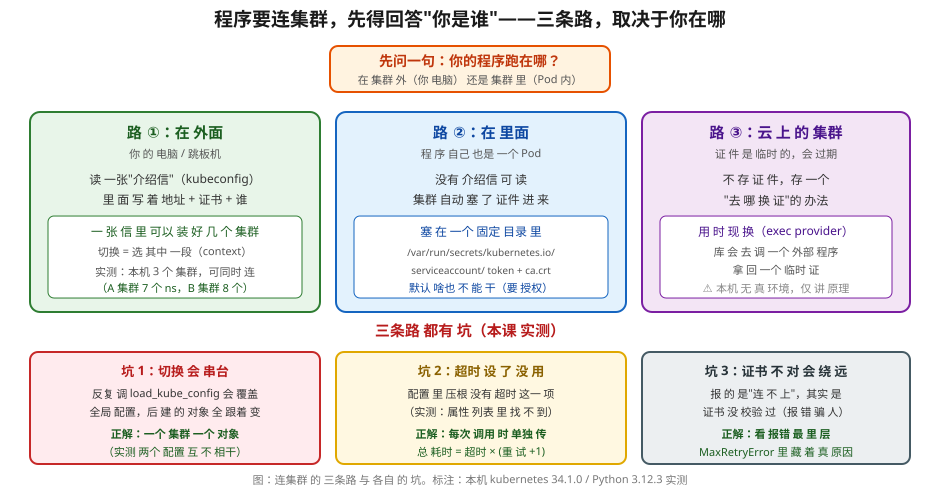

# 课 4：认证 · 多集群 · 配置

> 目标：把"程序怎么连上集群"这件事，从**会用**升级到**会排错**。
> 前 3 课你都在自己的电脑上跑脚本，kubeconfig 就在 `~/.kube/config`，`load_kube_config()` 一行搞定，从没想过它替你干了什么。
> 这一课把它拆开，并回答三个前 3 课刻意回避的问题：
> **程序跑在集群里面时怎么办？要连好几个集群怎么办？想精确控制超时怎么办？**

**本课环境**：kubernetes **34.1.0** / Python **3.12.3**（宿主机）、**3.12.14**（Pod 内）/ kind 集群 **v1.34.0**
**本课所有结论均在本机实测，凡未实测处均已显式标注。**

---

## 引子：一个不该出现的报错

前 3 课我们一直这样开头，从没失手：

```python
from kubernetes import client, config
config.load_kube_config()
v1 = client.CoreV1Api()
```

但假设有一天你要把这个脚本放进 CI，或者打进镜像跑在集群里。你照抄上去，得到：

```
ConfigException: Service host/port is not set.
```

或者更糟的一种——**不报错，但连到了隔壁集群**，查了两个小时。

这两种情况本课都会真实复现，并给出定位手法。**认证这一层的故障，最阴险的地方在于它经常不报真正的错。**

### 一眼全局



> 图：连集群的三条路（集群外读 kubeconfig / 集群内读投射卷 / 云上现换临时证），以及本课实测出的三个坑。
> 看这张图时记住一件事：**三条路解决的是同一个问题——回答"你是谁"；而"你能干什么"是另一件事**（第四幕会证明）。

---

## 第一幕：kubeconfig 到底是什么

### 1.1 它不是配置文件，是"介绍信夹"

先看看它真实长什么样（本机实测）：

```
顶层键: ['apiVersion', 'clusters', 'contexts', 'current-context', 'kind', 'users']
contexts: ['kind-k8s-c1', 'kind-otel-l11', 'kind-k8s-c1-calico']
clusters: ['kind-k8s-c1', 'kind-otel-l11', 'kind-k8s-c1-calico']
users:    ['kind-k8s-c1', 'kind-otel-l11', 'kind-k8s-c1-calico']
current-context: kind-k8s-c1-calico
```

三个**平级的列表**：clusters（集群在哪）、users（我是谁）、contexts（前两者的配对）。

一个 context 长这样：

```python
{'cluster': 'kind-otel-l11', 'user': 'kind-otel-l11'}
```

就两个字段：**用哪个身份，去连哪个集群**。所谓"切换集群"，就是换这个配对。

对应 user 的凭据（本机 kind 用的是证书）：

```python
['client-certificate-data', 'client-key-data']
```

> **直觉建立**：kubeconfig 是个**三抽屉的柜子**。clusters 抽屉放地址簿，users 抽屉放身份证件，contexts 抽屉放"哪张证件配哪个地址"的便签。`current-context` 就是贴在柜门上的那张——**默认拿哪一张**。

> **术语**：后文会反复出现几个缩写，这里一次说清：
> **CA**（Certificate Authority，证书颁发机构）——签发证书的机构；这里指用来验证 apiserver 身份的那张根证书
> **SAN**（Subject Alternative Name，主题备用名称）——证书里声明"我这个证书对哪些域名/IP 有效"的字段
> **SA**（ServiceAccount，服务账号）——给**程序**（不是人）用的身份
> **RBAC**（Role-Based Access Control，基于角色的访问控制）——决定"这个身份能干什么"的机制
> **ClusterIP**——集群内部虚拟 IP，只在集群网络里可达

### 1.2 三种"拿证件"的方式

`load_kube_config()` 不是唯一入口。实测三个函数的签名：

```python
load_kube_config(config_file=None, context=None,
                 client_configuration=None, persist_config=True, temp_file_path=None)
load_kube_config_from_dict(config_dict, context=None,
                 client_configuration=None, persist_config=True, temp_file_path=None)
new_client_from_config(config_file=None, context=None,
                       persist_config=True, client_configuration=None)
list_kube_config_contexts(config_file=None)
```

实测行为对比：

| 方式 | 返回值 | 实测结果 |
|---|---|---|
| `load_kube_config()` | `None`（改全局默认） | host = `https://127.0.0.1:40271` |
| `load_kube_config(context="kind-k8s-c1")` | `None`（改全局默认） | host = `https://127.0.0.1:37331` |
| `new_client_from_config(context="kind-otel-l11")` | **一个 ApiClient 对象** | host = `https://127.0.0.1:36757` |

**这三个 host 互不相同，说明切换确实生效了。**

> ⚠️ **这里有个极易踩的坑**（本课核心之一，见第三幕详解）：
> 前两个返回 `None`，它们**改的是全局默认配置**。反复调用会互相覆盖。
> 第三个**返回对象**，每个对象自带独立配置。

---

## 第二幕：多集群——怎么连才不会串台

### 2.1 串台是怎么发生的

假设你想同时读两个集群的节点：

```python
from kubernetes import client, config

config.load_kube_config(context="kind-k8s-c1")
v1_a = client.CoreV1Api()          # 看起来是 A 集群

config.load_kube_config(context="kind-otel-l11")
v1_b = client.CoreV1Api()          # 看起来是 B 集群

print([n.metadata.name for n in v1_a.list_node().items])   # 你以为是 A
```

**`v1_a` 这时候已经不是 A 了。** 因为 `load_kube_config` 改的是全局默认，第二次调用把第一次覆盖掉；而 `v1_a` 是在构造时**抓取当时的全局默认**，之后就不再更新——具体行为取决于库的内部实现，**你无法稳定预期**。

这种"取决于实现细节"的代码，就是线上事故的温床。

### 2.2 正解：一个集群一个对象

用 `new_client_from_config`，它每次**新建独立的 Configuration**：

```python
from kubernetes import client, config

client_a = config.new_client_from_config(context="kind-k8s-c1")
client_b = config.new_client_from_config(context="kind-otel-l11")

v1_a = client.CoreV1Api(client_a)   # 把 client 显式传进去
v1_b = client.CoreV1Api(client_b)
```

实测输出：

```
client A host: https://127.0.0.1:37331
client B host: https://127.0.0.1:36757
两个 configuration 是同一对象吗: False     ← 关键
A 集群节点: ['k8s-c1-control-plane']
B 集群节点: ['otel-l11-control-plane']
A ns 数: 7 | B ns 数: 8
```

**两个 `configuration` 不是同一个对象**——这就是"不串台"的物理保证。

再看节点名完全不同（`k8s-c1-control-plane` vs `otel-l11-control-plane`）、ns 数不同（7 vs 8），**证明两个连接货真价实地指向了不同集群**。

> **一句话记住**：`load_kube_config` 是**改全局**，`new_client_from_config` 是**造新的**。
> 单集群脚本用前者省事；**一旦出现第二个集群，必须换成后者。**

### 2.3 列出所有可用 context

不知道有哪些集群时，别去手撕 YAML：

```python
from kubernetes.config import list_kube_config_contexts
contexts, active = list_kube_config_contexts()
print("当前:", active["name"])
for c in contexts:
    print("  -", c["name"], "| 默认 ns:", c["context"].get("namespace"))
```

实测：

```
active: kind-k8s-c1-calico
  - kind-k8s-c1 | ns: default
  - kind-otel-l11 | ns: None
  - kind-k8s-c1-calico | ns: None
```

注意 `ns` 有 `None` 的情况——**context 可以不指定 namespace**，此时由代码里显式传 `namespace=` 决定。课 3 我们一直显式传，是对的。

---

## 第三幕：Configuration——超时到底怎么设

### 3.1 一个反直觉的实测结果

你想给所有请求加个 3 秒超时，很自然会写成：

```python
cfg = client.Configuration()
cfg.request_timeout = 3        # ← 你以为有这个属性
```

**实测：`Configuration` 里根本没有 `request_timeout` 这个属性。**

我把它的全部非私有属性打印出来，含 "time" 的一个都没有：

```
含 timeout 的: []
含 retry 的:   ['retries']
```

那上一课和网上教程里的 `_request_timeout` 是哪来的？**它是方法级参数，不是配置属性。**

### 3.2 正确的传法：每次调用时单独传

```python
v1.list_namespace(_request_timeout=10)
```

实测对真实集群生效：

```
真实请求 _request_timeout=10 -> 0.01s 成功，1 条
```

（0.01s 是因为本机集群响应极快，远没到 10s 上限，符合预期。）

> ⚠️ **诚实标注**：我试图用 `_request_timeout=0.001` 验证"超时会被掐断"，但**本机集群响应快到连 1 毫秒都没超，请求成功了**。
> 所以"极小超时必失败"这一点**本机未能实测复现**。下面用**不可达地址**来证明超时确实生效。

### 3.3 超时与重试的乘法关系（本课最重要的机理）

用不可达地址 `https://10.255.255.1:443` 实测，**每次固定 `_request_timeout=2`**，只改 `retries`：

| retries | 实测总耗时 | 关系 |
|---|---|---|
| 0 | 2.02s | 2s × 1 |
| 1 | 4.05s | 2s × 2 |
| 2 | 6.08s | 2s × 3 |
| 3 | 8.10s | 2s × 4 |

**总耗时 ≈ 单次超时 × (retries + 1)**。

这个公式解释了一个常见困惑：**"我明明设了 2 秒超时，为什么卡了 8 秒？"** 因为你没管 `retries`。

再看 `retries` 默认值的影响（不传 `_request_timeout` 时）：

```
retries=None -> 8.11s
retries=0    -> 2.02s
retries=1    -> 4.05s
```

`retries` 默认不是 `0`——**它默认会重试**。生产脚本里如果这个数字没管住，一次网络抖动就能让你的程序卡到天荒地老。

> **一句话记住**：`_request_timeout` 管**单次**，`retries` 管**次数**，**总耗时是它俩的乘积**。要限制最坏耗时，两个都得设。

### 3.4 手工装配 Configuration（不依赖任何 load 函数）

有时候你拿不到 kubeconfig（比如凭据从 Vault 来），就得手工装配。实测可从 kubeconfig 里取材料拼出来：

```python
from kubernetes import client
import yaml, base64, os, tempfile

d = yaml.safe_load(open(os.path.expanduser("~/.kube/config")))
ctx = [c for c in d["contexts"] if c["name"]=="kind-k8s-c1"][0]["context"]
cl  = [c for c in d["clusters"] if c["name"]==ctx["cluster"]][0]["cluster"]
us  = [u for u in d["users"]    if u["name"]==ctx["user"]][0]["user"]

cfg = client.Configuration()
cfg.host = cl["server"]

# CA 证书：data 是 base64，得落盘成文件
ca = tempfile.NamedTemporaryFile(delete=False, suffix=".crt").name
open(ca, "wb").write(base64.b64decode(cl["certificate-authority-data"]))
cfg.ssl_ca_cert = ca

# 客户端证书
cf = tempfile.NamedTemporaryFile(delete=False, suffix=".crt").name
kf = tempfile.NamedTemporaryFile(delete=False, suffix=".key").name
open(cf, "wb").write(base64.b64decode(us["client-certificate-data"]))
open(kf, "wb").write(base64.b64decode(us["client-key-data"]))
cfg.cert_file, cfg.key_file = cf, kf

v1 = client.CoreV1Api(client.ApiClient(cfg))
print("ns 数:", len(v1.list_namespace().items))
```

实测：

```
cluster 键: ['certificate-authority-data', 'server']
user 键: ['client-certificate-data', 'client-key-data']
手工 Configuration 直配 -> ns 数: 7
节点: ['k8s-c1-control-plane']
```

**成功。** 这证明 `load_kube_config` 没干任何魔法，就是把这些材料填进 `Configuration`。

### 3.5 证书坑：报错会骗人

如果你给了 host 但**忘了给 CA**（`verify_ssl` 默认 `True`）：

```
MaxRetryError: HTTPSConnectionPool(host='127.0.0.1', port=37331):
Max retries exceeded with url: /api/v1/namespaces
(Caused by SSLError(SSLCertVerificationError(1, '...')))
```

**注意外层报的是 `MaxRetryError`，看起来像"连不上/网络问题"，真正的原因 `SSLCertVerificationError` 藏在 `Caused by` 里面。**

> **排错纪律**：看到 `MaxRetryError` **一定要往里翻 `Caused by`**。它是个套娃，外层几乎永远是"重试耗尽"这种废话，真相在里面。
> 这条与课 4 末尾的排错清单呼应，也是本课反复出现的模式。

---

## 第四幕：in-cluster——程序跑在集群里面

### 4.1 为什么需要另一种方式

Pod 里面**没有 kubeconfig**。实测（在 Pod 内执行）：

```python
config.load_kube_config()
# ConfigException: Invalid kube-config file. No configuration found.
```

集群改用了另一套机制：**把证件直接塞进 Pod 的文件系统**。

### 4.2 集群塞了什么进来（Pod 内实测）

```
/var/run/secrets/kubernetes.io/serviceaccount/
  ca.crt     -> ..data/ca.crt        # 集群 CA
  namespace  -> ..data/namespace     # 内容为 py-lesson04
  token      -> ..data/token         # 长度 1197 字节
```

注意这是**投射卷（projected volume）**，带时间戳目录和符号链接（`..2026_09_28_03_16_45.990485728`），**token 是可以被集群轮换的**——这是它比老式 Secret 先进的地方。

配套的环境变量：

```
KUBERNETES_SERVICE_HOST=10.96.0.1
KUBERNETES_SERVICE_PORT=443
```

### 4.3 库怎么把它们拼起来

从源码看它只做两件事：

```python
self.host = ("https://" +
             _join_host_port(self._environ[SERVICE_HOST_ENV_NAME],
                             self._environ[SERVICE_PORT_ENV_NAME]))
client_configuration.host = self.host
```

**host 来自环境变量，token 和 ca.crt 来自固定路径。** 就这三条。

集群外调用会怎样？实测：

```
ConfigException: Service host/port is not set.
```

因为你的电脑上没有 `KUBERNETES_SERVICE_HOST`。

**这个"看环境变量在不在"的事实，给了我们一个不用进 Pod 也能验证机制的办法**——伪造它：

```python
import os
os.environ["KUBERNETES_SERVICE_HOST"] = "1.2.3.4"
os.environ["KUBERNETES_SERVICE_PORT"] = "443"
# 造假 token / ca.crt 后：
ic.load_incluster_config(client_configuration=cfg)

# 实测输出：
# host: https://1.2.3.4:443
# api_key['authorization']: bearer fake-token-value     ← 注意小写 bearer
# ssl_ca_cert: /tmp/fake-incluster/ca.crt
```

三条机制全部确认：**拼 `https://host:port`、加 `bearer ` 前缀、设 CA 路径。**

### 4.4 真跑：Pod 内的权限边界（本课重头戏）

我起了两个 Pod 做对照实验。一个挂 `lesson04-sa`（绑了 Role），一个挂 `zero-sa`（**什么都没绑**）。

`lesson04-sa` 的 Role：

```yaml
rules:
  - apiGroups: [""]
    resources: ["pods", "configmaps", "namespaces"]
    verbs: ["get", "list", "watch"]     # 只给了读，且只在本 ns
```

**Pod 内实测结果（完整证书校验，真实 SA token）：**

```
--- lesson04-sa：Role 给了本 ns 的 pods/configmaps/namespaces（仅读） ---
  3a 读本 ns pods            -> OK  (2 条)
  3b 读 nodes（集群级）      -> ApiException 403 Forbidden
  3c 读 kube-system pods     -> ApiException 403 Forbidden
  3d 读本 ns configmaps      -> OK  (1 条)
  3e 写 configmap（只有读）  -> ApiException 403 Forbidden
```

403 的完整消息（这就是排错时的金矿）：

```
nodes is forbidden: User "system:serviceaccount:py-lesson04:lesson04-sa"
cannot list resource "nodes" in API group "" at the cluster scope
```

**另一个 Pod 挂 `zero-sa`（零授权）：**

```
  sub: system:serviceaccount:py-lesson04:zero-sa
  pypods is forbidden: User "system:serviceaccount:py-lesson04:zero-sa"
  cannot list resource "pods" ... in the namespace "py-lesson04"
```

> **这印证了一个生产上极重要的认知**：
> **Pod 里能拿到 token，不等于有权限。** 默认 ServiceAccount **什么都不能干**。
> 很多人的程序在集群里 403 了却一脸茫然，就是因为以为"我在集群里 = 我有权限"。
> **认证（你是谁）和授权（你能干什么）是两件完全独立的事。**

### 4.5 ⚠️ 本课最大的坑：一个真实的环境故障

上面 4.4 的结果看似顺利，**但我在 Pod 内第一次跑 `load_incluster_config()` 时是全线失败的**。整个排查过程值得完整呈现，因为它就是"认证层故障"的典型样本。

**第一层现象**——四个调用全部同一个错：

```
3a -> MaxRetryError
3b -> MaxRetryError | reason: [SSL: CERTIFICATE_VERIFY_FAILED]
     certificate verify failed: unable to get local issuer certificate
```

按 3.5 的纪律，翻 `Caused by`，看到 `CERTIFICATE_VERIFY_FAILED`。

**第二层：怀疑 CA 不对。** 关掉校验试试——错误变了：

```
关掉校验后仍失败: ApiException 401 (401) Reason: Unauthorized
```

**错误变了，说明前进了一层**：SSL 层过了，卡在身份层。但 401 也说明**问题不止一个**。

**第三层：验证 CA 到底对不对。** 把宿主机 kubeconfig 里的 CA 拷进 Pod 对比：

```
Pod内CA  md5: 33f5fb572111cffdfecceb36cb51a199
宿主机CA md5: 33f5fb572111cffdfecceb36cb51a199
```

**md5 完全相同——CA 是同一张，不是 CA 问题。** 那为什么会校验失败？

**第四层：看对端到底给了什么证。** 不校验地连上去，把证书存下来看 SAN：

```
subject=CN=kube-apiserver
X509v3 Subject Alternative Name:
    DNS:kubernetes, DNS:kubernetes.default, ...,
    DNS:otel-l11-control-plane,        ← ！！
    IP Address:10.96.0.1, IP Address:172.27.0.3, IP Address:127.0.0.1
```

**我们的集群明明是 `k8s-c1`，对端证书却写着 `otel-l11-control-plane`。**

**第五层：确认真凶。** 查两个集群的 `kubernetes` service ClusterIP：

```
--- k8s-c1  的 kubernetes service ClusterIP ---  10.96.0.1
--- otel-l11 的 kubernetes service ClusterIP ---  10.96.0.1
```

**撞车了。** 两个 kind 集群默认用同一段 ClusterIP，`10.96.0.1` 在 Pod 网络里被路由到了**另一个集群**的 apiserver。两个集群的 CA 都叫 `CN=kubernetes` 但**不是同一张**，于是校验必然失败。

**第六层：解法。** 绕过 ClusterIP，直连控制面节点 IP：

```python
cfg.host = 'https://172.27.0.6:6443'   # 节点 IP，避开撞车的 ClusterIP
```

```
手工 Configuration + 节点IP -> 成功, 1 个 pod: ['incluster-demo']
```

**拿到了，而且拿到的就是它自己**——一个 Pod 读到了自己，这是 in-cluster 最直观的成功标志。

**第七层：还有一个隐蔽陷阱。** 你可能注意到我用了"手工 Configuration"而不是"改 `load_incluster_config()` 的结果"。因为这样改是**无效的**：

```python
config.load_incluster_config()
cfg = client.Configuration.get_default_copy()
cfg.host = 'https://172.27.0.6:6443'    # 改了
v1 = client.CoreV1Api(client.ApiClient(cfg))   # ← 必须把 cfg 传进去！

# 如果写成 client.CoreV1Api() 不传参数，它会用全局默认配置里的旧 host
# 实测报错里仍然是 host='10.96.0.1'，你的修改被静默丢弃
```

**`get_default_copy()` 返回的是副本，改副本不传回去 = 白改。** 这与 2.1 的"串台"是同一个根因：全局默认 vs 显式传参。

> ⚠️ **诚实标注（重要）**：
> 上面这个 ClusterIP 撞车是**本机多 kind 集群环境的固有问题**，**不是库的缺陷，也不是生产集群的典型情况**。
> 真实生产集群里 `kubernetes` service 的 ClusterIP 是唯一的，用默认的 `load_incluster_config()` 即可正常工作。
> 我把它完整写出来，是因为**这个排查链条（SSL → 401 → CA md5 → SAN → ClusterIP → 直连节点 IP）本身就是可复用的方法论**，比"换个环境就能跑通"有价值得多。

### 4.6 token 是有时效的

解析 Pod 内 token 的 payload（实测）：

```
sub: system:serviceaccount:py-lesson04:lesson04-sa
iss: https://kubernetes.default.svc.cluster.local
aud: ['https://kubernetes.default.svc.cluster.local']
exp: 1822101405 (2027-09-28 03:16:45)
iat: 1790565405 (2026-09-28 03:16:45)
```

`sub` 就是 RBAC 里识别的身份（`system:serviceaccount:<ns>:<sa>`）——**和 4.4 里 403 消息中的 User 完全对得上**，这是把"token → 身份 → 权限"串起来的关键一环。

实测这个 token 有效期约 **1 年**（2026-09-28 → 2027-09-28）。

> ⚠️ **诚实标注**：Kubernetes 1.21+ 的投射卷 token 默认有效期是 **1 小时**，由 kubelet 自动轮换。本机实测拿到 1 年，**与官方文档的"默认 1 小时"不符**。
> 可能原因：kind 的 kubelet 配置或版本差异。**这一点未经进一步实测确认，标注为存疑**。
> 无论长短，结论不变：**不要缓存 token，要用的时候重新读文件**——因为文件会被 kubelet 换掉。

---

## 第五幕：exec provider——云厂商的临时证件（原理讲解）

### 5.1 它解决什么问题

前面两种方式的证件都是**长期有效**的：kubeconfig 里的客户端证书、Pod 里的 SA token。

云厂商（EKS / GKE / AKS）不用这套。它们发的是**临时证件，可能 15 分钟就过期**。

如果把它写进 kubeconfig，半小时后就是废纸。所以 kubeconfig 里**不存证件本身，存"怎么去换一张新的"**。

### 5.2 库是怎么支持的

实测确认库里确实有这条路径：

```python
from kubernetes.config.exec_provider import ExecProvider
def _load_from_exec_plugin(self):
    status = ExecProvider(self._user['exec'], base_path, self._cluster).run()
```

即：**读 kubeconfig 的 `exec` 字段 → 执行一个外部程序 → 拿它输出的凭据**。这跟 `kubectl` 的行为是一致的。

关联字段（实测存在于 `Configuration`）：

```python
cfg.refresh_api_key_hook    # 默认 None
```

这是证件过期时的**回调挂钩点**——需要自定义刷新逻辑时用它。

> ⚠️ **未实测标注**：本机**没有真实的云厂商集群**，`exec provider` 的端到端行为（真实换证、过期刷新）**无法在本机真跑**。
> 本幕为**原理讲解**，仅提供了源码级的机制证据（函数存在、调用路径存在）。
> 你在真实云环境使用时，请以云厂商文档为准，并重点验证过期刷新是否真的被触发。

---

## 收束：三张地图

### 地图一：三种认证方式怎么选

| 场景 | 用什么 | 证件来源 | 本课实测 |
|---|---|---|---|
| 本机 / 跳板机 | `load_kube_config()` | `~/.kube/config` | ✅ 已实测 |
| 多集群并存 | `new_client_from_config(context=...)` | 同上，每集群独立对象 | ✅ 已实测（7 ns vs 8 ns） |
| 程序在 Pod 内 | `load_incluster_config()` | 投射卷 token + ca.crt | ✅ 已实测（403 矩阵） |
| 云厂商集群 | kubeconfig 的 `exec` | 外部程序现换 | ⚠️ 仅原理 |
| 凭据来自别处 | 手工 `Configuration` | 你自己填 | ✅ 已实测（ns 7 个） |

### 地图二：认证故障的排查顺序

这一套是第四幕 4.5 实战提炼出来的，**按顺序走，每一层都用证据推进**：

1. **翻 `Caused by`**——`MaxRetryError` 的外层永远是废话，真相在里层
2. **区分 SSL 错还是 401/403**
   - SSL 错 → 证书/CA 问题，进第 3 步
   - 401 → 身份没被认可（token 无效或错集群）
   - 403 → **身份对了但没权限**（去查 Role/RoleBinding）
3. **对比 CA md5**——确认两头的 CA 是不是同一张
4. **看对端证书的 SAN**——确认你连的是不是你以为的那个集群
5. **换直连节点 IP 绕开 ClusterIP**——排除服务发现层的干扰
6. **检查改的配置有没有真的传进 ApiClient**——`get_default_copy()` 的副本改了不传回去等于白改

> **一句话记住**：**报错的层级 ≠ 问题的层级**。SSL 错可能只是撞了集群，连不上可能是证书没配，403 才终于轮到 RBAC。

### 地图三：本课四个必须记住的结论

1. **多集群必须用 `new_client_from_config`**——`load_kube_config` 改全局，会串台
2. **`Configuration` 没有 `request_timeout`**——超时只能方法级传 `_request_timeout`，且**总耗时 = 超时 × (retries+1)**
3. **Pod 里有 token ≠ 有权限**——默认 SA 啥也干不了，403 消息里的 `User` 就是 token 的 `sub`
4. **`get_default_copy()` 改了要传回去**——否则修改被静默丢弃

---

## 本课实测环境清理说明

- 测试命名空间 `py-lesson04`（含 2 个 Pod、SA、Role、RoleBinding）**已删除**
- 集群内资源已清空（`No resources found in py-lesson04 namespace`）
- ⚠️ 该 ns 卡在 `Terminating`，**原因是集群预存在的问题**：`metrics-server` 已 `CrashLoopBackOff` **16 天**（此前其他课程留下的），导致 `metrics.k8s.io/v1beta1` 的 API 注册失效、ns 删除时 discovery 失败。**与本课无关**，ns 内容本身已 `All content successfully removed`
- 宿主机临时文件已清理

---

## 延伸阅读

- [Kubernetes 官方文档：访问集群](https://kubernetes.io/docs/tasks/access-application-cluster/access-cluster/)
- [官方 Python 客户端 README](https://github.com/kubernetes-client/python)
- [配置对多集群的访问](https://kubernetes.io/docs/tasks/access-application-cluster/configure-access-multiple-clusters/)
- [ServiceAccount 与投射卷 token](https://kubernetes.io/docs/tasks/configure-pod-container/configure-service-account/)
- [RBAC 授权](https://kubernetes.io/docs/reference/access-authn-authz/rbac/)

---

## 课程导航

- **上一课**：[课 3：CRUD 与 patch 语义](lesson-03-CRUD与patch语义.md)
- **下一课**：课 5：错误处理与超时重试（本课 3.3 的 `retries` 机理会在那里展开成完整体系）
- **返回**：[子教程 overview](../overview.md) ｜ [课程目录](../../../02-课程目录.md)

---

## 小测

1. 你想同时连两个集群，为什么不能连续调两次 `load_kube_config(context=...)`？
2. 设了 `_request_timeout=5` 和 `retries=3`，最坏会等多久？
3. `Configuration` 上有 `request_timeout` 属性吗？没有的话超时怎么设？
4. Pod 里拿到 SA token 后能直接 list pods 吗？为什么？
5. 看到 `MaxRetryError` 第一件事该做什么？
6. 403 和 401 分别说明什么？哪个说明"身份对了但没权限"？
7. `cfg = Configuration.get_default_copy(); cfg.host = "x"` 然后 `CoreV1Api()`，host 改成功了吗？
8. in-cluster 模式下，`host` 是从哪里来的？

<details>
<summary>答案</summary>

1. 它改的是全局默认配置，第二次调用覆盖第一次，先建的对象会被影响或行为不可预期。应改用 `new_client_from_config`，每个集群一个独立对象（实测两个 configuration 不是同一对象）。
2. **20 秒**（5 × (3+1)）。实测公式：总耗时 ≈ 超时 × (retries+1)。
3. **没有**（实测属性列表里含 "time" 的一个都没有）。超时只能方法级传：`v1.list_namespace(_request_timeout=5)`。
4. **不能**（默认 SA 零权限，实测 403）。拿到 token 只证明"你是谁"（认证），能干什么由 RBAC 决定（授权），两者独立。必须绑 Role/RoleBinding。
5. **翻 `Caused by`**。`MaxRetryError` 外层只是"重试耗尽"，真正原因（SSL 错、DNS 错、拒绝连接）在里层。
6. 401 = 身份没被认可（token 无效/连错集群）；403 = **身份对了但没权限**。403 消息里的 `User` 直接告诉你 token 的 `sub`。
7. **没成功**。`get_default_copy()` 返回副本，改了必须传回去：`CoreV1Api(ApiClient(cfg))`。否则用全局默认，修改被静默丢弃。
8. 环境变量 `KUBERNETES_SERVICE_HOST` + `KUBERNETES_SERVICE_PORT` 拼成 `https://host:port`（源码实测）。

</details>

---

## 接力提示词

```
继续学 Kubernetes Python 客户端专项，我的学习档案在 k8s/子教程/Python客户端专项/overview.md，
刚学完课 4《认证 · 多集群 · 配置》（知识点：kubeconfig 三抽屉结构与 context 配对、
new_client_from_config 多集群隔离、Configuration 无 request_timeout 而用方法级 _request_timeout、
总耗时 = 超时 × (retries+1)、in-cluster 投射卷三件套与 token sub→RBAC 身份链条、
默认 SA 零权限、MaxRetryError 要看 Caused by 的七层排查链），
请按大纲继续讲解课 5《错误处理与超时重试》。
```
