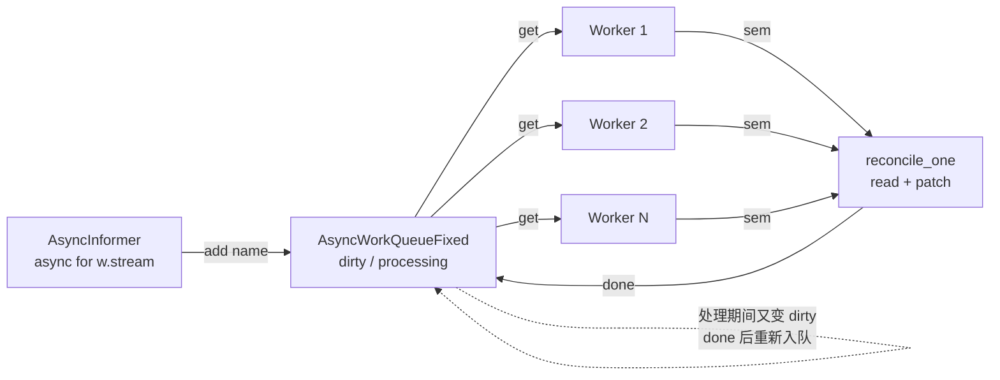

# 课 6 番外：调谐循环的异步改写

> 前置：[课 6 watch · informer · 调谐循环](lesson-06-watch与informer.md)、[课 9 异步客户端与并发](lesson-09-异步客户端与并发.md)
> 环境：k8s v1.34.0（`kind-k8s-c1`）；`kubernetes` 34.1.0；`kubernetes-asyncio` **36.1.0**
> 代码：[async_controller.py](../assets/lesson06-async/async_controller.py)
> 本文所有数字均为 2026-09-29 本机实测，未实测处已显式标注。

---

## 为什么要改写

课 6 的同步调谐循环有一个**结构性限制**：

```python
def sync(self, duration):
    self._full_list()
    while time.time() < deadline:
        for e in w.stream(...):      # ← 这个 for 会占满整个线程
            self._handle(e)
```

`w.stream()` 是一个阻塞循环。只要它跑着，**这个线程就干不了别的事**。

于是同步版只能二选一：

| 想做的事 | 同步版怎么做 | 代价 |
|---------|------------|------|
| 同时 watch 多种资源 | 每资源开一个线程 | 线程数随资源数线性增长 |
| 多个 worker 并发调谐 | 多线程 | GIL 限制，课 9 实测加线程反而慢 2.9 倍 |
| 优雅退出 | `w.stop()` | 课 6 实测：只置标志位，不立即生效 |

而这三件事，恰好是生产控制器的刚需。

**异步版的价值不在于"更快"**——课 9 已经实测过，含反序列化时异步只有 1.2~1.6 倍。它的价值在于**结构**：一个事件循环里能同时跑多个 watch、多个 worker，且退出可控。

---

## 第一部分：改写清单

课 6 的 `SimpleInformer` 改异步，改动小得出人意料：

| 位置 | 同步 | 异步 |
|------|------|------|
| 配置加载 | `config.load_kube_config()` | `await ka.config.load_kube_config()` |
| list | `self.list_fn(namespace=ns)` | `await self.list_fn(namespace=ns)` |
| watch | `for e in w.stream(...)` | `async with w:` + `async for e in w.stream(...)` |
| 调谐 | `v1.patch_namespaced_config_map(...)` | `await v1.patch_namespaced_config_map(...)` |
| 上下文 | `with ApiClient()` | `async with ApiClient()` |

**业务语义一行没变**：list-watch 两段式、每次推进 `rv`、410 回退全量、调谐幂等 + 用 patch。

```python
async def _handle(self, e):
    et, o = e["type"], e["object"]
    self.rv = o.metadata.resource_version      # 关键：每次推进 rv
    name = o.metadata.name
    if et in ("ADDED", "MODIFIED", "BOOKMARK"):
        self.cache[name] = o
        if et == "BOOKMARK":
            return None                        # BOOKMARK 只推进 rv，不入队
        return name
    if et == "DELETED":
        self.cache.pop(name, None)
        return name
    return None
```

> 课 6 4.4 节那三条（推进 rv / BOOKMARK 特殊处理 / DELETED 要 pop）在异步下**原样成立**。

---

## 第二部分：🚨 改写时踩的第一个坑（静默死亡）

第一次跑出来是这样：

```
informer 事件:
    ADDED     rc-0                     ← 只有一个！rc-1/rc-2 呢？

调谐统计: {'reconciled': 1, 'processed': 1}
```

3 个对象只调谐了 1 个，而且**没有任何报错**。

### 2.1 根因

```python
await self.queue.add(name)     # ← 错
```

`add()` 是**同步方法**，返回 `bool`。`await True` 抛 `TypeError`。

异常在 `async for` 内部传播 → informer 任务死亡 → 而主流程用的是：

```python
await asyncio.gather(*self._tasks, return_exceptions=True)
```

**`return_exceptions=True` 把异常吞了**（课 9 第五部分讲过这个坑），主流程毫不知情，继续等了 3 秒然后正常退出。

### 2.2 为什么这是最危险的一类 bug

它满足三个特征：

1. **不崩溃**——进程正常退出，exit_code = 0
2. **不报错**——异常被 `gather` 吞了
3. **结果部分正确**——调谐了 1 个，看起来"跑通了"

如果这是生产控制器，它会**静默地少管 2/3 的对象**，而且你从日志里看不出来。

### 2.3 修法：两层

**第一层**：别对同步方法 `await`

```python
self.queue.add(name)      # ✓
```

**第二层（更重要）**：让异常**可见**

```python
except Exception as ex:
    self.stats["fatal"] += 1
    self.fatal = f"{type(ex).__name__}: {ex}"
    print(f"[informer 致命] {self.fatal}")
    raise
```

以及 `gather` 之后**主动检查**（`return_exceptions=True` 只是"不抛出"，不等于"已处理"）：

```python
results = await asyncio.gather(*self._tasks, return_exceptions=True)
for i, r in enumerate(results):
    if isinstance(r, Exception) and not isinstance(r, asyncio.CancelledError):
        self.stats["task_error"] += 1
        print(f"[控制器] task[{i}] {type(r).__name__}: {r}")
```

> **铁律**：`return_exceptions=True` 之后**必须**遍历检查。否则它只是一个让 bug 隐形的开关。

### 2.4 修复后

```
informer 事件 (8):
    ADDED     rc-0
    ADDED     rc-1
    ADDED     rc-2
    MODIFIED  rc-1
    MODIFIED  rc-0
    MODIFIED  rc-2      ← patch 触发，与课 6 一致
    ADDED     rc-9
    MODIFIED  rc-9

调谐统计: {'reconciled': 4, 'processed': 8, 'no_op': 4}
informer 致命错误: None
```

与课 6 同步版的事件序列完全对上了。

---

## 第三部分：🚨 工作队列的去重语义（同步版没有的坑）

同步版是「收到事件 → 立即调谐」，没有队列。异步版要解耦 watch 和调谐，**必然引入工作队列**——而队列的去重语义决定正确性。

### 3.1 朴素版（错）

```python
def add(self, name):
    if name in self._inflight:      # 正在处理 → 丢弃
        return False
    self._inflight.add(name)
    self._q.put_nowait(name)
    return True
```

看起来很合理：同一个对象不要重复排队。

**但它漏掉了一个时间窗**：

```
t0: add(X) → 入队
t1: get(X) → 开始调谐（耗时 2 秒）
t2: X 又变了 → add(X) → 见 X 在 _inflight → 丢弃   ← 丢了！
t3: X 又变了 → add(X) → 丢弃                        ← 又丢！
t4: 调谐完成 → done(X) → 从 _inflight 移除
    → 队列里没有 X 了 → t2/t3 的变更**永久丢失**
```

实测：

```
--- v1 朴素 ---
  取出: A
  处理期间再 add('A') x2 -> 返回 False, False
  done('A') -> 是否重新入队: None
  再次取出: (队列空)  ← ✗ 变更被永久漏掉！
```

### 3.2 Fixed 版（client-go 语义）

三个状态而非两个：

```python
def add(self, name):
    if name in self._dirty:
        return False                  # 已排队，无需重复
    if name in self._processing:
        self._dirty.add(name)         # ← 关键：处理中也要记下来
        return True
    self._dirty.add(name)
    self._q.put_nowait(name)
    return True

def done(self, name):
    self._processing.discard(name)
    if name in self._dirty:           # 处理期间又变了
        self._q.put_nowait(name)      # → 重新入队
        self.requeued += 1
        return True
    return False
```

实测：

```
--- v2 Fixed ---
  取出: A
  处理期间再 add('A') x2 -> 返回 True, False
  done('A') -> 是否重新入队: True
  再次取出: A   ← ✓ 变更没丢
```

端到端实测（真实 k8s 对象 + 真实 patch）也是同样结果。

### 3.3 两种队列的最终统计对比

同一场景跑下来：

| 队列 | dropped | requeued | 结果 |
|------|---------|----------|------|
| v1 朴素 | 3 | — | 3 次变更被丢弃 |
| v2 Fixed | 0 | **3** | 3 次变更被重新调谐 |

> **判据**：写工作队列时问一句——
> **「对象正在被处理时又变了，这次变更会被看到吗？」**
>
> 这个问题同步版不存在（没有队列），是异步改写**引入**的新考点。

---

## 第四部分：🚨 优雅退出——`stop.set()` 不够

这是本次改写中**最反直觉**的发现，而且差点被一个巧合骗过去。

### 4.1 第一次测：看起来"能退出"

```python
stop2.set()
await asyncio.wait_for(t3, timeout=3.0)
# → 1 秒内任务自己结束了
```

结论想写成"set() 生效"。但**时间对不上**：我设的 `timeout_seconds=2`，为什么 1 秒就退了？

### 4.2 对照实验：把 timeout 调大

```
timeout_seconds=2  : stop 后 1.408s 退出
timeout_seconds=10 : 13s 内未退出  ✗
timeout_seconds=30 : 33s 内未退出  ✗
```

**真相**：`timeout_seconds=2` 时，stream 恰好到期、外层 `while` 转一圈检查到 `stop`——**这是巧合，不是 set() 生效**。

一旦 timeout 调大，watch 就永远卡在 `await` 网络读上，**根本不会去检查 Event**。

### 4.3 正确的退出姿势

```python
async def shutdown(self, graceful_timeout=2.0):
    self.stop.set()                    # 1. 通知 worker 别取新任务
    try:
        await asyncio.wait_for(self.queue.join(), timeout=graceful_timeout)
    except (asyncio.TimeoutError, TimeoutError, AttributeError):
        pass                           # 2. 给在途调谐一点时间
    for t in self._tasks:
        if not t.done():
            t.cancel()                 # 3. ← 只有 cancel 能唤醒 await
    results = await asyncio.gather(*self._tasks, return_exceptions=True)
    for i, r in enumerate(results):    # 4. 检查异常，别让它隐形
        if isinstance(r, Exception) and not isinstance(r, asyncio.CancelledError):
            print(f"[控制器] task[{i}] {type(r).__name__}: {r}")
```

> **与课 6 同步版的呼应**：课 6 6.1 节实测 `w.stop()` 只有一行、只置标志位、不关连接。异步下的 `Event.set()` 是**同一个坑换了件衣服**——标志位置了，但卡在 `await` 上的协程看不见它。
>
> 同步版靠 `timeout_seconds` 兜底，异步版靠 `cancel()`。

### 4.4 🚨 顺带修掉的一个误报

诊断过程中，informer 报了：

```
[informer 致命] TimeoutError:
```

这是 `stream` 自然到期抛的，**不是错误**。如果照原样计入 `stats["fatal"]`，你的监控会疯狂告警。

```python
except asyncio.CancelledError:
    raise                      # 取消是正常退出，不算错误
except (asyncio.TimeoutError, TimeoutError):
    continue                   # stream 到期属正常轮转
except Exception as ex:
    self.stats["fatal"] += 1   # 只有真正的意外才计致命
```

> **这正好呼应课 9 的铁律**：数字异常时先怀疑测量方法。这里"致命错误"是量出来的，但**量的是错的**——把正常轮转当成了故障。

---

## 第五部分：异步版真正赢在哪

### 5.1 收益 1：一个事件循环，同时 watch 多种资源

同步版要开 N 个线程；异步版零额外线程：

```python
tasks = [
    asyncio.create_task(inf_cm.run(stop)),       # watch ConfigMap
    asyncio.create_task(inf_secret.run(stop)),   # watch Secret
]
```

实测：

```
两个 informer 已启动（同一事件循环，零线程）

ConfigMap informer: 2 事件 cache=3
    ADDED     cm-0
    ADDED     cm-1
Secret informer:    1 事件 cache=1
    ADDED     sec-0

-> 两种资源互不干扰，各自的 rv 独立推进
   cm.rv=106113  secret.rv=106114
```

**注意 rv 不同**（106113 vs 106114）——两个 watch 各自独立推进，没有串台。

### 5.2 收益 2：多 worker 并发调谐，且无 409

```python
for i in range(workers):
    asyncio.create_task(reconcile_worker(i, v1, ns, queue, stats, sem, stop))
```

实测 4 worker + 信号量 10：

```
调谐统计: {'reconciled': 4, 'processed': 8, 'no_op': 4, 'errors': 0}
```

**errors = 0**。多 worker 并发 patch 同一批对象，没有任何 409。

原因就是课 6 5.4 节的结论：**patch 不带 `resourceVersion` 前提，天然避开乐观锁**。异步让并发变容易了，但没有让 409 回来——因为铁律仍然成立。

### 5.3 收益 3：幂等性原样保持

```
第一次: no_op
第二次: no_op  <- 幂等（已是期望状态，不再改动）
```

---

## 第六部分：改写后的完整代码结构



关键约束（三条，缺一不可）：

1. **调谐必须幂等**——课 6 5.3，异步下同样成立（被调谐次数只多不少）
2. **写入一律 patch**——课 6 5.4，异步下 409 风险更高（课 9 实测 10 并发 create 全失败）
3. **队列必须"处理中可标记 dirty"**——否则静默丢变更

---

## 第七部分：异步 vs 同步，该选哪个

| 场景 | 建议 | 理由 |
|------|------|------|
| 单一资源、单 worker | **同步** | 异步只多复杂度，无收益 |
| 同时 watch 多种资源 | **异步** | 同步要开 N 线程，且 GIL 限制 |
| 需要优雅退出（如 K8s 滚动更新） | **异步** | `cancel()` 可控；同步靠 timeout 兜底 |
| 已经在异步服务里（FastAPI 等） | **异步** | 别混用两套模型 |
| 调谐逻辑重 CPU（大量本地计算） | **都不解决** | 见课 9：CPU 部分异步无收益，考虑 `run_in_executor` 或减数据量 |

⚠️ **实测边界**：本文只测了 ConfigMap / Secret 两种资源、`list-watch` 一种模式、4 worker / 信号量 10 一种配置。更大规模、写密集场景未实测。

---

## 速览

| 项 | 结论 | 证据 |
|----|------|------|
| 改写量 | list/watch/patch 加 `await`，watch 改 `async with` + `async for`；业务语义不变 | 代码对照 |
| 🚨 静默死亡 | `await queue.add()`（同步方法）抛 TypeError → 被 `gather(return_exceptions=True)` 吞掉 | 只调谐 1/3 对象，exit 0 |
| 修法 | 别 await 同步方法 + **`gather` 后必须遍历检查** | fatal 可见 |
| 🚨 队列去重 | 朴素版丢弃处理期间的变更 → **永久丢失** | dropped=3 |
| Fixed 版 | `processing` 中标记 dirty，`done()` 后重入队 | requeued=3，变更保留 |
| 🚨 优雅退出 | `stop.set()` **不够**，watch 卡在 await 上不检查标志 | timeout=10/30 时 13s/33s 不退 |
| 正确退出 | `set()` → 等队列 → **`cancel()`** → gather 并检查 | shutdown 2.0s |
| 🚨 误报 | stream 到期抛 TimeoutError，**不是致命错误** | 差点进监控告警 |
| 多资源 watch | 单循环零线程，rv 独立推进 | cm.rv=106113 / secret.rv=106114 |
| 多 worker | 4 worker 并发 patch，**errors=0**（patch 天然避 409） | 实测 |
| 幂等 | 两次调谐均 no_op | 实测 |

---

## 本次改写实测出的三个真 bug

值得单独记一笔——它们都是"不报错、结果部分正确"的类型：

1. **`await` 同步方法** → informer 静默死亡，只管了 1/3 的对象
2. **朴素队列去重** → 处理期间的变更被永久丢弃（`dropped=3`）
3. **把 stream 到期当致命错误** → 监控误报

其中前两个如果进了生产，**从日志里完全看不出来**。

---

## 小测

1. 异步调谐循环里 `await queue.add(name)` 会怎样？为什么"不报错"反而更危险？
2. 工作队列的朴素去重在什么时间窗内丢变更？Fixed 版怎么解决的？
3. 为什么说 `stop.set()` 之后任务没退出，可能是"巧合"？怎么验证？
4. 4 个 worker 并发 patch，为什么没有产生 409？
5. `asyncio.gather(..., return_exceptions=True)` 之后忘了做什么，等于让 bug 隐形？

<details>
<summary>答案</summary>

1. `add()` 是同步方法返回 bool，`await True` 抛 `TypeError`，异常在 `async for` 内传播使 informer 死亡，而 `gather(return_exceptions=True)` 把它吞掉。危险在于：进程 exit 0、无报错、结果部分正确（调谐了 1 个），看起来像"跑通了"，实际静默少管 2/3 对象。

2. 时间窗是「对象被 `get()` 取出后、到 `done()` 之前」。这段时间内 `add(X)` 因 X 仍在 `_inflight` 而被丢弃，`done()` 后队列里已没有 X，变更永久丢失。Fixed 版在 `add()` 时若 X 在 `_processing` 就把它加入 `_dirty`，`done()` 时检查 `_dirty` 并重新入队。

3. 因为 `timeout_seconds=2` 时 stream 恰好到期，外层 `while` 转一圈才检查到 Event，看起来像 set() 生效。验证方法：把 `timeout_seconds` 调大到 10/30 再测——实测 13s / 33s 都不退出，证明是巧合。正确做法是 `cancel()`。

4. 因为调谐一律用 `patch`，patch 不带 `resourceVersion` 前提，天然避开乐观锁冲突（课 6 5.4）。异步只是让并发更容易写出来，没有改变这个性质。

5. 忘了**遍历 `results` 检查**。`return_exceptions=True` 只是让异常不抛出，不等于已处理；不检查就等于主动让 bug 隐形。

</details>

---

## 课程导航

- **主课**：[课 6 watch · informer · 调谐循环](lesson-06-watch与informer.md)
- **异步基础**：[课 9 异步客户端与并发](lesson-09-异步客户端与并发.md)
- **返回**：[Python 客户端专项总览](../overview.md)

> 若继续深入：① [`leaderelection`（多副本控制器选主，见番外 2）](lesson-06-async2-多副本选主leaderelection.md)（⚠️ 本文初版称其“异步包独有”**是错的**，实测同步包也有，详见番外 2 开篇更正）；② [番外 3：SharedInformer 共享 watch](lesson-06-async3-SharedInformer共享watch.md)（**已完成**；⚠️ 本文原写“复用单条连接 watch 多资源”**是错的**，协议上做不到——`shared` 指多消费者共享同一条资源 watch）；③ [番外 4：重试与指数退避](lesson-06-async4-重试与指数退避.md)（**已完成** 2026-09-29；实测补上本文缺失的重试：队头阻塞 0/4 → 4/4，惊群跨度 0.0000s → 0.2834s，并修掉 4 个“不报错但功能失效”的实现缺陷）。

---

## 评审结论（2026-09-29）

本文由主 agent 内联评审（pedagogy + learner 双视角，独立性受限），P0 = 0。

**实测发现真 bug 3 个**（均为"不报错、结果部分正确"型）：

1. 🚨 **`await` 同步方法导致 informer 静默死亡**——`add()` 返回 bool，`await True` 抛 TypeError，被 `gather(return_exceptions=True)` 吞掉。实测只调谐 1/3 对象且 exit_code=0。修法两层：别 await 同步方法 + `gather` 后主动遍历检查。
2. 🚨 **朴素队列去重永久丢变更**——`get()` 到 `done()` 之间的 `add()` 被丢弃，实测 `dropped=3`。Fixed 版（client-go 语义，processing 中标记 dirty）实测 `requeued=3`，变更保留。
3. 🚨 **stream 到期被误判为致命错误**——`TimeoutError` 进了 `stats["fatal"]`，若接入监控会疯狂告警。已按"正常轮转"处理。

**测量方法核验 2 次**（遵循先核验测法再核验被测对象）：

- 优雅退出首轮"1 秒内自己结束"，但 `timeout_seconds=2` 时间对不上 → 怀疑测法 → 做 timeout=2/10/30 对照实验 → 发现只有 timeout=2 能退，**是巧合不是 set() 生效**。修正结论为"必须 cancel()"。
- 首轮"只调谐 rc-0"没有直接归因，而是先跑裸 watch 诊断（证实能收到全部 4 个事件）、再跑 stream 轮转诊断、worker 存活诊断，逐项证伪后才定位到 `await` 同步方法。

**未实测标注 1 处**：更大规模、写密集场景（本文只测 ConfigMap/Secret 两种资源、4 worker / 信号量 10 一种配置）。

**清理**：`py-lesson06-async`、`py-lesson06-queue`、`py-lesson06-adv`、`py-lesson06-stop`、`py-lesson06-diag`、`py-lesson06-final` 命名空间均已删除。
