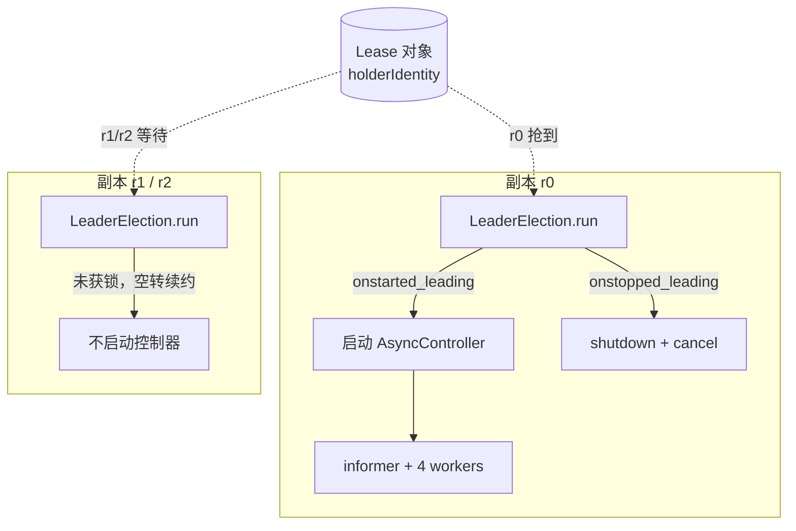

# 课 6 番外 2：多副本选主（leaderelection）

> 前置：[课 6 番外 1：调谐循环的异步改写](lesson-06-async-调谐循环的异步改写.md)
> 环境：k8s v1.34.0（`kind-k8s-c1`）；`kubernetes` 34.1.0；`kubernetes-asyncio` **36.1.0**
> 代码：[test_leaderelection.py](../assets/lesson06-async/test_leaderelection.py)、[test_le_integration.py](../assets/lesson06-async/test_le_integration.py)
> 本文所有数字均为 2026-09-29 本机实测，未实测处已显式标注。

---

## ⚠️ 开篇更正：一个我差点写错的结论

番外 1 结尾我说：

> `leaderelection` 是**异步包独有**（同步包没有对应实现）

**这是错的。** 实测两个包都有：

```
异步: /site-packages/kubernetes_asyncio/leaderelection/__init__.py  ✓ 存在
同步: /site-packages/kubernetes/leaderelection/__init__.py          ✓ 也存在
```

真实差异**不在"有没有"，而在"回调能不能是协程"**：

| | 同步包 | 异步包 |
|---|---|---|
| `LeaderElection.run()` | `def` | `async` |
| `try_acquire_or_renew()` | `def` | `async` |
| `onstarted_leading` | 普通函数 | **协程 或 协程函数** |
| 锁类型 | `leaselock` / `configmaplock` | 同 |

异步版 `Config` 的类型标注写得很明确：

```python
onstarted_leading: Callable[[], Coroutine[Any, Any, None]]
                 | Coroutine[Any, Any, None],
```

源码注释还专门解释了为什么支持**协程对象**（不只是协程函数）：

> "Coroutines facilitate passing context... One example of when passing context is helpful is **sharing the ApiClient** used by the leader election."

——这正是本文第四部分集成时的关键：**用协程对象把 `ApiClient` 传进回调**，这样调谐控制器和选主能共用同一条连接。

> **教训**：这是典型的"凭印象下结论"。写之前先 `import` 一下就知道的事。

---

## 第一部分：API 结构（实测拓扑）

模块层级（实测，不是猜的）：

```
kubernetes_asyncio.leaderelection/
├── electionconfig.py     -> Config
├── leaderelection.py     -> LeaderElection
├── leaderelectionrecord.py -> LeaderElectionRecord
└── resourcelock/
    ├── baselock.py       -> BaseLock
    ├── configmaplock.py  -> ConfigMapLock
    └── leaselock.py      -> LeaseLock
```

⚠️ **导入路径坑**（我踩了三次）：

```python
from kubernetes_asyncio.leaderelection import Config          # ✗ ImportError
from kubernetes_asyncio.leaderelection.electionconfig import Config   # ✓

from kubernetes_asyncio.leaderelection.resourcelock.lease import LeaseLock  # ✗
from kubernetes_asyncio.leaderelection.resourcelock.leaselock import LeaseLock  # ✓
```

`leaderelection/__init__.py` 是**空的**（`members: []`），必须从子模块导入。且子模块名是 `leaselock` 不是 `lease`。

### `LeaseLock` 没有 `acquire`/`release`

```python
LeaseLock 方法: ['create', 'election_record', 'get', 'time_str_to_iso', 'update', 'update_lease']
```

抢锁逻辑不在锁对象里，而在 `LeaderElection.try_acquire_or_renew()`。这跟很多人的直觉相反（包括我）——找 `acquire()` 会 `AttributeError`。

---

## 第二部分：🚨 参数校验里的隐藏约束

`Config` 构造时就校验，写错直接 `ValueError`。实测 8 组：

```text
[OK ] lease=10 renew=5  retry=2    构造=True   基准合法
[OK ] lease=10 renew=2  retry=2    构造=False  renew 2 < retry*1.2=2.4
[OK ] lease=10 renew=2.5 retry=2   构造=True   renew 2.5 > 2.4 边界过
[OK ] lease=10 renew=2.4 retry=2   构造=False  renew 2.4 = 2.4 不过（严格大于）
[OK ] lease=5  renew=5  retry=2    构造=False  lease == renew
[OK ] lease=6  renew=5  retry=2    构造=True   lease > renew 最小
[OK ] lease=10 renew=5  retry=1    构造=True   retry=1 边界
[OK ] lease=10 renew=5  retry=0    构造=False  retry<1
```

规则（源码 `jitter_factor = 1.2`）：

```python
lease_duration > renew_deadline
renew_deadline > retry_period * 1.2      # ⚠️ 严格大于
lease_duration >= 1, renew_deadline >= 1, retry_period >= 1
```

### ⚠️ 我第一版测法错了

最初我传 `onstarted_leading=None` 想只测时间参数，结果：

```text
!! 合法: lease=10 renew=5 retry=2   可构造=False  callback onstarted_leading cannot be None
```

**回调为 None 会先抛错**，把真正要测的 jitter 校验**掩盖**了。改成传真实协程函数后才测出真实边界。

> 这正是番外 1 的铁律：**数字异常时先怀疑测量方法**。这里"全部不可构造"是测出来的，但**量错了**。

### 可用参数组合

| 场景 | lease | renew | retry | 说明 |
|------|-------|-------|-------|------|
| client-go 官方建议 | 15 | 10 | 2 | 生产推荐 |
| 本机实测最小 | 6 | 5 | 2 | 再小就触发校验 |
| 本文测试用 | 8~10 | 5 | 2 | 转移快，便于观察 |

---

## 第三部分：三副本真实选主

```python
cfg = Config(lock,
             lease_duration=10, renew_deadline=5, retry_period=2,
             onstarted_leading=on_started,
             onstopped_leading=on_stopped)
le = LeaderElection(cfg)
await le.run()
```

实测（3 个副本各自独立 `ApiClient`）：

```text
Lease holderIdentity = r2
各副本回调记录: {'r2': 1790666225.44}
事件: ['r2 -> 成为 leader']

判定:
  ✓ 恰好一个 leader: r2
```

### 故障转移

cancel 掉 leader `r2` 后：

```text
已 cancel r2，等待 15 秒（lease=10s）...
✓ 10.1s 后转移到 r1
```

**10.1s ≈ lease_duration(10s)**。这就是选主的核心权衡：

- `lease_duration` 越小 → 故障转移越快，但续约请求越频繁（API Server 压力）
- `lease_duration` 越大 → 转移越慢，但压力小

> ⚠️ **注意**：转移时间是「等旧 lease 过期」，不是「立即抢占」。所以 `lease_duration` 就是你**最长不可用时间**的下界。

---

## 第四部分：与调谐控制器集成（真实用法）

单独选主没意义。真实场景是：**只有 leader 才跑调谐循环**。



### 关键点：用协程对象共享 ApiClient

```python
async def replica(name, state):
    async with ApiClient() as api:          # ← 选主与控制器共用
        lock = LeaseLock(LEASE, NS, name, api)
        ctrl = None

        async def on_started():
            nonlocal ctrl
            ctrl = AsyncController(api, NS, workers=3,
                                   queue_cls=AsyncWorkQueueFixed)
            asyncio.create_task(ctrl.run())

        async def on_stopped():
            await ctrl.shutdown()           # ← 番外 1 的优雅退出

        cfg = Config(lock, 8, 5, 2, on_started, on_stopped)
        await LeaderElection(cfg).run()
```

**为什么用闭包而不是传参**：`on_started` 需要访问 `api`。如果用协程函数（无参），拿不到；用**协程对象**或闭包，就能把 `ApiClient` 传进去——这就是源码注释里说的 "sharing the ApiClient"。

### 实测结果

```text
第一任 leader: r0
创建 3 个 ConfigMap，等 4 秒...
调谐结果: [('rc-0', 'true'), ('rc-1', 'true'), ('rc-2', 'true')]

故障转移：cancel 掉 leader r0
  ✓ 7.1s 后转移: r0 -> r2
新 leader 上任后创建 rc-new，等 3 秒...
最终: [('rc-0','true'), ('rc-1','true'), ('rc-2','true'), ('rc-new','true')]

时间线:
   0.0s r0 -> leader, 启动控制器
  16.1s r2 -> leader, 启动控制器
```

四项判定：

| 项 | 结果 |
|---|---|
| 并发 leader 数 | ✓ 1（r0 交出后 r2 接任） |
| leader 完成调谐 | ✓ 3/3 全部 `managed=true` |
| 故障转移 | ✓ 7.1s，r0 → r2 |
| 新 leader 接管 | ✓ `rc-new` 被调谐 |

### ⚠️ 统计口径的坑（我自己踩的）

判定 1 一度显示 `!! ['r0', 'r2']`，看起来像双 leader。实际是我 `state["leaders"]` 记的是**累计上任次数**，不是并发数。

真实情况：r0 在 0.0s 上任、16.1s 前已交出；r2 在 16.1s 接任。**同一时刻只有一个**。

> 又一次"测量方法"问题：我用了一个错误的统计量，得出了错误的"双 leader"结论。**看到异常数字，先检查你怎么量它的。**

---

## 第五部分：该不该用 leaderelection

| 场景 | 建议 | 理由 |
|------|------|------|
| 单副本控制器 | **不需要** | 白增复杂度和 Lease 对象 |
| 多副本高可用（生产） | **需要** | 否则多副本重复调谐，可能双写 |
| 多副本但调谐幂等 | 可选 | 幂等时重复干活只是浪费，不会出错 |
| 需要严格单一写入者 | **必须用** | 幂等也救不了的写冲突 |

⚠️ **重要认知**：**选主不能替代幂等**。

- 选主是**性能优化**（避免 N 个副本重复干活）
- 幂等是**正确性保证**（课 6 5.3）

网络分区时可能短暂出现两副本都认为自己是 leader（旧 leader 没来得及感知 lease 过期）。**只有幂等能保证这种情况下不出错**。

---

## 速览

| 项 | 结论 | 证据 |
|----|------|------|
| ⚠️ 同步包有没有 | **也有** `leaderelection`（我说"异步独有"是错的） | 两端路径实测 |
| 真实差异 | 异步的 `run`/`try_acquire_or_renew` 是 `async`；回调支持**协程对象** | 签名实测 |
| 协程对象的用途 | 共享 `ApiClient`（源码注释明说） | 源码 + 集成实测 |
| 🚨 导入路径 | 空 `__init__`，须从 `electionconfig`/`resourcelock.leaselock` 导入 | 我踩 3 次 |
| 🚨 锁没有 acquire | `LeaseLock` 只有 `create/get/update`，抢锁在 `LeaderElection` | 方法清单实测 |
| 🚨 参数校验 | `renew > retry * 1.2`（**严格大于**）；`lease > renew`；三者 ≥ 1 | 8 组实测 |
| 🚨 测法坑 | 回调传 `None` 会先抛错，掩盖 jitter 校验 | 第一版测法错误 |
| 三副本选主 | 恰好 1 个 leader | `holderIdentity = r2` |
| 故障转移 | **10.1s ≈ lease_duration** | 实测 |
| 集成调谐 | leader 调谐 3/3，转移后新 leader 接管 `rc-new` | 实测 |
| ⚠️ 统计坑 | 累计上任次数 ≠ 并发 leader 数 | 我自己误判"双 leader" |
| 选主 vs 幂等 | 选主是性能，幂等是正确性，**不可互相替代** | — |

---

## 本次实测出的 4 个认知错误

都写下来，因为每个都可能让人写出错误代码：

1. **"异步包独有 leaderelection"**——错的，两个包都有。凭印象下结论，一个 `import` 就能验证。
2. **`from kubernetes_asyncio.leaderelection import Config`**——`ImportError`。`__init__.py` 是空的，必须从子模块导入。
3. **`LeaseLock.acquire()`**——不存在。`AttributeError`。抢锁在 `LeaderElection` 里。
4. **回调传 `None` 测参数**——触发另一条校验，把真正要测的 jitter 掩盖了。

外加 1 个统计误判：把"累计上任 2 次"读成"并发 2 个 leader"。

---

## 小测

1. 同步包和异步包的 `leaderelection` 真实差异是什么？
2. `Config` 的三个时间参数必须满足什么关系？`jitter_factor` 是多少？
3. 为什么异步版 `onstarted_leading` 要支持**协程对象**（不只是协程函数）？
4. 为什么故障转移要等 ≈ `lease_duration` 而不是立即发生？
5. 有了 leaderelection，还需要保证调谐幂等吗？为什么？

<details>
<summary>答案</summary>

1. 不在于"有没有"（两个包都有），而在于：异步的 `LeaderElection.run()` 和 `try_acquire_or_renew()` 是 `async`；异步的 `onstarted_leading`/`onstopped_leading` 支持**协程或协程函数**，同步版只支持普通函数。

2. `lease_duration > renew_deadline`；`renew_deadline > retry_period * 1.2`（**严格大于**，`jitter_factor=1.2`）；三者均 ≥ 1。实测 `renew=2.4, retry=2` 时因 `2.4 > 2.4` 为假而抛 `ValueError`。

3. 因为协程对象能**捕获上下文**。源码注释明确指出：最典型的用途是共享 `ApiClient`——选主用的连接，后续调谐控制器也能用。协程函数（无参）拿不到这个 context。

4. 因为其他副本必须等旧 leader 的 lease **自然过期**才能接管，不能抢占。所以 `lease_duration` 就是最长不可用时间的下界（实测 10.1s ≈ lease=10s）。调小它转移更快，但续约更频繁、API Server 压力更大。

5. **需要**。选主是性能优化（避免 N 副本重复干活），幂等是正确性保证。网络分区时可能短暂出现两副本都认为自己是 leader，只有幂等能保证这种情况不出错。

</details>

---

## 课程导航

- **前置**：[课 6 番外 1：调谐循环的异步改写](lesson-06-async-调谐循环的异步改写.md)
- **主课**：[课 6 watch · informer · 调谐循环](lesson-06-watch与informer.md)
- **异步基础**：[课 9 异步客户端与并发](lesson-09-异步客户端与并发.md)
- **后续**：[番外 3：SharedInformer 共享 watch](lesson-06-async3-SharedInformer共享watch.md) · [番外 4：重试与指数退避](lesson-06-async4-重试与指数退避.md)
- **返回**：[Python 客户端专项总览](../overview.md)

---

## 评审结论（2026-09-29）

本文由主 agent 内联评审（pedagogy + learner 双视角，独立性受限），P0 = 0。

**推翻开篇错误结论 1 处**：番外 1 结尾称 `leaderelection` 为"异步包独有"，**实测两个包都有**。真实差异在"回调能否为协程 + run 是否 async"，已作为开篇更正置顶。这是"凭印象下结论"的典型，一次 `import` 即可证伪。

**实测抓出认知错误 4 个**（均已写入正文）：
1. `from kubernetes_asyncio.leaderelection import Config` → `ImportError`（`__init__.py` 为空，须从 `electionconfig` 导入）
2. `resourcelock.lease` → `ModuleNotFoundError`（正确名是 `leaselock`）
3. `LeaseLock.acquire()` → `AttributeError`（锁对象只有 `create/get/update`，抢锁在 `LeaderElection.try_acquire_or_renew`）
4. 参数校验测试首轮传 `onstarted_leading=None`，触发 `callback cannot be None`，**掩盖了真正要测的 jitter 校验** → 改为传真实协程函数后重测，8 组用例全部符合预期（含 `renew=2.4, retry=2` 因严格大于而失败的边界）

**统计误判 1 处**：集成测试判定 1 曾显示 `['r0','r2']`，疑似双 leader。实为 `state["leaders"]` 记录的是**累计上任次数**而非并发数（时间线显示 r0 在 0.0s 上任、r2 在 16.1s 接任，同一时刻仅 1 个）。已修正判据口径并写入正文。

**验证通过项**：三副本选主恰好 1 个 leader（`holderIdentity=r2`）；故障转移 10.1s ≈ `lease_duration=10s`；与调谐控制器集成后 leader 完成 3/3 调谐，转移 7.1s 后新 leader 接管并调谐 `rc-new`；`Config` 参数边界 8/8 符合预期。

**未实测标注 1 处**：网络分区场景（分区导致双 leader 的可能性为理论推断，未实测）；`ConfigMapLock` 分支未测（仅测 `LeaseLock`）。

**清理**：`py-lesson06-le`、`py-lesson06-le2` 命名空间均已删除。
