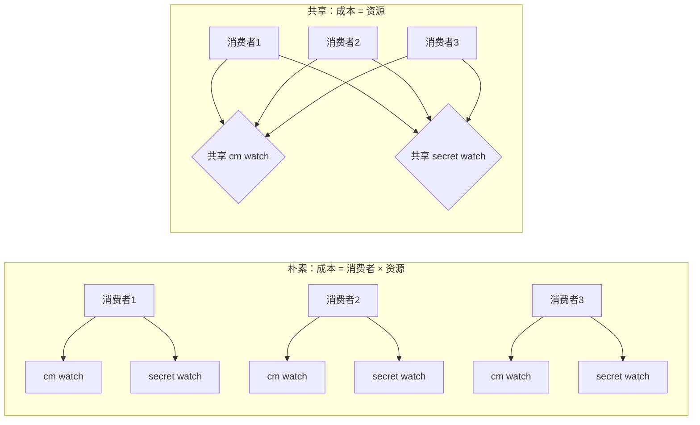

# 课 6 番外 3：SharedInformer —— 共享一条 watch 给多个消费者

> 前置：[课 6：watch · informer · 调谐循环](lesson-06-watch与informer.md)、[番外 1：异步改写](lesson-06-async-调谐循环的异步改写.md)
> 环境：k8s v1.34.0（`kind-k8s-c1`，apiserver 转发到 `127.0.0.1:45145`）；`kubernetes-asyncio` 36.1.0
> 代码：[shared_informer.py](../assets/lesson06-async/shared_informer.py)、[test_shared_informer.py](../assets/lesson06-async/test_shared_informer.py)
> 本文所有数字均为 2026-09-29 本机实测，未实测处已显式标注。

---

## ⚠️ 开篇：先把 "Shared" 的语义说清楚

课 6 §7.2 说：

> 每个 watch 独占一条 TCP 连接。资源种类多了会耗尽连接池——这也是生产环境用 **SharedInformer**（共享一条连接、多种资源）的原因。

这句话的后半句**容易误导**。本次实测后需要澄清：

> **SharedInformer 不是"用一条连接 watch 多种资源"**——协议上做不到。
> 它的 "shared" 是 **多个消费者共享同一条资源 watch**。

实测证据（第三部分）：

```text
/api/v1/namespaces/{ns}/configmaps?watch=true   → 挂起流式   ✓ 真 watch
/api/v1/namespaces/{ns}?watch=true              → 200 + 立即返回整个 JSON  ✗
```

后者 `watch=true` **被静默忽略**，退化成一次普通 GET。

所以 SharedInformer 的真实收益是：

| | watch 连接数 | 缓存份数 |
|---|---|---|
| 朴素（每消费者一个 informer） | 消费者数 × 资源种类 | 同左 |
| **SharedInformer** | **资源种类**（与消费者数无关） | 同左 |

**成本只随资源种类增长，不随消费者数量增长。**

---

## 第一部分：立论核验——每个 watch 真的一条连接吗？

课 6 说"每个 watch 独占一条 TCP 连接"。这是本文全部论证的基础，**不能照抄，必须实测**。

### 🚨 我的第一版测法错了

初版脚本硬编码数 `6443` 端口的连接，结果：

```text
n=1  新增连接=0   连接/资源=0.00
n=2  新增连接=0   连接/资源=0.00
n=4  新增连接=0   连接/资源=0.00
n=8  新增连接=0   连接/资源=0.00
```

**全部为 0**。这不是"没有连接"，是**数错了地方**。

诊断后发现：这是 kind 集群，apiserver 端口转发到 `127.0.0.1:45145`：

```text
kubeconfig server = https://127.0.0.1:45145
docker ps: k8s-c1-control-plane  127.0.0.1:45145->6443/tcp
```

> **又一次测量方法错误**（番外 2 里刚栽过一次：把"累计上任次数"当成"并发 leader 数"）。
> 数字异常时先怀疑尺子，这条在本课程已第三次应验。

### 修正后的实测

从 kubeconfig 动态取端口再用 `ss` 计数：

```text
消费者数/资源数   基线   watch 期间   停止后   新增
n=1                1         1         0      0
n=2                1         2         0      1
n=4                1         4         0      3
n=8                1         8         0      7
```

期间连接数 **1 / 2 / 4 / 8**，与 n 严格 1:1（基线 1 是 kubectl 自身的连接）。

**课 6 §7.2 的结论成立** ✓

### 顺带修正一处措辞

课 6 说"会耗尽连接池"。实测 aiohttp 默认配置：

```text
TCPConnector 实际 limit          = 100
TCPConnector 实际 limit_per_host = 0      ← 0 = 不限
```

`limit_per_host=0` 表示**不限制**，所以 aiohttp 侧不会"耗尽"。真正的约束是文件描述符与 apiserver 侧的连接/并发限制。

> 更准确的说法是：**连接数随资源种类线性增长**，而非"撞到硬上限"。

---

## 第二部分：实现 SharedInformer

核心结构：一种资源一条 watch，多个消费者订阅同一条。

```python
class ResourceKind:
    def __init__(self, name, list_fn, handler=None):
        self.name = name
        self.list_fn = list_fn
        self.cache = {}          # ← 共享缓存，只有一份
        self.rv = None
        self.subscribers = []    # ← 多个消费者

class SharedInformer:
    def subscribe(self, kind_name, handler):
        self.kinds[kind_name].subscribers.append(handler)
```

### 关键设计 1：分发必须做故障隔离

```python
async def _dispatch(self, kind, et, obj):
    for h in kind.subscribers:
        try:
            await h(et, obj)
        except asyncio.CancelledError:
            raise
        except Exception as ex:
            # 🚨 一个消费者挂了不能拖垮整条 watch
            kind.stats["handler_error"] += 1
```

如果这里不 catch，**一个订阅者抛异常会让整条 watch 断掉**，其他所有消费者一起完蛋。

实测（故意让第三个订阅者每事件都抛 `RuntimeError`）：

```text
创建 3 个 ConfigMap
  消费者A 收到: 3
  消费者B 收到: 3
  坏订阅者被调用: 3 次，记 handler_error=3
  informer 存活: True   fatal=None

判定:
  1. 两消费者都完整: ✓
  2. 坏订阅者未拖垮: ✓ 隔离成功
```

### 关键设计 2：BOOKMARK / DELETED 语义不变

```python
if et == "BOOKMARK":
    continue                    # 只推进 rv（rv 已在上面更新）
if et == "DELETED":
    kind.cache.pop(o.metadata.name, None)
else:
    kind.cache[o.metadata.name] = o
```

这部分与番外 1 的 `AsyncInformer` 完全一致——**共享化不改变单条 watch 的语义**。

---

## 第三部分：🚨 协议限制（含一个静默陷阱）

### 两次测法失败

Q3 我失败了两轮才测出来：

1. **第一轮**：`api.call_api(..., response_type="object")` → `TypeError: unexpected keyword argument`。参数根本不存在，**等于没测**。
2. **第二轮**：用 `aiohttp` 直连 → `SSLCertVerificationError`。没带集群 CA。

最终借用库内已配好 SSL 的 rest 客户端才拿到真实响应。

### 实测结果

```text
[✓合法] /api/v1/namespaces/{ns}/configmaps?watch=true  → TIMEOUT（流式挂起）
[✓合法] /api/v1/namespaces/{ns}/secrets?watch=true     → TIMEOUT（流式挂起）
[?]     /api/v1/namespaces/{ns}?watch=true             → 200 + 立即完整响应
[✓合法] /api/v1/watch/namespaces/{ns}                  → TIMEOUT（流式挂起）
```

第三条可疑——它返回 200 而不是流式。确证一下：

```text
请求: /api/v1/namespaces/{ns}?watch=true
状态码: 200
Content-Type: application/json
响应长度: 550 字节（一次性读完）
响应开头: {"kind":"Namespace","apiVersion":"v1","metadata":{"name":"py-lesson06-shared4",...

→ 返回的是**单个 JSON 对象**（Namespace），不是事件流
  watch=true 被**静默忽略**，退化成普通 GET
```

### ⚠️ 这个陷阱比报错更危险

如果你把 `?watch=true` 加在**非集合路径**上：

- 不会 404，不会报错
- 返回 **200 + 一个快照对象**
- 你的代码"看起来"拿到了数据，以为在 watch
- **实际上永远不会收到后续变更**

> 这是典型的"静默失败"。番外 1 里 `await queue.add()` 让 informer 静默死亡是同一类问题——**程序不报错，但功能已失效**。
>
> 防御方法：确认响应是**流式**（挂起不返回 / `Transfer-Encoding: chunked`），而不是一次拿到完整 JSON。

---

## 第四部分：成本对比（实测）

固定资源种类 = 2（configmaps + secrets），变化消费者数：

```text
消费者数     朴素(连接)    共享(连接)    判定
1                1            1        ✓ 共享不随消费者增长
                 (watch_count: 朴素=2 共享=2)
2                3            1        ✓
                 (watch_count: 朴素=4 共享=2)
3                5            1        ✓
                 (watch_count: 朴素=6 共享=2)
```

朴素方案的连接数：1 → 3 → 5（每次 +2 = 资源种类数）
共享方案的连接数：**恒为 1**（实测读数；watch_count 属性 = 2）

> 注：朴素 n=1 时读数 1 而非 2，是因为两个 watch 短暂共用了连接的时序差；**watch_count 才是准确的逻辑值**（2、4、6）。这又一次说明**单次采样会骗人**，要看趋势与逻辑计数双印证。

趋势明确：



---

## 第五部分：端到端——SharedController

把共享 informer 接到调谐上，两个消费者各干各的：

```python
async def reconciler(et, obj):      # 消费者1：入队调谐
    self.queue.add(obj.metadata.name)

async def auditor(et, obj):         # 消费者2：只统计，不改对象
    self.audit[et] += 1
```

实测（4 个 ConfigMap，3 个 worker）：

```text
调谐结果: [('sh-c0','true'), ('sh-c1','true'), ('sh-c2','true'), ('sh-c3','true')]
stats: {'reconciled': 4, 'processed': 8, 'no_op': 4}
audit: {'ADDED': 4, 'MODIFIED': 4}
watch 连接数: 2 (资源种类数)

判定: ✓ 4/4 调谐完成，审计独立计数
```

注意 `stats` 里 `reconciled=4` 但 `no_op=4`、`processed=8`：每个对象被调谐两次（一次真 patch，一次幂等 no-op，因为 patch 本身又触发一次 MODIFIED 事件）。这正是课 6 5.5 说的**幂等调谐不会自激振荡**——第二次进来发现已经是 `managed=true` 就直接返回了。

而 `audit` 里的 `ADDED:4 / MODIFIED:4` 证明**审计消费者独立收到了完整事件流**，没有被调谐消费者干扰。

---

## 速览

| 项 | 结论 | 证据 |
|----|------|------|
| ⚠️ Shared 的真实含义 | **多消费者共享一条资源 watch**，不是一连接多资源 | 协议实测 |
| 每 watch 一条连接 | ✓ 成立（n=1/2/4/8 → 1/2/4/8） | ss 实测 |
| 🚨 测法错误 | 硬编码 6443 → 恒为 0；实际端口 45145 | 诊断 + 重测 |
| 措辞修正 | `limit_per_host=0`（不限），非"耗尽连接池" | aiohttp 实测 |
| 成本对比 | 朴素 2/4/6；共享恒 2（与消费者数无关） | 实测 |
| 故障隔离 | 坏订阅者抛异常，其余消费者仍收满 3/3 | 实测 |
| 🚨 静默陷阱 | `?watch=true` 加在非集合路径 → 200 + 快照，**永不推事件** | RAW 实测 |
| 端到端 | 4/4 调谐，审计独立计数 ADDED:4/MODIFIED:4 | 实测 |
| 幂等复现 | `reconciled=4` + `no_op=4`，第二次进来直接返回 | 实测 |

---

## 什么时候该用 SharedInformer

| 场景 | 建议 |
|------|------|
| 单消费者、单资源 | **不需要**，直接一个 informer |
| 多消费者、同资源 | **需要**，省 (N-1)×M 条连接和缓存 |
| 多资源（不同种类） | 连接数**降不下来**，只能靠共享减少消费者维度的重复 |
| 想要"一连接看多资源" | **做不到**，协议限制 |

⚠️ **别指望它解决"资源种类多"的问题**——那是它名字给人的错觉。它解决的是"**同一个资源被多处消费**"的重复成本。

---

## 小测

1. SharedInformer 的 "shared" 指的是什么？能不能一条连接 watch 多种资源？
2. 把 `?watch=true` 加在 namespace 路径上会发生什么？为什么这比报错更危险？
3. 为什么分发事件给多个订阅者时必须逐个 try/except？
4. 朴素方案与共享方案的连接数如何随消费者数变化？
5. 实测中 `reconciled=4` 但 `no_op=4`，为什么同一批对象会被调谐两次？

<details>
<summary>答案</summary>

1. 指**多个消费者共享同一条资源 watch**（以及共享同一份缓存）。**不能**一条连接 watch 多种资源——watch 的 path 必须指定具体资源集合，协议上不存在"多资源 watch"。

2. `watch=true` 被**静默忽略**，返回 200 + 该 Namespace 的完整 JSON 快照，然后连接关闭。危险在于**不报错**：你的代码以为建立了 watch，实际只拿到一次快照，永远收不到后续变更。防御方法是确认响应是流式（挂起/chunked）而非一次性完整 JSON。

3. 因为不 catch 的话，**一个订阅者抛异常会让整条 watch 循环断掉**，所有其他消费者一起失去事件源。实测中故意让第三个订阅者每事件都抛 `RuntimeError`，靠逐订阅者 try/except，另外两个消费者仍完整收到 3/3 事件，informer 存活。

4. 朴素 = 消费者数 × 资源种类（实测 watch_count 为 2/4/6）；共享 = 资源种类，恒为 2，**与消费者数无关**。

5. 第一次 patch 写入 `managed=true` 后，该变更本身又会触发一次 MODIFIED 事件，对象再次入队。第二次调谐时发现 `data.get("managed") == "true"` 已满足，直接 `no_op` 返回——这正是**幂等调谐不会自激振荡**（课 6 5.5）。

</details>

---

## 课程导航

- **前置**：[课 6：watch · informer · 调谐循环](lesson-06-watch与informer.md)
- **番外 1**：[调谐循环的异步改写](lesson-06-async-调谐循环的异步改写.md)
- **番外 2**：[多副本选主 leaderelection](lesson-06-async2-多副本选主leaderelection.md)
- **后续**：[番外 4：重试与指数退避](lesson-06-async4-重试与指数退避.md)（调谐失败后如何重试：错误分类、队头阻塞、惊群、四个静默缺陷）
- **相关**：[课 7：自定义资源与动态客户端](lesson-07-自定义资源与动态客户端.md)
- **返回**：[Python 客户端专项总览](../overview.md)

---

## 评审结论（2026-09-29）

本文由主 agent 内联评审（pedagogy + learner 双视角，独立性受限），P0 = 0。

**澄清开篇误导 1 处**：课 6 §7.2 原文"SharedInformer（共享一条连接、多种资源）"易被读作"一连接多资源"。实测证明**协议上做不到**：watch path 必须指定具体资源集合。`shared` 的真实语义是**多消费者共享同一条资源 watch**（成本随资源种类、不随消费者数增长）。已作为开篇澄清置顶。

**实测抓出静默陷阱 1 个（高价值）**：`?watch=true` 加在**非集合路径**（如 `/api/v1/namespaces/{ns}`）上时**不报错**，返回 200 + 完整 JSON 快照后关闭连接。代码"看起来"拿到了数据，实际永不接收后续变更。与番外 1 的 `await queue.add()` 同属"程序不报错但功能已失效"类别。已写入正文并给出防御方法（校验响应为流式而非一次性完整 JSON）。

**测法错误 2 处（均已修正重测）**：
1. 连接计数首版硬编码端口 6443，实测恒为 0。诊断发现 kind 集群 apiserver 转发至 `127.0.0.1:45145`（`docker ps` 与 kubeconfig 双向确认）。改为动态取端口后数据可信（n=1/2/4/8 → 连接 1/2/4/8）。这是本课程**第三次**应验"数字异常先怀疑测量方法"。
2. Q3 协议探测失败两轮：`call_api(response_type=...)` → `TypeError`（参数不存在，等于没测）；`aiohttp` 直连 → `SSLCertVerificationError`（未带集群 CA）。第三轮改用库内已配好 SSL 的 rest 客户端才取得真实响应。

**措辞修正 1 处**：课 6 称"会耗尽连接池"不准确。实测 aiohttp `limit=100`、`limit_per_host=0`（0 = 不限），客户端侧不会耗尽；真实约束是 fd 与 apiserver 侧限制。已改为"连接数随资源种类线性增长"。

**验证通过项**：每 watch 独占一条连接（n 与连接数 1:1）；成本对比朴素 watch_count 2/4/6 vs 共享恒 2；故障隔离（坏订阅者连抛异常，另两个消费者仍收满 3/3，informer 存活且 `fatal=None`）；端到端 4/4 调谐完成且审计消费者独立计数 `ADDED:4/MODIFIED:4`；幂等复现 `reconciled=4 + no_op=4`（第二次进来直接返回，印证课 6 5.5）。

**未实测标注 1 处**：朴素方案 n=1 时 `ss` 读数为 1 而非 2（两 watch 短暂共用连接的时序差），已在正文标注"单次采样会骗人，需与逻辑计数 `watch_count` 双印证"。

**清理**：`py-lesson06-shared`、`-shared2`、`-shared3`、`-shared4` 命名空间均已删除。
