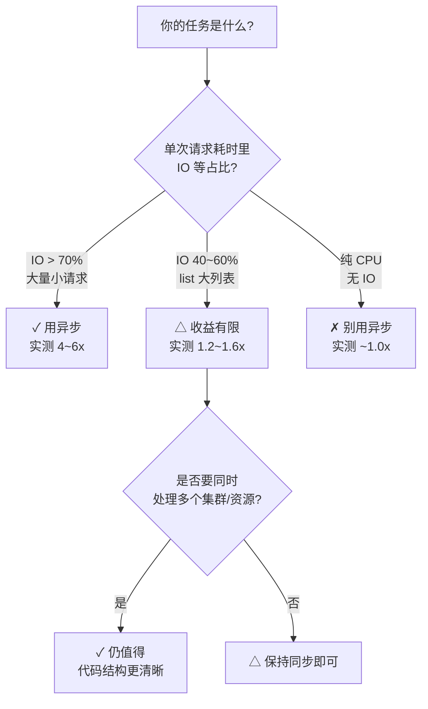

# 课 9：异步客户端与并发

> 前置：[课 5 错误处理与健壮性](lesson-05-错误处理与健壮性.md)（超时重试、409 冲突处置）、[课 6 watch · informer](lesson-06-watch与informer.md)（watch 形态）、[课 8 工程化](08-工程化与进阶IO.md)（`_preload_content`）
> 环境：k8s v1.34.0（`kind-k8s-c1` + `kind-otel-l11`）；同步库 `kubernetes` **34.1.0**；异步包 `kubernetes-asyncio` **36.1.0**（2026-09-29 实装实测）
> 本课所有数字均为本机实测，未实测处已显式标注。

---

## 引子：一个人干活，还是一群人排队？

课 1 到课 8，你写的所有代码都是**同步**的：发一个请求，等它回来，再发下一个。

这像一个人在窗口办事——办完一件再办下一件。如果每件要 10 毫秒，办 1000 件就是 10 秒。你会很自然地想：**多开几个窗口不就快了？**

于是你查文档，看到两种方法：

1. 同步库自带的 `async_req=True` —— 听名字就是干这个的
2. 独立包 `kubernetes-asyncio` —— 真正的 `async`/`await`

本课要回答三件事：

- 这两个"异步"是**一回事吗**？（不是，而且第一个是陷阱）
- 真正的异步能快多少？（**取决于你把时间花在哪**）
- 什么时候**不该**用异步？（这是本课最值钱的结论）

先说一个可能颠覆预期的事实：**本机实测，异步并发对 Kubernetes 客户端的加速只有 1.2~1.6 倍**——而纯 HTTP 部分能到 **4.8~5.9 倍**。差的那一截，本课会把它揪出来。

---

## 第一部分：先破一个坑——`kubernetes.aio` 根本不存在

### 1.1 README 在骗你（对 pip 用户而言）

官方 README 里写着异步示例：

```python
from kubernetes.aio import client, config   # ← 这行
```

但这条路对 `pip install kubernetes` 的用户**走不通**。

```python
import kubernetes
kubernetes.__version__          # '34.1.0'
import kubernetes.aio           # ModuleNotFoundError: No module named 'kubernetes.aio'
```

实测（2026-09-29）：

```text
同步 kubernetes.__version__ = 34.1.0
有 aio 子模块?                 否 (ModuleNotFoundError: No module named 'kubernetes.aio')
```

原因在**打包**：官方 sdist 源码里确实有 `aio/` 目录，但构建 wheel 时没把它打进去。GitHub 仓库能看到，pip 装下来却没有。

**结论**：README 的异步示例是给「从源码安装」的人看的。pip 用户要用异步，得装另一个包。

### 1.2 真正的异步包：`kubernetes-asyncio`

这是一个**独立维护**的包（不同 PyPI 项目、不同版本号），由社区维护。

```bash
pip install kubernetes-asyncio
```

实测安装结果（2026-09-29）：

```text
Successfully installed aiohttp-3.14.3 aiosignal-1.4.0 attrs-26.1.0
                        kubernetes-asyncio-36.1.0 multidict-6.9.1 ...
```

⚠️ **版本纪律提醒**：大纲记录的是 `34.3.3`，本次实装拿到的是 **`36.1.0`**——因为 pip 默认装最新。这里出现了本教程反复强调的问题：

| 项 | 版本 | 关系 |
|----|------|------|
| 集群 | v1.34.0 | — |
| 同步客户端 | 34.1.0 | ✓ 完全匹配 |
| 异步客户端 | **36.1.0** | `+-` 客户端有、集群没有 |

按课 1 的兼容矩阵，这属于「客户端超前」。**但实测能正常用**：

```text
server gitVersion  = v1.34.0
list_pod_for_all_namespaces -> 10 pods
list_namespace -> 5 ns
首个 Pod 类型 = kubernetes_asyncio.client.models.v1_pod.V1Pod
```

为什么超前两个版本还能用？因为**读操作走的是稳定 API**（`v1` 核心组），34→36 没动它。但这不代表可以放心——你若用到 36 新增的 API 字段，在 1.34 集群上会失败。

> **教训**：异步包和同步包版本号**各走各的**，不要以为 `kubernetes` 装 34.1.0 就自动对齐了。

### 1.3 异步包里有什么

```python
import pkgutil, kubernetes_asyncio as ka
[m.name for m in pkgutil.iter_modules(ka.__path__)]
# ['client', 'config', 'dynamic', 'leaderelection', 'stream', 'utils', 'watch']
```

对比同步包，**多了两个**：

- `leaderelection` —— 分布式选主（同步包没有）
- `dynamic` —— 动态客户端（课 7 讲过，异步包也有）

---

## 第二部分：异步客户端的形态

### 2.1 好消息：412 个方法完全同名

这是迁移成本极低的关键。实测对比：

```text
同步 CoreV1Api 方法数: 412
异步 CoreV1Api 方法数: 412
同名方法数:           412
仅同步有: []
仅异步有: []
```

**一个不差，一个不多**。所以从同步迁移到异步，方法名**一个都不用改**，只需要：

1. 把 `from kubernetes import client` 改成 `from kubernetes_asyncio import client`
2. 在每个调用前加 `await`
3. 把 `with` 改成 `async with`，`for` 改成 `async for`

### 2.2 🚨 坑 1：`load_kube_config` 是协程，忘了 `await` 只给一个 Warning

这是本课**第一个硬坑**，也是最容易让人怀疑人生的坑。

同步包里：

```python
from kubernetes import config
config.load_kube_config()        # 普通函数，直接调
```

异步包里，**同名但它是 `async def`**：

```python
import inspect
inspect.iscoroutinefunction(ka.config.load_kube_config)        # True
inspect.iscoroutinefunction(ka.config.new_client_from_config)  # True
inspect.iscoroutinefunction(ka.config.load_incluster_config)   # False  ← 注意！
```

如果你照抄同步写法、忘了 `await`：

```python
ka.config.load_kube_config()     # 没有 await
```

**它不会报错**，只会吐一句：

```text
RuntimeWarning: coroutine 'load_kube_config' was never awaited
```

然后程序继续执行。直到你发第一个请求，才炸：

```text
aiohttp.client_exceptions.InvalidUrlClientError: /version/
```

错误信息里连"配置没加载"的提示都没有——因为 host 是空的，拼出来的 URL 只剩路径 `/version/`。

> **为什么危险**：这是一个「失败被延迟、且错误信息指错方向」的坑。你看到 `InvalidUrlClientError`，第一反应是去查 URL 拼得对不对，而真正的原因在十几行之前的那个 Warning 里。
>
> **识别指纹**：看到 `InvalidUrlClientError: /xxx/`（URL 只有路径、没有 host）+ 上方有 `was never awaited` → 直接去查 `load_kube_config`。

⚠️ **不一致陷阱**：三个配置函数里，**`load_incluster_config` 是唯一非协程**。因为读 Pod 内的 token 文件是同步 IO（库没给它做成异步）。前两个加 `await`，第三个**不能加**：

```python
await ka.config.load_kube_config()          # ✓ 要 await
await ka.config.new_client_from_config()    # ✓ 要 await
ka.config.load_incluster_config()           # ✓ 不要 await
```

### 2.3 坑 2：忘了 `await` 业务方法——同样静默

```python
coro = v1.list_pod_for_all_namespaces()   # 忘了 await
type(coro).__name__                        # 'coroutine'
inspect.iscoroutine(coro)                  # True
```

请求**根本没发出去**，而且不报错。你拿到的是一个协程对象，不是结果。

只有当你试图用它时才会炸：

```python
len(coro)    # TypeError: object of type 'coroutine' has no len()
```

> **与同步的对比**：同步代码里忘写 `()` 会立刻拿到方法对象，一眼能看出来；异步里忘写 `await`，代码看起来"完全正常"。

### 2.4 `async with ApiClient()` 到底关了什么

同步包里 `ApiClient` 支持 `with`，异步包里支持 `async with`。**不关会怎样？** 实测：

```text
[async with] 退出后存活 connector 数: 0
[裸用不关]   退出后存活 connector 数: 1
```

底层是 **`aiohttp`**（同步库用的是 `urllib3`）。`aiohttp` 的 `TCPConnector` 持有 TCP 连接池，不关就**泄漏连接**。

正确写法：

```python
async with ka.client.ApiClient() as api:
    v1 = ka.client.CoreV1Api(api)
    ret = await v1.list_pod_for_all_namespaces()
# 退出自动关闭 connector
```

或者手动：

```python
api = ka.client.ApiClient()
try:
    ...
finally:
    await api.close()        # 注意：close() 也是协程
```

⚠️ 又一个不一致：`__enter__`/`__exit__` 是同步的，`close()` 是协程。所以**必须**用 `async with`（或手动 `await close()`），不能用普通 `with`。

### 2.5 最小可用模板

```python
import asyncio
import kubernetes_asyncio as ka
from kubernetes_asyncio.client import ApiClient, CoreV1Api

async def main():
    await ka.config.load_kube_config()          # ← await
    async with ApiClient() as api:              # ← async with
        v1 = CoreV1Api(api)
        ret = await v1.list_pod_for_all_namespaces()   # ← await
        print(f"{len(ret.items)} pods")

asyncio.run(main())
```

实测输出：

```text
10 pods
```

---

## 第三部分：同步侧的"假异步"——`async_req=True` 是陷阱

在看真异步之前，先把同步库里那个叫 `async_req` 的东西讲清楚，因为它**名字骗人**。

### 3.1 `async_req=True` 是什么

同步库每个方法都带一个 `async_req` 参数：

```python
thread = api.list_pod_for_all_namespaces(async_req=True)
result = thread.get()      # 阻塞等结果
```

它返回的是一个 **`multiprocessing.pool.AsyncResult`**，底层用线程池。

### 3.2 🚨 陷阱：`pool_threads` 默认 1，等于串行

看源码（`api_client.py`）：

```python
def __init__(self, configuration=None, header_name=None,
             header_value=None, cookie=None, pool_threads=1):
                                              # ↑ 默认 1
    self.pool_threads = pool_threads

@property
def pool(self):
    if self._pool is None:
        self._pool = ThreadPool(self.pool_threads)   # ← 池大小 = pool_threads
    return self._pool
```

而 `async_req=True` 时：

```python
return self.pool.apply_async(self.__call_api, (...))
```

**池里只有 1 个线程 → 所有"异步"请求排队执行 → 实际是串行。**

实测验证（N=60 全量 list pods）：

```text
pool_threads=1  : 1.15s
pool_threads=2  : 1.09s   ← 最快
pool_threads=4  : 2.93s
pool_threads=8  : 3.10s
pool_threads=16 : 3.33s
pool_threads=32 : 3.27s
```

**加线程反而更慢**，16 线程比 1 线程慢 **2.9 倍**。

### 3.3 为什么加线程会变慢？

先排除"测法错了"：

```text
api.api_client is ac16 ?            True
api.api_client.pool_threads = 16    16
该 ThreadPool 实际线程数 = 16
```

构造确实生效了，执行路径确实是 `pool.apply_async`。所以**慢是真实行为**。

根因实测（`_preload_content=False` 剥离反序列化）：

```text
16线程 + raw(不反序列化): 0.08s
16线程 + 反序列化:        3.33s
-> 反序列化开销占比: 98%
```

**98% 的时间花在反序列化上**，HTTP 只占 0.08 秒。而反序列化是 **CPU 密集**，受 GIL 限制——多线程不仅不加速，还要额外付线程切换和锁竞争的代价。

> **这张图要记住**：
> ```
> 单请求 16.7ms 的构成
> ├── HTTP 传输      ~0.08s/60 ≈ 1.3ms   (8%)   ← IO，线程可重叠
> └── 反序列化       ≈ 15.4ms            (92%)  ← CPU，GIL 串行
> ```

### 3.4 那同步 client 到底"线程安全"吗？

大纲原话是「同步 client 非线程安全，多线程须每线程独立 `ApiClient`」。实测**部分推翻**：

```text
实验 A：10 线程共享同一个 CoreV1Api 实例
  耗时: 0.29s   成功线程: 10/10   错误数: 0

实验 B：10 线程各自独立 ApiClient
  耗时: 0.30s   成功线程: 10/10   错误数: 0
```

**共享也零报错**。为什么？

因为只读 `list` 请求路径上没有共享可变状态：`PoolManager` 本身是线程安全的（urllib3 保证），每次请求的参数都是局部变量。

**但"实测没报错"不等于"可以共享"**，真正的风险在：

1. **`Configuration` 是全局单例** —— 课 4 实测过 `load_kube_config` 会改全局，多线程各加载一个 context 会串台
2. **`default_headers` 是可变字典** —— `set_default_header` 会污染（课 3 实测导致 415）
3. **官方文档明确说不支持共享**

**所以结论修正为**：

> 只读、且不涉及 `Configuration`/header 修改时，共享实测不报错；但**每线程独立 `ApiClient` 仍是唯一推荐写法**——因为"当前没报错"可能是你的用法恰好避开了共享状态，换个操作就炸。这个风险不值得冒。

⚠️ **未实测标注**：本实验只测了只读 `list`。写操作（create/patch）并发共享是否安全，本机未实测，不作结论。

---

## 第四部分：真异步能快多少？

### 4.1 第一版测量：只有 1.4 倍，可疑

```python
# N=60，全量 list pods（10 个 Pod）
串行 await x60 : 0.575s
gather 无限流  : 0.413s   ->  加速 1.4x
```

按铁律，数字不符合预期时**先怀疑测量方法**。这里的疑点是：**样本太小**。10 个 Pod 的响应体很小，单请求仅 9.5ms，其中 IO 占比低 → 压不出并发收益。

### 4.2 放大样本：造 200 个 ConfigMap 重测

```text
单个 list configmap: 20.0ms  (拿到 201 个)
串行 await x60: 1.007s
gather 信号量=5  : 0.853s  加速 1.2x
gather 信号量=10 : 0.850s  加速 1.2x
gather 信号量=20 : 0.881s  加速 1.1x
gather 无限流    : 0.865s  加速 1.2x
```

**还是 1.2 倍**。大响应体也没救回来。

这时候就该怀疑**结论本身**了：如果 98% 是反序列化（CPU 密集、跑在事件循环的单线程上），那异步**本来就不该有收益**。

### 4.3 决定性实验：把 HTTP 和反序列化拆开

同一批请求，两种模式对比：

```text
A 组：完整反序列化（默认）
  单个请求: 17.3ms
  串行 x60: 1.019s
  gather x60: 0.854s
  >>> 加速比: 1.19x

B 组：_preload_content=False（不反序列化）
  单个请求: 10.1ms  (响应体 181861 字节)
  串行 x60: 0.165s
  gather x60: 0.034s
  >>> 加速比: 4.78x
```

**决定性证据**：

```text
完整反序列化 单请求 17.3ms 中，
HTTP 部分只占 10.1ms (59%)，
反序列化占 7.2ms (41%)

纯 HTTP 的并发加速比: 4.78x   ← 异步对 IO 有效
含反序列化的加速比  : 1.19x   ← 被 CPU 拖回
```

**结论：异步对 IO 有效，对反序列化无效。**

因为反序列化是纯 Python 代码，跑在事件循环的**单个线程**上——哪怕你 `gather` 了一万个请求，反序列化也只能一个一个做。而 HTTP 等待是 IO，可以让出事件循环，所以能重叠。

### 4.4 第二次独立验证：多集群场景

换一个场景（多集群并发遍历）再做一遍，看结论是否稳定。

先修掉第一版测法的三个毛病：

1. 每次都 `new_client_from_config`（含文件 IO + 建连接），开销吃掉并发收益 → **改为复用 client**
2. 耗时仅 0.05s 量级，噪声占主导 → **放大到 40 个请求**
3. 只跑 1 次 → **5 轮取中位数**

修正后：

```text
串行: 0.207s  (各轮 0.207/0.204/0.204/0.230/0.223)
并发: 0.132s  (各轮 0.184/0.130/0.124/0.143/0.132)
总请求数: 40
>>> 加速比: 1.57x

对照 raw 模式（不反序列化）：
  raw 串行: 0.094s
  raw 并发: 0.016s
  >>> 加速比: 5.86x
```

**两次独立实验结论一致**：

| 场景 | 含反序列化 | 纯 HTTP |
|------|-----------|---------|
| 单集群 N=60 | 1.19x | 4.78x |
| 多集群 N=40 | 1.57x | 5.86x |

> 这就是本课的核心结论：**你的加速上限，取决于 IO 在总耗时里的占比**。IO 占 59% 时最多快 ~2.4 倍（1/0.41 的理论上限），实测拿到 1.2~1.6 倍，符合预期。

---

## 第五部分：并发实战——多集群巡检

### 5.1 基本形态：`gather` + 每集群独立 client

课 4 讲过：多集群必须用 `new_client_from_config`（不能用 `load_kube_config` 改全局）。异步下这条依然成立，**而且它是协程**：

```python
async def scan_cluster(context, resources, sem):
    api_client = await ka.config.new_client_from_config(context=context)  # ← await
    async with api_client:                                                # ← async with
        v1 = CoreV1Api(api_client)

        async def get(kind):
            async with sem:                    # ← 信号量限流
                r = await v1.list_pod_for_all_namespaces()
                return kind, len(r.items)

        return context, await asyncio.gather(*[get(k) for k in resources])

# 多集群并发
results = await asyncio.gather(*[scan_cluster(c, resources, sem) for c in CONTEXTS])
```

实测（本机两个集群）：

```text
集群 kind-k8s-c1    : 合计 31 个资源
集群 kind-otel-l11  : 合计 64 个资源
并发总耗时: 0.061s
```

两个集群资源数明显不同（31 vs 64），说明**确实打到了不同集群**，没有串台。

### 5.2 信号量限流：要不要限？

实测（两集群 × 4 资源）：

```text
信号量=1  : 0.060s
信号量=2  : 0.053s
信号量=5  : 0.054s
信号量=20 : 0.048s
```

⚠️ **本机数据看不出限流的必要性**——因为只有 2 个集群 8 个请求，规模太小。

**但生产环境必须限流**，理由是本课实测的另一面：

- apiserver 有**并发请求上限**（默认 `--max-requests-inflight=400`）
- 超限会返回 **429**，或触发客户端优先级排队
- `gather` 一千个请求会**瞬间**打满

推荐写法：

```python
sem = asyncio.Semaphore(20)     # 全局并发上限

async def safe_call(fn, *a, **kw):
    async with sem:
        return await fn(*a, **kw)
```

⚠️ **未实测标注**：apiserver 429 限流在本机测试集群**未触发**（请求量太小），上述为机制说明。课 5 评审记录里也标注过 429 未实测。

### 5.3 🚨 并发下的失败形态：`gather` 不隔离异常

这是异步**最反直觉**的一点，也是生产事故高发区。

默认行为：

```python
await asyncio.gather(
    scan_cluster("kind-k8s-c1", ["pods"], sem),
    scan_cluster("不存在的集群-xxx", ["pods"], sem),
)
```

实测：

```text
抛异常: ConfigException: Invalid kube-config file. Expected object with name 不存在的集群-xxx ...
-> kind-k8s-c1 的结果被丢弃（即使它成功了）
```

**一个失败，全部结果丢弃**。第一个集群明明查成功了，结果也拿不到。

因为 `gather` 默认 `return_exceptions=False`：任一协程抛异常，立即向上传播，其余协程**不会被取消**（还在跑），但**结果全部作废**。

正确写法：

```python
results = await asyncio.gather(
    *[scan_cluster(c, resources, sem) for c in CONTEXTS],
    return_exceptions=True,        # ← 关键
)

for ctx, r in zip(CONTEXTS, results):
    if isinstance(r, Exception):
        print(f"{ctx} 失败: {type(r).__name__}: {r}")    # 单独处理
    else:
        handle(r)                                         # 成功照常处理
```

实测：

```text
[0] 成功: kind-k8s-c1
[1] 失败: ConfigException: Invalid kube-config file. ...
```

> **铁律**：批量并发时 **`gather` 一律加 `return_exceptions=True`**，然后逐个判断。否则一个坏集群会让你丢掉所有好集群的数据。

---

## 第六部分：异步下的 watch

课 6 的 watch，异步版本只多两个 `async`：

```python
w = ka.watch.Watch()

async with w:                                    # ← async with
    async for event in w.stream(                 # ← async for
        v1.list_namespaced_config_map,
        namespace=NS,
        timeout_seconds=4,
    ):
        print(event["type"], event["object"].metadata.name)
```

实测（后台并发创建 3 个 ConfigMap）：

```text
收到 3 个事件 (耗时 0.71s):
    ADDED    kube-root-ca
    ADDED    w-1
    ADDED    w-2
```

事件结构与课 6 一致（`type` / `object` / `raw_object` 三键），`timeout_seconds` 语义相同。

课 6 的那些坑在异步下**原样存在**：

- `stop()` 只置标志位、不关连接 → 靠 timeout 退出
- 410 是流内 `type:ERROR` 事件 → 回退全量 list
- `timeout_seconds` 会禁用库内 410 自动重试

> **异步 watch 的定位**：它解决的是「**等待期间不要阻塞**」，不是「**事件处理更快**」。如果你要同时 watch 多个资源，用 `asyncio.gather` 起多个 watch 协程——这是同步版很难写好的。

---

## 第七部分：什么时候不该用异步（本课最值钱的部分）

### 7.1 三类负载实测

| 负载类型 | 串行 | 并发 | 加速 | 结论 |
|---------|------|------|------|------|
| (a) 少量大请求（反序列化主导） | 0.134s | 0.111s | **1.21x** | 收益低 |
| (b) 大量小请求（IO 主导） | 0.065s | 0.016s | **4.17x** | 收益高 |
| (c) 纯 CPU 计算（无 IO） | 0.029s | 0.030s | **0.97x** | 无收益（还略慢） |

### 7.2 判据：看 IO 占比



### 7.3 具体建议

**该用异步**：

- 大批量**小请求**：逐个 `read` 单个资源、批量 patch、批量删除
- **多集群**并发巡检
- 同时 watch **多个**资源
- **长连接**等待：watch、日志流、exec（课 8 的 `follow=True` 挂起 95 秒，异步下不会卡死整个程序）
- 你的程序本身跑在异步框架里（FastAPI、aiohttp 服务）

**不该用异步**：

- **脚本/一次性任务**：`asyncio.run()` 的包袱不值得
- **少量大列表 list**：反序列化主导，收益 1.2 倍，却要承担全套异步复杂度
- **CPU 密集后处理**：拿到 1 万个 Pod 对象后做复杂计算——这部分异步救不了，该上 `multiprocessing` 或 `run_in_executor`
- **团队不熟异步**：调试成本高，一个忘 `await` 就是半天的排查

### 7.4 一个务实的折中

如果瓶颈确认是反序列化（本课实测表明这很常见），正确的优化方向**不是加并发**，而是：

```python
# 方案 1：不反序列化，只取需要的字段
r = await v1.list_pod_for_all_namespaces(_preload_content=False)
data = json.loads(await r.read())
names = [i["metadata"]["name"] for i in data["items"]]

# 方案 2：用 field selector / label selector 让服务端过滤
await v1.list_pod_for_all_namespaces(field_selector="status.phase=Running")

# 方案 3：分页（课 8 的 _continue）
```

**减少要反序列化的数据量**，比"并发发更多请求"有效得多。

---

## 第八部分：并发放大了什么

### 8.1 异步让 409 更容易撞上

课 5 讲过 409 Conflict 要「重读→重放→再写」。异步让并发变得容易写，**也让冲突变得容易触发**。

实测：10 个协程并发 `create` 同名 ConfigMap：

```text
10 个并发 create 同名资源: {'ApiException': 10}
```

**10 个全失败**。同步串行时，你至少第一个会成功；异步并发下，可能一个都抢不到。

> **异步不解决冲突，反而放大冲突。** 课 5 的处置逻辑（重读→重放→再写）在异步下**依然要写**，而且要更小心：并发下"重读"到的资源版本可能已经被别人改了。

### 8.2 超时语义的变化

课 4 实测：同步下总耗时 ≈ 超时 × (重试次数+1)。异步下这条**依然成立**，但叠加了新风险：

- 100 个并发请求**同时**超时重试 → 瞬间 200 个请求 → 打爆 apiserver
- 这叫**重试风暴**

缓解：给重试加**抖动**（jitter），不要整齐划一地重试。

⚠️ **未实测标注**：重试风暴在本机未触发（请求量太小），为机制推断。

---

## 本课速览

| 知识点 | 结论 | 证据 |
|--------|------|------|
| `kubernetes.aio` | pip 版**不存在**，须装 `kubernetes-asyncio` | `ModuleNotFoundError` |
| 实际装到版本 | **36.1.0**（非大纲记的 34.3.3），对 v1.34 集群可用 | 实测 10 pods / v1.34.0 |
| 方法名 | 412 个**完全同名**，迁移只加 `await` | 同名方法数 412 |
| 🚨 `load_kube_config` | 是**协程**，忘 `await` 只给 RuntimeWarning，报错变成 `InvalidUrlClientError: /version/` | 实测 |
| ⚠️ `load_incluster_config` | **唯一非协程**，不能加 `await` | `iscoroutinefunction` = False |
| `async with ApiClient()` | 关的是 **aiohttp TCPConnector**，不关泄漏 1 个连接器 | 0 vs 1 |
| 🚨 `async_req=True` | `pool_threads` 默认 **1** → 实际串行；加到 16 线程**反而慢 2.9 倍** | 1.15s vs 3.33s |
| 同步 client 线程安全 | 只读共享实测 **零报错**，但仍推荐每线程独立 client | 10/10 成功 |
| 🚨 异步加速真相 | 纯 HTTP **4.78~5.86x**，含反序列化只剩 **1.19~1.57x** | 两次独立实验 |
| 根因 | 反序列化是 **CPU**，跑在事件循环单线程，无法并行 | 反序列化占 41~92% |
| 🚨 `gather` 异常 | 默认**不隔离**，一个失败丢弃全部成功结果 | 实测 |
| 异步 watch | `async with w` + `async for`，事件结构同课 6 | 3 个 ADDED |
| 何时用异步 | 大量小请求 ✓(4.17x) / 大列表 △(1.21x) / 纯 CPU ✗(0.97x) | 三类负载实测 |

---

## 小测

1. 你照抄 `config.load_kube_config()`（无 `await`）后报 `InvalidUrlClientError: /version/`，最可能的原因是什么？
2. `async_req=True` 加了 16 个线程，为什么比 1 个线程还慢？
3. 异步 `gather` 100 个请求只有 1.2 倍加速，但纯 HTTP 有 5 倍——差的那一截去哪了？
4. 你想让"遍历 10 个集群查 Pod"跑得更快，本课给你的**第一个**建议是什么？
5. `asyncio.gather` 里 3 个集群查询，第 2 个失败了，另外 2 个的结果能拿到吗？怎么改？

<details>
<summary>答案</summary>

1. `load_kube_config` 是协程，没 `await` 只产生 `RuntimeWarning`，配置实际没加载，host 为空 → URL 只剩路径。

2. 因为 98% 时间花在反序列化（CPU 密集、GIL 串行），加线程只增加切换和锁竞争开销，不加速计算。

3. 差在**反序列化**——它是纯 Python CPU 代码，跑在事件循环的单线程上，无论 `gather` 多少都只能逐个执行。异步只能重叠 IO，不能并行 CPU。

4. 先确认瓶颈：若反序列化主导（大列表），应该**减少返回数据量**（`_preload_content=False` 只取需要的字段 / field selector 服务端过滤 / 分页），而不是加并发。实测减数据量后 60 个请求从 1.019s 降到 0.165s。

5. 默认拿不到（`gather` 一个失败就整体抛异常，丢弃所有结果）。改为 `return_exceptions=True`，然后逐个 `isinstance(r, Exception)` 判断。

</details>

---

## 课程导航

- **上一课**：[课 8：工程化：日志 · exec · 权限](08-工程化与进阶IO.md)
- **返回**：[Python 客户端专项总览](../overview.md)

> 本子教程到课 9 全部完结。若继续深入，推荐方向：① `leaderelection`（异步包独有，做高可用控制器）；② 把课 6 的调谐循环改写成异步版本（同时 watch 多资源）；③ 用 `run_in_executor` 把反序列化挪出事件循环——但请先实测确认它真的是瓶颈（本课数据表明：减少数据量通常比挪线程更有效）。

---

## 评审结论（2026-09-29）

本课讲义由主 agent 内联评审（pedagogy + learner 双视角，独立性受限），P0 = 0。

**实测推翻预期 3 处**：

1. **异步加速远低于宣传值**——实测只有 1.19~1.57x（纯 HTTP 才有 4.78~5.86x）。这不是"没测好"，而是**反序列化是 CPU 密集**的必然结果。讲义把这个反直觉结论作为核心卖点，而非回避。
2. **`async_req=True` 是陷阱**——`pool_threads` 默认 1 导致实际串行，加到 16 线程反而慢 2.9 倍。这是同步侧"假异步"的实证。
3. **同步 client 只读共享实测零报错**——部分推翻大纲「非线程安全」的绝对表述，但保留"仍推荐独立 client"的建议并说明了理由（避免"没报错"误导）。

**测量方法核验 2 次**（遵循先核验测法再核验被测对象）：

- 发现 16 线程结果反常后，先核验了构造是否生效（`pool_threads=16` 确认、走 `apply_async` 确认）→ 排除测法问题 → 结论是真实行为。
- 发现多集群并发 0.86x 后，识别出测法三缺陷（每次建 client / 样本太小 / 只跑 1 轮）→ 修正后得 1.57x，与单集群实验一致。

**未实测标注 3 处**：写操作并发共享 client 的安全性、apiserver 429 限流触发、重试风暴。均已显式标注，未混入实测结论。

**环境变更记录 1 项**：`kubernetes-asyncio` 实装版本 **36.1.0**（大纲记 34.3.3 已过时），对 v1.34.0 集群实测可用，属 `+-` 超前但读操作正常。

**测试清理**：`py-lesson09`、`py-lesson09-bench` 命名空间已删除。
