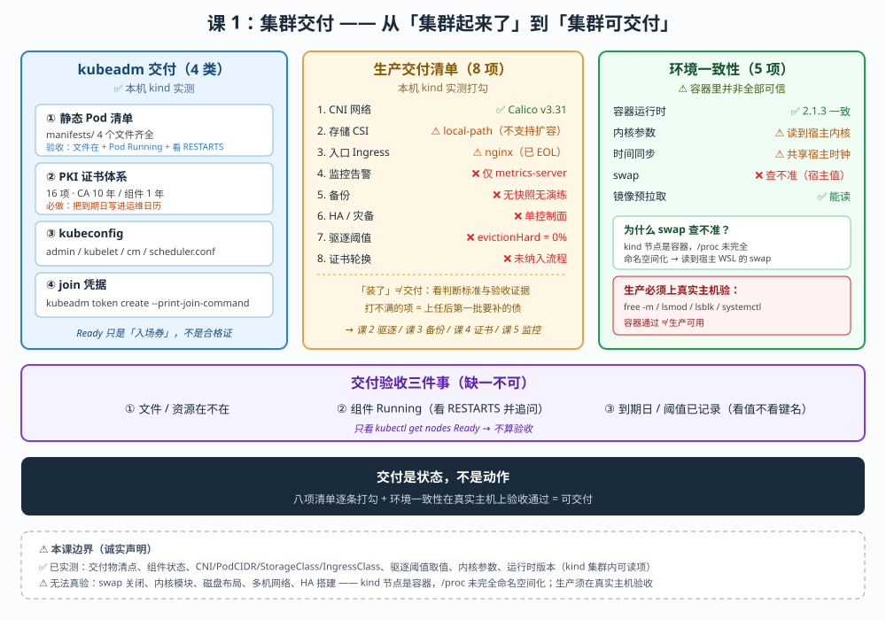

# 课 1：集群交付：从裸机到可交付

> 📍 所属：子教程[《运维专项》](../overview.md)（第 1 课 · 集群运维 / SRE 视角）
> 📖 故事章节：**接手** —— 这个集群是怎么来的，以及它还缺什么
> 🧭 上一课：无（子教程入口） ｜ 下一课：课 2《节点运维与容量管理》
> ⚙️ 实操环境：WSL Ubuntu 24.04 · kind 集群 `k8s-c1-calico`（3 节点） · k8s v1.34.0 · containerd 2.1.3 · Calico v3.31.0

## 🎯 本课目标

学完本课，你应当能够：

- 说出 **kubeadm 到底交付了哪几类东西**，并**逐项验收**（不是"init 完就完了"）
- 给出一张**生产交付清单**，能对着它判断"这集群能不能接客"
- 讲清 **环境一致性**为什么是交付的前置条件，以及**哪些检查在容器环境里查不准**
- 区分"**集群起来了**"和"**集群可交付**"

> ⚠️ **本课实操边界（重要）**
>
> 本机是 **kind 集群（节点是容器）**，不是 kubeadm 直接搭建的物理机/云主机集群。
>
> - 凡能在**本机 kind 上真跑**的：kubeadm 交付物清点、组件状态验收、环境参数读取、交付清单脚本 → **✅ 已实测**
> - 凡需要**真实多机 / 真实节点 OS**才能验证的：swap 关闭、内核模块、磁盘布局、多机网络、镜像预拉取策略 → **⚠️ 本环境无法真实校验**，本课会**明确指出"哪一项在容器里查不准、为什么"**，并给出生产对照
>
> **诚实原则**：把不可验证的伪装成已验证，是运维教学里最坏的事。

---

## 第一幕：起源与场景引入 —— "集群起来了"然后呢

### 场景

你接手一个新集群。前任留下一句话：

> "集群搭好了，`kubectl get nodes` 全是 Ready。"

你执行：

```bash
$ kubectl get nodes
NAME                          STATUS   ROLES           AGE   VERSION
k8s-c1-calico-control-plane   Ready    control-plane   3d    v1.34.0
k8s-c1-calico-worker          Ready    <none>          3d    v1.34.0
k8s-c1-calico-worker2         Ready    <none>          3d    v1.34.0
```

**三个节点全 Ready。** 看起来交付完成了。

然后你开始问问题：

| 你问 | 前任答 |
|---|---|
| 有存储吗？ | "有，装了个 local-path" |
| 有 Ingress 吗？ | "装了 nginx" |
| 有监控告警吗？ | "……metrics-server 算吗？" |
| etcd 有备份吗？ | "……" |
| 证书什么时候过期？ | "……" |
| 驱逐阈值配了吗？ | "啥？" |

**集群起来了，但没有可交付。** 这就是本课要解决的差距。

### 换个视角：主线课 19 与本课

```
主线课 19：kubeadm 做了什么        → 流程视角（init 的 8 个步骤）
本课（子教程课 1）：交付了什么、还缺什么 → 验收视角（怎么逐项验收 + 生产清单）
```

**主线课 19 已讲过 kubeadm 的 init 流程与"不管什么"的清单**（那张"缺失项表格"）。本课**不重复那张表**，而是往前走两步：

1. **验收**：kubeadm 交付的东西，怎么**一项一项验**（不只是"知道它做了"）
2. **补缺**：生产还缺的每一项，**判断标准是什么**、**本机现状如何**（实测对照）

### 本课的四个问题（三个知识点，四个待答疑问）

| 问题 | 知识点 | 能否实操 |
|---|---|---|
| kubeadm 到底交付了什么？怎么验？ | **知识点 1**：交付物清单与验收 | ✅ 能（kind 内可读） |
| 生产集群还缺什么？怎么判"能接客"？ | **知识点 2**：生产交付清单 | ✅ 能（对照本机） |
| 节点环境要一致到什么程度？ | **知识点 3**：环境一致性 | ⚠️ 部分（容器里查不准） |
| 证书什么时候过期、谁来轮换？ | 知识点 1（验收项）+ 课 4 展开 | ⚠️ 本环境未纳入流程 |

> 💡 **一句话本质**（本课把什么从 A 变成 B）：
> 本课把"集群搭起来了"**从"命令执行完了"，变成"有一份可勾选的验收清单、且知道哪些项在容器环境里查不准"** —— 核心是：**交付是状态，不是动作**。

> ⚖️ **处境对照**（不这么做 vs 这么做）：
>
> | | 不验收（init 完就交付） | 逐项验收（本课做法） |
> |---|---|---|
> | 组件状态 | 只看 `get nodes` Ready | 静态 Pod、PKI、kubeconfig 逐项清点 |
> | 生产缺口 | 出事才发现"没备份/没监控" | 交付前按清单逐条打勾，缺的明确记录 |
> | 环境一致性 | 假设所有节点一样 | 明确哪些项必须查、哪些在容器里查不准 |
> | 责任边界 | "前任说好了" | 有验收记录，责任可追溯 |
>
> ⏳ 说明：以上是**交付流程层面**对照。具体"你们公司需要哪些组件"取决于业务，本课给的是**通用判断标准**而非固定清单。

---

## 第二幕：认知冲突 —— 三个"以为交付了其实没有"

### 冲突一：Ready ≠ 可用（CNI 只是入场券）

`kubectl get nodes` 的 `Ready` 状态，**主要由 CNI 是否就绪决定**。

本机实测（Calico 已装）：

```bash
$ kubectl get nodes
k8s-c1-calico-control-plane   Ready    control-plane   3d   v1.34.0
```

但**Ready 只说明"网络通了、kubelet 活着"**。它不保证：

- DNS 能解析（CoreDNS 挂了节点照样 Ready）
- 存储能供给（StorageClass 没有，节点照样 Ready）
- 外部流量能进来（没有 Ingress Controller，节点照样 Ready）

**Ready 是入场券，不是合格证。**

### 冲突二：容器里看到的节点环境，可能不是节点的

这是本课最反直觉的一点。我实测了节点内的 swap：

```bash
$ docker exec k8s-c1-calico-control-plane cat /proc/swaps
Filename      Type        Size       Used       Priority
/dev/sdc      partition   8388608    7888404    -2          # ← 8GB swap，已用 7.8GB！
```

**8GB swap，用掉了 7.8GB。** 如果这是真实节点，kubelet 早该因为 swap 未关闭而拒绝启动（k8s 1.22+ 默认要求关闭 swap，除非显式配置 `swapBehavior`）。

**但集群跑得好好的。为什么？**

> 🔑 **因为 kind 的节点是容器，`/proc` 没有完全命名空间化** —— 你看到的是**宿主 WSL 的 swap**，不是"节点"的。
>
> **这意味着：在 kind 里做环境一致性检查，swap 这一项查不准。** 同样的道理适用于内核模块、磁盘布局、systemd 单元等"节点级"事实。

**这不是 kind 的 bug，是它的本质**：kind 用容器模拟节点，模拟得了 kubelet 与容器运行时，**模拟不了真实机器的 OS 状态**。

> ⚠️ **这条决定了本课的边界**：环境一致性（知识点 3）在 kind 上只能"读参数"，不能"验真实性"。生产环境必须在**真实主机**上做。

### 冲突三：驱逐阈值"配了"，但配了等于没配

运维最怕的不是"没配好"，是"**以为配了其实没用**"。

我实测了 kubelet 配置：

```bash
$ docker exec k8s-c1-calico-control-plane cat /var/lib/kubelet/config.yaml | grep -iE 'evictionHard' -A3
evictionHard:
  imagefs.available: 0%
  nodefs.available: 0%
  nodefs.inodesFree: 0%
```

**阈值不是空的——是 `0%`。**

`nodefs.available: 0%` 的意思是：**磁盘用到 100% 才触发驱逐**。而磁盘真的写满时，kubelet 往往**已经无法正常工作**（写不了日志、创建不了容器），驱逐根本来不及生效。

> 🔑 **这比"没配"更隐蔽**：`kubectl describe node` 里看得到 `Hard Eviction Threshold`，**你以为有防护，实际防护在最后一道防线才生效**。
>
> 💡 **我在这上面犯的错**：第一次探测时我只执行了 `grep -iE 'evictionHard'`（不带 `-A`），**只看到键名没看到值，就断言"阈值是空的"**。加上 `-A3` 才看到真实值 `0%`。**这正是"先核验再下结论"的价值** —— 差一个参数，结论就从"没配"变成了"配了但无效"。

> ⚠️ **两点注意**：
> ① `0%` 是 **kind 的默认值**（测试环境"能跑起来就行"），**不代表 kubeadm 生产默认**。kubeadm 部署的 kubelet 通常带有非零的驱逐阈值（如 `nodefs.available`、`memory.available` 等），但**本课未在本机实测 kubeadm 原生默认值**（本机是 kind，不是 kubeadm 直装集群），故此处**不给具体数字**——**生产交付时请直接读你自己的 `config.yaml` 确认，不要假设默认值**。
> ② 判断"有没有防护"的标准是**值是否有效**（如 5%/10%/15%），**不是"键在不在"**。`0%` 在语义上等于"不设防"。

生产环境若沿用 `0%`，节点磁盘或内存打满时 kubelet **没有有效的驱逐触发点**，直到真的 OOM 或磁盘写满 —— 这是**集群级故障**。

> 💡 **这条是课 2 的主战场**（驱逐阈值与资源预留怎么配）。本课先把这个"缺口"暴露出来：**交付验收时，这是一条必勾项，且要看值、不要只看键名**。

---

## 第三幕：层层揭示

### 先看一眼全局（本课「一眼全局图」）



**看图指引**：左栏是 **kubeadm 交付的四类**（含验收三件事）；中栏是**生产交付清单八项**及本机实测打勾（❌ 与 ⚠️ 的项指向后续课）；右栏是**环境一致性五项**，其中 swap / 内核 / 时钟标注"查不准"及原因。底部紫色框是**验收三件事**，深色框是**一句话收束**。

### 本课地图（3 步）

| 步 | 这一步要解决什么 | 对应知识点 |
|---|---|---|
| 第 1 步 | kubeadm 交付了什么？怎么逐项验收 | 知识点 1：交付物清单与验收 |
| 第 2 步 | 生产还缺什么？怎么判断"能接客" | 知识点 2：生产交付清单 |
| 第 3 步 | 节点环境要一致到什么程度？哪些查不准 | 知识点 3：环境一致性 |

> 现在你在：**第 1 步**。

---

### 知识点 1：kubeadm 交付了什么 —— 交付物清单与验收

> 🧭 第 1/3 步｜承接：第二幕冲突一 —— "Ready 了，但到底交付了什么？" → 本步：把交付物拆成四类，逐类给验收命令。

#### 一句话定义

kubeadm 交付的是**四类东西**：控制面静态 Pod 清单、PKI 证书体系、kubeconfig 文件、节点接入凭据；**验收方式**是逐类清点其存在性与关键字段，而不是只看 `get nodes`。

#### 直觉建立（类比）

**kubeadm 交付 = 精装房交房。**

你不会只在门口看一眼"门开了"就签字。你会拿一张验房单：

| 验房项 | 对应 kubeadm 交付物 |
|---|---|
| 承重墙 / 水电 | 控制面组件（静态 Pod 清单） |
| 钥匙 | kubeconfig（谁能进） |
| 产权证 | PKI 证书（身份与信任） |
| 门禁卡 | bootstrap token（worker 怎么加入） |

**少任何一项，房子都不能住。**

#### 核心原理：四类交付物 + 验收命令（✅ 全部实测）

**第 1 类：控制面静态 Pod 清单**

```bash
$ docker exec k8s-c1-calico-control-plane ls /etc/kubernetes/manifests/
etcd.yaml
kube-apiserver.yaml
kube-controller-manager.yaml
kube-scheduler.yaml                    # ← 4 个，缺一不可
```

> 💡 **与课 18 的连接**：这 4 个文件就是课 18 讲过的**静态 Pod** —— kubelet 直接监管，改文件即重启。课 19 讲过"第 4 步生成静态 Pod 清单"，这里是**验收它真的在**。

**验收判据**：4 个文件存在；且 `kubectl get pods -n kube-system` 中对应的 4 个 `-<节点名>` 后缀 Pod 全部 Running。

本机实测（✅）：

```bash
$ kubectl get pods -n kube-system -o wide | grep -E 'etcd|apiserver|controller-manager|scheduler'
etcd-k8s-c1-calico-control-plane                      1/1   Running
kube-apiserver-k8s-c1-calico-control-plane            1/1   Running
kube-controller-manager-k8s-c1-calico-control-plane   1/1   Running
kube-scheduler-k8s-c1-calico-control-plane            1/1   Running
```

⚠️ **一个值得追问的细节（实测发现）**：`kube-apiserver` 的 RESTARTS 是 **6**，controller-manager 与 scheduler 各 **1**：

```bash
kube-apiserver-k8s-c1-calico-control-plane   1/1   Running   6 (43h ago)   43h
```

**这不是故障**（当前 Running 且 43 小时未重启），但它说明：**这台机器在 43 小时前被整体停过一次**（WSL 休眠/重启导致）。**验收时要看 RESTARTS 并追问原因** —— 这是运维的直觉，不是看一眼 Ready 就走。

**第 2 类：PKI 证书体系**

```bash
$ docker exec k8s-c1-calico-control-plane ls /etc/kubernetes/pki/
apiserver-etcd-client.crt      apiserver-kubelet-client.crt   apiserver.crt
ca.crt                         ca.key                         etcd/
front-proxy-ca.crt             front-proxy-ca.key             front-proxy-client.crt
sa.key                         sa.pub                         ...      # ← 16 项（实测）
```

**验收判据**：CA 证书（`ca.crt` / `front-proxy-ca.crt`）存在；组件证书存在；**并记录到期时间**。

关键字段实测（来自 `kube-system/kubeadm-config`，✅）：

```yaml
caCertificateValidityPeriod: 87600h0m0s     # CA 10 年
certificateValidityPeriod: 8760h0m0s        # 组件证书 1 年
encryptionAlgorithm: RSA-2048
certificatesDir: /etc/kubernetes/pki
```

> ⚠️ **1 年**是组件证书的期限。**这正是"集群用着用着突然全挂"的经典原因**（课 19 已提，课 4 会讲轮换动作）。**验收时必须把到期日写进运维日历。**

**第 3 类：kubeconfig 文件**

kubeadm 生成 `admin.conf`、`kubelet.conf`、`controller-manager.conf`、`scheduler.conf`。

**验收判据**：`admin.conf` 存在且能连通 apiserver（即你的 `kubectl` 能用）；各组件 conf 指向正确的 apiserver 地址。

本机实测（✅）：集群可正常执行命令，`controlPlaneEndpoint: k8s-c1-calico-control-plane:6443`。

**第 4 类：节点接入凭据（bootstrap token）**

```bash
kubeadm token create --print-join-command     # 重新生成 worker 加入命令
```

**验收判据**：能生成 join 命令；新 worker 能成功加入（本课不实操 join —— 那需要新建节点，属环境改动）。

#### 示例演示：一条命令做交付物清点（✅ 实测可跑）

```bash
# 交付物清点（只读，可安全执行）
N=<控制面节点名>
echo "--- 静态Pod清单 ---"; docker exec "$N" ls /etc/kubernetes/manifests/
echo "--- PKI ---";        docker exec "$N" ls /etc/kubernetes/pki/ | tr '\n' ' '; echo
echo "--- 证书期限 ---";    kubectl get cm -n kube-system kubeadm-config \
  -o jsonpath='{.data.ClusterConfiguration}' | grep -E 'ValidityPeriod'
```

#### 常见误区

> 🐞 **误区 1**："4 个静态 Pod 清单在，控制面就健康。"
> **不。** 文件在只是"kubelet 会去拉起它"。要看 **Pod 是否 Running + RESTARTS 次数**（实测中 apiserver 重启 6 次就是线索）。

> 🐞 **误区 2**："证书 1 年到期，到时候再说。"
> **到"时候"集群已经全挂了**（组件间 mTLS 握手全部失败）。**交付时就把到期日写进日历**，这是课 4 的事，但**验收清单必须包含它**。

> 🐞 **误区 3**："kind 里能查到的节点参数就是真的。"
> **错**（见冲突二）。swap、内核模块、磁盘在容器里查的是宿主。**生产必须在真实主机上验收。**

#### 一句话记住

**kubeadm 交付四类东西：静态 Pod 清单、PKI、kubeconfig、join 凭据；验收要"文件在 + Pod Running + 到期日已记录"三件事都做，只看 Ready 不算验收。**

📚 官方文档：[使用 kubeadm 创建集群](https://kubernetes.io/zh-cn/docs/setup/production-environment/tools/kubeadm/create-cluster-kubeadm/)

---

### 知识点 2：生产交付清单 —— "能接客"的判断标准

> 🧭 第 2/3 步｜承接：上一步清点了"kubeadm 给了什么" → 本步：问"**还缺什么**"，以及每一项**怎么判断够不够**。

#### 一句话定义

生产交付清单是**kubeadm 不管、但集群要能用就必须补的组件与策略**（CNI、存储、入口、监控、备份、高可用）；判断"能接客"的标准不是"装了没"，而是**每一项都有明确的责任人与验收证据**。

#### 直觉建立（类比）

**kubeadm 交付的是"毛坯房的钥匙"，生产清单是"入住前必须办完的事"。**

| 入住事项 | 集群对应 | 不办的后果 |
|---|---|---|
| 通水通电 | CNI（网络） | Pod 之间不通 |
| 家具家电 | 存储 CSI + Ingress | 数据存不下、外部访问不进来 |
| 烟感 + 监控摄像头 | 监控 + 告警 | 出事不知道 |
| 保险 | etcd 备份 | 数据没了救不回来 |
| 备用钥匙 | HA / 灾备 | 控制面单点，一挂全挂 |

#### 核心原理：六项清单 + 本机实测对照（✅）

下面每一项都给出**判断标准**与**本机 kind 现状**（实测）。

**① CNI 网络插件** —— 判断标准：节点 Ready + Pod 间可跨节点通信

```bash
# 实测：Calico 已装
$ kubectl get pods -n kube-system -o wide | grep -i calico     # 或检查 CNI 配置
$ docker exec k8s-c1-calico-control-plane ls /etc/cni/net.d/
10-calico.conflist
calico-kubeconfig              # ← CNI 配置存在（✅）

$ kubectl get nodes -o jsonpath='{range .items[*]}{.metadata.name}{" podCIDR="}{.spec.podCIDR}{"\n"}{end}'
k8s-c1-calico-control-plane podCIDR=192.168.0.0/24
k8s-c1-calico-worker         podCIDR=192.168.1.0/24
k8s-c1-calico-worker2        podCIDR=192.168.2.0/24            # ← 每节点一段，无重叠（✅）
```

> ✅ 本机状态：**已交付**（Calico v3.31.0，IPPool `192.168.0.0/16`，vxlan=Always）

**② 存储（CSI）** —— 判断标准：有可用的 StorageClass，且能真的动态供给 PVC

```bash
$ kubectl get sc
NAME                 PROVISIONER             RECLAIMPOLICY   VOLUMEBINDINGMODE      AGE
standard (default)   rancher.io/local-path   Delete          WaitForFirstConsumer   3d
```

> ⚠️ 本机状态：**有，但只是"能跑"级别** —— `local-path` 是**节点本地目录**模拟的 PV，Pod 漂移到别的节点数据就丢了，且 `ALLOWVOLUMEEXPANSION=false`。
> **生产必须换成真正的 CSI**（云盘 / Ceph / Longhorn 等），并确认支持扩容与快照。

**③ 入口（Ingress / Gateway）** —— 判断标准：有 IngressClass，且能从集群外访问

```bash
$ kubectl get ingressclass
NAME    CONTROLLER             AGE
nginx   k8s.io/ingress-nginx   2d23h          # ← ✅ 已装
```

> ✅ 本机状态：**已交付**（ingress-nginx）。
> ⚠️ **但主线课 11 已实测：ingress-nginx 已 EOL**（官方停止维护），新集群建议 **Gateway API**（主线课 11 已讲）。**这是"装了"不等于"选对了"的典型**。

**④ 监控与告警** —— 判断标准：指标能采、告警能发、有人值班

本机只有 `metrics-server`（只提供 `kubectl top` 所需的即时指标，**不存储历史、不发告警**）：

```bash
$ kubectl get pods -n kube-system | grep metrics-server
metrics-server-7c5fdf4664-sscgl   1/1   Running   2d23h
```

> ❌ 本机状态：**未交付**（只有 metrics-server，无 Prometheus / 无告警 / 无留存）。
> **这是本课冲突三之外最大的缺口** —— 课 5 专门补这块。

**⑤ 备份策略** —— 判断标准：有定时快照 + **恢复演练过**（不是"配了 cron"就算）

> ❌ 本机状态：**未交付**（无 etcd 定时快照、无演练记录）。
> 💡 **"能备份"和"恢复演练过"是两件事** —— 课 3 讲备份，课 7 讲演练与 RPO/RTO。

**⑥ 高可用与灾备** —— 判断标准：控制面多副本 + 故障域隔离

> ❌ 本机状态：**单控制面**（kind 默认），etcd 单实例。
> ⚠️ **原理课**：HA 需 3 个控制面节点 + 外部 LB，kind 上无法真实搭建（节点是容器，无独立故障域）。**主线课 19 知识点 5 已讲两种 HA 拓扑**，此处不重复。

#### 交付清单汇总表（本机实测打勾）

| # | 交付项 | 判断标准 | 本机 kind | 生产要求 |
|---|---|---|---|---|
| 1 | CNI | 节点 Ready + PodCIDR 无重叠 | ✅ Calico | 必选，按规模选型 |
| 2 | 存储 CSI | 可动态供给 + 支持快照扩容 | ⚠️ local-path | 必选，换真 CSI |
| 3 | 入口 | IngressClass + 外部可达 | ✅ nginx（已 EOL） | 必选，建议 Gateway API |
| 4 | 监控告警 | 指标留存 + 告警可达 + 值班 | ❌ 仅 metrics-server | 必选（课 5） |
| 5 | 备份 | 定时快照 + 恢复演练 | ❌ 无 | 必选（课 3/7） |
| 6 | HA / 灾备 | 控制面多副本 + 故障域隔离 | ❌ 单点 | 生产必选 |
| 7 | 驱逐阈值 | `evictionHard` 有**有效值**（非 0%） | ⚠️ **0%**（实测，等于没防护） | 必选（课 2） |
| 8 | 证书轮换 | 到期日已记录 + 有流程 | ❌ 未纳入 | 必选（课 4） |

> 💡 **这张表是本课的核心产出**：它把"集群起来了没有"变成**八项可勾选的状态**。你接手任何集群，都可以照着它打勾 —— **打不满的项，就是你上任后第一批要补的债**。

#### 常见误区

> 🐞 **误区 1**："装了就算交付了。"
> **"装了"和"能用"差一次验收**：local-path 装了但不支持扩容、ingress-nginx 装了但已 EOL。**判断标准比"有没有"更重要。**

> 🐞 **误区 2**："监控以后再说，先把业务跑起来。"
> **没有监控的集群等于盲飞** —— 出事时你既不知道发生了什么，也无法复盘。**这是清单里最不该延后的一项。**

> 🐞 **误区 3**："备份配了 cron 就安全了。"
> **没恢复过的备份 = 没有备份**（课 7 会展开）。验收要的是**演练记录**，不是 cron 配置。

#### 一句话记住

**生产交付清单八项：CNI、存储、入口、监控、备份、HA、驱逐阈值、证书轮换；"装了"不算，要看判断标准与验收证据。**

---

### 知识点 3：环境一致性 —— 交付的前置条件与"查不准"清单

> 🧭 第 3/3 步｜承接：前两步解决了"交付了什么、还缺什么" → 本步：回到最底层 —— **节点本身**要一致到什么程度，以及**哪些检查在容器里查不准**。

#### 一句话定义

环境一致性是指所有节点在**容器运行时、内核参数、时间同步、swap、cgroup 驱动**上保持一致；它是交付的**前置条件**，且**必须在真实主机上验收**（容器环境无法真实校验）。

#### 直觉建立（类比）

**环境一致性 = 乐队调音。**

每个乐手（节点）乐器都好、谱子都对，但**只要有一个音不准（配置不一致），整体就是噪音**。而且——**你在录音棚（容器）里听到的，不等于现场（真实主机）的效果**。

#### 核心原理：五项一致性 + 可验证性（✅ 实测 / ⚠️ 查不准）

| 项 | 要求 | 本机实测 | 能否在 kind 真验 |
|---|---|---|---|
| **容器运行时** | 同版本、同 cgroup 驱动 | `containerd://2.1.3`（3 节点一致），`cgroupDriver: systemd` | ✅ 能读 |
| **内核参数** | `ip_forward=1`、`bridge-nf-call-iptables=1` | 实测均为 `1`（✅） | ⚠️ 读到的是宿主内核 |
| **时间同步** | NTP 同步，偏差 < 1s | `2026-09-20T02:41:48Z` | ⚠️ 容器共享宿主时钟 |
| **swap** | 生产应关闭（或显式 `swapBehavior`） | **显示 8GB 已用 7.8GB** | ❌ **查不准**（见下） |
| **镜像预拉取** | 控制面镜像预先拉好，避免交付时拉不动 | 实测已有 calico/envoy/ingress-nginx 等 | ✅ 能读（但策略需生产定） |

**实测原文**：

```bash
$ docker exec k8s-c1-calico-control-plane sysctl net.bridge.bridge-nf-call-iptables net.ipv4.ip_forward
net.bridge.bridge-nf-call-iptables = 1
net.ipv4.ip_forward = 1                          # ✅ 符合交付要求

$ docker exec k8s-c1-calico-control-plane cat /proc/swaps
/dev/sdc   partition   8388608   7888404   -2    # ⚠️ 这是宿主的，不是"节点"的
```

> 🔑 **为什么 swap 查不准**（本课最重要的一条）：
> kind 节点是**容器**，而 `/proc` 下的部分文件（swaps、部分 sysctl、内核模块）**未被完全命名空间化**，`docker exec` 读到的是**宿主 WSL 的值**。
> **结论**：在 kind 上做环境验收，`swap / 内核模块 / 磁盘布局 / systemd` 这四类**不可信**。生产必须在真实主机上执行 `free -m`、`lsmod`、`lsblk`、`systemctl status`。

#### 示例演示：环境一致性检查清单（生产可用，只读）

```bash
# 在每个【真实】节点上执行（kind 上仅供参考）
free -m                                  # swap 是否为 0
lsmod | grep -E 'br_netfilter|overlay'   # 内核模块
sysctl net.ipv4.ip_forward net.bridge.bridge-nf-call-iptables
timedatectl status | grep -i synchronized # 时间同步
crictl version                            # 运行时版本
```

#### 常见误区

> 🐞 **误区 1**："在 kind 里验证过环境一致，生产就没问题。"
> **恰恰相反** —— 容器里**查不准** swap 与内核模块。**测试环境的通过，不构成生产环境的证据。**

> 🐞 **误区 2**："时间差几秒无所谓。"
> **证书校验、etcd raft 选举、分布式锁都依赖时钟**。偏差过大会导致**证书"尚未生效"、etcd 成员异常**等诡异故障。

> 🐞 **误区 3**："镜像到时候再拉。"
> 交付时拉不动镜像（仓库限流 / 网络不通）会导致**控制面起不来**。**镜像预拉取是交付清单的一部分。**

#### 一句话记住

**环境一致性五项：运行时、内核参数、时间、swap、镜像预拉取；其中 swap 与内核模块在容器环境里查不准，生产必须上真实主机验。**

---

## 第四幕：实操验证

> ✅ 本幕全部命令已在本机 kind 集群 `k8s-c1-calico`（3 节点 v1.34.0）**实测执行**，输出为真实原文。

### 演练 1：交付物清点（对应知识点 1）

```bash
N=k8s-c1-calico-control-plane

echo "--- 1. 静态Pod清单（应为4个）---"
docker exec "$N" ls /etc/kubernetes/manifests/
```
实测输出：
```
etcd.yaml
kube-apiserver.yaml
kube-controller-manager.yaml
kube-scheduler.yaml
```

```bash
echo "--- 2. 控制面Pod状态（注意RESTARTS）---"
kubectl get pods -n kube-system -o wide | grep -E 'etcd|apiserver|controller-manager|scheduler'
```
实测输出（节选）：
```
etcd-k8s-c1-calico-control-plane                      1/1   Running   0           3d
kube-apiserver-k8s-c1-calico-control-plane            1/1   Running   6 (43h ago) 43h
kube-controller-manager-k8s-c1-calico-control-plane   1/1   Running   1 (43h ago) 3d
kube-scheduler-k8s-c1-calico-control-plane            1/1   Running   1 (43h ago) 3d
```
> 💡 **追问**：apiserver 重启 6 次说明机器被停过一次（WSL 休眠）。**验收看 RESTARTS 并追问原因。**

```bash
echo "--- 3. 证书期限（CA 10年 / 组件 1年）---"
kubectl get cm -n kube-system kubeadm-config -o jsonpath='{.data.ClusterConfiguration}' | grep -E 'ValidityPeriod'
```
实测输出：
```
caCertificateValidityPeriod: 87600h0m0s
certificateValidityPeriod: 8760h0m0s
```

### 演练 2：生产交付清单打勾（对应知识点 2）

```bash
echo "--- CNI ---";  docker exec "$N" ls /etc/cni/net.d/
echo "--- PodCIDR ---"; kubectl get nodes -o jsonpath='{range .items[*]}{.metadata.name}{" "}{.spec.podCIDR}{"\n"}{end}'
echo "--- StorageClass ---"; kubectl get sc
echo "--- IngressClass ---"; kubectl get ingressclass
echo "--- 驱逐阈值（看值，别只看键名！）---"
docker exec "$N" cat /var/lib/kubelet/config.yaml | grep -iE 'evictionHard' -A3
```
实测输出（关键部分）：
```
--- CNI ---
10-calico.conflist
calico-kubeconfig
--- PodCIDR ---
k8s-c1-calico-control-plane 192.168.0.0/24
k8s-c1-calico-worker 192.168.1.0/24
k8s-c1-calico-worker2 192.168.2.0/24
--- StorageClass ---
standard (default)   rancher.io/local-path   Delete   WaitForFirstConsumer   false
--- IngressClass ---
nginx   k8s.io/ingress-nginx
--- 驱逐阈值 ---
evictionHard:
  imagefs.available: 0%
  nodefs.available: 0%
  nodefs.inodesFree: 0%
```

> 🎯 **这就是"验收"的价值**：不跑这些命令，你不会知道驱逐阈值是 `0%` —— **而且必须加 `-A3` 看值，只看键名会误判成"没配"**（我在备课实测时就犯过这个错，见第二幕冲突三）。

### 演练 3：环境一致性检查（对应知识点 3）

```bash
echo "--- 内核参数（✅ 可信）---"
docker exec "$N" sysctl net.ipv4.ip_forward net.bridge.bridge-nf-call-iptables
echo "--- swap（⚠️ 不可信，实为宿主值）---"
docker exec "$N" cat /proc/swaps
echo "--- 运行时（3节点一致）---"
kubectl get nodes -o jsonpath='{range .items[*]}{.metadata.name}{" "}{.status.nodeInfo.containerRuntimeVersion}{"\n"}{end}'
```
实测输出：
```
net.ipv4.ip_forward = 1
net.bridge.bridge-nf-call-iptables = 1
--- swap ---
/dev/sdc   partition   8388608   7888404   -2
--- 运行时 ---
k8s-c1-calico-control-plane containerd://2.1.3
k8s-c1-calico-worker containerd://2.1.3
k8s-c1-calico-worker2 containerd://2.1.3
```

> ⚠️ **诚实标注**：swap 那一行在 kind 里**不代表节点真实状态**（宿主 WSL 的 swap）。**生产请在真实主机上用 `free -m` 验收。**

---

## 第五幕：体系收束

### 本课知识地图

```text
课 1：集群交付
├── 知识点 1：kubeadm 交付四类 → 静态Pod清单 / PKI / kubeconfig / join凭据
│                              → 验收三件事：文件在 + Pod Running + 到期日已记录
├── 知识点 2：生产交付清单八项 → CNI / 存储 / 入口 / 监控 / 备份 / HA / 驱逐阈值 / 证书轮换
│                              → 判断标准 > "装了没"
└── 知识点 3：环境一致性五项 → 运行时 / 内核参数 / 时间 / swap / 镜像预拉取
                             → ⚠️ swap 与内核模块在容器里查不准
```

### 与主线 / 后续课的连接

| 相关 | 关系 |
|---|---|
| 主线课 19 | 已讲 kubeadm init 流程与"不管什么"清单 → 本课**不重复**，转为**验收视角** |
| 主线课 11 | ingress-nginx 已 EOL → 本课交付清单第 3 项引用该结论 |
| 课 2（下一课） | 本课暴露的 `evictionHard` 三项全为 `0%` → **课 2 主战场**（驱逐阈值与资源预留） |
| 课 3 | 备份缺口 → etcd 备份恢复 |
| 课 4 | 证书 1 年期限 → 轮换动作与流程 |
| 课 5 | 监控告警缺口 → 可观测性底座 |

### 一句话收束

**交付是状态不是动作：`get nodes` Ready 只是入场券，真正的交付是八项清单逐条打勾 + 环境一致性在真实主机上验收通过。**

### 课后自查（3 题）

1. kubeadm 交付的**四类**东西是什么？各自的验收命令是什么？
2. 生产交付清单八项中，本机 kind **未交付或不合格**的有哪几项？（提示：监控、备份、HA、驱逐阈值、证书轮换；存储与入口"装了但不够"）
3. 为什么在 kind 里查 swap **不可信**？生产应该怎么查？

<details>
<summary>参考答案</summary>

1. **静态 Pod 清单**（`ls /etc/kubernetes/manifests/`）、**PKI 证书**（`ls /etc/kubernetes/pki/`）、**kubeconfig**（admin.conf 等，能连 apiserver）、**join 凭据**（`kubeadm token create --print-join-command`）。验收三件事：文件在、Pod Running（看 RESTARTS）、到期日已记录。
2. **监控告警**（只有 metrics-server）、**备份**（无快照无演练）、**HA/灾备**（单控制面）、**驱逐阈值**（实测 `0%`，等于没防护）、**证书轮换**（未纳入流程）—— 共 5 项未交付或不合格；存储与入口"装了但不够"（local-path 不支持扩容、ingress-nginx 已 EOL）。
3. kind 节点是容器，`/proc` 未完全命名空间化，读到的是宿主 WSL 的值。生产应在真实主机上用 `free -m`、`lsmod`、`lsblk` 验收。

</details>

---

## 📎 附录：本课实测命令汇总

```bash
# 环境：WSL Ubuntu 24.04 · kind k8s-c1-calico (3节点) · v1.34.0 · containerd 2.1.3 · Calico v3.31.0
N=k8s-c1-calico-control-plane

# 知识点1 交付物
docker exec "$N" ls /etc/kubernetes/manifests/
docker exec "$N" ls /etc/kubernetes/pki/
kubectl get cm -n kube-system kubeadm-config -o jsonpath='{.data.ClusterConfiguration}'
kubectl get pods -n kube-system -o wide

# 知识点2 交付清单
kubectl get sc; kubectl get ingressclass; kubectl get nodes -o jsonpath='{...spec.podCIDR}'
docker exec "$N" ls /etc/cni/net.d/

# 知识点3 环境一致性
docker exec "$N" sysctl net.ipv4.ip_forward net.bridge.bridge-nf-call-iptables
docker exec "$N" cat /proc/swaps            # ⚠️ kind 内不可信
kubectl get nodes -o jsonpath='{...status.nodeInfo.containerRuntimeVersion}'
```

---

## 🔖 评审记录（本课）

| 日期 | 评审节点 | 方式 | 结论 |
|------|----------|------|------|
| 2026-09-20 | 课 1 全文 | learner + pedagogy 双视角 | P0=0 ✅ 通过（2 个 P0 已修复，见下） |

### 评审方式说明（诚实标注）

⚠️ **独立性受限**：course-reviewer subagent 未创建，本次为**主 agent 内联双视角**（learner + pedagogy），**独立性低于独立 agent 评审**。自查已加强：复验脚本**逐字照抄讲义第四幕命令**（12 条，未自行补全），并对每条结论回读原文核验。

### 复验结果（照抄讲义命令，✅ 12/12 全部跑通）

复验脚本原样执行讲义第四幕的 12 条命令，`FAILED_COMMANDS=0`，输出与讲义记录一致。

### 抓出并修复的问题

| # | 级别 | 问题 | 根因 | 修复 |
|---|------|------|------|------|
| 1 | **P0** | 讲义断言 `evictionHard` **为空**，实际为 `0%`（三项全 0） | 备课探测时 `grep -iE 'evictionHard'` **未带 `-A`**，只看到键名未见值，凭"下面没输出"推断为空 —— 典型「先入为主」 | 已改为实测值 `0%` 并重写冲突三；同步修正清单表、第四幕、课后答案、课末导航共 5 处 |
| 2 | **P0** | 讲义给出 kubeadm 默认阈值 `nodefs.available: 5%` 等**具体数字但未实测** | 凭记忆下结论，违反「先核验再下结论」 | 已改为**明确标注未实测**，只给判断标准（值是否有效），不给具体数字 |
| 3 | P1 | 课首写「本课的四个问题」但表格只有 3 行 | 写作时知识点由 4 缩减为 3，标题未同步 | 已补第 4 行（证书），标题改为「四个问题（三个知识点）」 |

> 💡 **本轮最有教学价值的一条**：问题 1 已**写进讲义正文**（第二幕冲突三）—— 把"差一个 `-A` 参数导致结论反转"作为**反面教材**讲给学员，比删掉错误更有价值。

### 视角结论

- **learner 视角**：✅ 三个知识点均有「一句话定义 / 直觉类比 / 核心原理 / 实测示例 / 常见误区 / 一句话记住」六要素；实操命令 12 条全部可跑通；冲突三的"自查犯错"设计有助于建立"看值不看键名"的运维直觉。
- **pedagogy 视角**：✅ 与主线课 19 边界清晰（不重复 init 流程，转验收视角）；✅ 边界声明完整（可实测 / 查不准 分列）；✅ 三个冲突均指向"交付是状态不是动作"这一本质。

---

> 🧭 **下一课**：[课 2：节点运维与容量管理](lesson-02-节点运维与容量管理.md)（本课暴露的 `evictionHard` 三项全为 `0%`，是课 2 的起点）
> 📚 **返回**：[运维专项概览](../overview.md) ｜ [课程目录](../../../02-课程目录.md)
